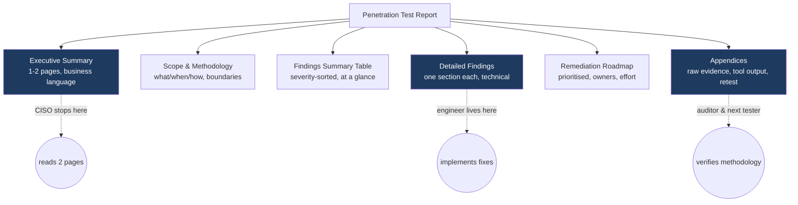
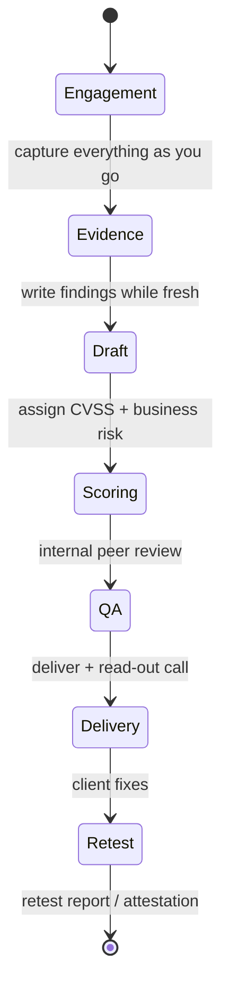
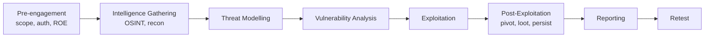
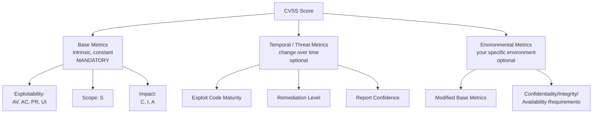
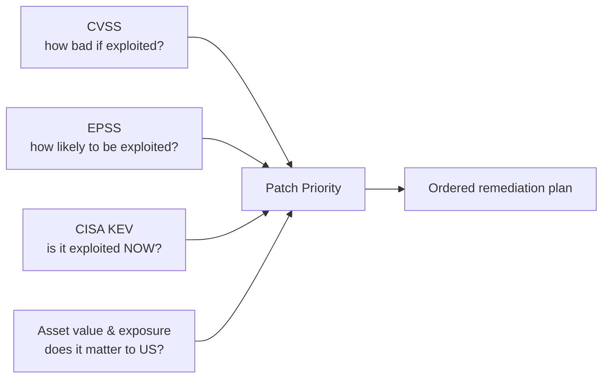
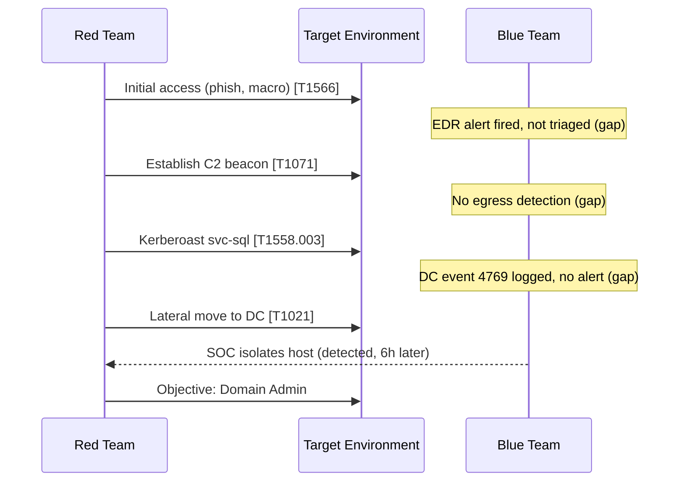
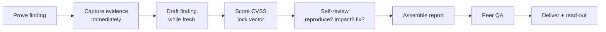

**Level:** Expert · **Track:** Penetration Testing · **Read time:** 220 min

This is Chapter 3 of the Capstone notebook — Notebook 20. The two chapters before this one did the loud, satisfying part of the job: Chapter 1 ran a full-scope internal engagement from the public internet to Domain Admin, and Chapter 2 rooted a boot-to-root box the CTF way. Both ended the moment the final flag was read. In real life that moment is roughly the halfway point. The client did not pay for you to have a shell; they paid to be told, in writing, **exactly what is wrong, how bad it is, how you proved it, and what to do about it.** That document — the report — is the actual product you ship. Everything else is raw material.

This is the chapter almost nobody teaches well, and it is the one that most reliably ends careers or makes them. A tester who finds ten serious bugs and writes them up in a way the client can't understand, can't reproduce, and can't prioritise has produced *less value* than a tester who found five bugs and wrote them up so clearly that every one got fixed. On the bug-bounty side the effect is even more direct and measurable: on HackerOne and Bugcrowd, report quality feeds straight into your reputation, your signal, your invitations to private programs, and — through severity and impact demonstration — the size of the cheque. A clear, well-scored report with a clean proof-of-concept routinely earns multiples of what the same bug earns when it's submitted as three sentences and a screenshot.

So this chapter teaches two tightly linked skills. The first is **report writing**: the structure of a professional penetration-test report, section by section, with real language you can adapt, and the discipline of writing for two audiences at once — a CISO who will read only the first page, and an engineer who will implement the fix. The second is **CVSS** — the Common Vulnerability Scoring System — which is the industry's shared language for saying "how bad is this?" in a single number and a machine-readable string. We'll build CVSS from the ground up: what each metric means, the exact vector string format, the equations behind the score, and worked examples you can reproduce by hand until the scoring stops feeling like a dark art and starts feeling like arithmetic with judgement.

Everything here is vendor-neutral and lab-scoped. The example findings are drawn from the fictional `forge-industries.com` engagement of Chapter 1 so the technical details stay concrete, but the templates and scoring rules apply to any engagement you will ever run — client work, bug bounty, or a CTF write-up you want other people to actually learn from.

---

## Part 1: Why the Report Is the Job

Let's kill the most common beginner misconception immediately. New testers think the engagement *is* the hacking, and the report is administrative overhead tacked on at the end — a tax you pay for the fun part. This is exactly backwards, and every senior person in the field will tell you the same thing.

Consider what the client actually bought. A company spends five or six figures on a penetration test not to be entertained by your cleverness but to **reduce risk they can measure and defend to their board, their auditors, their cyber-insurer, and their regulators.** The only artefact that survives the engagement and does that job is the report. Six months later, nobody remembers the elegant NTLM relay you pulled off. What exists is a PDF that an engineer opened, read, and used to close a hole — or didn't, because it was unreadable.

Here is the uncomfortable truth stated plainly: **an unfixed vulnerability you found is worth almost nothing, and whether it gets fixed depends more on your writing than on your hacking.** The report is where risk is translated into action. If the translation fails, the entire engagement failed, no matter how deep you got.

There is also a second, colder reason the report is the job: it is the **evidence of your work and the boundary of your liability.** When a tester says "we tested the authentication flow," the report's scope and methodology sections are what prove what was and was not covered. If a breach later happens through something explicitly listed as out of scope, the report protects both you and the client. If it happens through something you claimed to have tested but wrote up vaguely, that same document is what a lawyer reads back to you. Professionalism in the report is not decoration; it is risk management for your own practice.

### Who reads a pentest report — and why they conflict

A pentest report has multiple readers whose needs actively pull in opposite directions. Understanding this tension is the whole art of report writing.

| Reader | What they want | How long they'll read | What ruins it for them |
|--------|----------------|-----------------------|------------------------|
| **CISO / executive sponsor** | Overall risk posture, business impact, trend vs last test, one number they can report upward | The first 1–2 pages, maybe | Jargon, no summary, no risk rating, 40 pages of nmap output |
| **Engineering / IT ops** | Exact affected assets, reproduction steps, precise fix, references | The specific findings that touch their systems | Vague repro, no affected host list, "just patch it" with no version |
| **GRC / compliance / auditor** | Mapping to a framework (PCI-DSS, ISO 27001, SOC 2, HIPAA), evidence of methodology, retest results | Scope, methodology, findings table, appendices | Missing dates, no methodology statement, no CVSS, unsigned |
| **The next pentester** | What was tested, what was found, what changed since | Scope, methodology, prior findings | No versioning, no scope boundaries, no reproduction detail |
| **Bug-bounty triager** | Is it in scope, is it real, is it novel, what's the impact | The whole thing, fast, across dozens of reports a day | Duplicate-looking title, no PoC, inflated severity, walls of text |

The CISO wants brevity and business language. The engineer wants exhaustive technical precision. Serve only the CISO and the report can't be acted on; serve only the engineer and it never gets read by the person who signs off on fixing it. **The solution is layering** — the report is built so each reader can descend to exactly the depth they need and stop. The executive summary satisfies the CISO in one page; the findings satisfy the engineer in ten; the appendices satisfy the auditor and the next tester. This layered structure is the single most important idea in the chapter, and everything in Part 3 is an implementation of it.



> **Red-team note.** In an adversary-simulation or red-team engagement the report has an extra job the standard pentest report doesn't: it must reconstruct the **attack narrative** and map every action to a framework like MITRE ATT&CK, so the blue team can replay the campaign and check their detections. We cover that reporting style in Part 8. The core structure below still holds — you're just adding a timeline and a detection-opportunities column.

> **Bug-bounty reality.** On a bounty platform you are not writing a 40-page PDF; you're filling in a structured submission form. But the *skills* are identical and the stakes are more direct. Triagers process dozens of reports a day. A report that states the asset, the vulnerability type, a crisp reproduction, and a realistic impact — with a working PoC and a sane severity — gets triaged fast and paid well. The same bug described vaguely gets marked *Needs More Info*, sits for a week, risks being duplicated by someone faster, and often gets down-triaged on severity. Report quality is not separate from payout; on bounty it *is* the payout mechanism.

---

## Part 2: Anatomy of a Penetration Test Report

Before we write a single word, here is the whole skeleton. A professional pentest report has a stable set of sections. Different firms reorder or rename them, and a one-day web test won't have every appendix a six-week red-team has, but the spine is remarkably consistent across the industry. Learn this skeleton and you can write a report for any engagement.

| # | Section | Audience | Purpose |
|---|---------|----------|---------|
| 1 | **Cover & document control** | GRC, legal | Client, dates, classification, version, author, confidentiality marking |
| 2 | **Executive summary** | Executives | Business-level risk story, no jargon, key numbers |
| 3 | **Scope & rules of engagement** | All, legal | What was tested, what wasn't, authorisation, timing, constraints |
| 4 | **Methodology & standards** | GRC, next tester | How you tested, which frameworks (PTES, OWASP, OSSTMM, NIST) |
| 5 | **Findings summary** | All | Severity-sorted table, risk distribution, at-a-glance posture |
| 6 | **Detailed findings** | Engineers | One write-up per issue: description, evidence, impact, CVSS, remediation |
| 7 | **Remediation roadmap** | Management, ops | Prioritised, sequenced fix plan with effort and owners |
| 8 | **Strategic / root-cause observations** | CISO | Systemic themes (patch hygiene, no segmentation, weak passwords) |
| 9 | **Appendices** | Auditor, next tester | Full tool output, payloads, host lists, methodology detail, retest results |

The rest of this chapter walks each section in order, with real language, then dives deep on the CVSS scoring that lives inside section 6.



Notice where evidence collection sits: **during the engagement, not after.** The single biggest practical failure in report writing is trying to reconstruct what you did from memory a week later. The professional habit is to write findings *while you are exploiting them*, capture the screenshot the moment the payload lands, and log every command. Part 9's lab builds exactly this habit.

---

## Part 3: Section by Section — With Real Language

### 3.1 The executive summary — the only page many people read

The executive summary is the hardest page in the report to write and the most valuable. It must convey, to a busy non-technical executive, the answer to three questions: **How exposed are we? What's the worst that could happen? What should we do first?** — in plain language, on one or two pages, with zero command-line output.

Rules for a good executive summary:

- **No jargon without a plain-language gloss.** "Kerberoasting" means nothing to a CFO. "An attacker who gained a normal employee login could extract and crack service-account passwords, ultimately gaining full control of the internal network" means everything.
- **Lead with business impact, not technique.** The client cares that "customer records and the finance system were reachable," not that you used `secretsdump.py`.
- **Quantify the posture.** Give the finding counts by severity and, ideally, a single overall risk rating with a one-line justification.
- **Tell a story, not a list.** The strongest executive summaries narrate the worst realistic attack path in three or four sentences: entry point → escalation → business impact. This is what makes a board understand why "medium" issues chained together are a "critical" outcome.
- **State whether the objective was met.** "We were able to achieve full domain compromise starting from an unauthenticated position on the internet" is the sentence the sponsor will quote in their next budget meeting.

Here is a realistic executive-summary opening for the Chapter 1 engagement, written the way a good consultancy would ship it:

> **Overall risk rating: Critical.** Forge Industries engaged [Firm] to perform a full-scope internal penetration test with an external starting point between [dates]. Beginning from an unauthenticated position on the public internet — with no credentials and only the company name — our team was able to gain an initial foothold through an unmaintained web application, obtain valid employee credentials, and ultimately achieve full administrative control (Domain Admin) over the internal Windows environment within [N] days.
>
> This outcome means that an external attacker of moderate skill could realistically access every system on the internal network, including the finance systems and the file shares containing customer and HR data. The attack path did not rely on any single exotic vulnerability; it chained together several common, individually "medium" weaknesses — an outdated internet-facing application, a reused local administrator password, a service account with a weak password, and a lack of network segmentation. Each is straightforward to fix, and fixing any one of them would have broken the chain.
>
> We identified **3 Critical, 5 High, 8 Medium, and 4 Low** severity findings. The three highest-priority actions — decommissioning the legacy application, enforcing unique local administrator passwords via LAPS, and resetting and strengthening service-account credentials — are detailed in the Remediation Roadmap and would materially reduce the organisation's exposure.

That is the whole ballgame in three paragraphs. An executive reads it and knows the risk is critical, the cause is systemic-but-fixable, and what the top three actions are. Note there is not one command, one CVE number, or one tool name.

### 3.2 Scope & rules of engagement — the legal and factual boundary

This section states, factually and unambiguously, what you were authorised to test and what you actually tested. It protects everyone. It must include:

- **In-scope assets** — IP ranges, domains, URLs, applications, accounts, physical locations. Be exact: `10.10.0.0/16`, `*.forge-industries.com`, the specific web app URL.
- **Explicitly out-of-scope items** — third-party SaaS, production databases you were told not to touch, denial-of-service testing, social engineering (if excluded), specific fragile systems.
- **Type of test** — black box (no info), grey box (some credentials/docs), white box (full access and source). This dramatically affects how findings should be read.
- **Timing window** — start/end dates, any "only test during these hours" constraints, and whether testing was announced to the blue team (announced vs. unannounced changes what "we weren't detected" means).
- **Authorisation** — a statement that written permission was granted, by whom, referencing the signed authorisation/scope document. This is the "get out of jail" clause.
- **Constraints and caveats** — anything that limited coverage: a WAF was in place, an environment was unstable, testing was time-boxed. Honesty here protects you: an undiscovered bug in an area you couldn't fully test is not a failure if you documented the constraint.

> **Why this matters legally.** A penetration test is, technically, a series of computer-intrusion actions that are crimes absent authorisation. The scope and authorisation section is the documentary proof that what you did was lawful. Never test outside the written scope, and if you discover something juicy just past the boundary, *stop and ask* — then record the request and the answer. "Scope creep" is how testers end up in legal trouble.

### 3.3 Methodology & standards — how you tested

Clients and auditors need to know your testing was systematic, not a random poke. This section names the frameworks you followed and describes your phases. Common references:

- **PTES** (Penetration Testing Execution Standard) — the classic seven-phase model: pre-engagement, intelligence gathering, threat modelling, vulnerability analysis, exploitation, post-exploitation, reporting.
- **OWASP** — the Web Security Testing Guide (WSTG) for web apps, MASVS/MSTG for mobile, the API Security Top 10 for APIs.
- **OSSTMM** (Open Source Security Testing Methodology Manual) — a rigorous, metrics-driven methodology favoured in some regulated environments.
- **NIST SP 800-115** — the US government technical guide to security testing, often cited for compliance.
- **MITRE ATT&CK** — the adversary tactics/techniques knowledge base, essential for red-team and purple-team reporting (Part 8).



A methodology statement doesn't need to be long, but it should let the reader map your work to a recognised standard: *"Testing followed the PTES phases, with web-application testing aligned to the OWASP WSTG v4.2 and Active Directory testing mapped to MITRE ATT&CK. Vulnerabilities were verified by manual exploitation; automated scanner output was manually triaged to remove false positives."* That last sentence — that you removed false positives by hand — is a quality signal that separates a real pentest from a scanner dump.

### 3.4 Findings summary — the at-a-glance table

This is the single most-referenced page after the executive summary. A findings table lists every issue, sorted by severity, so any reader can see the shape of the risk in ten seconds. A good format:

| ID | Finding | Severity | CVSS | Affected assets | Status |
|----|---------|----------|------|-----------------|--------|
| FI-01 | Unauthenticated RCE in legacy web app | Critical | 9.8 | app-legacy.forge-industries.com | Open |
| FI-02 | Reused local administrator password (no LAPS) | High | 8.0 | 47 workstations | Open |
| FI-03 | Kerberoastable service account with weak password | High | 8.8 | svc-sql (DC01 realm) | Open |
| FI-04 | No network segmentation between user & server VLANs | Medium | 6.5 | Internal network | Open |
| FI-05 | Verbose error messages leak stack traces | Low | 3.1 | app-portal | Open |

Accompany the table with a small distribution chart or a one-line count ("3 Critical, 5 High, 8 Medium, 4 Low") and, if this is a repeat engagement, a comparison to the previous test ("2 of last year's 4 Criticals remain open"). That trend line is gold to a CISO.

### 3.5 Detailed findings — where the engineering happens

This is the heart of the report and the part engineers actually implement from. **Every finding gets its own self-contained write-up** with a consistent internal structure, so a reader can jump straight to FI-03 and have everything they need without hunting elsewhere. The proven structure for a single finding:

1. **Title** — specific and impact-bearing. "Unauthenticated Remote Code Execution in Legacy Reporting Application," not "Web vulnerability."
2. **Severity & CVSS** — the rating, the numeric score, and the full vector string (so it's reproducible and machine-readable).
3. **Affected assets** — exact hosts/URLs/parameters. If it's 47 machines, list them (in an appendix if long) — "some workstations" is not actionable.
4. **Description** — what the vulnerability is, in plain terms, then technical detail. Teach the reader what the bug class *is* if they might not know.
5. **Evidence / proof of concept** — the reproduction steps and captured proof: request/response, screenshot, command + output. Enough that a competent engineer can reproduce it, redacted enough to be safe to store.
6. **Impact** — what an attacker gains, in *business* terms as well as technical. Not "code execution" but "an attacker can run arbitrary commands as the web-server account, giving access to the customer database this server connects to."
7. **Likelihood / exploitability** — how hard is this to exploit, is there a public exploit, does it need authentication or a specific position?
8. **Remediation** — the specific fix, with versions and configuration. "Upgrade component X to ≥ v2.4.1" or "set `flag = true` in config." Include a strategic fix and, where relevant, an interim mitigation.
9. **References** — CVE IDs, vendor advisories, CWE, OWASP/relevant standard links.

Here is a complete, realistic detailed finding written to that structure, drawn from the Chapter 1 engagement:

---

> **FI-01 — Unauthenticated Remote Code Execution in Legacy Reporting Application**
>
> **Severity:** Critical  **CVSS 3.1:** 9.8 (`CVSS:3.1/AV:N/AC:L/PR:N/UI:N/S:U/C:H/I:H/A:H`)
>
> **Affected asset:** `https://app-legacy.forge-industries.com/` (host `203.0.113.24`), "ReportBuilder" application, version 3.2.1.
>
> **Description.** The internet-facing ReportBuilder application deserialises user-supplied input in the `template` parameter of the `/render` endpoint without validation. The underlying library (Acme SerCore ≤ 3.2.1) is vulnerable to insecure deserialisation (CVE-2024-XXXXX), allowing an unauthenticated attacker to craft a serialized object that, when processed, executes arbitrary operating-system commands on the server. Insecure deserialisation occurs when an application rebuilds ("deserialises") data received from a user back into an in-memory object without checking that the data is safe; a crafted payload can trigger code execution during that rebuild.
>
> **Evidence.** The following request returns the output of `id`, proving command execution as the `www-data` user:
>
> ```http
> POST /render HTTP/1.1
> Host: app-legacy.forge-industries.com
> Content-Type: application/x-www-form-urlencoded
> Content-Length: 218
>
> template=<base64-encoded serialized payload invoking `id`>
> ```
>
> ```http
> HTTP/1.1 200 OK
> ...
> uid=33(www-data) gid=33(www-data) groups=33(www-data)
> ```
>
> Full request/response and the payload generator command are in Appendix B. No data was exfiltrated; command execution was demonstrated with the harmless `id` command only.
>
> **Impact.** An unauthenticated attacker on the internet can execute arbitrary commands on this server. During the engagement this foothold was used to obtain a shell, harvest credentials stored in the application's configuration, and pivot to the internal network — the first link in the chain that ended in full domain compromise. The server also holds a database connection string granting read access to the customer-reporting database.
>
> **Likelihood:** High. The application is internet-facing, requires no authentication, and a working exploit path is straightforward for a moderately skilled attacker. The vulnerable library version is fingerprintable remotely.
>
> **Remediation.**
> - **Immediate:** Take `app-legacy.forge-industries.com` offline or restrict it to a trusted management network; it is described by IT as decommissioned but remains publicly reachable.
> - **Short term:** If the application must remain, upgrade Acme SerCore to ≥ 3.4.0, which removes the unsafe deserialisation path, and rotate the database credentials stored in its configuration.
> - **Strategic:** Establish an asset-decommissioning process so retired applications are removed from public DNS and the perimeter.
>
> **References:** CVE-2024-XXXXX; CWE-502 (Deserialization of Untrusted Data); OWASP WSTG-INPV-11.

---

Study what that finding does. It teaches the bug class in one sentence for a non-expert, gives a reproducible PoC that stops at harmless proof, states impact in both technical and business terms, and gives a *tiered* remediation (immediate / short / strategic) so the client can both stop the bleeding now and fix the root cause later. That tiering is a hallmark of senior report writing.

### 3.6 Remediation roadmap — turning findings into a plan

Findings tell the client what's wrong. The remediation roadmap tells them **what to do first.** A pile of 20 findings is overwhelming; a sequenced plan is actionable. Present remediation as a prioritised list that accounts for both risk reduction and effort:

| Priority | Action | Addresses | Effort | Risk reduction |
|----------|--------|-----------|--------|----------------|
| 1 | Decommission / isolate legacy ReportBuilder app | FI-01 | Low | Very high — removes the entire external entry point |
| 2 | Deploy LAPS for unique local admin passwords | FI-02 | Medium | High — breaks lateral movement |
| 3 | Reset & strengthen service-account passwords, enable AES | FI-03 | Low | High — kills Kerberoasting path |
| 4 | Segment user and server VLANs | FI-04 | High | Medium — limits blast radius |

The magic of this table is the **effort vs. risk-reduction** framing. Priority 1 is "low effort, very high risk reduction" — the client's first move is obvious and cheap. This is where you demonstrate that you understand the client operates under real constraints of time and budget, which is what turns a one-off vendor into a trusted advisor who gets re-hired.

### 3.7 Strategic observations — the root causes

Individual findings are symptoms. The strategic section names the diseases. In the Chapter 1 engagement the individual findings were an old app, a reused password, a weak service account, a flat network — but the *root causes* were: no asset lifecycle management, no privileged-access management, weak credential policy, and no segmentation. Naming these systemic themes is what elevates a report from a bug list to genuine security consulting, and it's the part a CISO uses to justify a program-level budget rather than a series of point fixes.

### 3.8 Appendices — the evidence vault

Everything too voluminous or too technical for the body goes here: full nmap output, the complete list of affected hosts, raw payloads, full request/response pairs, the tools-and-versions list, and — critically — the **retest results** when the client has remediated. Appendices are where the auditor and the next pentester live. Keeping the body clean and the appendices exhaustive is how you serve both the CISO and the engineer without compromise.

---

## Part 4: CVSS From First Principles

Now the second half of the chapter: **how do you assign that number?** Every detailed finding carried a severity and a CVSS score. If you make those numbers up, your report is subjective and indefensible. CVSS exists to make severity **consistent, transparent, and reproducible** — anyone with the same facts should arrive at roughly the same score, and the score comes with a *vector string* that shows your work.

**CVSS** stands for the **Common Vulnerability Scoring System.** It is an open standard maintained by **FIRST** (the Forum of Incident Response and Security Teams). It produces a number from **0.0 to 10.0** and a qualitative band:

| Score | Qualitative rating |
|-------|--------------------|
| 0.0 | None |
| 0.1 – 3.9 | Low |
| 4.0 – 6.9 | Medium |
| 7.0 – 8.9 | High |
| 9.0 – 10.0 | Critical |

The version you must know today is **CVSS v3.1** (the workhorse of the industry and what the NVD, most vendors, and most bounty programs still use) and **CVSS v4.0** (released November 2023, gradually being adopted, and covered in Part 6). We'll master v3.1 first because every metric in v4.0 is easier to learn once v3.1 is in your bones.

### The three metric groups

CVSS is organised into three groups. Only the first is mandatory.



- **Base metrics** describe the vulnerability's *intrinsic* qualities — the things that are true regardless of who's affected or when. This produces the score you see on the NVD. It is what you almost always report.
- **Temporal metrics** (renamed **Threat** in v4.0) adjust for the state of the world *right now* — is there a working exploit, is there a patch, how confident are we the bug is real. These can only lower or leave the base score, never raise it.
- **Environmental metrics** let *the specific organisation* re-score based on their context — how important the affected asset's confidentiality is to *them*, whether compensating controls change the exploitability. Two companies can rationally give the same bug different environmental scores.

**As a pentester, you report the base score** (with the vector), and you may adjust with environmental metrics when you know the client's context well. Let's build the base score metric by metric — this is the core skill.

---

## Part 5: CVSS v3.1 Base Metrics, In Depth

The base score is computed from eight metrics in three sub-groups: **Exploitability** (how easy is it to trigger), **Scope** (does it break out of its security boundary), and **Impact** (what happens to Confidentiality, Integrity, Availability). Each metric is a single letter with a small set of allowed values, and together they form the **vector string**, e.g. `CVSS:3.1/AV:N/AC:L/PR:N/UI:N/S:U/C:H/I:H/A:H`.

### 5.1 Attack Vector (AV) — where does the attacker have to be?

Attack Vector captures how "remote" the vulnerability is. The more remote (the larger the pool of potential attackers), the higher the score.

| Value | Meaning | Numeric weight |
|-------|---------|----------------|
| **N — Network** | Exploitable across a network (the internet); attacker needs no local access | 0.85 |
| **A — Adjacent** | Attacker must be on the same local network / broadcast domain / VPN (e.g. same LAN, Bluetooth, adjacent subnet) | 0.62 |
| **L — Local** | Attacker needs local access — a shell, a logged-in session, or to trick a local user into running something | 0.55 |
| **P — Physical** | Attacker must physically touch the device (USB, evil-maid) | 0.20 |

*Intuition:* an unauthenticated internet-facing RCE is `AV:N` — anyone on Earth can reach it. A privilege-escalation bug that needs you to already have a shell is `AV:L`. A cold-boot RAM attack is `AV:P`.

### 5.2 Attack Complexity (AC) — how much has to go right beyond the attacker's control?

| Value | Meaning | Weight |
|-------|---------|--------|
| **L — Low** | No special conditions; reliable, repeatable exploitation | 0.77 |
| **H — High** | Success depends on conditions outside the attacker's control — winning a race, defeating ASLR, a specific non-default configuration, a man-in-the-middle position they must first achieve | 0.44 |

A common beginner error: AC is **not** "how hard was it for me to write the exploit." It is "once the exploit exists, how many things outside the attacker's control must line up each time they run it." A reliable one-shot RCE is `AC:L` even if crafting it took a genius. A bug needing a memory-layout race that succeeds one time in ten is `AC:H`.

### 5.3 Privileges Required (PR) — what access does the attacker start with?

| Value | Meaning | Weight (Scope Unchanged / Changed) |
|-------|---------|-----------------------------------|
| **N — None** | No authentication or privileges needed | 0.85 / 0.85 |
| **L — Low** | Needs basic user-level privileges (a normal account) | 0.62 / 0.68 |
| **H — High** | Needs administrative/significant privileges | 0.27 / 0.50 |

Note PR is the one exploitability metric whose weight depends on Scope (below): if the vulnerability lets you *break out* of a boundary (Scope Changed), starting with some privilege is weighted slightly higher, because escaping a boundary you had legitimate limited access to is meaningful.

### 5.4 User Interaction (UI) — does a human victim have to do something?

| Value | Meaning | Weight |
|-------|---------|--------|
| **N — None** | Attacker acts alone; no victim participation | 0.85 |
| **R — Required** | A user other than the attacker must take an action (click a link, open a file, visit a page) | 0.62 |

A stored XSS that fires when any admin views a page is `UI:R` (an admin must load the page). An unauthenticated RCE the attacker triggers directly is `UI:N`.

### 5.5 Scope (S) — does the blast cross a security boundary?

Scope is the most misunderstood metric and the one that most changes the final number. A **security scope/authority** is the sphere of control a component has — an OS, a hypervisor, a sandbox, a database, an application's permission model. Scope asks: **does exploiting the vulnerable component let you affect resources beyond its own security authority?**

| Value | Meaning |
|-------|---------|
| **U — Unchanged** | The impact stays within the same security authority as the vulnerable component |
| **C — Changed** | The impact reaches resources managed by a *different* security authority |

Classic `S:C` examples: a virtual-machine escape (guest → host is crossing a boundary), a sandbox escape, an XSS in web app A that steals data from web app B on the same origin's trust, a bug in a low-privilege component that grants control over the whole OS. Classic `S:U`: an RCE that gives you code execution as the web-server user and nothing more — impact and vulnerable component share one authority.

Scope Changed **raises** the score (and, as we saw, changes PR weights). When you're unsure, ask: *did I break out of the box the vulnerable thing was supposed to stay inside?* If yes, `S:C`.

### 5.6 Impact metrics — C, I, A

The three impact metrics ask what the attacker gains, each rated None / Low / High:

| Metric | Question | H (0.56) | L (0.22) | N (0.0) |
|--------|----------|----------|----------|---------|
| **Confidentiality (C)** | Can the attacker read data they shouldn't? | Total disclosure / all data | Some limited disclosure | None |
| **Integrity (I)** | Can the attacker modify data? | Full ability to modify anything | Limited/partial modification | None |
| **Availability (A)** | Can the attacker deny service? | Total loss / shutdown | Reduced performance / intermittent | None |

For an RCE you typically get `C:H/I:H/A:H` — code execution usually means you can read everything, change everything, and crash the box. A read-only information leak of one non-sensitive field might be `C:L/I:N/A:N`. A crash-only DoS is `C:N/I:N/A:H`.

### 5.7 The vector string and the equations

Stringing the eight metrics together gives the **base vector**:

```
CVSS:3.1/AV:N/AC:L/PR:N/UI:N/S:U/C:H/I:H/A:H
```

The score is then computed by the CVSS v3.1 equations. You do not memorise these, but you should understand their shape so the number stops being magic:

```
ISS (Impact Sub-Score base) = 1 − [ (1 − C) × (1 − I) × (1 − A) ]

If Scope Unchanged:  Impact = 6.42 × ISS
If Scope Changed:    Impact = 7.52 × (ISS − 0.029) − 3.25 × (ISS − 0.02)^15

Exploitability = 8.22 × AV × AC × PR × UI

If Impact ≤ 0:       BaseScore = 0
If Scope Unchanged:  BaseScore = Roundup( min(Impact + Exploitability, 10) )
If Scope Changed:    BaseScore = Roundup( min(1.08 × (Impact + Exploitability), 10) )
```

"Roundup" here is CVSS's specific rounding — round up to one decimal place. The key intuitions from these equations:

- **Impact and Exploitability are added**, then capped at 10. A bug with huge impact but that's hard to reach won't hit 10.
- **If all three impacts are None, the whole score is 0** — no impact, no vulnerability, by definition.
- **Scope Changed multiplies by 1.08** and uses a steeper impact curve — that's the mathematical reason `S:C` bumps scores up.

### 5.8 Three worked examples — reproduce these by hand

**Example A — unauthenticated internet RCE (FI-01).**

- Reachable over the internet → `AV:N` (0.85). Reliable exploit → `AC:L` (0.77). No auth → `PR:N` (0.85). No victim action → `UI:N` (0.85). Code runs as web user, no boundary break → `S:U`. Full compromise → `C:H/I:H/A:H` (0.56 each).
- Vector: `CVSS:3.1/AV:N/AC:L/PR:N/UI:N/S:U/C:H/I:H/A:H`
- ISS = 1 − (1−0.56)³ = 1 − 0.44³ = 1 − 0.0852 = 0.9148. Impact = 6.42 × 0.9148 = 5.87. Exploitability = 8.22 × 0.85 × 0.77 × 0.85 × 0.85 = 3.89. Sum = 9.76, capped 10 → roundup **9.8, Critical.** This is the canonical "9.8" you see on countless NVD RCEs.

**Example B — Kerberoastable service account (FI-03).**

- Attacker needs a valid domain user to request the ticket → `AV:N` (domain service reachable over network), `AC:L`, `PR:L` (0.62, needs a normal account), `UI:N`. Cracking the ticket yields the service account's credentials → typically leads to reading/modifying resources; scored here as `S:U/C:H/I:H/A:H` for a high-value SQL service account.
- Vector: `CVSS:3.1/AV:N/AC:L/PR:L/UI:N/S:U/C:H/I:H/A:H`
- Exploitability = 8.22 × 0.85 × 0.77 × 0.62 × 0.85 = 2.84. Impact = 5.87 (same as A). Sum = 8.71 → roundup **8.8, High.** The only change from Example A is `PR:N`→`PR:L`, and it drops 9.8 to 8.8 — a clean demonstration of how much "needs an account" matters.

**Example C — stored XSS in an admin panel.**

- Delivered over web → `AV:N`, `AC:L`. Attacker needs a low-priv account to plant the payload → `PR:L`. An admin must view the page → `UI:R` (0.62). XSS in the browser context steals the admin's session, crossing from the attacker's authority into the admin's → `S:C`. It can read page data and act as the admin but typically not destroy the server: `C:H/I:L/A:N` is a defensible choice.
- Vector: `CVSS:3.1/AV:N/AC:L/PR:L/UI:R/S:C/C:H/I:L/A:N`
- Because `S:C`, PR:L weight becomes 0.68. Exploitability = 8.22 × 0.85 × 0.77 × 0.68 × 0.62 = 2.27. ISS = 1 − (1−0.56)(1−0.22)(1−0.0) = 1 − 0.44×0.78 = 0.657. Scope-changed Impact = 7.52 × (0.657−0.029) − 3.25 × (0.657−0.02)^15 ≈ 7.52 × 0.628 − ~0 = 4.72. Sum = 6.99, ×1.08 = 7.55 → roundup **7.6, High.** Notice `S:C` pushed an XSS into High territory.

You do not have to hand-compute in the field — you'll use the calculator (Part 7's lab) — but doing it by hand a few times is the only way to develop the *judgement* to sanity-check a calculator's output and to defend a score when a client's engineer pushes back on it. And they will push back, because severity drives their workload.

### 5.9 The judgement calls — where scoring gets contentious

Two experienced testers will sometimes score the same bug differently, and that's expected. The contested metrics are almost always **Scope**, **Attack Complexity**, and the **Impact** trio. Guidelines that keep you defensible:

- **Score the vulnerability, not the worst thing it could ever chain into.** CVSS base rates the individual flaw's intrinsic severity. The *chained* business impact belongs in your report's narrative and impact sections, not smuggled into an inflated base score. An IDOR that leaks one email address is `C:L`, even if you personally used that email to phish your way to Domain Admin — the phishing is a separate step. This discipline is what keeps your reports credible.
- **`AC:H` requires a *real*, attacker-uncontrollable condition** — a race, a MITM you must first win, a non-default config. "It took me a while to figure out" is not `AC:H`.
- **`S:C` requires an actual authority crossing**, not just "big impact." An RCE giving root is still `S:U` if root is the vulnerable component's own authority.
- **Write the vector, always.** A lone number is an opinion; a vector is a defensible argument. When a client disputes "why is this 9.8?" you point at the vector and discuss the metric they disagree with, not the number.

> **Bug-bounty note.** Many programs use CVSS (or Bugcrowd's VRT / their own severity taxonomy) to set payout tiers. Submitting a *correct, defensible* vector with your report does two things: it speeds triage, and it anchors the severity discussion in your favour on the metrics you can legitimately claim. Inflating a score — claiming `S:C` or `C:H` you can't justify — backfires: triagers see it constantly, and it erodes the trust that gets you into private programs. Score honestly and let a genuinely high vector speak.

> **Blue-team note.** Defenders *consume* CVSS to prioritise patching, but base score alone is a poor patch-priority signal. A 9.8 on an internal system with no path to it may matter less than a 7.5 on your internet-facing login page. This is exactly what **environmental metrics** and threat intelligence (is it being exploited in the wild? see CISA KEV and EPSS in Part 6) are for. Mature vulnerability-management programs combine CVSS base with asset value, exposure, and real-world exploitation data — never CVSS alone.

---

## Part 6: CVSS v4.0 — What Changed and Why

CVSS v4.0 was released by FIRST in November 2023 to fix long-standing criticisms of v3.1: too many things scored 9.8, temporal/environmental metrics were underused, and the base score was too often treated as the whole story. You will increasingly see v4.0 vectors, so you need to read them.

**Key changes:**

- **New nomenclature.** A score is now labelled by which metric groups you used: **CVSS-B** (base only), **CVSS-BT** (base + threat), **CVSS-BE** (base + environmental), **CVSS-BTE** (all). This bakes in the message that base-only is an incomplete picture.
- **"Temporal" became "Threat,"** and it slimmed to a single metric: **Exploit Maturity** (E) — Attacked / PoC / Unreported / Not Defined. The message: real-world exploitation should adjust your score.
- **User Interaction split** into `UI:N` / `UI:P` (Passive) / `UI:A` (Active) — finer grain on how much the victim must do.
- **Attack Requirements (AT)** was added alongside Attack Complexity, separating "the attacker needs to defeat a mitigation" (AC) from "the target must be in a particular state" (AT).
- **Scope was removed** and replaced by a much clearer split of impact into **Vulnerable System** impact (`VC/VI/VA`) and **Subsequent System** impact (`SC/SI/SA`). Instead of a binary "did it cross a boundary," you now score the impact on the vulnerable component *and* on things downstream, separately. This is the single biggest conceptual improvement.
- **Supplemental metrics** (Safety, Automatable, Recovery, Value Density, Response Effort, Provider Urgency) were added as *context* that doesn't change the number but informs decisions — e.g. `S:P` flags that a bug has real-world *safety* implications (think medical devices, ICS).

A v4.0 base vector looks like:

```
CVSS:4.0/AV:N/AC:L/AT:N/PR:N/UI:N/VC:H/VI:H/VA:H/SC:N/SI:N/SA:N
```

Read it the same way as v3.1: attacker position (`AV/AC/AT/PR/UI`), then impact on the vulnerable system (`VC/VI/VA`) and on subsequent systems (`SC/SI/SA`). The "subsequent system" block is where the old `S:C` idea now lives, but expressed as *actual measured impact downstream* rather than a yes/no flag.

**Which do you use?** Follow the client and the ecosystem. Many programs, scanners, and the NVD still lead with v3.1; regulated clients may mandate a specific version. When in doubt, provide the **v3.1 vector** (universally understood) and add a **v4.0 vector** if your client or program has moved. Being fluent in both is now table stakes.

### EPSS and CISA KEV — the numbers that complement CVSS

CVSS answers "how bad *could* this be?" It does **not** answer "how likely is this to actually be exploited?" Two data sources fill that gap and belong in a mature report's prioritisation:

- **EPSS (Exploit Prediction Scoring System)**, also by FIRST — a daily-updated probability (0–1) that a given CVE will be exploited in the wild in the next 30 days. A CVSS 9.8 with an EPSS of 0.02 is less urgent than a CVSS 7.5 with an EPSS of 0.9.
- **CISA KEV (Known Exploited Vulnerabilities catalog)** — a list of CVEs that are *confirmed* being exploited in the wild right now. If a finding's CVE is on KEV, that is a five-alarm signal regardless of its CVSS.

Citing EPSS and KEV alongside CVSS in your remediation roadmap is a mark of a modern, senior report — it moves the client from "patch by CVSS number" to "patch by real risk."



---

## Part 7: Tooling — Calculators, Generators, and Report Automation

You will not hand-compute CVSS in production. Learn the tools, but only after you understand the metrics (so you can catch a wrong input).

- **FIRST official calculators** — the canonical v3.1 and v4.0 calculators at `first.org`. Click the metrics, read the score and vector. This is ground truth.
- **NVD calculator** — mirrors FIRST; handy because it's alongside the CVE data.
- **`cvss` Python library** — programmatic scoring for building your own tooling:

```bash
pip install cvss
```

```python
from cvss import CVSS3

vector = "CVSS:3.1/AV:N/AC:L/PR:N/UI:N/S:U/C:H/I:H/A:H"
c = CVSS3(vector)
print(c.base_score)          # 9.8
print(c.severities())        # ('Critical', ...)
print(c.clean_vector())      # normalised vector string
```

- **Report tooling.** Firms increasingly generate reports from a findings database rather than hand-writing Word docs. Common options: **Ghostwriter** (SpecterOps, open-source, engagement + report management), **PlexTrac** and **Dradis** (commercial reporting platforms), **Serpico** and **WriteHat** (open-source templated report generators), and **Sysreptor** (modern, markdown/HTML-based, popular for OSCP-style reports). The workflow: findings live as reusable templated objects (with pre-written descriptions, CVSS vectors, and remediation), you assemble a report by selecting and customising them, and the tool renders a branded PDF. This is how a firm keeps quality consistent across dozens of testers.

> **CTF / OSCP note.** The OSCP exam and most certification exams are *reporting* exams as much as hacking exams — you can own every box and still fail if the report doesn't clearly document reproduction for each. The community-standard workflow is to take structured notes during the exam (Obsidian, CherryTree, or Sysreptor's OSCP template) with a screenshot at every proof step, then generate the report from those notes. Practising *note-to-report* discipline on CTF boxes is the single best preparation for both certs and client work. The lab below builds exactly this.

---

## Part 8: Red-Team and Blue-Team Reporting

### The red-team / adversary-simulation report

A standard pentest report is a catalogue of findings. A **red-team report** is a *narrative* — it tells the story of a simulated adversary campaign against the organisation's people, processes, and detection capability, and its primary audience is the **blue team and the CISO**, not the app owners. Its distinct sections:

- **Attack narrative / timeline** — a chronological account of the campaign: initial access, establishing C2, escalation, lateral movement, objective. Written as a story with timestamps.
- **MITRE ATT&CK mapping** — every technique used, tagged with its ATT&CK ID (e.g. T1558.003 Kerberoasting, T1021.001 RDP), so the blue team can check coverage technique by technique.
- **Detection & response analysis** — for each phase: *did the blue team see it? did they alert? did they respond? how fast?* This "detection opportunities" column is the whole point of a red-team engagement — the deliverable is a measure of the defenders, not just a bug list.
- **Assumed-breach vs. full-scope** — whether the red team started from zero or was handed a foothold (to test detection specifically), stated clearly so results are interpreted correctly.



That diagram *is* the red-team report in miniature: each step is an attacker action, an ATT&CK technique, and a defender's response (or missed opportunity). A purple-team report extends this into a joint table of technique / detection status / recommended detection improvement.

### The blue-team side — consuming reports well

The other half of reporting is *receiving* a report and turning it into action — the blue team's job. Good practice on the receiving end:

- **Triage by real risk, not raw CVSS** — combine the report's severity with your asset value, exposure, and EPSS/KEV data (Part 6).
- **Turn findings into tracked tickets** with owners and due dates; a report that doesn't become tickets doesn't get fixed.
- **Build detections from the report** — every technique the red team used undetected is a detection engineering backlog item. The report's ATT&CK mapping is a ready-made detection to-do list.
- **Demand a retest** and record the attestation — closing the loop is what turns a report into measurable risk reduction.

---

## Part 9: Hands-On Lab — From Engagement Notes to a Scored Finding

This lab builds the two core muscles: capturing evidence as you work, and turning a raw finding into a scored, written-up report entry. It's lab-scoped — run it against a machine you own (a local deliberately-vulnerable VM such as OWASP Juice Shop or a DVWA container). The point is the *workflow*, not the exploit.

### Step 1 — Set up a note-taking structure before you touch the target

The professional habit is a per-engagement folder with a fixed structure, created *before* you start:

```bash
# Create a clean engagement workspace
mkdir -p engagement-forge/{scope,evidence/screenshots,evidence/output,findings,report}
cd engagement-forge

# Record scope and authorisation FIRST -- this is the legal boundary
cat > scope/scope.md <<'EOF'
# Engagement: Forge Industries -- Internal Pentest (LAB)
- In scope: 10.10.0.0/16, *.forge-industries.com (LAB replicas only)
- Out of scope: production DBs, DoS testing, social engineering
- Type: grey box, announced
- Window: [dates]
- Authorisation: signed scope letter ref FI-2026-001
EOF
```

- `mkdir -p` — create directories, `-p` makes parent dirs as needed and doesn't error if they exist. The brace expansion `{a,b,c}` creates all listed subfolders in one command.
- The `cat > file <<'EOF' ... EOF` pattern is a *heredoc* — it writes everything up to the `EOF` marker into the file. Quoting `'EOF'` stops the shell from expanding `$variables` inside, so your text is written literally.

### Step 2 — Log every command automatically

Never rely on memory. Record your entire session so every command and its output is captured for evidence and reproduction:

```bash
# 'script' records a full terminal session (input + output) to a file with timestamps
script -a evidence/output/session-$(date +%Y%m%d-%H%M%S).log
```

- `script` — a standard Unix tool that captures everything printed to your terminal to a file. `-a` appends rather than overwriting. Everything you do until you type `exit` is logged. This log is your evidence trail and your reproduction record.
- `$(date +%Y%m%d-%H%M%S)` — command substitution: runs `date` with a format string (year-month-day-hour-min-sec) so each session log has a unique timestamped name.

### Step 3 — Capture a finding the moment you prove it

Suppose you find an insecure-deserialisation RCE (the lab equivalent of FI-01). The instant you have proof, capture it — request, response, and a screenshot — into the evidence folder, and immediately jot the raw finding while the detail is fresh:

```bash
# Save the raw proof-of-concept request/response as evidence
cat > evidence/output/FI-01-poc.txt <<'EOF'
[REQUEST]
POST /render HTTP/1.1
Host: app-legacy.forge.lab
Content-Type: application/x-www-form-urlencoded

template=<base64 serialized payload invoking id>

[RESPONSE]
HTTP/1.1 200 OK
uid=33(www-data) gid=33(www-data) groups=33(www-data)
EOF

# Draft the finding NOW, not next week
cat > findings/FI-01.md <<'EOF'
# FI-01 Unauthenticated RCE via insecure deserialization
- Asset: app-legacy.forge.lab (LAB)
- Endpoint: POST /render, param template
- Proof: returned id output as www-data (see FI-01-poc.txt)
- Impact: arbitrary command execution, unauth, internet-facing
- CVSS 3.1: TBD (score in step 4)
- Remediation: upgrade SerCore >=3.4.0; decommission legacy app
EOF
```

### Step 4 — Score it with the CVSS library and lock the vector

```bash
pip install cvss --quiet
python3 - <<'EOF'
from cvss import CVSS3
v = "CVSS:3.1/AV:N/AC:L/PR:N/UI:N/S:U/C:H/I:H/A:H"
c = CVSS3(v)
print("Vector :", c.clean_vector())
print("Score  :", c.base_score)
print("Rating :", c.severities()[0])
EOF
```

Expected output:

```
Vector : CVSS:3.1/AV:N/AC:L/PR:N/UI:N/S:U/C:H/I:H/A:H
Score  : 9.8
Rating : Critical
```

Now paste the vector and score back into `findings/FI-01.md`, replacing the `TBD`. You have gone from "I got a shell" to a scored, evidenced, reproducible finding — the actual deliverable — in four steps, capturing everything while it was fresh.

### Step 5 — Assemble and self-review

Pull the finding into the report structure and run the self-check from Rule 0 of any good methodology: *would an engineer reproduce this from what I wrote? is the impact in business terms? is the vector defensible? is the remediation specific with versions?* If any answer is "no," fix it before delivery. That self-review pass is what separates a professional report from a scanner dump.



---

## Part 10: Common Pitfalls

- **Writing the report from memory a week later.** You will forget the exact parameter, the exact command, the exact output. Capture evidence *as you exploit*, every time.
- **A findings list with no executive summary.** The most important reader never gets past page one — and page one wasn't written for them. Always lead with a business-language summary.
- **Vague reproduction.** "The login page is vulnerable to SQL injection" is not reproducible. State the URL, the parameter, the payload, and the observed result.
- **Impact stated only in technical terms.** "RCE as www-data" means nothing to a CFO. Translate every impact into what the *business* loses.
- **Inflated CVSS.** Claiming `S:C` or `C:H` you can't defend destroys your credibility with both clients and bounty triagers, who see it constantly. Score honestly; write the vector so the score is arguable on its metrics.
- **Scoring the chain, not the flaw.** CVSS base rates the individual vulnerability. Put the chained business impact in the narrative, not in an inflated base number.
- **No affected-asset list.** "Some servers" is not actionable. Enumerate hosts, URLs, and parameters — in an appendix if the list is long.
- **"Just patch it" remediation.** Give the specific version, the specific config flag, and where possible an interim mitigation. Tiered remediation (immediate / short / strategic) is the professional standard.
- **Forgetting the retest.** A report without a retest never proves the risk was actually reduced. Close the loop and record the attestation.
- **Leaking sensitive data in the report itself.** Reports contain real vulnerabilities and sometimes real captured data. Classify them, redact captured secrets, encrypt them in transit and at rest, and deliver over a secure channel. A leaked pentest report is a roadmap to breach the client.

---

## Part 11: Final Revision Recap

- **The report is the product.** The client bought risk reduction they can defend to a board; the report is the only artefact that delivers it. Your writing determines whether findings get fixed.
- **Layered structure serves conflicting readers.** Executive summary for the CISO, detailed findings for engineers, appendices for auditors and the next tester — each descends to the depth they need and stops.
- **The nine sections:** cover/control, executive summary, scope & ROE, methodology, findings summary, detailed findings, remediation roadmap, strategic observations, appendices.
- **A detailed finding** has title, severity+CVSS vector, affected assets, description (teach the bug class), evidence/PoC, impact (technical *and* business), likelihood, tiered remediation, references.
- **CVSS** is FIRST's open standard: 0–10 across None/Low/Medium/High/Critical. Base (intrinsic, mandatory), Temporal/Threat (state of the world), Environmental (your context).
- **v3.1 base = 8 metrics:** AV, AC, PR, UI (exploitability), S (scope), C, I, A (impact). Impact and Exploitability are added and capped at 10; all-None impact = 0; Scope Changed raises the score.
- **Always write the vector**, not just the number — a lone number is an opinion, a vector is a defensible argument.
- **Score the flaw, not the chain.** Keep the base score honest; put chained business impact in the narrative.
- **v4.0** replaced Scope with separate Vulnerable-System and Subsequent-System impacts, renamed Temporal to Threat (Exploit Maturity), added Attack Requirements and finer User Interaction, and introduced CVSS-B/BT/BE/BTE labelling and supplemental metrics.
- **CVSS ≠ priority.** Combine with EPSS (likelihood), CISA KEV (exploited now), and asset value/exposure for real remediation ordering.
- **Red-team reports are narratives** with an ATT&CK map and a detection-opportunities analysis; the deliverable measures the defenders.
- **Capture evidence as you go.** Note-to-report discipline (script logs, immediate screenshots, findings drafted while fresh) is the habit that makes everything above possible — and it's what OSCP and client work both actually test.

---

## Part 12: CVSS & Reporting Cheat Sheet

**CVSS v3.1 base vector:** `CVSS:3.1/AV:_/AC:_/PR:_/UI:_/S:_/C:_/I:_/A:_`

| Metric | Values | Quick rule |
|--------|--------|-----------|
| **AV** Attack Vector | N / A / L / P | Internet=N, same LAN=A, need shell=L, physical=P |
| **AC** Attack Complexity | L / H | H only for real attacker-uncontrollable conditions (race, MITM, non-default config) |
| **PR** Privileges Required | N / L / H | None=N, normal user=L, admin=H |
| **UI** User Interaction | N / R | Victim must act? R : N |
| **S** Scope | U / C | Broke out of the component's authority? C : U |
| **C/I/A** Impact | H / L / N | RCE usually H/H/H; read-only leak C:L; crash A:H |

**Score bands:** 0 None · 0.1–3.9 Low · 4.0–6.9 Medium · 7.0–8.9 High · 9.0–10.0 Critical.

**Canonical scores to memorise:**
- `AV:N/AC:L/PR:N/UI:N/S:U/C:H/I:H/A:H` → **9.8** (unauth internet RCE)
- `AV:N/AC:L/PR:L/UI:N/S:U/C:H/I:H/A:H` → **8.8** (authenticated RCE)
- `AV:N/AC:L/PR:N/UI:N/S:U/C:H/I:N/A:N` → **7.5** (unauth info disclosure)
- `AV:N/AC:L/PR:L/UI:R/S:C/C:H/I:L/A:N` → **7.6** (stored XSS stealing admin session)
- `AV:L/AC:L/PR:L/UI:N/S:U/C:H/I:H/A:H` → **7.8** (local privesc to root)

**CVSS v4.0 base vector:** `CVSS:4.0/AV:_/AC:_/AT:_/PR:_/UI:_/VC:_/VI:_/VA:_/SC:_/SI:_/SA:_` — impact split into Vulnerable System (VC/VI/VA) and Subsequent System (SC/SI/SA); no Scope; UI is N/P/A; Threat = Exploit Maturity (E).

**Report section spine:** Cover → Exec Summary → Scope & ROE → Methodology → Findings Summary → Detailed Findings → Remediation Roadmap → Strategic Observations → Appendices.

**Detailed-finding template:** Title · Severity+CVSS vector · Affected assets · Description (teach the class) · Evidence/PoC · Impact (tech + business) · Likelihood · Remediation (immediate/short/strategic) · References.

**Prioritise with:** CVSS (how bad) + EPSS (how likely) + CISA KEV (exploited now?) + asset value/exposure.

**`cvss` one-liner:** `python3 -c "from cvss import CVSS3; c=CVSS3('CVSS:3.1/AV:N/AC:L/PR:N/UI:N/S:U/C:H/I:H/A:H'); print(c.base_score, c.severities()[0])"`

---

## Part 13: Practice Labs & Resources

Train the two skills of this chapter — scoring and writing — with resources that exercise exactly those muscles:

- **FIRST CVSS v3.1 and v4.0 calculators** (`first.org/cvss/calculator/`) — the ground-truth tools. Score ten CVEs from the NVD blind, then check against the NVD's own vector. Do it until your vectors match consistently.
- **NVD (`nvd.nist.gov`)** — pick recent high-profile CVEs, read the description, score them yourself, and compare to the assigned CVSS. Great for calibrating judgement on Scope and Impact.
- **EPSS (`first.org/epss`) and CISA KEV (`cisa.gov/known-exploited-vulnerabilities-catalog`)** — cross-reference a handful of CVEs across CVSS, EPSS, and KEV to feel how "severity" and "real-world risk" diverge.
- **TryHackMe** — the *"Nessus"*, *"Security Operations"*, and reporting-focused rooms; and any room that ends with "write up your findings." THM's own methodology rooms cover PTES/OWASP framing.
- **PortSwigger Web Security Academy** — solve labs (SQLi, XSS, access-control, deserialization), then *write each one up* as a formal finding with a CVSS vector as if reporting to a client. The Academy gives you the bug; you supply the report.
- **HackTheBox / HTB Academy** — the "Documentation & Reporting" and "Penetration Testing Process" modules teach the report explicitly; every HTB Pro Lab and the CPTS/CBBH exams are *reporting* exams — you must deliver a professional report to pass.
- **OSCP / PNPT preparation** — practise the full note-to-report pipeline on retired boxes using **Sysreptor's OSCP template** or an Obsidian vault. The exam is failed on reports as often as on boxes; rehearse the deliverable, not just the exploit.
- **Public disclosed reports** — read highly-rated **HackerOne Hacktivity** and **Bugcrowd** disclosures. Study *how the top hunters write* — the crisp repro, the impact framing, the sane severity. Reverse-engineer why a report earned a big bounty.
- **Ghostwriter / Sysreptor / WriteHat** — stand up an open-source reporting platform locally and generate a report from templated findings, to feel how firms keep quality consistent at scale.

The fastest way to get good at this is a simple loop: **hack a lab box, then write the finding as if a paying client will read it, score it with a vector you can defend, and have someone (or your future self a week later) try to reproduce it from your words alone.** If they can, you're writing professional reports. That loop — not the exploit itself — is the skill this chapter exists to build, and it's the one that turns "I got a shell" into a career.

---

*Also on [Praneeth's portfolio](https://ping-praneeth.vercel.app/notebook/pentest-capstone/03-professional-pentest-report-writing-and-cvss-scoring), with comments and the latest edits.*
