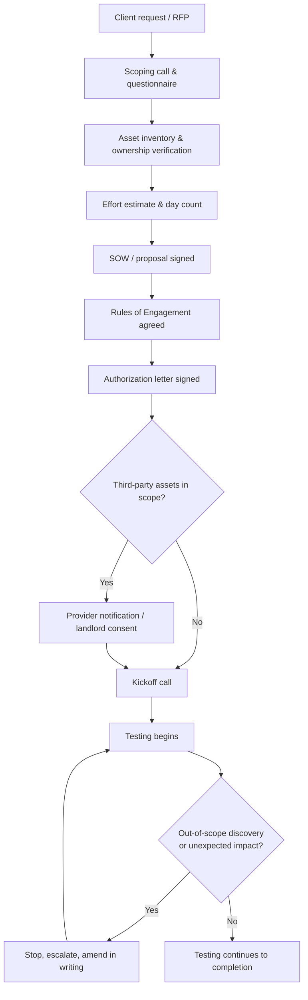
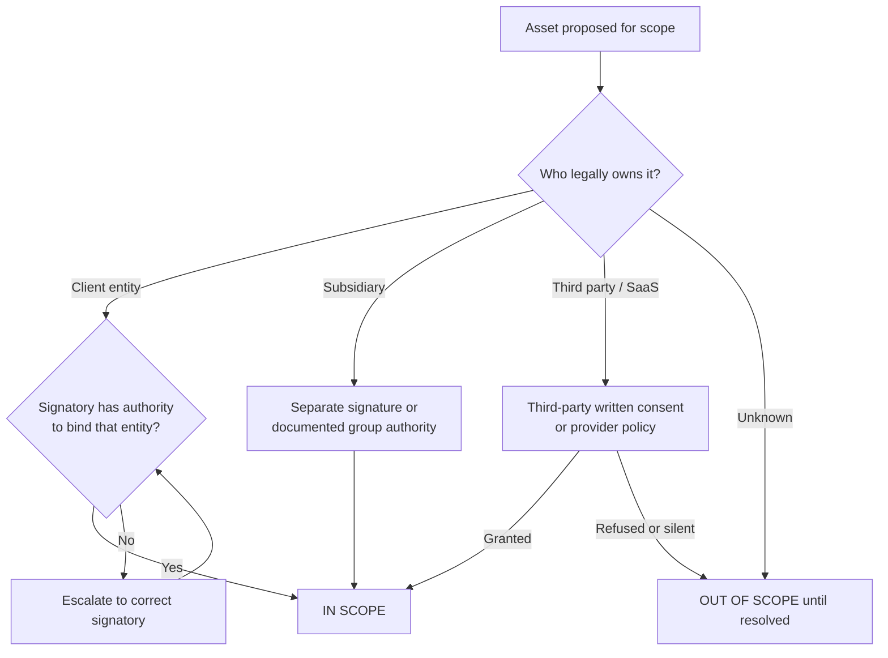
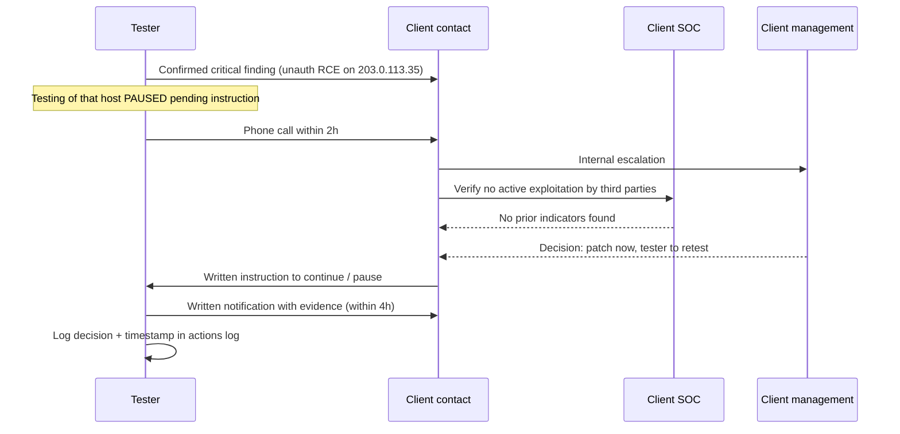
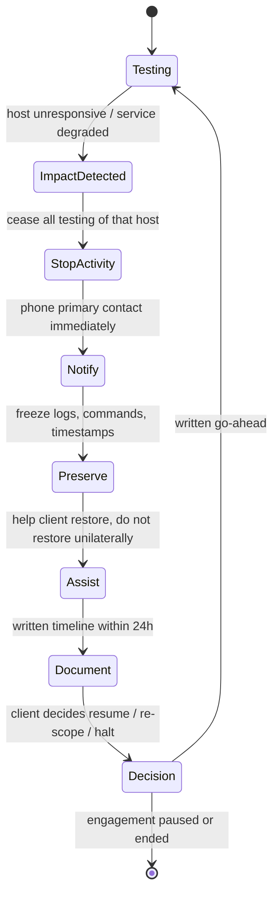

This is Chapter 2 of the Penetration Testing series. Chapter 1 laid out the engagement lifecycle end to end and gave pre-engagement a single section. This chapter takes that one section and expands it into the whole thing, because pre-engagement is where most engagements are actually won or lost — long before a single packet leaves your interface.

There is a temptation to treat scoping as administrative overhead performed by someone in a suit while the "real" tester waits for a green light. That view survives exactly one bad engagement. Scope is what tells you which of the 4,000 hosts in a `/20` you are allowed to touch. Rules of engagement are what tell you whether you may run `hydra` against the VPN portal at 3 a.m. on a Tuesday, and what happens when you knock the ERP server over. The authorization letter is the single piece of paper that distinguishes your `nmap` from a crime. And ethics is what governs the enormous number of decisions the paperwork never anticipated — which is most of them.

The Security Foundations notebook already covered the statutes themselves — CFAA, the Computer Misuse Act, IT Act §66, and the authorization principle in the abstract. This chapter assumes that grounding and goes operational: how a real scoping call runs, how vague client language becomes a defensible target list, how effort becomes a day count and a price, how the RoE document is actually written clause by clause, and what you do at 2 a.m. when you have just found a live cardholder database on a host that is not in scope.

---

## Part 1: What Pre-Engagement Actually Buys You

Pre-engagement produces four things. Everything else in this chapter is a technique for producing one of them well.

1. **Legal cover.** Written authorization from someone with the authority to grant it, covering specific assets, for a specific window, naming the specific people who will act under it. Without this, your testing is unauthorized access regardless of how good your intentions were.
2. **A bounded universe.** A finite, enumerable list of what you may test. This is what stops you from spending three days on a subsidiary that was acquired last month and is contractually owned by a different legal entity.
3. **An operational contract.** The rules — timing, techniques, thresholds, escalation paths, contacts — that govern behaviour during the test. This is what keeps a finding from becoming an incident.
4. **A realistic plan.** An effort estimate that matches the target count, so the test is deep enough to be meaningful and short enough to be affordable.

Miss any one and the engagement degrades predictably:

| Missing artifact | Failure mode you will actually see |
|---|---|
| Legal cover | Client's legal team pauses the test mid-engagement; worst case, law enforcement involvement |
| Bounded universe | You test a host belonging to a third party; their SOC opens an incident against your source IP |
| Operational contract | You trigger an outage during business hours and nobody knows who to call |
| Realistic plan | 900 hosts scoped for 5 days; you deliver a port scan with a report cover on it |

> **Memory hook:** *Authorization says you may. Scope says where. RoE says how. The estimate says how deeply.* Four different documents, four different failures.

The rest of this chapter walks these in the order a real engagement produces them.



---

## Part 2: The Scoping Call — How to Run One

Almost every engagement starts with a client saying something like: *"We'd like a pentest of our infrastructure."* That sentence contains no testable information. The scoping call is a structured interview that converts it into something you can put in a contract.

Run it as a call, not an email thread. Email produces underspecified answers because the client answers only what you literally asked. A 45-minute call surfaces the things they did not know were relevant — the legacy Citrix box, the acquisition that closed last quarter, the fact that "our website" is actually a Shopify store they do not control.

### The structure of the call

**Opening (5 min) — establish the goal, not the technique.** Ask *why now*. The answer sorts the engagement into one of a handful of drivers, and the driver dictates almost everything else:

| Driver | What it implies for scope |
|---|---|
| Compliance deadline (PCI DSS, SOC 2, ISO 27001, HIPAA) | Scope is dictated by the standard's boundary — e.g. PCI DSS 11.4 requires internal and external testing of the CDE plus segmentation validation. Deviating from the standard's definition makes the report useless to the auditor. |
| Customer/vendor security questionnaire | Client needs a clean, shareable executive summary. Scope may be narrower than you'd choose; retest and attestation letter matter. |
| Pre-launch of a new product | Scope is one application plus its API and infrastructure. Staging environment likely. Deep, narrow. |
| Post-incident assurance | Client wants to know if the attacker's path is closed. Scope follows the incident's blast radius. Expect emotional stakeholders and tight NDAs. |
| Board or insurer requirement | Often broad and shallow. Push for a defined objective or it becomes a vulnerability scan with extra steps. |
| Genuine security maturity | The best kind. You can propose the right scope. Push for goal-based objectives. |

**Asset discovery (20 min) — enumerate, do not accept summaries.** This is the bulk of the call. Never accept "about 50 servers". Ask for the actual list, and ask the questions that produce it:

- What external IP ranges do you own? Who is the registrar and the ASN holder?
- What domains and subdomains? Including marketing microsites, campaign domains, and anything a third-party agency stood up?
- Which of those are hosted by you, and which by a SaaS or hosting provider?
- What cloud accounts exist? AWS account IDs, Azure tenant/subscription IDs, GCP project IDs.
- Internal ranges? How many VLANs, how many live hosts (ask them to run a count, do not guess)?
- Wireless SSIDs? Physical sites?
- Any mobile apps? Native, hybrid, which stores?
- Which authentication systems — AD on-prem, Entra ID, Okta, custom?
- Any of the above operated by a third party, or shared with another tenant?

**Constraints (10 min).** Testing windows, change freezes, blackout periods, fragile systems, systems you must never touch, whether the blue team will be informed, whether an IPS is in blocking mode, whether they want it left in blocking mode.

**Logistics (10 min).** Contacts, escalation path, how credentials will be provisioned, how you will access internal networks (jump box, VPN, shipped device, cloud-hosted implant), reporting format, timeline, retest expectations.

> **Practitioner's note:** the most valuable question in the whole call is *"What would be the worst thing an attacker could do to you?"* It is the fastest route to a goal-based objective, and it converts a shapeless "test everything" into "prove whether an external attacker can reach the payments database". A goal makes every later prioritisation decision obvious.

### The scoping questionnaire

Send a written questionnaire before the call and use the call to fill the gaps. A workable minimum set of fields:

```text
ORGANISATION
  Legal entity name (must match the entity that will sign):
  Primary technical contact (name/email/phone/timezone):
  Authorising signatory (name/title — must have authority to bind):

ENGAGEMENT
  Driver (compliance / pre-launch / assurance / post-incident / other):
  Specific standard & clause, if compliance-driven:
  Stated objective(s) in one sentence each:
  Desired start date / hard deadline:

EXTERNAL SCOPE
  Owned IPv4 ranges (CIDR) and ownership evidence (RIR / ASN):
  IPv6 ranges:
  In-scope domains (exact, with wildcard yes/no):
  Explicitly EXCLUDED hosts/domains:
  Third-party-hosted assets and provider names:

INTERNAL SCOPE
  Internal CIDR ranges:
  Approximate live host count (measured, not estimated):
  AD forest/domain names, DC count:
  Access method for tester (VPN / jump box / shipped appliance / on-site):

APPLICATIONS
  App name / URL / auth type / roles required / API present (Y/N):
  Test vs production environment; is test data representative?
  Approx. count of distinct authenticated roles:
  Approx. count of dynamic endpoints or API routes:

CONSTRAINTS
  Permitted testing window(s) and timezone:
  Change freeze / blackout dates:
  Fragile or legacy systems (name them):
  Prohibited techniques (DoS, social engineering, physical, etc.):
  Is the SOC/blue team aware? Should they be?
  Are WAF/IPS in blocking mode? Should tester IPs be allow-listed?

DATA
  Will production data be present? Any regulated data (PCI/PHI/PII)?
  Data handling requirements, retention limits, jurisdiction constraints:
```

That questionnaire is the raw material for everything that follows.

---

## Part 3: From Client Language to a Defensible Asset Inventory

Clients describe assets in business terms. Contracts and scans need technical identifiers. Translating between them is the core scoping skill, and it is where errors are most expensive.

### The translation table

| What the client says | What you must actually resolve it to | The trap |
|---|---|---|
| "Our website" | Specific FQDNs + the IPs they resolve to at test time + whether a CDN sits in front | Testing the CDN edge (Cloudflare, Akamai, Fastly) instead of the origin — you are attacking the CDN provider, not the client |
| "Our office network" | Specific internal CIDRs, VLAN IDs, and a live-host count | Guest WiFi and OT/SCADA VLANs sharing the range |
| "Our AWS" | Account IDs, regions, and the specific resource ARNs or VPC CIDRs | Shared-responsibility limits; managed services you may not test |
| "Everything in this /16" | The subset that is actually allocated and live | Unallocated space that a provider has since reassigned to someone else |
| "Our email" | Whether it is on-prem Exchange, Exchange Online, or Google Workspace | Testing Microsoft's or Google's infrastructure |
| "The app" | Base URL(s), API base paths, auth flow, roles, and whether staging mirrors prod | The mobile app talking to an entirely separate API host nobody mentioned |
| "Our whole estate" | Nothing. Push back until it is a list. | Silent inclusion of a recently acquired subsidiary under a different legal entity |

### Verifying ownership before you accept an asset

Do not take "we own it" at face value — verify independently and keep the evidence in the engagement folder. This takes minutes and has saved many testers from testing someone else's infrastructure.

For an IP range, check the regional internet registry record:

```bash
whois -h whois.arin.net 203.0.113.0/24
```

```text
NetRange:       203.0.113.0 - 203.0.113.255
CIDR:           203.0.113.0/24
NetName:        ACME-CORP-EXT
NetHandle:      NET-203-0-113-0-1
Parent:         NET203 (NET-203-0-0-0-0)
NetType:        Direct Allocation
OriginAS:       AS64512
Organization:   Acme Corporation (ACME-42)
RegDate:        2016-03-14
Updated:        2023-08-02
```

The fields that matter:

- **`NetType: Direct Allocation`** — the organisation holds the block directly from the RIR. `Reassigned` or `Reallocated` means it is a sub-block handed down by an ISP, and the ISP may also need to consent.
- **`Organization`** — must match the legal entity signing your authorization. "Acme Corporation" signing for a block registered to "Acme Holdings Ltd" is a question you ask *before* testing, not after.
- **`OriginAS`** — the autonomous system announcing the block. Useful for finding sibling ranges the client forgot.

For a domain:

```bash
whois acme-corp.example | grep -Ei 'registrant|registrar|creation|name server'
```

```text
Registrar:                     MarkMonitor Inc.
Registrant Organization:       Acme Corporation
Creation Date:                 2004-11-08T00:00:00Z
Name Server:                   NS1.ACME-CORP.EXAMPLE
Name Server:                   NS2.ACME-CORP.EXAMPLE
```

Privacy-protected registrations are common and are not disqualifying — but then you need a written confirmation of ownership from the client, ideally alongside a DNS TXT record they can add on request:

```bash
dig +short TXT _pentest-auth.acme-corp.example
```

```text
"engagement-2024-ACME-EXT verified"
```

That TXT-record trick is a cheap, strong ownership proof: only someone with control of the zone can create it.

**Where does the traffic actually land?** Resolve every in-scope hostname and check whether the answer is the client or a CDN:

```bash
for h in www.acme-corp.example api.acme-corp.example shop.acme-corp.example; do
  ip=$(dig +short "$h" | tail -1)
  org=$(whois "$ip" 2>/dev/null | grep -iE '^(OrgName|org-name|descr):' | head -1)
  printf '%-30s %-16s %s\n' "$h" "$ip" "$org"
done
```

```text
www.acme-corp.example          203.0.113.20     OrgName:        Acme Corporation
api.acme-corp.example          203.0.113.35     OrgName:        Acme Corporation
shop.acme-corp.example         104.21.44.19     OrgName:        Cloudflare, Inc.
```

`shop.` resolves into Cloudflare space. Attacking that IP is attacking Cloudflare. Either the client provides the origin IP and you test that with the hostname forced via `--resolve`, or `shop.` comes out of scope. This single check has kept more testers out of trouble than any other.

**Red team relevance:** the same ownership-verification workflow is the first half of red-team target development. The difference is intent — here you are proving what you may touch, not mapping what you could.

### Live-host counting, not guessing

Client host counts are consistently wrong, usually low. Ask them to produce a real count from their own asset inventory, DHCP leases, or a ping sweep. If they cannot, price a short *scoping discovery* as a separate paid activity — a couple of hours of authorized, non-intrusive discovery whose only output is the count that sizes the real engagement. Never absorb that risk silently into a fixed-price test.

---

## Part 4: Sizing the Engagement — Turning Assets Into Days

An engagement that is scoped too small produces a shallow report; too large and the client will not buy it. Sizing is a professional judgement, but it is not arbitrary. Reason from throughput.

### Rules of thumb (calibrate to your own delivery data)

| Test type | Rough throughput per tester-day | Notes |
|---|---|---|
| External network | 40–80 live hosts | Faster if homogeneous; slower with many web services on odd ports |
| Internal network | 25–50 live hosts | Dominated by AD analysis, not host count, once a domain is present |
| Active Directory (assumed-breach) | 3–5 days minimum regardless of host count | Forest size matters more than host count |
| Web application | 1 day per ~15–25 dynamic endpoints, ×1.3 per extra auth role | Authenticated multi-role apps grow superlinearly |
| API | 1 day per ~25–40 documented endpoints | A good OpenAPI spec roughly halves this |
| Mobile app | 3–5 days per platform | Plus the backing API, which is a separate line item |
| Cloud configuration review | 2–4 days per account/subscription | Scales with service count, not instance count |
| Segmentation validation (PCI) | 0.5–1 day per segment pair | Mechanical but must be exhaustive |

Then add fixed overheads that people routinely forget: **0.5–1 day setup and kickoff**, **1–2 days reporting**, **0.5 day QA/peer review**, **0.5 day retest** later. A "5-day test" with no reporting allowance is a 3-day test with a rushed report.

### A worked estimate

Client scope: one `/24` external range with 34 live hosts, one customer web app with three authenticated roles and roughly 60 dynamic endpoints, and its REST API with 45 documented endpoints.

```text
External network   34 hosts / 60 per day                 = 0.6 d  -> round to 1.0 d
Web app            60 endpoints / 20 per day = 3.0 d
                   x1.3 for role 2, x1.3 for role 3      = 5.1 d  -> 5.0 d
API                45 endpoints / 35 per day             = 1.3 d  -> 1.5 d
                                                          --------
Testing subtotal                                            7.5 d
Setup / kickoff                                             0.5 d
Reporting                                                   1.5 d
QA / peer review                                            0.5 d
                                                          --------
TOTAL PROPOSED                                             10.0 d
Retest (separate line item, ~30 days later)                 0.5 d
```

Present the arithmetic to the client. It reframes the negotiation from "your price is high" to "which of these do you want to reduce?" — and if they cut days, the reduction lands on a named component, in writing, so the report can honestly state what received limited coverage.

> **The single most useful clause you can add:** *"Scope reductions agreed during the engagement will be recorded as coverage limitations in the report."* Clients who know a cut becomes visible to their auditor make better decisions.

---

## Part 5: The Paperwork Stack

Several documents, each doing a distinct job. Testers routinely conflate them, which is how you end up with an SOW that everyone treats as authorization.

| Document | Purpose | Signed by | Timing |
|---|---|---|---|
| **NDA / MNDA** | Confidentiality both ways; lets the client tell you about their weaknesses safely | Both legal entities | Before the scoping call, ideally |
| **MSA** (Master Services Agreement) | Commercial framework: liability caps, insurance, IP ownership, payment, indemnity, governing law | Legal/commercial | Once, covering many engagements |
| **SOW** (Statement of Work) | This specific engagement: scope, deliverables, dates, price, assumptions | Commercial + technical | Per engagement |
| **RoE** (Rules of Engagement) | Operational rules during testing: windows, techniques, thresholds, contacts, escalation | Technical owners on both sides | After SOW, before kickoff |
| **Authorization letter** | The explicit permission to perform otherwise-unlawful acts against named assets in a named window | Someone with authority to bind the asset owner | Before the first packet |
| **Third-party consent** | Permission from a hosting provider, landlord, or shared-tenant owner | The third party | Before touching their asset |

The distinction that matters most: **an SOW is a commercial document; an authorization letter is a legal permission.** A signed SOW says the client agreed to pay for a test. It is *evidence of* authorization but it is a poor substitute for a document that says, in plain language, "we authorise these named individuals to conduct security testing against these named assets between these dates."

### Where the authority actually lives

The signature must come from someone who can bind the owner of the asset. This is a surprisingly frequent failure:

- A **CISO or IT Director** can normally authorise testing of systems their organisation owns and operates.
- A **product manager** usually cannot authorise infrastructure testing.
- **Nobody at the client** can authorise testing of an asset the client does not control — a SaaS platform, a partner's API, a shared hosting server, a landlord's building network.
- In a **holding-company structure**, the entity that signs must own or control the subsidiary's assets, or the subsidiary signs separately.
- After an **acquisition**, the acquired entity's assets may still legally sit with the seller until closing formalities complete. Ask explicitly.



---

## Part 6: Writing the Rules of Engagement, Clause by Clause

The RoE is the operational contract. Below is a full annotated skeleton. Everything in it exists because somebody once had a bad day without it.

### 6.1 Parties, assets and identity

```text
1. PARTIES
   Client:  Acme Corporation (company no. 01234567), 1 Example Way.
   Tester:  <Testing firm>, acting through the named individuals below.

2. AUTHORISED PERSONNEL
   Only the following individuals are authorised to perform testing:
     - A. Tester   (passport/ID ref on file)
     - B. Tester   (passport/ID ref on file)
   Substitutions require written approval from the Client contact in section 5.

3. SOURCE ADDRESSES
   All testing traffic will originate from:
     198.51.100.10, 198.51.100.11        (external testing)
     10.90.0.0/24                        (internal, assigned by Client)
   The Tester will notify the Client in writing before using any other source.
```

Naming individuals matters: authorization is granted to *people*, not to a company abstractly, and a defensible engagement can show exactly who was permitted to act. Declaring source addresses matters even more — it is what lets the blue team, weeks later, separate your traffic from a real intruder's.

### 6.2 Scope, stated twice

```text
4. SCOPE
4.1 IN SCOPE
    External:  203.0.113.0/24  (34 live hosts, list at Appendix A)
               www.acme-corp.example, api.acme-corp.example
    Internal:  10.10.20.0/24, 10.10.30.0/24
    AD:        corp.acme-corp.example  (single domain, 2 DCs)
    App:       https://portal.acme-corp.example  (roles: viewer, editor, admin)

4.2 EXPLICITLY OUT OF SCOPE
    - shop.acme-corp.example  (hosted by Shopify; Client does not control)
    - 10.10.99.0/24           (OT / building-management VLAN)
    - 203.0.113.200-203.0.113.210 (legacy payment gateway, frozen pending decom)
    - Any host not enumerated in Appendix A, even if within an in-scope CIDR
    - Any Microsoft 365 / Entra ID tenant infrastructure beyond Client-owned
      configuration (i.e. no testing of Microsoft-operated services)
```

Always write the exclusions explicitly, and always add the catch-all "anything not enumerated is out of scope, even within an in-scope range". Ranges drift; DHCP hands an in-scope address to an out-of-scope device; a new VM appears mid-test. The catch-all resolves those ambiguities in the safe direction.

### 6.3 Timing

```text
5. TESTING WINDOW
   Start:  <date> 09:00 IST      End: <date> 18:00 IST
   Permitted hours:
     - Non-intrusive testing:  any time within the window
     - Intrusive testing (exploitation, brute force, config change):
         Mon-Thu 20:00-05:00 IST only
   Blackout: month-end financial close, <dates>, no testing of 10.10.30.0/24
```

Split the window by intrusiveness. "Business hours only" sounds safe but pushes exploitation into the period of maximum blast radius; "out of hours only" sounds safe but means nobody is awake when something breaks. The compromise most clients land on is enumeration any time, exploitation in a defined window with a named person reachable.

### 6.4 Permitted and prohibited techniques

This is the heart of the document.

| Technique | Typical default | Why it needs an explicit decision |
|---|---|---|
| Port/service scanning | Permitted | Rate limits may still be required for fragile devices |
| Vulnerability scanning (authenticated/unauthenticated) | Permitted | Some plugins are intrusive; agree on safe-checks-only if needed |
| Manual exploitation of identified vulns | Permitted with conditions | Define the stopping point — proof of access vs. full compromise |
| Password spraying | Permitted with limits | Must specify attempts-per-account-per-window to avoid lockouts |
| Brute force against a login | Often restricted | Account lockout = self-inflicted DoS on real users |
| Denial of service / stress testing | Almost always prohibited | Separate engagement, separate risk profile |
| Social engineering (phishing, vishing) | Separate authorization | Involves employees as subjects; HR, works-council and privacy law implications |
| Physical intrusion | Separate authorization | Needs a signed physical-authorization card carried on the person |
| Wireless attacks | Explicit only | Deauth affects neighbouring tenants; jamming is illegal in many jurisdictions |
| Modifying data | Restricted | Define whether writes are permitted, and require rollback evidence |
| Exfiltrating data as proof | Tightly restricted | Minimum-sufficient-proof rule (Part 10) |
| Persistence / implants | Explicit only | Requires a documented removal plan and an inventory |
| Pivoting into out-of-scope networks | Prohibited | Even when technically trivial from a compromised host |
| Using third-party/public exploit code | Permitted with review | Must be reviewed for destructive payloads before use |
| Testing production vs staging | Must be stated | "Staging" that shares a database with prod is prod |

Sample clause text:

```text
6. PERMITTED TECHNIQUES
6.1 The Tester may perform network discovery, service enumeration,
    vulnerability identification, manual verification and exploitation of
    identified vulnerabilities within the scope defined in section 4.
6.2 Password spraying is permitted at a maximum of 2 attempts per account
    per 60 minutes, against a maximum of 3 distinct passwords per 24 hours.
    The Client confirms the lockout threshold is 5 attempts / 15 minutes.
6.3 Exploitation shall proceed to the minimum extent necessary to demonstrate
    impact. Where a proof of concept is sufficient, full exploitation will
    not be performed.

7. PROHIBITED TECHNIQUES
7.1 Denial-of-service, resource-exhaustion and stress testing.
7.2 Social engineering of Client personnel by any channel.
7.3 Physical access attempts at any Client site.
7.4 Modification or deletion of production data, except as permitted in 7.5.
7.5 Where demonstrating impact requires a write, the Tester will create a
    clearly-marked benign artefact (prefix "PT-<engagement-ref>-"), record it
    in the actions log, and remove it before the end of the engagement.
7.6 Any attack that would leave the Client materially less secure at the end
    of the engagement than at the start.
```

Clause 7.6 is the general principle behind all the specific ones, and it is worth including as a catch-all because it covers the technique nobody thought to name.

### 6.5 Thresholds and stop conditions

```text
8. STOP CONDITIONS
   The Tester will immediately cease testing of the affected system and
   notify the Client contact by phone if any of the following occur:
   a) A system becomes unresponsive or degraded as a result of testing.
   b) Evidence of a pre-existing compromise by a third party is discovered.
   c) Data of a class not anticipated in section 9 is encountered
      (e.g. cardholder data, health records, credentials for third parties).
   d) The Tester obtains access to a system outside the scope in section 4.
   e) The Client issues a stop instruction by any channel in section 5.
```

Item (b) deserves emphasis. Finding someone else already inside is not rare, and the moment you find it you are no longer doing a penetration test — you are standing in the middle of somebody's incident. Stop, preserve, phone. Do not "investigate a bit more first"; you will destroy timeline evidence and you have no authority to conduct an investigation.

### 6.6 Communication and escalation

```text
9. COMMUNICATION
   Daily status:    written summary by 09:00 IST each testing day.
   Routine queries: shared Slack channel #acme-pentest-2024.
   CRITICAL findings: phone the Client primary contact within 2 hours of
   confirmation, followed by written notification within 4 hours.
   Escalation chain (in order):
     1. J. Smith, Head of IT       +91-xxxxx-xxxxx  (24h)
     2. R. Patel, CISO             +91-xxxxx-xxxxx  (24h)
     3. Acme NOC duty phone        +91-xxxxx-xxxxx  (24/7)
   The Tester's out-of-hours contact: +91-xxxxx-xxxxx
```

Two rules learned the hard way: the escalation chain must contain at least one number that is answered at 3 a.m., and it must be tested during the kickoff call. A phone number nobody has ever dialled is not an escalation path, it is a decoration.



### 6.7 Data handling

```text
10. DATA HANDLING
10.1 The Tester will collect the minimum data necessary to evidence findings.
10.2 Where records must be evidenced, the Tester will capture a row count and
     a redacted sample of no more than 5 records, with identifiers masked.
10.3 All engagement data will be stored encrypted at rest (LUKS/FileVault +
     per-engagement encrypted container), within <jurisdiction>.
10.4 Credentials discovered will be recorded in the report as masked values
     and shared in full only via the Client's chosen secure channel.
10.5 All engagement data will be securely destroyed 90 days after report
     acceptance, and a certificate of destruction issued on request.
```

### 6.8 Deconfliction

```text
11. DECONFLICTION
    The Client confirms that no other security testing is scheduled in the
    engagement window. If the Client's SOC observes activity it believes may
    be the Tester, it may request confirmation via the channel in section 9;
    the Tester will confirm or deny within 30 minutes during the window.
```

Deconfliction is what makes a covert-ish test survivable for the blue team. Without it, every alert is a potential real intrusion and the SOC burns days chasing you — or worse, learns to ignore alerts.

---

## Part 7: The Authorization Letter

Short, plain, and separate from the commercial paperwork. Carry it. Print it if you will be on-site.

```text
                       AUTHORIZATION TO CONDUCT SECURITY TESTING

Acme Corporation ("the Company"), a company registered in <jurisdiction> under
number 01234567, hereby authorises <Testing Firm> ("the Tester"), acting
through the named individuals listed below, to conduct security testing
against the systems identified below, during the period stated below.

AUTHORISED INDIVIDUALS
  A. Tester   (ID ref: ____________)
  B. Tester   (ID ref: ____________)

AUTHORISED SYSTEMS
  203.0.113.0/24 (external range owned by the Company)
  www.acme-corp.example, api.acme-corp.example, portal.acme-corp.example
  10.10.20.0/24 and 10.10.30.0/24 (internal ranges)
  Active Directory domain corp.acme-corp.example

AUTHORISED PERIOD
  From <date> 09:00 IST to <date> 18:00 IST inclusive.

SCOPE OF AUTHORISATION
  The Company confirms that it owns or otherwise controls the systems listed
  above and has the authority to grant this authorisation. The Tester is
  authorised to perform acts which, absent this authorisation, might
  constitute unauthorised access to computer material, including network
  scanning, vulnerability identification, and exploitation of identified
  vulnerabilities, strictly within the systems and period stated, and subject
  to the Rules of Engagement dated <date>.

  This authorisation does not extend to any system not listed above.

CONTACT FOR VERIFICATION
  J. Smith, Head of IT, +91-xxxxx-xxxxx, jsmith@acme-corp.example
  Available 24 hours during the authorised period to verify this letter.

Signed for and on behalf of Acme Corporation:

  Name:  ____________________   Title: ____________________
  Signature: ________________   Date:  ____________________
```

Three properties make this letter work: it names **individuals**, it names **specific systems and a specific period**, and it gives a **24-hour verification contact**. A letter with no verification contact is nearly useless in the scenario it exists for — being challenged at 2 a.m. by a security guard or a police officer who has no reason to believe a PDF on your laptop.

> **Carry rule for on-site work:** printed authorization letter, a copy of the RoE, photo ID, and the verification contact's number written on paper — not only in the phone that a guard may ask you to hand over.

---

## Part 8: Third-Party, Cloud and Shared-Tenancy Constraints

The client can only authorise what the client controls. Everything else needs a second conversation.

### Cloud providers

The major providers all permit customer-initiated penetration testing of the customer's own resources without prior approval, within published limits — but the limits are the point:

| Provider posture | Generally permitted | Generally requires approval or is prohibited |
|---|---|---|
| Testing your own instances/VMs/functions and the apps on them | Yes | — |
| Configuration/IAM review of your own account | Yes | — |
| DoS / DDoS / stress testing | No | Separate simulated-DDoS programme, if offered |
| Testing the provider's managed control plane, hypervisor, or shared services | No | Prohibited outright |
| Testing other tenants' resources | No | Prohibited outright |
| Testing a managed service you do not own the underlying host for (e.g. managed DB engine internals) | Partially | Read the provider's current policy per service |
| Phishing provider employees | No | Prohibited outright |

Because these policies change, the correct scoping behaviour is: **read the provider's current penetration testing policy at scoping time, record the date you read it and the relevant clauses in the engagement folder, and reflect the limits in the RoE.** Do not rely on remembered rules.

For any *managed hosting* or *shared hosting* provider that is not one of the hyperscalers, assume you need written consent, because your traffic will traverse and potentially affect shared infrastructure. The client requests it; you keep a copy.

### SaaS and partner APIs

If the client's app authenticates against Okta, processes payments through Stripe, or calls a partner's API, those systems belong to someone else. In-scope is the client's *integration* — how they store tokens, how they validate webhooks, whether their redirect URIs are loose. Out-of-scope is the provider's platform. Write that distinction into the RoE explicitly, because it is genuinely easy to slide across during testing:

```text
4.3 INTEGRATION BOUNDARY
    Testing of the Client's integration with third-party services (identity,
    payments, messaging) is in scope insofar as it targets Client-controlled
    configuration, credentials, redirect URIs, webhook validation and token
    handling. Testing of the third-party platforms themselves is out of scope.
```

**Bug bounty relevance:** the same boundary governs most programme scopes. A misconfigured OAuth redirect URI on the target's own domain is in scope; probing the identity provider's login flow generally is not. Reports that cross that line are closed as out-of-scope and occasionally get researchers banned.

### Landlords, co-location and shared offices

Wireless and physical testing in a shared building affects neighbours. Deauthentication frames do not respect tenancy boundaries, and a rogue-AP exercise in a co-working space is very likely to touch other companies' devices. If the client does not own the building or the RF environment, either get the landlord's written consent or exclude wireless.

---

## Part 9: Hands-On Lab — From a One-Paragraph Request to a Signed Scope

This lab is the chapter's core exercise. Work it end to end; the artifacts you produce are directly reusable.

### The input

You receive this email:

```text
From: rpatel@acme-corp.example
Subject: Pen test request

Hi — we need a penetration test before our SOC 2 audit in six weeks. Please
test our external infrastructure and our customer portal. We also have an
internal network we'd like looked at if budget allows. Can you send a quote?
Rahul
```

That is the entire brief. Four things are undefined: what "external infrastructure" is, what the portal actually consists of, whether internal is in or out, and who can sign.

### Step 1 — Non-intrusive, publicly available context

Before the call, gather public information so you can ask sharper questions. **Everything here is passive and uses only public records — no packets to client infrastructure beyond ordinary DNS resolution.** Treat even this conservatively: some firms wait for a signed NDA first.

```bash
# 1. Who announces their address space?
whois -h whois.radb.net -- '-i origin AS64512' | grep -E '^route:' | sort -u
```

```text
route:      203.0.113.0/24
route:      198.51.100.0/24
```

Two ranges, not one. The client mentioned none.

```bash
# 2. Certificate transparency: what hostnames exist publicly?
curl -s 'https://crt.sh/?q=%25.acme-corp.example&output=json' \
  | jq -r '.[].name_value' | tr '\n' '\n' | sed 's/^\*\.//' | sort -u | head -20
```

```text
acme-corp.example
api.acme-corp.example
autodiscover.acme-corp.example
careers.acme-corp.example
dev-portal.acme-corp.example
mail.acme-corp.example
portal.acme-corp.example
shop.acme-corp.example
staging-portal.acme-corp.example
vpn.acme-corp.example
www.acme-corp.example
```

Flags for the call: `dev-portal` and `staging-portal` (in or out?), `shop` (Shopify?), `autodiscover`/`mail` (Microsoft 365?), `careers` (third-party ATS?).

Command notes: `crt.sh` is the public Certificate Transparency log search; `output=json` returns machine-readable results; `jq -r '.[].name_value'` extracts the SAN entries; `sed 's/^\*\.//'` strips wildcard prefixes so `*.acme-corp.example` collapses into the base domain.

```bash
# 3. Where does each name actually land, and who owns that IP?
for h in www api portal shop mail careers vpn; do
  fqdn="$h.acme-corp.example"
  ip=$(dig +short "$fqdn" | grep -E '^[0-9.]+$' | tail -1)
  [ -z "$ip" ] && { printf '%-32s %s\n' "$fqdn" "(no A record / CNAME only)"; continue; }
  org=$(whois "$ip" 2>/dev/null | grep -iE '^(OrgName|org-name|descr):' | head -1 | cut -d: -f2- | xargs)
  printf '%-32s %-16s %s\n' "$fqdn" "$ip" "$org"
done
```

```text
www.acme-corp.example            203.0.113.20     Acme Corporation
api.acme-corp.example            203.0.113.35     Acme Corporation
portal.acme-corp.example         203.0.113.40     Acme Corporation
shop.acme-corp.example           23.227.38.65     Shopify Inc.
mail.acme-corp.example           (no A record / CNAME only)
careers.acme-corp.example        104.18.22.7      Cloudflare, Inc.
vpn.acme-corp.example            198.51.100.5     Acme Corporation
```

Now the questions write themselves: `shop` is Shopify (out), `careers` sits behind Cloudflare (probably a third-party ATS — out, or origin needed), `mail` is a CNAME (almost certainly Microsoft 365 — the tenant configuration may be in scope, Microsoft's service is not), and `vpn` is on the **second** range the client never mentioned.

### Step 2 — The scoping call, condensed

Key answers obtained:

```text
- Driver: SOC 2 Type II audit. Auditor expects external + application testing.
  Internal is "nice to have" -> becomes an optional line item.
- Signatory: Rahul Patel is Head of Engineering; the CTO signs contracts.
  ACTION: authorisation letter must be signed by the CTO.
- 203.0.113.0/24: 31 live hosts (they ran a count).
- 198.51.100.0/24: VPN + DR site, 6 live hosts. Client forgot it existed.
- shop.: Shopify. OUT.
- careers.: Greenhouse-hosted. OUT.
- mail./autodiscover.: Microsoft 365. Tenant *configuration* review IN
  (conditional access, legacy auth, external sharing); Microsoft services OUT.
- portal.: the customer app. 3 roles (viewer, editor, admin), ~55 dynamic
  endpoints, REST API with an OpenAPI spec (~40 endpoints).
- staging-portal.: shares the production database. Treated as production;
  testing to be done against production with agreed write restrictions.
- dev-portal.: developer sandbox, isolated, no real data. IN, unrestricted.
- Internal: 10.10.20.0/24 (workstations, ~140 hosts), 10.10.30.0/24 (servers,
  ~40 hosts), 10.10.99.0/24 (building management). Single AD domain, 2 DCs.
- 10.10.99.0/24 -> HARD EXCLUDE (BMS controls the datacentre cooling).
- Constraints: no DoS, no social engineering, no physical. WAF in blocking
  mode on portal.; client wants it LEFT ON but will allow-list tester IPs for
  a two-day "WAF-off equivalent" window so both views are covered.
- Blackout: audit fieldwork week.
```

### Step 3 — The asset inventory (Appendix A)

```text
ID    ASSET                                   TYPE       IN/OUT  NOTES
E-01  203.0.113.0/24 (31 live, list attached) ext net    IN      client-owned, ARIN verified
E-02  198.51.100.0/24 (6 live)                ext net    IN      VPN + DR
E-03  www.acme-corp.example                   web        IN      marketing, static
E-04  api.acme-corp.example                   API        IN      40 endpoints, spec provided
E-05  portal.acme-corp.example                web app    IN      3 roles, ~55 endpoints
E-06  dev-portal.acme-corp.example            web app    IN      sandbox, no real data
E-07  staging-portal.acme-corp.example        web app    OUT     shares prod DB; test prod instead
E-08  vpn.acme-corp.example                   appliance  IN      within E-02
E-09  shop.acme-corp.example                  SaaS       OUT     Shopify-controlled
E-10  careers.acme-corp.example               SaaS       OUT     Greenhouse-controlled
E-11  M365 tenant (config only)               cloud      IN*     config review only; MS services OUT
I-01  10.10.20.0/24 (~140 hosts)              int net    OPT     optional line item
I-02  10.10.30.0/24 (~40 hosts)               int net    OPT     optional line item
I-03  corp.acme-corp.example AD domain        AD         OPT     with I-01/I-02
I-04  10.10.99.0/24 BMS                       OT         OUT     HARD EXCLUDE - datacentre cooling
```

### Step 4 — Sizing

```text
CORE (proposed)
  E-01 + E-02 external:  37 hosts / 60 per day             = 0.7 -> 1.0 d
  E-04 API:              40 endpoints / 35 per day         = 1.1 -> 1.5 d
  E-05 portal:           55 / 20 = 2.75 d, x1.3 x1.3       = 4.6 -> 4.5 d
  E-06 dev-portal:       shares codebase, delta review     = 0.5 d
  E-03 www:              static, folded into external      = 0.0 d
  E-11 M365 config:                                        = 1.0 d
                                                            -------
  Testing                                                     8.5 d
  Setup / kickoff                                             0.5 d
  Reporting                                                   1.5 d
  QA                                                          0.5 d
                                                            -------
  CORE TOTAL                                                 11.0 d

OPTIONAL (internal, assumed-breach from a domain-joined workstation)
  I-01 + I-02:  180 hosts, but AD-dominated                   4.0 d
  Additional reporting                                        0.5 d
                                                            -------
  OPTIONAL TOTAL                                              4.5 d

RETEST (30 days post-report, in-scope findings only)           0.5 d
```

### Step 5 — Verification before the first packet

A pre-flight checklist, run on the morning of day one:

```bash
#!/usr/bin/env bash
# preflight.sh - verify scope is live, owned and matches the signed appendix
set -euo pipefail
SCOPE_FILE="appendix-a-hosts.txt"   # one IP or FQDN per line, from the signed RoE

echo "[*] Preflight for engagement ACME-EXT"
echo "[*] Scope entries: $(grep -cve '^\s*$' "$SCOPE_FILE")"

while read -r entry; do
  [ -z "$entry" ] && continue
  if [[ "$entry" =~ ^[0-9.]+$ ]]; then ip="$entry"; else ip=$(dig +short "$entry" | tail -1); fi
  owner=$(whois "$ip" 2>/dev/null | grep -iE '^(OrgName|org-name|descr):' | head -1 | cut -d: -f2- | xargs)
  case "$owner" in
    *Acme*) status="OK" ;;
    "")     status="UNKNOWN-OWNER  <-- CHECK" ;;
    *)      status="THIRD PARTY: $owner  <-- STOP" ;;
  esac
  printf '%-34s %-16s %s\n' "$entry" "${ip:-unresolved}" "$status"
done < "$SCOPE_FILE"
```

```text
[*] Preflight for engagement ACME-EXT
[*] Scope entries: 37
203.0.113.20                       203.0.113.20     OK
203.0.113.35                       203.0.113.35     OK
portal.acme-corp.example           203.0.113.40     OK
198.51.100.5                       198.51.100.5     OK
203.0.113.77                       203.0.113.77     THIRD PARTY: Example Cloud Ltd  <-- STOP
```

That last line is exactly why the script exists. `203.0.113.77` was in the signed range, but the whois for that specific address shows a reassignment to a hosting provider — the client sub-let part of their block. Testing stops for that host, an email goes to the client contact, and the RoE is amended in writing before it is touched, if ever.

**Blue team usage:** the same script, run by a defender against their own published ranges, finds shadow IT and stale reassignments. Scoping tools and asset-management tools are the same tools pointed in different directions.

### Step 6 — The scope diff, mid-engagement

Scope is not static. On day three you resolve the in-scope wildcard and find a host that was not in Appendix A:

```bash
diff <(sort appendix-a-hosts.txt) <(sort discovered-live-hosts.txt)
```

```text
> 203.0.113.91
```

Correct action: **do not test it.** Log it, notify the client, ask whether it should be added, and only proceed on written confirmation. The wrong action — "it's inside the /24 they signed, so it's fine" — is exactly the reasoning that gets testers into third-party systems, because the catch-all clause in the RoE says enumerated hosts only.

---

## Part 10: Out-of-Scope Discoveries, Impact and the Bad-Day Playbook

Three situations recur, and each has a correct sequence.

### 10.1 You caused an outage



The two errors people make are (a) trying to fix it themselves — you will contaminate the client's own recovery and may make it worse on a system you do not understand, and (b) waiting to see if it comes back before telling anyone. A 10-minute delay turns a professional incident into a concealment. Phone first, diagnose second.

Your actions log makes this survivable. If you can produce the exact command, the exact timestamp, and the response, the conversation is about a fragile service. If you cannot, the conversation is about your competence.

### 10.2 You found data you were not supposed to see

Cardholder data, health records, employee salary files, another customer's tenant data, or credentials for a third-party service. Sequence:

1. **Stop accessing it immediately.** Do not enumerate further to "understand the scale". Note the count if it is visible without further access.
2. **Do not download it.** Not to prove severity, not to check whether it is real.
3. **Capture the minimum evidence** — a redacted screenshot showing the vulnerability, not the data. Mask everything identifying.
4. **Notify** through the critical-finding path. Regulated data may start a statutory breach clock for the client, which is their decision to make and their obligation to meet — but only if you tell them promptly.
5. **Record** what you saw, when, and what you did, in the actions log.
6. If it is credentials for a *third party*, do not test them. Ever. Working credentials for someone else's system are not authorized by your client, and using them is unauthorized access to that third party.

### 10.3 You found someone else already inside

Webshells with timestamps predating your engagement, unfamiliar scheduled tasks, C2 beaconing, unexplained accounts, log gaps. This is the highest-stakes moment in pre-engagement planning, which is why it is a named stop condition in Part 6.

1. **Stop.** You are now inside an active incident.
2. **Do not touch anything further.** No cleanup, no killing processes, no deleting a webshell "to help". You will destroy evidence and may tip off the intruder.
3. **Phone** — not email, phone — the escalation chain, and go up it until a human answers.
4. **Preserve** your own evidence: exactly what you found, where, when, and how you found it.
5. **Hand over** to the client's IR process. Your engagement is likely suspended. Whether you assist with IR is a new, separately-scoped conversation with different paperwork.

> **Why the RoE has to name this in advance:** in the moment, the pressure to "just check one more thing" is enormous. The clause exists so that the decision was made calmly, weeks earlier, by both parties.

---

## Part 11: Scope Creep and How to Refuse It Gracefully

Mid-engagement, someone will ask for "just a quick look" at something outside scope. Sometimes it is the client's own engineer being helpful. It is still a change to a signed document.

Common forms and the correct response:

| Ask | Why it is a problem | Response |
|---|---|---|
| "While you're in there, can you check the HR system too?" | Not in the authorization letter; possibly a different data class | "Happy to — I'll need it added in writing and we'll agree the extra time." |
| "Can you also test our subsidiary's site?" | Different legal entity; signatory may lack authority | Requires separate or extended authorization from the entity that owns it |
| "Can you go a bit further and get domain admin?" | May exceed the agreed exploitation depth and blast radius | Written amendment to the RoE technique clause |
| "Can you skip the report and just tell us verbally?" | Removes the deliverable and your evidence trail | Decline; the report is the product |
| "Can you re-test the fixes now, for free?" | Consumes the estimate reserved for the primary test | Retest is a line item; do it after remediation, once |
| "Can you not mention that finding? It's being fixed." | Report integrity; the auditor will rely on this | Findings are reported as found; remediation status is noted separately |

A written amendment does not need to be elaborate:

```text
RoE AMENDMENT 01 - engagement ACME-EXT
Date: <date>
Change: Add 203.0.113.91 (hostname: reports.acme-corp.example) to Appendix A.
Ownership confirmed by: R. Patel, <date>, email thread ref #4471.
Effort impact: +0.5 tester-day; revised total 11.5 days.
Approved: ____________________  (CTO, Acme Corporation)
```

Then attach every amendment to the report. It is part of the audit trail of what was actually tested.

---

## Part 12: Bug Bounty and VDP — A Different Authorization Model

Everything so far describes bilateral authorization: two parties negotiate and sign. Bug bounty programmes and vulnerability disclosure programmes are *unilateral* — the organisation publishes a standing offer, and you accept it by acting within its terms. The difference has practical consequences.

| Dimension | Penetration test | Bug bounty / VDP |
|---|---|---|
| Authorization | Bilateral, negotiated, signed, time-boxed | Unilateral policy; you accept by compliance |
| Scope | Agreed asset list, often includes internal | Published list; usually external only |
| Techniques | Negotiated; exploitation depth agreed | Policy-defined; usually "minimum proof" only |
| Timing | Fixed window | Open-ended |
| Payment | Fixed fee for effort | Per accepted finding; may be zero (VDP) |
| Deliverable | Full report | Per-finding submissions |
| Legal protection | Contract + authorization letter | Safe harbour clause, *if present* |
| Recourse if disputed | Contract | Programme's discretion |

### Reading a programme policy properly

Before submitting — indeed before testing — read for these specific things:

1. **Scope list, exactly.** Wildcards (`*.example.com`) usually exclude anything explicitly listed as out-of-scope; check both lists.
2. **Prohibited techniques.** Nearly all prohibit automated scanning at volume, DoS, social engineering, physical access, and testing against other users' accounts. Many prohibit testing production data.
3. **The safe harbour clause.** Look for language committing not to pursue legal action for good-faith research within policy. Its absence is meaningful: without it, you are relying entirely on goodwill.
4. **Account requirements.** Many programmes require you to register test accounts with a specific email pattern (`researcher+bugbounty@…`) so their team can distinguish research from abuse.
5. **Disclosure terms.** Whether you may publish, when, and whether you need approval.
6. **Data rule.** Almost universally: prove access, do not extract. Retrieving one record to prove an IDOR is defensible; dumping the table is not, and has ended careers.

**CTF and lab contrast:** on HackTheBox, TryHackMe, PortSwigger's Web Security Academy or pwn.college, the authorization is implicit and total *within that lab*. That is precisely why they are the right place to practise dangerous techniques — and why habits learned there (dump everything, brute force freely, pivot anywhere) must be consciously unlearned before touching a real programme.

> **The one-line test before submitting anything:** *"If the programme owner read my full activity log, would every action be defensible under their published policy?"* If not, you did not have authorization for that action, whatever the outcome.

---

## Part 13: Ethics Beyond the Law

Legal and ethical are different sets. Plenty of things are legal under a signed contract and still wrong; a few are technically ambiguous and clearly right. Professional judgement covers the enormous space the paperwork does not.

### Minimum sufficient proof

The single most useful ethical principle in offensive security: **collect the least evidence that unambiguously demonstrates the finding, and no more.**

| Finding | Sufficient proof | Excessive |
|---|---|---|
| SQL injection | `version()` output plus a table row count | Dumping the users table |
| IDOR on user records | One other record, with fields redacted | Iterating IDs 1–100000 |
| RCE | `id`/`whoami` output plus hostname | Installing a persistent implant |
| Exposed backup file | HTTP 200, `Content-Length`, first bytes of the header | Downloading the 4 GB archive |
| Weak credentials | Successful auth screenshot, password masked | Logging in as ten more users to "confirm" |
| Cloud key leak | Non-mutating identity call (e.g. caller identity) | Enumerating and listing every bucket |

Minimum sufficient proof protects the client's data, reduces your own liability, keeps you inside almost any policy, and produces a cleaner report. It is the rare rule that is simultaneously the ethical, legal and professional optimum.

### Handling what you learn about people

You will read employees' emails, see their salaries, find their personal photos on a file share, discover someone's side business on a corporate laptop, and occasionally find genuine wrongdoing. The default is simple: **information encountered incidentally is confidential and irrelevant to the report unless it evidences a security finding.** Do not gossip about it, do not use it in a demo, do not put a real employee's name in a screenshot when a redaction would do.

Genuine wrongdoing (evidence of crime, safety risk, or ongoing compromise) is escalated through the agreed contact — and if the agreed contact is plausibly implicated, that is exactly why an escalation chain with more than one name exists.

### Report integrity

The report is a professional opinion others will rely on — auditors, insurers, boards, customers.

- Do not inflate severity to justify the fee. Do not deflate it to keep a client comfortable.
- State coverage limitations honestly: what you could not test, what was excluded, what ran out of time. A report that hides a limitation is worse than no report, because it manufactures false assurance.
- Do not present a scanner's unverified output as a confirmed finding. If you did not verify it, label it unverified.
- Do not reuse another client's data, findings, or screenshots — ever, even anonymised.

### Skills discipline

The techniques in this notebook are dual-use by construction. Two habits keep that manageable: never run an offensive technique against a system you cannot name the authorization for, and never let convenience erode that rule ("it's just a port scan", "it's my old employer", "they'd want to know"). Unauthorized testing performed with good intentions is still unauthorized, and the people who lose careers over it almost always meant well.

---

## Part 14: Detection & Defense Angle

Flip the chapter around: how does a defender handle an authorized test well, and how do they tell yours apart from a real intrusion?

### Before the test

- **Record the tester's source IPs and the window** in the SIEM as a tagged watchlist, not as a suppression rule. You want the alerts to fire and be *labelled*, not silenced — otherwise you lose the chance to measure your own detection.
- **Decide the awareness model deliberately.** Fully informed SOC measures control effectiveness; uninformed SOC measures detection and response. Both are valid; pick one on purpose and write it in the RoE.
- **Baseline first.** Capture normal traffic volumes for in-scope services so post-test attribution is possible.
- **Verify the tester independently.** If someone calls claiming to be the tester, call back on the number in the RoE — not the number they give you. Testers get impersonated, and a "penetration tester" asking for credentials by phone is one of the oldest social-engineering pretexts there is.

### During the test

A defensible detection strategy is to alert normally and *enrich* with an engagement tag. In Splunk-style SPL:

```text
index=firewall earliest=-24h
| eval engagement=if(cidrmatch("198.51.100.10/31", src_ip), "PENTEST-ACME-EXT", "unknown")
| stats count dc(dest_ip) as unique_dests dc(dest_port) as unique_ports
        values(engagement) as engagement by src_ip
| where unique_dests > 50 OR unique_ports > 100
| sort - count
```

```text
src_ip           count    unique_dests  unique_ports  engagement
198.51.100.10    284,113  37            65,535        PENTEST-ACME-EXT
198.51.100.11    91,442   37            1,024         PENTEST-ACME-EXT
45.83.x.x        12,904   2,048         22            unknown          <-- INVESTIGATE
```

The third row is the point of the whole exercise. During an authorized test the SOC is at its most distracted, and that is exactly when unrelated activity gets waved through as "probably the pentesters". Tagging rather than suppressing is what keeps that from happening.

An equivalent Sigma-style rule shape for host telemetry:

```yaml
title: Authorized Test Activity - Enrichment Tag
status: experimental
description: Tags process/auth events originating from engagement source hosts
logsource:
  category: authentication
detection:
  selection:
    src_ip:
      - '198.51.100.10'
      - '198.51.100.11'
  condition: selection
fields:
  - src_ip
  - user
  - dest_host
  - event_id
falsepositives:
  - None; this rule is an enrichment tag, not an alert
level: informational
```

### After the test

- **Measure detection honestly.** For each finding in the report, ask: did we alert? Did anyone see the alert? Did anyone act? The gap between "alert generated" and "action taken" is usually the real finding.
- **Compare the tester's actions log to your telemetry.** Every action the tester logged that produced no telemetry at all is a visibility gap — arguably the most valuable output of the entire engagement, and it is only available because the RoE required a timestamped actions log.
- **Remove the watchlist** and confirm allow-listed tester IPs have been de-listed from the WAF. Leftover allow-list entries for a tester's old IP have themselves become findings on later engagements.
- **Verify artifact cleanup.** Cross-check the tester's artifact inventory — accounts created, files written, implants placed — against your own systems. Do not assume; verify.

**IR use case:** keep the engagement's RoE, source-IP list and actions log for at least as long as your log retention. When an alert from that window resurfaces in a later investigation, being able to attribute it in thirty seconds instead of three days is worth the filing.

---

## Part 15: Common Pitfalls

- **Treating the SOW as authorization.** It is commercial agreement, not permission. Get the letter.
- **Accepting a CIDR without checking allocation.** Blocks get sub-let and reassigned. Verify each live host's ownership.
- **Testing the CDN instead of the origin.** Resolve every hostname and check who owns the answer.
- **Forgetting IPv6.** A client who gives you `203.0.113.0/24` may also have IPv6 space with a much weaker perimeter, because nobody firewalled it. Ask explicitly; put it in or out in writing.
- **Assuming "staging" is safe.** Staging that shares a database or an identity provider with production *is* production.
- **Password spraying without knowing the lockout policy.** You will lock out the workforce and turn a test into an outage.
- **No named out-of-hours contact.** Guaranteed to hurt exactly once.
- **Silent scope reduction.** If the client cuts days, name the coverage limitation in the report.
- **Letting the client's engineer verbally expand scope.** Verbal is not written; get the amendment.
- **Leaving artifacts behind.** Test accounts, uploaded webshells, added SSH keys, scheduled tasks. Inventory them as you create them, and remove them at the end — an implant you forgot is a backdoor you installed.
- **Downloading data to prove severity.** Minimum sufficient proof. Always.
- **Not testing the escalation phone number** at kickoff.
- **Letting the authorization window lapse.** If the test overruns, extend the window in writing *before* the original end date, not after.
- **Ignoring works-council/employee-representation rules** for social engineering in jurisdictions that require consultation. Employees are data subjects, not targets.

---

## Part 16: Final Revision — The Chapter in Compressed Form

- Pre-engagement produces four artifacts: **legal cover, a bounded universe, an operational contract, and a realistic plan.** Each has its own failure mode.
- The **scoping call** converts business language into technical identifiers. Ask *why now* to find the driver; ask *what's the worst an attacker could do* to find the objective.
- **Verify ownership independently** — RIR whois for ranges, registrar whois plus a DNS TXT challenge for domains, and a resolve-then-whois pass to catch CDN and SaaS hosting.
- **Size from throughput**, add setup/reporting/QA overhead, and show the client the arithmetic so cuts land on named components.
- The paperwork stack is **NDA → MSA → SOW → RoE → authorization letter (+ third-party consent)**. The SOW is commercial; the letter is permission.
- Authorization must come from **someone with authority over the asset**. Nobody at the client can authorise testing of something the client does not control.
- The **RoE** names individuals, source IPs, in-scope and out-of-scope assets (with a catch-all that unenumerated hosts are out), testing windows split by intrusiveness, permitted and prohibited techniques with concrete limits, stop conditions, escalation with a 24-hour number, data handling, and deconfliction.
- The **authorization letter** names individuals, systems, dates, and a 24-hour verification contact. Carry it printed on site.
- **Cloud and SaaS**: your integration is in scope, their platform is not. Read the provider's current testing policy at scoping time and record it.
- **Stop conditions** are pre-decided for a reason: outage, prior compromise, unexpected data class, out-of-scope access, client stop instruction.
- **Prior compromise = stop, preserve, phone.** You are in someone's incident, not a test.
- **Scope creep** is handled with short written amendments attached to the report, never verbally.
- **Bug bounty** is unilateral authorization: the policy is the contract, safe harbour is the protection, and minimum proof is the rule.
- **Minimum sufficient proof** is the ethical, legal and professional optimum simultaneously.
- Defenders should **tag, not suppress**, tester traffic; the real value of an authorized test is the delta between what the tester did and what the telemetry saw.

---

## Part 17: Cheat Sheet / Quick Reference

### Ownership verification

```bash
whois -h whois.arin.net 203.0.113.0/24              # RIR record for a range (ARIN)
whois -h whois.ripe.net 203.0.113.0/24              # RIPE region
whois -h whois.radb.net -- '-i origin AS64512'      # all routes announced by an ASN
whois acme-corp.example                             # domain registrant
dig +short TXT _pentest-auth.acme-corp.example      # zone-control ownership proof
dig +short acme-corp.example                        # where does it actually resolve
curl -s 'https://crt.sh/?q=%25.acme-corp.example&output=json' | jq -r '.[].name_value' | sort -u
```

### Resolve-and-attribute one-liner

```bash
for h in $(cat hosts.txt); do
  ip=$(dig +short "$h" | tail -1)
  printf '%-34s %-16s %s\n' "$h" "$ip" \
    "$(whois "$ip" 2>/dev/null | grep -iE '^(OrgName|org-name|descr):' | head -1)"
done
```

### Sizing quick reference

| Component | Days |
|---|---|
| External network | live hosts ÷ 60 |
| Internal network | live hosts ÷ 35 (AD-dominated once a domain exists) |
| Active Directory | 3–5 minimum |
| Web app | endpoints ÷ 20, ×1.3 per additional role |
| API | endpoints ÷ 35 (÷ 2 with a good spec) |
| Mobile | 3–5 per platform, + API separately |
| Cloud config | 2–4 per account |
| **Overheads** | setup 0.5, reporting 1.5, QA 0.5, retest 0.5 |

### RoE section checklist

```text
[ ] 1  Parties (exact legal entities)
[ ] 2  Named authorised individuals
[ ] 3  Declared source IP addresses
[ ] 4  Scope: in, out, and "unenumerated = out" catch-all
[ ] 5  Testing window, split by intrusiveness; blackout dates
[ ] 6  Permitted techniques with concrete limits (spray rates, write policy)
[ ] 7  Prohibited techniques + "no net reduction in security" catch-all
[ ] 8  Stop conditions
[ ] 9  Communication, critical-finding SLA, 24h escalation chain
[ ] 10 Data handling, storage, jurisdiction, destruction
[ ] 11 Deconfliction
[ ] 12 Artifact inventory and cleanup commitment
[ ] 13 Report format, delivery channel, retest terms
```

### Authorization letter must-haves

```text
[ ] Exact legal entity + company number
[ ] Named individuals authorised to test
[ ] Specific systems (CIDRs, FQDNs, domain names)
[ ] Specific start and end date/time
[ ] Explicit statement of authority to grant
[ ] Explicit statement that it extends no further
[ ] 24-hour verification contact with phone number
[ ] Signature, name, title, date
```

### The bad-day sequences

```text
OUTAGE:            stop -> phone -> preserve -> assist -> document -> await instruction
UNEXPECTED DATA:   stop -> do not download -> redacted evidence -> notify -> log
PRIOR COMPROMISE:  stop -> touch nothing -> phone -> preserve -> hand to IR
OUT-OF-SCOPE HOST: stop -> log -> notify -> written amendment -> only then test
THIRD-PARTY CREDS: never use them -> report their existence only
```

### Minimum sufficient proof

```text
SQLi      -> version() + row count           NOT a table dump
IDOR      -> one redacted foreign record     NOT ID enumeration
RCE       -> id / whoami / hostname          NOT a persistent implant
Backup    -> 200 + Content-Length + header   NOT the whole archive
Creds     -> one masked auth screenshot      NOT ten more logins
Cloud key -> caller-identity call            NOT full resource enumeration
```

---

## Part 18: Practice Labs & Resources

Scoping and RoE are unusual in that the practice is documentary rather than technical. Do these in order.

1. **Write a full RoE for a lab you already own.** Take the home lab from the Security Foundations notebook and write a complete RoE and authorization letter for it, as if a client owned it. Include an asset inventory with IDs, sizing arithmetic, and stop conditions. Then run a test against it and see how many times you had to consult your own document — the clauses you needed are the ones that matter.
2. **Scope a HackTheBox or TryHackMe network as if it were a client.** Pro Labs (Dante, Offshore, Cybernetics) and THM networks give you a multi-host environment. Before touching it, produce an Appendix A asset inventory and a day estimate from the throughput table. Afterwards, compare your estimate to actual time spent and recalibrate your own numbers. Do this three times and your sizing becomes genuinely reliable.
3. **Read real bug bounty policies critically.** Pick five programmes on HackerOne and Bugcrowd across different industries. For each, extract: scope wildcards and exclusions, prohibited techniques, whether a safe harbour clause exists and its exact wording, the data-handling rule, and disclosure terms. Build a comparison table. The variation between programmes is much larger than most researchers assume.
4. **Study disclosed reports for scope violations.** Search HackerOne Hacktivity for reports closed as "out of scope" or "not applicable". Reconstruct why. This trains the instinct for boundary edges far faster than reading policy text alone.
5. **Read the source methodologies' pre-engagement sections.** The PTES *Pre-engagement Interactions* section and NIST SP 800-115 §3 are the canonical treatments and are short. Note where they are stricter than this chapter and where they leave room for judgement.
6. **Run the preflight script against your own domains.** Build `preflight.sh` from Part 9 and point it at ranges you actually own. It will teach you more about your own attack surface than you expect, and it is the same skill inverted.
7. **Practise the bad-day sequences out loud.** Genuinely — say the outage-notification phone call aloud once. The first time you deliver that call should not be the first time you have formed the sentences. "I'm calling because a host became unresponsive during testing at 21:14. I've stopped all activity against it. Here's exactly what I ran."
