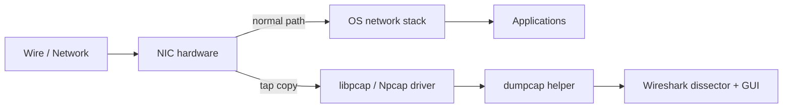
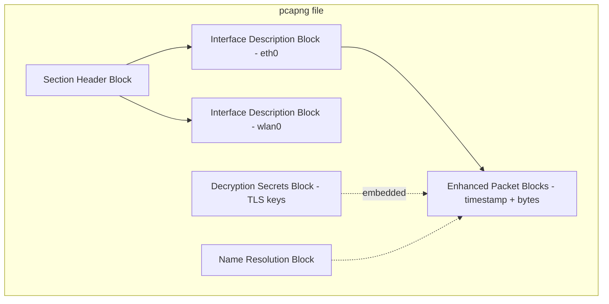
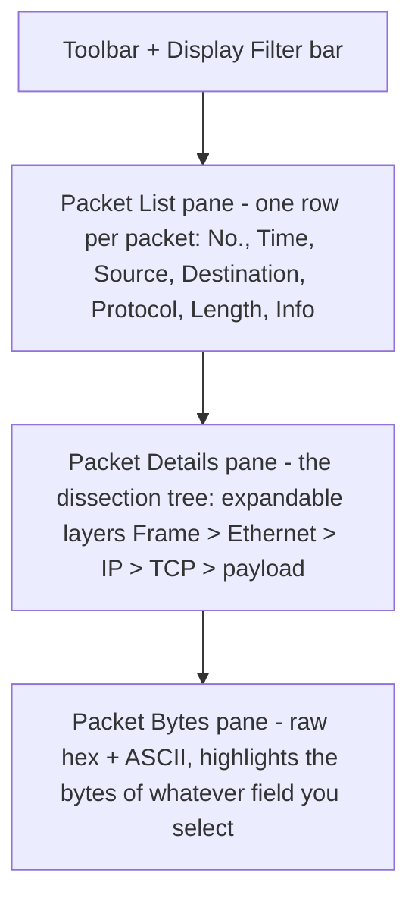
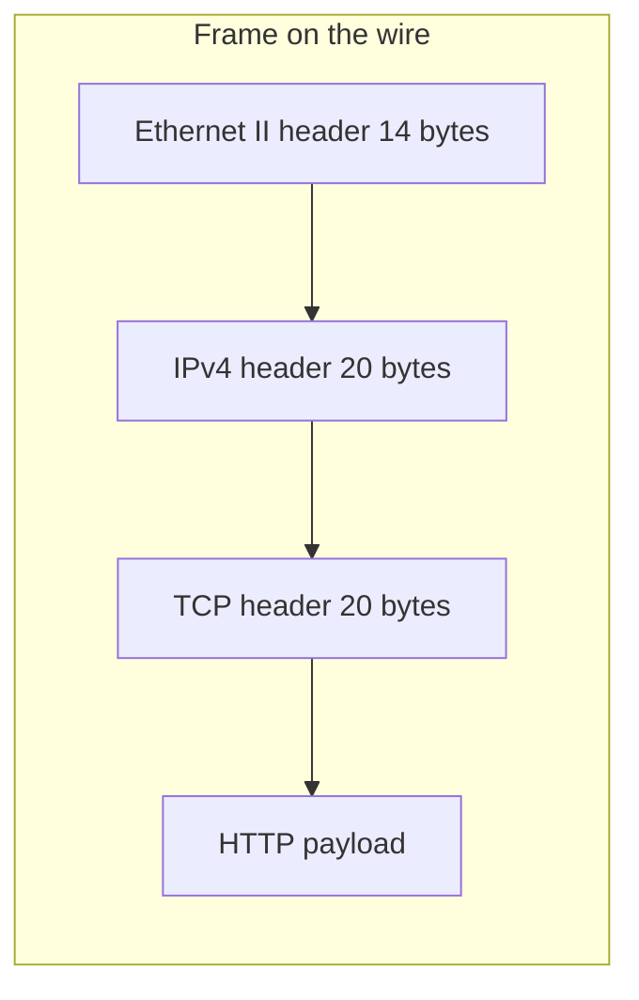
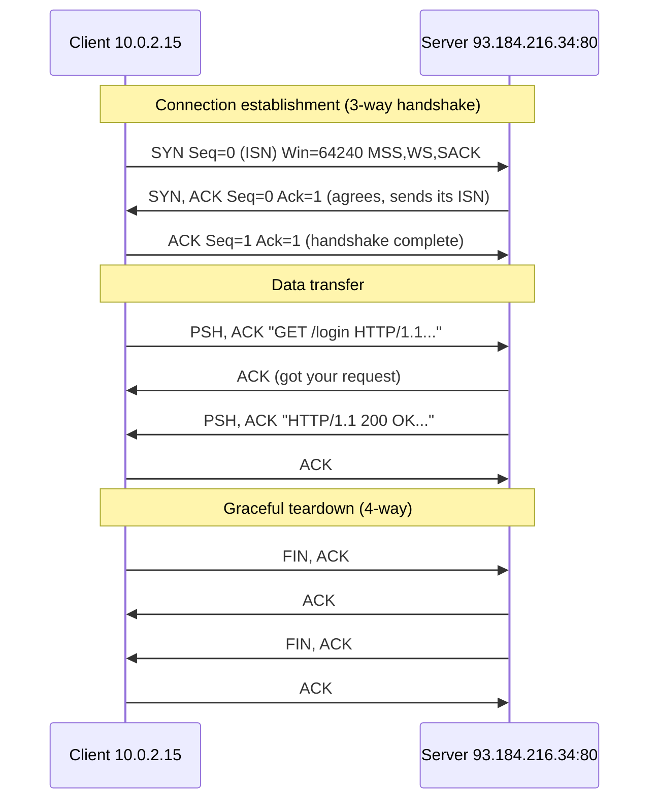
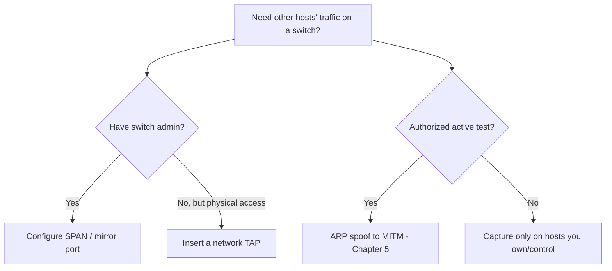

This is Chapter 1 of the Network Attacks notebook, and it opens the part of the series where you stop reading about protocols and start *watching them happen*. The Networking track earlier in the series built the mental model — packets, encapsulation, addressing, routing, DNS. This chapter hands you the microscope that makes that model visible one frame at a time. By the end you will be able to point Wireshark at an interface, capture exactly the traffic you want and nothing you don't, and then walk any packet field by field: Ethernet header, IP header, TCP header, application payload — reading each byte and knowing what it means and why it's there.

We build from absolute zero. First: what a packet sniffer actually *is*, how a network card can be made to hand your software traffic that wasn't addressed to it, and the library plumbing (libpcap / Npcap) that every sniffer on earth is built on. Then we install Wireshark and its command-line siblings, learn the interface, and draw the crucial line between **capture filters** (what you record) and **display filters** (what you look at) — the single most common source of beginner confusion. Then we spend the bulk of the chapter on **packet anatomy**: taking real frames apart layer by layer until the hex on the right of the screen stops being noise and starts being sentences. A full capture-a-login lab ties it together. Chapter 2 turns this raw capability into a scalpel with the display-filter language and stream reassembly; Chapter 3 uses both to pull credentials and reconstruct attacks out of traffic. This chapter is the foundation both of those stand on.

## Why Seeing the Wire Is a Superpower

Almost every offensive and defensive skill eventually bottoms out in a question you can only answer by looking at the actual bytes on the network. *Is my payload even leaving the box? Why did the TLS handshake fail — is it the SNI, the cipher, the cert? The scan says the port is "filtered" — is the SYN being dropped silently or is a RST coming back? The C2 beacon claims to be HTTPS, but what does its traffic pattern really look like? The app "logs the user in over an encrypted channel" — does it, or is that login flying in cleartext over HTTP?* You can guess, or you can capture and know.

> **A packet capture is ground truth.** Logs can be misconfigured, tools can lie, documentation can be stale — but the bytes that crossed the wire are what actually happened. Learning to read them is the difference between debugging by superstition and debugging by evidence.

For a **pentester**, Wireshark is how you confirm that a reverse shell is really connecting back, watch exactly what an unknown service speaks so you can talk to it, and catch cleartext credentials the application "swore" were encrypted. For an **incident responder**, a `.pcap` from a span port is often the most trustworthy artifact in the entire investigation — it shows the exfiltration, the beacon interval, the lateral-movement SMB session, frame by frame. For a **blue-team / detection engineer**, understanding packet anatomy is what lets you write Suricata and Zeek rules that actually match the traffic instead of matching your assumptions about it. And for **CTFs and bug bounty**, half of the "network forensics" and "misc" categories are a `.pcap` file and a flag hidden somewhere inside it — this chapter is the skill that category tests.

This is a long chapter on purpose. Capturing is easy to do badly and produces confident, wrong conclusions when you do. We go slow so that when you speed up later you are fast *and* right.

---

## Part 1: What a Packet Sniffer Actually Is

A **packet sniffer** (also called a network analyzer or protocol analyzer) is a program that captures the raw frames arriving at a network interface and decodes them so a human can read them. Wireshark is the most widely used one in the world — free, open source, cross-platform, with dissectors for over three thousand protocols. But before we run it, you need a correct mental model of *what it is doing*, because that model is what stops you from being confused later.

### 1.1 The normal life of a frame — and where the sniffer taps in

Normally, when a frame arrives at your Network Interface Card (NIC), the card checks the destination MAC address in the Ethernet header. If the frame is addressed to this card's MAC (or to broadcast/multicast the card is subscribed to), the NIC accepts it, raises an interrupt, and the OS networking stack processes it up through the layers to the application. If the frame is addressed to *someone else*, the NIC normally **drops it in hardware** — it never reaches the OS at all. This is an efficiency feature: your card shouldn't waste CPU on traffic that isn't yours.

A sniffer inserts a **tap** into this flow. On the receive path, before (or in parallel with) the normal stack processing, a capture mechanism copies each frame and hands it to the sniffing application. On Linux this tap is typically an `AF_PACKET` socket; on Windows it's the Npcap driver (an NDIS lightweight filter); on BSD/macOS it's the BPF device (`/dev/bpf*`). The library that gives all sniffers a uniform interface to these OS-specific taps is **libpcap** (Unix-like) / **Npcap** (Windows). Wireshark itself does not talk to the kernel directly for capture — it uses **dumpcap**, a small privileged helper that uses libpcap/Npcap to pull frames and write them to a capture file or pipe.



The key insight: **the sniffer sees a *copy* of frames as they hit the interface.** What frames actually hit the interface depends on the mode the card is in and on the network topology (hub vs switch vs Wi-Fi), which is the subject of the next two sub-parts.

### 1.2 Promiscuous mode — hearing frames not addressed to you

By default a NIC only lifts frames addressed to its own MAC up to the OS. **Promiscuous mode** tells the NIC to lift *every* frame it physically receives, regardless of destination MAC. Wireshark enables promiscuous mode on the capture interface by default (there's a checkbox for it).

Why does this matter? On an old-fashioned **hub**, every port receives every frame — the hub is a dumb electrical repeater — so a promiscuous card sees the entire LAN's traffic. This is the classic "sniff the whole network" scenario. On a modern **switch**, though, the switch learns which MAC lives on which port and forwards unicast frames only out the correct port. So even in promiscuous mode, your card only physically receives: frames to/from you, broadcast frames (ARP requests, DHCP discovers), and multicast you've subscribed to. Seeing *other people's* unicast traffic on a switch requires extra work — a SPAN/mirror port, a network tap, or an active attack like ARP spoofing (covered in later chapters of this notebook). Promiscuous mode is necessary but not sufficient on switched networks.

> **Red team usage:** promiscuous mode plus ARP spoofing is the classic LAN man-in-the-middle: you poison the ARP caches so victim traffic is switched *to you*, then your promiscuous NIC captures it. Wireshark is the eyes; the ARP attack (Chapter 5) is the hands.
>
> **Blue team usage:** some old tools tried to detect sniffers by looking for cards in promiscuous mode (they respond to certain malformed ARP probes). It's unreliable on modern stacks, but the concept — a host that shouldn't be sniffing suddenly is — is still a useful anomaly to reason about.

### 1.3 Monitor mode — the Wi-Fi-specific superset

Wi-Fi (802.11) has an extra mode beyond promiscuous called **monitor mode** (RFMON). A Wi-Fi card in *managed* mode is associated with one access point and, even promiscuously, only hands up 802.11 data frames for that BSS, already stripped down to look like Ethernet. **Monitor mode** disconnects the card from any AP and captures *all* 802.11 frames on the tuned channel — data frames, but also management frames (beacons, probe requests/responses, authentication, association) and control frames (RTS/CTS, ACK). This is what you need to capture WPA handshakes, see hidden SSIDs, or do wireless recon.

Monitor mode is driver- and OS-dependent: it's straightforward on Linux with the right chipset (`airmon-ng start wlan0` or `iw dev wlan0 set type monitor`), painful on Windows (Npcap supports it for some adapters), and restricted on macOS. Wireless capture is a topic of its own later in the series; for this chapter, know that **promiscuous mode is for wired/Ethernet, monitor mode is the Wi-Fi analogue that also captures the radio-management layer.**

| Mode | Layer | Captures | Typical use |
|------|-------|----------|-------------|
| Normal (managed) | L2+ | Only frames addressed to this host + broadcast/multicast | Everyday networking |
| Promiscuous | L2+ | All frames the NIC physically receives | Sniffing on hub / SPAN port / after MITM |
| Monitor (RFMON) | L1/L2 802.11 | All 802.11 mgmt/control/data on the tuned channel | Wi-Fi recon, WPA handshake capture |

### 1.4 What you cannot capture (and common misconceptions)

Three misconceptions trip up beginners constantly:

1. **"Wireshark will show me the whole network."** Only on a hub, a SPAN port, or after a MITM. On a normal switch port you see mostly your own traffic plus broadcast/multicast. If you plug into a switch and see only your host's conversations, nothing is broken — that's the switch doing its job.
2. **"Wireshark decrypts TLS/HTTPS for me."** Not on its own. Encrypted payloads stay encrypted. You *can* decrypt TLS if you have the session keys (via an `SSLKEYLOGFILE` from a browser, or the server's RSA private key for old non-forward-secret ciphers) — covered in Chapter 2 — but out of the box you see the TLS handshake metadata and ciphertext, not plaintext.
3. **"Capturing is passive and undetectable, so I can do it anywhere."** Capturing *your own* traffic is passive. But getting *others'* traffic on a switched or wireless network usually requires an active attack (ARP spoofing, rogue AP, deauth) that is very much detectable and, crucially, illegal without authorization. **Only capture traffic on networks and endpoints you own or are explicitly authorized to test.** Unauthorized interception violates wiretap/computer-misuse laws in essentially every jurisdiction. Everything offensive in this notebook is written for lab environments and authorized engagements only.

---

## Part 2: libpcap, Npcap and the Plumbing Beneath Every Sniffer

Wireshark is a GUI on top of a capture library. Understanding that library pays off because the same concepts (capture filters, snap length, link-layer types) appear in `tcpdump`, `tshark`, Zeek, Suricata, Scapy — everything.

### 2.1 The capture library

- **libpcap** — the portable C library for packet capture on Unix-like systems (Linux, macOS, BSD). It abstracts the kernel tap (`AF_PACKET` on Linux, BPF devices on BSD/macOS) behind one API: open an interface, optionally set a filter, read packets.
- **Npcap** — the modern Windows port (successor to the long-dead WinPcap), maintained by the Nmap project. It installs a driver that hooks the NDIS stack. Wireshark's Windows installer bundles it. Npcap adds features WinPcap lacked: loopback capture (the `Npcap Loopback Adapter`), admin-only mode, and 802.11 raw/monitor support for some adapters.

When Wireshark lists interfaces, it's asking libpcap/Npcap "what can I capture on?" — physical NICs, the loopback interface, Wi-Fi adapters, USB, Bluetooth, and pseudo-interfaces.

### 2.2 The pcap file format and its successor pcapng

Captured packets are stored in a file so you can analyze them later or share them. Two formats matter:

- **pcap (classic, `.pcap`)** — a simple format: a global header (magic number, snaplen, link-layer type) followed by per-packet records (timestamp, captured length, original length, then the bytes). Universally supported; the lingua franca for tools.
- **pcapng (`.pcapng`)** — the newer, richer format Wireshark uses by default. It supports multiple interfaces in one file, per-packet comments, name resolution blocks, capture metadata (OS, capture app), and the **Decryption Secrets Block** (DSB) that can embed TLS key-log material *inside* the capture so a colleague can decrypt it without your key file. More capable, but a few older tools only read classic pcap — hence you'll sometimes "Export as pcap".



**Snap length (snaplen)** is a per-capture setting that says "only save the first N bytes of each packet." Historically people set snaplen to 68 or 96 bytes to capture just headers and save disk on slow machines. Today, leave it at the default (262144 / "unlimited") unless you have a reason — a truncated capture that cut off the payload you needed is a maddening way to lose evidence. If Wireshark shows `[Packet size limited during capture]`, someone set a small snaplen.

### 2.3 Why capture filters are compiled to BPF

When you set a **capture filter** (Part 5), it's compiled into **BPF (Berkeley Packet Filter)** bytecode and pushed *into the kernel*. The kernel then runs that tiny program against every frame and only copies matching frames up to userspace. This is why capture filters are so cheap and so important on busy links: non-matching traffic is discarded in-kernel, never touching Wireshark. **Display filters**, by contrast, run in userspace inside Wireshark against already-captured packets — different language, different engine, different time. Confusing the two is the #1 beginner mistake; Part 5 and Part 6 nail the distinction.

---

## Part 3: Installing Wireshark and Meeting Its CLI Family

### 3.1 Installing

**Kali / Debian / Ubuntu:**

```bash
sudo apt update
sudo apt install -y wireshark tshark
# During install you'll be asked:
#   "Should non-superusers be able to capture packets?"  -> Yes
# That configures the dumpcap helper with the right capabilities.

# Add your user to the 'wireshark' group so you can capture without root:
sudo usermod -aG wireshark "$USER"
# Log out/in (or: newgrp wireshark) for the group change to take effect.

wireshark --version   # confirm; also prints the libpcap/Npcap version
```

Why the group instead of running the whole GUI as root? Capturing needs elevated privilege, but the GUI (which parses untrusted packet data with thousands of dissectors — historically a source of parsing bugs) does not. Wireshark's design isolates the privileged part in the tiny `dumpcap` binary. Running the full GUI as root is discouraged; Wireshark even warns you. On Kali the clean pattern is: user in the `wireshark` group, `dumpcap` granted `cap_net_raw,cap_net_admin` capabilities via `setcap`, GUI runs as your normal user.

```bash
# Confirm dumpcap has capabilities rather than needing root:
getcap "$(which dumpcap)"
# /usr/bin/dumpcap cap_net_admin,cap_net_raw=eip
```

**macOS:** `brew install --cask wireshark` (installs the GUI plus a ChmodBPF helper that grants access to the `/dev/bpf*` devices). **Windows:** download the installer from wireshark.org; it bundles **Npcap** — during Npcap setup, tick "Install Npcap in WinPcap API-compatible mode" and, if you want loopback/raw 802.11, the relevant boxes.

### 3.2 The command-line family (all built on the same engine)

Wireshark is not just the GUI. The suite ships several CLI tools you will use constantly — especially on servers where there's no display, or in scripts:

| Tool | What it does | When you reach for it |
|------|--------------|-----------------------|
| `dumpcap` | The raw capture engine — writes packets to disk, minimal CPU, no dissection | High-rate capture, ring buffers, the thing the GUI uses under the hood |
| `tshark` | The terminal Wireshark: capture *and* full dissection + display filters + field extraction | Headless capture/analysis, scripting, grepping fields (covered deeply in Ch.2) |
| `capinfos` | Prints summary stats about a capture file (packet count, duration, byte rate, hashes) | First thing to run on an unknown `.pcap` |
| `editcap` | Edits/splits/converts capture files (time-slice, remove dup packets, change format) | Trimming a huge pcap, converting pcapng→pcap |
| `mergecap` | Merges multiple captures into one, ordered by timestamp | Combining captures from two interfaces |
| `text2pcap` | Turns a hex dump back into a pcap | Reconstructing packets from logs/CTF hex |
| `reordercap` | Reorders packets by timestamp | Fixing out-of-order merged captures |

```bash
# Meet the family quickly:
capinfos suspicious.pcapng          # summary of a capture
tshark -r suspicious.pcapng -c 5    # print first 5 packets, one line each
editcap -A "2026-01-01 00:00:00" -B "2026-01-01 01:00:00" big.pcap hour.pcap  # time slice
mergecap -w combined.pcapng eth0.pcapng wlan0.pcapng
```

We teach `tshark`'s filtering and field-extraction power in Chapter 2, where it becomes a scripting workhorse. For this chapter, know it exists and that everything you learn about display filters applies to it identically.

---

## Part 4: The Wireshark Interface, Pane by Pane

Launch it: `wireshark &` (or from the menu). You land on the **Welcome / Capture** screen showing a list of interfaces, each with a live sparkline of traffic. Double-click an interface (e.g. `eth0`) to start capturing, or select it and press the blue shark-fin ▸ to start / the red square ◼ to stop.

Once capturing, the main window has three stacked panes plus toolbars:



### 4.1 The Packet List (top)

One row per packet. Default columns: **No.** (capture order), **Time** (seconds since capture start by default — changeable), **Source**, **Destination**, **Protocol** (the highest-layer dissector that matched), **Length** (bytes), **Info** (a human summary the dissector generates — e.g. `GET /login HTTP/1.1`, `Standard query 0x1a2b A example.com`, `[SYN] Seq=0 Win=64240`).

Rows are **colour-coded** by a set of rules (View → Coloring Rules): TCP resets and retransmissions in black/red, DNS in blue, HTTP in green, etc. The colouring is a fast triage aid — a screenful of black is often a screenful of problems.

**Tip:** right-click a column header → Column Preferences to add custom columns (e.g. a column showing `tcp.stream`, `http.host`, or `dns.qry.name`). Custom columns turn the list into a purpose-built dashboard; you'll do this constantly in real analysis.

### 4.2 The Packet Details (middle) — the dissection tree

This is the heart of the tool. Wireshark parses the selected packet and shows a **collapsible tree**, one node per protocol layer, outermost (physical) at the top down to the application at the bottom:

```
> Frame 42: 74 bytes on wire (592 bits), 74 bytes captured
> Ethernet II, Src: 08:00:27:aa:bb:cc, Dst: 52:54:00:12:35:02
> Internet Protocol Version 4, Src: 10.0.2.15, Dst: 93.184.216.34
> Transmission Control Protocol, Src Port: 51514, Dst Port: 80, Seq: 0, Len: 0
```

Expand any layer (click the ▸) to see every field decoded with its value. Click a field and the corresponding **bytes light up in the hex pane** below — this linkage is how you learn to read raw packets: click "Time to Live: 64", watch which hex byte highlights, and now you know where TTL lives in the IP header. The `Frame` pseudo-layer at the very top isn't on the wire; it's Wireshark's own metadata (arrival time, frame number, capture length, which protocols were found).

**Right-clicking a field** is where power lives: *Apply as Filter* (build a display filter from this field/value instantly), *Prepare as Filter*, *Follow → TCP Stream*, *Copy → value*, *Colorize with Filter*. Nearly every workflow in Chapter 2 starts with a right-click here.

### 4.3 The Packet Bytes (bottom) — hex and ASCII

The raw bytes of the frame, offset on the left, hex in the middle, ASCII on the right (printable bytes shown, others as `.`). Selecting a field in the details pane highlights its bytes here; selecting bytes here highlights the field above. For pcapng captures with multiple data sources (e.g. reassembled TCP), tabs at the bottom of this pane let you switch between the raw frame and the reassembled payload.

### 4.4 The status bar

Bottom edge: on the left, the currently selected packet's expert info and a click-through to the field name (e.g. `tcp.flags.syn`) — invaluable for learning filter field names. Middle: packet counts (Displayed / Total). Right: the current profile. **Configuration Profiles** (bottom-right, right-click) let you keep separate colouring rules, columns, and filters for, say, "malware triage" vs "VoIP" vs "TLS debugging."

---

## Part 5: Capture Filters (BPF) — Deciding What to Record

There are two filter systems in Wireshark and they are *not the same language*. We do capture filters here and display filters in Part 6. Internalise the difference:

| | **Capture filter** | **Display filter** |
|---|---|---|
| When it runs | At capture time, in the kernel | After capture, in Wireshark |
| Syntax | **BPF** (`tcpdump` syntax): `tcp port 80` | Wireshark's own: `tcp.port == 80` |
| Effect | Non-matching packets are **never saved** | Non-matching packets are hidden but still in the file |
| Reversible | No — discarded data is gone | Yes — clear the filter, they reappear |
| Where you type it | Welcome screen / Capture Options "Capture filter" box (goes green when valid) | The filter bar above the packet list (goes green when valid) |

**Use a capture filter when** the link is busy and you only care about a subset (capturing gigabytes of unrelated traffic wastes disk and slows analysis), or for privacy/scope (only record the target host you're authorized to test). **Use no capture filter when** you're not sure yet what you need — capture broadly, then narrow with display filters, because you can't un-discard packets.

### 5.1 BPF primitive syntax

BPF filters are built from **primitives** combined with `and` / `or` / `not`:

- **type**: `host`, `net`, `port`, `portrange`
- **dir**: `src`, `dst` (direction)
- **proto**: `ether`, `ip`, `ip6`, `arp`, `tcp`, `udp`, `icmp`

```bash
host 10.0.0.5                    # traffic to or from 10.0.0.5
src host 10.0.0.5                # only from that host
dst host 10.0.0.5                # only to that host
net 192.168.1.0/24              # a whole subnet
port 443                         # TCP or UDP port 443, either direction
dst port 53                      # traffic to port 53 (DNS queries)
portrange 8000-8100
tcp                              # all TCP
udp port 53                      # DNS over UDP
icmp                             # pings, unreachables, etc.
arp                              # ARP only
not arp and not stp              # exclude noise
host 10.0.0.5 and tcp port 22    # SSH to/from that host
tcp port 80 or tcp port 443      # web
not port 22                      # everything except your own SSH session (avoid capturing your capture!)
```

That last one matters when you SSH into a box to run a remote capture: if you don't exclude your SSH port, every captured packet generates traffic on your SSH session, which generates more packets to capture — a feedback loop.

### 5.2 BPF byte-offset matching (advanced)

BPF can match arbitrary bytes at an offset, written `proto[offset:size] op value`. This is how you filter on flags or fields BPF has no keyword for:

```bash
# TCP SYN-only packets (SYN set, ACK not set) — new connection attempts:
tcp[13] & 2 != 0 and tcp[13] & 16 == 0
# tcp[13] is the flags byte; 0x02 = SYN, 0x10 = ACK

# TCP packets with the SYN flag set (any):
"tcp[tcpflags] & tcp-syn != 0"

# ICMP echo request only (type 8 at icmp byte 0):
icmp[0] == 8

# HTTP GET (bytes 'GET ' at the start of TCP payload) — offset 0 of tcp data:
"tcp port 80 and (tcp[((tcp[12] & 0xf0) >> 2)] = 0x47)"   # 0x47 = 'G'
```

You rarely need this in Wireshark (display filters are friendlier), but it's the *same* syntax `tcpdump` uses on servers, so learning it here pays off in the `tcpdump` chapter later in this notebook.

> **Pentester note:** when capturing on an engagement, scope discipline is not optional — a capture filter like `host <target>` keeps you from accidentally recording a bystander's traffic, which can be a legal and ethical problem. Record only what your rules of engagement authorize.

---

## Part 6: Display Filters — Deciding What to Look At

Display filters use Wireshark's own expression language, keyed on **protocol field names** (`ip.src`, `tcp.flags.syn`, `http.request.method`, `dns.qry.name`, `tls.handshake.type`). You type them in the filter bar; it turns **green** for valid, **red** for invalid, yellow when the result may be unexpected (e.g. `!=` on a combined field). Press Enter to apply; the packet list now shows only matching packets — but the full capture is untouched, so clearing the filter brings everything back.

This chapter introduces display filters just enough to navigate; **Chapter 2 is the deep dive** into the entire field-by-field language, operators, `contains`/`matches`, membership and slices. Here are the essentials you need now:

```
ip.addr == 10.0.0.5              # packets with that IP as source OR destination
ip.src == 10.0.0.5              # source only
tcp.port == 443                  # TCP port 443 either direction
udp.port == 53                   # DNS
tcp.flags.syn == 1 && tcp.flags.ack == 0   # SYN-only (connection openers)
http                             # anything the HTTP dissector claimed
http.request.method == "POST"    # POST requests
dns.qry.name contains "evil"     # DNS queries mentioning 'evil'
tls.handshake.type == 1          # TLS ClientHello
arp.opcode == 1                  # ARP requests ("who has")
tcp.analysis.retransmission      # Wireshark-flagged retransmits
frame contains "password"        # any frame whose bytes contain the ASCII 'password'
!(arp or stp or lldp)            # hide L2 chatter
```

Two operator gotchas to remember even now:

1. **`ip.addr == x` means "src OR dst == x".** To say "NOT involving x" you cannot write `ip.addr != x` (that means "has *an* address that isn't x", which is true for almost every packet). Write `!(ip.addr == x)` instead. This exact trap bites everyone once.
2. **`&&`/`and`, `||`/`or`, `!`/`not`, `==`/`eq`** are interchangeable — use whichever reads clearly.

The fastest way to build a display filter is **not** typing: select a field in the details pane, right-click → **Apply as Filter → Selected**. Wireshark writes the correct field name and value for you. Do that a hundred times and you'll have the field names memorised.

---

## Part 7: Packet Anatomy — Reading a Frame Layer by Layer

Now the core skill. We take the layers you learned about in the Networking track and look at them **as Wireshark dissects them**, field by field, so the hex stops being noise. We'll reference a real captured HTTP GET throughout. Remember encapsulation: each layer wraps the one above it, so on the wire the order is **Ethernet header | IP header | TCP header | application data**, and Wireshark's tree shows them top-to-bottom in that same outer-to-inner order.



### 7.1 Ethernet II header (Layer 2, 14 bytes)

```
Ethernet II, Src: 08:00:27:aa:bb:cc, Dst: 52:54:00:12:35:02
    Destination: 52:54:00:12:35:02
        Address: 52:54:00:12:35:02
        .... ..1. .... .... .... .... = LG bit: Locally administered
        .... ...0 .... .... .... .... = IG bit: Individual (unicast)
    Source: 08:00:27:aa:bb:cc
    Type: IPv4 (0x0800)
```

The Ethernet II header is exactly **14 bytes**: 6-byte **destination MAC**, 6-byte **source MAC**, 2-byte **EtherType**. That's it — the trailing FCS (checksum) is usually stripped by the NIC before capture.

- **Destination / Source MAC** — 48-bit hardware addresses. The first 3 bytes are the **OUI** (Organizationally Unique Identifier); Wireshark resolves it to a vendor (e.g. `08:00:27` → PCS/VirtualBox, `52:54:00` → QEMU/KVM). Two flag bits inside the first byte: the **I/G bit** (individual vs group/multicast) and the **U/L bit** (universally vs locally administered). Broadcast is `ff:ff:ff:ff:ff:ff`.
- **EtherType** — what's inside: `0x0800` = IPv4, `0x86DD` = IPv6, `0x0806` = ARP, `0x8100` = 802.1Q VLAN tag. Wireshark uses this to decide which dissector runs next.

> **Security relevance:** the source MAC is trivially spoofable (`ip link set eth0 address ..` / `macchanger`), so MAC-based access control (port security, MAC filtering on Wi-Fi) is weak. In captures, sudden MAC changes for a known IP, or a gateway IP mapping to a new MAC, are the fingerprint of **ARP spoofing** (Chapter 5) — Wireshark even flags `duplicate use of <IP> detected`.

### 7.2 ARP — how L3 addresses become L2 addresses (28 bytes)

Before a host can send an IP packet to a neighbour, it needs that neighbour's MAC. **ARP (Address Resolution Protocol)** does the mapping. It rides directly in Ethernet (EtherType `0x0806`), no IP header. You'll see two opcodes:

```
Address Resolution Protocol (request)
    Hardware type: Ethernet (1)
    Protocol type: IPv4 (0x0800)
    Hardware size: 6
    Protocol size: 4
    Opcode: request (1)
    Sender MAC address: 08:00:27:aa:bb:cc
    Sender IP address: 10.0.2.15
    Target MAC address: 00:00:00:00:00:00   (unknown — that's what we're asking)
    Target IP address: 10.0.2.2
```

- **Opcode 1 = request** ("who has 10.0.2.2? tell 10.0.2.15") — sent to broadcast `ff:ff:ff:ff:ff:ff`.
- **Opcode 2 = reply** ("10.0.2.2 is at 52:54:00:12:35:02") — unicast back to the asker.

ARP is stateless and unauthenticated: a host caches *any* reply it sees, even unsolicited ones. That is the entire basis of **ARP cache poisoning / spoofing**, the LAN MITM technique. In a capture, watch for one MAC claiming to be many IPs, or many gratuitous ARP replies — Wireshark's Expert Info raises `duplicate IP address` warnings. **Blue team:** dynamic ARP inspection (DAI) on managed switches and static ARP entries for critical hosts defend against this; in packet analysis, `arp.duplicate-address-detected` is your filter.

### 7.3 IPv4 header (Layer 3, 20 bytes without options)

```
Internet Protocol Version 4, Src: 10.0.2.15, Dst: 93.184.216.34
    0100 .... = Version: 4
    .... 0101 = Header Length: 20 bytes (5)      <- IHL, in 32-bit words
    Differentiated Services Field: 0x00 (DSCP CS0, ECN Not-ECT)
    Total Length: 60
    Identification: 0x1c46 (7238)
    Flags: 0x40, Don't fragment
        0... .... = Reserved bit: Not set
        .1.. .... = Don't fragment: Set
        ..0. .... = More fragments: Not set
    Fragment Offset: 0
    Time to Live: 64
    Protocol: TCP (6)
    Header Checksum: 0xb1e6 [validation disabled]
    Source Address: 10.0.2.15
    Destination Address: 93.184.216.34
```

Field by field, because every one has an analysis use:

- **Version (4 bits)** — `4` for IPv4.
- **IHL / Header Length (4 bits)** — header size in 32-bit words; `5` × 4 = 20 bytes (no options). Larger means IP options present (rare, sometimes suspicious).
- **DSCP/ECN (1 byte)** — QoS marking and explicit congestion notification.
- **Total Length (2 bytes)** — entire IP packet (header + data) in bytes; max 65535.
- **Identification (2 bytes)** — groups fragments of one original datagram. Also a fingerprinting/covert-channel field: predictable IP IDs leak info; some OS scanners (idle/zombie scan) abuse it.
- **Flags (3 bits)** — **DF (Don't Fragment)** and **MF (More Fragments)**. DF is set for path-MTU discovery. **Fragmentation** is a classic IDS-evasion trick (split an attack across fragments so a naive inspector doesn't reassemble it) — Wireshark reassembles fragments for you and flags overlaps.
- **Fragment Offset (13 bits)** — where this fragment sits in the original datagram (in 8-byte units). Overlapping/odd offsets = the old teardrop/fragmentation attacks.
- **TTL (1 byte)** — hop limit, decremented by each router; hits 0 → packet dropped and an ICMP Time Exceeded returned (that's how `traceroute` works). **Analysis gold:** initial TTL fingerprints the OS (Linux/macOS start at 64, Windows at 128, some network gear at 255). A TTL of 57 on an inbound packet suggests ~7 hops from a Linux-ish origin. Wildly inconsistent TTLs for one "host" can indicate spoofing or a load balancer.
- **Protocol (1 byte)** — what's inside: `6` = TCP, `17` = UDP, `1` = ICMP, `41` = IPv6-in-IPv4, `47` = GRE, `50` = ESP (IPsec).
- **Header Checksum (2 bytes)** — covers the IP header only. Wireshark may show `[validation disabled]` because modern NICs do **checksum offload** — the OS hands the NIC a packet with a bogus/zero checksum and the hardware fills it in on the way out, so *your local outbound packets often show "incorrect" checksums in capture*. This is normal, not a bug; disable "Validate checksums" or ignore it.
- **Source / Destination Address (4 bytes each)** — the 32-bit IPv4 addresses.

### 7.4 IPv6 header (Layer 3, fixed 40 bytes)

IPv6 simplified the header to a fixed 40 bytes and moved options into **extension headers**:

```
Internet Protocol Version 6, Src: 2001:db8::1, Dst: 2001:db8::2
    0110 .... = Version: 6
    Traffic Class: 0x00
    Flow Label: 0x00000
    Payload Length: 40
    Next Header: TCP (6)          <- replaces IPv4 'Protocol'; chains extension headers
    Hop Limit: 64                 <- IPv6's TTL
    Source Address: 2001:db8::1
    Destination Address: 2001:db8::2
```

Key differences to recognise: **no header checksum** (relies on L2/L4), **no fragmentation by routers** (only the source fragments, via a Fragment extension header), **Next Header** chains protocols/extensions, **Hop Limit** is the TTL analogue. **Security relevance:** IPv6 is often enabled but unmonitored — dual-stack hosts can be reached over IPv6 while your firewall/IDS only watches IPv4 (`mitm6` abuses exactly this to become a rogue DNS server via DHCPv6). Filter IPv6 with `ipv6.addr`, `ipv6.src`, etc.

### 7.5 ICMP — the network's error and diagnostic channel

```
Internet Control Message Protocol
    Type: 8 (Echo (ping) request)
    Code: 0
    Checksum: 0x4d5a [correct]
    Identifier (BE): 0x0001
    Sequence Number (BE): 1
    Data (48 bytes)
```

ICMP rides in IP (protocol 1). Types you'll see constantly: **8/0** echo request/reply (ping), **3** Destination Unreachable (with codes: 0 net, 1 host, 3 port unreachable — a **port-unreachable** is how UDP scans infer closed ports), **11** Time Exceeded (traceroute / TTL expiry), **5** Redirect. **Analysis/security:** oversized or oddly-timed ICMP echo with a big payload can be **ICMP tunneling / exfiltration** (data hidden in the ping data field) — `icmp && data.len > 48` is a starting filter. `icmp.type == 3 && icmp.code == 3` finds the port-unreachables that reveal UDP scanning.

### 7.6 UDP header (Layer 4, 8 bytes)

```
User Datagram Protocol, Src Port: 41235, Dst Port: 53
    Source Port: 41235
    Destination Port: 53
    Length: 45
    Checksum: 0x1a2b [unverified]
    [Stream index: 0]
```

UDP is minimal — just **source port, destination port, length, checksum** (8 bytes total), then payload. No handshake, no sequence numbers, no reliability. It carries DNS, DHCP, NTP, SNMP, QUIC, most VoIP media, and a lot of games. Because it's connectionless and spoofable, UDP is the vehicle for **amplification/reflection DDoS** (DNS, NTP, memcached) — a small spoofed request yields a huge reply to the victim. In capture, a flood of identical small UDP requests from one "source" to many servers, or huge replies to a victim with no matching request, is the signature.

### 7.7 TCP header (Layer 4, 20 bytes without options)

TCP is where you'll spend the most analysis time, so we go slow:

```
Transmission Control Protocol, Src Port: 51514, Dst Port: 80, Seq: 0, Len: 0
    Source Port: 51514
    Destination Port: 80
    Sequence Number: 0          (relative)   [raw: 0x9c8f3a11]
    Acknowledgment Number: 0    (relative)
    1010 .... = Header Length: 40 bytes (10)   <- data offset, incl. options
    Flags: 0x002 (SYN)
        ... syn, ack, fin, rst, psh, urg, ece, cwr, ns bits ...
        .... .... ...0 = FIN: Not set
        .... .... ..1. = SYN: Set
    Window: 64240
    Checksum: 0xf1a2 [unverified]
    Urgent Pointer: 0
    Options: (20 bytes), MSS, SACK permitted, Timestamps, No-Operation (NOP), Window scale
```

- **Source / Destination Port (2 bytes each)** — the endpoints of the connection. Well-known ports below 1024 (80 HTTP, 443 HTTPS, 22 SSH, 25 SMTP, 21 FTP).
- **Sequence Number (4 bytes)** — byte-offset of the first data byte in this segment within the stream. Wireshark shows a **relative** sequence number (starting at 0 for readability); the real one is a random 32-bit ISN chosen at connection start (randomised to prevent sequence-prediction hijacking). Toggle relative/absolute in TCP preferences.
- **Acknowledgment Number (4 bytes)** — the next sequence number the sender *expects* to receive; i.e. "I've got everything up to here."
- **Data Offset / Header Length (4 bits)** — header size in 32-bit words; `5` = 20 bytes, more means TCP options present.
- **Flags (control bits)** — the ones that matter:
  - **SYN** — synchronise; opens a connection (carries the ISN).
  - **ACK** — acknowledgment field is valid; set on essentially every packet after the first.
  - **FIN** — no more data; graceful close.
  - **RST** — reset; abort the connection immediately (also what a closed port replies with to a SYN — the basis of Nmap's SYN scan distinguishing open/closed).
  - **PSH** — push buffered data to the app now (you'll see it on the segment carrying an HTTP request).
  - **URG** + Urgent Pointer — urgent data (rare, historically abused).
  - **ECE/CWR/NS** — ECN congestion signalling.
- **Window (2 bytes)** — how many more bytes the sender can receive right now (flow control). A window shrinking to 0 (`TCP Zero Window`) means a receiver is overwhelmed — Wireshark flags it. Scaled by the Window Scale option.
- **Checksum (2 bytes)** — covers header + data + a pseudo-header; often shown unverified due to offload (same as IP).
- **Urgent Pointer (2 bytes)** — offset of urgent data when URG is set.
- **Options** — MSS (max segment size), Window Scale, SACK-permitted/SACK, Timestamps. The SYN/SYN-ACK options negotiate the connection's capabilities; they're also an **OS fingerprint** (`p0f`, Nmap OS detection read option order/values).

> **The flags byte is the story of a connection.** Reading a TCP conversation is largely reading its flags in order: `SYN → SYN,ACK → ACK` (open), then `PSH,ACK`/`ACK` (data), then `FIN,ACK → ACK → FIN,ACK → ACK` (close) or a `RST` (abrupt end). Get fluent in that pattern and you can eyeball connection health at a glance.

---

## Part 8: The TCP Three-Way Handshake and Teardown on the Wire

Because TCP is connection-oriented, every TCP conversation begins with a three-way handshake and (usually) ends with a graceful four-way teardown. Being able to spot these in the packet list is fundamental — it's how you tell "the connection succeeded" from "the SYN went out but nothing came back" (filtered/dropped) from "a RST came back" (port closed/refused).



In the packet list this appears as recognisable rows. Watch the relative sequence/ack numbers step forward:

```
No.  Source        Destination    Proto Info
1    10.0.2.15     93.184.216.34  TCP   51514 → 80 [SYN] Seq=0 Win=64240 Len=0 MSS=1460 SACK_PERM WS=128
2    93.184.216.34 10.0.2.15      TCP   80 → 51514 [SYN, ACK] Seq=0 Ack=1 Win=65535 Len=0 MSS=1460
3    10.0.2.15     93.184.216.34  TCP   51514 → 80 [ACK] Seq=1 Ack=1 Win=64256 Len=0
4    10.0.2.15     93.184.216.34  HTTP  GET /login HTTP/1.1
5    93.184.216.34 10.0.2.15      TCP   80 → 51514 [ACK] Seq=1 Ack=176 Win=65535 Len=0
6    93.184.216.34 10.0.2.15      HTTP  HTTP/1.1 200 OK  (text/html)
7    10.0.2.15     93.184.216.34  TCP   51514 → 80 [ACK] Seq=176 Ack=1301 Win=63000 Len=0
8    10.0.2.15     93.184.216.34  TCP   51514 → 80 [FIN, ACK] ...
```

**How this maps to scanning results (pentester angle):** Nmap's default **SYN scan** sends packet 1 and reads the reply. A **SYN,ACK** back = port **open** (Nmap then RSTs instead of completing). A **RST,ACK** back = port **closed**. **Nothing** back (after retries) = **filtered** (a firewall silently dropped the SYN). You can literally watch this in Wireshark while Nmap runs — `tcp.flags.syn==1` shows the probes, and the replies (or absence) tell the story. Seeing the handshake never complete but a RST arrive is the wire-level meaning of "connection refused."

**IR/blue-team angle:** many SYNs from one source to many ports with no completed handshakes = a port scan (`tcp.flags.syn==1 && tcp.flags.ack==0`, then Statistics → Conversations to see the fan-out). A flood of SYNs with spoofed sources and no final ACK = a **SYN flood** DoS; the server's half-open queue fills. `tcp.flags.reset==1` bursts can indicate scanning, connection tampering, or a TCP-reset injection attack.

---

## Part 9: Application-Layer Anatomy — DNS, DHCP, HTTP and TLS as Wireshark Sees Them

Above TCP/UDP sit the protocols you actually care about. Quick anatomy of the four you'll meet most, so you recognise them in the tree.

### 9.1 DNS (UDP/TCP 53)

```
Domain Name System (query)
    Transaction ID: 0x1a2b
    Flags: 0x0100 Standard query
    Questions: 1
    Queries
        example.com: type A, class IN
            Name: example.com
            Type: A (Host Address) (1)
            Class: IN (0x0001)
```

A query has a **Transaction ID** (matches query to response), **flags** (query/response, recursion desired, response code), and a **question** (name + type + class). The response repeats the question and adds **answer** records. Types: `A` (IPv4), `AAAA` (IPv6), `CNAME`, `MX`, `TXT`, `NS`, `PTR` (reverse). **Security:** long, high-entropy, or numerous `TXT`/subdomain queries to one domain = likely **DNS tunneling/exfiltration** (filter `dns` then eyeball `dns.qry.name` lengths). `NXDOMAIN` storms from one host can be malware doing DGA (domain-generation-algorithm) callouts. Chapter 3 uses DNS analysis to catch exfil.

### 9.2 DHCP (UDP 67/68)

The DORA exchange — **Discover, Offer, Request, Ack** — how a host gets an IP. Useful in forensics because DHCP requests carry the client's hostname and MAC (option 12 hostname, option 55 parameter request list, which fingerprints the OS/vendor). A rogue DHCP server handing out a malicious gateway/DNS is a MITM technique; two `Offer`s for one `Discover` from different servers is the tell.

### 9.3 HTTP (TCP 80) — cleartext, fully readable

```
Hypertext Transfer Protocol
    GET /login HTTP/1.1\r\n
    Host: example.com\r\n
    User-Agent: Mozilla/5.0 ...\r\n
    Cookie: session=abc123...\r\n
    \r\n
```

Because HTTP is plaintext, Wireshark shows the entire request and response — method, URI, headers, cookies, body — in the clear. This is why capturing an HTTP login reveals credentials directly (`http.request.method == "POST"`, then look at the body). **This is the single most important lesson about why HTTPS exists:** anything sent over HTTP is visible to anyone on the path. In Chapter 3 we extract credentials and files from HTTP traffic; here, just know that the whole conversation is readable and that **Follow → HTTP Stream** stitches request+response into one readable view.

### 9.4 TLS (TCP 443) — the handshake is visible, the data isn't

```
Transport Layer Security
    TLSv1.3 Record Layer: Handshake Protocol: Client Hello
        Handshake Type: Client Hello (1)
        Version: TLS 1.2 (0x0303)
        Random: ...
        Cipher Suites (17 suites)
        Extension: server_name (SNI)  -> "example.com"
        Extension: application_layer_protocol_negotiation (h2, http/1.1)
```

Even without decryption, the TLS **handshake** leaks a lot: the **ClientHello** carries the **SNI** (which hostname you're really connecting to, in cleartext unless ECH is used), the offered cipher suites and TLS version, and ALPN (HTTP/2 vs 1.1). The **certificate** in the ServerHello (TLS 1.2) shows the server's identity. **Analysis:** the ordered set of ClientHello fields forms a **JA3/JA4 fingerprint** that can identify specific malware C2 clients even inside encryption. `tls.handshake.extensions_server_name contains "target"` finds connections to a host by SNI. To see the *plaintext* you need session keys — the `SSLKEYLOGFILE` method, covered in Chapter 2. For now: TLS = handshake readable, payload encrypted.

### 9.5 How Wireshark decides which dissector to run (and when it guesses wrong)

Wireshark chains dissectors by following the "what's inside" fields you've just met: EtherType picks the L3 dissector, the IP `Protocol` (or IPv6 `Next Header`) picks the L4 dissector, and the TCP/UDP **port** picks the application dissector via a registration table. Port 80 → HTTP, 443 → TLS, 53 → DNS, and so on. This is why a service running on a **non-standard port** is sometimes dissected wrong — an HTTP server on port 8000 may show as raw `TCP` if 8000 isn't registered. Two fixes: right-click a packet → **Decode As…** and force the port to the correct dissector for this capture, or add the port under the protocol's preferences permanently. **Heuristic dissectors** try to auto-detect a protocol by content rather than port (useful for the non-standard-port case), but they can misfire — a stray "GET" in a binary stream can make Wireshark briefly think it found HTTP. When a dissection looks wrong, remember it's a *guess* keyed on ports and heuristics, and you can always override it.

| "What's inside" field | Value | Dissector Wireshark runs next |
|---|---|---|
| Ethernet EtherType | `0x0800` / `0x86DD` / `0x0806` | IPv4 / IPv6 / ARP |
| IPv4 Protocol / IPv6 Next Header | `6` / `17` / `1` | TCP / UDP / ICMP |
| TCP or UDP port | `80` / `443` / `53` / `22` | HTTP / TLS / DNS / SSH |

**Pentester relevance:** when you catch an unknown service on an odd port during an engagement, *Decode As* is how you make Wireshark speak its protocol so you can understand and then interact with it — often the first step in talking to a custom or misplaced service you found in a scan.

---

## Part 10: Capturing in the Real World — Switches, Remote, and Ring Buffers

Knowing how to read packets is half the job; *getting* the right packets is the other half. Real networks aren't hubs.

### 10.1 Getting traffic on a switched network

Since a switch won't send you other hosts' unicast, you need one of:

- **SPAN / port mirroring** — configure the managed switch to copy traffic from port(s) or a VLAN to your monitor port. The clean, authorized, non-disruptive way. Most enterprise captures come from a SPAN.
- **Network TAP** — a hardware device inserted inline that copies traffic to a monitor port. More reliable than SPAN under load (SPAN can drop under oversubscription), fully passive.
- **Hub** — a real hub floods all ports; almost extinct, but a "throwing star" passive tap or old hub is a lab trick.
- **ARP spoofing / MITM** — an *active* technique to redirect a victim's traffic through you (Chapter 5). Powerful, noisy, detectable, and only lawful with authorization.
- **Capture on an endpoint you control** — the simplest: run the capture on the host whose traffic you care about (the server, your own box, a compromised host during an authorized test).



### 10.2 Remote capture over SSH

No GUI on the server? Capture remotely and pipe to your local Wireshark:

```bash
# Live remote capture piped into local Wireshark (needs tcpdump/dumpcap on the remote):
ssh user@server "sudo tcpdump -i eth0 -U -s0 -w - 'not port 22'" | wireshark -k -i -
#   -U  packet-buffered (flush each packet)   -s0 full snaplen
#   -w - write pcap to stdout                 'not port 22' avoids capturing the SSH pipe
#   wireshark -k start immediately  -i - read from stdin

# Or capture to a file on the server, then pull it back:
ssh user@server "sudo tcpdump -i eth0 -w /tmp/cap.pcap -c 10000 'not port 22'"
scp user@server:/tmp/cap.pcap .
wireshark cap.pcap
```

Wireshark also has native **SSHdump** and **Ciscodump** extcap interfaces (Capture menu) that do the remote-SSH-tcpdump dance for you through a dialog.

### 10.3 Long captures without filling the disk — ring buffers

For monitoring over hours/days you don't want one giant file. Use a **ring buffer**: fixed-size files that rotate.

```bash
# 50 files of 100 MB each, rotating — oldest overwritten (5 GB cap total):
dumpcap -i eth0 -b filesize:100000 -b files:50 -w /captures/ring.pcapng
#   -b filesize:100000  -> new file every 100000 kB (100 MB)
#   -b files:50         -> keep at most 50, then wrap

# Time-based rotation: a new file every 3600 seconds (1 hour):
dumpcap -i eth0 -b duration:3600 -w /captures/hourly.pcapng
```

`dumpcap` (not the GUI) is the right tool for high-rate/long captures — it does no dissection, so it keeps up with fast links and won't OOM the way a GUI holding millions of packets in RAM will. The GUI's Capture → Options dialog exposes the same ring-buffer and autostop settings if you prefer clicking.

> **Capture hygiene:** on a busy link, always use a **capture filter** to cut volume, set a sane **ring buffer** so you don't fill the disk, and prefer `dumpcap`/`tshark` over the GUI for unattended captures. Analyse the resulting files in the GUI afterward.

---

## Part 11: Hands-On Lab — Capture a Login and Walk Every Byte

This lab is fully reproducible in a home lab and touches every skill above: start a capture with a scoped filter, generate traffic, then dissect the handshake, the HTTP request, and the payload byte by byte. **Do this only against a host you own** (a local VM or a deliberately-vulnerable target such as a DVWA/Metasploitable VM on an isolated host-only network).

### Lab setup

- Attacker/analyst box: Kali (or any Linux with Wireshark).
- Target: a small HTTP service you control — e.g. a Python one-liner, DVWA, or a target you have explicit permission to test; safest is local loopback.
- Network: host-only or NAT lab network so no third-party traffic is involved.

Spin up a trivial HTTP login target locally so everything stays on your own machine:

```bash
# Terminal 1 — a throwaway HTTP server that logs POST bodies (target we own):
mkdir /tmp/lab && cd /tmp/lab
cat > server.py <<'PY'
from http.server import BaseHTTPRequestHandler, HTTPServer
class H(BaseHTTPRequestHandler):
    def do_GET(self):
        self.send_response(200); self.send_header('Content-Type','text/html'); self.end_headers()
        self.wfile.write(b"<form method=POST action=/login><input name=user><input name=pass type=password><input type=submit></form>")
    def do_POST(self):
        n=int(self.headers.get('Content-Length',0)); body=self.rfile.read(n)
        print("LOGIN BODY:", body)
        self.send_response(302); self.send_header('Location','/'); self.end_headers()
HTTPServer(('127.0.0.1',8080), H).serve_forever()
PY
python3 server.py
```

### Step 1 — Start a scoped capture

We capture on loopback (Npcap loopback on Windows; `lo` on Linux). Use a capture filter so we only record our target port:

```bash
# In another terminal, or start via the GUI on interface 'lo' with capture filter: tcp port 8080
sudo dumpcap -i lo -f "tcp port 8080" -w /tmp/lab/login.pcapng &
```

Or in the GUI: Welcome screen → double-click **Loopback: lo** → but first type `tcp port 8080` in the **Capture filter** box (it turns green) → start.

### Step 2 — Generate the login traffic

```bash
# Terminal 3 — send a login POST to our own server:
curl -s -X POST http://127.0.0.1:8080/login -d 'user=admin&pass=S3cr3tP@ss' >/dev/null
# also fetch the form so we get a GET too:
curl -s http://127.0.0.1:8080/ >/dev/null
```

Stop the capture (`kill %1`, or the red square in the GUI). Open `login.pcapng` in Wireshark.

### Step 3 — Read the handshake

Apply display filter `tcp.flags.syn == 1` — you'll see the SYN and SYN,ACK. Clear it and look at the first packets in order. You should see exactly the three-way handshake from Part 8:

```
1  127.0.0.1 → 127.0.0.1  TCP  4xxxx → 8080 [SYN] Seq=0 Win=65495 Len=0 MSS=65495 ...
2  127.0.0.1 → 127.0.0.1  TCP  8080 → 4xxxx [SYN, ACK] Seq=0 Ack=1 Win=65483 ...
3  127.0.0.1 → 127.0.0.1  TCP  4xxxx → 8080 [ACK] Seq=1 Ack=1 Win=65536 Len=0
```

Click packet 1, expand **Transmission Control Protocol → Flags**, and confirm only SYN is set (`.... ..1.`). Click the "SYN: Set" line and watch the flags byte highlight in the hex pane — that's byte 13 of the TCP header, exactly the `tcp[13]` we filtered on in BPF.

### Step 4 — Find and dissect the POST

Apply `http.request.method == "POST"`. Select the POST packet. In the details tree expand **Hypertext Transfer Protocol** and then **HTML Form URL Encoded**:

```
Hypertext Transfer Protocol
    POST /login HTTP/1.1\r\n
    Host: 127.0.0.1:8080\r\n
    Content-Length: 26\r\n
    Content-Type: application/x-www-form-urlencoded\r\n
    \r\n
    [Full request URI: http://127.0.0.1:8080/login]
    File Data: 26 bytes
HTML Form URL Encoded: application/x-www-form-urlencoded
    Form item: "user" = "admin"
    Form item: "pass" = "S3cr3tP@ss"
```

There it is — the password in cleartext, because this is HTTP not HTTPS. Right-click the "pass" field → Copy → Value to grab it. This is the concrete demonstration of why credentials over HTTP are game-over on a sniffable path.

### Step 5 — Follow the stream and read the raw bytes

Right-click the POST packet → **Follow → HTTP Stream** (or TCP Stream). Wireshark reassembles the whole conversation — request then response — into one window, colour-coded (client vs server). This is what you'll use constantly. Then click into the **Packet Bytes** pane and correlate: find the ASCII `user=admin&pass=` on the right side of the hex, and note its offset. You've now traced an application secret from the form field, through the HTTP body, down to its exact bytes on the wire.

### Step 6 — Summarise the capture from the CLI

```bash
capinfos /tmp/lab/login.pcapng
# File type, number of packets, capture duration, data byte rate, SHA256 (evidence integrity)

tshark -r /tmp/lab/login.pcapng -Y "http.request" -T fields -e http.request.method -e http.request.uri
# GET   /
# POST  /login

tshark -r /tmp/lab/login.pcapng -Y "http.request.method==POST" -T fields -e text  # dump form fields
```

That `capinfos` SHA-256 matters in real IR: you hash the capture on acquisition so you can later prove the evidence wasn't altered. **Lab takeaways:** you started a scoped capture with a BPF filter, watched a real three-way handshake, dissected an HTTP POST down to individual form fields, followed the stream, and correlated the details tree to raw hex — the complete beginner-to-competent capture-and-anatomy loop.

---

## Part 12: Detection & Defense Angle

Everything above is equally a blue-team skill; here it is consolidated. Packet analysis is the backbone of network detection and IR, and the anatomy you just learned is exactly what detection tools reason over.

**Where the packets come from in a SOC:** production detection rarely uses the Wireshark GUI live. Instead, sensors run **Zeek** (turns traffic into rich connection/protocol logs) and **Suricata/Snort** (signature + protocol-anomaly IDS/IPS) on SPAN/TAP feeds, often writing full-packet **PCAP** to disk (e.g. via Arkime/Moloch) for retrospective analysis. When an alert fires, the analyst pulls the relevant PCAP and opens it in **Wireshark** to see ground truth — which is why GUI packet-reading is still a core SOC skill.

**Anatomy fields that power detections:**

| Observation in the packet | What it may indicate | Wireshark filter to start |
|---|---|---|
| Many SYNs, few/no SYN-ACKs, fanning across ports | Port scan / recon | `tcp.flags.syn==1 && tcp.flags.ack==0` |
| SYN flood, spoofed sources, no final ACK | SYN-flood DoS | `tcp.flags.syn==1` + Statistics → Conversations |
| Duplicate IP↔MAC / gratuitous ARP storms | ARP spoofing / MITM | `arp.duplicate-address-detected` |
| Long/high-entropy DNS names, many TXT | DNS tunneling / exfil | `dns` + custom column `dns.qry.name` |
| Large/odd ICMP echo payloads | ICMP tunneling | `icmp && data.len > 64` |
| Beacon-like periodic small connections to one host | C2 beaconing | Statistics → Conversations → sort by regular timing |
| Cleartext creds in HTTP/FTP/Telnet | Credential exposure | `http.authorization or ftp.request.command=="PASS"` |
| TLS ClientHello with rare JA3 to odd SNI | Malware C2 in TLS | `tls.handshake.type==1` |

**Detecting sniffing itself** is hard by design (passive capture emits nothing), so defenders focus on the *active* prerequisites: switch features like **Dynamic ARP Inspection** and **DHCP snooping** stop the poisoning that MITM needs; **port security** limits MACs per port; **802.1X** authenticates devices before they get a live port; and pervasive **TLS** makes captured payloads useless even when someone does get on the path. The lesson from the lab — encrypt everything, because anyone on the wire reads cleartext — is the whole defensive thesis.

**IR use case:** given a `.pcap` from an incident, the standard first pass is: `capinfos` for scope and hashes → Statistics → Protocol Hierarchy for a bird's-eye of what's in it → Conversations/Endpoints to find the top talkers and odd external IPs → then targeted display filters (Chapter 2) to pull the specific evidence (the exfil, the download, the beacon). This chapter gives you the vocabulary; Chapters 2 and 3 give you the filters and the extraction techniques.

---

## Part 13: Final Revision / Summary

- A **packet sniffer** captures a *copy* of frames hitting an interface. What frames arrive depends on **mode** (promiscuous for wired, monitor for Wi-Fi) and **topology** (hub/SPAN/TAP/MITM decide whether you see others' traffic on a switch).
- Every sniffer sits on **libpcap/Npcap**; capture filters compile to **BPF** and run **in the kernel**, so non-matching frames are discarded cheaply. Wireshark's privileged capture lives in **dumpcap**; the GUI runs unprivileged.
- Files are **pcap** (portable) or **pcapng** (richer: multi-interface, comments, embedded TLS keys). Watch **snaplen** so you don't truncate payloads.
- The CLI family — `dumpcap`, `tshark`, `capinfos`, `editcap`, `mergecap` — does everything headless; the GUI is one front-end among several.
- Two filter languages: **capture filters (BPF, `tcp port 80`)** decide what's recorded and are irreversible; **display filters (`tcp.port == 80`)** decide what's shown and are reversible. Do not confuse them. Remember `ip.addr != x` ≠ "not involving x" — use `!(ip.addr == x)`.
- The GUI is three panes: **packet list** (summaries), **details** (the dissection tree, layer by layer), **bytes** (hex/ASCII). Clicking a field highlights its bytes — that linkage is how you learn to read raw packets.
- **Packet anatomy:** Ethernet (14 B: dst/src MAC + EtherType) → IPv4 (20 B: version, IHL, TTL, protocol, addresses, DF/MF flags) or IPv6 (fixed 40 B, Next Header, Hop Limit) → TCP (20 B: ports, seq/ack, flags, window) or UDP (8 B) → application (DNS, DHCP, HTTP cleartext, TLS handshake-visible/payload-encrypted). ARP maps IP→MAC and is the basis of LAN MITM.
- The **TCP three-way handshake** (`SYN → SYN,ACK → ACK`) and teardown (`FIN`/`RST`) are the pulse of every connection and directly explain Nmap's open/closed/filtered results.
- **Capture hygiene:** scope with capture filters, rotate with ring buffers, use `dumpcap` for high-rate/unattended captures, and only capture traffic you're authorized to.
- Everything here is a **blue-team** skill too: the same fields power scan detection, ARP-spoof detection, DNS-tunnel hunting, and C2 identification — and the cleartext-login lab is the argument for encrypting everything.

---

## Part 14: Cheat Sheet / Quick Reference

**Capture filters (BPF — what to record):**

```bash
host 10.0.0.5                 # to/from a host
net 192.168.1.0/24           # a subnet
port 443                      # a port, either direction
tcp port 80 or tcp port 443   # web
udp port 53                   # DNS
icmp / arp                    # by protocol
not port 22                   # exclude your SSH (remote capture)
"tcp[tcpflags] & tcp-syn != 0"  # SYN packets
```

**Display filters (what to show):**

```
ip.addr == 10.0.0.5          # src or dst
!(ip.addr == 10.0.0.5)       # NOT involving host (correct negation)
tcp.port == 443 / udp.port == 53
tcp.flags.syn==1 && tcp.flags.ack==0    # connection openers / scans
tcp.analysis.retransmission             # trouble
http.request.method == "POST"
dns.qry.name contains "evil"
tls.handshake.type == 1                 # ClientHello
arp.duplicate-address-detected          # ARP spoof
frame contains "password"
```

**Essential CLI:**

```bash
capinfos file.pcapng                    # summary + hashes
tshark -r file.pcapng -c 10             # first 10 packets
tshark -r f.pcapng -Y "http.request" -T fields -e http.host -e http.request.uri
dumpcap -i eth0 -f "host 10.0.0.5" -b filesize:100000 -b files:20 -w ring.pcapng
editcap -A "2026-01-01 00:00" -B "2026-01-01 01:00" big.pcap slice.pcap
mergecap -w all.pcapng a.pcapng b.pcapng
ssh u@srv "sudo tcpdump -i eth0 -U -w - 'not port 22'" | wireshark -k -i -
```

**Header sizes (no options):** Ethernet 14 B · IPv4 20 B · IPv6 40 B (fixed) · TCP 20 B · UDP 8 B · ARP 28 B.

**Initial TTL fingerprints:** Linux/macOS 64 · Windows 128 · many routers 255.

**TCP flags story:** `SYN → SYN,ACK → ACK` open · `PSH,ACK` data · `FIN,ACK`×2 close · `RST` abort/refused.

**GUI muscle memory:** double-click interface = start · red square = stop · right-click field → *Apply as Filter* · right-click packet → *Follow → TCP/HTTP Stream* · Ctrl+/ focus filter bar · Statistics → Protocol Hierarchy / Conversations for triage.

---

## Part 15: Common Pitfalls

- **Confusing capture and display filters.** Typing `tcp.port == 80` in the *capture* filter box (it turns red) or `tcp port 80` in the *display* bar. Different languages, different times. Green = valid for that box.
- **The `ip.addr != x` trap.** It does *not* mean "not involving x." Use `!(ip.addr == x)`.
- **Panicking at "incorrect" checksums.** Modern NICs offload checksums, so your *own outbound* packets show bad IP/TCP checksums in capture. Normal. Turn off checksum validation in the protocol prefs.
- **Setting a small snaplen and losing payload.** `[Packet size limited during capture]` means someone truncated frames. Leave snaplen at default unless you have a reason.
- **Expecting to see the whole LAN on a switch.** Without SPAN/TAP/MITM you mostly see your own traffic plus broadcast/multicast. Nothing is broken.
- **Capturing your own capture over SSH.** Forgetting `not port 22` on a remote capture creates a feedback loop.
- **Running the whole GUI as root.** Unnecessary and risky (dissectors parse hostile data); use the `wireshark` group + `dumpcap` capabilities instead.
- **Expecting decrypted HTTPS out of the box.** You get the handshake and ciphertext; plaintext needs session keys (Chapter 2).
- **Overrunning the disk on long captures.** No ring buffer + busy link = a full disk and a dead capture. Use `-b filesize`/`-b files`.
- **Capturing traffic you're not authorized to.** The single most important pitfall: unauthorized interception is illegal. Scope every capture to hosts/networks you own or are contracted to test.

---

## Part 16: Practice Labs & Resources

Work these to convert reading into reflex — all are legal, self-contained environments:

- **Wireshark's own sample captures** — the [Wireshark Wiki SampleCaptures](https://wiki.wireshark.org/SampleCaptures) page has hundreds of `.pcap` files: DNS, DHCP, HTTP, TLS handshakes, ARP, and full protocol exchanges. Open them and practise walking the anatomy of each — this is the fastest way to build the "read any packet" reflex from this chapter.
- **TryHackMe — "Wireshark: The Basics"** and **"Wireshark: Packet Operations"** rooms: guided capture-reading and filtering that maps directly onto Parts 4–9 here (and sets up Chapter 2's display-filter work).
- **TryHackMe — "Network Fundamentals" / "What is Networking"** and the **"Intro to Networking"** path: reinforce the encapsulation model this chapter dissects.
- **HackTheBox Academy — "Intro to Network Traffic Analysis"** module: switched-network capture, tcpdump, and Wireshark triage in a graded lab.
- **Malware-Traffic-Analysis.net** — Brad Duncan's exercises: real-world `.pcap` incidents with questions (start with the "traffic analysis exercises"). This is the best free training for the IR/blue-team side (Part 12) and directly feeds Chapters 2–3.
- **picoCTF / other CTF "Forensics" categories** — many challenges are "here's a pcap, find the flag." Search past picoCTF for packet-analysis problems; they exercise Follow-Stream and byte-reading from the lab.
- **CyberDefenders — pcap-based blue-team challenges** (e.g. "PacketMaze"): investigate a capture end-to-end, applying Statistics → Protocol Hierarchy/Conversations and targeted filters.
- **Build your own lab:** two VMs on a host-only network; capture a full session of `curl`, `ssh`, `dig`, `ping`, an HTTP login (as in Part 11), and an Nmap SYN scan against a VM you own — then find each protocol's anatomy and the scan's SYN/RST pattern in the capture.

**Practice questions to test yourself:**

1. You capture on a switch port and see only your host's traffic plus broadcasts. Explain exactly why, and list three legitimate ways to capture another host's unicast traffic.
2. Write the BPF capture filter *and* the Wireshark display filter for: "TCP SYN packets (no ACK) to or from 10.0.0.5 on any port." Explain why the two syntaxes differ.
3. Given a packet with `TTL = 121` inbound, what OS family likely originated it and roughly how many hops away is it? What field would you check to corroborate the OS guess?
4. In the Part 11 lab, at which exact TCP flag combination does the client acknowledge the server's SYN, and where in the TCP header (which byte) does that flag live? Verify by clicking the field and reading the hex offset.
5. You suspect DNS tunneling. Which display filter and which custom column would you add first, and what specifically about the `dns.qry.name` values would confirm your suspicion?

The next chapter, Chapter 2 — *Wireshark Part 2: Display Filters, Streams & Protocol Analysis* — turns the raw capturing ability from this chapter into a precision instrument: the complete display-filter language field by field, Follow-Stream reassembly, the Statistics menus, TLS decryption with a key-log file, object export/file carving, and `tshark` for scripting.
