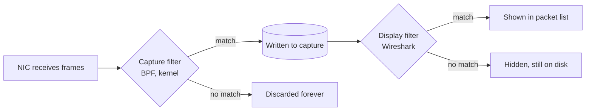
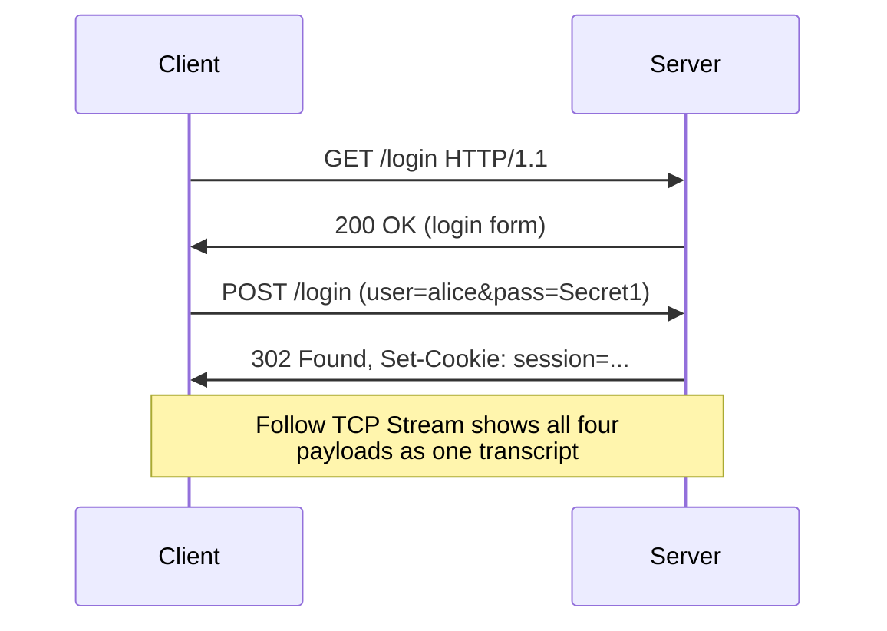
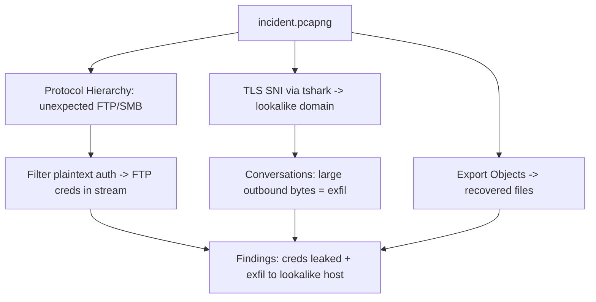

This is Chapter 2 of the Network Attacks notebook. Chapter 1 got you capturing
traffic and reading a single packet field by field — the Ethernet frame, the IP
header, the TCP segment, the handshake on the wire. That skill is necessary but
not sufficient. A real capture is not one packet; it is hundreds of thousands or
millions of them, most of them noise. The difference between someone who *has*
Wireshark and someone who can *use* it is entirely about the ability to reduce
that flood to the handful of packets that answer a specific question.

This chapter is about that reduction. It teaches the display-filter language as
a language — with a grammar, operators and field references — rather than as a
grab-bag of snippets to copy. It then layers on the analysis features built on
top of filtering: following streams, the Statistics menus that summarise an
entire capture at a glance, Expert Info, TLS decryption, object export and file
carving, and finally `tshark` so you can do all of it headless and in scripts.

Everything here assumes captures you are authorised to take and analyse — your
own lab traffic, a provided PCAP, or traffic on a network you have written
permission to test. Passive analysis of other people's traffic without
authorisation is unlawful interception in most jurisdictions.

## Why This Matters

A pentester who has just run a man-in-the-middle attack (Chapters 5–6) has a
capture full of a victim's traffic and needs to pull the one login POST out of
it. An incident responder handed a 2 GB PCAP from a compromised segment needs to
find the C2 beacon among thousands of legitimate flows. A CTF player is given a
`.pcapng` and told "the flag is in the traffic." All three problems are the same
problem: **express, precisely, the property that distinguishes the interesting
packets from the rest, and let Wireshark discard everything else.** That is what
display filters do, and the analysis tools in this chapter are what you reach for
once the filter has narrowed the field.

## Part 1: Capture Filters vs Display Filters — Never Confuse Them Again

Chapter 1 introduced the distinction; it is so important that we start here and
go deeper. Wireshark has **two completely separate filter languages**, applied at
two different times, with two different syntaxes.

**Capture filters** use the BPF (Berkeley Packet Filter) syntax and decide which
packets are *written to disk at all*. They run in the kernel, before Wireshark
sees anything, so they are cheap and lossy — packets they reject are gone
forever. You set them before you start capturing.

**Display filters** use Wireshark's own syntax and decide which of the
already-captured packets are *shown*. They run over the capture file, are far
more expressive (any dissected field, not just headers), and are non-destructive
— clearing the filter brings every packet back.

| Property | Capture filter (BPF) | Display filter (Wireshark) |
|----------|----------------------|----------------------------|
| When applied | Before capture, in kernel | After capture, in UI |
| Syntax example | `tcp port 80` | `tcp.port == 80` |
| Can reference | Header fields only | Any dissected field |
| Destructive? | Yes — rejected packets lost | No — just hidden |
| "and/or/not" | `and or not` | `&&  \|\|  !` (or `and or not`) |
| Equality | `host 10.0.0.5` | `ip.addr == 10.0.0.5` |
| Set before/after | Before start | Any time |

The single most common beginner mistake is typing a display filter into the
capture-filter box (or vice versa). Wireshark colours the box **green** for a
valid filter, **red** for a syntax error, and **yellow** as a warning (the filter
is valid but may not mean what you think, e.g. `ip.addr != x` — more on that
trap in Part 3). Watch the colour.



**Rule of thumb:** capture broadly (a loose or no capture filter) so you don't
lose evidence, then narrow endlessly with display filters. The exception is
high-volume long-running captures where disk or performance forces a capture
filter — then filter to the hosts/ports of interest at capture time.

## Part 2: The Display-Filter Language — Fields Are Everything

Every value Wireshark's dissectors extract is addressable as a **field name** in
the display-filter language. The names follow a `protocol.field` (and often
`protocol.subfield`) convention. You do not have to memorise them: click any
field in the packet-detail pane and Wireshark shows its filter name in the status
bar at the bottom left. That is how you learn the field vocabulary — click,
read, reuse.

Some anchor examples across the stack:

| Layer | Field | Meaning |
|-------|-------|---------|
| Ethernet | `eth.src`, `eth.dst`, `eth.type` | MAC addresses, ethertype |
| ARP | `arp.opcode`, `arp.src.proto_ipv4` | request/reply, sender IP |
| IPv4 | `ip.src`, `ip.dst`, `ip.addr`, `ip.ttl`, `ip.flags.df`, `ip.len` | addresses, TTL, don't-fragment, length |
| IPv6 | `ipv6.src`, `ipv6.dst`, `ipv6.addr` | v6 addresses |
| TCP | `tcp.port`, `tcp.srcport`, `tcp.flags.syn`, `tcp.seq`, `tcp.analysis.retransmission` | ports, flags, sequence, analysis |
| UDP | `udp.port`, `udp.length` | ports, length |
| DNS | `dns.qry.name`, `dns.flags.response`, `dns.a` | query name, response bit, A record |
| HTTP | `http.request.method`, `http.host`, `http.request.uri`, `http.response.code` | method, host, path, status |
| TLS | `tls.handshake.type`, `tls.handshake.extensions_server_name` | handshake type, SNI |

The simplest filter is a bare field name, which is true when the field is
**present** in a packet:

```
http
dns
arp
tls.handshake
tcp.analysis.retransmission
```

`http` shows every packet the HTTP dissector touched; `tcp.analysis.retransmission`
shows only retransmitted segments (a great health/anomaly filter). Presence
filtering is underused and extremely powerful — it answers "show me all the X" in
one word.

## Part 3: Comparison Operators and the `ip.addr != ` Trap

Comparison operators let you test a field against a value. Both C-style and
English spellings work; pick one and be consistent.

| Meaning | C-style | English |
|---------|---------|---------|
| equal | `==` | `eq` |
| not equal | `!=` | `ne` |
| greater than | `>` | `gt` |
| less than | `<` | `lt` |
| greater/equal | `>=` | `ge` |
| less/equal | `<=` | `le` |

```
ip.src == 10.10.10.5
tcp.port == 443
http.response.code >= 400
ip.ttl < 64
frame.len > 1400
```

### The trap that catches everyone

`ip.addr` is a **multi-value field**: a packet has both a source and a
destination IP, and `ip.addr` matches *either*. So:

```
ip.addr == 10.0.0.5      # packets where SRC or DST is 10.0.0.5  (correct, intuitive)
ip.addr != 10.0.0.5      # NOT "packets not involving 10.0.0.5"
```

The second filter reads as "there exists an `ip.addr` field not equal to
10.0.0.5." Every packet to/from 10.0.0.5 *also* has a second address that is not
10.0.0.5, so it **still matches**. The filter shows essentially everything — a
classic yellow-box warning. To actually exclude a host, negate the positive:

```
!(ip.addr == 10.0.0.5)
```

This "field with multiple instances + `!=`" trap applies to `tcp.port`,
`eth.addr`, `dns.a`, and any repeated field. The safe habit is: **build the
positive match, then wrap it in `!( ... )` to invert.**

## Part 4: Logical Operators, Grouping and Precedence

Combine expressions with logical operators:

| Meaning | C-style | English |
|---------|---------|---------|
| and | `&&` | `and` |
| or | `\|\|` | `or` |
| not | `!` | `not` |

```
ip.src == 10.0.0.5 && tcp.port == 80
http.request.method == "POST" || http.request.method == "PUT"
!arp && !icmp
tcp.flags.syn == 1 && tcp.flags.ack == 0        # SYN packets only (connection attempts)
dns && ip.addr == 8.8.8.8
```

`&&` binds tighter than `||`, so use parentheses to make intent explicit and
avoid surprises:

```
(ip.src == 10.0.0.5 || ip.src == 10.0.0.6) && http
```

Without the parentheses, `ip.src == 10.0.0.5 || ip.src == 10.0.0.6 && http` means
"from .5, OR (from .6 and http)" — almost never what you want. **When in doubt,
parenthesise.**

## Part 5: Membership, Slice, `contains` and `matches`

Beyond simple comparisons, the language has four power operators that separate
casual users from experts.

### 5.1 The set-membership operator `in`

Test a field against a set or range in one expression:

```
tcp.port in {80, 443, 8080}
ip.ttl in {1 .. 5}
http.response.code in {301, 302, 307, 308}
```

This is far cleaner than chaining `||`. Ranges use `..`.

### 5.2 The slice operator `[ ]`

Address individual bytes (or byte ranges) of a field, zero-indexed:

```
eth.src[0:3] == 00:0c:29             # first 3 bytes of MAC = VMware OUI
frame[0:1] == 45                     # first byte of frame
ip.dst[0] == 10                      # first octet of dest IP
```

Slicing is how you match on OUIs (vendor prefixes), magic bytes, and fixed
offsets when no named subfield exists.

### 5.3 `contains` — substring/byte search

`contains` does a byte-sequence search within a field. Great for finding a string
anywhere in a payload:

```
http contains "password"
frame contains "flag{"
tcp contains "USER "
dns.qry.name contains "collab"
```

`frame contains "..."` searches the entire packet bytes — a blunt but effective
"is this string anywhere in this packet" filter, invaluable in CTF PCAPs.

### 5.4 `matches` — regular expressions

`matches` (alias `~`) applies a PCRE regular expression to a field. Use it when
`contains` is too coarse:

```
http.request.uri matches "\\.(php|asp|jsp)$"
http.user_agent matches "(?i)sqlmap|nikto|nmap"
frame matches "[0-9]{16}"                 # crude credit-card-number hunt
dns.qry.name matches "^[a-f0-9]{20,}\\."  # long hex subdomain = possible DNS tunnel
```

Regex is case-sensitive by default; prefix `(?i)` for case-insensitive. Backslashes
must be escaped in the filter bar as shown.

| Operator | Use it for | Example |
|----------|-----------|---------|
| `==` / `!=` | exact field value | `tcp.port == 22` |
| `in { }` | value in a set/range | `tcp.port in {80,443}` |
| `[ ]` slice | specific bytes/OUI | `eth.src[0:3]==00:50:56` |
| `contains` | byte/substring present | `http contains "admin"` |
| `matches` / `~` | regex pattern | `http.host matches "(?i)evil"` |

## Part 6: Saved Filters, Filter Buttons and Colouring Rules

You will reuse the same twenty filters forever. Wireshark lets you save them.

- **Display Filter Bookmarks** (the ribbon icon left of the filter bar) save
  named filters you can recall in a click.
- **Filter Buttons** (right of the filter bar, the `+`) pin a filter as a toolbar
  button — one click to apply `http.request`, another for `tcp.flags.syn==1`.
- **Colouring Rules** (View → Coloring Rules) paint matching packets in the
  packet list. This is analysis at a glance: colour retransmissions red, DNS
  green, your target host yellow, and patterns jump out without any filtering.

A practical starter set of colouring rules for offensive/IR work:

```
tcp.analysis.flags && !tcp.analysis.window_update     # problems: bright red
http.request.method == "POST"                          # POSTs: orange (creds live here)
tls.handshake.type == 1                                # Client Hello: light blue (new TLS convos)
dns                                                    # DNS: green
arp                                                    # ARP: grey (spot spoofing storms)
```

**Right-click → Apply as Filter / Prepare as Filter** is the fastest way to build
filters interactively: right-click a field value, choose "Apply as Filter →
Selected," and Wireshark writes the filter for you. "Prepare as Filter" stages it
without applying so you can edit first. "…and Selected" / "…or Selected" append to
the current filter. Learn these; they are 80% of day-to-day filtering.

## Part 7: Following Streams — Reassembling the Conversation

A single TCP connection is scattered across many packets interleaved with other
traffic. **Follow Stream** reassembles one conversation into a single readable
transcript. Right-click any packet in a connection → **Follow → TCP Stream**
(or UDP/HTTP/TLS/HTTP2/QUIC Stream).

Wireshark then:

1. Applies a display filter isolating that stream (`tcp.stream eq 7`).
2. Opens a window showing the payload bytes in order, client text in one colour
   and server text in another.
3. Lets you switch view: ASCII, Hex Dump, C arrays, Raw, or YAML.



**Follow HTTP Stream** additionally de-chunks and de-gzips the body so you read
the actual HTML/JSON, not the wire encoding. For plaintext protocols (HTTP, FTP,
SMTP, POP3, IMAP, Telnet, IRC), Follow Stream is where credentials, commands and
data are read directly.

The `tcp.stream` field is worth internalising: every TCP connection gets a unique
integer index, so `tcp.stream eq 12` isolates exactly one conversation, and you
can jump between streams by editing the number.

## Part 8: The Statistics Menus — Understanding a Whole Capture Fast

Before filtering packet by packet, summarise. The **Statistics** menu answers
"what is in this capture" in seconds.

### 8.1 Protocol Hierarchy

`Statistics → Protocol Hierarchy` shows a tree of every protocol present with
per-protocol packet and byte counts and percentages. In one glance you see "70%
TLS, 20% HTTP, 5% DNS, and — wait — why is there SMB and Kerberos in a capture
that should be all web?" Anomalies in the hierarchy are leads. Right-click any
row → Apply as Filter to drill in.

### 8.2 Conversations and Endpoints

`Statistics → Conversations` lists every pair of talkers (by Ethernet, IPv4,
IPv6, TCP, UDP) with packet/byte counts, duration and bandwidth. Sort by bytes to
find the biggest transfers (exfiltration, downloads); sort by packets to find
chatty hosts (scanning, beaconing). `Statistics → Endpoints` does the same per
single host, and can map IPs to countries with GeoIP.

The "Limit to display filter" checkbox scopes these tables to your current
filter — combine a filter with Conversations to summarise just the subset you
care about.

### 8.3 IO Graph, Flow Graph, Expert Info

- **IO Graph** (`Statistics → I/O Graph`) plots packets/bytes over time, with per-
  line display filters. A beacon shows as a regular sawtooth; a DoS as a spike; a
  transfer as a plateau.
- **Flow Graph** (`Statistics → Flow Graph`) draws a sequence diagram of the
  selected packets — perfect for visualising a handshake, a TCP reset storm, or a
  multi-host attack sequence.
- **Expert Information** (`Analyze → Expert Information`) is Wireshark's built-in
  anomaly report: retransmissions, duplicate ACKs, zero windows, malformed
  packets, resets — grouped by severity (Error/Warning/Note/Chat). Start here on
  any "the network is slow / weird" capture.

| Statistic | Answers | Offensive/IR use |
|-----------|---------|------------------|
| Protocol Hierarchy | What protocols, how much | Spot unexpected protocols (SMB, IRC, Tor) |
| Conversations | Who talks to whom, how much | Find exfil (big bytes), beacons (regular) |
| Endpoints | Per-host totals + GeoIP | Flag traffic to unexpected countries |
| IO Graph | Volume over time | Beacon periodicity, DoS spikes |
| Flow Graph | Sequence of packets | Visualise handshakes/attacks |
| Expert Info | Protocol anomalies | Retransmits, resets, malformed |

### 8.4 Service Response Time and protocol-specific stats

`Statistics` also has per-protocol response-time tables: `Service Response Time →
SMB2 / DCE-RPC / LDAP …` reports min/max/average response times per operation —
how you prove "the SMB server is slow" or spot an abnormally long Kerberos
exchange. `Statistics → DNS` summarises query types, response codes and rcodes;
a spike in `NXDOMAIN` responses is a classic sign of DGA malware or a
misconfigured client. `Statistics → HTTP → Requests / Packet Counter` breaks down
requests by host and status code, turning "what did this host fetch" into a
sortable tree in two clicks.

## Part 9: Reassembly, Object Export and File Carving

Wireshark reassembles payloads split across multiple TCP segments (controlled by
"Allow subdissector to reassemble TCP streams" in TCP preferences). This lets it
present a 2 MB HTTP response as a single object even though it crossed thousands
of packets.

**Export Objects** (`File → Export Objects → HTTP / SMB / TFTP / IMF / …`) lists
every file/object the dissector reconstructed and lets you save them to disk. This
is how you carve a downloaded malware sample, an exfiltrated document, or a
transferred image straight out of a capture:

```
File → Export Objects → HTTP → (select the .exe row) → Save
```

**IR use case:** an analyst pulls the exact binary that was downloaded from a
malicious host directly from the PCAP for sandboxing, without ever touching the
endpoint.

**CTF relevance:** "extract the file from the capture" challenges are solved with
Export Objects, or by Follow Stream → Raw → Save for non-HTTP transfers, or with
`tshark`/`foremost`/`binwalk` when the protocol isn't dissected.

For protocols without an Export Objects handler, carve manually: Follow the
stream, switch to **Raw**, and **Save As** the bytes; then identify the file type
with `file` and repair headers if needed.

## Part 10: Decrypting TLS in Wireshark

Most interesting traffic is TLS-encrypted, so Follow Stream shows ciphertext. There
are two legitimate ways to decrypt it in a lab or authorised test.

### 10.1 The key-log file (the modern, reliable method)

Browsers and many tools, when the `SSLKEYLOGFILE` environment variable is set,
write the per-session TLS secrets to a file. Point Wireshark at that file and it
decrypts on the fly — no private key needed, and it works for ephemeral
(forward-secret) cipher suites where the server key alone is useless.

```bash
# On the client machine BEFORE launching the browser:
export SSLKEYLOGFILE=/home/user/tls-keys.log
firefox &        # or chromium; it appends secrets as sessions are made
```

```
Wireshark: Preferences → Protocols → TLS →
  (Pre)-Master-Secret log filename: /home/user/tls-keys.log
```

Now HTTPS streams decrypt: Follow HTTP Stream shows plaintext requests and
responses. This is the method used for debugging your own apps and for analysing
malware detonated in a lab where you control the client.

### 10.2 The RSA private key (legacy, non-PFS only)

If — and only if — the server used a static RSA key exchange (no forward secrecy)
and you lawfully possess the server's private key, you can load it under
Preferences → TLS → RSA keys list. Modern servers negotiate ECDHE and this method
fails; the key-log file is the general solution.

**Blue team note:** the same key-log mechanism lets defenders decrypt traffic to
their own instrumented endpoints for inspection. It is not an attack on TLS; it is
using secrets you already legitimately hold.

## Part 11: tshark — Filtering and Field Extraction on the Command Line

`tshark` is Wireshark's terminal twin: the full dissector engine and display-
filter language with no GUI. It is what you use to script analysis, process huge
files, and pull specific fields for further tooling. It ships with Wireshark.

### 11.1 Read a file with a display filter

```bash
tshark -r capture.pcapng -Y 'http.request.method == "POST"'
```

- `-r file` read from a capture file instead of live.
- `-Y 'filter'` apply a **display** filter (note: `-f` would be a capture/BPF
  filter for live capture).

### 11.2 Extract specific fields as columns

The killer feature: `-T fields` plus `-e field` pulls named fields into tab- or
comma-separated output for `grep`, `sort`, `awk`, or a spreadsheet.

```bash
tshark -r capture.pcapng -Y http.request \
  -T fields -e ip.src -e http.host -e http.request.uri \
  -E header=y -E separator=,
```

- `-T fields` output mode = just the fields you name.
- `-e ip.src` add a field to the output (repeatable, order preserved).
- `-E header=y` print a header row; `-E separator=,` make it CSV.

Example output:

```text
ip.src,http.host,http.request.uri
10.0.0.5,shop.local,/login
10.0.0.5,shop.local,/checkout
10.0.0.9,cdn.local,/img/logo.png
```

### 11.3 Common one-liners

```bash
# Every DNS query name in the capture, sorted unique
tshark -r c.pcapng -Y dns.flags.response==0 -T fields -e dns.qry.name | sort -u

# All TLS SNIs (what hosts were visited, even over HTTPS)
tshark -r c.pcapng -Y 'tls.handshake.type==1' -T fields -e tls.handshake.extensions_server_name | sort -u

# Credentials in a plaintext FTP session
tshark -r c.pcapng -Y 'ftp.request.command in {"USER","PASS"}' -T fields -e ftp.request.command -e ftp.request.arg

# Live capture, headless, ring buffer of 10x100MB files
tshark -i eth0 -b filesize:100000 -b files:10 -w /tmp/cap.pcapng
```

- `-i eth0` capture live on an interface.
- `-w file` write raw packets to a capture file.
- `-b filesize:KB` / `-b files:N` ring buffer: N files of the given size, oldest
  overwritten — how you capture continuously without filling the disk.

```bash
# Count packets per source IP (top talkers, headless)
tshark -r c.pcapng -T fields -e ip.src | sort | uniq -c | sort -rn | head

# Extract every HTTP Host + URI a single client requested
tshark -r c.pcapng -Y 'http.request && ip.src==10.0.0.5' -T fields -e http.host -e http.request.uri

# Pull all Set-Cookie values (session tokens) from responses
tshark -r c.pcapng -Y 'http.set_cookie' -T fields -e http.set_cookie

# Reassemble and print one HTTP stream as text
tshark -r c.pcapng -q -z follow,tcp,ascii,7
```

**Red team usage:** `tshark -T fields` on a MITM capture extracts every credential
and cookie into a tidy list for the report. **Blue team usage:** the same command
on span-port traffic feeds an ad-hoc detection when your NDR is blind to a
protocol.

## Part 12: The Full Worked Lab — Triage a Mixed Capture

**Scenario:** you are handed `incident.pcapng` (a mixed capture from a segment)
and asked four questions. This lab shows the exact filters and how to reason to
each answer. Build a comparable capture in a lab (browse a few sites, do an FTP
login, run a DNS query, download a file) if you want to follow along; never
analyse traffic you are not authorised to.

### Q1 — What protocols are present and is anything unexpected?

```
Statistics → Protocol Hierarchy
```

You see HTTP, TLS, DNS — and unexpectedly **FTP** and **SMB**. FTP in a "web
only" segment is a lead. Note it.

### Q2 — Were any credentials sent in cleartext?

Filter for the usual plaintext-auth protocols:

```
ftp.request.command == "USER" || ftp.request.command == "PASS" || http.authorization || http.request.method == "POST"
```

A hit on FTP. Right-click one → **Follow → TCP Stream**:

```text
220 corp-ftp ready
USER backup
331 Password required
PASS Backup#2023!
230 Login successful
```

Cleartext FTP credentials captured. Confirm with `tshark`:

```bash
tshark -r incident.pcapng -Y 'ftp.request.command in {"USER","PASS"}' \
  -T fields -e ftp.request.command -e ftp.request.arg
# USER  backup
# PASS  Backup#2023!
```

### Q3 — Which external hosts were contacted, including over HTTPS?

DNS answers plaintext lookups; TLS SNI answers HTTPS destinations even without
decryption:

```bash
tshark -r incident.pcapng -Y 'tls.handshake.type==1' \
  -T fields -e tls.handshake.extensions_server_name | sort -u
# api.dropbox-sync.net        <-- suspicious lookalike
# cdn.jsdelivr.net
# shop.corp.local
```

`api.dropbox-sync.net` is a lookalike domain — a possible exfil channel. Pull the
DNS answer and the conversation volume:

```
Statistics → Conversations → TCP  (sort by Bytes, Limit to display filter)
```

A large outbound transfer to that host confirms suspicion.

### Q4 — Was a file transferred, and can we recover it?

```
File → Export Objects → HTTP
```

An entry `report_q3.xlsx` downloaded from `shop.corp.local`, and a large POST to
`api.dropbox-sync.net`. Save the xlsx; for the POST, Follow TCP Stream → Raw →
Save to carve the exfiltrated bytes for analysis.

### Q5 — When did the exfil happen, and on what cadence?

Isolate the suspicious conversation, switch the Time column to "Seconds Since
Previous Displayed Packet," and read the deltas:

```bash
tshark -r incident.pcapng -Y 'ip.addr==203.0.113.10 && tls.handshake.type==1' \
  -T fields -e frame.time_relative -e frame.time_delta
# 0.000000  0.000000
# 60.114    60.114
# 120.233   60.119     <-- ~60s cadence = automated beacon, not human
```

A near-constant 60-second delta confirms an automated exfil/beacon rather than a
user action, and `frame.time_relative` gives the exact window to report.



**Report takeaway:** cleartext FTP credentials (`backup:Backup#2023!`), likely
data exfiltration to a lookalike domain, and the recovered file — each with the
exact filter/step that produced it so a colleague can reproduce the finding.

## Part 13: Time, Packet Marking and Navigating a Capture

Analysis is often about *when* as much as *what*. Wireshark's time handling is
subtle and worth learning because a wrong time reference produces wrong
conclusions about latency, beaconing intervals and event ordering.

### 13.1 Time display formats

`View → Time Display Format` changes what the Time column means. The important
choices:

| Format | Shows | Use it for |
|--------|-------|-----------|
| Seconds Since Beginning of Capture | offset from packet 1 (default) | rough sequencing |
| Time of Day | wall-clock time | correlating with logs/alerts |
| UTC Time of Day | wall-clock in UTC | correlating across timezones |
| Seconds Since Previous Displayed Packet | delta between shown packets | spotting gaps / beacon gaps |
| Seconds Since Previously Captured Packet | delta between all packets | raw inter-packet timing |

The `frame.time_delta` and `frame.time_relative` fields expose these to filters
and to `tshark -e`. To measure the gap between two specific packets, click the
first, right-click → **Set/Unset Time Reference** (Ctrl+T); the Time column now
counts from that packet, so the second packet's time is the exact delta. This is
how you measure a beacon interval or a server think-time precisely.

### 13.2 Beacon hunting with time

C2 beacons phone home on a fixed cadence (e.g. every 60 s, often with jitter).
Combine a conversation filter with the delta view or an IO Graph:

```
ip.dst == 203.0.113.10 && tls.handshake.type == 1
```

Set the time format to "Seconds Since Previous Displayed Packet" and the deltas
cluster tightly around the beacon interval — a periodicity a human transfer never
shows. In the IO Graph, plot that filter with a 1-second interval and the regular
comb pattern is unmistakable.

### 13.3 Marking and navigation

- **Mark a packet** (Ctrl+M) to flag packets of interest; **File → Export
  Specified Packets → Marked** saves just those for a colleague.
- **Go → Go to Packet** (Ctrl+G) jumps to a packet number.
- **Find Packet** (Ctrl+F) searches packet list/detail/bytes for a string, hex
  value or display filter — pick the search type in the dropdown.

**IR use case:** mark the first and last packet of an intrusion, export the marked
range, and hand a focused 300-packet PCAP to the next analyst instead of a 2 GB
file.

## Part 14: Configuration Profiles, Custom Columns and Name Resolution

Wireshark is far more usable once you tailor it. These customisations live in
**configuration profiles**, so you can keep separate setups for, say,
"web-pentest" and "AD/SMB analysis."

### 14.1 Profiles

`Edit → Configuration Profiles` (or right-click the profile name in the bottom
status bar) creates named profiles. Each profile has its own columns, colouring
rules, filter buttons and preferences. A pentester typically keeps a profile with
POST/credential colouring and HTTP columns, and another with SMB/Kerberos columns
for AD work.

### 14.2 Custom columns

The default columns are generic. Bind a column to any field: `Edit → Preferences →
Columns → +`, set Type to "Custom" and Field to, for example, `http.host`. Even
faster: right-click a field in the detail pane → **Apply as Column**.

| Add this custom column | To see, at a glance |
|------------------------|---------------------|
| `http.host` | every HTTP Host header |
| `dns.qry.name` | every DNS query name |
| `tls.handshake.extensions_server_name` | every HTTPS SNI |
| `tcp.stream` | which connection each packet belongs to |
| `ip.geoip.country` | destination country (with GeoIP DB) |

### 14.3 Name resolution — helpful and dangerous

`View → Name Resolution` toggles resolving addresses to names. Three kinds:

- **MAC name resolution** — maps OUI prefixes to vendor names (`Apple_a1:b2`).
  Local table; always safe and useful for spotting device vendors.
- **Transport name resolution** — maps port numbers to service names (`443 →
  https`). Local, cosmetic.
- **Network name resolution** — resolves IP → hostname via **live DNS**. This is
  the dangerous one: if enabled, Wireshark issues real DNS queries for addresses
  in the capture, which leaks to the network that you are analysing those
  addresses and can hang the UI on a slow resolver. During an authorised
  engagement or malware analysis, **leave network name resolution off** so you
  never touch attacker infrastructure with a reverse lookup.

**Red team / OPSEC note:** leaving network name resolution on while triaging a
capture of your own C2 traffic fires DNS lookups for your infrastructure from the
analyst box — a real OPSEC leak. Default it off in your profile.

## Part 15: Common Pitfalls

- **`ip.addr != x` shows everything.** Use `!(ip.addr == x)` (Part 3).
- **Red filter box = syntax error; yellow = valid but suspect.** Don't run a red
  filter and wonder why nothing changes.
- **Reassembly off → truncated objects.** If Export Objects gives partial files,
  enable "Allow subdissector to reassemble TCP streams" in TCP preferences and
  reload.
- **Filtering on `tcp.port` with `!=` misses half a conversation.** Same
  multi-value trap as `ip.addr`.
- **Following the wrong stream.** `tcp.stream eq N` is per-connection; a browser
  opens many parallel streams to one host — check the stream index, not just the
  IP.
- **Assuming HTTPS is opaque.** SNI and certificate CN/SAN are in cleartext in the
  handshake; you can enumerate visited hosts without decrypting anything.
- **Capturing with offload on distorts sizes/checksums** (from Chapter 1) — turn
  off checksum-offload warnings or GRO/TSO when packet sizes look impossible.

## Part 16: Detection & Defense Angle

Filtering and stream analysis are dual-use: the same skills that let a pentester
loot a MITM capture let a defender hunt in span-port traffic. From the blue-team
side:

- **Cleartext protocols are the finding.** If your captures contain FTP, Telnet,
  HTTP Basic auth, SNMPv1/2c, or LDAP simple binds, that is a control failure —
  the fix is to disable/upgrade them (FTPS/SFTP, SSH, HTTPS, SNMPv3, LDAPS),
  because anyone with capture access (or a successful MITM from later chapters)
  reads them trivially.
- **Detecting the analyst is hard; detecting the collection is not.** Passive
  Wireshark capture emits nothing on the wire, but the *access* that enables it —
  a span/mirror port, a tap, a NIC in promiscuous mode, or an ARP-spoofing MITM —
  is detectable (Chapter 1's ARP-storm detection; monitoring switch config
  changes; 802.1X and DHCP snooping to control who can even see traffic).
- **Encrypt everything, then monitor metadata.** When payloads are TLS, defenders
  pivot to the same fields analysts use here: SNI, JA3/JA3S fingerprints, cert
  attributes, and Conversations-style flow volumes/periodicity to spot beacons and
  exfil without decryption.
- **NDR tools are tshark at scale.** Zeek and Suricata are, in effect, productised
  versions of the `tshark -T fields` extraction in Part 11 — they log the same
  connection, DNS, TLS-SNI and HTTP fields continuously. Knowing the Wireshark
  field names transfers directly to writing Zeek/Suricata logic.

- **Turn your filters into standing detections.** Every display filter that found
  something in Part 12 — cleartext auth, lookalike SNI, long hex DNS labels,
  fixed-cadence beacons — maps to a Zeek/Suricata/SIEM rule. The workflow is:
  hunt interactively in Wireshark, confirm the filter isolates the badness
  cleanly, then port the field logic into your always-on tooling so the next
  occurrence alerts automatically instead of waiting for another manual capture.
- **Baseline before you hunt.** Anomaly-based filters (`dns.qry.name matches
  "[a-f0-9]{20,}"`, unusual `ip.geoip.country`, off-hours transfers) only work if
  you know what normal looks like. Keep a reference capture of a clean segment and
  diff the Protocol Hierarchy and Conversations against a suspect one.

The mnemonic: **passive capture is silent, but the plaintext it captures and the
positioning it requires are both loud** — defend the second and the first stops
mattering.

## Final Revision / Summary

- Wireshark has two filter languages: **capture (BPF, destructive, pre-capture)**
  and **display (Wireshark syntax, non-destructive, post-capture)**. Capture
  broadly, narrow with display filters.
- Every dissected value is a **field** (`protocol.field`); click a field to learn
  its name. A bare field name filters for **presence**.
- Master the operators: comparison (`== != > <`), logical (`&& || !`), membership
  (`in { }`), slice (`[ ]`), `contains` (bytes/substring), `matches` (regex).
- Avoid the multi-value `!=` trap: invert with `!( ... )`.
- **Follow Stream** reassembles a conversation into a readable transcript;
  `tcp.stream eq N` isolates one connection.
- The **Statistics** menus (Protocol Hierarchy, Conversations, Endpoints, IO
  Graph, Flow Graph) and **Expert Info** summarise a whole capture fast.
- **Export Objects** carves transferred files; Follow-Stream-Raw carves the rest.
- Decrypt TLS in a lab with an **`SSLKEYLOGFILE`** key-log file (works with
  forward secrecy); the RSA-key method only works for legacy non-PFS servers.
- **tshark** gives the whole language headless; `-Y` display filter, `-T fields -e`
  field extraction is the scripting workhorse.
- Blue team: cleartext protocols are the real finding; when everything is TLS,
  pivot to SNI/JA3/flow metadata.

## Cheat Sheet / Quick Reference

**Operators**

```
==  !=  >  <  >=  <=            comparison (or eq ne gt lt ge le)
&&  ||  !                       logical  (or and or not)
in {a, b, c}   in {1 .. 5}      membership / range
field[0:3]                      byte slice (zero-indexed)
contains "str"                  byte/substring search
matches "regex"  (~)           PCRE regex (prefix (?i) for i-case)
!(ip.addr == x)                 correct way to exclude a host
```

**High-value filters**

```
http.request                              all HTTP requests
http.request.method == "POST"             POSTs (creds/data)
http.authorization || ftp.request.command in {"USER","PASS"}   cleartext auth
tcp.flags.syn==1 && tcp.flags.ack==0      connection attempts (scans)
tcp.analysis.retransmission               retransmits (trouble)
tls.handshake.type == 1                   TLS Client Hello (new convos)
tls.handshake.extensions_server_name      SNI (HTTPS destinations)
dns.flags.response == 0                    DNS queries
dns.qry.name matches "^[a-f0-9]{20,}\\."  possible DNS tunnel
frame contains "flag{"                     CTF string hunt
```

**Follow / stats / carve**

```
Right-click → Follow → TCP/UDP/HTTP/TLS Stream
tcp.stream eq N                            isolate one connection
Statistics → Protocol Hierarchy | Conversations | Endpoints | I/O Graph | Flow Graph
Analyze → Expert Information
File → Export Objects → HTTP/SMB/TFTP/IMF
```

**tshark**

```
tshark -r f.pcapng -Y 'display.filter'
tshark -r f.pcapng -Y http.request -T fields -e ip.src -e http.host -e http.request.uri -E header=y -E separator=,
tshark -i eth0 -b filesize:100000 -b files:10 -w cap.pcapng      # ring buffer
tshark -r f.pcapng -Y 'tls.handshake.type==1' -T fields -e tls.handshake.extensions_server_name | sort -u
```

**TLS decryption (lab)**

```
export SSLKEYLOGFILE=/path/keys.log    # set before launching browser
Preferences → Protocols → TLS → (Pre)-Master-Secret log filename → /path/keys.log
```

## Practice Labs & Resources

- **Malware-Traffic-Analysis.net** — the definitive free library of realistic
  PCAP exercises with questions and answers; work the "traffic analysis" and
  "exercises" sets to train filtering, Follow-Stream and Export-Objects on real
  infection traffic.
- **PortSwigger / general web labs** — pair with Chapter 1–3 web work: capture your
  own lab logins over HTTP and decrypt your own HTTPS with `SSLKEYLOGFILE`.
- **TryHackMe** — *Wireshark: The Basics*, *Wireshark: Packet Operations*,
  *Wireshark: Traffic Analysis* (a three-room path that maps almost exactly onto
  Chapters 1–3 of this notebook).
- **CyberDefenders** and **Blue Team Labs Online** — PCAP-based DFIR challenges
  (network forensics category) that reward exactly the triage workflow in Part 12.
- **picoCTF / CTF "Forensics" category** — "find the flag in the PCAP" challenges;
  practise `frame contains`, Follow-Stream and Export-Objects.
- **Wireshark's own sample captures** (wiki.wireshark.org SampleCaptures) — one
  clean capture per protocol; open each and read it field by field to build the
  dissector-tree vocabulary.

Work each capture twice: once to answer the questions, once to write down the
exact filter that produced each answer. That second pass is what turns clicking
around into a repeatable protocol-analysis methodology you can apply to the MITM
and credential-capture captures in the chapters ahead.
