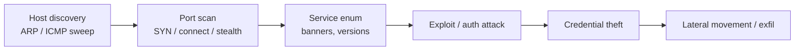
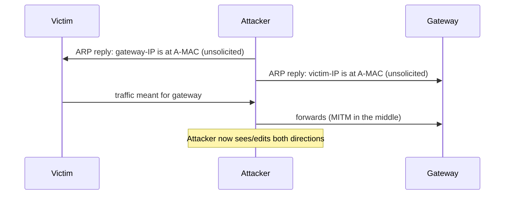
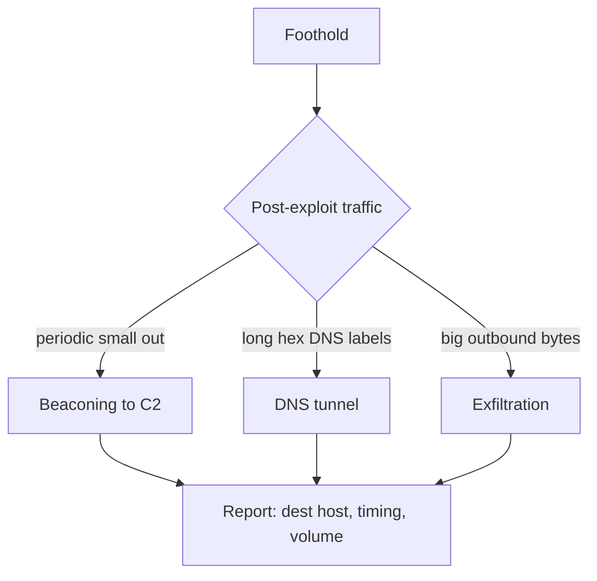
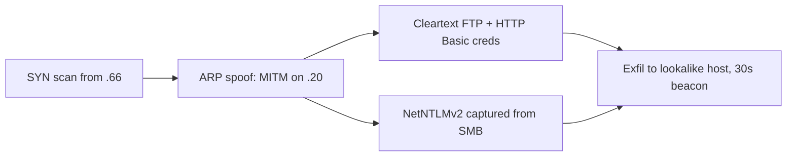
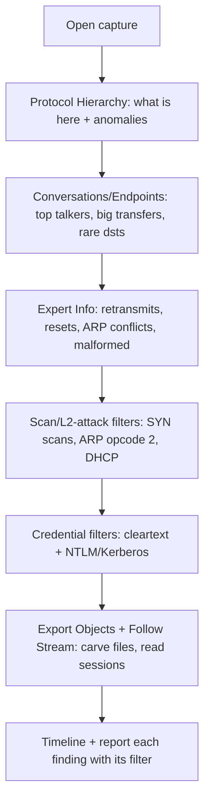

**Level:** Advanced · **Track:** Penetration Testing · **Read time:** 255 min

This is Chapter 3 of the Network Attacks notebook and the point where Wireshark
stops being a debugging tool and becomes an offensive and investigative weapon.
Chapter 1 taught you to capture and read a packet; Chapter 2 taught you to filter,
follow streams and summarise a whole capture. Now we point those skills at the two
things a network attacker and a network defender both care about most: **attacks
as they appear on the wire**, and **credentials moving across it**.

The through-line is that most damage on a local network is visible if you know
what to look for. A port scan has a signature. ARP spoofing has a signature. A
cleartext login is quite literally readable. NTLM and Kerberos exchanges leak
crackable material. This chapter is a field guide to those signatures and to
turning a capture into loot (as a pentester) or into a timeline (as an incident
responder).

Everything here is for **authorised** work: your own lab traffic, a client
network you have written permission to test, or a provided PCAP. Intercepting or
extracting credentials from traffic you are not authorised to touch is a serious
crime. The credential-capture techniques exist so you can prove impact in a report
and so defenders can understand exactly what an attacker sees.

## Why This Matters

When a pentester runs the man-in-the-middle attacks in the next chapters, the
*capture* is the deliverable — a packet trace proving that a domain user's
credentials, an internal API token, or a database password crossed the wire in a
recoverable form. Being able to open that capture and pull the credential out,
cleanly and reproducibly, is what converts "the network allows sniffing" into a
concrete, high-severity finding with evidence attached. On the defensive side, the
exact same reading skills let an incident responder reconstruct what an intruder
did, which accounts were exposed, and what left the building.

## Part 1: The Attacker's Footprints — What Malice Looks Like on the Wire

Before extracting credentials, learn to recognise the *activity* that precedes
theft. Reconnaissance and attack traffic have distinctive packet-level shapes.



Each stage leaves a filterable pattern. The rest of this part is the catalogue.

## Part 2: Fingerprinting Port Scans

A scanner probes many ports; the *way* it probes reveals the scan type, which in
turn tells you the tool and the attacker's intent.

### 2.1 TCP SYN (half-open) scan — the nmap default

The scanner sends `SYN`, notes the reply, and never completes the handshake:

- Open port → target replies `SYN, ACK`, scanner sends `RST` (tears it down).
- Closed port → target replies `RST, ACK`.

The signature is **many SYNs from one source to many destination ports, each
followed by a single RST from the scanner** — connections that are opened and
immediately reset, never reaching data transfer.

```
tcp.flags.syn == 1 && tcp.flags.ack == 0          # all connection attempts
tcp.flags.reset == 1                              # all resets
```

In Statistics → Conversations, a SYN scan shows hundreds of TCP conversations
each with 3–4 packets and zero payload bytes — a tell no legitimate client
produces.

In the packet list a SYN scan looks like this (Info column abbreviated):

```text
No.  Source        Destination   Proto  Info
101  10.10.10.66   10.10.10.20   TCP    54321 > 22  [SYN]
102  10.10.10.20   10.10.10.66   TCP    22 > 54321  [SYN, ACK]      <- port open
103  10.10.10.66   10.10.10.20   TCP    54321 > 22  [RST]           <- scanner tears down
104  10.10.10.66   10.10.10.20   TCP    54322 > 23  [SYN]
105  10.10.10.20   10.10.10.66   TCP    23 > 54322  [RST, ACK]      <- port closed
```

The open port completes to SYN,ACK then is reset by the scanner; the closed port
answers RST,ACK. Hundreds of these in a fraction of a second, from one source
across incrementing ports, is the unmistakable SYN-scan shape.

### 2.2 TCP connect scan

When the scanner lacks raw-socket privileges (`nmap -sT`), it completes the full
three-way handshake then closes. On the wire you see complete handshakes to many
ports followed by `RST` or `FIN` — noisier and fully logged by the target.

### 2.3 Stealth scans — FIN, XMAS, NULL

These send unusual flag combinations to closed ports, exploiting RFC 793: a closed
port replies `RST`, an open port stays silent.

| Scan | nmap | Flags set | Filter |
|------|------|-----------|--------|
| FIN | `-sF` | FIN only | `tcp.flags == 0x001` |
| XMAS | `-sX` | FIN, PSH, URG | `tcp.flags == 0x029` |
| NULL | `-sN` | none | `tcp.flags == 0x000` |
| ACK | `-sA` | ACK only (firewall mapping) | `tcp.flags == 0x010 && tcp.seq==1` |

An XMAS scan lit up in the packet list — packets with FIN+PSH+URG to sequential
ports — is unmistakable and is never legitimate traffic.

### 2.4 UDP scan

`nmap -sU` sends empty (or protocol-specific) UDP datagrams. Closed ports reply
with **ICMP port-unreachable** (type 3, code 3); open ports usually stay silent.
So a UDP scan appears as many outbound UDP packets and a flurry of inbound ICMP
type-3/code-3:

```
icmp.type == 3 && icmp.code == 3
```

**IR use case:** a burst of ICMP port-unreachable from one internal host to
another is a reliable UDP-scan indicator even when the UDP probes themselves are
lost in the noise.

## Part 3: Host Discovery and Sweeps

Before scanning ports, attackers find live hosts.

- **ARP sweep** (only works on the local segment): a storm of `who-has` ARP
  requests for every address in a subnet from one MAC. Filter: `arp.opcode == 1`
  and look at Conversations by Ethernet — one source asking for hundreds of IPs.
- **ICMP echo sweep**: many `ping` requests across a range. Filter:
  `icmp.type == 8`.
- **TCP ping** (`nmap -PS`/`-PA`): SYN or ACK to a common port (often 80/443)
  across a range to elicit any response through firewalls.

```
arp.opcode == 1        # ARP requests (sweep on-segment)
icmp.type == 8         # ICMP echo requests (ping sweep)
```

A single MAC generating ARP requests for an entire subnet in under a second is a
sweep; a normal host asks for a handful of neighbours.

## Part 4: Reading Layer-2 Attacks — ARP Spoofing, DHCP, and Resets

The next chapters weaponise these; here you learn to *see* them, which is both how
you verify your own MITM worked and how a defender catches one.

### 4.1 ARP spoofing / cache poisoning

ARP has no authentication, so an attacker sends unsolicited ARP replies claiming
"the gateway's IP is at *my* MAC." The victim's ARP cache is poisoned and its
traffic flows through the attacker.

Signatures in a capture:

- **Gratuitous/unsolicited ARP replies** (`arp.opcode == 2`) that nobody
  requested, often in a steady stream (the attacker refreshes the poison).
- **One MAC claiming multiple IPs**, or **one IP suddenly mapped to a new MAC**.

```
arp.opcode == 2                                   # ARP replies
arp.duplicate-address-detected                    # Wireshark flags IP->MAC conflicts
(arp.opcode==2) && (arp.src.hw_mac == <attacker MAC>)
```

Wireshark's Expert Info raises "duplicate IP address configured" when it sees an
IP map to two MACs — the classic ARP-spoof tell.



### 4.2 DHCP starvation and rogue DHCP

- **Starvation**: the attacker floods `DHCP DISCOVER` with spoofed MACs to exhaust
  the pool. Filter `dhcp` and watch a flood of DISCOVERs from many random MACs in
  seconds.
- **Rogue DHCP**: an unauthorised server answers `DHCP OFFER`, handing victims a
  malicious gateway/DNS. Filter `dhcp && bootp.option.dhcp == 2` (offers) and look
  for offers from an unexpected server IP/MAC.

### 4.3 TCP reset and session hijack

An attacker who can see a session can forge a `RST` to kill it (DoS) or inject
data with a spoofed sequence number (hijack). Signatures: a `RST` that does not
fit the conversation's normal teardown, or Expert Info flagging out-of-order/
sequence anomalies. Filter `tcp.flags.reset == 1` and correlate with the stream.

## Part 5: Extracting Credentials from Cleartext Protocols

This is the payoff. Many protocols still carry credentials in the clear; a capture
is all you need. For each, the workflow is the same: filter → Follow Stream → read.

### 5.1 HTTP Basic authentication

HTTP Basic sends `Authorization: Basic <base64(user:pass)>` on every request —
not encrypted, merely encoded.

```
http.authorization
```

Follow the stream or read the header, then decode:

```bash
echo -n 'YWxpY2U6U2VjcmV0MSE=' | base64 -d
# alice:Secret1!
```

`tshark` pulls them all at once:

```bash
tshark -r c.pcapng -Y http.authorization -T fields -e http.authorization \
  | sed 's/Basic //' | base64 -d
```

### 5.2 HTTP form logins (POST)

Form logins put credentials in the request body. Filter POSTs and read the body:

```
http.request.method == "POST"
http contains "password"
```

Follow HTTP Stream on the login POST:

```text
POST /login HTTP/1.1
Host: shop.local
Content-Type: application/x-www-form-urlencoded

username=alice&password=Secret1%21&csrf=...
```

`%21` is URL-encoded `!`. The credential is right there.

### 5.3 FTP and Telnet

Both are fully cleartext. FTP sends `USER`/`PASS` commands; Telnet sends every
keystroke.

```
ftp.request.command in {"USER","PASS"}
telnet
```

```bash
tshark -r c.pcapng -Y 'ftp.request.command in {"USER","PASS"}' \
  -T fields -e ftp.request.command -e ftp.request.arg
# USER alice
# PASS Secret1!
```

For Telnet, Follow TCP Stream reconstructs the whole session including the typed
password (Telnet echoes characters, so watch for doubled letters).

### 5.4 Email: SMTP, POP3, IMAP

Legacy email auth uses `AUTH LOGIN` (base64) or `AUTH PLAIN`.

```
smtp.auth.username || smtp.auth.password || pop || imap
smtp contains "AUTH"
```

`AUTH LOGIN` sends the username and password as two base64 lines; `AUTH PLAIN`
sends `\0user\0pass` base64 in one line. Decode with `base64 -d` as above.

### 5.5 SNMP community strings

SNMPv1/v2c authenticate with a plaintext "community string" (often `public` or
`private`) that functions as a password for device management.

```
snmp
snmp.community
```

```bash
tshark -r c.pcapng -Y snmp -T fields -e snmp.community | sort -u
# public
# corp-rw-2019      <-- a read/write string = device takeover
```

### 5.6 LDAP simple bind

An LDAP "simple" bind sends the bind DN and password in cleartext.

```
ldap.authentication == 0         # simple auth
ldap contains "userPassword"
```

Follow the stream and the bind DN and password appear as ASN.1-decoded fields in
the dissector tree.

### 5.7 Session cookies and tokens

Even when the login itself is protected, session cookies and bearer tokens ride in
cleartext HTTP and are as good as the password until they expire — stealing one is
session hijacking without ever cracking anything.

```
http.cookie                          # cookies sent by the client
http.set_cookie                      # cookies issued by the server
http.authorization contains "Bearer" # OAuth/JWT bearer tokens
```

Pull every issued session token in one command:

```bash
tshark -r c.pcapng -Y http.set_cookie -T fields -e http.host -e http.set_cookie
# portal.local  session=eyJhbGciOi...; HttpOnly
```

A captured `session=` or `Bearer eyJ...` value can be replayed directly in a
request — which is exactly why these must only ever travel over TLS with the
`Secure` flag set.

### 5.8 Other cleartext-credential protocols to check

| Protocol | Port | Filter | Note |
|----------|------|--------|------|
| VNC | 5900 | `vnc` | challenge-response; weak, crackable |
| MySQL | 3306 | `mysql` | pre-TLS handshakes leak auth material |
| PostgreSQL | 5432 | `pgsql` | cleartext/md5 auth if TLS not required |
| Redis | 6379 | `tcp.port==6379` | `AUTH <pass>` in plaintext |
| MQTT | 1883 | `mqtt` | username/password in CONNECT packet |
| HTTP Digest | - | `http.authorization contains "Digest"` | nonce+hash, crackable offline |

| Protocol | Filter | Where the credential is |
|----------|--------|-------------------------|
| HTTP Basic | `http.authorization` | base64 in Authorization header |
| HTTP form | `http.request.method=="POST"` | request body (POST params) |
| FTP | `ftp.request.command in {"USER","PASS"}` | command arguments |
| Telnet | `telnet` | Follow Stream (keystrokes) |
| SMTP/POP3/IMAP | `smtp/pop/imap contains "AUTH"` | base64 after AUTH LOGIN/PLAIN |
| SNMP v1/2c | `snmp.community` | community string field |
| LDAP simple | `ldap.authentication == 0` | bind DN + password |

## Part 6: NTLM and Kerberos — Capturing Crackable Material

Modern Windows auth does not send passwords in cleartext, but the challenge/
response material it *does* send can be captured and cracked offline. This is the
bridge to Chapter 7 (Responder) and to the password-cracking notebook.

### 6.1 NTLMv1/v2 over the wire

NTLM authentication (seen inside SMB, HTTP negotiate, MSSQL, etc.) is a three-
message exchange: Negotiate → Challenge (server sends an 8-byte nonce) → Authenticate
(client sends the response). Capturing the server challenge and the client
response yields a **NetNTLM hash** that hashcat can attack.

```
ntlmssp
ntlmssp.messagetype == 0x00000002        # the CHALLENGE (server nonce)
ntlmssp.messagetype == 0x00000003        # the AUTHENTICATE (client response)
```

In the dissector tree of the type-3 message you can read `ntlmssp.auth.username`,
the domain, and the NTLM response bytes. Reassembled with the challenge, this
forms a `user::DOMAIN:challenge:HMAC:blob` line — exactly the NetNTLMv2 format
hashcat mode 5600 cracks. (Responder in Chapter 7 collects these for you; here
you learn to recognise and read them.)

A reconstructed NetNTLMv2 line (challenge from the type-2 message, response from
type-3) looks like this — the exact format hashcat mode 5600 expects:

```text
svc-backup::CORP:1122334455667788:6b1e...c0ffee:0101000000000000...0000
```

Read left to right: username, domain, the 8-byte server challenge, the HMAC-MD5
response, and the NTLMv2 blob. You can read every component in the `ntlmssp`
dissector tree; Responder (Chapter 7) assembles the line for you automatically.

### 6.2 Kerberos

Kerberos pre-authentication and TGS replies contain encrypted timestamps and
ticket material. An `AS-REQ` with encrypted pre-auth (`kerberos.msg_type == 10`)
and the returned `AS-REP` can, for accounts without pre-auth required, yield an
**AS-REP roastable** hash; `TGS-REP` service tickets yield **Kerberoastable**
hashes (hashcat 13100/18200). On the wire:

```
kerberos
kerberos.msg_type == 11          # AS-REP
kerberos.msg_type == 13          # TGS-REP
kerberos.CNameString             # the principal name
```


| Captured material | Where it appears | hashcat mode | Attack name |
|-------------------|------------------|--------------|-------------|
| NetNTLMv1 | `ntlmssp` type-3 (LM/NT response) | 5500 | NTLMv1 crack / relay |
| NetNTLMv2 | `ntlmssp` type-3 (NTv2 response) | 5600 | NTLMv2 crack / relay |
| Kerberos AS-REP | `kerberos.msg_type==11`, no pre-auth | 18200 | AS-REP roasting |
| Kerberos TGS-REP | `kerberos.msg_type==13`, service ticket | 13100 | Kerberoasting |

You will weaponise these in the Active Directory notebook; the Wireshark skill is
recognising the message types and pulling the principal and cipher fields.

## Part 7: Carving Files and Malware From Traffic

Chapter 2 introduced Export Objects; here we use it for malicious payloads.

- **Malware download**: `File → Export Objects → HTTP`, find the `.exe`/`.dll`/
  script row, save it, then hash it (`sha256sum`) and check reputation offline —
  never execute outside a sandbox.
- **SMB transfer**: `File → Export Objects → SMB/SMB2` recovers files copied over
  shares (a common lateral-movement/exfil vector).
- **Non-dissected transfers**: Follow TCP Stream → Raw → Save, then `file` and
  `binwalk`/`foremost` to identify and extract.

**IR use case:** pulling the exact dropper binary from the PCAP lets the team
sandbox it and extract IOCs (C2 domains, mutexes) without ever touching the
infected endpoint again.

**CTF relevance:** "extract the malware/flag from the capture" is a staple; the
recovered file is often a zip/pcap-in-pcap/stego image needing one more carve.

## Part 8: Recognising C2, Beaconing, DNS Tunnelling and Exfil

After a foothold, malware talks to its operator and moves data out. Each has a
network shape.

### 8.1 Beaconing

Regular, small, outbound connections on a fixed cadence (often with jitter) to one
external host. Detect with the time-delta view (Chapter 2, Part 13) or an IO Graph
of the destination — a periodic comb pattern. TLS beacons still expose SNI, JA3
and timing even without decryption.

A beacon in the time-delta view looks like this:

```text
frame.time_relative   frame.time_delta   dst
0.000                 0.000              203.0.113.10
60.041                60.041             203.0.113.10
120.088               60.047             203.0.113.10
180.101               60.013             203.0.113.10
```

A near-constant ~60 s gap (small jitter) between tiny outbound TLS connections to
one host is machine-generated beaconing, never human browsing.

### 8.2 DNS tunnelling

Data smuggled in DNS query names: long, high-entropy subdomains and an abnormal
volume of `TXT`/`NULL`/`A` queries to one domain.

```
dns.qry.name matches "^[A-Za-z0-9+/=]{25,}\\."     # long base32/64-ish labels
dns.qry.type == 16                                 # TXT queries (common tunnel carrier)
```

In Statistics → DNS or Conversations, one domain receiving thousands of unique
subdomain queries is tunnelling, not browsing.

### 8.3 Exfiltration

Large *outbound* transfers to an unusual host — sort Conversations by bytes, watch
the direction, and correlate with the SNI/hostname. A workstation uploading
hundreds of MB to a lookalike cloud domain is the finding.



## Part 9: The Full Worked Lab — From Scan to Credentials to Exfil

**Scenario:** analyse `breach.pcapng`, a capture of a simulated intrusion on a lab
segment (attacker `10.10.10.66`, victim `10.10.10.20`, gateway `10.10.10.1`).
Recreate a comparable capture in your own lab if you want to follow along; never
run these steps against systems you do not own.

### Step 1 — Establish the timeline with Statistics

```
Statistics → Protocol Hierarchy      # ARP-heavy + TCP + FTP + HTTP + DNS
Statistics → Conversations → TCP     # sort by packets: 10.10.10.66 -> .20 many small convos
```

Many tiny TCP conversations from `.66` = a scan. Confirm:

```
ip.src == 10.10.10.66 && tcp.flags.syn == 1 && tcp.flags.ack == 0
```

Hundreds of SYNs to sequential ports on `.20` — a **SYN scan**. Timeline start.

The Conversations table makes the scan obvious:

```text
Address A      Address B      Packets  Bytes   Duration
10.10.10.66 -> 10.10.10.20    1400     84 kB   0.9 s      <- 350 tiny convos, no payload
10.10.10.20 -> 198.51.100.5   620      41 MB   210 s      <- big outbound = exfil (Step 5)
```

One source opening hundreds of short, payload-free TCP conversations in under a
second is a scan; a single long conversation moving tens of megabytes outbound is
exfiltration.

### Step 2 — Spot the MITM setup

```
arp.opcode == 2 && arp.src.hw_mac == <66's MAC>
```

Unsolicited ARP replies from `.66` claiming to be the gateway `.1` — **ARP
spoofing**. Expert Info shows "duplicate IP address" for `.1`. The attacker is now
in the middle of `.20`'s traffic.

### Step 3 — Harvest cleartext credentials

With traffic flowing through the attacker, the victim's plaintext logins are in
the capture:

```
http.authorization || (ftp.request.command in {"USER","PASS"}) || http.request.method=="POST"
```

FTP hit — Follow TCP Stream:

```text
USER svc-backup
PASS Wint3r2023!
230 Login successful.
```

And an HTTP Basic hit:

```bash
tshark -r breach.pcapng -Y http.authorization -T fields -e http.authorization \
  | sed 's/.*Basic //' | base64 -d
# admin:Portal#Adm1n
```

### Step 4 — Capture NetNTLM material

The victim also touched an SMB share:

```
ntlmssp.messagetype == 0x00000003
```

The type-3 message yields `svc-backup`'s NetNTLMv2 response; combined with the
type-2 challenge it is a hashcat-crackable line (mode 5600) — a finding even
though no cleartext password crossed for SMB.

### Step 5 — Confirm exfiltration

```
Statistics → Conversations → TCP  (sort by Bytes)
```

A large outbound transfer from `.20` to an external `198.51.100.5`; the TLS SNI is
`sync.backups-cloud.net` (a lookalike). Time deltas show a 30-second beacon
preceding the bulk upload. Export Objects recovers a staged `db_dump.sql` from an
earlier HTTP transfer.

### Step 6 — Write it up



Each arrow is a finding with the exact filter/step that produced it, the recovered
credential or file, and the timestamp — a complete, reproducible intrusion
timeline.

## Part 10: tshark Recipes for Credential and Attack Hunting

Headless one-liners for scripting the above across large captures:

```bash
# All cleartext HTTP Basic creds, decoded
tshark -r c.pcapng -Y http.authorization -T fields -e http.authorization \
  | sed 's/.*Basic //' | base64 -d

# FTP creds
tshark -r c.pcapng -Y 'ftp.request.command in {"USER","PASS"}' \
  -T fields -e ftp.request.command -e ftp.request.arg

# SNMP community strings
tshark -r c.pcapng -Y snmp -T fields -e snmp.community | sort -u

# Every POST body (form logins)
tshark -r c.pcapng -Y 'http.request.method=="POST"' -T fields -e http.file_data

# NTLM usernames seen
tshark -r c.pcapng -Y ntlmssp.auth.username -T fields -e ntlmssp.auth.username -e ntlmssp.auth.domain | sort -u

# Scan detection: sources sending only SYNs, ranked
tshark -r c.pcapng -Y 'tcp.flags.syn==1 && tcp.flags.ack==0' -T fields -e ip.src | sort | uniq -c | sort -rn

# Possible DNS tunnel: longest query names
tshark -r c.pcapng -Y dns.flags.response==0 -T fields -e dns.qry.name \
  | awk '{ print length, $0 }' | sort -rn | head
```

These recipes are the headless equivalents of the whole chapter — drop them in a
triage script and they process a 10 GB capture that would freeze the GUI:

```bash
# Every session cookie/token issued
tshark -r c.pcapng -Y http.set_cookie -T fields -e http.host -e http.set_cookie

# ARP-spoof detector: IPs that map to more than one MAC
tshark -r c.pcapng -Y arp.opcode==2 -T fields -e arp.src.proto_ipv4 -e arp.src.hw_mac \
  | sort -u | awk '{c[$1]++} END{for(i in c) if(c[i]>1) print i" -> "c[i]" MACs (spoof?)"}'

# All TLS certificate subjects (spot self-signed / lookalike CNs)
tshark -r c.pcapng -Y 'tls.handshake.type==11' -T fields -e x509sat.printableString | sort -u

# Bytes out per external destination (exfil ranking)
tshark -r c.pcapng -Y 'ip.dst != 10.0.0.0/8' -T fields -e ip.dst -e frame.len \
  | awk '{b[$1]+=$2} END{for(i in b) print b[i], i}' | sort -rn | head
```

## Part 11: SMB and Windows Protocols on the Wire

Internal Windows networks generate a river of SMB, MS-RPC, LDAP and Kerberos, and
a huge share of lateral movement rides on SMB. Reading it is a core skill for both
attacker and defender.

SMB (over TCP 445) carries file access, named-pipe RPC, and authentication. In a
capture you filter and read it like any other protocol, but the message
vocabulary is Windows-specific:

| Filter | Shows | Why you care |
|--------|-------|--------------|
| `smb2` | all SMB2/3 traffic | baseline for Windows file/RPC activity |
| `smb2.cmd == 5` | CREATE (file/pipe open) | what files/shares are touched |
| `smb2.filename` | the file/pipe name | `\\svcctl`, `\\ADMIN$`, `psexecsvc.exe` = lateral movement |
| `smb2.tree` | the share connected to | `ADMIN$`/`C$`/`IPC$` = admin action |
| `smb2.security_blob` | GSS-API/NTLM/Kerberos blob | where auth material lives |
| `dcerpc` | MS-RPC over named pipes | service control, task scheduler, SAMR |

**Signs of lateral movement in SMB:** a connection to `ADMIN$` or `IPC$`, a CREATE
of a service binary (e.g. `psexesvc.exe`) or a named pipe like `\svcctl`
(service control) or `\atsvc` (task scheduler), immediately followed by
DCE-RPC calls — the classic PsExec/SMBexec pattern. Export Objects → SMB recovers
files copied over the share.

**IR use case:** filter `smb2.filename contains ".exe"` and `smb2.tree contains
"ADMIN$"` to find the exact binary an intruder dropped and the host they dropped it
from. **Red team usage:** verify your own SMBexec/PsExec-style tooling generated the
expected named-pipe traffic (and understand how loud it is) before relying on it.

Note that SMB3 encrypts message payloads when negotiated, so on a modern domain you
often see only the negotiate/session-setup in the clear and encrypted data after —
another reason SMB signing and encryption are recommended defences.

## Part 12: TLS Metadata — SNI, Certificates and JA3 Fingerprinting

Even without decryption (Chapter 2, Part 10), the TLS handshake is a goldmine of
cleartext metadata that identifies who is talking and often *what* client is
talking.

- **SNI (Server Name Indication)** — the hostname the client wants, sent in the
  clear in the Client Hello: `tls.handshake.extensions_server_name`. This reveals
  every HTTPS destination by name. (Encrypted Client Hello/ECH is changing this,
  but the vast majority of traffic still exposes SNI.)
- **Certificate details** — the server's cert (Subject CN, SANs, issuer, validity)
  is sent in the clear during the handshake in TLS 1.2:
  `tls.handshake.certificate`, `x509sat.printableString`. Self-signed certs,
  freshly-issued certs, and mismatched CNs are all leads.
- **JA3 / JA3S fingerprints** — a hash of the ordered set of Client Hello (JA3) or
  Server Hello (JA3S) parameters (versions, cipher suites, extensions, curves).
  Different clients (Chrome, a Python `requests` script, Cobalt Strike, a specific
  malware family) produce different, stable JA3 hashes — so you can fingerprint the
  *software* generating traffic even inside TLS.

| TLS field / concept | Filter or source | Use |
|---------------------|------------------|-----|
| SNI | `tls.handshake.extensions_server_name` | destination host over HTTPS |
| Client Hello | `tls.handshake.type == 1` | new outbound TLS conversation |
| Server cert | `tls.handshake.type == 11` | issuer/CN/SAN, validity, self-signed |
| Version/ciphers | `tls.handshake.ciphersuite` | weak-crypto and client fingerprinting |
| JA3 (client) | derived (Zeek/`ja3` tools) | identify client software/malware |

**Red team relevance:** know that your C2's TLS client has a JA3 that may match a
public "Cobalt Strike default" fingerprint — a reason to use malleable profiles.
**Blue team relevance:** JA3/JA3S and rare SNIs are how NDR catches malware C2
without breaking TLS; a JA3 matching a known-bad list plus a lookalike SNI is a
high-confidence alert. Extract SNIs headless:

```bash
tshark -r c.pcapng -Y 'tls.handshake.type==1' \
  -T fields -e ip.dst -e tls.handshake.extensions_server_name | sort -u
```

## Part 13: A Repeatable Capture-Triage Checklist

When you open an unfamiliar capture — a client PCAP, a CTF file, or your own MITM
output — resist the urge to scroll packet by packet. Work top-down, from summary
to specifics, so you never miss the forest for a single interesting tree. This
checklist consolidates the whole chapter into an order of operations.



1. **Protocol Hierarchy** — establish what protocols exist and flag anything
   unexpected for the environment (SMB/IRC/Tor in a "web only" capture).
2. **Conversations / Endpoints** — sort by bytes (transfers/exfil) and by packets
   (scans/beacons); note rare destinations and GeoIP outliers.
3. **Expert Information** — let Wireshark surface retransmissions, resets, ARP
   "duplicate IP," and malformed packets; each is a lead.
4. **Attack filters** — run the scan and layer-2 filters from Parts 2–4 to place
   recon and MITM on the timeline.
5. **Credential filters** — run the Part 5–6 filters to harvest cleartext creds and
   NetNTLM/Kerberos material.
6. **Carve** — Export Objects and Follow-Stream-Raw for files and full sessions.
7. **Timeline & report** — record each finding with the exact filter/step and
   timestamp so a colleague can reproduce it.

Following the same order every time turns a daunting multi-gigabyte capture into a
mechanical, reproducible investigation — and it is exactly the workflow the Part 9
lab walked through.

## Part 14: Common Pitfalls

- **Confusing your own MITM ARP with the attacker's.** In a self-run test your
  tooling generates the ARP replies; label your MAC so you don't report your own
  activity as the finding.
- **Assuming no cleartext because "it's 2020-something."** Legacy FTP, Telnet,
  SNMPv2c, LDAP simple bind and HTTP Basic are still rampant on internal networks
  and printers/IoT — always check.
- **Base64 is not encryption.** HTTP Basic and SMTP AUTH LOGIN look scrambled but
  decode instantly; never rate them as "encoded, therefore safe."
- **Reporting an NTLM capture as a cleartext password.** NetNTLMv2 is a *crackable
  hash*, not a password — its severity depends on password strength; say so.
- **Missing half a scan** because of the `tcp.port !=` multi-value trap
  (Chapter 2, Part 3).
- **Executing carved malware on your analysis box.** Only detonate in an isolated
  sandbox; hash and reputation-check first.
- **Trusting Info-column summaries over the dissector tree.** For ASN.1 protocols
  (LDAP, SNMP, Kerberos) open the tree; the Info line abbreviates.

## Part 15: Detection & Defense Angle

Every extraction technique in this chapter is defeated by one control and detected
by another; the report's remediation writes itself from this section.

- **Encrypt every protocol, end to end.** The single fix that neutralises Part 5
  entirely: FTPS/SFTP instead of FTP, SSH instead of Telnet, HTTPS everywhere
  (HSTS to prevent downgrade), SNMPv3 with auth+priv instead of v1/2c, LDAPS/
  StartTLS instead of simple bind, SMTP/POP3/IMAP over TLS. If it is encrypted,
  the capture yields ciphertext and the credential is safe even after a successful
  MITM.
- **Harden NTLM/Kerberos.** Disable NTLMv1, require SMB signing and LDAP channel
  binding/signing (defeats relay), enforce strong service-account passwords and
  gMSAs (defeats Kerberoast/NetNTLM cracking), and require Kerberos pre-auth
  (defeats AS-REP roasting). These are exactly the mitigations the AD notebook
  expands.
- **Detect the recon.** SYN/stealth scans, ARP sweeps and UDP-scan ICMP floods are
  detectable at the network layer; IDS/NDR (Suricata, Zeek) ship signatures, and
  the Wireshark filters in Parts 2–3 port directly into detection logic.
- **Kill layer-2 attacks with switch features.** Dynamic ARP Inspection (DAI),
  DHCP snooping, port security and 802.1X prevent ARP spoofing, rogue DHCP and
  unauthorised sniffing positions — the very foothold the credential capture
  depends on.
- **Detect exfil/C2 on metadata.** Beacon periodicity (regular deltas), long
  high-entropy DNS labels, large asymmetric outbound flows and rare-destination
  SNIs are all detectable without decryption — Zeek's `conn`, `dns` and `ssl`
  logs are the productionised version of the tshark recipes in Part 10.

The mnemonic: **if the attacker can read your credentials in a capture, the
protocol — not the network — is the vulnerability.** Encrypt the protocol and the
sniffing position stops mattering.

## Final Revision / Summary

- Attacks have packet-level signatures: SYN/connect/stealth scans, ARP/ICMP
  sweeps, ARP-spoof gratuitous replies, DHCP floods/rogue offers, forged RSTs.
- Fingerprint scans by flags: `tcp.flags.syn==1 && tcp.flags.ack==0` (attempts),
  `tcp.flags==0x029` (XMAS), ICMP type-3/code-3 (UDP scan).
- ARP spoofing shows as unsolicited `arp.opcode==2` replies and Wireshark
  "duplicate IP address" Expert Info.
- Cleartext protocols leak credentials directly: HTTP Basic (base64),
  HTTP forms (POST body), FTP/Telnet, SMTP/POP3/IMAP (base64 AUTH), SNMP community
  strings, LDAP simple bind. Filter → Follow Stream → read/decode.
- NTLMv1/v2 and Kerberos leak *crackable* material (NetNTLM → hashcat 5600;
  Kerberoast → 13100; AS-REP roast → 18200), not cleartext.
- Carve files/malware with Export Objects or Follow-Stream-Raw; hash and sandbox,
  never execute locally.
- Recognise post-exploit traffic: beaconing (periodic deltas), DNS tunnelling
  (long high-entropy labels), exfil (large outbound to rare hosts).
- Defence is encryption + NTLM/Kerberos hardening + switch controls (DAI, DHCP
  snooping, 802.1X) + metadata-based detection.

## Cheat Sheet / Quick Reference

**Scan / recon signatures**

```
tcp.flags.syn==1 && tcp.flags.ack==0     connection attempts (SYN scan)
tcp.flags == 0x029                       XMAS scan (FIN+PSH+URG)
tcp.flags == 0x000                       NULL scan
tcp.flags == 0x001                       FIN scan
icmp.type==3 && icmp.code==3             UDP-scan port-unreachable
arp.opcode==1                            ARP requests (sweep)
icmp.type==8                             ICMP echo sweep
```

**Layer-2 attacks**

```
arp.opcode==2                            ARP replies (spoof = unsolicited)
arp.duplicate-address-detected           Wireshark ARP-conflict flag
dhcp && bootp.option.dhcp==2             DHCP offers (rogue server hunt)
tcp.flags.reset==1                       resets (DoS/hijack)
```

**Credential filters**

```
http.authorization                       HTTP Basic (base64 user:pass)
http.request.method=="POST"              form logins
ftp.request.command in {"USER","PASS"}   FTP creds
telnet                                    Telnet keystrokes (Follow Stream)
smtp/pop/imap contains "AUTH"            email AUTH LOGIN/PLAIN (base64)
snmp.community                            SNMP community strings
ldap.authentication==0                   LDAP simple bind
ntlmssp.messagetype==0x00000003          NTLM AUTHENTICATE (NetNTLM material)
kerberos.msg_type==11 / ==13             AS-REP / TGS-REP (roastable)
```

**Decode / extract**

```
echo -n '<b64>' | base64 -d                          decode Basic/AUTH
File → Export Objects → HTTP/SMB                       carve files
Follow → TCP Stream → Raw → Save                       carve non-dissected
tshark -r f -Y http.authorization -T fields -e http.authorization | sed 's/.*Basic //' | base64 -d
```

## Practice Labs & Resources

- **Malware-Traffic-Analysis.net** — realistic infection PCADs with questions;
  ideal for practising scan-spotting, credential extraction, object carving and
  C2/exfil recognition on genuine malware traffic.
- **TryHackMe** — *Wireshark: Traffic Analysis* (attack fingerprinting, ARP-spoof
  and tunnelling detection), *Carnage*, *Warzone 1 & 2* (guided PCAP intrusion
  triage), *Snort*/*Zeek* rooms to turn filters into detections.
- **CyberDefenders** and **Blue Team Labs Online** — network-forensics challenges
  (e.g. "Malware Traffic," "PoisonIvy," "WebStrike") that mirror the Part 9 lab
  end to end.
- **picoCTF / CTF Forensics** — packet-capture challenges: extract creds, carve
  files, decode DNS-tunnel data.
- **PortSwigger + your own lab** — capture your own HTTP Basic/form logins and
  legacy-protocol logins in a VM to see each credential type in the clear, then
  re-run over TLS to confirm the fix.
- **Cracking follow-up** — feed captured NetNTLMv2 lines into hashcat (mode 5600)
  in the password-attacks notebook to complete the "capture → crack" chain.

Work each capture twice: once to answer the questions, once to write the filter and
step that produced each credential or IOC. That second pass is what turns Wireshark
from a viewer into a repeatable intrusion-analysis methodology.

---

*Also on [Praneeth's portfolio](https://ping-praneeth.vercel.app/notebook/pentest-network-attacks/03-wireshark-part-3-analyzing-attacks-and-extracting-credentials), with comments and the latest edits.*
