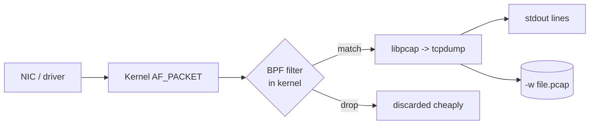
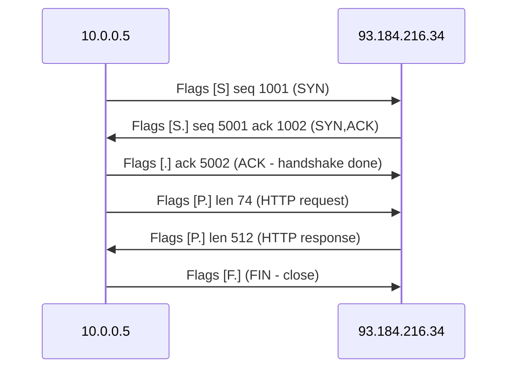
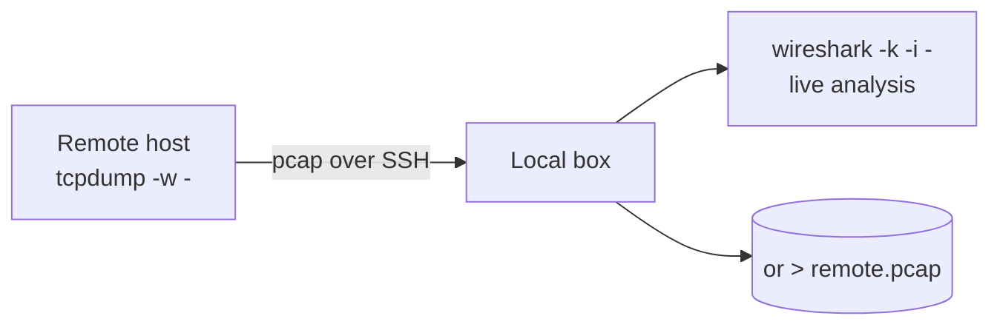
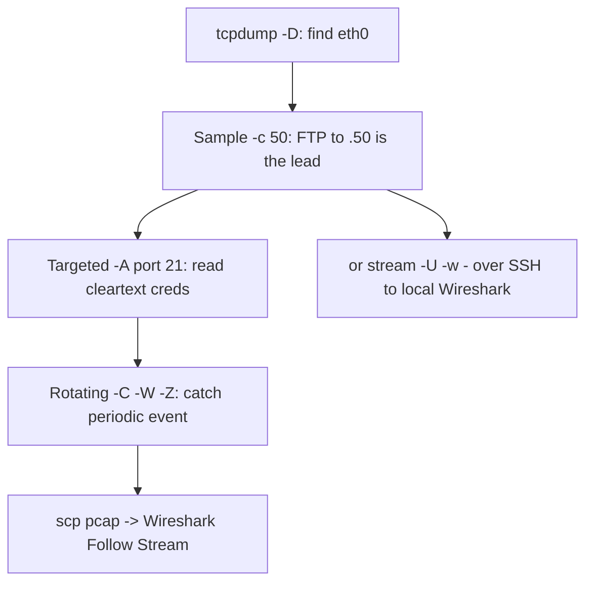
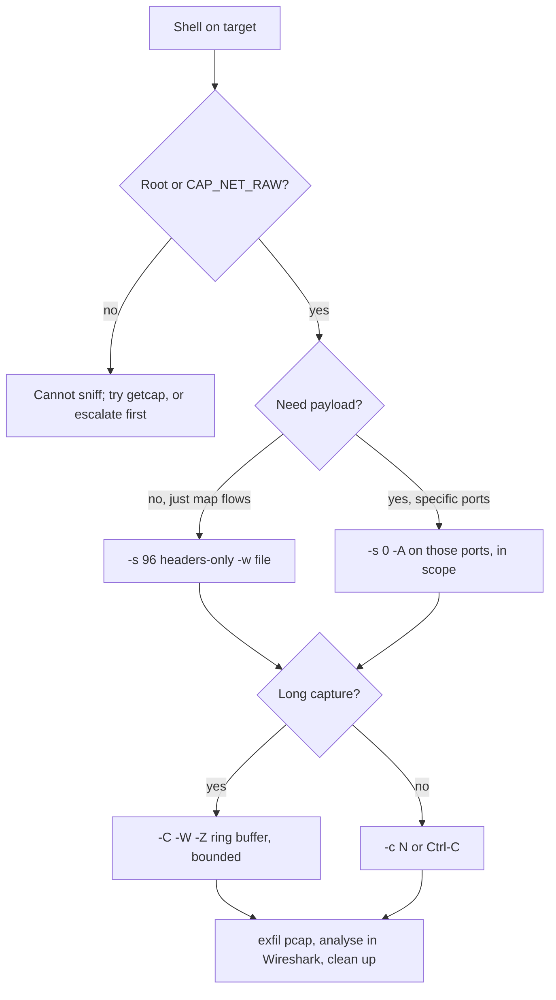

**Level:** Advanced · **Track:** Penetration Testing · **Read time:** 245 min

This is Chapter 4 of the Network Attacks notebook. The previous three chapters
lived inside Wireshark's window. That window is superb for analysis, but it needs
a graphical display — and an enormous amount of real capture happens where there
is no display at all: on a headless Linux server you have just compromised, on a
router or firewall, on an embedded device, on a cloud instance you reach only over
SSH, or on a pivot box deep inside a target network. In all of those places the
tool is **tcpdump**: a tiny, ubiquitous, command-line packet capturer that uses
the very same capture engine as Wireshark.

Learning tcpdump is not "Wireshark for people who like terminals." It is a
distinct, essential skill: capturing where a GUI cannot run, filtering at the
kernel with BPF so you record only what matters on a busy link, writing pcap files
you later open in Wireshark, and doing all of it in a single SSH session. This
chapter teaches it from the first flag to raw byte-offset filters, and ties it
back to the analysis skills you already have.

Everything assumes **authorised** capture: your own systems, a client host you
have written permission to test, or a lab. Capturing traffic requires root/CAP_NET_RAW
and, on other people's networks, legal authorisation — sniffing without it is
unlawful interception.

## Why This Matters

When a pentester lands a shell on an internal Linux host (see the web-to-shell
chapter and the pivoting chapter), that host often sees traffic the attacker's own
machine never will — database connections, internal API calls, other hosts'
broadcasts, authentication flows. A one-line `tcpdump` on that box, writing a
rotating pcap you later pull back and open in Wireshark, can hand you credentials
and a map of the internal network without any noisy scanning. On the defensive
side, tcpdump is the universal "what is actually on this wire right now" tool for
firewalls, servers and appliances where installing Wireshark is impossible. It is
the lowest common denominator of packet capture, and it is almost always already
installed.

## Part 1: What tcpdump Is and How It Captures

tcpdump is a command-line network packet analyzer first released in 1988. It sits
on top of **libpcap**, the same portable capture library Wireshark's `dumpcap`
uses. libpcap asks the kernel (via `AF_PACKET` sockets on Linux, BPF devices on
BSD/macOS) for copies of frames arriving at or leaving a network interface, and
applies a **BPF filter** in the kernel so unwanted packets are dropped before they
are ever copied to userspace. That kernel-side filtering is why tcpdump can keep up
on a busy link where copying every packet would be too expensive.



The key consequences of this architecture:

- tcpdump and Wireshark **capture identically** — a pcap written by one opens
  perfectly in the other. Capture with tcpdump on the server, analyse with
  Wireshark on your laptop.
- The filter you give tcpdump on the command line is a **BPF capture filter**
  (Chapter 2's left-hand column), *not* a Wireshark display filter. `tcp port 80`,
  not `tcp.port == 80`.
- Capturing needs privilege: root, or the `CAP_NET_RAW` capability. On many
  systems tcpdump is installed setuid-safe or run via `sudo`.

Install it if absent:

```bash
sudo apt update && sudo apt install -y tcpdump      # Debian/Kali/Ubuntu
sudo dnf install -y tcpdump                          # Fedora/RHEL
```

Confirm the version and that it can see interfaces:

```bash
tcpdump --version
sudo tcpdump -D            # list capturable interfaces (or --list-interfaces)
```

`-D` prints numbered interfaces, e.g. `1.eth0`, `2.any`, `3.lo` — `any` is a
Linux pseudo-interface that captures on all interfaces at once (with a slightly
different link-layer header).

## Part 2: Your First Captures — The Core Flags

The general form is `tcpdump [options] [BPF filter]`. Start simple:

```bash
sudo tcpdump -i eth0
```

- `-i eth0` capture on interface `eth0` (use `-i any` for all interfaces). Without
  `-i`, tcpdump picks the first non-loopback interface.

That immediately floods the terminal. The flags that make it usable:

| Flag | Meaning | Why you want it |
|------|---------|-----------------|
| `-i IFACE` | interface to capture on | choose the right link (`-i any` = all) |
| `-n` | don't resolve IPs to names | no DNS lookups (fast + no OPSEC leak) |
| `-nn` | don't resolve IPs **or** ports | show `443` not `https` |
| `-c N` | stop after N packets | grab a sample, don't run forever |
| `-v` / `-vv` / `-vvv` | increasing verbosity | show TTL, IP id, options, checksums |
| `-t` / `-tt` / `-ttt` | timestamp control | `-tt` epoch, `-ttt` delta between packets |
| `-e` | print link-layer (MAC) header | see source/dest MACs (ARP, L2 work) |
| `-q` | quiet, less protocol detail | compact one-line-per-packet |
| `-A` | print payload as ASCII | read cleartext (HTTP, FTP) |
| `-X` | print payload as hex + ASCII | inspect binary payloads |
| `-XX` | hex+ASCII including link layer | full frame dump |
| `-s N` | snap length (bytes per packet) | `-s 0` = full packet (default modern) |
| `-w FILE` | write raw packets to pcap | save for Wireshark |
| `-r FILE` | read packets from a pcap | offline analysis |
| `-l` | line-buffer stdout | needed when piping to grep |

A genuinely useful everyday invocation:

```bash
sudo tcpdump -i eth0 -nn -v -c 20
```

Capture 20 packets on eth0, no name/port resolution, verbose — a quick "what's on
this wire" that terminates on its own.

**Always use `-n` (or `-nn`) on an engagement.** Without it, tcpdump reverse-
resolves every IP via DNS, which is slow and — critically — leaks to the network
that you are inspecting those addresses. `-nn` also stops it translating port
numbers, so you see the real numbers.

## Part 3: Reading tcpdump Output Line by Line

A default TCP line looks like this:

```text
14:23:01.123456 IP 10.0.0.5.52344 > 93.184.216.34.443: Flags [S], seq 1001, win 64240, options [mss 1460,sackOK,TS val 1 ecr 0,nop,wscale 7], length 0
```

Decoded field by field:

- `14:23:01.123456` — timestamp (wall clock with microseconds; change with `-tt`).
- `IP` — the network-layer protocol (IPv4; `IP6` for v6).
- `10.0.0.5.52344 > 93.184.216.34.443` — `src.port > dst.port`. The last dotted
  number is the **port**, not part of the IP (this trips up beginners — with `-nn`
  it is unambiguous).
- `Flags [S]` — TCP flags. `S`=SYN, `.`=ACK, `S.`=SYN+ACK, `P`=PSH, `F`=FIN,
  `R`=RST, `U`=URG. So `[S]` is a connection attempt, `[S.]` the reply, `[P.]` data
  with ACK, `[F.]` a graceful close, `[R]` a reset.
- `seq 1001` — TCP sequence number (relative by default).
- `win 64240` — advertised receive window.
- `options [...]` — TCP options (MSS, SACK, timestamps, window scale).
- `length 0` — TCP payload bytes (0 = pure control packet like a SYN).

A UDP/DNS line is shorter:

```text
14:23:05.500 IP 10.0.0.5.40000 > 8.8.8.8.53: 4660+ A? example.com. (29)
```

`4660+` is the DNS transaction ID with the recursion-desired flag, `A?` a query
for an A record of `example.com.`, `(29)` the message length.



**Reading the handshake in tcpdump** is a core skill: `[S]` then `[S.]` then `[.]`
is a successful open; `[S]` immediately answered by `[R.]` is a closed port (and,
repeated across ports, a scan you are witnessing live).

## Part 4: The BPF Capture-Filter Language

The expression after the options is a **BPF filter**. It is a small, powerful
language built from *primitives* combined with logical operators. Master it and
you record exactly what you need and nothing else.

### 4.1 Primitives

Primitives are made of qualifiers: **type** (`host`, `net`, `port`, `portrange`),
**direction** (`src`, `dst`), and **protocol** (`ip`, `ip6`, `tcp`, `udp`, `arp`,
`icmp`, `ether`).

```bash
host 10.0.0.5              # traffic to OR from 10.0.0.5
src host 10.0.0.5         # only from 10.0.0.5
dst host 10.0.0.5         # only to 10.0.0.5
net 10.0.0.0/24           # any host in the subnet
port 443                   # TCP or UDP port 443, either direction
src port 53               # source port 53
portrange 8000-8100        # a range of ports
tcp                        # all TCP
udp port 53               # DNS
icmp                       # all ICMP
arp                        # all ARP
ether host aa:bb:cc:dd:ee:ff   # by MAC
vlan 100                   # tagged VLAN 100
```

### 4.2 Logical operators

Combine primitives with `and` (`&&`), `or` (`||`), `not` (`!`), and parentheses
(quote or escape them in the shell):

```bash
# Web traffic to one host
sudo tcpdump -nn 'host 10.0.0.5 and (port 80 or port 443)'

# All TCP except SSH (so your own session doesn't clutter the capture)
sudo tcpdump -nn 'tcp and not port 22'

# DNS and ICMP only
sudo tcpdump -nn 'udp port 53 or icmp'

# Traffic between two specific hosts
sudo tcpdump -nn 'host 10.0.0.5 and host 10.0.0.9'
```

**Always quote the filter** (`'...'`) so the shell doesn't interpret parentheses,
`<`, or `>`.

### 4.3 The `not port 22` habit

When you capture over SSH, your own SSH session is traffic too — and it will fill
the capture with your keystrokes echoing back. Exclude it:

```bash
sudo tcpdump -i eth0 -nn 'not port 22' -w /tmp/cap.pcap
```

This one habit keeps remote captures readable and stops a feedback loop when you
pipe tcpdump over SSH (Part 8).

| Goal | BPF filter |
|------|------------|
| One host, any protocol | `host 10.0.0.5` |
| A subnet | `net 10.0.0.0/24` |
| Web only | `tcp port 80 or tcp port 443` |
| DNS only | `udp port 53` |
| Everything but your SSH | `not port 22` |
| Between two hosts | `host A and host B` |
| From a host, to web | `src host A and dst port 443` |
| ARP (spoof hunting) | `arp` |
| Broadcast/multicast | `broadcast or multicast` |

## Part 5: Raw Byte-Offset Filters — Matching Flags and Fields

BPF can test individual bytes and bits of a packet using `proto[offset:size]`.
This is how you filter on things that have no named primitive — most importantly
**TCP flags**.

TCP flags live in byte 13 of the TCP header (`tcp[13]`). Each flag is a bit:

```text
bit:  7   6   5   4   3   2   1   0
      CWR ECE URG ACK PSH RST SYN FIN
value 128 64  32  16  8   4   2   1
```

So:

```bash
# SYN only (connection attempts / SYN scan) -> SYN bit set, ACK clear
sudo tcpdump -nn 'tcp[13] & 2 != 0 and tcp[13] & 16 == 0'

# SYN-ACK (open ports replying)
sudo tcpdump -nn 'tcp[13] == 18'          # SYN(2)+ACK(16)=18

# RST packets (resets)
sudo tcpdump -nn 'tcp[13] & 4 != 0'

# The XMAS scan (FIN+PSH+URG = 1+8+32 = 41)
sudo tcpdump -nn 'tcp[13] == 41'

# NULL scan (no flags)
sudo tcpdump -nn 'tcp[13] == 0'
```

Modern tcpdump also accepts named flag fields, which are far more readable:

```bash
sudo tcpdump -nn 'tcp[tcpflags] & tcp-syn != 0 and tcp[tcpflags] & tcp-ack == 0'
```

Other useful byte-offset filters:

```bash
# HTTP GET requests: 'GET ' = 0x47455420 at start of TCP payload
sudo tcpdump -nn -A 'tcp port 80 and tcp[((tcp[12]&0xf0)>>2):4] = 0x47455420'

# ICMP echo request (type 8) and reply (type 0)
sudo tcpdump -nn 'icmp[icmptype] == 8 or icmp[icmptype] == 0'

# Non-zero-length TCP packets (payload only, skip pure ACKs/handshakes)
sudo tcpdump -nn 'tcp and (tcp[12]&0xf0)>>2 != ((ip[2:2]) - ((ip[0]&0x0f)<<2))'
```

The `tcp[((tcp[12]&0xf0)>>2):4]` idiom computes the TCP data offset (header length
from the high nibble of byte 12) to index into the payload — the canonical way to
match on the first bytes of application data. You rarely write these from scratch;
you recognise and adapt the common ones.

### 5.1 Watching a scan live with a flag filter

Put a flag filter to work: on a host you suspect is being scanned, capture only the
inbound connection attempts and their replies:

```bash
sudo tcpdump -i eth0 -nn 'tcp[13] & 2 != 0'
```

```text
14:40:01.10 IP 10.10.10.66.44001 > 10.10.10.20.21:  Flags [S], length 0
14:40:01.10 IP 10.10.10.66.44002 > 10.10.10.20.22:  Flags [S], length 0
14:40:01.10 IP 10.10.10.66.44003 > 10.10.10.20.23:  Flags [S], length 0
14:40:01.10 IP 10.10.10.66.44004 > 10.10.10.20.25:  Flags [S], length 0
```

One source, incrementing source ports, marching across destination ports in the
same millisecond — a SYN scan, witnessed in real time from the target's own
console with a single flag filter. Add `and tcp[13]==18` in a second terminal to
watch which ports answer (open).

## Part 6: Snap Length, Promiscuous Mode and Performance

Three settings decide whether your capture is complete, legal-in-scope, and fast
enough to not drop packets on a busy link.

### 6.1 Snap length (`-s`)

The snap length is how many bytes of each packet tcpdump copies. Historically the
default was 68 or 96 bytes (headers only). Modern tcpdump defaults to `262144`
(effectively the whole packet). To be explicit:

```bash
sudo tcpdump -i eth0 -s 0 -w full.pcap      # -s 0 = full packet (whole payload)
sudo tcpdump -i eth0 -s 96 -w headers.pcap  # headers only: tiny files, no payload
```

Use `-s 96` when you only need to see *who talks to whom* (flow analysis) and want
minimal file size and minimal exposure to payload data; use `-s 0` when you need
the payload (credentials, files, protocol detail). If your snap length is too
small, Wireshark shows "[packet size limited during capture]" and payload analysis
is impossible.

### 6.2 Promiscuous mode

By default tcpdump puts the interface in **promiscuous mode**, so it sees all
frames on the segment reachable by the NIC (relevant on hubs, mirror/span ports,
or when you are the MITM). Disable it with `-p` to capture only traffic to/from the
local host:

```bash
sudo tcpdump -i eth0 -p 'host 10.0.0.9'     # -p = no promiscuous mode
```

On a switched network without a span port or MITM, promiscuous mode gains you
little (the switch only sends you your own traffic + broadcasts) — which is exactly
why the MITM chapters exist.

### 6.3 Performance and drops

On a busy link tcpdump can drop packets if userspace can't keep up. On exit it
reports counts:

```text
1000000 packets captured
1000000 packets received by filter
0 packets dropped by kernel
```

"packets dropped by kernel" > 0 means you lost data. Mitigate by: filtering tightly
at the kernel (BPF), reducing snap length, writing to `-w` a file (much cheaper
than formatting text to a terminal), increasing the kernel buffer with `-B`
(in KiB, e.g. `-B 4096`), and avoiding `-v`/`-A` on high-rate captures.

```bash
sudo tcpdump -i eth0 -nn -s 0 -B 8192 'not port 22' -w /tmp/cap.pcap
```

## Part 7: Writing, Reading and Rotating Capture Files

The single most common professional use of tcpdump is **capture now, analyse in
Wireshark later**.

### 7.1 Write and read

```bash
sudo tcpdump -i eth0 -nn -s 0 -w /tmp/capture.pcap 'host 10.0.0.9'
# ... let it run, Ctrl-C to stop ...
tcpdump -nn -r /tmp/capture.pcap                 # read back on the CLI
wireshark /tmp/capture.pcap                        # or open in Wireshark
```

When writing with `-w`, tcpdump does **not** print packets (it writes raw pcap);
add `-v` to see a running count, or nothing for silent operation.

### 7.2 Rotation for long captures

Continuous capture without rotation fills the disk. `-C` (size in millions of
bytes) and `-G` (seconds) rotate files; `-W` limits how many are kept (a ring
buffer). `-Z user` drops privileges of the writing process.

```bash
# Rotate every 100 MB, keep 10 files (ring buffer), drop to user 'pcap'
sudo tcpdump -i eth0 -nn -s 0 -C 100 -W 10 -Z pcap -w /var/tmp/cap.pcap

# Rotate every hour, timestamped filenames, keep 24
sudo tcpdump -i eth0 -nn -G 3600 -W 24 -w '/var/tmp/cap-%Y%m%d-%H%M%S.pcap'
```

`-G` with a `strftime` pattern in the filename produces `cap-20261026-140000.pcap`
style names. This is exactly how a sensor or a long engagement captures
continuously without ever filling storage.

| Flag | Meaning |
|------|---------|
| `-w FILE` | write pcap |
| `-r FILE` | read pcap |
| `-C N` | rotate after N million bytes |
| `-G N` | rotate after N seconds (use `%` time in filename) |
| `-W N` | keep at most N files (ring buffer) |
| `-Z user` | drop privileges to `user` after opening the interface |

### 7.3 Post-processing captured files

You can chain tcpdump reads with grep and other tools, or split/merge with the
Wireshark suite's `editcap`/`mergecap`:

```bash
tcpdump -nn -r cap.pcap 'port 80' -A | grep -i 'authorization:'   # creds in a saved file
mergecap -w all.pcap cap1.pcap cap2.pcap                            # merge captures
editcap -c 10000 big.pcap chunk.pcap                               # split into 10k-packet chunks
```

## Part 8: Remote Capture Over SSH — Capture There, Analyse Here

A signature tcpdump workflow: capture on a remote/headless host and pipe the raw
pcap over SSH straight into a **local** Wireshark, live. No files, no display on
the remote box.

```bash
ssh user@remote 'sudo tcpdump -i eth0 -nn -s 0 -U -w - not port 22' | wireshark -k -i -
```

Breaking it down:

- `tcpdump ... -w -` writes the pcap stream to **stdout** (`-` = stdout).
- `-U` (packet-buffered) flushes each packet immediately so the stream is live,
  not chunked.
- `not port 22` excludes the SSH session carrying the capture (essential — omit it
  and you create a feedback loop of your own traffic).
- `| wireshark -k -i -` starts Wireshark reading (`-i -`) from stdin and starts
  (`-k`) immediately.

The same idea with `tshark` if you prefer terminal analysis, or to a local file:

```bash
ssh user@remote 'sudo tcpdump -i eth0 -s0 -U -w - not port 22' > /tmp/remote.pcap
```



**Pentester pivot use case:** you have a shell on an internal Linux host that can
see a database subnet your own machine cannot. Run tcpdump there, stream it back,
and read the internal DB credentials in your local Wireshark — no scanning, minimal
footprint. **Blue team use case:** the same one-liner captures from a firewall or
sensor that has no GUI, into an analyst's Wireshark.

## Part 9: The Full Worked Lab — Capture, Filter, Rotate, Hand Off

**Scenario:** you have authorised access to a headless Linux server (`10.10.10.20`)
and need to (a) confirm what it talks to, (b) capture a suspicious cleartext login
you have been told happens periodically, and (c) hand a clean pcap to a teammate
for Wireshark analysis. Do this only on systems you are authorised to capture on.

### Step 1 — Survey the interfaces and baseline

```bash
sudo tcpdump -D
# 1.eth0  2.any  3.lo
sudo tcpdump -i eth0 -nn -c 50
```

Fifty packets tell you the host mostly speaks HTTPS to a few IPs, plus DNS and some
FTP to `10.10.10.50`. FTP is the lead.

### Step 2 — Targeted cleartext capture

Capture just the FTP control channel (port 21) with full payload, excluding your
SSH:

```bash
sudo tcpdump -i eth0 -nn -s 0 -A 'tcp port 21 and not port 22'
```

Sample output when the login fires:

```text
14:31:02.114 IP 10.10.10.20.50122 > 10.10.10.50.21: Flags [P.], length 16
E..8..@.@....... 
USER svc-backup
14:31:02.140 IP 10.10.10.50.21 > 10.10.10.20.50122: Flags [P.], length 34
331 Password required for svc-backup
14:31:02.155 IP 10.10.10.20.50122 > 10.10.10.50.21: Flags [P.], length 20
PASS Wint3r2023!
14:31:02.170 IP 10.10.10.50.21 > 10.10.10.20.50122: Flags [P.], length 23
230 Login successful.
```

The `-A` flag printed the ASCII payload, and the cleartext FTP credentials
(`svc-backup:Wint3r2023!`) are right there — a finding, captured with one line and
no GUI.

### Step 3 — Rotating capture for the periodic event

You don't know exactly when the next login happens, so capture continuously with
rotation, keeping full payload but bounding disk use:

```bash
sudo tcpdump -i eth0 -nn -s 0 -C 50 -W 6 -Z nobody \
  'host 10.10.10.50 and not port 22' -w /var/tmp/ftp-%Y%m%d-%H%M%S.pcap
```

Six 50 MB files max, timestamped, privileges dropped to `nobody`. Leave it; it
self-manages the disk.

### Step 4 — Hand off to Wireshark

Pull the relevant pcap to your analysis box and open it — the file tcpdump wrote is
byte-for-byte a Wireshark capture:

```bash
scp user@10.10.10.20:/var/tmp/ftp-20261026-143000.pcap .
wireshark ftp-20261026-143000.pcap
# In Wireshark: Follow TCP Stream on the FTP conversation to read the full session
```

### Step 5 — Or stream it live

If you want to watch in real time instead:

```bash
ssh user@10.10.10.20 'sudo tcpdump -i eth0 -s0 -U -w - "host 10.10.10.50 and not port 22"' \
  | wireshark -k -i -
```



**Report takeaway:** cleartext FTP credentials captured on `10.10.10.20` with a
single tcpdump line, plus a reproducible capture command and the pcap as evidence —
no display required on the target.

## Part 10: tcpdump on a Pivot — The Pentester's Real Workflow

On a compromised host, tcpdump is often already present or trivially droppable, and
it is quiet. The realistic workflow:

1. **Check for it and for privilege:** `which tcpdump; id` — you need root or
   `CAP_NET_RAW`. If tcpdump is missing but you have a static binary, upload one;
   if you cannot get root, tcpdump usually cannot capture (note the exception:
   `getcap` may show `cap_net_raw` granted to a binary).
2. **Capture minimally and in scope:** headers-only (`-s 96`) for a network map,
   full payload (`-s 0`) only on the specific ports you are authorised to inspect.
   Always `-w` to a file in a world-writable but inconspicuous path, and always
   `not port 22` (or your actual access port).
3. **Bound it:** use `-c` or `-G`/`-W` so you never fill the target's disk — filling
   a production disk is an outage you caused.
4. **Exfil the pcap** back through your existing channel (scp, the C2, or a
   `-w -` stream) and analyse locally. Never analyse with `-A` interactively on the
   target if you can avoid it — it is slower and noisier than pulling the file.
5. **Clean up:** remove the pcap when done, and note its path for the client.

**OPSEC and scope notes:** capturing other tenants' or users' traffic on a shared
host can exceed scope even when you have root — capture only what the rules of
engagement permit, prefer headers-only where payload is not needed, and treat any
third-party credentials you incidentally capture as sensitive evidence, handled per
the ROE.

### 10.1 A quick decision guide for capture on a target



The guide encodes the whole Part-10 discipline: confirm privilege, capture the
minimum needed and in scope, bound the size so you never fill the disk, pull the
pcap back for analysis, and clean up. Following it keeps a pivot capture safe,
quiet and defensible in the report.

## Part 11: IPv6, VLANs, and Other Link Types

Real networks are not all untagged IPv4 on Ethernet, and tcpdump handles the
variety — you just have to ask for it.

### 11.1 IPv6

Use `ip6` and the v6 forms of the primitives. Addresses use colons, so quote
carefully:

```bash
sudo tcpdump -nn 'ip6'                                  # all IPv6
sudo tcpdump -nn 'ip6 host 2001:db8::1'                 # a v6 host
sudo tcpdump -nn 'icmp6'                                 # includes NDP (v6's ARP)
sudo tcpdump -nn 'ip6 and udp port 53'                  # DNS over IPv6
```

IPv6 has no ARP; neighbour discovery uses ICMPv6 (`icmp6`). On dual-stack networks
a capture filtered only for `ip` silently misses all v6 traffic — a common blind
spot. Filter both, or filter by port/protocol without pinning the L3 version.

### 11.2 VLAN tags

802.1Q-tagged traffic carries a VLAN header that shifts the offsets of everything
after it, so a plain `tcp port 80` can miss tagged packets. Use the `vlan`
keyword, which both matches tagged frames and adjusts subsequent offsets:

```bash
sudo tcpdump -nn 'vlan'                                  # any tagged traffic
sudo tcpdump -nn 'vlan 100 and tcp port 443'            # HTTPS inside VLAN 100
```

### 11.3 The `any` interface and link-layer headers

`-i any` captures on all interfaces but uses Linux "cooked" (SLL) headers rather
than real Ethernet, so `-e` MAC output and `ether` filters behave differently.
When you need true L2 detail (MACs for ARP-spoof work), capture on the specific
interface, not `any`.

| Link scenario | Capture with |
|---------------|--------------|
| IPv6 host | `'ip6 host 2001:db8::1'` |
| IPv6 neighbour discovery | `'icmp6'` |
| VLAN-tagged | `'vlan 100 and ...'` |
| All interfaces (no L2 detail) | `-i any` |
| Need real MACs | `-i eth0 -e` (specific iface) |

## Part 12: tcpdump vs tshark vs termshark — Choosing the CLI Tool

tcpdump is not the only command-line capture tool; knowing when to reach for each
saves time.

- **tcpdump** — smallest footprint, nearly always preinstalled, best for *capture*
  (especially on a target/pivot) and quick reads. Its filter language is BPF only;
  it has no protocol *dissection* beyond a summary line.
- **tshark** (Chapter 2) — Wireshark's full dissector engine on the CLI. Best for
  *analysis*: display filters (`-Y`), field extraction (`-T fields -e`), and
  decoding hundreds of protocols. Heavier; not always present on a target.
- **termshark** — a text-UI front-end over tshark that feels like Wireshark in the
  terminal (packet list, detail tree, Follow Stream) over SSH. Great for
  interactive analysis on a headless box when you cannot forward a GUI.

| Need | Reach for |
|------|-----------|
| Capture on a target/pivot, minimal footprint | tcpdump |
| Rotate/ring-buffer a long capture | tcpdump (or dumpcap) |
| Field extraction / display filters / dissection | tshark |
| Interactive Wireshark-like UI over SSH | termshark |
| Deep GUI analysis | Wireshark (pull the pcap back) |

The professional pattern is **capture with tcpdump, analyse with tshark/Wireshark**
— use each for what it is best at rather than forcing one tool to do everything.

## Part 13: Live Cleartext Hunting with grep, awk and Pipes

Because tcpdump prints text, you can pipe it into the standard Unix toolkit for
real-time hunting when you have no time (or no GUI) to load Wireshark. The one
flag that makes this work is `-l` (line-buffered stdout) — without it, tcpdump
block-buffers and `grep` sees nothing until the buffer flushes.

```bash
# Live HTTP credential/cookie hunt
sudo tcpdump -i eth0 -nn -A -l 'tcp port 80' \
  | grep -iE 'authorization:|cookie:|password|user='

# Live DNS query log (who is looking up what)
sudo tcpdump -i eth0 -nn -l 'udp port 53' | grep ' A? '

# Count connection attempts per source IP in real time (scan detection)
sudo tcpdump -i eth0 -nn -l 'tcp[13] & 2 != 0 and tcp[13] & 16 == 0' \
  | awk '{print $3}' | cut -d. -f1-4 | sort | uniq -c

# Watch only the payload lines of FTP logins
sudo tcpdump -i eth0 -nn -A -l 'tcp port 21' | grep -E '^(USER|PASS) '
```

A few rules make piped tcpdump reliable:

- **`-l` is mandatory** when piping to `grep`/`awk`; otherwise output appears in
  large delayed chunks.
- **`-A` for ASCII, `-X` for hex** — grep works on the ASCII rendering, so use
  `-A` for text protocols.
- **Prefer capture-then-analyse for anything you must not miss.** Live grep can
  drop packets under load and gives no reassembly; for evidence, `-w` a file and
  open it in Wireshark. Live piping is for quick situational awareness, not for the
  authoritative record.

**Pentester use case:** on a MITM position (next chapters) a single live-grep line
surfaces credentials the instant a victim logs in, so you know immediately that the
attack is working — then you switch to a `-w` capture for the clean evidence pcap.

## Part 14: Common Pitfalls

- **Using Wireshark display-filter syntax on the CLI.** tcpdump speaks BPF:
  `tcp port 80`, not `tcp.port == 80`. The latter is a syntax error.
- **Forgetting `-n`/`-nn`.** Name resolution is slow and leaks your interest in
  those addresses via live DNS. Default to `-nn` on engagements.
- **Snap length too small.** An old `-s 96` habit truncates payload; use `-s 0`
  when you need to read data, or Wireshark shows "packet size limited."
- **Capturing your own SSH.** Omitting `not port 22` on a remote capture floods the
  file with your session and, when streaming, creates a feedback loop.
- **No rotation on long captures.** `-w` without `-C`/`-G`/`-W` will fill the disk
  and can take down a production host.
- **Unquoted filters.** Parentheses and `>`/`<` are shell metacharacters; always
  quote the BPF expression.
- **Assuming promiscuous mode shows everyone's traffic on a switch.** Without a
  span port or MITM you see only your host's traffic plus broadcast/multicast.
- **Running as root and writing root-owned files everywhere.** Use `-Z user` to
  drop privileges for the writer.

## Part 15: Detection & Defense Angle

tcpdump is dual-use: the same tool defenders run on a firewall is what an attacker
runs on a pivot. The defensive picture:

- **Passive capture is silent, but it needs privilege and position.** A defender
  cannot see tcpdump running on a remote box from the network, but *on the host*
  the capability and process are visible: an interface entering **promiscuous
  mode** raises a kernel log (`device eth0 entered promiscuous mode`) and is
  detectable by EDR; a non-admin process holding `CAP_NET_RAW`, or an unexpected
  `tcpdump`/`dumpcap` process, is a strong host-based indicator on a server that
  should never sniff.
- **Detect the exfil of pcaps.** Large pcap files appearing in `/tmp`/`/var/tmp`,
  or a long-lived `-w -` stream over SSH, are host and network signals — FIM on
  those paths and egress monitoring catch them.
- **Deny the capture position.** The reason tcpdump on a pivot is dangerous is the
  same reason from Chapter 3: cleartext protocols. Encrypt everything (SFTP, SSH,
  HTTPS, SNMPv3, LDAPS) and a captured pcap yields ciphertext. Restrict who can
  gain root/`CAP_NET_RAW` on servers, and segment so a compromised host sees as
  little other traffic as possible.
- **Forensic value for the blue team.** tcpdump is also the responder's friend:
  a rotating, headers-only capture on a suspected-compromised segment provides a
  flight recorder you can later mine in Wireshark (Chapters 2–3) to reconstruct an
  intrusion — capture broad and headers-only for retention, full-payload only where
  policy allows.

The mnemonic: **tcpdump captures anywhere, so the defence is to control where root
lives and to encrypt what crosses the wire** — not to hope nobody runs a sniffer.

## Final Revision / Summary

- tcpdump is a CLI packet capturer on **libpcap** — the same engine as Wireshark;
  pcaps are interchangeable. Capture headless, analyse in Wireshark.
- Core flags: `-i` interface, `-nn` no name/port resolution, `-c` count, `-v/-vv`
  verbosity, `-A`/`-X` payload, `-s 0` full snap, `-w`/`-r` write/read.
- Read the output: `src.port > dst.port: Flags [S/.]/[S.]/[P.]/[F.]/[R]`, seq, win,
  length. `[S]`→`[S.]`→`[.]` is a handshake.
- The command-line filter is **BPF**: primitives (`host`, `net`, `port`, `tcp`,
  `udp`, `arp`, `icmp`) + `and/or/not` + parentheses. Quote it.
- Byte-offset filters match anything: `tcp[13]` for flags (SYN=2, ACK=16,
  SYN-ACK=18, XMAS=41, NULL=0), `icmp[icmptype]`, payload byte matches.
- `-s` snap length, `-p` no-promiscuous, `-B` buffer and tight BPF prevent drops on
  busy links.
- Save and rotate: `-w`, `-C` (size), `-G` (time, with `%` filename), `-W` (ring),
  `-Z` (drop privs).
- Stream over SSH: `tcpdump -w - -U 'not port 22' | wireshark -k -i -`.
- On a pivot: check privilege, capture minimally and in scope, bound the size,
  exfil the pcap, clean up.
- Defence: control root/`CAP_NET_RAW`, watch for promiscuous mode and stray pcaps,
  and encrypt every protocol so a capture is useless.

## Cheat Sheet / Quick Reference

**Essential invocations**

```bash
sudo tcpdump -D                                   # list interfaces
sudo tcpdump -i eth0 -nn -c 20                    # 20 packets, no resolution
sudo tcpdump -i eth0 -nn -A 'tcp port 80'         # read HTTP payloads
sudo tcpdump -i eth0 -nn -s0 -w cap.pcap 'host X' # save full packets
tcpdump -nn -r cap.pcap                            # read a saved pcap
```

**BPF filters**

```bash
host 10.0.0.5 | net 10.0.0.0/24 | port 443 | portrange 8000-8100
src host A | dst host B | udp port 53 | icmp | arp | ether host aa:bb:..
'host A and (port 80 or port 443)'                # combine + group
'tcp and not port 22'                              # exclude your SSH
```

**Flag (byte 13) filters**

```bash
'tcp[13] & 2 != 0 and tcp[13] & 16 == 0'          # SYN only (scan/attempt)
'tcp[13] == 18'                                     # SYN-ACK (open port)
'tcp[13] & 4 != 0'                                  # RST
'tcp[13] == 41'                                     # XMAS   '== 0' NULL
'icmp[icmptype] == 8'                               # ICMP echo request
```

**Save / rotate / stream**

```bash
-w file.pcap  -r file.pcap  -s 0  -B 8192          # write/read/full-snap/buffer
-C 100 -W 10 -Z nobody                              # 10x100MB ring, drop privs
-G 3600 -W 24 -w 'cap-%Y%m%d-%H%M%S.pcap'          # hourly, timestamped, keep 24
ssh h 'sudo tcpdump -i eth0 -s0 -U -w - not port 22' | wireshark -k -i -
```

**Quick cred hunt in a saved file**

```bash
tcpdump -nn -A -r cap.pcap 'port 80' | grep -i 'authorization:\|pass'
tcpdump -nn -A -r cap.pcap 'port 21' | grep -i 'USER\|PASS'
```

### One more habit worth building

Alias your safe defaults so you never forget them under pressure:

```bash
alias td='sudo tcpdump -nn -s0'
# then: td -i eth0 -A 'tcp port 80 and not port 22'
```

Baking `-nn -s0` into muscle memory prevents the two most common mistakes
(accidental name resolution and truncated payload) on every capture you ever run.

## Practice Labs & Resources

- **TryHackMe** — *tcpdump: The Basics* (guided flags and BPF), and the
  *Wireshark* rooms (capture in tcpdump, analyse in Wireshark to feel the hand-off).
- **Your own lab (best practice ground)** — spin up two VMs, run cleartext services
  (vsftpd, telnetd, a plain-HTTP app) and practise: capture with BPF filters, write
  and rotate pcaps, do byte-offset flag filters against `nmap` scans you run
  yourself, and stream over SSH into Wireshark.
- **OverTheWire / networking wargames** and **HackTheBox Linux boxes** — once you
  have a foothold shell, practise the Part-10 pivot capture workflow legally within
  the lab's scope.
- **Malware-Traffic-Analysis.net** — read the provided pcaps back with
  `tcpdump -r` and grep for indicators to build CLI-analysis speed.
**PacketLife.net BPF/tcpdump cheat sheet** and **the SANS pcap/BPF references** —
compact printable references for the byte-offset idioms and primitive combinations.

- **`man tcpdump` and `man pcap-filter`** — the pcap-filter man page is the
  authoritative BPF reference; read it once end to end and the byte-offset idioms
  stop being mysterious.
- **CyberDefenders** — network-forensics challenges where a headless capture +
  Wireshark hand-off mirrors real IR.

Once the CLI capture loop is second nature, the man-in-the-middle chapters that
follow become straightforward: you will already know how to record the traffic you
are about to redirect, prove a credential crossed the wire, and hand a clean pcap
to Wireshark for the write-up.

Practise the same drill until it is muscle memory: pick a target of interest,
write the tightest BPF filter that isolates it, capture to a rotating pcap, and open
it in Wireshark. That capture-here/analyse-there loop is the backbone of real
network work and every attack chapter that follows.

---

*Also on [Praneeth's portfolio](https://ping-praneeth.vercel.app/notebook/pentest-network-attacks/04-tcpdump-and-command-line-packet-capture), with comments and the latest edits.*
