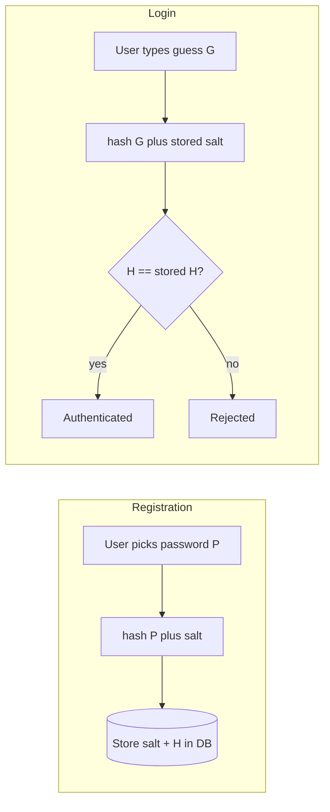
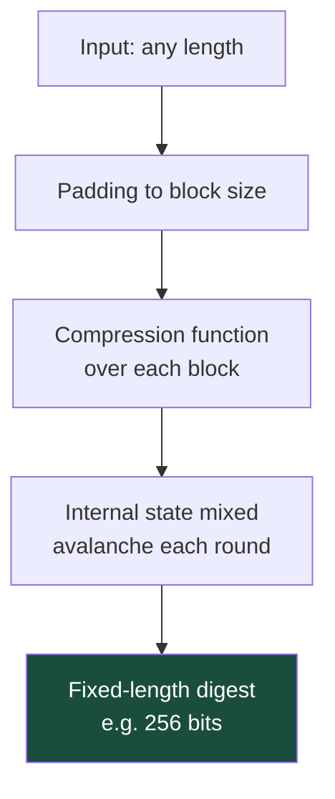
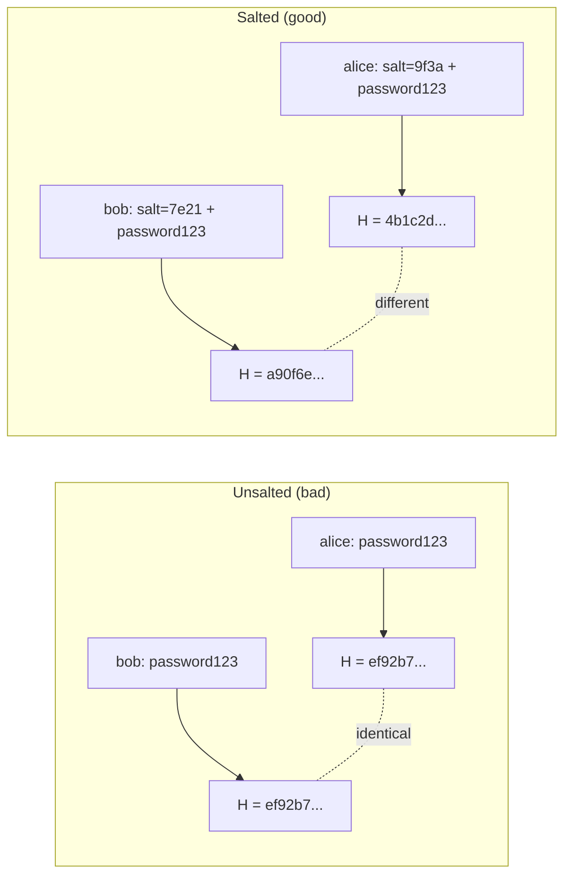
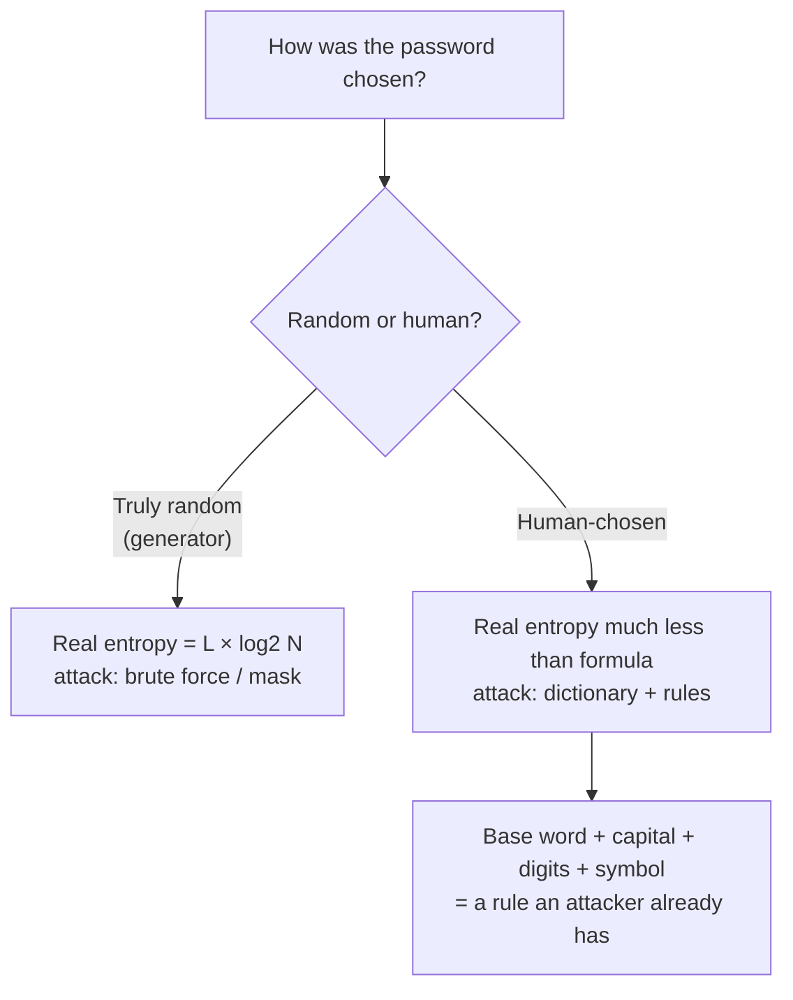
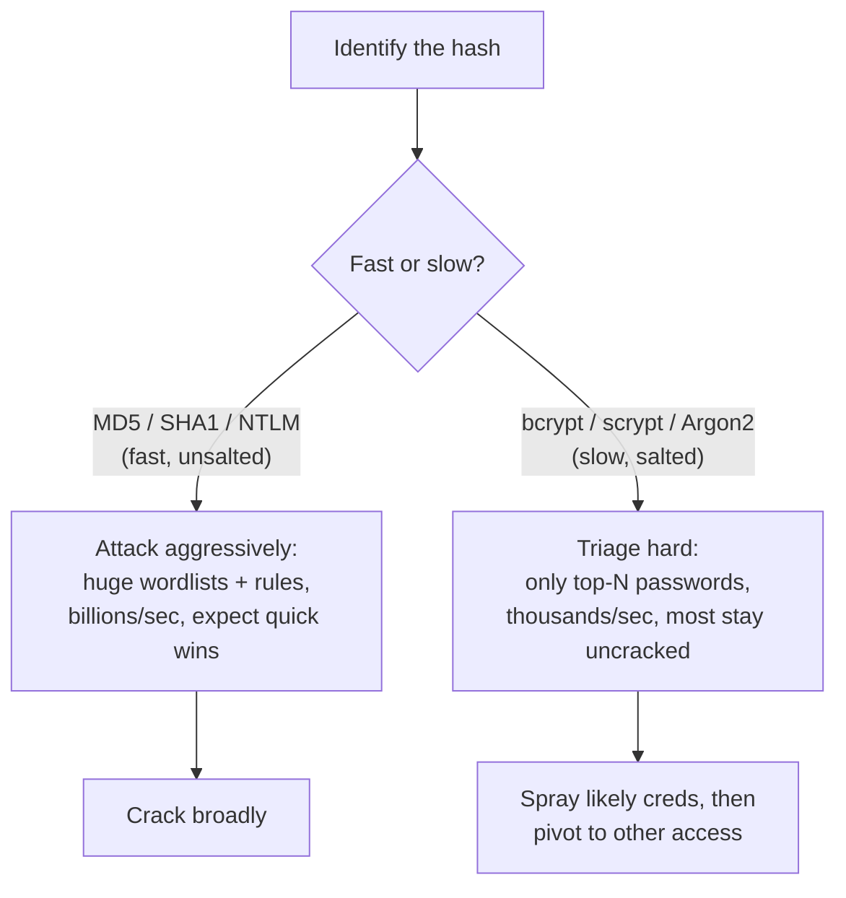
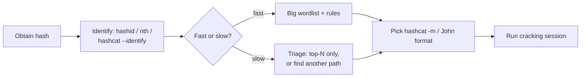
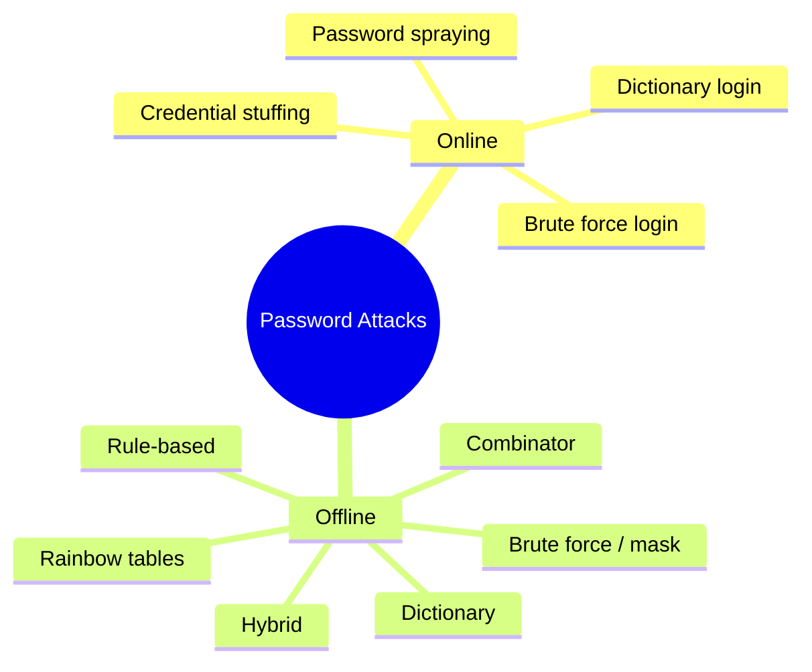
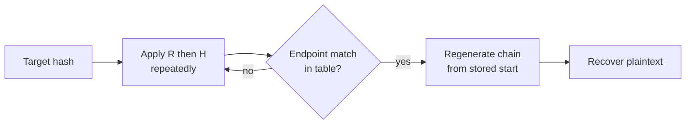
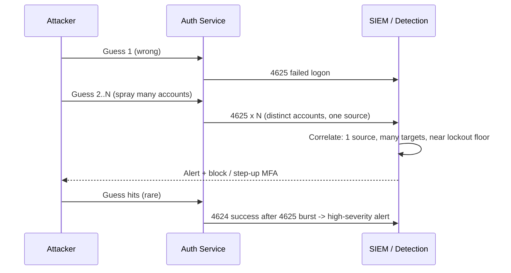

This is Chapter 1 of the Password Attacks notebook. Every notebook so far has, at some point, ended at a credential: the Recon & OSINT notebook harvested usernames and leaked passwords from breach dumps; the Scanning & Enumeration notebook pulled usernames off SMB, SNMP and LDAP; the Network Attacks notebook captured NTLMv2 hashes with Responder and relayed them; the Active Directory notebook lived and died on Kerberos tickets and NTLM secrets. In almost every real engagement, the moment that turns "I can see the network" into "I own the network" is the moment a valid credential falls into your hands. This notebook is about how those credentials are stored, why the storage format matters enormously, and every technique used to turn a stored secret back into a usable password.

The single most important idea in this entire notebook is this: **modern systems almost never store your password.** They store a one-way transformation of it — a hash — and every "password attack" is, at its core, a game played against that transformation. Understand hashing deeply and every tool in the rest of the notebook (hashcat, John the Ripper, hydra, mimikatz, kerberoasting) stops being magic and becomes obvious. Skip it, and you will spend the rest of your career copy-pasting commands you don't understand, failing silently when a hash is a format you don't recognise, and wasting GPU-hours attacking things that cannot be attacked that way.

This chapter is deliberately foundational and long. It builds from the absolute basics — what a hash even *is*, and how it differs from encoding and encryption, three things beginners constantly confuse — up to reading a raw `/etc/shadow` line and a Windows NTLM hash on sight, computing password entropy by hand, and running real cracking sessions in hashcat and John. By the end you will be able to look at any string of hex and say "that's an MD5", "that's a bcrypt", "that's an NTLM", "that's a Kerberos 5 TGS-REP", and know exactly which attack applies and roughly how long it will take.

Everything here assumes an **authorised, scoped engagement or your own lab**. Cracking password hashes you are not explicitly permitted to test — including "found" hashes, dumps from a breach you didn't own, or a colleague's account — is unlawful in most jurisdictions under computer-misuse and unauthorised-access legislation, regardless of intent. Build the lab described in Part 12, use the sample hashes provided, and keep every technique inside that boundary.

---

## Part 1: What a Password Actually Is — The Mental Model

Before any tooling, fix the mental model, because nearly every beginner mistake in password attacks comes from a broken one.

A password is a **shared secret** used to prove identity. You know it; the system needs to verify you know it — *without* keeping a copy it could leak. That last clause is the whole game. If a website stored your literal password in a database column, then the day that database is breached (and databases are breached constantly), every password is instantly compromised, and because people reuse passwords, so is every *other* account those users own. Storing plaintext passwords is considered professional negligence; it appears in the OWASP Top 10 (A02:2021 – Cryptographic Failures) and has been the root cause of some of the largest credential catastrophes in history.

So instead of storing the password `P`, a system stores `H = hash(P)`, where `hash` is a one-way function: easy to compute forwards (`P → H`), computationally infeasible to reverse (`H → P`). When you log in, the system computes `hash(what_you_typed)` and compares it to the stored `H`. Match ⇒ you knew the password. The server never needs the plaintext again after the first time you set it.



This design has a profound consequence for attackers: **you almost never "steal the password".** You steal the *hash*, and then you must recover the password *from* the hash offline, by guessing candidate passwords, hashing each one, and looking for a match. That offline guessing game — its speed, its economics, its optimisations — is what most of this notebook is about.

There are two families of attack that fall directly out of this model, and keeping them separate in your head is essential:

- **Online attacks** — you don't have the hash. You interact with a live system (an SSH server, a web login form, an RDP service) and submit guesses through the front door, one at a time, subject to rate limits, lockouts, and logging. Covered in depth in a later chapter (hydra, medusa, spraying).
- **Offline attacks** — you *have* the hash (dumped from a database, captured off the wire, pulled from `/etc/shadow` or the SAM). Now you can guess as fast as your hardware allows, with no network, no rate limit, and no one watching. This is where hashcat and John live.

Offline attacks are orders of magnitude faster and quieter, which is exactly why so much of offensive security is really about *getting the hash* in the first place — and why defenders obsess over how hashes are stored.

---

## Part 2: Encoding vs Encryption vs Hashing — The Distinction That Breaks Beginners

Three operations turn one string into another. Beginners conflate them constantly, and that confusion causes real failures ("I tried to *decode* the bcrypt hash"). Nail the distinction now.

| Property | Encoding | Encryption | Hashing |
|---|---|---|---|
| Purpose | Represent data in another format | Confidentiality (secrecy) | Integrity / one-way fingerprint |
| Reversible? | Yes, trivially | Yes, **with the key** | **No** (by design) |
| Needs a key? | No | Yes | No (a *salt* is not a key) |
| Output size | Varies with input | Varies with input | **Fixed** for a given algorithm |
| Examples | Base64, hex, URL, ASCII | AES, RSA, ChaCha20 | MD5, SHA-256, bcrypt, NTLM |
| Attacker's move | Just decode it | Recover/steal the key | Guess the input and re-hash |

**Encoding** is a reversible representation change with *no secret involved*. Base64 turns bytes into a safe ASCII alphabet; anyone can reverse it. `echo "cGFzc3dvcmQ=" | base64 -d` yields `password`. Encoding provides **zero security** — if you see credentials "protected" by Base64, they are effectively plaintext.

```bash
# Encoding is not security — it round-trips with no key
echo -n 'admin:S3cr3t!' | base64          # YWRtaW46UzNjcjN0IQ==
echo 'YWRtaW46UzNjcjN0IQ==' | base64 -d    # admin:S3cr3t!
```

**Encryption** provides confidentiality and *is* reversible, but only if you hold the key. `AES-256-CBC(P, key) = C`; `AES-256-CBC-decrypt(C, key) = P`. If an attacker steals ciphertext *and* the key (which are often stored near each other — a classic mistake), it's game over. Passwords should almost never be *encrypted* for storage, because a decryptable password store means a single key compromise exposes every credential. There is one narrow exception: password *managers* and some enterprise vaults encrypt because they need to give you the plaintext back to autofill it — a genuinely different requirement from authentication.

**Hashing** is one-way by design. `SHA-256("password") = 5e884898da...`. There is no `unhash()`. You cannot "decrypt" a hash — a phrase that should set off alarm bells whenever you hear it. The *only* way back is to guess an input, hash it, and check for a collision with the target. That is why hash choice matters so much: if the hash is fast (MD5, SHA-1, NTLM), an attacker can try billions of guesses per second on a GPU; if it's deliberately slow (bcrypt, Argon2), they can try only thousands, and the same wordlist that cracks an MD5 database in seconds takes years against bcrypt.

**Fixed output size** is the giveaway for identifying a hash: MD5 is always 32 hex chars (128 bits), SHA-1 is 40 (160 bits), SHA-256 is 64 (256 bits), NTLM is 32 (128 bits). If a "hash" changes length with the input, it isn't a hash — it's encoding or encryption.

> **Security relevance (bug bounty):** finding Base64 or hex "obfuscation" used as if it were encryption is a real, reportable finding. Auth tokens, "encrypted" cookies that are really Base64 JSON, and password-reset links that Base64-encode the user ID all show up in disclosed HackerOne reports. The first thing to try on any opaque token is: is it just encoding? `echo <token> | base64 -d`, then look for JSON, a username, or a predictable structure.

---

## Part 3: How a Hash Function Works Under the Hood

You don't need to implement SHA-256, but you need an accurate intuition for what a cryptographic hash guarantees, because those guarantees are exactly what attacks try to violate.

A cryptographic hash function `H` maps an arbitrary-length input to a fixed-length output (the *digest*) and is built to provide three properties:

1. **Pre-image resistance** — given a digest `h`, it's infeasible to find *any* input `m` with `H(m) = h`. (This is what stops you "reversing" a hash directly.)
2. **Second pre-image resistance** — given input `m1`, it's infeasible to find a different `m2` with `H(m1) = H(m2)`.
3. **Collision resistance** — it's infeasible to find *any* two distinct inputs with the same digest.

It also exhibits the **avalanche effect**: flipping a single input bit changes roughly half the output bits, so digests look random and reveal nothing about the input's structure.

```bash
echo -n 'password'  | sha256sum
# 5e884898da28047151d0e56f8dc6292773603d0d6aabbdd62a11ef721d1542d8
echo -n 'Password'  | sha256sum      # capital P — one bit region changed
# e7cf3ef4f17c3999a94f2c6f612e8a888e5b1026878e4e19398b23bd38ec221a  (totally different)
```

Notice the digest is the *same length* regardless of input length — hash a single character or the entire text of a novel and SHA-256 still returns 64 hex characters. That's the pigeonhole principle in action, and it's why collisions *must* exist mathematically (infinite inputs, finite outputs); "collision resistance" means only that they're infeasible to *find*, not that they don't exist.

**Broken hash functions matter to attackers.** MD5 and SHA-1 are broken for *collision* resistance — researchers can manufacture two different files with the same digest (the SHAttered attack against SHA-1, 2017; chosen-prefix MD5 collisions used by the Flame malware to forge a Microsoft code-signing certificate). For *password* storage the relevant weakness is different: MD5/SHA-1/NTLM are simply *too fast*, letting attackers guess billions of candidates per second. So a hash can be "fine" for one purpose and catastrophic for another. Passwords need *slow*, *salted*, *memory-hard* hashes; that's a different design goal from a general-purpose digest.



**Why general-purpose speed is a liability for passwords:** SHA-256 was designed to be *fast* — you want to hash gigabytes of data quickly for integrity checks. That same speed, on a modern GPU, means ~10+ billion SHA-256 guesses per second. Against an 8-character password, that's the entire keyspace in hours. Password hashing therefore deliberately *inverts* the design goal: it must be *slow* and *tunable*, so defenders can dial the cost up as hardware improves. That's Part 6.

---

## Part 4: Salting, Peppering and Why Two Users With the Same Password Get Different Hashes

Plain `H(password)` has a fatal flaw even if `H` is perfect: it's *deterministic*. `SHA-256("password123")` is always the same 64 hex characters. That enables two devastating shortcuts for attackers:

1. **Precomputation (rainbow tables).** Compute `H` for billions of common passwords *once*, store the `(H → password)` mapping, and every future database you steal is cracked by *lookup*, not computation. Part 10 covers rainbow tables in full.
2. **Duplicate detection.** If two users in a stolen database have the same hash, they have the same password. Crack it once, own both. And a frequency histogram of hashes leaks your most common passwords without cracking anything.

**Salting** kills both. A *salt* is a random, per-password value stored *alongside* the hash (it's not secret). You store `salt` and `H(salt || password)`. Now:

- The same password produces a *different* hash for every user (different salt), so duplicate detection fails and frequency analysis is useless.
- Precomputed tables are worthless — an attacker would need a separate rainbow table *per salt*, which defeats the entire point of precomputation.



Crucially, the salt is **not a secret** and doesn't need to be — it's stored in the clear right next to the hash (look at any `/etc/shadow` or bcrypt string, the salt is literally printed inside it). Its job isn't confidentiality; its job is to make every hash *unique* so that attacking a database of `N` users costs `N` separate cracking efforts instead of one shared one. An attacker who steals a salted database must still crack each hash individually, salt included in every guess.

**Peppering** goes one step further: a *pepper* is a secret value (not stored in the database — kept in the application config, an HSM, or an environment variable) mixed in as well: `H(pepper || salt || password)`. Because the pepper isn't in the stolen database, an attacker who exfiltrates only the DB cannot crack anything without also compromising the app secret. Pepper is defence-in-depth, not a substitute for a slow hash.

| Technique | Stored where | Secret? | Defeats | Standard? |
|---|---|---|---|---|
| Salt | In the DB, next to the hash | No | Rainbow tables, dup detection | **Yes — mandatory** |
| Pepper | App config / HSM, not the DB | Yes | DB-only breach | Optional, defence-in-depth |
| Work factor / cost | Encoded in the hash string | No | Fast GPU guessing | **Yes — mandatory** |

**Modern slow hashes salt for you.** You never call `SHA-256(salt+password)` by hand in real code — you call bcrypt/Argon2, which *generate* a random salt, *store* it inside the output string, and apply a tunable cost. The bcrypt string `$2b$12$R9h/cIPz0gi.URNNX3kh2O...` contains the version (`2b`), the cost (`12`), and a Base64 salt — all in one self-describing token. That's why you can verify a password with only the stored string and the guess: everything the algorithm needs (except the password) is baked in.

> **Red team usage:** when you dump a database and see *unsalted* MD5/SHA-1 (all hashes are bare 32/40-hex with no `$` structure), your job just got vastly easier — sort the column, and every repeated hash is a shared password; feed the whole column to hashcat with a rainbow-table-grade wordlist and watch it fall in seconds. Salted bcrypt, by contrast, forces you to attack each hash on its own and at ~thousands/sec, so you triage: spray the top few hundred passwords against all of them and move on.

---

## Part 5: Entropy — The Real Reason Your Password Is Weak

"Use a strong password" is meaningless without a definition of strength. The rigorous one is **entropy**, measured in bits, which quantifies how many guesses an attacker needs *on average* to find your password given the *process* you used to create it.

The core formula, for a password of length `L` drawn from a character set of size `N` **chosen uniformly at random**:

```
entropy (bits) = L × log2(N)
```

`log2(N)` is the bits of entropy *per character*. Common character sets:

| Character set | N | bits/char (log2 N) |
|---|---|---|
| Digits only (0–9) | 10 | 3.32 |
| Lowercase (a–z) | 26 | 4.70 |
| Lower + upper (a–zA–Z) | 52 | 5.70 |
| Alphanumeric (a–zA–Z0–9) | 62 | 5.95 |
| + common symbols (~95 printable ASCII) | 95 | 6.57 |

So a random 8-character password from the full 95-character printable ASCII set has `8 × 6.57 ≈ 52.6 bits` of entropy, i.e. `2^52.6 ≈ 6.6 × 10^15` possibilities. Sounds huge — until you price it against hardware. A single high-end GPU cracks fast hashes (NTLM, MD5) at ~100 billion/sec; a rig of eight does ~10^12/sec. `6.6×10^15 / 10^12 ≈ 6600 seconds ≈ under 2 hours` to exhaust the *entire* keyspace, meaning the *average* crack is under an hour. That is why an 8-character password, even a "complex" one, is considered weak against offline attacks on a fast hash.

The number that actually matters is **crack time = keyspace / guess-rate**, and guess-rate depends entirely on the hash:

| Password | Charset | Entropy | Keyspace | vs NTLM @1e11/s | vs bcrypt(12) @1e4/s |
|---|---|---|---|---|---|
| `hunter2` (7, lower+digit) | 36 | 36.2 bits | ~8×10^10 | ~0.8 s | ~93 days |
| `Summer2024` (10, dictionary-y) | — | *far less* | tiny (it's in wordlists) | instant | seconds–minutes |
| 8 random printable | 95 | 52.6 bits | 6.6×10^15 | ~18 hrs | ~21,000 yrs |
| 12 random printable | 95 | 78.8 bits | 5×10^23 | ~160,000 yrs | astronomical |
| 5-word Diceware passphrase | 7776/word | 64.6 bits | 2.8×10^19 | ~9 yrs | astronomical |

Two lessons jump out. First, **length dominates** — every extra character multiplies the keyspace by `N`, which is why a long passphrase beats a short "complex" string. Second, **the hash choice changes the answer by nine orders of magnitude** — the *same* 8-char password is trivially crackable as NTLM and effectively safe as bcrypt(12). Defenders control the hash; users control the length.

**The entropy formula assumes randomness that humans don't have.** `Summer2024!` technically has ~72 bits by the naive `L × log2(N)` count, but its *real* entropy is a tiny fraction of that because it follows a predictable human pattern (Capitalised word + year + `!`) that cracking *rules* model directly. Real-world password entropy is far lower than the character-count formula suggests — that's precisely why dictionary and rule-based attacks (Part 8) work so devastatingly well, and why the *process* you used to choose the password matters more than which characters ended up in it. A truly random 12-char string and `Password2024!` have similar character counts and wildly different real strength.



> **Bug bounty / CTF angle:** entropy reasoning tells you *which attack to run first*. Against a CTF hash you don't crack in five minutes with `rockyou.txt`, don't just leave hashcat brute-forcing blindly — estimate the keyspace for a plausible mask (e.g. `?u?l?l?l?l?l?d?d` for `Titlecase + 2 digits`) and check whether it's even finishable in the time you have. Knowing `keyspace / rate` before you start saves you from launching an attack that can't finish this decade.

### 5.1 A worked entropy calculation, by hand

Do one calculation end to end so the formula stops being abstract. Suppose a policy mandates exactly 10 characters, mixed case + digits + symbols (charset ≈ 95), *chosen randomly*:

```
bits per char = log2(95) = 6.57
total entropy = 10 × 6.57 = 65.7 bits
keyspace      = 2^65.7 ≈ 9.4 × 10^19 candidates
```

Now price it against three different stored-hash choices, using `time = keyspace / rate` and then halving for the *average* (you expect to find it after searching half the space):

```
vs NTLM   @ 1e11/s : 9.4e19 / 1e11 = 9.4e8 s ≈ 30 years   (avg ~15 yrs)
vs SHA256 @ 1e10/s : ×10 slower    ≈ 300 years            (avg ~150 yrs)
vs bcrypt @ 1e4/s  : 9.4e19 / 1e4  = 9.4e15 s ≈ 300 M yrs (avg ~150 M yrs)
```

The *same* password is "crackable in a human lifetime" against NTLM and "safe past the heat-death timescale of your engagement" against bcrypt. Two independent levers move that number: **the user adds length** (each extra char ×95 to the keyspace), and **the defender picks the hash** (×10⁷ between NTLM and bcrypt). Neither the user nor the defender can fully compensate for the other failing — a 6-char password is doomed even under Argon2 if the attacker constrains the mask, and a strong password is only as safe as the hash protecting it. This is why real guidance targets *both*: length-first user policy *and* a slow salted hash.

Note the crucial caveat again: this maths assumes *uniform random* choice. If the user picked `Password1!` (which *fits* the 10-char mixed policy), its real entropy is a handful of bits — it's in every wordlist and matches an obvious rule — so it falls in milliseconds regardless of the hash's speed. Complexity rules that a human satisfies predictably don't buy the entropy the formula claims.

---

## Part 6: Slow Hashes — bcrypt, scrypt, Argon2, PBKDF2 and the Work Factor

If fast hashes are the problem, slow hashes are the fix. All four modern password-hashing functions share one idea: make the hash *deliberately expensive* to compute, with a *tunable* cost the defender raises over time as hardware improves. This is the single most effective defensive control against offline cracking, and understanding it tells an attacker instantly whether a stolen hash is worth their GPU time.

**PBKDF2** (Password-Based Key Derivation Function 2) is the oldest and simplest: it applies a fast hash (HMAC-SHA-256, usually) a configurable number of *iterations* — 600,000 is the current OWASP recommendation. More iterations ⇒ slower ⇒ fewer guesses/sec for an attacker. Its weakness: it's only *CPU-hard*, not *memory-hard*, so GPUs and ASICs parallelise it well, blunting the defence.

**bcrypt** (1999, based on the Blowfish cipher) is *cost-tunable* via a "cost factor" — the number in `$2b$12$...` is a `log2` of the iteration count, so cost 12 = 2^12 = 4096 key-expansion rounds; each +1 *doubles* the work. bcrypt also uses 4 KB of internal state, which is awkward for GPUs, so it resists them far better than PBKDF2. It's battle-tested and still an excellent default. Limitation: it silently truncates passwords beyond 72 bytes.

**scrypt** (2009) is deliberately **memory-hard**: it forces the attacker to use large amounts of RAM per guess, so a GPU or ASIC — which has lots of compute but limited fast memory per core — can't parallelise cheaply. Tuned by `N` (CPU/memory cost), `r` (block size), `p` (parallelism).

**Argon2** (2015, winner of the Password Hashing Competition) is the modern gold standard, memory-hard and tunable on three axes: memory (`m`), iterations/time (`t`), and parallelism (`p`). **Argon2id** (a hybrid resistant to both side-channel and GPU attacks) is the recommended variant for new systems.

| Function | Year | Hardness | Key parameter(s) | GPU/ASIC resistance | Verdict |
|---|---|---|---|---|---|
| PBKDF2 | 2000 | CPU (iterations) | iteration count | Weak (parallelisable) | Acceptable, legacy-friendly |
| bcrypt | 1999 | CPU + small memory | cost (log2 rounds) | Good | Great default |
| scrypt | 2009 | Memory-hard | N, r, p | Very good | Good |
| Argon2id | 2015 | Memory-hard + time | m, t, p | Best | **Recommended** |

The practical takeaway for an attacker is a **triage decision made the instant you identify the hash**:



Concretely: on one modern GPU you might do **~100,000,000,000 NTLM/sec** but only **~20,000 bcrypt(cost 12)/sec** — a factor of ~5 million. That factor is the entire reason bcrypt/Argon2 are mandated for real systems, and the reason a red-teamer who dumps a bcrypt table doesn't try to crack it wholesale — they spray the ten most likely passwords against every hash and spend their remaining time finding another way in.

```bash
# Generate slow hashes to inspect their self-describing format
# bcrypt (via python)
python3 -c "import bcrypt; print(bcrypt.hashpw(b'password123', bcrypt.gensalt(12)).decode())"
# $2b$12$Nl3f0k9m2p... (version $2b, cost 12, then salt+digest)

# Argon2id (via argon2-cffi)
python3 -c "from argon2 import PasswordHasher; print(PasswordHasher().hash('password123'))"
# $argon2id$v=19$m=65536,t=3,p=4$<salt>$<hash>
```

Read those strings left to right: algorithm, version, parameters, salt, digest — each `$`-delimited field tells the verifier (and you) exactly how the hash was made. **Blue team usage:** auditing your own stored hashes for their *cost parameter* is a real hygiene task — a bcrypt table stuck at cost 8 from a decade ago should be re-hashed at 12+ on next login; an Argon2 table with `m=4096` is under-provisioned. The parameters are right there in the string.

### 6.1 Recommended parameters (current baseline)

Parameters must be *tuned to your hardware* — pick the highest cost that keeps a single verification under ~250–500 ms on your production auth server (users won't notice; attackers hate it). Reasonable starting points:

| Function | Recommended parameters | Rationale |
|---|---|---|
| Argon2id | `m=19456` (19 MiB), `t=2`, `p=1` (OWASP minimum) — higher memory better | Memory-hard; RAM cost is what stops GPUs |
| bcrypt | cost `12`+ (raise as CPUs improve) | Each +1 doubles work; 12 ≈ hundreds of ms |
| scrypt | `N=2^17`, `r=8`, `p=1` | Memory-hard; tune N to RAM budget |
| PBKDF2-HMAC-SHA256 | ≥ 600,000 iterations | Only use where Argon2/bcrypt unavailable (FIPS) |

### 6.2 Verifying a password correctly (and the timing-attack trap)

Verification never "decrypts" anything — it re-hashes the guess with the stored parameters and salt (all read out of the stored string) and compares. The comparison **must be constant-time**, or a subtle side channel leaks: a naive byte-by-byte `==` returns faster on an early mismatch, and an attacker measuring response time can recover the correct hash byte by byte. Every real library provides a constant-time compare and a `verify()` that hides this.

```python
import bcrypt
from argon2 import PasswordHasher
from argon2.exceptions import VerifyMismatchError

# bcrypt: checkpw does the constant-time compare for you
stored = b'$2b$12$R9h/cIPz0gi.URNNX3kh2O...'      # from the DB
ok = bcrypt.checkpw(b'password123', stored)        # True/False — never compare hashes with ==

# Argon2id: verify() raises on mismatch; also tells you when to re-hash at a higher cost
ph = PasswordHasher()
try:
    ph.verify(stored_argon2, 'password123')        # constant-time internally
    if ph.check_needs_rehash(stored_argon2):       # params upgraded since this hash was made?
        new_hash = ph.hash('password123')          # transparently re-hash on successful login
except VerifyMismatchError:
    pass                                           # wrong password
```

**Bug bounty angle:** a login endpoint whose response *time* differs measurably between "wrong username" and "wrong password" leaks valid usernames (user enumeration); one that differs by password *content* can leak the hash. Timing oracles on auth are a recognised, reportable class — the fix is a constant-time compare and a uniform error/response time regardless of which field was wrong.

---

## Part 7: Identifying Hashes on Sight — The Skill That Makes You Fast

You will land on hashes constantly, and the *first* question is always "what is this?" — because the answer dictates the tool, the mode, and whether it's even worth attacking. Learn to read the common formats by shape.

**By length and character set (bare hex, no structure):**

| Digest looks like | Length | Likely algorithm | hashcat `-m` | John format |
|---|---|---|---|---|
| `5f4dcc3b5aa765d61d8327deb882cf99` | 32 hex | MD5 **or** NTLM | 0 / 1000 | raw-md5 / nt |
| `5baa61e4c9b93f3f0682250b6cf8331b7ee68fd8` | 40 hex | SHA-1 | 100 | raw-sha1 |
| `8d969eef6ecad3c29a3a629280e686cf...` (64) | 64 hex | SHA-256 | 1400 | raw-sha256 |
| `b109f3bbbc244eb82441917ed06d618b...` (128) | 128 hex | SHA-512 | 1700 | raw-sha512 |
| `aad3b435b51404ee:e19ccf75ee54e06b...` | 32:32 | LM:NTLM (pwdump) | 3000 / 1000 | lm / nt |

`5f4dcc3b5aa765d61d8327deb882cf99` is a genuinely useful string to memorise — it's `MD5("password")`, the "hello world" of hash cracking. Note the **MD5-vs-NTLM ambiguity**: both are 32 hex characters and indistinguishable by shape alone — context decides (from a web DB? probably MD5; from a Windows SAM or `secretsdump`? NTLM).

**By prefix (self-describing "modular crypt format" strings, `$id$...`):** these are unambiguous because the algorithm ID is printed at the front.

| Prefix | Algorithm | hashcat `-m` | Where you find it |
|---|---|---|---|
| `$1$` | md5crypt | 500 | old Linux `/etc/shadow` |
| `$2a$` `$2b$` `$2y$` | bcrypt | 3200 | web app DBs, modern Linux |
| `$5$` | sha256crypt | 7400 | Linux `/etc/shadow` |
| `$6$` | sha512crypt | 1800 | modern Linux `/etc/shadow` (default) |
| `$y$` | yescrypt | (see docs) | newest Linux default (Debian 11+) |
| `$argon2id$` | Argon2id | 34000 | modern web apps |
| `$krb5tgs$23$` | Kerberos 5 TGS-REP (RC4) | 13100 | kerberoasting |
| `$krb5asrep$23$` | Kerberos 5 AS-REP (RC4) | 18200 | AS-REP roasting |
| `$DCC2$` / `$mscash2` | Domain Cached Credentials 2 | 2100 | cached domain logons |
| `$sha1$` / `sha1:...` | Django/other SHA-1 | varies | web frameworks |

**Don't identify by eyeball alone — tools do it for you.** `hashid` and `hash-identifier` ship on Kali; `name-that-hash` (`nth`) is the modern favourite and even prints the hashcat/John mode numbers.

```bash
# hashid — quick, offline, prints candidate algorithms
hashid '5f4dcc3b5aa765d61d8327deb882cf99'
# Analyzing '5f4dcc3b5aa765d61d8327deb882cf99'
# [+] MD4
# [+] MD5
# [+] NTLM
# ...

# name-that-hash — richer, gives hashcat modes and "least/most likely"
nth --text '$2b$12$R9h/cIPz0gi.URNNX3kh2OPST9/PgBkqquzi.Ss7KIUgO2t0jWMUW'
# bcrypt, hashcat mode 3200, John: bcrypt

# hashcat's own guesser (no attack, just identification)
hashcat --identify '$6$rounds=656000$salt$hash...'
```

**The workflow, every time:**



> **CTF angle:** on picoCTF and HackTheBox, "identify this hash" is a whole sub-genre. `$krb5tgs$23$` in a box's loot screams *kerberoast → crack with `-m 13100`*; a bare 32-hex from a `secretsdump` dump is NTLM (`-m 1000`), not MD5, even though they look identical — the *source* tells you. Getting the mode number wrong means hashcat "runs" but never cracks, the single most common beginner failure. When in doubt, `hashcat --identify` and read the source context.

---

## Part 8: The Complete Attack Taxonomy

Every offline password attack is one of a small number of strategies for *generating candidate guesses*. Learn the taxonomy and any tool's flags become obvious — they're all just different candidate generators feeding the same hash-and-compare loop.



**1. Dictionary (wordlist) attack.** Try each word in a list. This is the single most effective attack because real passwords come from a small, predictable space. `rockyou.txt` (14 million leaked passwords) cracks a shocking fraction of any real dataset. Fast, and the default first move.

**2. Brute force.** Try *every* combination in a keyspace: `a`, `b`, ... `aa`, `ab`, ... Guaranteed to find the password *eventually*, but "eventually" is the heat death of the universe for anything long. Only practical for short passwords or fast hashes, and always bounded by a defined charset/length (a *mask*, below).

**3. Mask attack (targeted brute force).** Brute force, but you constrain the pattern using your knowledge of policy. If you know passwords are 8 chars, capital first, digits last, you search only *that* shape — `?u?l?l?l?l?d?d?d` — collapsing the keyspace from astronomical to tractable. Masks are how brute force becomes usable.

**4. Hybrid attack.** Combine a wordlist with brute-forced affixes: `wordlist + ?d?d?d?d` appends every 4-digit suffix to every dictionary word (catches `password2024`, `dragon1999`). The bread-and-butter of real cracking because it models the "word + numbers" habit directly.

**5. Rule-based attack.** Apply *transformation rules* to each dictionary word: capitalise, append `!`, `l33t`-speak substitutions (`a→@`, `e→3`, `s→$`), reverse, duplicate. One 14M wordlist × a good ruleset = *billions* of realistic candidates that mirror exactly how humans mangle base words. `best64.rule` and `OneRuleToRuleThemAll` are famous rulesets. This is where dictionary attacks get their real power.

**6. Combinator attack.** Concatenate words from two lists: `password` + `dragon` = `passworddragon`. Models multi-word passwords without full brute force.

**7. Rainbow tables.** Precomputed `hash → plaintext` lookups; trade disk for time. Only works against **unsalted** fast hashes (Part 10). Salting makes them useless, which is why they matter less than they used to.

**8. Credential stuffing (online).** Take username:password pairs from *one* breach and replay them against *other* sites, betting on reuse. No cracking at all — just replay. Enormously effective because people reuse passwords everywhere.

**9. Password spraying (online).** Invert brute force: try *one* common password (`Summer2024!`) against *many* accounts, staying under per-account lockout thresholds. The go-to technique against Active Directory, O365 and VPN portals — covered in depth in the online-attacks chapter.

| Attack | On/Offline | Needs | Best against | Speed |
|---|---|---|---|---|
| Dictionary | Offline | Wordlist | Human passwords | Fast |
| Rule-based | Offline | Wordlist + rules | Mangled human passwords | Fast |
| Hybrid | Offline | Wordlist + mask | word+digits patterns | Fast |
| Mask/brute | Offline | Charset + length | Short/known-pattern | Slow to infinite |
| Combinator | Offline | Two wordlists | Multi-word | Medium |
| Rainbow tables | Offline | Precomputed table | **Unsalted** fast hashes | Instant lookup |
| Credential stuffing | Online | Breached creds | Password reuse | Network-bound |
| Password spraying | Online | One common pw + user list | Weak org policy | Network-bound |

> **Red team usage:** the ordering above is roughly your *runbook*. On a fresh dump of fast hashes: (1) straight `rockyou.txt`, (2) `rockyou + best64.rule`, (3) hybrid `?d?d?d?d` suffix, (4) targeted masks from the org's password policy, (5) custom wordlist from CeWL scraping the target's website (Chapter 2). You escalate from cheap-and-high-yield to expensive-and-targeted, cracking the easy 60% in minutes before spending GPU-hours on the stubborn tail.

---

## Part 9: Where the Hashes Live — Unix, Windows, and Network Formats

To attack a hash you must first *get* it, and to get it you must know where each OS keeps its secrets and in what format. This section is your field guide to the storage formats you'll dump in later chapters.

### 9.1 Linux — `/etc/passwd` and `/etc/shadow`

Historically Unix stored password hashes in world-readable `/etc/passwd`, which let any user grab everyone's hashes. Modern systems moved the hashes to `/etc/shadow`, readable only by root. `/etc/passwd` now holds account metadata with an `x` placeholder in the password field:

```bash
# /etc/passwd — the x means "hash is in /etc/shadow"
root:x:0:0:root:/root:/bin/bash
#  ^ ^ ^  ^   ^     ^        ^
#  | | |  |   |     |        └ login shell
#  | | |  |   |     └ home dir
#  | | |  |   └ GECOS (full name/comment)
#  | | |  └ GID (primary group)
#  | | └ UID (0 = root)
#  | └ password placeholder (x = see shadow)
#  └ username
```

An `/etc/shadow` line is where the hash lives, and it's *self-describing* modular crypt format:

```bash
# /etc/shadow
root:$6$xyzsalt$h4sh...:19700:0:99999:7:::
#    └──────┬──────┘
#  $6$  = sha512crypt (algorithm id)
#  xyzsalt = the salt
#  h4sh... = the digest
```

The `$id$` decoder: `$1$`=md5crypt, `$5$`=sha256crypt, `$6$`=sha512crypt, `$2b$`=bcrypt, `$y$`=yescrypt (newest default). A `!` or `*` in the hash field means the account is *locked* / has no valid password (can't log in with a password — don't waste time cracking it). `unshadow` merges passwd + shadow into the format John wants:

```bash
sudo unshadow /etc/passwd /etc/shadow > mypasswd.txt
john --wordlist=/usr/share/wordlists/rockyou.txt mypasswd.txt
```

> **Pentester landing on a Linux box:** the moment you get root (or a readable `/etc/shadow` via misconfiguration or an LFI), copy both files off and crack offline — cracked passwords frequently *reuse* across the network (the same root password on ten boxes) and give you clean, logged-in access instead of a shell you have to hide. `$6$` hashes are salted and slowish (sha512crypt), so triage: rockyou + rules first, don't brute force.

### 9.2 Windows — LM, NTLM, NTLMv2 and the SAM

Windows local account hashes live in the **SAM** (`C:\Windows\System32\config\SAM`) registry hive, encrypted with a key in the SYSTEM hive; domain hashes live in `NTDS.dit` on the domain controller. The formats:

- **LM hash** — ancient, catastrophically weak: uppercases the password, splits into two 7-char halves, DES-encrypts each *independently*. That means a 14-char password is really two 7-char problems, and case is discarded — crackable in seconds. Disabled by default since Windows Vista/Server 2008 but still lurks on legacy systems. The "empty" LM hash `aad3b435b51404eeaad3b435b51404ee` means *no LM hash is set* — see it and ignore the LM half.
- **NT hash (NTLM)** — `MD4(UTF-16-LE(password))`. Unsalted, fast, no iterations. This is the hash you dump from the SAM/NTDS and feed to hashcat `-m 1000`. Because it's unsalted, identical passwords on different machines produce *identical* NT hashes — which is exactly what enables **pass-the-hash**: you often don't even need to crack it, you just *authenticate with the hash itself*.
- **NetNTLMv1 / NetNTLMv2** — these are *not* stored; they're **challenge/response** authentication protocol messages. When a client proves knowledge of the NT hash over the network, it sends a response derived from the NT hash + a server challenge + (v2) client nonce and timestamp. Responder and man-in-the-middle attacks *capture* NetNTLMv2 off the wire (Network Attacks notebook). They're salted by the challenge, so no rainbow tables, and you crack them with `-m 5600`.

```
# A dumped SAM/secretsdump line (pwdump format): user:RID:LMhash:NThash:::
Administrator:500:aad3b435b51404ee...:31d6cfe0d16ae931b73c59d7e0c089c0:::
#                 empty LM (ignore)   NT hash (MD4) — hashcat -m 1000

# A captured NetNTLMv2 (from Responder) — crack with hashcat -m 5600
user::DOMAIN:1122334455667788:5A2B...:0101000000000000...
```

> **Red team usage:** because NT hashes are unsalted and reused, *cracking is optional* — pass-the-hash (`impacket`, `evil-winrm -H <hash>`, `netexec smb -H`) lets you use the hash directly. You still crack when you need the *plaintext* (to spray elsewhere, to satisfy a report requirement, or because a service only accepts a password). NetNTLMv2 you *must* crack (you can't pass it) — or relay it live before it expires.

### 9.3 Active Directory / Kerberos hashes

Two AD attacks produce crackable hashes covered in the AD notebook, worth recognising here:

- **Kerberoasting** — request a service ticket (TGS) for any account with an SPN; the ticket is encrypted with the *service account's* NT hash, so you crack it offline to recover that account's password. Format `$krb5tgs$23$...`, hashcat `-m 13100`.
- **AS-REP roasting** — for accounts with "do not require Kerberos preauth", request an AS-REP and crack the encrypted portion. Format `$krb5asrep$23$...`, hashcat `-m 18200`.

Both are gold because service accounts often have weak, non-expiring passwords and elevated privileges.

### 9.4 Domain Cached Credentials (DCC2 / mscash2)

Windows caches the last several domain logons *locally* so you can log in to a laptop when the DC is unreachable. These live in the SECURITY hive (`HKLM\SECURITY\Cache`) and are stored as **DCC2** (a.k.a. mscash2) — a PBKDF2-wrapped derivative of the NT hash, salted with the username. Critically, **DCC2 cannot be passed** (it isn't the NT hash and isn't used in any network protocol) — your *only* option is to crack it offline with hashcat `-m 2100`. It's also deliberately slow (PBKDF2, 10,240 iterations by default), so triage like any slow hash.

```
# secretsdump -local against a machine's hives yields cached creds like:
$DCC2$10240#administrator#a1b2c3d4e5f6...   ->  hashcat -m 2100
```

> **Red team usage:** DCC2 is a consolation prize you often get "for free" alongside the SAM when you dump a workstation. It won't pass-the-hash, but a *cracked* DCC2 gives you the *plaintext* domain password — which then sprays across the whole domain. Worth cracking precisely because it yields plaintext.

### 9.5 Wi-Fi (WPA/WPA2) and other captured hashes

A captured WPA2 4-way handshake (or a PMKID) is, for cracking purposes, just another salted hash — the PSK is run through PBKDF2 with the SSID as salt. Convert the capture to hashcat's `22000` format (`hcxpcapngtool`) and crack with `-m 22000`. Because the SSID is the salt, a rainbow table would need one per SSID — the same salt logic as everywhere else in this chapter.

### 9.6 Application and database hashes

Web apps store hashes in their own DB. What you'll see when you dump a `users` table via SQLi (Web notebook): bare MD5/SHA-1 (legacy, weak), `$2b$` bcrypt (good), `$argon2id$` (best), or framework-specific formats like Django's `pbkdf2_sha256$...`. WordPress uses phpass `$P$...` (`-m 400`); older WordPress/phpBB and Joomla have their own salted-MD5 variants. Always run the column through `nth` first — guessing the framework's exact scheme wrong (e.g. `md5($salt.$pass)` vs `md5($pass.$salt)`, which are *different hashcat modes*, 20 vs 10) is a classic reason a crack "mysteriously" fails on a hash you're certain is MD5-based.

---

## Part 10: Rainbow Tables — The Attack That Salting Killed (Mostly)

Rainbow tables are widely misunderstood, so understand precisely what they are, why they were revolutionary, and why salting made them largely obsolete — because the *reason* they fail against salt is the same reason salt is mandatory.

A naive precomputed table stores every `(password, hash)` pair — cracking becomes an instant lookup, but the storage is astronomical (all 8-char passwords = petabytes). A **rainbow table** is a clever space/time trade-off: instead of storing every pair, it stores only the *endpoints* of long *chains* built by alternating the hash function `H` with *reduction functions* `R` that map a hash back to a plausible plaintext:

```
password0 --H--> hash0 --R--> password1 --H--> hash1 --R--> ... --> passwordN
store only:  (password0, hashN)   <- the chain's two endpoints
```

To crack a target hash, you apply `R`/`H` steps and look for a matching endpoint; when you find one, you *regenerate* that chain from its start to recover the plaintext. This trades a lot of *computation at crack time* for a massive *reduction in storage*. Tools: `rainbowcrack` (`rtgen`, `rtsort`, `rcrack`), and precomputed sets like the old ophcrack LM/NTLM tables.



**Why salt kills them:** a rainbow table is built for *one specific hash function with no salt*. Add a random per-password salt and you'd need a *separate table for every possible salt value* — for a 16-bit salt that's 65,536 tables; for a modern 128-bit salt it's `2^128` tables, i.e. more than atoms in the observable universe. Precomputation collapses. **That is the entire reason salting is mandatory** and why rainbow tables are now a niche tool: they're only useful against *unsalted, fast* hashes — legacy LM/NTLM (unsalted!), and old web apps storing bare MD5/SHA-1. Against `/etc/shadow` (`$6$`, salted) or bcrypt they do nothing.

| | Rainbow table | GPU brute/dictionary |
|---|---|---|
| Upfront cost | Huge (build once) | None |
| Per-crack cost | Fast lookup | Recompute every time |
| Storage | Large (GB–TB) | Tiny (just a wordlist) |
| Beaten by | **Salt** | Slow hashes + length |
| Still relevant? | Only unsalted fast hashes | Everywhere |

In practice, modern GPUs made *straight brute force + big rulesets* so fast that rainbow tables lost most of their edge even where they'd technically work — it's simpler to just run hashcat. But the *concept* is essential for understanding why salt matters, and NTLM's lack of salt is why "just pass or crack the NT hash" remains so effective in AD.

---

## Part 11: Hands-On Lab — Cracking Real Hash Formats with hashcat and John

Time to make it concrete. This lab creates hashes of *known* passwords in your own lab, then cracks them, so you see the full loop end to end with real output. **Only run this on hashes you generated or that ship as samples — never on found or third-party hashes.**

### 11.1 Setup

```bash
# On Kali (all preinstalled); elsewhere:
sudo apt update && sudo apt install -y hashcat john hashid
ls -la /usr/share/wordlists/rockyou.txt      # Kali ships it gzipped:
sudo gunzip /usr/share/wordlists/rockyou.txt.gz   # run once if needed
wc -l /usr/share/wordlists/rockyou.txt        # ~14,344,391 passwords
```

**Teaching the tools from scratch:**

**hashcat** is a GPU-accelerated password recovery tool — the fastest cracker in the world. It doesn't "decrypt"; it generates candidate passwords, hashes each with the algorithm you specify (`-m <mode>`), and compares to your target. Core anatomy of every command: `hashcat -m <hash-type> -a <attack-mode> <hashfile> <wordlist/mask> [rules/options]`. Key flags:

- `-m` — hash mode (the number from Part 7; `0`=MD5, `1000`=NTLM, `1800`=sha512crypt, `3200`=bcrypt, `13100`=kerberoast).
- `-a` — attack mode: `0`=straight (wordlist), `1`=combinator, `3`=mask (brute), `6`=hybrid wordlist+mask, `7`=hybrid mask+wordlist.
- `-r` — rules file. `-O` — optimised kernels (faster, limits password length). `-w 3` — workload profile (higher = more GPU, less responsive desktop).
- `--username` — hashfile has `user:hash` lines, strip the username. `--show` — print already-cracked results from the potfile. `--status` — periodic status.

**John the Ripper** (specifically the community `jumbo` build on Kali) is the CPU-first veteran, unmatched for its huge library of hash *formats* and its ability to auto-detect. Anatomy: `john --format=<fmt> --wordlist=<list> [--rules] <hashfile>`. It stores cracked results in `~/.john/john.pot`; `john --show <hashfile>` reprints them.

### 11.2 Crack raw MD5 (fast, unsalted)

```bash
# Create a target of a known password
echo -n 'password123' | md5sum | cut -d' ' -f1 > md5.hash
cat md5.hash
# 482c811da5d5b4bc6d497ffa98491e38

hashid $(cat md5.hash)                 # confirms candidate = MD5
hashcat -m 0 -a 0 md5.hash /usr/share/wordlists/rockyou.txt
```

Realistic hashcat output (trimmed):

```
hashcat (v6.2.6) starting

* Device #1: NVIDIA GeForce RTX 3080, 10240 MB

Dictionary cache built... 14344384 words

482c811da5d5b4bc6d497ffa98491e38:password123

Session..........: hashcat
Status...........: Cracked
Hash.Mode........: 0 (MD5)
Hash.Target......: 482c811da5d5b4bc6d497ffa98491e38
Guess.Base.......: File (/usr/share/wordlists/rockyou.txt)
Speed.#1.........:  8123.4 MH/s (2.31ms)
Recovered........: 1/1 (100.00%) Digests
Time.Estimated...: ... (0 secs)
```

`8123.4 MH/s` = **8.1 billion guesses/second** — the whole 14M-word rockyou is exhausted in under a millisecond of actual work; the password was found instantly. Re-run and hashcat says "already cracked" (it's in the potfile); use `--show`:

```bash
hashcat -m 0 md5.hash --show
# 482c811da5d5b4bc6d497ffa98491e38:password123
```

### 11.3 Crack sha512crypt (`$6$`, slow, salted) with John

```bash
# Build a shadow-style $6$ hash with a known password
openssl passwd -6 -salt Ab12Cd34 'Summer2024!'
# $6$Ab12Cd34$k9...verylonghash...
printf 'victim:%s\n' "$(openssl passwd -6 -salt Ab12Cd34 'Summer2024!')" > shadow.hash

john --format=sha512crypt --wordlist=/usr/share/wordlists/rockyou.txt shadow.hash
# ... (no hit — Summer2024! isn't verbatim in rockyou)
john --format=sha512crypt --wordlist=/usr/share/wordlists/rockyou.txt --rules=best64 shadow.hash
```

Realistic John output:

```
Using default input encoding: UTF-8
Loaded 1 password hash (sha512crypt, crypt(3) $6$ [SHA512 256/256 AVX2 4x])
Cost 1 (iteration count) is 5000 for all loaded hashes
Press 'q' or Ctrl-C to abort, almost any other key for status
Summer2024!      (victim)
1g 0:00:03:12 ... 0.005204g/s 3421p/s 3421c/s 3421C/s
Session completed
```

Look at the speed: **~3,421 candidates/second** — versus 8.1 *billion* for MD5. That six-orders-of-magnitude gap is the slow-hash defence working exactly as designed. `best64` rules mangled a base word (`Summer` + `2024` + `!`) into the hit; a plain wordlist missed it. `john --show shadow.hash` reprints the cracked plaintext.

### 11.4 Crack an NTLM hash (Windows)

```bash
# NT hash of 'Password1' (MD4 of UTF-16-LE). Generate with a one-liner:
python3 -c "import hashlib; print(hashlib.new('md4', 'Password1'.encode('utf-16le')).hexdigest())"
# 64f12cddaa88057e06a81b54e73b949b
echo '64f12cddaa88057e06a81b54e73b949b' > nt.hash

hashcat -m 1000 -a 0 nt.hash /usr/share/wordlists/rockyou.txt
# 64f12cddaa88057e06a81b54e73b949b:Password1   (cracked in ~1 second)
```

NTLM (`-m 1000`) runs at tens of *billions*/sec on a GPU — unsalted MD4. This is why Windows local/domain passwords fall so fast once you have the SAM/NTDS dump, and why a strong, long AD password policy is the only real defence.

### 11.5 Mask and hybrid attacks

```bash
# Mask attack (-a 3): brute force a KNOWN pattern.
# ?u=upper ?l=lower ?d=digit ?s=symbol ?a=all. Suppose policy = Titlecase+2 digits, 8 chars:
hashcat -m 0 -a 3 md5.hash '?u?l?l?l?l?l?d?d'
# searches only that shape: 26*26^5*10*10 ~ 1.2e10 candidates, seconds on GPU

# Hybrid (-a 6): wordlist + appended mask (word followed by 4 digits)
hashcat -m 0 -a 6 md5.hash /usr/share/wordlists/rockyou.txt '?d?d?d?d'
#  -> tries password0000..password9999, dragon2024, etc.

# Rule-based: one wordlist, thousands of mutations each
hashcat -m 0 -a 0 md5.hash /usr/share/wordlists/rockyou.txt -r /usr/share/hashcat/rules/best64.rule
```

Custom charsets extend masks: `-1 ?l?u` defines charset 1 as "letters", then `?1?1?1?1` uses it. This is how you encode real password policies precisely.

### 11.6 Benchmark your hardware (know your rates)

```bash
hashcat -b -m 1000     # benchmark NTLM
hashcat -b -m 3200     # benchmark bcrypt — compare the two numbers!
```

The ratio between those two benchmark numbers *is* the entire argument for bcrypt, made concrete on your own hardware — often a millionfold. Record it; it's how you estimate whether any given attack can finish in the time you have.

### 11.7 Session management, the potfile, and resuming

Real cracking jobs run for hours or days, so managing sessions matters as much as the attack itself:

```bash
# Name a session so you can pause/resume it
hashcat -m 1000 -a 0 --session ntlm_run nt.hashes rockyou.txt -r best64.rule
#   Ctrl-C to pause; hashcat writes a .restore file
hashcat --session ntlm_run --restore          # pick up exactly where you left off

# The potfile (~/.hashcat/hashcat.potfile) remembers every crack forever:
hashcat -m 1000 nt.hashes --show               # print all already-cracked pairs
hashcat -m 1000 nt.hashes --left               # print hashes NOT yet cracked
#   feed --left output into the next, harder attack so you don't re-crack the easy ones

# Estimate before committing: --keyspace tells you the candidate count for a mask/attack
hashcat -m 1000 -a 3 '?a?a?a?a?a?a?a?a' --keyspace
#   divide by your benchmark rate to get a time estimate; if it's years, don't start it
```

A disciplined workflow chains these: run rockyou, dump `--show`, run rockyou+rules on the `--left` set, dump again, then masks on what remains. Each stage only attacks the *still-uncracked* hashes, so you never waste GPU-seconds re-finding `password123`. On a big domain dump this staged approach is the difference between a 10-minute win on 60% of the accounts and an undirected multi-day run.

**Distributed / cloud cracking:** for large jobs, `hashtopolis` coordinates many hashcat agents (your own boxes or cloud GPUs) against one hashlist, chunking the keyspace automatically. Only ever point it at hashes you're authorised to crack, and check the cloud provider's acceptable-use policy — password cracking is explicitly restricted on some platforms.

---

## Part 12: Building a Safe Password-Cracking Lab

You need a legal, self-contained environment. Minimum viable lab:

- **Kali or Parrot VM** with hashcat + John (built in the Foundations notebook's lab chapter).
- **Sample hashes you generate yourself** (as in Part 11) — never third-party dumps.
- **Deliberately vulnerable targets** for the *getting-the-hash* half: a local Windows VM you own (dump its SAM with `impacket-secretsdump` against your own machine), a `metasploitable`/`DVWA` box for web-DB dumps via SQLi, a lab AD via `GOAD` (Game of Active Directory) for kerberoasting practice.
- **A GPU** if possible — cracking is embarrassingly parallel and CPUs are 100–1000× slower. A cloud GPU instance (used only on your own hashes) is a legitimate option; be mindful of provider ToS.

Ethics and law: the Computer Misuse Act (UK), CFAA (US), and equivalents worldwide criminalise cracking credentials you're not authorised to test — including "just looking" at a breach dump you found. Authorisation is a hard, written boundary. Everything in this notebook is for your lab or a scoped engagement with a signed statement of work.

---

## Part 13: Detection & Defense Angle

This is the consolidated blue-team section. Each attack in this chapter has both a *storage* defence (make cracking economically infeasible) and a *detection* signal (catch the attempt).

**Defensive storage — make offline cracking not worth it:**

| Control | What it stops | How |
|---|---|---|
| Slow, salted hash (Argon2id/bcrypt) | Fast offline cracking, rainbow tables | Cut guess-rate from billions/s to thousands/s |
| Per-password random salt | Rainbow tables, duplicate/frequency analysis | Unique hash per user |
| Pepper (app-side secret) | DB-only breach | Attacker lacks the secret |
| Length-first policy / passphrases | Low-entropy passwords | 14+ chars beats "complexity" theatre |
| Breached-password screening (HIBP API) | Credential stuffing, dictionary hits | Reject known-leaked passwords at set-time |
| MFA | Everything above, as a backstop | A cracked password alone isn't enough |

Modern guidance (NIST SP 800-63B) explicitly *deprioritises* forced complexity and periodic rotation in favour of **length, breached-password screening, and MFA** — because complexity rules produce predictable `P@ssw0rd1!` patterns that rules crack instantly, while length raises real entropy.

**Detection — catch the attempt (mostly the online variants, since offline cracking is invisible to the victim):**

- **Online brute force / spraying:** spikes in failed logins. Windows Event ID **4625** (failed logon); a *low-and-slow* spray shows as *one* failure across *many* accounts near a lockout reset — correlate 4625 by *source* and *count of distinct targeted accounts*, not just per-account thresholds.
- **Successful logon after failures:** Event ID **4624** following a burst of 4625 from the same source = likely successful guess.
- **Kerberoasting:** Event ID **4769** (TGS request) with **encryption type 0x17 (RC4)** and many SPNs requested by one account in a short window — RC4 tickets are the crackable ones; alert on RC4 TGS requests, especially for accounts that don't normally request them.
- **AS-REP roasting:** Event **4768** with preauth not required (encryption type 0x17).
- **Credential stuffing:** high login volume, high failure rate, many distinct usernames from few IPs, often botnet-distributed — detected at the WAF/IdP with rate-limiting, impossible-travel, and device fingerprinting.
- **Account lockouts (Event 4740)** spiking across the org.



**Rate-limiting and lockout** raise the cost of *online* attacks; they do nothing for offline cracking (the attacker has the hash and isn't touching your service). That asymmetry is why *storage* is the primary defence and *detection* is the backstop: once the hash leaves your building, only its hashing algorithm protects it.

---

## Part 14: Common Pitfalls

- **Wrong `-m` mode.** hashcat runs happily, exhausts the wordlist, cracks *nothing* — because you told it MD5 (`-m 0`) when the hash was NTLM (`-m 1000`). Always identify first; when in doubt `hashcat --identify`.
- **Treating NTLM as MD5 (or vice versa).** Same length, different algorithm. Use the *source* (web DB vs Windows SAM) to disambiguate.
- **Forgetting `--username`.** If your file is `user:hash`, hashcat tries to crack `user:hash` as the whole hash and fails. Strip it with `--username` (hashcat) or let John handle pwdump format.
- **Cracking a *locked* account.** `!`/`*` in `/etc/shadow` = no valid password; you're burning cycles on nothing.
- **Attacking bcrypt/Argon2 like it's MD5.** Wholesale brute force of slow hashes wastes days. Triage to top-N passwords and pivot.
- **Not decompressing rockyou.** `rockyou.txt.gz` won't be read as a wordlist; `gunzip` it once.
- **Ignoring the LM half.** `aad3b435b51404eeaad3b435b51404ee` is the *empty* LM hash — don't try to crack it.
- **Confusing NetNTLMv2 with NTLM.** You *can't pass* NetNTLMv2 (it's a challenge/response, `-m 5600`) but you *can* pass an NT hash (`-m 1000`). Different attacks entirely.
- **Assuming "encrypted password" means safe.** If it's reversible with a nearby key, it's not a hash and one key leak dumps everything.
- **Salt confusion.** The salt is *in* the hash string for `$...$` formats — you don't supply it separately; feed the whole modular-crypt string to the cracker.

---

## Part 15: Final Revision / Summary

The through-line of this chapter, compressed:

- Systems store `hash(password + salt)`, never the plaintext. Every offline attack guesses candidates, hashes them, and compares. Get that and everything else follows.
- **Encoding ≠ encryption ≠ hashing.** Encoding is reversible with no key; encryption is reversible with a key; hashing is one-way. You never "decrypt" a hash — you guess and re-hash.
- **Salt** makes every hash unique (kills rainbow tables and frequency analysis) and is stored in the clear. **Pepper** is a secret kept outside the DB. **Work factor** makes each guess slow.
- **Entropy = length × log2(charset)**, but human passwords have *far less real entropy* than the formula because they follow patterns — which is why dictionary + rules dominate. **Length beats complexity.**
- **Fast hashes** (MD5, SHA-1, NTLM) → billions/sec → attack aggressively. **Slow hashes** (bcrypt, scrypt, Argon2id) → thousands/sec → triage. The choice of hash changes crack time by ~a millionfold.
- **Identify before you attack.** `$6$`=sha512crypt, `$2b$`=bcrypt, 32-hex=MD5/NTLM (context decides), `$krb5tgs$`=kerberoast. Wrong `-m` = silent failure.
- **The attack taxonomy:** dictionary → rules → hybrid → mask → combinator (offline), plus rainbow tables (unsalted only); credential stuffing and spraying (online). Escalate cheap-to-expensive.
- **Storage locations:** Linux `/etc/shadow` (`$6$`), Windows SAM/NTDS (NTLM), the wire (NetNTLMv2, capture with Responder), AD (Kerberos `$krb5tgs$`/`$krb5asrep$`).
- **Defence:** Argon2id/bcrypt + unique salt + length-first policy + breached-password screening + MFA. Detection catches the *online* variants (4625/4624/4769/4768 patterns); offline cracking is invisible, so storage is the real control.

The rest of the notebook builds on this: Chapter 2 (wordlists & rules) makes your guesses smarter; later chapters go deep on hashcat and John, on online attacks (hydra, spraying), and on getting the hashes in the first place.

---

## Part 16: Cheat Sheet / Quick Reference

**Identify:**

```bash
hashid '<hash>'                 # candidate algorithms
nth --text '<hash>'             # name-that-hash: modes + likelihood
hashcat --identify '<hash>'     # hashcat's own guesser
```

**Common hashcat modes:**

```
-m 0     MD5            -m 1000  NTLM (NT)
-m 100   SHA1           -m 3000  LM
-m 1400  SHA256         -m 5600  NetNTLMv2
-m 1700  SHA512         -m 3200  bcrypt
-m 500   md5crypt $1$   -m 1800  sha512crypt $6$
-m 7400  sha256crypt $5$ -m 400  phpass (WordPress)
-m 13100 Kerberoast TGS  -m 18200 AS-REP roast
-m 2100  DCC2 (mscash2)  -m 34000 Argon2
```

**hashcat attack modes:**

```
-a 0  straight (wordlist)      -a 3  mask (brute force)
-a 1  combinator (2 lists)     -a 6  hybrid wordlist+mask
-a 7  hybrid mask+wordlist
```

**Mask charsets:** `?l` a-z · `?u` A-Z · `?d` 0-9 · `?s` symbols · `?a` all · `?b` raw byte · `-1/-2/-3` custom.

**Core commands:**

```bash
# Dictionary
hashcat -m <mode> -a 0 hashes.txt rockyou.txt
# Dictionary + rules
hashcat -m <mode> -a 0 hashes.txt rockyou.txt -r rules/best64.rule
# Hybrid (append 4 digits)
hashcat -m <mode> -a 6 hashes.txt rockyou.txt '?d?d?d?d'
# Mask (Titlecase + 2 digits, 8 chars)
hashcat -m <mode> -a 3 hashes.txt '?u?l?l?l?l?l?d?d'
# Show cracked
hashcat -m <mode> hashes.txt --show
# Strip usernames
hashcat -m <mode> -a 0 --username hashes.txt rockyou.txt

# John equivalents
unshadow /etc/passwd /etc/shadow > out.txt
john --wordlist=rockyou.txt --rules=best64 out.txt
john --show out.txt
john --format=NT nt.hash --wordlist=rockyou.txt
```

**Hash format tells:**

```
32 hex .............. MD5 or NTLM (context!)
40 hex .............. SHA1
64 hex .............. SHA256
$1$/$5$/$6$ ......... md5crypt / sha256crypt / sha512crypt (Linux shadow)
$2a$/$2b$/$2y$ ...... bcrypt
$argon2id$ .......... Argon2id
aad3b435...:xxxx .... LM(empty):NT   (pwdump)
$krb5tgs$23$ ........ Kerberoast (RC4 TGS)
$krb5asrep$23$ ...... AS-REP roast
```

**Rough guess rates (single modern GPU, order of magnitude):**

```
NTLM / MD5 ...... ~10^11 /s   (attack hard)
SHA256 .......... ~10^10 /s
sha512crypt $6$ . ~10^4  /s   (triage)
bcrypt cost 12 .. ~10^4  /s   (triage)
Argon2id ........ ~10^2-3/s   (nearly hopeless wholesale)
```

---

## Part 17: Practice Labs & Resources

Train each skill from this chapter on a real, legal target:

- **CryptoHack** (`cryptohack.org`) — the "Introduction" and "General → Encoding" sets nail the encoding-vs-encryption-vs-hashing distinction; the hashing challenges build hash intuition hands-on.
- **TryHackMe — "Crack the Hash"** — a graded ladder of hashes to identify and crack (MD5, SHA, NTLM, bcrypt, `$6$`); the ideal first hashcat/John workout, mirrors Part 11 exactly.
- **TryHackMe — "Hashing - Crypto 101"** and **"John the Ripper"** rooms — theory + guided John practice, including `/etc/shadow` and format flags.
- **HackTheBox — "Cracking into Hashcat"** (Academy) and the **Password Attacks** module — structured, covers modes, masks, rules, and getting-the-hash.
- **picoCTF — Cryptography category** — recurring "identify and crack this hash" and encoding challenges (e.g. *HashOnHash*, *Mod 26*, Base64 layers).
- **OverTheWire — Leviathan / Krypton** — small crypto/credential puzzles that reward the encoding/hashing mental model.
- **hashcat example hashes** (`hashcat.net/wiki/doku.php?id=example_hashes`) — one sample hash for *every* mode; the canonical reference for "what does mode N look like?" — generate, identify, crack each to drill Part 7.
- **Have I Been Pwned** (`haveibeenpwned.com`, and the k-anonymity Pwned Passwords API) — for the *defensive* side: wire breached-password screening into a test app.
- **GOAD (Game of Active Directory)** — build it to practice kerberoasting/AS-REP roasting end to end (feeds the AD-attacks chapter).

Practice questions to self-test:

1. You dump a web DB and every password is a bare 32-hex string with many duplicates. What hash is it *likely* to be, what does the duplication tell you, and what's your first two hashcat commands?
2. The same 32-hex length could be NTLM. What single piece of information disambiguates MD5 from NTLM, and why does it change your `-m` mode?
3. A password is `Autumn2024!`. A plain rockyou run misses it but a ruleset cracks it. Explain in terms of *real vs formula entropy* why, and name the rule transformations involved.
4. You benchmark `hashcat -b -m 1000` at 100 GH/s and `-b -m 3200` at 20 kH/s. For an 8-char random printable-ASCII password, estimate the average crack time against each, and state which is safe and why.
5. Explain, in one paragraph each, (a) why a salt need not be secret yet defeats rainbow tables, and (b) why you can *pass* an NT hash but must *crack* a NetNTLMv2 response.

Work through those without looking back, and you've internalised the chapter. The next chapter builds the wordlists and rules that turn these mechanics into real cracking power.
