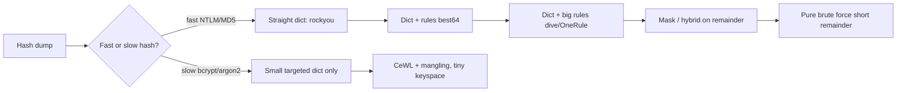
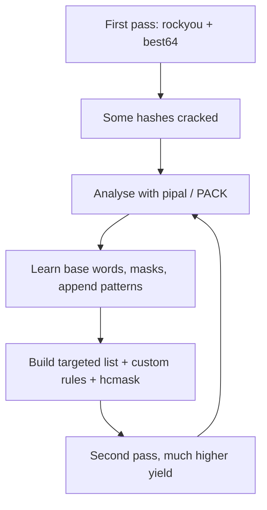
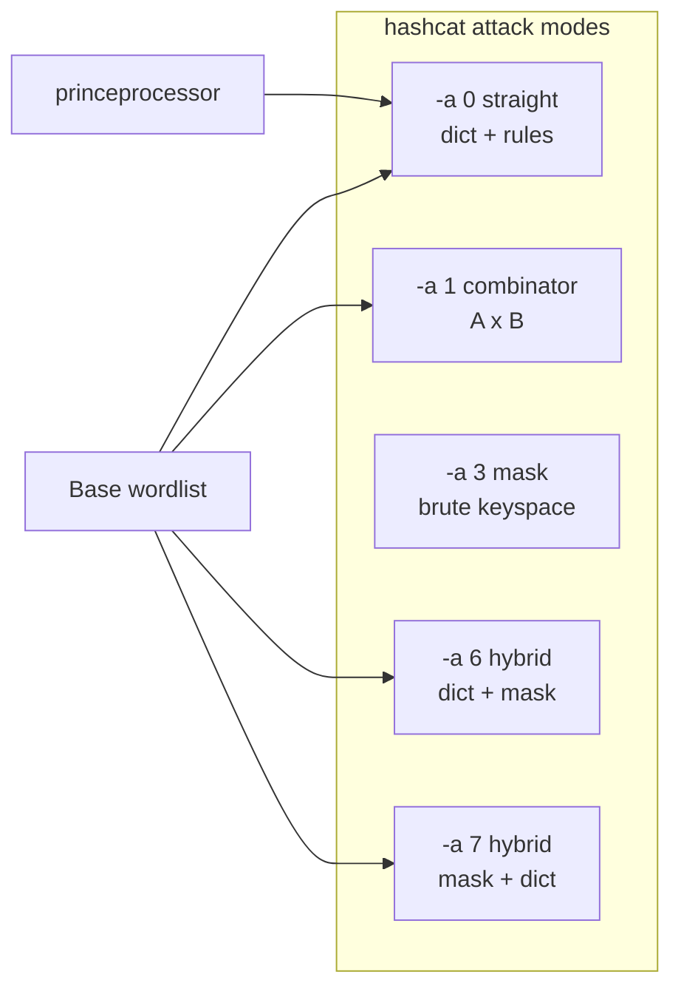
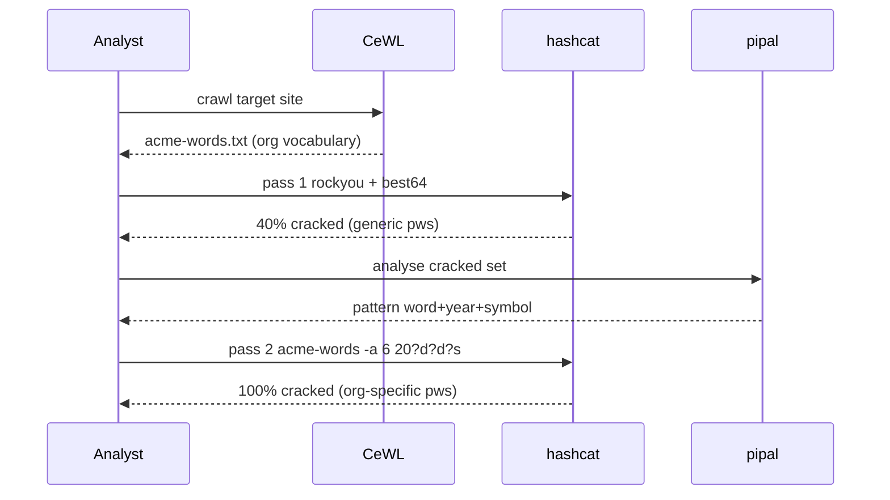

**Level:** Intermediate · **Track:** Penetration Testing · **Read time:** 215 min

This is Chapter 2 of the Password Attacks notebook. Chapter 1 built the mental model: modern systems store a one-way hash of your password, and every offline attack is a guessing game where you hash candidate passwords and look for a match. That chapter deliberately left one enormous question open — *where do the candidate passwords come from?* This chapter is the answer, and it is the single highest-leverage skill in the entire discipline. Two analysts can point hashcat at the same NTLM dump on the same GPU; the one with a better wordlist cracks 60% of the accounts in ten minutes while the other cracks 12% in a day. The hardware is identical. The wordlist is everything.

The reason is arithmetic. A modern GPU rig can compute tens of billions of NTLM hashes per second, which sounds infinite until you notice that the keyspace of all 8-character passwords from the 95 printable ASCII characters is 95⁸ ≈ 6.6 × 10¹⁵ candidates — days of pure brute force for *one* length, and completely hopeless past ten or eleven characters. Real passwords are not random, though. They cluster ferociously around a tiny sliver of that keyspace: dictionary words, names, dates, keyboard walks, the company name with a `1!` bolted on. **A wordlist is a compression of human predictability.** Everything in this chapter is a technique for building, expanding, or targeting that compression so your finite GPU-seconds land where real passwords actually live.

We will move from the absolute basics — what a wordlist file even is and why `rockyou.txt` is on every pentester's disk — up through generating custom keyspaces with `crunch`, scraping a bespoke list off a target's own website with `CeWL`, and finally the mangling engines (John and hashcat rules, combinator, hybrid, and PRINCE attacks) that turn a 10,000-word list into billions of realistic guesses without storing a single extra byte on disk. Everything assumes an **authorised, scoped engagement or your own lab**. Cracking hashes you have no permission to test is unlawful in most jurisdictions regardless of intent; build the lab in Part 12, use the provided sample hashes, and stay inside that boundary.

---

## Part 1: What a Wordlist Actually Is, and Why It Beats Brute Force

A wordlist — also called a dictionary — is nothing more exotic than a plain text file with one candidate password per line, newline-separated, usually UTF-8 or Latin-1 encoded. That is the entire file format. You can make one with `echo`:

```bash
printf 'password\n123456\nqwerty\nletmein\n' > tiny.txt
cat tiny.txt
# password
# 123456
# qwerty
# letmein
```

When you run `hashcat -a 0 -m 1000 hashes.txt tiny.txt`, hashcat reads that file line by line, hashes each word with the NTLM algorithm (`-m 1000`), and compares against every hash in `hashes.txt`. `-a 0` is *straight* / *dictionary* mode: try each word verbatim. That is a **dictionary attack**, the most important attack in offline cracking, and it works for one reason — humans reuse the same few million passwords across billions of accounts.

To feel why this beats brute force, compare the two as a search over a keyspace. Brute force enumerates *every* string of a given length and charset; a dictionary enumerates only strings humans have actually chosen. The keyspaces differ by many orders of magnitude:

| Attack | Candidate space (8 chars) | Time @ 10 GH/s NTLM | Realistic crack rate on a corp dump |
|---|---|---|---|
| Full brute force, `?a?a?a?a?a?a?a?a` (95⁸) | ~6.6 × 10¹⁵ | ~7.6 days | Eventually high but far too slow |
| Lowercase only, `?l?l?l?l?l?l?l?l` (26⁸) | ~2.1 × 10¹¹ | ~21 seconds | Misses anything with digits/symbols |
| `rockyou.txt` straight | 1.4 × 10⁷ | <1 millisecond | 15–40% typical |
| `rockyou.txt` + best64 rules | ~9 × 10⁸ | ~0.09 s | 40–60% typical |
| Targeted list + dive rules | 10⁹–10¹¹ | seconds–minutes | 60–80% on weak orgs |

The punchline: a 14-million-line wordlist finishes in **under a millisecond** on hardware that would need over a week to brute-force the same length, and it cracks a *higher* fraction of real passwords because it is aimed at where humans cluster. Brute force is a last resort for short hashes or the final unbroken remnant; the dictionary is where you always start.



Two properties of a wordlist matter enormously and pull in opposite directions:

- **Coverage** — does the list contain the actual password? A bigger, more varied list has higher coverage.
- **Efficiency** — how many wasted guesses per crack? Every candidate that will never match is pure cost. For a *fast* hash (NTLM, MD5, SHA1) waste is nearly free; for a *slow* hash (bcrypt, Argon2, PBKDF2) every candidate can cost milliseconds, so a bloated list can mean the difference between finishing in an hour and finishing in a year.

This tension is the theme of the whole chapter. For fast hashes you throw huge lists and huge rulesets at the problem because guesses are cheap. For slow hashes you must be surgical — a small, *targeted* list (Part 5's CeWL output, the org's own vocabulary) with a *light* ruleset. Choosing the wrong strategy for the hash type is the most common beginner failure after not understanding hashing at all.

---

## Part 2: rockyou.txt — Where It Came From and Why It Still Wins

Every pentester's disk has `rockyou.txt`. It is the default first-try wordlist for a reason worth understanding, because the story explains both its power and its blind spots.

In December 2009, a social-app developer called RockYou — which stored login credentials for widgets embedded on MySpace, Facebook and others — was breached via a basic SQL injection. Roughly **32 million account passwords were exposed, stored in plaintext** (no hashing at all — the cardinal sin from Chapter 1). Because they were plaintext, the breach handed the security community something unprecedented: a massive, real, unfiltered sample of how ordinary people actually choose passwords. Someone de-duplicated it, sorted the entries by frequency (most common first), stripped the usernames, and the result — about **14,344,391 unique passwords**, ~133 MB — became `rockyou.txt`.

It ships pre-installed on Kali Linux, gzipped, and is the canonical baseline everyone benchmarks against:

```bash
# On Kali, rockyou ships compressed. Decompress it once:
ls -lh /usr/share/wordlists/rockyou.txt.gz
sudo gunzip -k /usr/share/wordlists/rockyou.txt.gz   # -k keeps the .gz too
wc -l /usr/share/wordlists/rockyou.txt
# 14344392 /usr/share/wordlists/rockyou.txt

head /usr/share/wordlists/rockyou.txt
# 123456
# 12345
# 123456789
# password
# iloveyou
# princess
# 1234567
# rockyou
# 12345678
# abc123
```

Notice the ordering: **most frequent first**. This matters for slow hashes — if you cap a bcrypt run at "first 100,000 lines," you want the *most likely* candidates in those lines, and rockyou is already sorted that way. `head -n 100000 rockyou.txt > rockyou-top100k.txt` gives you a high-yield short list for free.

Why it still works, fifteen-plus years on: password *habits* barely change. `Password1`, `123456`, `iloveyou`, `<season><year>`, and `<companyname>1!` are as common now as then. The specific top entry drifts (`123456` overtook `password`; `qwerty` fades as keyboards change) but the *shape* of human choice is remarkably stable, so rockyou keeps cracking a large slice of any real dump on the first pass.

Its blind spots are equally important, and they define why the rest of this chapter exists:

- **It contains no company-specific words.** It will never contain `Acme2024!` or `WinterfellRocks` unless someone happened to use it on RockYou in 2009. Targeted lists (Part 5) fix this.
- **It is dated.** Recent memes, current-year dates, and new product names aren't in it. You *append* current-year mangling with rules (Part 8) rather than relying on the raw file.
- **It is biased toward the RockYou userbase** — English-speaking, casual-web, late-2000s. For a German industrial client or a Japanese target, region-specific lists massively outperform it.

**Blue team relevance:** rockyou is also the defender's audit tool. Feeding your own AD NTDS dump through rockyou in a sanctioned password-audit tells you exactly how many employees use a top-14-million password. Microsoft's own *banned password list* and Have I Been Pwned's *Pwned Passwords* API exist precisely to reject any password that appears in dumps like this before a user can set it — the defensive mirror image of the attack.

---

## Part 3: SecLists and the Wordlist Ecosystem

`rockyou.txt` is one file. The professional standard is **SecLists** — Daniel Miessler's curated, version-controlled collection of wordlists for *every* stage of security testing, not just passwords. If a wordlist exists worth having, it is probably in SecLists.

Install it on Kali (it may already be present under `/usr/share/seclists`):

```bash
sudo apt update && sudo apt install seclists -y
# or clone the latest directly:
git clone --depth 1 https://github.com/danielmiessler/SecLists.git /opt/SecLists
ls /usr/share/seclists
# Discovery  Fuzzing  IOCs  Miscellaneous  Passwords  Pattern-Matching  Payloads  Usernames  Web-Shells
```

The password-relevant directories are where you'll live:

| Path (under SecLists/) | What's in it | When to use |
|---|---|---|
| `Passwords/Leaked-Databases/rockyou.txt` | The classic 14M list | Default first pass on fast hashes |
| `Passwords/Leaked-Databases/rockyou-75.txt` | rockyou filtered to ≥ policy-plausible pw | When a length/complexity policy is known |
| `Passwords/Common-Credentials/10-million-password-list-top-*.txt` | Top-N slices (100, 1k, 10k, 100k, 1M) | Slow hashes; spraying; quick wins |
| `Passwords/Common-Credentials/best1050.txt`, `best15.txt` | Tiny high-yield lists | Online spraying, lockout-sensitive |
| `Passwords/Common-Credentials/500-worst-passwords.txt` | Classic weak set | Sanity checks, demos |
| `Passwords/Default-Credentials/*` | Vendor default `user:pass` pairs | Router/IoT/appliance testing |
| `Usernames/*` | Name lists, top usernames | Building `user:pass` sprays |
| `Passwords/xato-net-10-million-passwords-*.txt` | Xato/Mark Burnett 10M corpus | Broader coverage than rockyou alone |

A few other lists worth knowing outside SecLists:

- **CrackStation's dictionary** (~1.5 billion words, 15 GB) — enormous coverage for fast hashes when disk and time allow.
- **Weakpass** (`weakpass.com`) — aggregated multi-billion-line dumps and rule-mangled megalists, sized by keyspace so you can pick one that fits your time budget.
- **Have I Been Pwned "Pwned Passwords"** — ~1 billion real breached hashes (SHA-1/NTLM), downloadable, primarily a *defensive* dataset but also a coverage-maximising cracking source.
- **Kaonashi** and **OneRuleToRuleThemAll**'s companion lists — curated specifically to pair with strong rulesets.

**Efficiency note:** never `cat` five giant lists together and dedupe naively for a slow hash — you'll drown in redundant guesses. For fast hashes, dedupe *is* worth it. `rli`/`rli2` from the **hashcat-utils** package remove lines already present in another list, and `sort -u` deduplicates a single file. Keep a small, ordered "quick" list and a big "coverage" list, and escalate from the former to the latter.

---

## Part 4: Generating Keyspaces with crunch and maskprocessor

Sometimes no dictionary helps because the target's passwords follow a *known structure* rather than being words: a Wi-Fi PSK that's exactly 8 digits, a PIN, a badge format like 3 letters + 4 digits, a default password scheme `Company-####`. For these you don't want words at all — you want to enumerate a *keyspace*: every string matching a pattern. That's what `crunch` and `maskprocessor` do.

### crunch — from scratch

`crunch` is a generator: you give it a minimum length, a maximum length, a character set, and optionally a pattern, and it prints (or writes) every matching string.

```bash
crunch 4 4 0123456789
# prints every 4-digit combination: 0000 0001 ... 9999  (10,000 lines)

# Basic syntax:  crunch <min> <max> [charset] [options]
```

Key options, each explained:

| Flag | Meaning |
|---|---|
| `<min> <max>` | Minimum and maximum length of generated words (required, positional) |
| `charset` | The literal characters to draw from (e.g. `abc123`). If omitted, crunch uses a default set |
| `-o file.txt` | Write output to a file instead of stdout (essential — output can be huge) |
| `-t PATTERN` | Fixed-pattern template with placeholders (see below) |
| `-d N@` | Limit consecutive repeats (e.g. `-d 2@` = no more than 2 repeated lowercase) |
| `-b 20mib` | Split output into chunks of a max size |
| `-c 1000` | Split output every N lines |
| `-s startstring` | Resume/start generation from a specific word |
| `-p charset` | Permute words/characters with no repeats (order-independent) |
| `-f charset.lst name` | Use a named charset from crunch's built-in `charset.lst` |

The `-t` pattern placeholders are the powerful part:

- `@` → lowercase letters
- `,` → uppercase letters
- `%` → digits
- `^` → symbols
- any other character is treated **literally**

```bash
# Company badge scheme: 3 uppercase letters + 4 digits, e.g. ABC1234
crunch 7 7 -t ,,,%%%% -o badges.txt
wc -l badges.txt          # 26^3 * 10^4 = 175,760,000 lines  -> ~1.4 GB, careful!

# WPA2 PSK that is exactly 8 digits (common ISP default)
crunch 8 8 0123456789 -o wpa8digit.txt   # 10^8 = 100,000,000 lines, ~950 MB

# Password scheme "Summer" + 2 digits + one symbol: Summer21!
crunch 9 9 -t Summer%%^ -o summer.txt

# Built-in named charsets from charset.lst (no need to type them):
crunch 6 8 -f /usr/share/crunch/charset.lst mixalpha-numeric-all-space -o big.txt
```

**Critical discipline: know the keyspace before you hit Enter.** crunch will happily try to write petabytes. The size is `charset_length ^ word_length` (for a fixed length) — always compute it first:

```bash
# crunch prints the total size and line count as a dry-run header before writing.
crunch 8 8 abcdefghijklmnopqrstuvwxyz0123456789 -o /dev/null 2>&1 | head
# Crunch will now generate the following amount of data: 25196924216832 bytes
# 24020400 MB ...  2821109907456 lines
```

That's 2.8 *trillion* lines — do not write it. This is exactly why, for anything beyond a tiny structured keyspace, you feed the pattern **directly into the cracker as a mask** (Part 4b / Chapter on hashcat masks) rather than materialising a file. crunch-to-file is for cases where you genuinely need the file (feeding a tool that only takes a wordlist, or a very small keyspace).

**Piping instead of storing** — the professional pattern for fast hashes:

```bash
# Stream crunch straight into hashcat's stdin; nothing hits disk:
crunch 8 8 0123456789 | hashcat -m 22000 -a 0 wpa.hc22000
# or into John:
crunch 6 6 -t %%%%%% | john --stdin --format=nt hashes.txt
```

### maskprocessor — the leaner generator

`maskprocessor` (`mp64`), from the hashcat project, does the same "generate every string matching a mask" job but with hashcat's mask syntax and far more speed and flexibility (per-position custom charsets, increment, etc.).

```bash
sudo apt install maskprocessor -y
# Mask charsets:  ?l lower  ?u upper  ?d digit  ?s symbol  ?a all  ?b raw bytes
mp64 '?u?l?l?l?l?d?d'          # Xxxxx99  (capitalised 5-letter word + 2 digits)
mp64 -1 '?u?l' '?1?1?1?1'      # -1 defines custom charset 1 = upper+lower
mp64 '?d?d?d?d' -o pins.txt    # all 4-digit PINs
mp64 --increment-min=6 --increment-max=8 '?d?d?d?d?d?d?d?d'  # 6-to-8-digit
```

Ninety percent of the time you will express these patterns as a **hashcat mask attack (`-a 3`)** directly, which is faster and disk-free — masks are covered fully in the hashcat chapter. crunch/maskprocessor matter when a downstream tool needs an actual file, or when you're combining generated fragments into a bigger pipeline (Part 9).

**Red team usage:** structured generators shine against *default credential schemes*. Many organisations set initial passwords by formula — `Welcome@<year>`, `<Firstname><DDMM>`, or `<AssetTag>#`. If OSINT (previous chapters' work) reveals the formula, a crunch/`mp64` pattern of a few thousand candidates cracks the initial-password reset accounts that the org never forced users to change. **Blue team relevance:** this is why "must change at first logon," randomised initial passwords, and blocking formulaic patterns in the password filter matter — a predictable scheme is a keyspace of a few thousand, not a real secret.

---

## Part 5: CeWL — Building a Wordlist From the Target's Own Website

Here is the technique that separates a generic attacker from a good one. Every organisation has a *private vocabulary*: product names, internal project codenames, the founder's surname, the street the office is on, the local sports team, the industry jargon. None of it is in rockyou. All of it ends up in passwords. And almost all of it is sitting in plain sight on the company's own website, careers page, blog, and PDFs.

**CeWL** — the *Custom Word List generator*, by Robin Wood (digininja) — is a Ruby spider that crawls a URL to a chosen depth, extracts the words from the pages, and emits a wordlist of exactly that organisation's language. It is one of the highest-yield tools in targeted cracking.

Install and first run:

```bash
sudo apt install cewl -y          # ships on Kali
cewl https://www.example.com -w example-words.txt
```

The essential options, each explained:

| Flag | Meaning |
|---|---|
| `-d, --depth N` | Spider depth (how many link-hops from the start URL). Default 2 |
| `-m, --min_word_length N` | Ignore words shorter than N (default 3). Set to your target's min password length |
| `-w, --write FILE` | Write the wordlist to FILE |
| `-o, --offsite` | Also follow links to *other* domains (default: stay on-site) |
| `--lowercase` | Emit everything lowercase (then re-case with rules) |
| `-c, --count` | Print each word with its frequency count — sort by this for high-yield words |
| `-e, --email` | Also extract email addresses (bonus username harvest) |
| `--email_file FILE` | Write harvested emails to a separate file |
| `-a, --meta` | Extract metadata (author, creator) from documents |
| `--meta_file FILE` | Write extracted metadata to a file |
| `-n, --no-words` | Suppress the wordlist (use with `-e`/`-a` when you only want emails/meta) |
| `--with-numbers` | Keep words that contain numbers (e.g. `route66`) |
| `-v` | Verbose |
| `--auth_type / --auth_user / --auth_pass` | Crawl behind HTTP basic/digest auth |
| `-H "Header: val"` | Send a custom header (cookies for authenticated crawls) |
| `--proxy_host / --proxy_port` | Route through a proxy (Burp) for logging/scope control |

Worked run with realistic output:

```bash
cewl -d 3 -m 6 -c --with-numbers -e --email_file emails.txt \
     -w acme-words.txt https://www.acme-robotics.example
```

```text
CeWL 6.1 (Max Length) Robin Wood (robin@digi.ninja) (https://digi.ninja/)

Words found (sorted by count):
robotics, 812
acme, 640
automation, 233
manufacturing, 141
warehouse, 118
gripper, 97
palletizer, 88
sunnyvale, 73
innovation, 66
titanium, 51
...
Email addresses found:
j.doe@acme-robotics.example
sales@acme-robotics.example
careers@acme-robotics.example
```

Look at that list: `gripper`, `palletizer`, `titanium`, `sunnyvale`. Those words are in *nobody's* generic dictionary, but they are exactly the words this company's employees reach for. Combine `acme-words.txt` with a rule that appends `<year><symbol>` (Part 8) and you have candidates like `Robotics2024!`, `Gripper#1`, `Sunnyvale2025` — precisely the passwords a `rockyou` pass will never find.

**Sort by frequency for efficiency.** With `-c`, higher-count words are more central to the org's identity and more likely reused in passwords. For a *slow* hash where every guess is expensive, take only the top slice:

```bash
# -c output is "word, count"; keep the top 500 by count, strip the count column:
sort -t, -k2 -nr acme-words-count.txt | head -500 | cut -d, -f1 > acme-top500.txt
```

**Beyond the homepage.** Depth matters and so does source diversity. Crawl the careers page (job titles, tech stack, team names), the blog (product names, exec names), and — via `-a`/`--meta` — document metadata, which often leaks internal usernames and software versions. Feed CeWL a *sitemap* or a list of URLs harvested from the recon chapters for full coverage.

**Companion tools worth knowing:**

- **CUPP** (Common User Passwords Profiler) — interactive: you feed it a *person's* OSINT (name, partner, pet, birthday, employer) and it generates a personalised list mangled with dates and leetspeak. Perfect for a single high-value target.
- **pydictor** — a powerful generator that combines base words, social-engineering profiles, and built-in leet/case/date mangling in one tool.
- **Mentalist** — a GUI that chains base words → case → substitution → append/prepend nodes and *exports a hashcat/John ruleset*, bridging Parts 5 and 8.

**Blue team / detection angle:** a CeWL-style crawl is just normal-looking web traffic — a spider fetching public pages — so it rarely trips an alert on its own. The defensive control isn't detecting the crawl; it's the password *filter*. If your policy rejects any password containing the company name, common product names, or dictionary words (via a tool like `passfilt`-based custom filters, Specops, or an nPulse/HIBP integration), then CeWL's whole premise collapses because those words can't be used. **This is the single most effective defense against targeted wordlists: ban your own vocabulary in the password policy.**

---

## Part 6: Analysing Real Passwords — pipal, PACK, and Building Better Lists

Before mangling, the experts do something beginners skip: they *analyse* the passwords they've already cracked to learn the target's patterns, then feed those patterns back into the next round. This feedback loop — crack a few, learn the shape, target the rest — is what pushes crack rates from 40% to 80%.

**pipal** ingests a list of cracked plaintexts and reports statistics: most common base words, lengths, character-set masks, appended digits, month/year usage.

```bash
git clone https://github.com/digininja/pipal.git && cd pipal
./pipal.rb cracked.txt
```

```text
Top 10 base words
     summer = 412 (3.1%)
     acme = 388 (2.9%)
     winter = 301 (2.3%)
     password = 290 (2.2%)
Password length (count ordered)
     8 = 3201 (24.4%)
     9 = 2988 (22.7%)
     10 = 2110 (16.1%)
One to six character passwords = 41 (0.3%)
Only lowercase alpha = 1102 (8.4%)
Lowercase alpha + numbers = 4980 (37.9%)
...
```

That report tells you the org's employees love `Summer<year>!`, that 8–10 chars dominate, and that "lowercase + digits" is the most common mask. You now *know* which masks and rules to prioritise.

**PACK** (Password Analysis and Cracking Kit) goes further and *emits ready-to-use masks and rules* from a cracked set:

```bash
git clone https://github.com/iphelix/pack.git && cd pack
python3 statsgen.py cracked.txt              # frequency of masks/lengths
python3 maskgen.py cracked.txt --targettime 3600 -o custom.hcmask  # masks that fit a 1-hour budget
python3 policygen.py --minlength 8 --mindigit 1 --minupper 1 -o policy.hcmask  # masks matching a known policy
python3 rulegen.py cracked.txt -q            # derive John/hashcat rules from cracked words
```

`maskgen` is especially valuable: it looks at your already-cracked passwords, computes which `?u?l?l?l?l?l?d?d`-style masks actually occur and how often, sorts them by "crack-per-second," and writes a `.hcmask` file you feed to `hashcat -a 3`. You're no longer guessing which masks matter — you're deriving them from ground truth.



**Blue team relevance:** run pipal/PACK on your *own* sanctioned audit dump. If the report shows 30% of employees use `<Season><Year>` or the company name, that's a finding: the password filter and awareness training aren't working, and you can quantify the risk with a hard number for the report.

---

## Part 7: The Core Idea of Rules — Multiplying a List Without Storing It

Here is the conceptual leap that makes offline cracking scale. You have a base list of, say, 10,000 words (rockyou top-10k, or your CeWL output). Real passwords are rarely a bare dictionary word — they're `Password1`, `p@ssw0rd`, `Summer2024!`, `ACME!!`. You *could* pre-compute every variation and write a gigantic file, but that wastes enormous disk and I/O. Instead, **rules** transform each base word *on the fly*, in the cracker, as it's read.

A rule is a tiny program — a string of single-character functions applied left to right to each candidate word. The cracker reads word `w`, applies rule `r` to get `r(w)`, hashes that, moves on. If you have 10,000 words and 1,000 rules, you test **10,000 × 1,000 = 10,000,000 candidates** while storing only the 10,000-word file and a small rules file. Rules are the reason a 133 MB rockyou file can generate *billions* of realistic guesses.

The transformations mirror exactly how humans mangle passwords:

- Capitalise the first letter (`password` → `Password`)
- Append a digit or year (`password` → `password1`, `password2024`)
- Append a symbol (`password` → `password!`)
- Leet-substitute (`password` → `p@ssw0rd`)
- Duplicate, reverse, toggle case, prepend, truncate…

Both **John the Ripper** and **hashcat** implement rule engines. They share most of the syntax (both descend from the classic Crack/John rule language), with hashcat's being a strict, GPU-friendly subset plus some extensions. Learn the John syntax and 90% transfers to hashcat.

The core single-character rule functions (this table is your rules cheat sheet):

| Rule | Function | `password` → |
|---|---|---|
| `:` | do nothing (passthrough) | `password` |
| `l` | lowercase all | `password` |
| `u` | uppercase all | `PASSWORD` |
| `c` | capitalise first, lowercase rest | `Password` |
| `C` | lowercase first, uppercase rest | `pASSWORD` |
| `t` | toggle case of all | `PASSWORD` |
| `TN` | toggle case of char at position N | `T0` → `Password` |
| `r` | reverse | `drowssap` |
| `d` | duplicate | `passwordpassword` |
| `f` | reflect (append reversed) | `passworddrowssap` |
| `{` / `}` | rotate left / right | `asswordp` / `dpasswor` |
| `$X` | append character X | `$1` → `password1` |
| `^X` | prepend character X | `^!` → `!password` |
| `[` / `]` | delete first / last char | `assword` / `passwor` |
| `sXY` | substitute all X with Y | `sa@` → `p@ssword` |
| `o N X` / `oNX` | overwrite char at N with X | `o0P` → `Password` |
| `i N X` | insert X at position N | — |
| `p` / `pN` | duplicate word N times | — |
| `D N` | delete char at position N | — |
| `'N` | truncate to length N | `'4` → `pass` |
| `@X` | purge all instances of X | `@s` → `paword` |
| `zN` / `ZN` | duplicate first/last char N times | — |

Rules combine on one line, applied left to right:

```text
c $2 $0 $2 $4        password -> Password2024
sa@ so0 $!           password -> p@ssw0rd!
c $! $!              password -> Password!!
```

Reject/conditional operators let a rule *skip* words that don't fit (crucial for efficiency — don't waste guesses on words that can't match a known policy):

| Operator | Meaning |
|---|---|
| `<N` | reject if word length ≥ N |
| `>N` | reject if word length ≤ N |
| `_N` | reject unless length == N |
| `!X` | reject if it contains X |
| `/X` | reject unless it contains X |
| `=NX` | reject unless char at N equals X |
| `(X` / `)X` | reject unless first/last char is X |

```text
>7 c $1        only take words longer than 7 chars, capitalise, append 1
/e sa@         only mangle words containing 'e', then leet the a
```

The next two parts show these in action in each engine.

---

## Part 8: John the Ripper Rules and hashcat Rules in Practice

### John the Ripper rules

John reads its rules from `john.conf` (or `/etc/john/john.conf`), organised into named `[List.Rules:NAME]` sections. Built-in sets include `Single`, `Wordlist`, `Extra`, `Jumbo`, and the excellent `KoreLogic` and `OneRuleToRuleThemAll` (in the jumbo build).

```bash
# Straight wordlist run, then with the default Wordlist rules:
john --format=nt --wordlist=rockyou.txt hashes.txt
john --format=nt --wordlist=rockyou.txt --rules=Wordlist hashes.txt
john --format=nt --wordlist=rockyou.txt --rules=Jumbo hashes.txt   # big, slow, thorough
```

Flags explained:

| Flag | Meaning |
|---|---|
| `--wordlist=FILE` | Dictionary to use (omit for John's default) |
| `--rules[=NAME]` | Apply a named rule set (default `Wordlist` if no name) |
| `--format=NAME` | Hash format (`nt`, `sha512crypt`, `bcrypt`, `raw-md5`, …). Guessing wastes time — set it |
| `--stdin` / `--pipe` | Read candidates from stdin (for piping from crunch/mp64) |
| `--incremental[=MODE]` | John's smart brute force (Markov-ordered) |
| `--mask=?u?l?l?l?d?d` | Mask (hybrid) mode inside John |
| `--fork=N` | Use N CPU processes |
| `--pot=FILE` | Custom pot file for cracked results |
| `--show` | Show already-cracked passwords from the pot |
| `--session=NAME` / `--restore=NAME` | Save/resume a session |

Write your *own* rule section — this is where CeWL + rules pays off. Add to `john.conf`:

```ini
[List.Rules:AcmeCorp]
# capitalise + append 2024/2025 + common symbol
c $2 $0 $2 $4
c $2 $0 $2 $5
c $2 $0 $2 $4 $!
c $2 $0 $2 $5 $!
# leetspeak the base word then append !
sa@ so0 se3 $!
# double symbol
c $! $!
```

```bash
john --format=nt --wordlist=acme-words.txt --rules=AcmeCorp hashes.txt
john --show --format=nt hashes.txt      # list what cracked
```

### hashcat rules

hashcat applies rules from `.rule` files with `-r`, and ships an outstanding collection in `/usr/share/hashcat/rules/`:

| Rule file | Size | Character |
|---|---|---|
| `best64.rule` | 64 rules | The go-to first pass — tiny, fast, cracks a huge fraction. Always start here |
| `d3ad0ne.rule` | ~34k rules | Heavy, high-yield |
| `dive.rule` | ~99k rules | Very heavy; near-exhaustive mangling, for fast hashes with time |
| `rockyou-30000.rule` | ~30k | Derived from rockyou patterns |
| `T0XlC.rule`, `T0XlCv2.rule` | ~4–11k | Popular balanced sets |
| `OneRuleToRuleThemAll` | ~52k | Community "one ruleset" — excellent coverage/speed tradeoff (download from GitHub) |
| `leetspeak.rule`, `toggles*.rule`, `unix-ninja-leetspeak.rule` | small | Focused single-purpose sets |

```bash
# NTLM dump, rockyou + best64 — the canonical first real attack:
hashcat -m 1000 -a 0 hashes.txt /usr/share/wordlists/rockyou.txt -r /usr/share/hashcat/rules/best64.rule

# Escalate to a big ruleset if unbroken hashes remain:
hashcat -m 1000 -a 0 hashes.txt rockyou.txt -r /usr/share/hashcat/rules/dive.rule

# Targeted: your CeWL list with OneRuleToRuleThemAll
hashcat -m 1000 -a 0 hashes.txt acme-words.txt -r OneRuleToRuleThemAll.rule

# Stack multiple rule files (each -r multiplies with the others!):
hashcat -m 1000 -a 0 hashes.txt rockyou.txt -r rules/best64.rule -r rules/toggles1.rule
```

**Stacking multiplies keyspace fast** — two `-r` files of 64 and 100 rules give 6,400 mutations *per word*. Watch the reported keyspace in hashcat's status; it's easy to accidentally create a run that won't finish this decade.

Useful hashcat runtime flags for rule work:

| Flag | Meaning |
|---|---|
| `-m N` | Hash mode (1000 NTLM, 0 MD5, 100 SHA1, 1800 sha512crypt, 3200 bcrypt, 22000 WPA) |
| `-a 0` | Attack mode: straight (dictionary + rules) |
| `-r FILE` | Rules file (repeatable to stack) |
| `-g N` | Generate and use N *random* rules on the fly (no file needed) |
| `--loopback` | After a round, feed newly cracked plaintexts back as a wordlist (self-amplifying) |
| `-O` | Optimised kernels (faster, limits max password length ~31) |
| `-w 3` | Workload profile (1 low … 4 insane) |
| `--status --status-timer=10` | Periodic status output |
| `--potfile-path FILE` | Where cracked results are stored |
| `--username` | Input file has `user:hash` format — strip usernames automatically |
| `--show` / `--left` | Show cracked / show still-uncracked hashes |

**`-g` random rules** are a surprisingly strong trick: `hashcat -m 1000 -a 0 hashes.txt rockyou.txt -g 5000` invents 5,000 random rules and often cracks stragglers that no curated set happened to cover — cheap to try when you've exhausted the standard files.

**`--loopback` and the feedback loop:** after cracking some passwords, real users at the same org often share patterns; feeding cracked plaintexts back as base words (automatically with `--loopback`, or manually as a new wordlist with best64) reliably harvests more. This is Part 6's analysis loop, automated.

---

## Part 9: Combinator, Hybrid, and PRINCE Attacks

Rules mangle *one* word at a time. Three more attack modes build candidates by *combining* words or fragments — essential for passphrases and multi-word passwords like `correcthorse` or `RedGripper2024`.

### Combinator attack (`-a 1`)

Concatenates every word in list A with every word in list B: `left.txt × right.txt`.

```bash
# words like "summerrobotics", "winteracme", ...
hashcat -m 1000 -a 1 hashes.txt seasons.txt nouns.txt
```

Keyspace is `|A| × |B|`. With rules applied to each side via `-j` (left) and `-k` (right):

```bash
# capitalise left word, append ! to combined result
hashcat -m 1000 -a 1 hashes.txt words1.txt words2.txt -j 'c' -k '$!'
```

For three-word combos, use the standalone **`combinator`** and **`combinator3`** from hashcat-utils to pre-generate, then pipe:

```bash
combinator3 a.txt b.txt c.txt | hashcat -m 1000 -a 0 hashes.txt
```

### Hybrid attacks (`-a 6` and `-a 7`)

Combine a dictionary with a *mask* — the "word + appended pattern" case that dominates real passwords (`Password2024`, `gripper!!`).

```bash
# -a 6 = dict + mask (append):  word then 2 digits then symbol -> "acme21!"
hashcat -m 1000 -a 6 hashes.txt acme-words.txt '?d?d?s'

# -a 7 = mask + dict (prepend):  2 digits then word -> "21acme"
hashcat -m 1000 -a 7 hashes.txt '?d?d' acme-words.txt

# Very common real pattern: word + year + symbol
hashcat -m 1000 -a 6 hashes.txt acme-words.txt '20?d?d?s'
```

Hybrid is often *more efficient than a giant append ruleset* for the specific "word then structured suffix" case, because the mask expresses the suffix keyspace exactly.

### PRINCE attack (princeprocessor)

**PRINCE** (PRobability INfinite Chained Elements) is the clever one. Given a single wordlist, `pp64`/`princeprocessor` chains multiple words *from that same list* together to build candidates of increasing length — `red` + `gripper` → `redgripper`, `acme` + `2024` (if `2024` is in the list) → `acme2024` — ordered by probability. It's a self-combining attack that discovers multi-word passwords without you specifying which lists to combine.

```bash
sudo apt install princeprocessor -y
pp64 --pw-min=8 --pw-max=16 rockyou.txt | hashcat -m 1000 -a 0 hashes.txt -r rules/best64.rule
```



**Red team usage:** hybrid `-a 6` with a CeWL list and a `20?d?d?s` mask is the single most productive targeted attack against a corporate NTLM dump — it directly models "our-word + year + symbol," which is how a large fraction of policy-compliant corporate passwords are actually formed. **Blue team relevance:** this is why length beats complexity. A three-random-word passphrase of 20+ characters explodes the combinator/PRINCE keyspace beyond feasibility, whereas `Word2024!` — technically "complex" — falls to a single hybrid mask in seconds.

---

## Part 10: Full Worked Lab — From Website to Cracked Hashes

This lab ties the whole chapter together: profile a target's vocabulary, build a bespoke list, mangle it, and crack a mixed set of NTLM and bcrypt hashes — the exact workflow of a real internal engagement's password-audit phase. **Everything below is against a local lab you own.** Substitute your own throwaway site and self-generated hashes.

### Step 0 — Set up the lab hashes

Generate targets so you can verify your cracks. We'll seed a few passwords that mimic a real org that loves its own vocabulary:

```bash
# NTLM hashes (fast) — mimic dumped AD secrets
python3 - <<'PY'
import hashlib
pw = ["Robotics2024!", "Gripper#1", "Sunnyvale2025", "acme", "Summer2024"]
for p in pw:
    h = hashlib.new('md4', p.encode('utf-16le')).hexdigest()
    print(f"{h}")
PY
```

```text
# ntlm.txt  (example output — yours will differ per install)
d1c8f4e6...   Robotics2024!
7ac3b0d2...   Gripper#1
...
```

```bash
# Save just the hashes:
python3 - <<'PY' > ntlm.txt
import hashlib
for p in ["Robotics2024!","Gripper#1","Sunnyvale2025","acme","Summer2024"]:
    print(hashlib.new('md4',p.encode('utf-16le')).hexdigest())
PY

# One deliberately-slow bcrypt hash to show the strategy difference:
python3 - <<'PY' > bcrypt.txt
import bcrypt
print(bcrypt.hashpw(b"Gripper#1", bcrypt.gensalt(rounds=10)).decode())
PY
```

### Step 1 — Build the targeted wordlist with CeWL

```bash
cewl -d 2 -m 4 -c --with-numbers -w acme-raw.txt https://your-lab-site.local
# Keep top words by frequency for efficiency
sort -u acme-raw.txt > acme-words.txt
wc -l acme-words.txt        # e.g. 1,842 words: robotics, gripper, sunnyvale, acme, titanium...
```

For the lab, simulate CeWL output if you don't have a site up:

```bash
printf 'robotics\ngripper\nsunnyvale\nacme\ntitanium\nsummer\nwinter\npalletizer\n' > acme-words.txt
```

### Step 2 — First pass: straight + best64 (fast hashes)

```bash
hashcat -m 1000 -a 0 ntlm.txt /usr/share/wordlists/rockyou.txt -r /usr/share/hashcat/rules/best64.rule --status
```

```text
Session..........: hashcat
Status...........: Running
Hash.Mode........: 1000 (NTLM)
Guess.Base.......: File (rockyou.txt)
Guess.Mod........: Rules (best64.rule)
Speed.#1.........: 8925.4 MH/s
Recovered........: 2/5 (40.00%) Digests
...
d41d8...:acme
a1b2c...:Summer2024
```

`acme` (bare dict word) and `Summer2024` (rockyou `Summer` + best64's `$2$0$2$4`-style append) fall immediately. Three hashes remain — the org-specific ones rockyou can't know.

### Step 3 — Second pass: targeted list + hybrid mask

The remaining passwords are `<orgword><year><symbol>` and `<orgword>#<digit>`. Model them directly:

```bash
# word + year + symbol:  Robotics2024!  Sunnyvale2025...
hashcat -m 1000 -a 6 ntlm.txt acme-words.txt '20?d?d?s' -j 'c' --status
```

```text
Recovered........: 4/5 (80.00%) Digests
7c1a2...:Robotics2024!
9f3e0...:Sunnyvale2025
```

```bash
# word + '#' + digit:  Gripper#1  (capitalise the left word with -j c)
hashcat -m 1000 -a 6 ntlm.txt acme-words.txt '#?d' -j 'c'
```

```text
Recovered........: 5/5 (100.00%) Digests
b7d4c...:Gripper#1
```

All five NTLM hashes cracked — two from the generic pass, three from the *targeted* pass that only worked because CeWL supplied `robotics`, `sunnyvale`, `gripper` and the hybrid mask modelled the org's suffix habit.

### Step 4 — The slow hash: strategy changes completely

```bash
# WRONG for bcrypt: rockyou + dive rules would take months at ~a few kH/s.
# RIGHT: tiny targeted list, light mangling only.
hashcat -m 3200 -a 6 bcrypt.txt acme-words.txt '#?d' -j 'c' -w 3 --status
```

```text
Hash.Mode........: 3200 (bcrypt $2*$, Blowfish)
Speed.#1.........: 4187 H/s          <-- SEVEN orders of magnitude slower than NTLM
Recovered........: 1/1 (100.00%)
$2b$10$...:Gripper#1
```

The lesson in one screen: NTLM ran at ~8.9 *billion* H/s; bcrypt at ~4 *thousand* H/s. The same rockyou+dive attack that finished NTLM in milliseconds would run for months against bcrypt. Against slow hashes you *must* switch strategy — small targeted list, minimal rules, high-confidence masks only — which is exactly why the CeWL/analysis work in Parts 5–6 matters most precisely when the hash is expensive.



---

## Part 11: Detection & Defense Angle

Everything above is offense; this section consolidates the defensive mirror, because a pentester who can't explain the fix delivers half a report. Offline cracking is almost impossible to *detect* — it happens on the attacker's own hardware, disconnected from your network, after they've already stolen the hashes. So defense is overwhelmingly about *prevention*: making the wordlist/rule approach uneconomical.

**Kill the wordlist's coverage — ban known-bad and org-specific words.**

- Integrate **Have I Been Pwned Pwned Passwords** (or Azure AD Password Protection / Entra ID) so any password appearing in a breach corpus (the exact source of rockyou-style lists) is rejected at set-time. This single control defeats straight dictionary attacks against new passwords.
- Deploy a **custom password filter** (Windows `passfilt`-based DLLs, Specops, or open-source `lithnet-password-protection`) that rejects the company name, product names, local place names, and common seasons — precisely the CeWL/mangling attack surface from Parts 5 and 8.
- Ban keyboard walks (`qwerty`, `1qaz2wsx`) and repeated/sequential patterns.

**Kill the rule/hybrid keyspace — favour length over complexity.** As Part 9 showed, `Word2024!` (short, "complex") dies to one hybrid mask, while a 20-character three-word passphrase explodes the combinator/PRINCE keyspace beyond feasibility. NIST SP 800-63B guidance reflects this: prioritise minimum length (≥ 12, ideally 14+), drop forced periodic rotation and arbitrary composition rules (which push users toward predictable `Season+Year+!` patterns), and screen against breach lists.

**Kill the offline attack's economics — slow the hash.** The Part 10 lab's seven-orders-of-magnitude gap between NTLM and bcrypt is the whole story. Store passwords with a **slow, salted, memory-hard KDF** — Argon2id, scrypt, or bcrypt with a high work factor — so even a perfect wordlist crawls. Salting defeats rainbow tables and forces per-hash work; a high iteration count makes each guess expensive enough that a billion-line list becomes impractical.

**Detection where it *is* possible — the online cousin.** The *online* form of these attacks (hydra/spraying, a later chapter) *is* detectable and belongs in your monitoring:

| Signal | What to watch | Where |
|---|---|---|
| Password spraying | Many accounts, few attempts each, same source/time window | Event ID 4625 (failed logon) clustered by source IP |
| Kerberoast / AS-REP setup | TGS requests for many SPNs; RC4 (`0x17`) ticket requests | Event ID 4769 |
| Rules-cracked reuse | A cracked pattern reused across accounts | Sanctioned audit + pipal on your NTDS |
| Anomalous web crawl (CeWL) | Rapid sequential page fetches, non-browser UA | Web/WAF logs (low signal — prevention beats detection here) |

**Proactive auditing — crack yourself first.** The most valuable defensive use of this entire chapter is a sanctioned internal password audit: dump your own NTDS.dit, run rockyou + best64 + a CeWL list of your own vocabulary, and report the crack rate. If 35% fall in an hour, you have a quantified, board-ready risk metric and a clear remediation (breach-list screening + length policy + slow hashing). Tools like **DSInternals** and Microsoft's own guidance support running this safely.

---

## Part 12: Building the Lab

To practise everything above lawfully, build an isolated lab. Nothing here touches a system you don't own.

```bash
# 1. Wordlists & tools on Kali (or any Linux):
sudo apt update
sudo apt install -y hashcat john seclists crunch cewl maskprocessor \
                    princeprocessor hashcat-data wordlists
sudo gunzip -k /usr/share/wordlists/rockyou.txt.gz

# 2. hashcat-utils (combinator, rli, etc.):
git clone https://github.com/hashcat/hashcat-utils.git
cd hashcat-utils/src && make && ls   # combinator.bin, rli.bin, ...

# 3. OneRuleToRuleThemAll ruleset:
git clone https://github.com/stealthsploit/OneRuleToRuleThemAll.git

# 4. Analysis tooling:
git clone https://github.com/digininja/pipal.git
git clone https://github.com/iphelix/pack.git

# 5. Verify GPU (optional, big speedups):
hashcat -I            # list OpenCL/CUDA devices
hashcat -b -m 1000    # benchmark NTLM
```

Generate your own target hashes to attack (never use real data you don't own):

```bash
# A spread of formats to practise identifying + cracking:
echo -n 'Summer2024' | md5sum                      # raw-md5, -m 0
python3 -c "import hashlib;print(hashlib.new('md4','Gripper#1'.encode('utf-16le')).hexdigest())"  # NTLM, -m 1000
openssl passwd -6 'Robotics2024!'                  # sha512crypt, -m 1800
python3 -c "import bcrypt;print(bcrypt.hashpw(b'acme',bcrypt.gensalt(10)).decode())"  # bcrypt, -m 3200
```

Then reproduce the Part 10 workflow end to end. Practising the *identify → choose mode → choose list → choose rules → escalate* loop until it's automatic is the entire skill.

---

## Part 13: Common Pitfalls

- **Using a giant list + heavy rules on a slow hash.** rockyou + dive against bcrypt runs for months. For slow hashes: tiny targeted list, light rules, high-confidence masks. Check the hash mode's speed with `hashcat -b -m N` *before* committing to a strategy.
- **Not decompressing / wrong path.** `rockyou.txt.gz` must be `gunzip`ped first; on non-Kali systems the path differs. `locate rockyou.txt` or `find / -name 'rockyou.txt*'`.
- **Forgetting `--username` on `user:hash` files.** hashcat treats the whole line as the hash and cracks nothing. Add `--username`, or pre-strip with `cut -d: -f2`.
- **Wrong hash mode (`-m`) / format.** The most common "nothing cracks" cause. Identify first (`hashid`, `hash-identifier`, `nth`/name-that-hash) — covered in Chapter 1.
- **Materialising huge crunch/mask files to disk.** Enumerating `?a?a?a?a?a?a?a?a` fills your disk and never finishes. Pipe into the cracker or use `-a 3` masks; always read crunch's dry-run size header first.
- **Accidental keyspace explosion when stacking rules.** Two 50k-rule files = 2.5 billion mutations *per word*. Watch hashcat's reported keyspace and ETA.
- **CeWL depth too shallow.** `-d 1` grabs only the homepage. Use `-d 2`/`-d 3` and crawl careers/blog/PDF pages for the vocabulary that actually ends up in passwords.
- **Case mismatches.** `gripper` in your list vs `Gripper` in the password. Apply a capitalise rule (`-j c` in hybrid, `c` in a rule) rather than doubling your list.
- **Not using `--loopback` / not analysing cracks.** The feedback loop (crack → pipal → targeted round) is where crack rates jump from 40% to 80%. Skipping it leaves easy wins on the table.
- **Deduping across huge lists for slow hashes but not fast ones (or vice-versa).** For fast hashes, dedupe to save wasted guesses; for a quick targeted slow-hash run, ordering by likelihood matters more than raw dedup.

---

## Part 14: Final Revision / Summary

- A **wordlist** is a newline-separated file of candidate passwords; a **dictionary attack** tries each verbatim. It beats brute force because real passwords cluster in a tiny, human-predictable slice of the keyspace — a 14M-line file finishes in under a millisecond and out-cracks a week of brute force.
- **rockyou.txt** (14,344,392 real plaintext passwords from the 2009 breach, sorted by frequency) is the universal baseline. It excels at generic passwords, is blind to org-specific words and current dates. **SecLists** is the full ecosystem (top-N slices, default creds, usernames, leaked DBs).
- **crunch** and **maskprocessor** generate *keyspaces* from patterns (`@,%^` / `?l?u?d?s`) for structured secrets (PINs, badge formats, default schemes). Always compute `charset^length` first; prefer piping or `-a 3` masks over writing giant files.
- **CeWL** scrapes the target's own site into a bespoke wordlist of that org's private vocabulary — the highest-yield targeted technique. Sort by frequency (`-c`) for efficiency; harvest emails (`-e`) and metadata (`-a`) as a bonus. CUPP/pydictor/Mentalist extend it to individuals.
- **pipal / PACK** analyse already-cracked passwords to learn the target's patterns and emit custom masks/rules — driving the crack → analyse → target feedback loop that pushes yields from ~40% to ~80%.
- **Rules** transform each base word on the fly (`c $1`, `sa@`, `$2$0$2$4`), multiplying a small list into billions of candidates with almost no disk cost. John (`--rules=`, custom `[List.Rules:]` sections) and hashcat (`-r file.rule`, `best64`→`dive`→`OneRuleToRuleThemAll`, stackable, `-g` random) share most syntax.
- **Combinator (`-a 1`)**, **hybrid (`-a 6`/`-a 7`)**, and **PRINCE** build candidates by combining words/fragments and appending masks — ideal for passphrases and the ubiquitous `word+year+symbol` pattern.
- **Strategy depends on hash speed.** Fast hash (NTLM/MD5) → huge lists + heavy rules, waste is free. Slow hash (bcrypt/Argon2) → small targeted list + light rules only; every guess is costly.
- **Defense** = ban breach-list and org-vocabulary passwords at set-time (HIBP/Entra/custom filter), favour length over complexity (defeats hybrid/combinator), and store secrets with a slow salted KDF (defeats the offline economics). Online spraying *is* detectable (4625/4769 clustering); offline cracking is not — prevention wins.

---

## Part 15: Cheat Sheet / Quick Reference

```bash
### WORDLISTS ###
gunzip -k /usr/share/wordlists/rockyou.txt.gz     # decompress rockyou on Kali
ls /usr/share/seclists/Passwords/                 # SecLists password dir
head -n 100000 rockyou.txt > rk-100k.txt          # high-yield short list (slow hashes)

### GENERATE KEYSPACE ###
crunch 8 8 0123456789 -o pins8.txt                # all 8-digit strings
crunch 7 7 -t ,,,%%%% -o badges.txt               # 3 upper + 4 digit  (,=UPPER %=digit @=lower ^=sym)
crunch 8 8 0123456789 | hashcat -m 22000 -a 0 wpa.hc22000   # pipe, no disk
mp64 '?u?l?l?l?l?d?d'                              # maskprocessor: Xxxxx99  (?l ?u ?d ?s ?a)

### TARGETED LIST (CeWL) ###
cewl -d 3 -m 6 -c --with-numbers -e --email_file mails.txt -w words.txt https://target
sort -t, -k2 -nr words-count.txt | head -500 | cut -d, -f1 > top500.txt   # top by frequency

### ANALYSE CRACKS ###
./pipal.rb cracked.txt                            # base words, lengths, masks
python3 maskgen.py cracked.txt --targettime 3600 -o custom.hcmask   # masks that fit budget

### JOHN ###
john --format=nt --wordlist=rockyou.txt --rules=Wordlist hashes.txt
john --format=nt --wordlist=words.txt --rules=AcmeCorp hashes.txt   # custom [List.Rules:AcmeCorp]
john --show --format=nt hashes.txt

### HASHCAT — modes: 1000 NTLM | 0 MD5 | 100 SHA1 | 1800 sha512crypt | 3200 bcrypt | 22000 WPA
hashcat -m 1000 -a 0 h.txt rockyou.txt -r rules/best64.rule        # straight + rules (start here)
hashcat -m 1000 -a 0 h.txt rockyou.txt -r rules/dive.rule          # heavy ruleset
hashcat -m 1000 -a 0 h.txt words.txt   -r OneRuleToRuleThemAll.rule
hashcat -m 1000 -a 1 h.txt a.txt b.txt -j c -k '$!'               # combinator A x B
hashcat -m 1000 -a 6 h.txt words.txt '20?d?d?s'                    # hybrid: word + year + symbol
hashcat -m 1000 -a 7 h.txt '?d?d' words.txt                        # hybrid: digits + word
hashcat -m 1000 -a 0 h.txt rockyou.txt -g 5000                     # 5000 random rules
pp64 --pw-min=8 --pw-max=16 rockyou.txt | hashcat -m 1000 -a 0 h.txt -r rules/best64.rule  # PRINCE
hashcat -m 1000 --username --show h.txt                            # show cracked (user:hash input)
hashcat -b -m 3200                                                # benchmark before choosing strategy

### RULE FUNCTIONS (John & hashcat) ###
:  none     l lower   u UPPER   c Capitalise   t toggle-all   TN toggle@N
r  reverse  d dup     $X append X   ^X prepend X   sXY sub all X->Y   [ del-first  ] del-last
>N reject if len<=N   <N reject if len>=N   /X require X   !X reject if has X
# examples:  c $2$0$2$4  -> Word2024      sa@ so0 $!  -> w@rd0! style leet+append
```

---

## Part 16: Practice Labs & Resources

Train each specific skill from this chapter on these targets (all authorised practice environments):

- **TryHackMe — "Crack the Hash"** and **"Password Attacks"** rooms: guided hashcat/John, mode identification, rockyou + rules end to end.
- **TryHackMe — "Hydra"** / **"Wordlists"**: pairs with online attacks and building lists.
- **HackTheBox Academy — "Password Attacks", "Cracking Passwords with Hashcat", and "Custom Wordlists & Rules" modules**: the most thorough structured coverage of exactly this chapter's material (CeWL, hashcat rules, hybrid, PRINCE).
- **HackTheBox machines with credential-cracking paths** (e.g. boxes where a captured NetNTLMv2 or a KeePass/zip hash must be cracked with a *targeted* list): practise CeWL-on-the-box-site → hashcat.
- **picoCTF — "Cryptography" and password-cracking challenges**: mask/hybrid practice on constrained keyspaces.
- **PentesterLab / VulnHub boxes** that ship a `/etc/shadow` or a leaked DB dump: full offline workflow.
- **CyberDefenders / Blue Team labs**: run pipal/PACK on a provided dump and write the *defensive* finding — the audit side of the skill.
- **Weakpass.com** and **hashes.com** (for lawfully testing *your own* generated hashes only): benchmark your lists/rules against known plaintext to measure coverage.

Practice questions:

1. You dump 400 NTLM hashes from a client's AD and crack 38% with `rockyou + best64` in ten minutes. What are your next *three* moves, in order, and why? (Expect: analyse the 38% with pipal → build a CeWL list off the client's site → hybrid `-a 6` with a `20?d?d?s`-style mask + escalate rules; then `--loopback`.)
2. A Wi-Fi PSK is known to be exactly eight decimal digits. Write the crunch command *and* the equivalent disk-free hashcat mask attack, and state the keyspace size and rough time at 1 MH/s (WPA is slow).
3. Explain, with the numbers from Part 10, why you would *never* run `rockyou.txt -r dive.rule` against a bcrypt hash but happily would against NTLM. What do you run against the bcrypt instead?
4. Write a hashcat/John rule line that turns `winter` into `Winter2025!` and a second that turns `password` into `p@ssw0rd`. Explain each function.
5. Given a cracked-password set dominated by `<Season><Year>` and 8–10 character lengths, which *defensive* controls (name at least three) would most reduce the crack rate, and which single control gives the biggest economic hit to the *offline* attacker?

---

*Cracking is a game of aiming finite compute at where human predictability lives. rockyou tells you where people in general go; CeWL and analysis tell you where **this** target goes; rules, hybrid, combinator and PRINCE multiply a small, well-aimed list into the billions of realistic guesses that actually land. Master list-building and mangling and the cracking tools stop being magic — they become a well-understood pipeline you point, in the right order, at the right hash.*

---

*Also on [Praneeth's portfolio](https://ping-praneeth.vercel.app/notebook/pentest-password-attacks/02-wordlists-and-rules-rockyou-crunch-cewl-and-mangling), with comments and the latest edits.*
