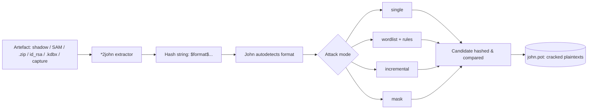
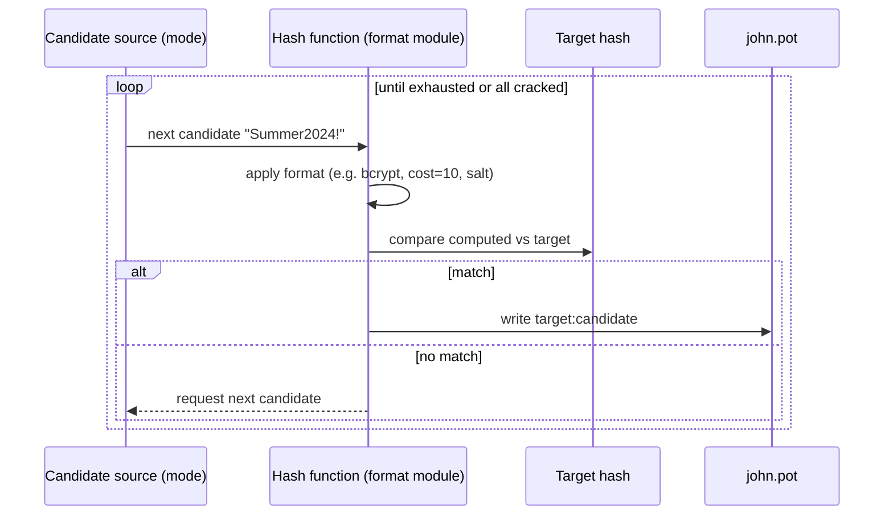
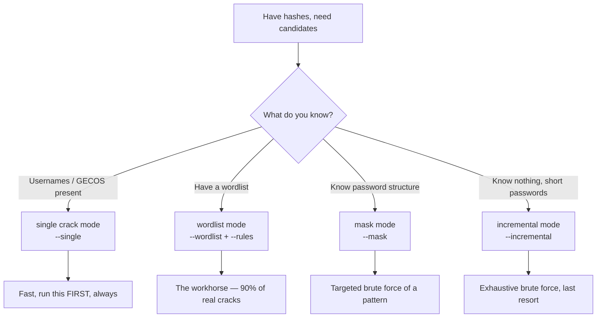
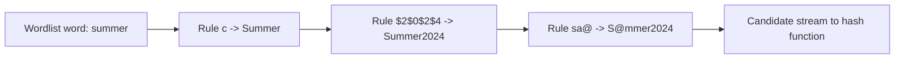
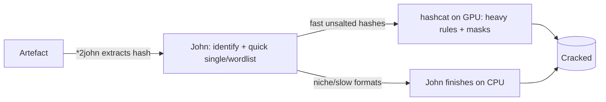

This is Chapter 4 of the Password Attacks notebook. The previous chapter went *online* — Hydra throwing guesses at a live service that answers back, one loud network round-trip at a time. This chapter comes back to the quiet, fast world of **offline cracking**, where you already hold the hash and the entire contest happens on your own hardware with nothing leaving the machine. Chapter 1 established what a hash is and where the hashes live; Chapter 2 built the wordlists and rules that feed a cracker. Here we meet the cracker itself — the older, stranger, more format-fluent of the two engines that dominate the field: **John the Ripper**.

John (JtR) has been in continuous development since 1996 and remains the tool that "just works" on the widest variety of hash formats with the least ceremony. Where hashcat is a GPU-first speed monster with rigid syntax, John is a CPU-first, autodetecting, deeply scriptable Swiss-army knife that ships with dozens of extractor utilities for pulling crackable hashes out of ZIP archives, SSH keys, KeePass databases, PDFs, disk images and more. If hashcat is a drag-racer, John is the machine shop. A serious password attacker uses both, and this chapter teaches you when and why to reach for John.

By the end you will be able to install the *jumbo* build, recognise which of John's hundreds of formats a given hash needs, drive all four attack modes, extract hashes from real artefacts with the `*2john` tools, write and apply rules in `john.conf`, run and resume long sessions across all your CPU cores, and read John's output fluently. Everything here assumes an **authorised engagement or your own lab**. Cracking hashes you obtained without permission is unlawful under computer-misuse and unauthorised-access legislation in essentially every jurisdiction — build the lab in Part 13, crack only the hashes you generate yourself, and keep every command inside that boundary.

---

## Part 1: Offline Cracking, and Where John Fits

Offline password cracking starts *after* you already have the hash. Someone dumped `/etc/shadow`, exported the Windows SAM, captured a NetNTLMv2 challenge-response with Responder, pulled an AS-REP out of Active Directory, or exfiltrated a database's `users` table. The password itself is gone — a hash is a one-way function — but the hash lets you *verify a guess*: hash a candidate, compare it to the target, and if they match you have recovered the plaintext. That verify-a-guess loop is the whole of cracking, and because it runs entirely on your machine there is no network, no logging on the target, no rate limit, and no lockout. You are bounded only by how many candidates per second your hardware can hash.

That single fact — no target-side visibility — is what makes offline cracking so much more powerful than the online brute force of the previous chapter. Online, you might manage tens of guesses per second before a WAF or account-lockout policy stops you. Offline against a fast hash like raw MD5 or NTLM, a modern CPU does *millions* per second and a GPU does *billions*. The defence against offline cracking is therefore never "rate limiting" — it is **slow hashes** (bcrypt, Argon2, sha512crypt with a high cost) and **long, high-entropy passwords**, exactly as Chapter 1 argued.

John's specific niche in this world:

- **It autodetects formats.** Hand John a file of hashes and it will usually work out what they are — MD5crypt, bcrypt, sha512crypt, NTLM, raw-SHA1 — and start cracking. hashcat makes you specify a numeric mode (`-m 1000`) every time.
- **It owns the "get the hash out of the thing" problem.** The jumbo build ships ~100 extractor scripts (`zip2john`, `ssh2john`, `keepass2john`, `pdf2john`, `rar2john`, `bitlocker2john`, and many more) that convert an encrypted artefact into a `$format$...` string John can crack. This is often the *only* reason to reach for John on a job.
- **It is scriptable to the bone.** `john.conf` defines rule sets, mask presets, external "modes" written in a C-like mini-language, and format parameters — all editable, all documented.
- **It is CPU-first and portable.** John runs well on a laptop, a jump box, or a headless VM with no GPU. For GPU-bound fast hashes hashcat is faster, but John gets you cracking anywhere.



Throughout this chapter, "John" means the **jumbo** build unless stated otherwise — the stock "core" John cracks only a handful of formats and lacks most of the `*2john` tools, so nobody doing real work uses it.

---

## Part 2: Core John vs Jumbo John — Install It Properly

There are two John the Rippers and the difference matters on day one.

- **John the Ripper "core"** — the minimal upstream release from Openwall. Supports a short list of traditional Unix formats (DES crypt, MD5crypt, bcrypt, a few others), the four attack modes, and little else. This is what some minimal package repos ship as `john`.
- **John the Ripper "jumbo"** (`john-jumbo`, sometimes `john-the-ripper` in repos) — the community "bleeding-jumbo" fork with **300+ hash and cipher formats**, GPU (OpenCL) support, all the `*2john` extractors, and a far richer `john.conf`. This is the real tool. Kali ships jumbo by default.

**Check what you have first.** On Kali, John is preinstalled:

```bash
john --version
# John the Ripper 1.9.0-jumbo-1+bleeding-... (the "jumbo" in the string is what you want)
```

If `--version` (or the banner printed by running `john` with no args) does not say **jumbo**, you have core and should install jumbo.

### Install on Kali / Debian / Ubuntu

```bash
sudo apt update
sudo apt install -y john          # Kali packages the jumbo build under this name
```

### Build jumbo from source (any Linux — always current, always complete)

Distro packages lag behind upstream; for CTFs and engagements you often want the latest formats (new Kerberos, KeePass, and cloud-token formats land in bleeding-jumbo first). Building from source is the reliable path:

```bash
# 1. Dependencies (Debian/Ubuntu/Kali)
sudo apt install -y build-essential libssl-dev git zlib1g-dev \
     yasm libgmp-dev libpcap-dev libbz2-dev

# 2. Clone the bleeding-jumbo branch
git clone https://github.com/openwall/john -b bleeding-jumbo john-bleeding
cd john-bleeding/src

# 3. Configure — autodetects your CPU features (AVX2, AVX-512) and OpenCL
./configure

# 4. Compile using all cores
make -s -j"$(nproc)"

# 5. Binaries land in ../run — add to PATH or call directly
cd ../run
./john --version
```

**Every flag explained on the build:**

- `-b bleeding-jumbo` — clone the actively developed branch, not the stable `master`. Bleeding-jumbo has the newest formats and fixes.
- `./configure` — a standard autotools script; it probes for OpenSSL, GMP (big-integer math, needed for some asymmetric formats), libpcap (for `*2john` tools that read captures), and CPU SIMD width. Read its summary — it tells you which SIMD (AVX2/AVX-512) and whether OpenCL was found.
- `make -s -j"$(nproc)"` — `-s` silent, `-j"$(nproc)"` parallel build across all logical CPUs. `nproc` prints the core count.
- The `run/` directory is the important one: it contains `john`, every `*2john` script, `john.conf`, and the wordlists/rules John ships with. When people say "John's directory" they mean `run/`.

**Verify the extractors are present** — this is the jumbo payload you actually came for:

```bash
ls run/*2john* | head
# run/zip2john  run/ssh2john.py  run/keepass2john  run/rar2john
# run/pdf2john.pl  run/office2john.py  run/1password2john.py  ...
ls run/*2john* | wc -l          # ~100 extractors in a current jumbo build
```

**Where things live (jumbo on Kali):**

| Path | Contents |
|---|---|
| `/usr/sbin/john` (or `run/john`) | The main binary |
| `/usr/share/john/john.conf` (or `run/john.conf`) | Master config: rules, mask presets, format params |
| `/usr/share/john/*.chr` | Incremental-mode character-frequency files |
| `~/.john/john.pot` | **Pot file** — every hash John has ever cracked, `hash:plaintext` |
| `~/.john/john.log` | Session log of the last/current run |
| `~/.john/*.rec` | Session recovery files (for `--restore`) |

Knowing the pot-file location matters constantly: John never re-cracks a hash already in the pot, which is a feature until it silently "does nothing" because you cracked that hash in a previous test.

---

## Part 3: The Verify Loop and How John Autodetects a Format

Every cracker runs the same inner loop:



The **format module** is the part that knows how a particular hash is computed — its algorithm, salt handling, iteration count, and encoding. John ships one module per supported format and, crucially, can *guess which module a hash needs* by pattern-matching its shape:

```bash
# Autodetection in action — John reads the shapes and picks a format
john hashes.txt
# Loaded 1 password hash (bcrypt [Blowfish 32/64 X3])   <-- it recognised $2b$...
```

Autodetection works off the tell-tale prefixes and lengths you learned to read in Chapter 1: `$2b$` -> bcrypt, `$6$` -> sha512crypt, `$1$` -> md5crypt, a bare 32-hex string -> raw-MD5 *or* NTLM (ambiguous!), `$krb5asrep$` -> Kerberos AS-REP, and so on. When a shape is ambiguous (32 hex could be MD5, NTLM, LM-half, or a dozen others) John picks its best guess and **tells you** what it loaded — always read that "Loaded N password hash (FORMAT ...)" line, because a wrong autodetection means you crack nothing.

**Force a format explicitly with `--format=`** whenever autodetection is ambiguous or wrong:

```bash
john --format=nt hashes.txt          # treat 32-hex as NTLM, not raw-MD5
john --format=raw-md5 hashes.txt     # or the other way
```

List every format the build supports, or search for one:

```bash
john --list=formats | tr ',' '\n' | grep -i kerb
# krb5, krb5asrep, krb5pa-sha1, krb5tgs, ...
john --list=format-details --format=bcrypt   # algorithm, cost params, test vectors
```

**Why ambiguity bites in practice:** NTLM and raw-MD5 are both unsalted 32-hex strings. If you dumped NTLM hashes from a SAM and let John autodetect, it may load them as `raw-MD5` and every crack will be wrong because the algorithms differ (NTLM = MD4 of UTF-16LE plaintext; raw-MD5 = MD5 of the bytes). Always pass `--format=nt` for NTLM. This one mistake accounts for a large share of "John isn't cracking anything" support questions.

---

## Part 4: John's Four Attack Modes

John has exactly four ways of generating candidates. Understanding when each applies is the core skill of the tool.



### 1. Single crack mode (`--single`) — always run first

Single mode derives candidates from information *in the hash file itself* — the username, the GECOS/full-name field, the home directory — and mangles them heavily with rules. The insight: people base passwords on their own name, username, or company. Given a login line for `jsmith` with GECOS "John Smith, Accounting", single mode tries `jsmith`, `John`, `Smith`, `johnsmith`, `Smith123`, `Jsmith!`, `accounting`, and hundreds of ruled variants — for free, in seconds. It is astonishingly effective and costs almost nothing, so it is *always* the first thing you run.

```bash
john --single --format=sha512crypt unshadowed.txt
```

Single mode needs the extra fields, which is why you run `unshadow` (Part 6) to keep usernames attached rather than cracking a bare list of hashes.

### 2. Wordlist mode (`--wordlist`) — the workhorse

Feed a dictionary; optionally transform each word with rules. This is where 90% of real-world cracks happen, using `rockyou.txt`, SecLists, and target-specific lists from CeWL (all from Chapter 2).

```bash
john --wordlist=/usr/share/wordlists/rockyou.txt --rules=Jumbo hashes.txt
```

Without `--rules`, John tries each word verbatim. With `--rules`, each word is multiplied into dozens of mutations (`password` -> `Password`, `password1`, `p@ssword`, `password2024`, `drowssap`...). Rules are the single biggest force-multiplier in cracking and get their own deep treatment in Part 8.

### 3. Incremental mode (`--incremental`) — smart brute force

Incremental mode is John's pure brute force, but it is *not* naive: it walks the keyspace ordered by character-frequency statistics baked into `.chr` files, so likely characters and lengths come first. It will, given infinite time, try every possible password up to a length — which for anything beyond ~8 characters means effectively forever on a fast hash. Use it only for short passwords or as a background last resort.

```bash
john --incremental=ASCII hashes.txt          # full printable ASCII
john --incremental=Digits hashes.txt         # digits only (PINs)
john --incremental=Alnum --min-length=6 --max-length=8 hashes.txt
```

### 4. Mask mode (`--mask`) — targeted brute force of a known pattern

Mask mode brute-forces a *specific structure* you already suspect — e.g. a corporate policy of "Capital + 5 lowercase + 2 digits". It uses placeholders (`?l` lowercase, `?u` uppercase, `?d` digit, `?s` special, `?a` all) so the keyspace stays tiny and targeted instead of exhaustive.

```bash
john --mask='?u?l?l?l?l?l?d?d' hashes.txt      # e.g. Summer24-shaped
john --mask='Company?d?d?d?d' hashes.txt       # Company + 4 digits
```

Mask mode is John's answer to hashcat's brute-force mode and is far more efficient than incremental when you know the shape. The placeholder table:

| Placeholder | Character set | Size |
|---|---|---|
| `?l` | `a–z` | 26 |
| `?u` | `A–Z` | 26 |
| `?d` | `0–9` | 10 |
| `?s` | special punctuation and space | 33 |
| `?a` | `?l?u?d?s` | 95 |
| `?h` | `0–9a–f` (lower hex) | 16 |
| `?H` | `0–9A–F` (upper hex) | 16 |
| `?b` | all bytes `0x00–0xFF` | 256 |

You can define custom placeholders with `-1`, `-2`, etc.: `--mask='?1?1?1?1' -1='?l?u?d'` brute-forces four characters each drawn from lowercase+uppercase+digits.

**Recommended order on a real job:** `--single` -> `--wordlist` with a good rule set -> `--mask` for suspected patterns -> `--incremental` left running in the background. Cheap, targeted attacks first; exhaustive brute force last.

---

## Part 5: Your First Real Crack — A Full Worked Session

Let's crack something end to end so the mechanics are concrete. We'll generate hashes ourselves (lab-only) and recover them.

### Generate target hashes (lab setup)

```bash
# md5crypt ($1$) and sha512crypt ($6$) using openssl / mkpasswd
echo -n 'password'  | openssl passwd -1  -stdin            # $1$...  (md5crypt)
mkpasswd -m sha-512 'Summer2024!'                          # $6$...  (sha512crypt)
```

Put a small set into a file that looks like real cracking input:

```bash
cat > lab.txt <<'EOF'
alice:$1$xyz01234$Qb6Uu0mJ3o1sB2mQ4a9Zb0
bob:$6$rounds=5000$abcd1234$H7...snip...long-sha512crypt-hash
EOF
```

### Crack it

```bash
# Step 1: single mode first — free, uses the usernames alice/bob
john --single lab.txt

# Step 2: wordlist with rules — the workhorse
john --wordlist=/usr/share/wordlists/rockyou.txt --rules=Jumbo lab.txt
```

**Realistic output you will actually see:**

```
Using default input encoding: UTF-8
Loaded 2 password hashes with 2 different salts (md5crypt, crypt(3) $1$ (and variants) [MD5 256/256 AVX2 8x3])
Remaining 1 password hash
Warning: Only 3 candidates buffered, minimum 24 needed for performance.
Proceeding with wordlist:/usr/share/wordlists/rockyou.txt, rules:Jumbo
password         (alice)
Summer2024!      (bob)
2g 0:00:00:07 DONE (2024-... ) 0.2564g/s 45201p/s 45201c/s 90402C/s ...
Use the "--show" flag to display all of the cracked passwords reliably
Session completed.
```

**Read that output line by line — every field means something:**

- `Loaded 2 password hashes with 2 different salts (md5crypt ...)` — John autodetected the format and counted the salts. "Different salts" matters: with N distinct salts, John must hash each candidate N times (once per salt), so more salts = slower. This is *why* salting defeats bulk cracking.
- `[MD5 256/256 AVX2 8x3]` — the SIMD implementation: 256-bit AVX2 vectors processing 8x3 hashes in parallel. If you see plain `32/64` here instead of `AVX2`/`AVX-512`, your build isn't using SIMD and is much slower — rebuild.
- `Warning: Only 3 candidates buffered` — harmless on tiny lab lists; it means the wordlist ran dry before filling John's parallel pipeline.
- `password (alice)` — a crack! Format is `plaintext (source-identifier)`. The identifier in parentheses is the username (from `--single`/unshadowed input) or the hash itself.
- `2g 0:00:00:07 DONE ... 0.2564g/s 45201p/s 45201c/s 90402C/s` — the status line: `2g` = 2 cracked (guesses), elapsed `7s`, then rates: **g/s** guesses(cracks) per second, **p/s** candidate *passwords* per second, **c/s** candidate *crypts* per second, **C/s** combinations per second across all salts. On multi-salt hashes C/s much greater than p/s.

### See what you cracked

```bash
john --show lab.txt
# alice:password
# bob:Summer2024!
# 2 password hashes cracked, 0 left
```

`--show` reads the **pot file** and reprints the file with plaintexts filled in. This is the reliable way to retrieve results — the live scroll can be missed, but the pot is permanent.

**Press a key during any run** to print a live status line (same fields as the DONE line) without stopping — the single most useful interactive habit in John.

---

## Part 6: The `*2john` Extractor Family — Getting Hashes Out of Things

The jumbo build's superpower is turning encrypted *artefacts* into crackable hash strings. Whenever you find a password-protected file, an SSH key, a database, or a captured authentication exchange, there is almost certainly a `*2john` tool for it. The pattern is always the same: run `<thing>2john <file>` and it prints a `$format$...` line you save and feed to John.

### unshadow — the classic Unix combine

`/etc/shadow` holds the hashes but not the usernames' full context; `/etc/passwd` holds usernames and GECOS. `unshadow` merges them so single mode has names to work with:

```bash
unshadow /etc/passwd /etc/shadow > unshadowed.txt
john --single unshadowed.txt
john --wordlist=rockyou.txt --rules unshadowed.txt
```

### A field guide to the extractors

| Tool | Extracts from | Produces / cracks as |
|---|---|---|
| `unshadow` | `passwd` + `shadow` | sha512crypt / yescrypt / md5crypt lines with usernames |
| `zip2john` | `.zip` (ZipCrypto & AES) | `$zip2$` / `$pkzip$` |
| `rar2john` | `.rar` | `$rar5$` / `$RAR3$` |
| `7z2john` | `.7z` | `$7z$` |
| `ssh2john` | OpenSSH private key `id_rsa` | `$sshng$` (key passphrase) |
| `pdf2john` | encrypted `.pdf` | `$pdf$` |
| `office2john` | `.docx/.xlsx/.pptx` (and legacy) | `$office$` |
| `keepass2john` | KeePass `.kdbx` | `$keepass$` |
| `bitlocker2john` | BitLocker volume | `$bitlocker$` |
| `luks2john` | LUKS disk image | `$luks$` |
| `gpg2john` | GnuPG secret key | `$gpg$` |
| `1password2john`, `bitwarden2john` | password-manager vaults | vendor formats |
| `keychain2john` | macOS keychain | `$keychain$` |

There are ~100 in total (`ls run/*2john*`). You do not memorise them — you learn the *pattern* and check `ls` when you hit a new artefact.

### Worked example — cracking a password-protected ZIP

```bash
# 1. Extract the hash from the archive
zip2john secret.zip > zip.hash
# ver 2.0 efh 5455 efh 7875 secret.zip/flag.txt PKZIP Encr: ... -> $pkzip2$...

# 2. Inspect it (optional) — one line per encrypted entry
cat zip.hash

# 3. Crack it
john --wordlist=/usr/share/wordlists/rockyou.txt zip.hash
# hunter2          (secret.zip/flag.txt)
# 1g 0:00:00:01 DONE ...

# 4. Retrieve
john --show zip.hash
```

### Worked example — cracking an SSH key passphrase

```bash
ssh2john id_rsa > sshkey.hash        # jumbo ships ssh2john.py; call the wrapper `ssh2john`
john --wordlist=rockyou.txt sshkey.hash
john --show sshkey.hash
# id_rsa:sup3rs3cr3t
```

This is a bread-and-butter CTF and post-exploitation move: you find an `id_rsa` you can read but it's passphrase-protected, so you crack the passphrase offline and then use the key. It's the entry vector on countless HackTheBox and TryHackMe boxes.

**Blue team usage:** these same extractors are how a forensics or IR analyst tests whether a recovered artefact used a weak password, and how a security team audits the strength of KeePass/ZIP/Office passwords in a data-loss investigation — always under authorisation.

---

## Part 7: Cracking the Big Formats — Unix, Windows, Archives, Kerberos

Different formats behave very differently. Here's how John handles the ones you'll meet most.

### Unix shadow hashes

Modern Linux uses `$6$` (sha512crypt), increasingly `$y$` (yescrypt) or `$7$` (scrypt); older systems use `$1$` (md5crypt) or `$2b$` (bcrypt). All are *slow by design* (thousands of iterations), so wordlists + rules beat brute force decisively.

```bash
unshadow /etc/passwd /etc/shadow > unshadowed.txt
john --format=sha512crypt --wordlist=rockyou.txt --rules=Jumbo unshadowed.txt
```

### Windows NTLM (from SAM / NTDS.dit)

NTLM is *unsalted and fast* — a GPU does tens of billions per second, so bcrypt-style slowness gives you no protection and long passwords are the only defence. Force `--format=nt`; never let autodetection call these raw-MD5.

```bash
# secretsdump.py output looks like:  Administrator:500:aad3b...:31d6cfe0d16ae931b73c59d7e0c089c0:::
john --format=nt sam.hashes
john --format=nt --wordlist=rockyou.txt --rules=Jumbo sam.hashes
```

The `aad3b435...` on the left of NTLM lines is the **LM** hash half (`--format=lm`), almost always the empty-password sentinel `aad3b435b51404eeaad3b435b51404ee` on modern systems — ignore it and crack the NT half on the right.

### Network captures — NetNTLMv1/v2 (Responder loot)

Chapter 3's cousin: Responder captures a challenge-response, not a stored hash. John cracks these directly:

```bash
john --format=netntlmv2 responder-hashes.txt --wordlist=rockyou.txt --rules
```

### Active Directory "roasting" hashes

Two of the most valuable AD attacks produce hashes John cracks natively:

- **AS-REP roasting** (`--format=krb5asrep`) — hashes from accounts with "do not require Kerberos pre-auth" set, harvestable without credentials.
- **Kerberoasting** (`--format=krb5tgs`) — service-ticket hashes for any account with an SPN, requesting-able by any authenticated user.

```bash
# GetNPUsers.py / GetUserSPNs.py from Impacket produce the $krb5asrep$ / $krb5tgs$ lines
john --format=krb5asrep --wordlist=rockyou.txt --rules=Jumbo asrep.hashes
john --format=krb5tgs   --wordlist=rockyou.txt --rules=Jumbo kerb.hashes
```

These are the reason John stays in every AD pentester's kit — the Active Directory notebook builds the full attack, but John is what turns the captured ticket into a plaintext service-account password.

### The format landscape at a glance

| Family | Example prefix / shape | John `--format=` | Speed | Best attack |
|---|---|---|---|---|
| raw-MD5 | 32 hex | `raw-md5` | very fast | wordlist+rules, mask |
| NTLM | 32 hex | `nt` | very fast | wordlist+rules, mask |
| NetNTLMv2 | `user::DOMAIN:...` | `netntlmv2` | fast | wordlist+rules |
| md5crypt | `$1$` | `md5crypt` | slow | wordlist+rules |
| sha512crypt | `$6$` | `sha512crypt` | slow | wordlist (small) |
| bcrypt | `$2a$/$2b$/$2y$` | `bcrypt` | very slow | small targeted wordlist |
| Kerberos AS-REP | `$krb5asrep$` | `krb5asrep` | medium | wordlist+rules |
| Kerberos TGS | `$krb5tgs$` | `krb5tgs` | medium | wordlist+rules |
| ZIP (AES) | `$zip2$` | (auto) | slow | wordlist |
| SSH key | `$sshng$` | (auto) | slow | wordlist |
| KeePass | `$keepass$` | (auto) | very slow | small wordlist |

**Key principle:** match the *attack* to the *speed*. Fast unsalted hashes (NTLM, raw-MD5) tolerate big rule-multiplied wordlists and masks. Slow salted hashes (bcrypt, sha512crypt, KeePass) reward small, high-quality, target-specific wordlists — you get far fewer guesses per second, so every candidate must be worth trying.

---

## Part 8: The Rules Engine — Multiplying a Wordlist

Rules are the difference between a mediocre and a great cracker. A rule is a tiny transformation applied to every word in the wordlist: capitalise it, append a year, leetspeak it, reverse it. One wordlist of 14 million entries plus a good rule set of a few hundred rules becomes billions of candidates — without storing any of them.

John's rules live in `john.conf` under named `[List.Rules:Name]` sections and use a mangling language that is close to, but not identical to, hashcat's. The reference chapter (Chapter 2) introduced rules conceptually; here we go operational.

### Using built-in rule sets

```bash
john --wordlist=rockyou.txt --rules            hashes.txt   # default [List.Rules:Wordlist]
john --wordlist=rockyou.txt --rules=Jumbo      hashes.txt   # big combined set — start here
john --wordlist=rockyou.txt --rules=Single     hashes.txt   # aggressive, from single mode
john --wordlist=rockyou.txt --rules=KoreLogic  hashes.txt   # famous corporate-pattern set
john --wordlist=rockyou.txt --rules=All        hashes.txt   # everything (huge, slow)
```

`--rules=Jumbo` is the sensible default: a large curated union that catches the vast majority of human mangling patterns.

### The rule mini-language — the operators you'll actually use

| Rule | Meaning | `password` -> |
|---|---|---|
| `:` | do nothing (pass word through) | `password` |
| `l` | lowercase all | `password` |
| `u` | uppercase all | `PASSWORD` |
| `c` | capitalise first letter | `Password` |
| `C` | lowercase first, uppercase rest | `pASSWORD` |
| `t` | toggle case of all | `PASSWORD` |
| `r` | reverse | `drowssap` |
| `d` | duplicate | `passwordpassword` |
| `f` | reflect (append reversed) | `passworddrowssap` |
| `$X` | append character X | `$1` -> `password1` |
| `^X` | prepend character X | `^!` -> `!password` |
| `sXY` | replace all X with Y | `sa@` -> `p@ssword` |
| `A"..."` | insert a string | append/prepend literals |
| `p` | pluralise | `passwords` |
| `[...]` | (jumbo) character-class expansion | try each in set |

Rules combine on one line, applied left to right. A classic "capitalise, leetspeak the a, append a two-digit year":

```
# in john.conf under a [List.Rules:MyRules] section
c sa@ $2 $0..$9
```

### Writing and using a custom rule set

Add a section to `john.conf` (or a small include file):

```ini
[List.Rules:Corp]
# Capitalise and append current-era years
c $2 $0
c $2 $1
c $2 $2
c $2 $3
c $2 $4
# leetspeak common substitutions then append !
sa@ so0 se3 $!
# append common suffixes
$1 $2 $3
$!
$@
```

Then invoke it by name:

```bash
john --wordlist=rockyou.txt --rules=Corp hashes.txt
```

### Preview what a rule set generates — the essential debugging trick

Before wasting hours, dump the candidates a rule set would produce with `--stdout`:

```bash
echo 'password' | john --wordlist=/dev/stdin --rules=Corp --stdout
# Password2024
# p@ssw0rd!
# password1
# ...
```

`--stdout` turns John into a candidate generator that prints instead of cracks — invaluable for verifying a rule does what you think, and for piping John's mutation engine into another tool.

### John rules vs hashcat rules — the portability gotcha

The two engines share most single-character operators (`l u c $ ^ s r d`) but diverge on advanced ones (memory/rejection rules, position syntax). John's `--rules` reads `john.conf` sections; hashcat reads `.rule` files with `-r`. Jumbo John can *import* many hashcat rule files, and the community ships converters, but do not assume a complex hashcat `.rule` runs unchanged in John. For portable rules, stick to the common operators in the table above.



**Red team usage:** a target-tuned rule set built from the company's naming conventions (season+year, `CompanyName123!`, sports teams) routinely cracks 30–60% of a corporate NTLM dump that a bare wordlist misses entirely. **Blue team usage:** the same rules reveal which of your users' passwords fall to trivial mangling, feeding password-policy and blocklist decisions.

---

## Part 9: Sessions, Parallelism, and Managing Long Runs

Real cracking runs take hours or days. John has first-class tooling for surviving that.

### Named sessions and resume

```bash
john --session=corp-ntlm --format=nt --wordlist=rockyou.txt --rules=Jumbo sam.hashes
# ... interrupt with Ctrl-C any time; John writes corp-ntlm.rec ...
john --restore=corp-ntlm          # resumes exactly where it stopped
```

- `--session=NAME` — names the run so its `.rec`/`.log` don't collide with other sessions and so `--restore` can find it. Always name long runs.
- `--restore=NAME` — continue an interrupted session from its recovery file, same wordlist position, same rule index. John saves recovery state periodically (interval tunable with `Save = N` in `john.conf`).

### Parallelism — use every core with `--fork`

John's default is single-threaded per format. To use all CPU cores, fork:

```bash
john --fork=8 --format=sha512crypt --wordlist=rockyou.txt --rules=Jumbo unshadowed.txt
```

`--fork=N` launches N processes that split the keyspace between them (`node 1/8`, `2/8`, ...). On an 8-core CPU, `--fork=8` gives near-linear speedup. For clusters, `--node=1-8/32` distributes work across machines. (For fast hashes on a GPU, prefer hashcat; John's OpenCL formats exist but hashcat's are more optimised.)

### The pot file — friend and foot-gun

Every crack lands in `~/.john/john.pot` as `hash:plaintext`. John never re-cracks a hash already in the pot — great for resuming, but it means re-running against the same file appears to "do nothing" because everything's already solved.

```bash
john --show hashes.txt                 # print cracked results from the pot
cat ~/.john/john.pot                    # the raw record
: > ~/.john/john.pot                     # empty it to force a fresh crack (careful!)
john --pot=engagement.pot hashes.txt    # use a per-engagement pot (keeps client data separate)
```

**Always use a per-engagement `--pot` file on client work** so one client's cracked passwords never leak into another engagement's results or your default pot.

### Useful run controls

| Flag | Effect |
|---|---|
| `--session=NAME` | name the run for restore |
| `--restore=NAME` | resume an interrupted session |
| `--fork=N` | N parallel processes (CPU cores) |
| `--node=x-y/z` | distribute keyspace across machines |
| `--pot=FILE` | use a specific pot file |
| `--max-run-time=SEC` | stop after SEC seconds |
| `--progress-every=SEC` | print status every SEC seconds |
| `--verbosity=N` | 1–5, control log/console detail |
| `--mem-file-size=N` | wordlist size to keep in RAM |
| `--no-log` | don't write john.log (opsec/cleanliness) |

---

## Part 10: John and hashcat — Not Rivals, Teammates

Beginners ask "John or hashcat?" as if choosing a side. Professionals use both, because they are strong in different places.

| Dimension | John the Ripper (jumbo) | hashcat |
|---|---|---|
| Primary compute | CPU-first (OpenCL exists) | GPU-first, extremely optimised |
| Speed on fast hashes (NTLM, MD5) | good on CPU | **far faster** on a GPU |
| Format autodetection | **yes** | no — numeric `-m` mode required |
| Artefact extractors (`*2john`) | **~100 built in** | none (relies on John's) |
| Config / scripting | rich `john.conf`, external modes | `.rule`/`.hcmask` files |
| Portability (no GPU box) | **runs anywhere** | needs decent GPU to shine |
| Kerberos/KeePass/SSH niche formats | **broad, early support** | broad, sometimes later |

**The standard workflow** on a job blends them:



Concretely: use **John's `*2john`** to get the hash out and John's autodetect to identify it; if it's a fast unsalted format and you have a GPU, hand the hash to **hashcat** with big rule sets for raw throughput; if it's a niche or slow format, or you're on a CPU-only box, **finish in John**. Cracked results in either tool can be merged — John's `--show` and hashcat's `--show` both read their pot/potfile.

**Converting between them** is mostly about the hash line, which is usually identical (`$6$...`, `$krb5tgs$...`), and the mode: John's `--format=nt` maps to hashcat's `-m 1000`, `sha512crypt` to `-m 1800`, `krb5tgs` to `-m 13100`, `bcrypt` to `-m 3200`, `netntlmv2` to `-m 5600`.

---

## Part 11: Detection & Defense Angle

Offline cracking is, by definition, invisible to the target *while it happens* — no packets, no logs on the victim, no lockout. That reframes defence entirely: you cannot detect the cracking, so you must (a) prevent the hash from being stolen, (b) make each hash expensive to crack, and (c) detect the *theft* and the *precursor* attacks that produce crackable material.

### Make the hashes worthless to steal

- **Use slow, salted, memory-hard hashes for stored passwords.** Argon2id, then scrypt/bcrypt, then sha512crypt with a high `rounds=`. A bcrypt cost of 12+ turns billions/sec into thousands/sec — the single most effective control. This is Chapter 1's lesson, enforced.
- **Kill fast unsalted formats.** NTLM and raw-MD5/SHA1 storage are the reason dumps crack in minutes. You cannot change NTLM in AD, so compensate with **length**: 15+ character passwords / passphrases make even GPU brute force intractable, and disable LM hashes entirely (`NoLMHash`).
- **Salt everything, uniquely.** Per-user salts defeat rainbow tables and force John to hash each candidate once per salt — the "N different salts" penalty you saw in Part 5.

### Detect the theft and the roasting

You can't see the cracking, but you *can* see the attacks that harvest crackable hashes:

| Precursor attack | Telemetry to watch |
|---|---|
| SAM/NTDS.dit theft | Volume Shadow Copy creation, `ntdsutil`/`vssadmin` use, LSASS access (Sysmon EID 10), `secretsdump` patterns |
| Kerberoasting | Kerberos **TGS-REQ (Event 4769)** with RC4 (`0x17`) encryption for many SPNs from one account |
| AS-REP roasting | **Event 4768** AS-REQ with pre-auth disabled; enumerate accounts with `DONT_REQ_PREAUTH` |
| Responder/LLMNR poisoning | LLMNR/NBT-NS traffic on the wire; disable LLMNR & NBT-NS to remove the attack surface |
| Shadow/`/etc/shadow` read | file-integrity/auditd on `/etc/shadow`, unexpected `unshadow`/`john` binaries on hosts |

**IR use case:** finding a `john.pot`, a `*.rec` session file, or the `john`/`hashcat` binaries on a compromised host is strong evidence of credential-cracking activity — pot files even reveal *which* accounts the attacker recovered, scoping the breach.

### Reduce the reward

- **Enforce length and screen against breach corpora** (block the rockyou-tier passwords and your org's mangling patterns — the exact ones your own rule sets crack in Part 8).
- **Rotate and monitor service accounts** (the Kerberoast targets); give them 25+ character managed passwords (gMSA) so `krb5tgs` cracking is hopeless.
- **Assume any stolen hash will be cracked eventually** and plan detection/response around credential *use*, not the cracking itself.

---

## Part 12: Hands-On Lab — Build It, Crack It, Detect It

A complete reproducible lab. **Run only against hashes you generate yourself.**

### Step 1 — Generate a realistic mixed hash set

```bash
mkdir -p ~/jtr-lab && cd ~/jtr-lab

# Unix slow hashes
{
  printf 'alice:%s\n' "$(openssl passwd -6 'Password1')"
  printf 'bob:%s\n'   "$(openssl passwd -6 'Summer2024!')"
  printf 'carol:%s\n' "$(openssl passwd -1 'letmein')"
} > shadow.txt

# Fake NTLM (MD4 of UTF-16LE) for three passwords
python3 - <<'PY' > nt.hashes
import hashlib
for u,p in [("svc_sql","Autumn2023"),("jdoe","Welcome1"),("admin","Sup3rS3cret!")]:
    h=hashlib.new('md4', p.encode('utf-16le')).hexdigest()
    print(f"{u}:{h}")
PY

# A password-protected zip
echo 'flag{cracked_me}' > flag.txt
zip -e -P 'hunter2' secret.zip flag.txt >/dev/null    # -P sets pw inline (lab only)
```

### Step 2 — Extract where needed

```bash
zip2john secret.zip > zip.hash
cat zip.hash | head -c 80; echo '...'
```

### Step 3 — Crack each set with the right mode

```bash
# Unix: single first, then wordlist+rules
john --single shadow.txt
john --wordlist=/usr/share/wordlists/rockyou.txt --rules=Jumbo shadow.txt

# NTLM: force the format, fast so throw rules at it
john --format=nt --wordlist=/usr/share/wordlists/rockyou.txt --rules=Jumbo nt.hashes

# ZIP: autodetected
john --wordlist=/usr/share/wordlists/rockyou.txt zip.hash
```

**Realistic combined output:**

```
$ john --format=nt --wordlist=rockyou.txt --rules=Jumbo nt.hashes
Using default input encoding: UTF-8
Loaded 3 password hashes with no different salts (NT [MD4 256/256 AVX2 8x3])
Welcome1         (jdoe)
Autumn2023       (svc_sql)
Sup3rS3cret!     (admin)
3g 0:00:00:12 DONE (2024-...) 3.812g/s ...
Session completed.
```

Note `no different salts` — NTLM is unsalted, so John hashes each candidate *once* and compares against all three at once (C/s roughly equals p/s). Contrast the sha512crypt run, which reports "3 different salts" and runs far slower.

### Step 4 — Retrieve and confirm

```bash
john --show --format=nt nt.hashes
john --show shadow.txt
john --show zip.hash
```

### Step 5 — Mask a known pattern (targeted)

Suppose policy is "Word + 4 digits". Skip the wordlist and brute-force just that shape:

```bash
john --format=nt --mask='?u?l?l?l?l?l?d?d?d?d' nt.hashes    # e.g. Autumn0000-shaped
```

### Step 6 — Detect it (blue-team half)

```bash
# Evidence a defender/IR would find:
ls -la ~/.john/                 # john.log, john.pot, *.rec — cracking took place here
cat ~/.john/john.pot            # which hashes were solved, with plaintext
grep -i john /var/log/auth.log  # if run with sudo / on a monitored host
```

The lab makes the asymmetry visceral: three NTLM passwords fall in **12 seconds** because the format is fast and unsalted, while the sha512crypt set takes far longer for the same rule set — a live demonstration of why slow hashing is the control that matters.

---

## Part 13: Building the Lab Safely

- **Isolate.** Do all of this in a dedicated VM (Kali) with host-only networking, or a container. Never point John at hashes you did not create or are not explicitly authorised to test.
- **Generate your own targets** with `openssl passwd`, `mkpasswd`, small Python snippets (as above), or deliberately-vulnerable images (see Part 17). Cracking your own generated hashes is always legal.
- **Keep pots per-lab/per-engagement** with `--pot=` so results don't bleed together and client data stays contained.
- **Mind the wordlists.** `rockyou.txt` ships gzipped on Kali at `/usr/share/wordlists/rockyou.txt.gz` — `gunzip` it once. SecLists (`sudo apt install seclists`) adds the target-specific lists.
- **Clean up.** On shared or client machines, remember John leaves `~/.john/john.log`, `john.pot`, and `*.rec`. Use `--no-log` and a scratch `--pot` if you need to keep the footprint minimal, and remove artefacts when done.

---

## Part 14: Operational Reality, Pitfalls & OPSEC

Things that trip people up, roughly in order of how often they cause "John isn't working":

1. **Already-cracked = silent no-op.** John found it last week; it's in the pot; the new run instantly says "No password hashes left to crack (see FAQ)". Fix: `john --show` to see results, or use a fresh `--pot`.
2. **Wrong autodetected format.** 32-hex loaded as `raw-MD5` when it's NTLM (or vice versa). Always read the "Loaded ... (FORMAT)" line and pass `--format=` explicitly for ambiguous hashes.
3. **No SIMD in the build.** Banner shows `32/64` instead of `AVX2`/`AVX-512` -> order-of-magnitude slower. Rebuild jumbo with `./configure` on the actual CPU.
4. **`rockyou.txt` still gzipped.** `--wordlist=/usr/share/wordlists/rockyou.txt` errors because only the `.gz` exists. `gunzip` it first.
5. **Single-threaded by default.** You have 16 cores idle. Add `--fork=16` for CPU formats.
6. **Encoding mismatches.** NTLM is MD4 of UTF-16LE; non-ASCII passwords need `--encoding=utf-8` (or the right codepage) or they never match. John warns about input encoding — read it.
7. **Mixing formats in one file.** John loads *one* format per run. A file with both `$6$` and NTLM lines cracks only the autodetected majority; split by format.
8. **Slow hash + giant rule set.** `--rules=All` against bcrypt is a week of nothing. Match attack intensity to hash speed (Part 7).
9. **OPSEC:** on client hosts, John's binaries, `.pot`, and `.rec` files are forensic evidence of your activity — deliberate on red teams, embarrassing if unexpected. Crack on your own box from exfiltrated hashes, not on the target.

---

## Part 15: Final Revision / Summary

- **Offline cracking** happens on your hardware after you already hold the hash — no network, no logs on the target, no lockout. Defence is slow hashing + long passwords, never rate limiting.
- **Use jumbo John, not core** — 300+ formats, OpenCL, and the ~100 `*2john` extractors. `john --version` must say "jumbo".
- **John autodetects formats** but is fallible on ambiguous 32-hex (NTLM vs raw-MD5) — read the "Loaded" line and force `--format=` when unsure.
- **Four modes:** `--single` (from usernames — run first, always), `--wordlist` + `--rules` (the workhorse), `--mask` (targeted pattern brute force), `--incremental` (exhaustive last resort). Cheap/targeted before exhaustive.
- **`*2john`** turns ZIPs, SSH keys, KeePass, PDFs, Office docs, disk images and captures into crackable `$format$` strings — often the whole reason to use John.
- **Rules multiply wordlists** massively; `--rules=Jumbo` is the sensible default, `--stdout` previews what a rule set generates, and John rules are close to hashcat rules for basic operators but diverge on advanced ones.
- **Manage long runs** with `--session`/`--restore`, `--fork=N` for cores, and a per-engagement `--pot`. The pot file both saves and silently short-circuits repeated runs.
- **John + hashcat are teammates:** extract & identify with John, blast fast hashes on GPU with hashcat, finish niche/slow formats in John.
- **Blue side:** you can't detect the cracking, so prevent hash theft, make hashes slow/salted/long, and detect the *precursors* (Kerberoasting 4769, AS-REP 4768, SAM/NTDS theft, Responder).

---

## Part 16: Cheat Sheet / Quick Reference

### Install & sanity

```bash
john --version                       # must say "jumbo"
sudo apt install john seclists       # Kali
gunzip /usr/share/wordlists/rockyou.txt.gz
ls $(dirname $(command -v john))/*2john* 2>/dev/null   # list extractors
```

### Identify / list

```bash
john --list=formats
john --list=format-details --format=bcrypt
john hashes.txt                      # autodetect + start
john --format=nt hashes.txt          # force a format
```

### The four modes

```bash
john --single unshadowed.txt
john --wordlist=rockyou.txt --rules=Jumbo hashes.txt
john --mask='?u?l?l?l?l?l?d?d' hashes.txt
john --incremental=ASCII hashes.txt
```

### Extractors (pattern: thing2john file > out.hash)

```bash
unshadow /etc/passwd /etc/shadow > unshadowed.txt
zip2john secret.zip     > zip.hash
rar2john secret.rar     > rar.hash
ssh2john id_rsa         > ssh.hash
office2john doc.docx    > office.hash
keepass2john db.kdbx    > kp.hash
pdf2john  file.pdf      > pdf.hash
```

### Results & sessions

```bash
john --show hashes.txt               # print cracked from pot
john --show --format=nt hashes.txt
john --session=job1 --wordlist=rockyou.txt --rules hashes.txt
john --restore=job1                  # resume
john --fork=8  ...                    # use 8 CPU cores
john --pot=job1.pot ...               # per-engagement pot
: > ~/.john/john.pot                   # wipe pot to force re-crack
```

### Preview rules

```bash
echo 'summer' | john --wordlist=/dev/stdin --rules=Corp --stdout
```

### Mask placeholders

```
?l a-z   ?u A-Z   ?d 0-9   ?s specials   ?a all(95)
?h 0-9a-f   ?H 0-9A-F   ?b any byte
-1=?l?d  -> custom set referenced as ?1
```

### Common rule operators

```
:  l u c C t r d f p        (nothing/case/reverse/dup/reflect/plural)
$X append   ^X prepend   sXY substitute all X->Y   A"str" insert
```

### John / hashcat mode map

| Format | John `--format=` | hashcat `-m` |
|---|---|---|
| NTLM | `nt` | 1000 |
| raw-MD5 | `raw-md5` | 0 |
| sha512crypt | `sha512crypt` | 1800 |
| bcrypt | `bcrypt` | 3200 |
| NetNTLMv2 | `netntlmv2` | 5600 |
| Kerberos TGS | `krb5tgs` | 13100 |
| Kerberos AS-REP | `krb5asrep` | 18200 |

---

## Part 17: Practice Labs & Resources

Topic-specific practice that actually trains John:

- **TryHackMe — "John the Ripper" room** and **"Password Attacks"** in the Jr Penetration Tester path: hands-on `--single`, wordlist, and `*2john` (zip/ssh/keepass) exercises with guided answers.
- **TryHackMe — "Crack the Hash"**: a graded ladder of hash formats (MD5 -> NTLM -> sha512crypt -> bcrypt -> Kerberos) that forces you to identify and pick the right `--format`.
- **HackTheBox — beginner boxes with `id_rsa`/`.kdbx`/protected-archive loot** (many "Easy" Linux boxes): the classic "crack the SSH key passphrase with `ssh2john`" or "crack the KeePass DB with `keepass2john`" entry vector.
- **HackTheBox Academy — "Cracking Passwords with Hashcat" and "Password Attacks" modules**: pair with this chapter to compare John and hashcat on the same targets.
- **AS-REP roast / Kerberoast labs** (HTB "Forest", "Active", TryHackMe "Attacktive Directory"): capture `$krb5asrep$`/`$krb5tgs$` with Impacket, then crack with `john --format=krb5asrep/krb5tgs` — the AD notebook builds the full chain.
- **picoCTF "Forensics"/"General Skills" hash challenges** and **CryptoHack** for hash-identification fluency.
- **Your own generated corpora** (Part 12): the fastest way to build intuition for how format *speed* changes which attack is viable.

Work each of these against hashes you are authorised to attack, keep a per-lab `--pot`, and always run `--single` first — it is free and it works more often than beginners expect.
