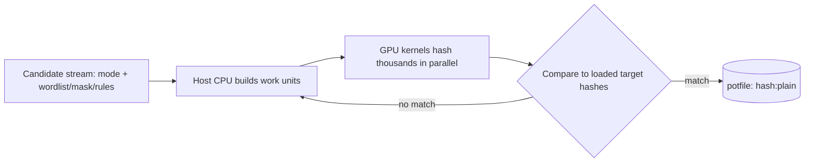
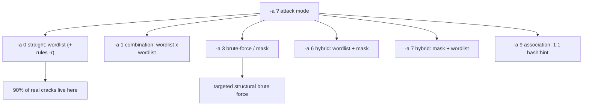
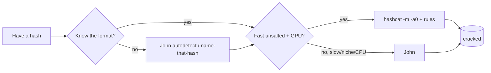
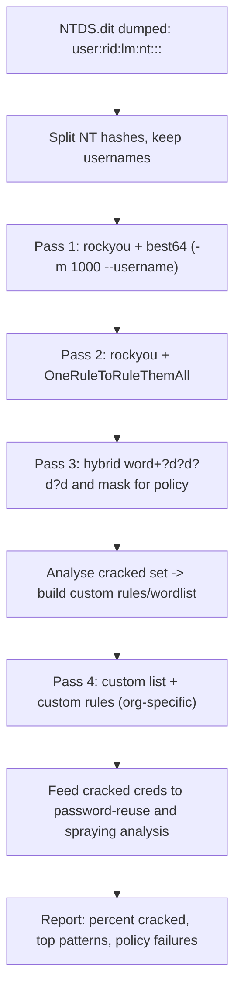

**Level:** Expert · **Track:** Penetration Testing · **Read time:** 235 min

This is Chapter 5 of the Password Attacks notebook. Chapter 4 met John the Ripper — the CPU-first, autodetecting, format-fluent workhorse. This chapter meets its other half: **hashcat**, the GPU-first speed monster that holds essentially every public password-cracking speed record. Where John gets you cracking *anywhere* on *anything* with the least ceremony, hashcat gets you cracking *fastest* — turning a decent gaming GPU into a machine that computes tens of billions of NTLM guesses per second. If John is the machine shop, hashcat is the drag-racer, and the previous chapter's closing point stands: professionals use both, deliberately, for what each is best at.

Chapter 1 established what hashes are and where they live; Chapter 2 built the wordlists and rules; Chapter 4 taught John. Here we go deep on the engine that most real cracking rigs run day to day. By the end you will understand why GPUs crush CPUs at this workload, how to pick the correct `-m` hash mode every time, how to drive all of hashcat's attack modes (dictionary, combination, mask/brute-force, the two hybrids, and association), how to write and tune masks and custom charsets, how to apply rules for massive keyspace multiplication, how to benchmark and tune for your hardware without cooking it, and how to manage multi-day sessions with restore and distribution.

Everything here assumes an **authorised engagement or your own lab**. Cracking hashes you obtained without permission is unlawful under computer-misuse and unauthorised-access legislation almost everywhere. Generate your own hashes (Part 13), crack only those, and keep every command inside that boundary.

---

## Part 1: Why a GPU Destroys a CPU at Hashing

Password cracking is *embarrassingly parallel*: to test a million candidates you run the same hash function a million times on different inputs, and none of those computations depends on any other. That is precisely the workload a GPU is built for. A modern CPU has a handful of very fast, very general cores (8–32, each doing complex out-of-order work); a modern GPU has *thousands* of small, simple arithmetic cores (an RTX-class card has 5,000–16,000 shader cores) that all execute the same instruction on different data at once. Hashing is simple integer/bitwise arithmetic repeated identically across candidates — so the GPU's thousands of cores each grind through candidates in lockstep, and throughput scales with core count.

The numbers are stark. On a single high-end consumer GPU, rough order-of-magnitude speeds:

| Hash | Approx. speed (1 modern GPU) | Why |
|---|---|---|
| NTLM | tens of **billions**/sec | one MD4, unsalted, tiny |
| raw-MD5 | tens of billions/sec | one MD5, unsalted |
| raw-SHA1 | billions/sec | one SHA1 |
| NetNTLMv2 | billions/sec | HMAC-MD5 chain |
| sha512crypt ($6$) | ~hundreds of thousands/sec | thousands of SHA-512 rounds |
| bcrypt (cost 10) | ~tens of thousands/sec | deliberately memory/branch-hard |
| WPA2 (PBKDF2) | ~hundreds of thousands/sec | 4096 PBKDF2 rounds |

Two lessons fall straight out of this table. First, **unsalted fast hashes are already dead** — NTLM at tens of billions/sec means an 8-character password falls in hours and rockyou-tier passwords fall instantly. Second, **the defence is a slow hash**: bcrypt is *a million times slower per guess* than NTLM by design, which is the whole point of Chapter 1's insistence on bcrypt/scrypt/Argon2. hashcat does not change that maths; it just makes the fast-hash side as fast as physics allows.



**hashcat runs on GPUs *and* CPUs** via OpenCL/CUDA/HIP, but its reason to exist is the GPU path. On a CPU-only jump box, prefer John (Chapter 4); when you have a GPU, hashcat wins on any fast hash.

One more piece of intuition before the mechanics: cracking is a race between *your throughput* and *the password's entropy*. A GPU raises your throughput by orders of magnitude, but entropy grows *exponentially* with length — each extra character multiplies the keyspace by the size of its character set. That asymmetry is why the arms race is lopsided in the defender's favour whenever they choose length: no amount of GPU horsepower catches up to a genuinely random 16-character password, while a full GPU obliterates any 8-character one. Everything hashcat does — modes, masks, rules, tuning — is really about *avoiding* blind brute force by exploiting the fact that human-chosen passwords have far less entropy than their length implies. Keep that framing in mind and every attack mode in this chapter will make sense as a different way to bet on human predictability instead of fighting exponential math head-on.

---

## Part 2: Installing hashcat and Verifying the GPU

hashcat ships on Kali and as a portable binary release from hashcat.net; the critical dependency is a working GPU compute stack (NVIDIA CUDA/driver, or AMD ROCm, or an OpenCL runtime).

### Install on Kali / Debian

```bash
sudo apt update
sudo apt install -y hashcat
hashcat --version           # e.g. v6.2.6
```

### Verify hashcat can see your GPU

```bash
hashcat -I            # list OpenCL/CUDA/HIP devices hashcat detected
# CUDA Info:
#   Backend Device ID #1
#     Name...........: NVIDIA GeForce RTX 4070
#     Processor(s)...: 46
#     Global Memory..: 12281 MB
```

If `-I` shows no GPU, hashcat will fall back to the CPU (slow) and warn you. Common fixes: install the vendor driver + compute runtime (`nvidia-driver` + CUDA for NVIDIA; `rocm` for AMD), and on laptops make sure the discrete GPU is active. Inside a VM you usually get *no* GPU passthrough — run hashcat on the bare-metal host, not in a guest, or accept CPU-only speeds for learning.

### Benchmark — always know your rig's numbers

```bash
hashcat -b                       # benchmark every mode
hashcat -b -m 1000               # benchmark just NTLM
hashcat -b -m 22000              # just WPA-PBKDF2-PMKID+EAPOL
```

Realistic benchmark excerpt:

```
Speed.#1.........: 58941.2 MH/s (72.31ms) @ Accel:512 Loops:1 Thr:256 Vec:8   # NTLM ~58.9 GH/s
```

`MH/s` = mega-hashes/sec, `GH/s` = giga-hashes/sec. Knowing these numbers lets you *estimate crack time before you start*: keyspace ÷ speed = seconds. That estimate is the single most useful planning habit in cracking — it tells you whether a mask is a five-minute job or a five-year one.

### Common install problems and fixes

The gap between "hashcat installed" and "hashcat cracking at full speed" is almost always the compute runtime, so budget time for it:

| Symptom | Cause | Fix |
|---|---|---|
| `No devices found/left` | no OpenCL/CUDA runtime | install `nvidia-cuda-toolkit` (NVIDIA) or `rocm-opencl` (AMD); reboot |
| runs but on CPU only | GPU driver missing / VM with no passthrough | install vendor driver on bare metal; don't crack in a VM |
| `clGetPlatformIDs(): CL_PLATFORM_NOT_FOUND_KHR` | OpenCL ICD loader present but no vendor ICD | install `ocl-icd-libopencl1` + the vendor runtime |
| very slow vs benchmark expectations | thermal throttling or `-w 1` | improve cooling, raise `-w`, check `nvidia-smi` clocks |
| `Not enough allocatable device memory` | modes/wordlists exceeding VRAM | lower `-w`, reduce `-n`, or split the job |

On NVIDIA the healthy state is `nvidia-smi` listing your card and `hashcat -I` reporting a CUDA backend with the right VRAM. On AMD it's `rocm-smi` plus an HIP/OpenCL backend in `-I`. If `-I` shows a CPU device only, you are about to run at a fraction of the speed the rest of this chapter assumes — fix the runtime before benchmarking, or the numbers won't make sense.

---

## Part 3: Hash Modes — hashcat Makes You Say `-m`

Unlike John, hashcat does **not** autodetect. Every run needs a numeric **hash mode** telling hashcat exactly which algorithm to compute. Getting `-m` wrong means cracking nothing, so identifying the hash and mapping it to a mode is a core skill.

The essentials you will use constantly:

| `-m` | Hash type | Shape / prefix |
|---|---|---|
| `0` | MD5 | 32 hex |
| `100` | SHA1 | 40 hex |
| `1400` | SHA-256 | 64 hex |
| `1000` | NTLM | 32 hex (Windows) |
| `3000` | LM | 16 hex halves |
| `5600` | NetNTLMv2 | `user::DOMAIN:...` |
| `1800` | sha512crypt `$6$` | `$6$...` |
| `500` | md5crypt `$1$` | `$1$...` |
| `3200` | bcrypt `$2*$` | `$2a$/$2b$/$2y$` |
| `1500` | descrypt | 13 chars |
| `13100` | Kerberos 5 TGS-REP (Kerberoast) | `$krb5tgs$23$...` |
| `18200` | Kerberos 5 AS-REP | `$krb5asrep$23$...` |
| `22000` | WPA-PBKDF2-PMKID+EAPOL | `WPA*01/02*...` |
| `2500` | (legacy) WPA/WPA2 EAPOL | `.hccapx` |
| `1000`+`1731` | MSSQL variants | vendor |
| `22921` | LUKS | `$luks$` |

Two ways to find the right mode:

```bash
# 1. Search the built-in reference (grep the help)
hashcat --help | grep -i ntlm
#   1000 | NTLM                                              | Operating System
#   5500 | NetNTLMv1 / NetNTLMv1+ESS                         | Network Protocol
#   5600 | NetNTLMv2                                         | Network Protocol

# 2. Use an identifier tool (Part 12 covers hashid/name-that-hash properly)
name-that-hash -t '$1$abc$xxxxxxxxxxxxxxxxxxxxx.'
```

**The NTLM vs MD5 trap returns here too:** a bare 32-hex could be `-m 0` (MD5) or `-m 1000` (NTLM). They are different algorithms; pick wrong and every candidate mismatches. If the hashes came from a Windows SAM/NTDS dump, it is `-m 1000`. When unsure, you can try both — hashcat is fast enough that a quick wordlist pass under each mode costs little.

Read the startup banner every run — hashcat echoes the mode name (`Hash.Mode........: 1000 (NTLM)`) so you can catch a wrong `-m` immediately.

---

## Part 4: The Attack Modes (`-a`)

hashcat has six attack modes selected with `-a`. This is the heart of the tool.



### `-a 0` — Straight / dictionary (the workhorse)

Try each word in a wordlist, optionally mutated by rules. This is where most real cracks happen.

```bash
hashcat -m 1000 -a 0 hashes.txt /usr/share/wordlists/rockyou.txt
hashcat -m 1000 -a 0 hashes.txt rockyou.txt -r /usr/share/hashcat/rules/best64.rule
```

### `-a 1` — Combination

Concatenate every word of list A with every word of list B — great for passphrases like `correcthorse`, `SummerBreeze`.

```bash
hashcat -m 1000 -a 1 hashes.txt words-left.txt words-right.txt
```

### `-a 3` — Brute-force / mask

Try every string matching a **mask** — a positional template of character sets. This is targeted brute force (Part 5).

```bash
hashcat -m 1000 -a 3 hashes.txt '?u?l?l?l?l?l?d?d'      # Upper + 5 lower + 2 digits
```

### `-a 6` — Hybrid wordlist + mask

Append a mask to each word: `password` + `?d?d?d?d` → `password2024`. Perfect for "word then digits/symbols".

```bash
hashcat -m 1000 -a 6 hashes.txt rockyou.txt '?d?d?d?d'
hashcat -m 1000 -a 6 hashes.txt rockyou.txt '?d?d?s'
```

### `-a 7` — Hybrid mask + wordlist

Prepend a mask to each word: `2024password`, `!!password`.

```bash
hashcat -m 1000 -a 7 hashes.txt '?d?d?d?d' rockyou.txt
```

### `-a 9` — Association

Pair each hash 1:1 with a hint (a username, a leaked old password, a partial). Powerful when you have per-account context and only want to test that account's likely candidate.

```bash
hashcat -m 1000 -a 9 hashes.txt hints.txt -r rules/best64.rule
```

**Order of operations on a real job:** `-a 0` with a good rule set first (cheapest, highest yield), then `-a 6`/`-a 7` hybrids for word+suffix patterns, then targeted `-a 3` masks for known policies, and pure brute-force masks last. Match effort to hash speed exactly as in Chapter 4.

---

## Part 5: Mask Attacks and Custom Charsets in Depth

A **mask** is a template where each position is a character set. hashcat's built-in placeholders:

| Token | Set | Size |
|---|---|---|
| `?l` | `abcdefghijklmnopqrstuvwxyz` | 26 |
| `?u` | `ABCDEFGHIJKLMNOPQRSTUVWXYZ` | 26 |
| `?d` | `0123456789` | 10 |
| `?h` | `0123456789abcdef` | 16 |
| `?H` | `0123456789ABCDEF` | 16 |
| `?s` | space + punctuation `!"#$%&'()*+,-./:;<=>?@[\]^_`{\|}~` | 33 |
| `?a` | `?l?u?d?s` | 95 |
| `?b` | `0x00`–`0xff` | 256 |

**Keyspace = product of the position sizes.** `?u?l?l?l?l?l?d?d` = 26×26⁵×10×10 = 26 × 11,881,376 × 100 ≈ 30.9 billion. Divide by your NTLM speed (say 30 GH/s) → about one second. The same mask against bcrypt at 20 kH/s → ~18 days. *Always estimate before launching.*

### Custom charsets (`-1`..`-4`)

Define up to four custom sets and reference them as `?1`–`?4`:

```bash
# ?1 = lowercase + digits; brute-force 6 of them
hashcat -m 1000 -a 3 hashes.txt -1 '?l?d' '?1?1?1?1?1?1'

# Policy: Capital, 4 letters, 2 digits, 1 special from a small set
hashcat -m 1000 -a 3 hashes.txt -2 '!@#$' '?u?l?l?l?l?d?d?2'
```

### Increment mode — sweep lengths

```bash
hashcat -m 1000 -a 3 hashes.txt '?a?a?a?a?a?a?a?a' --increment --increment-min 6 --increment-max 8
```

`--increment` runs the mask at growing lengths (here 6→8), so you don't have to launch separate jobs per length. Beware: `?a` at length 8 is 95⁸ ≈ 6.6×10¹⁵ — years even on fast hashes. Keep masks *targeted*.

### `.hcmask` files — batches of masks

Put many masks (and per-line custom charsets) in a file and run them in sequence:

```
# corp.hcmask
?u?l?l?l?l?l?d?d
?u?l?l?l?l?l?l?d?d
!@#,?u?l?l?l?l?d?d?3
```

```bash
hashcat -m 1000 -a 3 hashes.txt corp.hcmask
```

**Red team usage:** masks encode a target's password *policy* (min length, complexity) so you brute-force only the compliant keyspace — e.g. a "1 upper, 1 digit, 1 special, ≥8" policy narrows the space enormously versus blind brute force. **Blue team usage:** running your own policy's mask against your NTDS dump shows exactly how fast a policy-compliant password falls — often uncomfortably fast, which is the argument for length over complexity.

---

## Part 6: Rules — Multiplying the Dictionary on the GPU

Rules in hashcat are functionally like John's (Chapter 4) but shipped as `.rule` files and applied on the GPU at full speed. Each rule mutates every dictionary word; a rule file with 64 rules turns a 14M wordlist into ~900M candidates with no extra storage.

### The built-in rule files (in `/usr/share/hashcat/rules/`)

| Rule file | Character |
|---|---|
| `best64.rule` | 64 high-value mutations — the default starting point |
| `rockyou-30000.rule` | 30k rules derived from rockyou patterns |
| `d3ad0ne.rule`, `T0XlC.rule` | large aggressive community sets |
| `dive.rule` | very large, very thorough (slow) |
| `OneRuleToRuleThemAll.rule` | popular ~52k curated union |
| `leetspeak.rule`, `toggles*.rule` | targeted transforms |

```bash
hashcat -m 1000 -a 0 hashes.txt rockyou.txt -r /usr/share/hashcat/rules/best64.rule
hashcat -m 1000 -a 0 hashes.txt rockyou.txt -r rules/OneRuleToRuleThemAll.rule
# Stack multiple rule files (rules multiply!)
hashcat -m 1000 -a 0 hashes.txt rockyou.txt -r rules/best64.rule -r rules/toggles1.rule
```

### The rule language (shares John's core operators)

| Rule | Effect | `pass` → |
|---|---|---|
| `:` | nothing | `pass` |
| `l` `u` `c` | lower / upper / capitalise | `pass`/`PASS`/`Pass` |
| `t` `TN` | toggle all / toggle at pos N | — |
| `r` | reverse | `ssap` |
| `d` `f` | duplicate / reflect | `passpass` / `passssap` |
| `$X` `^X` | append / prepend X | `pass1` / `1pass` |
| `sXY` | substitute X→Y | `s@a` etc. |
| `iNX` `oNX` | insert / overwrite at pos N | — |

### Preview rule output with `--stdout` (essential)

```bash
echo 'password' | hashcat -r rules/best64.rule --stdout | head
# Password
# password1
# passw0rd
# ...
```

`--stdout` makes hashcat print candidates instead of cracking — verify a rule does what you expect before spending GPU hours. **Generate custom rules** from cracked passwords with the bundled tools/`--generate-rules`:

```bash
hashcat --stdout wordlist.txt -g 1000   # auto-generate 1000 random rules (experiment)
```

---

## Part 7: Your First Full Crack — NTLM End to End

Concrete, reproducible, lab-only.

### Generate NTLM targets

```bash
python3 - <<'PY' > nt.hashes
import hashlib
for p in ["Welcome1","Summer2024!","P@ssw0rd","Autumn2023","hunter2"]:
    print(hashlib.new('md4', p.encode('utf-16le')).hexdigest())
PY
```

### Crack in escalating passes

```bash
# Pass 1: plain rockyou
hashcat -m 1000 -a 0 nt.hashes rockyou.txt

# Pass 2: rockyou + best64 rules (catches Welcome1, Autumn2023, etc.)
hashcat -m 1000 -a 0 nt.hashes rockyou.txt -r /usr/share/hashcat/rules/best64.rule

# Pass 3: hybrid for word+digits
hashcat -m 1000 -a 6 nt.hashes rockyou.txt '?d?d?d?d'
```

### Realistic status screen

```
Session..........: hashcat
Status...........: Running
Hash.Mode........: 1000 (NTLM)
Hash.Target......: nt.hashes
Time.Started.....: ... (2 secs)
Time.Estimated...: ... (0 secs)
Guess.Base.......: File (rockyou.txt)
Guess.Mod........: Rules (best64.rule)
Speed.#1.........: 21534.7 MH/s (5.42ms) @ Accel:1024 Loops:64 Thr:256 Vec:8
Recovered........: 4/5 (80.00%) Digests
Progress.........: 918720512/918720512 (100.00%)
Rejected.........: 0/918720512 (0.00%)
Candidates.#1....: Welcome1 -> P@ssw0rd
```

**Read the status screen — the fields that matter:**

- `Recovered` — how many of the loaded hashes are cracked. `4/5` means one remains.
- `Speed.#1` — throughput on device #1 (`MH/s`).
- `Progress` — candidates tried / total; at 100% the keyspace is exhausted.
- `Rejected` — candidates hashcat skipped (e.g. too long for the hash, or filtered).
- `Candidates` — a live window of what it's currently trying — useful sanity check that your mask/rules are sane.
- Press **`s`** for status, **`p`** to pause, **`r`** to resume, **`q`** to quit-and-save, **`b`** to bypass current attack. These interactive keys are the daily UX of hashcat.

### Retrieve results from the potfile

```bash
hashcat -m 1000 nt.hashes --show          # print cracked hash:plain from potfile
hashcat -m 1000 nt.hashes --left          # print the UNcracked ones
cat ~/.local/share/hashcat/hashcat.potfile
```

Like John's pot, hashcat's **potfile** stores every crack and short-circuits already-solved hashes — same friend-and-foot-gun behaviour. Use `--potfile-path job.pot` per engagement to keep client data separate, or `--potfile-disable` for a clean run.

---

## Part 8: Cracking Real-World Formats (NetNTLMv2, Kerberos, WPA, bcrypt)

### NetNTLMv2 (Responder loot) — `-m 5600`

```bash
hashcat -m 5600 -a 0 net-ntlmv2.txt rockyou.txt -r rules/best64.rule
```

### Kerberoast / AS-REP roast — `-m 13100` / `-m 18200`

The Impacket tools produce the `$krb5tgs$23$...` / `$krb5asrep$23$...` lines:

```bash
hashcat -m 13100 -a 0 kerberoast.txt rockyou.txt -r rules/OneRuleToRuleThemAll.rule
hashcat -m 18200 -a 0 asrep.txt      rockyou.txt -r rules/best64.rule
```

These two attacks are the reason a GPU rig sits in most AD-focused teams — a Kerberoastable service account with a weak password falls in minutes and yields domain lateral movement.

### WPA2 from a capture — `-m 22000`

Convert a `.pcap`/`.pcapng` handshake or PMKID to the 22000 format with `hcxpcapngtool`, then:

```bash
hcxpcapngtool -o wpa.22000 capture.pcapng
hashcat -m 22000 -a 3 wpa.22000 '?d?d?d?d?d?d?d?d'      # 8-digit PSK (common ISP default)
hashcat -m 22000 -a 0 wpa.22000 rockyou.txt
```

WPA2 uses 4096 PBKDF2 rounds, so it is *slow* — targeted masks (ISP default patterns) and curated wordlists beat brute force.

### bcrypt — `-m 3200` (respect the cost)

```bash
hashcat -m 3200 -a 0 bcrypt.txt rockyou.txt         # NO big rule sets — it's ~10k H/s
```

bcrypt at tens of thousands per second means a 14M-word rockyou pass takes many minutes and rules can push it to days. **Small, high-quality, target-specific wordlists only** on slow hashes — the Chapter 4 principle, enforced by hashcat's honest speed numbers.

### Format → mode quick map

| Hash | John `--format` | hashcat `-m` |
|---|---|---|
| NTLM | `nt` | 1000 |
| NetNTLMv2 | `netntlmv2` | 5600 |
| sha512crypt | `sha512crypt` | 1800 |
| bcrypt | `bcrypt` | 3200 |
| Kerberoast TGS | `krb5tgs` | 13100 |
| AS-REP | `krb5asrep` | 18200 |
| WPA2 | (wpapsk) | 22000 |
| MD5 | `raw-md5` | 0 |

---

## Part 9: Performance Tuning, Workload & Thermals

Speed is why you use hashcat, so tuning matters — but so does not destroying your GPU.

### Workload profile `-w`

```bash
hashcat -m 1000 -w 3 -a 0 hashes.txt rockyou.txt -r rules/best64.rule
```

`-w` sets how aggressively hashcat uses the GPU: `-w 1` (low, keeps the desktop responsive), `-w 2` (default), `-w 3` (high — dedicated cracking box), `-w 4` (nightmare — maximum, unresponsive UI). On a headless rig use `-w 3`/`-w 4`; on your daily driver use `-w 1`/`-w 2` so the machine stays usable.

### Temperature safety

```bash
hashcat -m 1000 -w 3 --hwmon-temp-abort=90 -a 0 hashes.txt rockyou.txt
```

`--hwmon-temp-abort=N` halts if the GPU hits N°C (default 90). **Do not disable it.** Sustained cracking pins a GPU at 100% for hours; without airflow, cards throttle or degrade. Watch temps with `nvidia-smi -l 1` (NVIDIA) or `rocm-smi`. If you see thermal throttling in the status screen's temp readout, improve cooling before pushing `-w` higher.

### Kernel tuning (advanced)

`-n` (kernel accel) and `-u` (kernel loops) manually override the autotune; `-O` enables optimised kernels (faster but caps password length, e.g. ≤31 for many modes — cracked results beyond the cap are missed). `--force` overrides warnings (avoid on real work — warnings usually mean a driver problem that yields wrong results).

```bash
hashcat -m 1000 -O -w 3 -a 3 hashes.txt '?a?a?a?a?a?a?a'   # optimised kernel, length-limited
```

### Estimate before you commit

```bash
hashcat -m 1000 -a 3 hashes.txt '?a?a?a?a?a?a?a?a' --keyspace     # prints total candidates
```

Divide `--keyspace` by your benchmark speed to get the runtime. If it's years, narrow the mask or switch to a dictionary+rules attack.

---

## Part 10: Sessions, Restore, and Distributed Cracking

### Named sessions + restore

```bash
hashcat -m 1000 --session=corp -a 0 hashes.txt rockyou.txt -r rules/OneRuleToRuleThemAll.rule
# quit with 'q' (saves) or crash/reboot; then:
hashcat --session=corp --restore
```

`--session=NAME` isolates the restore file; `--restore` resumes exactly where it stopped. hashcat checkpoints automatically, so even a power loss loses only seconds of progress.

### Split a job across machines with `--skip` / `--limit`

```bash
hashcat -m 1000 -a 3 hashes.txt '?a?a?a?a?a?a?a' --keyspace     # say 7737809375
# Machine A does the first half, B the second:
hashcat -m 1000 -a 3 hashes.txt '?a?a?a?a?a?a?a' --skip 0          --limit 3868904687
hashcat -m 1000 -a 3 hashes.txt '?a?a?a?a?a?a?a' --skip 3868904687 --limit 3868904688
```

`--skip`/`--limit` carve the keyspace into ranges, which is how home-grown distributed cracking (and cloud GPU fleets) split work without a central controller. For managed distribution, teams run **Hashtopolis**, a server that hands `--skip/--limit` chunks to many agents — but the primitive is these two flags.

### Useful run controls

| Flag | Effect |
|---|---|
| `--session=NAME` / `--restore` | name & resume a run |
| `-w 1..4` | workload profile |
| `--status --status-timer=10` | auto-print status every 10s |
| `--potfile-path FILE` | per-engagement potfile |
| `--potfile-disable` | ignore/skip the potfile |
| `--outfile cracked.txt --outfile-format 2` | write results to a file (format 2 = plain only) |
| `--remove` | strip cracked hashes from the input file as they fall |
| `--username` | input has `user:hash`; strip usernames for matching |
| `--skip/--limit` | keyspace range (distribution) |
| `-O` / `--force` | optimised kernel / override warnings |

`--username` matters constantly: NTDS/`secretsdump` output is `user:rid:lm:nt:::`, so `--username` tells hashcat to ignore the leading fields and match on the hash.

---

## Part 11: hashcat vs John — Choosing the Right Engine

Both engines were covered end to end; here's the decision, distilled.

| Situation | Reach for |
|---|---|
| Fast unsalted hash (NTLM, MD5, SHA1) + a GPU | **hashcat** (`-m`, `-a 0` + big rules) |
| Need to *extract* a hash from a ZIP/SSH key/KeePass/PDF | **John** (`*2john`) — then crack in either |
| CPU-only jump box, no GPU | **John** (autodetect, `--fork`) |
| Don't know the format | **John** (autodetects) or `name-that-hash` then hashcat |
| Huge rule-based dictionary run on fast hash | **hashcat** (GPU rules are far faster) |
| Niche/new format not yet in hashcat | **John** (bleeding-jumbo often has it first) |
| WPA/EAPOL, cloud/token formats | **hashcat** (mature `-m 22000` etc.) |



The canonical pro workflow: **John's `*2john` to extract and identify**, then **hashcat on the GPU** for anything fast, **John on the CPU** for the rest. They read different potfiles but the hash lines and results interchange cleanly.

---

## Part 12: Hash Identification — Picking `-m` Correctly

Because hashcat won't autodetect, you must identify the hash first. Tools and tells:

```bash
# name-that-hash: modern, gives hashcat -m and John --format directly
name-that-hash -t '$6$rounds=5000$abcd$H7...'
# hashid: prints likely modes
hashid -m '$2b$12$abcdefghijklmnopqrstuv'      # -m appends hashcat mode numbers
```

Identification by shape (memorise the common ones — Chapter 1 built this skill):

| Tell | Likely hash | `-m` |
|---|---|---|
| `$2a$/$2b$/$2y$12$...` | bcrypt (cost 12) | 3200 |
| `$6$...` | sha512crypt | 1800 |
| `$1$...` | md5crypt | 500 |
| `$5$...` | sha256crypt | 7400 |
| `$krb5tgs$23$...` | Kerberoast RC4 | 13100 |
| `$krb5asrep$23$...` | AS-REP RC4 | 18200 |
| `aad3b435...:31d6cfe0...` | LM:NT pair | 3000 / 1000 |
| `WPA*01*...` / `WPA*02*...` | PMKID / EAPOL | 22000 |
| 32 hex (from Windows) | NTLM | 1000 |
| 32 hex (from web app DB) | MD5 (maybe) | 0 |

The last two rows are the classic ambiguity: **context decides**. A 32-hex from a domain controller is NTLM; a 32-hex from a PHP app's `users` table is probably MD5. When you can't tell, benchmark both with a quick rockyou pass — hashcat is fast enough that trying is cheaper than agonising.

---

## Part 13: Hands-On Lab — Benchmark, Crack, Estimate, Detect

Reproducible, lab-only. Adjust wordlist paths to your box.

### Step 1 — Know your rig

```bash
hashcat -I                       # confirm GPU visible
hashcat -b -m 1000               # your NTLM speed (write it down)
```

### Step 2 — Build a mixed target set

```bash
mkdir -p ~/hc-lab && cd ~/hc-lab
python3 - <<'PY' > nt.hashes
import hashlib
for p in ["Welcome1","Spring2024!","P@ssw0rd1","Liverpool99","zxcvbnm"]:
    print(hashlib.new('md4', p.encode('utf-16le')).hexdigest())
PY
# a slow one for contrast
python3 - <<'PY' > bc.hashes
import bcrypt
print(bcrypt.hashpw(b"Summer2024!", bcrypt.gensalt(rounds=10)).decode())
PY
```

### Step 3 — Escalating attacks on the fast set

```bash
hashcat -m 1000 -a 0 nt.hashes rockyou.txt
hashcat -m 1000 -a 0 nt.hashes rockyou.txt -r /usr/share/hashcat/rules/best64.rule
hashcat -m 1000 -a 6 nt.hashes rockyou.txt '?d?d'
hashcat -m 1000 nt.hashes --show
```

### Step 4 — Feel the slow-hash wall

```bash
time hashcat -m 3200 -a 0 bc.hashes rockyou.txt      # note how much slower per candidate
hashcat -m 3200 bc.hashes --show
```

You will *see* the asymmetry: the NTLM set falls in seconds; the single bcrypt hash grinds because each guess costs a million times more. That is the entire defensive argument in one experiment.

### Step 5 — Estimate a mask before running

```bash
hashcat -m 1000 -a 3 nt.hashes '?u?l?l?l?l?l?d?d' --keyspace
# e.g. 30891577600  ->  / (30e9 H/s) ~ 1 second on NTLM;  / (20e3 H/s) ~ 18 days on bcrypt
```

### Step 6 — Detect it (blue-team half)

hashcat cracking is invisible on the *target*; detection is about the theft and the artefacts on the attacker/host:

```bash
ls -la ~/.local/share/hashcat/           # hashcat.potfile, sessions, logs = cracking happened here
cat ~/.local/share/hashcat/hashcat.potfile
nvidia-smi                               # a box pinned at 100% GPU for hours is a tell on shared infra
```

---

## Part 14: Building the Lab Safely

- **Run on bare metal for real GPU speed.** VMs usually have no GPU passthrough → CPU-only, slow. Learn syntax anywhere; benchmark on the host.
- **Generate your own hashes** (Python `hashlib`/`bcrypt`, `openssl passwd`, Impacket against your *own* lab DC). Cracking your own generated hashes is always legal.
- **Per-engagement potfiles** (`--potfile-path`) keep client plaintexts isolated; `--potfile-disable` for clean benchmark runs.
- **Thermals:** keep `--hwmon-temp-abort` on, watch `nvidia-smi`, ensure airflow before long `-w 3/4` runs.
- **Wordlists:** `gunzip` rockyou, install `seclists`, and keep a curated "cracked passwords" list that grows over time — it becomes your best custom dictionary.
- **Cleanup:** on shared boxes, potfiles/sessions/logs under `~/.local/share/hashcat/` reveal your activity — manage them deliberately.

### A pre-flight checklist for every run

Run through this before launching a long job — it prevents the most common wasted-compute mistakes:

- Confirmed the GPU is visible (`hashcat -I` shows a CUDA/HIP backend, not just CPU).
- Recorded the benchmark speed for this exact `-m` mode (`hashcat -b -m <mode>`).
- Identified the hash correctly and set the right `-m` (double-checked the banner's `Hash.Mode` line).
- Estimated the run with `--keyspace ÷ benchmark` and confirmed it finishes inside the window.
- Chose the attack that matches the hash speed (rules on fast hashes, tiny targeted lists on slow ones).
- Set `--session=NAME` so a crash or reboot doesn't lose progress.
- Set a per-engagement `--potfile-path` so client plaintexts stay isolated.
- Set `--hwmon-temp-abort` and confirmed cooling for a sustained-100% run.
- Used `--username` if the input is `user:hash` (NTDS/secretsdump format).
- Decided where results go (`--outfile` / `--show` later) before starting.

---

## Part 15: Detection & Defense Angle

The cracking itself leaves no trace on the victim, so defence targets the *inputs* and *precursors*, mirroring Chapter 4:

- **Make stored hashes slow and salted.** bcrypt (cost 12+), scrypt, or Argon2id. hashcat's honest benchmark numbers are the proof: NTLM at 30 GH/s vs bcrypt at 20 kH/s is a *six-order-of-magnitude* defensive gap. Never store passwords as MD5/SHA1/NTLM if you can avoid it.
- **Length beats complexity.** A 16-char passphrase defeats even a full-speed GPU mask attack because the keyspace explodes past feasibility; a complex 8-char password does not. Enforce length; screen against breach corpora (block what rockyou+rules cracks).
- **Protect the hash sources.** LSASS/SAM/NTDS theft, Kerberoasting (Event 4769, RC4 `0x17`), AS-REP roasting (Event 4768, pre-auth disabled), Responder/LLMNR poisoning — these are the *detectable* events that feed hashcat. Monitor and alert on them; disable LLMNR/NBT-NS; use gMSA (25+ char) for service accounts so `-m 13100` is hopeless.
- **WPA:** long random PSKs (or WPA3-SAE) defeat `-m 22000`; ISP-default 8-digit/patterned PSKs fall to a mask in minutes.
- **Assume eventual crack.** Plan detection/response around anomalous credential *use*, not the (invisible) cracking. Finding a `hashcat.potfile` on a host during IR reveals exactly which accounts an attacker recovered.

---

## Part 16: Advanced Candidate Generation — Combinator, PRINCE & Toggle Attacks

Beyond the six core `-a` modes, hashcat and its companion tools offer richer candidate generators for when plain dictionary+rules stalls out. These matter most against *passphrases* and *creative human passwords* that a single wordlist never contains verbatim.

### Combinator with rules — `-a 1` plus mutation

`-a 1` concatenates two lists, but you can mutate each side independently using rule-position flags `-j` (rule applied to the *left* word) and `-k` (rule applied to the *right* word):

```bash
# Capitalise the left word, append '!' to the right: Summer + breeze -> Summerbreeze!
hashcat -m 1000 -a 1 hashes.txt seasons.txt nouns.txt -j c -k '$!'
```

`-j`/`-k` take a single rule each — enough to fix case and add a separator/suffix, which is exactly how real two-word passphrases are shaped (`Winter-Sun2024` needs a separator, added via `-k`). For three-word passphrases, chain `combinator3` from **hashcat-utils**:

```bash
combinator3.bin listA listB listC | hashcat -m 1000 -a 0 hashes.txt
```

### PRINCE — probabilistic word chaining

**PRINCE** (PRobability INfinite Chained Elements, shipped as `princeprocessor`/`pp64.bin`) builds candidates by chaining words from a single list into longer strings ordered by likelihood — so `pass`, `word`, `123` become `password`, `pass123`, `word123`, `passwordword`, and so on, without you enumerating the combinations. It bridges the gap between dictionary and brute force for compound passwords:

```bash
pp64.bin --pw-min=8 --pw-max=16 rockyou.txt | hashcat -m 1000 -a 0 hashes.txt -r rules/best64.rule
```

`--pw-min`/`--pw-max` bound the produced length so PRINCE doesn't waste time on strings shorter or longer than plausible. Piping PRINCE into hashcat's stdin (`-a 0` reading from the pipe) is the standard pattern; add rules on top for even more coverage. PRINCE routinely cracks `iloveyou2` and `letmein123`-style compounds that neither a bare wordlist nor a mask finds efficiently.

### Toggle-case attacks

For a known base word whose *capitalisation* you don't know (`pAssWorD`?), the `toggles*.rule` files flip case at every position combination:

```bash
hashcat -m 1000 -a 0 hashes.txt base-words.txt -r /usr/share/hashcat/rules/toggles5.rule
```

`toggles1`–`toggles5` toggle 1–5 positions respectively; higher numbers cover more but multiply the keyspace. This is the efficient way to defeat "leet-and-random-caps" mangling once you have the base term (e.g. from CeWL against the target's site — Chapter 2).

### Markov tuning for masks

hashcat orders brute-force candidates using a **Markov model** (statistically likely characters first) built into `hashcat.hcstat2`. You can disable it for pure order (`--markov-disable`) or tune its threshold (`--markov-threshold=N`) to prune unlikely branches and finish sooner at a small coverage cost. For a length-8 `?a` mask, a Markov threshold can turn an infeasible run into one that finds *most* real passwords in a fraction of the time — a pragmatic trade when full coverage is impossible anyway.

```bash
hashcat -m 1000 -a 3 hashes.txt '?a?a?a?a?a?a?a?a' --markov-threshold=32
```

**Red team usage:** PRINCE + a target-derived CeWL list is the highest-yield way to crack the "three real words jammed together" passphrases that security-aware staff now favour. **Blue team usage:** run PRINCE against your own dump to discover which "passphrase" users picked something guessable like `companynamerocks`.

---

## Part 17: A Real Engagement Workflow — From Dump to Domain

Tying it all together, here is how the modes, rules, and tuning combine on an actual internal pentest once you've obtained an NTDS.dit dump (via `secretsdump.py`, under authorisation). This is the workflow that turns raw hashes into a domain-compromise narrative for the report.



### Step-by-step

```bash
# 1. secretsdump output -> keep hashes with usernames
hashcat -m 1000 --username ntds.txt rockyou.txt -r rules/best64.rule --potfile-path job.pot

# 2. Escalate rules
hashcat -m 1000 --username ntds.txt rockyou.txt -r rules/OneRuleToRuleThemAll.rule --potfile-path job.pot

# 3. Policy-shaped mask (org enforces Upper+lower+2digits, >=8)
hashcat -m 1000 --username -a 3 ntds.txt '?u?l?l?l?l?l?d?d' --potfile-path job.pot

# 4. What cracked so far?
hashcat -m 1000 --username ntds.txt --show --potfile-path job.pot > cracked.txt
wc -l cracked.txt ntds.txt          # cracked / total = your crack rate
```

### Turn cracked passwords into better attacks

The cracked set is *intelligence*. Feed the plaintexts back to generate an org-specific wordlist and rules:

```bash
cut -d: -f2 cracked.txt | sort -u > found.txt         # plaintexts only
# Build rules from patterns you observe (season+year, CompanyName+!, etc.)
hashcat -m 1000 --username ntds.txt found.txt -r rules/dive.rule --potfile-path job.pot
```

This feedback loop — crack, analyse patterns, tailor the next pass — is what separates a 20%-crack-rate junior run from a 60–70%-crack-rate senior one on the same dump. The **reporting** deliverable then writes itself: overall crack percentage, the top 10 password patterns, the count of passwords that fell to trivial rules, and the specific policy weaknesses (short minimum length, predictable complexity) that let it happen. That analysis is more valuable to the client than the individual passwords, because it drives the policy fix.

**Reuse and spraying handoff:** the cracked plaintexts also feed the next chapter's techniques — password reuse across accounts and spraying a single strong candidate at every user — so a great hashcat run is the fuel for credential-stuffing and spraying analysis, not the end of the story.

### Budgeting a run — a realistic time table

The single most common planning mistake is launching an attack that cannot finish in the engagement window. Use your benchmark and this rough table (single modern consumer GPU, NTLM) to pick attacks that *complete*:

| Attack | Keyspace (approx.) | Time on NTLM (~30 GH/s) | Time on bcrypt (~20 kH/s) |
|---|---|---|---|
| rockyou (14M) plain | 1.4×10⁷ | instant | ~12 min |
| rockyou × best64 (64 rules) | 9×10⁸ | instant | ~12 hours |
| rockyou × OneRule (~52k rules) | 7×10¹¹ | ~24 s | infeasible |
| mask `?u?l?l?l?l?l?d?d` | 3×10¹⁰ | ~1 s | ~18 days |
| mask `?a?a?a?a?a?a?a` (len 7) | 7×10¹³ | ~40 min | millennia |
| mask `?a?a?a?a?a?a?a?a` (len 8) | 6.6×10¹⁵ | ~2.5 days | never |

Two takeaways cement the whole chapter. First, on a *fast* hash the limiting factor is almost never speed — it's whether your wordlist and rules *contain* the password's pattern, which is why dictionary+rules beats blind brute force. Second, on a *slow* hash even a modest rule set becomes infeasible, so you must be surgical: a small, target-derived wordlist and a policy-shaped mask are the only things that finish. Estimating with `--keyspace ÷ benchmark` before every launch is the habit that keeps you from wasting an engagement's compute budget on a run that was never going to complete.

### GPU rigs and cloud cracking

When one card isn't enough, teams scale two ways. Multi-GPU rigs let hashcat address every card at once (`-d 1,2,3,4` selects devices; throughput adds up nearly linearly), and cloud GPU instances (rented by the hour) give burst capacity for a big NTDS dump without owning hardware. Both are driven by the same `--skip`/`--limit` keyspace-splitting from Part 10, orchestrated at scale by **Hashtopolis**. The economics are worth internalising for reporting: if a client's password policy falls to a few dollars of rented cloud GPU time, that is a far more persuasive finding than an abstract "passwords were weak."

---

## Part 18: Final Revision / Summary

- **GPUs crush CPUs** at hashing because it's embarrassingly parallel; hashcat is the GPU-first engine and holds the speed records.
- **You must specify `-m`** (hashcat doesn't autodetect). Identify with `name-that-hash`/`hashid` or by shape; context breaks the NTLM-vs-MD5 tie.
- **Six attack modes:** `-a 0` straight (workhorse, + `-r` rules), `-a 1` combination, `-a 3` mask/brute-force, `-a 6`/`-a 7` hybrids, `-a 9` association. Cheap+targeted before exhaustive.
- **Masks** are positional charset templates; keyspace = product of position sizes; custom charsets `-1..-4`, `--increment`, and `.hcmask` files make them precise. Always `--keyspace` ÷ speed to estimate first.
- **Rules** multiply the dictionary at GPU speed; `best64.rule` and `OneRuleToRuleThemAll.rule` are the go-to sets; preview with `--stdout`.
- **Tune with `-w`**, keep `--hwmon-temp-abort` on, use `-O` (length-capped) for pure brute force, and never `--force` on real work.
- **Manage runs** with `--session`/`--restore`, per-engagement potfiles, and `--skip/--limit` for distribution (Hashtopolis at scale).
- **hashcat + John are teammates:** extract/identify with John, blast fast hashes on the GPU with hashcat, finish niche/slow/CPU work in John.
- **Defence:** slow+salted hashes and *length* are the only real controls; detect the precursors (roasting, LSASS/SAM/NTDS theft, Responder), not the cracking.

---

## Part 19: Cheat Sheet / Quick Reference

### Setup & sanity

```bash
hashcat -I                       # list devices (confirm GPU)
hashcat -b -m 1000               # benchmark NTLM
hashcat --help | grep -i <type>  # find a hash mode
```

### Attack modes

```bash
hashcat -m 1000 -a 0 h.txt rockyou.txt -r rules/best64.rule   # dictionary + rules
hashcat -m 1000 -a 1 h.txt left.txt right.txt                 # combination
hashcat -m 1000 -a 3 h.txt '?u?l?l?l?l?l?d?d'                 # mask / brute force
hashcat -m 1000 -a 6 h.txt rockyou.txt '?d?d?d?d'             # hybrid word+mask
hashcat -m 1000 -a 7 h.txt '?d?d?d?d' rockyou.txt             # hybrid mask+word
hashcat -m 1000 -a 9 h.txt hints.txt -r rules/best64.rule     # association
```

### Masks

```
?l a-z  ?u A-Z  ?d 0-9  ?s specials  ?a all(95)  ?h/?H hex  ?b byte
-1 '?l?d' '?1?1?1?1'          custom charset
--increment --increment-min 6 --increment-max 8
hashcat -m 1000 -a 3 h.txt masks.hcmask
hashcat -m 1000 -a 3 h.txt '?a?a?a?a?a' --keyspace   # size the job
```

### Results & sessions

```bash
hashcat -m 1000 h.txt --show          # cracked hash:plain
hashcat -m 1000 h.txt --left          # uncracked
hashcat -m 1000 h.txt --username      # strip user: from user:hash input
hashcat --session=job --restore       # resume
hashcat -m 1000 -a 0 h.txt rockyou.txt --outfile cracked.txt --outfile-format 2
```

### Tuning

```bash
-w 3                       # workload (1 low .. 4 max)
--hwmon-temp-abort=90      # thermal safety (keep on)
-O                         # optimised kernel (length-capped)
--skip N --limit M         # distribute keyspace
```

### Rule files (`/usr/share/hashcat/rules/`)

```
best64.rule  rockyou-30000.rule  OneRuleToRuleThemAll.rule  d3ad0ne.rule  dive.rule
echo pw | hashcat -r rules/best64.rule --stdout    # preview
```

### Modes you'll use most

```
0 MD5  100 SHA1  1400 SHA256  1000 NTLM  3000 LM  5600 NetNTLMv2
1800 sha512crypt  500 md5crypt  3200 bcrypt  13100 Kerberoast  18200 AS-REP  22000 WPA
```

---

## Part 20: Practice Labs & Resources

Topic-specific practice that trains hashcat:

- **HackTheBox Academy — "Cracking Passwords with Hashcat"**: the definitive guided module for `-a 0/1/3/6`, masks, and rules against many modes.
- **TryHackMe — "Crack the Hash" and "Password Attacks"**: identify the mode and crack MD5/NTLM/sha512crypt/bcrypt/Kerberos with hashcat; pairs directly with Parts 3–8.
- **TryHackMe "Attacktive Directory" / HTB "Forest", "Active", "Sauna"**: capture AS-REP/Kerberoast hashes with Impacket, crack with `-m 18200/-m 13100` — the full AD chain.
- **WPA practice**: hashcat's own example `.hccapx`/`22000` test files and the Wireless notebook's capture labs — crack with `-m 22000` masks.
- **hashcat wiki example hashes page**: one sample hash for *every* `-m` mode — the fastest way to practice identification and mode selection.
- **Your own generated corpora** (Parts 7 & 13): the best way to internalise how format speed dictates which attack is viable, and to build a growing custom "found passwords" dictionary.

Run every one of these only against hashes you are authorised to attack, benchmark first, estimate keyspace before launching, and keep a per-lab potfile.

---

*Also on [Praneeth's portfolio](https://ping-praneeth.vercel.app/notebook/pentest-password-attacks/05-hashcat-gpu-cracking-attack-modes-and-masks), with comments and the latest edits.*
