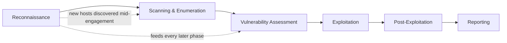
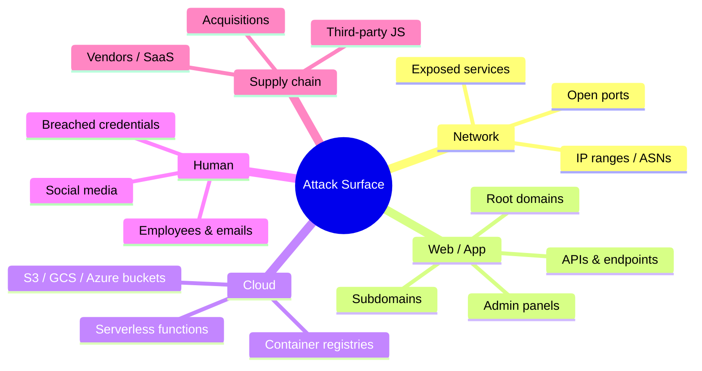
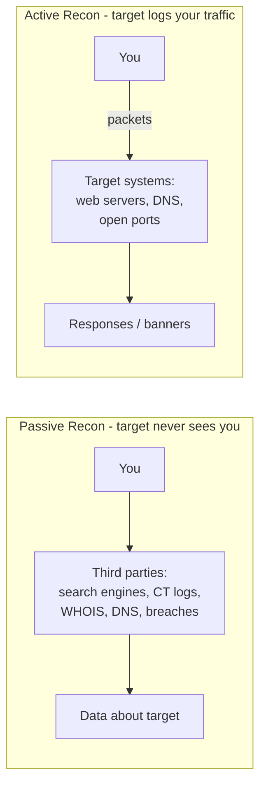
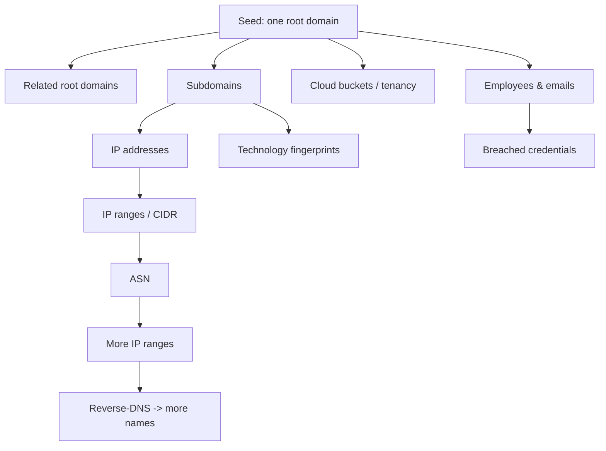
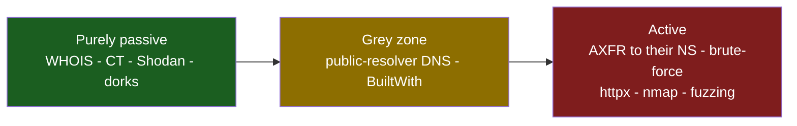
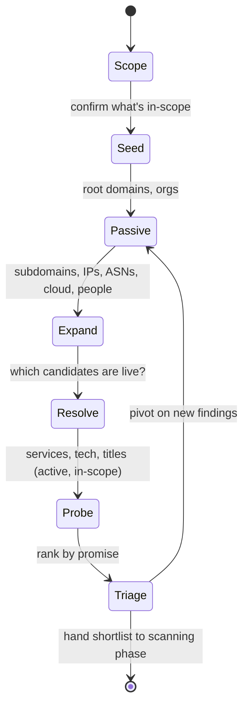
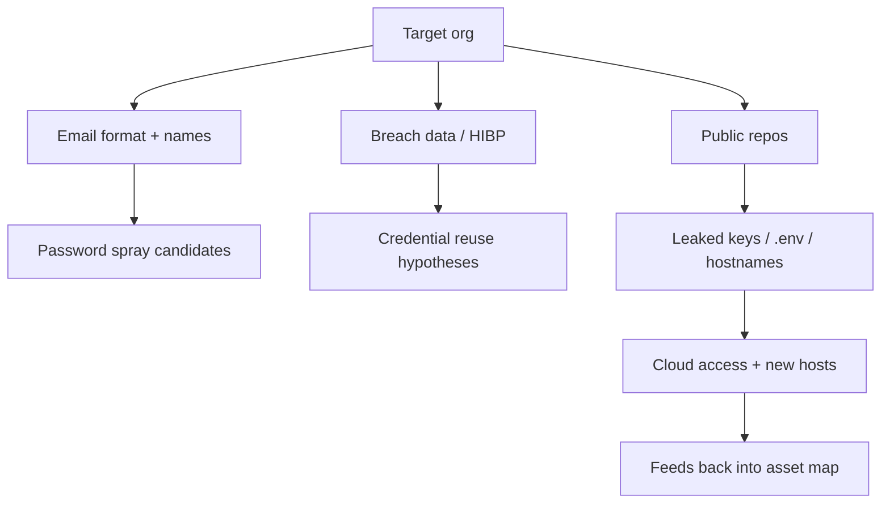
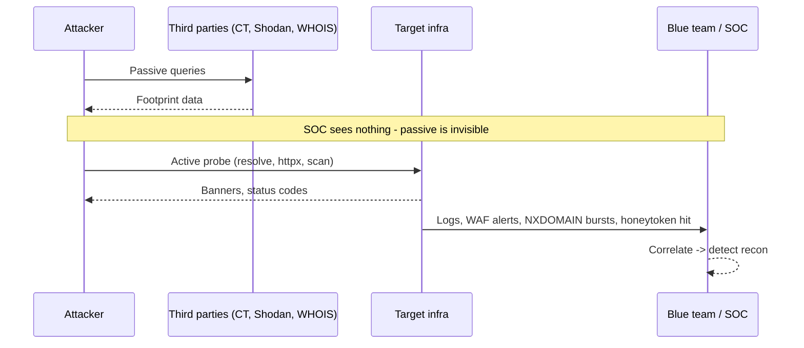

**Level:** Beginner · **Track:** Penetration Testing · **Read time:** 170 min

This is Chapter 1 of the Recon & OSINT series — the opening notebook of a track dedicated to a single question: *before you touch a target, how much can you learn about it, and how do you turn that knowledge into a plan?* The Penetration Testing methodology notebook set up the engagement lifecycle, scoping, and the lab you practise in. This chapter picks up at the first real technical phase of every assessment and every bug-bounty hunt: reconnaissance.

Almost everyone who is new to offensive security wants to jump straight to exploitation — pop a shell, get the flag, submit the report. Recon feels like the boring preamble. It is not. On real engagements and real bug-bounty programs, the finding you get paid for is almost always downstream of *recon that other people didn't do*: the forgotten staging subdomain, the acquired company's legacy IP range still in scope, the S3 bucket named after an internal project, the dev API host that never got the WAF the production host has. Exploitation is a commodity skill; thorough reconnaissance is the differentiator. This chapter is long because the topic deserves it, and because the Recon & OSINT track opens with it for exactly that reason.

We build from the absolute basics — what "attack surface" and "footprint" actually mean — up through a full passive-recon toolchain, the passive/active boundary that is also a legal boundary, a disciplined methodology you can repeat on any target, a worked hands-on lab, and finally the defender's view: how blue teams discover and shrink the very surface you are learning to map.

---

## Part 1: What Reconnaissance Actually Is

Reconnaissance is the systematic collection of information about a target *before and during* an assessment, for the purpose of understanding what can be attacked and how. Borrowed from military doctrine — scouting the terrain before committing forces — the word carries the same meaning in security: you do not attack what you do not understand, and you cannot understand what you have not mapped.

In an offensive-security context, recon answers four questions in roughly this order:

1. **What does the target *own*?** Domains, subdomains, IP addresses, IP ranges, cloud accounts, mobile apps, code repositories, third-party services acting on their behalf.
2. **What is *exposed*?** Of everything they own, which parts are reachable from where you are standing — open ports, running services, web applications, APIs, login portals, file shares.
3. **What is each exposed thing *made of*?** Web server and version, framework, CMS, programming language, cloud provider, CDN, authentication mechanism, third-party JavaScript.
4. **Who and what is *behind* it?** Employees, email addresses, technologies in use, organisational structure, acquisitions, business relationships — the human and process layer that social engineering and password attacks target.

Everything else in an engagement — scanning, vulnerability assessment, exploitation, lateral movement — is more effective the better those four questions are answered. A pentester who spends a day on recon and finds three forgotten hosts will out-perform one who spends that day blindly hammering the main website.



Notice the dotted arrows. Recon is not a phase you finish and leave behind — it is continuous. Every credential you find, every internal hostname a compromised box reveals, every error message that leaks a path feeds back into your map. Experienced testers treat recon as a background process that runs for the entire engagement, not a checkbox at the start.

**Two dictionaries you will hear.** People use several overlapping terms; keep them straight:

| Term | Meaning | Scope |
| --- | --- | --- |
| **Reconnaissance / recon** | The whole information-gathering activity, passive + active. | Broadest. |
| **Footprinting** | Building the outward-facing profile of an organisation — its domains, ranges, people, tech. Usually the passive/OSINT slice. | Subset of recon. |
| **OSINT** | Open-Source Intelligence — collecting from publicly available sources (search engines, registries, social media, leaks). A *method*, not a phase. | Cuts across passive recon. |
| **Enumeration** | Actively interrogating a discovered service to list its contents — users, shares, directories, DNS records, API endpoints. | The active, per-service deep dive (later chapters). |
| **Scanning** | Sending packets to discover live hosts, open ports, and service versions (nmap, masscan). | Active, network-level (later chapters). |

This chapter is mostly footprinting + OSINT + the *concept* of the passive/active split. Scanning and per-service enumeration each get their own chapters later in this track; here we build the map that tells you *what* to scan.

---

## Part 2: The Attack Surface — What You Are Really Mapping

The **attack surface** of a target is the total set of points where an unauthorised actor could try to enter, extract data from, or affect the target. Every reachable endpoint, every input that accepts data, every credential that grants access is a piece of surface. Recon is the process of drawing that surface completely enough that nothing is missed, and defence is the process of shrinking it.

It helps to break the surface into layers, because different recon techniques discover different layers:

- **Network surface** — IP addresses, ranges, open ports, exposed services (SSH, RDP, SMB, databases, mail). Discovered via DNS, ASN lookups, and (in the active phase) port scanning.
- **Web/application surface** — websites, web apps, APIs, admin panels, virtual hosts, individual endpoints and parameters. Discovered via subdomain enumeration, content discovery, and crawling.
- **Cloud surface** — S3/GCS/Azure buckets, serverless functions, container registries, cloud metadata endpoints, misconfigured IAM. Discovered via bucket enumeration and cloud-asset OSINT.
- **Human surface** — employees, email addresses, credentials in breaches, social media, phone numbers. Discovered via people-OSINT and breach data. This is the surface phishing and password-spraying attack.
- **Supply-chain / third-party surface** — SaaS platforms, vendors, JavaScript CDNs, payment processors, and acquired companies whose assets now belong to the target. Frequently the softest surface, because it is the least monitored.



Two ideas make the attack surface a *practical* rather than academic concept:

**The surface is almost always bigger than the organisation thinks.** Companies stand up a marketing microsite for a one-week campaign and forget it. They acquire a startup and inherit its unpatched infrastructure. A developer spins up `dev-api.example.com` to test a feature and it stays live for three years. This gap between the *known* surface and the *actual* surface is where most real findings live. As an attacker you are hunting that gap; as a defender you are trying to close it.

**Not all surface is equal.** A hardened, WAF-fronted, fully patched production login page is technically surface but a poor target. A forgotten Jenkins instance on a subdomain nobody remembers is gold. Recon is not just enumeration — it is *prioritisation*. The output of good recon is not a list of 4,000 subdomains; it is a ranked shortlist of the ten most promising, with a reason next to each.

**Bug bounty relevance:** on programs with a wide scope (`*.example.com`), the entire subdomain space is fair game, and the winners are consistently the hunters who enumerate the most surface and then triage it fastest. This is why "recon-heavy" hunters like those who popularised tools such as `amass` and `subfinder` do so well — they industrialise Part 2.

---

## Part 3: Passive vs Active Recon — the Line That Matters

The single most important distinction in this chapter is between **passive** and **active** reconnaissance. Get it wrong and you can breach scope, break the law, or tip off a defender before you've learned anything. Get it right and you can gather an enormous amount without ever sending a packet the target can attribute to you.

**Passive reconnaissance** collects information *without directly interacting with the target's systems*. You query third parties — search engines, public registries, Certificate Transparency logs, DNS resolvers you don't control, breach databases, social media — and they hand you data the target already published or that was collected about them. From the target's logs, you are invisible: they never saw a connection from you.

**Active reconnaissance** sends traffic *to the target's own systems* and observes the response. A port scan, a DNS zone transfer attempt against their nameserver, requesting their web pages, fuzzing for hidden directories, banner grabbing — all of these touch the target and can appear in their logs, IDS, or WAF.



The boundary is not always crisp, and the grey area is where beginners get burned. A few clarifying rules:

| Activity | Passive or Active? | Why |
| --- | --- | --- |
| `whois example.com` | Passive | Queries the registrar's WHOIS server, not the target. |
| Certificate Transparency search (crt.sh) | Passive | Queries public CT log aggregators. |
| Google dorking (`site:example.com`) | Passive | Google already crawled them; you query Google. |
| `dig example.com` against **8.8.8.8** | Mostly passive | You query a public resolver; the target's authoritative NS may be reached by the resolver, not you. |
| `dig @ns1.example.com ...` (their nameserver) | **Active** | You send DNS queries directly to the *target's* server. |
| DNS brute-force with a resolver you control | Borderline | If your resolver forwards to their authoritative NS, queries reach them. Treat as active. |
| `nmap` / port scan | **Active** | Packets sent straight to target IPs. |
| Loading the target's homepage in a browser | **Active** | An HTTP request to their server, logged like any other. |
| Shodan/Censys lookup | Passive | *They* scanned the internet; you query their database. |

Two consequences flow from this line, and both matter:

**1. Passive recon is generally safe and low-risk to run any time.** Because you never touch the target, you cannot crash their service, trip their WAF, or appear in an incident report. On a bug-bounty program you can (and should) do heavy passive recon before you're even sure you'll test. In a red-team engagement, passive recon is how you build a target picture without alerting the blue team.

**2. Active recon must respect scope and authorization.** The moment you send packets to systems you own no rights to, you may be committing an offence under laws like the US Computer Fraud and Abuse Act (CFAA), the UK Computer Misuse Act, or their equivalents — *even for a port scan*, in some jurisdictions and some readings. The methodology notebook's scoping and rules-of-engagement chapter is the governing authority here: **never run active recon outside an authorised, in-scope target.** When practising, use the lab and the deliberately-authorised platforms (HackTheBox, TryHackMe, bug-bounty programs whose policy explicitly permits it) covered in that notebook.

**Red team usage:** stealthy engagements front-load passive recon precisely because it generates no telemetry on the target. You can learn the tech stack, employees, and likely entry points from open sources, then make your first active touch a single, well-aimed action rather than a noisy scan that lights up the SOC.

**Blue team usage:** defenders can't see your passive recon, which is exactly why they invest in *attack-surface management* (Part 11) — they assume an adversary already has the passive picture and focus on shrinking what that picture reveals.

---

## Part 4: The Anatomy of an Internet Footprint

Before touching tools, you need to know *what you are looking for*. An organisation's internet footprint is built from a handful of primitive asset types, each discoverable by specific techniques. Learn the primitives and the tools become obvious.

**Root domains (apex domains).** The registered names an org owns: `example.com`, `example.io`, `example-corp.net`, plus country variants and typo-defensive registrations. The starting seed for most recon. One organisation often owns dozens of apex domains across brands and acquisitions.

**Subdomains.** Names beneath a root: `www`, `mail`, `api`, `dev`, `staging`, `vpn`, `jenkins`, `gitlab`, `admin`. The richest source of surface. Production is hardened; the interesting stuff hides on `dev-`, `staging-`, `internal-`, `legacy-`, `test-`, `uat-` prefixes.

**IP addresses and ranges.** The A/AAAA records subdomains resolve to, and the larger blocks (CIDR ranges) the org owns or rents. A company that owns its own `/24` gives you 256 addresses to consider, many of which may host services with no DNS name at all.

**ASNs (Autonomous System Numbers).** A globally unique number identifying a set of IP ranges under one routing policy. Large orgs and hosting providers own ASNs; mapping an org to its ASN(s) hands you *all* their announced IP ranges at once. `AS15169` is Google's, for example.

**Cloud tenancy.** Which cloud(s) they use (AWS, Azure, GCP) and the account-specific artifacts — S3 bucket names, `*.s3.amazonaws.com`, `*.blob.core.windows.net`, `*.run.app`, container registries. Cloud assets frequently escape traditional asset inventories.

**Technologies.** Web servers, frameworks, CMSes, JavaScript libraries, WAFs, analytics, and their versions. Determines which vulnerability classes are even relevant.

**People and email.** Employees, their roles, email address format (`first.last@`, `flast@`), phone numbers. Feeds phishing, password spraying, and social engineering.

**Leaked secrets.** Credentials from third-party breaches, API keys committed to public GitHub, `.env` files indexed by search engines, documents with metadata.



The arrows show the recon *pivot* — the core skill of Part 4. You rarely get everything from one query. You seed with a domain, find subdomains, resolve them to IPs, group IPs into ranges, map ranges to an ASN, pull *every* range from that ASN, reverse-resolve those to discover names you'd never have guessed, and so on. Each asset type is a doorway to the next. Recon is graph traversal, and the seed is almost always a single domain name.

---

## Part 5: Passive Recon Toolchain, Part 1 — WHOIS, DNS, and Search

Now we get hands-on with the core passive toolkit. Every tool is taught from scratch the first time it appears — what it is, why it exists, how to install it on Kali, and how to actually use it. All of these are passive: they query third parties, not the target.

### 5.1 WHOIS — who registered this?

**What it is.** WHOIS is a query/response protocol (and the databases behind it) that records who registered a domain or who was allocated a block of IP addresses. You query a WHOIS server; it returns registration data — registrar, registration and expiry dates, name servers, and (historically) registrant name, org, email, and address.

**Why it exists.** Domain and IP allocation must be accountable; WHOIS is the public accountability record. For recon it reveals organisational ownership, registration patterns, and — crucially — the name servers and, for IP blocks, the owning organisation and ASN.

**Install (Kali/Debian).**
```bash
sudo apt update && sudo apt install -y whois
```

**Use it on a domain.**
```bash
whois example.com
```
```text
   Domain Name: EXAMPLE.COM
   Registry Domain ID: 2336799_DOMAIN_COM-VRSN
   Registrar WHOIS Server: whois.iana.org
   Updated Date: 2024-08-14T07:01:44Z
   Creation Date: 1995-08-14T04:00:00Z
   Registrar Registration Expiration Date: 2025-08-13T04:00:00Z
   Registrar: RESERVED-Internet Assigned Numbers Authority
   Name Server: A.IANA-SERVERS.NET
   Name Server: B.IANA-SERVERS.NET
   DNSSEC: signed
```

What to extract: the **name servers** (feeds DNS recon and hints at hosting/DNS provider), **creation/expiry dates** (old domains = established infrastructure; near-expiry = possible takeover risk), and any **registrant org/email** that survived GDPR redaction. Since privacy laws, most registrant fields are redacted for individuals, but corporate domains, older records, and non-EU registrants often still leak an org name or a role email like `hostmaster@`.

**Use it on an IP (this is where it pays off for recon).**
```bash
whois 93.184.216.34
```
```text
NetRange:       93.184.216.0 - 93.184.216.255
CIDR:           93.184.216.0/24
NetName:        EDGECAST-NETBLK-03
Organization:   Edgecast Inc. (EDGEC)
OriginAS:       AS15133
```
IP WHOIS hands you the **CIDR range** the address belongs to and the **OriginAS** — the ASN. That single line (`AS15133`) is the pivot into Part 6's ASN mapping, which can multiply one IP into thousands.

**Flag notes.** `whois` mostly needs no flags; it auto-selects the right server. Useful ones: `-h <server>` to force a specific WHOIS server (e.g. `-h whois.arin.org` for North-American IP blocks), and `-H` to hide the legal disclaimer boilerplate.

### 5.2 DNS — the map of names to addresses

DNS is the backbone of passive recon because it translates the names you're hunting into the addresses you'll eventually target — and because its record types leak an organisation's structure. The Networking notebook's DNS chapter covers the protocol in depth; here we focus on *using* it for recon.

**`dig` — the DNS Swiss army knife.**

**What it is.** `dig` (Domain Information Groper) is the standard CLI DNS query tool. It sends a DNS query to a resolver and prints the full response.

**Install.**
```bash
sudo apt install -y dnsutils    # provides dig, nslookup, host
```

**Core queries (passive when aimed at a public resolver like 1.1.1.1 or 8.8.8.8):**
```bash
dig example.com A            +short     # IPv4 address(es)
dig example.com AAAA         +short     # IPv6
dig example.com MX           +short     # mail servers -> mail provider
dig example.com NS           +short     # authoritative name servers
dig example.com TXT          +short     # SPF, DMARC, domain verification tokens
dig example.com SOA                     # zone admin email, serial, timers
dig example.com CNAME        +short     # aliases -> often reveals SaaS/CDN
```

**Flag notes:**
- `+short` — print only the answer data, not the full verbose sections. Essential for scripting.
- `@1.1.1.1` — query a *specific* resolver. Put it before the name: `dig @1.1.1.1 example.com A`. Using a public resolver keeps you passive relative to the target.
- `+trace` — walk the delegation from the root servers down. Shows the full resolution path and which nameservers are authoritative.
- `-x <IP>` — reverse lookup (PTR): `dig -x 93.184.216.34 +short` returns the hostname for an IP. Vital for turning ranges back into names (the pivot in Part 4).
- `ANY` — historically asked for all record types at once; most resolvers now refuse it (RFC 8482), so query types individually.

**What each record type reveals for recon:**

| Record | What it tells you |
| --- | --- |
| `A` / `AAAA` | The IPs behind a name -> network surface, hosting provider, whether it's behind a CDN. |
| `MX` | Mail infrastructure -> Google Workspace, Microsoft 365, or self-hosted (self-hosted mail = extra surface). |
| `NS` | DNS provider -> Cloudflare, Route 53, or self-run (self-run NS may allow zone transfer, Part 7). |
| `TXT` | SPF/DMARC records list authorised senders (more third-party services); verification tokens reveal SaaS the org uses (`google-site-verification`, `atlassian-domain-verification`, etc.). |
| `SOA` | The zone's admin email (a real inbox to note) and serial number. |
| `CNAME` | Aliases to SaaS/CDN; **dangling CNAMEs** pointing at deprovisioned cloud resources are a classic subdomain-takeover bug. |

**The TXT record is an underrated goldmine.** SPF records enumerate every service allowed to send mail as the org — `include:_spf.google.com`, `include:mailgun.org`, `include:sendgrid.net` — each a third-party relationship and possible pivot. Verification tokens tell you which SaaS platforms they've onboarded. Read every TXT record.

**`host` and `nslookup`** are lighter alternatives that ship in the same package; `dig` is preferred for its precision and scriptable `+short` output, but `host example.com` is a quick one-liner and `nslookup` is what you'll find pre-installed on most Windows boxes during an engagement.
```bash
host -t mx example.com          # quick MX lookup
host 93.184.216.34              # quick reverse lookup (PTR)
nslookup -type=txt example.com  # portable, works on Windows targets
```

**Reverse-DNS sweeps — turning a range back into names.** Once ASN mapping (Part 6) has handed you a CIDR range the target genuinely owns, a reverse-DNS sweep resolves each IP's PTR record back to a hostname, revealing names no forward enumeration would guess:
```bash
# Sweep a /24 for PTR records (passive against a public resolver):
for i in $(seq 1 254); do
  host 198.51.100.$i 1.1.1.1 | grep "name pointer" \
    | awk '{print $1" -> "$5}'
done
```
```text
198.51.100.20 -> staging.example.com.
198.51.100.21 -> old-jira.example.com.
198.51.100.44 -> backup01.internal.example.com.
```
A single PTR like `backup01.internal.example.com` can expose an internal naming convention (`backupNN`, `internal.` suffix) that seeds a far more targeted forward brute-force. This forward→reverse→forward loop is the pivot from Part 4 made concrete.

### 5.3 Search engines and Google dorking

**What it is.** Search engines have already crawled the target. **Dorking** (or Google hacking) is the use of advanced search operators to surface pages, files, and misconfigurations the target never meant to expose — all without touching their servers.

**Core operators:**

| Operator | Effect | Recon use |
| --- | --- | --- |
| `site:example.com` | Restrict to a domain (and its subdomains). | Enumerate indexed subdomains and pages. |
| `-site:www.example.com` | Exclude a subdomain. | `site:example.com -site:www.example.com` surfaces non-www subdomains. |
| `filetype:pdf` / `ext:xlsx` | Restrict by file extension. | Find leaked docs, spreadsheets, configs. |
| `intitle:"index of"` | Match page title. | Open directory listings. |
| `inurl:admin` | Match text in URL. | Admin panels, login pages. |
| `intext:"password"` | Match body text. | Leaked credentials, config dumps. |
| `cache:` | Google's cached copy. | Read a page without hitting the live server (fully passive). |

**Practical recon dorks (run these in a browser — you are querying Google, not the target):**
```text
site:example.com -www                       # non-www subdomains Google knows
site:example.com filetype:pdf               # exposed PDFs (often internal)
site:example.com inurl:(login | admin | portal | dashboard)
site:example.com intitle:"index of"         # directory listings
site:example.com ext:sql | ext:env | ext:log | ext:bak
site:pastebin.com "example.com"             # leaks mentioning the org
site:github.com "example.com" password      # secrets in public code
```
The **Google Hacking Database (GHDB)** on Exploit-DB catalogues thousands of proven dorks; skim it once and you'll internalise the patterns. **Bug bounty relevance:** exposed `.env` files, backup archives (`.bak`, `.sql`), and API keys committed to public GitHub repos are all recurring, well-paid findings that dorking surfaces before you send a single packet.

---

## Part 6: Passive Recon Toolchain, Part 2 — ASNs, IP Ranges, and Internet-Wide Scanners

The tools above start from a name. This part starts from ownership and works outward — the technique that separates thorough recon from surface-level.

### 6.1 ASN -> IP ranges (the multiplier)

Recall from Part 5 that IP WHOIS gives you an `OriginAS`. An ASN is owned by an organisation and announces one or more CIDR ranges. If you can map the target to its ASN(s), you inherit *every* range they announce — including hosts with no DNS name.

**Find an org's ASN and its prefixes with `whois` against a routing registry, or purpose-built lookups.** A convenient CLI is the RADb / Team Cymru whois interface:
```bash
# All prefixes announced by an ASN (Team Cymru IP-to-ASN service):
whois -h whois.radb.net -- '-i origin AS15133' | grep -Eo "([0-9.]+){4}/[0-9]+" | sort -u
```
```text
93.184.216.0/24
93.184.220.0/22
...
```
Web front-ends make this friendlier for a first pass: **bgp.he.net** (Hurricane Electric's BGP toolkit) lets you search an org name, see its ASN, and list every announced prefix and peering relationship. **Caveat:** only correlate ranges to a target when ownership is clear. Shared hosting and cloud IPs belong to the *provider*, not your target — scanning a whole cloud range because one target VM lives there is both useless and likely out of scope.

### 6.2 Shodan — the search engine for devices

**What it is.** Shodan continuously scans the entire IPv4 internet, grabs service banners, and indexes them. You search *its* database — so querying Shodan about a target is **passive**: Shodan did the scanning, not you.

**Why it exists.** To make internet-wide exposure searchable: "show me every exposed database / industrial controller / RDP host." For recon it reveals open ports, service versions, and banners for your target's IPs without you sending them anything.

**Setup.** Register a free account at shodan.io for an API key; install the CLI:
```bash
pip install shodan --break-system-packages
shodan init <YOUR_API_KEY>
```

**Core searches:**
```bash
shodan host 93.184.216.34                      # everything Shodan knows about one IP
shodan search "org:\"Example Inc\""            # assets by owning organisation
shodan search "ssl.cert.subject.CN:example.com"  # hosts serving a cert for the domain
shodan search "hostname:example.com"           # by hostname
shodan search "net:93.184.216.0/24"            # a whole range
```
**Web-UI filters worth knowing:** `port:`, `product:` (e.g. `product:MySQL`), `country:`, `org:`, `ssl:`, `http.title:`, `vuln:` (CVE-tagged, requires a paid tier). **Censys** (censys.io) is the main alternative and often has fresher TLS-certificate data — cross-reference both.

**Red team usage:** Shodan `vuln:` and `product:`+version filters can point you straight at an exploitable, exposed service without a single active packet. **Blue team usage:** run the *same* queries against your own org monthly — anything Shodan sees, so can every adversary. This is the cheapest attack-surface-management control that exists.

### 6.3 Certificate Transparency — the subdomain firehose

**What it is.** Certificate Transparency (CT) is a public, append-only log system that every trustworthy Certificate Authority must write to when it issues a TLS certificate. Because certificates name the hostnames they cover (in the Subject and Subject Alternative Name fields), CT logs are a continuously growing public index of hostnames — including subdomains an org never linked anywhere.

**Why it's powerful for recon.** When a company issues a cert for `internal-billing.example.com`, that name is logged publicly *forever*, even if the host is never in DNS from your resolver's view or linked from any page. CT turns "guess the subdomains" into "read the list."

**Query it (passive — you query log aggregators, not the target):**
```bash
# crt.sh returns JSON; extract unique names:
curl -s "https://crt.sh/?q=%25.example.com&output=json" \
  | jq -r '.[].name_value' | sed 's/\*\.//g' | sort -u
```
```text
api.example.com
dev.example.com
internal-billing.example.com
mail.example.com
staging.example.com
vpn.example.com
www.example.com
```
`%25` is a URL-encoded `%`, the SQL wildcard crt.sh accepts, so `%.example.com` matches all subdomains. Other CT sources: **Censys**, **Cert Spotter**, and the aggregation that `subfinder`/`amass` do for you automatically (Part 6.4). **Bug bounty relevance:** CT is often the *first* enumeration step on any web-scope program, and dangling records among the discovered names lead directly to subdomain takeovers.

### 6.4 amass and subfinder — industrialised subdomain enumeration

These two tools aggregate dozens of passive sources (CT logs, search engines, DNS datasets, threat-intel feeds) into one command. Both can also do *active* DNS resolution/brute-force; used in passive mode they stay OSINT-only.

**subfinder — fast passive subdomain discovery.**

*What it is:* a Go tool (ProjectDiscovery) that queries many passive sources and prints discovered subdomains. Fast, focused, easy.
```bash
# Install (Go toolchain):
go install -v github.com/projectdiscovery/subfinder/v2/cmd/subfinder@latest
# Or via package manager on Kali:
sudo apt install -y subfinder
```
```bash
subfinder -d example.com -all -silent -o subs_subfinder.txt
```
- `-d example.com` — target domain.
- `-all` — use every configured source (add API keys in `~/.config/subfinder/provider-config.yaml` for more).
- `-silent` — print only results (clean for piping).
- `-o` — output file.

**amass — deeper, slower, graph-oriented.**

*What it is:* the OWASP Amass project — a heavyweight asset-discovery framework that correlates DNS, CT, ASN, WHOIS, and scraping into a graph, and can map an org's whole footprint, not just subdomains.
```bash
sudo apt install -y amass
# Passive only — no queries sent to the target's own servers:
amass enum -passive -d example.com -o subs_amass.txt
```
- `enum` — the enumeration subcommand.
- `-passive` — restrict to passive sources (no active DNS resolution against the target). **Important for staying passive.**
- `-d` — domain. `amass intel -org "Example Inc"` pivots from an org name to domains/ASNs.

**Combine and dedupe** — no single tool sees everything:
```bash
cat subs_subfinder.txt subs_amass.txt | sort -u > subs_all.txt
wc -l subs_all.txt
```

The output is a raw list of *candidate* names. Many won't resolve; the resolution and probing step (which is active, and covered in the lab) filters the list down to live hosts.

### 6.5 SpiderFoot and Maltego — automated OSINT orchestration

Running each tool by hand teaches you the primitives; on a large engagement you also want an orchestrator that runs *many* passive sources at once and correlates the results into a graph. Two dominate.

**SpiderFoot.**

*What it is:* an open-source OSINT automation framework that chains 200+ modules — WHOIS, DNS, CT, Shodan, HIBP, GitHub, threat-intel feeds — and pivots automatically (a discovered subdomain feeds the IP module, which feeds the ASN module, and so on). Runs headless or via a local web UI.
```bash
pip install spiderfoot --break-system-packages
sf.py -l 127.0.0.1:5001          # launch the web UI
# or scan from the CLI, passive-only correlation on a domain:
sf.py -s example.com -t DOMAIN_NAME,INTERNET_NAME,IP_ADDRESS -o csv > sf.csv
```
- `-s` — the seed target (domain, IP, email, name).
- `-t` — the data types to collect (restricting types keeps a scan focused and passive).
- `-o` — output format (`csv`, `json`, `tab`). Add `-x` to run only strictly-passive modules.

SpiderFoot's value is the *correlation*: it automatically walks the Part 4 pivot graph so you don't have to copy-paste between tools. **Watch the module settings** — some modules (DNS brute-force, port checks) are active; disable them or use the passive-only profile if you must stay off the target.

**Maltego.**

*What it is:* a commercial (with a free Community Edition) visual link-analysis tool. You drop an "entity" (a domain, person, email) on a canvas and run "transforms" that expand it into related entities, building a visual intelligence graph. Excellent for the *human* surface — mapping people to emails to social accounts to breaches — and for presenting recon findings to non-technical stakeholders.

Maltego and SpiderFoot don't replace the CLI tools; they *orchestrate* them and make the pivot graph visual. Learn the primitives first (Parts 5–6), then reach for an orchestrator when the target is large enough that manual pivoting doesn't scale.

---

## Part 7: The Grey Zone — Zone Transfers, DNS Brute-Force, and Web Fingerprinting

Between purely passive and full active scanning sits a grey zone of techniques that touch the target lightly. Understanding exactly where each falls keeps you inside scope.

### 7.1 DNS zone transfer (AXFR) — active, occasionally jackpot

A **zone transfer** is the mechanism by which a secondary DNS server pulls a full copy of a zone from the primary. If a nameserver is misconfigured to allow transfers to *anyone*, a single request hands you every record in the zone — a complete subdomain list, gift-wrapped.
```bash
dig AXFR @ns1.example.com example.com
```
- `AXFR` — the full-zone-transfer query type.
- `@ns1.example.com` — sent **directly to the target's nameserver** -> this is **active recon**. Only run it against in-scope, authorised targets.

A working transfer dumps the entire zone; a properly configured server replies `Transfer failed.` It is rare on modern infrastructure, but when it works it's the fastest possible enumeration. On practice targets (the `zonetransfer.me` teaching domain is built for this), try it to see a successful dump:
```bash
dig AXFR @nsztm1.digi.ninja zonetransfer.me +noall +answer | head
```
```text
zonetransfer.me.        7200  IN  SOA   nsztm1.digi.ninja. robin.digi.ninja. 2019100801 172800 900 1209600 3600
zonetransfer.me.        7200  IN  A     5.196.105.14
zonetransfer.me.        7200  IN  NS    nsztm1.digi.ninja.
zonetransfer.me.        7200  IN  MX    0 ASPMX.L.GOOGLE.COM.
internal.zonetransfer.me. 300 IN  A     169.254.169.254
office.zonetransfer.me. 7200  IN  A     4.23.39.254
```
Notice how a single successful AXFR reveals internal-only names (`internal.zonetransfer.me`) and even an IP pointing at the cloud-metadata address `169.254.169.254` — information you would otherwise have to brute-force name by name. This is why disabling anonymous AXFR is DNS-hardening 101, and why it remains worth a one-shot test on every in-scope nameserver you find.

### 7.2 DNS brute-forcing — resolving guessed names

You can take a wordlist of common subdomain prefixes and resolve each against DNS. Whether this is passive depends on where the queries land: if your resolver forwards to the target's authoritative nameserver, those queries reach the target -> treat as **active**. Tools: `amass enum -active`, `puredns`, `gobuster dns`, `ffuf` in DNS mode. We use this in the lab's active-resolution step, clearly flagged as active.

### 7.3 Passive web fingerprinting

Identifying the technology behind a site *can* be done passively via third-party datasets:
- **Wappalyzer / BuiltWith** — browser extensions and databases that identify CMS, frameworks, analytics, and CDNs. BuiltWith's historical data is passive (it's their crawl).
- Loading the site yourself and reading headers/`Server:`/`X-Powered-By`/cookies is **active** (an HTTP request to the target). `whatweb` and `httpx` automate this and are used in the active lab step.



The rule to memorise: **if a packet from you reaches a system the target owns, it's active — and it must be in scope.**

---

## Part 8: A Repeatable Recon Methodology

Tools without a process produce a mess of files and no insight. Here is a disciplined workflow you can run on any target. It is a loop, not a line — each pass feeds the next.



1. **Confirm scope.** Read the rules of engagement / bug-bounty policy. Write down exactly which domains, ranges, and asset types are in scope and which are explicitly out. Recon that ignores scope is worse than useless — it's a liability. (Governed by the methodology notebook's scoping chapter.)
2. **Seed.** Start from the known root domain(s) and org name. Confirm ownership via WHOIS.
3. **Passive expansion.** Run WHOIS, CT (crt.sh), subfinder + amass passive, Shodan/Censys, ASN mapping, dorking, people-OSINT. Collect everything into per-type files.
4. **Consolidate & dedupe.** Merge subdomain lists, IP lists, and ranges into deduplicated master files.
5. **Resolve (active begins).** Resolve candidate names to IPs; drop non-resolving ones. Keep wildcard-DNS false positives in mind (a domain that resolves *everything* will make every guessed name look live — detect and filter it).
6. **Probe (active).** For live hosts, identify web servers, status codes, titles, and technologies with `httpx`/`whatweb`. This is where the surface becomes concrete.
7. **Triage.** Rank targets. Non-standard ports, dev/staging/admin/legacy names, unusual tech, exposed panels, and anything outside the CDN rise to the top. Produce a *shortlist with reasons*.
8. **Pivot & repeat.** New IPs -> new ranges -> new ASNs -> reverse DNS -> new names. Loop until the graph stops growing.
9. **Document as you go.** Every command, every finding, timestamped. Your notes become the recon section of the report and your proof of scope discipline.

**A note on prioritisation.** The deliverable of recon is judgement, not volume. When you hand off to scanning, the shortlist should read like: *"`jenkins.dev.example.com` — Jenkins login exposed, not behind the CDN the rest of the estate uses; `legacy-api.example.com` — old nginx, self-hosted, responds 200 to `/actuator`; ..."* — each entry a hypothesis about where a vulnerability lives.

---

## Part 9: Hands-On Lab — Passive Footprint of a Bug-Bounty-Style Domain

This lab walks a full recon pass end to end. We use `example.com` as a stand-in and `hackerone.com` / `zonetransfer.me` where a live, deliberately-permissive target is instructive. **Everything through step 4 is passive and safe against any domain. Steps 5–6 are active — run them only against a target you are authorised to test** (your lab VMs, a bug-bounty asset whose policy permits it, or the purpose-built teaching domain noted).

**Lab prerequisites (install once on Kali):**
```bash
sudo apt update
sudo apt install -y whois dnsutils jq amass subfinder
pip install shodan --break-system-packages
# ProjectDiscovery tools for the active probe step:
go install -v github.com/projectdiscovery/httpx/cmd/httpx@latest
go install -v github.com/projectdiscovery/dnsx/cmd/dnsx@latest
# Set up a working directory per target:
mkdir -p ~/recon/example.com && cd ~/recon/example.com
```

### Step 1 — Ownership and DNS baseline (passive)
```bash
whois example.com | tee whois-domain.txt | grep -Ei "registrar|creation|name server|organization"
dig example.com NS +short   | tee ns.txt
dig example.com MX +short   | tee mx.txt
dig example.com TXT +short  | tee txt.txt
dig example.com A  +short @1.1.1.1 | tee apex-a.txt
```
```text
# whois highlights
Registrar: RESERVED-Internet Assigned Numbers Authority
Creation Date: 1995-08-14T04:00:00Z
Name Server: A.IANA-SERVERS.NET
# ns.txt
a.iana-servers.net.
b.iana-servers.net.
# txt.txt
"v=spf1 -all"
```
*Read-out:* apex A record -> an IP; feed it to Step 3. TXT SPF here is restrictive (`-all`, no third-party senders); on a real org you'd see `include:` entries naming SaaS providers to add to the map.

### Step 2 — Certificate Transparency (passive)
```bash
curl -s "https://crt.sh/?q=%25.example.com&output=json" \
  | jq -r '.[].name_value' | sed 's/\*\.//g' | sort -u > ct-subs.txt
wc -l ct-subs.txt
```
```text
6 ct-subs.txt
# ct-subs.txt (illustrative for a real org)
api.example.com
dev.example.com
mail.example.com
staging.example.com
vpn.example.com
www.example.com
```

### Step 3 — Aggregated passive subdomain enumeration
```bash
subfinder -d example.com -all -silent -o subfinder.txt
amass enum -passive -d example.com -o amass.txt
cat ct-subs.txt subfinder.txt amass.txt | sort -u > subs_all.txt
wc -l subs_all.txt
```
```text
[subfinder] enumeration finished. found 214 subdomains for example.com
[amass]     43 names discovered (passive)
231 subs_all.txt
```
*Read-out:* three sources, heavy overlap, one deduped master list. No single source found all 231 — that's why we run several.

### Step 4 — IP and ASN pivot (passive)
```bash
# Resolve the apex + a couple of known hosts to seed IP discovery, then find the range:
APEX_IP=$(dig +short example.com | head -1)
whois "$APEX_IP" | grep -Ei "netrange|cidr|origin|organi[sz]ation"
```
```text
NetRange:   93.184.216.0 - 93.184.216.255
CIDR:       93.184.216.0/24
Organization: Edgecast/EdgeCast Inc.
OriginAS:   AS15133
```
```bash
# Expand the ASN to every announced prefix (passive, via routing registry):
whois -h whois.radb.net -- '-i origin AS15133' \
  | grep -Eo "([0-9]{1,3}\.){3}[0-9]{1,3}/[0-9]{1,2}" | sort -u > asn-ranges.txt
head asn-ranges.txt
```
```text
93.184.216.0/24
93.184.220.0/22
```
*Read-out:* this apex is behind a CDN (Edgecast), so its IP belongs to the *provider*, not the org — a critical distinction. You would **not** scan the whole CDN range. On an org that hosts its own `/24`, this step legitimately multiplies your target IP list.

### Step 5 — Resolve candidates to live hosts (ACTIVE — authorised targets only)
```bash
# dnsx resolves the 231 candidates and keeps only those that answer:
dnsx -l subs_all.txt -silent -a -resp -o resolved.txt
wc -l resolved.txt
```
```text
[api.example.com] [A] [93.184.216.34]
[www.example.com] [A] [93.184.216.34]
[staging.example.com] [A] [198.51.100.20]
...
118 resolved.txt
```
*Read-out:* 231 candidates -> 118 that actually resolve. **Watch for wildcard DNS:** if *every* random name resolves to one IP, the domain has a catch-all — `dnsx -wd example.com` detects and filters wildcards so you don't chase 200 phantom hosts.

### Step 6 — Probe live web hosts (ACTIVE — authorised targets only)
```bash
# httpx fingerprints each live host: status, title, server, tech, and flags non-CDN hosts.
cut -d' ' -f1 resolved.txt | tr -d '[]' \
  | httpx -silent -status-code -title -tech-detect -web-server -o httpx.txt
cat httpx.txt
```
```text
https://www.example.com     [200] [Example Domain]        [nginx] [Cloudflare]
https://api.example.com     [401] [Unauthorized]          [nginx]
https://staging.example.com [200] [Staging - Example]     [Apache/2.4.29] [PHP]
https://vpn.example.com     [200] [GlobalProtect Portal]  [nginx]
https://jenkins.dev.example.com [403] [Dashboard [Jenkins]] [Jetty]
```
*Read-out — this is where recon becomes actionable:*
- `staging.example.com` runs an **old Apache 2.4.29 with PHP** and is **not behind the CDN** the production site uses -> priority target.
- `jenkins.dev.example.com` exposes a **Jenkins dashboard** (403 but present) -> notorious for RCE via misconfig/old plugins -> priority target.
- `vpn.example.com` is a **GlobalProtect portal** -> feeds a credential-focused path (password spray, known VPN CVEs).
- `www` is behind Cloudflare and returns a boilerplate page -> deprioritise.

### Step 7 — Triage output (the real deliverable)

| Host | Why it's interesting | Priority |
| --- | --- | --- |
| `jenkins.dev.example.com` | Exposed Jenkins (Jetty), dev subdomain, RCE-prone | High |
| `staging.example.com` | Old Apache 2.4.29 + PHP, no CDN, "staging" = looser controls | High |
| `vpn.example.com` | GlobalProtect portal -> auth attack surface | Medium |
| `api.example.com` | 401 API -> test authn/authz, endpoint enum | Medium |
| `www.example.com` | Behind Cloudflare, static content | Low |

That table — five ranked hypotheses with reasons — is what you carry into the scanning and vulnerability-assessment phases. Everything before it was in service of producing it.

---

## Part 10: People, Cloud, and Leaked-Secret OSINT

Two footprint layers deserve their own treatment because they open attack paths the DNS/IP toolchain misses.

### 10.1 People and email OSINT (mostly passive)

The human surface feeds phishing and password attacks. Core techniques and tools:

- **Email format discovery.** Determine the pattern (`first.last@`, `flast@`, `first@`) from any known address, LinkedIn, or tools like **hunter.io**. Once you know the format and have a name list, you can generate the whole org's addresses.
- **theHarvester** — an OSINT aggregator that pulls emails, names, subdomains, and hosts from search engines and public sources:
  ```bash
  sudo apt install -y theharvester
  theHarvester -d example.com -b bing,duckduckgo,crtsh -f harvest.html
  ```
  - `-d` domain, `-b` comma-separated sources (data providers), `-f` output file. Purely passive — it queries third-party engines.
- **LinkedIn / social media.** Employee names, roles, and tech stack ("we're hiring a Django engineer" tells you the framework). Manual but high-signal.

**Breached-credential OSINT.** Third-party breaches routinely expose employee credentials that get reused on the target.
- **Have I Been Pwned (haveibeenpwned.com)** — check whether an address appears in known breaches (passive; you query HIBP). The API supports domain-wide checks for a verified domain owner (a defensive control) and per-account checks otherwise.
- Note the ethics: *knowing* an account was in a breach is passive OSINT; *using* a leaked password against the target's login is active exploitation and must be in scope. Keep the line clear.

### 10.2 Cloud and secret-leak OSINT

- **Bucket enumeration.** Guess/permute S3, GCS, and Azure blob names from the org and project names (`example-backups`, `example-dev-assets`). Tools: `cloud_enum`, `s3scanner`. Reading a *public* bucket's listing is a grey area — public means the owner exposed it, but downloading data can exceed authorisation; stay within program policy.
- **Public code / secrets.** `git`-focused search of GitHub/GitLab for the org name plus `password`, `api_key`, `secret`. Tools: **trufflehog**, **gitleaks**, GitHub's own search. Committed AWS keys, `.env` files, and internal hostnames are recurring, high-value finds. This is passive (you read public repos) right up until you *use* a discovered key.

### 10.3 Document and metadata OSINT

Public documents an organisation publishes — PDFs, Office files, images — carry **metadata** that leaks internal detail the author never intended to share: usernames, software versions, internal file paths, printer names, and even GPS coordinates on photos. Harvesting these is pure passive recon (you download files a search engine already indexed) and frequently seeds usernames for password attacks.

**Step 1 — collect the documents (passive dorking).**
```bash
# Enumerate indexed documents, then fetch them:
site:example.com filetype:pdf OR filetype:docx OR filetype:xlsx
```

**Step 2 — extract metadata with `exiftool`.**

*What it is:* the standard CLI tool for reading and writing embedded metadata across almost every file format.
```bash
sudo apt install -y libimage-exiftool-perl
exiftool report.pdf | grep -Ei "author|creator|producer|company|create date"
```
```text
Author          : j.smith
Creator         : Microsoft Word 2016
Producer        : Acrobat Distiller 11.0 (Windows)
Company         : Example Inc
Create Date     : 2019:03:14 09:22:11+00:00
```
That single `Author: j.smith` confirms the `flast@` email format *and* hands you a real, valid username — worth more than a hundred guessed ones. **FOCA** (a Windows GUI tool) automates this end to end: dork for documents, download them in bulk, extract and correlate all metadata into a list of usernames, software, and internal paths.

**Blue team usage:** strip metadata from every public-facing document (many organisations run a sanitising step in their publishing pipeline for exactly this reason), and treat leaked usernames/software versions from your own published files as an attack-surface finding to remediate.



**Bug bounty relevance:** leaked secrets in public GitHub repos and world-readable cloud buckets are among the most consistently rewarded low-effort findings across HackerOne and Bugcrowd programs — pure passive recon, no exploitation cleverness required.

---

## Part 11: Detection & Defense Angle

Everything above is symmetrical: the same techniques that map an attacker's target let a defender map — and shrink — their own exposure. This is the one consolidated defensive section, matching how the reference chapters treat detection.

**What defenders can and cannot see.** Passive recon is, by definition, invisible to the target — no packets reach them. Defenders therefore cannot "detect" WHOIS lookups, CT searches, Shodan queries, or dorking against them. The defensive posture that acknowledges this is **Attack Surface Management (ASM)**: assume the adversary already has the full passive picture, and focus on making that picture as small and boring as possible.

**Attack-surface reduction — the defender's core move:**

| Control | What it shrinks |
| --- | --- |
| **Asset inventory + continuous discovery** | The gap between known and actual surface — the very gap attackers exploit. Run subfinder/amass/Shodan against *yourself* on a schedule. |
| **Decommission discipline** | Kills forgotten staging/dev/legacy hosts before an attacker finds them. |
| **DNS hygiene** | Removes dangling CNAMEs (subdomain-takeover risk); disables AXFR to arbitrary hosts. |
| **Egress/CDN uniformity** | Put *everything* behind the WAF/CDN so no host is the soft one that's exposed directly. |
| **Cloud posture management** | Closes public buckets, over-broad IAM, exposed metadata. |
| **Secret scanning in CI** | gitleaks/trufflehog on every commit stops keys reaching public repos. |
| **Credential-exposure monitoring** | HIBP domain monitoring + forced resets on breach. |

**What defenders *can* detect — the active phase.** Once recon crosses into active (Step 5–6 of the lab, port scans, AXFR attempts, directory fuzzing), telemetry appears:
- **Web/WAF logs:** bursts of 404s from content discovery, unusual user-agents (`httpx`, `ffuf`, `Nuclei`), high request rates, requests for `/.git/`, `/.env`, `/actuator`.
- **DNS server logs:** a flood of NXDOMAIN responses = subdomain brute-forcing; an AXFR request from an unauthorised IP.
- **Netflow/IDS:** horizontal scans (one port across many hosts) and vertical scans (many ports on one host) are classic nmap signatures Suricata/Zeek flag.
- **Honeytokens:** a fake subdomain, a canary AWS key in a public-looking repo, a decoy admin path — any touch is high-fidelity evidence of active recon, since no legitimate user would ever hit them.



**IR use case:** when investigating an incident, a spike in NXDOMAIN responses or CT-log monitoring alerts (a newly issued cert for a name you didn't request) can be the earliest sign an adversary is in the recon or staging phase — often days before exploitation. Monitoring *your own* CT logs for unexpected issuances is a genuinely early warning.

---

## Part 12: Real-World Cases, Pitfalls, and Ethics

**Real-world pattern: acquisition-inherited surface.** A recurring root cause in breach post-mortems is a company acquiring another and inheriting its unmonitored, unpatched internet-facing assets, which never make it into the parent's asset inventory. Recon that pivots from org name -> subsidiary domains -> their ASNs finds exactly this. It's why `amass intel -org` and careful WHOIS org-correlation matter.

**Real-world pattern: subdomain takeover.** A `CNAME` left pointing at a deprovisioned cloud resource (an old Heroku app, a deleted S3 static site, a cancelled SaaS tenant) lets an attacker claim that resource and serve content from the target's trusted subdomain. It starts as a purely passive CT/DNS finding and is a staple of bug-bounty payouts. Chapter 2 of this track and the web notebooks go deep on the exploitation; recon is where you *spot* the dangling record.

**Common pitfalls (learn these before they cost you):**

| Pitfall | Consequence | Fix |
| --- | --- | --- |
| Treating active recon as "just looking" | Scope/legal breach; a port scan can be an offence | Confirm scope before *any* packet reaches the target |
| Scanning a CDN/cloud range because one target IP lives there | Wasted effort + out-of-scope traffic to a provider | Verify true ownership via WHOIS/ASN before treating a range as the target's |
| Trusting one subdomain source | Missed surface = missed findings | Always aggregate CT + subfinder + amass + dorking |
| Ignoring wildcard DNS | 200 phantom "live" hosts | Detect and filter wildcards (`dnsx -wd`) before probing |
| Not documenting commands/timestamps | Can't prove scope discipline; unreproducible report | Log everything as you go |
| Using found credentials/keys without authorization | Crosses from recon into unauthorised access | *Knowing* is passive; *using* needs explicit in-scope authorization |

**Ethics and lawful use.** Passive recon on public data is broadly lawful, but the moment you act on it — send a packet to their systems, use a leaked credential, download a "public" bucket's contents — you need authorization. The governing framework is the scoping and rules-of-engagement material in the methodology notebook: written scope, explicit permission, and staying inside it. On bug-bounty programs, the policy *is* your authorization — read it, honour the out-of-scope list, and respect any rate limits. Recon is not an excuse to skip the paperwork; it's the phase where the paperwork is easiest to accidentally violate.

---

## Part 13: Final Revision / Summary

- **Reconnaissance** is systematic information-gathering that precedes and continues throughout every engagement. It answers: what does the target own, what's exposed, what is it made of, and who's behind it. Every later phase is more effective the better recon answers those.
- The **attack surface** spans network, web/app, cloud, human, and supply-chain layers. It's almost always bigger than the org thinks; the *gap* between known and actual surface is where findings live. Recon's deliverable is a *prioritised* shortlist, not a raw dump.
- **Passive recon** queries third parties and is invisible to the target (WHOIS, DNS via public resolvers, CT logs, Shodan/Censys, dorking, theHarvester, HIBP). **Active recon** sends packets to the target's own systems (AXFR to their NS, DNS brute-force reaching their NS, resolving+probing, port scanning, fuzzing) and appears in their logs. **If a packet from you reaches a system the target owns, it's active — and must be in scope.**
- The **footprint primitives** — root domains, subdomains, IPs, ranges, ASNs, cloud tenancy, tech, people, secrets — chain together. Recon is graph traversal: seed with a domain, pivot outward, loop until the graph stops growing.
- The **methodology** is a loop: scope -> seed -> passive expand -> consolidate -> resolve (active) -> probe (active) -> triage -> pivot -> document. Judgement (the ranked shortlist) is the product.
- **Defensively**, passive recon can't be detected, so the answer is **attack-surface management**: continuously discover and shrink your own surface, enforce DNS/cloud/secret hygiene, and put everything behind uniform controls. Active recon *is* detectable via WAF/DNS/IDS logs and honeytokens.
- **Ethics**: public OSINT is lawful; *acting* on it requires authorization. Scope discipline is non-negotiable.

---

## Part 14: Cheat Sheet / Quick Reference

**Passive — safe against any domain:**
```bash
whois example.com                                  # domain registration + NS
whois 93.184.216.34                                # IP -> CIDR + OriginAS (ASN)
dig example.com NS +short                          # authoritative nameservers
dig example.com MX +short                          # mail provider
dig example.com TXT +short                         # SPF/DMARC/verification tokens
dig -x 93.184.216.34 +short                        # reverse DNS (PTR)
curl -s "https://crt.sh/?q=%25.example.com&output=json" | jq -r '.[].name_value' | sort -u
subfinder -d example.com -all -silent              # aggregated passive subdomains
amass enum -passive -d example.com                 # deeper passive enumeration
amass intel -org "Example Inc"                      # org -> domains/ASNs
shodan host 93.184.216.34                          # Shodan's view of an IP
shodan search 'ssl.cert.subject.CN:example.com'    # hosts with the org's cert
theHarvester -d example.com -b bing,crtsh          # emails, names, hosts
whois -h whois.radb.net -- '-i origin AS15133'     # ASN -> announced prefixes
```
Google dorks: `site:example.com -www` - `site:example.com filetype:pdf` - `site:example.com inurl:admin` - `site:github.com "example.com" password`

**Active — authorised, in-scope targets ONLY:**
```bash
dig AXFR @ns1.example.com example.com              # zone transfer (jackpot if allowed)
dnsx -l subs_all.txt -a -resp -wd example.com      # resolve candidates, filter wildcards
httpx -l live.txt -status-code -title -tech-detect -web-server   # probe & fingerprint
whatweb https://staging.example.com                # tech fingerprint one host
```

**Passive/active decision rule:** third party answers -> passive - target's own server answers -> active (needs scope).

**Recon loop:** scope -> seed -> passive expand -> dedupe -> resolve -> probe -> triage -> pivot -> document.

---

## Part 15: Practice Labs & Resources

Train each specific skill in this chapter on a target that authorises it:

- **TryHackMe — "Passive Reconnaissance"** and **"Active Reconnaissance"** rooms: hands-on WHOIS, `dig`, `nslookup`, `traceroute`, and the passive/active split, exactly as framed here.
- **TryHackMe — "Red Team Recon" / "OhSINT" / "Sakura Room"**: OSINT and footprinting practice with real artifacts to pivot on.
- **HackTheBox Academy — "Footprinting" and "Information Gathering – Web Edition" modules**: structured subdomain enumeration, CT, and fingerprinting labs.
- **`zonetransfer.me`**: a domain deliberately configured to allow AXFR — run `dig AXFR @nsztm1.digi.ninja zonetransfer.me` to see a full, successful zone dump (authorised teaching target).
- **crt.sh, Shodan, Censys, bgp.he.net**: run passive recon against a domain you own (or a bug-bounty asset whose policy permits it) and reconcile what each source reveals.
- **Bug-bounty programs on HackerOne / Bugcrowd with wide (`*.domain`) scope**: read the policy, then practise legal, in-scope subdomain enumeration and triage. Study disclosed reports tagged "subdomain takeover" and "information disclosure" to see recon-driven findings end to end.
- **OWASP Amass documentation and the ProjectDiscovery tool suite** (`subfinder`, `dnsx`, `httpx`, `nuclei`): work through their docs to industrialise the workflow in Part 9.

**Practice questions:**
1. You run `dig @8.8.8.8 target.com A` and separately `dig AXFR @ns1.target.com target.com`. Classify each as passive or active and justify the difference in terms of *whose* server answers.
2. Given the apex `www.corp.com` resolves to a Cloudflare IP, explain why you would *not* map the whole surrounding `/24` to the target, and describe how you'd instead find the org's *real* hosting range.
3. A CT-log search returns `payments-legacy.corp.com`, but it doesn't resolve from your resolver. List three reasons it might still be a live, valuable target and how you'd confirm without breaching scope.
4. Design a one-command-per-line passive recon pipeline (CT -> subfinder -> amass -> dedupe) and explain why aggregating three sources beats trusting one.
5. Your `dnsx` resolution shows every random subdomain guess returning the same IP. What's happening, why does it wreck your target list, and which flag fixes it?
6. You download a public PDF from the target's site and `exiftool` shows `Author: a.patel` and `Producer: LibreOffice 6.4`. Explain two distinct ways each field advances the engagement, and state precisely why collecting them is still passive recon.
7. An org's apex sits behind Cloudflare, but `crt.sh` shows a historical certificate for `origin.example.com`. Explain why that name is valuable, what "origin-IP disclosure" means for a CDN-fronted target, and how you'd confirm the finding without breaching scope.

**One last discipline point.** Recon rewards patience and breadth, but it is also the phase where an over-eager tester most easily strays out of scope — a mistyped range in a scan, an "active" module left enabled in an OSINT orchestrator, a leaked credential tried "just to confirm." Treat every command as something you may have to justify in a report. If you cannot point to the line of the rules of engagement that authorises a given active action, don't run it. The best recon output is a thorough map *and* a clean conscience.

---

*Also on [Praneeth's portfolio](https://ping-praneeth.vercel.app/notebook/pentest-recon-osint/01-reconnaissance-passive-vs-active-and-the-attack-surface), with comments and the latest edits.*
