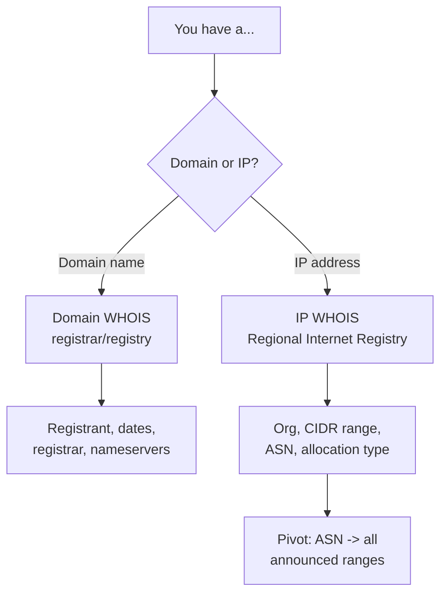
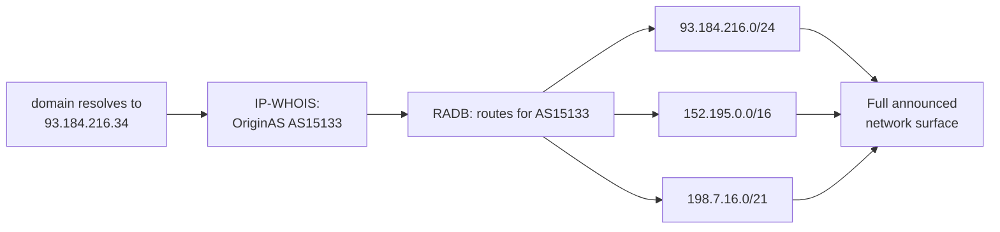
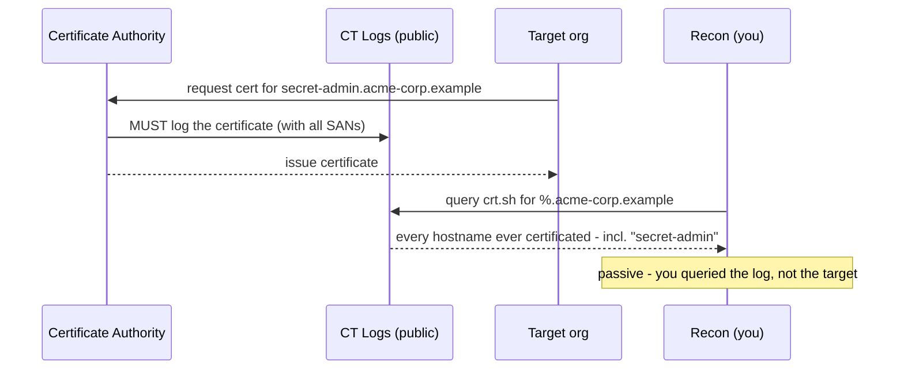
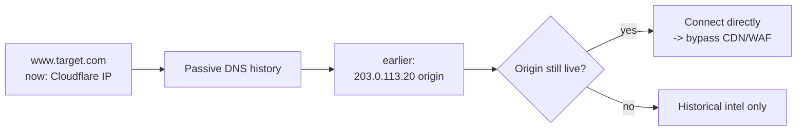
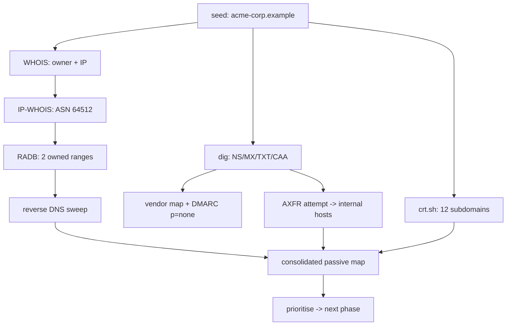

**Level:** Beginner · **Track:** Penetration Testing · **Read time:** 180 min

This is Chapter 2 of the Recon & OSINT notebook. Chapter 1 drew the map: reconnaissance as a systematic search for a target's attack surface, the passive/active line, and a workflow that starts from seeds and follows pivots. This chapter takes the three most productive *passive* pivots from that workflow and teaches each from the ground up — WHOIS, DNS, and Certificate Transparency — because between them they turn a single domain name into a detailed picture of an organisation's naming conventions, mail infrastructure, IP footprint, and forgotten assets, all without sending a single packet to the target's own systems.

These three are grouped together because they compound. WHOIS tells you *who owns what* and reveals the IP ranges and ASNs to pivot into. DNS tells you *what exists and where it lives* — the hosts, the mail servers, the infrastructure relationships baked into records. Certificate Transparency tells you *what hostnames the organisation has ever certificated*, including the internal-sounding subdomains no one meant to publish. Run them in sequence against one seed domain and the attack surface materialises. Master these and you have the backbone of every recon engagement, every bug-bounty hunt, and every red-team target-development phase.

Everything in this chapter is passive: you query registries, public resolvers, and public logs — never the target. That property is what makes these techniques lawful to run even before an engagement's active phase begins, and invisible to the target's detection. The one partial exception, the DNS zone transfer, sits right on the passive/active boundary and is flagged explicitly where it appears.

---

## Part 1: WHOIS — Who Owns What

**WHOIS** is a query/response protocol (and the databases behind it) for looking up who registered a domain name or who was allocated a block of IP addresses. It is one of the oldest services on the internet and remains one of the most useful recon sources, because it answers the first question of any engagement: *what does this organisation actually own?*

There are two distinct WHOIS worlds, and confusing them is a common beginner error:

- **Domain WHOIS** — run by domain registrars and registries. Tells you about a *domain name* (`example.com`): who registered it, when, through which registrar, and which nameservers serve it.
- **IP / number-resource WHOIS** — run by the five **Regional Internet Registries (RIRs)**. Tells you about an *IP address or range*: which organisation was allocated it, the CIDR block, and the ASN announcing it.



### 1.1 Domain WHOIS from scratch

**Tool from scratch — `whois`.** The `whois` command-line client sends your query to the appropriate WHOIS server and prints the raw response. It sends nothing to the target — it asks a registry. On Kali it is preinstalled; elsewhere, `sudo apt install whois`.

```bash
whois example.com
```

```text
Domain Name: EXAMPLE.COM
Registry Domain ID: 2336799_DOMAIN_COM-VRSN
Registrar WHOIS Server: whois.iana.org
Registrar: RESERVED-Internet Assigned Numbers Authority
Updated Date: 2023-08-14T07:01:38Z
Creation Date: 1995-08-14T04:00:00Z
Registry Expiry Date: 2024-08-13T04:00:00Z
Name Server: A.IANA-SERVERS.NET
Name Server: B.IANA-SERVERS.NET
DNSSEC: signed
```

The recon-relevant fields:

| Field | What it tells you | Recon use |
|---|---|---|
| **Registrant Organization** | The legal entity that owns the domain | Seed for reverse-WHOIS to find *other* domains they own |
| **Creation / Updated Date** | Age of the domain, last change | Old domains = established infra; a recent change can flag a migration |
| **Registrar** | Which company manages the registration | Fingerprints how the org runs; some registrars enable specific features |
| **Name Server** | The authoritative nameservers | Where DNS is hosted (self-run vs a provider like Cloudflare/Route 53) |
| **Registrant Email / Phone** | Contact details (often redacted now) | Pivot to other domains registered with the same contact |
| **DNSSEC** | Whether the zone is signed | Affects some attacks; signals maturity |

### 1.2 Privacy protection and its limits

Since privacy regulations like GDPR, most domain WHOIS records now redact registrant name, email, and phone behind a privacy service:

```text
Registrant Organization: Redacted for Privacy
Registrant Email: https://privacy-service.example/contact
```

This is not the dead end it looks like. Several pivots survive redaction:

- **Nameservers are never redacted** — they reveal the DNS provider and often the organisation (self-hosted NS on the org's own domain is a giveaway).
- **Creation/expiry dates survive** — useful for correlating a portfolio of domains registered together.
- **Historical WHOIS** (via services like WhoisXML, SecurityTrails, DomainTools) often has the pre-redaction record, exposing the original registrant.
- **Reverse WHOIS** on any non-redacted field (an org that redacted `.com` but not `.io`, say) finds the sibling domains.

### 1.3 RDAP — the modern replacement

WHOIS is being replaced by **RDAP (Registration Data Access Protocol)**, which returns the same data as structured JSON over HTTPS instead of free-form text. RDAP is easier to parse, supports standardised queries, and is the future — worth knowing because your tooling will increasingly use it under the hood.

```bash
# RDAP for a domain — structured JSON, easy to parse with jq
curl -s https://rdap.org/domain/example.com | jq '{name:.ldhName, status:.status, ns:[.nameservers[].ldhName]}'
```

```text
{
  "name": "example.com",
  "status": ["client delete prohibited", "client transfer prohibited"],
  "ns": ["a.iana-servers.net", "b.iana-servers.net"]
}
```

Command notes: `rdap.org` is a bootstrap proxy that routes your query to the correct authoritative RDAP server; piping to `jq` extracts exactly the fields you want. The `status` values (`client transfer prohibited` etc.) are registrar lock settings — occasionally relevant, more often just maturity signals.

---

## Part 2: IP, Range and ASN WHOIS

Once WHOIS or DNS gives you an IP address, IP-WHOIS turns that single address into an understanding of the *network* it belongs to — and the ASN pivot expands that into the organisation's whole announced footprint.

### 2.1 The five RIRs

IP allocations are managed by five Regional Internet Registries, each covering a region. Querying the right one (or letting your client follow referrals) gives authoritative data:

| RIR | Region | WHOIS server |
|---|---|---|
| **ARIN** | North America | `whois.arin.net` |
| **RIPE NCC** | Europe, Middle East, Central Asia | `whois.ripe.net` |
| **APNIC** | Asia-Pacific | `whois.apnic.net` |
| **LACNIC** | Latin America & Caribbean | `whois.lacnic.net` |
| **AFRINIC** | Africa | `whois.afrinic.net` |

### 2.2 Looking up an IP

```bash
whois 93.184.216.34
```

```text
NetRange:       93.184.216.0 - 93.184.216.255
CIDR:           93.184.216.0/24
NetName:        EDGECAST-NETBLK-03
Organization:   Edgecast Inc. (EDGEC)
OriginAS:       AS15133
NetType:        Allocated to RIPE NCC
```

Key fields for recon:

| Field | Meaning | Recon use |
|---|---|---|
| **NetRange / CIDR** | The block this IP belongs to | Defines the network-surface boundary around the address |
| **Organization / NetName** | Who holds the block | Confirms ownership (must match your scope) |
| **OriginAS** | The autonomous system announcing it | The pivot to *all* the org's ranges |
| **NetType** | Direct allocation vs reassignment | `Reassigned` means an ISP sublet it — the ISP may also be involved |

> **The ownership-check discipline from the methodology notebook lives here.** `Organization` must match the entity in your scope. A block that resolves to a CDN or hosting provider (Cloudflare, Edgecast/Verizon, AWS) is *not* the target's to scan — the resolve-then-whois pass from Chapter 1 catches exactly this.

### 2.3 The ASN pivot — from one range to all of them

An **Autonomous System Number (ASN)** identifies a network that announces its own routes on the internet. A large organisation announces all its IP ranges under one (or a few) ASNs. So the ASN found in an IP-WHOIS lookup is a pivot to the organisation's *entire* announced address space — ranges that no domain or certificate ever revealed.

```bash
# All routes announced by an ASN, from the RADB routing registry
whois -h whois.radb.net -- '-i origin AS15133' | grep -E '^route:' | sort -u
```

```text
route:      93.184.216.0/24
route:      192.16.16.0/24
route:      198.7.16.0/21
route:      152.195.0.0/16
```

Command notes: `-h whois.radb.net` targets the Merit RADB routing registry; the `-- '-i origin ASxxxx'` argument (the `--` stops the client parsing `-i` as its own flag) asks "all route objects whose origin is this ASN". This is one of the highest-value pivots in network recon: a single IP became a `/16` plus several other blocks — a vastly larger surface than the one address you started with.



Two convenient front ends worth knowing (both passive): **bgp.he.net** (Hurricane Electric's BGP toolkit) for browsing an ASN's prefixes and peers in a web UI, and the `whois -h whois.cymru.com` Team Cymru service for bulk IP-to-ASN mapping.

---

## Part 3: DNS Fundamentals for Recon

**DNS (Domain Name System)** is the distributed database that maps names to addresses and other data. For a recon analyst, DNS is a treasure map: every record type leaks something about how the target is built. The DNS chapter in the Networking notebook covered how resolution *works*; here the focus is what each record *tells you* and how to extract it — passively, via public resolvers.

### 3.1 The record types that matter, and what they leak

| Record | Purpose | What it leaks to recon |
|---|---|---|
| **A** | Hostname → IPv4 | The address a host lives at |
| **AAAA** | Hostname → IPv6 | IPv6 surface — often less firewalled than IPv4 |
| **CNAME** | Alias → another name | Third-party services (a CNAME to `*.cloudfront.net`, `*.github.io`) — and dangling CNAMEs enable subdomain takeover |
| **MX** | Mail servers for the domain | Mail provider (self-hosted vs Google/Microsoft), a phishing-relevant surface |
| **NS** | Authoritative nameservers | DNS provider; the servers to try a zone transfer against |
| **TXT** | Arbitrary text | SPF/DKIM/DMARC, domain-verification tokens revealing SaaS vendors |
| **SOA** | Zone authority metadata | Primary NS, admin email, zone serial (change frequency) |
| **PTR** | IP → hostname (reverse) | Names for IPs in a range — reverse-DNS sweeps reveal hosts |
| **SRV** | Service location | Services like SIP, XMPP, LDAP, Kerberos (`_ldap._tcp` screams AD) |
| **CAA** | Which CAs may issue certs | The certificate authority the org uses |

### 3.2 dig from scratch

**Tool from scratch — `dig`.** `dig` (Domain Information Groper) is the definitive DNS query tool. Its power is precision: you choose the record type, the resolver, and the output format. Pointed at a *public* resolver, every `dig` query in this chapter is passive.

```bash
dig example.com A                    # full, verbose answer
dig +short example.com A             # just the answer
dig @1.1.1.1 example.com MX +short   # via Cloudflare's resolver, terse
```

```text
93.184.216.34
```

Anatomy of a full `dig` answer, because reading it fluently matters:

```bash
dig example.com A
```

```text
;; QUESTION SECTION:
;example.com.            IN  A
;; ANSWER SECTION:
example.com.     3600    IN  A   93.184.216.34
;; AUTHORITY SECTION:
example.com.     86400   IN  NS  a.iana-servers.net.
;; Query time: 24 msec
;; SERVER: 1.1.1.1#53(1.1.1.1)
```

Command notes: the **QUESTION** echoes what you asked; the **ANSWER** is the record, with its **TTL** (`3600` seconds — how long resolvers cache it); the **AUTHORITY** names the nameservers; the footer shows which **SERVER** answered. A low TTL can hint at infrastructure that changes often (failover, load balancing); the answering server confirms you queried a public resolver, keeping it passive.

### 3.3 Sweeping all record types

A quick pass over every interesting record type for one domain:

```bash
domain="acme-corp.example"
for t in A AAAA NS MX TXT SOA CAA; do
  echo "=== $t ==="; dig +short @1.1.1.1 "$domain" "$t"
done
```

```text
=== A ===
203.0.113.20
=== NS ===
ns1.acme-corp.example.
ns2.acme-corp.example.
=== MX ===
1 aspmx.l.google.com.
=== TXT ===
"v=spf1 include:_spf.google.com include:mailgun.org -all"
"google-site-verification=Xy9...redacted"
"MS=ms12345678"
=== CAA ===
0 issue "letsencrypt.org"
```

That single sweep already reveals: mail is on **Google Workspace** (`aspmx.l.google.com`), they also send via **Mailgun** (SPF `include`), they use **Google** and **Microsoft** services (the `google-site-verification` and `MS=` TXT tokens), and certificates come from **Let's Encrypt** (CAA). None of that touched the target — all from a public resolver — yet it is a compact vendor map.

---

## Part 4: DNS Enumeration Techniques

Reading records for one name is a start; *enumeration* is discovering the names in the first place, and extracting bulk structure.

### 4.1 Reverse DNS (PTR) sweeps

Given an IP range (from the ASN pivot), reverse DNS often names the hosts:

```bash
# PTR sweep across a small range via a public resolver
for i in $(seq 20 30); do
  ip="203.0.113.$i"
  name=$(dig +short @1.1.1.1 -x "$ip")
  [ -n "$name" ] && echo "$ip -> $name"
done
```

```text
203.0.113.20 -> www.acme-corp.example.
203.0.113.25 -> mail.acme-corp.example.
203.0.113.28 -> vpn.acme-corp.example.
203.0.113.30 -> jenkins.acme-corp.example.
```

Command notes: `dig -x <ip>` does a reverse lookup (it constructs the `in-addr.arpa` PTR query for you); iterating a range turns the ASN's blocks into named hosts. Reverse DNS is inconsistent (many IPs have no PTR), but when present it names infrastructure the forward records never listed.

### 4.2 The zone transfer (AXFR) — the boundary technique

A **zone transfer** is a DNS mechanism for replicating an entire zone from a primary to a secondary nameserver. If a nameserver is misconfigured to allow transfers to *anyone*, a single request dumps every record in the zone — the complete internal map.

> **Passive/active boundary — read this.** A zone transfer request goes *to the target's own authoritative nameserver*, so by Chapter 1's test (does a packet reach a system the target operates?) it is technically **active** and appears in the target's DNS logs. It is low-volume and low-risk, but it requires authorization on an engagement. It is included here because it is the natural companion to DNS enumeration and, when it works, the single highest-yield DNS technique.

```bash
# 1) find the nameservers  2) attempt AXFR against each
ns=$(dig +short NS acme-corp.example)
for server in $ns; do
  echo "=== AXFR via $server ==="
  dig AXFR acme-corp.example @"$server"
done
```

```text
=== AXFR via ns1.acme-corp.example. ===
; Transfer failed.
=== AXFR via ns2.acme-corp.example. ===
acme-corp.example.     IN SOA  ns1.acme-corp.example. admin.acme-corp.example. 2024...
acme-corp.example.     IN MX   1 aspmx.l.google.com.
dev.acme-corp.example.        IN A   10.10.0.5
staging.acme-corp.example.    IN A   203.0.113.45
gitlab-internal.acme-corp.example. IN A 10.10.0.12
vpn.acme-corp.example.        IN A   203.0.113.28
```

Command notes: `dig AXFR <zone> @<server>` requests a full zone transfer from a specific nameserver. Here `ns1` refuses (correct configuration) but `ns2` is misconfigured and dumps everything — including **internal** hosts (`dev` and `gitlab-internal` on RFC1918 `10.10.0.x` addresses) that no external technique would ever reveal. A single misconfigured secondary hands you the entire network map. Always try every nameserver; misconfigurations often hide on the secondaries.

### 4.3 Subdomain brute-forcing via public resolvers

When zone transfer fails (the common case), you discover subdomains by *guessing* names and resolving them. Done via public resolvers, the resolution itself is passive; confirming a discovered host by connecting to it is active.

**Tool from scratch — `dnsx`.** `dnsx` (ProjectDiscovery) is a fast DNS toolkit that resolves large lists of names concurrently. Fed a wordlist of candidate subdomains, it reports which ones resolve.

```bash
# Generate candidates from a wordlist and resolve them via public resolvers
sed "s/^/x./;s/x./&/" /dev/null 2>/dev/null   # (placeholder)
dnsx -silent -d acme-corp.example \
     -w /usr/share/seclists/Discovery/DNS/subdomains-top1million-5000.txt \
     -r 1.1.1.1,8.8.8.8 -o passive/brute-subs.txt
head passive/brute-subs.txt
```

```text
www.acme-corp.example
mail.acme-corp.example
dev.acme-corp.example
vpn.acme-corp.example
api.acme-corp.example
webmail.acme-corp.example
```

Command notes: `-d` sets the domain, `-w` the wordlist of candidate prefixes, `-r` pins public resolvers (keeping resolution passive and spreading load), `-o` saves results. `dnsx` only reports names that actually resolve, filtering the wordlist down to real hosts. Dedicated subdomain-enumeration tooling (amass, subfinder) is the whole subject of a later chapter; `dnsx` here shows the underlying brute-force pivot.

### 4.4 A tool that ties DNS enumeration together — `dnsrecon`

**Tool from scratch — `dnsrecon`.** `dnsrecon` automates the DNS-enumeration steps above — record enumeration, zone-transfer attempts, reverse lookups, and brute-forcing — in one command, which is handy for a first pass.

```bash
dnsrecon -d acme-corp.example -t std,axfr
```

```text
[*] std: Enumerating general records
[*]      A  www.acme-corp.example 203.0.113.20
[*]      MX aspmx.l.google.com
[*]      NS ns1.acme-corp.example / ns2.acme-corp.example
[*] axfr: Testing NS servers for zone transfer
[+]      Zone transfer successful on ns2.acme-corp.example
[*]      A  gitlab-internal.acme-corp.example 10.10.0.12
```

Command notes: `-d` the domain, `-t` the technique set (`std` = standard records, `axfr` = zone-transfer attempt; other types include `brt` for brute-force and `rvl` for reverse). `dnsrecon` is a good orchestrator, but understanding what each underlying step does — as above — is what lets you interpret and trust its output.

---

## Part 5: Certificate Transparency — The Best Passive Subdomain Source

**Certificate Transparency (CT)** is a framework requiring every publicly-trusted TLS certificate to be recorded in public, append-only logs. It exists so that mis-issued certificates can be caught — but as a side effect it created the single richest passive source of subdomains in existence. Because a CA cannot issue a certificate without it being logged, and certificates list the hostnames they cover, CT logs are a public, searchable catalogue of an organisation's names.

### 5.1 Why CT beats brute-forcing

Subdomain brute-forcing only finds names in your wordlist. CT finds names that *actually had certificates issued* — including unguessable ones (`prod-db-replica-3.acme-corp.example`, `acme-internal-vpn-uk.acme-corp.example`) that no wordlist would contain. CT is passive, complete for anything ever certificated, and free.



### 5.2 Querying crt.sh

**Tool from scratch — `crt.sh`.** `crt.sh` (run by Sectigo) is a free web front end and API over the CT logs. You query for a domain and get every certificate — and hostname — ever logged for it.

```bash
curl -s "https://crt.sh/?q=%25.acme-corp.example&output=json" \
  | jq -r '.[].name_value' | sed 's/^\*\.//' | sort -u | tee passive/ct-subs.txt
```

```text
acme-corp.example
api.acme-corp.example
autodiscover.acme-corp.example
dev.acme-corp.example
grafana.acme-corp.example
internal-vpn.acme-corp.example
jenkins.acme-corp.example
mail.acme-corp.example
prod-db-replica.acme-corp.example
staging.acme-corp.example
vault.acme-corp.example
www.acme-corp.example
```

Command notes: `%25` is the URL-encoded `%` wildcard; `output=json` gives structured data; `jq -r '.[].name_value'` extracts each certificate's hostname list; `sed 's/^\*\.//'` strips wildcard prefixes; `sort -u` deduplicates. Look at the yield: `vault.` (a secrets manager), `grafana.` (monitoring), `prod-db-replica.` (a database), `internal-vpn.` — high-value targets a brute-force would likely miss entirely.

### 5.3 Censys and other CT/scan sources

CT data is also queryable through **Censys** and **Shodan** (which correlate certificates with the hosts serving them), and through ProjectDiscovery's aggregating tools. A second passive angle via Censys's certificate search finds hosts *presenting* a cert for the domain, which sometimes reveals IPs behind a CDN if the origin ever served the certificate directly. These sources are the subject of the Shodan & Censys chapter; the point here is that CT is queryable from several directions, and cross-referencing them improves completeness.

### 5.4 The defender's use of CT

CT is a rare source that is as valuable to defenders as to attackers. Because the logs are public and near-real-time, an organisation can **monitor CT for its own domains** and get alerted the instant a new certificate — hence a new subdomain, or a mis-issued/rogue certificate — appears. Tools and services (certspotter, Facebook's CT monitoring, commercial ASM platforms) watch the logs continuously. This is the defensive twin of the recon technique: the same log that hands an attacker your subdomains hands you an early warning of shadow IT and certificate mis-issuance.

---

## Part 6: TXT Records as Intelligence — SPF, DKIM, DMARC

Email-authentication records live in DNS as TXT records and are a surprisingly rich, entirely passive intelligence source — they map an organisation's mail infrastructure and third-party senders, and they reveal phishing exposure.

### 6.1 SPF — the sender inventory

**SPF (Sender Policy Framework)** lists which servers are authorized to send mail for a domain. Every `include` and `ip4`/`ip6` mechanism names a piece of the org's (or a vendor's) sending infrastructure.

```bash
dig +short TXT acme-corp.example | grep spf
```

```text
"v=spf1 include:_spf.google.com include:mailgun.org include:servers.mcsv.net ip4:203.0.113.60 -all"
```

Reading it: mail flows through **Google Workspace**, **Mailgun**, and **Mailchimp** (`servers.mcsv.net`), plus a self-hosted sender at `203.0.113.60`. That is a vendor map and an additional in-scope IP, for free. The terminal mechanism matters too:

| SPF ending | Meaning | Phishing relevance |
|---|---|---|
| `-all` | Hard fail — reject unlisted senders | Strong; spoofing is hard |
| `~all` | Soft fail — accept but mark | Weaker; spoofed mail may land in spam |
| `?all` / `+all` | Neutral / allow all | Effectively no protection — easy spoofing |
| (no SPF) | None | Domain is trivially spoofable |

### 6.2 DMARC — the enforcement posture

**DMARC** builds on SPF/DKIM and tells receivers what to do with failures. It lives at `_dmarc.<domain>`:

```bash
dig +short TXT _dmarc.acme-corp.example
```

```text
"v=DMARC1; p=none; rua=mailto:dmarc@acme-corp.example"
```

The `p=` policy is the key:

| DMARC `p=` | Meaning | Attacker read |
|---|---|---|
| `p=reject` | Reject failing mail | Spoofing the exact domain is impractical |
| `p=quarantine` | Send failing mail to spam | Spoofing may still reach users |
| `p=none` | Monitor only, take no action | **Domain is spoofable** — a phishing green light |

Here `p=none` means that despite a strict SPF, the domain can still be spoofed in practice — an important finding for any social-engineering component of an engagement. The `rua=` address also leaks an internal email and confirms someone is (at least) collecting reports.

### 6.3 DKIM and verification tokens

**DKIM** selectors live at `<selector>._domainkey.<domain>` and are harder to enumerate (you must know or guess the selector), but common selectors (`google`, `default`, `selector1`, `k1`) are worth checking. Other TXT records — `google-site-verification`, `MS=`, `atlassian-domain-verification`, `docusign=` — each confirm a specific SaaS the org uses, building the supply-chain surface from Chapter 1 without a single packet to the target.

---

## Part 7: SRV, DNSSEC and Special-Purpose Records

Beyond the everyday record types, a handful of special-purpose records give away architecture that nothing else does — and they are all readable passively via a public resolver.

### SRV records — services announce themselves

**SRV records** advertise where a particular service runs, in the form `_service._proto.domain`. They are how clients auto-discover services, and they are a recon gift because they name the service *and* its host and port.

```bash
for s in _ldap._tcp _kerberos._tcp _gc._tcp _sip._tls _autodiscover._tcp _xmpp-client._tcp; do
  echo "== $s =="; dig +short @1.1.1.1 SRV "$s.acme-corp.example"
done
```

```text
== _ldap._tcp ==
0 100 389 dc01.acme-corp.example.
== _kerberos._tcp ==
0 100 88 dc01.acme-corp.example.
== _gc._tcp ==
0 100 3268 dc01.acme-corp.example.
```

Command notes: each `dig SRV` query asks for the service-location record; the answer is `priority weight port target`. The results here are decisive: `_ldap._tcp`, `_kerberos._tcp` (port 88), and `_gc._tcp` (global catalog, 3268) all pointing at `dc01` mean this domain runs **Active Directory**, and they name the **domain controller** — a top-priority asset — purely from public DNS. AD-heavy environments leak their structure through SRV records constantly.

| SRV prefix | Service revealed | Recon significance |
|---|---|---|
| `_ldap._tcp` / `_kerberos._tcp` / `_gc._tcp` | Active Directory (LDAP, Kerberos, Global Catalog) | Names the DC; confirms an AD environment |
| `_sip._tls` / `_sips._tcp` | SIP / VoIP | Telephony surface |
| `_autodiscover._tcp` | Exchange autodiscover | On-prem Exchange vs 365 |
| `_xmpp-client._tcp` | XMPP chat | Legacy messaging infra |
| `_caldav` / `_carddav` | Calendar / contacts | Groupware provider |

### DNSSEC — signed zones

**DNSSEC** cryptographically signs DNS records so resolvers can verify authenticity. For recon it is mostly a maturity signal, but the signing records (`DNSKEY`, `RRSIG`, `DS`, and especially `NSEC`/`NSEC3`) occasionally leak information:

```bash
dig +short @1.1.1.1 DNSKEY acme-corp.example        # is the zone signed?
dig +dnssec @1.1.1.1 acme-corp.example A            # see RRSIG signatures
```

The historical **NSEC "zone walking"** issue is worth knowing: original NSEC records, used to prove a name does *not* exist, chained together every existing name in the zone — meaning a signed zone could be fully enumerated by walking the NSEC chain. `NSEC3` (hashed names) was introduced to stop this, but poorly-configured NSEC zones can still be walked with tools like `ldns-walk`. It is a niche but occasionally devastating passive enumeration path.

### CAA and the certificate angle

`CAA` records (Part 3) name which CAs may issue for the domain. Combined with Certificate Transparency, they let you sanity-check the CT haul: if CAA says only Let's Encrypt may issue, a logged certificate from a different CA is either a legitimate exception or a sign of something worth investigating (mis-issuance, an old vendor).

---

## Part 8: Tooling Round-Up — Passive Recon Automation

The techniques in this chapter can be run one command at a time (which is how you *learn* them) or orchestrated by tools that chain them (which is how you *scale* them). Knowing what each tool does under the hood — which you now do — is what lets you trust and interpret their output.

| Tool | What it automates | Passive? | When to reach for it |
|---|---|---|---|
| `whois` / `rdap` | Ownership lookups | Yes | Always, first |
| `dig` / `host` / `nslookup` | Individual DNS queries | Yes (public resolver) | Precision lookups; the everyday workhorse |
| `dnsrecon` | Records + AXFR + reverse + brute | Mixed (AXFR is active) | A fast first DNS pass |
| `dnsx` | Bulk resolution / record probing | Yes (public resolvers) | Resolving large candidate lists |
| `fierce` | DNS recon + subdomain brute + reverse | Mixed | Quick subdomain sweep |
| `amass intel` / `amass enum -passive` | Aggregated passive asset discovery | Yes (passive mode) | Broad, multi-source enumeration |
| `subfinder` | CT + many-source subdomain discovery | Yes | Fast passive subdomain haul |
| `crt.sh` (curl/API) | Certificate Transparency search | Yes | The best single passive subdomain source |

> **The learn-then-automate principle.** Beginners who start with `amass`/`subfinder` get a pile of subdomains they cannot interpret. Having first done WHOIS, `dig`, AXFR, and `crt.sh` by hand, you know *why* each name appeared and *what* it implies — so when a tool spits out 200 hosts, you can triage them. Automation multiplies understanding; it does not substitute for it. The full amass/subfinder/assetfinder workflow is the subject of the Subdomain Enumeration chapter; here they are shown as the scaled-up form of techniques you can now perform manually.

### A minimal passive pipeline

Chaining a few of these gives a one-shot passive host list (each stage is a technique from this chapter):

```bash
target="acme-corp.example"
{ subfinder -silent -d "$target"                                   # CT + sources
  curl -s "https://crt.sh/?q=%25.$target&output=json" | jq -r '.[].name_value'
} | sed 's/^\*\.//' | sort -u | dnsx -silent -r 1.1.1.1,8.8.8.8 -a -resp \
  | tee assets/passive-hosts.txt
```

Command notes: `subfinder` and `crt.sh` both contribute CT-derived names; `sort -u` merges and dedupes; `dnsx -a -resp` keeps only names that resolve and appends their IPs. Every stage is passive (public resolvers and logs only). This is the automation-scaled version of Sections 8.4–8.7 — and you understand each piece.

---

## Part 9: Passive DNS and Historical Data

Live DNS shows the *current* state. **Passive DNS** databases record what DNS *used to* look like — historical A records, retired subdomains, old IPs — by aggregating resolver observations over time. This is pure recon gold: infrastructure the target moved off but never fully decommissioned, and origin IPs that predate a CDN.

Providers include **SecurityTrails**, **PassiveTotal (RiskIQ)**, **DNSDB (Farsight)**, and **VirusTotal**'s relations data. Typical high-value findings:

- **The origin IP behind a CDN.** If `www.target.com` is on Cloudflare now but historically pointed at `203.0.113.20`, that origin may still be reachable directly — bypassing the CDN's WAF entirely. This is one of the most impactful passive findings in web recon.
- **Retired subdomains** that still resolve to forgotten, unpatched hosts.
- **Infrastructure migrations** — seeing a domain move from one hosting provider's ranges to another over time maps the org's history.



All of this is passive — you query the passive-DNS provider, not the target. The completeness these services add is exactly why they appear in the source catalogue from Chapter 1.

---

## Part 10: Hands-On Lab — One Domain to a Full Passive Map

This lab chains WHOIS, DNS, and CT into a complete passive picture of a target, then adds the one boundary technique (AXFR) explicitly flagged as active. Seed: `acme-corp.example`. Every step but the AXFR touches only third parties.

### 8.1 Workspace

```bash
target="acme-corp.example"
mkdir -p ~/recon/$target/{whois,dns,ct,assets,notes}
cd ~/recon/$target
echo "# Passive recon: $target" > notes/log.md
echo "- $(date -u +%FT%TZ) start" >> notes/log.md
```

### 8.2 WHOIS — ownership and the ASN pivot

```bash
whois $target | grep -Ei 'registrant org|registrar:|creation|name server' | tee whois/domain.txt
ip=$(dig +short @1.1.1.1 www.$target | tail -1)
whois "$ip" | grep -Ei 'orgname|cidr|originas' | tee whois/ip.txt
asn=$(grep -i originas whois/ip.txt | grep -oE 'AS[0-9]+')
whois -h whois.radb.net -- "-i origin $asn" | grep -E '^route:' | sort -u | tee whois/asn-routes.txt
```

```text
Registrant Organization: Acme Corporation
Name Server: NS1.ACME-CORP.EXAMPLE
OrgName:        Acme Corporation
CIDR:           203.0.113.0/24
OriginAS:       AS64512
route:      203.0.113.0/24
route:      198.51.100.0/24
```

Two owned ranges established, ASN confirmed. Log it.

### 8.3 DNS — records and the vendor map

```bash
for t in A AAAA NS MX TXT SOA CAA; do
  echo "=== $t ==="; dig +short @1.1.1.1 "$target" "$t"
done | tee dns/records.txt
dig +short TXT _dmarc.$target | tee dns/dmarc.txt
```

```text
=== NS ===
ns1.acme-corp.example.
ns2.acme-corp.example.
=== MX ===
1 aspmx.l.google.com.
=== TXT ===
"v=spf1 include:_spf.google.com include:mailgun.org -all"
"MS=ms12345678"
=== CAA ===
0 issue "letsencrypt.org"
--- dmarc ---
"v=DMARC1; p=none; rua=mailto:dmarc@acme-corp.example"
```

Findings: Google Workspace + Mailgun mail; Microsoft 365 (the `MS=` token); Let's Encrypt certs; **DMARC `p=none` → the domain is spoofable** (a phishing finding). All passive.

### 8.4 Certificate Transparency — the subdomain haul

```bash
curl -s "https://crt.sh/?q=%25.$target&output=json" \
  | jq -r '.[].name_value' | sed 's/^\*\.//' | sort -u | tee ct/subs.txt
wc -l ct/subs.txt
```

```text
api.acme-corp.example
dev.acme-corp.example
grafana.acme-corp.example
jenkins.acme-corp.example
staging.acme-corp.example
vault.acme-corp.example
vpn.acme-corp.example
www.acme-corp.example
    12 ct/subs.txt
```

### 8.5 Reverse DNS across the owned ranges

```bash
for i in $(seq 20 30); do
  ip="203.0.113.$i"; n=$(dig +short @1.1.1.1 -x "$ip")
  [ -n "$n" ] && echo "$ip -> $n"
done | tee dns/ptr.txt
```

```text
203.0.113.20 -> www.acme-corp.example.
203.0.113.28 -> vpn.acme-corp.example.
203.0.113.30 -> jenkins.acme-corp.example.
```

### 8.6 Zone transfer — the boundary technique (active; authorized)

```bash
# NOTE: this touches the target's nameserver -> ACTIVE. Only within authorization.
for s in $(dig +short NS $target); do
  echo "=== AXFR $s ==="; dig AXFR $target @"$s"
done | tee dns/axfr.txt
```

```text
=== AXFR ns2.acme-corp.example. ===
gitlab-internal.acme-corp.example. IN A 10.10.0.12
dev.acme-corp.example.             IN A 10.10.0.5
```

`ns2` is misconfigured and leaks two **internal** hosts — assets no external source revealed.

### 8.7 Consolidate the passive map

```bash
cat ct/subs.txt dns/ptr.txt dns/axfr.txt \
  | grep -oE '[a-z0-9.-]+\.acme-corp\.example' | sort -u | tee assets/all-hosts.txt
echo "- $(date -u +%FT%TZ) passive map complete: $(wc -l < assets/all-hosts.txt) hosts, 2 ranges, ASN $asn" >> notes/log.md
```

The consolidated attack surface, from a single seed and (almost) zero packets to the target:

```text
SOURCE      ASSET                                   NOTE
whois       203.0.113.0/24, 198.51.100.0/24         owned ranges (ASN 64512)
dns TXT     Google Workspace, Mailgun, M365, LE     vendor map; DMARC p=none = spoofable
ct          vault / grafana / jenkins / staging     high-value subdomains
ptr         vpn, jenkins                            confirmed live infra
axfr        gitlab-internal (10.10.0.12)            INTERNAL host leaked
```

### 8.8 The full pivot chain



---

## Part 11: Detection & Defense Angle

How does a defender see these techniques — and reduce what they expose?

### What is detectable, and what is not

| Technique | Detectable by target? | Why |
|---|---|---|
| Domain/IP WHOIS lookup | No | Queries a registry, not the target |
| DNS query via public resolver | No | Queries a resolver, not the target's NS |
| Certificate Transparency search | No | Queries a public log |
| Passive DNS query | No | Queries a third-party database |
| Reverse DNS via public resolver | No (usually) | Resolver-mediated |
| **Zone transfer (AXFR)** | **Yes** | Hits the target's authoritative NS; logged |
| Subdomain brute-force hitting target NS directly | Yes | If resolution reaches the target's own NS |

The uncomfortable defensive reality: **almost all of this is invisible.** WHOIS, public-resolver DNS, and CT queries leave no trace on the target. Defense is therefore about *reducing exposure* and *monitoring public sources*, not detecting queries.

### Defensive posture

- **Disable zone transfers** to unauthorized hosts — restrict AXFR to known secondaries with `allow-transfer` (BIND) or the provider's equivalent. The lab's `ns2` leak is a pure misconfiguration.
- **Monitor Certificate Transparency** for your own domains (certspotter, Facebook CT, commercial ASM) to catch new subdomains and rogue certificates as they are logged.
- **Prune DNS.** Remove records for decommissioned hosts; eliminate dangling CNAMEs (subdomain-takeover risk); keep non-production names off public DNS.
- **Set DMARC to `p=reject`** (via `quarantine`) after monitoring — `p=none` leaves the domain spoofable, as the lab found.
- **Minimise TXT oversharing.** Verification tokens and SPF `include`s advertise your vendor stack; keep only what is needed.
- **Run passive recon against yourself** continuously (attack surface management) — the same WHOIS/DNS/CT sweep, so you find the forgotten `staging.` and the leaked origin IP before an attacker does.

**IR use case:** historical passive-DNS and CT records help incident responders reconstruct what infrastructure existed at the time of a compromise — a subdomain that has since been removed, or the origin IP an attacker reached behind the CDN.

---

## Part 12: Common Pitfalls

- **Confusing domain WHOIS with IP WHOIS.** They are different databases answering different questions; use the right one for the artifact you hold.
- **Treating privacy-redacted WHOIS as a dead end.** Nameservers, dates, historical WHOIS, and reverse-WHOIS pivots survive redaction.
- **Skipping the ASN pivot.** The IP a domain resolves to is one address; the ASN reveals the org's whole announced footprint.
- **Querying the target's own nameserver for everything.** Use public resolvers to stay passive; hitting the target's NS directly is visible.
- **Believing a zone transfer is passive.** AXFR touches the target's NS and is logged — it is active and needs authorization.
- **Relying on brute-force alone for subdomains.** CT logs find unguessable names brute-forcing never will; use CT first.
- **Ignoring TXT records.** SPF/DMARC/verification tokens are a free vendor map and a spoofing assessment.
- **Missing the CDN-origin leak.** Passive DNS history often exposes the real IP behind a CDN — check it.
- **Not deduplicating across sources.** CT, PTR, and AXFR overlap; consolidate into one host list.
- **Testing a discovered CDN/SaaS IP as the target.** Ownership-check every IP (methodology Chapter 2) before touching it.
- **Forgetting IPv6 (AAAA).** The IPv6 surface is often less firewalled; enumerate it too.

---

- **SRV records** auto-discover services and leak architecture: `_ldap._tcp`/`_kerberos._tcp`/`_gc._tcp` pointing at a host mean **Active Directory** and name the domain controller — all from public DNS. **DNSSEC** is mainly a maturity signal, but poorly-configured NSEC zones can be *walked* to enumerate every name.
- **Learn the techniques by hand, then automate them.** `dnsrecon`, `dnsx`, `subfinder`, and `amass -passive` orchestrate the WHOIS/DNS/CT steps at scale — but only after doing them manually can you interpret and triage what they return.

- **Overlooking SRV records.** `_ldap._tcp`/`_kerberos._tcp` name your domain controller and confirm AD — one of the highest-value passive findings, and routinely skipped.
- **Reaching for `amass`/`subfinder` before understanding the pivots.** You get names you cannot interpret; learn WHOIS/dig/CT by hand first.
- **Assuming DNSSEC-signed means enumeration-proof.** Misconfigured NSEC zones can still be walked name-by-name.

- **Trusting a single CT source.** crt.sh, Censys, and subfinder's sources overlap imperfectly; cross-reference at least two for completeness.
- **Ignoring wildcard certificates.** A `*.acme-corp.example` cert in CT hides the specific hostnames — pair CT with brute-forcing/passive DNS to fill the gap a wildcard leaves.
- **Not re-querying passive DNS for the CDN origin.** The single highest-impact web-recon finding is often an origin IP in DNS history that still answers directly.

## Part 13: Final Revision — The Chapter in Compressed Form

- **WHOIS** answers "who owns what". Domain WHOIS (registrar/registry) gives registrant, dates, registrar, nameservers; IP WHOIS (the five RIRs) gives the org, CIDR, and **ASN**. **RDAP** is the structured-JSON successor.
- **Privacy redaction is not a dead end** — nameservers, dates, historical WHOIS, and reverse-WHOIS survive it.
- **The ASN pivot** turns one IP into the organisation's entire announced address space (`whois -h whois.radb.net -- '-i origin ASxxxx'`, or bgp.he.net).
- **DNS records each leak something**: A/AAAA (addresses, IPv6 surface), CNAME (third parties, takeover risk), MX (mail provider), NS (DNS provider + AXFR targets), TXT (SPF/DMARC/vendor tokens), SRV (`_ldap._tcp` = AD), CAA (the CA). Read them via a **public resolver** to stay passive.
- **`dig`** is the precision DNS tool; a `for`-loop over record types plus `_dmarc` gives a compact vendor-and-posture map in seconds.
- **Enumeration**: reverse-DNS (PTR) sweeps name hosts in a range; **zone transfer (AXFR)** dumps the whole zone when a nameserver is misconfigured — but it is **active** (hits the target NS, logged); subdomain brute-forcing via public resolvers (`dnsx`) finds names in a wordlist.
- **Certificate Transparency** is the best passive subdomain source: every public cert is logged with its hostnames, so `crt.sh` reveals unguessable, internal-sounding names for free. Cross-reference Censys/Shodan for completeness.
- **TXT records are intelligence**: SPF lists senders and infrastructure; DMARC `p=none` means the domain is **spoofable**; verification tokens confirm each SaaS vendor.
- **Passive DNS** exposes history — retired subdomains and, critically, the **origin IP behind a CDN**, which may still be directly reachable.
- **Defense** is mostly exposure-reduction and self-monitoring, because the passive techniques are invisible: disable AXFR, monitor CT, prune DNS, set DMARC `p=reject`, and run the same recon against yourself.

---

- **Passive DNS** exposes history — retired subdomains and, critically, the **origin IP behind a CDN**, which may still be directly reachable, bypassing the WAF entirely.
- **The whole chain compounds**: WHOIS→ASN gives ranges, `dig` gives the vendor map and spoofability, CT gives unguessable subdomains, reverse DNS names hosts, and (with authorization) AXFR can dump internal records — a full attack surface from one seed domain, almost entirely passive.

- **RDAP is replacing WHOIS** — structured JSON over HTTPS, easier to parse and query programmatically; expect tooling to migrate to it.
- **Reverse WHOIS and passive DNS turn one seed into many**: an org's other domains (via registrant), and its infrastructure history (via resolver observations over time).

## Part 14: Cheat Sheet / Quick Reference

### WHOIS

```bash
whois example.com                                   # domain: registrant, NS, dates
whois 93.184.216.34                                 # IP: org, CIDR, ASN
whois -h whois.ripe.net 93.184.216.0/24             # specific RIR
whois -h whois.radb.net -- '-i origin AS15133'      # all routes for an ASN
curl -s https://rdap.org/domain/example.com | jq .  # RDAP (structured JSON)
# bgp.he.net -> browse ASN prefixes/peers in a web UI (passive)
```

### DNS (via public resolver = passive)

```bash
dig +short @1.1.1.1 example.com A
for t in A AAAA NS MX TXT SOA CAA; do echo "== $t =="; dig +short @1.1.1.1 example.com $t; done
dig +short TXT _dmarc.example.com                    # spoofability
dig -x 203.0.113.20 @1.1.1.1                          # reverse (PTR)
dig AXFR example.com @ns2.example.com                 # zone transfer (ACTIVE!)
```

### Subdomain discovery

```bash
# Certificate Transparency (best passive source)
curl -s "https://crt.sh/?q=%25.example.com&output=json" | jq -r '.[].name_value' | sed 's/^\*\.//' | sort -u
# Brute-force via public resolvers
dnsx -silent -d example.com -w /usr/share/seclists/Discovery/DNS/subdomains-top1million-5000.txt -r 1.1.1.1,8.8.8.8
# All-in-one first pass
dnsrecon -d example.com -t std,axfr,brt
```

### Reading TXT/SPF/DMARC

```text
SPF  -all  = hard fail (good)   ~all = soft   ?all/+all/none = spoofable
DMARC p=reject (good) > p=quarantine > p=none (spoofable)
SPF includes + verification tokens = free vendor/supply-chain map
```

### SRV service discovery (public resolver)

```bash
for s in _ldap._tcp _kerberos._tcp _gc._tcp _sip._tls _autodiscover._tcp; do
  echo "== $s =="; dig +short @1.1.1.1 SRV "$s.example.com"; done
# _ldap/_kerberos/_gc -> Active Directory + names the DC
dig +short @1.1.1.1 DNSKEY example.com     # signed zone?
```

### The pivot chain

```text
domain -> WHOIS -> owner + resolves to IP
IP     -> WHOIS -> ASN -> RADB -> ALL owned ranges
domain -> dig NS/MX/TXT/CAA -> vendor map + spoofability
domain -> crt.sh -> subdomains (incl. unguessable/internal-ish)
ranges -> reverse DNS -> named hosts
NS     -> AXFR attempt (ACTIVE) -> full zone if misconfigured
history-> passive DNS -> CDN origin IP, retired hosts
```

---

## Part 15: Practice Labs & Resources

1. **Run the full Part 8 chain against a domain you own.** WHOIS → ASN → dig sweep → crt.sh → reverse DNS → (only against your own NS) AXFR. You are authorized, and you will map your own surface — and probably find a stale record. This is the best single exercise and doubles as attack-surface management.
2. **TryHackMe — *DNS in Detail* and *Passive Reconnaissance* rooms** for guided, answer-checked practice on the exact record types and tools here.
3. **HackTheBox Academy — *Footprinting* module** (DNS, and the infrastructure-enumeration sections) for structured, assessed depth on WHOIS/DNS.
4. **Find a deliberately-misconfigured zone-transfer target.** The `zonetransfer.me` domain is a well-known, intentionally-open teaching zone: `dig AXFR zonetransfer.me @nsztm1.digi.ninja` dumps a rich zone safely and legally. Study every record type it returns.
5. **crt.sh against a broad bug-bounty scope.** Pick a programme with a wildcard scope on HackerOne/Bugcrowd and enumerate its subdomains via CT (passive, within policy). Compare the CT haul to what a brute-force wordlist would have found — the gap is the lesson.
6. **Practise the ASN pivot on bgp.he.net.** Look up a large organisation's ASN and browse every prefix it announces; then verify a couple with `whois`. Internalise how one IP becomes a whole footprint.
7. **Read SPF/DMARC for ten well-known domains.** Note which end in `-all` vs `~all` and which set `p=reject` vs `p=none`. You will quickly see how many large brands remain spoofable — and how to assess it in seconds.
8. **Set up CT monitoring for your own domain** (certspotter or a free ASM tier). Watch a new certificate appear in the logs within minutes of issuance — the defender's side of this chapter, made concrete.

9. **Enumerate SRV records for a domain you know runs AD** (your own lab from the methodology notebook, or a THM AD room). Confirm that `_ldap._tcp`/`_kerberos._tcp`/`_gc._tcp` name the domain controller — see the technique work against a real forest.
10. **Compare a manual chain to an automated one.** Map a target's subdomains by hand (crt.sh + dig), then run `subfinder`/`amass -passive` against the same target, and diff the results. Understanding *why* the tool found extra names (or missed some) is the skill.
11. **Try NSEC zone-walking on an intentionally-vulnerable signed zone** (search for a public DNSSEC teaching zone) with `ldns-walk` to see the historical enumeration path concretely.

12. **Assess spoofability across an industry.** Pull SPF and DMARC for ten organisations in one sector (banks, universities, retailers). Tabulate `-all` vs `~all` and `p=reject` vs `p=none`. You will find a striking number remain trivially spoofable — and you will be able to make that assessment in seconds on any future engagement.
13. **Recover a redacted registrant via historical WHOIS.** Take a domain whose current WHOIS is privacy-protected and look it up in a historical-WHOIS source (SecurityTrails/WhoisXML free tiers) to see the pre-redaction owner — proof that redaction is a speed bump, not a wall.

---

*Also on [Praneeth's portfolio](https://ping-praneeth.vercel.app/notebook/pentest-recon-osint/02-passive-recon-whois-dns-enumeration-and-certificate-transparency), with comments and the latest edits.*
