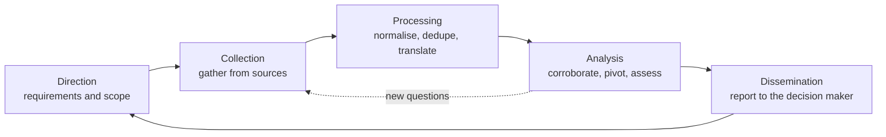
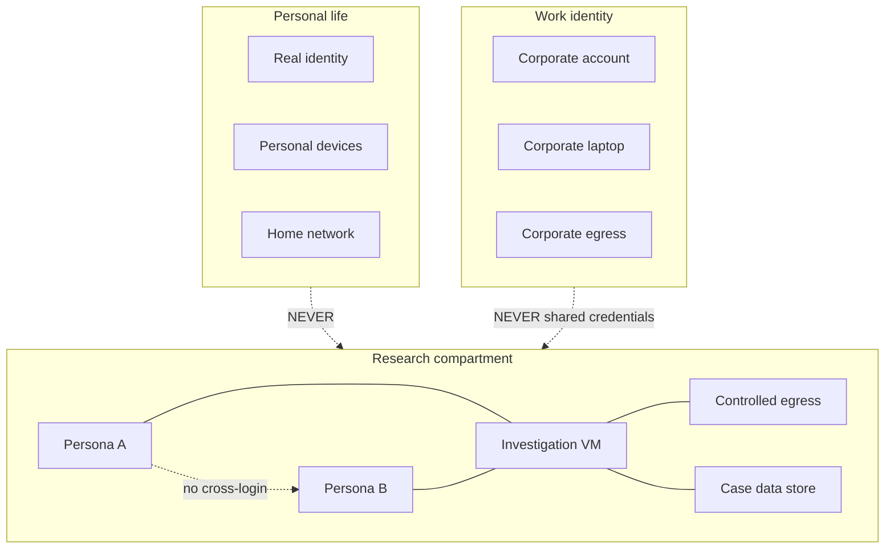
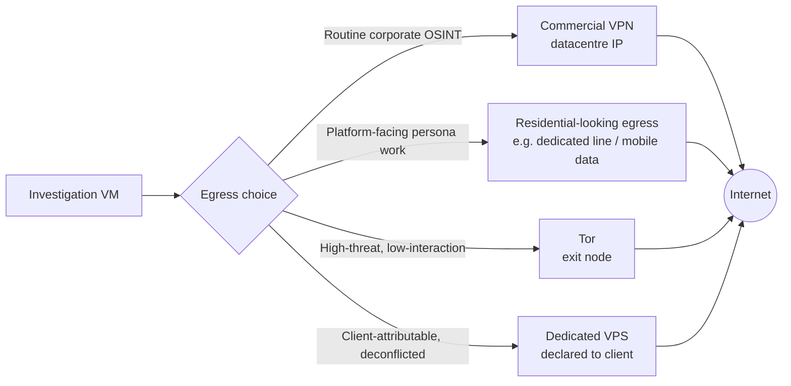
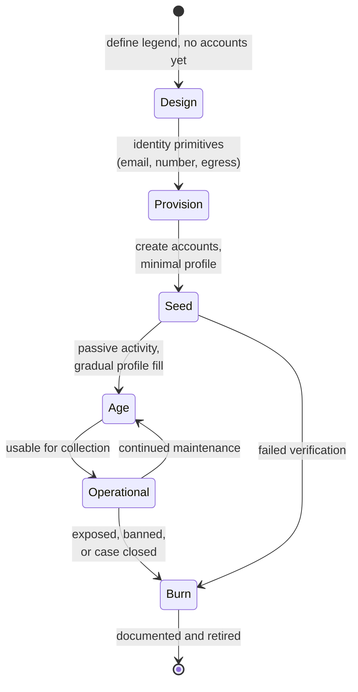
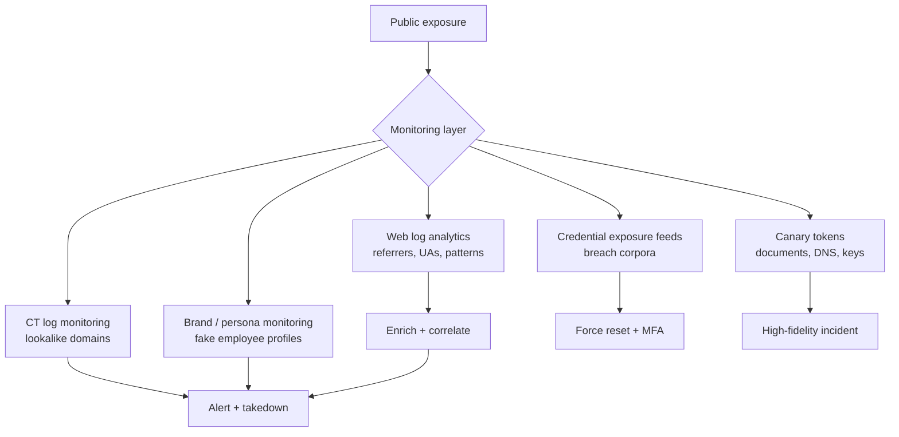

**Level:** Beginner · **Track:** Penetration Testing · **Read time:** 180 min

This is Chapter 3 of the Recon & OSINT notebook. Chapters 1 and 2 were about the target: what an attack surface is, and how WHOIS, DNS and Certificate Transparency turn one domain into a map of an organisation's infrastructure. This chapter turns the lens around and covers the part almost every beginner skips — the *investigator's* discipline. How you plan a collection effort, how you keep it from touching the target, how you keep your own identity out of the data you gather, and how you build and run the research personas that give you access to the platforms where the human-side intelligence actually lives.

The reason this chapter comes before the fun tooling chapters (dorking, subdomain enumeration, people search, social media) is simple: every one of those techniques is safe, repeatable and legally defensible *only* if the discipline underneath it is right. Get the discipline wrong and the same commands become an accidental tip-off to a target, an account ban that costs you a research identity you spent months building, a report full of screenshots no one can verify, or a very unpleasant conversation about the boundaries of an engagement.

---

## Part 1: What OSINT Actually Is

**OSINT — open-source intelligence — is intelligence produced from legally and publicly accessible information.** Three words in that definition each carry weight, and beginners routinely misread all three.

**"Open source"** does not mean "free software" and it does not mean "on Google". In the intelligence tradecraft sense, an open source is any source that is publicly available to a member of the public without circumventing an access control. That includes:

- Web pages, forum posts, social media profiles, and comments.
- Public registries: WHOIS/RDAP, corporate registries, court records, land records, patent and trademark databases, procurement portals.
- Broadcast and print media, including foreign-language media.
- Academic papers, conference talks, and preprints.
- Grey literature: job postings, RFPs, marketing decks, investor materials, conference sponsor lists.
- Machine-generated public data: Certificate Transparency logs, BGP route views, passive DNS, internet-wide scan datasets, code repositories and package registries.
- Paid-but-public commercial datasets: business intelligence platforms, aggregator databases, data brokers (with the caveat in Part 2).

What it explicitly does *not* include: anything behind an access control you are not authorised to pass. A password-protected portal is not an open source even if the password leaked. A private group you were not invited to is not an open source. A misconfigured S3 bucket sits in a genuinely grey area and is discussed in Part 2.

**"Intelligence"** is not "data". This is the distinction that separates a professional from someone who pastes 400 subdomains into a report. Intelligence is data that has been collected against a requirement, processed, corroborated, analysed, and delivered in a form that lets someone make a decision. Six hundred email addresses is data. "This organisation uses `first.last@` format, 31 of 40 identified staff in the engineering org have accounts on a breached forum, and the VPN portal at `vpn.example.com` accepts single-factor auth" is intelligence — it answers a question and drives an action.

**"Publicly accessible"** is a legal and ethical boundary, not a technical one. The fact that you *can* reach something does not make it open.

### The intelligence cycle applied to offensive security

The classic intelligence cycle is a five-phase loop. It looks bureaucratic until the first time you spend nine hours collecting the wrong thing, at which point it becomes the most valuable structure in this notebook.



**Direction.** Before opening a single tab, write down the questions you are answering. On a penetration test this maps directly to the rules of engagement: "identify externally reachable assets belonging to Example Corp", "identify employees with privileged IT roles for a phishing pretext", "identify credential exposure in public breach corpora". A requirement is testable — you can say whether you answered it. "Do recon on Example Corp" is not a requirement; it is a way to waste a week.

**Collection.** Gather against the requirement, from sources you record as you go. The chapters that follow this one are almost entirely collection technique.

**Processing.** Raw collection is messy: duplicate hostnames with different casing, names in three transliterations, timestamps in five time zones, PDFs that need text extraction, screenshots that need OCR. Processing is the unglamorous step where you normalise everything into a form you can query. In practice this means a consistent notes structure, consistent file naming, and text files rather than a folder of screenshots.

**Analysis.** Corroborate each fact with a second independent source where it matters. Pivot: every confirmed fact is a new seed. Assess confidence honestly — see Part 9 on confidence language.

**Dissemination.** The report. If the finding never reaches the person who can act on it, in a form they understand, the collection was recreational.

**Red team usage:** the cycle is how target development actually works on a red-team engagement. Direction comes from the objective ("obtain access to the payment processing environment"); collection builds the personnel and infrastructure picture; analysis produces the initial-access hypothesis (spear-phish the finance shared mailbox, or abuse the exposed Citrix gateway); dissemination is the attack plan you brief before executing.

**Blue team usage:** exactly the same loop runs defensively. Direction is "what does an attacker see when they look at us"; collection is running this notebook's techniques against your own organisation; analysis is prioritising the exposure; dissemination is a remediation ticket queue. Attack Surface Management as a product category is just this cycle, automated and sold.

### OSINT versus recon versus enumeration

These three words are used interchangeably by beginners and precisely by professionals.

| Term | Scope | Touches the target? | Typical output |
|---|---|---|---|
| **OSINT** | All publicly available information — people, organisations, infrastructure, documents | No | Personnel lists, org structure, breach exposure, document metadata, historical footprint |
| **Passive recon** | The infrastructure subset of OSINT | No | Domains, subdomains, IP ranges, ASNs, technologies |
| **Active recon** | Direct interaction with target systems | Yes | Live hosts, open ports, banners, HTTP responses |
| **Enumeration** | Deep, authenticated-or-anonymous extraction from an identified service | Yes, heavily | Usernames, shares, versions, directory listings, valid accounts |

OSINT is the superset that includes the human dimension. Passive recon (Chapter 2) is OSINT narrowed to infrastructure. Chapter 1 drew the passive/active line; this chapter is entirely on the passive side, and stays there.

---

## Part 2: The Legal and Ethical Frame

This section is not a disclaimer. It is operational: the boundaries below determine which techniques you may use on a given engagement, and getting them wrong is the single fastest way to convert a paid assessment into a legal problem.

### The authorisation question

Everything in offensive security divides into two categories: things you may do to anyone, and things you may do only to a party who has authorised you in writing.

- **Querying a public source about a target is generally lawful.** Reading a company's website, searching a name, pulling WHOIS, reading a public LinkedIn profile, downloading a public PDF — these are ordinary uses of public services.
- **Interacting with the target's systems is authorised-only.** Port scanning, directory brute-forcing, credential stuffing, sending a phishing email. Chapter 1 covered why the passive/active line matters legally; it matters here because OSINT chapters routinely tempt you across it (a "harmless" `curl` to check whether a subdomain is live is active).
- **Circumventing an access control is never in scope by default,** and in most jurisdictions is a criminal offence regardless of how weak the control is. Guessing a password, reusing leaked credentials, or altering a URL parameter to reach another user's data are all access-control circumvention.

### The specific grey areas you will hit

**Leaked credential corpora.** Public breach data is widely traded and widely used. Referencing that an address appears in a named breach is standard practice and is what services like Have I Been Pwned exist to report. *Using* a leaked password to log into anything is unauthorised access — full stop, and no engagement scope short of an explicit credential-stuffing authorisation covers it. Many programmes also forbid you from even holding plaintext breach passwords; check.

**Publicly exposed but clearly private data.** An open S3 bucket, an unauthenticated Elasticsearch index, a `.git` directory served by a web server. There is no access control, so the "circumvention" test is not met — but the data is obviously not intended to be public, and in several jurisdictions accessing it has still been prosecuted. Safe posture: confirm existence, capture minimum proof (a directory listing, a redacted key name), stop, report. Do not enumerate contents wholesale, do not download the dataset.

**Scraping.** Automated collection frequently breaches a platform's terms of service. ToS breach is a contract matter, not a criminal one in most places, but it will get accounts and IP ranges banned and can create civil exposure. Rate-limit, prefer official APIs, and know that "public" and "permitted to scrape" are different questions.

**Personal data.** GDPR and comparable regimes apply to processing personal data regardless of whether you obtained it publicly. Legitimate-interest processing for a contracted security assessment is generally defensible, but it obliges you to minimise what you collect, secure it, and delete it on schedule. Practically: do not collect employees' personal social accounts, home addresses, or family details unless the engagement genuinely requires it and the client has agreed. "It was public" is not a defence for building a dossier on someone's children.

**Minors and bystanders.** If collection surfaces information about minors or uninvolved third parties, stop collecting on that thread and note it. There is no offensive-security requirement that needs it.

### Scope hygiene on a real engagement

Before collection begins, get these in writing and keep them in the engagement folder:

| Item | Why it matters |
|---|---|
| In-scope domains, IP ranges, ASNs, cloud accounts | Prevents collecting on a similarly-named unrelated company |
| Explicit out-of-scope list (subsidiaries, third-party SaaS, partner domains) | Third-party SaaS is the most common accidental out-of-scope hit |
| Whether personnel/social OSINT is permitted, and to what depth | Determines whether Part 6's persona work is even needed |
| Whether breach-data lookup is permitted, and whether plaintext passwords may be retained | Frequently forbidden even when the rest of OSINT is allowed |
| Data handling: storage location, encryption, retention period, destruction method | Your obligation, and usually contractually specified |
| Named point of contact and an out-of-hours escalation path | For the moment you find something that cannot wait for the report |
| Deconfliction protocol | So your activity is not treated as a live intrusion |

**Bug bounty note:** every programme's policy page is the scope document, and OSINT-specific clauses are common — many programmes explicitly forbid social engineering of staff, and most forbid testing third-party services even when they carry the target's branding. Read the policy before collecting, not before submitting. A finding gathered outside policy is unpayable at best.

### Deconfliction

On authorised engagements, tell the client which infrastructure your traffic will come from and roughly when you will be working. This is called **deconfliction**, and it serves two purposes: their SOC does not spend a weekend on an incident that is you, and if a *real* intrusion happens during your window, both sides can quickly separate the two. Keep your own log of source IPs and activity times so you can answer "was this you?" precisely.

---

## Part 3: OPSEC — Your Own Attack Surface

**Operations security (OPSEC)** is a process, borrowed from military doctrine, for identifying information that an adversary could use against you and controlling it. For an OSINT investigator the "adversary" is the subject of your investigation, and the information at risk is anything that reveals who is asking, from where, on whose behalf, and how much you already know.

The formal five-step OPSEC process, applied:

1. **Identify critical information.** Your real identity; your employer or client; the target's identity (revealing *who you are looking at* can be as damaging as revealing who you are); the fact an investigation is happening at all; your methods and tooling.
2. **Analyse threats.** A bored teenager will not check their web logs. A competent corporate security team reviews unusual referrers, CT-log monitoring hits, and login attempts. A nation-state-adjacent or organised-crime target actively hunts investigators and may serve you tailored content or malware.
3. **Analyse vulnerabilities.** Every item in Part 4's leakage table.
4. **Assess risk.** Likelihood × impact. Tipping off a mature target during a red-team engagement destroys the engagement's value. Tipping off a criminal subject can be genuinely dangerous.
5. **Apply countermeasures.** Compartmentation, controlled egress, persona separation, and collection discipline — Parts 5 through 8.

### The two failure modes

Investigators fail in exactly two directions, and both are common.

**Under-doing it** is the beginner failure: logging into LinkedIn on your real account to view a target's staff, so the target's employees get a "someone from Acme Security viewed your profile" notification. Or running a tool with a default `User-Agent` of `Mozilla/5.0 (compatible; MyRecon/1.0)` against a target's assets. Or having your corporate laptop's DNS resolve target-controlled hostnames from the office egress IP.

**Over-doing it** is the intermediate failure, and it is underrated as a risk. Routing everything through Tor gets you CAPTCHAs on every page, blocked from most social platforms, and — importantly — makes you *stand out*. A residential-looking browser reading public pages at human speed is invisible; a Tor exit node hammering a site with a hardened, JavaScript-disabled browser is memorable. **OPSEC is about blending in, not about maximising anonymity.** Match your posture to the threat assessment from step 2.

### The compartmentation principle

The single most valuable habit is **compartmentation**: keeping identities, machines, network paths and data stores separated so that a failure in one does not expose the others.



Two rules make the diagram real:

- **No credential, browser profile, phone number, recovery address, or device is shared across compartments.** The moment persona A's recovery email is persona B's inbox, a platform can link them — and so can a subject who compromises one.
- **Each case gets its own container.** Ideally a separate VM snapshot or at minimum a separate browser profile and a separate data directory, so evidence from one client never appears in another's report and a malicious document from case 1 cannot read case 2's notes.

---

## Part 4: How Investigations Leak

This is the part to memorise. Everything below is a real, observed way that a passive-looking action tells the target you exist.

### The leakage vector table

| Vector | What leaks | Typical trigger | Countermeasure |
|---|---|---|---|
| **Source IP in web logs** | Your egress IP, ASN, geolocation, hosting provider | Any HTTP request to target-controlled infrastructure | Controlled egress (Part 5); avoid target-owned hosts entirely for passive work |
| **DNS resolution** | That someone queried a target-controlled name; resolver IP; timing | Resolving a hostname the target uniquely controls, including via a tool | Use public resolvers, prefer passive DNS datasets over live resolution |
| **HTTP `Referer` header** | The page you came from — often a search URL revealing your exact query | Clicking a link from a search result or an internal tool | `Referrer-Policy` control, open links in new tab from address bar, browser setting |
| **`User-Agent` and client hints** | Tool name and version; OS; browser build | Default tool UAs (`curl/8.5.0`, `python-requests/2.31.0`, scanner names) | Set a common browser UA; better, do not touch the target at all |
| **Platform view notifications** | Your real profile identity | Viewing a LinkedIn profile, a Strava segment, a story on Instagram | Persona accounts; privacy settings; avoid features that notify |
| **Follow/connect/like actions** | Direct interest signal from a named account | Any engagement action, including accidental double-tap on mobile | Read-only discipline; disable gestures |
| **Tracking pixels and web bugs** | That an email or document was opened, plus IP, client, time | Opening an HTML email or a "canary" document in a networked viewer | Block remote content; open unknown documents offline in a disposable VM |
| **Canary tokens** | Same as above; often deliberately planted | Opening a planted DOCX/PDF, browsing a planted URL, resolving a planted DNS name | Offline analysis first; `exiftool` before opening; no auto-open |
| **Certificate Transparency monitoring** | That you registered a lookalike domain for a phish or persona | Issuing a certificate for a domain resembling the target's | Expect it; time registrations well ahead; use unrelated naming |
| **Cache and browser fingerprint** | Persistent identity across sessions and personas | Reusing a browser profile across personas | Per-persona containers or per-persona VMs |
| **Account linkage signals** | Ties two personas together | Shared IP, shared phone, shared recovery mail, shared device, correlated login times | Strict compartmentation, staggered activity |
| **Purchase and payment trail** | Your real name via the payment instrument | Buying a domain, VPS, or premium account for a persona | Use client-approved corporate procurement, not personal cards |
| **Metadata in your own deliverables** | Your name, org, machine, file paths | Sending a report/screenshot without stripping metadata | `exiftool -all=` before delivery |
| **Search engine personalisation** | Nothing to the target, but corrupts your results | Logged-in search, prior search history | Separate profile, no login, note results may still differ |

### The `Referer` trap, concretely

You search a niche phrase, click through to a small target-run forum, and the forum's access log records:

```
203.0.113.44 - - [.....] "GET /threads/internal-tooling.42 HTTP/1.1" 200 18422
  "https://www.google.com/search?q=%22acme+corp%22+%22vpn%22+filetype%3Axlsx"
  "Mozilla/5.0 (Windows NT 10.0; Win64; x64) AppleWebKit/537.36"
```

The referrer string leaked your entire dork. A site owner reading that log now knows exactly what someone is hunting for. Modern browsers default to `strict-origin-when-cross-origin`, which trims the path and query for cross-origin navigations — but not all of them do in all contexts, and search engines often use redirector links that preserve intent. Habit to build: **copy the URL, open it in a fresh tab from the address bar**, or set the referrer policy explicitly.

In Firefox, `about:config` → `network.http.referer.XOriginPolicy = 2` (send referrer only on same-origin) and `network.http.referer.XOriginTrimmingPolicy = 2` (send origin only). Verify the change at a header-echo service before trusting it.

### Canary tokens and the "document you were meant to find"

A **canary token** is a deliberately planted artefact that phones home when used. They are cheap, free to generate, and increasingly common in mature environments — a fake credentials file named `aws_backup_keys.txt`, a Word document called `Q3_Salary_Review.docx`, a DNS name embedded in a PDF, an AWS access key that alerts on any API call.

The relevant behaviour for an investigator:

```bash
# NEVER open an unknown document in a networked application first.
# Inspect it offline, in a disposable VM, before anything else.

# 1. What is it really?
file suspicious_report.docx
# suspicious_report.docx: Microsoft Word 2007+

# 2. Metadata — authors, tools, timestamps, and sometimes template URLs
exiftool suspicious_report.docx

# 3. OOXML is a ZIP. List members; look for external relationships.
unzip -l suspicious_report.docx

# 4. Every remote reference lives in the .rels files and in field codes.
unzip -p suspicious_report.docx word/_rels/document.xml.rels | tr '>' '>\n' | grep -i "TargetMode=\"External\""
```

Realistic output from that last command on a tokenised document:

```xml
<Relationship Id="rId4" Type="http://schemas.openxmlformats.org/officeDocument/2006/relationships/image"
  Target="http://canarytokens.com/traffic/tags/8h2k9d1f0q/submit.aspx" TargetMode="External"/>
```

An external image relationship pointing at a tracking host is a canary. Opening that file in Word with images enabled would have sent your IP, user-agent and timestamp to whoever planted it. The same pattern appears in PDFs (`/URI` and `/OpenAction` entries), in HTML emails (remote `` tags), and in `.lnk` and `.url` files.

**Blue team usage:** this is exactly why defenders plant them, and it is a genuinely good control. A token in a share named like a credentials file costs nothing and detects an intruder browsing for secrets with near-zero false positives.

### Timing and volume as signals

Even without an identity leak, *patterns* identify you. Ten thousand requests at 3 a.m. local from one ASN, or activity that starts exactly at 09:00 and stops exactly at 17:30 in a specific time zone, narrows down who is looking. Where the threat model warrants it, spread collection, randomise intervals, and avoid working exclusively in your own business hours.

---

## Part 5: Building the Research Environment

The goal of the research environment is a machine and a network path that (a) cannot be traced to you personally, (b) cannot contaminate one case with another, and (c) can be destroyed and rebuilt in minutes if it is compromised.

### Layer 1: the isolated machine

Do the work in a **virtual machine**, never on the host you use for email and banking. A VM gives you three things that matter: snapshots (revert to clean after every case), isolation (a malicious document cannot trivially reach your host), and disposability.

Practical baseline on a Linux or Windows host with VirtualBox or VMware:

```bash
# Debian/Ubuntu host: install VirtualBox and the extension-pack-free basics
sudo apt update
sudo apt install -y virtualbox virtualbox-qt
# -y            assume yes to prompts
# virtualbox-qt provides the GUI manager

# Verify
vboxmanage --version
# 7.0.14r161095
```

VM configuration choices that are OPSEC decisions, not cosmetics:

| Setting | Recommended | Reason |
|---|---|---|
| Network adapter | NAT, or "Internal Network" behind a gateway VM | Bridged puts the VM directly on your LAN with its own visible MAC/IP |
| Shared folders | Disabled by default; enable read-only, per-case, only when needed | A shared folder is the easiest VM-to-host escape path for malware |
| Clipboard / drag-and-drop | Disabled | Prevents accidental paste of a real credential into a persona session, and vice versa |
| Snapshots | One "clean baseline" snapshot per persona | Revert after every case; destroys tracking cookies and any implant |
| Guest additions | Install only if you need them | They enlarge the guest-to-host attack surface |
| Time zone | Set to match the persona's claimed location | Browser JS reads the system time zone; a "Berlin" persona in UTC−5 is inconsistent |
| Locale/keyboard | Match the persona | `navigator.languages` is a fingerprint and a consistency check |

Two purpose-built distributions are worth knowing:

- **Kali Linux** — the general offensive-security distribution; comes with most of the recon toolchain preinstalled. Good as an investigation VM, though its default browser fingerprint and user list are distinctive.
- **Tails** — a live, amnesic OS that routes everything through Tor and forgets on shutdown. Correct choice when the threat model is high and persistence is a liability; wrong choice for routine corporate OSINT because it is slow, CAPTCHA-heavy, and cannot maintain persona sessions.
- **Trace Labs OSINT VM** — a Kali derivative curated for OSINT work with the collection tooling and note-taking stack already installed. Excellent starting baseline for this chapter's discipline.

### Layer 2: controlled egress

"Controlled egress" means you decide which IP address the world sees, and that address is not your home or office.



Comparing the options honestly:

| Egress | Anonymity | Blends in? | Speed | Persona-safe? | Best for |
|---|---|---|---|---|---|
| Home/office IP | None | Yes | High | No | Nothing. Never for target-facing work |
| Commercial VPN | Moderate — provider knows you | Poorly; datacentre ranges are flagged and often blocked | High | Marginal; many platforms block on signup | Reading public pages, general browsing |
| Dedicated VPS + WireGuard | Moderate; stable, attributable to whoever paid | Datacentre range, but consistent | High | Yes, if consistent per persona | Long-lived personas, deconflicted engagement traffic |
| Mobile/residential connection | Low technical anonymity, high blend | Excellent — platforms trust them | Medium | Yes | Account creation and persona maintenance |
| Tor | High | Badly — widely blocked, heavily CAPTCHA'd, and conspicuous | Low | No — most platforms block signup outright | High-threat, read-only, low-volume collection |

**The consistency rule matters more than the anonymity rule.** Platforms flag accounts whose IP jumps between countries, and they flag datacentre ranges at signup far more aggressively than during ordinary use. A persona that always appears from the same city looks like a person; a persona that appears from Frankfurt, then São Paulo, then Singapore in one afternoon looks like exactly what it is.

Setting up WireGuard from the VM to your own VPS, from scratch:

```bash
# --- On the VPS (Debian 12) ---
sudo apt update && sudo apt install -y wireguard
umask 077
wg genkey | tee server.key | wg pubkey > server.pub
# wg genkey  : generate a Curve25519 private key
# tee        : write it to disk AND pass it on
# wg pubkey  : derive the public key from the private key on stdin

cat << 'EOF' | sudo tee /etc/wireguard/wg0.conf
[Interface]
Address = 10.66.66.1/24
ListenPort = 51820
PrivateKey = <contents of server.key>
PostUp   = iptables -t nat -A POSTROUTING -o eth0 -j MASQUERADE
PostDown = iptables -t nat -D POSTROUTING -o eth0 -j MASQUERADE

[Peer]
PublicKey = <client public key>
AllowedIPs = 10.66.66.2/32
EOF

sudo sysctl -w net.ipv4.ip_forward=1          # enable routing between interfaces
sudo systemctl enable --now wg-quick@wg0      # start now and at boot
sudo wg show                                   # verify the interface and peers
```

```bash
# --- On the investigation VM ---
sudo apt install -y wireguard resolvconf
sudo tee /etc/wireguard/case.conf > /dev/null << 'EOF'
[Interface]
Address = 10.66.66.2/32
PrivateKey = <client private key>
DNS = 9.9.9.9

[Peer]
PublicKey = <server public key>
Endpoint = 198.51.100.20:51820
AllowedIPs = 0.0.0.0/0, ::/0
PersistentKeepalive = 25
EOF

sudo wg-quick up case
# AllowedIPs = 0.0.0.0/0 sends ALL traffic over the tunnel (full tunnel)
# DNS = 9.9.9.9 forces resolution through the tunnel, preventing DNS leaks
# PersistentKeepalive keeps NAT mappings alive on the VM's side
```

**Always verify the tunnel before touching anything case-related:**

```bash
curl -s https://ifconfig.co/json | jq '{ip, country, asn_org}'
```

```json
{
  "ip": "198.51.100.20",
  "country": "Germany",
  "asn_org": "EXAMPLE-HOSTING-GMBH"
}
```

If that IP is your home address, stop and fix the tunnel before opening a browser. Build the habit of running this as the first command of every session — a single-line shell function is enough:

```bash
# add to ~/.bashrc in the investigation VM
whoami-net() { curl -s https://ifconfig.co/json | jq -r '"\(.ip)  \(.country)  \(.asn_org)"'; }
```

### Layer 3: DNS and leak testing

A full-tunnel VPN still leaks if the resolver is configured outside the tunnel, or if the browser uses its own DNS-over-HTTPS setting, or if IPv6 is enabled and unrouted.

```bash
# What resolver is actually in use?
resolvectl status | grep -A3 "Current DNS"
# Or on non-systemd setups:
cat /etc/resolv.conf

# Does a lookup travel through the tunnel? Watch the interface while resolving.
sudo tcpdump -ni wg0 port 53 -c 5
# -n  do not resolve names in output (avoids recursive lookups polluting the capture)
# -i  interface
# -c  stop after N packets
```

```
listening on wg0, link-type RAW (Raw IP), snapshot length 262144 bytes
10.66.66.2.51423 > 9.9.9.9.53: 41237+ A? example.com. (29)
9.9.9.9.53 > 10.66.66.2.51423: 41237 1/0/0 A 93.184.216.34 (45)
```

If those packets appear on `eth0` instead of `wg0`, you have a DNS leak. Disable IPv6 in the VM unless the tunnel carries it:

```bash
sudo sysctl -w net.ipv6.conf.all.disable_ipv6=1
sudo sysctl -w net.ipv6.conf.default.disable_ipv6=1
```

Then confirm from the browser side with a leak-test page and a fingerprint check — the browser can disagree with the OS.

### Layer 4: browser hygiene

The browser is where nearly all OSINT collection happens and where nearly all identity leaks originate.

**Firefox with Multi-Account Containers** is the practical workhorse. Containers give each persona its own cookie jar, localStorage, and session storage inside one browser window, so you can be logged into three personas on one platform simultaneously without cross-contamination.

Setup and the settings that matter:

1. Install **Firefox Multi-Account Containers** and create one container per persona, colour-coded. Colour-coding is not decoration — it is the visual check that stops you posting from the wrong identity.
2. Install **uBlock Origin** for tracker blocking (and, usefully, to stop remote images in unknown pages phoning home).
3. `about:preferences#privacy` → Enhanced Tracking Protection: **Strict**.
4. Cookies: block cross-site tracking cookies. Do **not** clear cookies on shutdown for persona containers — persona sessions need continuity to look human.
5. `about:config` → set the referrer policy values from Part 4.
6. Disable `geo.enabled` unless the persona needs a location.
7. Leave `privacy.resistFingerprinting` **off** for persona work. It is excellent for anonymity and terrible for blending in: it makes you look like a Tor Browser user, breaks sites, and is itself a highly distinctive signal.

Containers do not isolate everything. They share the same browser fingerprint (canvas, fonts, WebGL, screen size, time zone) and the same IP. For personas that must never be linked, use **separate VMs**, not separate containers.

| Isolation method | Cookies | Fingerprint | IP | Effort | Use when |
|---|---|---|---|---|---|
| Private window | Separate per session | Shared | Shared | None | One-off anonymous page view |
| Firefox container | Separate | Shared | Shared | Low | Multiple personas, low linkage risk |
| Separate browser profile | Separate | Mostly shared | Shared | Low | Persona separation with different extensions |
| Separate VM + separate egress | Separate | Separate | Separate | High | Personas that must never be linked |
| Separate physical device + mobile data | Separate | Separate | Separate | Very high | High-threat subjects |

---

## Part 6: Sock Puppets — Design Before Creation

A **sock puppet** (also "research persona", "covert account", "alias account") is a non-attributable identity used to access sources that require registration, or to observe communities without exposing the investigator. They exist because a large share of useful intelligence sits behind a login: professional networks, forums, group chats, marketplaces, community platforms.

Two boundaries define lawful, professional use, and they are not optional:

- **A persona is a fictional person, never an impersonation of a real one.** Never use a real person's name, photograph, or identity documents. That crosses from research tradecraft into identity fraud, and in many jurisdictions it is a criminal offence with no security-testing exemption.
- **Passive observation and active engagement are different activities requiring different authorisation.** Reading a public group with a persona account is routine research. Messaging an employee to elicit information is *social engineering* — it requires explicit written authorisation in the engagement scope, and it is out of bounds on the majority of bug bounty programmes.

Everything below assumes you have the authorisation for the depth of use you intend.

### The persona design document

Design on paper before creating anything. An underdeveloped persona is worse than none: a two-week-old empty profile viewing forty staff profiles is a louder signal than your real account would have been.



The **legend** is the persona's backstory. Write it down and keep it with the case file, because you will need to answer questions consistently months later.

| Attribute | Guidance | Common mistake |
|---|---|---|
| Name | Common in the claimed locale; check it is not a real notable person | Distinctive or "cool" names that are memorable and searchable |
| Age / DOB | Consistent with claimed career length; must satisfy platform minimums | DOB that makes the persona 19 with 12 years of experience |
| Location | A real city you can describe; matches egress and time zone | Location inconsistent with the IP the account logs in from |
| Occupation | Adjacent to the target community but boring and unverifiable | Claiming a role at a real, small, checkable company |
| Employer | A generic sector description or a plausibly large employer | Naming a real company where members might know everyone |
| Education | Large institution, plausible dates | Small programme where cohorts know each other |
| Interests | Two or three, enough to justify group membership | None — a profile with no interests reads as fake |
| Photo | See below | A real person's photo scraped from anywhere |
| Writing voice | Fixed register, vocabulary, punctuation habits, emoji use | Voice drifting between personas, or matching your own writing style |
| Contact primitives | Dedicated email, dedicated number, dedicated egress | Reusing your own recovery address "just for setup" |

### The photograph problem

Do not use a real person's photograph. Beyond the ethics, reverse image search makes it a fast way to get burned and a fast way to harm an uninvolved person.

Realistic options, in rough order of preference:

1. **No photo, or a non-face image.** Many platforms tolerate a landscape, an abstract avatar, or initials. The most defensible option, and often sufficient.
2. **A photograph you own** of something neutral — a bookshelf, a coastline — that contains no identifying detail and whose metadata you have stripped.
3. **Synthetic faces.** GAN-generated portraits are widely used. Be aware that they are increasingly detectable: characteristic artefacts around ears, teeth, backgrounds and accessories, and — critically — the eyes tend to sit in a fixed position across generated images, which is a well-known detector. Platforms also run their own detection.
4. **Licensed stock photography** is a trap: it is indexed everywhere and reverse-searches instantly.

Whatever you use, strip metadata before upload:

```bash
exiftool -all= -overwrite_original avatar.jpg
# -all=              remove all writable metadata tags
# -overwrite_original edit the file in place rather than leaving avatar.jpg_original

exiftool avatar.jpg   # verify: should show only file system + basic image tags
```

```
ExifTool Version Number         : 12.76
File Name                       : avatar.jpg
File Size                       : 84 kB
File Type                       : JPEG
Image Width                     : 512
Image Height                    : 512
```

No `GPS Position`, no `Camera Model Name`, no `Artist`, no `Software` — that is the state you want.

---

## Part 7: Provisioning and Operating a Persona

Design is Part 6. This part is the operational build and the maintenance that keeps a persona alive.

### Identity primitives

Every persona needs its own set of the following, and none may be shared with you or with another persona.

| Primitive | Requirement | Notes |
|---|---|---|
| Email address | Dedicated mailbox, no recovery path to you | A paid provider on a neutral domain looks more legitimate than a throwaway; disposable-mail domains are widely blocklisted at signup |
| Phone number | Dedicated, capable of receiving SMS, and *stable* | The hardest primitive to get right; see below |
| Egress | Consistent geography matching the legend | Part 5 |
| Browser context | Dedicated container or VM | Part 5 |
| Payment method | Corporate/prepaid, procured through the engagement — never a personal card | Only needed for platforms requiring payment |
| Device fingerprint | Consistent per persona | Do not swap between VM and phone mid-life for one persona |

**On phone numbers:** free online SMS-receive sites are public — anyone can read the inbox, the numbers are recycled, and they are on every platform's blocklist. They will burn a persona and can expose an account to takeover by whoever gets the number next. The workable options are a dedicated prepaid SIM procured through the engagement, or a reputable paid VoIP/number service that supports long-term ownership. Note that many major platforms actively block VoIP ranges for verification. Whatever you choose, **the number must remain under your control for the persona's life** — losing it means losing account recovery.

### Ageing

A newly created account is the least useful account. Platforms weight account age, and communities notice new arrivals. Ageing is deliberate, low-effort activity over weeks that turns a shell into something unremarkable.

A realistic ageing schedule:

```
Week 0    Create account. Fill only the minimum. No profile photo yet.
          Log in once. Log out. Do nothing else.
Week 1    Log in twice. Follow 5-10 large, generic, non-target accounts
          (news outlets, sports teams, well-known brands).
Week 2    Add profile photo and a one-line bio. Join 1-2 large public groups
          unrelated to the target.
Week 3-4  Passive reading only. Occasional like on a mainstream post.
          Establish a consistent login pattern (e.g. weekday evenings, one TZ).
Week 5-6  Join one community adjacent to the target's sector.
          Post one or two innocuous, on-topic comments if the platform expects it.
Week 7+   Operational. Begin target-adjacent collection at normal human pace.
```

The instinct to skip this is strong and it is wrong. A persona built in an afternoon and pointed at a target is detected by the target's own security team more often than beginners believe — profile-view notifications are a standard signal in mature security awareness programmes.

**Behavioural consistency is the whole game.** Log in at consistent local hours. Do not read 300 profiles in ten minutes. Do not have three personas log in from the same IP within the same minute. Keep the writing voice fixed — style is a fingerprint, and stylometry is a real technique.

### Operating rules

- **Read-only by default.** Every like, follow, connect, comment and view-with-notification is a signal. Assume all engagement is logged and attributable.
- **Never cross-log.** Do not log into persona A inside persona B's container. Platforms detect shared devices and cookies and will link (and often ban) both.
- **Never link to your real identity.** No contacts imported, no "people you may know" acceptance, no address book sync — especially not on mobile, where an app can and will read the whole contact list and offer your personas to your real friends.
- **Do not answer unexpected verification prompts under time pressure.** If a platform demands ID verification, the persona is finished. Do not escalate; retire it.
- **Log everything.** Every persona has a record: creation date, platform list, credentials in a password manager, legend, egress used, and a running activity log.

### Burn and retirement

A persona is **burned** when it is banned, challenged for identity documents, publicly identified as fake, linked to another persona, or simply reaches the end of a case. Handle it deliberately:

1. Stop using it immediately — do not "test whether it still works" from an operational context.
2. Record what happened, when, and the suspected cause. This is how the next persona survives longer.
3. Preserve any evidence already collected through it, with its provenance intact (Part 9).
4. Do not delete the account reflexively; deletion can itself be a signal, and the account may be referenced in a report.
5. Retire the primitives with it — the number and email go with the persona, they are not recycled.

---

## Part 8: The Discipline Toolchain

These are the tools that support the *process*, as opposed to the collection tools in later chapters. Each is taught from zero on first appearance, per the rule that you should never see an unexplained tool name in these notes.

### `exiftool` — metadata read and strip

**What it is.** A Perl application and library by Phil Harvey that reads, writes and deletes metadata in almost every file format that carries it: JPEG/PNG/TIFF EXIF, PDF XMP and DocInfo, Office OOXML properties, audio and video tags. In OSINT it plays two roles: extracting intelligence from files you collect, and sanitising files you produce.

```bash
sudo apt update && sudo apt install -y libimage-exiftool-perl
exiftool -ver
# 12.76
```

Core usage:

```bash
exiftool report.pdf                     # dump all readable metadata
exiftool -G1 -a -s report.pdf           # -G1 group names, -a duplicate tags, -s tag IDs
exiftool -Author -Creator -Producer report.pdf   # only named tags
exiftool -r -ext pdf -Author -Creator ./downloads/   # -r recurse a directory tree
exiftool -csv -r -ext docx ./docs/ > meta.csv       # machine-readable bulk export
exiftool -all= -overwrite_original deliverable.pdf  # strip everything before delivery
```

Realistic output from a PDF pulled off a target's website:

```
[ExifTool]      ExifTool Version Number         : 12.76
[File]          File Name                       : q3-infrastructure-overview.pdf
[PDF]           Creator                         : Microsoft® Word for Microsoft 365
[PDF]           Author                          : j.okafor
[PDF]           Company                         : Example Corp
[PDF]           Create Date                     : 2024:06:11 09:41:07+01:00
[PDF]           Producer                        : Microsoft® Word for Microsoft 365
[XMP-xmpMM]     Document ID                     : uuid:5f3a1b2c-...
```

That single file yielded a username format (`j.okafor` → `first-initial.lastname`), an internal timezone (`+01:00`), and confirmation of the Office 365 estate. This is the highest-value, lowest-effort passive technique in existence, and it is why Part 9 insists you archive the original file, not just the screenshot.

**Blue team usage:** run `exiftool -r -csv` across your own public web root and see what your document pipeline is publishing. Then fix it at the publishing stage — most CMS and PDF pipelines can strip document properties automatically.

### `keepassxc` — credential and persona management

**What it is.** An offline, open-source password manager storing an encrypted KDBX database. Preferred over cloud managers for persona work because the database is a file you control, can keep per-case, and can store inside an encrypted case volume.

```bash
sudo apt install -y keepassxc
keepassxc-cli --version
```

Command-line usage is convenient for scripted checks:

```bash
keepassxc-cli db-create -p ~/cases/acme/personas.kdbx    # -p prompt for a password
keepassxc-cli add -u persona-a ~/cases/acme/personas.kdbx "Platforms/LinkedIn"
keepassxc-cli show -s ~/cases/acme/personas.kdbx "Platforms/LinkedIn"   # -s show secrets
```

Store more than the password. Use the notes field for the persona's legend, creation date, egress used, verification method, and current status — one entry per account, so the whole persona is documented where the credentials live.

### Note-taking: Obsidian, CherryTree, or plain Markdown

**What they are.** Obsidian is a local-first Markdown knowledge base with bidirectional links and a graph view; CherryTree is a hierarchical notes application with rich text and code blocks, and ships in the Trace Labs OSINT VM. Either works; plain Markdown files in a git repository also works and is the most portable.

What matters is not the tool but the structure. A workable case tree:

```
cases/acme-2024-q3/
├── 00-scope/            # RoE, authorisation email, scope list, policy PDF
├── 01-notes/            # daily working notes, one file per collection session
│   ├── 2024-06-11-session.md
│   └── entities/        # one note per person, domain, org — the pivot graph
├── 02-evidence/         # originals only, never edited
│   ├── screenshots/
│   ├── documents/
│   └── evidence-log.csv
├── 03-processing/       # normalised lists: domains.txt, emails.txt, hosts.csv
└── 04-report/           # drafts and final deliverable
```

The entity-per-note pattern is what makes pivoting work: each person, domain and organisation gets a note, each note links to the notes it relates to, and the graph shows you connections you did not consciously make.

### Hunchly — automated capture

**What it is.** A commercial browser extension that silently captures every page you visit during an investigation to a local, timestamped, hashed archive, along with the full page source, and lets you tag pages and export a case. It exists because manual screenshotting is unreliable and because pages change or disappear.

If you cannot use commercial tooling, approximate it:

```bash
# Full-page archive with wget
wget --page-requisites --convert-links --adjust-extension --no-parent \
     --user-agent="Mozilla/5.0 (Windows NT 10.0; Win64; x64) AppleWebKit/537.36" \
     -P ./02-evidence/web/ "https://example.com/about/team"
# --page-requisites   also fetch images/CSS/JS needed to render
# --convert-links     rewrite links for offline viewing
# --adjust-extension  save as .html even if the URL has no extension
# --no-parent         do not ascend above the given directory
# -P                  output directory prefix
```

Note the OPSEC caveat: `wget` against the target's own site is **active**. Use archive services for target-owned content during passive phases, and reserve direct fetching for the active phase or for third-party sources.

### Archiving and the Wayback Machine

**What it is.** The Internet Archive's Wayback Machine stores historical snapshots of web pages. Two uses: retrieving content the target has removed, and creating a citable, third-party-timestamped record of a page as it existed.

```bash
# Query the CDX index API for every capture of a host
curl -s "http://web.archive.org/cdx/search/cdx?url=example.com/*&output=json&fl=original,timestamp,statuscode&collapse=urlkey&limit=20"
```

```json
[["original","timestamp","statuscode"],
 ["http://example.com/","20130817032614","200"],
 ["http://example.com/careers/devops-engineer","20190402114530","200"],
 ["http://example.com/internal/vpn-setup.pdf","20200114091202","200"]]
```

That third row is the pattern to look for: a document removed from the live site but preserved in the archive. Requesting it from `web.archive.org` is passive — the target's server never sees you.

### Tool summary

| Tool | Category | Install | Primary use in this chapter |
|---|---|---|---|
| `exiftool` | Metadata | `apt install libimage-exiftool-perl` | Extract intel from collected files; strip metadata from deliverables and avatars |
| `keepassxc` | Credential store | `apt install keepassxc` | Per-case persona and credential documentation |
| `wireguard` | Egress | `apt install wireguard` | Controlled, consistent egress from the investigation VM |
| `tcpdump` | Leak testing | `apt install tcpdump` | Prove DNS and traffic are inside the tunnel |
| `jq` | Processing | `apt install jq` | Parse JSON from IP-check, CDX and other APIs |
| Firefox + Multi-Account Containers | Browser isolation | Add-on | Per-persona cookie separation |
| uBlock Origin | Browser hygiene | Add-on | Block trackers and remote content |
| Obsidian / CherryTree | Notes | Package or AppImage | Case structure, entity notes, pivot graph |
| Hunchly | Capture | Commercial | Automatic hashed capture of every page visited |
| `wget` | Capture | `apt install wget` | Offline archival of non-target pages |

---

## Part 9: Collection Discipline and Evidence Handling

Collection without discipline produces a folder of screenshots that nobody, including you in three weeks, can interpret. This part is what makes a finding *defensible*.

### Capture the original, not the impression

For every artefact, capture in this order:

1. **The URL**, complete, including query parameters.
2. **The timestamp** of collection, in UTC, with your local offset noted.
3. **The original file** where one exists — the PDF, the image, the JSON response. Not a screenshot of it.
4. **A screenshot** as a human-readable rendering, in addition to the original.
5. **A hash** of the original file, so you can prove it has not changed.

```bash
# Hash every evidence file and record it
find ./02-evidence -type f -exec sha256sum {} \; | tee ./02-evidence/hashes.txt
```

```
9f2c4e5d1b7a3f8e0c6d2a4b8e1f3c5d7a9b0e2f4c6d8a0b2e4f6c8d0a2b4e6f  ./02-evidence/documents/q3-infrastructure-overview.pdf
3a1b5c9d7e2f4a6b8c0d2e4f6a8b0c2d4e6f8a0b2c4d6e8f0a2b4c6d8e0f2a4b  ./02-evidence/screenshots/careers-page.png
```

Re-running that command later and diffing against `hashes.txt` proves nothing was altered mid-engagement. This is the lightweight version of **chain of custody** — the documented record of who held evidence, when, and what was done to it. Full legal chain of custody is a forensics topic, but even on a routine penetration test, being able to say "this file, this hash, collected at this time, from this URL" is what makes a report credible when a client disputes a finding.

### The evidence log

A single CSV alongside the evidence directory, one row per artefact:

| Field | Example |
|---|---|
| `id` | `EV-014` |
| `collected_utc` | `2024-06-11T13:42:07Z` |
| `source_url` | `https://example.com/docs/q3-infrastructure-overview.pdf` |
| `source_type` | `target website` / `third-party archive` / `platform profile` / `public registry` |
| `method` | `browser (persona A)` / `direct download` / `archive.org` |
| `filename` | `02-evidence/documents/q3-infrastructure-overview.pdf` |
| `sha256` | `9f2c4e...` |
| `requirement` | `R2 — identify username format` |
| `notes` | `Author field j.okafor; confirms first-initial.lastname` |
| `confidence` | `High` |

The `requirement` column is the one people omit and the one that saves the engagement — it forces every artefact to justify its existence against Part 1's direction phase, and at report time it groups your evidence by the question it answers.

### Corroboration and confidence

A single source is a hypothesis. Two independent sources is a finding.

"Independent" is doing work in that sentence. Three data-broker sites that all resold the same underlying record are one source, not three. A LinkedIn profile and a conference speaker bio written by the same person are weakly independent. A username format inferred from a document's `Author` field and confirmed by an email address in a public mailing-list archive is genuinely two sources.

Use explicit confidence language and stick to it:

| Confidence | Meaning | Example |
|---|---|---|
| **Confirmed** | Directly observed, or corroborated by two independent sources | Two documents by different authors both showing `first.last@example.com` |
| **High** | Single strong source, consistent with everything else known | Username format from one PDF, no contradicting data |
| **Moderate** | Reasonable inference from indirect evidence | Guessing MFA is absent because the login page shows no second-factor field |
| **Low** | Plausible, uncorroborated | A single aggregator entry claiming an employment relationship |
| **Unverified** | Recorded but untested | A name from a scraped list |

Never let a moderate-confidence inference become a confirmed fact by being restated three times in a report. Analysts call this **circular reporting**, and it is the most common way an OSINT report goes wrong: your own earlier assumption comes back as apparent corroboration.

### Two biases to actively counter

**Confirmation bias.** Once you believe the target uses `first.last@`, every ambiguous data point will look like it fits. Countermeasure: explicitly write down what evidence would *disprove* your hypothesis, and go look for it.

**Attribution error.** Two accounts with the same unusual username are probably the same person — but "probably" is not "certainly", and username reuse assumptions have produced real, damaging misidentifications. Countermeasure: require a second, independent linking factor (a shared photo, a self-reference, a corroborating timeline) before asserting identity.

---

## Part 10: Hands-On Lab — Stand Up a Compartmented Investigation

This lab builds the full environment from nothing and runs a leak-tested passive collection pass. Everything targets `example.com` (IANA's reserved documentation domain) and your own infrastructure, so the lab is safe to run as written. Substitute an authorised target only when you have written scope.

**Objective (the Direction phase):** stand up an isolated, leak-free investigation environment; provision one documented research persona; run a passive collection pass against a domain; produce a hashed evidence set and a short finding with stated confidence.

### Step 1 — Build the case structure

```bash
CASE=~/cases/lab-2024-01
mkdir -p "$CASE"/{00-scope,01-notes/entities,02-evidence/{screenshots,documents,web},03-processing,04-report}
cd "$CASE"

cat > 00-scope/requirements.md << 'EOF'
# Collection Requirements
R1  Identify the domains and subdomains in scope.
R2  Determine the organisation's email/username format.
R3  Identify publicly exposed documents and their metadata.
R4  Record any employee-identifying information ONLY if permitted by scope.
Out of scope: any interaction with target-owned systems; any authentication attempt.
EOF

cat > 02-evidence/evidence-log.csv << 'EOF'
id,collected_utc,source_url,source_type,method,filename,sha256,requirement,notes,confidence
EOF

tree -L 2 "$CASE"
```

```
/home/analyst/cases/lab-2024-01
├── 00-scope
│   └── requirements.md
├── 01-notes
│   └── entities
├── 02-evidence
│   ├── documents
│   ├── evidence-log.csv
│   ├── screenshots
│   └── web
├── 03-processing
└── 04-report
```

### Step 2 — Verify egress before anything else

```bash
whoami-net() { curl -s https://ifconfig.co/json | jq -r '"\(.ip)  \(.country)  \(.asn_org)"'; }
whoami-net
```

```
198.51.100.20  Germany  EXAMPLE-HOSTING-GMBH
```

Non-negotiable gate: if that line shows your home ISP, stop. Bring the tunnel up (`sudo wg-quick up case`) and re-run.

### Step 3 — Prove there is no DNS leak

```bash
# Terminal 1: watch the tunnel interface
sudo tcpdump -ni wg0 port 53 &

# Terminal 2: force a resolution
dig +short example.com A
```

```
[tcpdump]
10.66.66.2.54312 > 9.9.9.9.53: 33711+ A? example.com. (29)
9.9.9.9.53 > 10.66.66.2.54312: 33711 1/0/0 A 93.184.216.34 (45)

[dig]
93.184.216.34
```

Now the negative control — confirm nothing is escaping the physical interface:

```bash
sudo timeout 10 tcpdump -ni eth0 port 53
```

```
listening on eth0, link-type EN10MB (Ethernet), snapshot length 262144 bytes
0 packets captured
```

Zero packets on `eth0` is the result you want. If you see DNS there, the browser's own DoH setting or a stale `resolv.conf` is bypassing the tunnel.

### Step 4 — Confirm the browser agrees with the OS

```bash
curl -s -H "User-Agent: Mozilla/5.0 (X11; Linux x86_64) AppleWebKit/537.36 (KHTML, like Gecko) Chrome/120.0.0.0 Safari/537.36" \
     https://httpbin.org/headers | jq
```

```json
{
  "headers": {
    "Accept": "*/*",
    "Host": "httpbin.org",
    "User-Agent": "Mozilla/5.0 (X11; Linux x86_64) AppleWebKit/537.36 (KHTML, like Gecko) Chrome/120.0.0.0 Safari/537.36"
  }
}
```

Then load a header-echo page in the actual browser and compare: the browser must not be sending a distinctive UA, a `Referer` you did not intend, or a `DNT`/client-hint combination that is unusual. Record the observed fingerprint in the persona's KeePassXC note so you can reproduce it later.

### Step 5 — Provision and document the persona

```bash
keepassxc-cli db-create -p 01-notes/personas.kdbx
keepassxc-cli add -u "r.lindqvist" 01-notes/personas.kdbx "Personas/Persona-A/Email"
```

Then write the legend as an entity note — this is the artefact you will actually reread:

```bash
cat > 01-notes/entities/persona-a.md << 'EOF'
# Persona A — R. Lindqvist

- Status: seeding (created week 0)
- Legend: 34, based Gothenburg SE, logistics coordinator, generic mid-size employer
- Time zone: Europe/Stockholm  (VM clock set to match)
- Locale: en-GB, keyboard SE
- Egress: WireGuard -> VPS DE (198.51.100.20) — consistent, never changed
- Browser: Firefox container "Persona A" (blue), uBlock Origin, RFP OFF
- Email: dedicated mailbox, no recovery path to operator
- Phone: dedicated prepaid, engagement-procured, retained for persona lifetime
- Photo: none at week 0; neutral non-face image planned week 2
- Voice: plain, few contractions, no emoji, British spelling
- Ageing log:
  - W0  account created, minimum profile, single login
  - W1  followed 6 mainstream accounts, 2 logins
- Authorised use: PASSIVE OBSERVATION ONLY. No messaging, no connection
  requests. Engagement scope does not authorise social engineering.
EOF
```

Note the last two lines. Writing the authorisation boundary into the persona file itself means the constraint is in front of you every time you open it.

### Step 6 — Passive collection pass

Nothing here touches the target. Start with the archive index rather than the live site:

```bash
curl -s "http://web.archive.org/cdx/search/cdx?url=example.com*&output=json&fl=original,timestamp,mimetype,statuscode&collapse=urlkey&filter=mimetype:application/pdf&limit=10" | jq -r '.[] | @tsv'
```

```
original	timestamp	mimetype	statuscode
http://example.com/docs/q3-infrastructure-overview.pdf	20240611094107	application/pdf	200
http://example.com/hr/onboarding-checklist.pdf	20230902141122	application/pdf	200
```

Fetch from the archive, not the origin:

```bash
wget -q -P 02-evidence/documents/ \
  "https://web.archive.org/web/20240611094107id_/http://example.com/docs/q3-infrastructure-overview.pdf"
# id_  requests the ORIGINAL bytes without the Wayback toolbar injection —
#      essential, because an injected page changes the file's hash and metadata
ls -l 02-evidence/documents/
```

```
-rw-r--r-- 1 analyst analyst 418233 Jun 11 13:42 q3-infrastructure-overview.pdf
```

### Step 7 — Extract intelligence from the artefact

```bash
exiftool -G1 -a -s 02-evidence/documents/q3-infrastructure-overview.pdf | grep -Ei "author|creator|producer|company|date|title"
```

```
[PDF]           Title                           : Q3 Infrastructure Overview
[PDF]           Author                          : j.okafor
[PDF]           Creator                         : Microsoft® Word for Microsoft 365
[PDF]           Producer                        : Microsoft® Word for Microsoft 365
[PDF]           Company                         : Example Corp
[PDF]           CreateDate                      : 2024:06:11 09:41:07+01:00
[PDF]           ModifyDate                      : 2024:06:11 10:02:55+01:00
```

Four findings from one file, and each maps to a requirement:

| Observation | Requirement | Inference | Confidence |
|---|---|---|---|
| `Author: j.okafor` | R2 | Username format is `first-initial.lastname` | High — single source |
| `Creator: Word for Microsoft 365` | R3 | Microsoft 365 estate; likely Entra ID and Exchange Online | High |
| `CreateDate +01:00` | R3 | Primary operating time zone is UTC+1 | Moderate — author may be remote |
| `Company: Example Corp` | R1 | Confirms document ownership | Confirmed |

Now corroborate R2 rather than accepting it. A second, independent source — say, a public mailing-list archive showing `a.mensah@example.com` — turns "High" into "Confirmed". Without it, the report must say High.

### Step 8 — Hash, log, and close the session

```bash
find 02-evidence -type f ! -name hashes.txt ! -name evidence-log.csv -exec sha256sum {} \; > 02-evidence/hashes.txt

printf 'EV-001,%s,%s,%s,%s,%s,%s,%s,%s,%s\n' \
  "$(date -u +%Y-%m-%dT%H:%M:%SZ)" \
  "https://web.archive.org/web/20240611094107id_/http://example.com/docs/q3-infrastructure-overview.pdf" \
  "third-party archive" "wget via case tunnel" \
  "02-evidence/documents/q3-infrastructure-overview.pdf" \
  "$(sha256sum 02-evidence/documents/q3-infrastructure-overview.pdf | cut -d' ' -f1)" \
  "R2,R3" "Author j.okafor; M365; TZ +01:00" "High" >> 02-evidence/evidence-log.csv

column -s, -t 02-evidence/evidence-log.csv
```

```
id      collected_utc         source_url                    source_type          method              filename                                     sha256    requirement  notes                              confidence
EV-001  2024-06-11T13:51:02Z  https://web.archive.org/...   third-party archive  wget via case tunnel 02-evidence/documents/q3-infrastru...pdf   9f2c4e5d  R2,R3        Author j.okafor; M365; TZ +01:00   High
```

Finally, revert the VM to its clean snapshot if the case is closed, or leave it running with the tunnel up if the persona needs continuity. Record which you did.

**What the lab proved:** every requirement was answered from third-party sources, no packet reached the target, egress was verified before collection began, every artefact is hashed and traceable to the question it answers, and the persona's authorisation boundary is documented alongside its credentials. That is the standard the rest of this notebook's techniques should be run to.

---

## Part 11: Real-World Application Across Roles

The same discipline serves four very different jobs, and the differences are worth naming explicitly.

**The penetration tester** uses this chapter to keep a passive phase genuinely passive and legally clean. The practical impact: a documented egress IP for deconfliction, an evidence log that survives a client challenging a finding, and a scope document that stops the engagement from wandering into a subsidiary that was never authorised.

**The red teamer** cares most about not tipping off the target. A red-team engagement is measured partly on whether the blue team detected it, so a persona that triggers "someone is researching us" awareness training in week one has damaged the assessment before execution. The persona ageing schedule in Part 7 exists for exactly this reason, and the CT-monitoring row in Part 4's leakage table is why phishing domains get registered well ahead of the operation.

**The bug bounty hunter** operates without a scope negotiation, so the programme policy is the entire boundary. The highest-value use of this chapter for a hunter is the metadata and archive workflow in Parts 8 and 10 — historical documents and forgotten files surface real findings, and they are entirely passive, so they carry no risk of a policy violation. The persona material matters less; most programmes forbid social engineering outright, which means personas have little legitimate role.

**The defender** runs the whole thing inwards. Everything in Parts 4 and 8 is a self-assessment checklist: what does our public document pipeline leak, what appears in the archive that we thought we deleted, which of our staff are targetable, and would we notice an impostor account viewing forty of our engineers' profiles.

**CTF relevance:** OSINT-flavoured CTFs — Trace Labs Search Party, the OSINT categories in picoCTF and CyberDefenders, and TryHackMe's OSINT path — are scored on exactly these skills. Trace Labs in particular is run against real missing-persons cases with strict rules on passive-only collection and no contact with subjects, which makes it the best available practice ground for this chapter's discipline rather than just its tooling.

---

## Part 12: Detection & Defense Angle

This is the consolidated defensive section. Everything above described how an investigator stays quiet; this describes how an organisation notices them anyway, and what it should do about it.

### Detecting reconnaissance and impostor accounts



| Signal | Where it appears | What it indicates | Fidelity |
|---|---|---|---|
| Newly issued certificate for a lookalike domain | CT log monitor (crt.sh feed, commercial ASM) | Phishing or persona infrastructure being staged | Medium — many false positives from legitimate typo-defence registrations |
| Spike in profile views of staff by new, low-activity accounts | Social platform admin tooling; staff reports | Targeted personnel reconnaissance | Medium |
| Connection requests to multiple employees from one new account | Staff reports via a security-awareness reporting channel | Persona building or pretext development | High if clustered |
| Search-engine referrers containing dork operators | Web server access logs | Someone is dorking your site | Medium; noisy |
| Non-browser user agents fetching document paths | Web/CDN logs, WAF | Automated document harvesting | Medium |
| Canary token fired | Token service alert | Someone opened a planted artefact | Very high — near-zero false positive |
| Archive requests for removed URLs | Not directly visible; inferable from archive access | Historical content is being mined | Low visibility |
| Authentication attempts against a portal shortly after a document leak | IdP sign-in logs | Recon converting to access attempts | High |

### Defensive controls that actually reduce OSINT exposure

**Reduce what is published.**

- Strip metadata at the publishing pipeline, not manually. Every document leaving the organisation should pass a sanitisation step.
- Review job postings. "Experience with Cisco ASA, CrowdStrike Falcon, and Okta" is a free technology inventory for an attacker. Describe capabilities, not product names and versions.
- Audit the public web root periodically for documents that were never meant to be indexed, and remember that removing them does not remove them from archives.

```bash
# Defensive self-assessment: what is your own document pipeline leaking?
exiftool -r -ext pdf -ext docx -ext xlsx -csv \
  -Author -Creator -Company -Producer -CreateDate /var/www/html/ > exposure.csv
wc -l exposure.csv
```

**Reduce what is reachable.**

- Certificate Transparency is public and permanent. Assume every internal-sounding hostname you certificate is discoverable; use wildcard certificates for genuinely internal names, or a private CA.
- Ensure that removing a page also removes it from search caches, and request archive removal where the content is sensitive.

**Harden the human layer.**

- Train staff on impostor connection requests specifically, with a low-friction reporting channel. The single most effective control against persona-based collection is employees who report unusual contact.
- Set organisational guidance on what may appear on public professional profiles: role and skills yes; internal system names, org-chart detail and project code names no.

**Detect deliberately.**

- Deploy canary tokens: a tokenised "credentials" file on an internal share, a tokenised DNS name in a document, an AWS canary key. Cheap, quiet, and high fidelity.
- Monitor CT logs for lookalike domains and register the obvious typosquats yourself.
- Feed the organisation's own OSINT footprint into the risk register and re-run it on a schedule — attack surface is not static.

**The uncomfortable truth for defenders:** you cannot detect well-executed passive OSINT, because none of it touches you. WHOIS, CT logs, archives and public profiles are all queried without your servers being involved. The defensive strategy is therefore *reduction*, not detection — minimise what is out there, and instrument the narrow band of activity that does reach you.

---

## Part 13: Common Pitfalls

- **Logging in with your real account "just to check something."** The single most common burn. The notification fires immediately and cannot be recalled. Keep the real accounts out of the investigation VM entirely so the mistake is impossible rather than merely discouraged.
- **Skipping the egress check.** The tunnel drops, the VM silently falls back to the default route, and an hour of collection runs from your office IP. Make `whoami-net` the first command of every session and add a kill switch so traffic fails closed.
- **Treating containers as full isolation.** Firefox containers separate cookies, not fingerprints or IPs. Two personas in two containers on one VM share a canvas fingerprint and an IP address, which is more than enough to link them.
- **Building a persona in an afternoon.** Age zero, no history, and immediately viewing target staff. It reads as fake to both the platform and the target.
- **Using a real person's photo.** Reverse image search burns it in seconds, and it harms someone who has nothing to do with the engagement.
- **Free public SMS-receive numbers.** Public inboxes, recycled numbers, comprehensively blocklisted. The account is lost the moment recovery is needed.
- **Cross-contaminating personas.** One accidental login of persona A inside persona B's container, one shared recovery email, one simultaneous login from one IP — and the platform links them, usually banning both.
- **Screenshot-only evidence.** A screenshot has no hash, no original metadata, and no URL unless you happened to capture the address bar. Always keep the original file.
- **Circular reporting.** Your own week-one assumption resurfaces in week three as apparent corroboration. Track provenance per fact so you can tell your inferences from your observations.
- **Confusing "public" with "permitted."** Scraping and access to obviously-private-but-unprotected data are both traps regardless of technical accessibility.
- **Collecting beyond the requirement.** Personal details of employees' families, minors, and uninvolved third parties are not intelligence — they are liability. Stop the thread and note why.
- **Forgetting to sanitise your own deliverable.** The report that leaks the tester's machine name, file paths, and real name is an unforced error. `exiftool -all=` before delivery, every time.
- **Over-hardening into conspicuousness.** Tor plus `resistFingerprinting` plus JavaScript disabled makes you unmistakable in any log you appear in. Match posture to threat.

---

## Part 14: Final Revision — The Chapter in Compressed Form

**OSINT is a process, not a tool list.** Intelligence is data collected against a requirement, processed, corroborated, analysed and delivered. The five-phase cycle — direction, collection, processing, analysis, dissemination — is the structure that keeps collection purposeful.

**Legality turns on authorisation and access controls.** Querying public sources about anyone is generally lawful. Interacting with a target's systems requires written authorisation. Circumventing any access control, however weak, is out of bounds always. Breach data may be referenced; leaked credentials may not be used. Scraping is a terms-of-service question, not a criminal one, but it burns accounts.

**OPSEC means blending in, not maximising anonymity.** The five-step process — identify critical information, analyse threats, analyse vulnerabilities, assess risk, apply countermeasures — applied to the investigator. The core habit is compartmentation: identities, machines, network paths and data stores kept separate, with nothing shared across the boundary.

**Investigations leak in a finite, memorisable set of ways:** source IP, DNS resolution, `Referer`, `User-Agent`, platform view notifications, engagement actions, tracking pixels, canary tokens, CT monitoring, browser fingerprint, account-linkage signals, payment trails, deliverable metadata, and activity timing.

**The environment is four layers:** an isolated VM with snapshots, a controlled and *consistent* egress, verified DNS with no leaks, and a browser with per-persona containers. Verify egress and DNS before every session; consistency matters more than anonymity for persona survival.

**A sock puppet is a fictional person, never an impersonation of a real one,** and passive observation is a different authorisation question from active engagement. Design the legend before creating anything; provision dedicated email, phone, egress and browser context; age it over weeks; operate read-only with a fixed behavioural pattern; and retire it deliberately when burned.

**Evidence discipline is what makes findings defensible:** capture the original file plus URL, UTC timestamp, hash and screenshot; log every artefact against the requirement it answers; corroborate with genuinely independent sources; and use explicit confidence language, guarding against confirmation bias, attribution error and circular reporting.

**Defensively, passive OSINT is largely undetectable, so the strategy is reduction:** strip metadata at the publishing pipeline, sanitise job postings, assume CT logs are permanent, train staff on impostor contact with an easy reporting path, and deploy canary tokens for the narrow band of activity that does reach you.

The next chapter moves from discipline to technique, opening with search-engine reconnaissance and Google dorking — which is exactly where the `Referer` and search-personalisation lessons from Part 4 start paying for themselves.

---

## Part 15: Cheat Sheet / Quick Reference

### Session start ritual

```bash
sudo wg-quick up case                       # bring up controlled egress
whoami-net                                  # verify IP, country, ASN
sudo timeout 5 tcpdump -ni eth0 port 53     # confirm no DNS outside the tunnel (expect 0 packets)
# open the persona's colour-coded Firefox container ONLY
```

### Egress and leak testing

```bash
curl -s https://ifconfig.co/json | jq '{ip,country,asn_org}'   # what the world sees
resolvectl status | grep -A3 "Current DNS"                     # active resolver
sudo tcpdump -ni wg0 port 53 -c 5                              # DNS inside tunnel
sudo sysctl -w net.ipv6.conf.all.disable_ipv6=1                # kill unrouted IPv6
sudo wg show                                                    # peer + handshake status
```

### Metadata

```bash
exiftool file.pdf                                   # read all metadata
exiftool -G1 -a -s file.pdf                         # grouped, with duplicates and tag IDs
exiftool -r -ext pdf -csv -Author -Creator ./dir/   # bulk export across a tree
exiftool -all= -overwrite_original file.pdf         # strip everything (deliverables, avatars)
unzip -p doc.docx word/_rels/document.xml.rels | grep -i 'TargetMode="External"'   # canary check
```

### Archives

```bash
curl -s "http://web.archive.org/cdx/search/cdx?url=DOMAIN/*&output=json&fl=original,timestamp,mimetype&collapse=urlkey&limit=50"
wget -q -P evidence/ "https://web.archive.org/web/TIMESTAMPid_/ORIGINAL_URL"   # id_ = raw original bytes
```

### Evidence

```bash
find 02-evidence -type f -exec sha256sum {} \; > 02-evidence/hashes.txt
sha256sum -c 02-evidence/hashes.txt        # re-verify later; all lines should read OK
date -u +%Y-%m-%dT%H:%M:%SZ                # canonical UTC timestamp for the log
```

### Persona quick checklist

| Check | Before creation | Before operational use |
|---|---|---|
| Legend written and stored | ✅ | ✅ |
| Dedicated email, not linked to operator | ✅ | ✅ |
| Dedicated, retained phone number | ✅ | ✅ |
| Egress consistent with claimed location | ✅ | ✅ |
| VM time zone and locale match legend | ✅ | ✅ |
| Own browser container or VM | ✅ | ✅ |
| Photo metadata stripped, not a real person | — | ✅ |
| Aged ≥ 4–6 weeks with human login pattern | — | ✅ |
| Followed generic non-target accounts | — | ✅ |
| Authorisation boundary recorded in persona note | ✅ | ✅ |
| Credentials in per-case KeePassXC database | ✅ | ✅ |

### The leak checklist, condensed

| Before you click | Ask |
|---|---|
| Opening a link from search results | Will the `Referer` leak my dork? Copy the URL instead |
| Viewing a profile | Does this platform notify the subject? |
| Opening a downloaded document | Has it been checked offline for external relationships? |
| Fetching a target-owned URL | Is this still the passive phase? Use the archive instead |
| Running any tool | What `User-Agent` does it send by default? |
| Sending the report | Has `exiftool -all=` been run on every attachment? |

### Confidence language

`Confirmed` (two independent sources or direct observation) → `High` (single strong source) → `Moderate` (reasonable inference) → `Low` (plausible, uncorroborated) → `Unverified` (recorded, untested).

---

## Part 16: Practice Labs & Resources

**Structured OSINT training**

- **TryHackMe — OSINT / "Red Team Recon" and "Search Skills" rooms.** Cover passive collection workflow end to end; the recon room in particular reinforces the passive/active boundary this chapter depends on.
- **TryHackMe — "Sakura Room"** (authored by OSINT Dojo). A full investigation built from a single image, exercising metadata extraction, username pivoting and corroboration — the exact discipline from Parts 8 and 9.
- **TraceLabs OSINT VM + Search Party CTF.** The best available practice for this chapter specifically: real cases, strict passive-only and no-contact rules, and scoring that rewards documented, verifiable evidence over volume.
- **OSINT Dojo "OSINT Exercise" series.** Short, self-contained investigations with published solutions, good for building the corroboration habit.

**Metadata and document analysis**

- **picoCTF — Forensics category.** Several challenges hinge on `exiftool`, embedded objects, and file-format internals; directly transferable to Part 8's document workflow.
- Build your own: collect twenty PDFs from any large organisation's public site, run `exiftool -r -csv`, and see how much of an org chart and technology stack you can reconstruct. Then do it against your own employer and file the results as a defensive finding.

**Environment and OPSEC practice**

- Build the Part 10 environment from scratch on a fresh VM and time yourself. The goal is being able to stand up a leak-verified compartment in under thirty minutes, because a slow setup is a setup you will skip.
- Set up a **canary token** (free tokens are available from Thinkst) as a DNS token and an Office document token, then open each in a networked VM and observe exactly what the alert contains. Seeing your own IP, user-agent and timestamp arrive is the fastest way to internalise Part 4.
- Run a DNS-leak and WebRTC-leak test with the tunnel up, then deliberately break the tunnel and watch the tests fail. Knowing what failure looks like is what makes the session-start ritual meaningful.

**Reference reading**

- The **OSINT Framework** and **Bellingcat's Online Investigation Toolkit** as source catalogues — use them for coverage, not as a methodology.
- Published **HackerOne and Bugcrowd disclosed reports** tagged with information disclosure via exposed documents or archived content: real examples of Part 8's workflow producing paid findings.
- Your own organisation's public footprint, assessed with the Part 12 checklist. It is the only lab with a real stakeholder.

**Discipline drill.** Take any past investigation or CTF you have done and rebuild its evidence log retrospectively: URL, UTC timestamp, hash, requirement, confidence. Almost everyone discovers at least one "fact" they cannot source. That gap is the reason this chapter exists.

---

*Also on [Praneeth's portfolio](https://ping-praneeth.vercel.app/notebook/pentest-recon-osint/03-osint-foundations-discipline-opsec-and-sock-puppet-accounts), with comments and the latest edits.*
