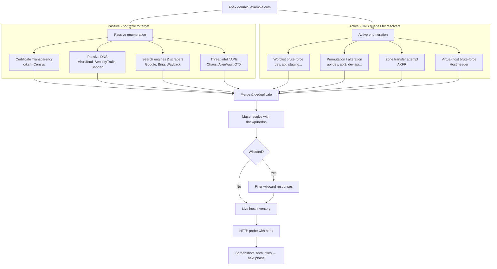
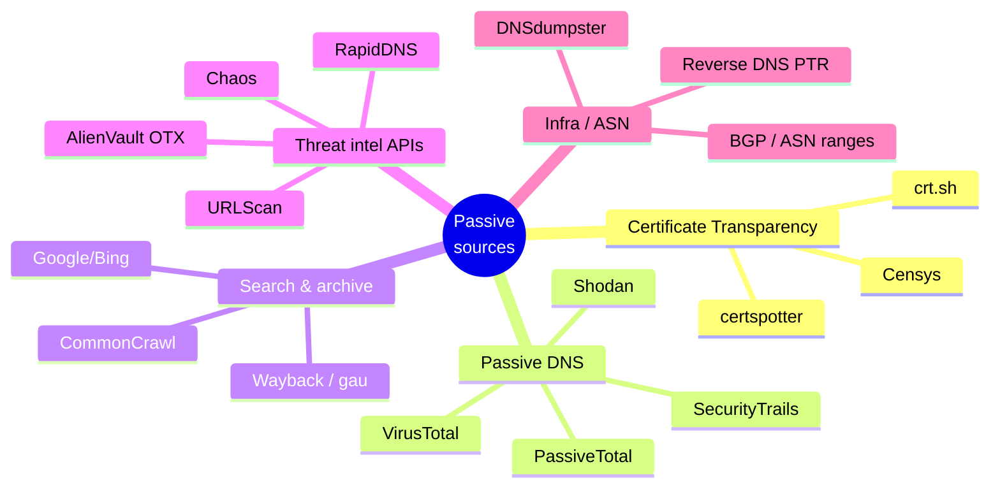
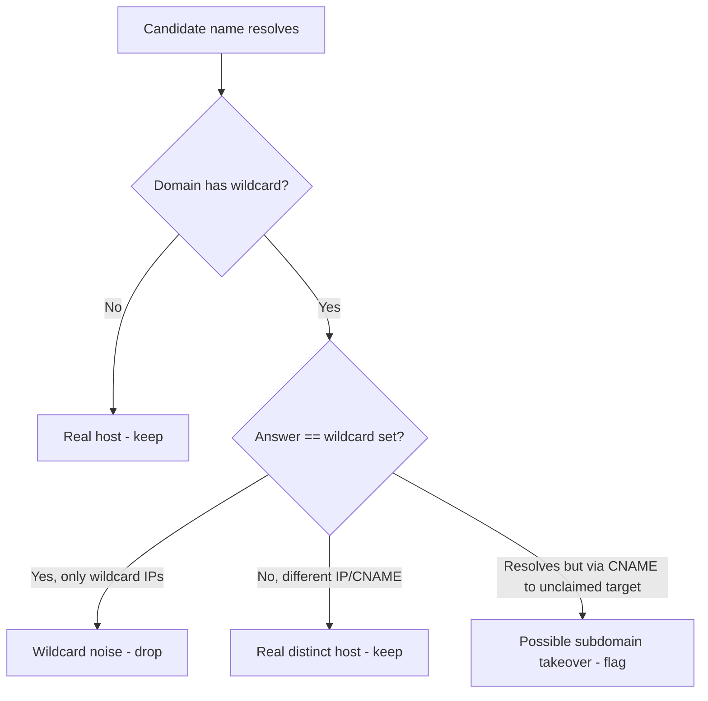
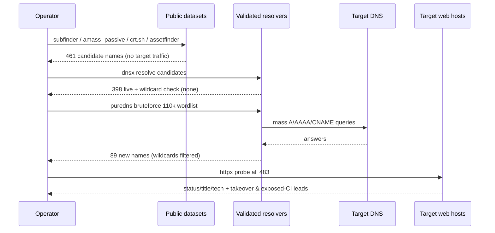
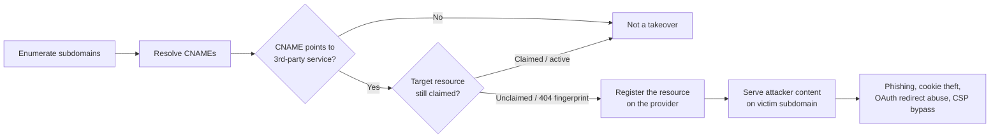

This is Chapter 5 of the Recon & OSINT notebook. Chapter 2 pulled an organisation's infrastructure out of WHOIS, DNS and Certificate Transparency; Chapter 4 mined the search engines that had already indexed the target. Both of those chapters kept surfacing *hostnames* — `api.example.com`, `staging.example.com`, `vpn.example.com` — as a side effect. This chapter makes hostnames the goal. Given one apex domain like `example.com`, the job is to discover **every** subdomain the organisation has ever published, resolve which ones are live, and hand the next phase a clean, deduplicated inventory of hosts to probe.

Subdomain enumeration is the single highest-leverage step in web reconnaissance. Attack surface is not the apex domain; it is the *set of all hostnames* an organisation exposes. The main marketing site at `www.example.com` is hardened, pentested and monitored. The forgotten `jira-old.example.com`, the `dev.internal.example.com` that a wildcard DNS record accidentally exposed, the `s3-backup.example.com` pointing at a deprovisioned bucket — those are where findings live. A bug-bounty hunter who enumerates 4,000 subdomains where everyone else found 40 is hunting a different, quieter target. This chapter is about being that person, and about the defensive side: understanding exactly how an attacker builds that list so you can shrink it.

Everything here is framed for authorised work — a scoped penetration test, a bug-bounty programme within policy, a CTF, or assets you own. Passive enumeration never touches the target and is safe to run early; active resolution and brute-force *do* generate DNS traffic and must stay inside scope. Those boundaries are flagged explicitly throughout.

---

## Part 1: What a Subdomain Actually Is (DNS from the Ground Up)

Before enumerating subdomains you have to be precise about what one *is*, because the tools exploit the exact mechanics of DNS, and misunderstanding those mechanics is how people waste hours chasing hosts that don't exist or miss hosts that do.

The Domain Name System is a distributed, hierarchical database that maps names to records. Read a fully-qualified domain name (FQDN) **right to left**:

```text
api.staging.example.com.
│    │       │       │  └── root zone (the trailing dot, usually implicit)
│    │       │       └───── TLD / top-level domain: com
│    │       └───────────── registrable / apex domain: example.com
│    └───────────────────── subdomain label: staging
└────────────────────────── subdomain label: api
```

- **Apex domain** (also "root domain", "registrable domain", "second-level domain" or "eTLD+1"): `example.com`. This is what the organisation actually registered with a registrar.
- **Subdomain**: any name below the apex — `www.example.com`, `api.example.com`, `api.staging.example.com`. Each dotted label to the left of the apex is another level. There is no meaningful limit on depth; four- and five-level subdomains (`grafana.monitoring.eu-west-1.example.com`) are common in cloud estates.
- **eTLD (effective TLD)**: some suffixes act like TLDs even though they contain dots — `co.uk`, `github.io`, `s3.amazonaws.com`. The Public Suffix List (PSL) is the authoritative registry of these. The "registrable domain" is *one label to the left of the effective TLD*. For `foo.github.io` the eTLD is `github.io` and the registrable domain is `foo.github.io` — not `github.io`. Enumeration tools consult the PSL so they don't waste time trying to brute-force below a suffix that isn't yours.

The record types that matter for enumeration:

| Record | Purpose | Why it matters to enumeration |
|--------|---------|-------------------------------|
| `A` | Name → IPv4 address | The core "is this host live?" resolution. |
| `AAAA` | Name → IPv6 address | Many hosts are IPv6-only or dual-stack; skipping AAAA misses hosts. |
| `CNAME` | Name → another name (alias) | Reveals cloud providers (`*.cloudfront.net`, `*.azurewebsites.net`) and **subdomain-takeover** candidates when the target of the CNAME is unclaimed. |
| `NS` | Delegates a zone to nameservers | Identifies where a zone is authoritatively hosted; used to find zone-transfer opportunities. |
| `MX` | Mail exchangers | Reveals mail infrastructure and third-party mail providers. |
| `TXT` | Arbitrary text (SPF, DKIM, verification) | SPF records list sending IPs/includes; verification TXT records leak SaaS the org uses. |
| `SOA` | Start of authority | Confirms a name is a real delegated zone. |
| `PTR` | IP → name (reverse DNS) | Reverse lookups across an org's netblock surface names not published anywhere else. |
| `CAA` | Which CAs may issue certs | Minor recon signal about certificate practices. |

A subdomain "exists" for enumeration purposes if a resolver returns a non-`NXDOMAIN` answer for it — typically an `A`, `AAAA`, or `CNAME`. `NXDOMAIN` means the name does not exist. `NOERROR` with no answer records (`NODATA`) means the name exists but has no record of the type you asked for — a subtlety that trips up naive brute-forcers, discussed in Part 8.

**Security relevance up front:** every discovered hostname is a potential entry point, and three failure modes make old subdomains dangerous specifically because they were forgotten — dangling CNAMEs (subdomain takeover), unpatched legacy apps on `old-*` hosts, and internal tooling (`jenkins.`, `grafana.`, `kibana.`) accidentally exposed to the internet. Enumeration is how you find all three.

---

## Part 2: The Two Paradigms — Passive Aggregation vs. Active Resolution

Every subdomain-enumeration tool falls into one of two camps, and understanding the split is the key to using the whole toolset well rather than cargo-culting commands.

**Passive enumeration** asks *third parties* what subdomains they already know about. It never sends a single packet to the target. The tools query public datasets — Certificate Transparency logs, passive-DNS databases, search-engine indexes, threat-intel feeds, scraped archives — and aggregate the hostnames those datasets have recorded. Because the traffic goes to the data-source APIs and never to the target, passive enumeration is invisible to the target's logs and safe to run before an engagement's active window opens. Its weakness: it can only find names that are *already published somewhere*. A subdomain that never got a certificate, never appeared in a link, and never resolved for a passive-DNS sensor is invisible to it.

**Active enumeration** talks to the target's authoritative DNS (or resolvers) directly. It takes a list of candidate names — from a wordlist (`dev`, `api`, `staging`, `admin`, …) or from permutations of known names — and *resolves each one* to see which return records. This finds names that were never published anywhere, but it generates DNS traffic (potentially a lot of it), can be rate-limited or detected, and depends entirely on the quality of your wordlist and resolvers.



The correct methodology is not "pick a tool" but "run the full pipeline": passive-aggregate broadly, active-brute-force to fill gaps, permutate around what you found, then resolve and probe everything once, deduplicated. The tools in this chapter each occupy a slot in that pipeline. **Subfinder, Assetfinder, Sublist3r and Amass (passive mode)** do the aggregation; **Amass (active), puredns/massdns, shuffledns, gotator/ripgen** do the active work; **dnsx and httpx** do the resolution and probing that make the raw list usable.

---

## Part 3: Certificate Transparency — The Richest Passive Source

Chapter 2 introduced Certificate Transparency; here it earns its own treatment because CT is, for most targets, the single most productive passive source of subdomains, and every serious tool queries it.

Certificate Transparency is a set of publicly auditable, append-only logs into which Certificate Authorities are required (by browser policy) to publish every TLS certificate they issue. When an organisation requests a certificate for `secret-admin.example.com`, the CA logs that certificate — including the hostname(s) in its Subject and Subject Alternative Name (SAN) fields — into public CT logs. The certificate itself may be served only on an internal host you can't reach, but the *name* is now permanently public. This is why CT is so powerful: it leaks hostnames the moment a cert is issued, regardless of whether the host is reachable, linked, or indexed.

The two ways to query CT:

**1. crt.sh** — a web front-end and Postgres database over the CT logs, run by Sectigo. Query it via the web UI or, better, its JSON API:

```bash
# Every cert-observed name for a domain, one per line, deduplicated.
curl -s "https://crt.sh/?q=%25.example.com&output=json" \
  | jq -r '.[].name_value' \
  | sed 's/\*\.//g' \
  | tr '[:upper:]' '[:lower:]' \
  | sort -u
```

- `%25.example.com` is URL-encoded `%.example.com`; `%` is the SQL wildcard, so this matches every name ending in `.example.com`.
- `output=json` returns machine-readable records instead of HTML.
- `jq -r '.[].name_value'` extracts the certificate name field (which may contain multiple newline-separated SANs).
- `sed 's/\*\.//g'` strips leading `*.` from wildcard-certificate names (`*.example.com` → `example.com`).
- `tr` lowercases (DNS is case-insensitive; dedup needs consistent case).
- `sort -u` deduplicates.

crt.sh also supports direct SQL over a public Postgres endpoint for heavy users, and querying by Organization name to catch certs on *other* apex domains the same org owns:

```bash
# Find apex domains an org registered certs under (pivot beyond one apex).
psql -h crt.sh -p 5432 -U guest certwatch -c \
  "SELECT DISTINCT ci.NAME_VALUE FROM certificate_identity ci
   WHERE ci.NAME_TYPE = 'organizationName'
     AND lower(ci.NAME_VALUE) LIKE '%example corp%' LIMIT 50;"
```

**2. Censys / Google CT search / certspotter** — alternative CT front-ends with their own APIs and rate limits; useful for cross-checking, because no single CT aggregator has every log.

| CT source | Access | Strength | Limitation |
|-----------|--------|----------|------------|
| crt.sh | Free web + JSON + SQL | Deepest history, SAN extraction, org pivot | Rate-limited/slow under load; occasional timeouts |
| Censys | API key (free tier) | Structured, current cert view, host correlation | Query quota on free tier |
| certspotter (SSLMate) | Free API (limited) | Simple JSON, good for automation | Small free quota |
| Google CT | Web UI | Authoritative log coverage | No bulk API for enumeration |

**Bug-bounty note:** CT is where "found a subdomain nobody else did" usually comes from — a cert issued for a host that was never deployed publicly, or a wildcard whose siblings you then brute-force. **Blue-team note:** because CT is public and permanent, treat *every* certificate name as disclosed the instant it's issued; never rely on an "unlinked" hostname being secret, and monitor CT for your own domains (via a tool like Cert Spotter or a `crt.sh` cron) to catch certificates you didn't authorise.

---

## Part 4: The Other Passive Sources

CT is the richest single source, but breadth comes from aggregating many. The passive tools in this chapter each hit a large, overlapping-but-not-identical set of providers. Knowing what each source is tells you why coverage improves when you use several tools and give them API keys.

- **Passive DNS (pDNS).** Sensors and recursive resolvers around the internet record which names resolved to which IPs over time and sell/expose that history. Providers: **SecurityTrails**, **VirusTotal**, **Shodan**, **PassiveTotal (RiskIQ)**, **DNSDB (Farsight)**. pDNS finds names that *actually resolved at some point*, including ones that never got a certificate. Most require an API key; free tiers are small.
- **Search engines & scrapers.** Google, Bing, DuckDuckGo, Baidu, Yandex indexes contain `site:` hits that reveal hostnames. **Sublist3r** historically scraped these directly. Fragile (CAPTCHAs, HTML changes) but occasionally unique.
- **Web archives.** The Wayback Machine (`web.archive.org`) and CommonCrawl have crawled and stored URLs for decades; `gau` and `waybackurls` (Chapter 4) extract hostnames from archived URLs.
- **Threat-intel & recon APIs.** **ProjectDiscovery Chaos** (a continuously-updated public subdomain dataset, free with a key), **AlienVault OTX**, **ThreatCrowd/ThreatMiner**, **URLScan.io**, **HackerTarget**, **BufferOver**, **RapidDNS**, **Anubis (jonlu.ca)**, **DNSdumpster**.
- **Cloud/CDN & ASN data.** Which IP ranges (ASNs) an org owns; reverse-DNS across those ranges (`PTR` sweep) surfaces names present nowhere else. Amass integrates ASN lookups.



The single most impactful configuration step for passive enumeration is **adding API keys**. With no keys, Subfinder and Amass fall back to a handful of free sources and you get maybe 30–60% of the reachable names. With free-tier keys for SecurityTrails, VirusTotal, Chaos, Censys, Shodan and GitHub, the same tools routinely double or triple their output. Part 6 covers the config files; treat key-setup as a one-time investment that pays off on every engagement.

---

## Part 5: Sublist3r & Assetfinder — The Lightweight Aggregators

We start with the two simplest tools because they teach the core "aggregate from public sources" idea with almost no configuration, then we build up to Subfinder and Amass.

### Sublist3r — from scratch

**What it is.** Sublist3r is a Python tool (by Ahmed Aboul-Ela) that enumerates subdomains by scraping search engines (Google, Bing, Yahoo, Baidu), querying a few public sources (Netcraft, DNSdumpster, ThreatCrowd, VirusTotal, crt.sh, PassiveDNS), and optionally chaining into `subbrute` for a light DNS brute-force. It is the "hello world" of subdomain enumeration — old, sometimes stale (search-engine scraping breaks as sites change), but instant to run and still occasionally surfaces a unique name.

**Why it exists.** It predates the modern Go tooling and popularised one-command passive enumeration. You keep it around for cross-checking, not as your primary engine.

**Install (Kali/any Linux):**

```bash
# Kali ships a package:
sudo apt update && sudo apt install sublist3r -y
# Or from source (latest):
git clone https://github.com/aboul3la/Sublist3r.git
cd Sublist3r
pip3 install -r requirements.txt
python3 sublist3r.py -h
```

**Core usage:**

```bash
sublist3r -d example.com -o sublist3r_example.txt
```

- `-d example.com` — target domain (required).
- `-o sublist3r_example.txt` — write results to a file (one host per line).
- `-b` — enable the `subbrute` brute-force module (adds active DNS queries; no longer passive).
- `-t 50` — threads for the brute-force phase.
- `-e google,bing,crtsh` — restrict to specific engines/sources.
- `-p 80,443` — after enumerating, report which of these ports are open (a light live-check).
- `-v` — verbose; show each found subdomain as it appears.

**Realistic output:**

```text
                 ____        _     _ _     _   _____
                / ___| _   _| |__ | (_)___| |_|___ / _ __
                \___ \| | | | '_ \| | / __| __| |_ \| '__|
                 ___) | |_| | |_) | | \__ \ |_ ___) | |
                |____/ \__,_|_.__/|_|_|___/\__|____/|_|

                # Coded By Ahmed Aboul-Ela

[-] Enumerating subdomains now for example.com
[-] Searching now in Baidu..
[-] Searching now in Google..
[-] Searching now in Bing..
[-] Searching now in Netcraft..
[-] Searching now in DNSdumpster..
[-] Searching now in Virustotal..
[-] Searching now in ThreatCrowd..
[-] Searching now in SSL Certificates..
[-] Total Unique Subdomains Found: 27
www.example.com
api.example.com
blog.example.com
m.example.com
support.example.com
...
```

**Reality check:** Sublist3r's search-engine modules frequently return nothing now because Google/Bing block scraping. Its crt.sh and DNSdumpster paths still work. Treat it as one input among many, not the whole answer.

### Assetfinder — from scratch

**What it is.** Assetfinder (by Tom Hudson, "tomnomnom") is a tiny, fast Go binary that finds domains and subdomains "related to a given domain" by querying a fixed set of passive sources: crt.sh, certspotter, hackertarget, threatcrowd, Wayback Machine, dns.bufferover.run, Facebook CT (with token), VirusTotal (with key), Findsubdomains/SpyOnWeb, and a few more. It does one thing — spit out related hostnames — and is built to be piped into other tools.

**Why it exists.** The Unix-philosophy counterpart to heavyweight frameworks: no config file, no database, instant output, perfect as the first stage of a shell pipeline.

**Install:**

```bash
go install github.com/tomnomnom/assetfinder@latest
# binary lands in ~/go/bin/assetfinder — ensure that's on PATH:
export PATH="$PATH:$(go env GOPATH)/bin"
assetfinder --help
```

**Core usage:**

```bash
assetfinder --subs-only example.com | sort -u > assetfinder_example.txt
```

- `--subs-only` — output only subdomains of the given domain (drop unrelated apexes it also finds). Without it, Assetfinder also returns *other* apex domains it thinks are related, which is useful for scope expansion but noisy for pure subdomain work.
- It reads the target from the argument or stdin, so you can do `echo example.com | assetfinder --subs-only`.
- Set `VT_API_KEY` and `FB_APP_ID`/`FB_APP_SECRET` env vars to unlock the VirusTotal and Facebook CT sources.

**Realistic output** (just a clean list — Assetfinder is deliberately silent):

```text
example.com
www.example.com
api.example.com
cdn.example.com
mail.example.com
autodiscover.example.com
staging.example.com
```

Assetfinder is the tool you reach for when you want a fast, dependency-free first pass, or a stage in a one-liner. It won't be your deepest source, but it's the friction-free one.

---

## Part 6: Subfinder — The Modern Passive Workhorse

**What it is.** Subfinder (by ProjectDiscovery) is a fast, actively-maintained Go tool that does passive subdomain discovery from a large, curated set of sources (~30+), with first-class support for API keys, output formats, and piping into the rest of the ProjectDiscovery suite (`dnsx`, `httpx`, `nuclei`). For most engagements in the current era, Subfinder is the default passive engine — it replaced Sublist3r as the community's go-to because it's faster, better-maintained, and its source list is broad and configurable.

**Why it exists.** To be the reliable, scriptable passive-aggregation stage: give it a domain (or a list), it returns a deduplicated set of subdomains from every source it has, and it plays nicely in automated pipelines.

**Install:**

```bash
go install -v github.com/projectdiscovery/subfinder/v2/cmd/subfinder@latest
# or on Kali:
sudo apt install subfinder -y
subfinder -version
```

**Core usage:**

```bash
subfinder -d example.com -o subfinder_example.txt
```

- `-d example.com` — target domain (`-dL domains.txt` for a file of many domains).
- `-o file` — output file (`-oJ` for JSON, `-oD dir` to write one file per domain).
- `-all` — use *all* sources including the slower ones (default uses a faster subset). Use `-all` when you want maximum coverage and don't mind the extra time.
- `-recursive` — recursively enumerate subdomains of discovered subdomains (find `*.staging.example.com` after finding `staging.example.com`).
- `-silent` — output only the hostnames, nothing else (ideal for piping).
- `-t 10` — concurrency for resolution.
- `-timeout 30` / `-max-time 10` — per-source and overall time limits.
- `-nW` — show only "interesting" (in-scope) results, filtering wildcards.
- `-cs` — include the source that reported each host (great for auditing which key is producing value).
- `-config` / `-pc` — path to config and provider-config (API keys) files.

**API keys — the step that matters most.** Subfinder reads provider keys from `$HOME/.config/subfinder/provider-config.yaml`. Populate it once:

```yaml
# ~/.config/subfinder/provider-config.yaml
virustotal:
  - "VT_KEY_HERE"
securitytrails:
  - "ST_KEY_HERE"
censys:
  - "CENSYS_API_ID:CENSYS_API_SECRET"
shodan:
  - "SHODAN_KEY_HERE"
chaos:
  - "CHAOS_KEY_HERE"
github:
  - "GITHUB_PAT_HERE"
bevigil:
  - "BEVIGIL_KEY_HERE"
```

Most of these have free tiers. The difference is dramatic — see Part 9's lab for a before/after count.

**Realistic output (`-cs` to show sources):**

```text
$ subfinder -d example.com -all -cs -silent
api.example.com,crtsh
www.example.com,crtsh
staging.example.com,securitytrails
dev.example.com,virustotal
vpn.example.com,shodan
grafana.internal.example.com,github
legacy.example.com,wayback
autodiscover.example.com,dnsdumpster
[INF] Found 342 subdomains for example.com in 41 seconds
```

**Piping** — Subfinder's whole point is composability:

```bash
subfinder -d example.com -all -silent \
  | dnsx -silent -a -resp \
  | httpx -silent -title -status-code -tech-detect
```

That one line goes passive-enumerate → resolve → probe-HTTP, which is 80% of practical recon in a single command. We build it up properly in the lab.

---

## Part 7: Amass — The Heavyweight Framework

**What it is.** OWASP Amass is the most comprehensive — and most complex — subdomain and attack-surface mapping framework. Unlike the single-purpose tools above, Amass is a suite: passive aggregation from 55+ sources, active DNS brute-force and resolution, permutation/alteration generation, reverse-DNS and ASN/netblock expansion, zone-transfer attempts, and a graph database that stores and correlates everything it finds across runs. It is the tool you use when you want depth and correlation, not just a fast list.

**Why it exists.** To map an organisation's *entire* external DNS-visible footprint and the relationships between assets (which names share IPs, which sit in which ASN, which resolve to which cloud), persisting that knowledge so repeated runs enrich a graph rather than starting cold.

**Architecture.** Modern Amass (v4+) splits into subcommands:

- `amass enum` — the enumeration engine (passive and/or active).
- `amass intel` — pre-enumeration intelligence: find apex domains an org owns via ASN, reverse whois, org name (scope expansion).
- `amass db` / `amass viz` — query and visualise the graph database of past findings.
- `amass track` — diff findings between runs (what's new since last time).

**Install:**

```bash
# Snap (kept current):
sudo snap install amass
# or Go:
go install -v github.com/owasp-amass/amass/v4/...@master
# or Kali:
sudo apt install amass -y
amass -version
```

**Passive mode** (safe, no traffic to target):

```bash
amass enum -passive -d example.com -o amass_passive.txt
```

- `-passive` — passive sources only; never resolves against the target. Use this in the pre-engagement window.
- `-d example.com` — target (`-df domains.txt` for a list).
- `-o file` — text output.
- `-config config.yaml` — config file holding API keys and settings.
- `-src` — annotate each result with the data source that found it.

**Active mode** (resolves, brute-forces, permutates — generates DNS traffic):

```bash
amass enum -active -d example.com \
  -brute -w /usr/share/seclists/Discovery/DNS/subdomains-top1million-110000.txt \
  -rf resolvers.txt -o amass_active.txt
```

- `-active` — enables active techniques including zone transfers and cert grabbing on resolved hosts.
- `-brute` — turn on the DNS brute-force module.
- `-w wordlist` — wordlist for brute-force (SecLists DNS lists are the standard; see Part 8).
- `-rf resolvers.txt` — file of trusted resolvers to spread queries across (critical for speed and to avoid one resolver rate-limiting you).
- `-alts` / `-nf` — enable name alterations (permutations) / provide a new-word file for permutation seeds.
- `-max-dns-queries 20000` — throttle total query rate (OPSEC / avoid hammering).
- `-ip` / `-src` — show resolved IPs / sources inline.

**API keys** live in the Amass config (`$HOME/.config/amass/config.yaml` or a `datasources.yaml` depending on version):

```yaml
# datasources.yaml (Amass v4)
datasources:
  - name: SecurityTrails
    creds:
      account:
        apikey: ST_KEY_HERE
  - name: VirusTotal
    creds:
      account:
        apikey: VT_KEY_HERE
  - name: Censys
    creds:
      account:
        apikey: CENSYS_ID
        secret: CENSYS_SECRET
```

**The `amass intel` scope-expansion trick** — before enumerating one apex, find *all* the apexes:

```bash
# Apex domains sharing an org's reverse-whois / ASN — expands scope legitimately.
amass intel -org "Example Corp"
amass intel -asn 15169                      # names in an ASN you know is theirs
amass intel -active -cidr 93.184.216.0/24   # reverse-DNS across their netblock
amass intel -whois -d example.com           # domains with related whois records
```

**Realistic `amass enum -passive` output tail:**

```text
api.example.com
www.example.com
mail.example.com
sso.example.com
gitlab.example.com
k8s-dev.eu-west-1.example.com
...
OWASP Amass v4.2.0
342 names discovered - cert: 180, dns: 0, alt: 0, guess: 0, scrape: 96, api: 66, axfr: 0
```

**When to use Amass vs. Subfinder.** Subfinder is faster and simpler for a pure passive list. Amass wins when you want ASN/reverse-DNS expansion, permutation, zone transfers, cross-run tracking, and a persistent graph. A common pro workflow: `subfinder` + `assetfinder` for fast breadth, `amass enum -passive` for depth, `amass intel` for scope, then active brute-force with the dedicated resolvers below.

```mermaid
flowchart LR
    subgraph Scope[Scope expansion]
        I[amass intel<br/>org / asn / whois] --> APEX[All apex domains]
    end
    APEX --> AGG
    subgraph AGG[Passive aggregation]
        SF[subfinder -all]
        AF[assetfinder]
        AM[amass enum -passive]
        S3[sublist3r]
    end
    AGG --> MERGE[cat | sort -u<br/>master candidate list]
    MERGE --> ACT
    subgraph ACT[Active discovery]
        BR[puredns bruteforce<br/>wordlist]
        PM[gotator/ripgen<br/>permutations]
    end
    ACT --> RES[dnsx / puredns resolve<br/>+ wildcard filter]
    RES --> PROBE[httpx probe]
    PROBE --> DELIV[Live inventory + evidence]
```

---

## Part 8: Active Enumeration Done Right — Wordlists, Resolvers, Wildcards, Massdns

Passive aggregation finds published names; active enumeration finds the rest. Doing it *well* is a craft with three levers: the wordlist, the resolvers, and wildcard handling. Get these wrong and you either miss thousands of hosts or drown in false positives.

### The brute-force idea

DNS brute-force generates candidate FQDNs by prepending each word in a list to the apex (`admin.example.com`, `dev.example.com`, …) and resolving each. Every candidate that returns a record is a real subdomain. The math is simple; the engineering is about doing millions of resolutions fast without lying to yourself about the results.

### Massdns and puredns — from scratch

**massdns** is a very high-performance stub resolver: give it a file of names and a file of resolvers and it fires off resolutions concurrently at tens of thousands per second. It's the engine; it does *not* handle wildcards or wordlist generation itself.

**puredns** wraps massdns to add the two things that make brute-force *trustworthy*: **resolver validation** (it tests your resolver list against known-good/known-bad names and discards resolvers that lie) and **wildcard detection & filtering** (below). puredns is the current best-practice front-end for mass DNS brute-force.

```bash
# Install massdns
git clone https://github.com/blechschmidt/massdns.git
cd massdns && make && sudo cp bin/massdns /usr/local/bin/
# Install puredns
go install github.com/d3mondev/puredns/v2@latest
```

**Resolvers matter enormously.** Public resolvers rate-limit and some return poisoned/hijacked answers. Use a curated, validated resolver list:

```bash
# Grab a maintained list, then validate it (keep only honest, fast resolvers):
wget -q https://raw.githubusercontent.com/trickest/resolvers/main/resolvers.txt -O resolvers-raw.txt
puredns resolve --resolvers resolvers-raw.txt --write-resolvers resolvers.txt /dev/null 2>/dev/null
# (or use dnsvalidator to build your own validated list)
```

**Brute-force with puredns:**

```bash
puredns bruteforce /usr/share/seclists/Discovery/DNS/subdomains-top1million-110000.txt example.com \
  --resolvers resolvers.txt \
  --rate-limit 1500 \
  --write brute_resolved.txt \
  --write-wildcards wildcards.txt
```

- `bruteforce <wordlist> <domain>` — prepend each word to the domain and resolve.
- `--resolvers resolvers.txt` — validated resolver list.
- `--rate-limit 1500` — cap queries/sec (OPSEC and courtesy; higher = faster but louder).
- `--write` — where to save resolved names.
- `--write-wildcards` — record which names were wildcard responses (so you can audit).

### Wildcard DNS — the trap that ruins brute-force

A **wildcard DNS record** (`*.example.com A 1.2.3.4`) makes *every* non-existent subdomain resolve to the same answer. Brute-force against a wildcard-configured domain returns a "hit" for `asdkjfhaskjdfh.example.com` and every other garbage name — thousands of false positives. You must detect and filter this.

The detection technique: resolve several random, definitely-nonexistent names (`$(openssl rand -hex 12).example.com`). If they resolve, the domain has a wildcard, and you learn the wildcard's answer set (IPs/CNAMEs). Then any brute-forced name whose answer is *only* the wildcard set is discarded; a name that resolves to something *else* is a real, distinct host.



puredns and Amass do this automatically; if you ever hand-roll massdns you must do it yourself. **This is the number-one reason raw brute-force output is untrustworthy — always confirm wildcard handling happened.**

### NXDOMAIN vs NODATA vs NOERROR

- **NXDOMAIN** — name does not exist. Not a hit.
- **NOERROR + answer** — name exists with the record type you asked. A hit.
- **NOERROR + no answer (NODATA)** — name exists but has no `A`/`AAAA` (maybe only `MX` or `TXT`). A naive `A`-only brute-force records this as "no hit" even though the name is real. Query `A`, `AAAA`, and `CNAME` to avoid missing NODATA names, and note that a `CNAME` with no resolvable target is a prime **subdomain-takeover** candidate.

### Permutation / alteration — squeezing more from what you found

Once you have real names, generate *variations* of them and resolve those. If `api.example.com` and `api-dev.example.com` exist, `api-staging`, `api2`, `api-uat`, `dev-api` probably do too. Tools:

- **gotator** — `gotator -sub found.txt -perm words.txt -depth 2 -numbers 5 | puredns resolve ...`
- **ripgen / alterx** — modern permutation generators with sensible default patterns.
- **Amass** — built-in via `-alts`.

```bash
# Permute known names, then resolve the permutations, filtering wildcards.
gotator -sub found_live.txt -perm permutations_words.txt -depth 1 -numbers 3 -mindup -silent \
  | puredns resolve --resolvers resolvers.txt --write perms_resolved.txt
```

Permutation is where deep engagements pull ahead — it finds the `-uat`, `-old`, `-v2`, region-prefixed and numbered siblings of hardened hosts, which are exactly the under-monitored ones.

### Zone transfer (AXFR) — the jackpot that's rarely open

If a nameserver is misconfigured to allow unauthenticated zone transfers, it will hand you the *entire* zone — every record — in one request. It's rare on the modern internet but costs nothing to check:

```bash
# Enumerate the zone's nameservers, then try AXFR against each.
for ns in $(dig +short NS example.com); do
  echo "== $ns =="
  dig AXFR example.com @"$ns" +noall +answer
done
```

A successful transfer dumps every subdomain instantly. A refused one returns `; Transfer failed.` — expected on well-configured zones. **Blue-team note:** AXFR should be restricted to secondary nameservers by IP/TSIG; an open AXFR is a straightforward misconfiguration finding.

### Wordlist strategy

| Wordlist | Path (SecLists) | Use when |
|----------|-----------------|----------|
| `subdomains-top1million-5000.txt` | `Discovery/DNS/` | Quick first pass, low noise |
| `subdomains-top1million-110000.txt` | `Discovery/DNS/` | Standard thorough brute-force |
| `bitquark-subdomains-top100000.txt` | `Discovery/DNS/` | Complementary source, different corpus |
| `deepmagic.com-prefixes-top50000.txt` | `Discovery/DNS/` | Broad coverage second pass |
| `dns-Jhaddix.txt` | `Discovery/DNS/` | The classic all-rounder |
| Custom (org-specific) | — | Build from the org's naming (`prod-`, `-uk`, product names) seen in passive results |

The best wordlist is a *hybrid*: a big general list plus custom words mined from the passive results (if you see `svc-billing`, add `svc-` prefixes and product names). Install SecLists with `sudo apt install seclists` or clone `danielmiessler/SecLists`.

---

## Part 9: The Complete Hands-On Lab — One Apex to Live Inventory

This lab runs the full pipeline end to end. Run it against a domain you own or an in-scope bug-bounty target. We use `example.com` as the placeholder; substitute your authorised target. Passive steps are safe anywhere; the active brute-force step (9.4) sends DNS traffic and must be in scope.

### 9.0 Setup

```bash
mkdir -p recon/example.com && cd recon/example.com
export TARGET=example.com
# Tools (install once): subfinder assetfinder amass sublist3r dnsx httpx puredns massdns gotator seclists jq
# Validated resolvers (from Part 8):
wget -q https://raw.githubusercontent.com/trickest/resolvers/main/resolvers.txt -O resolvers.txt
wc -l resolvers.txt
```

### 9.1 Passive aggregation from every tool

```bash
# Certificate Transparency directly (belt-and-braces, in case a tool misses it)
curl -s "https://crt.sh/?q=%25.$TARGET&output=json" \
  | jq -r '.[].name_value' | sed 's/\*\.//g' | tr '[:upper:]' '[:lower:]' \
  | grep -E "\.?$TARGET$" | sort -u > ct.txt

subfinder -d "$TARGET" -all -silent      > subfinder.txt
assetfinder --subs-only "$TARGET"        | sort -u > assetfinder.txt
amass enum -passive -d "$TARGET" -silent > amass.txt
sublist3r -d "$TARGET" -o sublist3r.txt >/dev/null 2>&1

wc -l ct.txt subfinder.txt assetfinder.txt amass.txt sublist3r.txt
```

Realistic counts (with API keys configured):

```text
   188 ct.txt
   342 subfinder.txt
    97 assetfinder.txt
   356 amass.txt
    27 sublist3r.txt
```

Note how much each tool overlaps — and doesn't. That overlap-but-not-identity is exactly why you run several.

### 9.2 Merge and deduplicate into a master candidate list

```bash
cat ct.txt subfinder.txt assetfinder.txt amass.txt sublist3r.txt \
  | grep -E "^([a-z0-9_-]+\.)+$TARGET$" \
  | tr '[:upper:]' '[:lower:]' \
  | sort -u > all_passive.txt
wc -l all_passive.txt
```

```text
   461 all_passive.txt
```

461 unique candidate names from passive sources alone — and no packet has touched the target yet.

### 9.3 Resolve the passive list and detect wildcards

```bash
# dnsx resolves and keeps only names that actually answer; -a A records, -cname to see aliases.
dnsx -l all_passive.txt -silent -a -cname -resp -o passive_resolved.txt
wc -l passive_resolved.txt

# Explicit wildcard probe on the apex:
for i in 1 2 3; do
  r=$(openssl rand -hex 12)
  echo -n "$r.$TARGET -> "; dig +short "$r.$TARGET" | tr '\n' ' '; echo
done
```

Sample output:

```text
api.example.com [93.184.216.34]
www.example.com [93.184.216.34]
staging.example.com [CNAME cdn.example.net.] [151.101.1.7]
grafana.internal.example.com [10.0.4.11]     # RFC1918 — internal, non-routable
legacy.example.com [CNAME legacy.example.com.s3.amazonaws.com.]   # takeover candidate!
...
   398 passive_resolved.txt

3f9a1c...e2.example.com ->
7b21df...aa.example.com ->
c0ffee...01.example.com ->
```

The three random names returned nothing → **no wildcard** on this apex, so brute-force results will be trustworthy. (If they *had* resolved, we'd route brute-force through puredns's wildcard filtering.) Note the `legacy.example.com` CNAME to an S3 bucket — flag it for a subdomain-takeover check.

### 9.4 Active brute-force (in scope only)

```bash
puredns bruteforce /usr/share/seclists/Discovery/DNS/subdomains-top1million-110000.txt "$TARGET" \
  --resolvers resolvers.txt \
  --rate-limit 1500 \
  --write brute_resolved.txt \
  --write-wildcards wildcards.txt
wc -l brute_resolved.txt
```

```text
[*] Validating 12043 resolvers... 9911 valid
[*] Bruteforcing 110000 names at 1500 q/s...
[*] Found 512 domains, 71 wildcards filtered
    89 brute_resolved.txt
```

Brute-force found **89** names — of which many were *not* in the passive list. This is the payoff of active enumeration: names that were never published anywhere.

### 9.5 Permutations around what we found

```bash
gotator -sub brute_resolved.txt -perm /usr/share/seclists/Discovery/DNS/dns-Jhaddix.txt \
  -depth 1 -numbers 3 -mindup -silent \
  | puredns resolve --resolvers resolvers.txt --rate-limit 1500 --write perms_resolved.txt
wc -l perms_resolved.txt
```

```text
    23 perms_resolved.txt   # e.g. api-uat, api2, dev-grafana, staging2
```

### 9.6 Final merge, resolve, and HTTP probe

```bash
cat passive_resolved.txt brute_resolved.txt perms_resolved.txt \
  | awk '{print $1}' | sort -u > all_hosts.txt
wc -l all_hosts.txt

# Probe HTTP(S): status, title, tech, and follow redirects.
httpx -l all_hosts.txt -silent \
      -status-code -title -tech-detect -web-server -follow-redirects \
      -o live_http.txt
head live_http.txt
```

```text
   483 all_hosts.txt

https://www.example.com      [200] [Example Corp] [nginx] [React]
https://api.example.com      [401] [Unauthorized] [nginx]
https://staging.example.com  [200] [Staging - Example] [Fastly] [Vue.js]
https://grafana.internal...  [connection refused]        # internal-only, expected
https://legacy.example.com   [404] [NoSuchBucket]         # S3 takeover — confirm & report
https://jenkins.example.com  [403] [Jenkins]              # exposed CI — high value
```

### 9.7 What the lab produced

From one apex domain: **483 unique hosts**, of which the passive-only run found 398 and active work added 85 that no public dataset knew about. Two immediate findings surfaced without any exploitation — an S3-backed dangling CNAME (`legacy.`) and an internet-exposed Jenkins (`jenkins.`). That is the whole point: enumeration alone, done thoroughly, produces leads.



---

## Part 10: Virtual-Host Discovery — Names DNS Won't Give You

Not every hostname resolves in public DNS. A single IP can serve dozens of sites distinguished only by the HTTP `Host` header (name-based virtual hosting). If `internal-admin.example.com` is configured on a web server but has no public DNS record, no amount of DNS enumeration finds it — but sending `Host: internal-admin.example.com` to the server's IP does.

**How vhost fuzzing works:** take a known IP of the target, then brute-force the `Host:` header with a wordlist, watching for responses that *differ* from the default/unknown-vhost response (different length, status, or title).

```bash
# ffuf vhost brute-force against a known IP
ffuf -w /usr/share/seclists/Discovery/DNS/subdomains-top1million-20000.txt \
     -u https://93.184.216.34/ \
     -H "Host: FUZZ.example.com" \
     -fs 0 -mc all -ac \
     -o vhosts.json
```

- `-w wordlist` — vhost name candidates.
- `-u` — the *IP-based* URL (we're not relying on DNS).
- `-H "Host: FUZZ.example.com"` — inject each candidate into the Host header.
- `-fs 0` — filter out responses of size 0 (tune to the default-vhost size).
- `-ac` — auto-calibration: ffuf learns the "not found" baseline and filters it automatically.
- `-mc all` — match all status codes (then filter by size), so you don't miss `403`/`401` on hidden vhosts.

**gobuster's vhost mode** does the same:

```bash
gobuster vhost -u https://93.184.216.34 -w wordlist.txt --domain example.com --append-domain
```

Vhost discovery is a distinct axis from DNS enumeration — always run both. Internal admin panels, staging apps behind a shared load balancer, and multi-tenant apps frequently hide as vhosts with no DNS footprint. **CTF note:** many HackTheBox/THM web boxes gate the real app behind a vhost you must discover and add to `/etc/hosts` — vhost fuzzing is standard operating procedure there.

---

## Part 11: Wildcards, Rate Limits, OPSEC & Pitfalls

The techniques above are simple to run and easy to run *badly*. This section is the accumulated "don't do that" of subdomain enumeration.

**Wildcard false positives (recap, because it's the #1 error).** Always confirm wildcard handling. A brute-force that "finds" 40,000 subdomains on a domain with 30 real ones has found a wildcard, not an attack surface. Filter with puredns/Amass and sanity-check by resolving random garbage names.

**Untrusted resolvers lie.** Some public resolvers (and captive/ISP resolvers) return spoofed answers, NXDOMAIN-hijacking pages, or rate-limit silently and drop queries — producing both false positives and false negatives. Always validate your resolver list; never brute-force through a single resolver or your laptop's default DNS.

**Rate limits and detection.** Passive enumeration is invisible to the target. Active brute-force is not: you are sending thousands of DNS queries, and if they hit the target's authoritative servers directly (rather than being cached/recursed), the target can see the volume and pattern. Throttle (`--rate-limit`), spread across many resolvers (which means most queries hit recursive resolvers, not the target directly), and consider timing. For a stealth-sensitive engagement, lean harder on passive sources and permutation of known-good names rather than a 1M-word blast.

**API rate limits and bans.** Hammering crt.sh or a free-tier API gets you throttled or temporarily blocked. Cache results, don't re-run the same passive query in a tight loop, and stagger tools rather than launching all of them at maximum concurrency.

**Scope discipline.** `amass intel -org` and Assetfinder's related-domain output *expand* scope — they surface other apex domains. On a bug-bounty programme, only in-scope apexes are fair game; enumerating and testing an out-of-scope apex the tool suggested is a policy violation. Cross-check every apex against the programme scope before touching it.

**Stale / dead names.** Passive sources return names that resolved *historically*. Many are dead now (`NXDOMAIN`). That's fine — you resolve the merged list and keep only live ones — but don't report a name as an asset without confirming it currently resolves and responds.

**IPv6 and NODATA blind spots.** `A`-only resolution misses IPv6-only hosts and NODATA names. Query `A`, `AAAA` and `CNAME`.

**Internationalised / punycode names.** Some subdomains use IDN (`xn--…`); normalise encoding when deduplicating so you don't treat the same name as two.

| Pitfall | Symptom | Fix |
|---------|---------|-----|
| Wildcard DNS | Thousands of "hits", all same IP | puredns/Amass wildcard filtering; probe random names |
| Bad resolvers | Random false hits / misses; slow | Validate resolver list (dnsvalidator / puredns) |
| No API keys | Passive output suspiciously small | Populate provider-config with free-tier keys |
| `A`-only brute-force | Missing IPv6 / NODATA / CNAME-only hosts | Resolve A + AAAA + CNAME |
| Out-of-scope apex | Testing a domain the tool "found" | Cross-check against engagement scope |
| Reporting stale names | Dead `NXDOMAIN` names as assets | Resolve + HTTP-probe before reporting |
| Rate-limit ban | crt.sh/API returns 429/empty | Throttle, cache, stagger tools |

---

## Part 12: Subdomain Takeover — The Highest-Value Enumeration Payoff

Enumeration's most direct route to an actual vulnerability is **subdomain takeover**, so it deserves its own treatment. A takeover happens when a subdomain's DNS record (usually a `CNAME`) points at a third-party service resource that no longer exists — a deleted S3 bucket, a decommissioned Heroku app, an unclaimed GitHub Pages site, a released Azure hostname. Because the DNS record still points there, an attacker who *claims* that resource on the third-party service now controls what's served at the victim's subdomain.

The takeover chain:



**Detection.** After enumeration, resolve CNAMEs and match the response against known "unclaimed" fingerprints (e.g. S3's `NoSuchBucket`, GitHub Pages' `There isn't a GitHub Pages site here`, Heroku's `No such app`). Tooling:

```bash
# subzy checks a list of hosts against a fingerprint database
subzy run --targets all_hosts.txt --concurrency 50 --hide_fails
# nuclei's takeover templates do the same, integrated with the rest of your scan
nuclei -l all_hosts.txt -t http/takeovers/ -o takeovers.txt
```

Realistic hit:

```text
[ VULNERABLE ] legacy.example.com  ->  legacy.example.com.s3.amazonaws.com  (AWS/S3, NoSuchBucket)
```

**Bug-bounty note:** subdomain takeover is one of the most reliably-paid bug classes precisely because it's a direct consequence of thorough enumeration — most programmes pay well for a demonstrated takeover, and you find them by resolving CNAMEs on the exact host list your enumeration produced. **Blue-team note:** the defence is DNS hygiene — when you deprovision a cloud resource, remove the DNS record that points at it *first*; run periodic CNAME audits over your own zones with the same tools attackers use.

---

## Part 13: Detection & Defense Angle

Everything above is also a blueprint for defence: to shrink your attack surface you must see it the way an attacker's enumeration does, and you must detect enumeration when it turns active.

**Attack-surface management (see what they see).** Run this exact pipeline against *your own* domains on a schedule (Amass's `track` subcommand diffs runs and shows what's new). The output is an authoritative inventory of externally-visible hosts — the thing most organisations discover they don't actually have. Feed it into asset management: every host on the list needs an owner, a patch cadence, and a reason to exist. Names with no owner get decommissioned; that's the fastest attack-surface reduction available.

**Certificate Transparency monitoring.** Because CT publishes every issued certificate, monitor CT for your domains (Cert Spotter, Facebook's CT monitor, or a `crt.sh` cron). A certificate you didn't authorise, or one for an unexpected hostname, is an early signal of shadow IT or an attacker who has provisioned infrastructure. You cannot stop names leaking into CT — you can watch the same feed the attacker does.

**Detecting active enumeration.** Passive enumeration is undetectable by you (the queries go to third parties). Active brute-force *is* detectable, but usually only partially, because most queries hit recursive resolvers rather than your authoritative servers. What you *can* watch for on your authoritative DNS: bursts of `NXDOMAIN` responses (brute-force generates far more misses than hits), sudden query volume from a small set of source IPs, and AXFR attempts. Rate-limit responses (RRL — Response Rate Limiting) on authoritative servers blunts the direct-query variant and mitigates using your DNS as a DDoS amplifier.

**Zone-transfer lockdown.** Restrict AXFR to known secondaries by IP and TSIG key. An open AXFR hands an attacker the entire zone in one query — the single worst DNS misconfiguration for enumeration.

**Wildcard discipline.** Wildcards (`*.example.com`) simultaneously frustrate brute-force *and* create risk: a wildcard pointing at a shared platform can turn any unclaimed sub-name into a takeover or a confusing catch-all. Use them deliberately, know where they point, and prefer explicit records where feasible.

**Internal vs. external separation.** The lab surfaced `grafana.internal.example.com` resolving to RFC1918 space and an exposed `jenkins.` — internal tooling names leak constantly via CT and passive DNS even when the hosts aren't publicly reachable. Assume every internal hostname is *known* to an attacker; put internal tooling behind VPN/zero-trust and never rely on the name being secret.

| Defensive control | Stops / mitigates | Tooling |
|-------------------|-------------------|---------|
| Own-domain enumeration on schedule | Unknown/shadow assets | amass track, subfinder, in-house ASM |
| CT monitoring | Unauthorised/unexpected certs, shadow IT | Cert Spotter, crt.sh cron |
| AXFR restriction (IP + TSIG) | Full-zone disclosure | BIND `allow-transfer`, named ACLs |
| Response Rate Limiting (RRL) | Brute-force via authoritative, amplification | BIND/Knot/PowerDNS RRL |
| CNAME/DNS hygiene on deprovision | Subdomain takeover | subzy/nuclei audits, IaC teardown order |
| VPN/zero-trust for internal tooling | Exposed Jenkins/Grafana/Kibana | Identity-aware proxy, network segmentation |

---

## Part 14: Final Revision / Summary

- **Attack surface = the set of all hostnames**, not the apex. Enumeration turns one apex into a complete host inventory, and thorough enumeration is the highest-leverage step in web recon.
- **Two paradigms:** *passive* aggregation (third-party datasets, no traffic to target, safe early) and *active* resolution (brute-force + permutation, generates DNS traffic, in-scope only). Run both, then merge, resolve, and probe once.
- **Certificate Transparency** is the single richest passive source — every issued cert leaks its hostnames permanently and publicly. crt.sh (JSON/SQL), Censys and certspotter query it.
- **The tools by role:** *Sublist3r* (old, simple, search-engine scraper — cross-check only); *Assetfinder* (tiny, fast, pipe-friendly passive); *Subfinder* (modern passive workhorse, ~30 sources, API-key driven — the default); *Amass* (heavyweight framework: passive + active + ASN/reverse-DNS + permutation + graph DB + `intel` scope expansion).
- **API keys** are the highest-ROI configuration — they can double or triple passive output. Populate SecurityTrails, VirusTotal, Chaos, Censys, Shodan, GitHub free-tier keys once.
- **Active brute-force done right** needs a good wordlist (SecLists DNS lists + custom org words), a *validated* resolver list (trickest resolvers + dnsvalidator/puredns), and **wildcard detection/filtering** (puredns/Amass) — without wildcard handling, brute-force output is worthless.
- **massdns/puredns** are the high-speed resolution engine + trustworthy wrapper; **gotator/ripgen/alterx** generate permutations; **dnsx** resolves and **httpx** probes HTTP.
- **AXFR** (zone transfer) is a rare jackpot — always try it, costs nothing.
- **Virtual-host fuzzing** (ffuf/gobuster `Host:` header) finds names that have no DNS record at all — a separate axis; always run it too.
- **Subdomain takeover** is enumeration's most direct payoff: resolve CNAMEs, match unclaimed-service fingerprints (subzy/nuclei), report. High bounty value; defended by DNS hygiene.
- **Defence** mirrors offence: enumerate your own estate on a schedule, monitor CT, restrict AXFR, apply RRL, keep DNS/CNAME hygiene on deprovision, and never treat an internal hostname as secret.

---

## Part 15: Cheat Sheet / Quick Reference

**Passive (no traffic to target):**

```bash
# Certificate Transparency
curl -s "https://crt.sh/?q=%25.$T&output=json" | jq -r '.[].name_value' | sed 's/\*\.//g' | sort -u

# Aggregators
subfinder -d $T -all -silent
assetfinder --subs-only $T
amass enum -passive -d $T -silent
sublist3r -d $T

# Scope expansion
amass intel -org "Example Corp"
amass intel -asn 15169
amass intel -whois -d $T
```

**Merge & dedupe:**

```bash
cat *.txt | grep -E "^([a-z0-9_-]+\.)+$T$" | tr A-Z a-z | sort -u > all.txt
```

**Resolve & wildcard check:**

```bash
dnsx -l all.txt -silent -a -aaaa -cname -resp
for i in 1 2 3; do dig +short $(openssl rand -hex 10).$T; done   # empty = no wildcard
```

**Active brute-force & permutation (in scope only):**

```bash
puredns bruteforce SecLists/Discovery/DNS/subdomains-top1million-110000.txt $T \
  --resolvers resolvers.txt --rate-limit 1500 --write brute.txt
gotator -sub brute.txt -perm words.txt -depth 1 -numbers 3 -silent | puredns resolve --resolvers resolvers.txt --write perms.txt
```

**Zone transfer:**

```bash
for ns in $(dig +short NS $T); do dig AXFR $T @$ns; done
```

**Probe & takeover:**

```bash
httpx -l all.txt -silent -sc -title -td -follow-redirects
subzy run --targets all.txt --hide_fails
nuclei -l all.txt -t http/takeovers/
```

**Virtual-host fuzz:**

```bash
ffuf -w wordlist.txt -u https://<IP>/ -H "Host: FUZZ.$T" -ac -mc all
```

**One-liner (passive → resolve → probe):**

```bash
subfinder -d $T -all -silent | dnsx -silent | httpx -silent -sc -title -td
```

**Key flags to remember:**

| Tool | Flag | Meaning |
|------|------|---------|
| subfinder | `-all` / `-recursive` / `-cs` | all sources / recurse / show source |
| amass enum | `-passive` / `-active -brute` / `-alts` | safe / brute+resolve / permutations |
| amass intel | `-org` / `-asn` / `-whois` | scope expansion |
| assetfinder | `--subs-only` | drop unrelated apexes |
| puredns | `--resolvers` / `--rate-limit` / `--write-wildcards` | validated resolvers / throttle / audit wildcards |
| dnsx | `-a -aaaa -cname -resp` | resolve all record types + show answers |
| httpx | `-sc -title -td -follow-redirects` | status / title / tech / redirects |

---

## Part 16: Practice Labs & Resources

1. **Enumerate a domain you own, full pipeline.** Run Part 9 against your own apex: passive-aggregate (all four tools + crt.sh), merge, wildcard-check, brute-force with the 110k list and validated resolvers, permutate, then `httpx`-probe. Compare passive-only vs. passive+active counts — you will see names in the active set that no public dataset had. Best single exercise; doubles as attack-surface management for your own assets.
2. **API-key A/B test.** Run `subfinder -d <yourdomain> -silent` with an empty `provider-config.yaml`, record the count, then add free-tier SecurityTrails/VirusTotal/Chaos/Censys/Shodan/GitHub keys and re-run. Quantify how much coverage the keys buy — the lesson sticks once you see the number roughly double.
3. **TryHackMe — *Passive Reconnaissance*, *DNS in Detail*, and the *Red Team Recon* room** for guided, answer-checked practice on DNS records, CT, and the enumeration tools in this chapter.
4. **HackTheBox Academy — *Footprinting* and *Information Gathering – Web Edition* modules**, which assess DNS enumeration, subdomain discovery, and vhost fuzzing with graded targets.
5. **PortSwigger / bug-bounty disclosed reports on subdomain takeover.** Read a handful of disclosed HackerOne takeover reports to internalise the fingerprint-matching step and how researchers proved impact — then hunt takeovers on your own resolved CNAME list with `subzy`/`nuclei`.
6. **Virtual-host CTF practice.** Many HackTheBox/TryHackMe web boxes require discovering a vhost and adding it to `/etc/hosts` before the real app appears. Pick a retired HTB web box known for vhost gating and practise `ffuf -H "Host: FUZZ.domain"` until it's reflexive.
7. **Wildcard-handling drill.** Point a `*.yourlab.tld` wildcard record at an IP, then brute-force the domain *without* wildcard filtering (naive massdns) and *with* it (puredns). Watch the false-positive count collapse — this makes the wildcard lesson permanent.
8. **Zone-transfer lab.** Stand up a BIND server, deliberately misconfigure `allow-transfer { any; }`, run the AXFR loop from Part 8 against it, dump the zone, then lock it down with an ACL + TSIG and confirm the transfer is refused. See both sides of the finding.
9. **Build a custom permutation wordlist.** From a real passive result set, extract the naming conventions (`svc-`, `-prod`, region codes, product names), feed them to `gotator`/`alterx`, and measure how many *new* live hosts the tailored permutations find versus a generic list.
10. **Amass tracking over time.** Run `amass enum -passive -d <yourdomain>` weekly and use `amass track` to diff runs — watch new subdomains appear as your (or a friend's authorised) infrastructure changes, experiencing continuous attack-surface monitoring firsthand.
