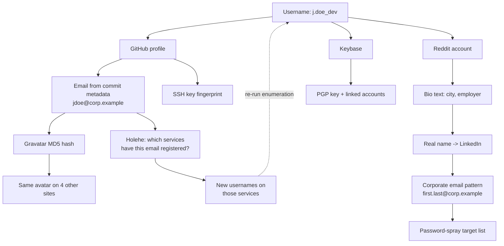
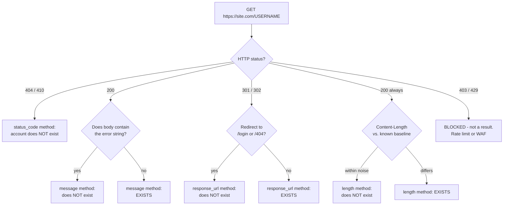
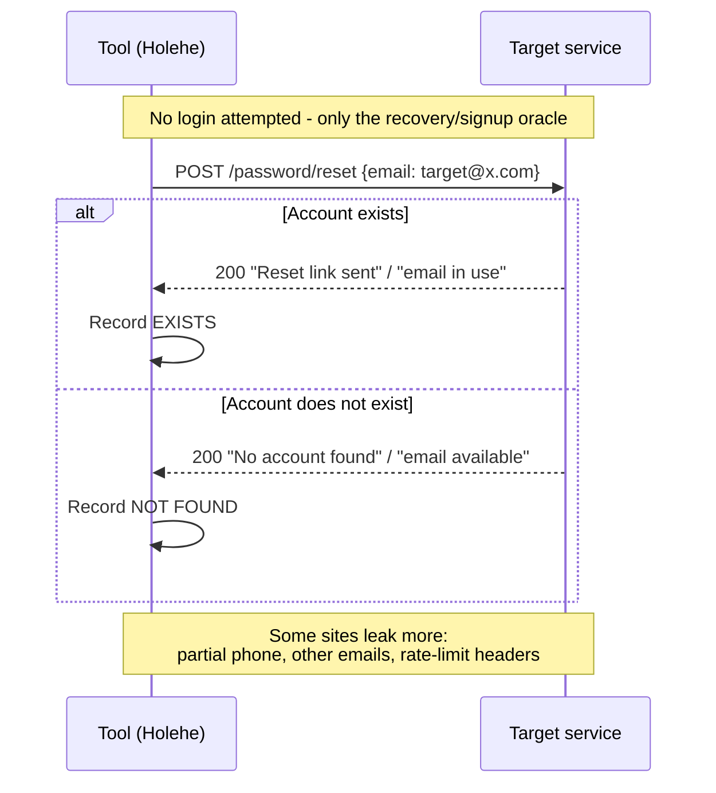
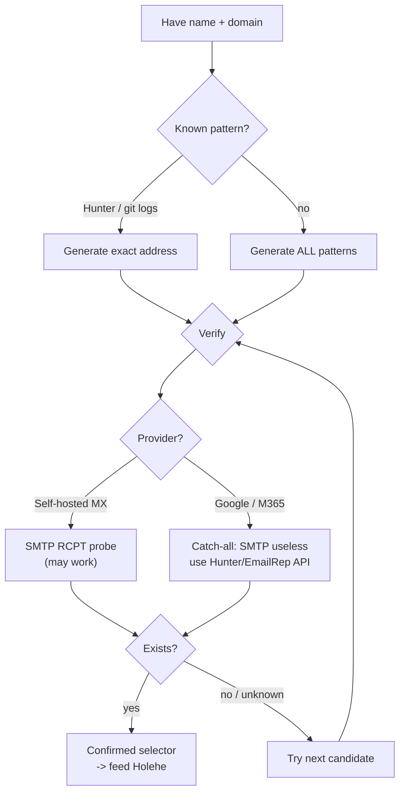
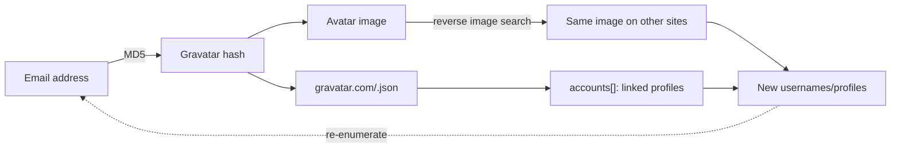
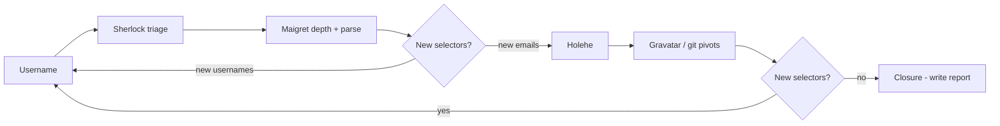
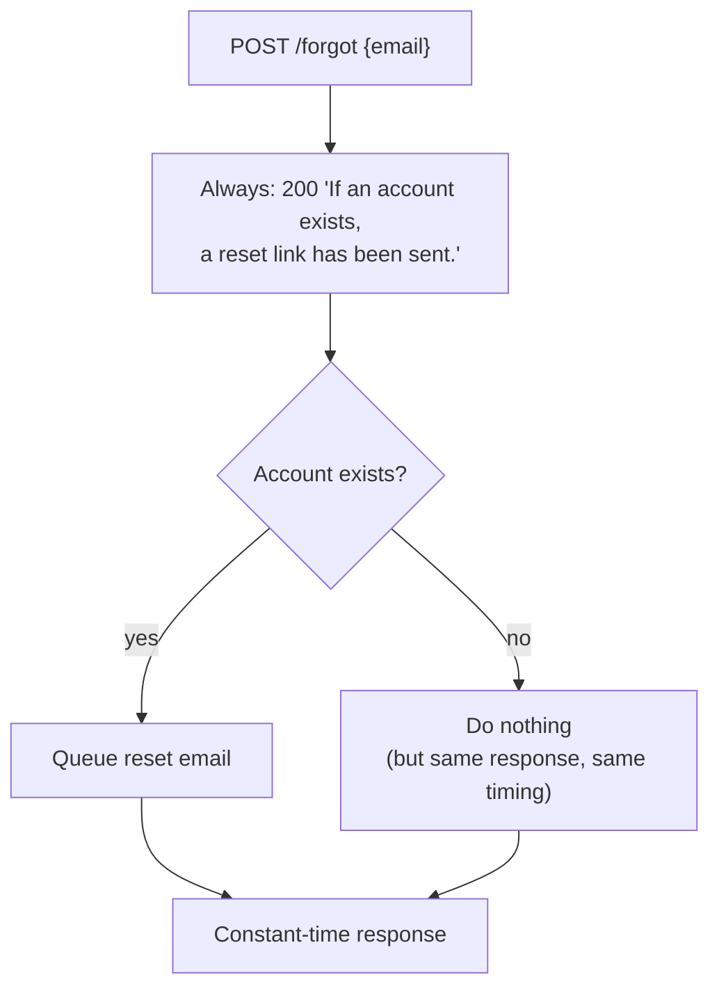

**Level:** Intermediate · **Track:** Penetration Testing · **Read time:** 195 min

This is Chapter 7 of the Recon & OSINT notebook. The previous six chapters mapped *infrastructure* — domains, DNS records, certificates, subdomains, and the frameworks that stitch them together. This chapter turns the same discipline on *people*. The input is one selector, usually a username or an email address. The output is a map of every online account that selector touches, and every new selector those accounts leak.

That matters because organisations are compromised through people far more often than through unpatched Apache builds. A developer's forgotten personal GitHub account carries the same email address as their corporate SSO login. A helpdesk technician's Twitter handle is reused as their Xbox gamertag, their Reddit account, and — six years and two breaches ago — as the username on a forum that stored passwords in MD5. Account OSINT is the process of finding those connections *before* an attacker does, or, on an authorised red-team engagement, of finding them the way an attacker would.

Everything here assumes authorised work: a scoped penetration test with social-engineering explicitly in scope, a bug-bounty programme whose policy permits it, a CTF, an OSINT competition such as TraceLabs, or investigation of your own footprint. Account OSINT touches personal data about identifiable living people, which puts it under GDPR and equivalent regimes in a way that scanning a web server does not. Part 13 covers those boundaries in detail, and they are not optional reading — they change what you are allowed to collect, not just what you are allowed to publish.

---

## Part 1: Selectors, Identities and the Pivot Graph

Before any tool, you need the data model. Investigators call the atomic units **selectors**: a single, searchable, high-uniqueness string that belongs to a person. The whole of account OSINT is the process of taking one selector, finding accounts that match it, and extracting new selectors from those accounts.

The common selectors, roughly in order of usefulness:

| Selector | Uniqueness | Why it pivots well | Typical source |
|---|---|---|---|
| Email address | Very high | It is the primary key of almost every account system on the internet | Breach data, git commits, WHOIS, `theHarvester`, contact pages |
| Username / handle | High | People reuse handles across a decade of services | Social profiles, forum posts, GitHub, code comments |
| Phone number | Very high | Ties to messaging apps, 2FA, account recovery | Signup pages, WhatsApp, breach data, PDF metadata |
| Real name | Low | Ambiguous, but anchors everything else | LinkedIn, company site, conference talks |
| Avatar image hash | Very high | Byte-identical images across sites are a near-certain link | Profile pictures, Gravatar |
| Password (from a breach) | Very high | A reused password links two accounts definitively | Breach corpora — see Chapter 8 |
| SSH/PGP key fingerprint | Very high | Cryptographically unique, published voluntarily | GitHub `/keys`, keyservers |
| API/CDN artefact (Gravatar MD5, Google GAIA ID) | Very high | Internal identifiers that are stable across products | HTTP responses, `GHunt` |

Notice the pattern: the strongest links are *machine-generated identifiers* that a person never thinks about. A user who carefully separates their work and personal Twitter accounts will still upload the same JPEG to both, and that file's SHA-256 does not care about their intentions.

The investigation itself is a graph traversal. Every account you confirm is a node; every field on that account that yields a new selector is an edge.



The dotted feedback edge is the important one. Account OSINT is **iterative, not linear**. Each pass produces selectors that feed the next pass, and you stop when a full cycle produces nothing new — a condition investigators call *closure*. Beginners run Sherlock once, get twelve hits, and stop. Practitioners run three or four cycles and end with a graph an order of magnitude larger.

**Red team usage:** the terminal node in the diagram is the deliverable. A password-spray or phishing campaign needs a validated list of usernames in the organisation's real format, and account OSINT is how you derive that format and then confirm which accounts exist.

**Blue team usage:** run the identical process against your own executives and privileged administrators. Anything you find is what an attacker will find. This is a standard, defensible security exercise, and the output — "our CFO reuses a handle that appears in four breach corpora" — is directly actionable.

---

## Part 2: How Username Enumeration Actually Works

Every username-checking tool in this chapter — Sherlock, Maigret, WhatsMyName, blackbird, socialscan — is doing the same simple thing hundreds of times in parallel: making an HTTP request to a URL that contains the username and deciding from the response whether the account exists. The whole art is in that decision. Understanding the four detection primitives is what separates someone who can read a tool's output from someone who blindly trusts it.

### The four primitives



| Method | How it decides | Reliability | Fails when |
|---|---|---|---|
| `status_code` | 200 = exists, 404 = free | Highest | Site returns a soft-404 (200 with an error page) |
| `message` | Searches the body for a known error string, e.g. `"The page you requested was not found"` | High | Site changes its copy, localises it, or renders client-side |
| `response_url` | Compares the final URL after redirects | Medium | Site redirects everything to `/login` for logged-out users |
| `length` / diff | Compares `Content-Length` to a baseline from a known-free username | Low | Any dynamic content — ads, timestamps, CSRF tokens |

Sherlock's site database encodes exactly this. A single entry from `sherlock/resources/data.json` looks like:

```json
"GitHub": {
  "errorType": "status_code",
  "url": "https://www.github.com/{}",
  "urlMain": "https://www.github.com/",
  "username_claimed": "jack",
  "regexCheck": "^[a-zA-Z0-9](?:[a-zA-Z0-9]|-(?=[a-zA-Z0-9])){0,38}$",
  "request_head_only": true
}
```

Read it field by field, because you will eventually need to write one:

- **`errorType`** — which primitive above to use. Values: `status_code`, `message`, `response_url`.
- **`url`** — the probe URL; `{}` is replaced with the username.
- **`urlMain`** — the site's homepage, used only for display in the results.
- **`username_claimed`** — a username *known to exist*, used by the project's own test suite to detect when a site has changed its behaviour and the entry has broken.
- **`regexCheck`** — a client-side validity pattern. GitHub usernames cannot contain underscores or consecutive hyphens, so a username failing this regex is skipped entirely rather than wasting a request. This is a meaningful speed optimisation across 400+ sites.
- **`request_head_only`** — send `HEAD` instead of `GET`. Faster and lighter, valid only when `errorType` is `status_code` (a `HEAD` response has no body to search).

A `message`-type entry adds an `errorMsg`:

```json
"Reddit": {
  "errorType": "message",
  "errorMsg": "Sorry, nobody on Reddit goes by that name.",
  "url": "https://www.reddit.com/user/{}",
  "urlMain": "https://www.reddit.com/",
  "username_claimed": "blue"
}
```

### Why false positives and false negatives are structural

This architecture is inherently brittle, and knowing *how* it breaks is a professional requirement:

1. **Soft 404s produce false positives.** A site that returns HTTP 200 with a "user not found" page will be reported as a hit by any `status_code` entry. Every result must be opened in a browser before it enters a report.
2. **Cloudflare, hCaptcha and WAFs produce false positives *and* negatives.** A challenge page is HTTP 403 (recorded as "not found") or HTTP 200 containing challenge HTML (recorded as "found"). Both are wrong.
3. **Login walls produce false negatives.** Instagram, Facebook and increasingly X/Twitter return a login interstitial to unauthenticated clients. The account may exist perfectly well; the tool simply cannot see it.
4. **Rate limiting silently degrades results.** After the first hundred requests some sites begin returning 429. Tools generally record this as "not found". Re-running the same query an hour later and getting different results is the classic symptom.
5. **Site databases rot.** A site redesign silently invalidates its `errorMsg`. This is why Sherlock's repository runs a CI job against `username_claimed` and why using a months-old checkout is a real accuracy problem.

> **The rule that keeps you honest:** a username-enumeration tool produces *leads*, never *findings*. Nothing enters a report until a human has loaded the URL and seen the profile. Bug-bounty triagers and engagement clients will both reject unverified enumerator output, and rightly so.

**CTF relevance:** OSINT CTFs (TraceLabs, TryHackMe's *Sakura Room*, Cyber Detective) are built almost entirely on this pivot. The flag is rarely on the first profile you find — it is in the bio of the third account that the first account's email led you to.

---

## Part 3: Sherlock — From Zero

**What it is.** Sherlock is the best-known username enumerator: a Python CLI that checks one or more usernames against a bundled database of roughly 400 sites and prints the URLs that appear to exist. It is deliberately simple — one job, fast, scriptable output.

**Why it exists.** Before Sherlock, checking handle reuse meant manually visiting dozens of URLs. Sherlock made that a single command and, more importantly, made the site database a community-maintained, version-controlled asset.

**When to reach for it.** First pass, speed over completeness, or inside a shell pipeline. When you need depth — profile parsing, recursive search, censored sites, HTML/PDF reports — you want Maigret (Part 4).

### Installation on Kali

Sherlock is packaged in Kali, but the packaged version is frequently months behind the site database, which as Part 2 explained is an accuracy problem. Prefer a source install in a virtual environment.

```bash
# Option A - distro package (fast, may be stale)
sudo apt update && sudo apt install -y sherlock
sherlock --version

# Option B - from source (recommended: current site data)
sudo apt install -y python3 python3-pip python3-venv git
git clone https://github.com/sherlock-project/sherlock.git ~/tools/sherlock
cd ~/tools/sherlock
python3 -m venv .venv
source .venv/bin/activate
python3 -m pip install --upgrade pip
python3 -m pip install -e .
sherlock --version
```

Flags explained:

- `apt install -y` — assume yes to prompts; safe for a known package, avoid in scripts you have not read.
- `python3 -m venv .venv` — creates an isolated interpreter environment in `.venv`. This matters because Kali's system Python is externally managed; installing packages into it with `pip` will either fail with `error: externally-managed-environment` or silently break apt-installed tools.
- `source .venv/bin/activate` — puts the venv's `bin` first on `$PATH` for this shell only.
- `pip install -e .` — "editable" install: the command points at your working copy, so `git pull` updates the tool and its site database in one step.

Keeping it current, which you should do at the start of every engagement:

```bash
cd ~/tools/sherlock && git pull && source .venv/bin/activate
```

### First run

```bash
sherlock octocat
```

Annotated output:

```
                                                              .
                                                             /\
                                                            /  \
[*] Checking username octocat on:

[+] GitHub: https://www.github.com/octocat
[+] Gravatar: http://en.gravatar.com/octocat
[+] Keybase: https://keybase.io/octocat
[+] Pinterest: https://www.pinterest.com/octocat/
[+] Reddit: https://www.reddit.com/user/octocat
[+] Replit.com: https://replit.com/@octocat
[+] Twitter: https://x.com/octocat
[-] 9GAG: Not Found!
[-] About.me: Not Found!
...
[*] Search completed with 34 results
```

- `[+]` — the site's detection primitive said "exists". A lead.
- `[-]` — said "does not exist". Only printed with `--print-all`; suppressed by default.
- `[!]` — an error occurred (timeout, TLS failure, connection reset). **Not** the same as "not found", and worth re-running.
- Results are written to `octocat.txt` in the current directory by default.

### Every flag that matters

| Flag | Argument | What it does | When you actually use it |
|---|---|---|---|
| `--timeout` | seconds (default 60) | Per-request timeout | Lower to `10` for speed on a good link; raise over Tor |
| `--print-all` | — | Also print `[-]` misses | Debugging a site entry; almost never otherwise |
| `--print-found` | — | Only hits (default behaviour) | Explicit in scripts |
| `--csv` | — | Write `username.csv` | Feeding a spreadsheet or `pandas` |
| `--xlsx` | — | Write an Excel workbook | Client deliverables |
| `--site` | site name | Restrict to one or more sites | Re-testing a single questionable result |
| `--proxy` | URL | Route via HTTP/SOCKS proxy | `socks5://127.0.0.1:9050` for Tor |
| `--tor` | — | Use Tor directly | Requires a local Tor daemon; slow |
| `--unique-tor` | — | New Tor circuit per request | Maximum unlinkability, very slow |
| `--json` | path/URL | Use an alternative site database | Custom or trimmed site list |
| `--folderoutput` / `-fo` | dir | Directory for result files | Keeping engagement data organised |
| `--output` / `-o` | file | Single output file (one username only) | Scripting |
| `--local` / `-l` | — | Force the bundled `data.json` | Offline work |
| `--nsfw` | — | Include adult sites (excluded by default) | Rarely; consider engagement scope and ethics first |
| `--no-color` | — | Strip ANSI codes | Piping to a file or log |
| `--browse` / `-b` | — | Open every hit in your browser | Convenient, but see the OPSEC warning below |

> **OPSEC warning on `--browse`:** this opens every result in your *real, logged-in* browser. Visiting a target's LinkedIn while authenticated as yourself puts you in their "who viewed your profile" feed. Never use `--browse` outside a sock-puppet browser profile. Chapter 3's compartmentalisation rules apply in full.

### Practical invocations

```bash
# Multiple usernames in one run
sherlock j.doe jdoe john_doe johndoe

# Organised, timed, machine-readable output for an engagement
sherlock jdoe --timeout 10 --csv --folderoutput ~/engagements/acme/osint/usernames/

# Re-check a single suspicious result
sherlock jdoe --site GitHub --site Reddit --print-all

# Through a sock-puppet SOCKS proxy
sherlock jdoe --proxy socks5://127.0.0.1:9050 --timeout 30

# Feed hits straight into a pipeline
sherlock jdoe --no-color --print-found | awk '/^\[\+\]/ {print $3}' | sort -u > hits.txt
```

The `awk` line reads: for lines starting with the literal `[+]`, print the third whitespace-separated field (the URL). `sort -u` deduplicates. This is the idiom for chaining Sherlock into `httpx`, `curl`, or a screenshotting tool.

### Generating username candidates

Sherlock only checks handles you give it, so candidate generation is your job. From a real name, mechanically produce the standard patterns:

```bash
first="john"; last="doe"
printf '%s\n' \
  "$first$last" "$first.$last" "$first_$last" "${first:0:1}$last" \
  "$first${last:0:1}" "$last$first" "$first-$last" "${first}_$last" \
  "${first:0:1}.$last" "$first${last:0:1}$RANDOM" \
  | sed 's/[^a-zA-Z0-9._-]//g' | sort -u > candidates.txt

xargs -a candidates.txt sherlock --timeout 10 --csv --folderoutput ./out/
```

`${first:0:1}` is bash substring expansion — offset 0, length 1, i.e. the first initial. `xargs -a file cmd` passes every line of the file as arguments to one invocation of the command.

**Bug-bounty note:** this is directly useful on programmes where the scope includes the organisation's own social presence or where account takeover of a *company-operated* account is in scope. It is **not** a licence to enumerate private individuals' personal accounts; almost every programme's policy forbids targeting employees personally without explicit written permission.

---

## Part 4: Maigret — From Zero

**What it is.** Maigret began as a Sherlock fork and became something substantially larger: it checks **3,000+ sites**, *parses* the profile pages it finds to extract structured data (full name, bio, location, other linked accounts, IDs), recursively searches any new usernames it discovers, and generates HTML, PDF, XMind, CSV and JSON reports.

**Why it exists.** Sherlock answers "does this handle exist here?". Maigret answers "who is this person?" — it treats each found profile as a data source, not just a boolean.

**Trade-off.** Breadth and parsing cost time. A full Maigret run on 3,000 sites takes minutes, generates far more traffic, and produces more false positives simply because the tail of its site list is less well maintained. Use `--top-sites` to control that.

### Installation

```bash
sudo apt install -y python3-venv git
python3 -m venv ~/venvs/maigret
source ~/venvs/maigret/bin/activate
pip install --upgrade pip
pip install maigret
maigret --version

# or from source, for the newest site database
git clone https://github.com/soxoj/maigret.git ~/tools/maigret
cd ~/tools/maigret && pip install -e .
```

Docker, if you would rather not manage Python:

```bash
docker run -v "$PWD/reports:/app/reports" -it soxoj/maigret:latest jdoe --html
```

`-v host:container` bind-mounts a host directory into the container so reports survive the container exiting; `-it` allocates an interactive TTY so the progress bar renders.

### First run

```bash
maigret octocat --top-sites 500 --timeout 10
```

Sample annotated output:

```
[*] Checking username octocat on:

[+] GitHub: https://github.com/octocat
       ├─ Name: The Octocat
       ├─ Created at: 2011-01-25T18:44:36Z
       ├─ Location: San Francisco
       ├─ Followers: 15000
       ├─ Gravatar URL: https://avatars.githubusercontent.com/u/583231?v=4
       └─ Bio: -
[+] Keybase: https://keybase.io/octocat
       ├─ Full name: octocat
       └─ Twitter: octocat
[+] Gravatar: https://gravatar.com/octocat
       └─ Emails (hashed): 9b6b1e...
[*] Extracted new usernames: octocat_dev, theoctocat
[*] Recursive search enabled - checking new usernames...
[*] Saved to report: reports/report_octocat.html
```

The two lines that make Maigret worth the extra runtime are `Extracted new usernames` and `Recursive search`. That is Part 1's pivot graph, automated.

### Flags that matter

| Flag | What it does | Notes |
|---|---|---|
| `--top-sites N` | Only the N most popular sites (default 500) | The single most important performance/noise dial |
| `-a`, `--all-sites` | All 3,000+ | Slow and noisy; use only when completeness matters more than time |
| `--tags` | Filter by tag, e.g. `--tags photo,dating` | Focus a run on a category |
| `--site` | One or more specific sites | Verification runs |
| `--timeout N` | Per-request timeout | `10` is a sane default |
| `--recursive-search` | Follow newly discovered usernames | On by default in recent versions; the core feature |
| `--no-recursion` | Disable the above | When you want one clean pass |
| `--id-type` | `username` (default), `yandex_public_id`, `gaia_id`, `vk_id`, `steam_id`, and more | Lets you start from a platform ID, not a handle |
| `--html` / `--pdf` / `--xmind` / `--csv` / `--json ndjson` | Report formats | `--json ndjson` is the scripting-friendly one |
| `--folderoutput` | Report directory | Keep per-engagement |
| `--proxy` / `--tor-proxy` / `--i2p-proxy` | Route traffic | Sock-puppet discipline |
| `--permute` | Auto-generate handle permutations | Saves the bash loop from Part 3 |
| `--self-check` | Validate the site database against known-good accounts | Run periodically; disables broken sites for the run |
| `--print-not-found` | Show misses | Debugging |
| `--verbose` / `--debug` | Increasing detail, including raw responses | Writing your own site entry |
| `--parse URL` | Parse a single profile URL and extract selectors from it | Excellent standalone use |
| `--submit URL` | Help add a new site to the database | Contributing back |

### The three highest-value Maigret features

**1. `--parse` on a single URL.** You do not need an enumeration run to use Maigret's extractors:

```bash
maigret --parse https://github.com/octocat
```

This returns the structured fields Maigret knows how to pull from GitHub — including, on many platforms, IDs and linked accounts you would otherwise read by hand.

**2. `--id-type` to pivot from platform IDs.** If you have a Google GAIA ID (from GHunt, Part 8) or a Yandex public ID, Maigret can search on it directly. This defeats handle changes entirely: users rename themselves, numeric IDs are permanent.

```bash
maigret 123456789012345678901 --id-type gaia_id
```

**3. Reports designed for humans.** `--html` produces a browsable report with the extracted fields inline; `--pdf` is client-deliverable; `--xmind` produces a mind map that mirrors the pivot graph and is genuinely the best way to present a footprint to a non-technical stakeholder.

```bash
maigret jdoe --top-sites 1000 --timeout 10 --html --pdf --xmind \
  --folderoutput ~/engagements/acme/osint/maigret/
```

### Sherlock vs. Maigret

| Dimension | Sherlock | Maigret |
|---|---|---|
| Sites | ~400 | 3,000+ |
| Profile parsing | No | Yes — name, bio, location, IDs, linked accounts |
| Recursive search | No | Yes |
| ID-type search | No | Yes (GAIA, Yandex, VK, Steam…) |
| Report formats | TXT, CSV, XLSX | TXT, CSV, JSON/NDJSON, HTML, PDF, XMind |
| Permutation generation | No | `--permute` |
| Typical runtime (one handle) | 20–60 s | 2–10 min |
| False-positive rate | Lower (curated list) | Higher (long tail) |
| Best for | Fast triage, pipelines | Deep single-subject investigation |

The practical workflow is both, in order: Sherlock for a 30-second read on whether the handle is reused at all, then Maigret for depth on the handles that matter.

---

## Part 5: The Email Selector and the Password-Reset Oracle

Usernames are the *broad* selector; email addresses are the *precise* one. An email address is the primary key of nearly every account system, which is exactly why enumerating "which services is this email registered on?" is both powerful and, for the target, invisible — no login attempt is made, and often no email is sent.

The mechanism that makes it possible is the **account-existence oracle** built into signup and password-reset flows. When you submit an email to a "forgot password" form, a site can respond in one of two ways:

1. *"If an account exists, we've sent a reset link."* — deliberately ambiguous. This site has been designed **not** to be an oracle. You learn nothing.
2. *"No account is registered with that email."* vs. *"A reset email is on its way."* — two distinguishable responses. This site **is** an oracle: the difference between the two responses tells you whether the account exists.

The second pattern is a real, catalogued vulnerability class — **user/account enumeration (CWE-204: Observable Response Discrepancy)** — and it is astonishingly common because the "helpful" error message is better UX. Tools like Holehe are simply automated clients for these oracles across dozens of sites at once.



There are three response categories Holehe reports, and the distinction is important:

- **`[+]` used** — the email is registered on this service.
- **`[-]` not used** — it is not.
- **`[x]` rate-limited / error** — the service blocked or errored; result unknown, not "not used".

Some oracles leak *more* than a boolean. A reset page that shows `We sent a code to (•••) •••-••42` has handed you the last two digits of the target's phone number; several show a partially masked recovery email (`j•••e@gm•••.com`), which confirms the provider and constrains the address. These partial disclosures are a large part of the value.

**Ethics and law, stated up front:** hitting a stranger's password-reset endpoint to profile them is a data-protection question, not just a technical one. On an authorised engagement this is in scope; casually, against an individual, it may not be lawful in your jurisdiction. Part 13 is mandatory reading before you run any of this against a real person.

---

## Part 6: Holehe — From Zero

**What it is.** Holehe is a Python tool (and importable library) that takes an email address and checks 120+ sites to determine whether an account is registered, using each site's signup or password-reset oracle. Crucially, it does **not** send a notification to the target on the sites where it works correctly — it reads the oracle's response without completing the flow.

**Why it exists.** It automates the Part 5 oracle across many services at once, turning a tedious manual process into one command, and it surfaces the partial-disclosure leaks (phone digits, recovery-email hints) that manual checking often misses.

### Installation

```bash
python3 -m venv ~/venvs/holehe
source ~/venvs/holehe/bin/activate
pip install holehe
holehe --help

# from source for latest modules
git clone https://github.com/megadose/holehe.git ~/tools/holehe
cd ~/tools/holehe && python3 setup.py install
```

### First run

```bash
holehe target@example.com
```

Annotated output:

```
*********************
   email@example.com
*********************
[+] Used
[-] Not used
[x] Rate limit
[?] No data

Twitter                 [-]
Instagram               [+]      <- account exists
Spotify                 [+]
Discord                 [-]
Pinterest               [+]
Adobe                   [+]
Github                  [-]
Wordpress               [x]      <- rate-limited, UNKNOWN
...
[+] Used (23) / [-] Not used (74) / [x] Rate limit (8) / [?] No data (15)
```

Read this as: 23 confirmed registrations, 8 sites where the answer is genuinely unknown (re-run later), and the rest either free or non-oracle. The `[+]` list is the map of that email's account footprint.

### Flags

| Flag | What it does |
|---|---|
| `--only-used` / `-C` | Print only `[+]` results — the signal, not the noise |
| `--no-clear` | Do not clear the terminal before printing |
| `-T` / `--timeout` | Per-request timeout in seconds |
| (positional) | The email address, or a file of them with a shell loop |

```bash
# Just the confirmed accounts, saved
holehe --only-used target@example.com | tee holehe_target.txt

# Batch over a list of candidate emails
while read -r e; do
  echo "=== $e ==="
  holehe --only-used "$e"
done < emails.txt | tee holehe_all.txt
```

### Holehe as a library — the CSV that Maigret can't make

Because Holehe is importable, you can produce structured output and merge it with your username data:

```python
import trio, httpx, csv
from holehe.modules.social_media.instagram import instagram
from holehe.modules.social_media.twitter import twitter
from holehe.modules.crm.hubspot import hubspot

async def check(email):
    out = []
    async with httpx.AsyncClient() as client:
        for mod in (instagram, twitter, hubspot):
            await mod(email, client, out)
    return out

results = trio.run(check, "target@example.com")
with open("holehe.csv", "w", newline="") as f:
    w = csv.DictWriter(f, fieldnames=["name", "domain", "exists", "emailrecovery", "phoneNumber"])
    w.writeheader()
    for r in results:
        w.writerow({k: r.get(k) for k in w.fieldnames})
```

Each module appends a dict with `name`, `domain`, `exists` (True/False/None), and — the payoff — `emailrecovery` and `phoneNumber` when the oracle leaked them. `trio` is the async runtime Holehe is built on; `trio.run` executes the async entry point.

**Blue team usage:** the defensive mirror of Holehe is *removing your oracles*. Run it against your own organisation's domains and executive emails, then verify that your own password-reset flow returns the ambiguous "if an account exists…" response, closing CWE-204. Finding your CEO's personal email registered on twenty consumer sites is also a concrete phishing-risk briefing.

---

## Part 7: Building and Verifying Email Addresses

Often you have a name and a domain but not the email. Corporate email follows a small number of patterns, and deriving then verifying the right one is a core skill — it is the difference between a phishing list that bounces and one that lands.

### The common patterns

| Pattern | Example for *John Doe* @acme.com |
|---|---|
| `first.last` | john.doe@acme.com |
| `flast` | jdoe@acme.com |
| `first` | john@acme.com |
| `firstl` | johnd@acme.com |
| `first_last` | john_doe@acme.com |
| `lastf` | doej@acme.com |
| `f.last` | j.doe@acme.com |

Generate all of them mechanically:

```bash
python3 - "John" "Doe" "acme.com" << 'PY'
import sys
f, l, d = sys.argv[1].lower(), sys.argv[2].lower(), sys.argv[3]
fi, li = f[0], l[0]
patterns = [f"{f}.{l}", f"{fi}{l}", f"{f}", f"{f}{li}", f"{f}_{l}",
            f"{l}{fi}", f"{fi}.{l}", f"{l}.{f}", f"{f}{l}", f"{fi}{li}"]
for p in patterns:
    print(f"{p}@{d}")
PY
```

### Finding the organisation's actual pattern

Guessing is a last resort. First *observe* the real pattern from public data:

- **Git commit metadata** — `git log --format='%ae'` on any public repo of the company exposes real developer addresses (covered fully in Part 9).
- **`theHarvester -d acme.com -b all`** (Chapter 6) — harvests emails from search engines and other sources.
- **Hunter.io** — maintains a database of company email patterns and verified addresses. Its API returns the pattern directly:

```bash
curl -s "https://api.hunter.io/v2/domain-search?domain=acme.com&api_key=$HUNTER_KEY" \
  | jq -r '.data.pattern, (.data.emails[].value)'
# -> "{f}{last}"   (the org's canonical pattern)
# -> jsmith@acme.com ...
```

`jq -r` extracts raw (unquoted) fields; the first line is Hunter's inferred pattern, so you no longer have to guess.

### Verifying without sending mail

Once you have candidates, confirm which ones exist:

**1. SMTP `RCPT TO` probing.** The historical technique: connect to the domain's mail server and ask whether it will accept mail for an address, without sending any.

```bash
# Find the mail exchanger, then probe it
dig +short MX acme.com | sort -n | head -1
# e.g. 10 mail.acme.com.

nc -C mail.acme.com 25 <<'SMTP'
HELO probe.example.com
MAIL FROM:<check@probe.example.com>
RCPT TO:<john.doe@acme.com>
QUIT
SMTP
```

Interpreting the `RCPT TO` response:

- `250 2.1.5 Recipient OK` — the mailbox is accepted (likely exists).
- `550 5.1.1 User unknown` — rejected (likely does not exist).
- `252 Cannot VRFY user` / `450` greylist — inconclusive.

`nc -C` sends CRLF line endings, which SMTP requires. **Caveat, and it is a big one:** most modern providers (Google Workspace, Microsoft 365) defeat this deliberately — they accept every `RCPT TO` with 250 (**catch-all / accept-all**) and bounce non-existent addresses *later*, so a 250 means nothing. Probing also generates connection logs on the target's mail server and can trip abuse defences. Treat SMTP probing as a legacy technique that works only against self-hosted, permissive mail servers.

**2. API-based verification (preferred).** Services that verify addresses out-of-band and normalise the catch-all problem:

```bash
# EmailRep - reputation and existence signal, generous free tier
curl -s "https://emailrep.io/john.doe@acme.com" -H "Key: $EMAILREP_KEY" \
  | jq '{reputation, suspicious, references, "profiles": .details.profiles, "breach": .details.credentials_leaked}'

# Hunter email verifier - explicit deliverability status
curl -s "https://api.hunter.io/v2/email-verifier?email=john.doe@acme.com&api_key=$HUNTER_KEY" \
  | jq '.data | {status, result, score, "accept_all": .accept_all, smtp_check}'
```

Hunter's `result` field returns `deliverable`, `undeliverable`, `risky`, or `unknown`, and `accept_all: true` is exactly the catch-all warning that tells you SMTP probing would have lied to you.

**3. `socialscan`** verifies whether an email *or username* is available or taken on a curated set of sites with high accuracy (it uses each site's real registration validation, not guesswork):

```bash
pip install socialscan
socialscan john.doe@acme.com jdoe --json out.json
```

### The verification decision tree



---

## Part 8: The Wider Toolkit

Sherlock, Maigret and Holehe are the core three, but a complete investigation reaches for several specialised tools. Learn what each *uniquely* does so you know when to reach for it.

| Tool | Input | Unique capability |
|---|---|---|
| **WhatsMyName** | username | The community-maintained `wmn-data.json` site list (600+), the *de facto* standard database many other tools consume; run via `whatsmyname` CLI or web at whatsmyname.app |
| **blackbird** | username / email | Fast async checker with a clean web UI and PDF export; often catches sites Sherlock's list misses |
| **socialscan** | username or email | Verifies *availability vs. taken* using real registration validation — very low false-positive rate |
| **GHunt** | Google account (email/GAIA ID) | Extracts Google-account data: name, profile photo, GAIA ID, Maps reviews, calendar visibility, YouTube channel. Requires exporting your own Google cookies |
| **Epieos** | email or phone | Web service that reveals Google/Microsoft account existence, connected services, and a Gravatar/photo pivot — a hosted Holehe-plus |
| **gitrecon** / **gitfive** | GitHub/GitLab username or email | Extracts all emails and names a user has committed under, and reverse-maps an email to GitHub accounts (Part 9) |
| **maigret --parse** | any profile URL | Pulls structured selectors from a single page without a full scan |
| **h8mail** | email | Breach-data lookup for an email (bridges into Chapter 8) |
| **toutatis** | Instagram username | Extracts obfuscated email/phone hints from an Instagram account |
| **PhoneInfoga** | phone number | The phone-selector equivalent — carrier, region, footprint |

### GHunt — the Google pivot

Google accounts are a goldmine because one Gmail address links a name, a public profile photo, Maps reviews (which geolocate the person), a YouTube channel, and the permanent GAIA ID that survives handle changes.

```bash
pipx install ghunt          # pipx keeps CLI tools isolated
ghunt login                 # paste cookies from YOUR sock-puppet Google session
ghunt email target@gmail.com
```

Typical extraction: the display name, the profile picture URL (feed it to a reverse-image search), the **GAIA ID** (feed it to `maigret --id-type gaia_id`), whether Google Maps reviews are public (each review is a geolocated timestamped data point), and calendar visibility. GHunt requires your own authenticated cookies, so it must run under a sock-puppet Google account, never your real one.

### Epieos — the fast hosted check

For a single email, Epieos (epieos.com) returns in seconds whether a Google and Microsoft account exist, the Google account's public name and photo, and a set of connected services — a hosted, no-install complement to Holehe that also handles the Google side Holehe does not.

---

## Part 9: The Avatar and Git-Metadata Pivots

Two pivots deserve their own section because they produce *cryptographically strong* links — the kind that stand up in a report because they are not judgement calls.

### Gravatar / avatar hashing

Gravatar keys every avatar to the **MD5 of the lowercased, trimmed email address**. This cuts both ways:

```bash
# email -> gravatar profile & photo (confirms the email is a Gravatar account)
python3 -c "import hashlib,sys; print(hashlib.md5(sys.argv[1].strip().lower().encode()).hexdigest())" john.doe@acme.com
# -> e5e3e6...  ->  https://www.gravatar.com/avatar/e5e3e6...  and  https://gravatar.com/e5e3e6....json
curl -s "https://gravatar.com/e5e3e6...json" | jq '.entry[0] | {displayName, aboutMe, accounts, urls}'
```

The `.json` endpoint frequently returns a **`accounts` array of linked social profiles the user added themselves** — a free, high-confidence pivot straight from an email to a set of confirmed accounts. Many sites (GitHub, WordPress, Stack Overflow) use Gravatar, so the same MD5 links the person's avatar across all of them.

The reverse pivot: any avatar image you find can be reverse-searched. Download it and run it through Google Lens, Yandex Images (best for faces), TinEye, or PimEyes. **Byte-identical images across two sites are a near-certain identity link** — people reuse the exact same JPEG far more than they reuse text.



### Git-metadata extraction

Every git commit records `author.name` and `author.email` — the address configured on the developer's machine, which is very often their *personal* email even on corporate repos. This is one of the most reliable ways to bridge a corporate identity to a personal one.

```bash
# Every distinct name/email pair that has ever committed to a repo
git clone --bare https://github.com/acme/webapp.git && cd webapp.git
git log --all --format='%an <%ae>' | sort -u

# Without cloning - the GitHub API exposes the commit email on public pushes
curl -s "https://api.github.com/users/jdoe/events/public" \
  | jq -r '.. | .email? // empty' | sort -u

# gitrecon automates both directions
pip install gitrecon
gitrecon -u jdoe          # username  -> all emails/names committed
gitrecon -r acme/webapp   # repo      -> all contributor identities
```

A developer who commits from their laptop as `john@personal.com` on a work repo has just linked their corporate GitHub identity to a personal address that Holehe can then explode across 120 consumer sites. This chain — *public repo → commit email → Holehe → personal accounts → breach lookup (Chapter 8)* — is one of the highest-yield in all of account OSINT.

**Blue team usage:** enforce `git config user.email` hygiene (a commit-msg or pre-receive hook that rejects non-corporate addresses), and be aware that even after the fact, the history retains old addresses. GitHub's *noreply* email option (`user@users.noreply.github.com`) exists precisely to break this pivot; recommend it internally.

---

## Part 10: OPSEC and Rate-Limit Reality

Account OSINT is *mostly* passive — you query third-party services, not the target directly — but it is not consequence-free, and the two failure modes are getting *yourself* logged and getting your *results silently corrupted*.

### Attribution: don't let the tools burn you

- **Never enumerate from a browser logged into your real identity.** `sherlock --browse`, opening Maigret's HTML report and clicking links, or manually verifying a hit while authenticated all put you in the target's visitor logs (LinkedIn's "who viewed your profile" is the classic). Use a dedicated sock-puppet browser profile (Chapter 3).
- **Route enumeration through a proxy when the volume is high.** All three core tools accept `--proxy socks5://127.0.0.1:9050` for Tor, or a residential/VPN SOCKS proxy. Tor is slow and some sites block Tor exit nodes outright (producing false negatives), so it is a trade-off, not a default.
- **Sock-puppet accounts for GHunt/authenticated tools.** Anything requiring your cookies (GHunt, some Epieos features) must use a purpose-built account that is not linked to you. Never your real Google login.
- **Your queries are themselves telemetry.** Hunter.io, EmailRep, Epieos, Shodan and similar hosted services log every lookup against your API key. On a sensitive engagement, assume the service knows what you searched.

### Rate limits: the silent accuracy killer

Every tool in this chapter degrades under rate limiting by *recording blocked requests as "not found"* rather than erroring loudly. Concrete defences:

| Symptom | Cause | Mitigation |
|---|---|---|
| Second run returns different hits | Rate limit / temporary block on run 1 | Re-run, `diff` the results, trust the union of confirmed hits |
| Cluster of `[x]`/`[!]` errors | You are being throttled | Raise `--timeout`, lower concurrency, spread over time |
| Everything on one platform is "not found" | IP or Tor-exit block | Switch proxy, or verify those sites manually |
| Holehe all `[x]` for a provider | That provider changed its oracle or blocked you | Re-run later; verify manually; the module may be stale |

The golden rule: **run the important selectors two or three times, on different exits, and take the union of confirmed positives.** A single run is a snapshot through a lossy channel.

### Site-database freshness

Sherlock's, Maigret's and WhatsMyName's accuracy is only as good as their site lists. `git pull` before every engagement, and use Maigret's `--self-check` (and Sherlock's implicit CI-tested list) to disable entries that have broken. A six-month-old checkout will give you both false negatives (dead entries) and false positives (sites whose error strings changed).

---

## Part 11: End-to-End Hands-On Lab

**Objective.** Take a single username, produce a validated, deduplicated footprint across accounts and emails, extract every new selector, iterate to closure, and emit a merged report — using only accounts and infrastructure you own or are authorised to test. Use your *own* handle for practice: you know ground truth, so you can measure each tool's error rate.

**Setup.**

```bash
mkdir -p ~/lab/acct-osint && cd ~/lab/acct-osint
export TARGET_USER="your_own_handle"          # a handle you control
source ~/venvs/maigret/bin/activate 2>/dev/null || true
```

### Step 1 — Fast triage with Sherlock

```bash
sherlock "$TARGET_USER" --timeout 10 --csv --folderoutput ./sherlock/
awk -F',' 'NR>1 && $3=="Claimed"{print $2","$4}' sherlock/${TARGET_USER}.csv | tee sherlock_hits.csv
```

The CSV columns are `username,name,exists,http_status,response_time`; `$3=="Claimed"` filters to confirmed hits. Expected:

```
GitHub,https://github.com/your_own_handle
Reddit,https://www.reddit.com/user/your_own_handle
Keybase,https://keybase.io/your_own_handle
```

### Step 2 — Depth with Maigret (recursive, parsed)

```bash
maigret "$TARGET_USER" --top-sites 1500 --timeout 10 \
  --json ndjson --html --xmind --folderoutput ./maigret/
# pull every newly-discovered username and every extracted email out of the NDJSON
jq -r 'select(.status=="claimed") | .site_name + " -> " + .url' maigret/report_${TARGET_USER}.ndjson | sort -u
jq -r '.. | .username? // empty, .email? // empty' maigret/report_${TARGET_USER}.ndjson | sort -u > new_selectors.txt
cat new_selectors.txt
```

Expected `new_selectors.txt` (Maigret parsed these out of the profile pages):

```
john.doe@personal.example
theRealHandle
your_own_handle_dev
```

### Step 3 — Explode the emails with Holehe

```bash
grep '@' new_selectors.txt > emails.txt
while read -r e; do
  echo "=== $e ==="
  holehe --only-used "$e"
done < emails.txt | tee holehe_out.txt
```

Expected fragment:

```
=== john.doe@personal.example ===
Instagram   [+]
Spotify     [+]
Adobe       [+]
Twitter     [+]
```

### Step 4 — Gravatar and git pivots

```bash
# Gravatar accounts array straight from the email
for e in $(cat emails.txt); do
  h=$(python3 -c "import hashlib,sys;print(hashlib.md5(sys.argv[1].strip().lower().encode()).hexdigest())" "$e")
  echo "== $e ($h) =="
  curl -s "https://gravatar.com/${h}.json" | jq -r '.entry[0].accounts[]?.url' 2>/dev/null
done

# If a GitHub account was found, harvest commit emails
gitrecon -u "$TARGET_USER" 2>/dev/null | tee gitrecon_out.txt
```

### Step 5 — Iterate to closure

Feed any *new* usernames from Steps 2–4 back into Step 1, and any *new* emails back into Step 3. Repeat until a full cycle yields nothing new.



### Step 6 — Merge everything into one correlation file

```python
#!/usr/bin/env python3
# merge.py - collapse all tool outputs into one graph keyed by selector
import json, csv, glob, os, collections

graph = collections.defaultdict(lambda: {"accounts": set(), "emails": set(), "source": set()})

# Sherlock CSV
for path in glob.glob("sherlock/*.csv"):
    with open(path) as f:
        for row in csv.DictReader(f):
            if row.get("exists") == "Claimed":
                graph[row["username"]]["accounts"].add(row["url"])
                graph[row["username"]]["source"].add("sherlock")

# Maigret NDJSON
for path in glob.glob("maigret/*.ndjson"):
    for line in open(path):
        try: rec = json.loads(line)
        except json.JSONDecodeError: continue
        if rec.get("status") == "claimed":
            u = rec.get("username", "?")
            graph[u]["accounts"].add(rec.get("url", ""))
            if rec.get("email"): graph[u]["emails"].add(rec["email"])
            graph[u]["source"].add("maigret")

# Holehe text (=== email === blocks, [+] lines)
cur = None
if os.path.exists("holehe_out.txt"):
    for line in open("holehe_out.txt"):
        line = line.strip()
        if line.startswith("==="):
            cur = line.strip("= ").strip()
        elif line.endswith("[+]") and cur:
            graph[cur]["accounts"].add(line.split()[0])
            graph[cur]["source"].add("holehe")

with open("footprint.json", "w") as f:
    json.dump({k: {kk: sorted(vv) for kk, vv in v.items()} for k, v in graph.items()},
              f, indent=2)
print(f"Merged {len(graph)} selectors -> footprint.json")
for sel, d in graph.items():
    print(f"\n[{sel}]  ({', '.join(sorted(d['source']))})")
    for a in sorted(d["accounts"]): print(f"   - {a}")
```

```bash
python3 merge.py
```

`footprint.json` is now a single normalised graph of the entire investigation, keyed by selector — exactly the deliverable a client or team lead wants, and the input to a Maltego import (Chapter 6) if you want it visualised.

**What the lab teaches beyond the commands:** run it against your *own* handle and you will see the false-positive rate directly — a couple of Sherlock "hits" that are soft-404s, a Holehe `[x]` that flips to `[+]` on the second run. That is the entire point of Part 2 made concrete.

---

## Part 12: Real-World Application

### Red team — from handle to phishing list

The account-OSINT chain is how a red team builds a *validated* target list before ever sending a phish:

1. `theHarvester` + LinkedIn scraping → employee names.
2. Hunter.io / git-log pattern → the org's canonical email format.
3. Generate candidate corporate emails from the names.
4. Holehe / Epieos / socialscan → confirm which of those emails have external account footprints (an employee with a personal account under a *predictable* corporate-adjacent email is a softer target).
5. Sherlock/Maigret on the personal handles → find the reused passwords lead (Chapter 8) and the interests for pretexting.
6. Deliverable: a spreadsheet of *confirmed* employees, in the *real* email format, ranked by external exposure — a spray/phish target list grounded in evidence, not guesses.

### Bug bounty — account enumeration as the finding itself

The oracle in Part 5 is not just a tool input; it is often *the reportable bug*. If a program's own application returns distinguishable responses for existing vs. non-existing accounts on login, signup, or password reset, that is a valid **user-enumeration** submission (CWE-204), frequently paid, especially when chained with a weak lockout policy into credential stuffing. Demonstrate it with the exact two responses side by side:

```bash
# existing account
curl -s -o /dev/null -w "%{http_code} %{size_download}\n" \
  -d 'email=known@target.com' https://target.com/api/forgot
# 200 148
# non-existent account
curl -s -o /dev/null -w "%{http_code} %{size_download}\n" \
  -d 'email=nope$RANDOM@target.com' https://target.com/api/forgot
# 200 96      <- different size = observable discrepancy = the bug
```

The `%{size_download}` difference (148 vs 96 bytes) is the observable discrepancy; that byte-count delta *is* the proof.

### Blue team / insider-threat — footprint your own people

Running this whole chapter against your own privileged users is a legitimate, valuable exercise:

- Executives and admins whose personal handles/emails appear in breach corpora (Chapter 8) are your credential-stuffing exposure — force resets and hardware 2FA.
- A public-facing employee whose Maps reviews (via GHunt) reveal their home neighbourhood is a physical-security and doxxing concern worth a quiet word.
- Developers committing under personal emails are a supply-chain-adjacent risk; fix the git hygiene.

The output is a prioritised remediation list, not a gotcha.

---

## Part 13: Legal and Ethical Boundaries

This is the part you cannot skim. Account OSINT collects **personal data about identifiable living people**, which places it squarely under data-protection law in a way infrastructure recon is not.

- **Publicly accessible ≠ free to process.** Under the GDPR (and UK GDPR, and similar regimes), an email address or handle tied to a person is *personal data* even when public. Collecting and storing it needs a lawful basis — for authorised security work that is usually "legitimate interests" or a contract with the client, *documented in the engagement scope*. "It was on the internet" is not, by itself, a lawful basis.
- **Password-reset oracle probing against individuals may be unlawful.** Automating account-existence checks against a private person, outside an authorised engagement, can constitute unauthorised processing and — depending on jurisdiction and intent — brush against computer-misuse statutes (CFAA in the US, the Computer Misuse Act in the UK). On an engagement it must be explicitly in scope and authorised in writing.
- **Data minimisation and retention.** Collect only what the objective needs, and decide the deletion date *before* you collect. An engagement report full of an employee's personal-life data that isn't relevant to the security finding is a liability, not thoroughness.
- **Special-category data.** Health, sexuality, religion, political views inferred from someone's accounts (a dating profile, a support forum) are *special-category* data with a far higher legal bar. Do not collect it unless it is directly and necessarily in scope, and flag it to the client rather than putting it in a report casually.
- **Social engineering must be authorised.** Turning this recon into a phish or a pretext call requires social-engineering to be explicitly in the rules of engagement. Chapter 2 of the Pentest Methodology notebook covers the scoping paperwork.
- **Minors.** If any selector resolves to a minor, stop and escalate to your engagement lead. This is a bright line.

The professional test: *could you defend every record you collected, to the data-protection regulator, as necessary for an authorised objective?* If not, do not collect it.

---

## Part 14: Detection & Defense Angle

Everything above is the offensive and investigative view. Here is the consolidated defensive posture — how organisations *detect* account enumeration against their own systems and *reduce* the footprint attackers can build.

### Closing your own oracles (the highest-impact fix)

The single most effective defence is to stop being an oracle. Every user-facing flow — login, signup, password reset, "check username availability" — must return **identical responses** whether or not the account exists:



Concretely: identical response body, identical status code, and **constant-time** processing (a naive implementation that hashes a password only when the account exists leaks existence through response *timing* even when the body is identical — add a dummy hash on the not-found path). The username-availability check on signup is the hardest to hide, so rate-limit and CAPTCHA it heavily.

### Detecting enumeration in your telemetry

Username/email enumeration has a recognisable signature — many requests to auth/recovery endpoints, many distinct target identifiers, from few source IPs, over a short window:

| Signal | Detection logic | Where |
|---|---|---|
| Many distinct emails to `/forgot` from one IP | `count(distinct email) by src_ip > threshold / 5 min` | WAF / SIEM |
| High 404 rate on `/user/{name}` profile URLs | Profile-endpoint 404 ratio spike | Web logs |
| Bursts of reset requests, low completion rate | `reset_requested` ≫ `reset_completed` | App metrics |
| Requests distributed to defeat IP thresholds | `count(distinct email) by ASN / user-agent cluster` | SIEM correlation |
| Known-tool user agents / request cadence | Signature/behavioural rules | WAF |

A Sigma-style rule for the reset-enumeration pattern:

```yaml
title: Password Reset Account Enumeration
logsource:
  category: webserver
detection:
  selection:
    uri_path: '/api/forgot'
    http_method: 'POST'
  timeframe: 5m
  condition: selection | count(distinct(email_param)) by src_ip > 25
level: medium
```

### Reducing the footprint attackers can build

You cannot delete third-party accounts your staff created, but you can shrink exposure:

- **Enforce corporate-email git hygiene** (Part 9) — pre-receive hooks rejecting personal author emails, and GitHub *noreply* addresses.
- **Brief high-value staff** (executives, admins, IR team) to compartmentalise handles and use unique per-site emails (`+` aliases or a catch-all), which breaks the cross-site handle-reuse pivot at its root.
- **Monitor for your own domains in breach feeds** (Chapter 8) and force resets proactively — the credential-stuffing follow-on to enumeration is the real damage.
- **Rate-limit and 2FA everywhere**, so that even a perfect enumeration list cannot be sprayed effectively. Hardware/passkey 2FA defeats the whole downstream chain.
- **Run this chapter against yourself quarterly.** The best measure of your exposure is the attacker's own toolkit pointed inward.

---

## Part 15: Final Revision / Summary

- **Account OSINT is graph traversal over selectors.** One username or email → confirmed accounts → new selectors → repeat until *closure*. The machine-generated identifiers (avatar hash, GAIA ID, git commit email, PGP fingerprint) give the strongest links because the target never thinks to compartmentalise them.
- **Username enumeration uses four brittle primitives** — status code, body message, redirect URL, response length. Every tool is doing HTTP request + response classification, so soft-404s, WAFs, login walls and rate limits produce structural false positives and negatives. **A hit is a lead, never a finding, until a human loads the URL.**
- **Sherlock** = fast, ~400 sites, scriptable, first-pass triage. **Maigret** = 3,000+ sites, *parses* profiles, recursive, ID-type search, human-readable reports; the deep tool. Run Sherlock then Maigret.
- **Email enumeration rides the password-reset/signup oracle** (CWE-204). **Holehe** automates it across 120+ sites without notifying the target and surfaces partial leaks (phone digits, recovery-email hints).
- **Building/verifying emails:** derive the pattern from git logs / Hunter.io rather than guessing; verify with API services because SMTP `RCPT` probing is defeated by Google/M365 catch-all.
- **Pivots that stand up in a report:** Gravatar `accounts[]` and reverse-image search (byte-identical avatars), and git commit metadata bridging corporate → personal identity.
- **OPSEC:** never enumerate or verify from your real logged-in identity; proxy high-volume work; run important selectors 2–3× and take the union — a single run is a lossy snapshot.
- **Law:** public ≠ free-to-process. Personal data needs a lawful basis, minimisation, and a retention plan. Reset-oracle probing against individuals outside an engagement can be unlawful.
- **Defense:** close your oracles (identical, constant-time responses), detect the many-identifiers-few-sources signature, and shrink the footprint (git hygiene, staff briefing, breach monitoring, universal 2FA).

---

## Part 16: Cheat Sheet / Quick Reference

**Sherlock**

```bash
sherlock USER                                   # single handle
sherlock u1 u2 u3 --timeout 10 --csv -fo ./out/ # multi, timed, CSV
sherlock USER --site GitHub --print-all         # verify one site
sherlock USER --proxy socks5://127.0.0.1:9050   # via Tor/sock-puppet
git -C ~/tools/sherlock pull                    # refresh site DB
```

**Maigret**

```bash
maigret USER --top-sites 1500 --timeout 10 --html --xmind   # deep + reports
maigret --parse https://github.com/USER                     # parse one URL
maigret ID --id-type gaia_id                                # pivot from GAIA
maigret USER --json ndjson -fo ./out/                       # scriptable output
maigret USER --self-check                                   # validate site DB
```

**Holehe**

```bash
holehe EMAIL --only-used            # confirmed registrations only
while read e; do holehe -C "$e"; done < emails.txt   # batch
```

**Email build / verify**

```bash
dig +short MX domain.com | sort -n | head -1                    # find MX
curl -s "https://api.hunter.io/v2/domain-search?domain=D&api_key=$K" | jq '.data.pattern'
curl -s "https://api.hunter.io/v2/email-verifier?email=E&api_key=$K" | jq '.data.result'
socialscan EMAIL USER --json out.json                           # availability
```

**Pivots**

```bash
# Gravatar: email -> hash -> linked accounts
python3 -c "import hashlib,sys;print(hashlib.md5(sys.argv[1].strip().lower().encode()).hexdigest())" EMAIL
curl -s "https://gravatar.com/<hash>.json" | jq '.entry[0].accounts'
gitrecon -u USER            # username -> commit emails
ghunt email EMAIL          # Google account data (needs sock-puppet cookies)
```

**Detection-primitive reminder**

| `errorType` | Decision | Weak against |
|---|---|---|
| `status_code` | 200=exists, 404=free | soft-404 |
| `message` | body contains error string | copy change, localisation, JS render |
| `response_url` | final URL after redirect | universal `/login` redirect |
| length/diff | Content-Length vs baseline | any dynamic content |

**Golden rules:** hit = lead, not finding · run 2–3× and union · never `--browse` from your real identity · public ≠ lawful to process · close your own oracles.

---

## Part 17: Common Pitfalls

1. **Trusting a `[+]` without opening it.** Soft-404s and WAF challenge pages both read as hits. Verify in a sock-puppet browser before it enters a report.
2. **Treating a rate-limited `[x]`/`[!]` as "not found".** It means *unknown*. Re-run later and diff.
3. **Running a stale site database.** Months-old Sherlock/Maigret gives both false negatives (dead entries) and false positives (changed error strings). `git pull` every engagement.
4. **Using `sherlock --browse` on your real login.** Instant self-doxx into the target's visitor logs. Sock-puppet profile only.
5. **Believing SMTP `RCPT TO` on Google/M365.** Catch-all accepts everything with 250. Use API verifiers; check Hunter's `accept_all` flag.
6. **Only doing one pass.** Account OSINT is iterative. Beginners stop at twelve Sherlock hits; the value is in cycles 2–4 driven by extracted emails and avatars.
7. **Guessing email patterns instead of observing them.** Git logs and Hunter reveal the *real* pattern; guessing produces a bouncing phish list.
8. **Ignoring the Gravatar `.json` accounts array.** A free, high-confidence email→accounts pivot people constantly overlook.
9. **Collecting special-category data casually.** A target's dating/health/religious accounts are a legal liability in a report unless directly in scope.
10. **No retention plan.** Personal data with no deletion date is a data-protection failure waiting to happen. Decide the delete date before you collect.
11. **Enumerating individuals' reset oracles outside an engagement.** May be unlawful; keep it scoped and authorised.
12. **Reporting the whole footprint as "the finding".** The footprint is context; the *finding* is the specific exposure (reused breached password, enumerable endpoint, home-location leak). Lead with that.

---

## Part 18: Practice Labs & Resources

**Do it against yourself first.** The single best lab is Part 11 run against your own handle and email — you know ground truth, so you can measure each tool's false-positive and false-negative rate directly, which no external target teaches you.

**Guided OSINT rooms (people-pivot focused)**

- **TryHackMe — "Sakura Room"**: the canonical username → social → GitHub → infrastructure pivot chain; it *is* this chapter as a room. Do it manually first, then reproduce it with Sherlock/Maigret/gitrecon.
- **TryHackMe — "OhSINT"** and **"Searchlight - IMINT"**: metadata and image-intelligence pivots — the reverse-image / avatar half of Part 9.
- **TryHackMe — "OSINT" / "Google Dorking"** path: rounds out selectors this chapter feeds from.
- **HackTheBox Academy — "OSINT: Corporate Recon"**: structured, includes email-pattern derivation and people enumeration.

**OSINT competitions (the real thing, lawfully)**

- **TraceLabs Search Party CTF**: real missing-persons OSINT run several times a year; the scoring rewards exactly the selector-pivot discipline in Part 1, and it is the best possible practice in handling sensitive personal data responsibly.
- **Cyber Detective CTF** and **Sofia Santos / Quiztime** puzzles: daily/weekly people- and image-pivot practice.

**Bug-bounty application (the account-enumeration *finding*)**

- On a public **HackerOne**/**Bugcrowd** program that permits it, test login/signup/reset for the CWE-204 observable-discrepancy pattern from Part 12, with a proper two-response PoC. Read disclosed reports tagged *user enumeration* / *account enumeration* first to calibrate what triagers accept and how they want it demonstrated.
- Study disclosed reports where enumeration was *chained* with weak lockout into credential stuffing — that chain is what raises severity and payout.

**Tool sources to keep current**

- Sherlock (`sherlock-project/sherlock`), Maigret (`soxoj/maigret`), Holehe (`megadose/holehe`), WhatsMyName data (`WebBreacher/WhatsMyName`), GHunt (`mxrch/ghunt`), gitrecon (`GONZOsint/gitrecon`) — star and `git pull` regularly; the site databases are the product.
- **socialscan**, **blackbird**, **Epieos** (hosted), **PhoneInfoga** (phone selector) round out the kit for specific selectors.

**Where this goes next.** Chapter 8 takes the confirmed emails and usernames this chapter produced and looks them up in **breach data, credential leaks, and dark-web sources** — turning "this account exists" into "here is the password it used", which is where account OSINT becomes an authentication attack.

---

*Also on [Praneeth's portfolio](https://ping-praneeth.vercel.app/notebook/pentest-recon-osint/07-username-email-and-account-osint-sherlock-maigret-and-holehe), with comments and the latest edits.*
