**Level:** Intermediate · **Track:** Penetration Testing · **Read time:** 200 min

This is Chapter 8 of the Recon & OSINT notebook. Chapter 7 turned a single username or email into a map of the accounts a person owns. This chapter takes the natural next step: given that map, what has already leaked about those accounts — which passwords, which hashes, which sessions — and how do you find that out lawfully, verify it, and feed it back into an engagement.

Breach data is the single highest-signal source in all of OSINT and also the single most legally dangerous. A verified email-plus-password pair from a breach corpus is worth more to an attacker than a month of subdomain enumeration, because it may be a working credential *right now* against a target's VPN, mail portal, or SSO. That same power is why the topic sits under data-protection law, computer-misuse law, and — in several jurisdictions — laws on the *possession* of stolen personal data, not merely its use. Everything in this chapter assumes authorised work: a penetration test whose scope explicitly includes credential exposure, a red-team engagement with breach-OSINT in the rules of engagement, a bug-bounty programme whose policy permits it, an OSINT competition such as TraceLabs, or an assessment of your own or your own organisation's exposure. Part 13 covers the legal boundaries in detail and is not optional reading — it changes what you are permitted to *download and hold*, not just what you may act on.

We will build the topic in the same order an attacker's data does: how a breach happens, how the dump travels from the compromised server to a searchable market, what is actually inside it, how to query it through legitimate services and your own tooling, how those credentials get weaponised, and how defenders detect and blunt the whole chain.

---

## Part 1: What a "Breach" Actually Is

The word *breach* is used loosely to mean everything from a single leaked spreadsheet to a nation-state intrusion. For OSINT you need a precise, mechanical definition, because the type of breach determines what data you will find and how reliable it is.

A **data breach**, in the sense that matters here, is any event where a dataset containing personal identifiers — at minimum email addresses or usernames, often with passwords or password hashes — leaves the control of the organisation that held it and ends up in the hands of people who were not authorised to have it. That covers a spectrum:

| Breach type | How the data escaped | Typical contents | Reliability for OSINT |
|---|---|---|---|
| Application-database dump | SQLi, exposed backup, insider export | `users` table: email, username, password hash, join date | High — structured, schema intact |
| Credential-store compromise | Compromised auth DB, LDAP export | email/username + hash + salt | High |
| Cloud-storage exposure | Public S3 bucket, open Elasticsearch/Mongo | Whatever the app stored, often unhashed | Medium–High, but often unverified |
| Stealer log (infostealer) | Malware on a victim endpoint | Live plaintext creds + cookies + autofill, per-machine | Very high freshness, per-victim not per-site |
| Combolist | Aggregated/derived from many sources | `email:password` lines, provenance stripped | Low — often recycled, unverified, fabricated |
| Scrape (not strictly a breach) | Public API abuse | profile fields, no passwords | Medium for enrichment, no creds |

The distinction that matters most for a recon analyst is **structured breach vs combolist vs stealer log**, because they answer different questions:

- A **structured breach** (an actual `users` table from one site) tells you *"this person had an account on site X, and here is the credential material site X stored."* You know the source, so you can reason about the hash algorithm and whether the password is likely still in use.
- A **combolist** tells you *"somewhere, this email was seen with this password."* Provenance is gone. It might be real, recycled from an older breach, or entirely fabricated to pad a list for sale. It is a lead, never a fact.
- A **stealer log** tells you *"on this specific date, this specific machine was infected, and here is every credential the browser had saved on it, in plaintext, plus the session cookies."* It is per-victim, extremely fresh, and the most dangerous of the three because it bypasses password hashing entirely and often bypasses MFA via stolen session cookies.

Understanding which kind of artefact you are holding is the whole discipline. Treating a combolist as if it were a verified breach is how OSINT investigations produce false accusations and how pentest reports lose credibility.

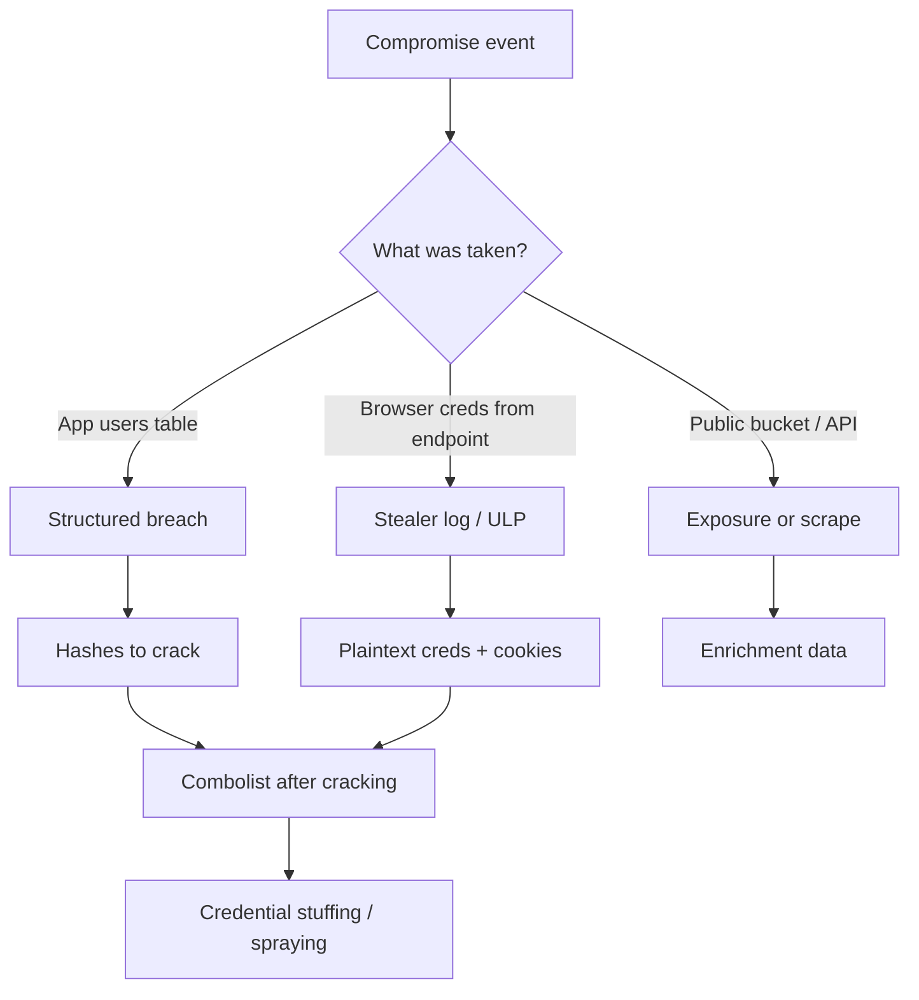

**Security relevance:** the moment you can classify an artefact, you can predict its usefulness. A bcrypt hash from a 2019 forum breach is nearly worthless for immediate access (slow to crack, probably rotated). A stealer log from last week containing `sso.target.com` cookies is an active incident. Same word, "breach", wildly different operational meaning.

---

## Part 2: The Anatomy of a Dump

Open any real structured breach and you are looking at an export of a relational table, usually one of three physical formats: a SQL dump (`INSERT INTO users VALUES (...)`), a CSV/TSV, or a delimited flat file. Learning to read one quickly is a core skill, so here is a synthetic but realistic example — **all values below are fabricated for teaching and match no real person**:

```sql
-- Fabricated example: forum_users export
INSERT INTO `users` (`id`,`email`,`username`,`password`,`salt`,`registered`,`last_ip`) VALUES
(1001,'alice@example.com','alice_h','5f4dcc3b5aa765d61d8327deb882cf99','',1462076400,'203.0.113.14'),
(1002,'bob@example.org','bobby','$2y$10$N9qo8uLOickgx2ZMRZoMy.Mrq4dYh0y','',1470850800,'198.51.100.7'),
(1003,'carol@example.net','carol','7c6a180b36896a0a8c02787eeafb0e4c','x9F2',1488355200,'192.0.2.55');
```

Read it like an analyst:

- **Row 1001** — the `password` field is a 32-hex-character string and `salt` is empty. Thirty-two hex chars is the fingerprint of **MD5** (or NTLM — same length, different construction; more in Part 3). The value `5f4dcc3b5aa765d61d8327deb882cf99` is, in fact, the MD5 of the literal string `password`. Unsalted MD5 of a top-10 password: this cracks instantly.
- **Row 1002** — `$2y$10$...` is the unmistakable prefix of a **bcrypt** hash. `$2y$` is the algorithm variant, `10` is the cost factor (2^10 = 1024 key-expansion rounds), and the rest encodes salt+digest together. Bcrypt is deliberately slow; this row resists cracking and tells you the site's developers knew what they were doing.
- **Row 1003** — 32 hex chars *and* a populated `salt` column (`x9F2`). This is salted MD5, almost certainly `md5(password + salt)` or `md5(salt + password)`. Salting defeats precomputed rainbow tables but does nothing against a targeted dictionary attack once you know the salt.

The `registered` column is a Unix epoch timestamp — `1462076400` is May 2016 — which dates the account and, by proxy, the era of the breach. `last_ip` is a bonus selector: it may geolocate the user or tie two accounts together if the same IP appears in another breach.

Turning a raw SQL dump into a clean CSV you can index (Part 9) is a two-command job. Real dumps are messy — multiple `INSERT` statements, escaped quotes, `NULL`s — so extract the tuples rather than trying to parse SQL properly:

```bash
# Pull the VALUES tuples out of every INSERT INTO users line and flatten to CSV-ish rows
grep -i "INSERT INTO \`users\`" dump.sql \
  | grep -oE '\([0-9]+,[^)]*\)' \
  | tr -d '()' | sed "s/','/,/g; s/'//g"
# 1001,alice@example.com,alice_h,5f4dcc3b5aa765d61d8327deb882cf99,,1462076400,203.0.113.14
# 1002,bob@example.org,bobby,$2y$10$N9qo8uLOickgx2ZMRZoMy.Mrq4dYh0y,,1470850800,198.51.100.7
```

`grep -oE '\([0-9]+,[^)]*\)'` grabs each `( ... )` value tuple beginning with a numeric id; `tr -d '()'` strips the parentheses; the `sed` collapses the quote-comma-quote field separators. It is deliberately crude — for production you would use a real MySQL parser — but for triage it turns an unusable multi-megabyte `.sql` file into rows you can pipe straight into the SQLite import from Part 9.2.

The **field inventory** you build from a dump is itself intelligence. A schema with `security_question`, `security_answer`, `dob`, and `phone` is a goldmine for account-recovery attacks (the reset oracles from Chapter 7). A schema with only `email` and `password_hash` is narrower but cleaner.

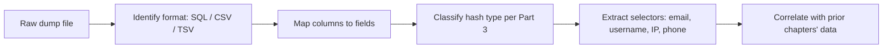

**Pentester landing on a client's exposure:** your job is rarely to crack every hash. It is to answer, "does any employee's password from any breach still work against a client system?" That means extracting `email:hash`, cracking only the weak ones, and testing the resulting plaintext against the *client's* login — never against the breached site.

---

## Part 3: Hash Formats You Will Actually Meet

You cannot use breach data without identifying hashes, so this part teaches the formats from zero. A **cryptographic hash** is a one-way function: it turns an input of any size into a fixed-size output (the *digest*), and there is no efficient way to reverse it. Password storage uses hashes so that a stolen database does not immediately reveal passwords. "Cracking" a hash means guessing inputs, hashing each guess, and comparing — you never reverse the function, you race it.

The identifying features are **length**, **character set**, and **prefix/structure**.

| Algorithm | Example (fabricated) | Length / shape | Salted by design? | Cracking speed on a GPU |
|---|---|---|---|---|
| MD5 | `5f4dcc3b5aa765d61d8327deb882cf99` | 32 hex | No | Extremely fast (tens of GH/s) |
| SHA-1 | `5baa61e4c9b93f3f0682250b6cf8331b7ee68fd8` | 40 hex | No | Very fast |
| SHA-256 | `5e884898da...` (64 hex) | 64 hex | No | Fast |
| NTLM | `8846f7eaee8fb117ad06bdd830b7586c` | 32 hex | No | Extremely fast |
| bcrypt | `$2y$10$N9qo8uLOickgx2ZMRZoMy...` | `$2a/2b/2y$cost$` + 53 | Yes (built-in) | Very slow (by design) |
| sha512crypt | `$6$rounds=5000$salt$hash` | `$6$...` | Yes | Slow |
| Argon2 | `$argon2id$v=19$m=65536,t=3,p=4$...` | `$argon2...` | Yes | Very slow (memory-hard) |
| MD5(Unix) | `$1$salt$hash` | `$1$...` | Yes | Moderate |

Two traps to internalise:

1. **MD5 and NTLM look identical** — both are 32 hex characters — but they are different algorithms. MD5 hashes a raw byte string; NTLM hashes the UTF-16-LE encoding of the password with MD4. The password `password` is `5f4dcc3b5aa765d61d8327deb882cf99` in MD5 but `8846f7eaee8fb117ad06bdd830b7586c` in NTLM. You disambiguate by **context**: a Windows/AD-sourced dump is NTLM; a web-app dump is MD5. Guess wrong and every crack attempt fails silently.
2. **Length tells you the family, structure tells you the exact mode.** Anything starting with `$` is a *modular crypt format* string that self-describes its algorithm in the prefix. Anything that is bare hex is unsalted unless a separate salt column exists.

The standard identifier tools:

```bash
# hashid: pip install hashid — pattern-matches a hash against known formats
hashid '5f4dcc3b5aa765d61d8327deb882cf99'
# Analyzing '5f4dcc3b5aa765d61d8327deb882cf99'
# [+] MD4
# [+] MD5
# [+] NTLM
# ...  (it lists candidates; context narrows them)

# name-that-hash (nth): pip install name-that-hash — modern, ranks by likelihood
nth -t '$2y$10$N9qo8uLOickgx2ZMRZoMy.Mrq4dYh0y'
# Most likely: bcrypt
```

`hashid` and `name-that-hash` do not crack anything — they classify. `name-that-hash` (invoked as `nth`) is the more useful of the two because it ranks candidates and prints the matching hashcat/John mode number, which you need in the very next step. **Teach-from-scratch note:** you will meet both `hashcat` (GPU cracker) and `John the Ripper` (`john`, CPU-first, extremely flexible) later in the notebook's cracking chapter; here we only need to *identify*, then feed the mode number forward.

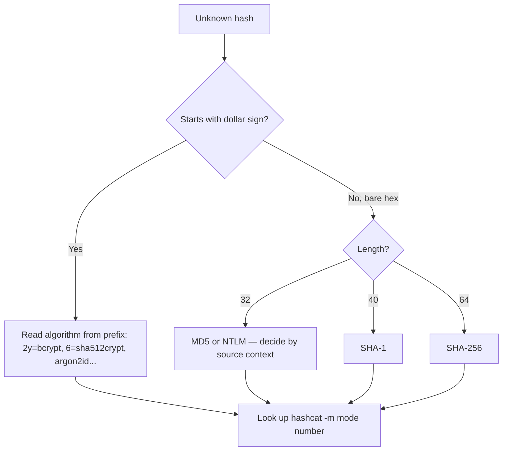

**Blue team usage:** the same identification skill tells a defender how bad a breach of *their* systems is. If your leaked table is bcrypt with cost 12, you have time to force a reset before most passwords crack. If it is unsalted MD5, assume every weak and medium password is already plaintext in an attacker's hands and treat the reset as an emergency.

### Prove the MD5-vs-NTLM difference to yourself

Do not take the "same length, different algorithm" claim on faith — reproduce it. Both commands below hash the literal string `password`:

```bash
# MD5 of the raw ASCII bytes
echo -n 'password' | md5sum
# 5f4dcc3b5aa765d61d8327deb882cf99  -

# NTLM = MD4 of the UTF-16-LE encoding. iconv does the re-encoding; openssl does the MD4.
echo -n 'password' | iconv -f ASCII -t UTF-16LE | openssl dgst -md4
# MD4(stdin)= 8846f7eaee8fb117ad06bdd830b7586c
```

Same input, same output length, two completely different 32-hex strings. That is why "32 hex characters" is never enough — you *must* know whether the dump came from a web app (MD5) or a Windows/AD system (NTLM) before you pick a cracking mode. A Domain Controller `NTDS.dit` extraction, a `secretsdump.py` output, or anything mentioning SAM/LSASS is NTLM territory; a PHP/MySQL `users` table is almost always MD5.

### Why salting changes the economics

An **unsalted** hash means identical passwords produce identical digests. That has two consequences an attacker loves: (1) you can precompute a **rainbow table** — a giant lookup of `hash → plaintext` — once and reuse it against every unsalted dump forever, and (2) within a single dump, every account that shares a digest shares a password, so cracking one cracks them all. The `5f4dcc3b...` value appearing on 400 rows means 400 people chose `password`.

A **salt** is a per-user random value concatenated with the password before hashing: `md5(salt + password)`. It does not slow down a single guess, but it destroys both attacker advantages — the rainbow table is useless (it would need to be recomputed per salt), and identical passwords now produce different digests, so each account must be attacked individually. This is why a salted-MD5 dump with the salt column present is *slower* to mass-crack than unsalted MD5, even though per-hash speed is identical.

| Property | Unsalted MD5 | Salted MD5 (salt known) | bcrypt (cost 10+) |
|---|---|---|---|
| Rainbow tables work? | Yes | No | No |
| Identical pw → identical hash? | Yes | No | No |
| Per-guess speed | GH/s | GH/s | ~thousands/s |
| Mass-crack a whole dump | Trivial | Per-user, still fast | Impractical at scale |
| Realistic recon verdict | Crack all | Crack the weak ones | Report as exposed, skip cracking |

The takeaway for triage in Part 9: bare-hex + empty salt = crack everything; bare-hex + salt column = crack the weak/common ones; `$`-prefixed slow hash = report exposure, do not burn GPU time.

---

## Part 4: Have I Been Pwned — The API and the Discipline

**Have I Been Pwned (HIBP)** is the canonical, lawful starting point for breach OSINT. It is a free service run by security researcher Troy Hunt that aggregates known breaches and lets you check whether an email address or password appears in any of them, *without* handing you the underlying stolen passwords. That restraint is exactly what makes it lawful to use in almost any context: it returns *metadata* ("this email was in the LinkedIn 2012 breach") rather than credentials.

**What HIBP is, from zero:**

- A searchable index of hundreds of breaches, each with a name, date, description, and the list of *data classes* exposed (emails, passwords, phone numbers, etc.).
- An account-search API: given an email, it returns which breaches contained it.
- A **Pwned Passwords** API: given a password (or its hash), it tells you how many times that password has appeared across breaches — used to block weak passwords at signup.
- A **domain search**: prove you control a domain and HIBP will list every breached address on it — the single most useful HIBP feature for defending or assessing an organisation.

The account-breach API requires a paid API key (rate-limited, cheap); Pwned Passwords is free and keyless. Here is the account lookup:

```bash
# Requires an API key in the hibp-api-key header. truncateResponse=false returns full breach objects.
curl -s -H "hibp-api-key: $HIBP_KEY" \
  -H "user-agent: recon-lab" \
  "https://haveibeenpwned.com/api/v3/breachedaccount/alice@example.com?truncateResponse=false" | jq '.[].Name'
# "Collection1"
# "LinkedIn"
# "MyFitnessPal"
```

A `404` means the address is not in any known breach (good news, or the breach simply is not indexed). A `200` returns a JSON array of breach objects. Read the `DataClasses` field of each — an appearance in a breach that exposed only email addresses is far less serious than one that exposed passwords.

The **Pwned Passwords** endpoint is more clever and worth understanding in depth, because it is the model for privacy-preserving lookups everywhere.

---

## Part 5: The k-Anonymity Range Model (Why You Never Send the Password)

Checking whether a password has been breached seems to require sending the password to a server — which would be insane. HIBP solves this with a **k-anonymity range query**, and understanding it teaches a pattern you will reuse.

The mechanism:

1. Hash the candidate password with **SHA-1** (chosen for legacy reasons; the range trick is algorithm-agnostic).
2. Split the 40-character hex digest into a **5-character prefix** and a **35-character suffix**.
3. Send **only the prefix** to the API.
4. The API returns *every* suffix in its database that shares that prefix — typically a few hundred to a thousand lines — each with a count of how many times it was seen.
5. You search that returned list **locally** for your suffix. If it is there, the password is breached; if not, it is not. The server never learned which password you were checking.

```bash
# Password: "P@ssw0rd"
# 1. SHA-1 it:
echo -n 'P@ssw0rd' | sha1sum
# 21bd12dc183f740ee76f27b78eb39c8ad972a757  -

# 2. prefix = 21BD1, suffix = 2DC183F740EE76F27B78EB39C8AD972A757
# 3. Query only the prefix (note: Add-Padding header hides the response size)
curl -s -H "Add-Padding: true" https://api.pwnedpasswords.com/range/21BD1 \
  | grep -i '2DC183F740EE76F27B78EB39C8AD972A757'
# 2DC183F740EE76F27B78EB39C8AD972A757:83158
```

The `:83158` means that exact password hash has appeared 83,158 times across indexed breaches — a hard block at any sane signup form. Had `grep` returned nothing, the password would be absent from the corpus.

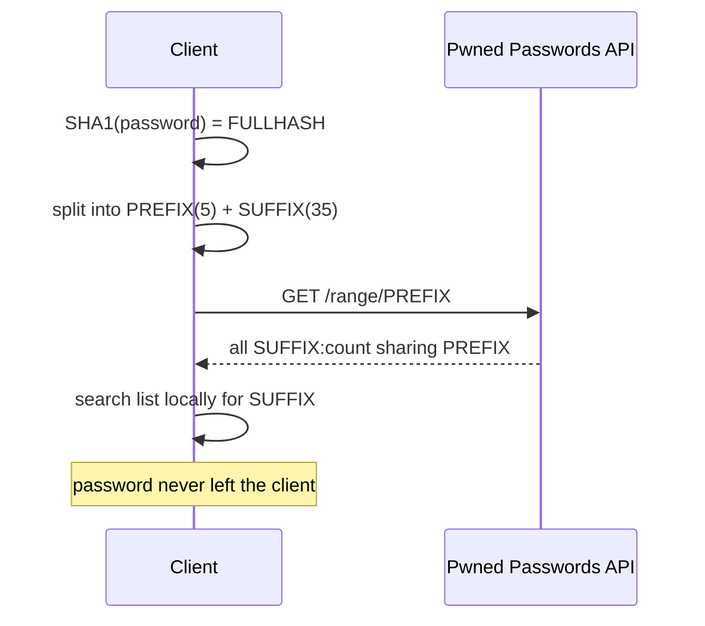

**Why k-anonymity matters for OSINT tooling:** it means you can build a password-exposure checker into your own recon scripts *safely and lawfully* — you are only ever sending 5 hex characters, which map to tens of thousands of possible passwords, so the server cannot deanonymise your query. **Blue team usage:** this exact endpoint is what "check password against known breaches" features in enterprise IdPs (Azure AD Password Protection, Okta, Auth0) call under the hood. **The `Add-Padding: true` header** pads every response to a uniform size so a network observer cannot infer which prefix you queried from the response length — a defence-in-depth detail worth copying in your own privacy-sensitive APIs.

### A complete, self-contained Pwned Passwords checker

Here is the whole pattern in ~20 lines of Python — no API key, nothing leaves the client but a 5-char prefix. Copy-pasteable and dependency-light (just `requests`):

```python
#!/usr/bin/env python3
# pwcheck.py — lawful breached-password check via k-anonymity range query.
import hashlib, sys, requests

def times_pwned(password: str) -> int:
    # 1. SHA-1, uppercase hex (the API returns uppercase suffixes)
    sha1 = hashlib.sha1(password.encode("utf-8")).hexdigest().upper()
    prefix, suffix = sha1[:5], sha1[5:]
    # 2. send ONLY the 5-char prefix; ask for size-padding
    r = requests.get(f"https://api.pwnedpasswords.com/range/{prefix}",
                     headers={"Add-Padding": "true", "User-Agent": "recon-lab"})
    r.raise_for_status()
    # 3. scan the returned suffix:count lines locally
    for line in r.text.splitlines():
        suf, count = line.split(":")
        if suf == suffix:
            return int(count)
    return 0

if __name__ == "__main__":
    pw = sys.argv[1] if len(sys.argv) > 1 else input("password: ")
    n = times_pwned(pw)
    print(f"seen {n:,} times — {'DO NOT USE' if n else 'not in corpus'}")
```

```text
$ python3 pwcheck.py 'P@ssw0rd'
seen 83,158 times — DO NOT USE
$ python3 pwcheck.py 'c0rrect-h0rse-b4ttery-st4ple-9271'
seen 0 times — not in corpus
```

The `r.raise_for_status()` guards against silent failures (a `429` rate-limit returns HTML, not counts); `line.split(":")` parses the `SUFFIX:COUNT` rows; the padding rows the server injects have a count of `0` and a suffix that will never match, so they are harmless. Drop `times_pwned()` into a signup handler and you have exactly the "block breached passwords" control from Part 12 — the offensive knowledge and the defensive fix are the same twenty lines.

---

## Part 6: The Commercial Breach-Lookup Services

HIBP deliberately does *not* give you passwords. For authorised engagements where the scope includes demonstrating actual credential exposure, several commercial services do return the underlying data. They differ in coverage, data model, and — critically — the ethics/legality of how you use them. Know what each one is before you reach for it.

| Service | Model | Returns plaintext/hash? | Best for | Caution |
|---|---|---|---|---|
| **Dehashed** | Paid, per-query or subscription; web + API | Yes — email, username, password, hash, name, address, phone | Broad structured-breach search across many fields | Powerful; treat every result as regulated personal data |
| **Snusbase** | Paid subscription; web + API | Yes | Fast search, hash lookups, some cracking | Same legal weight |
| **LeakCheck** | Paid; API | Yes / partial | Email + username lookups, source attribution | Verify source claims |
| **Intelligence X (IntelX)** | Paid tiers; web + API | Yes — plus pastes, darknet, documents | Selector search across pastes, leaks, darknet, WHOIS history | Very broad; results need triage |
| **HIBP** | Free/cheap key | **No** — metadata only | Lawful first pass, domain monitoring | The safe default |
| **Pwned Passwords** | Free | Count only | Password-strength checks | — |

The professional workflow is a **funnel**: start with HIBP (metadata, lawful, tells you *whether and where* an address is exposed), and only escalate to a plaintext-returning service when the engagement's rules of engagement explicitly authorise handling breach *credentials* and you have a concrete need (e.g. proving a reused password reaches a client system). Dehashed's API is representative:

```bash
# Dehashed API v2 style query (illustrative — endpoint/params per current docs).
# Search by email; response includes entries with source, and any of
# username/password/hashed_password/name fields present in the source breach.
curl -s -u "$DEHASHED_EMAIL:$DEHASHED_KEY" \
  'https://api.dehashed.com/search?query=email:alice@example.com' \
  -H 'Accept: application/json' | jq '.entries[] | {db:.database_name, user:.username, pw:.password, hash:.hashed_password}'
```

`IntelX` broadens the definition of "breach" to include **pastes** (Pastebin-style leaks), **darknet** content, and leaked **documents**, searchable by any selector — email, domain, IP, Bitcoin address, even a phone number. It is the tool you reach for when a simple credential lookup comes back empty but you suspect the selector appears in a paste or a forum dump.

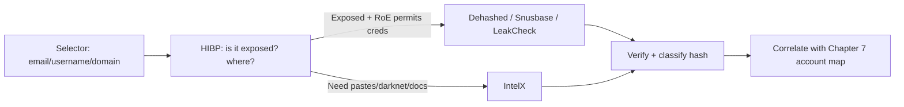

**Rules-of-engagement gate:** none of these paid services should be touched on an engagement unless the client has signed off on the handling of third-party breach data about their staff — because you are about to download other people's passwords onto your machine. That is a data-processing act with legal weight (Part 13). On bug-bounty programmes, check the policy: many explicitly forbid using breach corpora against the target.

---

## Part 7: Combolists, ULPs and the Stealer-Log Economy

Modern credential leakage is dominated not by classic database dumps but by **infostealer malware** and the **combolists** derived from everything. This is the part of the topic that has changed most in recent years, and it is where the freshest, most dangerous data lives.

**Combolist** — the simplest artefact. A plain-text file of `email:password` or `user:password` lines, one per row, aggregated from many sources with all provenance stripped:

```
alice@example.com:Summer2023!
bob@example.org:hunter2
carol@example.net:Qwerty123
```

Combolists are the ammunition for credential stuffing (Part 8). They are cheap, enormous (the infamous "Collection #1" was ~2.7 billion rows), and **low-quality**: heavily recycled, full of dead credentials, and padded with fabricated lines. Never treat a combolist hit as a verified fact about a person.

**ULP — "URL:Login:Password"** — the combolist's more useful cousin, and the native output of infostealers. Each line ties a credential to the exact site it was entered on:

```
https://sso.example-corp.com/login|jdoe@example-corp.com|Winter2024!
https://mail.example-corp.com|jdoe@example-corp.com|Winter2024!
android://com.example.app|jdoe|A9x!qL2
```

The URL context is gold: it tells you *which* service the credential unlocks, so you are not blindly stuffing. A ULP line pointing at a client's SSO portal with a plausible corporate password is a near-actionable finding.

**Stealer logs** — the raw material. An **infostealer** (RedLine, Raccoon, Vidar, Lumma, and successors) is malware that runs on a victim's endpoint and exfiltrates everything the browser and OS have saved: stored passwords, autofill data, browser **cookies/session tokens**, crypto-wallet files, and system metadata. The output is a per-victim archive — one folder per infected machine — typically containing files like `passwords.txt`, `cookies.txt`, `autofills.txt`, and a `system.txt` with the machine's hostname, OS, and installed software.

Why stealer logs are the most dangerous artefact in this chapter:

- They are **plaintext**. No hashing to defeat — the malware grabbed passwords after the browser decrypted them.
- They include **session cookies**, which can let an attacker **replay an authenticated session and bypass MFA entirely** — no password prompt, no second factor.
- They are **fresh**, often days old, so the credentials are likely still valid.
- They are **contextual**: `system.txt` reveals whether the victim is a home user or is logged into corporate SaaS, letting attackers triage for "corporate access" and sell those logs at a premium.

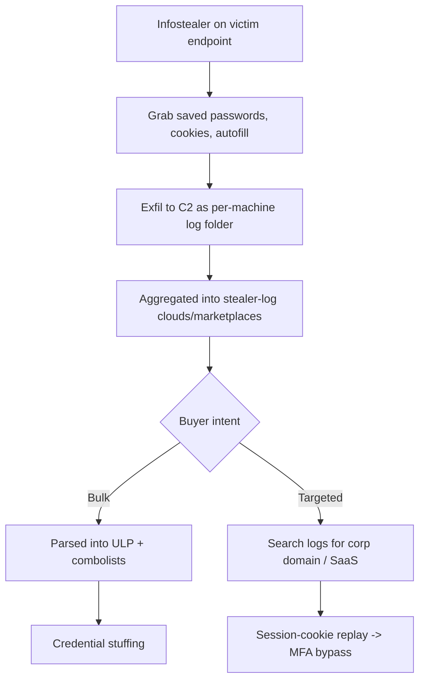

**Red team usage (lab-scoped, conceptual):** on an authorised engagement, discovering that an employee's endpoint appears in a stealer-log corpus — with the client's SSO cookie present — is one of the highest-severity recon findings possible, because it is a live, MFA-bypassing access path. The finding is reported; the cookie is not replayed against production without explicit, written authorisation to do so. **Blue team usage:** stealer-log monitoring services (SpyCloud, Flare, Hudson Rock's Cavalier, and similar) exist precisely so defenders can learn "an employee's machine is infected and their session cookies are for sale" *before* the attacker acts — and force a session invalidation + password reset + endpoint reimage.

### The physical layout of a stealer log

Knowing what a log folder actually looks like turns a vague concept into something you can parse. A single infected-machine archive from a typical stealer expands to a predictable tree (structure below is a sanitised, teaching-only representation — no real victim data):

```
LOG_2f9a.../
├── Passwords.txt          # every saved browser credential, plaintext
├── Cookies/
│   ├── Chrome_Default.txt  # Netscape cookie format: domain, flag, path, secure, expiry, name, value
│   └── Edge_Default.txt
├── Autofills.txt          # names, addresses, phone numbers, sometimes card metadata
├── System.txt             # hostname, OS build, CPU, installed AV, IP, country
├── Screenshot.jpg         # desktop capture at time of infection
└── ImportantAutofills.txt # search-engine queries, high-value form data
```

`Passwords.txt` is the payload for credential attacks. Its lines are usually a small repeated block:

```
URL: https://sso.example-corp.com/adfs/ls/
Username: jdoe@example-corp.com
Password: Winter2024!

URL: https://github.com/login
Username: john.doe.personal
Password: Winter2024!
```

Two lessons jump out. First, this is where the **ULP** format (Part 7) originates — a parser just flattens these blocks into `url|user|pass`. Second, look at the reuse: the same `Winter2024!` unlocks both the corporate ADFS portal and a personal GitHub. That single log has linked a work identity to a personal one *and* handed over a working corporate password — the exact pivot Chapter 7 was building toward.

`System.txt` is what lets attackers *triage at scale*. A line like `Country: DE | AV: Windows Defender | Domain: EXAMPLE-CORP` flags the machine as a corporate, under-protected, in-jurisdiction target — logs carrying a recognised corporate domain sell for far more than a random home PC's. `Cookies/` is the MFA-bypass material: an unexpired session cookie for `sso.example-corp.com` can be imported into an attacker browser to resume an already-authenticated session.

**IR use case:** when a defender obtains one of their employees' logs from a monitoring feed, `System.txt`'s hostname tells them *which asset to reimage*, `Passwords.txt` tells them *every credential to rotate*, and `Cookies/` tells them *which sessions to forcibly invalidate*. The response is never "reset the one password" — it is "reimage the endpoint, rotate everything on it, kill every session."

---

## Part 8: Credential Stuffing vs Password Spraying — and the Maths

Breach data is only dangerous because of **password reuse**. Two attack techniques weaponise it, and confusing them is a common beginner error.

**Credential stuffing** takes *known* `email:password` pairs from breaches and replays them against many *different* target sites, betting that the user reused the password. One pair, many sites (or many pairs against one site's login). The success rate per pair is low — commonly cited industry figures sit around **0.1–2%** — but at combolist scale (millions of pairs) that still yields thousands of account takeovers.

**Password spraying** flips the ratio: take *one* (or a few) common passwords and try them against *many* usernames, one attempt per account per round, to stay under lockout thresholds. It does not require breach data at all (you can spray `Winter2024!` blind), but breach data makes it smarter by revealing the target org's password *patterns*.

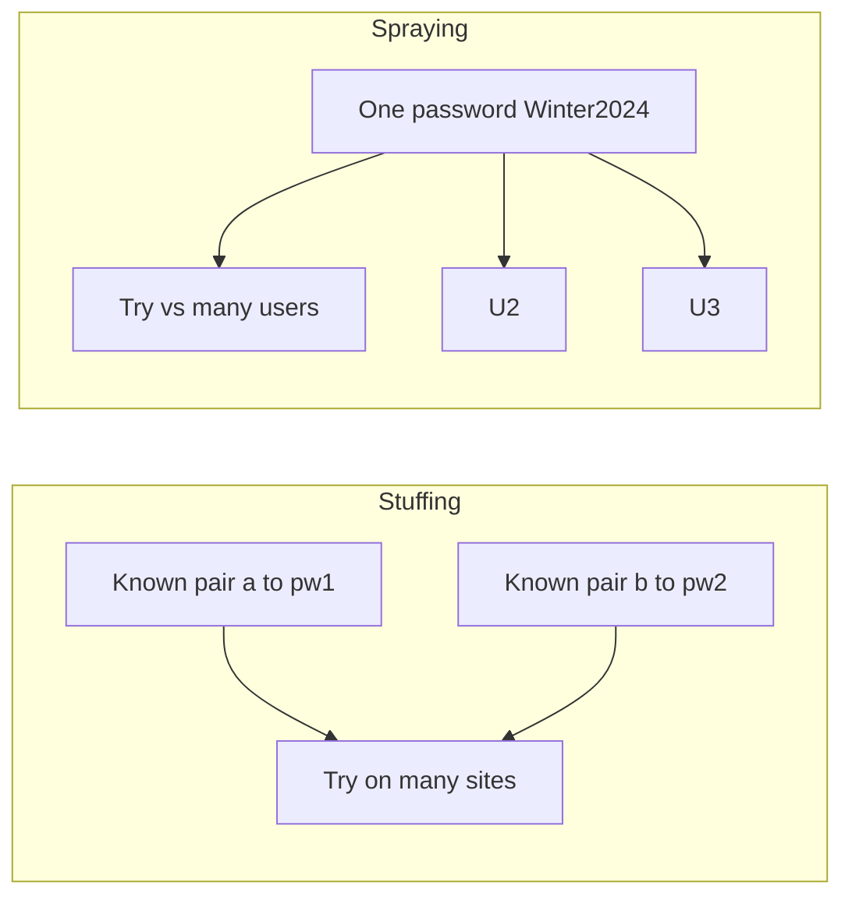

The maths of why reuse makes stuffing work: if a target has 10,000 employees and even 1% reuse a breached password on the corporate SSO, that is 100 working credentials from a single combolist pass — and one working credential is usually enough to start. Defenders cannot patch this with a code fix; it is a property of human password habits, which is why the countermeasures (Part 12) are all about *detecting the pattern of attempts* rather than fixing a bug.

| Dimension | Credential stuffing | Password spraying |
|---|---|---|
| Input | Breached `user:pass` pairs | Small list of common passwords |
| Ratio | Many pairs → one/many sites | One password → many users |
| Needs breach data? | Yes (that's the point) | Helpful, not required |
| Lockout risk | Higher (many pw per user) | Lower (one pw per user per round) |
| Best defence | Breached-password blocking, MFA, device fingerprinting | Lockout + throttling per source, MFA, no common passwords |

**Bug-bounty note:** on programmes that allow it, a "credential stuffing leads to ATO" report is usually only accepted if you demonstrate the *mechanism* (e.g. no rate-limiting, no breached-password check) using *your own* test accounts — not by taking over a real user with breach creds, which is out of scope and often illegal. The vulnerability is the missing control, and that is what you prove.

### A worked stuffing-yield calculation

Attackers and defenders both reason about stuffing as a funnel, and doing the arithmetic once makes the threat concrete. Take a combolist of 1,000,000 `email:password` pairs run against one target's login:

```text
1,000,000  pairs in the list
    ×  0.30  fraction whose email even has an account here (typical)  = 300,000 valid usernames tried
    ×  0.02  fraction who reused the exact breached password (~2%)    =   6,000 correct pairs
    ×  0.10  fraction not stopped by MFA / anomaly detection          =     600 successful takeovers
```

Six hundred account takeovers from one automated pass, with zero software vulnerability exploited — every step was a legitimate login. That is why the number that matters to a defender is not "is there a bug" but "what fraction survives each stage of my funnel." Turning MFA from 0% to 90% coverage collapses the last line from 600 to 60; adding breached-password blocking collapses the `0.02` reuse factor toward zero at the source. **This funnel is the single best argument for MFA that exists** — it is the only control that acts on the stage attackers cannot influence with better data.

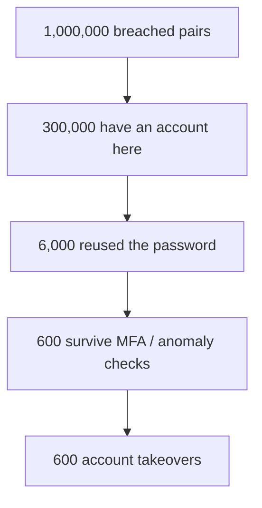

---

## Part 9: Hands-On Lab — Building a Local Breach-Lookup Pipeline

This lab builds a self-contained, lawful breach-lookup workflow on Kali using **only synthetic data you generate yourself** — no real breach corpus is downloaded, because possessing real third-party breach data outside an authorised engagement is exactly what Part 13 warns against. The skills (indexing, hash ID, cracking-scope decisions, correlation) transfer directly to authorised work where you *are* permitted to hold the real data.

### 9.1 Generate a realistic synthetic dump

```bash
mkdir -p ~/breach-lab && cd ~/breach-lab
# Build a fake "forum_users" dump with mixed hash types.
python3 - <<'PY'
import hashlib, random, csv
first = ["alice","bob","carol","dave","erin","frank","grace","heidi"]
domains = ["example.com","example.org","example.net"]
rows=[]
for i,name in enumerate(first, start=1001):
    email=f"{name}@{random.choice(domains)}"
    pw=random.choice(["password","hunter2","Summer2023!","letmein","Qwerty123","correcthorse"])
    algo=random.choice(["md5","sha1","bcrypt-note"])
    if algo=="md5":
        h=hashlib.md5(pw.encode()).hexdigest()
    elif algo=="sha1":
        h=hashlib.sha1(pw.encode()).hexdigest()
    else:
        h="$2y$10$"+"".join(random.choice("abcdefghijklmnopqrstuvwxyz0123456789") for _ in range(53))
    rows.append([i,email,name,h])
with open("dump.csv","w",newline="") as f:
    w=csv.writer(f); w.writerow(["id","email","username","password"])
    w.writerows(rows)
print(open("dump.csv").read())
PY
```

Sample output (yours will vary because passwords are random):

```
id,email,username,password
1001,alice@example.net,alice,5f4dcc3b5aa765d61d8327deb882cf99
1002,bob@example.com,bob,$2y$10$k3l9v2m8q1w7e4r6t0y5uz...
1003,carol@example.org,carol,7c6a180b36896a0a8c02787eeafb0e4c
1004,dave@example.com,dave,5baa61e4c9b93f3f0682250b6cf8331b7ee68fd8
...
```

### 9.2 Load it into a queryable local store

For a real (authorised) corpus you would index into SQLite or Elasticsearch so lookups are instant. Here, SQLite:

```bash
sqlite3 breach.db <<'SQL'
.mode csv
.import dump.csv users
CREATE INDEX idx_email ON users(email);
CREATE INDEX idx_user  ON users(username);
SQL

# Query by email — the core lookup
sqlite3 breach.db "SELECT email,username,password FROM users WHERE email='alice@example.net';"
# alice@example.net,alice,5f4dcc3b5aa765d61d8327deb882cf99
```

`.import` bulk-loads the CSV; the two indexes turn a full-table scan into an O(log n) lookup, which is the difference between sub-millisecond and minutes once a corpus reaches millions of rows. **This indexing step is the entire engineering content of "run your own breach database"** — the rest is scale (sharding across files, using `ripgrep` for flat combolists too big for a DB).

### 9.3 Identify and triage the hashes

```bash
# Pull just the hash column and classify each
sqlite3 breach.db "SELECT password FROM users;" | while read h; do
  echo -n "$h  ->  "; nth -t "$h" -a 2>/dev/null | grep -m1 -i 'Most likely\|bcrypt\|MD5\|SHA-1' || echo "?"
done
# 5f4dcc3b5aa765d61d8327deb882cf99  ->  Most likely: MD5, NTLM
# $2y$10$k3l9...                    ->  Most likely: bcrypt
# 7c6a180b36896a0a8c02787eeafb0e4c ->  Most likely: MD5, NTLM
# 5baa61e4c9b93f3f0682250b6cf8331b7ee68fd8 -> Most likely: SHA-1
```

Triage decision: crack the **fast, unsalted** hashes (MD5, SHA-1), *skip* the bcrypt rows (not worth the GPU-days on a recon timeline). This is the professional judgement call — you crack what is cheap and likely reused, and report the rest as "exposed, algorithm bcrypt, low immediate risk."

### 9.4 Crack only the cheap hashes (scoped, local)

Extract the bare-hex hashes and run them against a wordlist. On Kali, `rockyou.txt` ships at `/usr/share/wordlists/rockyou.txt.gz`:

```bash
gunzip -k /usr/share/wordlists/rockyou.txt.gz 2>/dev/null
sqlite3 breach.db "SELECT password FROM users WHERE length(password)=32;" > md5.hashes

# hashcat -m 0 = raw MD5. -a 0 = straight dictionary attack.
hashcat -m 0 -a 0 md5.hashes /usr/share/wordlists/rockyou.txt --quiet --potfile-disable
# 5f4dcc3b5aa765d61d8327deb882cf99:password
# 7c6a180b36896a0a8c02787eeafb0e4c:hunter2
```

Flag-by-flag: `-m 0` selects the hash mode (0 = MD5, from the identification step — get this wrong and nothing cracks); `-a 0` is attack mode 0, straight dictionary; `--quiet` suppresses the status screen; `--potfile-disable` stops hashcat caching results between runs so the lab is repeatable. For SHA-1 you would rerun with `-m 100`.

### 9.5 Correlate back to the Chapter 7 account map

Now the OSINT payoff: join the cracked plaintext to the account map you built in Chapter 7. If `alice@example.net`'s cracked password is `password`, and Chapter 7's Sherlock/Holehe run showed `alice` also has a GitHub and a corporate SSO account, you have a hypothesis: *does that reused password reach a system in scope?* On an authorised test, you would try it against the **client's** login (never the breached site), one careful attempt, respecting lockout.

```bash
# Merge cracked results with the account inventory (accounts.csv from Ch.7 tooling)
join -t, -1 1 -2 1 \
  <(sort <(echo "alice@example.net,password")) \
  <(sort accounts.csv)
# alice@example.net,password,github.com/alice,sso.example-corp.com
```

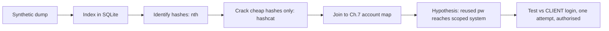

**IR use case:** a blue-teamer runs this exact pipeline against their *own* org's leaked data (lawfully obtained via a breach-monitoring service) to answer "which of our users had a crackable password exposed, so we can force-reset them first." Same tooling, defensive intent.

### 9.6 Parse a flat combolist / ULP at scale

Structured dumps go in SQLite, but combolists and ULP files are enormous flat text — often tens of gigabytes — and you query them with stream tools, not a database. Build a small synthetic ULP and slice it the way you would a real one:

```bash
cat > ulp.txt <<'EOF'
https://sso.example-corp.com/login|jdoe@example-corp.com|Winter2024!
https://mail.example-corp.com|jdoe@example-corp.com|Winter2024!
https://github.com/login|jane.other|hunter2
https://sso.example-corp.com/login|asmith@example-corp.com|Autumn2023!
android://com.example.app|jdoe|A9x!qL2
EOF

# 1. Which of the client's users appear at all? (domain filter on the login field)
rg -i '@example-corp\.com' ulp.txt
# https://sso.example-corp.com/login|jdoe@example-corp.com|Winter2024!
# https://mail.example-corp.com|jdoe@example-corp.com|Winter2024!
# https://sso.example-corp.com/login|asmith@example-corp.com|Autumn2023!

# 2. Which lines point at the in-scope SSO portal specifically? (the actionable subset)
rg -i '^https://sso\.example-corp\.com' ulp.txt | awk -F'|' '{print $2" -> "$3}'
# jdoe@example-corp.com -> Winter2024!
# asmith@example-corp.com -> Autumn2023!

# 3. Extract unique corporate users seen (feeds the Chapter 7 account map)
rg -io '[a-z.]+@example-corp\.com' ulp.txt | sort -u
# asmith@example-corp.com
# jdoe@example-corp.com
```

Flag notes: `rg -i` is case-insensitive ripgrep (far faster than `grep` on huge files thanks to its parallel, memory-mapped scanning); `-o` prints only the matched substring; `awk -F'|'` splits each line on the pipe delimiter so `$2` is the login and `$3` the password. The three queries answer the three questions that matter — *is my client in this list, which entries hit an in-scope system, and which users do I now know about* — without ever loading the file into memory.

**Note the password pattern.** `Winter2024!` and `Autumn2023!` are `Season + Year + !` — the exact predictable shape that mandatory 90-day rotation policies produce, and precisely what a password-spraying pass (Part 8) would guess blind. Seeing that pattern across a client's leaked entries is itself a reportable finding: it tells you spraying will likely succeed even for users who are *not* in the breach.

---

## Part 10: Dark-Web and Telegram Sourcing — With Real OPSEC

The romantic image of "the dark web" as the source of breach data is now mostly outdated. In practice, breach and stealer data is traded across four tiers, roughly in order of how much OPSEC they demand:

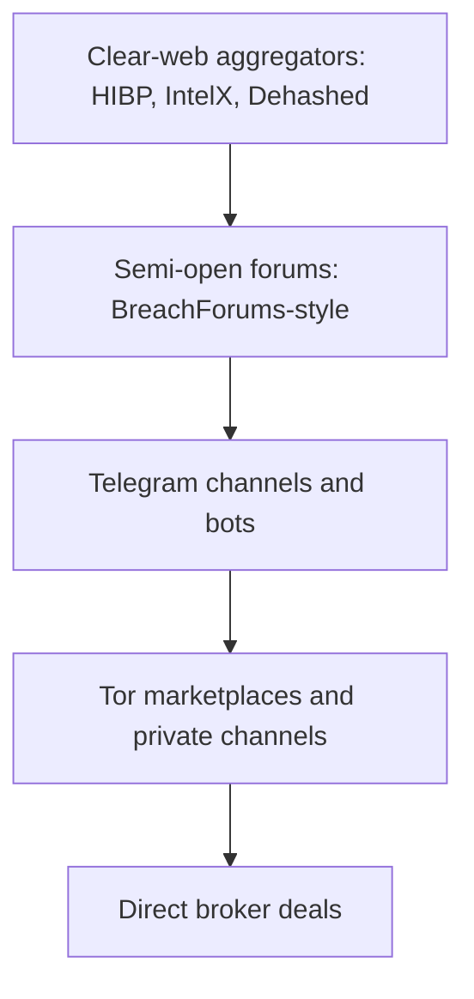

- **Tier 1 — clear-web services (Part 6).** Lawful, no anonymity required, and where a professional does 95% of their work. Start and usually end here.
- **Tier 2 — semi-open forums.** Successors to the seized "RaidForums"/"BreachForums" lineage. Reachable on the clear web or Tor; often require registration. High legal exposure — browsing is one thing, downloading corpora is a regulated act.
- **Tier 3 — Telegram.** The single biggest shift in the ecosystem: much stealer-log and combolist trade now happens in Telegram channels and via **lookup bots** that will, for a fee, search leak corpora by selector. Convenient and dangerous in equal measure — many are scams, many are stings.
- **Tier 4 — Tor marketplaces and private/broker channels.** Genuine dark web. Requires the strongest OPSEC and carries the highest legal and safety risk; almost never necessary for a legitimate assessment.

**If — and only if — your rules of engagement authorise Tier 2+ sourcing**, the OPSEC discipline from Chapter 3 applies in full and then some:

- Do it from a **dedicated, disposable VM** (or a purpose-built investigation machine), never your host, never a machine with any personal or client data on it.
- Route through **Tor** (or a research VPN chained appropriately) so your real IP never touches the resource; Tier 3/4 resources log and sometimes actively deanonymise visitors.
- Use **sock-puppet identities** (Chapter 3) with no linkage to your real identity — separate email, separate handle, separate everything.
- Assume every file is **hostile**: booby-trapped documents, malware-laced "samples", and law-enforcement honeypots are all common. Detonate nothing on a machine you care about.
- Log your investigative steps for the report, but **do not hoard** downloaded corpora — retention is itself a liability (Part 13).

**The honest professional stance:** the vast majority of authorised engagements never need to go past Tier 1. If a scope seems to *require* buying a stealer log off a Telegram bot, that is a strong signal to pause and confirm — in writing — that the client and the law are truly on side. The romance of "going on the dark web" is exactly the mindset that gets analysts into legal trouble.

---

## Part 11: Verification — Never Trust a Leak at Face Value

Breach data is famously polluted. Sellers pad lists to inflate row counts, "new" breaches are frequently repackaged old ones, and combolists mix real and fabricated rows. A finding based on unverified breach data is worse than no finding — it can defame a person or send an engagement down a false path. Build verification into your workflow.

The verification checklist:

| Check | Question | How |
|---|---|---|
| Provenance | What is the claimed source and date? | Cross-reference the breach name against HIBP's index / reputable reporting |
| Recycling | Is this actually a repackage of a known older breach? | Sample rows, check if they match a known corpus |
| Internal consistency | Do hash formats, schema, and timestamps agree with a single real source? | Inspect the dump structure (Part 2) |
| Liveness | Is the credential plausibly still valid? | Age of breach + whether the org forced resets |
| Corroboration | Does an independent source agree? | Compare HIBP metadata vs a paid service's source attribution |

A concrete tell: if a "2024 mega-breach of Site X" contains passwords hashed with a scheme Site X is known to have stopped using in 2015, the list is recycled or fabricated. If every row's password is a top-100 common password, it is a combolist masquerading as a database dump. **The discipline is the same as any intelligence work: single-source claims are hypotheses, not facts, until corroborated.**

**TraceLabs / OSINT-CTF note:** in missing-persons OSINT competitions, unverified breach data is a trap — submitting a fabricated combolist "hit" as intelligence about a real person is both useless to investigators and ethically wrong. Verification is scored, sloppiness is penalised.

### Landmark breaches and what each one teaches

Real cases are the fastest way to internalise the categories above. Each of these is publicly documented and indexed in HIBP; the point is not trivia but the *lesson* each carries for how you read and weight breach data.

| Breach (public case) | Rough scale | Storage detail | Lesson for the analyst |
|---|---|---|---|
| LinkedIn (2012) | ~164M | Unsalted **SHA-1** | Even a major tech firm shipped unsalted hashes; almost all cracked. Old + weak-hash = assume plaintext. |
| Adobe (2013) | ~153M | **3DES-ECB encrypted** (not hashed) + plaintext password *hints* | Encryption misused as hashing; ECB + hints leaked patterns. Read *how* data was stored, not just "was it hashed." |
| Ashley Madison (2015) | ~30M | **bcrypt** — but a buggy legacy path also stored weak MD5 tokens | Strong primary hash, weak secondary path cracked millions. One weak code path undoes good crypto. |
| MySpace (2016, older data) | ~360M | Unsalted SHA-1, truncated/lowercased | Massive scale, ancient passwords — high reuse mining value, low direct-liveness. |
| "Collection #1" (2019) | ~2.7B rows | **Combolist aggregation** | The archetype of recycled, unverified combo data — huge, low quality, provenance-free. |
| Various infostealer clouds (ongoing) | billions of lines | **Plaintext + cookies**, per-victim | Freshness and session-cookie MFA bypass — the modern centre of gravity. |

Two through-lines connect them. First, **storage detail decides everything**: LinkedIn's unsalted SHA-1 was effectively plaintext within weeks, while Ashley Madison's bcrypt core mostly held — same event class, opposite outcomes. Second, **age determines which question a breach answers**: a decade-old dump is a *password-reuse mining* source (what patterns does this person use?), not a *liveness* source (is this credential valid now?). A recent stealer log is the reverse. Weight your findings accordingly, and never present a 2012-era password as a current one.

---

## Part 12: Detection & Defense Angle

Everything above is also a defender's playbook, because the whole point of breach OSINT — done lawfully — is to get ahead of attackers. This is the one consolidated defensive section (per the notebook's style), pulling together how organisations detect and blunt the breach-to-takeover chain.

**1. Know your own exposure (proactive).**

- Enrol every corporate domain in **HIBP Domain Search** and, for deeper coverage, a stealer-log monitoring service (SpyCloud, Flare, Hudson Rock, Recorded Future). These tell you *which employees* are exposed and in *which* breach or stealer log, so you can force targeted resets.
- Run the Part 9 pipeline against your *own* lawfully obtained leaked data to find crackable exposed passwords first.

**2. Kill password reuse at the source.**

- **Breached-password blocking**: check new/changed passwords against the Pwned Passwords range API (Part 5) and reject any that appear. This is cheap, privacy-preserving, and directly defeats credential stuffing.
- Enforce length-based policies and drop periodic-rotation mandates (which drive predictable `Season+Year!` patterns that spraying loves).

**3. Break the stuffing/spraying pattern (detective + preventive).**

| Control | Stops stuffing | Stops spraying | Notes |
|---|---|---|---|
| MFA (phishing-resistant, e.g. FIDO2) | Strongly | Strongly | The single highest-value control; but stealer cookies can bypass weak MFA — see below |
| Breached-password blocking | Yes | Partial | Kills reuse-based hits |
| Per-source rate limiting / throttling | Yes | Yes | Watch for distributed sources |
| Impossible-travel / device fingerprinting | Yes | Yes | Flags logins from new device+geo |
| Account lockout with care | Partial | Yes | Spraying is designed to dodge lockout — tune per-source, not just per-account |
| Session-cookie hardening | — | — | Short TTLs, bind to device/IP, re-auth on sensitive actions — blunts stealer-cookie replay |

**4. Defeat the stealer-cookie MFA bypass specifically.** Because stealer logs carry live session cookies, MFA alone is not enough. Bind sessions to a device or IP, keep session lifetimes short, require step-up re-authentication for sensitive operations, and — on any signal that an endpoint is compromised — **invalidate all sessions** for that user, not just reset the password.

**5. Detection telemetry.** Watch authentication logs for: a spike of failed logins across many accounts from few sources (spraying), a spike of *successful* logins following breach-list patterns (stuffing), logins from residential-proxy ASNs, and — the stealer tell — a valid session suddenly used from a new device/geo without a corresponding fresh authentication event (cookie replay).

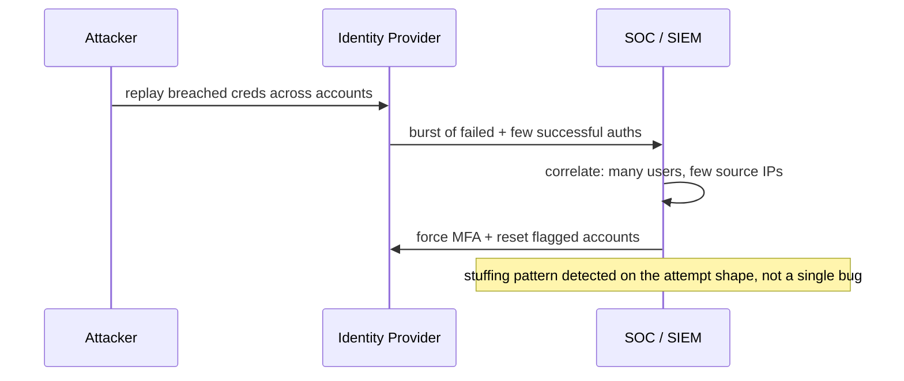

---

## Part 13: Legal & Ethical Boundaries (Not Optional)

Breach OSINT is the most legally sensitive topic in the whole track because it involves **other people's personal data**, often including credentials, and in many jurisdictions the *possession* of that data — not just its misuse — is regulated or criminal. Read this part as carefully as the technical parts.

**The core principle:** finding out *that* an address is exposed (HIBP-style metadata) is low-risk and broadly lawful. *Acquiring, holding, and using* the underlying breached credentials is where legal lines sit, and they vary by country.

- **Authorisation is everything.** Using a breached credential to access *any* system you are not explicitly authorised to test is a computer-misuse offence — the UK Computer Misuse Act, the US Computer Fraud and Abuse Act (**CFAA**), and equivalents worldwide. A working password does not grant permission; the engagement's written scope does. Test recovered credentials *only* against systems your rules of engagement name, and log every attempt.
- **Possession of stolen personal data can itself be an offence.** Downloading and retaining a breach corpus about identifiable people implicates data-protection law (**GDPR** in the EU/UK, plus national laws) and, in some jurisdictions, handling-stolen-goods-style provisions. On an authorised engagement, you are a data processor handling special-category-adjacent data — minimise what you collect, secure it, and delete it when the engagement ends.
- **Bug-bounty programme policies frequently forbid breach-corpus use.** Many programmes explicitly say "do not use credentials from third-party breaches against our systems." Read the policy; a valid technical finding obtained by a forbidden method is unpaid at best and a legal problem at worst.
- **GDPR data-subject impact.** Every row is a living person with rights. Do not publish, do not retain longer than needed, do not use the data for any purpose beyond the authorised assessment. "It was already leaked" is not a lawful basis to process it further.
- **The professional test.** Before touching any breach credential, be able to answer, in writing: *Who authorised me to hold and use this data? Against which systems? For how long? How will I store and destroy it?* If you cannot answer all four, stop.

Malware handling (stealer logs) adds a second layer: some corpora are distributed alongside the malware that produced them, and downloading/executing that is a separate offence and an operational hazard. Keep everything conceptual and lab-scoped, exactly as this notebook does.

**A practical data-handling checklist** for when an engagement *does* authorise holding breach credentials — write the answers into the engagement record before you download anything:

| Question | Good answer | Red flag |
|---|---|---|
| Who authorised possession? | Named client contact + signed scope clause | "It's public anyway" |
| Which systems may I test creds against? | Explicit in-scope list | "Anything that works" |
| Where is the data stored? | Encrypted volume on the engagement machine only | Personal laptop, cloud sync |
| Who can access it? | Named engagement team | Shared drive, chat uploads |
| When is it destroyed? | At report delivery, verifiably wiped | "Whenever" / never |
| What is logged? | Every credential test, with timestamp | Nothing |

If any row lands in the right-hand column, stop and fix it before proceeding — that column is where careers and criminal liability begin.

---

## Memory Hooks

A few mnemonics to make the chapter stick:

- **"Structured, Combo, Stealer" (SCS)** — the three artefact classes in ascending danger of *misreading* and, for stealer logs, ascending *actual* danger. Ask which one you hold before anything else.
- **"32 hex asks a question"** — a 32-hex hash is always MD5-*or*-NTLM; the answer is in the *source*, never the string. Web = MD5, Windows = NTLM.
- **"Dollar means slow"** — a `$`-prefixed hash (`$2y$`, `$6$`, `$argon2`) self-describes a deliberately slow algorithm. On a recon clock, report it, don't crack it.
- **"Five chars, never the password"** — the k-anonymity rule. If your password-check tool ever sends more than a 5-char prefix, it is broken and unsafe.
- **"Metadata is free, credentials are regulated"** — the legal dividing line. Knowing *that* an address leaked (HIBP) is low-risk; downloading the password is a data-processing act needing authorisation.
- **"MFA is the only stage attackers can't buy their way past"** — better breach data improves every funnel stage except the second factor, which is why it is the highest-value control.

## Final Revision / Summary

- A **breach** is data leaving an org's control; the OSINT-critical distinction is **structured breach vs combolist vs stealer log** — they answer different questions with different reliability.
- Reading a **dump** means mapping columns to fields and classifying the hash per row; timestamps and IPs are bonus selectors.
- **Hash identification** rests on length + charset + `$`-prefix. MD5 and NTLM are both 32 hex — disambiguate by source. `$2y$` = bcrypt (slow, skip on a recon clock). Use `name-that-hash`/`hashid` to classify and get the hashcat mode.
- **HIBP** is the lawful default: metadata, not credentials. Its **Pwned Passwords** endpoint uses a **k-anonymity range query** so the password never leaves the client — copy that pattern.
- **Dehashed / Snusbase / LeakCheck / IntelX** return real credentials; escalate to them only when the rules of engagement authorise handling breach creds.
- **Combolists** are unverified ammunition; **ULPs** add URL context; **stealer logs** are plaintext + session cookies + fresh, and can bypass MFA via cookie replay — the most dangerous artefact.
- **Credential stuffing** (known pairs → many sites) and **password spraying** (one password → many users) weaponise reuse; defences target the *attempt pattern*, not a single bug.
- Build lookups **locally** by indexing (SQLite/`rg`), crack only cheap unsalted hashes, and **correlate** cracked plaintext with the Chapter 7 account map — then test only against scoped systems.
- Dark-web/Telegram sourcing is a last resort with heavy OPSEC; **Tier 1 clear-web services cover almost everything**.
- **Verify** every leak — provenance, recycling, consistency, corroboration — before it becomes a finding.
- **Legally**, metadata is low-risk; possessing/using breached credentials is regulated by GDPR, CFAA, the Computer Misuse Act and equivalents. Authorisation, minimisation, and deletion are mandatory.

The next chapter moves from *who and what has leaked* to *what is exposed on the live internet right now*, taking the selectors and organisations you have mapped into Shodan, Censys, and internet-wide asset discovery.

---

## Cheat Sheet / Quick Reference

**Hash ID at a glance**

| Shape | Likely algorithm | hashcat `-m` |
|---|---|---|
| 32 hex, web source | MD5 | 0 |
| 32 hex, Windows/AD source | NTLM | 1000 |
| 40 hex | SHA-1 | 100 |
| 64 hex | SHA-256 | 1400 |
| `$2a$/$2b$/$2y$` | bcrypt | 3200 |
| `$6$` | sha512crypt | 1800 |
| `$argon2id$` | Argon2 | (john/hashcat argon2) |

**HIBP account lookup**

```bash
curl -s -H "hibp-api-key: $HIBP_KEY" -H "user-agent: recon-lab" \
  "https://haveibeenpwned.com/api/v3/breachedaccount/EMAIL?truncateResponse=false" | jq '.[].Name'
```

**Pwned Passwords (k-anonymity, no key)**

```bash
H=$(printf '%s' 'PASSWORD' | sha1sum | cut -c1-40 | tr a-f A-F)
curl -s -H "Add-Padding: true" "https://api.pwnedpasswords.com/range/${H:0:5}" | grep "${H:5}"
```

**Local corpus lookup**

```bash
# structured -> SQLite
sqlite3 breach.db "SELECT * FROM users WHERE email='TARGET';"
# flat combolist too big for a DB -> ripgrep
rg -i '^target@example\.com:' combo.txt
```

**Crack cheap hashes only**

```bash
hashcat -m 0   -a 0 md5.hashes  /usr/share/wordlists/rockyou.txt   # MD5
hashcat -m 100 -a 0 sha1.hashes /usr/share/wordlists/rockyou.txt   # SHA-1
# skip bcrypt/argon2 on a recon timeline
```

**Service selection**

| Need | Use |
|---|---|
| Is it exposed / where? (lawful default) | HIBP |
| Block weak passwords | Pwned Passwords range API |
| Actual credentials (RoE permits) | Dehashed / Snusbase / LeakCheck |
| Pastes / darknet / documents by selector | IntelX |
| Org-wide employee exposure | HIBP Domain Search + stealer-log monitor |

---

## Common Pitfalls

- **Confusing MD5 and NTLM** (both 32 hex) and wasting hours cracking with the wrong mode — decide by source.
- **Treating a combolist hit as a verified fact** about a person — provenance is stripped; it is a lead.
- **Cracking bcrypt on a recon clock** — enormous cost for little value; report it as exposed-but-slow instead.
- **Testing recovered passwords against the breached site** (illegal, pointless) instead of against the scoped client system.
- **Downloading and hoarding real breach corpora** with no engagement authorising possession — a data-protection liability in itself.
- **Assuming MFA defeats stealer logs** — stolen session cookies can replay an authenticated session and skip MFA entirely.
- **Skipping the `Add-Padding` header** on Pwned Passwords queries, leaking prefix info via response size.
- **Sourcing from Telegram/Tor when Tier 1 services would have answered the question** — needless legal and safety exposure.

---

## Practice Labs & Resources

- **TryHackMe — "OhSINT", "Sakura Room", "Searchlight IMINT"**: OSINT rooms that build the selector-to-intelligence discipline that breach lookups plug into.
- **Have I Been Pwned** (haveibeenpwned.com): check your own addresses; enrol a domain you control in **Domain Search** to see the metadata workflow end to end.
- **Pwned Passwords range API**: implement the k-anonymity query in a language of your choice and confirm you never transmit more than 5 hex characters — the best way to internalise Part 5.
- **PortSwigger Web Security Academy — Authentication labs** (password-based login vulnerabilities, brute-force protection bypass): train the *defensive-control* view that turns a "credential stuffing" observation into a valid, in-scope finding.
- **Hashcat example-hashes page** and **CrackStation's hash reference**: drill hash identification until length+prefix recognition is instant.
- **Build the Part 9 pipeline** end to end on your own synthetic data, then rerun it treating your *own* HIBP-confirmed exposure as the target — a fully lawful way to rehearse the real workflow.
- **Hudson Rock's free Cavalier tools / SpyCloud research blog**: read how stealer-log monitoring is operationalised on the defensive side.

**Practice questions**

1. You pull a hash `8846f7eaee8fb117ad06bdd830b7586c` from a Windows domain export and a hash `5f4dcc3b5aa765d61d8327deb882cf99` from a PHP forum. Both are 32 hex characters. What algorithm is each, what hashcat mode do you use, and how did the *source* tell you which is which?
2. Explain, step by step, why sending a password's SHA-1 *prefix* to the Pwned Passwords API does not reveal the password to the server. What does the `Add-Padding` header add?
3. A combolist row reads `ceo@target-corp.com:Summer2023!`. List the verification steps you would take before treating this as a finding, and state what you are — and are not — permitted to do with it on an authorised test.
4. Contrast credential stuffing and password spraying: inputs, ratios, lockout risk, and the single control that most blunts each. Why can neither be fixed with a one-line code patch?
5. You discover an employee's endpoint in a stealer-log corpus, including a valid `sso.client.com` session cookie. Why is this higher severity than a cracked password from a 2018 breach, and what is the correct handling under the rules of engagement?

**Answer key (check yourself after attempting)**

1. `8846f7...` from the Windows export is **NTLM** (hashcat `-m 1000`); `5f4dcc...` from the PHP forum is **MD5** (hashcat `-m 0`). The strings are indistinguishable by length — the *source system* is the only disambiguator: AD/SAM/LSASS/NTDS artefacts are NTLM, web-app tables are MD5.
2. The server only ever receives the 5-char SHA-1 prefix, which is shared by tens of thousands of distinct passwords, so it cannot tell which you meant; the full comparison happens locally against the returned suffix list. `Add-Padding` normalises the response size so a network observer cannot fingerprint your prefix by counting bytes.
3. Verify provenance (real source vs recycled combo), age/liveness, internal consistency, and corroborate against a second source; treat it as a *lead*, not a fact. Permitted: test the password **once**, respecting lockout, against a **client system named in scope**. Not permitted: testing against the breached site, against out-of-scope systems, or retaining the data beyond the engagement.
4. Stuffing = many known pairs against sites (higher lockout risk, needs breach data); spraying = one common password against many users (lower lockout risk, needs no breach data). MFA most blunts both. Neither is a code bug — they exploit password *reuse* and *predictability*, human properties, so the fix is controls on the attempt pattern, not a patch.
5. The stealer cookie is **live and MFA-bypassing** — it resumes an already-authenticated session with no password or second factor — whereas a 2018 cracked password is likely rotated and still gated by MFA. Correct handling: report immediately as critical; do **not** replay the cookie against production without explicit written authorisation; recommend session invalidation, credential rotation, and endpoint reimaging.

---

*Also on [Praneeth's portfolio](https://ping-praneeth.vercel.app/notebook/pentest-recon-osint/08-breach-data-credential-leaks-and-dark-web-osint), with comments and the latest edits.*
