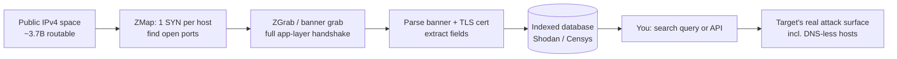
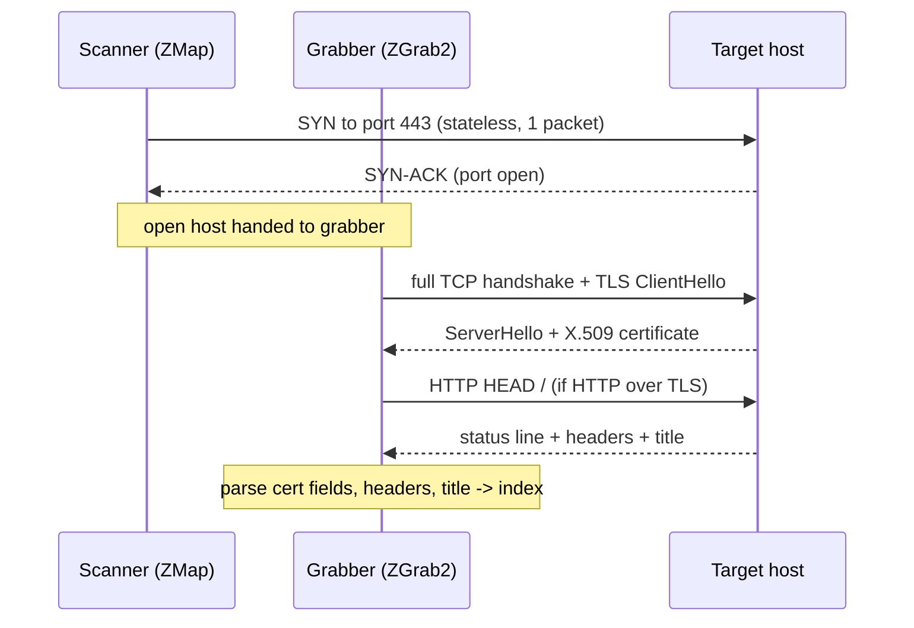
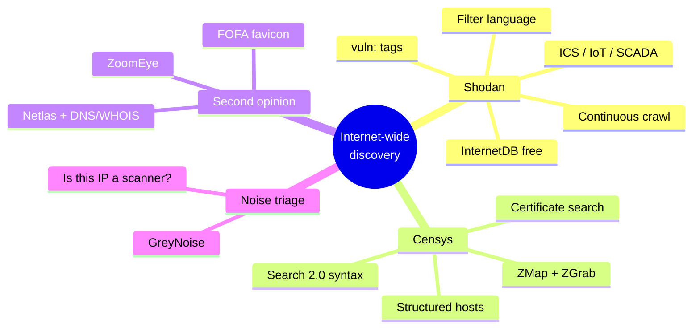
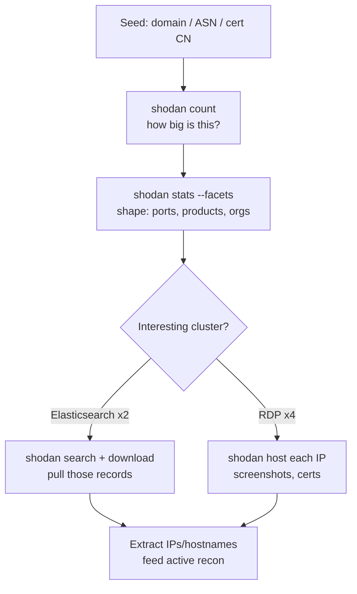
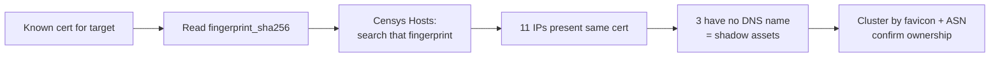
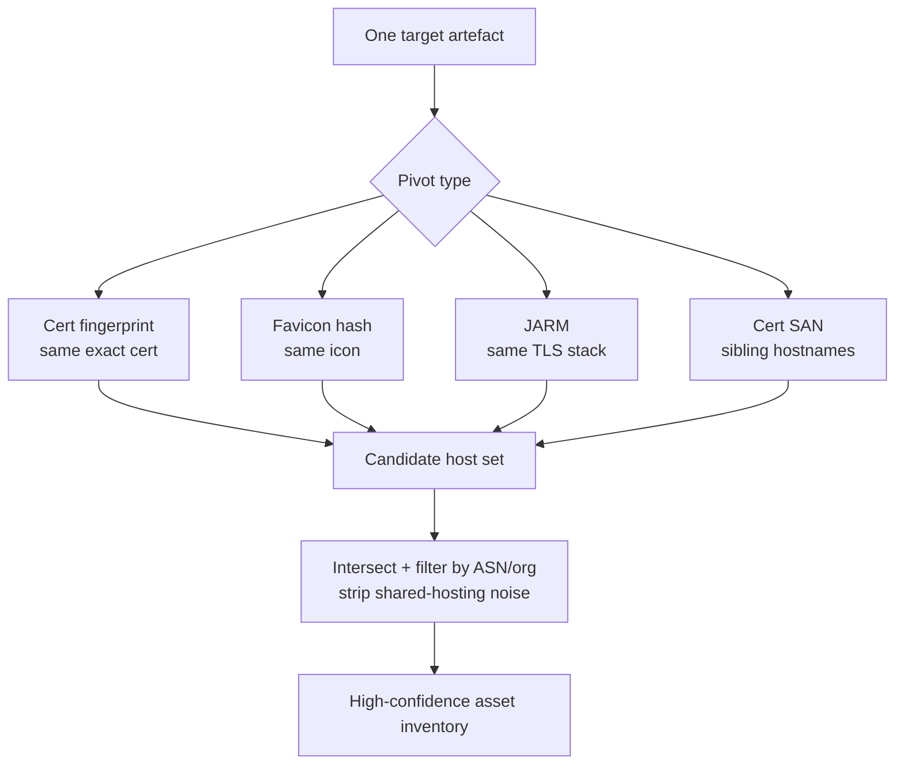
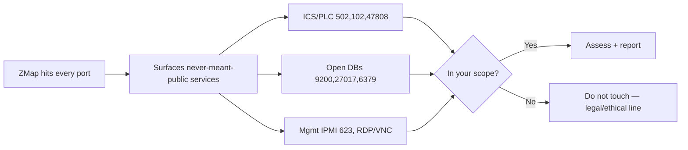
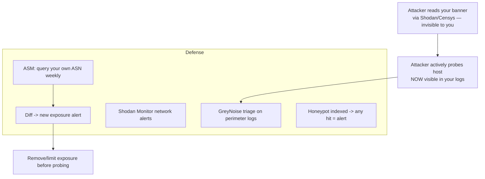

**Level:** Advanced · **Track:** Penetration Testing · **Read time:** 205 min

This is Chapter 9 of the Recon & OSINT notebook. Chapter 5 turned one apex domain into a list of subdomains; Chapter 8 turned an email into a map of leaked credentials. Both worked *outward from something you already knew* — a domain, a person. This chapter works the other way: it starts from the entire public internet, already scanned and indexed by someone else, and lets you query that global index for anything that belongs to your target. Given `example.com`, an ASN, an IP range, a certificate common name, or even a favicon, the job is to find every internet-facing host, service, and forgotten box the organisation exposes — including the ones that never appear in DNS.

Internet-wide scanning is the reconnaissance technique with the widest gap between beginner and expert. A beginner types a hostname into Shodan and reads a banner. An expert takes one leaked TLS certificate, pivots on its SHA-256 fingerprint across Censys to find eleven more IPs presenting the same cert, cross-references their favicon hashes to cluster them into two distinct application stacks, filters those by ASN and organisation to strip out shared-hosting noise, and hands the next phase a list of forty live hosts that no subdomain brute-force would ever have found — because they answer only on raw IPs, behind no DNS name at all. That gap is what this chapter closes.

Everything here is framed for authorised work: a scoped penetration test whose rules of engagement permit passive OSINT, a bug-bounty programme within policy, an attack-surface assessment of assets you own, a CTF or OSINT competition, or defensive monitoring of your own organisation's exposure. Querying Shodan and Censys touches *their* infrastructure, not the target — that is what makes it passive — but the moment you take a hostname from a Shodan banner and start actively probing it, you have crossed into active recon and must be inside scope. That boundary is flagged throughout, and Part 13 covers the legal and terms-of-service reality in full.

---

## Part 1: The Core Idea — Someone Already Scanned the Internet

The entire public IPv4 address space is small enough to scan in its entirety. There are 2^32 ≈ 4.3 billion IPv4 addresses; strip out reserved, multicast and unroutable blocks and roughly 3.7 billion are potentially routable. Scanning one TCP port across all of them — sending a single SYN packet each — is a few billion packets. On a well-provisioned host with a stateless scanner, that is minutes to hours, not weeks. This is the single fact that makes internet-wide asset discovery possible: **the haystack is finite, and it has already been counted.**

The realisation that the whole address space is enumerable in a coffee break arrived publicly around 2013 with two developments that this entire chapter rests on:

- **ZMap** — a stateless, single-packet-per-host scanner out of the University of Michigan that could sweep the whole IPv4 space for one open port in under an hour on a gigabit link. It doesn't track connection state per host (the way `nmap` does); it fires SYNs as fast as the NIC allows and validates responses cryptographically, so it scales to the entire internet.
- **Shodan** — John Matherly's search engine, which had been quietly crawling and indexing service *banners* since around 2009, turning "what's on the internet" into a searchable database rather than a scan you run yourself.

Put those together and a new discipline appears: you no longer scan the internet, you *query a pre-built index of it*. Shodan, Censys, and their peers run the scan continuously, store every banner and certificate, and expose it through a search language and an API. Your job shifts from "generate traffic" to "write the right query."

Why this matters for reconnaissance is best seen against the previous chapters. Subdomain enumeration (Chapter 5) finds hosts that have a DNS name. Certificate Transparency finds hosts whose certs were logged. But a huge amount of an organisation's real attack surface has **no DNS name at all**: a Jenkins box a developer stood up on a cloud IP for "just a test," an IPMI/BMC management interface on a colocated server, an exposed Elasticsearch node, a database that "isn't supposed to be reachable." None of those appear in DNS. All of them answer if you knock on their IP. Internet-wide scan data is the only recon source that sees them, because it knocked on *every* IP.



**Red team usage:** this is how you find the box nobody documented. **Blue team usage:** this is how you find the same box *before* the red team does — attack-surface management is just running these queries against your own org on a schedule. Both sides use the identical data; the only difference is whose IP ranges you point it at.

---

## Part 2: What a Banner Actually Is (and How a Scanner Gets One)

Everything Shodan and Censys sell you is built from **banners** and **certificates**. If you don't understand precisely what a banner is, the search filters will feel like magic incantations instead of what they are — field lookups over parsed protocol data. So we build the concept from the packet up.

A **banner** is the data a network service sends back when you connect to it and, where necessary, nudge it with a minimal, protocol-correct request. It is not a special "banner protocol" — it is just the service being itself. Concrete examples:

- Connect to TCP **22** and the SSH server immediately sends an identification string before you send anything: `SSH-2.0-OpenSSH_8.9p1 Ubuntu-3ubuntu0.4`. That whole string is the banner. It leaks the SSH version, the OpenSSH build, and — via the Ubuntu package suffix — the OS and even the patch level.
- Connect to TCP **80** and send a bare `HEAD / HTTP/1.0\r\n\r\n`. The server replies with status line and headers: `Server: nginx/1.18.0 (Ubuntu)`, `X-Powered-By: PHP/7.4.3`, maybe a `Set-Cookie` naming the framework. Those headers, plus the HTML `<title>`, are the HTTP banner.
- Connect to TCP **443** and complete a TLS handshake. Before any HTTP happens, the server hands you its **X.509 certificate**, which contains the subject Common Name, Subject Alternative Names (a goldmine of other hostnames), issuer, validity dates, and a public key. The cert *is* a banner, and the richest one there is.
- Connect to **21** (FTP), **25** (SMTP), **3306** (MySQL), **6379** (Redis), **9200** (Elasticsearch), **502** (Modbus), **47808** (BACnet) — each greets you with protocol-specific data: an FTP `220` welcome line, an SMTP `220` with the mail server software, a MySQL handshake packet with the server version and capability flags, a Redis `-NOAUTH`/`+PONG`, an Elasticsearch JSON blob naming the cluster and Lucene version.

Here is a raw HTTP banner exactly as a scanner records it, so the abstraction is concrete:

```http
HTTP/1.1 200 OK
Server: Apache/2.4.41 (Ubuntu)
X-Powered-By: PHP/7.4.3
Set-Cookie: PHPSESSID=b7e...; path=/
Content-Type: text/html; charset=UTF-8
X-Frame-Options: SAMEORIGIN

<!DOCTYPE html>
<html><head><title>Acme Corp — Staging</title>...
```

From that single banner a scanner extracts, and lets you search on: `Server` product and version (Apache 2.4.41), OS hint (Ubuntu), backend language (PHP 7.4.3), a cookie name hinting at the stack, security headers present/absent, and the page title (`Acme Corp — Staging` — the word *Staging* alone is a finding).

**How the scanner collects it at internet scale** is a two-stage pipeline, and understanding the two stages explains almost every quirk of the data:

1. **Discovery (which hosts have the port open):** a stateless scanner like **ZMap** sends one TCP SYN to a given port on every IP in scope, as fast as the link allows, encoding a validation token in fields like the source port / sequence number so it can recognise legitimate SYN-ACKs without keeping per-connection state. Hosts that SYN-ACK have the port open. This stage answers "who is listening," nothing more.
2. **Banner grab (what the service actually is):** for each open port found, a second tool — **ZGrab / ZGrab2** for Censys, Shodan's own crawlers — performs a *full, stateful* application-layer handshake: completes the TCP three-way handshake, does the TLS handshake if it's a TLS port, sends the minimal protocol-appropriate request, and captures the structured response. This is where the actual banner and certificate come from.



Two consequences fall straight out of this design and you must internalise them:

- **The data is a snapshot, not live.** Shodan re-crawls the whole internet on a rolling basis (days to weeks, faster for common ports); Censys similarly. A banner you read might be hours or days old. A host may have been patched, moved, or firewalled since. **Always treat scan data as a lead to verify, never as current ground truth** — the box may no longer be there, or may now be a honeypot.
- **They only see what a service *volunteers* on a handshake.** They are not exploiting anything. If a service is silent, behind a firewall that drops SYNs, or requires authentication before it says anything, the banner is thin or absent. This is why "not in Shodan" never means "not exposed."

**Pentester landing on recon:** the banner tells you product + version, which maps directly to a CVE search. **Blue team usage:** the same banner tells you what *you* are advertising to every scanner on earth — version strings you'd rather not publish, a `Staging` title on a box that should never have been public, a self-signed cert on something internet-facing.

---

## Part 3: The Scanner Landscape — Who Indexes the Internet, and How They Differ

Several engines index the internet. They overlap but differ in scanning cadence, port coverage, data model, and licensing. You use more than one because **no single engine sees everything** — each scans from different vantage points, on different schedules, hitting different ports, and targets fingerprint and block scanner IP ranges differently.

| Engine | Scan model | Strengths | Free tier reality | Best for |
|---|---|---|---|---|
| **Shodan** | Continuous distributed crawl, huge port/protocol breadth (incl. ICS/IoT) | Deepest historical banners, richest filter language, ICS/SCADA coverage, `vuln:` tags | Website search works logged-in; API needs a (cheap, often lifetime-sale) membership; free API key is very limited | Broad service discovery, IoT/ICS, quick pivots |
| **Censys** | ZMap+ZGrab pipeline, full-IPv4 on ~2600+ ports, strong TLS/cert data | Best certificate search, structured host model, clean API, daily-ish refresh | Free account: limited queries/month via web + API | Certificate pivoting, TLS-centric recon, clean data |
| **ZoomEye** | Chinese engine, web + host components | Good coverage of APAC space, web app fingerprints | Free tier with credits | Filling gaps Shodan/Censys miss, APAC targets |
| **FOFA** | Chinese engine, favicon & body search | Strong favicon/body/cert search, huge index | Free tier limited | Favicon pivoting, alternative index |
| **Netlas** | EU-based, full IPv4 + DNS/WHOIS | Combines scan data with DNS/WHOIS, generous-ish free tier | Free tier usable for real work | All-in-one recon on a budget |
| **GreyNoise** | Sensor network watching *who scans the internet* | Tells you if an IP is a known scanner / benign / malicious | Free "visualizer" + limited API | Triaging noise, not asset discovery |
| **Shodan InternetDB** | Free, no-auth JSON per-IP summary | Zero-cost per-IP ports/CVEs/hostnames lookup | Fully free, no key | Cheap bulk enrichment |

The crucial mental model: **Shodan and Censys are the two you will live in.** Shodan for breadth of protocols and its unmatched filter language and ICS/IoT reach; Censys for the cleanest certificate search and structured host records. ZoomEye/FOFA/Netlas are the "second opinion" engines that surface hosts the big two missed. GreyNoise is a different category entirely — it doesn't help you *find* the target's assets, it helps you and defenders understand *who is scanning whom*, which becomes vital in Part 12.



---

## Part 4: Shodan From Scratch — Account, CLI, and the Search Interface

The first time a tool appears we teach it from zero, so here is Shodan end to end.

**What Shodan is:** a search engine whose index is not web pages but *service banners* collected by continuously scanning the internet. You search it like Google, but your query terms are protocol facts — port numbers, product names, certificate fields, HTTP titles, ASNs, countries — and each result is a host with its open ports and their banners.

**Getting access.** Create a free account at `account.shodan.io`; your **API key** appears on the account page. The website search works with a free login for basic queries, but filters and the API generally require a paid membership. Shodan periodically runs a lifetime-membership sale (historically around US$5 on specific days) which is, for a learner, the single best-value purchase in this whole track — it unlocks filters, more results, and API credits permanently. Everything below that needs a key is noted.

**Install the CLI on Kali** (it ships with the Python client):

```bash
# Kali usually has python3-pip; if not:
sudo apt update && sudo apt install -y python3-pip

# Install the official Shodan client + CLI
pip install shodan            # or: pipx install shodan  (keeps it isolated)

# One-time: store your API key locally (~/.shodan/api_key)
shodan init YOUR_API_KEY

# Sanity check — how many credits / plan you have
shodan info
```

Expected `shodan info` output:

```
Query credits available: 100
Scan credits available: 100
Plan: dev
```

**The Shodan CLI core commands** you will actually use:

| Command | What it does | Example |
|---|---|---|
| `shodan host <IP>` | Everything Shodan knows about one IP (no query credit) | `shodan host 1.1.1.1` |
| `shodan search <query>` | Run a search, print matches | `shodan search 'org:"Acme Corp" port:22'` |
| `shodan count <query>` | Just the number of matches (cheap, great for scoping) | `shodan count 'ssl.cert.subject.cn:*.example.com'` |
| `shodan download <file> <query>` | Save full results to a `.json.gz` for offline parsing | `shodan download acme 'net:203.0.113.0/24'` |
| `shodan parse --fields ip_str,port,product file.json.gz` | Extract fields from a downloaded file | see lab |
| `shodan stats --facets port <query>` | Aggregate/facet a query (top ports, orgs, etc.) | `shodan stats --facets port 'org:"Acme"'` |
| `shodan domain <domain>` | DNS + subdomains + observed services for a domain | `shodan domain example.com` |
| `shodan scan submit <IP>` | Ask Shodan to actively re-scan an IP now (uses scan credits) | authorised targets only |

A note on **credits**: a *query credit* is consumed roughly per page of search results beyond the first (and per `download` page); `shodan host`, `shodan count`, and `shodan domain` are cheap or free. `shodan count` is your best friend — use it to size a query before spending credits pulling full results.

**`shodan host` example** — the fastest single-IP recon there is:

```bash
shodan host 203.0.113.10
```

```
203.0.113.10
Hostnames:              vpn.acme-corp.com
City:                   Frankfurt
Country:                Germany
Organization:           Acme Corp
Updated:                2026-09-28T04:12:33.000000
Number of open ports:   3

Ports:
    443/tcp  nginx
        |-- SSL Certificate
            |-- Subject CN: vpn.acme-corp.com
            |-- SANs: vpn.acme-corp.com, portal.acme-corp.com
    500/udp  (IKE / IPsec)
    4500/udp (IPsec NAT-T)
```

Three facts fall out immediately: it's a VPN endpoint (443 + IKE/IPsec 500/4500), the cert's SANs just handed you a *second* hostname (`portal.acme-corp.com`) you may not have had, and it's hosted in Frankfurt under the org "Acme Corp." That is a pivot in one command, no query credit spent.

---

## Part 5: The Shodan Filter Language — The Real Skill

Anyone can type a keyword into Shodan. The skill is the **filter language**: `filter:value` pairs that turn a keyword soup into a precise query. This is the part worth memorising. Filters combine with implicit AND; put multi-word values in quotes.

### Core filters

| Filter | Matches | Example |
|---|---|---|
| `net:` | CIDR range or single IP | `net:203.0.113.0/24` |
| `ip:` | Exact IP | `ip:203.0.113.10` |
| `port:` | Open port | `port:3389` |
| `hostname:` | Substring of the reverse/known hostname | `hostname:acme-corp.com` |
| `org:` | Organisation (from IP registration) | `org:"Acme Corp"` |
| `asn:` | Autonomous System Number | `asn:AS64512` |
| `country:` / `city:` | Geolocation | `country:DE city:Frankfurt` |
| `product:` | Detected product name | `product:MongoDB` |
| `version:` | Product version | `product:nginx version:1.18.0` |
| `os:` | Operating system guess | `os:"Windows Server 2016"` |
| `vuln:` | Host flagged for a CVE (member-only) | `vuln:CVE-2021-44228` |
| `has_screenshot:true` | Only hosts with a captured screenshot | RDP/VNC/webcams |
| `tag:` | Shodan classification tag | `tag:database`, `tag:ics` |

### HTTP-specific filters

| Filter | Matches | Example |
|---|---|---|
| `http.title:` | HTML `<title>` text | `http.title:"Dashboard"` |
| `http.html:` | Substring in the body | `http.html:"Powered by Jenkins"` |
| `http.status:` | HTTP status code | `http.status:200` |
| `http.component:` | Detected web tech (Wappalyzer-style) | `http.component:"Laravel"` |
| `http.favicon.hash:` | MurmurHash3 of the favicon (see Part 7) | `http.favicon.hash:-335242539` |
| `http.headers_hash:` | Hash of the header set | clustering |

### TLS / certificate filters (the pivot goldmine)

| Filter | Matches | Example |
|---|---|---|
| `ssl.cert.subject.cn:` | Cert subject Common Name | `ssl.cert.subject.cn:*.acme-corp.com` |
| `ssl.cert.issuer.cn:` | Issuer CN | `ssl.cert.issuer.cn:"Let's Encrypt"` |
| `ssl.cert.serial:` | Exact cert serial | pivot on one cert |
| `ssl.cert.fingerprint:` | Cert SHA fingerprint | find every host with the same cert |
| `ssl:` | Free-text in the TLS cert | `ssl:"Acme Corp"` |
| `ssl.jarm:` | JARM TLS-stack fingerprint (see Part 7) | cluster C2/infra |
| `ssl.cert.expired:true` | Expired certs | hygiene / stale hosts |

### Worked queries — reading them like sentences

```text
# Every host presenting a cert for the target's domain, anywhere on the internet
ssl.cert.subject.cn:acme-corp.com

# The target's own IP space, only RDP exposed
net:203.0.113.0/24 port:3389

# Databases the org left open (Mongo/Elastic/Redis with no auth showing)
org:"Acme Corp" product:MongoDB
org:"Acme Corp" port:9200 http.title:"elasticsearch"

# Anything on the target's ASN still running a Log4Shell-vulnerable service
asn:AS64512 vuln:CVE-2021-44228

# Jenkins anywhere in the org (classic entry point on HTB-style setups)
org:"Acme Corp" http.html:"Powered by Jenkins"

# Staging/dev leaks by page title
ssl.cert.subject.cn:acme-corp.com http.title:"staging"
```

**Boolean and grouping:** Shodan supports space-as-AND, and you can exclude with a leading minus in some contexts (`-port:443`). It does not support arbitrary parenthesised boolean the way Censys does — you refine iteratively with `count` and facets instead.

**Facets — aggregate before you drill.** The `stats` command (or the web "Explore → facets") answers "what's the shape of this?" without pulling every record:

```bash
shodan stats --facets port,org,product 'ssl.cert.subject.cn:acme-corp.com'
```

```
Top 5 Results for Facet: port
443                     41
8443                    12
22                       9
3389                     4
9200                     2

Top 5 Results for Facet: product
nginx                   28
Apache httpd            11
OpenSSH                  9
Elasticsearch            2
```

That single facet call tells you the org has ~41 web endpoints, a handful of RDP, and — the finding — two Elasticsearch nodes, all *before* you spend credits enumerating them.



**Bug bounty angle:** `ssl.cert.subject.cn:target.com http.title:"index of"` or `...http.status:200 http.title:"phpMyAdmin"` across a program's wildcard scope routinely surfaces forgotten admin panels and directory listings that never appear in the app's own DNS. **CTF angle:** OSINT-flavoured rooms and TraceLabs-style events lean on `shodan host` and `http.favicon.hash` pivots to link a target's boxes.

---

## Part 6: Censys From Scratch — Search 2.0, Hosts and Certificates

Censys is the other engine you live in, and it is the strongest in the game for **certificate-centric** discovery. It comes out of the same Michigan research group as ZMap and ZGrab, and its data model is cleaner and more structured than Shodan's.

**What Censys is:** a search platform over two big datasets — **Hosts** (every IP and its services, from the ZMap+ZGrab pipeline) and **Certificates** (a massive corpus of X.509 certs seen in scans and CT logs). You query with the **Censys Search Language (CenQL)**, a structured `field:value` syntax with real boolean operators and nesting.

**Getting access:** create a free account at `search.censys.io`; the account page gives you an **API ID** and **API Secret**. The free tier allows a monthly quota of queries via web and API — enough to learn and to do real, if rationed, recon.

**Install the CLI/SDK on Kali:**

```bash
pip install censys

# Configure credentials (writes ~/.config/censys/censys.cfg)
censys config
# prompts for API ID and API Secret

# Smoke test: look up one host
censys view 8.8.8.8
```

### Censys host query syntax (CenQL)

Fields are dotted paths into the structured host record. Key ones:

| Field | Matches | Example |
|---|---|---|
| `ip:` | CIDR or IP | `ip:203.0.113.0/24` |
| `services.port:` | An open service port | `services.port:3389` |
| `services.service_name:` | Named service | `services.service_name:MONGODB` |
| `services.software.product:` | Detected product | `services.software.product:"nginx"` |
| `services.http.response.html_title:` | HTML title | `services.http.response.html_title:"Staging"` |
| `services.http.response.headers.Server:` | Server header | ... `"Apache"` |
| `services.tls.certificates.leaf_data.subject.common_name:` | Cert CN on the host | `*.acme-corp.com` |
| `services.tls.certificates.leaf_data.subject_dn:` | Full subject DN | org pivot |
| `location.country:` | Country | `location.country:"Germany"` |
| `autonomous_system.asn:` | ASN | `autonomous_system.asn:64512` |
| `autonomous_system.name:` | AS org name | `autonomous_system.name:"ACME"` |

**Boolean and nesting** — this is where Censys beats Shodan for precision:

```text
# Hosts in the org's ASN running RDP OR VNC, but not in the US
autonomous_system.asn:64512 and (services.port:3389 or services.port:5900) and not location.country:"United States"

# A specific vulnerable stack: nginx on 8443 with a staging title
services.port:8443 and services.software.product:"nginx" and services.http.response.html_title:"staging"

# Same-host filtering: ports 22 AND 3389 on the SAME host (matched service)
services: (port:22) and services: (port:3389)
```

The `services: ( ... )` grouping matters: it constrains conditions to the *same* service object, avoiding false matches where port 22 is on one service and a title is on another.

### Censys certificate search — the pivot engine

Switch the dataset to **Certificates** and you can search the cert corpus directly, which is often better than host search for mapping an org:

```text
# Every certificate ever issued for the target domain (incl. wildcards, subdomains)
parsed.names: acme-corp.com

# Certs by a specific issuer for the org (find their Let's Encrypt vs internal CA split)
parsed.names: acme-corp.com and parsed.issuer.organization: "Let's Encrypt"

# Pivot on one certificate's fingerprint to find every host presenting it
# (get the fingerprint from a host record, then:)
fingerprint_sha256: 5f2b...c9
```

The workflow that separates experts from beginners: find **one** certificate belonging to the target (from a known host, or `parsed.names: acme-corp.com`), take its `fingerprint_sha256`, and search **Hosts** for `services.tls.certificates.leaf_data.fingerprint_sha256: <that value>`. Every IP presenting that exact certificate is almost certainly the same organisation — including hosts with no DNS name and no obvious link to the target. This is how you find the shadow infrastructure.



**Comparing the two engines in one line:** ask **Shodan** "what services exist and what are they?" and ask **Censys** "which hosts share this certificate/TLS identity?" Run every serious org-mapping through both.

---

## Part 7: Pivoting — Certificates, Favicons, JARM and the Art of Clustering

Finding one host is recon. **Pivoting** — turning one artefact into every other host that shares it — is asset discovery. Three pivot primitives do the heavy lifting.

### 7.1 Certificate pivoting

Covered in Parts 4–6: SANs on a cert leak sibling hostnames, and a cert's SHA-256 fingerprint links every host presenting it. One more angle: **certificate serial numbers and public-key hashes** cluster hosts that reuse the same key material (common when one team deploys the same cert/key across a fleet, or when a default/self-signed cert reveals a specific appliance). Search `ssl.cert.serial:` (Shodan) or `fingerprint_sha256:` (Censys) to collapse a fleet into one query.

### 7.2 Favicon hashing — the underrated pivot

A **favicon** is the little site icon at `/favicon.ico`. Most organisations serve the *same* favicon across all their web properties — including internal tools, dev boxes, and shadow assets that share a corporate template or a specific product (Jenkins, GitLab, Grafana, a vendor appliance all ship a recognisable favicon). Shodan indexes a **MurmurHash3** of the favicon, so if you compute that hash for the target's icon (or a product's default icon), you can find every host on the internet serving it.

Compute the hash locally the same way Shodan does:

```python
import mmh3, requests, codecs

url = "https://acme-corp.com/favicon.ico"
resp = requests.get(url, timeout=10)
# Shodan base64-encodes the raw bytes (with newlines) THEN murmur3-hashes that
b64 = codecs.encode(resp.content, "base64")
print("http.favicon.hash:%d" % mmh3.hash(b64))
```

```
http.favicon.hash:-335242539
```

Now `shodan search 'http.favicon.hash:-335242539'` returns every host serving that exact icon. Point it at a **product default** favicon (e.g. Jenkins) plus an org filter and you find the org's Jenkins boxes wherever they hide. FOFA offers the same pivot via `icon_hash=`.

| Pivot | Shodan filter | Censys / other | Finds |
|---|---|---|---|
| Cert CN / SAN | `ssl.cert.subject.cn:` | `parsed.names:` | Sibling hostnames, wildcard reuse |
| Cert fingerprint | `ssl.cert.fingerprint:` | `fingerprint_sha256:` | Every host with the same exact cert |
| Favicon hash | `http.favicon.hash:` | FOFA `icon_hash=` | Hosts sharing an icon (org/product) |
| JARM | `ssl.jarm:` | (Censys has TLS fields) | Hosts with an identical TLS stack |
| HTTP body/title | `http.html:` / `http.title:` | `services.http.response.*` | Same app / template |
| Header hash | `http.headers_hash:` | header fields | Same server config fleet |

### 7.3 JARM — fingerprinting the TLS stack itself

**JARM** is an active TLS fingerprint (from Salesforce): it sends a set of deliberately varied TLS ClientHellos and hashes how the server responds. The result is a 62-character string that characterises the server's TLS *stack and configuration* — not its certificate. Two servers with the same JARM are running the same TLS implementation configured the same way. This became famous for spotting **C2 frameworks**: a default Cobalt Strike or Metasploit listener has a distinctive JARM, so defenders and researchers hunt them with `ssl.jarm:`. For asset discovery, JARM clusters a target's fleet of identically-built load balancers or appliances even when certs and favicons differ.



The expert move is **intersection**: no single pivot is clean (favicon hashes collide across unrelated sites; a shared CDN cert appears on thousands of hosts). You take the *intersection* of pivots — hosts that share the cert *and* sit in the target's ASN, or share the favicon *and* the JARM — and filter by `org:`/`asn:` to strip out shared-hosting and CDN noise. That intersection is your defensible asset list.

---

## Part 8: The APIs — Automating Discovery with Python

The web UI is for exploring; the **API** is for building a repeatable pipeline. Both Shodan and Censys expose clean REST APIs with official Python clients.

### 8.1 Shodan API

```python
import shodan

api = shodan.Shodan("YOUR_API_KEY")

# 1) Single-host lookup (no query credit) — fast enrichment
host = api.host("203.0.113.10")
print(host["ip_str"], host.get("org"), host.get("hostnames"))
for s in host["data"]:
    print(f"  {s['port']}/{s.get('transport','tcp')}  {s.get('product','')}")

# 2) Search with pagination + facets
query = 'ssl.cert.subject.cn:acme-corp.com'
count = api.count(query)["total"]          # cheap: size the job first
print(f"{count} matches")

results = api.search(query, facets=[("port", 10)])
print("Top ports:", [(f["value"], f["count"]) for f in results["facets"]["port"]])
for match in results["matches"]:
    print(match["ip_str"], match["port"], match.get("http", {}).get("title"))

# 3) Search cursor for large result sets (avoids page limits)
for banner in api.search_cursor(query):
    print(banner["ip_str"], banner["port"])
```

**InternetDB — the free, no-auth firehose.** Shodan's `InternetDB` gives a per-IP summary (open ports, hostnames, CVEs, tags) with *no API key and no credits*. It is perfect for cheaply enriching a big list of IPs:

```python
import requests

def internetdb(ip):
    r = requests.get(f"https://internetdb.shodan.io/{ip}", timeout=10)
    return r.json() if r.status_code == 200 else None

data = internetdb("1.1.1.1")
# {'ip': '1.1.1.1', 'ports': [53,80,443,...], 'cpes': [...],
#  'hostnames': [...], 'tags': [...], 'vulns': ['CVE-...']}
print(data["ports"], data["vulns"])
```

### 8.2 Censys API

```python
from censys.search import CensysHosts, CensysCerts

h = CensysHosts()            # reads ~/.config/censys/censys.cfg

# Host search with only the fields you want (saves quota + is faster)
q = "services.tls.certificates.leaf_data.subject.common_name: acme-corp.com"
for page in h.search(q, per_page=100, fields=[
        "ip", "services.port", "services.service_name",
        "autonomous_system.name", "dns.reverse_dns.names"]):
    for host in page:
        print(host["ip"], [s["port"] for s in host.get("services", [])])

# View one host in full
print(h.view("203.0.113.10"))

# Certificate search → get fingerprints to pivot on
c = CensysCerts()
for page in c.search("parsed.names: acme-corp.com", per_page=50,
                     fields=["fingerprint_sha256", "parsed.names",
                             "parsed.issuer.organization"]):
    for cert in page:
        print(cert["fingerprint_sha256"], cert.get("parsed.names"))
```

**Rate limits and quota discipline:** both APIs meter you. Always `count` before `search`; request only the `fields` you need on Censys; cache results to disk so a re-run doesn't re-spend quota; and never hammer either API in a tight loop — respect the documented rate limits or you'll get throttled and, on repeated abuse, blocked. This restraint is also good OPSEC: bursty API patterns are exactly what the providers log.

---

## Part 9: Hands-On Lab — From One Domain to a Verified Asset Inventory

This lab runs the full pipeline against a single organisation using only passive scan-data sources, then verifies the output. **Scope discipline:** querying Shodan/Censys/InternetDB is passive (you touch their infrastructure, not the target). The *only* active step is the final `httpx` liveness probe, which you run **only against IPs/hostnames inside an authorised scope**. We use `acme-corp.com` / ASN `AS64512` / `203.0.113.0/24` as placeholders for a target you are authorised to assess.

### Step 0 — Tooling

```bash
pip install shodan censys mmh3 requests
# httpx (ProjectDiscovery) for the one active liveness step:
go install github.com/projectdiscovery/httpx/cmd/httpx@latest
# jq for JSON wrangling
sudo apt install -y jq
```

### Step 1 — Establish the target's network footprint (ASN + ranges)

Before scan queries, know the org's IP space so you can filter noise. Reverse the domain to an IP, then find its ASN and the prefixes that ASN announces:

```bash
DOMAIN=acme-corp.com
IP=$(dig +short "$DOMAIN" | tail -n1); echo "$IP"
whois -h whois.cymru.com " -v $IP"     # Team Cymru: IP -> ASN, org, prefix
```

```
AS      | IP           | BGP Prefix     | CC | Registry | AS Name
64512   | 203.0.113.10 | 203.0.113.0/24 | DE | ripencc  | ACME-AS, DE
```

Now you have `asn:AS64512` and `net:203.0.113.0/24` to constrain every later query. **Blue team note:** knowing your own announced prefixes is step one of attack-surface management — you cannot monitor exposure you can't enumerate.

### Step 2 — Size the surface with Shodan facets (spend no credits blindly)

```bash
shodan count 'ssl.cert.subject.cn:acme-corp.com'
shodan count 'net:203.0.113.0/24'
shodan stats --facets port,product,http.component 'net:203.0.113.0/24'
```

```
# count cert CN
57
# count net
39

Top Results for Facet: port
443     22
22       8
3389     3
8443     3
9200     1
25       2

Top Results for Facet: product
nginx            15
OpenSSH           8
Apache httpd      6
Elasticsearch     1
Microsoft RDP     3
```

Reading it: 39 hosts in the owned /24, an Elasticsearch node (port 9200), three RDP boxes, and 57 hosts *anywhere* presenting an `acme-corp.com` cert — meaning ~18 of them live **outside** the owned /24 (cloud, CDN, or shadow infra). Those 18 are the interesting ones.

### Step 3 — Pull the records and extract assets

```bash
# Download full banners for the cert-CN query (uses query credits per page)
shodan download acme_certcn 'ssl.cert.subject.cn:acme-corp.com'

# Extract the fields we care about into a table
shodan parse --fields ip_str,port,hostnames,ssl.cert.subject.cn,http.title \
    --separator ' | ' acme_certcn.json.gz | sort -u | tee assets_shodan.txt
```

```
203.0.113.10 | 443 | vpn.acme-corp.com | vpn.acme-corp.com | Acme VPN Portal
198.51.100.7 | 443 |  | dev.acme-corp.com | Acme — Staging
198.51.100.7 | 8443 |  | dev.acme-corp.com | Jenkins
192.0.2.44   | 9200 |  | acme-corp.com | (elasticsearch json)
203.0.113.12 | 3389 |  |  | (rdp)
```

The finding is already visible: `198.51.100.7` is **not** in the owned /24, has **no reverse hostname**, serves a cert for `dev.acme-corp.com`, a page titled **"Staging"**, and a **Jenkins** instance on 8443. That is a shadow dev box with a CI server — a textbook entry point, invisible to DNS brute-force.

### Step 4 — Favicon pivot for anything the cert query missed

```python
import mmh3, codecs, requests
r = requests.get("https://acme-corp.com/favicon.ico", timeout=10)
print("hash:", mmh3.hash(codecs.encode(r.content, "base64")))
```

```
hash: -335242539
```

```bash
shodan search --fields ip_str,port,hostnames \
    'http.favicon.hash:-335242539' | sort -u
```

```
203.0.113.10 443 vpn.acme-corp.com
198.51.100.7 443
198.51.100.9 443            # NEW: same favicon, no cert-CN match, no DNS name
```

`198.51.100.9` shares the corporate favicon but never showed up in the cert search — a host running the corporate template with a different (maybe self-signed or default) cert. Add it to the candidate list.

### Step 5 — Certificate-fingerprint pivot in Censys (find same-cert hosts)

```bash
# Get one leaf cert fingerprint from a known host, then find every host with it
censys view 203.0.113.10 | jq -r '.services[]?.tls.certificates.leaf_data.fingerprint_sha256' | head
```

```
5f2b9c...a71c9
```

```python
from censys.search import CensysHosts
h = CensysHosts()
q = "services.tls.certificates.leaf_data.fingerprint_sha256: 5f2b9c...a71c9"
for page in h.search(q, per_page=100, fields=["ip","autonomous_system.name","services.port"]):
    for host in page:
        print(host["ip"], host.get("autonomous_system", {}).get("name"))
```

```
203.0.113.10 ACME-AS
198.51.100.7 DIGITALOCEAN-ASN     # same cert reused on a cloud box
198.51.100.9 DIGITALOCEAN-ASN
```

Same certificate reused across the corp box and two DigitalOcean instances — strong evidence the two cloud IPs are the org's, not a coincidence.

### Step 6 — Cheap bulk enrichment with InternetDB (free, no credits)

```bash
for ip in 203.0.113.10 198.51.100.7 198.51.100.9 192.0.2.44; do
  echo "== $ip =="
  curl -s "https://internetdb.shodan.io/$ip" | jq '{ports, vulns, hostnames, tags}'
done
```

```
== 198.51.100.7 ==
{ "ports": [443, 8443, 22], "vulns": ["CVE-2024-23897"],
  "hostnames": [], "tags": ["cloud"] }
```

`CVE-2024-23897` is the Jenkins arbitrary-file-read — InternetDB just flagged the shadow CI box as vulnerable, for free. **Verify, don't trust:** InternetDB's CVE tags are inferred from version banners and can be false positives; treat this as a lead to confirm, not proof.

### Step 7 — The one active step: confirm liveness (authorised scope only)

Everything so far was passive. Now, **only for in-scope assets**, probe which candidates are actually alive right now (scan data may be stale):

```bash
cat > candidates.txt <<'EOF'
203.0.113.10
198.51.100.7
198.51.100.9
192.0.2.44
vpn.acme-corp.com
dev.acme-corp.com
EOF

httpx -l candidates.txt -ports 80,443,8443,9200 \
      -title -status-code -tech-detect -json -o live.json

jq -r 'select(.status_code) | "\(.url) [\(.status_code)] \(.title) \(.tech)"' live.json
```

```
https://vpn.acme-corp.com [200] Acme VPN Portal [nginx]
https://198.51.100.7:8443 [403] Jenkins [Jetty, Jenkins]
https://198.51.100.9 [200] Acme — Staging [nginx, Bootstrap]
http://192.0.2.44:9200 [200] (elasticsearch) [Elasticsearch]
```

Three of four are live; the Elasticsearch on `192.0.2.44:9200` answers `200` on an open port — a potential unauthenticated data exposure to verify carefully and report. The pipeline turned one domain into a verified inventory including two shadow cloud hosts and an exposed CI server, none of which any DNS-based method would have surfaced.

### Step 8 — Snapshot for monitoring / diffing

```bash
# Save the current inventory; diff against the last run to catch NEW exposures over time
sort -u assets_shodan.txt > inventory_run.txt
```

**Blue team framing:** steps 1–8 run identically against *your own* org on a weekly cron. Diffing successive inventories turns internet-wide scan data into an early-warning system — a new port, a new shadow host, an expired cert shows up as a diff line the moment a scanner sees it.

---

## Part 10: ICS, IoT and the Sharp Edges of Shodan

Shodan's origin story is **industrial control systems (ICS)** and IoT, and this is where scan data is both most powerful and most ethically loaded. Because ZMap-style scanning hits *every* port, it constantly surfaces things that were never meant to face the internet: building-management systems, PLCs, medical devices, webcams, printers, and unauthenticated databases.

Protocols and filters worth knowing (query them only against authorised targets):

| System / protocol | Port | Shodan filter | Why it matters |
|---|---|---|---|
| Modbus (PLC) | 502 | `port:502` / `tag:ics` | Industrial control, often no auth |
| BACnet (building automation) | 47808/udp | `port:47808` | HVAC, access control |
| Siemens S7 | 102 | `product:"Siemens"` | PLC programming protocol |
| VNC (remote desktop) | 5900 | `port:5900 has_screenshot:true` | Often no/weak auth, screenshots exposed |
| RDP | 3389 | `port:3389 has_screenshot:true` | Windows remote access |
| IPMI/BMC | 623 | `port:623` | Server management, pre-auth CVEs |
| Elasticsearch | 9200 | `product:Elasticsearch` | Frequently open, no auth |
| MongoDB | 27017 | `product:MongoDB` | Historic mass ransom of open instances |
| Redis | 6379 | `product:Redis` | `-NOAUTH` = open, RCE vectors |
| Printers | 9100 | `port:9100` | Data leaks, pivot points |

The `has_screenshot:true` filter deserves a warning: Shodan captures screenshots of RDP/VNC/webcam/RTSP services, and browsing them can expose real people's homes, offices, and control rooms. **Even viewing** some of these can be an ethical and, depending on jurisdiction, legal line. Restrict yourself to assets in your authorised scope; never browse strangers' webcams because you can.

**Red team relevance:** an exposed IPMI or a no-auth Redis on the target's ASN is often the *fastest* path from external recon to a foothold — Redis `CONFIG SET` to write an SSH key, IPMI cipher-zero to dump hashes. **Blue team relevance:** the same `tag:ics`, `product:Redis`, `port:9200` queries scoped to your ASN are exactly the ASM queries that catch a developer's "temporary" open database before an attacker's continuous scan does.



---

## Part 11: GreyNoise and Separating Signal from Background Radiation

Once you understand that anyone can scan the whole internet in an hour, a second truth follows: **the internet is under constant, indiscriminate scanning by thousands of parties** — researchers, Shodan/Censys themselves, botnets, worms, security vendors. This constant hum is "internet background noise," and it matters to both attacker and defender.

**GreyNoise** runs a global sensor network whose sole job is to watch *who scans the internet* and classify them. You query an IP and GreyNoise tells you whether it's a known benign scanner (Shodan, Censys, university research), a known malicious mass-scanner, or something unclassified. Its value is inverse to the other tools in this chapter: it doesn't find your target's assets — it helps you **triage IPs**.

Two uses:

- **For the recon side / OPSEC:** if *your* scanning IP shows up in GreyNoise, you are noisy and attributable — a signal to slow down or rotate infrastructure.
- **For the defensive side:** when your logs show a hundred IPs hitting your perimeter, GreyNoise tells you which are internet-wide background scanners (safe to deprioritise) versus which are targeting *you specifically* (the ones worth investigating). Separating "someone scanned the whole internet and you were in it" from "someone is scanning *you*" is the core of alert triage.

```python
import requests
# GreyNoise Community API (free, limited): is this IP a known scanner?
ip = "198.51.100.7"
r = requests.get(f"https://api.greynoise.io/v3/community/{ip}", timeout=10)
print(r.json())
# {'ip': '...', 'noise': True, 'riot': False,
#  'classification': 'benign', 'name': 'Censys', 'last_seen': '...'}
```

`"classification": "benign", "name": "Censys"` means that IP is Censys's own scanner — background noise, not an attacker. **Blue team usage:** wiring GreyNoise into a SIEM lets you auto-suppress the ocean of benign scan hits so analysts see the handful of IPs that singled you out. **Red team usage:** checking your own egress IPs against GreyNoise before an engagement tells you whether your recon will blend into the noise or stick out.

---

## Part 12: Detection & Defense Angle

Internet-wide scanning is passive from the attacker's side — they query Shodan/Censys, never touching you — so the uncomfortable truth for defenders is that **you cannot detect the reconnaissance itself.** When someone reads your Shodan banner, no packet reaches your network. Defense therefore is not about catching the query; it is about **controlling what the scanners can index and knowing what they already have.** Four layers:

**1. Shrink and know your attack surface (the only real fix).** The banner an attacker reads is one you published. Every mitigation is fundamentally "don't expose it, or don't advertise it":

- Run your *own* Shodan/Censys/InternetDB queries against your ASN and prefixes on a schedule — this is **Attack Surface Management (ASM)**. Diff results to catch new exposures (a dev's open database, an expired cert, a new shadow host) the day a scanner indexes them. Commercial ASM (Censys ASM, Shodan Monitor, and others) automates exactly the Part 9 pipeline.
- Shodan offers **Shodan Monitor** and a **network alert** API: register your IP ranges and get notified when Shodan sees a new open port or service in your space. It is free-tier friendly and turns Shodan from a threat into a sensor pointed at yourself.

**2. Reduce banner leakage.** You can't stop the handshake, but you can starve it:

- Suppress or genericise version strings where feasible (`ServerTokens Prod` in Apache, `server_tokens off` in nginx) — it won't stop a determined attacker but removes trivial version→CVE mapping.
- Put management interfaces (IPMI, RDP, databases, Jenkins) behind a VPN or IP allow-list so the port simply doesn't answer a scanner. A dropped SYN produces no banner and no Shodan record.
- Avoid reusing one certificate/favicon across public and sensitive-internal assets, since that reuse is exactly the pivot in Part 7 that links your shadow infra to your brand.

**3. Distinguish targeted probing from background noise.** You can't see the Shodan query, but you *can* see follow-on active scanning when the attacker moves from reading banners to probing the hosts. Feed perimeter logs through **GreyNoise** (Part 11) to suppress benign mass-scanners and highlight IPs targeting you specifically. A spike of single-host, multi-port probing right after a new asset appears is the observable signature of someone who found you in scan data and is now looking closer.

**4. Honeytokens and deception.** Because attackers trust scan data, you can salt it: stand up a deliberately "juicy" but isolated honeypot (a fake exposed Jenkins/Elasticsearch), let it get indexed, and alert on *any* interaction — since no legitimate user has a reason to touch it, every hit is either a mass-scanner (GreyNoise-classifiable) or someone acting on recon against you.



The mindset shift for defenders: **assume everything you expose is already indexed and searchable by your adversary.** Your advantage is that the same index is available to *you* — run it against yourself first, continuously.

---

## Part 13: Legal, Ethical and Terms-of-Service Boundaries

Internet-wide scan data feels harmless because you're "just searching," but there are three distinct boundaries and they are not the same.

**1. Querying the engines is passive — but bounded by their Terms of Service.** Reading Shodan/Censys/GreyNoise does not touch the target and is lawful. But you are bound by *each provider's* ToS: don't scrape around the API to dodge quotas, don't resell their data if the licence forbids it, don't automate in ways that violate rate limits. Violating ToS won't usually be a *crime*, but it can get you banned and, in aggravated cases, invites civil action.

**2. Acting on scan data against a target is where computer-misuse law starts.** The moment you take an IP or hostname from a banner and *actively probe it* — port scan, hit the login page, poke the API, connect to that open Redis — you are conducting active recon against a system. In the US that implicates the **Computer Fraud and Abuse Act (CFAA)**; in the UK the **Computer Misuse Act 1990**; the EU and most countries have direct equivalents. Whether it's lawful depends entirely on **authorisation**: a signed penetration-test scope, a bug-bounty programme's policy (which defines exactly which assets and actions are permitted), or ownership of the asset. "It was already in Shodan" is **not** a defence for connecting to a system you're not authorised to test.

**3. Some content is a hard stop regardless of authorisation.** Shodan's screenshots include private webcams, control rooms, and homes. Viewing or collecting footage of people who have no relationship to your engagement can breach privacy and surveillance law (and basic ethics) even though the camera "put itself online." Open databases full of personal data are the same as the breach material in Chapter 8 — *finding* an exposure to report responsibly is fine; *downloading and keeping* the personal data inside it can itself be an offence under data-protection law. Report the exposure; do not exfiltrate the contents.

Practical rules that keep you safe:

- **Passive querying: fine anywhere, within ToS.** Turning a banner into an *action* requires authorisation covering that specific asset.
- **Bug bounty:** stay strictly inside the program's listed scope and permitted actions. Many programs allow Shodan-style discovery but forbid touching out-of-scope assets you find that way — respect the boundary and report, don't test.
- **Responsible disclosure:** if you find a serious exposure (open DB, exposed ICS, leaking cert) *outside* any engagement, the ethical path is coordinated disclosure to the owner or a CERT — not exploitation, not public posting, not data collection.
- **Keep records:** log which queries you ran and why; on a real engagement, scoped and timestamped recon notes protect you and inform the report.

This is the least legally dangerous chapter in the OSINT track for the *querying* itself, and one of the easiest to cross a line on the moment you act — the discipline is knowing exactly where passive ends and active begins.

---

## Memory Hooks

- **"Someone already scanned the internet."** Your job is querying an index, not generating traffic.
- **Two stages:** ZMap finds open ports (stateless SYNs); ZGrab grabs the banner (full handshake). Every quirk of the data traces back to this split.
- **Shodan = "what is it?"; Censys = "who shares this cert/TLS identity?"** Run serious mapping through both.
- **Pivot primitives:** cert fingerprint, favicon hash, JARM, cert SANs. **Intersect** pivots and filter by `org:`/`asn:` to kill shared-hosting noise.
- **`count` before `search`.** Size and facet a query before spending credits.
- **Scan data is a stale snapshot** — always a lead to verify, never live ground truth.
- **Passive to touch the engine; active the instant you probe the host.** Authorisation is the whole ballgame.

---

## Final Revision / Summary

This chapter reframed reconnaissance around a single fact: the public IPv4 space is finite and has already been scanned and indexed, so asset discovery becomes a *query* problem, not a *scanning* problem. You learned what a banner actually is — the data a service volunteers on a handshake — and that Shodan and Censys build their entire product from banners and X.509 certificates collected by a two-stage ZMap-discovery / ZGrab-grab pipeline, which is why their data is a rolling snapshot rather than live truth.

You learned the two engines you'll live in: **Shodan** for protocol breadth, its rich `filter:value` language (`net`, `port`, `org`, `asn`, `ssl.cert.subject.cn`, `http.favicon.hash`, `vuln`, `product`), facets for shaping a query cheaply, the CLI, and InternetDB for free per-IP enrichment; and **Censys** for the cleanest certificate search and a structured, boolean CenQL host model that excels at fingerprint pivoting. The core expert skill is **pivoting** — turning one certificate, favicon, or JARM fingerprint into every host that shares it, then intersecting pivots and filtering by ASN/org to produce a defensible inventory that includes shadow assets with no DNS name at all. The lab ran that full pipeline from one domain to a verified list containing two shadow cloud hosts and an exposed Jenkins CI box, none of which subdomain enumeration would have found.

On defense, the hard truth is that the reconnaissance is invisible — no packet reaches you when someone reads your banner — so the strategy is to shrink and *know* your surface by running the same queries against yourself continuously (ASM, Shodan Monitor), reduce banner and cert/favicon leakage, and use GreyNoise to separate targeted probing from the constant background scanning of the whole internet. And legally, querying is passive and safe within each provider's ToS, but the instant you act on a banner by probing the host you are in computer-misuse territory where only authorisation makes it lawful — with viewing private screenshots and collecting exposed personal data as hard ethical stops regardless. The next chapter moves from *finding* hosts to actively fingerprinting them — `httpx`, `whatweb` and Wappalyzer — turning this inventory into a detailed technology profile.

---

## Cheat Sheet / Quick Reference

**Shodan CLI**

```bash
shodan init <API_KEY>                      # store key
shodan info                                # credits / plan
shodan host <IP>                           # everything about one IP (no credit)
shodan count '<query>'                     # just the number (cheap)
shodan search '<query>'                    # run search
shodan stats --facets port,org,product '<query>'   # aggregate
shodan download <name> '<query>'           # save results to .json.gz
shodan parse --fields ip_str,port,http.title <name>.json.gz
shodan domain <domain>                     # DNS + subs + services
```

**Shodan filters**

```text
net:203.0.113.0/24        port:3389            org:"Acme Corp"
asn:AS64512               country:DE           product:MongoDB
hostname:acme-corp.com    vuln:CVE-2021-44228  has_screenshot:true
ssl.cert.subject.cn:acme-corp.com            ssl.cert.fingerprint:<sha>
http.title:"staging"      http.html:"Jenkins"  http.favicon.hash:-335242539
ssl.jarm:<jarm>           tag:ics              http.component:"Laravel"
```

**Censys (CenQL) — Hosts**

```text
ip:203.0.113.0/24
services.port:3389 and not location.country:"United States"
services.service_name:MONGODB
services.tls.certificates.leaf_data.subject.common_name: acme-corp.com
services.tls.certificates.leaf_data.fingerprint_sha256: <sha>
autonomous_system.asn:64512 and (services.port:22 or services.port:3389)
```

**Censys — Certificates**

```text
parsed.names: acme-corp.com
parsed.names: acme-corp.com and parsed.issuer.organization: "Let's Encrypt"
fingerprint_sha256: <sha>
```

**Free / no-key lookups**

```bash
curl -s https://internetdb.shodan.io/<IP> | jq        # ports, vulns, hostnames, tags
curl -s https://api.greynoise.io/v3/community/<IP>     # scanner? benign/malicious?
whois -h whois.cymru.com " -v <IP>"                    # IP -> ASN + prefix
```

**Favicon hash (Python)**

```python
import mmh3, codecs, requests
r = requests.get("https://target/favicon.ico")
print(mmh3.hash(codecs.encode(r.content, "base64")))   # -> http.favicon.hash:
```

**Pivot cheat table**

| Have | Search | Engine |
|---|---|---|
| Domain | `ssl.cert.subject.cn:` / `parsed.names:` | both |
| One cert | `ssl.cert.fingerprint:` / `fingerprint_sha256:` | both |
| Favicon | `http.favicon.hash:` / FOFA `icon_hash=` | Shodan/FOFA |
| TLS stack | `ssl.jarm:` | Shodan |
| App fingerprint | `http.html:` / `http.title:` | Shodan |

---

## Common Pitfalls

- **Treating scan data as live.** Banners are days old; the host may be patched, gone, or now a honeypot. Always verify in-scope before relying on a result.
- **"Not in Shodan" != "not exposed."** Firewalled SYNs, auth-required services, and freshly stood-up hosts produce thin or no banners. Absence is not safety.
- **Trusting `vuln:` / InternetDB CVE tags blindly.** They're inferred from version banners and produce false positives (and negatives from back-ported patches). Confirm before reporting.
- **Un-filtered favicon/CDN pivots.** A shared CDN cert or a common product favicon returns thousands of unrelated hosts. Always intersect with `org:`/`asn:` and cross-check a second pivot.
- **Burning query credits blindly.** Not running `count`/`stats` first, or pulling every page of a huge result set. Size the job, request only needed fields (Censys), cache to disk.
- **Crossing passive->active without authorisation.** The banner is passive; connecting to the host is active recon and needs scope. "It was public in Shodan" is not authorisation.
- **Browsing screenshots/webcams/open DBs out of scope.** A privacy and often legal violation regardless of how the device got online. Report exposures; don't collect their contents.
- **Ignoring IPv6 and non-standard ports.** Internet-wide IPv4 scans miss IPv6 hosts and services on odd ports the engine didn't grab — combine scan data with DNS/subdomain sources, don't rely on it alone.

---

## Practice Labs & Resources

- **Shodan** — create a free account, watch for the periodic ~US$5 lifetime membership sale, then work through the official **Shodan CLI** (`shodan host`, `count`, `stats --facets`, `download`/`parse`) against IP ranges *you own* (your home router's public IP, a VPS you rent). Reproduce the Part 9 pipeline end to end on your own infrastructure.
- **Shodan Search Guide & "Mastery" course** — Shodan's own docs and the free help center walk the full filter list; the community "Shodan Pentesting Guide" PDFs are excellent filter references.
- **Censys** — free account; do the **certificate -> fingerprint -> host** pivot (Part 6/Step 5) on a domain you control. Compare Censys host results against Shodan for the same range to feel where each engine sees more.
- **InternetDB** — write the Part 8 bulk-enrichment script and run it over a list of your own IPs; it needs no key and is a perfect first API project.
- **Favicon pivoting** — implement the mmh3 favicon hasher, compute the hash for a product you run (a lab Jenkins/Grafana), and find matching hosts; then verify the noise problem by intersecting with an ASN filter.
- **GreyNoise Visualizer** (free) — look up a handful of IPs from your own server's auth logs and classify the scanners hitting you; wire the Community API into a small triage script.
- **TryHackMe** — the **"Shodan"** and **"Red Team Recon" / "Passive Reconnaissance"** rooms cover this material hands-on; the **"OSINT"** path reinforces pivoting.
- **HackTheBox / HTB Academy** — the **"OSINT: Corporate Recon"** and information-gathering modules use certificate and infrastructure pivoting exactly as in Part 7.
- **TraceLabs / OSINT CTFs** — real practice at chaining scan-data pivots under time pressure (on authorised, competition-provided targets).
- **Build your own ASM cron** — schedule the Part 9 queries against your ASN, store snapshots, and diff them. This single project teaches both the offensive discovery *and* the defensive monitoring posture at once.

**Practice questions:**

1. You have one TLS certificate belonging to the target and its SHA-256 fingerprint. Write the Censys (Hosts) query that finds every host presenting that exact certificate, and explain why some results have no DNS name — and why that makes them valuable.
2. A favicon-hash search returns 4,000 hosts but the target owns maybe 40. Describe two independent filters/pivots you would intersect to reduce that to a defensible asset list, and why a single pivot is never enough.
3. Explain, in terms of the ZMap/ZGrab two-stage pipeline, why a service can have an open port in scan data yet show an empty or missing banner — and give two legitimate reasons "not in Shodan" does not mean "not exposed."
4. A defender cannot see the reconnaissance when an attacker reads their Shodan banner. Given that, outline the four-layer defensive posture from Part 12 and identify the *one* observable signal that reliably indicates someone has moved from reading your banner to targeting you specifically.
5. You find an open Elasticsearch node on the target's ASN via `product:Elasticsearch`. Walk through exactly where the legal line sits between (a) noting it from scan data, (b) confirming it's live, and (c) querying its contents — and what authorisation each step requires.

---

*Also on [Praneeth's portfolio](https://ping-praneeth.vercel.app/notebook/pentest-recon-osint/09-shodan-censys-and-internet-wide-asset-discovery), with comments and the latest edits.*
