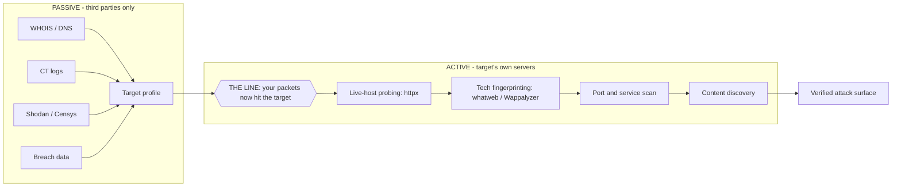
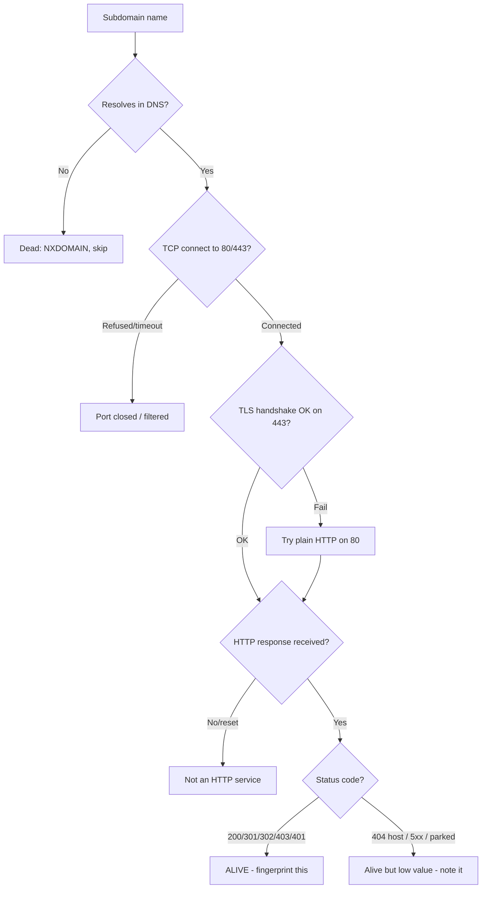
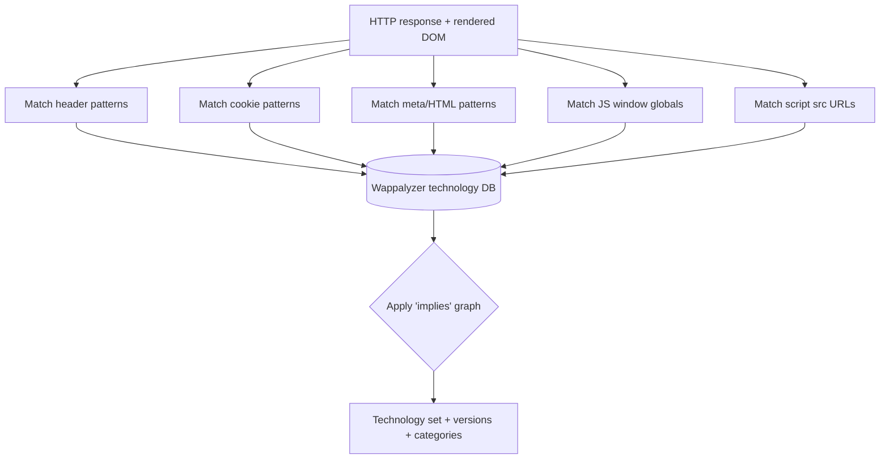
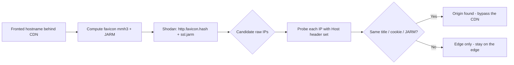
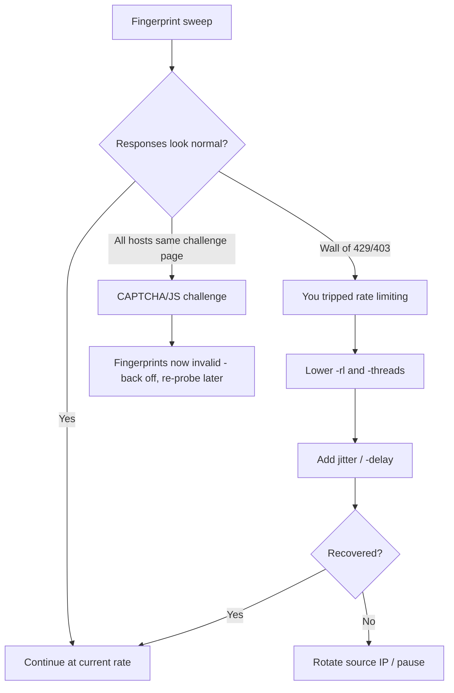

This is Chapter 10 of the Recon & OSINT notebook. Chapter 9 ended at the edge of the public internet: you queried Shodan and Censys, pivoted on certificates and favicons, and produced a list of IPs and hostnames belonging to the target — all without sending a single packet to the target's own machines. This chapter crosses that line. Here, for the first time in the recon phase, your packets land on the target's servers. You take the list of subdomains and IPs that Chapters 5 and 9 produced, find which of them are actually alive, and interrogate each one to learn *what it is running* — the web server, the framework, the CMS, the CDN, the WAF, the language, the JavaScript libraries, the analytics tags, and the version numbers that turn a generic host into a specific, exploitable attack surface.

Fingerprinting is the hinge between reconnaissance and exploitation. A subdomain list is just names. But `admin.example.com` running `Jenkins 2.289.1` behind `Cloudflare`, answering on `nginx/1.18.0`, setting a `JSESSIONID` cookie and serving an `X-Jenkins: 2.289.1` header, is a *plan*. You now know which CVEs to check, which default paths to try, which auth model you are up against, and whether a WAF sits in the path. This chapter teaches the three workhorse tools that extract that information — **httpx** (a fast HTTP prober), **whatweb** (a plugin-driven fingerprinter), and **Wappalyzer** (a pattern/regex technology detector) — from zero, plus the byte-level markers they all read so you understand *why* a fingerprint is or isn't reliable.

Everything here assumes authorised work: a scoped penetration test whose rules of engagement permit active probing, a bug-bounty programme within policy, or an attack-surface assessment of assets you own. The instant your packets touch the target — even a single `HEAD /` request — you are in active recon, in scope, and in the target's logs. That boundary, and how to stay legal and quiet on the right side of it, is flagged throughout and covered fully in Part 13.

---

## Part 1: Passive vs Active — The Exact Line You Are Crossing

Chapter 1 of this notebook drew the distinction between passive and active reconnaissance in general terms. This chapter is where it becomes physical and legal, so it is worth pinning down the precise definition rather than the hand-wavy one.

**Passive reconnaissance** gathers information about a target *without sending any traffic to systems the target owns or controls.* You query WHOIS registrars, DNS resolvers you don't control, certificate-transparency logs, Shodan/Censys indexes, Google's cache, breach databases, LinkedIn. Every one of those is a *third party*. The target's own web-server logs record nothing, because you never talked to it. Legally and operationally, passive recon is low-risk: you are reading public records and other people's scans.

**Active reconnaissance** sends traffic *to systems the target owns or controls* and observes the response. The moment you run `curl https://target.com`, send a `SYN` to their port 443, resolve a hostname *and then connect to it*, or let httpx probe a subdomain list, your source IP appears in their access logs, their WAF's event stream, their IDS, and potentially a SOC analyst's dashboard. That is the line. Fingerprinting is active by definition, because you cannot fingerprint a live service without eliciting a response from it.



There is a grey zone worth naming. Loading a target's page in your own browser is technically active — your IP hits their server — but it is indistinguishable from an ordinary visitor and is universally treated as acceptable during any authorised engagement. Running httpx across 4,000 subdomains at 150 requests per second is unambiguously active, unambiguously noisy, and unambiguously *needs to be in scope*. Somewhere between "one browser visit" and "mass automated probing" sits a spectrum of noise, and the professional skill is calibrating where on that spectrum you operate given your rules of engagement.

**Why cross the line at all?** Because passive data is stale and incomplete. Shodan's banner for a host might be six weeks old; the box may have been patched, repurposed, or moved behind a load balancer since. A subdomain that resolves in DNS might point at a decommissioned server that returns `NXDOMAIN` at the application layer, or at a parked page, or at a `403` from a WAF. Only by *actually connecting* do you learn the current, ground-truth state: is it alive, what does it serve right now, what version it runs at this moment. Fingerprinting replaces "this used to run X" with "this is running X, right now, and here is the header that proves it."

**Pentester landing on a fresh scope:** the first automated action after subdomain enumeration is almost always an httpx sweep to collapse a list of hundreds of DNS names down to the few dozen that actually answer HTTP/HTTPS, tagged with status code, title, and detected technology. That single step is the highest-value-per-second operation in the entire recon phase, because it converts a name list into a ranked target list.

---

## Part 2: What "Fingerprinting" Actually Means - The Markers on the Wire

Before touching a tool, you need to understand *what* the tools read, because every fingerprinting engine is just a pattern-matcher over a fixed set of observable signals. If you know the signals, you can fingerprint by hand when a tool fails, and you can tell a reliable fingerprint from a spoofed one.

When you make one HTTP request to a web server, the response carries a surprising number of identifying markers. Here is a real annotated response and what each line reveals:

```http
HTTP/1.1 200 OK
Server: nginx/1.18.0 (Ubuntu)          # web server + build/distro
Date: Mon, 03 Nov 2025 09:14:22 GMT
Content-Type: text/html; charset=UTF-8  # content type
X-Powered-By: PHP/7.4.3                 # language + version (often leaked)
Set-Cookie: PHPSESSID=abc...; path=/    # cookie NAME reveals the platform
Set-Cookie: wordpress_test_cookie=WP    # WordPress marker
Link: <https://x/wp-json/>; rel=...     # WP REST API marker
X-Pingback: https://x/xmlrpc.php        # WordPress marker
Vary: Accept-Encoding
X-Cache: HIT                            # a caching layer (Varnish/CDN)
CF-RAY: 7f3a...-LHR                     # Cloudflare (CDN/WAF) fingerprint
```

Each class of marker has different reliability. Let's break them down, because knowing which markers *lie* is what separates a novice from an experienced fingerprinter.

**Response headers.** The `Server` header is the classic first look, but it is trivially changed or removed. Many hardened servers set `Server: nginx` with no version, or spoof it entirely (`Server: Apache` on an nginx box). `X-Powered-By`, `X-AspNet-Version`, `X-Generator`, and `X-Drupal-Cache` leak framework/language and are commonly forgotten by admins, making them *high-value when present but absent-not-conclusive*. Vendor-specific headers are gold: `CF-RAY` and `CF-Cache-Status` mean Cloudflare; `X-Amz-Cf-Id` means AWS CloudFront; `X-Jenkins` states the Jenkins version outright; `X-Sourcefiles` hints at ASP.NET debug.

**Cookies.** Cookie *names* are one of the most reliable fingerprints because they are baked into the framework and rarely changed. `PHPSESSID` -> PHP; `JSESSIONID` -> Java (Tomcat/JBoss/Jetty); `ASP.NET_SessionId` -> ASP.NET; `laravel_session` -> Laravel; `connect.sid` -> Express/Node; `wordpress_*` -> WordPress; `_rails_session` -> Ruby on Rails; `csrftoken` + `sessionid` -> Django. An admin can change the `Server` header in five seconds but almost never renames the session cookie, so cookies survive header-scrubbing.

**HTML body markers.** `<meta name="generator" content="WordPress 6.4.2">` is an explicit version statement. Framework-specific asset paths (`/wp-content/`, `/sites/default/files/` for Drupal, `/media/jui/` for Joomla, `/_next/static/` for Next.js, `/_nuxt/` for Nuxt), comment signatures, and characteristic error-page HTML all fingerprint the stack. JavaScript globals set on `window` (`window.__NUXT__`, `window.wp`, `window.Shopify`, `window.dataLayer`) are read by client-side detectors like Wappalyzer.

**Favicon hash.** The `/favicon.ico` file is usually shipped unchanged with the default install of a product. Its hash (Shodan uses MurmurHash3 of the base64-encoded body; others use MD5) becomes a fingerprint for that product — a way to identify a Jenkins, GitLab, or Spring Boot instance *even when every header has been stripped*, because almost nobody replaces the default favicon.

**TLS and JARM.** The TLS certificate's subject, issuer, and SAN entries fingerprint ownership. **JARM** is an active TLS fingerprint: it sends ten specially-crafted TLS Client Hellos and hashes the server's negotiation responses into a 62-character string. Two servers with the same JARM are running the same TLS stack/config — a way to cluster infrastructure and spot the real origin behind a CDN.

**Default content and error pages.** A default nginx welcome page, an Apache "It works!", a Tomcat 404 with its characteristic layout, an IIS blue error page, a Spring Boot Whitelabel Error Page — each has a byte-signature that identifies the server even with no headers.

The table below summarises reliability, which is the mental model every tool encodes:

| Marker class | Example | Reliability | Spoofable? |
|---|---|---|---|
| Vendor headers | `CF-RAY`, `X-Jenkins` | Very high | Rarely (functional) |
| Cookie names | `JSESSIONID`, `laravel_session` | High | Almost never in practice |
| `Server` header | `nginx/1.18.0` | Low-medium | Trivially |
| `X-Powered-By` | `PHP/7.4.3` | Medium | Easily removed |
| HTML `generator` meta | `WordPress 6.4.2` | High when present | Easily removed |
| Asset paths | `/wp-content/`, `/_next/` | High | Hard to change |
| Favicon hash | MurmurHash3 of icon | High | Rarely changed |
| JARM / TLS | 62-char hash | High (infra) | Config-dependent |
| Default error page | Tomcat 404 layout | Medium-high | Customisable |

**Red team relevance:** because so many of these markers are spoofable, a mature defender will scrub headers, rename nothing they can't (cookies), and serve a generic error page — which is exactly why favicon hashing and JARM matter: they read signals the admin usually forgets. **Blue team relevance:** the mitigations run in reverse — remove version banners, strip `X-Powered-By`, customise error pages, and replace the default favicon on sensitive internal tools so they do not get clustered by an attacker's favicon search.

---

## Part 3: Deciding a Host Is "Alive" - The Probe Logic

You cannot fingerprint what you cannot reach, and a subdomain list is full of names that do not answer. Before any tool reports a technology, it must first decide the host is *alive* and speaking HTTP. Understanding that decision saves you hours of confusion when httpx says a host is "down" that your browser can load.

A DNS name can be in one of many states, and only one of them is "a live web service you can fingerprint":



The probe sequence a tool like httpx runs for each name is: (1) resolve the name to an IP (unless you feed it IPs directly); (2) open a TCP connection to the target port; (3) if HTTPS, complete the TLS handshake — this alone reveals the certificate; (4) send an HTTP request (by default a `GET /`, though `HEAD` is quieter); (5) read the status line, headers, and optionally the body; (6) classify. A host is "alive" for fingerprinting purposes if it completes an HTTP transaction, *regardless of status code*. A `403 Forbidden` or `401 Unauthorized` is very much alive and often more interesting than a `200` — it means there is something worth protecting behind it.

Several subtle failure modes trip people up:

- **HTTP works, HTTPS does not (or vice versa).** Many hosts serve only one scheme, or redirect `80 -> 443`. A prober that only tries `https://` will mark an HTTP-only host as dead. Always probe *both schemes* — httpx does this when you do not specify one.
- **Wildcard DNS.** `*.example.com` resolving everything to one IP means every random name "resolves" and every one returns the same `200`. You must detect and filter wildcards or your live-host list is polluted with hundreds of identical phantom hosts. (Chapter 5 covered wildcard detection during subdomain enumeration; the same discipline applies here — filter by response hash.)
- **Virtual hosting / SNI.** One IP serves many sites keyed on the `Host` header and TLS SNI. Connecting to the IP without the right `Host` header yields the *default* vhost (often a generic landing page or `404`), not the site you want. This is why you probe *names*, not just IPs, and why `Host`-header/vhost discovery (Part 6) exists.
- **CDN in front.** Cloudflare/CloudFront/Akamai answer on the target's behalf. You reach the *edge*, not the origin. The fingerprint you get describes the CDN plus whatever it forwards. Spotting "this is behind a CDN" is itself a fingerprinting result (Part 7 covers finding the real origin).

**Status-code triage** is the first ranking heuristic. A quick reference:

| Status | Meaning for recon | Priority |
|---|---|---|
| `200 OK` | Live content served | High - fingerprint & crawl |
| `301/302` | Redirect - follow to real target | High - note the `Location` |
| `401` | Auth required (Basic/NTLM/etc.) | High - protected app present |
| `403` | Forbidden - WAF or dir listing off | High - something is here |
| `404` | Not found at `/` (host still alive) | Medium - try other paths |
| `405` | Method not allowed | Medium - try GET vs HEAD |
| `429` | Rate-limited - you are too fast | Slow down! |
| `500-599` | Server error - app present but broken | Medium-high - errors leak info |
| `530 / 1020` | Cloudflare block page | Note WAF, tune probing |

**Blue team usage:** the same probe logic drives external attack-surface-management (ASM) products that continuously sweep an org's own address space to find shadow assets — a forgotten `staging.` box answering `200` with an outdated framework is exactly what an ASM tool is built to surface before an attacker's httpx run does.

---

## Part 4: httpx From Scratch - The Fast HTTP Prober

**What it is.** `httpx` (from ProjectDiscovery, written in Go) is a fast, multi-purpose HTTP toolkit and prober. Its core job is: take a big list of hosts/URLs, probe each one, and emit a clean, filterable line per live host with as much or as little metadata as you ask for — status code, page title, content length, detected technology, CDN, response time, redirect chain, and more. It is the de-facto standard first step after subdomain enumeration because it is fast (goroutine-based concurrency), scriptable (line-oriented output that pipes cleanly), and accurate about the alive/dead decision.

> **Name collision warning.** There is an unrelated Python package also called `httpx` (an HTTP *client* library, like `requests`). They are completely different. This chapter means the ProjectDiscovery *prober*. If `httpx --version` prints a Go-style version and mentions projectdiscovery, you have the right one; if `import httpx` works in Python but the CLI does nothing useful, you installed the library. Install the prober from ProjectDiscovery, not via `pip install httpx`.

**Why it exists.** Before httpx, people looped `curl` in bash over a host list — slow, single-threaded, and messy to parse. httpx does the same probing with hundreds of concurrent workers, consistent output, and built-in enrichment (titles, tech detection, hashes) that curl cannot do without extra tooling.

**Install on Kali.** httpx ships in Kali's repos, but the packaged version is often behind. Prefer installing the current release directly:

```bash
# Option A: from the Kali/Debian repo (may be older)
sudo apt update && sudo apt install -y httpx-toolkit
# On Kali the binary is sometimes named httpx-toolkit to avoid the Python clash
which httpx-toolkit

# Option B (recommended): install the latest with Go
# First install Go if needed:
sudo apt install -y golang-go
go install -v github.com/projectdiscovery/httpx/cmd/httpx@latest
# The binary lands in ~/go/bin - add it to PATH:
echo 'export PATH=$PATH:~/go/bin' >> ~/.bashrc && source ~/.bashrc

# Verify
httpx -version
# [INF] Current httpx version v1.6.x (latest)
```

**Core workflow.** httpx reads targets from `-l <file>` or from stdin (which is how it chains after subfinder/amass), and prints one line per live host. The simplest possible run:

```bash
# Probe a single host
echo "example.com" | httpx
# https://example.com

# Probe a list, show status code, title, and tech
cat subdomains.txt | httpx -sc -title -td -silent
```

Let's decode those flags, because httpx has many and using the right subset is the whole skill. Here is the flag reference you will actually use, grouped by purpose:

| Flag | Long form | What it does |
|---|---|---|
| `-l` | `-list` | Input file of hosts/URLs |
| `-silent` | | Suppress the banner/INF lines - clean output for piping |
| `-sc` | `-status-code` | Show HTTP status code |
| `-title` | | Show the `<title>` of the page |
| `-td` | `-tech-detect` | Detect technologies (Wappalyzer dataset) |
| `-cl` | `-content-length` | Show response body length |
| `-server` | `-web-server` | Show the `Server` header |
| `-ct` | `-content-type` | Show `Content-Type` |
| `-location` | | Show the redirect `Location` |
| `-ip` | | Show the resolved IP |
| `-cname` | | Show the CNAME record |
| `-cdn` | | Detect & name CDN/WAF (Cloudflare, Akamai, etc.) |
| `-fr` | `-follow-redirects` | Follow redirects to the final URL |
| `-favicon` | | Compute & show the favicon MurmurHash3 |
| `-jarm` | | Compute the JARM TLS fingerprint |
| `-hash` | `-hash <algo>` | Body hash (`md5`,`sha256`,`mmh3`,`simhash`) |
| `-x` | `-method` | HTTP method (e.g. `-x HEAD` for quiet probes) |
| `-ports` | `-p` | Probe specific ports (e.g. `-p 80,443,8080,8443`) |
| `-threads` | `-t` | Concurrency (default 50) |
| `-rl` | `-rate-limit` | Requests per second cap - be polite |
| `-timeout` | | Per-request timeout seconds |
| `-retries` | | Retry count for flaky hosts |
| `-mc` | `-match-code` | Only show these status codes (e.g. `-mc 200,403`) |
| `-fc` | `-filter-code` | Hide these status codes (e.g. `-fc 404`) |
| `-mr`/`-fr` | `-match-regex`/`-filter-regex` | Match/hide by body regex |
| `-json` | `-j` | JSON output (one object per line - best for tooling) |
| `-o` | `-output` | Write to a file |
| `-sr` | `-store-response` | Save full responses to disk |
| `-ss` | `-screenshot` | Headless-browser screenshot of each host |
| `-probe` | | Emit explicit `[SUCCESS]`/`[FAILED]` per host |

A production-grade first sweep looks like this:

```bash
cat subdomains.txt | httpx \
  -silent \
  -sc -title -td -server -cdn -location -ip \
  -p 80,443,8080,8443,8000,8888 \
  -threads 50 -rl 150 -timeout 8 -retries 2 \
  -o live_hosts.txt
```

And here is realistic annotated output from such a run:

```text
https://www.example.com [200] [Example Corp - Home] [nginx] [Cloudflare] [104.16.132.229]
https://api.example.com [401] [] [nginx/1.18.0] [] [93.184.216.34]
https://admin.example.com [200] [Dashboard] [Jenkins,Java] [] [93.184.216.35]
https://staging.example.com [403] [403 Forbidden] [Apache/2.4.29] [] [93.184.216.36]
https://blog.example.com [200] [Company Blog] [WordPress,PHP,MySQL] [Cloudflare] [104.16.132.230]
http://legacy.example.com [200] [Login] [PHP/5.6.40,Apache/2.2.15] [] [198.51.100.7]
https://vpn.example.com [200] [] [Fortinet] [] [203.0.113.12]
```

Read that like a target-selection worksheet. `admin.example.com` is a **Jenkins** dashboard answering `200` with no CDN in front — top priority, check for unauthenticated script console and known Jenkins CVEs. `legacy.example.com` runs **PHP 5.6.40 on Apache 2.2.15** — both wildly end-of-life, a rich CVE surface. `vpn.example.com` fingerprints as **Fortinet** — check the FortiOS version against the SSL-VPN CVE history. `api.example.com` returns `401` — an authenticated API worth understanding. The two Cloudflare-fronted hosts are lower priority for direct attack because you are hitting an edge, not the origin.

**Chaining is the point.** httpx's real power is as a pipe stage:

```bash
# Full recon pipe: enumerate -> probe -> feed the next tool
subfinder -d example.com -silent | httpx -silent -mc 200,301,302,401,403 | tee live.txt

# Only hosts running a specific tech, extracted for follow-up
cat subs.txt | httpx -silent -td -json | jq -r 'select(.tech!=null and (.tech|index("WordPress"))) | .url'
```

**JSON output** is what you use when feeding another program. One object per line:

```bash
echo example.com | httpx -json -sc -title -td -td -cdn -silent | jq
```
```json
{
  "url": "https://example.com",
  "status_code": 200,
  "title": "Example Domain",
  "webserver": "nginx",
  "tech": ["Nginx","HSTS"],
  "cdn_name": "cloudflare",
  "a": ["104.16.132.229"],
  "host": "104.16.132.229",
  "time": "142ms",
  "favicon": "-1337133700"
}
```

**Screenshots at scale.** `-ss` (or `-screenshot`) drives a headless Chromium to capture each live host, which is invaluable when triaging hundreds of hosts — you eyeball a contact sheet instead of visiting each URL. Output lands in a `screenshot/` directory plus a `screenshot.html` gallery:

```bash
cat live.txt | httpx -silent -ss -st 10 -o shots.txt
# Screenshots saved to ./output/screenshot/*.png, gallery in screenshot.html
```

**Politeness matters and is a skill.** `-rl 150 -threads 50` on a small org will hammer them and may trip rate limits (`429`) or a WAF ban. On a scoped test, start conservative (`-rl 20 -threads 10`), watch for `429`/`403` spikes, and dial up only if the target absorbs it. **Red team usage:** low-and-slow probing (`-rl 5`, randomised timing, `-x HEAD`, spoofed but plausible `User-Agent`) keeps you under threshold-based alerting; a burst sweep is the fastest way to get your source IP blocked and burn the engagement's element of surprise.

---

## Part 5: whatweb From Scratch - The Plugin-Driven Fingerprinter

**What it is.** `whatweb` is a Ruby web-technology fingerprinter built around a **plugin** model. Each of its 1,800+ plugins knows how to detect one technology by matching patterns — a header, a cookie, an HTML string, a favicon hash, a specific file path — and reporting the technology plus, where possible, a version and even a confidence-boosting "certainty." Where httpx gives you a fast alive/dead sweep with light tech tags, whatweb goes deeper on *identification*: it will tell you not just "WordPress" but "WordPress 6.4.2, plugin X detected, jQuery 3.6.0, Google Analytics, PHP 7.4, and the country of the IP."

**Why it exists.** httpx's tech-detect is fast but shallow (a subset of the Wappalyzer dataset). whatweb trades speed for a broad, opinionated plugin library and — crucially — a *tunable aggression* model that lets you decide how many extra requests it is allowed to send to confirm a guess. That trade-off (stealth vs. thoroughness) is whatweb's defining feature.

**Install on Kali.** whatweb is preinstalled on Kali. Otherwise:

```bash
sudo apt install -y whatweb          # Debian/Kali/Ubuntu
# or from source:
git clone https://github.com/urbanadventurer/WhatWeb.git
cd WhatWeb && sudo gem install bundler && bundle install
./whatweb --version
# WhatWeb version 0.5.5 (https://www.morningstarsecurity.com/research/whatweb)
```

**The aggression model - the single most important whatweb concept.** whatweb has five aggression levels (`-a` / `--aggression`) that control how noisy it is willing to be:

| Level | Name | Behaviour | Requests | Use when |
|---|---|---|---|---|
| `1` | Stealthy | One request per target, no follow-ups. Reads only what a single `GET /` returns. | 1 | Default. Quiet recon. |
| `2` | (reserved) | Not used in current versions | - | - |
| `3` | Aggressive | If level-1 finds a hint, sends a few extra requests to confirm/version it | Few | You want versions & can afford noise |
| `4` | Heavy | Runs *all* plugins' extra requests against the target - fetches many URLs | Many | Deep single-target, in scope |

In practice you use **`-a 1`** for a broad quiet sweep and **`-a 3`** when you have narrowed to a host and want versions confirmed. `-a 4` is loud — it will request many guessed paths and light up logs; reserve it for a single in-scope host where thoroughness beats stealth.

**Core workflow.** The simplest run:

```bash
whatweb example.com
```
```text
http://example.com [200 OK] Country[UNITED STATES][US], HTTPServer[nginx/1.18.0],
IP[93.184.216.34], Title[Example Domain], nginx[1.18.0], X-Powered-By[PHP/7.4.3]
```

A more realistic WordPress target at aggression 3:

```bash
whatweb -a 3 https://blog.example.com
```
```text
https://blog.example.com [200 OK] Cookies[wordpress_test_cookie],
Country[UNITED STATES][US], HTML5, HTTPServer[nginx],
JQuery[3.6.0], MetaGenerator[WordPress 6.4.2], PHP[7.4.3],
Script[text/javascript], Title[Company Blog], WordPress[6.4.2],
X-Powered-By[PHP/7.4.3], X-Pingback[https://blog.example.com/xmlrpc.php],
Google-Analytics[Universal][UA-12345-1]
```

Read the payoff: whatweb pulled the *exact* WordPress version (6.4.2), the jQuery version, PHP version, confirmed the pingback/XML-RPC endpoint (an attack surface for brute-force amplification and SSRF), and even the Google Analytics ID (which pivots to other properties owned by the same org — a passive-OSINT bridge). That is far richer than an httpx tech tag.

**Key flags:**

| Flag | Purpose |
|---|---|
| `-a <1-4>` | Aggression level (stealth -> heavy) |
| `-i <file>` | Input list of targets (one per line) |
| `-v` | Verbose - shows *why* each plugin matched (the actual evidence) |
| `--log-brief=FILE` | One-line-per-target log |
| `--log-verbose=FILE` | Full detail log |
| `--log-json=FILE` | JSON output for tooling |
| `--log-xml=FILE` | XML output |
| `-U "<agent>"` | Set a custom User-Agent |
| `-H "Name: val"` | Add a custom header (e.g. auth cookie) |
| `--max-threads=N` / `-t` | Concurrency for list scans |
| `--follow-redirect=never/http-only/...` | Redirect policy |
| `--proxy host:port` | Route through Burp/an upstream proxy |
| `-p <plugin>` / `--info-plugins` | Run/inspect specific plugins |
| `--wait=N` | Seconds between requests (rate control) |

**Batch scanning a live-host list** (this is how it fits the pipeline):

```bash
# Feed httpx's live list into whatweb, JSON out, be polite
whatweb -i live_hosts.txt -a 1 -t 20 --wait=1 \
        --log-json=whatweb_results.json --log-brief=whatweb_brief.txt
```

**Verbose mode teaches you the evidence.** `-v` shows the matched string, which is how you learn to fingerprint by hand and how you spot false positives:

```bash
whatweb -v -a 3 https://admin.example.com
```
```text
Plugin: Jenkins
  Certainty: 100%
  Matched: X-Jenkins header present (2.289.1)
  Version: 2.289.1
Plugin: Java
  Certainty: 100%
  Matched: JSESSIONID cookie
Plugin: HTTPServer
  String: Jetty(9.4.39.v20210325)
```

Now you know the Jenkins version *and* that it runs on embedded Jetty 9.4.39 — two independently versioned components to check against CVE databases. **Bug bounty angle:** whatweb's version extraction is often what turns a "maybe outdated" hunch into a reportable finding, because a confirmed end-of-life version (e.g. `PHP[5.6.40]`, `WordPress[4.7]`) plus a public CVE is a concrete, demonstrable risk many programmes will accept even without a full exploit — though always confirm exploitability rather than reporting a bare version banner (many programmes reject "version disclosure" alone).

**False positives are real.** Because plugins match patterns, a page that merely *mentions* WordPress, or a security product that injects decoy headers, can trigger a plugin. Always corroborate a critical fingerprint with a second signal (cookie + header + asset path), and use `-v` to see the actual evidence before you act on it.

---

## Part 6: Wappalyzer From Scratch - The Pattern/Regex Detector

**What it is.** Wappalyzer began as a browser extension that identifies the technologies a website uses — CMS, frameworks, analytics, CDNs, payment processors, JS libraries, even the marketing stack. Under the hood it is a large JSON dataset of **technologies**, each described by a set of **patterns**: regexes over headers, cookies, HTML, script `src` URLs, `meta` tags, DOM selectors, and JavaScript `window` globals, plus an `implies` graph (detecting "WooCommerce" *implies* "WordPress" *implies* "PHP"). This same dataset is what powers httpx's `-td` and many other tools — Wappalyzer's fingerprint database is an industry backbone.

**Why it matters for recon.** Wappalyzer is uniquely strong at **client-side** detection: technologies that only reveal themselves once JavaScript executes and sets globals or injects DOM. httpx and whatweb read the raw HTTP response; a headless-browser Wappalyzer run also sees what the page becomes *after* rendering — catching React/Vue/Angular, Segment, Intercom, Google Tag Manager containers, and SPA frameworks that leave little trace in the initial HTML.

**The forms it comes in.** The hosted browser extension is manual and one-site-at-a-time; for recon you want a programmatic form. The community CLI/library options:

```bash
# Node CLI (community package built on the Wappalyzer dataset)
npm install -g wappalyzer
wappalyzer https://example.com

# Or the Python port (does static + optional headless analysis)
pip install python-Wappalyzer --break-system-packages
```

```python
# Python usage - static analysis via requests + the pattern DB
import warnings; warnings.filterwarnings("ignore")
from Wappalyzer import Wappalyzer, WebPage

wappalyzer = Wappalyzer.latest()
webpage = WebPage.new_from_url("https://blog.example.com")
techs = wappalyzer.analyze_with_versions_and_categories(webpage)
import json; print(json.dumps(techs, indent=2))
```
```json
{
  "WordPress": {"versions": ["6.4.2"], "categories": ["CMS", "Blogs"]},
  "PHP": {"versions": ["7.4.3"], "categories": ["Programming languages"]},
  "MySQL": {"versions": [], "categories": ["Databases"]},
  "jQuery": {"versions": ["3.6.0"], "categories": ["JavaScript libraries"]},
  "Nginx": {"versions": ["1.18.0"], "categories": ["Web servers"]},
  "Google Analytics": {"versions": [], "categories": ["Analytics"]},
  "Cloudflare": {"versions": [], "categories": ["CDN"]}
}
```

**How a pattern works.** A Wappalyzer technology entry looks like this (simplified from the real dataset):

```json
"WordPress": {
  "cats": [1, 11],
  "headers": { "X-Pingback": "/xmlrpc\\.php" },
  "meta": { "generator": "WordPress ?([\\d.]+)?\\;version:\\1" },
  "html": "<link[^>]+s\\d+\\.wp\\.com",
  "js": { "wp.customize": "" },
  "implies": ["PHP", "MySQL"]
}
```

Read the mechanics: the `meta` pattern captures the version via a regex group (`([\d.]+)`) and the `\;version:\1` suffix tells Wappalyzer to use capture-group 1 as the version. `implies` means a WordPress detection auto-adds PHP and MySQL even if they were not directly observed. This `implies` graph is why Wappalyzer often reports a fuller stack than the raw evidence strictly proves — powerful, but a reason to treat *implied* techs as weaker signals than *directly matched* ones.



**Categories are the recon value.** Wappalyzer buckets findings into categories — CMS, e-commerce, payment processors, CDNs, WAFs, analytics, tag managers, marketing automation, CRMs, chat widgets. For a red-team social-engineering pretext, knowing the target runs *Intercom* chat and *HubSpot* CRM shapes a convincing phish; for an appsec test, knowing the payment stack is *Stripe Elements* vs. a self-hosted gateway changes where you look for PCI-relevant flaws.

**httpx vs whatweb vs Wappalyzer - when to reach for which:**

| Dimension | httpx | whatweb | Wappalyzer |
|---|---|---|---|
| Primary job | Live-host probing at scale | Deep single/list fingerprint | Technology-stack identification |
| Speed | Very fast (Go, concurrent) | Moderate (Ruby) | Slow (esp. headless) |
| Version extraction | Light | Strong | Strong |
| Client-side JS detection | No (raw HTTP)* | Limited | Strong (headless mode) |
| Aggression control | Rate/thread flags | Explicit 1-4 levels | Static vs headless |
| Best used | First sweep, piping | Confirming versions | Full stack + categories |
| Dataset | Uses Wappalyzer DB | Own 1800+ plugins | The Wappalyzer DB itself |

*httpx can screenshot via headless Chromium but does not run JS-based tech detection.

**The practical division of labour:** httpx first (fast, find the live hosts + light tags), whatweb second (versions on the interesting ones), Wappalyzer third (full category-rich stack on the crown-jewel targets, especially SPAs). You rarely use only one.

---

## Part 7: Fingerprinting Through the Fog - Favicon Hashing, JARM & Finding Origins

The hardest fingerprinting problem is the host that *hides*. A WAF/CDN strips version headers, serves a generic error page, and answers on a shared edge IP. Header-based fingerprinting returns little. This is where two techniques earn their keep, and both were introduced in Chapter 9 for passive Shodan/Censys pivoting — here you apply them *actively* against the target.

**Favicon hashing.** Almost every product ships a default `/favicon.ico`, and almost nobody changes it — including on hardened internal tools. The favicon's hash is therefore a fingerprint that survives header-scrubbing. The de-facto algorithm (used by Shodan and httpx) is **MurmurHash3** over the *base64-encoded* icon body. Compute it and you can (a) identify the product and (b) search Shodan for every other host on the internet serving the same icon — often revealing the origin behind the CDN, because the origin serves the same favicon on its raw IP.

```bash
# httpx computes the favicon mmh3 hash for you
echo https://admin.example.com | httpx -favicon -silent
# https://admin.example.com [-1250474341]  <- this is the mmh3 hash

# Do it by hand to understand the mechanism (Shodan's exact recipe):
python3 - <<'PY'
import requests, mmh3, base64, codecs
r = requests.get("https://admin.example.com/favicon.ico", verify=False)
b64 = codecs.encode(r.content, "base64")   # base64 of the raw bytes
print("mmh3:", mmh3.hash(b64))             # e.g. -1250474341
PY
# Then pivot in Shodan: http.favicon.hash:-1250474341
# -> every internet host serving this exact icon (often the hidden origin)
```

A short reference of well-known favicon hashes (they identify the product at a glance):

| mmh3 hash | Product |
|---|---|
| `81586312` | Jenkins (default) |
| `-1255347784` | GitLab |
| `1275480391` | Spring Boot / Whitelabel |
| `-235651590` | Apache Tomcat |
| `743365239` | pfSense |
| `-1988251468` | Grafana |

(Exact values vary by version; the technique — not the memorised number — is the skill.)

**JARM.** JARM actively fingerprints a server's TLS stack by sending ten crafted Client Hellos and hashing how the server negotiates each. Identical JARM strings mean identical TLS configuration — a way to (a) identify the server software/appliance and (b) cluster infrastructure, including matching a CDN-fronted hostname to a bare origin IP that presents the same JARM.

```bash
# httpx computes JARM inline
echo https://vpn.example.com | httpx -jarm -silent
# https://vpn.example.com [29d3fd00029d29d00042d43d00041d5deebc4...]

# Compare a suspected origin IP's JARM to the fronted hostname's JARM.
# Match => same TLS stack => likely the real origin behind the CDN.
```



**Finding the origin behind a CDN** is a recurring recon objective because reaching the origin directly can bypass the WAF entirely. The workflow: take the favicon hash and JARM of the fronted site, search Shodan/Censys for hosts matching them, get candidate raw IPs, then *actively verify* by connecting to each candidate IP while forcing the correct `Host` header — if it returns the same page (same title, same session cookie), you have found the origin:

```bash
# Verify a candidate origin IP by forcing the Host header (vhost probe)
echo "203.0.113.50" | httpx -silent -sc -title -H "Host: admin.example.com"
# 203.0.113.50 [200] [Dashboard]   <- matches the fronted site => origin!

# Or with curl, explicitly:
curl -sk https://203.0.113.50/ -H "Host: admin.example.com" -o /dev/null -w "%{http_code} %{size_download}\n"
```

**Virtual-host discovery** is the same primitive turned into enumeration: one IP hosts many sites keyed on `Host`. Brute-forcing the `Host` header against an IP with a wordlist reveals internal vhosts not in public DNS:

```bash
# ffuf as a vhost fuzzer (Host-header brute force)
ffuf -w vhost-wordlist.txt -u https://93.184.216.34/ \
     -H "Host: FUZZ.example.com" -fs 0 -mc 200,301,302,403
# Filter out the default-vhost size with -fs; anomalies are real vhosts
```

**Blue team relevance:** the defensive counter to all of this is (1) replace default favicons on sensitive internal apps so favicon search returns nothing, (2) put the origin on an allowlist that *only* accepts traffic from the CDN's IP ranges (so a discovered origin IP still refuses direct connections), and (3) not present the real certificate/JARM on the origin. If your origin accepts direct connections with the right `Host` header, your CDN WAF is optional from an attacker's point of view — a very common and serious misconfiguration.

---

## Part 8: Hands-On Lab - From a Subdomain List to a Ranked, Fingerprinted Target Inventory

This lab takes the output of Chapter 5's subdomain enumeration and produces a ranked, fingerprinted inventory — the concrete deliverable that recon feeds to the exploitation phase. Everything runs against hosts you are authorised to test. For a safe practice target, use a deliberately vulnerable environment you control (see Part 12) rather than a real third party.

### 8.1 Setup and inputs

```bash
mkdir -p ~/engagement/recon && cd ~/engagement/recon

# Assume Chapter 5 produced this (subfinder/amass/assetfinder merged & sorted)
wc -l subdomains.txt
# 342 subdomains.txt

head -5 subdomains.txt
# www.example.com
# api.example.com
# admin.example.com
# staging.example.com
# blog.example.com
```

### 8.2 Step 1 - Collapse names to live hosts (httpx)

```bash
cat subdomains.txt | httpx \
  -silent \
  -sc -title -td -server -cdn -ip -location \
  -p 80,443,8080,8443,8000,8888 \
  -threads 25 -rl 40 -timeout 8 -retries 2 \
  -o live_verbose.txt \
  -json -o live.json     # keep JSON too, for tooling

# Also keep a clean URL-only list for piping onward:
cat subdomains.txt | httpx -silent -mc 200,301,302,401,403 -o live_urls.txt
wc -l live_urls.txt
# 47 live_urls.txt        <- 342 names collapsed to 47 real hosts
```

Annotated `live_verbose.txt`:

```text
https://www.example.com [200] [Example Corp] [Nginx,HSTS] [nginx] [cloudflare] [104.16.132.229]
https://api.example.com [401] [] [Nginx] [nginx/1.18.0] [] [93.184.216.34]
https://admin.example.com [200] [Dashboard [Jenkins]] [Jenkins,Java,Jetty] [Jetty(9.4.39)] [] [93.184.216.35]
https://staging.example.com [403] [403 Forbidden] [Apache] [Apache/2.4.29] [] [93.184.216.36]
https://blog.example.com [200] [Company Blog] [WordPress,PHP,MySQL,jQuery] [nginx] [cloudflare] [104.16.132.230]
http://legacy.example.com [200] [Login] [PHP,Apache] [Apache/2.2.15] [] [198.51.100.7]
https://vpn.example.com [200] [] [Fortinet] [] [] [203.0.113.12]
https://grafana.example.com [302] [] [Grafana] [nginx] [] [93.184.216.40]
```

### 8.3 Step 2 - Triage and rank

Extract the high-value hosts programmatically from the JSON:

```bash
# Hosts NOT behind a CDN (direct origin => easier to attack) with a title
jq -r 'select(.cdn_name==null) | "\(.status_code)\t\(.url)\t\(.tech // [] | join(","))"' live.json | sort

# 200     https://admin.example.com   Jenkins,Java,Jetty
# 200     http://legacy.example.com   PHP,Apache
# 200     https://vpn.example.com     Fortinet
# 302     https://grafana.example.com Grafana
# 401     https://api.example.com     Nginx
# 403     https://staging.example.com Apache
```

### 8.4 Step 3 - Deep fingerprint the crown jewels (whatweb)

```bash
# Confirm versions on the interesting non-CDN hosts, verbose for evidence
whatweb -v -a 3 https://admin.example.com http://legacy.example.com https://grafana.example.com \
        --log-json=whatweb_deep.json --wait=1
```

Annotated highlights:

```text
https://admin.example.com
  Jenkins[2.289.1]  (X-Jenkins header, certainty 100%)
  Jetty[9.4.39.v20210325]
  Java  (JSESSIONID cookie)
  --> Jenkins 2.289.1: check unauth /script console, known RCE CVEs for this line

http://legacy.example.com
  Apache[2.2.15]  PHP[5.6.40]  (both END OF LIFE)
  HTMLForm  PasswordField
  --> EOL stack + login form: credential attacks + a long CVE list

https://grafana.example.com
  Grafana  Redirect->/login
  --> fingerprint the Grafana version from /api/health or the login page footer
```

### 8.5 Step 4 - Version a stubborn host by hand

Grafana hid its version behind a redirect. Fingerprint it manually — the `/api/health` endpoint on many Grafana builds leaks the version unauthenticated:

```bash
curl -sk https://grafana.example.com/api/health
# {"commit":"...","database":"ok","version":"8.3.0"}
# Grafana 8.3.0 -> check against the known Grafana path-traversal CVE (CVE-2021-43798)
```

This is the from-scratch payoff of Part 2: when a tool comes up short, you read the markers yourself. `/api/health`, the login-page footer, a `Grafana-`-prefixed header, or the favicon hash all independently version a Grafana instance.

### 8.6 Step 5 - Favicon & JARM pivot on the CDN-fronted hosts

```bash
cat live_urls.txt | httpx -silent -favicon -jarm -o fp.txt
grep -E "blog|www" fp.txt
# https://blog.example.com [688957143] [29d3fd00029d29d...]

# Take the favicon hash of the WordPress blog, hunt for a non-CDN origin:
#   Shodan query: http.favicon.hash:688957143  -org:"Cloudflare"
# Candidate origins returned: 198.51.100.90
echo "198.51.100.90" | httpx -silent -sc -title -H "Host: blog.example.com"
# 198.51.100.90 [200] [Company Blog]   <- origin found, bypasses Cloudflare WAF
```

### 8.7 Step 6 - Full-stack + categories on the flagship (Wappalyzer) and screenshots

```bash
# Category-rich stack on the main site (catches client-side/analytics/marketing)
wappalyzer https://www.example.com | jq

# Visual triage of all 47 live hosts at once
cat live_urls.txt | httpx -silent -ss -o /dev/null
# open ./output/screenshot.html  -> eyeball logins, dashboards, default pages
```

### 8.8 Deliverable - the ranked inventory

Merge everything into the artefact that recon hands off:

| Host | Status | Stack (confirmed) | CDN/WAF | Priority | Why |
|---|---|---|---|---|---|
| admin.example.com | 200 | Jenkins 2.289.1 / Jetty 9.4.39 | none | **Critical** | Unauth surface, RCE CVE line |
| legacy.example.com | 200 | PHP 5.6.40 / Apache 2.2.15 | none | **Critical** | EOL stack + login form |
| grafana.example.com | 302 | Grafana 8.3.0 | none | **High** | Path-traversal CVE candidate |
| vpn.example.com | 200 | Fortinet SSL-VPN | none | **High** | Appliance CVE history |
| api.example.com | 401 | nginx / auth API | none | Medium | Authenticated API |
| blog.example.com | 200 | WordPress 6.4.2 / PHP | Cloudflare (origin found) | Medium | Origin bypass available |
| staging.example.com | 403 | Apache 2.4.29 | none | Medium | Forbidden - probe paths |
| www.example.com | 200 | Nginx / static | Cloudflare | Low | Hardened marketing site |

That table — not the raw tool output — is what makes fingerprinting valuable: 342 names became 47 live hosts became a *ranked plan* with a specific first move on each target.

---

## Part 9: WAFs, CDNs, Rate Limits & the Reality of Being Noisy

Active fingerprinting is not the clean, deterministic exercise the earlier parts imply. Between you and the origin sits a stack of defensive middleboxes that alter, block, or lie about the responses you read. Understanding them keeps you from drawing wrong conclusions and from getting your source IP banned mid-engagement.

**WAF/CDN interference with fingerprints.** When Cloudflare, Akamai, AWS WAF, Imperva, or F5 sits in front of a site, *you fingerprint the middlebox, not the app.* The `Server` header becomes `cloudflare`, version banners vanish, and the WAF may inject its own cookies (`__cfduid`, `ak_bmsc`, `visid_incap_*`) that themselves fingerprint the *WAF vendor* — useful in its own right. Detecting the WAF is a first-class recon result:

```bash
# httpx names common CDNs/WAFs
cat live_urls.txt | httpx -silent -cdn -title
# https://www.example.com [Example Corp] [cloudflare]

# wafw00f is the dedicated WAF fingerprinter (install: pip install wafw00f)
wafw00f https://www.example.com
# [+] The site https://www.example.com is behind Cloudflare (Cloudflare Inc.) WAF
```

A quick WAF-cookie/header reference:

| Signal | WAF / CDN |
|---|---|
| `CF-RAY`, `__cfduid`, `cf-cache-status` | Cloudflare |
| `ak_bmsc`, `X-Akamai-*`, `AkamaiGHost` | Akamai |
| `visid_incap_*`, `X-Iinfo`, `incap_ses_*` | Imperva Incapsula |
| `X-Amz-Cf-Id`, `X-Cache: ... cloudfront` | AWS CloudFront |
| `X-Sucuri-ID`, `X-Sucuri-Cache` | Sucuri |
| `BigIP`, `TS<hex>` cookie, `F5-*` | F5 BIG-IP ASM |
| `barra_counter_session` | Barracuda |

**Rate limiting and bans.** Every WAF has thresholds. Blast 4,000 subdomains at 200 req/s and you will see `429 Too Many Requests`, then `403`, then a full IP ban or a JS/CAPTCHA challenge page that poisons every subsequent fingerprint (you now read the *challenge* page's tech, not the app's). Signs you have crossed a threshold: a sudden wall of identical `429`/`403`, response times climbing, or every host suddenly returning the same challenge title. The fix is to slow down (`-rl`), reduce threads, add jitter, and — if permitted — rotate source IPs.



**Evasion vs. etiquette.** Some quieting techniques are simply good manners on a scoped test; others edge toward evasion and must be explicitly authorised:

- **Good etiquette (almost always fine):** cap rate (`-rl`), fewer threads, `HEAD` instead of `GET` where a status check suffices, realistic `User-Agent`, respect obvious `429`s.
- **Evasion (needs authorisation, note in scope):** source-IP rotation, distributed probing, spoofed `X-Forwarded-For`, timing randomisation to defeat threshold alerting, targeting the origin to bypass the WAF.

**Red team usage:** on a stealth engagement the whole fingerprinting phase is deliberately slow and blended — a handful of requests per host, spread over hours, from residential/cloud IPs that look like normal traffic, ordered to look like a human browsing rather than a scanner sweeping. **Blue team usage:** the detection side is the mirror image — a spike of `GET /`+`GET /favicon.ico`+`GET /robots.txt` across many hostnames from one ASN in a short window, a non-browser `User-Agent` (`Go-http-client/2.0`, `WhatWeb/0.5.5`), or a burst of TLS handshakes with the JARM-probe signature are all high-fidelity indicators of exactly this activity. That symmetry is the subject of the next part.

---

## Part 10: Detection & Defense Angle

Everything in this chapter leaves a trace, and a competent blue team can both detect the reconnaissance and deny the information it seeks. This section consolidates the defensive view — how to spot fingerprinting against your estate, and how to make your estate harder to fingerprint.

**Detecting active fingerprinting.** The tools in this chapter have tells:

- **Tool User-Agents.** Default `User-Agent` strings are dead giveaways: `Go-http-client/2.0` (httpx and most ProjectDiscovery tools), `WhatWeb/0.5.5`, `Mozilla/5.0 (compatible; ... wappalyzer)`, `python-requests/2.x`. A WAF or reverse-proxy rule that flags non-browser UAs across many hosts catches most unsophisticated sweeps.
- **Fan-out pattern.** One source IP touching dozens or hundreds of distinct hostnames/vhosts in minutes, each with a single `GET /` (+ maybe `/favicon.ico`, `/robots.txt`), is the classic httpx signature. Correlate by source IP/ASN across hostnames, not per-host.
- **Favicon/JARM probes.** A request for `/favicon.ico` immediately after `GET /` on many hosts, or the specific sequence of ten TLS Client Hellos JARM sends, are recognisable. Some WAFs ship JARM-probe signatures.
- **Rate anomalies.** Requests-per-second from one client far above human norms; a burst then silence.

A minimal detection idea in log terms:

```text
ALERT if (distinct_hostnames_from_one_ip > 20 within 5m)
     AND (user_agent NOT in known_browser_list OR requests_per_min > 60)
     -> likely automated recon / fingerprinting sweep
```

**Denying the fingerprint (hardening).** Make the markers of Part 2 lie or vanish:

| Marker | Hardening action |
|---|---|
| `Server` header | Strip or set to a generic value (`server_tokens off;` in nginx) |
| `X-Powered-By` | Remove (`expose_php = Off`; `X-Powered-By` header unset) |
| `generator` meta | Remove from CMS templates |
| Default favicon | Replace on all internal/sensitive apps (defeats favicon hashing) |
| Default error pages | Customise 404/403/500 to a generic page |
| Version endpoints | Lock down `/api/health`, `/actuator`, `/server-status`, `/version` |
| Origin exposure | Allowlist so origin only accepts CDN IP ranges (defeats origin bypass) |
| JARM | Standardise TLS config so appliances do not stand out; do not present the real cert on the origin |

**A crucial caveat: hiding banners is not a control.** Stripping the `Server` header slows an attacker by minutes, not days — cookies, asset paths, favicon hashes, and behaviour still fingerprint the stack. **Banner obfuscation is defense-in-depth, never a substitute for patching.** The genuine value of denying fingerprints is (1) raising attacker cost/noise so their recon is more likely to trip detection, and (2) not advertising an *exact* end-of-life version that turns a targeted-of-opportunity scan into a guaranteed hit. Patch first; obscure second.

**Deception.** Mature defenders go further and *lie*: honeytokens in the form of fake version headers or decoy `/admin` paths that, when touched, fire a high-confidence alert (no legitimate user requests `/wp-admin` on a site that does not run WordPress). A fingerprinting sweep that dutifully requests every guessed path is exactly what trips these tripwires — which is another reason experienced operators fingerprint conservatively rather than firing every plugin at aggression 4.

**IR use case:** when investigating a breach, the access logs almost always contain the attacker's recon phase — a fan-out of `GET /` and favicon requests from a soon-to-be-familiar IP, days before exploitation. Reconstructing that timeline (which tools, which UAs, which order) both scopes the intrusion and attributes tooling. The fingerprinting signatures in this part are what an IR analyst greps for first.

---

## Part 11: Common Pitfalls

- **Probing only one scheme.** Checking only `https://` marks HTTP-only hosts as dead and vice versa. Let httpx try both, or explicitly probe `-p 80,443`.
- **Trusting the `Server` header.** It is the *least* reliable marker — trivially spoofed or stripped. Corroborate with cookies, asset paths, and favicon before you believe a version.
- **Ignoring `401`/`403` hosts.** They are alive and often the *most* interesting (something is being protected). Do not filter them out with `-mc 200`.
- **Wildcard-DNS pollution.** `*.example.com` makes every random name resolve and return `200`. Detect the wildcard (random-name probe) and filter by response hash, or your live list is full of phantoms.
- **Fingerprinting the CDN and calling it the app.** Behind Cloudflare you read the edge. Note "CDN present," then pivot (favicon/JARM/origin discovery) before concluding anything about the backend.
- **Getting banned by going too fast.** A `429`/`403` wall or a sudden CAPTCHA page means you crossed a threshold; every fingerprint after that is the *challenge page*, not the app. Slow down and re-probe.
- **Reporting a bare version banner as a vuln.** Many bug-bounty programmes reject "X-Powered-By reveals PHP 5.6" with no demonstrated impact. Use the version to *find* an exploitable issue, then report that.
- **The httpx name clash.** `pip install httpx` gives you the Python HTTP client, not the ProjectDiscovery prober. Install from ProjectDiscovery (`go install`) and verify with `httpx -version`.
- **Believing `implies`d technologies.** Wappalyzer auto-adds implied techs (WordPress -> PHP, MySQL). Treat directly-matched findings as strong and implied ones as hypotheses to confirm.
- **Leaving default aggression on a huge list.** whatweb `-a 4` across hundreds of hosts is a request storm. Use `-a 1` for sweeps, `-a 3` for confirmation on a shortlist.
- **Forgetting you are in the logs.** Unlike Chapter 9's passive work, every command here hits the target. Confirm scope and rules of engagement *before* the first probe.

---

## Part 12: Practice Labs & Resources

Train the exact skills in this chapter — live-host probing, version fingerprinting, favicon/JARM pivoting, and origin discovery — against systems you are permitted to attack:

- **Your own lab first.** Stand up a few deliberately different stacks in Docker — `wordpress:latest`, `jenkins/jenkins:lts`, `grafana/grafana`, a raw `nginx` and `httpd` — then run httpx/whatweb/Wappalyzer against `localhost` ports and confirm each tool identifies each stack. This is the fastest way to internalise which markers each tool reads.
- **TryHackMe** — *Passive Reconnaissance* and *Active Reconnaissance* rooms cover the passive/active boundary and basic probing; *Content Discovery* and the *Web Enumeration* path exercise fingerprinting and vhost discovery. The *Wreath* network room forces real pivoting and origin-style thinking.
- **HackTheBox** — the "Starting Point" and easy web boxes almost always begin with an httpx/whatweb-style fingerprint that dictates the foothold (spotting a specific CMS/version is the intended first move). *HTB Academy*'s **Web Requests**, **Attacking Web Applications with Ffuf** (vhost/`Host`-header fuzzing), and **Information Gathering - Web** modules map directly onto this chapter.
- **PortSwigger Web Security Academy** — while focused on exploitation, its labs reward correctly identifying the stack first; the **Host header attacks** labs are excellent practice for the vhost/`Host`-header primitive used in origin discovery.
- **ProjectDiscovery docs** — read the httpx documentation end-to-end; the flag set is larger than any single chapter can cover, and new capabilities (ASN filters, response-header matchers) land regularly.
- **Shodan favicon search** — practise the favicon-hash pivot on your *own* hosts: compute the mmh3 hash, search `http.favicon.hash:<value>`, and confirm it finds your box. Then change the favicon and watch the fingerprint disappear.
- **wafw00f + a Cloudflare-fronted test site you own** — practise WAF detection and the discipline of noting "edge, not origin" before drawing conclusions.

**Practice questions / labs to complete:**

1. Spin up `wordpress`, `jenkins`, and `nginx` containers locally. Run `httpx -td`, `whatweb -a 3 -v`, and `wappalyzer` against each. For every tool, write down *which specific marker* (header, cookie, path, favicon) produced each detection. Which tool versioned which stack most precisely, and why?
2. Take one of your containers behind a local reverse proxy that strips the `Server` and `X-Powered-By` headers and serves a custom 404. Re-fingerprint it. Which markers survive the scrubbing? Version it using only the surviving signals.
3. Compute the favicon mmh3 hash of your Jenkins container by hand (the Part 7 Python snippet). Change the favicon file, restart, and recompute. Explain in two sentences why favicon hashing defeats header-stripping and what a defender should do about it.
4. Given a list of 200 mixed hostnames (some dead, some HTTP-only, some HTTPS-only, some behind a wildcard), write a single httpx command that outputs only *live* hosts with status, title, tech, and IP — and explain each flag you chose. How would you detect and exclude the wildcard phantoms?
5. Describe the exact log signature your Step-1 httpx sweep would leave, then write the detection rule (in pseudocode) a blue team would use to catch it. What two changes to your command would most reduce that signature, and what do you trade away?

---

## Memory Hooks

- **Passive reads third parties; active touches the target.** Fingerprinting is *always* active — the moment your packet hits their server, you are in their logs and must be in scope.
- **Every fingerprint is a pattern match over wire markers.** Headers lie, cookies rarely do, favicons and JARM survive header-scrubbing. Know which markers to trust.
- **httpx = fast sweep, whatweb = deep versions, Wappalyzer = full stack + categories.** First, second, third — you rarely use just one.
- **342 names -> 47 live hosts -> a ranked plan.** The deliverable is the *ranked inventory*, not the raw output.
- **Behind a CDN you read the edge.** Favicon hash + JARM + `Host`-header probe finds the origin that bypasses the WAF.
- **Going fast gets you banned; the challenge page then poisons every fingerprint.** Rate-limit, jitter, respect `429`.

---

## Final Revision / Summary

This chapter crossed the line from passive OSINT into active reconnaissance. **Part 1** pinned down the exact passive/active boundary — the moment your packets hit the target's own servers — and why crossing it is worth the noise (ground-truth, current state). **Part 2** taught the byte-level markers every fingerprinting tool reads — response headers, cookie names, HTML/asset-path signatures, favicon hashes, JARM, and default error pages — ranked by reliability, so you can fingerprint by hand and spot spoofed signals. **Part 3** covered the alive/dead probe logic and status-code triage that turns a name list into a live-host list. **Parts 4-6** taught the three core tools from zero: **httpx** as the fast, pipe-friendly prober (its full flag set, JSON output, screenshotting, and politeness controls); **whatweb** with its plugin model and the critical five-level aggression trade-off; and **Wappalyzer** with its pattern/regex dataset, `implies` graph, and unmatched client-side detection. **Part 7** handled the hidden host — favicon hashing and JARM to fingerprint through a CDN and, with `Host`-header probing, to find the origin that bypasses the WAF. **Part 8's lab** chained it all: 342 subdomains collapsed to 47 live hosts, deep-fingerprinted, pivoted, and distilled into a ranked target inventory. **Part 9** grounded it in reality — WAFs, CDNs, rate limits, and the difference between etiquette and evasion. **Part 10** consolidated the defensive view: detecting fingerprinting sweeps by their tool UAs and fan-out pattern, and hardening by denying markers (while remembering banner-hiding is defense-in-depth, never a substitute for patching).

The single throughline: fingerprinting is the phase that converts *names* into a *plan*. Do it precisely, corroborate across markers, stay in scope, and hand exploitation a ranked list with a specific first move on every target. The next chapter builds on this inventory to move from "what is running" into structured vulnerability assessment.

---

## Cheat Sheet / Quick Reference

**httpx — first sweep**

```bash
# Live hosts with status, title, tech, server, CDN, IP
cat subs.txt | httpx -silent -sc -title -td -server -cdn -ip \
  -p 80,443,8080,8443 -threads 25 -rl 40 -o live.txt

# Only interesting codes; clean URL list for piping
cat subs.txt | httpx -silent -mc 200,301,302,401,403 -o live_urls.txt

# JSON for tooling
cat subs.txt | httpx -silent -json -sc -title -td -cdn -o live.json

# Favicon hash + JARM (origin pivot)
cat live_urls.txt | httpx -silent -favicon -jarm

# Screenshots (visual triage)
cat live_urls.txt | httpx -silent -ss

# Verify a candidate origin behind a CDN
echo 203.0.113.50 | httpx -silent -sc -title -H "Host: admin.example.com"
```

**whatweb — deep fingerprint**

```bash
whatweb example.com                       # quick, aggression 1
whatweb -a 3 https://blog.example.com     # confirm versions
whatweb -v -a 3 https://target            # show the matching evidence
whatweb -i live.txt -a 1 -t 20 --wait=1 \ # polite list scan
        --log-json=out.json --log-brief=brief.txt
```

| Aggression | Use |
|---|---|
| `-a 1` | Stealth, one request — sweeps |
| `-a 3` | Aggressive — confirm/version a shortlist |
| `-a 4` | Heavy — single in-scope host only |

**Wappalyzer — full stack**

```bash
wappalyzer https://example.com | jq          # Node CLI
# Python: Wappalyzer.latest().analyze_with_versions_and_categories(WebPage.new_from_url(url))
```

**Manual fingerprinting fallbacks**

```bash
curl -skI https://t/                         # headers only (HEAD)
curl -sk https://t/api/health                # version endpoints
curl -sk https://t/ | grep -i generator      # generator meta
wafw00f https://t/                           # WAF/CDN detection
```

**Key markers at a glance**

| Cookie | Stack |  | Header | Meaning |
|---|---|---|---|---|
| `PHPSESSID` | PHP |  | `CF-RAY` | Cloudflare |
| `JSESSIONID` | Java |  | `X-Amz-Cf-Id` | CloudFront |
| `ASP.NET_SessionId` | ASP.NET |  | `X-Jenkins` | Jenkins (+version) |
| `laravel_session` | Laravel |  | `X-Drupal-Cache` | Drupal |
| `connect.sid` | Express/Node |  | `X-Pingback` | WordPress |
| `_rails_session` | Rails |  | `visid_incap_*` | Imperva WAF |

**The pipeline in one line**

```bash
subfinder -d example.com -silent \
 | httpx -silent -mc 200,301,302,401,403 -td -o live.txt \
 && whatweb -i live.txt -a 1 --log-json=wt.json --wait=1
```

---

*Chapter 10 complete. You can now take a raw subdomain list, determine what is alive, identify exactly what each host runs down to the version, see through CDNs to the origin, and hand the exploitation phase a ranked, evidence-backed target inventory — while staying inside scope and aware of the noise you make.*
