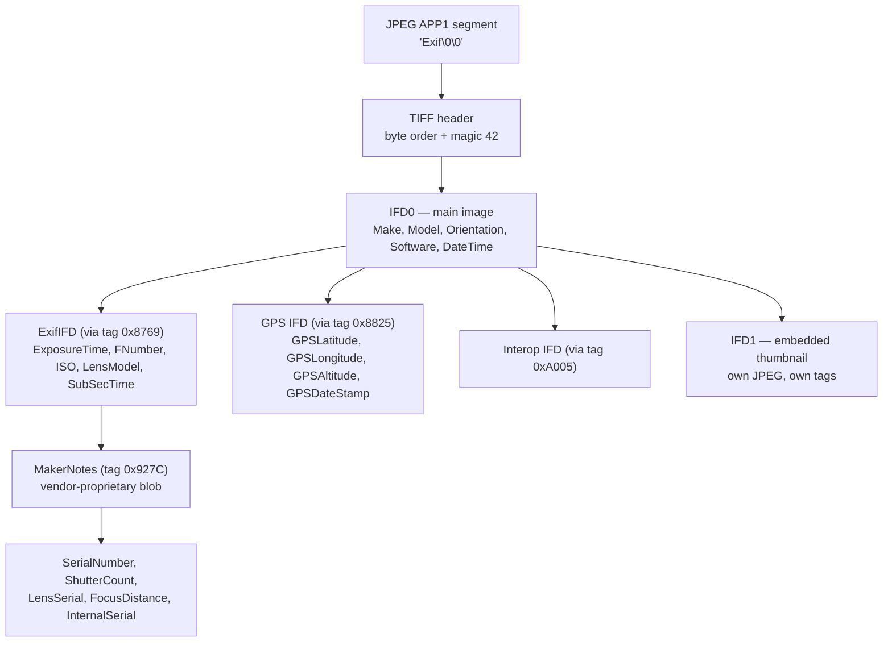
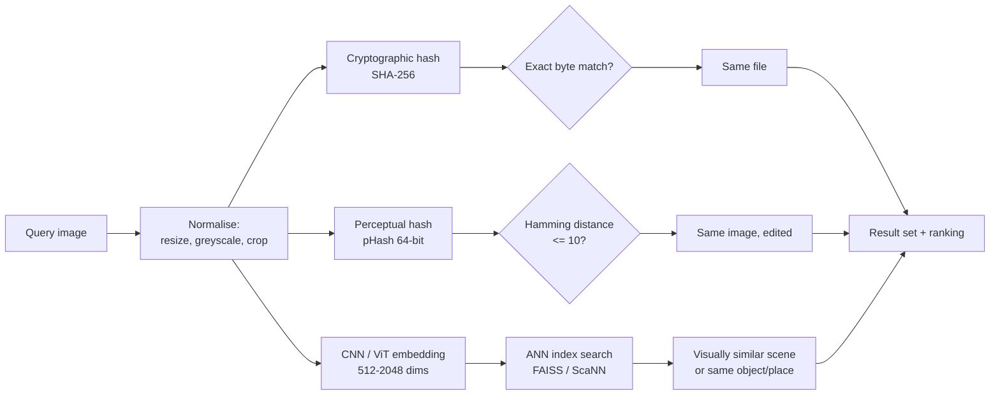
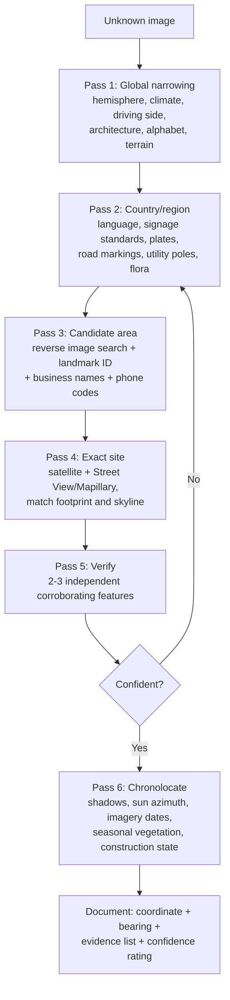
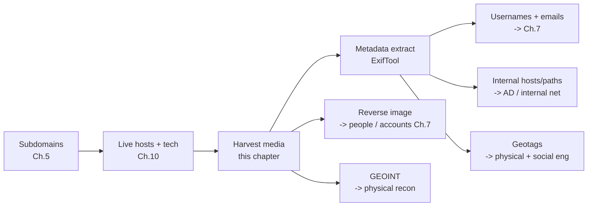

This is Chapter 11 of the Recon & OSINT notebook. Chapter 10 took the subdomain and IP inventory you built earlier and fingerprinted it — you learned what the target's machines are running. This chapter turns away from infrastructure and toward *media*: the photographs, screenshots, PDFs, presentations and videos that an organisation and its people publish, and the enormous amount of unintended intelligence baked into them.

A photograph is not a picture. A photograph is a container: a small amount of compressed pixel data wrapped in a surprisingly large amount of structured text that the camera, the phone, the editing software and the publishing platform each wrote into it. That text routinely includes the exact model and serial number of the camera, the firmware version, the software used to edit it, the name of the account that owned the editing licence, the timezone the device was set to, the orientation of the lens, and — often — a latitude and longitude accurate to a few metres. None of that is visible when you look at the image. All of it is one command away.

This chapter teaches three connected skills. The first is **metadata extraction**: reading every field a file will admit to, using ExifTool, taught from zero. The second is **reverse image search**: finding where else on the internet an image (or a visually similar one) appears, and understanding why different engines return wildly different results. The third, and the one that separates casual OSINT from real work, is **GEOINT** — geolocating an image that has *no* metadata at all, using only what is visible in the frame, and chronolocating it using shadows, sun position and satellite imagery.

Everything here applies to authorised work: a scoped engagement whose rules of engagement cover OSINT against the client's public footprint, a bug-bounty programme where exposed metadata is in scope, a due-diligence or fraud investigation, or research on assets you own. Image OSINT touches real people far more directly than port scanning ever does — a geotagged holiday photo posted by an employee is personal data about that person and often about their family. Part 13 covers where the legal and ethical lines sit, and they are not optional reading.

---

## Part 1: Why Images Leak — The Anatomy of a Digital Photograph

Before touching a tool, you need a mental model of what a photograph file actually *is*. Without it, ExifTool output is an unordered pile of key-value pairs; with it, you can tell at a glance which fields are trustworthy, which are attacker-controlled, and which survive a platform upload.

### 1.1 A JPEG is a sequence of marker segments

A JPEG file is not a bitmap. It is a stream of **marker segments**, each beginning with the byte `0xFF` followed by a marker byte, then a two-byte big-endian length, then payload. The image data is only one of those segments. The rest are metadata.

```bash
# Look at the raw first bytes of a JPEG
xxd -l 64 IMG_4471.jpg
```

```
00000000: ffd8 ffe1 4a1c 4578 6966 0000 4d4d 002a  ....J.Exif..MM.*
00000010: 0000 0008 000b 010f 0002 0000 0006 0000  ................
00000020: 0092 0110 0002 0000 000a 0000 0098 0112  ................
00000030: 0003 0000 0001 0006 0000 011a 0005 0000  ................
```

Read that byte by byte:

| Bytes | Meaning |
|---|---|
| `FF D8` | SOI — Start Of Image. Every JPEG begins with this. |
| `FF E1` | APP1 marker — an application segment. |
| `4A 1C` | Length of the APP1 segment: `0x4A1C` = 19,004 bytes |
| `45 78 69 66 00 00` | The ASCII string `Exif\0\0` — this APP1 holds EXIF data |
| `4D 4D` | `MM` = Motorola byte order (big-endian). `II` would be Intel (little-endian) |
| `00 2A` | `42` — the TIFF magic number |
| `00 00 00 08` | Offset to the first IFD (Image File Directory) |

That is the entire discovery: **the first ~19 KB of this file is metadata, not picture**. The EXIF block is literally a small TIFF file embedded inside the JPEG. Everything ExifTool prints comes from parsing that structure.

The markers you will meet most often:

| Marker | Name | What lives there |
|---|---|---|
| `FFD8` | SOI | Start of image |
| `FFE0` | APP0 | JFIF header (density, thumbnail) |
| `FFE1` | APP1 | **EXIF** (usually) or **XMP** (a second APP1) |
| `FFE2` | APP2 | ICC colour profile, MPF (multi-picture), **JUMBF/C2PA provenance** |
| `FFED` | APP13 | **IPTC-IIM** via Photoshop IRB |
| `FFDB` | DQT | Quantisation tables — a forensic fingerprint (Part 9) |
| `FFC0`/`FFC2` | SOF0/SOF2 | Baseline / progressive frame header: dimensions, components |
| `FFC4` | DHT | Huffman tables |
| `FFDA` | SOS | Start of scan — the actual compressed pixels begin here |
| `FFFE` | COM | Free-text comment |
| `FFD9` | EOI | End of image |

**Security relevance:** because metadata segments sit *before* `FFDA`, a file can carry a large payload that never affects a single rendered pixel. This is the mechanism behind "polyglot" files and behind data being smuggled in an image comment field — and it is also why a naive "resize the image to sanitise it" control often fails: many resize libraries faithfully copy APP1 across.

### 1.2 The IFD tree — how EXIF is organised

Inside that embedded TIFF, tags are grouped into **Image File Directories**. Each IFD is a list of entries; each entry is a 12-byte record: tag ID (2 bytes), data type (2), component count (4), and either the value or a pointer to it (4).



Two things in that diagram matter enormously and are missed by beginners:

1. **IFD1 is a completely separate image.** The embedded thumbnail is its own JPEG with its own tags. When someone crops a face or a whiteboard out of a photo with a tool that does not regenerate the thumbnail, **the original uncropped scene survives in IFD1**. This is not theoretical — it is exactly how the 2003 "Cat Schwartz" case broke, and the same failure mode still appears in PDFs and Office documents.
2. **MakerNotes are a vendor blob.** Canon, Nikon, Sony, Apple and DJI each define their own private structure inside tag `0x927C`. ExifTool's real value is that it reverse-engineers hundreds of these. This is where camera **serial numbers**, **shutter counts**, **lens serials**, **drone flight data** and **facial-detection coordinates** live.

**Red team usage:** a camera body serial number recovered from MakerNotes is a durable selector. If a target organisation publishes photos from a corporate camera and an employee posts personal photos from the same body, you have linked a person to an organisation with a hard identifier that no privacy setting strips.

**Blue team usage:** the same field lets you attribute a leaked internal photo to a specific device on your asset register.

### 1.3 What survives an upload — the platform stripping matrix

This is the single most practically important table in the chapter. Different platforms treat metadata completely differently, and knowing which ones preserve GPS decides where you spend your time.

| Platform / channel | EXIF (general) | GPS | XMP/IPTC | Notes |
|---|---|---|---|---|
| Twitter/X | Stripped | Stripped | Stripped | Re-encodes; also strips thumbnail |
| Facebook | Stripped from delivered file | Stripped | Mostly stripped | Retained server-side; IPTC copyright partly kept |
| Instagram | Stripped | Stripped | Stripped | Heavy re-encode |
| LinkedIn | Stripped | Stripped | Stripped | Re-encoded to a fixed profile |
| Reddit (i.redd.it) | Stripped | Stripped | Stripped | — |
| Discord (CDN) | **Preserved** | **Preserved** | **Preserved** | Serves the original bytes |
| Slack (files.slack.com) | **Preserved** | **Preserved** | **Preserved** | Original file stored |
| Telegram — "photo" | Stripped | Stripped | Stripped | Compressed path |
| Telegram — "file/document" | **Preserved** | **Preserved** | **Preserved** | The classic OPSEC failure |
| WhatsApp | Stripped | Stripped | Stripped | Re-encoded |
| Signal | Stripped | Stripped | Stripped | Strips by design |
| Email attachment | **Preserved** | **Preserved** | **Preserved** | Untouched bytes |
| Corporate website / CMS | **Usually preserved** | **Often preserved** | **Preserved** | Depends entirely on the CMS pipeline |
| WordPress media library | Partially | **Often preserved** | Preserved | Generates sized variants; original stays at `-scaled` or full URL |
| Flickr | **Preserved** | **Preserved (opt-in display)** | **Preserved** | Exposes EXIF in its own UI and API |
| SharePoint / OneDrive share links | **Preserved** | **Preserved** | **Preserved** | — |
| Google Photos share link | Stripped from web view | Stripped | — | Original returned via Takeout/API |

The takeaway for recon: **stop wasting time running ExifTool on images scraped from Twitter.** Spend it on the target's own web properties, on PDFs and PPTX files, on Discord/Slack CDN links found in Google dorks (Chapter 4), and on WordPress `wp-content/uploads` directories.

**Pentester on a scoped engagement:** the highest-yield single command in this whole chapter is downloading every image under `/wp-content/uploads/` and running one recursive ExifTool pass over the lot. Corporate CMS pipelines almost never strip metadata, and marketing photos are frequently taken on staff phones with geotagging on.

---

## Part 2: The Metadata Standards — EXIF, IPTC, XMP, ICC and C2PA

"Metadata" is not one thing. Four different standards bodies wrote four overlapping schemes, and a modern file typically carries three of them simultaneously with *contradictory* values. Understanding which is which tells you which value to believe.

### 2.1 The four families

| Standard | Owner | Format | Written by | Typical fields |
|---|---|---|---|---|
| **EXIF** | JEITA/CIPA | Binary TIFF IFDs in APP1 | Cameras and phones, at capture | Make, Model, DateTimeOriginal, ExposureTime, ISO, GPS*, LensModel, MakerNotes |
| **IPTC-IIM** | IPTC (press industry) | Binary records in Photoshop IRB, APP13 | Photo editors, wire services | By-line (author), Caption, Credit, Source, Keywords, City, Country, Copyright |
| **XMP** | Adobe (now ISO 16684) | **RDF/XML, human-readable**, APP1 | Editing software, at export | dc:creator, xmp:CreatorTool, photoshop:*, crs:* (Lightroom develop settings), GPano:* |
| **ICC profile** | ICC | Binary, APP2 | Camera/editor | Colour space, device model, sometimes a **licensee name** |
| **JUMBF / C2PA** | C2PA coalition | CBOR manifests, APP11/APP2 | Newer cameras, Adobe, AI generators | Signed provenance chain, edit history, AI-generation disclosure |

The forensic value of XMP is that it is **plain XML you can read with your eyes**:

```bash
exiftool -xmp -b corporate-hero-banner.jpg | head -40
```

```xml
<?xpacket begin='' id='W5M0MpCehiHzreSzNTczkc9d'?>
<x:xmpmeta xmlns:x="adobe:ns:meta/" x:xmptk="Adobe XMP Core 7.2-c000">
 <rdf:RDF xmlns:rdf="http://www.w3.org/1999/02/22-rdf-syntax-ns#">
  <rdf:Description rdf:about=""
    xmlns:xmp="http://ns.adobe.com/xap/1.0/"
    xmlns:photoshop="http://ns.adobe.com/photoshop/1.0/"
    xmlns:dc="http://purl.org/dc/elements/1.1/"
    xmlns:stEvt="http://ns.adobe.com/xap/1.0/sType/ResourceEvent#"
   xmp:CreatorTool="Adobe Photoshop 25.3 (Windows)"
   xmp:CreateDate="2026-02-11T14:03:22+00:00"
   xmp:MetadataDate="2026-02-11T16:41:07+00:00"
   photoshop:AuthorsPosition="Senior Brand Designer"
   photoshop:City="Reading"
   photoshop:Country="United Kingdom">
   <dc:creator><rdf:Seq><rdf:li>j.harding</rdf:li></rdf:Seq></dc:creator>
   <xmpMM:History>
    <rdf:Seq>
     <rdf:li stEvt:action="saved"
             stEvt:softwareAgent="Adobe Photoshop 25.3 (Windows)"
             stEvt:changed="/"
             stEvt:when="2026-02-11T16:41:07Z"/>
    </rdf:Seq>
   </xmpMM:History>
  </rdf:Description>
 </rdf:RDF>
</x:xmpmeta>
```

From one marketing banner you have just learned: an internal **username format** (`j.harding` — first-initial-dot-surname, feeding directly into the username enumeration of Chapter 7 and into password-spray target lists later in the series), a **job title**, an **office city**, the exact **Photoshop version and OS**, and an edit timeline. The `xmpMM:History` block on a heavily-edited asset can run to dozens of entries naming every machine and every operator that touched the file.

**Bug bounty note:** exposed internal usernames and software versions in public asset metadata are usually triaged as **informational** on their own. They become a real report when the metadata leaks something with direct impact — an internal hostname, an absolute path exposing a directory structure, a pre-release document, a customer name in an IPTC caption, or credentials in a comment field. Frame the finding by its consequence, not by "EXIF is present".

### 2.2 When standards disagree

A single file can hold three different creation dates:

```bash
exiftool -time:all -G1 -a -s disputed.jpg
```

```
[ExifIFD]       DateTimeOriginal     : 2026:01:14 09:12:44
[ExifIFD]       CreateDate           : 2026:01:14 09:12:44
[IFD0]          ModifyDate           : 2026:03:02 11:55:01
[XMP-xmp]       CreateDate           : 2026:03:02 11:55:01
[XMP-photoshop] DateCreated          : 2026:01:14
[File]          FileModifyDate       : 2026:07:19 22:04:33+01:00
[Composite]     SubSecDateTimeOriginal: 2026:01:14 09:12:44.83
```

Rules of thumb for adjudicating these:

- `EXIF:DateTimeOriginal` = when the **shutter fired**. Most trustworthy for capture time, but it is whatever the camera clock said — an unset or wrong clock is extremely common.
- `EXIF:CreateDate` = when this digital file was created (identical for a straight-from-camera JPEG; differs for a RAW→JPEG export).
- `IFD0:ModifyDate` = last write by software.
- `XMP:CreateDate` is often rewritten by the editor and is **not** capture time.
- `File:FileModifyDate` is filesystem metadata and is destroyed by copying/downloading. Ignore it for attribution.
- `SubSecDateTimeOriginal` gives sub-second precision — invaluable for **ordering a burst** of photos and for detecting a fabricated sequence.

**A hard-won lesson:** EXIF timestamps are usually stored *without* a timezone. `DateTimeOriginal` says `09:12:44` but not `09:12:44 in which zone`. Newer files add `OffsetTimeOriginal` (`+01:00`) and `GPSDateStamp`/`GPSTimeStamp` are always **UTC**. If you have both a local EXIF time and a GPS UTC time, subtracting them gives you the device's **UTC offset**, which alone narrows the world to a handful of longitudes. That trick reappears in the lab.

### 2.3 C2PA — provenance, and why it matters now

The Coalition for Content Provenance and Authenticity (C2PA) embeds a **cryptographically signed manifest** describing a file's origin and edit history, stored in a JUMBF box. Leica, Sony and Nikon ship it in some bodies; Adobe writes it on export; several image generators write an `c2pa.actions` assertion marking content as AI-generated.

```bash
exiftool -jumbf:all -G1 signed-press-photo.jpg
```

```
[JUMBF]         JUMDType                : c2pa
[JUMBF-C2PA]    ClaimGenerator          : Adobe_Photoshop/25.3 c2pa-rs/0.28.2
[JUMBF-C2PA]    SignatureAlgorithm      : ES256
[JUMBF-C2PA]    SigningCredentialIssuer : CN=Adobe Content Authenticity, O=Adobe Inc.
[JUMBF-C2PA]    ActionsAction           : c2pa.created, c2pa.color_adjustments, c2pa.cropped
[JUMBF-C2PA]    IngredientTitle         : DSC_9911.NEF
```

Two OSINT consequences. First, `IngredientTitle` names the **source RAW file**, giving you the original camera's naming scheme and frame number even when the delivered JPEG has been fully sanitised. Second, C2PA is *signed* — you can verify it (`c2patool verify image.jpg`), which makes it the only metadata in this chapter that is meaningfully tamper-evident. Every other field discussed here is freely forgeable, and you must caveat your reporting accordingly.

---

## Part 3: ExifTool From Scratch

**ExifTool** is a Perl library and command-line application by Phil Harvey. It reads, writes and edits metadata in over 200 file formats, and it knows more proprietary MakerNote structures than any other tool in existence. In practical OSINT it is not "one option" — it is the tool, and everything else (browser extensions, online EXIF viewers, Python libraries) is a thinner wrapper over less knowledge.

Do not confuse it with the small `exif` utility (`apt install exif`), which reads only standard EXIF tags and will silently miss the MakerNotes where the interesting data lives.

### 3.1 Installing

```bash
# Kali / Debian / Ubuntu
sudo apt update && sudo apt install -y libimage-exiftool-perl
exiftool -ver
# 12.76

# macOS
brew install exiftool

# Latest version from source (Phil ships frequently; new camera support lands fast)
wget https://exiftool.org/Image-ExifTool-13.10.tar.gz
tar -xzf Image-ExifTool-13.10.tar.gz
cd Image-ExifTool-13.10
perl Makefile.PL && make test && sudo make install
```

`libimage-exiftool-perl` is the correct Debian package name — `apt install exiftool` works too because it is a virtual/alias package on current releases, but the library name is the canonical one and is what you want in a Dockerfile.

### 3.2 The mental model: tags, groups, families

Every value ExifTool prints has a **tag name** and belongs to a **group**, and groups are organised into **families**:

| Family | Meaning | Examples |
|---|---|---|
| 0 | Information type | `EXIF`, `XMP`, `IPTC`, `File`, `Composite`, `MakerNotes`, `ICC_Profile`, `QuickTime` |
| 1 | Specific location | `IFD0`, `IFD1`, `ExifIFD`, `GPS`, `XMP-dc`, `Canon`, `Nikon` |
| 2 | Category | `Camera`, `Image`, `Time`, `Location`, `Author`, `Other` |
| 3 | Document number | `Doc1`, `Doc2` (multi-document files) |
| 4 | Instance number | `Copy1`, `Copy2` (duplicate tags) |

You select a family with `-G<n>`:

```bash
exiftool -G0 photo.jpg      # show information type
exiftool -G1 photo.jpg      # show exactly which IFD — this is the one you want
exiftool -G2 photo.jpg      # show category
exiftool -G0:1:2 photo.jpg  # all three
```

**Always use `-G1` in investigative work.** The difference between a tag in `IFD0` and the same tag in `IFD1` is the difference between "the published image" and "the thumbnail of the original image", and `-G0` cannot tell you which you are looking at.

There is also the **`Composite` group**: values ExifTool *calculates* rather than reads. `GPSPosition`, `ImageSize`, `Megapixels`, `ScaleFactor35efl`, `LightValue` and `SubSecDateTimeOriginal` are all composites. They are extremely convenient but remember they are derived — if you are writing a forensic report, cite the underlying raw tags.

### 3.3 The flags that matter

```bash
exiftool photo.jpg
```

Plain invocation prints "human readable" values with print conversion applied. That is fine for eyeballing, wrong for scripting. The essential flag set:

| Flag | Effect | When you need it |
|---|---|---|
| `-a` | Allow duplicate tags | Same tag in multiple IFDs — always use in investigations |
| `-u` | Extract **unknown** tags | Undocumented vendor fields; frequently productive |
| `-U` | Unknown **and** binary unknown | Deep dives |
| `-G1` | Show group (family 1) | Always |
| `-s` | Short tag names (machine names) | When you need the name to reuse in `-TAG` |
| `-s -s` (`-S`) | Very short, no column padding | Compact output |
| `-s -s -s` | Values only, no tag names | Piping a single value |
| `-n` | **No** print conversion — raw numeric values | GPS as signed decimal; scripting |
| `-b` | Binary output | Extracting thumbnails, XMP packets, embedded files |
| `-j` | JSON output | Piping to `jq` |
| `-csv` | CSV output | Bulk triage in a spreadsheet |
| `-T` | Tab-delimited | Quick columns |
| `-r` | Recurse directories | Bulk collection |
| `-ext jpg` | Restrict by extension | Speed on large trees |
| `-if 'COND'` | Only process files matching a Perl condition | Filtering thousands of files |
| `-p FMT` | Custom print format string | Building reports |
| `-w EXT` | Write output to per-file `.EXT` | Archiving results |
| `-api largefilesupport=1` | Handle >2 GB files | Video |
| `-ee` | Extract embedded data | **Video GPS tracks**, embedded documents |
| `-m` | Ignore minor errors | Damaged/truncated files |
| `-fast` / `-fast2` | Stop reading early | Speed over completeness; `-fast2` skips MakerNotes — do NOT use for OSINT |
| `-P` | Preserve file modification date | Writing without disturbing filesystem times |
| `-overwrite_original` | Do not leave `_original` backup | Scripted writes |
| `-charset UTF8` | Character set | Non-Latin filenames/values |

The investigative default you should build muscle memory for:

```bash
exiftool -a -u -G1 -s target.jpg
```

Everything, duplicates included, with locations shown and machine-readable tag names.

### 3.4 Reading — worked examples

**Everything at once, grouped:**

```bash
exiftool -a -u -G1 IMG_4471.jpg
```

```
[ExifTool]      ExifTool Version Number         : 12.76
[File]          File Name                       : IMG_4471.jpg
[File]          File Size                       : 3.8 MB
[File]          File Type                       : JPEG
[File]          MIME Type                       : image/jpeg
[File]          Image Width                     : 4032
[File]          Image Height                    : 3024
[IFD0]          Make                            : Apple
[IFD0]          Camera Model Name               : iPhone 14 Pro
[IFD0]          Orientation                     : Horizontal (normal)
[IFD0]          Software                        : 17.4.1
[IFD0]          Modify Date                     : 2026:03:18 15:42:07
[IFD0]          Host Computer                   : iPhone 14 Pro
[ExifIFD]       Exposure Time                   : 1/1163
[ExifIFD]       F Number                        : 1.8
[ExifIFD]       ISO                             : 50
[ExifIFD]       Date/Time Original              : 2026:03:18 15:42:07
[ExifIFD]       Offset Time Original            : +01:00
[ExifIFD]       Sub Sec Time Original           : 412
[ExifIFD]       Lens Model                      : iPhone 14 Pro back triple camera 6.86mm f/1.78
[ExifIFD]       Focal Length In 35mm Format     : 24 mm
[Apple]         Run Time Since Power Up         : 4 days 6:11:53
[Apple]         Acceleration Vector             : -0.02 -0.98 0.15
[Apple]         Content Identifier              : 8A6F1C22-3D40-4E9B-9E2C-71A0C4F1D6B3
[GPS]           GPS Latitude Ref                : North
[GPS]           GPS Latitude                    : 51 deg 30' 8.52"
[GPS]           GPS Longitude Ref               : West
[GPS]           GPS Longitude                   : 0 deg 7' 26.28"
[GPS]           GPS Altitude Ref                : Above Sea Level
[GPS]           GPS Altitude                    : 21.4 m
[GPS]           GPS Horizontal Positioning Error: 4.7 m
[GPS]           GPS Img Direction Ref           : True North
[GPS]           GPS Img Direction               : 287.3
[GPS]           GPS Date Stamp                  : 2026:03:18
[GPS]           GPS Time Stamp                  : 14:42:06
[IFD1]          Compression                     : JPEG (old-style)
[IFD1]          Thumbnail Length                : 8241
[Composite]     GPS Position                    : 51 deg 30' 8.52" N, 0 deg 7' 26.28" W
[Composite]     Sub Sec Date/Time Original      : 2026:03:18 15:42:07.412+01:00
```

Read what that actually gives you, beyond the obvious coordinates:

- `OffsetTimeOriginal +01:00` and `GPSTimeStamp 14:42:06` UTC vs `DateTimeOriginal 15:42:07` local — consistent. A **mismatch** here is a strong indicator of a doctored timestamp.
- `GPSHorizontalPositioningError: 4.7 m` — the device's own confidence. A value of 65 m means a cell-tower fix, not GPS, and your "precise location" is a neighbourhood.
- `GPSImgDirection: 287.3` (true north) — **which way the camera was pointing**. Combined with the coordinate this gives you a viewing vector, which is how you confirm a match against Street View rather than merely a nearby location.
- `RunTimeSincePowerUp: 4 days 6:11:53` — the device has not been rebooted in four days. Across a set of photos this lets you cluster images to the same power cycle of the same handset even if timestamps were altered.
- `AccelerationVector` — the phone's orientation in 3D at capture; `-0.98` on the Y axis means held upright in portrait.
- `ContentIdentifier` — Apple's UUID linking a still to its **Live Photo** video component. If you find the `.MOV`, you get 3 seconds of audio and motion the subject never intended to publish.
- `IFD1 ThumbnailLength: 8241` — there *is* an embedded thumbnail. Extract it (Section 3.7) and compare.

**Just GPS, in decimal, for pasting into a map:**

```bash
exiftool -n -p '$GPSLatitude,$GPSLongitude' IMG_4471.jpg
```
```
51.502367,-0.124011
```

`-n` is doing the work: without it you get sexagesimal degrees/minutes/seconds and no sign. With `-n`, latitude is a signed decimal where south is negative. Note also `-p` with `$Tag` interpolation — the cleanest way to produce exactly the string you want.

**A one-line Google Maps link:**

```bash
exiftool -n -p 'https://www.google.com/maps?q=$GPSLatitude,$GPSLongitude&z=18' -q IMG_4471.jpg
```

**Everything with a coordinate, from a whole scraped directory:**

```bash
exiftool -r -ext jpg -ext jpeg -ext png -ext heic -ext tiff \
  -if '$GPSLatitude' \
  -n -T -filename -GPSLatitude -GPSLongitude -Model -DateTimeOriginal \
  ./scraped/ > geotagged.tsv
```

- `-r` recurse, `-ext` limits the walk to image types (much faster on a big scrape)
- `-if '$GPSLatitude'` — a Perl truth test; files without a latitude are skipped entirely
- `-T` tab-delimited, `-n` decimal
- The resulting TSV imports straight into QGIS, Google My Maps or `folium`

**CSV for triage across a large corpus:**

```bash
exiftool -r -csv -ext jpg -ext pdf -ext docx \
  -FileName -Make -Model -Software -Creator -Author -DateTimeOriginal \
  -GPSPosition -XMP-dc:Creator -XMP-xmp:CreatorTool \
  ./target-assets/ > corpus.csv
```

Open that in a spreadsheet, sort by `Creator`, and you have an employee list. Sort by `Software`, and you have a software inventory (`Adobe Photoshop 21.0 (Windows)` on a 2026 asset is a five-year-old install, which is a talking point in a report). Sort by `Model` and you have a device fleet.

**JSON into jq for anything programmatic:**

```bash
exiftool -j -a -u -G1 -n *.jpg | jq -r '
  .[] | select(.["GPS:GPSLatitude"] != null)
  | [.SourceFile, .["GPS:GPSLatitude"], .["GPS:GPSLongitude"],
     .["ExifIFD:DateTimeOriginal"], .["IFD0:Model"]] | @csv'
```

Note that with `-G1` the JSON keys become `Group:Tag`. Without `-G`, they are bare tag names — pick one and be consistent, because this is the number-one source of broken ExifTool scripts.

### 3.5 Filtering with `-if` — the underrated flag

`-if` takes a Perl expression evaluated per file, with `$TagName` interpolation. This turns ExifTool into a search engine over a media corpus.

```bash
# Files shot on a specific camera body serial
exiftool -r -if '$SerialNumber eq "042031000577"' -filename -DateTimeOriginal ./corpus/

# Files within a bounding box (rough geofence around central London)
exiftool -r -n -if '$GPSLatitude > 51.48 and $GPSLatitude < 51.55 and $GPSLongitude > -0.20 and $GPSLongitude < -0.05' \
  -p '$FileName $GPSPosition' ./corpus/

# Anything created by a non-Apple, non-Adobe tool (spot the odd one out)
exiftool -r -if '$Software and $Software !~ /Apple|Adobe/' -filename -Software ./corpus/

# Files that still carry an embedded thumbnail larger than 4 KB
exiftool -r -if '$ThumbnailLength > 4096' -filename -ThumbnailLength ./corpus/

# Shot in a specific date window
exiftool -r -if '$DateTimeOriginal ge "2026:03:01" and $DateTimeOriginal le "2026:03:31"' -filename ./corpus/
```

Multiple `-if` flags are ANDed. Use `-if` before `-p`, and remember `-q` suppresses the "N image files read" summary when you want clean output.

### 3.6 Writing metadata — geotagging, editing and forging

ExifTool writes as easily as it reads. This matters for three reasons: sanitising your own operational files, geotagging from a GPS track, and understanding that **everything you read can be faked**.

```bash
# Set a single tag
exiftool -Artist="J. Harding" photo.jpg

# Set GPS explicitly (note the Ref tags)
exiftool -GPSLatitude=51.502367 -GPSLatitudeRef=N \
         -GPSLongitude=-0.124011 -GPSLongitudeRef=W \
         -GPSAltitude=21.4 -GPSAltitudeRef="Above Sea Level" photo.jpg

# Shift every timestamp forward by 2 hours (fixing a camera clock set to the wrong zone)
exiftool "-AllDates+=0:0:0 2:0:0" -r ./shoot/

# Copy all metadata from one file to another
exiftool -TagsFromFile source.jpg -all:all target.jpg

# Geotag a folder of photos from a GPX track logged by a phone
exiftool -geotag track.gpx "-Geotime<${DateTimeOriginal}#" ./photos/
```

That last command is worth unpacking because it is genuinely useful and its syntax is opaque. `-geotag track.gpx` loads a GPS track; `-Geotime<${DateTimeOriginal}#` tells ExifTool to use each photo's `DateTimeOriginal` as the time to look up in the track, and the trailing `#` forces the value to be read raw (no print conversion). ExifTool interpolates between track points and writes full GPS tags. Investigators use the same mechanism in reverse: given a photo set and a known track, you can *verify* whether claimed locations are consistent.

By default every write creates a backup named `photo.jpg_original`. Suppress it with `-overwrite_original`, or keep it — during an investigation it is a free undo.

**The forgery point, stated plainly:** all of the above means an attacker can set `Make`, `Model`, `DateTimeOriginal`, `GPSPosition` and `Artist` to anything at all in one command. Metadata is *evidence of what a file claims*, not proof of what happened. In reporting, always characterise metadata findings as attributable-but-forgeable, unless C2PA signatures corroborate them.

### 3.7 Extracting embedded content

```bash
# Pull the embedded thumbnail (IFD1) out to its own file
exiftool -b -ThumbnailImage cropped.jpg > thumb.jpg

# Some files carry a full-size preview as well (RAW, some phones)
exiftool -b -PreviewImage photo.jpg > preview.jpg
exiftool -b -JpgFromRaw DSC_9911.NEF > full.jpg

# List every embedded image ExifTool can see
exiftool -a -b -W %d%f_%t%-c.%s -preview:all photo.jpg

# Extract the raw XMP packet
exiftool -b -xmp photo.jpg > meta.xmp

# Extract embedded GPS track from a video (dashcams, drones, GoPro, phones)
exiftool -ee -G3 -api largefilesupport=1 -p '$GPSLatitude $GPSLongitude $SampleTime' driving.mp4
```

The `-W %d%f_%t%-c.%s` construct writes each extracted image to a separate file: `%d` directory, `%f` filename base, `%t` tag name, `%-c` a copy-number suffix if needed, `%s` suggested extension.

**The cropped-thumbnail check should be reflex.** Any time you receive an image that has clearly been cropped or redacted, run the thumbnail extraction before anything else. Compare dimensions:

```bash
exiftool -ImageSize -ThumbnailImage -b redacted.png | head -1
exiftool -s3 -ImageSize redacted.png
# 1200x800
exiftool -b -ThumbnailImage redacted.png > t.jpg && exiftool -s3 -ImageSize t.jpg
# 160x120   -> aspect ratio 4:3 vs 3:2 on the parent = the thumbnail is NOT of this crop
```

An aspect-ratio mismatch between parent and thumbnail is a loud signal that the thumbnail predates the crop.

### 3.8 Stripping metadata — doing it properly

```bash
# The blunt instrument: remove everything writable
exiftool -all= photo.jpg

# Keep colour management so the image still looks right
exiftool -all= -tagsfromfile @ -icc_profile photo.jpg

# Keep orientation too (otherwise phone photos display sideways)
exiftool -all= -tagsfromfile @ -icc_profile -Orientation photo.jpg

# Recursive, in place, no backups
exiftool -all= -overwrite_original -r -ext jpg -ext png ./to-publish/

# Verify nothing survived
exiftool -a -u -G1 photo.jpg
```

`-tagsfromfile @` means "from the same file" — so the sequence is: delete all, then copy these specific tags back from the original. This is the idiomatic ExifTool way to do a selective strip.

**Caution — `-all=` is not a guarantee.** It removes metadata ExifTool knows how to write. It does not remove data in unknown vendor blocks in some formats, does not touch the pixel content, and for PNG it will not strip every ancillary chunk unless you also handle `-PNG:all=`. For genuinely sensitive publication, re-encode the pixels through a clean pipeline instead:

```bash
# Decode to raw pixels and re-encode — nothing but pixels survives
convert input.jpg -strip -quality 92 output.jpg
# or, byte-exact re-encode with no metadata via ffmpeg
ffmpeg -i input.jpg -map_metadata -1 -q:v 2 output.jpg
```

**Blue team usage:** put exactly this into your CMS upload pipeline and your CI for marketing assets. A pre-commit hook that fails when `exiftool -GPSLatitude` returns non-empty on any file under `static/` costs nothing and closes an entire class of leak.

---

## Part 4: Reading GPS Properly — Formats, Datums and Precision

Finding `GPSLatitude` is easy. Interpreting it correctly is where amateurs generate wrong conclusions and confident-sounding reports fall apart.

### 4.1 The three coordinate formats

| Format | Example | Where you see it |
|---|---|---|
| DMS — degrees, minutes, seconds | `51°30'8.52" N, 0°7'26.28" W` | ExifTool default output, aviation, maps |
| DDM — degrees, decimal minutes | `51°30.142' N, 0°7.438' W` | Marine, GPS receivers, NMEA sentences |
| DD — decimal degrees | `51.502367, -0.124011` | Every mapping API, `exiftool -n`, GIS |

Conversion DMS → DD:

```
DD = degrees + (minutes / 60) + (seconds / 3600)
```

Sign convention: **North and East are positive; South and West are negative.** EXIF stores the magnitude in `GPSLatitude` and the hemisphere separately in `GPSLatitudeRef`. This is the classic bug — if you read `GPSLatitude` without `GPSLatitudeRef`, every southern-hemisphere and western-hemisphere coordinate is silently wrong by a mirror flip. `exiftool -n` applies the ref for you and returns a signed value; `exiftool` without `-n` gives you unsigned DMS plus a separate Ref tag.

```python
def dms_to_dd(deg, minutes, seconds, ref):
    dd = float(deg) + float(minutes) / 60.0 + float(seconds) / 3600.0
    if ref.upper() in ('S', 'W', 'SOUTH', 'WEST'):
        dd = -dd
    return round(dd, 7)

print(dms_to_dd(51, 30, 8.52, 'N'))   # 51.5023667
print(dms_to_dd(0, 7, 26.28, 'W'))    # -0.1240778
```

### 4.2 How many decimal places actually mean something

This table decides how you phrase your findings. Claiming a doorway when your data supports a street is how OSINT reports get discredited.

| Decimal places | Precision at the equator | Real-world meaning |
|---|---|---|
| 0 | ~111 km | Country / large region |
| 1 | ~11.1 km | City |
| 2 | ~1.11 km | Neighbourhood / village |
| 3 | ~111 m | A city block |
| 4 | ~11.1 m | A building, a large tree |
| 5 | ~1.11 m | A doorway, a specific parked car |
| 6 | ~0.111 m | Individual people; survey grade |
| 7 | ~0.0111 m | Beyond any consumer GPS's real accuracy |

Longitude precision shrinks by a factor of `cos(latitude)` as you move away from the equator — at 60° N, one degree of longitude is half its equatorial width. Latitude spacing is effectively constant.

Crucially, **stored precision is not accuracy**. A phone will happily write seven decimal places from a fix that was accurate to 30 metres. The honest number is in `GPSHorizontalPositioningError` (metres, written by iOS and recent Android) or inferable from `GPSDOP`. If neither is present:

| Fix source | Typical real accuracy | How to spot it |
|---|---|---|
| GNSS with clear sky | 3–8 m | `GPSHorizontalPositioningError` < 10; altitude present and plausible |
| GNSS urban canyon | 10–50 m | Error field large; coordinate may sit inside a building |
| Wi-Fi positioning | 20–80 m | No altitude, or altitude exactly 0; indoor shot |
| Cell tower only | 500 m – 5 km | Error field in the hundreds/thousands |
| Manually tagged | Arbitrary | No `GPSDOP`, no error field, suspiciously round numbers, `GPSDateStamp` absent |

**A coordinate landing in the middle of a river, a runway or a rooftop is usually a bad fix, not a scoop.** Sanity-check every hit against imagery before you write it down.

### 4.3 Datums — the subtle one

A latitude/longitude pair is meaningless without knowing which model of the Earth's shape it refers to. EXIF has `GPSMapDatum`, and it is essentially always `WGS-84`, which is what GPS satellites broadcast and what Google Maps, OpenStreetMap and Bing use. So in practice you can ignore datums — **except** in two cases:

1. **China.** Chinese mapping law requires a mandated obfuscation called **GCJ-02** (colloquially "Mars coordinates"), which applies a nonlinear offset of 50–500 m to WGS-84. Baidu adds a further layer, **BD-09**. A WGS-84 coordinate plotted on a Chinese domestic map lands in the wrong place, and vice versa. If your image is in mainland China and your coordinate does not match imagery, convert before concluding anything.
2. **Older scanned/surveyed sources** using national datums (OSGB36 in the UK, NAD27 in the US) can be tens to hundreds of metres off WGS-84.

### 4.4 The other GPS tags nobody reads

| Tag | Meaning | Investigative value |
|---|---|---|
| `GPSAltitude` + `GPSAltitudeRef` | Height, and whether above/below sea level | Floor of a building; drone flight height; implausible values flag forgery |
| `GPSImgDirection` + `Ref` | Compass bearing of the lens (`T` true / `M` magnetic) | Confirms a Street View match; builds a viewing cone |
| `GPSDestBearing` | Where the subject is relative to camera (iOS) | Same |
| `GPSSpeed` + `GPSSpeedRef` | Speed at capture (km/h, mph, knots) | Shot from a moving vehicle/aircraft |
| `GPSTrack` | Direction of movement | Route reconstruction |
| `GPSDateStamp` / `GPSTimeStamp` | **UTC** date and time from satellites | Ground truth for time; compare with local EXIF time to derive UTC offset |
| `GPSDOP` | Dilution of precision | Fix quality; > 5 is poor |
| `GPSProcessingMethod` | `GPS`, `CELLID`, `WLAN`, `MANUAL` | **Tells you outright how the fix was obtained** |
| `GPSHorizontalPositioningError` | Metres of uncertainty | The number to quote in a report |
| `GPSAreaInformation` | Free-text area name | Occasionally a venue name |

`GPSProcessingMethod: MANUAL` is the flag that a human typed the location in. Treat it as an assertion, not an observation.

```bash
exiftool -GPS:all -G1 -a IMG_4471.jpg
```

---

## Part 5: Metadata Beyond Photographs — Documents, Video and Audio

Restricting metadata OSINT to JPEGs leaves most of the value on the table. On a typical corporate engagement, PDFs and Office documents yield more directly actionable intelligence than photos do.

### 5.1 PDFs

```bash
exiftool -a -G1 quarterly-report.pdf
```

```
[PDF]           PDF Version                 : 1.7
[PDF]           Producer                    : Microsoft® Word for Microsoft 365
[PDF]           Creator                     : Microsoft® Word for Microsoft 365
[PDF]           Author                      : Harding, James
[PDF]           Title                       : FY26 Q1 Board Pack - DRAFT v7
[PDF]           Create Date                 : 2026:04:02 09:14:55+01:00
[PDF]           Modify Date                 : 2026:04:03 17:22:10+01:00
[XMP-xmpMM]     Document ID                 : uuid:2f8c0a41-9b3e-4c7a-a1f2-5e6d7c8b9a01
[XMP-xmpMM]     Instance ID                 : uuid:7d1e4b90-3c22-4a55-8e10-2b9f6a4c1d33
[XMP-pdfx]      SourceModified              : D:20260402081455
```

`Author` gives you a real name in the organisation's own formatting convention. `Title` frequently retains the original working filename, which leaks project code names and document status (`DRAFT`, `CONFIDENTIAL`, `Board Pack`). `Producer` gives an exact Office build.

Two PDF-specific extras ExifTool does not cover, worth knowing:

```bash
# Incremental-update history: PDFs can retain prior revisions in the same file
grep -abo "%%EOF" quarterly-report.pdf
# 210448:%%EOF
# 388120:%%EOF        <- two EOFs = at least one incremental save retained

# Extract text under redaction rectangles (black boxes are often just drawn on top)
pdftotext -layout quarterly-report.pdf - | less

# Enumerate embedded/attached files
pdfdetach -list quarterly-report.pdf
```

**Redaction drawn as a black rectangle is not redaction.** `pdftotext` recovers the text underneath because the glyphs are still in the content stream. This remains one of the most common real-world data-exposure failures in government and legal document releases.

### 5.2 Office documents (OOXML)

`.docx`, `.xlsx` and `.pptx` are ZIP archives of XML. ExifTool reads them, but unzipping tells you more.

```bash
exiftool -a -G1 proposal.docx
```
```
[XML]           Creator            : m.okafor
[XML]           Last Modified By   : Harding, James
[XML]           Revision Number    : 47
[XML]           Create Date        : 2026:01:22 11:04:00Z
[XML]           Modify Date        : 2026:04:03 16:58:00Z
[XML]           Total Edit Time    : 41.2 hours
[XML]           Company            : Northgate Logistics Ltd
[XML]           Template           : NGL_Proposal_2026.dotx
[XML]           App Version        : 16.0000
```

```bash
# Unpack and go looking
mkdir -p /tmp/docx && cd /tmp/docx && unzip -o ~/proposal.docx > /dev/null
ls -R

# Author names on every tracked change and comment
grep -o 'w:author="[^"]*"' word/document.xml | sort -u

# UNC paths, internal hostnames and intranet URLs in relationship files
grep -ho 'Target="[^"]*"' word/_rels/document.xml.rels docProps/*.xml | sort -u
```

```
Target="file:///\\ngl-fs01.corp.northgate.local\Shared\Bids\2026\pricing-model.xlsx"
Target="https://northgate.sharepoint.com/sites/BidTeam/Shared%20Documents/"
Target="mailto:j.harding@northgatelogistics.co.uk"
```

That single `grep` just produced an **internal file server hostname, an internal AD domain suffix (`corp.northgate.local`), a share path, a SharePoint tenant and an email address format**. Every one of those feeds directly into the Active Directory and internal-network chapters later in this series. Linked (rather than embedded) images and external data connections in `.xlsx` files leak the same way.

Also check `word/media/` — every image ever pasted into the document sits there **with its own original EXIF intact**, including screenshots of internal systems and photos taken on someone's phone.

```bash
exiftool -r -a -G1 -ext jpg -ext png /tmp/docx/word/media/
```

### 5.3 Video

Video is under-exploited and often the richest source, because dashcams, action cameras, drones and phones write **continuous GPS tracks** as timed metadata streams.

```bash
# Container-level metadata
exiftool -a -G1 -api largefilesupport=1 clip.mp4

# The important one: extract embedded timed metadata (GPS track)
exiftool -ee -G3 -api largefilesupport=1 clip.mp4 | head -40
```

```
[Doc1] GPS Latitude    : 51 deg 30' 12.10" N
[Doc1] GPS Longitude   : 0 deg 7' 30.44" W
[Doc1] GPS Speed       : 0
[Doc1] Sample Time     : 0.00 s
[Doc2] GPS Latitude    : 51 deg 30' 12.44" N
[Doc2] GPS Longitude   : 0 deg 7' 31.02" W
[Doc2] GPS Speed       : 4.2
[Doc2] Sample Time     : 1.00 s
```

Convert that to a GPX track you can drop on a map:

```bash
exiftool -ee -p /usr/share/exiftool/fmt_files/gpx.fmt -api largefilesupport=1 clip.mp4 > track.gpx
```

(The `.fmt` files ship with ExifTool; on a source install they are under `fmt_files/`. `gpx.fmt` and `kml.fmt` are both provided.)

DJI drone footage additionally carries `RelativeAltitude`, `AbsoluteAltitude`, `GimbalYawDegree`, `FlightYawDegree` and the aircraft serial. Combined with the GPS track this reconstructs the entire flight — a standard technique in both counter-drone investigations and in verifying user-submitted footage.

Also check the QuickTime `com.apple.quicktime.*` atoms on iPhone video: `make`, `model`, `software`, `creationdate` (with timezone offset) and `location.ISO6709` — the last is a compact `+51.5024-0.1240+021.400/` coordinate string.

```bash
exiftool -QuickTime:all -G1 -a IMG_0042.MOV
```

### 5.4 Audio and everything else

```bash
exiftool -a -G1 interview.mp3     # ID3: Artist, Album, EncodedBy, Comment, recording software
exiftool -a -G1 voicenote.m4a     # QuickTime atoms; iPhone voice memos carry device model
exiftool -a -G1 firmware.bin      # ExifTool will still identify file type and any embedded EXIF
```

A useful reflex: ExifTool identifies 200+ formats, so when you have an unknown file, `exiftool -a -u file` is a better first move than `file` alone — it gives you type *and* content.

---

## Part 6: Reverse Image Search — How It Actually Works and Which Engine to Use

Reverse image search answers a different question from metadata: not "what does this file claim", but "where else does this picture exist". The two are complementary, and the second works even on a fully stripped file.

### 6.1 What the engines are actually doing

Nobody is comparing your image byte-for-byte against the web. Three techniques stack:

1. **Cryptographic hashing (MD5/SHA-256)** — matches only byte-identical files. Useless after any re-encode. Still worth running against known-file databases.
2. **Perceptual hashing (pHash, dHash, aHash, wHash)** — reduces the image to a short bit-string that survives resizing, recompression and minor colour shifts. Similarity is Hamming distance between hashes. This finds *the same image, altered*.
3. **Neural embeddings** — a CNN or vision transformer maps the image into a high-dimensional vector; nearest-neighbour search in that space finds *visually or semantically similar* images, including different photographs of the same place or object. This is what Google Lens and Yandex do, and it is why Yandex can identify a building from a photo Google has never indexed.



Compute a perceptual hash yourself — useful for de-duplicating a scrape and for tracking one image across a corpus:

```bash
pip install imagehash pillow
```

```python
from PIL import Image
import imagehash, sys, pathlib

def phash(p):
    return imagehash.phash(Image.open(p))

ref = phash(sys.argv[1])
for p in pathlib.Path(sys.argv[2]).rglob('*'):
    if p.suffix.lower() not in {'.jpg', '.jpeg', '.png', '.webp'}:
        continue
    try:
        d = ref - phash(p)          # Hamming distance
    except Exception:
        continue
    if d <= 10:
        print(f"{d:2d}  {p}")
```

Interpreting the distance: `0` identical or near-identical, `1–5` the same image with minor edits/recompression, `6–10` same image significantly altered or cropped, `> 12` treat as different images.

### 6.2 The engine comparison

This is the table to internalise. Engine choice is the single biggest determinant of success.

| Engine | Best at | Weak at | Notes |
|---|---|---|---|
| **Yandex Images** | **Faces, buildings, landscapes, geolocation** | Copyright/licensing hunts | Consistently the strongest for GEOINT. Its embedding model generalises to scenes it has never indexed. Start here for "where is this". |
| **Google Lens / Images** | Objects, products, text in image (OCR), plants, animals | Faces (deliberately restricted), exact-duplicate finding | Excellent OCR-and-translate on signage. "Find image source" tab is the closest thing to classic reverse search. |
| **Bing Visual Search** | Products, shopping, some faces, cropped regions | Depth of index vs Google | Underrated; its region-select is good. Also powers several third-party tools. |
| **TinEye** | **Exact and edited duplicates, oldest-first** | Similar-scene matching (it does not do it) | Sort by "Oldest" to find the **earliest known appearance** — the key move for debunking recycled images. ~70 B image index. |
| **PimEyes** | Faces across the open web | Everything else; heavily paywalled | Biometric search. Legally restricted in several jurisdictions (see Part 12). Use only with a clear lawful basis. |
| **Baidu Images** | Chinese-language web, Chinese locations | Non-Chinese content | Essential for anything China-related. |
| **SauceNAO / IQDB** | Anime, illustration, artwork provenance | Photographs | Niche but definitive in its niche. |
| **Karma Decay** | Reddit-hosted images | Everything else | Finds prior Reddit posts of the same image. |

**Practical workflow:** never run one engine. Run Yandex *and* Google Lens *and* TinEye on every serious query, then run each again on **cropped sub-regions**.

### 6.3 The crop trick

The highest-value technique in reverse image search is also the simplest: **crop to a single distinctive element and search that alone**. A full photo of a street produces "generic street" embeddings. A crop of just the unusual church spire, or just the shopfront sign, or just the tram livery, produces a specific match.

```bash
# ImageMagick: crop WIDTHxHEIGHT+X+Y
convert unknown.jpg -crop 420x300+880+140 +repage crop_spire.jpg
convert unknown.jpg -crop 300x120+220+610 +repage crop_sign.jpg

# Upscale a small crop before searching — engines handle larger inputs better
convert crop_sign.jpg -resize 400% -unsharp 0x1 crop_sign_big.jpg

# Flip horizontally: mirrored reposts defeat naive hashing
convert unknown.jpg -flop unknown_flip.jpg
```

`+repage` resets the virtual canvas offset — omit it and downstream tools may still treat the crop as positioned within the original canvas.

Also try: greyscale (defeats colour-graded reposts), and a straightened/deskewed version of a photo taken at an angle.

### 6.4 Automating

```bash
pip install requests beautifulsoup4
```

```python
#!/usr/bin/env python3
"""Emit reverse-image-search URLs for a publicly reachable image URL."""
import sys, urllib.parse

def links(img_url):
    q = urllib.parse.quote(img_url, safe='')
    return {
        "Google Lens": f"https://lens.google.com/uploadbyurl?url={q}",
        "Yandex":      f"https://yandex.com/images/search?rpt=imageview&url={q}",
        "Bing":        f"https://www.bing.com/images/search?view=detailv2&iss=sbi&q=imgurl:{q}",
        "TinEye":      f"https://tineye.com/search?url={q}",
        "Baidu":       f"https://graph.baidu.com/details?isfromtusoupc=1&tn=pc&image={q}",
    }

if __name__ == "__main__":
    for name, url in links(sys.argv[1]).items():
        print(f"{name:12s} {url}")
```

For local files rather than URLs, the engines need a multipart upload; browser extensions such as **RevEye** or **Search by Image** (both Firefox/Chrome) fire all engines at once from a right-click and are, honestly, faster than scripting it. Use a dedicated research browser profile — see the OPSEC discipline from Chapter 3.

---

## Part 7: GEOINT — Geolocating an Image With No Metadata

This is the discipline. Metadata is a gift; GEOINT is the skill you fall back on when the gift is absent, which is most of the time. The goal is to move from "somewhere on Earth" to a coordinate, through a chain of narrowing observations, each of which you can justify.

### 7.1 The funnel



Work the passes in order. The commonest failure is jumping to Pass 4 — burning an hour scrubbing satellite imagery of the wrong country because you never did Pass 1.

### 7.2 Pass 1 — global narrowing

Read the frame for constraints that eliminate continents:

- **Driving side.** Which side are cars on? Which side is the steering wheel? ~35% of the world drives on the left (UK, Ireland, India, Japan, Australia, most of southern/eastern Africa, Indonesia, Thailand, Malaysia). This one observation removes two-thirds of the planet.
- **Sun position and shadow direction.** In the northern hemisphere, at solar noon the sun is due south and shadows point north. In the southern hemisphere the reverse. Shadows pointing *toward* the camera in a midday shot with the sun high is a hemisphere clue.
- **Sun elevation vs season.** A sun that never gets high implies high latitude, or winter, or both.
- **Vegetation and biome.** Eucalyptus, palm species, birch, conifer type, grass colour, deciduous vs evergreen.
- **Sky and light.** Haze, sky colour, overcast type.
- **Script and alphabet.** Latin, Cyrillic, Arabic, Devanagari, Han, Hangul, Thai, Georgian, Armenian, Hebrew, Greek. Even a blurred sign gives you a script.
- **Architecture.** Roof pitch (steep = snow load), material, window shape, balcony style, wire vs buried utilities, air-conditioning unit style and placement.
- **Terrain and horizon.** Mountains, coastal, flat. Mountain skylines are matchable — see 7.5.

### 7.3 Pass 2 — country and region markers

This is where geolocation becomes a study of standards documents. Everything in the built environment is specified by a national standard, and standards differ.

| Feature | What to read | Example discriminators |
|---|---|---|
| **Licence plates** | Colour, aspect ratio, EU blue band, character grouping, font | Yellow rear plate = UK/Netherlands; blue EU band = EU/EEA; white-on-black classic; US state designs |
| **Road markings** | Centre-line colour, dash length, edge lines | Yellow centre line = Americas, Japan, Korea; white centre = Europe, most of Asia/Africa |
| **Road signs** | Shape, colour, font, pictograms | MUTCD (US) vs Vienna Convention (Europe) vs UK Transport typeface vs Australian AS1743 |
| **Bollards & guardrails** | Profile, reflector colour/shape | Very country-specific; Poland/Czech chevrons differ from German ones |
| **Utility poles** | Material, cross-arm shape, insulator type, number of wires | Concrete with holes = eastern Europe; wooden with cross-arms = US/Canada; concrete octagonal = Brazil |
| **Kerbs & pavement** | Kerb stone shape, paving pattern, drain grate design | Portuguese calçada mosaic; UK dropped kerb tactile paving |
| **Bus stops / shelters** | Design, operator branding | Municipal branding names the city outright |
| **Fire hydrants** | Above/below ground, colour | US above-ground vs European below-ground marker plates |
| **Phone numbers on vans/signs** | Country code, number length, area code | `+44 20` = London; `0161` = Manchester |
| **Postal / post boxes** | Colour and shape | Red = UK/Ireland/Japan/India; blue = US; yellow = France/Germany/Switzerland |
| **Electrical sockets** (interiors) | Plug type | Type G = UK/Ireland/Malaysia; Type F = most of Europe; Type A/B = US/Japan |
| **Domain suffixes on ads** | ccTLD | `.co.uk`, `.pl`, `.com.au` |

**Interiors are geolocatable too**, and analysts forget this. A photo of a desk gives you: socket type, light-switch style, radiator vs baseboard vs A/C, ceiling construction, window frame style, and often a visible screen, keyboard layout (QWERTY/AZERTY/QWERTZ), calendar, or corporate wall art. On red-team work, an "innocent" office selfie on LinkedIn routinely reveals badge design, desk-phone model, the internal wallpaper of a workstation, and occasionally a whiteboard containing network diagrams.

**Red team usage:** collect employee-posted office photos, extract badge designs at high zoom, and you have a template for a physical-access pretext. Extract visible screens and you have internal application names and URLs to target in phishing.

### 7.4 Pass 3 — text is the fastest path

If any text is legible, you are usually minutes from an answer.

```bash
# OCR the whole image
sudo apt install -y tesseract-ocr tesseract-ocr-all
tesseract unknown.jpg stdout -l eng+deu+fra+rus

# Preprocess first — OCR quality is dominated by preprocessing, not the engine
convert unknown.jpg -crop 300x120+220+610 +repage \
    -colorspace Gray -resize 400% -sharpen 0x2 -normalize -threshold 55% ocr_ready.png
tesseract ocr_ready.png stdout --psm 7   # psm 7 = treat as a single text line
```

Then search the extracted string:

- A **business name** → search it, get an address, get a coordinate.
- A **phone number** → the area code is a geographic index in most countries.
- A **street name** → search `"Street Name" + a nearby brand` to disambiguate.
- A **bus route number** or **station name** → a transit map gives you a corridor.
- Google Lens does OCR *and* translation *and* search in one step; for non-Latin scripts, point Lens at the crop rather than fighting Tesseract.

### 7.5 Pass 4 — matching against imagery

Tools, and what each is uniquely good for:

| Tool | Unique strength |
|---|---|
| **Google Earth Pro** (desktop, free) | **Historical imagery slider** — see the same spot across years. Also 3D buildings, measurement, elevation profile, KML import, and the sun/shadow simulator. |
| **Google Street View** | Densest ground-level coverage; time-machine slider for past captures |
| **Mapillary** / **KartaView** | Crowdsourced street imagery where Street View has none — rural areas, restricted countries |
| **Bing Maps Bird's Eye** | 45° oblique imagery — shows *building facades* that top-down satellite cannot |
| **Yandex Maps / Panoramas** | Best coverage of Russia, Central Asia, Turkey |
| **Baidu Maps / Total View** | China |
| **OpenStreetMap + Overpass Turbo** | **Query by feature**, not by name (see below) |
| **Sentinel Hub / EO Browser** | Free Sentinel-2 imagery, ~5-day revisit, 10 m resolution, back to 2015 — for change detection and date-bounding |
| **PeakVisor / PeakFinder** | Identify a **mountain skyline** from a photo — generates the horizon profile for any coordinate |
| **SunCalc.org** | Sun azimuth/elevation for any coordinate and time — the core chronolocation tool |
| **ShadeMap** | Simulated shadows over the map for a given time |

**Overpass Turbo is the underused power tool.** OpenStreetMap is a queryable database, so you can search for *the combination of features you can see* rather than for a name. If the photo shows a church next to a level crossing next to a windmill, you can ask OSM for exactly that:

```
[out:json][timeout:60];
area["ISO3166-1"="NL"]->.a;
(
  nwr["man_made"="windmill"](area.a);
);
out center;
```

Or find every water tower within a bounding box:

```
[out:json][timeout:60];
(
  nwr["man_made"="water_tower"](51.40,-0.30,51.60,0.05);
);
out center;
```

Run these at `overpass-turbo.eu`, export as GeoJSON, and plot the candidates. Turning "I can see a distinctive object" into a finite candidate list is the difference between a two-hour job and a two-day job.

**Mountain skyline matching** deserves special mention because it is close to a superpower for rural images. A mountain horizon is effectively a fingerprint of a viewing position. PeakVisor and PeakFinder render the expected skyline from any coordinate; match the peak sequence and relative heights against your photo and you can pin a position in open terrain to within a few hundred metres.

### 7.6 Pass 6 — chronolocation

Once you know *where*, work out *when*. Shadows are the primary instrument.

The relationship: for a given latitude, longitude, date and time, the sun has a computable **azimuth** (compass bearing) and **elevation** (angle above horizon). A vertical object of height `h` casts a shadow of length `L`:

```
L = h / tan(elevation)
```

So, from a photograph:

1. Find a vertical object of known or estimable height (a person ≈ 1.7 m, a standard door ≈ 2.0 m, a UK street-light column ≈ 8 m).
2. Measure the shadow length in the same units, using the object itself as the scale reference.
3. Compute `elevation = atan(h / L)`.
4. Measure the shadow's compass direction from the image (using a known-north reference from the map). The sun's azimuth is the **opposite** bearing.
5. Feed coordinate + elevation + azimuth into SunCalc and read off the candidate date/time pairs.

```python
import math
h = 1.75      # metres, subject height
L = 3.10      # metres, measured shadow length
elev = math.degrees(math.atan(h / L))
print(f"Solar elevation ~ {elev:.1f} degrees")   # Solar elevation ~ 29.5 degrees
```

Any given solar elevation at a fixed location occurs on **two dates per year** (one either side of the solstice) and at **two times per day** (morning and afternoon). The azimuth disambiguates morning from afternoon; other evidence (foliage, clothing, snow, event context) disambiguates the two dates. Report the ambiguity honestly — "consistent with mid-March or late September, morning" is a correct finding; "taken on 18 March" from shadows alone is not.

Other chronolocation levers, in rough order of reliability:

| Signal | What it bounds |
|---|---|
| Satellite imagery change detection (a building present/absent) | A hard "not before / not after" window |
| Construction progress (scaffolding, crane position) | Weeks to months |
| Vegetation state (bare, budding, full leaf, autumn colour) | Season, ±3 weeks in temperate zones |
| Snow cover and its extent | Season and often specific weather events |
| Roadworks, signage changes, shop tenancy changes | Compare against Street View history |
| Vehicle models present (newest model visible) | "Not before" the model's release date |
| Advertising posters, film releases, campaign material | Often a precise week |
| Licence plate age identifiers (UK `74` plate, German registration) | "Not before" a specific date |
| Clothing / mask usage / event branding | Coarse but corroborating |
| Weather records for the candidate location and window | Confirms or refutes a specific day |

Cross-reference the last one with historical weather archives (Meteostat, Wunderground history, or a national met service). If your shadow analysis says "clear sky, midday, late March" and the archive shows heavy overcast on every candidate date but two, you have just reduced ten candidates to two.

### 7.7 Writing up confidence

Never present a geolocation without a confidence statement and the evidence chain. Use a fixed scale so readers can compare findings:

| Rating | Criteria |
|---|---|
| **Confirmed** | Exact coordinate matched in imagery with ≥ 3 independent corroborating features (e.g. building footprint + unique signage + skyline), plus a matching camera bearing |
| **High confidence** | Specific site matched with 2 corroborating features; no contradicting evidence |
| **Moderate confidence** | Correct locality/street established; exact building not resolved |
| **Low confidence** | Region or city only; based on general indicators (script, architecture, plates) |
| **Unresolved** | Constraints established but no candidate site |

List the evidence explicitly: what you observed, in which part of the frame, and what it rules in or out. An analyst reading your report must be able to reproduce every step.

---

## Part 8: Image Forensics — Is This Picture Even Real?

Metadata tells you what the file claims. Forensics tells you whether the pixels are consistent with that claim. On modern engagements — deepfakes, AI-generated imagery, doctored evidence in an HR or fraud investigation — this is no longer optional.

### 8.1 Error Level Analysis (ELA)

JPEG is lossy: re-saving an image at a given quality introduces a predictable amount of error. If part of an image was pasted in from a differently-compressed source, that region's error level differs from its surroundings.

```bash
# Re-save at a known quality and difference against the original
convert suspect.jpg -quality 90 /tmp/resaved.jpg
compare -metric RMSE suspect.jpg /tmp/resaved.jpg /tmp/diff.png
convert /tmp/diff.png -auto-level -brightness-contrast 0x40 ela.png
```

Regions that "glow" relative to a uniform background are candidates for manipulation. **ELA is a lead generator, not proof.** High-contrast edges, text overlays and areas of fine detail naturally produce higher error, and a single re-save of the whole image flattens the signal entirely. Any image that has passed through a social platform has been re-encoded and ELA on it is close to meaningless.

### 8.2 Quantisation tables and the compression fingerprint

The DQT segment from Part 1 encodes the quality settings used by the *last* encoder. Different software uses different tables.

```bash
exiftool -JPEGDigest -JPEGQualityEstimate -EncodingProcess suspect.jpg
```
```
JPEG Digest           : Adobe Photoshop (Save For Web 80)
JPEG Quality Estimate : 80
Encoding Process      : Progressive DCT, Huffman coding
```

`JPEGDigest` is a hash of the quantisation tables matched against a known-software table. A file whose EXIF claims `Make: Apple, Model: iPhone 14 Pro` but whose `JPEGDigest` says `Adobe Photoshop (Save For Web 80)` has been through Photoshop — the EXIF is either surviving from the original or forged, but the pixels are not straight from the camera. Similarly, an iPhone writes baseline JPEGs; `Progressive DCT` on a file claiming iPhone origin is an inconsistency worth noting.

### 8.3 PRNU — sensor pattern noise

Every camera sensor has a unique, permanent pattern of pixel-response non-uniformity caused by manufacturing variation. Extracted across many images, this **PRNU fingerprint** identifies a specific physical camera body — the closest thing digital imaging has to ballistics. It requires a reference set of images from the candidate camera and careful implementation; it is a lab technique rather than a field one, but knowing it exists matters: if you can obtain a suspect device, PRNU can link it to images with high confidence.

### 8.4 Spotting AI-generated imagery

Generative models have improved past most of the old tells, but the following still repay attention:

- **Text.** Signage, logos and labels remain the weakest area — near-letterforms that are not quite letters.
- **Hands, teeth, ears, jewellery** — counting and symmetry errors.
- **Repeating texture** in crowds, foliage, brickwork, patterned fabric.
- **Physically impossible reflections and shadows** — shadows in inconsistent directions, reflections not matching the scene, incoherent specular highlights.
- **Depth-of-field that does not follow a lens model** — background blur that varies without a coherent focal plane.
- **Metadata poverty.** Generated images typically have no camera fields, no lens data, no `SubSecTime`, no MakerNotes — but they *may* carry a C2PA assertion.

```bash
# Check for provenance assertions and generator markers
exiftool -a -u -G1 suspect.png | grep -Ei 'c2pa|jumbf|Software|Comment|Parameters|prompt'
```

Stable-Diffusion-family PNGs frequently retain the **full generation prompt, model name, sampler, CFG scale and seed** in a PNG `tEXt` chunk named `parameters`:

```bash
exiftool -PNG:all -a suspect.png
```
```
[PNG]  Parameters : a photorealistic corporate office interior, 35mm, natural light
                    Negative prompt: cartoon, blurry
                    Steps: 30, Sampler: DPM++ 2M Karras, CFG scale: 7,
                    Seed: 2841003991, Size: 1024x768,
                    Model hash: 6ce0161689, Model: v1-5-pruned-emaonly
```

That is a complete confession in a metadata field, and it is very commonly left in place.

---

## Part 9: Hands-On Lab — From One Unknown Image to a Documented Coordinate

This lab is fully reproducible against files you generate yourself. Work in a clean directory in your research VM.

### 9.1 Setup

```bash
mkdir -p ~/labs/imageosint && cd ~/labs/imageosint

sudo apt update
sudo apt install -y libimage-exiftool-perl imagemagick tesseract-ocr \
                    jq python3-pip poppler-utils ffmpeg unzip
pip install --user pillow imagehash folium

exiftool -ver && convert --version | head -1 && tesseract --version | head -1
```

### 9.2 Build a realistic target corpus

Rather than hunting for a real target, construct one so every answer is verifiable.

```bash
# A base image
convert -size 1200x800 gradient:skyblue-navy base.jpg

# Photo A: full metadata, geotagged, with a distinct thumbnail
cp base.jpg photo_a.jpg
exiftool -overwrite_original \
  -Make="Apple" -Model="iPhone 14 Pro" -Software="17.4.1" \
  -DateTimeOriginal="2026:03:18 15:42:07" -OffsetTimeOriginal="+01:00" \
  -SubSecTimeOriginal="412" \
  -GPSLatitude=51.502367 -GPSLatitudeRef=N \
  -GPSLongitude=-0.124011 -GPSLongitudeRef=W \
  -GPSAltitude=21.4 -GPSAltitudeRef="Above Sea Level" \
  -GPSImgDirection=287.3 -GPSImgDirectionRef=T \
  -GPSDateStamp="2026:03:18" -GPSTimeStamp="14:42:06" \
  -GPSHorizontalPositioningError=4.7 \
  -Artist="j.harding" -Copyright="Northgate Logistics Ltd" \
  photo_a.jpg

# Photo B: same "camera", different location, no direction
cp base.jpg photo_b.jpg
exiftool -overwrite_original \
  -Make="Apple" -Model="iPhone 14 Pro" -Software="17.4.1" \
  -DateTimeOriginal="2026:03:18 09:05:11" -OffsetTimeOriginal="+01:00" \
  -GPSLatitude=51.454514 -GPSLatitudeRef=N \
  -GPSLongitude=-0.978130 -GPSLongitudeRef=W \
  -GPSProcessingMethod="CELLID" -GPSHorizontalPositioningError=812 \
  photo_b.jpg

# Photo C: fully stripped — this is the GEOINT-only case
cp base.jpg photo_c.jpg
exiftool -overwrite_original -all= photo_c.jpg

# Photo D: an inconsistent/forged file
cp base.jpg photo_d.jpg
exiftool -overwrite_original \
  -Make="Canon" -Model="Canon EOS R5" \
  -DateTimeOriginal="2019:07:04 12:00:00" \
  -Software="Adobe Photoshop 25.3 (Windows)" \
  -GPSLatitude=51.500000 -GPSLatitudeRef=N \
  -GPSLongitude=0.000000 -GPSLongitudeRef=E \
  photo_d.jpg

ls -la
```

### 9.3 Step 1 — triage the whole corpus in one pass

```bash
exiftool -r -csv -n \
  -FileName -FileType -Make -Model -Software -Artist \
  -DateTimeOriginal -OffsetTimeOriginal -GPSLatitude -GPSLongitude \
  -GPSHorizontalPositioningError -GPSProcessingMethod -GPSImgDirection \
  . > triage.csv

column -s, -t triage.csv
```

```
SourceFile     FileName     FileType Make  Model          Software                    Artist    DateTimeOriginal    OffsetTimeOriginal GPSLatitude GPSLongitude GPSHorizontalPositioningError GPSProcessingMethod GPSImgDirection
./photo_a.jpg  photo_a.jpg  JPEG     Apple iPhone 14 Pro  17.4.1                      j.harding 2026:03:18 15:42:07 +01:00             51.502367   -0.124011    4.7                                               287.3
./photo_b.jpg  photo_b.jpg  JPEG     Apple iPhone 14 Pro  17.4.1                                2026:03:18 09:05:11 +01:00             51.454514   -0.97813     812                           CELLID
./photo_c.jpg  photo_c.jpg  JPEG
./photo_d.jpg  photo_d.jpg  JPEG     Canon Canon EOS R5   Adobe Photoshop 25.3 (Win)            2019:07:04 12:00:00                    51.5        0.0
./base.jpg     base.jpg     JPEG
```

**Read the triage table before doing anything else.** It already tells you:

- `photo_a` — high-quality GNSS fix (4.7 m), with a camera bearing. Highest value. Also an `Artist` giving a username format.
- `photo_b` — same device, but `CELLID` with 812 m error. This is a **neighbourhood, not an address**. Reporting it as a precise location would be wrong.
- `photo_c` — nothing. Goes to the GEOINT track.
- `photo_d` — three independent inconsistencies: `Make: Canon` with `Software: Adobe Photoshop`, coordinates that are suspiciously round (`51.500000, 0.000000` — exactly on the Greenwich meridian), and no `OffsetTime`, no `GPSDateStamp`, no positioning error. Treat as fabricated or heavily edited.

### 9.4 Step 2 — deep-dive the highest-value file

```bash
exiftool -a -u -G1 -s photo_a.jpg
```

Derive the UTC offset independently and check it for consistency:

```bash
exiftool -s3 -DateTimeOriginal -GPSDateStamp -GPSTimeStamp photo_a.jpg
```
```
2026:03:18 15:42:07
2026:03:18
14:42:06
```

Local `15:42:07` minus UTC `14:42:06` = `+01:00:01` — a one-second rounding difference, consistent with the declared `OffsetTimeOriginal +01:00`. On 18 March, UTC+1 for a location at longitude −0.12 is consistent with British Summer Time. **Nothing contradicts the claimed capture time.** Had the offsets disagreed by hours, you would have a manipulated timestamp.

### 9.5 Step 3 — turn coordinates into map artefacts

```bash
# Direct map links for every geotagged file
exiftool -r -n -q -if '$GPSLatitude' \
  -p '$FileName  https://www.google.com/maps?q=$GPSLatitude,$GPSLongitude&z=19' .
```
```
photo_a.jpg  https://www.google.com/maps?q=51.502367,-0.124011&z=19
photo_b.jpg  https://www.google.com/maps?q=51.454514,-0.97813&z=19
photo_d.jpg  https://www.google.com/maps?q=51.5,0&z=19
```

Generate a KML for Google Earth:

```bash
exiftool -r -if '$GPSLatitude' -p /usr/share/exiftool/fmt_files/gpx.fmt . > corpus.gpx
head -20 corpus.gpx
```

And an interactive HTML map with accuracy circles — the circle is the honest way to present a low-precision fix:

```python
#!/usr/bin/env python3
import csv, folium

pts = []
with open('triage.csv') as f:
    for r in csv.DictReader(f):
        if r.get('GPSLatitude'):
            pts.append(r)

if not pts:
    raise SystemExit("no geotagged files")

m = folium.Map(location=[float(pts[0]['GPSLatitude']),
                         float(pts[0]['GPSLongitude'])], zoom_start=11)

for r in pts:
    lat, lon = float(r['GPSLatitude']), float(r['GPSLongitude'])
    err = float(r['GPSHorizontalPositioningError'] or 0)
    popup = (f"<b>{r['FileName']}</b><br>{r.get('Model','?')}<br>"
             f"{r.get('DateTimeOriginal','?')}<br>±{err or '?'} m")
    folium.Marker([lat, lon], popup=popup).add_to(m)
    if err:
        folium.Circle([lat, lon], radius=err, color='crimson',
                      fill=True, fill_opacity=0.15).add_to(m)
    # draw the camera bearing as a short vector
    if r.get('GPSImgDirection'):
        import math
        b = math.radians(float(r['GPSImgDirection']))
        d = 0.0015
        folium.PolyLine([[lat, lon],
                         [lat + d*math.cos(b), lon + d*math.sin(b)]],
                        color='blue', weight=3).add_to(m)

m.save('corpus_map.html')
print("wrote corpus_map.html")
```

```bash
python3 map_corpus.py && xdg-open corpus_map.html
```

The visual result makes the analytic point immediately: `photo_a` is a tight point with a direction arrow; `photo_b` is an 812 m red disc covering several streets.

### 9.6 Step 4 — the thumbnail check

```bash
exiftool -b -ThumbnailImage photo_a.jpg > thumb_a.jpg 2>/dev/null
if [ -s thumb_a.jpg ]; then
  echo "parent : $(exiftool -s3 -ImageSize photo_a.jpg)"
  echo "thumb  : $(exiftool -s3 -ImageSize thumb_a.jpg)"
else
  echo "no embedded thumbnail"
fi
```

Compare aspect ratios. On a real cropped image, a mismatch here recovers content the publisher believed they had removed.

### 9.7 Step 5 — perceptual hashing across the corpus

```bash
python3 - <<'PY'
from PIL import Image
import imagehash, pathlib, itertools
files = sorted(p for p in pathlib.Path('.').glob('*.jpg'))
h = {p: imagehash.phash(Image.open(p)) for p in files}
for a, b in itertools.combinations(files, 2):
    d = h[a] - h[b]
    flag = "  <-- likely same image" if d <= 10 else ""
    print(f"{a.name:14s} {b.name:14s} distance={d:2d}{flag}")
PY
```

Because all four derive from `base.jpg`, distances are 0 — demonstrating exactly the property that matters: **metadata differs completely, pixels are identical.** In real work this is how you prove that a "new" image circulating with fresh metadata is a recycled old one.

### 9.8 Step 6 — the GEOINT track for photo_c

`photo_c.jpg` has no metadata, so the funnel from Part 7 applies. The reproducible parts of that workflow:

```bash
# Crop candidate regions of interest and upscale for search/OCR
convert photo_c.jpg -crop 400x300+100+100 +repage roi_1.jpg
convert roi_1.jpg -resize 300% -unsharp 0x1 roi_1_big.jpg

# OCR any signage
convert roi_1.jpg -colorspace Gray -resize 400% -normalize -threshold 55% roi_ocr.png
tesseract roi_ocr.png stdout --psm 7

# Mirrored variant, to defeat flipped reposts
convert photo_c.jpg -flop photo_c_flip.jpg

# Generate the reverse-search URLs (host the file somewhere reachable first,
# or use a browser extension for local files)
python3 rev_links.py "https://example-host.invalid/photo_c.jpg"
```

Then work the passes: driving side → country markers → OCR text → Overpass query for the distinctive feature → Google Earth historical imagery → Street View confirmation → SunCalc for the shadow. Record each observation as you go.

### 9.9 Step 7 — the finding

Write the result in a fixed format. This is the deliverable, and it is what distinguishes an analyst from someone with a tool installed:

```
FINDING: IMG-OSINT-001
Source file      : photo_a.jpg  (SHA-256: <hash>)
Origin           : https://target.example/wp-content/uploads/2026/03/photo_a.jpg
Coordinate       : 51.502367, -0.124011  (WGS-84)
Reported error   : 4.7 m (device-declared, GPSHorizontalPositioningError)
Camera bearing   : 287.3 deg true
Capture time     : 2026-03-18 15:42:07 +01:00 (corroborated by GPS UTC 14:42:06)
Device           : Apple iPhone 14 Pro, iOS 17.4.1
Associated ident.: Artist="j.harding"  (implies username format <initial>.<surname>)
Confidence       : High — device-generated GNSS fix, internally consistent
                   timestamps, no evidence of editing (JPEGDigest consistent
                   with camera-original tables)
Caveat           : All EXIF fields are writable and therefore forgeable. This
                   finding evidences what the file asserts; it is corroborated
                   but not cryptographically proven.
Impact           : Geolocation of an employee-taken photograph published on a
                   corporate asset path, plus disclosure of internal username
                   convention and device fleet.
Remediation      : Strip metadata in the CMS upload pipeline; see Part 12.
```

---

## Part 10: Automating Image OSINT at Scale

On a real engagement you are not looking at four files — you are looking at everything a target has ever published. The pipeline: harvest → dedupe → extract → geofence → report.

### 10.1 Harvest images from a target's web properties

```bash
# Pull every image linked from a page (respect scope and robots/policy)
sudo apt install -y wget
wget -r -l2 -H -nd -A jpg,jpeg,png,gif,heic,tiff,webp \
     -e robots=off -P ./harvest/ "https://target.example/"

# WordPress uploads directory is the single highest-yield target
for m in 01 02 03 04 05 06 07 08 09 10 11 12; do
  wget -q -r -np -nd -A jpg,jpeg,png \
       -P ./harvest/ "https://target.example/wp-content/uploads/2026/$m/"
done
```

A focused Python harvester that also captures the source URL alongside each file (so your report can cite provenance):

```python
#!/usr/bin/env python3
import sys, os, hashlib, requests
from urllib.parse import urljoin, urlparse
from bs4 import BeautifulSoup

start = sys.argv[1]
outdir = "harvest"
os.makedirs(outdir, exist_ok=True)
manifest = open(os.path.join(outdir, "sources.tsv"), "a")

r = requests.get(start, timeout=20,
                 headers={"User-Agent": "osint-research/1.0"})
soup = BeautifulSoup(r.text, "html.parser")

seen = set()
for img in soup.find_all("img"):
    src = img.get("src") or img.get("data-src")
    if not src:
        continue
    url = urljoin(start, src)
    if url in seen:
        continue
    seen.add(url)
    try:
        d = requests.get(url, timeout=20).content
    except Exception as e:
        print("skip", url, e); continue
    name = hashlib.sha256(d).hexdigest()[:16] + os.path.splitext(urlparse(url).path)[1]
    with open(os.path.join(outdir, name), "wb") as f:
        f.write(d)
    manifest.write(f"{name}\t{url}\n")
    print("saved", name, "from", url)
manifest.close()
```

### 10.2 Extract, geofence and report in one pass

```bash
#!/usr/bin/env bash
# image_osint_report.sh  <dir>
set -euo pipefail
DIR="${1:?usage: image_osint_report.sh <dir>}"

echo "[*] Files with GPS coordinates:"
exiftool -r -n -q -if '$GPSLatitude' \
  -p '  $FileName  =>  $GPSLatitude,$GPSLongitude  (+-${GPSHorizontalPositioningError} m)  bearing $GPSImgDirection' \
  "$DIR" || echo "  (none)"

echo; echo "[*] Distinct authors / creators:"
exiftool -r -q -s3 -Artist -Creator -Author -XMP-dc:Creator "$DIR" \
  | sort -u | sed '/^$/d;s/^/  /'

echo; echo "[*] Software / device inventory:"
exiftool -r -q -s3 -Software -Model -Creator-Tool "$DIR" \
  | sort | uniq -c | sort -rn | sed 's/^/  /'

echo; echo "[*] Files still carrying an embedded thumbnail (>4 KB):"
exiftool -r -q -if '$ThumbnailLength > 4096' -s3 -FileName -ThumbnailLength "$DIR" \
  | sed 's/^/  /'

echo; echo "[*] Internal paths / hosts leaked in any field:"
exiftool -r -q -a -u "$DIR" 2>/dev/null \
  | grep -Eio '(\\\\[a-z0-9._-]+\\[^ ]+|[a-z0-9-]+\.(local|corp|internal|lan)\b|[A-Z]:\\[^ ]+)' \
  | sort -u | sed 's/^/  /' || echo "  (none)"
```

```bash
chmod +x image_osint_report.sh
./image_osint_report.sh ./harvest/
```

### 10.3 Build the map at scale

Feed the geotagged TSV from `exiftool ... > geotagged.tsv` into the `folium` script from the lab (loop its rows), or import straight into QGIS (`Layer → Add Delimited Text Layer`, X = longitude, Y = latitude) for a properly analysable GIS project. For a quick shared view, the `.gpx`/`.kml` output opens directly in Google Earth or `umap.openstreetmap.fr`.

### 10.4 Where this sits in the recon pipeline



Image OSINT is not a standalone activity — it is a feeder. Its usernames flow into Chapter 7's people-OSINT, its internal hostnames into the later internal-network chapters, and its geotags into physical and social-engineering planning.

---

## Part 11: Detection & Defense Angle

Everything above is also a defensive brief. If you can extract it, so can an adversary, and the defence is almost always "don't publish it in the first place".

### 11.1 The organisational exposure

The attack surface is any image or document your organisation or its staff publish: the corporate site and blog, marketing PDFs and case studies, press releases, job adverts with office photos, executives' and employees' social media, conference decks, and community/Discord/Slack posts. The specific leaks that recur:

- **Geotags** on staff-taken photos revealing home addresses, secure-site locations, travel patterns and — for anyone with a public role — physical security exposure.
- **Author/creator names** revealing the internal username convention, which seeds password-spraying and phishing target lists.
- **Internal hostnames, UNC paths, SharePoint tenants and AD domain suffixes** in Office/PDF relationship data.
- **Software versions** disclosing an exploitable patch level and build inventory.
- **Embedded thumbnails and un-flattened layers** surviving a crop or redaction.
- **Text under drawn redaction rectangles** in PDFs.
- **Prior document revisions** retained in PDF incremental saves and in `Last Modified By` / revision counts.

### 11.2 Controls, in priority order

1. **Strip on ingest.** Make metadata removal an automatic step in the CMS/DAM upload pipeline and in the static-site build. This is the single highest-leverage control because it needs no human discipline.

   ```bash
   # CI guard: fail the build if any published image carries GPS
   if exiftool -r -q -if '$GPSLatitude' -p '$FileName' static/ | grep -q .; then
     echo "BUILD FAILED: geotagged images present" >&2
     exiftool -r -q -if '$GPSLatitude' -p '  $FileName $GPSPosition' static/ >&2
     exit 1
   fi
   ```

   ```bash
   # Pre-commit / pipeline strip step
   exiftool -all= -tagsfromfile @ -icc_profile -Orientation \
            -overwrite_original -r -ext jpg -ext jpeg -ext png -ext heic static/img/
   ```

2. **Sanitise documents before external release.** Use Office's *Document Inspector* (File → Info → Check for Issues → Inspect Document) or a scripted OOXML clean; for PDFs, use a *true* redaction tool (Adobe Redact, or re-render to flattened images) — never a black rectangle. Verify with `pdftotext` that no text survives under redactions.

3. **Policy and training.** Employees should know that geotagging on work phones is off, and that office/badge/whiteboard photos are an exposure. This is where the LinkedIn "first day at the new job" photo problem is addressed.

4. **Monitor your own footprint.** Periodically run the harvest-and-report pipeline from Part 10 against your own web properties, exactly as an attacker would. Finding your own leaks first is cheaper than a report finding them.

### 11.3 Detection

Metadata OSINT is passive against the *file* — reading a downloaded image leaves no trace on your systems. But the **harvesting** phase touches your servers and is detectable:

- Bulk sequential retrieval of `/wp-content/uploads/` or a media directory, especially directory-index walking, is visible in web logs as a burst of image GETs from one source with a non-browser or scripted User-Agent and no referer.
- Requests for `-original`/full-size variants and for `robots.txt`-disallowed media paths are a signal.
- Directory listing being enabled on an uploads path is itself the finding — disable `Options Indexes`.

**Blue team usage:** alert on a single source retrieving more than N distinct media files in a short window, and treat directory-index responses on media paths as a misconfiguration to fix. None of this stops a patient attacker pulling files slowly, which is why control #1 (strip on ingest) is the real defence — detection is a backstop, not the fix.

---

## Part 12: OPSEC, Ethics and the Law

Image OSINT reaches real people faster than any other recon discipline, so the boundaries matter more.

### 12.1 Your own OPSEC

- **Reverse image search and online EXIF viewers upload your query image to a third party.** Uploading a client's sensitive image to a random "EXIF viewer" website exfiltrates it. Run ExifTool locally; be deliberate about which images you submit to Google/Yandex/TinEye and never submit anything whose disclosure to those companies would itself be a breach.
- **Use a segregated research browser profile** (per Chapter 3's OPSEC discipline) — separate container, no logged-in personal accounts, VPN as policy requires. Yandex and Baidu in particular log aggressively.
- **Do not tip off the target.** Actively probing geolocation candidates, contacting people found via image search, or requesting Street View of a sensitive site can all surface. Keep collection passive until the engagement authorises otherwise.

### 12.2 The law and ethics

- **Geotagged personal photos are personal data.** Under GDPR (and similar regimes) a location tied to an identifiable person is personal data and, if it reveals a home or routine, is sensitive. Process it only with a lawful basis and within the engagement's authorised scope. "It was public" is not, by itself, a lawful basis for arbitrary further processing.
- **Facial reverse search (PimEyes and similar) is legally restricted.** Biometric processing is regulated under GDPR Art. 9, BIPA (Illinois), and other laws; several regulators have taken enforcement action against face-search services. Do not run facial search on real people without an explicit lawful basis and authorisation — for most engagements, don't run it at all.
- **Stay in scope.** OSINT that touches employees' personal lives (home addresses, family, off-hours location) is frequently *out* of a penetration test's scope even when the corporate assets are in scope. Confirm in the rules of engagement (Chapter 2) before collecting it, and default to reporting the *class* of exposure rather than doxxing an individual.
- **Minimise and protect.** Collect only what the objective needs, store it encrypted, and delete it per the engagement's data-handling terms. A findings report that pins an employee's home to a rooftop is a liability, not a deliverable — report "geolocatable staff photos exist and here is one redacted example", not a dossier.
- **Duty of care.** If image OSINT surfaces evidence of a crime against a person (e.g. CSAM, imminent harm), stop, do not further process it, and follow legal-reporting obligations. This is outside the remit of a security assessment.

The governing principle from the OSINT-foundations chapter holds: *just because you can find it does not mean you are authorised to collect, keep or act on it.*

---

## Part 13: Common Pitfalls

- **Reading `GPSLatitude` without `GPSLatitudeRef`.** Every southern/western coordinate silently mirror-flips. Use `exiftool -n` and always capture the Ref, or read `Composite:GPSPosition`.
- **Trusting stored precision as accuracy.** Seven decimal places from a cell-tower fix is still a 1 km neighbourhood. Quote `GPSHorizontalPositioningError`; if it is absent, say so and estimate.
- **Running ExifTool on platform-scraped images and finding nothing, then concluding "no metadata anywhere".** Twitter/Instagram/WhatsApp strip. Go to the source: the target's own CMS, PDFs, Discord/Slack CDN, email.
- **Ignoring the embedded thumbnail on cropped/redacted images.** Always extract IFD1 first.
- **Treating a drawn black box as redaction.** Run `pdftotext`; the text is usually still there.
- **Using `-fast2`, which skips MakerNotes.** That is where serials, shutter counts and the richest data live. Never use it for OSINT.
- **`-G0` instead of `-G1`.** You cannot tell IFD0 from IFD1 — the published image from the original's thumbnail — without family 1.
- **Believing metadata is proof.** Every field is one `exiftool -TAG=value` away from forgery. Corroborate; caveat; prefer C2PA where present.
- **Running only one reverse-image engine.** Yandex, Google Lens and TinEye have near-disjoint strengths. Run all three, then run crops.
- **Jumping to satellite-scrubbing (Pass 4) before global narrowing (Pass 1).** Confirm the country before you spend an hour on the wrong one.
- **Reporting a single date from shadows alone.** Solar elevation is degenerate: two dates, two times. Report the ambiguity.
- **Uploading a client's sensitive image to an online EXIF viewer or a face-search site.** That is exfiltration and, for faces, possibly unlawful. Local tools only unless you have decided otherwise deliberately.
- **`-all=` and assuming the file is clean.** It removes what ExifTool can write; re-encode the pixels for genuinely sensitive publication and verify.

---

## Part 14: Practice Labs & Resources

Train each skill on material built for it:

**Metadata extraction**
- **TryHackMe — "OhSINT"** and **"Sakura Room"**: both hinge on pulling metadata (username, GPS) from an image and pivoting. The canonical first exercises for this chapter.
- **TryHackMe — "Metasploit"/"OSINT" paths** and **"Google Dorking"** (ties back to Chapter 4 for finding the files).
- Practise on your own device: photograph something, then run `exiftool -a -u -G1` and see exactly what your phone writes — including whether geotagging is on.

**Geolocation / GEOINT**
- **GeoGuessr** — the fastest way to build Pass-1/Pass-2 instinct (driving side, plates, poles, vegetation, road markings). Play "no move, no pan, no zoom" for pure observation.
- **Geotips / Plonkit** guides — the definitive reference for country-identification markers (bollards, poles, plates, language) used by competitive players; read them like standards documents.
- **Sofa/GeoGuessr community "meta" sheets** for utility-pole and licence-plate identification.
- **Bellingcat's online-investigation exercises and case studies** — real chronolocation and geolocation walkthroughs (shadow analysis, satellite change detection). Bellingcat also publishes a curated OSINT toolkit.
- **Quiztime** (community geolocation/verification challenges) — regular practice images with worked solutions.
- **GeoGuessr's "I Saw The Sun"** and shadow-based puzzles for chronolocation practice; pair with **SunCalc.org**.

**Reverse image search & forensics**
- Build a small corpus and test **Yandex vs Google Lens vs TinEye** on the same images and crops to internalise their differences.
- **FotoForensics** (Dr. Neal Krawetz's site) — hosted ELA and analysis; read its tutorials on why ELA is a lead, not proof.
- Practise the crop-and-search and mirror-and-search techniques on images you know the source of, to calibrate expectations.

**Tooling to keep installed**
- ExifTool (`libimage-exiftool-perl`), ImageMagick, Tesseract, `poppler-utils` (pdftotext/pdfdetach), ffmpeg.
- **Google Earth Pro** (historical imagery + shadow simulator), **Overpass Turbo** (feature queries), **SunCalc.org**, **Sentinel Hub EO Browser** (free date-bounding imagery), **Mapillary** (street imagery gap-filler), **PeakVisor** (skyline matching).
- Browser: **RevEye** / **Search by Image** extensions for one-click multi-engine reverse search, in a segregated research profile.

---

## Memory Hooks

- **A photo is a container, not a picture** — most of a straight-from-phone JPEG's first 20 KB is metadata, before a single pixel.
- **EXIF is at capture, XMP is at edit, IPTC is for press, C2PA is signed** — believe them in that order; only C2PA is tamper-evident.
- **`-a -u -G1 -s`** is the investigative default. **`-n`** makes GPS signed decimal.
- **North/East positive, South/West negative** — and you *must* read the Ref tag.
- **Stored precision ≠ accuracy** — quote `GPSHorizontalPositioningError`.
- **Platforms strip; sources don't** — chase CMS, PDFs, Discord/Slack, email; skip Twitter scrapes.
- **Always extract IFD1** — the thumbnail outlives the crop.
- **Yandex for places, Lens for objects/text, TinEye for oldest-first** — then search crops.
- **Pass 1 before Pass 4** — narrow the globe before scrubbing satellite.
- **Shadows give two dates and two times** — report the ambiguity, never a single day.
- **Everything except C2PA is forgeable** — metadata evidences a claim, not a fact.

## Final Revision / Summary

This chapter turned published media into intelligence. Part 1 opened the JPEG at the byte level so you know *where* metadata lives (marker segments, the embedded TIFF, the IFD tree, MakerNotes and the fatal IFD1 thumbnail) and — via the platform stripping matrix — *where it survives*. Part 2 separated the four overlapping metadata standards (EXIF, IPTC, XMP, C2PA) so you know which field to believe. Part 3 taught ExifTool from zero: its tag/group/family model, the flag set that matters (`-a -u -G1 -s -n -j -csv -if -ee`), reading, filtering, writing/geotagging, extracting embedded content, and stripping properly. Part 4 made you rigorous about GPS — the three coordinate formats, the sign/Ref trap, precision vs accuracy, datums (WGS-84, and the GCJ-02/BD-09 China exception), and the under-read GPS tags (bearing, UTC time, processing method, positioning error). Part 5 extended metadata OSINT to PDFs, Office documents, video GPS tracks and audio, where the most directly actionable corporate intelligence — internal hostnames, usernames, paths, tenants — actually lives.

Part 6 explained how reverse image search really works (crypto vs perceptual hashing vs neural embeddings) and gave the engine-selection matrix and the crop trick that determines success. Part 7 was the core skill: GEOINT — the six-pass funnel from global narrowing through country markers, OCR-driven text search, imagery matching (Google Earth history, Overpass feature queries, mountain-skyline matching), verification, and chronolocation from shadows and sun position, all wrapped in a disciplined confidence scale. Part 8 added forensics — ELA, quantisation-table fingerprints, PRNU and the tells (and metadata confessions) of AI-generated images. Parts 9–10 tied it together in a reproducible lab and a scalable harvest→extract→geofence→report pipeline that feeds the rest of the recon workflow. Parts 11–13 flipped to defence, OPSEC and the law — strip-on-ingest as the one control that matters, and the GDPR/biometric boundaries that govern touching real people.

The through-line: **a file tells you what it claims; your job is to read every claim, corroborate the ones that matter, geolocate what has no claim at all, and stay inside the law while doing it.** The next chapter continues the Recon & OSINT track into corporate, people and social-media OSINT for red teams, where the usernames and geotags harvested here become the raw material for targeting.

## Cheat Sheet / Quick Reference

```bash
# ---- READ ----
exiftool -a -u -G1 -s file.jpg                # investigative default: all tags, dupes, unknowns, locations, short names
exiftool -G1 -a -time:all -s file.jpg         # every timestamp, grouped
exiftool -GPS:all -a -G1 file.jpg             # all GPS tags
exiftool -n -p '$GPSLatitude,$GPSLongitude' file.jpg   # decimal signed coords for a map
exiftool -n -p 'https://maps.google.com/?q=$GPSLatitude,$GPSLongitude&z=18' -q file.jpg

# ---- BULK / TRIAGE ----
exiftool -r -csv -Make -Model -Software -Creator -GPSPosition -DateTimeOriginal dir/ > out.csv
exiftool -r -n -if '$GPSLatitude' -T -filename -GPSLatitude -GPSLongitude dir/ > geo.tsv
exiftool -j -a -G1 -n *.jpg | jq '.[] | select(.["GPS:GPSLatitude"])'
exiftool -r -if '$Software !~ /Apple|Adobe/' -filename -Software dir/   # odd-one-out

# ---- EMBEDDED CONTENT ----
exiftool -b -ThumbnailImage file.jpg > thumb.jpg     # the crop-survives-in-thumbnail check
exiftool -b -PreviewImage file.jpg  > preview.jpg
exiftool -b -xmp file.jpg > meta.xmp
exiftool -ee -api largefilesupport=1 -p '$GPSLatitude $GPSLongitude' clip.mp4   # video GPS track
exiftool -ee -p /usr/share/exiftool/fmt_files/gpx.fmt clip.mp4 > track.gpx

# ---- DOCUMENTS ----
exiftool -a -G1 file.pdf                       # Author, Title(=working filename), Producer
pdftotext -layout file.pdf -                   # recover text under drawn redactions
pdfdetach -list file.pdf                        # embedded attachments
grep -abo "%%EOF" file.pdf                       # multiple = retained prior revisions
unzip -o file.docx -d x/ && grep -ho 'Target="[^"]*"' x/word/_rels/*.rels   # internal hosts/paths

# ---- WRITE / GEOTAG / SANITISE ----
exiftool -GPSLatitude=51.5024 -GPSLatitudeRef=N -GPSLongitude=-0.124 -GPSLongitudeRef=W f.jpg
exiftool -geotag track.gpx "-Geotime<${DateTimeOriginal}#" ./photos/
exiftool "-AllDates+=0:0:0 2:0:0" -r ./shoot/         # shift all times +2h
exiftool -all= -tagsfromfile @ -icc_profile -Orientation -overwrite_original -r dir/   # safe strip
convert in.jpg -strip -quality 92 out.jpg             # re-encode: only pixels survive

# ---- FORENSICS ----
exiftool -JPEGDigest -JPEGQualityEstimate -EncodingProcess f.jpg   # compression fingerprint
exiftool -PNG:all -a gen.png | grep -i param            # Stable Diffusion prompt/seed leak
convert f.jpg -quality 90 r.jpg && compare -metric RMSE f.jpg r.jpg diff.png   # ELA lead

# ---- REVERSE IMAGE (open in browser; run all three + crops) ----
# Yandex (best for places/faces) | Google Lens (objects/OCR) | TinEye (oldest-first)
convert img.jpg -crop WxH+X+Y +repage crop.jpg        # isolate a distinctive feature
convert img.jpg -flop img_flip.jpg                     # defeat mirrored reposts
```

**GPS precision ruler:** 4 dp ≈ building (11 m) · 5 dp ≈ doorway (1 m) · 6 dp ≈ survey grade. Stored ≠ accurate — quote `GPSHorizontalPositioningError`.

**Platform reality:** Discord/Slack/email/most CMS **keep** metadata; Twitter/Instagram/Facebook/WhatsApp/Signal **strip** it. Telegram keeps it only when sent as a *file*, not a *photo*.

**GEOINT passes:** global narrowing → country markers → text/OCR search → imagery match → verify (≥2 features) → chronolocate. Confidence: Confirmed / High / Moderate / Low / Unresolved.

## Practice Questions & Labs

1. **Coordinate trap.** A file reports `GPSLatitude: 33 deg 51' 24"`, `GPSLatitudeRef: South`, `GPSLongitude: 151 deg 12' 55"`, `GPSLongitudeRef: East`. Convert to signed decimal degrees, name the hemisphere, and identify the city. Then explain what a tool that ignored the Ref tags would report instead, and how far off it would be. *(It is Sydney; ignoring the Ref flips latitude to the northern hemisphere near Beirut's latitude.)*
2. **Consistency check.** An image shows `DateTimeOriginal: 2026:06:21 13:00:00`, `OffsetTimeOriginal: -05:00`, `GPSTimeStamp: 18:00:05`, `GPSDateStamp: 2026:06:21`, and `GPSLongitude: -74.0`. Is the timestamp internally consistent? What UTC offset do the local and GPS times imply, and does it match the longitude and declared offset? What would a mismatch suggest?
3. **The recycled image.** You receive a "breaking" photo. Describe the exact reverse-image-search workflow — engines, sort order, and crop strategy — you would use to determine whether it is genuinely new or a recycled older image, and name the single most decisive step.
4. **Shadow chronolocation.** In a photo geolocated to 40.7° N, a 2.0 m lamp post casts a 1.4 m shadow pointing roughly north-west. Compute the approximate solar elevation, state what the north-west shadow tells you about the sun's azimuth and therefore the time of day, and explain why this still leaves two candidate dates. Which additional evidence would you use to choose between them?
5. **Full pipeline (hands-on).** Using the Part 9 lab corpus, add a fifth image that is a *cropped* version of `base.jpg` with a fabricated `DateTimeOriginal` and an intact original thumbnail. Then write a single ExifTool command that flags it as suspicious on the basis of a parent-vs-thumbnail aspect-ratio mismatch, and a second command that recovers the pre-crop content. Document your finding in the fixed report format from Section 9.9, including a correct confidence rating and the forgeability caveat.
