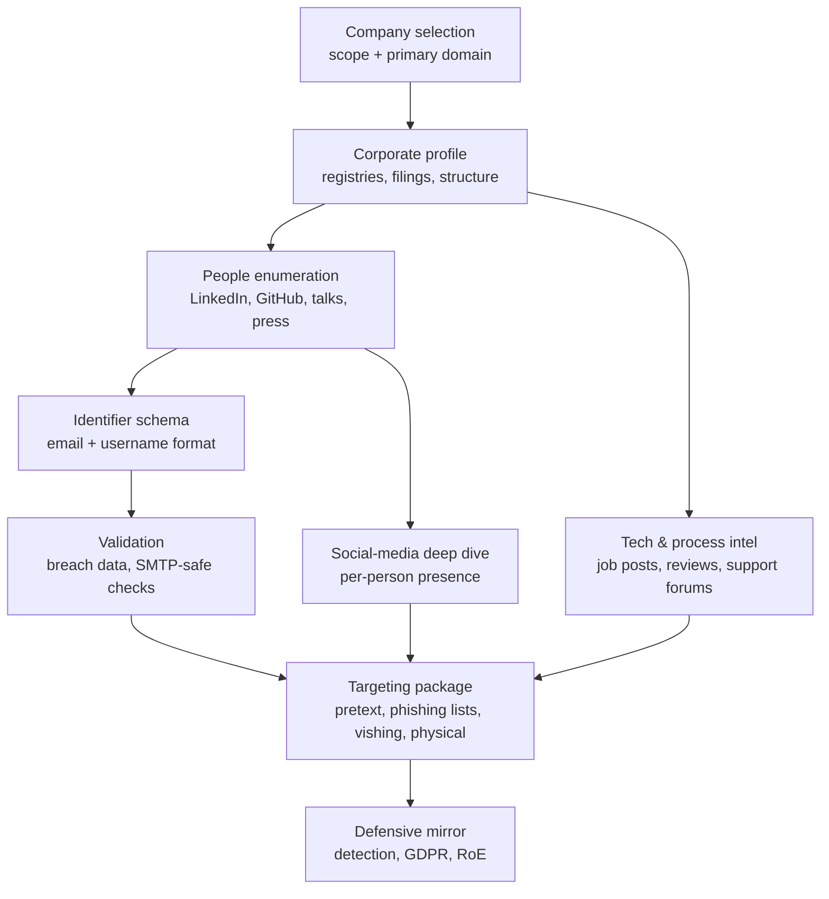
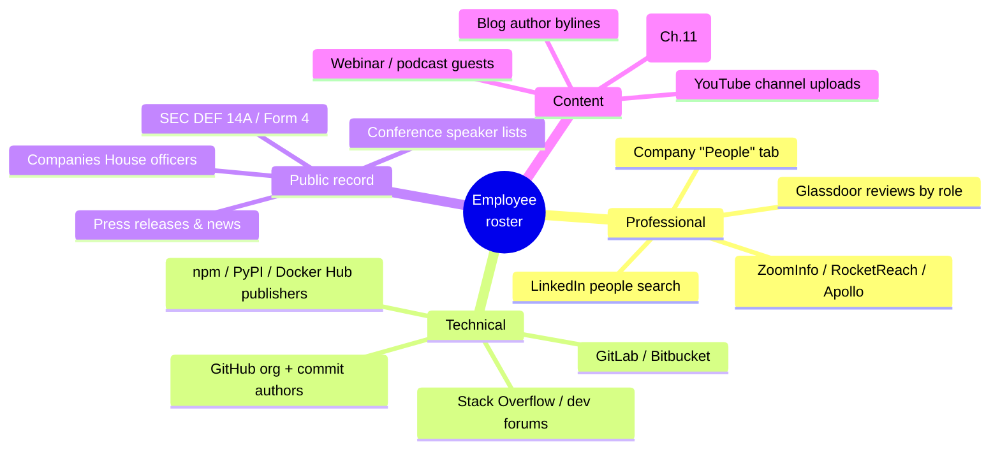
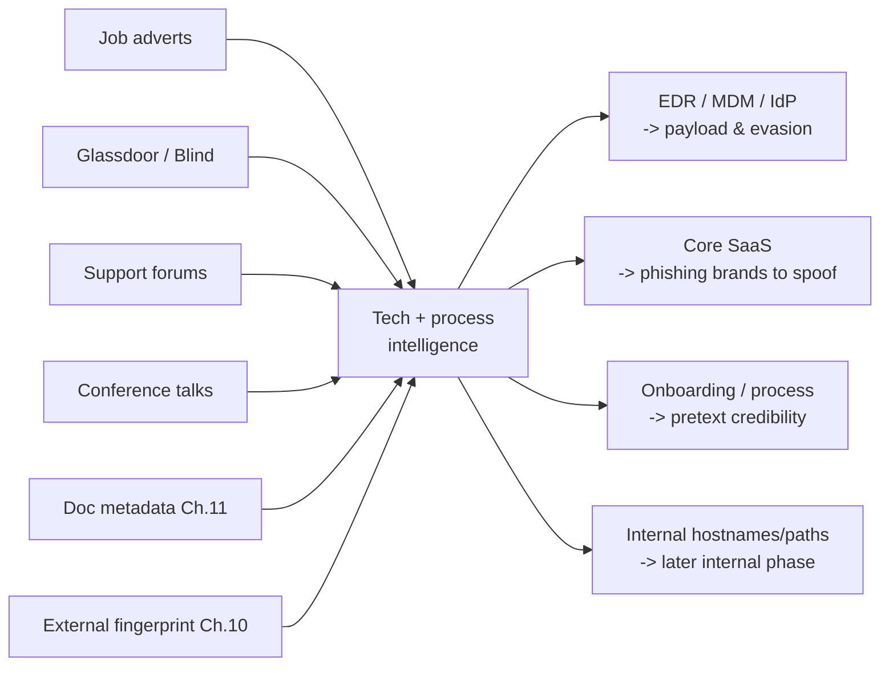
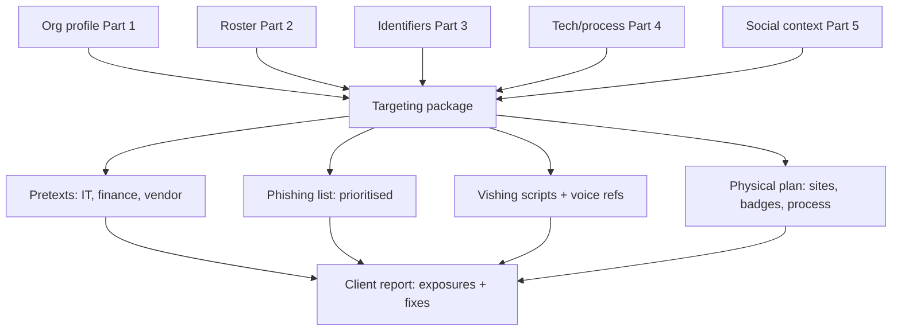

**Level:** Advanced · **Track:** Penetration Testing · **Read time:** 215 min

This is Chapter 12 of the Recon & OSINT notebook. Chapters 5 through 11 built the *technical* attack surface: subdomains, live hosts, exposed services, breach data, and the metadata leaking out of published files. This chapter turns to the surface that phishing, vishing, and physical intrusion actually target — the **people** and the **organisation**. A red team does not phish an IP address. It phishes `j.harding@northgatelogistics.co.uk`, a named Senior Brand Designer in the Reading office who posts on LinkedIn, pushes to a personal GitHub, and whose manager's manager is a VP whose calendar is half-guessable from conference schedules.

People-and-organisation OSINT is the discipline of building, from public sources only, a picture rich enough to *impersonate context*: who works here, what they do, who they report to, how their email addresses are formed, what technology they run, what they are hiring for, what they complain about publicly, and which of them will click. Done well it is the single highest-yield phase of a red-team engagement, because the initial-access vector for the overwhelming majority of real intrusions is a person, not a service.

This is also the phase with the sharpest ethical and legal edges in the whole notebook. Every record here is about an identifiable human being. Chapter 11 warned that a geotagged holiday photo is personal data; this chapter is *entirely* personal data. Everything below assumes an engagement whose rules of engagement explicitly authorise social-engineering and people-OSINT against the client's staff, that you collect the minimum necessary, protect it, and delete it on schedule. Part 12 covers the GDPR, scope and duty-of-care boundaries in full, and they are not optional.

The chapter builds in the same funnel a real operator uses: **organisation → people → identifiers → technology/process → social presence → targeting package → defence.** Each stage feeds the next.



---

## Part 1: The Corporate Profile — Turning a Name Into a Structure

Before you can enumerate people you need the shape of the organisation: its legal entities, its brands, its physical sites, its ownership, and its size. This is the skeleton every later step hangs on, and almost all of it sits in free, authoritative public registries.

### 1.1 Establish the legal entities

A company is rarely one entity. "Northgate Logistics" may be a trading name for `Northgate Logistics Ltd`, owned by `Northgate Holdings Ltd`, with subsidiaries in three countries and a dormant `Northgate Logistics (Services) Ltd` holding a trademark. Each entity has its own domains, its own filings, and its own officers — and the subsidiaries are frequently softer targets than the parent.

Authoritative company registries, by jurisdiction:

| Jurisdiction | Registry | What it gives you (free) |
|---|---|---|
| UK | Companies House | Officers/directors (names, partial DOB, nationality, occupation), registered address, filing history, persons of significant control, full accounts, charges |
| USA | Secretary of State (per state) + SEC EDGAR | Incorporation, registered agent; EDGAR: 10-K/10-Q/8-K, DEF 14A proxy (exec names + pay), insider Form 4 |
| EU | national registers + the **BRIS** portal; **OpenCorporates** aggregates | Officers, filings, cross-border links |
| Global aggregator | **OpenCorporates** | 200M+ companies, officer cross-linking, corporate-network graphs |
| Beneficial ownership | **OpenOwnership**, UK PSC register | Who ultimately controls the entity |
| Charities/non-profits | Charity Commission (UK), IRS Form 990 (US) | Trustees, finances, key staff |

**The single most productive UK move** is Companies House officer search: it names directors, their approximate ages, nationalities, occupations and *other* directorships — which links individuals across companies and often to their home region. SEC EDGAR's **DEF 14A proxy statement** is the US equivalent gold mine: it names the entire executive team and board, their exact compensation, and often biographical detail.

```bash
# Companies House has a free REST API (register for a key)
curl -s -u "$CH_API_KEY:" \
  "https://api.company-information.service.gov.uk/search/companies?q=northgate%20logistics" | jq '.items[] | {title, company_number, address_snippet}'

# Officers of a specific company
curl -s -u "$CH_API_KEY:" \
  "https://api.company-information.service.gov.uk/company/12345678/officers" \
  | jq '.items[] | {name, officer_role, occupation, nationality, appointed_on}'
```

### 1.2 Map domains, brands and infrastructure ownership

Tie the legal entities to their internet presence, building on Chapters 2 and 5:

- **WHOIS / RDAP** on the primary domain (registrant org, though usually privacy-shielded now).
- **Reverse WHOIS** (WhoisXML, DomainTools) — every domain that shares a registrant email or org name; surfaces forgotten brands and staging domains.
- **Certificate transparency** (crt.sh) — every hostname a CA has ever issued for the org, including internal-sounding names.
- **ASN / BGP** lookups (bgp.he.net) — IP ranges the org owns outright, which is a hard scope boundary.
- **Trademark registries** (USPTO TESS, UKIPO, EUIPO) — brand names, product code-names, and the filing attorney.

```bash
# Every hostname CT logs know for the apex domain
curl -s "https://crt.sh/?q=%25.northgatelogistics.co.uk&output=json" \
  | jq -r '.[].name_value' | sort -u

# What ASN/netblocks does the org announce?
whois -h whois.radb.net -- '-i origin AS64500' | grep route
```

### 1.3 Establish size, sites and sector

You need scale to calibrate everything else — a 50-person firm and a 50,000-person firm demand different enumeration strategies.

- **Employee count**: LinkedIn's company page (headcount band + "see all employees"), Glassdoor, Crunchbase, annual accounts (staff-cost notes imply headcount).
- **Physical sites**: the company's own "contact/locations" page, Google Maps, Companies House registered office, job adverts (which name the office a role is based in), and the geotagged marketing photos from Chapter 11.
- **Sector and regulation**: determines which regulators hold filings (FCA for UK finance, HHS for US healthcare) and which compliance obligations shape their tech.

Capture this as a structured profile — you will reference it constantly:

```yaml
# profile.yaml — the spine of the engagement
org:
  primary_name: Northgate Logistics Ltd
  company_number: "12345678"
  entities: [Northgate Holdings Ltd, "Northgate Logistics (Services) Ltd"]
  domains: [northgatelogistics.co.uk, northgate-logistics.com, ngl-cargo.com]
  asn: [AS64500]
  sites:
    - {city: Reading, country: UK, type: HQ}
    - {city: Rotterdam, country: NL, type: warehouse}
  headcount_band: "501-1000"
  sector: Logistics / freight forwarding
  key_regulators: []
```

---

## Part 2: People Enumeration — Building the Roster

With the skeleton in place, populate it with named humans. The goal of this stage is a roster: for as many employees as possible, a name, a role/title, a seniority level, a site, and — later — an identifier. No single source is complete; you fuse several.

### 2.1 The source map



### 2.2 LinkedIn — the primary source, used carefully

LinkedIn is where the org publishes its own org chart for free. The company page's **People** tab breaks employees down by function, location and seniority; individual searches (`"Northgate Logistics"` filtered by title) surface specific roles.

Operational reality and OPSEC:

- **Profile views are visible.** By default the target sees who viewed them. Switch your account to **private/anonymous browsing mode** before any recon, and use a research account that is not your real identity and not linked to the client (per Chapter 3's sock-puppet discipline). Note LinkedIn's terms restrict scraping and fake accounts; understand you are trading policy risk for OPSEC and stay within engagement authorisation.
- **"Commitments" leak structure.** "Reports to", shared posts, "congratulate on the new role" notifications and endorsements reveal reporting lines and team composition.
- **Alumni and "People also viewed"** expand the roster laterally to peers.
- **Third-party sales-intelligence tools** (Apollo.io, RocketReach, ZoomInfo, Lusha) aggregate LinkedIn-derived data with **email addresses and direct-dial numbers already attached** and often expose a free tier. These are frequently faster and lower-OPSEC-risk than touching LinkedIn directly, because you never authenticate against the target's view.

**Red team usage:** rank the roster by *phishing utility*, not seniority. IT/help-desk staff (credential-reset pretexts), finance (invoice/BEC pretexts), HR and recruiters (they open unsolicited attachments for a living), and new joiners (identifiable from "excited to start" posts — they don't yet know normal process) are the highest-value targets.

### 2.3 GitHub and the developer surface

For any organisation that writes software, GitHub is often more revealing than LinkedIn, because it ties a real name to an email address to actual code — and sometimes to secrets.

```bash
# Members of a GitHub org (public membership only)
curl -s "https://api.github.com/orgs/northgate-tech/members" | jq -r '.[].login'

# Every commit author name + email in a repo — emails are in the git objects
git clone --bare https://github.com/northgate-tech/logistics-portal.git
cd logistics-portal.git
git log --all --format='%an <%ae>' | sort -u
```

```
Jamie Harding <j.harding@northgatelogistics.co.uk>
Jamie Harding <jamie@jharding.dev>
mokafor <m.okafor@northgatelogistics.co.uk>
ci-bot <ci@ngl-cargo.com>
```

That single `git log` just yielded the **corporate email schema** (`<initial>.<surname>@`), linked a corporate identity to a **personal email and personal domain** (`jamie@jharding.dev` — a pivot to personal accounts), and revealed a CI service address. Commit emails are the most reliable email-schema source in existence because developers rarely think about them.

Chain to secret-scanning (respecting scope — read, don't exploit): `trufflehog github --org=northgate-tech`, `gitleaks`, and GitHub's own code search for the org's domains often surface hard-coded credentials, internal hostnames and API keys in public repos and, critically, in employees' *personal* repos where they committed work code.

### 2.4 Conferences, talks, press and content

- **Speaker lists** (conference sites, YouTube, SlideShare/Speaker Deck) name senior technical and security staff and reveal what technology they run — a talk titled "Migrating Northgate's fleet telemetry to Kafka on EKS" is a full tech-stack disclosure plus a named engineer.
- **Press releases and news** name executives, partnerships, and — invaluably — **new-system rollouts** ("Northgate selects Workday for HR"), which tell you exactly which SaaS to spoof in a phish.
- **Blog author bylines and webinar guests** add mid-level named staff with demonstrated interests (useful for spear-phishing lures).
- **Patents** (Google Patents) name inventors — your senior R&D staff.

### 2.5 Recording the roster

```csv
full_name,first,last,title,seniority,dept,site,linkedin,github,source,notes
Jamie Harding,Jamie,Harding,Senior Brand Designer,IC,Marketing,Reading,in/jharding,jharding,LinkedIn+GitHub,personal domain jharding.dev
Mary Okafor,Mary,Okafor,Lead Platform Engineer,Lead,Engineering,Reading,in/mokafor,mokafor,GitHub commits,pushes to org repos
```

Keep it as CSV/YAML so later automation (schema derivation, list generation) can consume it.

---

## Part 3: Deriving and Validating the Identifier Schema

A roster of names becomes an attack surface the moment you can turn each name into the identifiers the organisation authenticates: **email addresses** and **usernames**. Both follow a consistent, discoverable pattern.

### 3.1 Finding the email pattern

You rarely have to guess. The pattern is usually *published somewhere*:

1. **Commit emails** (Part 2.3) — most reliable.
2. **Document metadata** (Chapter 11) — `Author`/`Creator` fields, and `mailto:` targets in Office relationship files.
3. **theHarvester / hunter.io / Apollo** — aggregate published addresses for the domain.
4. **Breach data** (Chapter 8) — leaked corporate addresses show the live format directly.
5. **Press/contact pages, DNS SOA record** (the admin email), and support-ticket footers.

The common formats, with an example for *Jamie Harding*:

| Pattern | Example | Notes |
|---|---|---|
| `first.last` | jamie.harding@ | Most common |
| `finitial.last` / `flast`-dotted | j.harding@ | Very common in EU |
| `flast` | jharding@ | Common in US |
| `first_last` | jamie_last@ | Underscore variant |
| `firstl` | jamieh@ | Smaller orgs |
| `first` | jamie@ | Very small orgs; collisions force fallback |
| `lastf` / `last.first` | hardingj@ | Some sectors |
| `employeeID` | e04471@ | Large enterprises; not name-derivable |

Generate candidates for the whole roster once you know the pattern:

```python
#!/usr/bin/env python3
"""Generate email candidates from a roster CSV given a domain and pattern."""
import csv, sys

domain = sys.argv[2]
pattern = sys.argv[3]  # e.g. "{f}.{last}" or "{first}.{last}"

def render(first, last, pat):
    f, l = first.lower(), last.lower()
    return pat.format(first=f, last=l, f=f[0], l=l[0]).replace(" ", "") + "@" + domain

with open(sys.argv[1]) as fh:
    for row in csv.DictReader(fh):
        print(render(row["first"], row["last"], pattern))
```

```bash
python3 gen_emails.py roster.csv northgatelogistics.co.uk "{f}.{last}"
# j.harding@northgatelogistics.co.uk
# m.okafor@northgatelogistics.co.uk
```

### 3.2 Validating addresses without tipping anyone off

A candidate list is noisy; validating it quietly is the skill. Ranked from safest to riskiest:

| Method | How | OPSEC / accuracy |
|---|---|---|
| **Breach-data confirmation** | Address appears in a leak (Chapter 8) | Silent; proves it was real at some point |
| **Cross-source agreement** | Same address from commits + Hunter + press | Silent; high confidence |
| **Hunter.io "verify"** | Third party performs the check | You don't touch the target's mail server |
| **Auth-portal user enumeration** | O365/Okta/OWA login differing responses for valid vs invalid users | Touches target; may be logged/rate-limited — treat as active recon |
| **SMTP `RCPT TO`** | Ask the MX if it will accept the recipient | Noisy, often blocked/catch-all, lands in logs — usually a bad idea |

**Never validate by sending email.** A bounce is a tell, and a non-bounce may trigger an out-of-office that itself leaks (see 3.4). Prefer breach confirmation and cross-source agreement; treat portal user-enumeration as active recon that belongs *after* the passive roster is built and only within authorisation.

Microsoft 365 tenant reconnaissance is passive against a public endpoint and worth knowing:

```bash
# Confirm a domain uses M365 and read tenant details (public autodiscover data)
curl -s "https://login.microsoftonline.com/getuserrealm.srf?login=user@northgatelogistics.co.uk&xml=1"
# NameSpaceType=Managed -> M365 tenant; Federated -> ADFS/third-party IdP (a phishing-relevant fact)
```

Tools such as `o365creeper` and `CredMaster` automate M365 user enumeration; note that Microsoft has narrowed some of these oracles over time, so verify current behaviour rather than trusting old blog posts — and that this step touches the target.

### 3.3 Username schema

The email local-part is usually *also* the AD/SSO username (`j.harding`), which is why the schema matters beyond email: it seeds password-spray lists (a later chapter), VPN/OWA login attempts, and impersonation. Cross-check against the account-OSINT results from Chapter 7 (Sherlock/Maigret) — a consistent handle across GitHub, personal domains and forums often *is* the corporate username.

### 3.4 What auto-replies and NDRs give away

Even without validating, mail infrastructure leaks:

- **Out-of-office replies** name a person's manager or a delegate ("for urgent matters contact my manager, Priya Shah, p.shah@") and reveal travel/absence windows — a gift for both pretext and timing.
- **Non-delivery reports** disclose the internal mail server, the tenant, and sometimes the naming of internal relays.
- **Email headers** on any legitimately-received message (a marketing newsletter, a support reply) expose `Received:` chains, SPF/DKIM/DMARC posture, and internal hostnames.

**Blue team usage:** treat every one of these as an information-disclosure control point. Suppress internal hostnames in NDRs, keep out-of-office replies generic (no named delegates externally), and enforce a strict DMARC policy so your domain is harder to spoof — all of which directly blunt the targeting this chapter builds.

---

## Part 4: Technology & Process Intelligence From Human Sources

Chapter 10 fingerprinted technology from the outside by touching servers. This section gets much of the same intelligence — plus internal *process* detail no scan can reveal — from what people say publicly. It is entirely passive and often more accurate.

### 4.1 Job adverts are a full internal-systems inventory

A single senior engineering job post routinely names the exact stack, tooling, and even security controls:

> "You'll work with our AWS estate (EKS, RDS Postgres, Lambda), CI/CD in GitLab, IaC in Terraform, observability in Datadog, and endpoints managed via CrowdStrike and Intune. Experience with Okta and our Workday/NetSuite integrations is a plus."

That is: cloud provider, orchestration, database, CI platform, IaC, monitoring, **EDR product** (CrowdStrike — tells the red team what will catch their payloads), **MDM** (Intune), **IdP** (Okta), and core SaaS (Workday, NetSuite). Harvest every current and archived posting:

```bash
# Job boards to sweep: the careers page, LinkedIn Jobs, Indeed, Glassdoor,
# Otta, Wellfound, and niche boards. Archive.org for expired posts.
# Example: pull the careers page and extract tech keywords
curl -s "https://northgatelogistics.co.uk/careers" \
  | grep -oiE '\b(aws|azure|gcp|okta|crowdstrike|sentinelone|intune|jamf|workday|netsuite|salesforce|kafka|kubernetes|terraform|gitlab|jenkins|datadog|splunk)\b' \
  | sort | uniq -c | sort -rn
```

**Red team usage:** knowing the EDR and MDM product *before* you build a payload is decisive — it dictates tooling, delivery and evasion posture, all lab-scoped and within RoE.

### 4.2 Review sites reveal process, culture and grievances

- **Glassdoor / Indeed reviews** describe onboarding ("first two weeks you get a laptop and shadow someone"), tooling frustrations ("the VPN drops constantly so we just use the web portal"), reorg turmoil, and management names. Grievances are pretext fuel — "we know the VPN is flaky, IT is rolling out a fix, click here to test the new client".
- **Comparably / Blind (teamblind.com)** — Blind requires a verified corporate email to post, so posts are from real employees and often discuss internal tools, security incidents and layoffs with startling candour.
- **repvue / levels.fyi** — compensation and org structure for sales and tech.

### 4.3 Support forums, community and shadow IT

Employees ask for help in public using their corporate email or a recognisable handle:

- **Vendor support communities** (Salesforce Trailblazer, AWS re:Post, Atlassian Community, Spiceworks) — an admin posting "how do I configure SSO between our Okta and this app" confirms both products and names the admin.
- **Stack Overflow** — pasted code, config and stack traces containing internal hostnames, connection strings and paths.
- **Public Trello/Notion/Confluence/SharePoint** — misconfigured "anyone with the link" boards are a recurring, high-impact leak. Google-dork for them (Chapter 4): `site:trello.com "northgate"`, `site:*.sharepoint.com northgate`.

### 4.4 Building the tech/process picture



The output is a stack profile you cross-validate against the external fingerprint: where the job advert says "Okta" and the login portal redirects to `northgate.okta.com`, you have corroborated an SSO provider to spoof. Where Blind mentions an EDR the job posts don't, you note the discrepancy.

---

## Part 5: Social-Media OSINT, Platform by Platform

The roster and identifiers give you *who*; social media gives you the *context* that makes impersonation credible — interests, relationships, schedules, current projects, physical whereabouts. Each platform leaks differently.

### 5.1 The platform matrix

| Platform | Best intelligence | Key techniques / OPSEC |
|---|---|---|
| **LinkedIn** | Role, reporting lines, tenure, skills, "open to work", new joiners | Private mode; sock puppet; watch activity feed for project mentions |
| **X / Twitter** | Real-time opinions, work frustrations, event attendance, tech mentions | Advanced search `from:` `since:` `until:` `near:`; follower graph; deleted-tweet archives |
| **Facebook** | Personal life, family, home area, life events, groups | Graph-search-style queries via URL params; friends list; check-ins; usually most locked-down |
| **Instagram** | Location (geotags/venues), routine, relationships, workplace photos | Tagged locations, story highlights, followers; badges/screens in office selfies (Ch.11) |
| **GitHub** | Real name, emails, projects, work patterns (commit timestamps), personal domains | Commit metadata; contribution graph implies working hours/timezone |
| **TikTok / YouTube** | Home interior, routine, "day in my life", voice for vishing | Background detail; upload cadence |
| **Telegram / Discord** | Community membership, shared files (metadata!), real-time presence | Username reuse (Ch.7); file uploads retain EXIF (Ch.11) |
| **Reddit** | Candid opinions under pseudonym, sometimes de-anonymisable | Handle reuse; writing-style linkage; post history reveals location/employer |
| **Strava / fitness** | Precise home + routine + workplace (run/commute routes) | Public activity heatmaps; the classic base-location leak |
| **Personal blog / Mastodon / Bluesky** | Detailed technical and personal disclosure | Often linked from GitHub/LinkedIn |

### 5.2 Cross-platform identity resolution

The power move is linking one person's accounts across platforms into a single profile, using the techniques from Chapter 7 (Sherlock, Maigret, WhatsMyName) plus:

- **Username reuse** — `jharding` on GitHub, `jharding.dev`, `@jharding` on X.
- **Profile-photo reuse** — reverse image search (Chapter 11) the LinkedIn headshot to find pseudonymous accounts using the same picture.
- **Bio cross-links** — Linktree, pinned links, "my other socials".
- **Writing style and interests** — a distinctive turn of phrase or a niche hobby links a pseudonymous Reddit account to a named professional.
- **Email/phone as account keys** — a known corporate or personal email checked against account-existence oracles (holehe, from Chapter 7).

```mermaid
graph LR
    P[Jamie Harding] --- L[LinkedIn: in/jharding]
    P --- G[GitHub: jharding]
    G --- E1[j.harding@northgatelogistics.co.uk]
    G --- E2[jamie@jharding.dev]
    P --- X[X: @jharding]
    E2 --- D[Personal domain jharding.dev]
    D --- BL[Personal blog + Mastodon]
    P --- S[Strava: public runs from home]
    X --- R[Reddit: u_jh_reads<br/>linked via handle + interests]
```

Each edge you can justify strengthens the dossier; each unjustified leap is how you profile the wrong person. Record the *evidence* for every link, exactly as with the geolocation confidence scale in Chapter 11.

### 5.3 Timing and behavioural intelligence

Social data reveals *when* as much as *who*:

- **GitHub commit timestamps and Strava activity times** → working hours, timezone, and the windows a person is at/away from their desk.
- **Travel posts and out-of-office** → when an executive is unreachable (prime BEC timing — "I'm in transit, can you action this payment").
- **"Excited to start at…" posts** → new joiners in their first fortnight, before they've internalised security norms.
- **Event check-ins** → who is at a conference (away from the office, in an unfamiliar network environment, expecting event-related emails).

**Blue team usage:** this is the argument for security-awareness content that specifically warns staff about geotagging, "first day" posts, and public Strava/commute data — the exposures are individual but the aggregate is an organisational risk.

---

## Part 6: From Intelligence to Targeting Package

Raw OSINT is not the deliverable — the *targeting package* is. This is where collection becomes an operation: pretext design, phishing target lists, vishing scripts and physical-access plans, each traceable back to a piece of evidence.

### 6.1 Pretext design

A pretext is a believable false context. The best ones are assembled entirely from OSINT so they survive scrutiny:

- **Authority + urgency + plausibility.** "This is IT Service Desk. We're migrating the Reading office to the new Okta MFA app this week [true, from job posts + portal], and your account is flagged for enrolment by Friday [urgency]. Please confirm at [lookalike domain]."
- **Impersonate a known relationship.** Spoof the named delegate from an out-of-office, or a real vendor named in a press release ("Workday onboarding"), or the actual manager identified from LinkedIn reporting lines.
- **Match the voice.** Use the tone and vocabulary the org uses publicly (its blog, its help-desk replies) so the lure reads as internal.

### 6.2 Phishing target list, prioritised

```csv
email,name,dept,site,pretext,priority,evidence
j.harding@northgatelogistics.co.uk,Jamie Harding,Marketing,Reading,Okta MFA enrolment,High,new SSO in job posts + portal
p.shah@northgatelogistics.co.uk,Priya Shah,Ops,Reading,invoice approval (BEC),High,named delegate in exec OOO; approves payments
newstarter@...,,Various,,IT onboarding checklist,High,"excited to start" LinkedIn posts this month
```

Prioritise by *access × clickability*: finance and IT for impact, new joiners and recruiters for likelihood.

### 6.3 Vishing and physical

- **Vishing** benefits from a captured voice (a webinar, podcast, or "day in my life" video), the internal vocabulary, and specifics only an insider would know (the actual VPN product, the real help-desk name) — all from Parts 4–5.
- **Physical access** draws on Chapter 11's geolocation and this chapter's site map: badge design from office selfies, the real reception process from Glassdoor, delivery/vendor names from press releases, and smoking-area/entrance detail from geotagged photos.

### 6.4 The package as a graph



Note the final node: even an offensive package is delivered to the client as *defensive value* — every pretext you could build is a control gap they can close.

---

## Part 7: Automating It — theHarvester and a Fusion Pipeline

Manual work does not scale to a 1,000-person org. Automation gathers the raw material; you apply judgement on top.

### 7.1 theHarvester from scratch

**theHarvester** is an OSINT aggregator that queries dozens of public sources (search engines, certificate transparency, PGP key servers, and data providers such as Hunter and Bing) to collect **emails, names, subdomains, hosts and sometimes IPs** for a domain. It ships on Kali; it is the fastest way to bootstrap the email roster.

```bash
# Install (present on Kali; otherwise)
sudo apt install -y theharvester        # or: pipx install theHarvester
theHarvester --version

# Basic run against a domain, aggregating several free sources
theHarvester -d northgatelogistics.co.uk -b bing,duckduckgo,crtsh,otx,rapiddns -l 500

# Emails only, saved to JSON/XML for downstream parsing
theHarvester -d northgatelogistics.co.uk -b all -f ngl_harvest
```

Key flags:

| Flag | Meaning |
|---|---|
| `-d` | Target domain |
| `-b` | Data sources (`-b all`, or a comma list; some need API keys in `api-keys.yaml`) |
| `-l` | Limit results per source |
| `-f` | Write results to `<name>.json`/`.xml` |
| `-s` | Start offset (paginate) |
| `-n` | DNS lookups on found hosts |
| `-c` | DNS brute force |

Sources that need free API keys (Hunter, SecurityTrails, Shodan, Intelius) go in `~/.theHarvester/api-keys.yaml`. `-b all` without keys silently skips them — check which sources actually returned data.

### 7.2 A fusion pipeline

The value is fusing theHarvester's emails with the roster, the schema, and cross-source validation:

```python
#!/usr/bin/env python3
"""Fuse harvested emails with a name roster and flag schema-consistent, breach-confirmed targets."""
import json, csv, re, sys

domain = sys.argv[3]
harvest = json.load(open(sys.argv[1]))          # theHarvester -f output
emails = {e.lower() for e in harvest.get("emails", [])}

roster = list(csv.DictReader(open(sys.argv[2])))
# breach-confirmed set (from Chapter 8 work), one email per line
breached = {l.strip().lower() for l in open("breached_emails.txt")} if len(sys.argv) > 4 else set()

def candidate(first, last):
    return f"{first[0].lower()}.{last.lower()}@{domain}"   # adjust to derived schema

print("email,name,in_harvest,breach_confirmed,confidence")
for r in roster:
    c = candidate(r["first"], r["last"])
    inh = c in emails
    brc = c in breached
    conf = "high" if (inh and brc) else "medium" if (inh or brc) else "low"
    print(f"{c},{r['full_name']},{inh},{brc},{conf}")
```

```bash
python3 fuse.py ngl_harvest.json roster.csv northgatelogistics.co.uk breached_emails.txt
```

The output ranks each target by how many independent sources confirm the address — exactly the corroboration discipline used throughout this notebook.

### 7.3 Where automation stops

Automation gathers; it does not *judge*. It cannot tell that a "Head of Security" is a hardened target or that a junior recruiter is soft, that a pretext is culturally off, or that a link between two accounts is coincidental. Treat tool output as leads to verify, never as conclusions — the same rule as reverse image search in Chapter 11.

---

## Part 8: Hands-On Lab — A Targeting Dossier End to End

This lab builds a full dossier for a **fictional** company so every step is safe and reproducible. Do not run the people-touching steps against a real organisation without written authorisation.

### 8.1 Scenario and setup

Target: `Northgate Logistics Ltd` (invented). Objective: from public sources only, produce (a) an org profile, (b) a 10-person roster with derived emails, (c) a tech/process profile, and (d) a prioritised phishing list with pretexts. Work in a segregated research VM and browser profile (Chapter 3).

```bash
mkdir -p ~/labs/people-osint/{raw,work,out} && cd ~/labs/people-osint
sudo apt install -y theharvester jq python3-pip
pip install --user requests pyyaml
```

### 8.2 Step 1 — org profile

Populate `out/profile.yaml` from the Part 1 sources (registry, domains, sites, headcount). For the lab, use the synthetic values:

```yaml
org:
  primary_name: Northgate Logistics Ltd
  domains: [northgatelogistics.co.uk]
  sites: [{city: Reading, country: UK, type: HQ}]
  headcount_band: "501-1000"
  sector: Logistics
  idp: Okta (from careers page)
  edr: CrowdStrike (from job advert)
  core_saas: [Workday, NetSuite, Salesforce]
```

### 8.3 Step 2 — roster (synthetic)

Create `work/roster.csv` as your enumeration output:

```bash
cat > work/roster.csv <<'CSV'
full_name,first,last,title,seniority,dept,site,source
Jamie Harding,Jamie,Harding,Senior Brand Designer,IC,Marketing,Reading,LinkedIn
Mary Okafor,Mary,Okafor,Lead Platform Engineer,Lead,Engineering,Reading,GitHub
Priya Shah,Priya,Shah,Finance Manager,Manager,Finance,Reading,LinkedIn
Tom Reilly,Tom,Reilly,IT Service Desk Analyst,IC,IT,Reading,Glassdoor
Aisha Khan,Aisha,Khan,HR Business Partner,Manager,HR,Reading,LinkedIn
Dan Wu,Dan,Wu,Software Engineer,IC,Engineering,Reading,GitHub
Sara Lund,Sara,Lund,Recruiter,IC,HR,Reading,LinkedIn
Ben Carter,Ben,Carter,VP Operations,Exec,Ops,Reading,Press release
Nadia Rossi,Nadia,Rossi,Marketing Exec (new),IC,Marketing,Reading,"LinkedIn: excited to start"
Ola Nilsson,Ola,Nilsson,DevOps Engineer,IC,Engineering,Reading,GitHub commits
CSV
column -s, -t work/roster.csv
```

### 8.4 Step 3 — derive and generate identifiers

Schema evidence (synthetic): a public commit shows `m.okafor@northgatelogistics.co.uk` → pattern `{f}.{last}`.

```bash
cat > work/gen_emails.py <<'PY'
import csv, sys
domain, pat = sys.argv[2], sys.argv[3]
for r in csv.DictReader(open(sys.argv[1])):
    f, l = r["first"].lower(), r["last"].lower()
    print(pat.format(first=f, last=l, f=f[0], l=l[0]).replace(" ", "") + "@" + domain
          + "," + r["full_name"] + "," + r["dept"] + "," + r["seniority"])
PY
python3 work/gen_emails.py work/roster.csv northgatelogistics.co.uk "{f}.{last}" > work/emails.csv
head work/emails.csv
```

```
j.harding@northgatelogistics.co.uk,Jamie Harding,Marketing,IC
m.okafor@northgatelogistics.co.uk,Mary Okafor,Engineering,Lead
p.shah@northgatelogistics.co.uk,Priya Shah,Finance,Manager
t.reilly@northgatelogistics.co.uk,Tom Reilly,IT,IC
```

Confirm the tenant type passively (real command, safe against the public endpoint — for the lab, note the expected result rather than hitting a live domain):

```bash
# curl -s "https://login.microsoftonline.com/getuserrealm.srf?login=user@DOMAIN&xml=1"
# Expect NameSpaceType=Federated for an Okta-fronted tenant -> phishing targets the Okta login
```

### 8.5 Step 4 — prioritise into a phishing list

```bash
cat > work/prioritise.py <<'PY'
import csv, sys
# crude scoring: access weight by dept + clickability by role
access = {"IT":5,"Finance":5,"HR":3,"Engineering":3,"Ops":4,"Marketing":2}
def score(dept, seniority, title):
    s = access.get(dept, 2)
    if "new" in title.lower() or "Recruiter" in title: s += 3      # soft targets
    if seniority == "Exec": s += 2                                  # BEC value
    if dept == "IT": s += 1
    return s
rows=[]
for r in csv.reader(open(sys.argv[1])):
    email,name,dept,sen = r
    rows.append((score(dept,sen,name),email,name,dept,sen))
for sc,email,name,dept,sen in sorted(rows, reverse=True):
    pre = ("Okta MFA enrolment" if dept=="IT" else
           "Invoice approval (BEC)" if dept=="Finance" else
           "IT onboarding checklist" if "new" in name.lower() else
           "Shared HR document" if dept=="HR" else
           "Brand asset review")
    print(f"{sc}\t{email}\t{name}\t{dept}\t{pre}")
PY
# note: emails.csv 4th col is seniority; name has no 'new' so tag new-starter rows in roster if needed
python3 work/prioritise.py work/emails.csv | sort -rn | column -t
```

```
9  t.reilly@...  Tom Reilly   IT         Okta MFA enrolment
7  p.shah@...    Priya Shah   Finance    Invoice approval (BEC)
5  b.carter@...  Ben Carter   Ops        Brand asset review
5  s.lund@...    Sara Lund    HR         Shared HR document
...
```

### 8.6 Step 5 — the dossier

Assemble `out/dossier.md`: the org profile, the roster table, the identifier schema with its evidence, the tech/process profile, the prioritised phishing list, and 3–4 fully written pretexts each citing the OSINT that supports it. Crucially, add a **Defensive Findings** section (Part 9) so the deliverable doubles as the client's remediation list. That defensive framing is what makes the dossier a professional product rather than a dox.

---

## Part 9: Detection & Defense Angle

Every technique above is a control gap you can help a client close. Because people-OSINT is passive against public data, you cannot "detect the recon" — the defence is reducing what is exposed and hardening the moment the recon is *used* (the phish, the call, the badge-in).

### 9.1 Reduce the exposure

- **Corporate footprint hygiene.** Keep job adverts generic — describe outcomes, not the exact EDR/MDM/IdP product names. Sanitise document metadata (Chapter 11) so author names and internal paths don't seed the schema. Suppress internal hostnames in NDRs and out-of-office replies; keep external OOO messages free of named delegates.
- **Email/identity hardening.** Enforce strict **DMARC (`p=reject`)**, SPF and DKIM so the domain is hard to spoof. Phishing-resistant MFA (FIDO2/WebAuthn) defeats most credential-phishing regardless of how good the pretext is. Reduce M365/Okta user-enumeration oracles where the platform allows.
- **People awareness, targeted.** Warn specifically about the exposures this chapter exploits: "first day" posts, geotagged office photos, public Strava/commute data, and posting on Blind/Glassdoor with identifying detail. Brief high-risk roles (finance, IT help-desk, execs and their assistants) on the exact pretexts they'll face (BEC, MFA-enrolment, vendor impersonation).

### 9.2 Detect and blunt the use

- **Lookalike-domain monitoring.** Register-and-alert on typosquats and homoglyphs of the primary domain and the SSO host; CT-log monitoring (Chapter 2) catches new certs for lookalikes early.
- **Inbound controls.** Banner external email, sandbox attachments and rewrite/scan links, and flag display-name spoofs of executives. Rate-limit and alert on authentication-portal enumeration and password-spray patterns (the sign that a roster is being weaponised).
- **Report culture.** An easy "report phish" button and a no-blame culture turn every targeted employee into a sensor — the single most effective detective control against the operations this chapter enables.

### 9.3 The org-chart-as-attack-graph mindset

Defensively, model your own people the way the red team does: which roles, if phished, yield the most access; which individuals are over-exposed publicly; where reporting lines make a BEC chain plausible. Running this chapter's pipeline against *your own* organisation on a schedule (a "purple" exercise) surfaces the exposures before an adversary does.

**CTF / practice relevance:** people-OSINT is the backbone of the OSINT category in CTFs (TraceLabs "find the missing person" CTFs, and rooms below). The same skills — pivot from a name to accounts to identifiers to a location — are exactly what those events score, minus the offensive payload.

---

## Part 10: OPSEC, Ethics and the Law

This chapter processes personal data about identifiable people, so the boundaries are stricter than anywhere else in the recon track.

- **Authorisation is specific.** General pentest scope does **not** imply authority to target employees' personal lives. Social-engineering and people-OSINT must be *explicitly* named in the rules of engagement (Chapter 2), with agreed limits on which staff, which channels, and how far personal accounts may be touched. Confirm before collecting.
- **Personal data law.** Under GDPR/UK-GDPR (and equivalents), building profiles of named employees is processing personal data; "it was public" is not a lawful basis by itself. Work under the client's authorisation and legitimate-interest basis, document your purpose, and apply data-minimisation — collect only what the objective needs.
- **Special-category and sensitive data.** Health, religion, sexuality, trade-union membership and biometric data (including facial reverse-search, Chapter 11) carry heightened protection. Do not collect them, and if they surface incidentally, do not process or report them.
- **Off-limits by default.** An employee's family, home address, children, medical details and after-hours movements are almost always out of scope even when the corporate target is in scope. Report the *class* of exposure ("staff commute data is public via Strava; here is one redacted example") rather than a dossier on an individual.
- **Your OPSEC.** Use sock-puppet accounts and a segregated environment (Chapter 3); never authenticate to the target's LinkedIn view with an attributable account; be aware that some platforms' terms prohibit fake accounts and scraping — you are managing that risk under engagement authorisation, not ignoring it.
- **Data handling.** Store the dossier encrypted, restrict access, and destroy it per the engagement's data-handling terms. A leaked targeting dossier is itself a serious breach.
- **Duty of care.** If OSINT surfaces evidence of harm to a person (stalking, abuse, CSAM), stop, do not further process, and follow legal-reporting obligations — this is outside a security assessment's remit.

The governing principle holds from the OSINT-foundations chapter: *finding it does not authorise collecting, keeping, or acting on it.*

---

## Part 11: Common Pitfalls

- **Profiling the wrong person.** Name collisions are everywhere. Require corroborating evidence for every identity link, and record it — one weak edge and the whole dossier targets a stranger.
- **Trusting a single source.** LinkedIn titles are aspirational, Glassdoor reviews are biased, sales-intel emails go stale. Cross-confirm before you rely on anything.
- **Validating emails by sending mail.** Bounces and auto-replies tip off the target and pollute the timeline. Use breach confirmation and cross-source agreement; treat portal enumeration as active recon.
- **Touching LinkedIn with an attributable/logged-in account.** Profile views are visible; use private mode and a sock puppet, or work from third-party aggregators.
- **Treating tool output as truth.** theHarvester and Apollo produce leads, not facts — verify.
- **Ignoring the email schema staring at you in commit metadata.** Developers leak the corporate format in `git log` far more reliably than any guessing tool.
- **Scope creep into personal lives.** The easiest way to turn a professional engagement into a legal and ethical incident. Stay inside the RoE and default to the *class* of exposure, not the individual.
- **Forgetting the defensive deliverable.** An offensive dossier with no remediation section is a liability; the value to the client is the list of fixes.
- **Stale intelligence.** Org charts change; a reorg or layoff can invalidate reporting lines overnight. Date every finding.
- **Over-collection.** More data is more legal risk and more noise. Collect what the objective needs and no more.

---

## Part 12: Practice Labs & Resources

**People / corporate OSINT**
- **TryHackMe — "OSINT" path, "Searchlight IMINT", "Sakura Room"** — pivoting from a person to accounts, identifiers and locations.
- **TraceLabs Search Party CTF** and the **TraceLabs OSINT VM** — the definitive people-OSINT practice, gamified around finding real (consented, missing-person) targets; the skill set maps directly onto red-team people recon minus the offense.
- **Hunter.io, Apollo.io, RocketReach free tiers** — practise email-schema derivation and validation on companies you have permission to research (e.g. your own).
- **OSINT Framework (osintframework.com)** and **Bellingcat's toolkit** — curated source directories for corporate and social investigations.
- **Michael Bazzell's "OSINT Techniques"** and the IntelTechniques tools/workbook — the standard reference for the people-search workflows in Parts 2–5.

**Corporate records**
- **Companies House** (free API), **SEC EDGAR full-text search**, **OpenCorporates**, **OpenOwnership** — practise building a corporate-entity map for any public company.

**Social-media technique**
- **X advanced search operators**, Facebook/Instagram URL-parameter techniques, and **GitHub commit-metadata** harvesting — practise on your own accounts to see what you leak.
- **theHarvester** and **Spiderfoot** (Chapter 6) against a domain you own.

**Defensive**
- Run this chapter's pipeline against your *own* organisation; map the org-chart-as-attack-graph and produce a remediation list.

---

## Memory Hooks

- **Org → people → identifiers → tech/process → social → package → defence** — the funnel, in order.
- **Companies House officers and SEC DEF 14A** name the humans for free.
- **`git log --all --format='%an <%ae>'`** is the most reliable email-schema source there is.
- **Job adverts are an internal-systems inventory** — EDR, MDM, IdP, core SaaS, all named.
- **Validate with breach data and cross-source agreement — never by sending mail.**
- **Rank targets by access × clickability**, not seniority: IT, finance, new joiners, recruiters.
- **Every identity link needs evidence** — corroborate or you dox a stranger.
- **The dossier's value to the client is its remediation section.**
- **People-OSINT is entirely personal data** — RoE-authorised, minimised, protected, deleted.

## Final Revision / Summary

This chapter mapped the human and organisational attack surface. Part 1 turned a company name into a structure using authoritative registries (Companies House, SEC EDGAR, OpenCorporates) and tied legal entities to domains, ASNs and sites. Part 2 populated that skeleton with named people from LinkedIn, GitHub commit metadata, conference talks and press — fusing multiple sources into a roster ranked by phishing utility rather than seniority. Part 3 derived the email and username schema (commit metadata being the most reliable source) and validated addresses *quietly* through breach data and cross-source agreement, warning never to validate by sending mail. Part 4 harvested technology and process intelligence from human sources — job adverts as a full internal-systems inventory, Glassdoor/Blind for process and grievances, support forums for shadow IT — that no external scan can reveal. Part 5 worked social media platform by platform, resolved identities across platforms with evidence, and extracted behavioural/timing intelligence.

Part 6 converted all of it into a targeting package — pretexts, a prioritised phishing list, vishing and physical plans — each traceable to its evidence. Part 7 automated the collection with theHarvester and a fusion pipeline while insisting that tools produce leads, not conclusions. Part 8 built a complete dossier end to end against a fictional company. Parts 9–11 flipped to defence (footprint hygiene, DMARC/phishing-resistant MFA, targeted awareness, lookalike-domain monitoring, report culture) and to the ethics and law that make this the most tightly-bounded discipline in the notebook — explicit RoE authorisation, GDPR data-minimisation, staying out of employees' personal lives, and delivering the client a remediation list rather than a dox.

The through-line for the whole Recon & OSINT track closes here: technical recon (Chapters 5–11) tells you what the machines are; people-OSINT tells you who the humans are and how to reach them — and initial access, in the real world, almost always comes through a person. The next notebook shifts from reconnaissance to **scanning and enumeration**: taking the hosts and services you have discovered and interrogating them directly, beginning with host discovery and the scanning methodology.

## Cheat Sheet / Quick Reference

```bash
# ---- CORPORATE PROFILE ----
# Companies House officer search (free API key)
curl -s -u "$CH_API_KEY:" "https://api.company-information.service.gov.uk/search/companies?q=NAME" | jq '.items[]'
# SEC EDGAR: read DEF 14A (exec names+pay), 10-K, Form 4 at https://efts.sec.gov/LATEST/search-index?q=
# OpenCorporates / OpenOwnership for entity + beneficial-ownership graphs
crt.sh?q=%25.DOMAIN&output=json    # every CT-logged hostname
whois -h whois.radb.net -- '-i origin ASxxxxx'   # org netblocks

# ---- PEOPLE / EMAIL SCHEMA ----
git clone --bare REPO && git log --all --format='%an <%ae>' | sort -u   # names+emails+schema
curl -s "https://api.github.com/orgs/ORG/members" | jq -r '.[].login'
theHarvester -d DOMAIN -b bing,duckduckgo,crtsh,otx,rapiddns -l 500 -f out
# M365 tenant type (passive, public endpoint):
curl -s "https://login.microsoftonline.com/getuserrealm.srf?login=user@DOMAIN&xml=1"

# ---- EMAIL CANDIDATE GEN (schema {f}.{last}) ----
python3 gen_emails.py roster.csv DOMAIN "{f}.{last}"

# ---- TECH/PROCESS INTEL ----
# Job posts -> stack; grep for products:
curl -s CAREERS_URL | grep -oiE '\b(aws|azure|okta|crowdstrike|intune|workday|kafka|terraform|gitlab|splunk)\b' | sort | uniq -c
# Public leaks:
#   site:trello.com "ORG"   site:*.sharepoint.com ORG   (Google dorks, Ch.4)
# Blind (teamblind.com), Glassdoor reviews, AWS re:Post / Salesforce Trailblazer

# ---- CROSS-PLATFORM IDENTITY (Ch.7 tools) ----
sherlock USERNAME ; maigret USERNAME ; holehe EMAIL
# reverse-image the headshot (Ch.11) to find pseudonymous accounts
```

**Target-priority rule:** score = access(dept) × clickability(role). IT help-desk, finance, execs (BEC), new joiners, recruiters rank highest — not the org chart's top.

**Validation ladder (safe→risky):** breach-data → cross-source agreement → Hunter verify → portal user-enum (active) → SMTP RCPT (noisy, avoid).

**Defensive one-liner:** generic job posts + stripped doc metadata + `DMARC p=reject` + FIDO2 MFA + lookalike-domain monitoring + targeted awareness = most of this chapter's exposure closed.

## Practice Questions & Labs

1. **Schema from commits.** You clone a target's public repo and `git log --all --format='%ae'` shows `a.roy@corp.com`, `roy.a@corp.com` and `aroy@corp.com` for what appears to be one person. What are the possible explanations, how would you determine the *current* canonical corporate format, and why is picking the wrong one costly for a phishing campaign?
2. **Quiet validation.** You have 40 candidate addresses for a target and must confirm which are live without alerting the org. Rank the methods you would use, justify the order on an OPSEC basis, and explain specifically why sending a test email — even a blank one — is the wrong move.
3. **Job-advert stack.** From the sample advert in Part 4.1, list every distinct piece of technology intelligence and state, for each, how it changes either the phishing plan or the (later) payload/evasion plan. Which single item most constrains a red-team operator, and why?
4. **Target prioritisation.** Given the Part 8 roster, produce your top-five phishing targets with a one-line pretext and the OSINT evidence supporting each. Defend why a junior recruiter can outrank a VP on your list.
5. **Defensive mirror (hands-on).** Run the Part 8 pipeline against an organisation you are authorised to assess (e.g. your own). Produce the org-chart-as-attack-graph, identify the three most over-exposed roles/individuals, and write the remediation section — footprint hygiene, identity hardening, and the specific awareness briefing each high-risk role needs.

---

*Also on [Praneeth's portfolio](https://ping-praneeth.vercel.app/notebook/pentest-recon-osint/12-corporate-people-and-social-media-osint-for-red-teams), with comments and the latest edits.*
