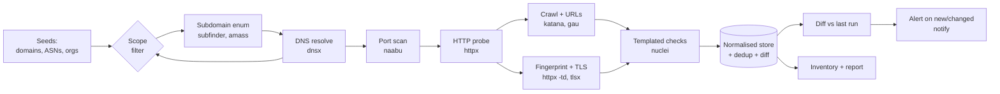
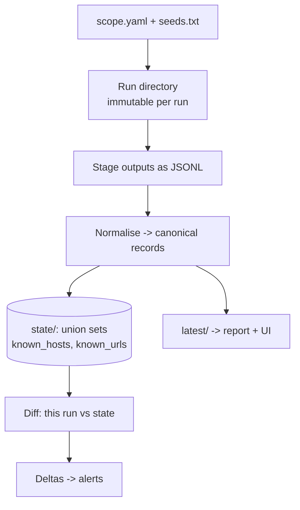
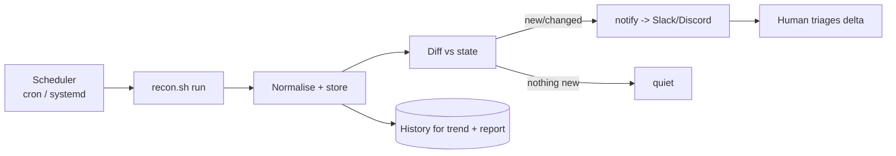

This is Chapter 13, the final chapter of the Recon & OSINT notebook. Everything before it taught a technique in isolation: passive DNS and certificate transparency (Chapter 2), subdomain enumeration (Chapter 5), Shodan and internet-wide discovery (Chapter 9), active fingerprinting (Chapter 10), metadata and image OSINT (Chapter 11), and people and corporate OSINT (Chapter 12). Run by hand, one at a time, against a real target with thousands of assets, that workflow takes days and is impossible to repeat identically. This chapter fixes that by turning the whole track into a single **pipeline**: a chain of tools where each stage's output is the next stage's input, run with one command, produced identically every time, and — critically — re-runnable so that a second run surfaces only what has *changed*.

Automation is not just a convenience. It changes what recon *is*. A manual recon is a snapshot; an automated pipeline is a **monitoring system**. Point it at an organisation, schedule it weekly, and it becomes a continuous attack-surface-management capability that catches the newly-exposed staging box, the freshly-issued certificate for an internal-sounding host, and the just-published S3 bucket the day they appear. That is exactly how mature bug-bounty hunters find bugs before anyone else and how blue teams watch their own perimeter — the same pipeline, pointed inward.

This chapter is deliberately engineering-heavy. You will design a data model, enforce scope as a first-class control, teach the modern Go-based recon tool chain from scratch, wire it into an idempotent shell pipeline and then a structured Python orchestrator, add deduplication and diffing, schedule it, and report from it. Then it steps back for an honest build-versus-buy comparison with the off-the-shelf frameworks so you know when *not* to build your own.

Everything here assumes authorised, in-scope work. Automation makes it trivially easy to send tens of thousands of requests to hosts you were never authorised to touch — a single mis-set wildcard can turn a scoped engagement into unauthorised access against a third party. Scope enforcement is therefore not an afterthought in this chapter; it is Part 2, before any tool runs. The OPSEC and legal boundaries are in Part 11.



---

## Part 1: Pipeline Architecture and the Data Model

Before a single tool runs, decide how data flows and how it is stored. Get this right and every later stage is trivial; get it wrong and you drown in inconsistent, un-joinable text files.

### 1.1 The stages, as a contract

A recon pipeline is a directed acyclic graph of stages. Each stage has a **defined input type** and **output type**, so stages compose:

| Stage | Input | Output | Representative tools |
|---|---|---|---|
| Seed | scope definition | apex domains, ASNs, org names | manual / config |
| Subdomain enum | apex domain | hostnames | subfinder, amass, github-subdomains |
| DNS resolve | hostnames | resolved (host → A/AAAA/CNAME) | dnsx, massdns |
| Scope filter | any host/IP | in-scope subset | custom (Part 2) |
| Port scan | IPs | open host:port | naabu, masscan, nmap |
| HTTP probe | host:port | live HTTP endpoints + meta | httpx |
| Fingerprint | endpoints | tech, TLS, titles, hashes | httpx -td, tlsx, wappalyzer |
| Crawl / URL collect | endpoints | URLs, params, JS | katana, gau, waybackurls |
| Templated checks | endpoints/URLs | findings | nuclei |
| Store / diff | all of the above | normalised DB + deltas | custom |

The golden rule: **stages communicate through files (or a store), never through ad-hoc pipes buried in one giant command.** Persisted intermediate outputs make the pipeline resumable, debuggable and diffable.

### 1.2 The data model

Pick one canonical representation and normalise everything into it. A directory-per-target with newline-delimited and JSONL files is enough to start and scales surprisingly far:

```
engagements/northgate/
  scope.yaml                 # authoritative in-scope / out-of-scope
  seeds.txt                  # apex domains
  runs/2026-10-06T06-00Z/    # one directory per run (immutable)
    subdomains.txt
    resolved.jsonl           # {"host","a","cname","source"}
    live.jsonl               # httpx output, one JSON object per line
    urls.txt
    tech.jsonl
    nuclei.jsonl
  latest/                    # symlink or copy of the newest run
  state/
    known_hosts.txt          # union across all runs (for diffing)
    known_urls.txt
```

JSONL (one JSON object per line) is the right interchange format: every modern recon tool emits it (`-json`), it streams, and `jq` slices it trivially. Reserve a real database (SQLite, then Postgres) for when you outgrow files — usually when you want cross-run queries and a UI.



### 1.3 Principles that keep it sane

- **Idempotent.** Running twice produces the same result; re-running after a crash resumes rather than duplicates. Guard each stage with "if output exists and is newer than input, skip".
- **Immutable runs.** Never overwrite a past run's output — you need history to diff and to prove what you saw when.
- **Deterministic ordering.** `sort -u` everything so diffs reflect real changes, not reordering.
- **Fail loud, continue smart.** A dead API key should log an error, not silently empty a stage and make it look like the attack surface shrank.
- **Everything is config.** Scope, rate limits, resolver lists, API keys and enabled sources live in config files, not hard-coded in scripts.

---

## Part 2: Scope Enforcement as a First-Class Control

This is the most important section in the chapter and the one most tutorials skip. Automation multiplies mistakes: a manual typo hits one wrong host; an automated typo hits ten thousand, fast, from your IP, against someone who never authorised it. Scope enforcement must be a gate that *every* host and IP passes through before any active stage touches it.

### 2.1 Define scope authoritatively

```yaml
# scope.yaml
in_scope:
  domains:
    - northgatelogistics.co.uk        # and *.northgatelogistics.co.uk
    - ngl-cargo.com
  cidrs:
    - 203.0.113.0/24
  asns:
    - AS64500
out_of_scope:
  hosts:
    - status.northgatelogistics.co.uk # third-party statuspage
    - "*.dev.northgatelogistics.co.uk" # explicitly excluded by client
  cidrs:
    - 203.0.113.200/29                 # shared hosting, not client-owned
rules:
  respect_out_of_scope: true
  max_rps_per_host: 10
  active_scanning_allowed: true        # false = passive only
```

### 2.2 Enforce it in code, not in your head

A scope filter that every host passes through:

```python
#!/usr/bin/env python3
"""scope.py - stdin hosts/IPs -> stdout only in-scope, honouring out-of-scope."""
import sys, fnmatch, ipaddress, yaml

cfg = yaml.safe_load(open(sys.argv[1]))
in_domains  = cfg["in_scope"].get("domains", [])
in_cidrs    = [ipaddress.ip_network(c) for c in cfg["in_scope"].get("cidrs", [])]
oos_hosts   = cfg["out_of_scope"].get("hosts", [])
oos_cidrs   = [ipaddress.ip_network(c) for c in cfg["out_of_scope"].get("cidrs", [])]

def is_ip(s):
    try: ipaddress.ip_address(s); return True
    except ValueError: return False

def in_scope(item):
    # out-of-scope always wins
    if any(fnmatch.fnmatch(item, p) for p in oos_hosts):
        return False
    if is_ip(item):
        ip = ipaddress.ip_address(item)
        if any(ip in n for n in oos_cidrs): return False
        return any(ip in n for n in in_cidrs)
    # hostname: match apex or wildcard
    for d in in_domains:
        if item == d or item.endswith("." + d):
            return True
    return False

for line in sys.stdin:
    h = line.strip()
    if h and in_scope(h):
        print(h)
```

```bash
# Every active stage is fed THROUGH the filter — never raw enumeration output
subfinder -d northgatelogistics.co.uk -silent | python3 scope.py scope.yaml | dnsx -silent
```

**Out-of-scope always wins over in-scope.** A host that matches both an in-scope wildcard and an explicit out-of-scope exclusion is excluded. This single rule prevents the most common and most damaging scope violation: hammering a client's third-party status page, payment processor, or a shared-hosting neighbour.

### 2.3 The wildcard-DNS trap

Many domains resolve *every* subdomain to the same IP (`*.example.com → 1.2.3.4`). Naive enumeration then "finds" `asdfqwer.example.com` and a million other non-existent hosts. Detect and strip wildcards before they poison the pipeline:

```bash
# dnsx has built-in wildcard filtering
subfinder -d target.com -silent | dnsx -silent -wd target.com
# -wd = wildcard-domain detection: resolves random baselines and drops matches
```

Failing to handle wildcards is how a pipeline generates 50,000 phantom "assets", wastes hours port-scanning one IP, and buries the real findings.

---

## Part 3: The Modern Recon Tool Chain, From Scratch

The pipeline is built from a set of small, fast, composable Go tools — most from ProjectDiscovery — that each do one stage well and all speak stdin/stdout and JSON. Teaching each from zero here means the pipeline in Part 4 is legible rather than magic.

### 3.1 Installing the tool chain

```bash
# Go tools install to $(go env GOPATH)/bin — put that on PATH
export PATH="$PATH:$(go env GOPATH)/bin"

# ProjectDiscovery installer (pdtm) manages the whole suite
go install -v github.com/projectdiscovery/pdtm/cmd/pdtm@latest
pdtm -install-all      # subfinder, dnsx, naabu, httpx, katana, nuclei, tlsx, notify, ...

# Or individually, e.g.
go install -v github.com/projectdiscovery/subfinder/v2/cmd/subfinder@latest
go install -v github.com/projectdiscovery/httpx/cmd/httpx@latest
```

Note the classic name clash: ProjectDiscovery **httpx** (HTTP prober) is not the Python `httpx` HTTP library, and PD **naabu** is not Nmap. Keep them straight.

### 3.2 subfinder — passive subdomain enumeration

**subfinder** queries dozens of passive sources (CT logs, passive-DNS providers, search engines) for subdomains of a domain. Passive means it does not send traffic to the target — it asks third parties.

```bash
subfinder -d northgatelogistics.co.uk -all -silent -o subs.txt
```

| Flag | Meaning |
|---|---|
| `-d` | Target domain (`-dL file` for a list) |
| `-all` | Use all sources (slower, more complete) |
| `-silent` | Only hostnames on stdout — essential for piping |
| `-recursive` | Recurse into found subdomains |
| `-o` / `-oJ` | Output file / JSON |
| `-rl` | Rate limit (requests/sec across sources) |

Add API keys in `~/.config/subfinder/provider-config.yaml` to unlock premium sources (VirusTotal, SecurityTrails, Censys, Shodan) — the difference in coverage is large.

### 3.3 amass — deep enumeration and correlation

**amass** (OWASP) does passive *and* active enumeration and, uniquely, builds a graph of the relationships (which hostnames share which IPs/ASNs/certs). It is slower and heavier than subfinder; use it when you want depth and correlation, not speed.

```bash
amass enum -passive -d northgatelogistics.co.uk -o amass_passive.txt
amass enum -active  -d northgatelogistics.co.uk -brute -o amass_active.txt   # active: touches DNS
amass intel -asn 64500 -o intel_domains.txt                                  # find domains for an ASN
```

Run subfinder and amass and union the results — they find different things:

```bash
cat subs.txt amass_passive.txt | sort -u > all_subs.txt
```

### 3.4 dnsx — mass resolution and DNS toolkit

**dnsx** resolves hostnames fast, filters wildcards, and can brute-force and pull record types.

```bash
cat all_subs.txt | dnsx -silent -a -resp -wd northgatelogistics.co.uk -json -o resolved.jsonl
```

| Flag | Meaning |
|---|---|
| `-a -aaaa -cname -mx -txt -ns` | Which record types to query |
| `-resp` | Show the response value, not just the host |
| `-wd DOMAIN` | Wildcard detection/filtering for that domain |
| `-json` | JSONL output |
| `-rl` / `-t` | Rate limit / concurrency |
| `-r file` | Custom resolver list (use trusted resolvers) |

Use a curated, reliable resolver list (`trickest/resolvers`) — public resolver rot is a top cause of flaky, non-reproducible results.

### 3.5 naabu — fast port discovery

**naabu** is a SYN/CONNECT port scanner built for speed and pipelining (it is *not* a full replacement for Nmap's depth — the next notebook covers Nmap properly).

```bash
cat resolved_hosts.txt | naabu -silent -top-ports 1000 -rate 1000 -json -o ports.jsonl
```

| Flag | Meaning |
|---|---|
| `-p` / `-top-ports` | Specific ports / top-N |
| `-rate` | Packets per second (the throttle that keeps you polite) |
| `-sn` | SYN (needs root) vs `-sc` connect |
| `-exclude-cdn` | Skip full port scans on CDN IPs (they're the CDN's, not the target's) |
| `-nmap-cli` | Hand off discovered ports to Nmap for service detection |

### 3.6 httpx — the HTTP swiss-army prober

Taught in Chapter 10; here it is the stage that turns host:port into rich live-endpoint records.

```bash
cat live_hosts.txt | httpx -silent \
  -status-code -title -tech-detect -web-server -content-length \
  -favicon -jarr -tls-grab -cname -ip -location \
  -json -o live.jsonl -rate-limit 50
```

The fields you most want downstream: status, title, `tech`, `webserver`, `favicon` hash (pivot on infrastructure), TLS SANs (more hostnames!), and final URL after redirects.

### 3.7 katana, gau, waybackurls — URL collection

- **katana** — a fast active crawler (spiders live sites, parses JS for endpoints).
- **gau** ("get all urls") and **waybackurls** — passive: pull historical URLs from the Wayback Machine, Common Crawl, and URLScan.

```bash
cat live_urls.txt | katana -silent -jc -d 3 -o crawled.txt          # active crawl, depth 3, incl. JS
cat live_hosts.txt | gau --threads 5 | sort -u > historic_urls.txt  # passive, historical
```

Historical URLs from gau routinely surface forgotten endpoints, old API versions, and parameters that no longer appear on the live site but still work.

### 3.8 nuclei — templated checks

**nuclei** runs a huge community library of YAML templates (misconfigurations, exposures, known CVEs, default creds) against endpoints. In a recon pipeline, restrict it to *safe, low-impact* templates unless the RoE authorises active exploitation.

```bash
cat live_urls.txt | nuclei -silent \
  -t http/exposures/ -t http/misconfiguration/ -t ssl/ -t dns/ \
  -severity low,medium,high,critical \
  -rl 50 -json-export nuclei.jsonl
```

| Flag | Meaning |
|---|---|
| `-t` | Template paths/tags to include |
| `-etags` / `-exclude-*` | Exclude noisy/intrusive templates |
| `-severity` | Filter by severity |
| `-rl` | Rate limit — keep it civilised |
| `-json-export` | JSONL findings |

Update templates before every run (`nuclei -update-templates`) and pin a template version per engagement so results are reproducible.

### 3.9 tlsx and notify

- **tlsx** grabs and parses TLS certs at scale — SANs yield yet more in-scope hostnames, and issuer/expiry data feeds monitoring.
- **notify** pushes any tool's output to Slack/Discord/Telegram/email — the delivery mechanism for the "alert on new asset" capability in Part 6.

```bash
cat resolved_hosts.txt | tlsx -silent -san -cn -json -o tls.jsonl
cat new_assets.txt | notify -silent -bulk -id recon_alerts
```

---

## Part 4: Wiring the Shell Pipeline

With every tool understood, compose them. Start with a shell pipeline because it makes the data flow visible; graduate to the Python orchestrator (Part 5) when you need structure, retries and state.

### 4.1 A resumable end-to-end script

```bash
#!/usr/bin/env bash
# recon.sh <target-dir>  — idempotent, resumable recon pipeline
set -euo pipefail

DIR="${1:?usage: recon.sh <engagement-dir>}"
SCOPE="$DIR/scope.yaml"
SEEDS="$DIR/seeds.txt"
RUN="$DIR/runs/$(date -u +%Y-%m-%dT%H-%M-%SZ)"
mkdir -p "$RUN" "$DIR/state"

log(){ printf '[%s] %s\n' "$(date -u +%H:%M:%S)" "$*" >&2; }
# skip a stage if its output already exists and is non-empty (idempotency)
have(){ [[ -s "$1" ]]; }

# ---- 1. subdomain enumeration (passive) ----
if ! have "$RUN/subs.txt"; then
  log "subdomain enum"
  { subfinder -dL "$SEEDS" -all -silent; \
    amass enum -passive -df "$SEEDS" -silent 2>/dev/null; } \
    | sort -u > "$RUN/subs.raw"
  # ---- 2. scope filter BEFORE anything active ----
  python3 "$DIR/scope.py" "$SCOPE" < "$RUN/subs.raw" | sort -u > "$RUN/subs.txt"
  log "in-scope subdomains: $(wc -l < "$RUN/subs.txt")"
fi

# ---- 3. resolve + wildcard filter ----
if ! have "$RUN/resolved.txt"; then
  log "dns resolve"
  APEX="$(head -1 "$SEEDS")"
  dnsx -silent -a -resp -wd "$APEX" -json < "$RUN/subs.txt" > "$RUN/resolved.jsonl"
  jq -r '.host' "$RUN/resolved.jsonl" | sort -u > "$RUN/resolved.txt"
fi

# ---- 4. port scan (active — gated) ----
if grep -q 'active_scanning_allowed: true' "$SCOPE" && ! have "$RUN/ports.txt"; then
  log "port scan"
  naabu -silent -top-ports 1000 -rate 800 -exclude-cdn -l "$RUN/resolved.txt" \
    | sort -u > "$RUN/ports.txt"
fi

# ---- 5. http probe + fingerprint ----
if ! have "$RUN/live.jsonl"; then
  log "http probe"
  INPUT="$RUN/ports.txt"; have "$INPUT" || INPUT="$RUN/resolved.txt"
  httpx -silent -status-code -title -tech-detect -web-server -favicon \
        -tls-grab -ip -cname -location -json -rate-limit 50 -l "$INPUT" \
    > "$RUN/live.jsonl"
  jq -r '.url' "$RUN/live.jsonl" | sort -u > "$RUN/live_urls.txt"
  log "live endpoints: $(wc -l < "$RUN/live_urls.txt")"
fi

# ---- 6. url collection ----
if ! have "$RUN/urls.txt"; then
  log "url collection"
  { katana -silent -jc -d 2 -list "$RUN/live_urls.txt"; \
    gau --threads 5 < "$RUN/resolved.txt" 2>/dev/null; } \
    | python3 "$DIR/scope.py" "$SCOPE" 2>/dev/null | sort -u > "$RUN/urls.txt" || true
fi

# ---- 7. safe templated checks ----
if grep -q 'active_scanning_allowed: true' "$SCOPE" && ! have "$RUN/nuclei.jsonl"; then
  log "nuclei (safe templates)"
  nuclei -silent -l "$RUN/live_urls.txt" \
    -t http/exposures/ -t http/misconfiguration/ -t ssl/ \
    -severity low,medium,high,critical -rl 50 -json-export "$RUN/nuclei.jsonl" || true
fi

# ---- 8. update latest + diff (Part 6) ----
ln -sfn "$RUN" "$DIR/latest"
"$DIR/diff.sh" "$DIR" "$RUN"
log "run complete: $RUN"
```

The design points that matter: **scope filtering sits immediately after enumeration and before every active stage**; each stage is guarded by `have()` so a re-run resumes; active stages are gated on the scope's `active_scanning_allowed` flag; and rate limits are set on every tool that touches the target.

---

## Part 5: From Shell to a Structured Orchestrator

Shell is perfect for making the flow legible and for small engagements. It becomes painful once you need per-stage retries, parallelism with backpressure, structured state, partial re-runs, and error handling that distinguishes "stage found nothing" from "stage crashed". At that point, move the orchestration into Python (or Go) and keep calling the same battle-tested CLI tools as subprocesses.

### 5.1 A minimal stage-runner

```python
#!/usr/bin/env python3
"""orchestrator.py — stage graph with idempotency, retries and structured logging."""
import subprocess, pathlib, json, sys, time, shlex, logging

logging.basicConfig(level=logging.INFO, format="%(asctime)s %(levelname)s %(message)s")
log = logging.getLogger("recon")

class Stage:
    def __init__(self, name, cmd, output, needs=()):
        self.name, self.cmd, self.output, self.needs = name, cmd, pathlib.Path(output), needs

    def done(self):
        return self.output.exists() and self.output.stat().st_size > 0

    def run(self, retries=2):
        if self.done():
            log.info("skip %s (cached)", self.name); return
        for attempt in range(1, retries + 2):
            log.info("run  %s (attempt %d): %s", self.name, attempt, self.cmd)
            self.output.parent.mkdir(parents=True, exist_ok=True)
            with open(self.output, "w") as out:
                rc = subprocess.run(shlex.split(self.cmd), stdout=out).returncode
            if rc == 0 and self.done():
                log.info("ok   %s -> %d lines", self.name,
                         sum(1 for _ in open(self.output))); return
            log.warning("stage %s failed (rc=%s), retrying", self.name, rc)
            time.sleep(2 ** attempt)
        log.error("stage %s exhausted retries", self.name)
        raise RuntimeError(self.name)

def main(run_dir):
    r = pathlib.Path(run_dir); r.mkdir(parents=True, exist_ok=True)
    stages = [
        Stage("subs",     f"subfinder -dL seeds.txt -all -silent", r/"subs.txt"),
        Stage("scope",    f"python3 scope.py scope.yaml",          r/"in_scope.txt", needs=("subs",)),
        Stage("resolve",  f"dnsx -silent -a -resp -json -l {r}/in_scope.txt", r/"resolved.jsonl", needs=("scope",)),
        Stage("http",     f"httpx -silent -json -td -sc -title -l {r}/resolved.txt", r/"live.jsonl", needs=("resolve",)),
    ]
    done = set()
    # naive topological execution honouring `needs`
    while len(done) < len(stages):
        for s in stages:
            if s.name in done: continue
            if all(n in done for n in s.needs):
                s.run(); done.add(s.name)

if __name__ == "__main__":
    main(sys.argv[1] if len(sys.argv) > 1 else "runs/manual")
```

This is deliberately small — the point is the *pattern*: declare stages with their dependencies and outputs, make `run()` idempotent and retrying, and let a scheduler walk the graph. Production versions add concurrency (a thread/async pool with a per-target rate limiter), a real state store, and structured findings. When you reach that complexity, evaluate whether an existing framework (Part 8) already does it better.

### 5.2 Normalising into a queryable store

Fold the per-run JSONL into SQLite so you can query the whole history:

```python
import sqlite3, json, sys, pathlib
db = sqlite3.connect("recon.db")
db.executescript("""
CREATE TABLE IF NOT EXISTS assets(
  host TEXT, ip TEXT, port INT, url TEXT, status INT, title TEXT,
  tech TEXT, run TEXT, first_seen TEXT, last_seen TEXT,
  PRIMARY KEY(url, run));
CREATE INDEX IF NOT EXISTS idx_host ON assets(host);
""")
run = sys.argv[2]
for line in open(sys.argv[1]):
    o = json.loads(line)
    db.execute(
      "INSERT OR REPLACE INTO assets(host,ip,port,url,status,title,tech,run,first_seen,last_seen)"
      " VALUES(?,?,?,?,?,?,?,?,?,?)",
      (o.get("host"), o.get("ip"), o.get("port"), o.get("url"),
       o.get("status_code"), o.get("title"), json.dumps(o.get("tech")),
       run, run, run))
db.commit()
```

Now "show me every host running an outdated nginx that appeared this month" is one SQL query instead of a grep archaeology dig.

---

## Part 6: Deduplication, Diffing and Continuous Monitoring

The step that converts a one-off scan into a monitoring capability: compare each run against the accumulated known state and surface only the deltas.

### 6.1 Dedup and normalise

Normalise before diffing or the diff is noise: lowercase hosts, strip trailing dots, canonicalise URLs (sort query params, drop default ports), and `sort -u`.

```bash
# canonicalise + dedup hosts
awk '{print tolower($0)}' raw_hosts.txt | sed 's/\.$//' | sort -u > hosts.norm
```

### 6.2 The diff

```bash
#!/usr/bin/env bash
# diff.sh <engagement-dir> <run-dir>  — emit only newly-seen assets, update state
set -euo pipefail
DIR="$1"; RUN="$2"; STATE="$DIR/state"; mkdir -p "$STATE"
touch "$STATE/known_hosts.txt" "$STATE/known_urls.txt"

# hosts new this run
comm -13 "$STATE/known_hosts.txt" <(sort -u "$RUN/resolved.txt") > "$RUN/new_hosts.txt"
# urls new this run
comm -13 "$STATE/known_urls.txt" <(sort -u "$RUN/live_urls.txt") > "$RUN/new_urls.txt"

# fold into state
sort -u "$STATE/known_hosts.txt" "$RUN/resolved.txt"  -o "$STATE/known_hosts.txt"
sort -u "$STATE/known_urls.txt"  "$RUN/live_urls.txt" -o "$STATE/known_urls.txt"

if [[ -s "$RUN/new_hosts.txt" || -s "$RUN/new_urls.txt" ]]; then
  { echo "New assets for $(basename "$DIR") @ $(basename "$RUN")";
    echo "== new hosts =="; cat "$RUN/new_hosts.txt";
    echo "== new urls =="; cat "$RUN/new_urls.txt"; } \
  | notify -silent -bulk -id recon_alerts
fi
```

`comm -13 A B` prints lines only in B (the new run) and not in A (known state) — the exact set of new assets. `notify` pushes them to your alert channel.

### 6.3 Schedule it

```bash
# crontab -e : weekly, Monday 06:00 UTC
0 6 * * 1 /opt/recon/recon.sh /opt/recon/engagements/northgate >> /var/log/recon.log 2>&1
```

For anything more than cron (dependencies, retries, backfills, a UI), use a real scheduler — systemd timers for simplicity, or an orchestrator like Airflow/Temporal at scale. The monitoring loop is the whole point:



**Bug-bounty relevance:** this loop *is* the modern continuous-recon methodology — hunters run exactly this against every in-scope program and get paged the moment a new subdomain or endpoint appears, often reporting the bug within hours of an asset going live. **Blue-team relevance:** point the identical pipeline at your own domains and it is attack-surface management — you learn about your exposed staging box before the researchers do.

### 6.4 Rate-limiting, caching and API-key hygiene

- **Rate-limit every active tool** (`-rl`, `-rate`, `-rate-limit`) and add a global per-host cap. Being fast is worthless if you get blocked, blacklisted, or knock over a fragile client host.
- **Cache passive lookups.** CT logs and passive DNS don't change minute to minute; cache responses so re-runs don't re-hit (and re-bill) providers.
- **Guard API keys.** Keep them in a config/secret store, never in the repo; rotate them; and monitor quota — a silently exhausted key makes a stage return empty and fakes a shrinking attack surface. Log per-source result counts every run so a source going to zero is visible.

---

## Part 7: Visualising and Reporting the Inventory

A pipeline that only emits text files is used by nobody. Turn the store into an inventory a human (and a client) can read.

### 7.1 A quick HTML/CSV inventory

```bash
# flat CSV of live endpoints for a spreadsheet
jq -r '[.url, (.status_code|tostring), .title, .webserver,
        ((.tech // []) | join("|")), .host, .ip] | @csv' \
   latest/live.jsonl > inventory.csv
```

```python
# tiny static HTML dashboard from the SQLite store
import sqlite3
db = sqlite3.connect("recon.db")
rows = db.execute("SELECT url,status,title,tech,ip,last_seen FROM assets ORDER BY last_seen DESC").fetchall()
with open("inventory.html","w") as f:
    f.write("<table border=1><tr><th>URL<th>Status<th>Title<th>Tech<th>IP<th>Seen</tr>")
    for r in rows:
        f.write("<tr>" + "".join(f"<td>{(c or '')}" for c in r) + "</tr>")
    f.write("</table>")
```

For a live, always-current view, this is a natural fit for an interactive artifact or a small Grid.js/Chart.js page that reads the store — trend the asset count over time and highlight the deltas.

### 7.2 What the report needs

- **Executive summary**: counts (domains, live hosts, technologies), notable exposures, and the *trend* (attack surface growing or shrinking).
- **Full asset inventory**: every live endpoint with tech, status and first-seen.
- **Findings**: nuclei/manual results, severity-ranked, each with evidence and remediation.
- **Deltas**: what appeared since last run — the part a monitoring client cares about most.
- **Methodology and scope**: tools, versions, template version, scope file, and timestamps, so the run is reproducible and defensible.

The reproducibility metadata is not bureaucracy: when a client asks "was this box exposed on the 6th?", an immutable, timestamped run directory with pinned tool versions is your answer.

---

## Part 8: Off-the-Shelf Frameworks and Build-vs-Buy

You do not always have to build this. Several mature frameworks package the same tool chain. Know them, and know when your hand-rolled pipeline is the wrong choice.

| Framework | What it is | Strengths | Trade-offs |
|---|---|---|---|
| **reNgine** | Web UI + orchestration over the PD tool chain, Dockerised | Great UI, scan profiles, scheduling, reporting out of the box | Heavier; opinionated; customising deep behaviour means learning its internals |
| **SpiderFoot** (Ch.6) | 200+ modules, entity-correlation, web UI/CLI | Breadth across OSINT (not just web assets); correlation graph | Less focused on the active web-recon chain; noisier |
| **Axiom** | Distributes tools across many cloud instances on demand | Massive parallelism for huge scopes; disposable infra | Cloud cost/ops; overkill for small scopes |
| **Trickest** | Visual workflow builder, cloud-executed | Drag-and-drop pipelines, sharing, scale | SaaS dependency; cost |
| **rengine/other CE tools** | Various community orchestrators | Free, hackable | Maintenance burden falls on you |
| **Your own scripts** | Parts 4–6 | Total control, no dependency, exactly your workflow | You maintain it; you build the UI and scheduling |

### 8.1 The honest decision

Build your own when: the scope is small-to-medium, you want to learn (this notebook's goal), you need exact control over scope enforcement and rate limits, or you're integrating into existing tooling. Buy/adopt when: you need a UI for a team, you're managing many engagements/programs, you want scheduling-and-reporting without building it, or your scope is so large you need Axiom-style distribution. A common mature setup is **reNgine or a custom orchestrator for the web chain + SpiderFoot for OSINT breadth + notify for alerting** — and many top hunters run a thin custom wrapper over the PD tools precisely because the control matters more than the UI.

The anti-pattern is spending three months building a worse reNgine. Build the pipeline once to understand every stage (you now can), then decide deliberately whether to keep maintaining it or adopt a framework.

---

## Part 9: Hands-On Lab — Build a Working Pipeline

This lab builds and runs a real pipeline against a **deliberately safe target**: use a domain you own, a bug-bounty program that explicitly authorises automated recon, or a purpose-built practice target. Never point it at infrastructure you are not authorised to scan.

### 9.1 Setup

```bash
mkdir -p ~/recon/engagements/lab/{runs,state} && cd ~/recon
export PATH="$PATH:$(go env GOPATH)/bin"

# tool chain
go install -v github.com/projectdiscovery/pdtm/cmd/pdtm@latest
pdtm -install-all
pip install --user pyyaml
which subfinder dnsx httpx naabu katana nuclei notify tlsx gau

nuclei -update-templates
```

### 9.2 Define scope and seeds

```bash
cd ~/recon/engagements/lab
cat > seeds.txt <<'EOF'
example.com
EOF

cat > scope.yaml <<'EOF'
in_scope:
  domains: [example.com]
  cidrs: []
  asns: []
out_of_scope:
  hosts: ["*.thirdparty.example.com"]
  cidrs: []
rules:
  respect_out_of_scope: true
  max_rps_per_host: 10
  active_scanning_allowed: false     # start passive-only; flip to true ONLY when authorised
EOF

# drop in scope.py, recon.sh, diff.sh from Parts 2, 4 and 6
cp ~/recon/lib/{scope.py,recon.sh,diff.sh} .
chmod +x recon.sh diff.sh
```

Note `active_scanning_allowed: false` — the lab runs the passive stages (subfinder, amass passive, dnsx resolve, gau) and skips port-scanning and nuclei until you set a target you're authorised to actively scan.

### 9.3 First run

```bash
cd ~/recon
./engagements/lab/recon.sh ./engagements/lab
```

```
[06:00:01] subdomain enum
[06:00:44] in-scope subdomains: 73
[06:00:45] dns resolve
[06:01:10] http probe
[06:01:38] live endpoints: 41
[06:01:39] url collection
[06:01:55] run complete: .../runs/2026-10-06T06-00-01Z
```

Inspect the immutable run directory:

```bash
RUN=$(readlink engagements/lab/latest)
ls "$RUN"
jq -r '[.url, (.status_code|tostring), (.tech // []|join("|"))] | @tsv' "$RUN/live.jsonl" | head
```

```
https://www.example.com   200   HSTS|Nginx
https://api.example.com    401   Nginx|OpenResty
https://blog.example.com   200   WordPress|PHP|Nginx
```

### 9.4 Second run — prove idempotency and diffing

Run it again immediately. Cached stages are skipped, and because nothing changed, no alert fires:

```bash
./engagements/lab/recon.sh ./engagements/lab
# stages log "skip (cached)" where a fresh run dir reuses prior state;
# diff.sh finds no new hosts/urls -> quiet
cat "$(readlink engagements/lab/latest)/new_hosts.txt"   # empty
```

Now simulate a newly-exposed asset by adding one host to the known-input and re-running enumeration (or, in a real setting, wait for the target to actually change). The diff surfaces exactly the delta:

```bash
echo "newstaging.example.com" >> "$RUN/resolved.txt"
./engagements/lab/diff.sh ./engagements/lab "$RUN"
cat "$RUN/new_hosts.txt"
# newstaging.example.com   <- the only thing you'd be alerted about
```

That single-line delta — not the 73-host haystack — is what a monitoring pipeline is *for*.

### 9.5 Schedule and alert (optional, authorised targets only)

```bash
# configure notify once (~/.config/notify/provider-config.yaml with your webhook)
echo "test alert from recon pipeline" | notify -silent -id recon_alerts

# weekly cron
( crontab -l 2>/dev/null; \
  echo "0 6 * * 1 $HOME/recon/engagements/lab/recon.sh $HOME/recon/engagements/lab >> $HOME/recon/recon.log 2>&1" \
) | crontab -
```

### 9.6 Report

```bash
jq -r '[.url,(.status_code|tostring),.title,((.tech//[])|join("|"))]|@csv' \
   "$RUN/live.jsonl" > inventory.csv
wc -l inventory.csv
```

You now have a reproducible, scope-safe, resumable pipeline that turns a set of seed domains into a normalised, diffable asset inventory with alerting — the entire Recon & OSINT track, automated.

---

## Part 10: Detection & Defense Angle

Automated recon is louder than manual recon, so it is more detectable — and the same pipeline is a defender's best attack-surface-management tool.

### 10.1 Detecting recon against you

- **Passive stages are invisible to you** — subfinder, amass passive, gau and CT queries never touch your servers; you cannot detect them, which is exactly why reducing what those third parties know about you (CT-log hygiene, minimal public DNS) is the only defence.
- **Active stages leave a signature.** naabu/masscan produce broad, fast SYN patterns across many ports; httpx and katana produce bursts of requests with recognisable client fingerprints and default User-Agents; nuclei sends templated request patterns hitting known-sensitive paths. Web logs, NetFlow, IDS (Suricata/Zeek) and WAFs can flag: many hosts probed from one source in a short window, requests for `/.git/`, `/.env`, `/actuator`, `/wp-json` in sequence, and known tool User-Agents/JA3/JA4 fingerprints.
- **CT-log monitoring cuts both ways.** Attackers watch your CT logs for new hostnames; so should you — a new cert for `vpn-new.corp.example.com` should page your team before it pages a bug-bounty hunter.

### 10.2 The defensive pipeline

Run this exact chapter against your own estate on a schedule and you have continuous attack-surface management: new-subdomain alerts, exposed-service detection, TLS-expiry monitoring, and a diff that tells you what changed on your perimeter this week. Feed the deltas to the team that can act. This "attacker's-eye view, run continuously by the defender" is one of the highest-return security programs a small team can stand up, precisely because it uses the same free tools the attackers use.

### 10.3 Making the attacker's automation expensive

- Rate-limit and challenge (JS/CAPTCHA) aggressive clients; tarpit obvious scanners.
- Return uniform responses to reduce enumeration oracles (same page for valid/invalid vhosts where feasible).
- Monitor for and take down lookalike domains and leaked assets (ties to Chapter 12).
- Reduce public metadata (Chapter 11) and forgotten assets — the pipeline can't find what isn't exposed.

**CTF relevance:** the recon-automation mindset maps onto the "attack a big scope fast" style of events and to bug-bounty CTFs; the diff-and-monitor pattern is less about flags and more about the professional methodology these skills build toward.

---

## Part 11: OPSEC, Legal Scope and Common Pitfalls

### 11.1 OPSEC and law

- **Scope is a hard legal boundary, and automation makes crossing it effortless.** A mis-set wildcard, a stale out-of-scope entry, or an ASN that includes a shared-hosting neighbour can send thousands of unauthorised requests to a third party — potentially an offence under computer-misuse law regardless of intent. The Part 2 scope gate is a legal control, not a nicety. Re-verify scope before every run.
- **Passive vs active authorisation differ.** Passive collection (CT, passive DNS, gau) is low-risk; active stages (naabu, httpx, katana, nuclei) touch the target and must be explicitly authorised. Gate them on the scope file and default to off.
- **Attribution and OPSEC.** Automated scanning from your home IP is trivially attributable and blockable; use authorised, disclosed source infrastructure per the engagement, respect rate limits, and identify yourself where programs require it (many bug-bounty programs mandate a custom User-Agent or header).
- **Data handling.** The pipeline accumulates a detailed map of a client's estate — store it encrypted, restrict access, and destroy it per the engagement terms, exactly as with the Chapter 12 dossier.

### 11.2 Common pitfalls

- **No scope gate / trusting tool `-scope` flags alone.** Enforce scope yourself, out-of-scope-wins, before every active stage.
- **Ignoring wildcard DNS** — generates tens of thousands of phantom hosts and buries real findings. Always `-wd`.
- **Non-reproducible runs** — unpinned tool/template versions and rotting public resolvers make results irreproducible. Pin versions, use a curated resolver list, record metadata.
- **Silent API-key exhaustion** — a dead key empties a stage and fakes a shrinking attack surface. Log per-source counts; alert on a source hitting zero.
- **Over-fast scanning** — getting blocked or knocking over a fragile host. Rate-limit everything; being polite is faster end-to-end.
- **Pipes instead of persisted stages** — one giant `A | B | C` is unresumable and undebuggable. Persist every stage's output.
- **Diffing un-normalised data** — case, trailing dots and URL param order create fake deltas. Normalise before diffing.
- **Building a worse reNgine** — three months reinventing a framework. Build once to learn, then decide build-vs-buy deliberately.
- **Alert fatigue** — alerting on everything trains you to ignore alerts. Alert only on meaningful deltas (new host, new service, new finding), not on every run.
- **Treating nuclei/tool output as confirmed vulns** — they're leads; verify manually before reporting, and keep templates non-intrusive unless authorised.

---

## Part 12: Practice Labs & Resources

- **Your own domain** — the correct first target for the full pipeline. Point Parts 4–6 at a domain you own and iterate safely.
- **Bug-bounty programs that explicitly allow automation** — read each program's policy; some mandate rate limits, custom headers, or forbid automated scanning entirely. HackerOne/Bugcrowd program scopes are the real-world scope-file exercise.
- **TryHackMe — "Red Team Recon", "Content Discovery", "Passive/Active Recon" rooms**, and the ProjectDiscovery documentation and Nuclei templates repo for hands-on tool practice.
- **PortSwigger Web Security Academy** — for turning the endpoints your pipeline finds into actual findings (feeds the web-exploitation notebooks later in the series).
- **ProjectDiscovery Cloud / pdtm docs, reNgine, SpiderFoot, Axiom, Trickest** — stand each up once to inform your build-vs-buy decision (Part 8).
- **"Recon" methodology write-ups** from disclosed HackerOne/Bugcrowd reports and public bug-bounty recon talks — study how top hunters chain exactly these stages.
- **OWASP Amass** and **trickest/resolvers** repos — deep enumeration and reliable resolver lists.

---

## Memory Hooks

- **Stages, not pipes** — persist every stage's output; that's what makes it resumable and diffable.
- **Scope gate before every active stage; out-of-scope always wins.** It's a legal control.
- **`-wd` or drown** — wildcard DNS invents tens of thousands of phantom hosts.
- **subfinder=fast passive, amass=deep+correlation, dnsx=resolve, naabu=ports, httpx=probe, katana/gau=urls, nuclei=checks, tlsx=certs, notify=alerts.**
- **JSONL + `jq` is the interchange format**; SQLite when you need history.
- **A pipeline that diffs is a monitoring system** — `comm -13` gives you exactly the new assets.
- **Rate-limit everything; cache passive; guard and monitor API keys.**
- **Pin versions + curated resolvers + run metadata = reproducible, defensible runs.**
- **Build once to learn, then decide build-vs-buy** — don't reinvent reNgine.
- **The same pipeline pointed inward is attack-surface management.**

## Final Revision / Summary

This capstone turned the entire Recon & OSINT track into one reproducible system. Part 1 established the architecture — stages as a typed contract communicating through persisted files, an immutable run-per-directory data model, and the principles (idempotent, deterministic, fail-loud, everything-is-config) that keep it maintainable. Part 2 made scope enforcement a first-class, code-enforced gate that every host passes before any active stage, with out-of-scope always winning and wildcard-DNS detection mandatory — because automation turns a scope typo into thousands of unauthorised requests. Part 3 taught the modern Go tool chain from scratch: subfinder, amass, dnsx, naabu, httpx, katana, gau, nuclei, tlsx and notify, each with the flags that matter. Parts 4 and 5 wired them first into a legible, resumable shell pipeline and then into a structured Python orchestrator with retries and a SQLite store.

Part 6 was the pivot from scan to *monitor*: dedup and normalise, diff each run against accumulated state with `comm -13`, alert on deltas via notify, and schedule the whole loop — the methodology behind both continuous bug-bounty recon and defensive attack-surface management. Part 7 turned the store into inventories and reports with the reproducibility metadata that makes runs defensible. Part 8 gave an honest build-vs-buy analysis against reNgine, SpiderFoot, Axiom and Trickest — build to learn and for control, adopt for teams and scale, and never spend three months building a worse framework. Part 9 built and ran a working, scope-safe, passive-first pipeline end to end and proved idempotency and diffing. Parts 10–11 covered detection (passive stages are invisible; active stages leave signatures you can flag; run the pipeline inward to manage your own surface) and the OPSEC, legal-scope and reproducibility discipline that automated recon demands.

This closes the Recon & OSINT notebook. You can now go from a company name (Chapter 12), a domain, or an ASN to a continuously-monitored, scope-safe, deduplicated asset inventory with alerting — reconnaissance as an engineering discipline rather than a manual chore. The next notebook picks up exactly where the pipeline's port and service data leaves off, moving from *discovering* the attack surface to *interrogating* it: **scanning and enumeration**, starting with host discovery and the scanning methodology, then Nmap in depth.

## Cheat Sheet / Quick Reference

```bash
# ---- INSTALL ----
export PATH="$PATH:$(go env GOPATH)/bin"
go install github.com/projectdiscovery/pdtm/cmd/pdtm@latest && pdtm -install-all
nuclei -update-templates

# ---- STAGE-BY-STAGE (each output persisted) ----
subfinder -dL seeds.txt -all -silent            > subs.raw          # passive subs
amass enum -passive -df seeds.txt -silent       >> subs.raw
sort -u subs.raw | python3 scope.py scope.yaml  > subs.txt          # SCOPE GATE
dnsx -silent -a -resp -wd APEX -json < subs.txt > resolved.jsonl    # resolve + wildcard filter
jq -r .host resolved.jsonl | sort -u            > resolved.txt
naabu -silent -top-ports 1000 -rate 800 -exclude-cdn -l resolved.txt > ports.txt   # active
httpx -silent -json -sc -title -td -favicon -tls-grab -l ports.txt > live.jsonl    # probe
jq -r .url live.jsonl | sort -u                 > live_urls.txt
katana -silent -jc -d 2 -list live_urls.txt     > crawled.txt       # active crawl
gau < resolved.txt | sort -u                    > historic.txt      # passive urls
nuclei -silent -l live_urls.txt -t http/exposures/ -t http/misconfiguration/ \
   -severity low,medium,high,critical -rl 50 -json-export nuclei.jsonl   # safe checks
tlsx -silent -san -cn -json < resolved.txt      > tls.jsonl

# ---- DIFF / MONITOR ----
comm -13 state/known_hosts.txt <(sort -u resolved.txt) > new_hosts.txt   # only NEW
sort -u state/known_hosts.txt resolved.txt -o state/known_hosts.txt      # fold into state
cat new_hosts.txt | notify -silent -bulk -id recon_alerts               # alert

# ---- SCHEDULE ----
# crontab: 0 6 * * 1 /opt/recon/recon.sh /opt/recon/engagements/TARGET >> recon.log 2>&1

# ---- REPORT ----
jq -r '[.url,(.status_code|tostring),.title,((.tech//[])|join("|"))]|@csv' live.jsonl > inventory.csv
```

**Golden rules:** stages not pipes · scope-gate before active · `-wd` for wildcards · rate-limit all · pin versions + resolvers · diff normalised data · alert only on deltas.

## Practice Questions & Labs

1. **Scope safety.** Your `scope.yaml` lists `in_scope: *.example.com` and `out_of_scope: shop.example.com` (a third-party Shopify store). Walk through what your scope filter must do when it encounters `shop.example.com`, `api.example.com`, and `shop.example.com.evil.net`. Which rule prevents the most dangerous mistake, and what real-world harm does getting it wrong cause?
2. **Wildcard poisoning.** A target resolves every subdomain to one IP. Describe what happens to each downstream stage (resolve, port scan, httpx, nuclei) if you don't filter wildcards, quantify the blow-up, and give the exact dnsx flag and technique that fixes it.
3. **Idempotency and diffing.** Explain why the pipeline persists each stage to a file and runs `comm -13` against accumulated state rather than re-scanning from scratch each time. What must you normalise before diffing, and what fake deltas appear if you don't?
4. **Build vs buy.** For (a) a solo bug-bounty hunter watching 40 programs, (b) a two-person blue team managing their own perimeter, and (c) a consultancy running many short engagements — recommend build-your-own vs a named framework for each, and justify the trade-off.
5. **Full pipeline (hands-on).** Against a domain you own, implement Parts 4 and 6: run the pipeline, confirm idempotency on a second run, then introduce a new DNS record and prove the diff alerts on exactly that one asset. Produce the inventory CSV and a one-paragraph methodology note with tool versions and scope — i.e. a reproducible, defensible run.
